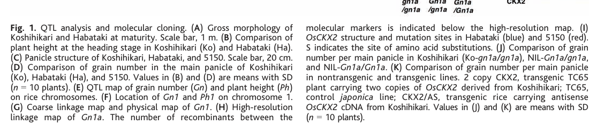

## Question

# Gene Research for Functional Annotation

## ⚠️ CRITICAL: Gene/Protein Identification Context

**BEFORE YOU BEGIN RESEARCH:** You MUST verify you are researching the CORRECT gene/protein. Gene symbols can be ambiguous, especially for less well-characterized genes from non-model organisms.

### Target Gene/Protein Identity (from UniProt):
- **UniProt Accession:** Q4ADV8
- **Protein Description:** RecName: Full=Cytokinin dehydrogenase 2 {ECO:0000305}; EC=1.5.99.12 {ECO:0000269|PubMed:15976269}; AltName: Full=Cytokinin oxidase 2 {ECO:0000303|PubMed:15976269}; Short=OsCKX2 {ECO:0000303|PubMed:15976269}; AltName: Full=QTL grain number 1a {ECO:0000303|PubMed:15976269}; Short=Gn1a {ECO:0000303|PubMed:15976269}; Flags: Precursor;
- **Gene Information:** Name=CKX2 {ECO:0000303|PubMed:15976269}; OrderedLocusNames=Os01g0197700 {ECO:0000312|EMBL:BAS70876.1}, LOC_Os01g10110 {ECO:0000305}; ORFNames=B1046G12.8 {ECO:0000312|EMBL:BAB89407.1}, OsJ_00744 {ECO:0000312|EMBL:EEE54051.1}, P0419B01.20 {ECO:0000312|EMBL:BAB56095.1};
- **Organism (full):** Oryza sativa subsp. japonica (Rice).
- **Protein Family:** Belongs to the oxygen-dependent FAD-linked oxidoreductase
- **Key Domains:** Cytok_DH_C_sf. (IPR016170); Cytokinin_DH_FAD/cytokin-bd. (IPR015345); FAD-bd_PCMH. (IPR016166); FAD-bd_PCMH-like_sf. (IPR036318); FAD-bd_PCMH_sub1. (IPR016167)

### MANDATORY VERIFICATION STEPS:

1. **Check if the gene symbol "CKX2" matches the protein description above**
2. **Verify the organism is correct:** Oryza sativa subsp. japonica (Rice).
3. **Check if protein family/domains align with what you find in literature**
4. **If you find literature for a DIFFERENT gene with the same or similar symbol, STOP**

### If Gene Symbol is Ambiguous or You Cannot Find Relevant Literature:

**DO NOT PROCEED WITH RESEARCH ON A DIFFERENT GENE.** Instead:
- State clearly: "The gene symbol 'CKX2' is ambiguous or literature is limited for this specific protein"
- Explain what you found (e.g., "Found extensive literature on a different gene with the same symbol in a different organism")
- Describe the protein based ONLY on the UniProt information provided above
- Suggest that the protein function can be inferred from domain/family information

### Research Target:

Please provide a comprehensive research report on the gene **CKX2** (gene ID: CKX2, UniProt: Q4ADV8) in ORYSJ.

The research report should be a detailed narrative explaining the function, biological processes, and localization of the gene product. Citations should be given for all claims.

You should prioritize authoritative reviews and primary scientific literature when conducting research. You can supplement
this with annotations you find in gene/protein databases, but these can be outdated or inaccurate.

We are specifically interested in the primary function of the gene - for enzymes, what reaction is catalyzed, and what is the substrate specificity? For transporters, what is the substrate? For structural proteins or adapters, what is the broader structural role? For signaling molecules, what is the role in the pathway.

We are interested in where in or outside the cell the gene product carries out its function.

We are also interested in the signaling or biochemical pathways in which the gene functions. We are less interested in broad pleiotropic effects, except where these elucidate the precise role.

Include evidence where possible. We are interested in both experimental evidence as well as inference from structure, evolution, or bioinformatic analysis. Precise studies should be prioritized over high-throughput, where available.

## Output

Question: You are an expert researcher providing comprehensive, well-cited information.

Provide detailed information focusing on:
1. Key concepts and definitions with current understanding
2. Recent developments and latest research (prioritize 2023-2024 sources)
3. Current applications and real-world implementations
4. Expert opinions and analysis from authoritative sources
5. Relevant statistics and data from recent studies

Format as a comprehensive research report with proper citations. Include URLs and publication dates where available.
Always prioritize recent, authoritative sources and provide specific citations for all major claims.

# Gene Research for Functional Annotation

## ⚠️ CRITICAL: Gene/Protein Identification Context

**BEFORE YOU BEGIN RESEARCH:** You MUST verify you are researching the CORRECT gene/protein. Gene symbols can be ambiguous, especially for less well-characterized genes from non-model organisms.

### Target Gene/Protein Identity (from UniProt):
- **UniProt Accession:** Q4ADV8
- **Protein Description:** RecName: Full=Cytokinin dehydrogenase 2 {ECO:0000305}; EC=1.5.99.12 {ECO:0000269|PubMed:15976269}; AltName: Full=Cytokinin oxidase 2 {ECO:0000303|PubMed:15976269}; Short=OsCKX2 {ECO:0000303|PubMed:15976269}; AltName: Full=QTL grain number 1a {ECO:0000303|PubMed:15976269}; Short=Gn1a {ECO:0000303|PubMed:15976269}; Flags: Precursor;
- **Gene Information:** Name=CKX2 {ECO:0000303|PubMed:15976269}; OrderedLocusNames=Os01g0197700 {ECO:0000312|EMBL:BAS70876.1}, LOC_Os01g10110 {ECO:0000305}; ORFNames=B1046G12.8 {ECO:0000312|EMBL:BAB89407.1}, OsJ_00744 {ECO:0000312|EMBL:EEE54051.1}, P0419B01.20 {ECO:0000312|EMBL:BAB56095.1};
- **Organism (full):** Oryza sativa subsp. japonica (Rice).
- **Protein Family:** Belongs to the oxygen-dependent FAD-linked oxidoreductase
- **Key Domains:** Cytok_DH_C_sf. (IPR016170); Cytokinin_DH_FAD/cytokin-bd. (IPR015345); FAD-bd_PCMH. (IPR016166); FAD-bd_PCMH-like_sf. (IPR036318); FAD-bd_PCMH_sub1. (IPR016167)

### MANDATORY VERIFICATION STEPS:

1. **Check if the gene symbol "CKX2" matches the protein description above**
2. **Verify the organism is correct:** Oryza sativa subsp. japonica (Rice).
3. **Check if protein family/domains align with what you find in literature**
4. **If you find literature for a DIFFERENT gene with the same or similar symbol, STOP**

### If Gene Symbol is Ambiguous or You Cannot Find Relevant Literature:

**DO NOT PROCEED WITH RESEARCH ON A DIFFERENT GENE.** Instead:
- State clearly: "The gene symbol 'CKX2' is ambiguous or literature is limited for this specific protein"
- Explain what you found (e.g., "Found extensive literature on a different gene with the same symbol in a different organism")
- Describe the protein based ONLY on the UniProt information provided above
- Suggest that the protein function can be inferred from domain/family information

### Research Target:

Please provide a comprehensive research report on the gene **CKX2** (gene ID: CKX2, UniProt: Q4ADV8) in ORYSJ.

The research report should be a detailed narrative explaining the function, biological processes, and localization of the gene product. Citations should be given for all claims.

You should prioritize authoritative reviews and primary scientific literature when conducting research. You can supplement
this with annotations you find in gene/protein databases, but these can be outdated or inaccurate.

We are specifically interested in the primary function of the gene - for enzymes, what reaction is catalyzed, and what is the substrate specificity? For transporters, what is the substrate? For structural proteins or adapters, what is the broader structural role? For signaling molecules, what is the role in the pathway.

We are interested in where in or outside the cell the gene product carries out its function.

We are also interested in the signaling or biochemical pathways in which the gene functions. We are less interested in broad pleiotropic effects, except where these elucidate the precise role.

Include evidence where possible. We are interested in both experimental evidence as well as inference from structure, evolution, or bioinformatic analysis. Precise studies should be prioritized over high-throughput, where available.

## Research Report: Functional Annotation of Rice **CKX2 / OsCKX2 / Gn1a** (UniProt Q4ADV8)

### Executive summary
**CKX2 (OsCKX2; Gn1a)** encodes a cytokinin oxidase/dehydrogenase that **irreversibly degrades cytokinins**, thereby controlling cytokinin homeostasis in **inflorescence meristems and developing panicles** and tuning meristem activity that ultimately determines **panicle branching and grain number** in rice. Genetic reduction or loss of OsCKX2 activity increases cytokinin accumulation in reproductive meristems and can substantially increase grain number and yield components, making OsCKX2 one of the most validated hormone-metabolism targets for rice yield improvement. (ashikari2005cytokininoxidaseregulates pages 1-2, yeh2015downregulationofcytokinin pages 1-2)

### 1) Key concepts and definitions (current understanding)

#### 1.1 Cytokinins and cytokinin homeostasis
Cytokinins are adenine-derived phytohormones that regulate plant growth and development, including meristem activity. Their steady-state levels depend on biosynthesis, interconversion among nucleobase/nucleoside/nucleotide forms, conjugation, transport, and **irreversible degradation**. Cytokinin oxidase/dehydrogenase (CKX) enzymes mediate the key irreversible catabolic step by cleaving cytokinin side chains. (werner12006newinsightsinto pages 1-2)

#### 1.2 CKX enzymes (biochemical definition)
CKX enzymes catalyze **irreversible cytokinin degradation** by cleaving the **unsaturated isoprenoid N6 side chain** of cytokinin substrates to yield adenine/adenosine plus a corresponding aldehyde side-chain product. (werner12006newinsightsinto pages 1-2, werner12006newinsightsinto pages 6-7)

At the mechanistic level, CKXs are **FAD-dependent flavoenzymes**. The cytokinin substrate reacts with oxidized FAD through a transient adduct, leading to formation of an intermediate that is hydrolyzed to adenine and an aldehyde; CKX can operate in an “oxidase” mode (using oxygen weakly) or more efficiently as a “dehydrogenase” using electron acceptors such as quinones, consistent with the dehydrogenase nomenclature. (werner12006newinsightsinto pages 6-7)

#### 1.3 Target gene verification and disambiguation
The target protein is UniProt **Q4ADV8** from *Oryza sativa* subsp. japonica (rice), annotated as **cytokinin dehydrogenase/oxidase 2** with aliases **OsCKX2** and **Gn1a**. In rice genetics, **Gn1a** is a grain-number QTL on chromosome 1 that was molecularly cloned and shown to correspond to **OsCKX2** (cytokinin oxidase/dehydrogenase). (ashikari2005cytokininoxidaseregulates pages 1-2, ashikari2005cytokininoxidaseregulates pages 2-3)

### 2) Core functional annotation of OsCKX2 (Gn1a)

#### 2.1 Gene identity, locus, and organism
High-resolution mapping and transgenic confirmation established that the rice QTL **Gn1a** corresponds to **OsCKX2**, a predicted cytokinin oxidase/dehydrogenase gene in **rice (*Oryza sativa*)**. This was shown in the context of **japonica cultivar Koshihikari** and the high-yield **indica cultivar Habataki**, among other materials. (ashikari2005cytokininoxidaseregulates pages 1-2, ashikari2005cytokininoxidaseregulates pages 2-3)

A figure set in the original cloning paper shows the **genetic mapping of Gn1a to OsCKX2** and accompanying cytokinin/OsCKX2 expression data in inflorescence meristems. (ashikari2005cytokininoxidaseregulates media 9c2fb589)

#### 2.2 Enzymatic function and reaction (OsCKX2 as cytokinin catabolic enzyme)
OsCKX2 is a CKX-family cytokinin catabolic enzyme whose reduced activity leads to accumulation of cytokinin species (including nucleotide forms such as tZRMP and iPRMP) in inflorescence meristems, consistent with decreased cytokinin degradation. OsCKX2 protein variants expressed in yeast retain cytokinin-cleaving activity, supporting that OsCKX2 encodes an active CKX enzyme. (ashikari2005cytokininoxidaseregulates pages 3-4)

Family-level enzymology indicates CKXs have highest affinity for isoprenoid cytokinins such as **isopentenyladenine (iP)** and **trans-zeatin (tZ)** (and their ribosides), often with low-micromolar Km values. (werner12006newinsightsinto pages 6-7)

**OsCKX2-specific substrate evidence available in the retrieved corpus is primarily functional (in planta) rather than kinetic/enzymatic**, but knockdown/reduced-expression OsCKX2 backgrounds are associated with elevated active cytokinin forms including tZ and iP-type cytokinins in reproductive meristems, consistent with OsCKX2 acting on those substrates. (ashikari2005cytokininoxidaseregulates pages 1-2, katerUnknownyear…cytokininmetabolism pages 17-19)

#### 2.3 Biological process and pathway context: inflorescence meristem activity → panicle architecture → grain number
OsCKX2 is a negative regulator of cytokinin levels in **inflorescence meristems/young panicles**, and thus acts as a negative regulator of meristem activity and reproductive organ production. Reduced OsCKX2 expression leads to cytokinin accumulation in inflorescence meristems and increases the number of reproductive organs, increasing grain yield. (ashikari2005cytokininoxidaseregulates pages 1-2, ashikari2005cytokininoxidaseregulates pages 3-4)

### 3) Phenotypic effects and quantitative trait data

#### 3.1 QTL effect sizes (foundational quantitative genetics)
In the molecular cloning study of Gn1a, the **Habataki** Gn1a allele was reported to be semidominant and associated with **~92 more grains per main panicle**, accounting for **44%** of the grain-number difference relative to **Koshihikari**. A natural null allele (11-bp deletion) in variety **5150** was associated with **>400 grains per main panicle**, consistent with the concept that reduced or lost OsCKX2 function enhances grain production. (ashikari2005cytokininoxidaseregulates pages 2-3)

#### 3.2 Field-tested genetic manipulation of OsCKX2 (real-world agronomic performance)
A field-evaluated shRNA knockdown strategy targeting OsCKX2 in rice demonstrated that OsCKX2 suppression increases multiple yield components. In field experiments, transgenic lines produced **27–81% more tillers** and **24–67% more grains per plant**, and showed **5–15% heavier 1000-grain weight** than wild-type plants. The authors also report that insertional activation (increased expression) of OsCKX2 reduces tiller number and growth in a gene-dosage–dependent manner. (yeh2015downregulationofcytokinin pages 1-2)

### 4) Recent developments (prioritizing 2023–2024)

#### 4.1 2023: Regulatory network controlling OsCKX2 via FZP–DST module
A 2023 study (BMC Plant Biology; publication date Dec 2023; DOI URL https://doi.org/10.1186/s12870-023-04671-4) provides mechanistic insight into how OsCKX2 is transcriptionally positioned in panicle/spikelet development.

The study shows that **FZP**, a nuclear AP2/ERF transcription factor, represses **DST** by directly binding its promoter; in a severe fzp allele, **DST and OsCKX2 are upregulated** in young panicles, and cytokinin content decreases substantially (IP ~60% lower, IPA ~25% lower, zeatin ~27% lower; DHZ unchanged). The severe fzp phenotype included a **~66% reduction in grain number per main panicle**, linking an upstream developmental regulator to OsCKX2-mediated cytokinin depletion and reduced grain number. (wang2023frizzlepanicle(fzp) pages 2-4, wang2023frizzlepanicle(fzp) pages 1-2)

In addition, the same work synthesizes a regulatory concept in which DST binds the OsCKX2 promoter and its activity can be enhanced by phosphorylation via the OsMKKK10–OsMKK4–OsMPK6 cascade; MED25 is described as a DST coactivator, situating OsCKX2 in a broader meristem-patterning signaling context. (wang2023frizzlepanicle(fzp) pages 1-2)

#### 4.2 2024: CRISPR/Cas9 Osckx2 mutants for yield traits and drought tolerance
A 2024 study (Plant Cell Reports; publication date Aug 2024; DOI URL https://doi.org/10.1007/s00299-024-03289-6) generated **OsCKX2-deficient mutants** using **CRISPR/Cas9** in indica rice (MTU1010). The study reports that Osckx2 loss-of-function increases cytokinin accumulation in panicle tissue and improves panicle architecture (including increased secondary branching), grain number, and overall yield, and additionally enhances drought-related performance (reduced transpiration, improved survival under dehydration stress, better membrane/chloroplast integrity, and improved photosynthetic function through antioxidant protection). Within the excerpted pages available here, numeric effect sizes were not provided, but the mechanistic interpretation is consistent with OsCKX2 functioning as a negative regulator of reproductive cytokinin levels and panicle sink strength. (rashid2024cytokininoxidase2deficientmutants pages 1-5, rashid2024cytokininoxidase2deficientmutants pages 5-7)

### 5) Cellular and subcellular localization
Direct subcellular localization evidence for **OsCKX2 protein** (e.g., ER lumen vs apoplast) was **not present in the retrieved full-text snippets**. However, multiple authoritative sources emphasize that CKX family proteins have diverse subcellular targeting (extracellular/apoplastic, vacuolar, cytosolic, ER-associated) and that localization differences are an important axis of CKX functional specialization. In rice-family examples, OsCKX3 is described as ER-localized (GFP fusion), while OsCKX4 was reported as cytosolic, illustrating that rice CKX paralogs are not uniformly localized. (werner12006newinsightsinto pages 2-3, katerUnknownyear…cytokininmetabolism pages 17-19)

Functionally, OsCKX2 action is repeatedly localized at the tissue level to **inflorescence meristems/young panicles**, where changes in OsCKX2 expression are coupled to changes in cytokinin levels and panicle/grain phenotypes. (ashikari2005cytokininoxidaseregulates pages 1-2, wang2023frizzlepanicle(fzp) pages 2-4)

### 6) Current applications and real-world implementations

#### 6.1 Yield improvement via natural alleles and QTL introgression
OsCKX2/Gn1a is a canonical example of a yield QTL molecularly traced to a hormone catabolic enzyme. The large effect sizes reported for the Habataki allele (e.g., +92 grains per main panicle; 44% of difference vs Koshihikari) provide a rationale for **marker-assisted introgression** and QTL pyramiding strategies that incorporate sink-size loci. (ashikari2005cytokininoxidaseregulates pages 2-3, ashikari2005cytokininoxidaseregulates pages 1-2)

#### 6.2 Transgenic suppression and field trials
The shRNA knockdown study demonstrates a path from molecular perturbation to field performance, showing that OsCKX2 suppression can increase tiller number, grains per plant, and 1000-grain weight in field conditions. (yeh2015downregulationofcytokinin pages 1-2)

#### 6.3 Genome editing (CRISPR/Cas9)
The 2024 indica-rice CRISPR/Cas9 study illustrates OsCKX2 as a target for **precision breeding** aimed at simultaneously improving sink traits (panicle branching, grain number) and climate resilience (drought tolerance traits). (rashid2024cytokininoxidase2deficientmutants pages 1-5, rashid2024cytokininoxidase2deficientmutants pages 5-7)

### 7) Expert synthesis and interpretation (authoritative analysis)

A consistent expert consensus across primary studies and mechanistic reviews is that **cytokinin degradation is a leverage point for yield manipulation** because cytokinins promote meristem activity and reproductive organ production. OsCKX2/Gn1a exemplifies this by connecting a defined enzymatic step (cytokinin side-chain cleavage) to a high-impact agronomic trait (grain number). (werner12006newinsightsinto pages 6-7, ashikari2005cytokininoxidaseregulates pages 1-2)

Mechanistically, the 2023 FZP–DST–OsCKX2 study suggests that yield effects mediated through OsCKX2 are not simply “more cytokinin is better”; rather, OsCKX2 must be tuned within a regulatory network balancing meristem fate, spikelet development, and cytokinin levels, because excessive cytokinin depletion (via upregulated OsCKX2) can reduce grain number dramatically (e.g., ~66% reduction in the severe fzp allele context). (wang2023frizzlepanicle(fzp) pages 1-2)

### 8) Evidence map (compact)
| Topic | Key points | Quantitative data | Organism/background | Supporting citation IDs |
|---|---|---|---|---|
| Identity/locus | OsCKX2 is the rice cytokinin oxidase/dehydrogenase 2 gene; the grain-number QTL **Gn1a** was molecularly cloned as **OsCKX2** on chromosome 1. Reduced-expression or null alleles increase cytokinin in inflorescence meristems and raise grain number. This matches the UniProt target CKX2/OsCKX2/Gn1a from *Oryza sativa*. | Habataki Gn1a allele increased grain number by **~92 grains per main panicle** and explained **44%** of the grain-number difference versus Koshihikari; a natural 11-bp deletion allele in 5150 was associated with **>400 grains per main panicle**. | Rice (*Oryza sativa*), especially japonica Koshihikari and indica Habataki/5150 backgrounds | (ashikari2005cytokininoxidaseregulates pages 2-3, ashikari2005cytokininoxidaseregulates pages 1-2) |
| Enzymatic function | OsCKX2 encodes a CKX-family enzyme that **irreversibly degrades cytokinins**, thereby lowering endogenous CK abundance in reproductive meristems and other tissues. Functional expression in yeast confirmed CKX catalytic activity for OsCKX2 protein variants. | Reduced OsCKX2 activity in Gn1a-associated lines caused accumulation of cytokinin nucleotides such as **tZRMP** and **iPRMP** relative to Koshihikari. | Rice Gn1a/OsCKX2 lines; yeast heterologous expression for catalytic confirmation | (ashikari2005cytokininoxidaseregulates pages 3-4, yeh2015downregulationofcytokinin pages 1-2) |
| Substrates & mechanism | Plant CKX enzymes are **FAD-dependent flavoenzymes** that cleave the unsaturated N6 isoprenoid side chain of cytokinin nucleobases/ribosides, yielding adenine/adenosine plus an aldehyde. Family-level evidence indicates preference for **isoprenoid CKs** such as **iP** and **tZ** (and their ribosides), supporting inference for OsCKX2. Rice-specific knockdown evidence indicates OsCKX2 normally restrains **tZ, 2-iP, kinetin, and DHZ** in inflorescence meristems. | CKX enzymes have **low-micromolar Km** for iP/tZ-type substrates in family-level studies; OsCKX2-RNAi/knockdown plants showed elevated **tZ, 2-iP, kinetin, DHZ** in IM tissue. | General plant CKX enzymology with rice OsCKX2 functional inference; rice inflorescence meristem knockdown lines | (werner12006newinsightsinto pages 6-7, werner12006newinsightsinto pages 1-2, katerUnknownyear…cytokininmetabolism pages 17-19, katerUnknownyear…cytokininmetabolisma pages 17-19) |
| Localization | Direct OsCKX2 localization evidence was not retrieved in the gathered texts. However, OsCKX2 has a signal peptide in UniProt and CKX family proteins localize to distinct compartments including **extracellular/apoplastic, ER-associated, vacuolar, and cytosolic** pools depending on isoform. OsCKX2 function is experimentally tied to the **inflorescence meristem/panicle tissue** where its transcript abundance affects CK levels. | No direct OsCKX2 compartment quantification retrieved; OsCKX3 localizes predominantly to **ER**, OsCKX4 is **cytosolic**, illustrating family divergence. | Rice CKX family context; OsCKX2 expression/function studied in inflorescence meristems and young panicles | (werner12006newinsightsinto pages 2-3, katerUnknownyear…cytokininmetabolism pages 17-19, ashikari2005cytokininoxidaseregulates media 9c2fb589) |
| Pathway/regulation | OsCKX2 is a core node in cytokinin-homeostasis pathways controlling inflorescence meristem activity. **DST** directly activates OsCKX2; **MED25** acts as a DST coactivator; phosphorylation by the **OsMKKK10–OsMKK4–OsMPK6** cascade promotes DST-mediated OsCKX2 expression. **FZP** represses **DST**, thereby indirectly limiting OsCKX2 and sustaining CK in young panicles. | In the severe **fzp/abp1** allele, **grain number per main panicle fell ~66%**; in fzp young panicles, CKs decreased: **IP ~60% lower**, **IPA ~25% lower**, **zeatin ~27% lower**. | Rice young panicles/inflorescence meristems; FZP-DST-OsCKX2 regulatory module | (wang2023frizzlepanicle(fzp) pages 1-2, wang2023frizzlepanicle(fzp) pages 2-4) |
| Phenotypes/yield data | Lower OsCKX2 expression increases sink strength by enhancing meristem activity, panicle branching, tillering, and grain number; overexpression/activation has the opposite effect. OsCKX2 is therefore a **negative regulator** of grain number and tiller formation through cytokinin catabolism. | shRNA suppression caused **27–81% more tillers**, **24–67% more grains per plant**, and **5–15% higher 1000-grain weight** in field tests; insertional activation reduced tiller number in a dosage-dependent manner. | Transgenic rice, including *O. sativa* cv. TNG67; greenhouse and field experiments | (yeh2015downregulationofcytokinin pages 1-2, yeh2015downregulationofcytokinin pages 8-10) |
| Recent 2023–2024 developments | 2023 work refined the upstream transcriptional network controlling OsCKX2 via **FZP→DST→OsCKX2** and linked altered OsCKX2 expression to reduced cytokinin and defective spikelet development. 2024 CRISPR work showed that **Osckx2** loss-of-function in indica rice increases panicle branching and grain yield while also improving drought-related performance. | 2023: **66% reduction** in grain number per main panicle in severe fzp background; CK decreases of **~60% IP**, **~25% IPA**, **~27% zeatin**. 2024: qualitative increases in secondary branching, grain number, and drought survival traits; provided pages did not include exact numeric effect sizes. | 2023 BMC Plant Biology study in rice panicles; 2024 CRISPR/Cas9 study in indica rice cv. MTU1010 | (wang2023frizzlepanicle(fzp) pages 2-4, wang2023frizzlepanicle(fzp) pages 1-2, rashid2024cytokininoxidase2deficientmutants pages 1-5, rashid2024cytokininoxidase2deficientmutants pages 5-7) |
| Applications | OsCKX2/Gn1a is a validated target for **yield breeding**, **QTL introgression**, **gene pyramiding**, RNAi knockdown, and **CRISPR/Cas9 editing**. Practical use cases include exploiting weak/null alleles to raise grain number and using edited alleles for high-yield, climate-resilient rice. | Gn1a introgression delivered major sink-size effects (e.g., **~92 grains/panicle**, **44%** difference component); recent CRISPR mutants increased grain number and drought tolerance qualitatively; OsCKX2 knockdown also reduced yield penalty under salinity in earlier work. | Rice breeding in japonica and indica backgrounds; near-isogenic lines, transgenics, and CRISPR-edited plants | (ashikari2005cytokininoxidaseregulates pages 2-3, rashid2024cytokininoxidase2deficientmutants pages 1-5, ashikari2005cytokininoxidaseregulates pages 1-2) |

*Table: This table compiles the main functional-annotation evidence for rice OsCKX2/Gn1a, including identity, enzymatic role, regulatory pathway, quantitative phenotypes, and 2023–2024 updates. It is useful as a compact evidence map for gene-function interpretation and breeding relevance.*

### 9) Key reference URLs and publication dates (selected)
- Ashikari et al. *Science* (Jul 2005): “Cytokinin oxidase regulates rice grain production.” https://doi.org/10.1126/science.1113373 (ashikari2005cytokininoxidaseregulates pages 1-2)
- Yeh et al. *Rice* (Dec 2015): “Down-Regulation of Cytokinin Oxidase 2 Expression Increases Tiller Number and Improves Rice Yield.” https://doi.org/10.1186/s12284-015-0070-5 (yeh2015downregulationofcytokinin pages 1-2)
- Wang et al. *BMC Plant Biology* (Dec 2023): “FRIZZLE PANICLE (FZP) regulates rice spikelets development through modulating cytokinin metabolism.” https://doi.org/10.1186/s12870-023-04671-4 (wang2023frizzlepanicle(fzp) pages 2-4)
- Rashid et al. *Plant Cell Reports* (Aug 2024): “Cytokinin oxidase2-deficient mutants improve panicle and grain architecture… and enhance drought tolerance in indica rice.” https://doi.org/10.1007/s00299-024-03289-6 (rashid2024cytokininoxidase2deficientmutants pages 1-5)
- Werner et al. *Plant Biology* (May 2006): “New insights into the biology of cytokinin degradation.” https://doi.org/10.1055/s-2006-923928 (werner12006newinsightsinto pages 6-7)

### 10) Limitations and gaps (important for functional annotation)
1. **Subcellular localization of OsCKX2**: Although UniProt indicates a precursor/signal peptide, the retrieved texts here did not provide direct experimental localization (e.g., GFP fusion for OsCKX2). Conclusions about compartment should therefore be treated as provisional, informed by family-wide patterns rather than OsCKX2-specific experiments. (katerUnknownyear…cytokininmetabolism pages 17-19, werner12006newinsightsinto pages 2-3)
2. **OsCKX2-specific kinetic parameters and substrate preference**: Mechanistic and substrate preference details are robust at the CKX-family level, but OsCKX2-specific Km/kcat data and definitive substrate ranking were not present in the extracted snippets, so claims about OsCKX2’s precise substrate hierarchy remain inferential. (werner12006newinsightsinto pages 6-7, ashikari2005cytokininoxidaseregulates pages 3-4)

References

1. (ashikari2005cytokininoxidaseregulates pages 1-2): Motoyuki Ashikari, Hitoshi Sakakibara, Shaoyang Lin, Toshio Yamamoto, Tomonori Takashi, Asuka Nishimura, Enrique R. Angeles, Qian Qian, Hidemi Kitano, and Makoto Matsuoka. Cytokinin oxidase regulates rice grain production. Science, 309:741-745, Jul 2005. URL: https://doi.org/10.1126/science.1113373, doi:10.1126/science.1113373. This article has 2477 citations and is from a highest quality peer-reviewed journal.

2. (yeh2015downregulationofcytokinin pages 1-2): Su-Ying Yeh, Hau-Wen Chen, Chun-Yeung Ng, Chu-Yin Lin, Tung-Hai Tseng, Wen-Hsiung Li, and Maurice S. B. Ku. Down-regulation of cytokinin oxidase 2 expression increases tiller number and improves rice yield. Rice, Dec 2015. URL: https://doi.org/10.1186/s12284-015-0070-5, doi:10.1186/s12284-015-0070-5. This article has 192 citations and is from a peer-reviewed journal.

3. (werner12006newinsightsinto pages 1-2): T. Werner1, I. Köllmer1, I. Bartrina1, K. Holst1, and T. Schmülling1. New insights into the biology of cytokinin degradation. Plant Biology, 8:371-381, May 2006. URL: https://doi.org/10.1055/s-2006-923928, doi:10.1055/s-2006-923928. This article has 398 citations and is from a peer-reviewed journal.

4. (werner12006newinsightsinto pages 6-7): T. Werner1, I. Köllmer1, I. Bartrina1, K. Holst1, and T. Schmülling1. New insights into the biology of cytokinin degradation. Plant Biology, 8:371-381, May 2006. URL: https://doi.org/10.1055/s-2006-923928, doi:10.1055/s-2006-923928. This article has 398 citations and is from a peer-reviewed journal.

5. (ashikari2005cytokininoxidaseregulates pages 2-3): Motoyuki Ashikari, Hitoshi Sakakibara, Shaoyang Lin, Toshio Yamamoto, Tomonori Takashi, Asuka Nishimura, Enrique R. Angeles, Qian Qian, Hidemi Kitano, and Makoto Matsuoka. Cytokinin oxidase regulates rice grain production. Science, 309:741-745, Jul 2005. URL: https://doi.org/10.1126/science.1113373, doi:10.1126/science.1113373. This article has 2477 citations and is from a highest quality peer-reviewed journal.

6. (ashikari2005cytokininoxidaseregulates media 9c2fb589): Motoyuki Ashikari, Hitoshi Sakakibara, Shaoyang Lin, Toshio Yamamoto, Tomonori Takashi, Asuka Nishimura, Enrique R. Angeles, Qian Qian, Hidemi Kitano, and Makoto Matsuoka. Cytokinin oxidase regulates rice grain production. Science, 309:741-745, Jul 2005. URL: https://doi.org/10.1126/science.1113373, doi:10.1126/science.1113373. This article has 2477 citations and is from a highest quality peer-reviewed journal.

7. (ashikari2005cytokininoxidaseregulates pages 3-4): Motoyuki Ashikari, Hitoshi Sakakibara, Shaoyang Lin, Toshio Yamamoto, Tomonori Takashi, Asuka Nishimura, Enrique R. Angeles, Qian Qian, Hidemi Kitano, and Makoto Matsuoka. Cytokinin oxidase regulates rice grain production. Science, 309:741-745, Jul 2005. URL: https://doi.org/10.1126/science.1113373, doi:10.1126/science.1113373. This article has 2477 citations and is from a highest quality peer-reviewed journal.

8. (katerUnknownyear…cytokininmetabolism pages 17-19): M KATER. … cytokinin metabolism during inflorescence meristem development to promote higher rice productivity through changes …. Unknown journal, Unknown year.

9. (wang2023frizzlepanicle(fzp) pages 2-4): W. Wang, Wenqiang Chen, Qinglong Liu, and Junmin Wang. Frizzle panicle (fzp) regulates rice spikelets development through modulating cytokinin metabolism. BMC Plant Biology, Dec 2023. URL: https://doi.org/10.1186/s12870-023-04671-4, doi:10.1186/s12870-023-04671-4. This article has 9 citations and is from a peer-reviewed journal.

10. (wang2023frizzlepanicle(fzp) pages 1-2): W. Wang, Wenqiang Chen, Qinglong Liu, and Junmin Wang. Frizzle panicle (fzp) regulates rice spikelets development through modulating cytokinin metabolism. BMC Plant Biology, Dec 2023. URL: https://doi.org/10.1186/s12870-023-04671-4, doi:10.1186/s12870-023-04671-4. This article has 9 citations and is from a peer-reviewed journal.

11. (rashid2024cytokininoxidase2deficientmutants pages 1-5): Afreen Rashid, V. Mohan M. Achary, M. Z. Abdin, Sangeetha Karippadakam, Hemangini Parmar, Varakumar Panditi, Ganesan Prakash, Pooja Bhatnagar-Mathur, and Malireddy K. Reddy. Cytokinin oxidase2-deficient mutants improve panicle and grain architecture through cytokinin accumulation and enhance drought tolerance in indica rice. Plant cell reports, 43 8:207, Aug 2024. URL: https://doi.org/10.1007/s00299-024-03289-6, doi:10.1007/s00299-024-03289-6. This article has 25 citations and is from a peer-reviewed journal.

12. (rashid2024cytokininoxidase2deficientmutants pages 5-7): Afreen Rashid, V. Mohan M. Achary, M. Z. Abdin, Sangeetha Karippadakam, Hemangini Parmar, Varakumar Panditi, Ganesan Prakash, Pooja Bhatnagar-Mathur, and Malireddy K. Reddy. Cytokinin oxidase2-deficient mutants improve panicle and grain architecture through cytokinin accumulation and enhance drought tolerance in indica rice. Plant cell reports, 43 8:207, Aug 2024. URL: https://doi.org/10.1007/s00299-024-03289-6, doi:10.1007/s00299-024-03289-6. This article has 25 citations and is from a peer-reviewed journal.

13. (werner12006newinsightsinto pages 2-3): T. Werner1, I. Köllmer1, I. Bartrina1, K. Holst1, and T. Schmülling1. New insights into the biology of cytokinin degradation. Plant Biology, 8:371-381, May 2006. URL: https://doi.org/10.1055/s-2006-923928, doi:10.1055/s-2006-923928. This article has 398 citations and is from a peer-reviewed journal.

14. (katerUnknownyear…cytokininmetabolisma pages 17-19): M KATER. … cytokinin metabolism during inflorescence meristem development to promote higher rice productivity through changes …. Unknown journal, Unknown year.

15. (yeh2015downregulationofcytokinin pages 8-10): Su-Ying Yeh, Hau-Wen Chen, Chun-Yeung Ng, Chu-Yin Lin, Tung-Hai Tseng, Wen-Hsiung Li, and Maurice S. B. Ku. Down-regulation of cytokinin oxidase 2 expression increases tiller number and improves rice yield. Rice, Dec 2015. URL: https://doi.org/10.1186/s12284-015-0070-5, doi:10.1186/s12284-015-0070-5. This article has 192 citations and is from a peer-reviewed journal.

## Artifacts

- [Edison artifact artifact-00](CKX2-deep-research-falcon_artifacts/artifact-00.md)

## Citations

1. ashikari2005cytokininoxidaseregulates pages 3-4
2. ashikari2005cytokininoxidaseregulates pages 2-3
3. yeh2015downregulationofcytokinin pages 1-2
4. ashikari2005cytokininoxidaseregulates pages 1-2
5. yeh2015downregulationofcytokinin pages 8-10
6. https://doi.org/10.1186/s12870-023-04671-4
7. https://doi.org/10.1007/s00299-024-03289-6
8. https://doi.org/10.1126/science.1113373
9. https://doi.org/10.1186/s12284-015-0070-5
10. https://doi.org/10.1055/s-2006-923928
11. https://doi.org/10.1126/science.1113373,
12. https://doi.org/10.1186/s12284-015-0070-5,
13. https://doi.org/10.1055/s-2006-923928,
14. https://doi.org/10.1186/s12870-023-04671-4,
15. https://doi.org/10.1007/s00299-024-03289-6,