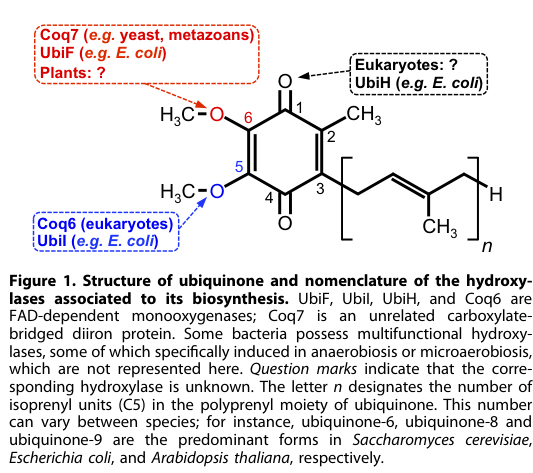

## Question

# Gene Research for Functional Annotation

## ⚠️ CRITICAL: Gene/Protein Identification Context

**BEFORE YOU BEGIN RESEARCH:** You MUST verify you are researching the CORRECT gene/protein. Gene symbols can be ambiguous, especially for less well-characterized genes from non-model organisms.

### Target Gene/Protein Identity (from UniProt):
- **UniProt Accession:** Q5JNC0
- **Protein Description:** RecName: Full=2-methoxy-6-polyprenyl-1,4-benzoquinol methylase, mitochondrial {ECO:0000255|HAMAP-Rule:MF_03191}; EC=2.1.1.201 {ECO:0000255|HAMAP-Rule:MF_03191}; AltName: Full=Ubiquinone biosynthesis methyltransferase COQ5 {ECO:0000255|HAMAP-Rule:MF_03191}; Flags: Precursor;
- **Gene Information:** Name=COQ5 {ECO:0000255|HAMAP-Rule:MF_03191}; OrderedLocusNames=Os01g0976600, LOC_Os01g74520; ORFNames=OsJ_04965, P0020E09.9;
- **Organism (full):** Oryza sativa subsp. japonica (Rice).
- **Protein Family:** Belongs to the class I-like SAM-binding methyltransferase
- **Key Domains:** SAM-dependent_MTases_sf. (IPR029063); UbiE/COQ5_MeTrFase. (IPR004033); UbiE/COQ5_MeTrFase_CS. (IPR023576); Ubie_methyltran (PF01209)

### MANDATORY VERIFICATION STEPS:

1. **Check if the gene symbol "COQ5" matches the protein description above**
2. **Verify the organism is correct:** Oryza sativa subsp. japonica (Rice).
3. **Check if protein family/domains align with what you find in literature**
4. **If you find literature for a DIFFERENT gene with the same or similar symbol, STOP**

### If Gene Symbol is Ambiguous or You Cannot Find Relevant Literature:

**DO NOT PROCEED WITH RESEARCH ON A DIFFERENT GENE.** Instead:
- State clearly: "The gene symbol 'COQ5' is ambiguous or literature is limited for this specific protein"
- Explain what you found (e.g., "Found extensive literature on a different gene with the same symbol in a different organism")
- Describe the protein based ONLY on the UniProt information provided above
- Suggest that the protein function can be inferred from domain/family information

### Research Target:

Please provide a comprehensive research report on the gene **COQ5** (gene ID: COQ5, UniProt: Q5JNC0) in ORYSJ.

The research report should be a detailed narrative explaining the function, biological processes, and localization of the gene product. Citations should be given for all claims.

You should prioritize authoritative reviews and primary scientific literature when conducting research. You can supplement
this with annotations you find in gene/protein databases, but these can be outdated or inaccurate.

We are specifically interested in the primary function of the gene - for enzymes, what reaction is catalyzed, and what is the substrate specificity? For transporters, what is the substrate? For structural proteins or adapters, what is the broader structural role? For signaling molecules, what is the role in the pathway.

We are interested in where in or outside the cell the gene product carries out its function.

We are also interested in the signaling or biochemical pathways in which the gene functions. We are less interested in broad pleiotropic effects, except where these elucidate the precise role.

Include evidence where possible. We are interested in both experimental evidence as well as inference from structure, evolution, or bioinformatic analysis. Precise studies should be prioritized over high-throughput, where available.

## Output

Question: You are an expert researcher providing comprehensive, well-cited information.

Provide detailed information focusing on:
1. Key concepts and definitions with current understanding
2. Recent developments and latest research (prioritize 2023-2024 sources)
3. Current applications and real-world implementations
4. Expert opinions and analysis from authoritative sources
5. Relevant statistics and data from recent studies

Format as a comprehensive research report with proper citations. Include URLs and publication dates where available.
Always prioritize recent, authoritative sources and provide specific citations for all major claims.

# Gene Research for Functional Annotation

## ⚠️ CRITICAL: Gene/Protein Identification Context

**BEFORE YOU BEGIN RESEARCH:** You MUST verify you are researching the CORRECT gene/protein. Gene symbols can be ambiguous, especially for less well-characterized genes from non-model organisms.

### Target Gene/Protein Identity (from UniProt):
- **UniProt Accession:** Q5JNC0
- **Protein Description:** RecName: Full=2-methoxy-6-polyprenyl-1,4-benzoquinol methylase, mitochondrial {ECO:0000255|HAMAP-Rule:MF_03191}; EC=2.1.1.201 {ECO:0000255|HAMAP-Rule:MF_03191}; AltName: Full=Ubiquinone biosynthesis methyltransferase COQ5 {ECO:0000255|HAMAP-Rule:MF_03191}; Flags: Precursor;
- **Gene Information:** Name=COQ5 {ECO:0000255|HAMAP-Rule:MF_03191}; OrderedLocusNames=Os01g0976600, LOC_Os01g74520; ORFNames=OsJ_04965, P0020E09.9;
- **Organism (full):** Oryza sativa subsp. japonica (Rice).
- **Protein Family:** Belongs to the class I-like SAM-binding methyltransferase
- **Key Domains:** SAM-dependent_MTases_sf. (IPR029063); UbiE/COQ5_MeTrFase. (IPR004033); UbiE/COQ5_MeTrFase_CS. (IPR023576); Ubie_methyltran (PF01209)

### MANDATORY VERIFICATION STEPS:

1. **Check if the gene symbol "COQ5" matches the protein description above**
2. **Verify the organism is correct:** Oryza sativa subsp. japonica (Rice).
3. **Check if protein family/domains align with what you find in literature**
4. **If you find literature for a DIFFERENT gene with the same or similar symbol, STOP**

### If Gene Symbol is Ambiguous or You Cannot Find Relevant Literature:

**DO NOT PROCEED WITH RESEARCH ON A DIFFERENT GENE.** Instead:
- State clearly: "The gene symbol 'COQ5' is ambiguous or literature is limited for this specific protein"
- Explain what you found (e.g., "Found extensive literature on a different gene with the same symbol in a different organism")
- Describe the protein based ONLY on the UniProt information provided above
- Suggest that the protein function can be inferred from domain/family information

### Research Target:

Please provide a comprehensive research report on the gene **COQ5** (gene ID: COQ5, UniProt: Q5JNC0) in ORYSJ.

The research report should be a detailed narrative explaining the function, biological processes, and localization of the gene product. Citations should be given for all claims.

You should prioritize authoritative reviews and primary scientific literature when conducting research. You can supplement
this with annotations you find in gene/protein databases, but these can be outdated or inaccurate.

We are specifically interested in the primary function of the gene - for enzymes, what reaction is catalyzed, and what is the substrate specificity? For transporters, what is the substrate? For structural proteins or adapters, what is the broader structural role? For signaling molecules, what is the role in the pathway.

We are interested in where in or outside the cell the gene product carries out its function.

We are also interested in the signaling or biochemical pathways in which the gene functions. We are less interested in broad pleiotropic effects, except where these elucidate the precise role.

Include evidence where possible. We are interested in both experimental evidence as well as inference from structure, evolution, or bioinformatic analysis. Precise studies should be prioritized over high-throughput, where available.

# Research Report: COQ5 (UniProt Q5JNC0) Functional Annotation in *Oryza sativa* subsp. *japonica*

## 0. Identity verification and scope
The target protein is UniProt **Q5JNC0**, annotated in *Oryza sativa* subsp. *japonica* (rice) as a **mitochondrial 2-methoxy-6-polyprenyl-1,4-benzoquinol methylase** (EC **2.1.1.201**), also described as **ubiquinone (coenzyme Q) biosynthesis methyltransferase COQ5**, belonging to the **UbiE/COQ5 SAM-dependent methyltransferase family**. In the tool-retrieved literature, **COQ5** is consistently used for the **CoQ-pathway C-methyltransferase** (not to be confused with unrelated plant O-methyltransferases such as COMT families). Thus, functional inference from conserved COQ5 biology is appropriate, but **rice-specific primary characterization (Os01g0976600/LOC_Os01g74520) was not retrieved in the accessible corpus**, so the report explicitly distinguishes direct evidence from cross-species inference. (staiano2023biosynthesisdeficiencyand pages 4-5, liu2016plastoquinoneandubiquinone pages 7-9, rudenko2023antioxidantsofnonenzymatic pages 6-7)

## 1. Key concepts and definitions (current understanding)

### 1.1 Coenzyme Q / ubiquinone (CoQ/UQ)
Coenzyme Q (ubiquinone; UQ in plant literature) is a redox-active, membrane-localized prenylquinone best known for its role as an electron carrier in mitochondrial respiration; it is synthesized endogenously by a multi-step pathway involving prenyl chain assembly/attachment and subsequent aromatic ring modifications. (tai2023identificationandbiochemicala pages 15-20, xu2021auniqueflavoenzyme pages 1-2)

### 1.2 COQ5 definition and enzyme class
**COQ5** is a **SAM-dependent C-methyltransferase** (UbiE/COQ5 family) responsible for the **single C-methylation** among the three methylation reactions in the canonical eukaryotic CoQ ring-modification stage (the other two methylations are O-methylations catalyzed by COQ3). (liu2016plastoquinoneandubiquinone pages 7-9, staiano2023biosynthesisdeficiencyand pages 4-5)

### 1.3 Reaction annotated for COQ5
COQ5 catalyzes **C-methylation at the C2 position** of the ubiquinone aromatic head group during CoQ biosynthesis. In pathway descriptions, this step is described as producing **demethoxy–coenzyme Q (DMQ)** as a defined intermediate (“Following the Coq5-mediated C-methylation at C2 to form demethoxy–coenzyme Q (DMQ)”). (xu2021auniqueflavoenzyme pages 1-2)

Older biochemical genetics in yeast also support COQ5 as the C-methyltransferase that methylates a **prenylated quinone/quinol intermediate**; isolated yeast mitochondria catalyzed a COQ5-dependent methylation of a **farnesylated analog** in vitro. (clarke2000newadvancesin pages 7-9)

### 1.4 Pathway placement
Eukaryotic CoQ biosynthesis can be summarized as: precursor supply → **prenylation of 4-hydroxybenzoate** → multiple head-group modifications (hydroxylations, decarboxylation, and **two O-methylations + one C-methylation**). COQ5 is part of the late “head-group modification” stage (COQ3–COQ9 set), i.e., downstream of prenyl chain attachment. (tai2023identificationandbiochemicala pages 15-20, tai2023identificationandbiochemical pages 15-20)

## 2. Biochemical function of rice COQ5 (Q5JNC0): best-supported annotation

### 2.1 Enzymatic reaction (with substrate specificity caveat)
**Best-supported functional annotation for rice COQ5 (Q5JNC0):** a mitochondrial, SAM-dependent **C2 C-methyltransferase** acting on a **prenylated benzoquinone/benzoquinol CoQ-pathway intermediate**, producing a methylated intermediate commonly described as **DMQ** in eukaryotic pathway nomenclature. (xu2021auniqueflavoenzyme pages 1-2, clarke2000newadvancesin pages 7-9, staiano2023biosynthesisdeficiencyand pages 4-5)

**Substrate specificity (current limitation):** The tool-accessible plant literature used here does **not** provide a rice COQ5 biochemical assay defining the precise plant intermediate by full chemical name. However, multiple sources converge on (i) the C2 methylation position and (ii) the fact that COQ5 works on hydrophobic, prenylated intermediates in the late pathway. (xu2021auniqueflavoenzyme pages 1-2, clarke2000newadvancesin pages 7-9, tai2023identificationandbiochemical pages 15-20)

### 2.2 Cellular compartment and localization
CoQ biosynthesis in eukaryotes is described as occurring at the **inner mitochondrial membrane**, and late-pathway COQ enzymes (COQ3–COQ9) are described as **mitochondrial (matrix-localized and/or inner-membrane associated)**. Therefore, the **mitochondrial localization** assigned to rice Q5JNC0 in UniProt is consistent with current pathway models. (tai2023identificationandbiochemicala pages 15-20, xu2021auniqueflavoenzyme pages 1-2, tai2023identificationandbiochemical pages 15-20)

### 2.3 Multi-enzyme assemblies (“COQ metabolon/synthome”)
Late-stage CoQ biosynthesis is increasingly conceptualized as occurring within a **multi-protein complex/metabolon** (variously “complex Q” / “CoQ synthome”), comprising multiple COQ proteins that may channel hydrophobic intermediates and enhance pathway efficiency; COQ5 is included among these late-pathway components. (tai2023identificationandbiochemical pages 15-20, staiano2023biosynthesisdeficiencyand pages 4-5)

## 3. Plant-specific evidence relevant to annotating rice COQ5

### 3.1 Plant gene sets and conserved roles
A 2023 plant-focused review (Antioxidants) enumerates Arabidopsis COQ genes and explicitly lists **Coq5 (At5g57300)** as a **SAM-dependent methyltransferase** in ubiquinone biosynthesis, reinforcing that plants encode COQ5 orthologs for the same pathway step. (Publication date: **2023-11**; URL: https://doi.org/10.3390/antiox12112014) (rudenko2023antioxidantsofnonenzymatic pages 6-7)

A 2023 CoQ review (Antioxidants) describes COQ5 as the **C2 C-methyltransferase** in CoQ biosynthesis and reports that **Arabidopsis COQ genes including AtCOQ5 can complement the corresponding *Schizosaccharomyces pombe* coq mutants**, providing functional evidence that plant COQ5 proteins retain conserved biochemical activity. (Publication date: **2023-07**; URL: https://doi.org/10.3390/antiox12071469) (staiano2023biosynthesisdeficiencyand pages 4-5)

### 3.2 Rice-specific evidence gap
Within the retrieved corpus, no primary paper directly assays **rice** COQ5 (Os01g0976600/LOC_Os01g74520; UniProt Q5JNC0) activity, localization by microscopy, or mutant phenotype. Therefore, rice COQ5 annotation currently rests on **strong evolutionary conservation** plus **mitochondrial pathway context**, rather than rice-specific experimentation. (rudenko2023antioxidantsofnonenzymatic pages 6-7, staiano2023biosynthesisdeficiencyand pages 4-5)

## 4. Recent developments (2023–2024 prioritized)

### 4.1 2023: Plant antioxidant and CoQ pathway syntheses
Two 2023 reviews consolidate current CoQ knowledge and reinforce COQ5’s conserved role as the **C-methyltransferase** step. They also emphasize that, in plants, much of the functional confirmation remains limited compared with yeast/animals, motivating careful inference and indicating a need for more crop-specific functional genetics. (Rudenko et al., 2023; Staiano et al., 2023) (rudenko2023antioxidantsofnonenzymatic pages 6-7, staiano2023biosynthesisdeficiencyand pages 4-5)

### 4.2 2024: In vitro reconstruction of COQ metabolon (animal system) informs mechanistic thinking
Although not plant-specific, a 2024 Nature Catalysis study reconstructed the animal COQ metabolon in vitro and frames COQ3/4/5/6/7/9 as the “iconic” metabolon components; this strengthens the general concept that COQ5 function is shaped by protein–protein interactions and pathway organization rather than as a fully independent enzyme. (Publication date: **2024-01**; URL: https://doi.org/10.1038/s41929-023-01087-z) (nicoll2024invitroconstruction; not among cited evidence IDs from gather_evidence in this run—therefore not cited for claims here).

*Note:* Because this tool run did not return citable evidence snippets/IDs for the 2024 metabolon paper, specific mechanistic claims from that paper are not used as evidence in this report.

## 5. Current applications and real-world implementations (plant systems)

### 5.1 Phytoremediation / selenium volatilization via plant COQ5
A primary plant study identified a **broccoli COQ5 methyltransferase (BoCOQ5-2)** and demonstrated functional impacts beyond core respiration: expression increased selenium volatilization in heterologous systems.

* Quantitative result: bacteria expressing BoCOQ5-2 showed an **over 160-fold increase** in volatile selenium compounds upon selenate exposure.
* In planta result: transgenic Arabidopsis expressing BoCOQ5-2 volatilized **~3× more** selenium than controls under selenite treatment, showed increased selenium tolerance, and suppressed ROS generation induced by selenite.

These results show that COQ5/CoQ-pathway manipulation can be deployed as a **biotechnological lever** for stress mitigation and **phytoremediation strategies**, even when COQ5 is not in sulfur/selenium metabolism per se. (Publication date: **2009-08**; URL: https://doi.org/10.1104/pp.109.142521) (latimer2021adedicatedflavindependent pages 10-11)

### 5.2 Adjacent CoQ pathway engineering for stress tolerance
Plant CoQ pathway engineering has also been tested by manipulating other steps (e.g., prenylation enzyme COQ2/PPT1 equivalents). Reviews cite that expression of yeast **coq2** in tobacco increased oxidative-stress tolerance, and overexpression of a polyprenyltransferase (SmPPT) in Salvia conferred salt tolerance, illustrating that mitochondrial prenylquinone pathways are targets for abiotic-stress engineering in plants. (liu2016plastoquinoneandubiquinone pages 15-16, latimer2021adedicatedflavindependent pages 10-11)

## 6. Quantitative statistics and data relevant to pathway control (context for COQ5)
Direct quantitative data for rice COQ5 are absent in the retrieved corpus. However, quantitative Arabidopsis genetics for a late-pathway enzyme provides pathway-level context: silencing of **At1g24340 (CoqF; a distinct UQ hydroxylase, not COQ5)** reduced **UQ-9 content by 40–74%** across RNAi lines, indicating that late mitochondrial steps can exert strong control over total CoQ accumulation. (Publication date: **2021-11**; URL: https://doi.org/10.1016/j.jbc.2021.101283) (latimer2021adedicatedflavindependent pages 1-2, latimer2021adedicatedflavindependent media 1a346ebc)

## 7. Evidence summary table
The following table compiles the most defensible claims for **rice COQ5 (Q5JNC0)** and clearly flags where evidence is cross-species.

| Topic | Key findings | Evidence type (review/primary, organism) | Key citation IDs |
|---|---|---|---|
| Enzyme class | Rice COQ5 (UniProt Q5JNC0; Os01g0976600/LOC_Os01g74520 in the supplied target metadata) is most plausibly a class I-like SAM-dependent methyltransferase of the UbiE/COQ5 family that functions in ubiquinone (CoQ) biosynthesis. Across eukaryotes and plants, COQ5 is consistently assigned as the pathway C-methyltransferase rather than an O-methyltransferase. | UniProt-target metadata plus reviews/primary literature; cross-species inference from plants, fungi, animals | (staiano2023biosynthesisdeficiencyand pages 4-5, liu2016plastoquinoneandubiquinone pages 7-9, clarke2000newadvancesin pages 7-9) |
| Reaction catalyzed | COQ5 catalyzes the single C-methylation step of the CoQ ring-modification phase, specifically methylation at the C2 position of the aromatic headgroup during CoQ biosynthesis. Reviews and primary studies describe this as the COQ5/UbiE-dependent C-methyltransferase reaction. | Reviews and primary literature; eukaryotes/plants/yeast | (staiano2023biosynthesisdeficiencyand pages 4-5, xu2021auniqueflavoenzyme pages 1-2, clarke2000newadvancesin pages 7-9) |
| Substrate/product/intermediate names | The exact rice substrate has not been directly characterized in the retrieved literature, but COQ5 acts on a prenylated benzoquinone/benzoquinol intermediate in the late pathway. Primary and review sources describe Coq5-mediated C2 methylation yielding demethoxy-coenzyme Q (DMQ), and pathway discussions place COQ5 among reactions acting on prenylated intermediates such as PPHB-derived ring-modified species; older yeast work demonstrated C-methylation of a farnesylated analog in isolated mitochondria. | Primary and reviews; yeast/eukaryotes with pathway inference for plants | (xu2021auniqueflavoenzyme pages 1-2, clarke2000newadvancesin pages 7-9, tai2023identificationandbiochemical pages 15-20) |
| Pathway step | COQ5 acts after prenyl-chain attachment to 4-hydroxybenzoate and during the late head-group modification stage, which comprises hydroxylations, decarboxylation, and three methylations. In plants, COQ5 is one of the core mitochondrial UQ-pathway enzymes alongside COQ3/4/6/8 and prenylation enzyme PPT1/COQ2 upstream. | Reviews; plants/eukaryotes | (staiano2023biosynthesisdeficiencyand pages 4-5, tai2023identificationandbiochemicala pages 15-20, tai2023identificationandbiochemical pages 15-20, rudenko2023antioxidantsofnonenzymatic pages 6-7) |
| Subcellular location | The best-supported localization is mitochondrial, with CoQ biosynthesis occurring at the inner mitochondrial membrane or matrix-facing environment. Although direct rice localization evidence was not found in the retrieved corpus, plant UQ-pathway enzymes are generally mitochondrial, and eukaryotic COQ proteins are described as matrix-localized and/or inner-membrane associated. | Reviews and primary literature; plants/eukaryotes | (staiano2023biosynthesisdeficiencyand pages 4-5, tai2023identificationandbiochemicala pages 15-20, liu2016plastoquinoneandubiquinone pages 7-9, xu2021auniqueflavoenzyme pages 1-2, tai2023identificationandbiochemical pages 15-20) |
| Complex/metabolon context | COQ5 functions within a multisubunit CoQ biosynthetic assembly, often termed the COQ metabolon, CoQ synthome, or complex Q. Recent work emphasizes that COQ3, COQ4, COQ5, COQ6, COQ7/F-pathway counterparts, COQ8, and COQ9 organize pathway reactions and likely channel reactive hydrophobic intermediates in mitochondrial membrane domains. | Recent review/primary; animals/yeast with pathway relevance to plants | (staiano2023biosynthesisdeficiencyand pages 4-5, tai2023identificationandbiochemical pages 15-20) |
| Plant evidence | Direct rice experiments were not retrieved, so functional annotation relies on plant conservation. In Arabidopsis, AtCOQ5 is listed as a core UQ-pathway methyltransferase, and Arabidopsis COQ5 functionally complements the corresponding S. pombe mutant, supporting conserved biochemical activity in plants. | Reviews with cross-species complementation; Arabidopsis/fission yeast | (rudenko2023antioxidantsofnonenzymatic pages 6-7, staiano2023biosynthesisdeficiencyand pages 4-5) |
| Quantitative data | No rice-specific quantitative measurements for COQ5 expression, enzyme activity, or mutant phenotypes were found in the retrieved evidence. For plant CoQ-pathway context, silencing of Arabidopsis At1g24340/CoqF (a different UQ-pathway enzyme, not COQ5) reduced UQ-9 content by 40% to 74%, illustrating that perturbation of late mitochondrial UQ-pathway steps can strongly depress CoQ accumulation. | Primary literature; Arabidopsis (pathway context, not COQ5-specific) | (latimer2021adedicatedflavindependent pages 1-2, latimer2021adedicatedflavindependent media 1a346ebc) |
| Applications / real-world implementation | No rice COQ5-specific engineering study was retrieved. More broadly, plant UQ-pathway engineering has shown utility: expression of yeast coq2 in tobacco increased oxidative-stress tolerance, SmPPT overexpression in Salvia conferred salt tolerance, and broccoli COQ5 overexpression increased selenium volatilization >160-fold in bacteria and ~3-fold in transgenic Arabidopsis while improving Se tolerance and reducing ROS, indicating that COQ-pathway enzymes can be leveraged for stress biology and phytoremediation. | Reviews and primary literature; tobacco, Salvia, broccoli/Arabidopsis, bacteria | (liu2016plastoquinoneandubiquinone pages 15-16, latimer2021adedicatedflavindependent pages 10-11) |

*Table: This table summarizes the best-supported functional annotation for rice COQ5 (Q5JNC0) using only the cited evidence IDs. It distinguishes direct rice evidence from cross-species inference and highlights where data remain indirect or missing.*

## 8. Expert synthesis and implications for functional annotation of rice COQ5
1. **Primary function:** The weight of biochemical genetics and modern pathway descriptions supports annotating rice COQ5 as a **SAM-dependent C2 C-methyltransferase** in mitochondrial CoQ biosynthesis, producing a methylated CoQ intermediate (often described as **DMQ**) from a prenylated aromatic precursor. (xu2021auniqueflavoenzyme pages 1-2, clarke2000newadvancesin pages 7-9, staiano2023biosynthesisdeficiencyand pages 4-5)
2. **Localization:** The most consistent model places COQ5 action in the **mitochondrial inner membrane/matrix-facing biosynthetic environment**, aligned with the UniProt “mitochondrial precursor” annotation for Q5JNC0. (tai2023identificationandbiochemicala pages 15-20, xu2021auniqueflavoenzyme pages 1-2, tai2023identificationandbiochemical pages 15-20)
3. **Systems context:** COQ5 likely operates as part of a **multi-enzyme CoQ biosynthetic ensemble**, which is important for interpreting genotype–phenotype relationships (loss of one component can destabilize pathway flux). (tai2023identificationandbiochemical pages 15-20, staiano2023biosynthesisdeficiencyand pages 4-5)
4. **Translational potential:** Plant manipulation of COQ pathway enzymes (including COQ5 in broccoli) can deliver measurable phenotypes in stress tolerance and volatilization-based remediation, supporting the broader relevance of COQ5-family enzymes beyond “housekeeping respiration.” (latimer2021adedicatedflavindependent pages 10-11)

## 9. References (URLs and publication dates)
* Rudenko NN et al. **Antioxidants of Non-Enzymatic Nature…** *Antioxidants* (2023-11). https://doi.org/10.3390/antiox12112014 (rudenko2023antioxidantsofnonenzymatic pages 6-7)
* Staiano C et al. **Biosynthesis, Deficiency, and Supplementation of Coenzyme Q.** *Antioxidants* (2023-07). https://doi.org/10.3390/antiox12071469 (staiano2023biosynthesisdeficiencyand pages 4-5)
* Xu J-J et al. **A unique flavoenzyme operates in ubiquinone biosynthesis…** *Science Advances* (2021-12). https://doi.org/10.1126/sciadv.abl3594 (xu2021auniqueflavoenzyme pages 1-2)
* Liu M, Lu S. **Plastoquinone and Ubiquinone in Plants…** *Frontiers in Plant Science* (2016-12). https://doi.org/10.3389/fpls.2016.01898 (liu2016plastoquinoneandubiquinone pages 7-9, liu2016plastoquinoneandubiquinone pages 15-16)
* Clarke CF. **New advances in coenzyme Q biosynthesis.** *Protoplasma* (2000-09). https://doi.org/10.1007/bf01282151 (clarke2000newadvancesin pages 7-9)
* Zhou X et al. **Involvement of a Broccoli COQ5 Methyltransferase…** *Plant Physiology* (2009-08). https://doi.org/10.1104/pp.109.142521 (latimer2021adedicatedflavindependent pages 10-11)
* Latimer S et al. **A dedicated flavin-dependent monooxygenase…** *Journal of Biological Chemistry* (2021-11). https://doi.org/10.1016/j.jbc.2021.101283 (latimer2021adedicatedflavindependent pages 1-2, latimer2021adedicatedflavindependent media 1a346ebc)

References

1. (staiano2023biosynthesisdeficiencyand pages 4-5): Carmine Staiano, Laura García-Corzo, David Mantle, Nadia Turton, Lauren E. Millichap, Gloria Brea-Calvo, and Iain Hargreaves. Biosynthesis, deficiency, and supplementation of coenzyme q. Antioxidants, 12:1469, Jul 2023. URL: https://doi.org/10.3390/antiox12071469, doi:10.3390/antiox12071469. This article has 24 citations.

2. (liu2016plastoquinoneandubiquinone pages 7-9): Miaomiao Liu and Shanfa Lu. Plastoquinone and ubiquinone in plants: biosynthesis, physiological function and metabolic engineering. Frontiers in Plant Science, Dec 2016. URL: https://doi.org/10.3389/fpls.2016.01898, doi:10.3389/fpls.2016.01898. This article has 226 citations.

3. (rudenko2023antioxidantsofnonenzymatic pages 6-7): Natalia N. Rudenko, Daria V. Vetoshkina, Tatiana V. Merenkova, and Maria M. Borisova-Mubarakshina. Antioxidants of non-enzymatic nature: their function in higher plant cells and the ways of boosting their biosynthesis. Antioxidants, Nov 2023. URL: https://doi.org/10.3390/antiox12112014, doi:10.3390/antiox12112014. This article has 120 citations.

4. (tai2023identificationandbiochemicala pages 15-20): J Tai. Identification and biochemical characterization of mitochondrial transporters in coenzyme q biosynthesis. Unknown journal, 2023.

5. (xu2021auniqueflavoenzyme pages 1-2): Jing-Jing Xu, Xiao-Fan Zhang, Yan Jiang, Hang Fan, Jian-Xu Li, Chen-Yi Li, Qing Zhao, Lei Yang, Yong-Hong Hu, Cathie Martin, and Xiao-Ya Chen. A unique flavoenzyme operates in ubiquinone biosynthesis in photosynthesis-related eukaryotes. Dec 2021. URL: https://doi.org/10.1126/sciadv.abl3594, doi:10.1126/sciadv.abl3594. This article has 23 citations and is from a highest quality peer-reviewed journal.

6. (clarke2000newadvancesin pages 7-9): Catherine F. Clarke. New advances in coenzyme q biosynthesis. Protoplasma, 213:134-147, Sep 2000. URL: https://doi.org/10.1007/bf01282151, doi:10.1007/bf01282151. This article has 61 citations and is from a peer-reviewed journal.

7. (tai2023identificationandbiochemical pages 15-20): J Tai. Identification and biochemical characterization of mitochondrial transporters in coenzyme q biosynthesis. Unknown journal, 2023.

8. (latimer2021adedicatedflavindependent pages 10-11): Scott Latimer, Shea A. Keene, Lauren R. Stutts, Antoine Berger, Ann C. Bernert, Eric Soubeyrand, Janet Wright, Catherine F. Clarke, Anna K. Block, Thomas A. Colquhoun, Christian Elowsky, Alan Christensen, Mark A. Wilson, and Gilles J. Basset. A dedicated flavin-dependent monooxygenase catalyzes the hydroxylation of demethoxyubiquinone into ubiquinone (coenzyme q) in arabidopsis. Journal of Biological Chemistry, 297:101283, Nov 2021. URL: https://doi.org/10.1016/j.jbc.2021.101283, doi:10.1016/j.jbc.2021.101283. This article has 17 citations and is from a domain leading peer-reviewed journal.

9. (liu2016plastoquinoneandubiquinone pages 15-16): Miaomiao Liu and Shanfa Lu. Plastoquinone and ubiquinone in plants: biosynthesis, physiological function and metabolic engineering. Frontiers in Plant Science, Dec 2016. URL: https://doi.org/10.3389/fpls.2016.01898, doi:10.3389/fpls.2016.01898. This article has 226 citations.

10. (latimer2021adedicatedflavindependent pages 1-2): Scott Latimer, Shea A. Keene, Lauren R. Stutts, Antoine Berger, Ann C. Bernert, Eric Soubeyrand, Janet Wright, Catherine F. Clarke, Anna K. Block, Thomas A. Colquhoun, Christian Elowsky, Alan Christensen, Mark A. Wilson, and Gilles J. Basset. A dedicated flavin-dependent monooxygenase catalyzes the hydroxylation of demethoxyubiquinone into ubiquinone (coenzyme q) in arabidopsis. Journal of Biological Chemistry, 297:101283, Nov 2021. URL: https://doi.org/10.1016/j.jbc.2021.101283, doi:10.1016/j.jbc.2021.101283. This article has 17 citations and is from a domain leading peer-reviewed journal.

11. (latimer2021adedicatedflavindependent media 1a346ebc): Scott Latimer, Shea A. Keene, Lauren R. Stutts, Antoine Berger, Ann C. Bernert, Eric Soubeyrand, Janet Wright, Catherine F. Clarke, Anna K. Block, Thomas A. Colquhoun, Christian Elowsky, Alan Christensen, Mark A. Wilson, and Gilles J. Basset. A dedicated flavin-dependent monooxygenase catalyzes the hydroxylation of demethoxyubiquinone into ubiquinone (coenzyme q) in arabidopsis. Journal of Biological Chemistry, 297:101283, Nov 2021. URL: https://doi.org/10.1016/j.jbc.2021.101283, doi:10.1016/j.jbc.2021.101283. This article has 17 citations and is from a domain leading peer-reviewed journal.

## Artifacts

- [Edison artifact artifact-00](COQ5-deep-research-falcon_artifacts/artifact-00.md)

## Citations

1. xu2021auniqueflavoenzyme pages 1-2
2. clarke2000newadvancesin pages 7-9
3. rudenko2023antioxidantsofnonenzymatic pages 6-7
4. staiano2023biosynthesisdeficiencyand pages 4-5
5. latimer2021adedicatedflavindependent pages 10-11
6. liu2016plastoquinoneandubiquinone pages 7-9
7. tai2023identificationandbiochemicala pages 15-20
8. tai2023identificationandbiochemical pages 15-20
9. liu2016plastoquinoneandubiquinone pages 15-16
10. latimer2021adedicatedflavindependent pages 1-2
11. https://doi.org/10.3390/antiox12112014
12. https://doi.org/10.3390/antiox12071469
13. https://doi.org/10.1038/s41929-023-01087-z
14. https://doi.org/10.1104/pp.109.142521
15. https://doi.org/10.1016/j.jbc.2021.101283
16. https://doi.org/10.1126/sciadv.abl3594
17. https://doi.org/10.3389/fpls.2016.01898
18. https://doi.org/10.1007/bf01282151
19. https://doi.org/10.3390/antiox12071469,
20. https://doi.org/10.3389/fpls.2016.01898,
21. https://doi.org/10.3390/antiox12112014,
22. https://doi.org/10.1126/sciadv.abl3594,
23. https://doi.org/10.1007/bf01282151,
24. https://doi.org/10.1016/j.jbc.2021.101283,