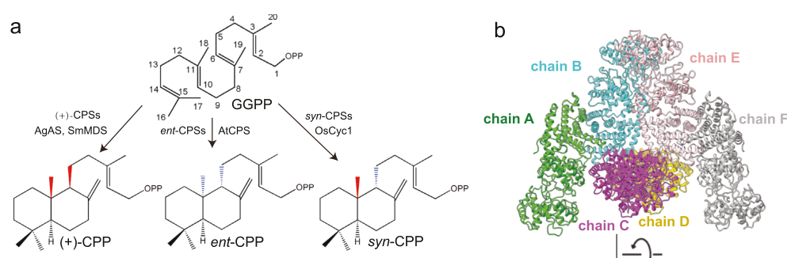

## Question

# Gene Research for Functional Annotation

## ⚠️ CRITICAL: Gene/Protein Identification Context

**BEFORE YOU BEGIN RESEARCH:** You MUST verify you are researching the CORRECT gene/protein. Gene symbols can be ambiguous, especially for less well-characterized genes from non-model organisms.

### Target Gene/Protein Identity (from UniProt):
- **UniProt Accession:** Q0JF02
- **Protein Description:** RecName: Full=Syn-copalyl diphosphate synthase, chloroplastic {ECO:0000303|PubMed:15341631}; Short=OsCPSsyn {ECO:0000303|PubMed:15255861}; Short=Syn-CPP synthase {ECO:0000303|PubMed:15255861}; EC=5.5.1.14 {ECO:0000269|PubMed:15255861, ECO:0000269|PubMed:15341631}; AltName: Full=OsCPS4 {ECO:0000303|PubMed:23621683}; AltName: Full=OsCyc1 {ECO:0000303|PubMed:15341631}; Flags: Precursor;
- **Gene Information:** Name=CPS4 {ECO:0000303|PubMed:23621683}; Synonyms=CYC1 {ECO:0000303|PubMed:15341631}; OrderedLocusNames=Os04g0178300 {ECO:0000312|EMBL:BAS87948.1}, LOC_Os04g09900 {ECO:0000305}; ORFNames=OSJNBa0096F01.12 {ECO:0000312|EMBL:CAE04103.3};
- **Organism (full):** Oryza sativa subsp. japonica (Rice).
- **Protein Family:** Belongs to the terpene synthase family. .
- **Key Domains:** Isoprenoid_synthase_dom_sf. (IPR008949); Terpene_synth_N. (IPR001906); Terpene_synth_N_sf. (IPR036965); Terpene_synthase-like. (IPR050148); Terpenoid_cyclase/PrenylTrfase. (IPR008930)

### MANDATORY VERIFICATION STEPS:

1. **Check if the gene symbol "CPS4" matches the protein description above**
2. **Verify the organism is correct:** Oryza sativa subsp. japonica (Rice).
3. **Check if protein family/domains align with what you find in literature**
4. **If you find literature for a DIFFERENT gene with the same or similar symbol, STOP**

### If Gene Symbol is Ambiguous or You Cannot Find Relevant Literature:

**DO NOT PROCEED WITH RESEARCH ON A DIFFERENT GENE.** Instead:
- State clearly: "The gene symbol 'CPS4' is ambiguous or literature is limited for this specific protein"
- Explain what you found (e.g., "Found extensive literature on a different gene with the same symbol in a different organism")
- Describe the protein based ONLY on the UniProt information provided above
- Suggest that the protein function can be inferred from domain/family information

### Research Target:

Please provide a comprehensive research report on the gene **CPS4** (gene ID: CPS4, UniProt: Q0JF02) in ORYSJ.

The research report should be a detailed narrative explaining the function, biological processes, and localization of the gene product. Citations should be given for all claims.

You should prioritize authoritative reviews and primary scientific literature when conducting research. You can supplement
this with annotations you find in gene/protein databases, but these can be outdated or inaccurate.

We are specifically interested in the primary function of the gene - for enzymes, what reaction is catalyzed, and what is the substrate specificity? For transporters, what is the substrate? For structural proteins or adapters, what is the broader structural role? For signaling molecules, what is the role in the pathway.

We are interested in where in or outside the cell the gene product carries out its function.

We are also interested in the signaling or biochemical pathways in which the gene functions. We are less interested in broad pleiotropic effects, except where these elucidate the precise role.

Include evidence where possible. We are interested in both experimental evidence as well as inference from structure, evolution, or bioinformatic analysis. Precise studies should be prioritized over high-throughput, where available.

## Output

Question: You are an expert researcher providing comprehensive, well-cited information.

Provide detailed information focusing on:
1. Key concepts and definitions with current understanding
2. Recent developments and latest research (prioritize 2023-2024 sources)
3. Current applications and real-world implementations
4. Expert opinions and analysis from authoritative sources
5. Relevant statistics and data from recent studies

Format as a comprehensive research report with proper citations. Include URLs and publication dates where available.
Always prioritize recent, authoritative sources and provide specific citations for all major claims.

# Gene Research for Functional Annotation

## ⚠️ CRITICAL: Gene/Protein Identification Context

**BEFORE YOU BEGIN RESEARCH:** You MUST verify you are researching the CORRECT gene/protein. Gene symbols can be ambiguous, especially for less well-characterized genes from non-model organisms.

### Target Gene/Protein Identity (from UniProt):
- **UniProt Accession:** Q0JF02
- **Protein Description:** RecName: Full=Syn-copalyl diphosphate synthase, chloroplastic {ECO:0000303|PubMed:15341631}; Short=OsCPSsyn {ECO:0000303|PubMed:15255861}; Short=Syn-CPP synthase {ECO:0000303|PubMed:15255861}; EC=5.5.1.14 {ECO:0000269|PubMed:15255861, ECO:0000269|PubMed:15341631}; AltName: Full=OsCPS4 {ECO:0000303|PubMed:23621683}; AltName: Full=OsCyc1 {ECO:0000303|PubMed:15341631}; Flags: Precursor;
- **Gene Information:** Name=CPS4 {ECO:0000303|PubMed:23621683}; Synonyms=CYC1 {ECO:0000303|PubMed:15341631}; OrderedLocusNames=Os04g0178300 {ECO:0000312|EMBL:BAS87948.1}, LOC_Os04g09900 {ECO:0000305}; ORFNames=OSJNBa0096F01.12 {ECO:0000312|EMBL:CAE04103.3};
- **Organism (full):** Oryza sativa subsp. japonica (Rice).
- **Protein Family:** Belongs to the terpene synthase family. .
- **Key Domains:** Isoprenoid_synthase_dom_sf. (IPR008949); Terpene_synth_N. (IPR001906); Terpene_synth_N_sf. (IPR036965); Terpene_synthase-like. (IPR050148); Terpenoid_cyclase/PrenylTrfase. (IPR008930)

### MANDATORY VERIFICATION STEPS:

1. **Check if the gene symbol "CPS4" matches the protein description above**
2. **Verify the organism is correct:** Oryza sativa subsp. japonica (Rice).
3. **Check if protein family/domains align with what you find in literature**
4. **If you find literature for a DIFFERENT gene with the same or similar symbol, STOP**

### If Gene Symbol is Ambiguous or You Cannot Find Relevant Literature:

**DO NOT PROCEED WITH RESEARCH ON A DIFFERENT GENE.** Instead:
- State clearly: "The gene symbol 'CPS4' is ambiguous or literature is limited for this specific protein"
- Explain what you found (e.g., "Found extensive literature on a different gene with the same symbol in a different organism")
- Describe the protein based ONLY on the UniProt information provided above
- Suggest that the protein function can be inferred from domain/family information

### Research Target:

Please provide a comprehensive research report on the gene **CPS4** (gene ID: CPS4, UniProt: Q0JF02) in ORYSJ.

The research report should be a detailed narrative explaining the function, biological processes, and localization of the gene product. Citations should be given for all claims.

You should prioritize authoritative reviews and primary scientific literature when conducting research. You can supplement
this with annotations you find in gene/protein databases, but these can be outdated or inaccurate.

We are specifically interested in the primary function of the gene - for enzymes, what reaction is catalyzed, and what is the substrate specificity? For transporters, what is the substrate? For structural proteins or adapters, what is the broader structural role? For signaling molecules, what is the role in the pathway.

We are interested in where in or outside the cell the gene product carries out its function.

We are also interested in the signaling or biochemical pathways in which the gene functions. We are less interested in broad pleiotropic effects, except where these elucidate the precise role.

Include evidence where possible. We are interested in both experimental evidence as well as inference from structure, evolution, or bioinformatic analysis. Precise studies should be prioritized over high-throughput, where available.

# Research Report: Functional Annotation of Rice **CPS4 / OsCPS4 / OsCyc1** (UniProt **Q0JF02**) — syn-Copalyl Diphosphate Synthase

## 1) Target verification (gene/protein identity and disambiguation)
The target protein (UniProt **Q0JF02**) corresponds to *Oryza sativa* ssp. *japonica* **CPS4**, also commonly referred to as **OsCPS4** or **OsCyc1**, encoding a **syn-copalyl diphosphate synthase** (class II diterpene cyclase) that converts **(E,E,E)-geranylgeranyl diphosphate (GGPP)** to **syn-copalyl diphosphate (syn-CPP)**. This identity is explicitly stated in the 2023 structural study of OsCyc1/OsCPS4, avoiding confusion with unrelated “CPS4” symbols in other plants (e.g., maize ZmCPS4). (ma2023structuralandfunctional pages 1-3)

## 2) Key concepts and current functional understanding

### 2.1 Enzyme class, reaction definition, and substrate/product specificity
**Copalyl diphosphate synthases (CPSs)** are **class II diterpene synthases** that initiate cyclization via protonation (often associated with a conserved **DXDD** catalytic motif) to convert the linear C20 precursor **GGPP** into bicyclic **copalyl diphosphate (CPP)** scaffolds. In plants, multiple CPP stereoisomers exist (notably **ent-CPP**, **(+)-CPP**, and **syn-CPP**), and stereochemical outcome depends on how GGPP is preorganized in the active site. (ma2023structuralandfunctional pages 1-3)

For rice, **OsCPS4/OsCyc1** is the CPS responsible for producing the **syn** stereoisomer: **GGPP → syn-CPP**. This is repeatedly described as the defining entry point to the **syn-CPP branch** of rice labdane-related diterpenoid metabolism. (lu2018inferringrolesin pages 1-4, ma2023structuralandfunctional pages 1-3)

**Pathway commitment and fates of syn-CPP.** In rice, syn-CPP is highlighted as the precursor of specific specialized diterpenoids, including **momilactone A/B** and **oryzalexin S**; in the OsCyc1 structural study these are described as the “only known metabolic fates” for syn-CPP in rice. (ma2023structuralandfunctional pages 1-3)

### 2.2 Biological roles: phytoalexin/defense vs. allelopathy and resource allocation
OsCPS4-dependent metabolites have been linked to both **plant–microbe interactions** and **allelopathy** (chemical inhibition of neighboring plants).

**Allelopathy:** Genetic analyses summarized in a rice diterpenoid allocation study indicate that products downstream of OsCPS4 (notably momilactones) can function as **allelochemicals** and can be detected in root exudates; the OsCPS4 branch is therefore frequently discussed as an allelopathic chemistry module. (lu2018inferringrolesin pages 4-7, lu2018inferringrolesin pages 9-13)

**Disease outcomes are context-dependent:** In the same work, a T-DNA OsCPS4 knockout background was reported as not necessarily more susceptible to *Magnaporthe oryzae* in some settings, while knock-down studies in other contexts suggested defensive roles—highlighting cultivar/strain background dependence. (lu2018inferringrolesin pages 4-7)

**Metabolic reallocation and bacterial blight:** Disrupting OsCPS4 can lead to **reallocation of GGPP flux** away from syn-CPP-derived diterpenoids toward **ent-CPP-derived** antimicrobial diterpenoids. Consistent with this, OsCPS4 knockout/knockdown lines showed **reduced susceptibility to *Xanthomonas oryzae* pv. *oryzae* (Xoo)** (bacterial leaf blight), interpreted as a consequence of shifting metabolic allocation. (lu2018inferringrolesin pages 4-7, lu2018inferringrolesin pages 27-31)

**Non-host resistance:** OsCPS4 was implicated in non-host disease interactions: OsCPS4 knockdown lines displayed increased susceptibility to *Magnaporthe poae* relative to parental lines in reported assays, supporting a role for syn-CPP-derived chemistry in certain non-host resistance contexts. (lu2018inferringrolesin pages 27-31)

## 3) Recent developments (prioritizing 2023–2024)

### 3.1 Structural and mechanistic advances (2023)
A major 2023 advance was detailed structural analysis of rice syn-CPS **OsCyc1/OsCPS4** using **X-ray crystallography and cryo-EM**, including a substrate-bound inactive mutant (D367A) complex with **GGPP**, enabling direct inference of substrate positioning and stereochemical control. (Published Nov 2023; https://doi.org/10.1038/s42004-023-01042-w) (ma2023structuralandfunctional pages 1-3)

**Oligomeric state and activity:** OsCyc1 forms multiple oligomeric states; **tetramers dominate in solution** but were reported as **not necessary for in vitro activity**. Quantitatively, monomeric OsCyc1 is ~**88.2 kDa** (with an OsCyc1(69–767) construct ~**80.8 kDa**), and static light scattering gave an apparent molecular weight of ~**273 kDa** (between trimer and tetramer). (ma2023structuralandfunctional pages 1-3)

**Active-site geometry and mechanistic constraints:** In the D367A structure, a measured distance of **~2.82 Å** between the mutated residue oxygen and a GGPP carbon (C19) was consistent with productive cyclization geometry, and multiple residues were mapped close to substrate/reactive carbons, supporting a structural basis for syn-stereochemical outcome. (ma2023structuralandfunctional pages 7-8)

**Protein engineering for altered stereochemical outcomes:** Rational mutagenesis was reported to yield an OsCyc1 mutant capable of generating **ent-CPP in addition to syn-CPP**, providing a route to engineer CPS stereoselectivity (a key enabling step for designing diterpenoid scaffolds with desired chirality). (ma2023structuralandfunctional pages 1-3)

### 3.2 Genomic/evolutionary context (2024 preprint)
A 2024 comparative genomics preprint analyzed the **momilactone biosynthetic gene cluster (MBGC)** across *Oryza*, emphasizing that **CPS4** is co-localized (chromosome 4) with genes required for momilactone biosynthesis and that MBGC architecture shows lineage-specific rearrangements and occasional loss. (Posted 2024; https://doi.org/10.1101/2024.01.11.572147) (priegocubero2024evolutionanddiversification pages 1-4)

## 4) Pathway integration and downstream steps (biochemical pathway context)

### 4.1 Placement of OsCPS4 in the momilactone/orzyalexin module
OsCPS4 is the entry enzyme generating **syn-CPP**, a shared intermediate for syn-CPP-derived diterpenoids. (lu2018inferringrolesin pages 1-4, ma2023structuralandfunctional pages 1-3)

Downstream, the 2024 MBGC study frames **KSL4** activity as a key next step: syn-CPP is converted by **KSL4** to a hydrocarbon scaffold (syn-pimaradiene-related), described as the first dedicated step toward momilactone production; the study also reports **in vitro syn-CDP conversion assays** for KSL4 orthologs and identifies product identity by GC-MS retention time matching. (priegocubero2024evolutionanddiversification pages 12-15)

### 4.2 Specialized metabolism “modules” and flux partitioning
In rice, specialized diterpenoid metabolism draws on GGPP pools that can be partitioned between stereoisomeric CPP branches (ent vs syn). The allocation study explicitly describes genetic manipulation of CPS genes causing reallocation of GGPP between branches and reports a **complete loss of all syn-CPP-derived diterpenes** in an OsCPS4 knockout background. (lu2018inferringrolesin pages 9-13)

## 5) Subcellular localization and cellular context
UniProt annotates Q0JF02 as a **chloroplastic precursor** (chloroplast-targeted). However, within the **retrieved primary literature evidence set**, explicit experimental confirmation of chloroplast/plastid localization for OsCPS4 (e.g., fluorescent tagging or organellar fractionation for this specific protein) was **not found**; therefore, localization should be treated here as **database-supported** and **biochemically plausible** (GGPP-based diterpenoid biosynthesis is commonly plastid-associated) rather than directly demonstrated by the cited articles in this report. (ma2023structuralandfunctional pages 1-3)

## 6) Current applications and real-world implementations

### 6.1 Crop protection concepts: metabolic rebalancing
OsCPS4 perturbation provides a practical handle on flux reallocation between syn- and ent-CPP branches. In rice, OsCPS4 knockout/knockdown lines showed **reduced susceptibility to Xoo** in reported experiments, supporting an application concept where genetic manipulation of diterpenoid branchpoints can alter disease outcomes (though with trade-offs and context dependence). (lu2018inferringrolesin pages 4-7, lu2018inferringrolesin pages 27-31)

### 6.2 Metabolic engineering and synthetic biology of diterpenoids
OsCPS4 has been used as a **syn-CPP supply module** in heterologous systems to characterize downstream enzymes and to produce diterpene scaffolds for structure elucidation. For example, a bacterial co-expression system incorporating OsCPS4 was used to generate syn-CPP for downstream KSL enzyme product determination, and a reported 1-L scale fermentation yielded **~5 mg** of a diterpene product after extraction and purification—illustrating feasibility for preparative production for analytical characterization. (morrone2011evidentandlatent pages 2-4)

### 6.3 Enzyme design for stereochemical diversification
The 2023 structural study demonstrates that OsCPS4 can be **rationally redesigned** to alter product profiles (e.g., generating ent-CPP in addition to syn-CPP), positioning OsCPS4 as a scaffold for designing CPS enzymes that deliver targeted stereochemistry—an enabling capability for manufacturing specific diterpenoid backbones. (ma2023structuralandfunctional pages 1-3, ma2023structuralandfunctional pages 7-8)

## 7) Quantitative data and statistics (from cited studies)

1. **Structural/biophysical quantitation (OsCPS4/OsCyc1):** monomer ~**88.2 kDa**, OsCyc1(69–767) ~**80.8 kDa**, apparent solution mass ~**273 kDa**; tetramers dominant but not required for in vitro activity. (ma2023structuralandfunctional pages 1-3)
2. **Structural geometry:** measured **~2.82 Å** distance in substrate-bound mutant structure, supporting catalytic geometry for cyclization. (ma2023structuralandfunctional pages 7-8)
3. **Non-host resistance sample sizes and significance:** OsCPS4 knockout infection experiments included **17 < n < 46** plants for different *Magnaporthe* species/strains; OsCPS4 RNAi lines included **33 < n < 43**, with reported differences reaching **p < 0.05** and **p < 0.005** in some comparisons (χ² test). (lu2018inferringrolesin pages 27-31)
4. **Metabolic engineering yield:** ~**5 mg** diterpene product from a **1-L** heterologous culture used for structural work. (morrone2011evidentandlatent pages 2-4)

## 8) Expert synthesis and interpretation (evidence-weighted)
Collectively, the evidence supports OsCPS4/OsCyc1 as a **specialized metabolism gatekeeper enzyme** that defines the **syn-CPP branch** in rice, feeding formation of **momilactones** and **oryzalexin S** (with strong biochemical pathway consensus) rather than functioning as a general diterpenoid enzyme for primary metabolism. (ma2023structuralandfunctional pages 1-3, lu2018inferringrolesin pages 1-4, lu2018inferringrolesin pages 4-7)

The strongest recent (2023) mechanistic advance is the high-resolution structural framework enabling explanation and redesign of stereochemical outcome and oligomerization properties, shifting OsCPS4 from a functionally annotated enzyme to a **structure-guided engineering target**. (ma2023structuralandfunctional pages 1-3, ma2023structuralandfunctional pages 7-8)

At the organismal level, OsCPS4-associated phenotypes are best interpreted through **resource allocation** across competing diterpenoid defense modules: in some disease contexts, reducing syn-CPP flux can correlate with increased bacterial blight resistance, consistent with rebalancing toward ent-CPP-derived antibacterial diterpenoids, but the role of syn-CPP-derived diterpenoids appears more prominent in allelopathy and certain non-host interactions than in canonical rice blast resistance across all backgrounds. (lu2018inferringrolesin pages 4-7, lu2018inferringrolesin pages 27-31)

## 9) Evidence map (summary table)
| Aspect | Summary | Key source(s) with year and DOI/URL | Evidence citation |
|---|---|---|---|
| Verified identity | **OsCPS4/OsCyc1** in *Oryza sativa* ssp. *japonica* corresponds to **syn-copalyl diphosphate synthase** (UniProt Q0JF02), a class II diterpene cyclase/CPS in the terpene synthase family; it is distinct from unrelated “CPS4” genes in other species. | Ma et al., 2023, *Communications Chemistry*, DOI: 10.1038/s42004-023-01042-w, https://doi.org/10.1038/s42004-023-01042-w | (ma2023structuralandfunctional pages 1-3) |
| Reaction catalyzed | OsCPS4 catalyzes conversion of **(E,E,E)-geranylgeranyl diphosphate (GGPP)** to **syn-copalyl diphosphate (syn-CPP/syn-CDP)**, the syn stereoisomeric CPP branch point intermediate in rice diterpenoid metabolism. | Ma et al., 2023, DOI: 10.1038/s42004-023-01042-w, https://doi.org/10.1038/s42004-023-01042-w; Lu et al., 2018, *Plant Cell*, DOI: 10.1105/tpc.18.00205, https://doi.org/10.1105/tpc.18.00205 | (ma2023structuralandfunctional pages 1-3, lu2018inferringrolesin pages 1-4) |
| Pathway context | syn-CPP made by OsCPS4 feeds the **syn-CPP branch** leading to **momilactones A/B** and **oryzalexin S**; these are the best-established metabolic fates of syn-CPP in rice and are linked to phytoalexin and allelopathic functions. | Ma et al., 2023, DOI: 10.1038/s42004-023-01042-w, https://doi.org/10.1038/s42004-023-01042-w; Lu et al., 2018, DOI: 10.1105/tpc.18.00205, https://doi.org/10.1105/tpc.18.00205 | (ma2023structuralandfunctional pages 1-3, lu2018inferringrolesin pages 4-7) |
| Genomic context | **CPS4** is part of the rice **momilactone biosynthetic gene cluster (MBGC)** on chromosome 4, together with **KSL4, CYP99A2, CYP99A3, MAS1/2**-related functions that elaborate syn-CPP toward momilactones. | Priego-Cubero et al., 2024, *bioRxiv*, DOI: 10.1101/2024.01.11.572147, https://doi.org/10.1101/2024.01.11.572147 | (priegocubero2024evolutionanddiversification pages 1-4) |
| Downstream step | After OsCPS4 forms syn-CPP, **OsKSL4** performs the first dedicated cyclization toward momilactone biosynthesis, producing the hydrocarbon scaffold used for later oxidation steps. | Priego-Cubero et al., 2024, DOI: 10.1101/2024.01.11.572147, https://doi.org/10.1101/2024.01.11.572147 | (priegocubero2024evolutionanddiversification pages 1-4, priegocubero2024evolutionanddiversification pages 12-15) |
| Structural evidence | 2023 work delivered the first detailed **X-ray/cryo-EM structural analysis** of rice syn-CPS OsCyc1/OsCPS4, including substrate-bound mutant structures and active-site geometry explaining stereochemical control. | Ma et al., 2023, DOI: 10.1038/s42004-023-01042-w, https://doi.org/10.1038/s42004-023-01042-w | (ma2023structuralandfunctional pages 1-3, ma2023structuralandfunctional pages 7-8) |
| Quantitative structural findings | OsCyc1 forms multiple oligomeric states; **tetramers dominate in solution** and are **not required for in vitro activity**. Reported masses include monomer **~88.2 kDa**, truncated construct **~80.8 kDa**, and apparent solution mass **~273 kDa** by static light scattering. | Ma et al., 2023, DOI: 10.1038/s42004-023-01042-w, https://doi.org/10.1038/s42004-023-01042-w | (ma2023structuralandfunctional pages 1-3) |
| Mechanistic details | Structural analysis identified active-pocket residues near GGPP and measured distances consistent with cyclization (e.g., **2.82 Å** from D367A O to GGPP C19; residues such as H251, C310, I311 near substrate) supporting a mechanistic basis for syn-CPP formation. | Ma et al., 2023, DOI: 10.1038/s42004-023-01042-w, https://doi.org/10.1038/s42004-023-01042-w | (ma2023structuralandfunctional pages 7-8) |
| Genetics and phenotype | **Os-cps4** knockout/knockdown causes **loss of syn-CPP-derived diterpenes** and alters disease interactions: no strong role against rice blast in some backgrounds, but **reduced susceptibility to Xoo** and a role in **non-host resistance to *Magnaporthe poae***. | Lu et al., 2018, DOI: 10.1105/tpc.18.00205, https://doi.org/10.1105/tpc.18.00205 | (lu2018inferringrolesin pages 9-13, lu2018inferringrolesin pages 27-31, lu2018inferringrolesin pages 4-7) |
| Quantitative genetics data | In non-host resistance assays, **17 < n < 46** plants were evaluated across *Magnaporthe* species/strains for **Os-cps4ko**, and **33 < n < 43** for **Os-cps4i** lines; susceptibility differences reached **p < 0.05** or **p < 0.005** in some comparisons. | Lu et al., 2018, DOI: 10.1105/tpc.18.00205, https://doi.org/10.1105/tpc.18.00205 | (lu2018inferringrolesin pages 27-31) |
| Metabolic engineering utility | OsCPS4 has been used in **heterologous co-expression systems** to supply syn-CPP for downstream rice KSL functional studies; a 1-L engineered culture yielded **~5 mg** diterpene product in one scale-up example. | Morrone et al., 2011, *Biochemical Journal*, DOI: 10.1042/BJ20101429, https://doi.org/10.1042/BJ20101429 | (morrone2011evidentandlatent pages 2-4) |
| Major 2023–2024 developments | Recent advances include: **(1)** first structural/mechanistic dissection of OsCPS4 stereocontrol and oligomerization (2023); **(2)** demonstration that rational mutagenesis can expand product outcome to include **ent-CPP** in addition to syn-CPP (2023); **(3)** 2024 comparative genomics placing **CPS4** within an evolutionarily dynamic **MBGC** across *Oryza*. | Ma et al., 2023, DOI: 10.1038/s42004-023-01042-w, https://doi.org/10.1038/s42004-023-01042-w; Priego-Cubero et al., 2024, DOI: 10.1101/2024.01.11.572147, https://doi.org/10.1101/2024.01.11.572147 | (ma2023structuralandfunctional pages 1-3, ma2023structuralandfunctional pages 7-8, priegocubero2024evolutionanddiversification pages 1-4) |
| Localization note | Direct experimental localization evidence was **not retrieved in the available source set**; however, OsCPS4 is annotated by UniProt as a **chloroplastic precursor**, consistent with plastidial GGPP-based diterpenoid biosynthesis, but this should be treated here as database-supported rather than primary-literature-verified from the retrieved texts. | UniProt Q0JF02 (database context supplied by user); no direct primary-paper localization evidence retrieved in available contexts | (ma2023structuralandfunctional pages 1-3) |

*Table: This table summarizes the verified identity, enzymatic function, pathway role, genomic context, evidence types, and recent 2023-2024 advances for rice OsCPS4/OsCyc1. It is useful as a compact evidence map for functional annotation of UniProt Q0JF02.*

## 10) Key visual evidence (figures)
A reaction overview (GGPP → syn-CPP) and OsCyc1 structural context are shown in the 2023 study figures retrieved here. (ma2023structuralandfunctional media bb1ceac0, ma2023structuralandfunctional media 9cad1024)

## 11) References (with dates and URLs)
- Ma X. et al. **“Structural and functional investigations of syn-copalyl diphosphate synthase from *Oryza sativa*.”** *Communications Chemistry* (Nov **2023**). https://doi.org/10.1038/s42004-023-01042-w (ma2023structuralandfunctional pages 1-3)
- Priego-Cubero S. et al. **“Evolution and diversification of the momilactone biosynthetic gene cluster in the genus *Oryza*.”** *bioRxiv* (posted **2024**; preprint). https://doi.org/10.1101/2024.01.11.572147 (priegocubero2024evolutionanddiversification pages 1-4)
- Lu X. et al. **“Inferring Roles in Defense from Metabolic Allocation of Rice Diterpenoids.”** *The Plant Cell* (Apr **2018**). https://doi.org/10.1105/tpc.18.00205 (lu2018inferringrolesin pages 4-7)
- Morrone D. et al. **“Evident and latent plasticity across the rice diterpene synthase family…”** *Biochemical Journal* (May **2011**). https://doi.org/10.1042/bj20101429 (morrone2011evidentandlatent pages 2-4)

References

1. (ma2023structuralandfunctional pages 1-3): Xiaoli Ma, Haifeng Xu, Yu-ru Tong, Yunfeng Luo, Qinghua Dong, and Tao Jiang. Structural and functional investigations of syn-copalyl diphosphate synthase from oryza sativa. Communications Chemistry, Nov 2023. URL: https://doi.org/10.1038/s42004-023-01042-w, doi:10.1038/s42004-023-01042-w. This article has 4 citations and is from a peer-reviewed journal.

2. (lu2018inferringrolesin pages 1-4): Xuan Lu, Juan Zhang, Benjamin Brown, Riqing Li, Julio Rodríguez-Romero, Aileen Berasategui, Bo Liu, Meimei Xu, Dangping Luo, Zhiqiang Pan, Scott R. Baerson, Jonathan Gershenzon, Zhaohu Li, Ane Sesma, Bing Yang, and Reuben J. Peters. Inferring roles in defense from metabolic allocation of rice diterpenoids[open]. Plant Cell, 30:1119-1131, Apr 2018. URL: https://doi.org/10.1105/tpc.18.00205, doi:10.1105/tpc.18.00205. This article has 95 citations and is from a highest quality peer-reviewed journal.

3. (lu2018inferringrolesin pages 4-7): Xuan Lu, Juan Zhang, Benjamin Brown, Riqing Li, Julio Rodríguez-Romero, Aileen Berasategui, Bo Liu, Meimei Xu, Dangping Luo, Zhiqiang Pan, Scott R. Baerson, Jonathan Gershenzon, Zhaohu Li, Ane Sesma, Bing Yang, and Reuben J. Peters. Inferring roles in defense from metabolic allocation of rice diterpenoids[open]. Plant Cell, 30:1119-1131, Apr 2018. URL: https://doi.org/10.1105/tpc.18.00205, doi:10.1105/tpc.18.00205. This article has 95 citations and is from a highest quality peer-reviewed journal.

4. (lu2018inferringrolesin pages 9-13): Xuan Lu, Juan Zhang, Benjamin Brown, Riqing Li, Julio Rodríguez-Romero, Aileen Berasategui, Bo Liu, Meimei Xu, Dangping Luo, Zhiqiang Pan, Scott R. Baerson, Jonathan Gershenzon, Zhaohu Li, Ane Sesma, Bing Yang, and Reuben J. Peters. Inferring roles in defense from metabolic allocation of rice diterpenoids[open]. Plant Cell, 30:1119-1131, Apr 2018. URL: https://doi.org/10.1105/tpc.18.00205, doi:10.1105/tpc.18.00205. This article has 95 citations and is from a highest quality peer-reviewed journal.

5. (lu2018inferringrolesin pages 27-31): Xuan Lu, Juan Zhang, Benjamin Brown, Riqing Li, Julio Rodríguez-Romero, Aileen Berasategui, Bo Liu, Meimei Xu, Dangping Luo, Zhiqiang Pan, Scott R. Baerson, Jonathan Gershenzon, Zhaohu Li, Ane Sesma, Bing Yang, and Reuben J. Peters. Inferring roles in defense from metabolic allocation of rice diterpenoids[open]. Plant Cell, 30:1119-1131, Apr 2018. URL: https://doi.org/10.1105/tpc.18.00205, doi:10.1105/tpc.18.00205. This article has 95 citations and is from a highest quality peer-reviewed journal.

6. (ma2023structuralandfunctional pages 7-8): Xiaoli Ma, Haifeng Xu, Yu-ru Tong, Yunfeng Luo, Qinghua Dong, and Tao Jiang. Structural and functional investigations of syn-copalyl diphosphate synthase from oryza sativa. Communications Chemistry, Nov 2023. URL: https://doi.org/10.1038/s42004-023-01042-w, doi:10.1038/s42004-023-01042-w. This article has 4 citations and is from a peer-reviewed journal.

7. (priegocubero2024evolutionanddiversification pages 1-4): Santiago Priego-Cubero, Tomonobu Toyomasu, Michael Gigl, Youming Liu, Yuto Hasegawa, Hideaki Nojiri, Corinna Dawid, Kazunori Okada, and Claude Becker. Evolution and diversification of the momilactone biosynthetic gene cluster in the genus oryza. bioRxiv, Jul 2024. URL: https://doi.org/10.1101/2024.01.11.572147, doi:10.1101/2024.01.11.572147. This article has 1 citations.

8. (priegocubero2024evolutionanddiversification pages 12-15): Santiago Priego-Cubero, Tomonobu Toyomasu, Michael Gigl, Youming Liu, Yuto Hasegawa, Hideaki Nojiri, Corinna Dawid, Kazunori Okada, and Claude Becker. Evolution and diversification of the momilactone biosynthetic gene cluster in the genus oryza. bioRxiv, Jul 2024. URL: https://doi.org/10.1101/2024.01.11.572147, doi:10.1101/2024.01.11.572147. This article has 1 citations.

9. (morrone2011evidentandlatent pages 2-4): Dana Morrone, Matthew L. Hillwig, Matthew E. Mead, Luke Lowry, D. Bruce Fulton, and Reuben J. Peters. Evident and latent plasticity across the rice diterpene synthase family with potential implications for the evolution of diterpenoid metabolism in the cereals. The Biochemical journal, 435 3:589-95, May 2011. URL: https://doi.org/10.1042/bj20101429, doi:10.1042/bj20101429. This article has 68 citations.

10. (ma2023structuralandfunctional media bb1ceac0): Xiaoli Ma, Haifeng Xu, Yu-ru Tong, Yunfeng Luo, Qinghua Dong, and Tao Jiang. Structural and functional investigations of syn-copalyl diphosphate synthase from oryza sativa. Communications Chemistry, Nov 2023. URL: https://doi.org/10.1038/s42004-023-01042-w, doi:10.1038/s42004-023-01042-w. This article has 4 citations and is from a peer-reviewed journal.

11. (ma2023structuralandfunctional media 9cad1024): Xiaoli Ma, Haifeng Xu, Yu-ru Tong, Yunfeng Luo, Qinghua Dong, and Tao Jiang. Structural and functional investigations of syn-copalyl diphosphate synthase from oryza sativa. Communications Chemistry, Nov 2023. URL: https://doi.org/10.1038/s42004-023-01042-w, doi:10.1038/s42004-023-01042-w. This article has 4 citations and is from a peer-reviewed journal.

## Artifacts

- [Edison artifact artifact-00](CPS4-deep-research-falcon_artifacts/artifact-00.md)

## Citations

1. ma2023structuralandfunctional pages 1-3
2. lu2018inferringrolesin pages 4-7
3. lu2018inferringrolesin pages 27-31
4. ma2023structuralandfunctional pages 7-8
5. priegocubero2024evolutionanddiversification pages 1-4
6. priegocubero2024evolutionanddiversification pages 12-15
7. lu2018inferringrolesin pages 9-13
8. morrone2011evidentandlatent pages 2-4
9. lu2018inferringrolesin pages 1-4
10. open
11. https://doi.org/10.1038/s42004-023-01042-w
12. https://doi.org/10.1101/2024.01.11.572147
13. https://doi.org/10.1038/s42004-023-01042-w;
14. https://doi.org/10.1105/tpc.18.00205
15. https://doi.org/10.1042/BJ20101429
16. https://doi.org/10.1042/bj20101429
17. https://doi.org/10.1038/s42004-023-01042-w,
18. https://doi.org/10.1105/tpc.18.00205,
19. https://doi.org/10.1101/2024.01.11.572147,
20. https://doi.org/10.1042/bj20101429,