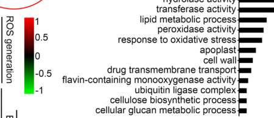

## Question

# Gene Research for Functional Annotation

## ⚠️ CRITICAL: Gene/Protein Identification Context

**BEFORE YOU BEGIN RESEARCH:** You MUST verify you are researching the CORRECT gene/protein. Gene symbols can be ambiguous, especially for less well-characterized genes from non-model organisms.

### Target Gene/Protein Identity (from UniProt):
- **UniProt Accession:** Q8W3L9
- **Protein Description:** RecName: Full=Protein ETHYLENE-INSENSITIVE 3-like 2 {ECO:0000303|PubMed:19798512}; Short=EIN3-like protein 2 {ECO:0000303|PubMed:19798512}; Short=OsEIL2 {ECO:0000303|PubMed:19798512};
- **Gene Information:** Name=EIL2 {ECO:0000303|PubMed:19798512}; OrderedLocusNames=Os07g0685700 {ECO:0000312|EMBL:BAF22592.1}, LOC_Os07g48630 {ECO:0000305}; ORFNames=OJ1200_C08.104 {ECO:0000312|EMBL:BAC10338.1}, OsJ_25629 {ECO:0000312|EMBL:EEE67841.1};
- **Organism (full):** Oryza sativa subsp. japonica (Rice).
- **Protein Family:** Belongs to the EIN3 family. .
- **Key Domains:** EIN3. (IPR006957); EIN3-like_DNA-bd. (IPR047091); Ethylene_insens-like_DNA-bd. (IPR023278); EIN3_DNA-bd (PF04873)

### MANDATORY VERIFICATION STEPS:

1. **Check if the gene symbol "EIL2" matches the protein description above**
2. **Verify the organism is correct:** Oryza sativa subsp. japonica (Rice).
3. **Check if protein family/domains align with what you find in literature**
4. **If you find literature for a DIFFERENT gene with the same or similar symbol, STOP**

### If Gene Symbol is Ambiguous or You Cannot Find Relevant Literature:

**DO NOT PROCEED WITH RESEARCH ON A DIFFERENT GENE.** Instead:
- State clearly: "The gene symbol 'EIL2' is ambiguous or literature is limited for this specific protein"
- Explain what you found (e.g., "Found extensive literature on a different gene with the same symbol in a different organism")
- Describe the protein based ONLY on the UniProt information provided above
- Suggest that the protein function can be inferred from domain/family information

### Research Target:

Please provide a comprehensive research report on the gene **EIL2** (gene ID: EIL2, UniProt: Q8W3L9) in ORYSJ.

The research report should be a detailed narrative explaining the function, biological processes, and localization of the gene product. Citations should be given for all claims.

You should prioritize authoritative reviews and primary scientific literature when conducting research. You can supplement
this with annotations you find in gene/protein databases, but these can be outdated or inaccurate.

We are specifically interested in the primary function of the gene - for enzymes, what reaction is catalyzed, and what is the substrate specificity? For transporters, what is the substrate? For structural proteins or adapters, what is the broader structural role? For signaling molecules, what is the role in the pathway.

We are interested in where in or outside the cell the gene product carries out its function.

We are also interested in the signaling or biochemical pathways in which the gene functions. We are less interested in broad pleiotropic effects, except where these elucidate the precise role.

Include evidence where possible. We are interested in both experimental evidence as well as inference from structure, evolution, or bioinformatic analysis. Precise studies should be prioritized over high-throughput, where available.

## Output

Question: You are an expert researcher providing comprehensive, well-cited information.

Provide detailed information focusing on:
1. Key concepts and definitions with current understanding
2. Recent developments and latest research (prioritize 2023-2024 sources)
3. Current applications and real-world implementations
4. Expert opinions and analysis from authoritative sources
5. Relevant statistics and data from recent studies

Format as a comprehensive research report with proper citations. Include URLs and publication dates where available.
Always prioritize recent, authoritative sources and provide specific citations for all major claims.

# Gene Research for Functional Annotation

## ⚠️ CRITICAL: Gene/Protein Identification Context

**BEFORE YOU BEGIN RESEARCH:** You MUST verify you are researching the CORRECT gene/protein. Gene symbols can be ambiguous, especially for less well-characterized genes from non-model organisms.

### Target Gene/Protein Identity (from UniProt):
- **UniProt Accession:** Q8W3L9
- **Protein Description:** RecName: Full=Protein ETHYLENE-INSENSITIVE 3-like 2 {ECO:0000303|PubMed:19798512}; Short=EIN3-like protein 2 {ECO:0000303|PubMed:19798512}; Short=OsEIL2 {ECO:0000303|PubMed:19798512};
- **Gene Information:** Name=EIL2 {ECO:0000303|PubMed:19798512}; OrderedLocusNames=Os07g0685700 {ECO:0000312|EMBL:BAF22592.1}, LOC_Os07g48630 {ECO:0000305}; ORFNames=OJ1200_C08.104 {ECO:0000312|EMBL:BAC10338.1}, OsJ_25629 {ECO:0000312|EMBL:EEE67841.1};
- **Organism (full):** Oryza sativa subsp. japonica (Rice).
- **Protein Family:** Belongs to the EIN3 family. .
- **Key Domains:** EIN3. (IPR006957); EIN3-like_DNA-bd. (IPR047091); Ethylene_insens-like_DNA-bd. (IPR023278); EIN3_DNA-bd (PF04873)

### MANDATORY VERIFICATION STEPS:

1. **Check if the gene symbol "EIL2" matches the protein description above**
2. **Verify the organism is correct:** Oryza sativa subsp. japonica (Rice).
3. **Check if protein family/domains align with what you find in literature**
4. **If you find literature for a DIFFERENT gene with the same or similar symbol, STOP**

### If Gene Symbol is Ambiguous or You Cannot Find Relevant Literature:

**DO NOT PROCEED WITH RESEARCH ON A DIFFERENT GENE.** Instead:
- State clearly: "The gene symbol 'EIL2' is ambiguous or literature is limited for this specific protein"
- Explain what you found (e.g., "Found extensive literature on a different gene with the same symbol in a different organism")
- Describe the protein based ONLY on the UniProt information provided above
- Suggest that the protein function can be inferred from domain/family information

### Research Target:

Please provide a comprehensive research report on the gene **EIL2** (gene ID: EIL2, UniProt: Q8W3L9) in ORYSJ.

The research report should be a detailed narrative explaining the function, biological processes, and localization of the gene product. Citations should be given for all claims.

You should prioritize authoritative reviews and primary scientific literature when conducting research. You can supplement
this with annotations you find in gene/protein databases, but these can be outdated or inaccurate.

We are specifically interested in the primary function of the gene - for enzymes, what reaction is catalyzed, and what is the substrate specificity? For transporters, what is the substrate? For structural proteins or adapters, what is the broader structural role? For signaling molecules, what is the role in the pathway.

We are interested in where in or outside the cell the gene product carries out its function.

We are also interested in the signaling or biochemical pathways in which the gene functions. We are less interested in broad pleiotropic effects, except where these elucidate the precise role.

Include evidence where possible. We are interested in both experimental evidence as well as inference from structure, evolution, or bioinformatic analysis. Precise studies should be prioritized over high-throughput, where available.

## Research report: Functional annotation of rice **EIL2 / OsEIL2** (UniProt **Q8W3L9**; locus **LOC_Os07g48630 / Os07g0685700**) in *Oryza sativa* ssp. *japonica*

### 0) Target verification (mandatory disambiguation)
The literature synthesized here pertains specifically to rice **OsEIL2** (EIN3-like transcription factor) encoded by **LOC_Os07g48630**, matching the UniProt accession **Q8W3L9** and the description “ETHYLENE-INSENSITIVE 3-like 2 / OsEIL2”. This is supported by direct functional characterization of OsEIL2 in rice (ZH11 background) (jin2020ethyleneinsensitive3like2(oseil2) pages 1-4, jin2020ethyleneinsensitive3like2(oseil2) pages 4-7) and by a recent rice ethylene-signaling study explicitly treating OsEIL1/OsEIL2 as “master regulators” (qiao2024oseil1andoseil2 pages 1-2). 

### 1) Key concepts and definitions (current understanding)
#### 1.1 EIN3/EIL transcription factors
EIN3/EIL (ETHYLENE INSENSITIVE 3 / EIN3-LIKE) proteins are **nuclear transcription factors** that act as major integrators of ethylene signaling, converting upstream receptor/EIN2 signals into large transcriptional reprogramming. In canonical ethylene signaling, ethylene perception leads to relief of CTR-mediated inhibition, enabling EIN2 signaling and culminating in stabilized/active EIN3/EIL TFs that activate downstream transcriptional cascades (yang2015ethylenesignalingin pages 6-7, zhao2021ethylenesignalingin pages 1-4).

Rice contains a **small EIN3/EIL family**; reviews emphasize that **OsEIL1 and OsEIL2** are the closest functional equivalents to Arabidopsis EIN3 and are core regulators of rice ethylene responses (yang2015ethylenesignalingin pages 6-7, yang2015ethylenesignalingin pages 7-8). 

#### 1.2 Canonical ethylene signaling to EIN3/EILs (rice context)
A conserved model places ethylene receptors (ER-localized) upstream of CTR-like kinases (e.g., **OsCTR2**) which negatively regulate **OsEIN2**; ethylene suppresses CTR activity, enabling EIN2-dependent signaling to the nucleus and stabilization of EIN3/EIL TFs (yang2015ethylenesignalingin pages 6-7, zhao2021ethylenesignalingin pages 11-14). Reviews also describe **rice-specific regulatory features**, including a proposed parallel phosphorelay route and additional modulators of OsEIN2 stability and OsCTR2 regulation (zhao2021ethylenesignalingin pages 65-68, zhao2021ethylenesignalingin pages 20-23).

### 2) Molecular function of OsEIL2 (what it does)
#### 2.1 Molecular function: DNA-binding transcriptional regulator
OsEIL2 functions as a **DNA-binding, nuclear transcriptional regulator** in ethylene signaling. It exhibits **transactivation activity** and acts as a transcriptional activator of downstream genes involved in stress/senescence and coleoptile development (jin2020ethyleneinsensitive3like2(oseil2) pages 10-13, jin2020ethyleneinsensitive3like2(oseil2) pages 4-7).

#### 2.2 DNA-binding and promoter recognition
A recent rice study mapped functional promoter recognition for OsEIL1/OsEIL2 via **EBS motifs** defined as **ATGTA/TACAT** in the **OsVTC1-3** promoter. OsEIL2 occupancy and activation were supported by **ChIP-PCR/ChIP-qPCR**, **dual-luciferase (dual-LUC)** activation assays, and **EMSA** with N-terminal EIL protein fragments and mutated motif controls (qiao2024oseil1andoseil2 pages 6-7). 

### 3) Subcellular localization (where it acts)
OsEIL2 is **nuclear-localized**. In a functional characterization study, OsEIL2 fused to GFP/YFP accumulated in nuclei; nuclear fluorescence was detectable/enhanced after treatment with the ethylene precursor **ACC** and after **MG132** (proteasome inhibitor), consistent with ethylene-responsive accumulation and proteasome-linked turnover (jin2020ethyleneinsensitive3like2(oseil2) pages 10-13, jin2020ethyleneinsensitive3like2(oseil2) pages 4-7). 

### 4) Upstream regulation (how OsEIL2 is controlled)
#### 4.1 EBF/proteasome axis and ethylene-dependent stabilization (conceptual)
Canonical pathway models describe EIN3/EIL protein abundance as controlled by **EBF1/EBF2 F-box proteins** that target EIN3/EILs for proteasomal degradation in the absence of ethylene; ethylene signaling (via EIN2) stabilizes EIN3/EILs by suppressing this degradation framework (yang2015ethylenesignalingin pages 6-7, jin2020ethyleneinsensitive3like2(oseil2) pages 19-21). 

In rice OsEIL2 experiments, the observation that MG132 increases nuclear OsEIL2-YFP/GFP signal supports the idea that OsEIL2 is subject to proteasome-sensitive regulation (jin2020ethyleneinsensitive3like2(oseil2) pages 10-13, jin2020ethyleneinsensitive3like2(oseil2) pages 4-7).

#### 4.2 2023–2024 mechanistic advance: translational regulation upstream of EILs (MHZ9)
A major recent advance in rice is the discovery of **MHZ9** (GYF-domain protein) as a translational regulator that **binds OsEIN2** and **directly binds OsEBF1/2 mRNAs** to inhibit their translation in RNA processing bodies (P-bodies), thereby enabling **OsEIL1 protein accumulation** and ethylene responses (huang2023atranslationalregulator pages 1-2, huang2023atranslationalregulator pages 10-11). Ribo-seq analysis indicated MHZ9 is required for the regulation of **~90% of ethylene-responsive translational efficiency changes**, emphasizing widespread post-transcriptional control in the ethylene response network (huang2023atranslationalregulator pages 1-2, huang2023atranslationalregulator pages 9-10). While this study provides direct evidence for EIL1 accumulation, it supports an updated mechanistic framework in which translational control of EBFs can broadly modulate downstream EIN3/EIL outputs in rice (huang2023atranslationalregulator pages 10-11, huang2023atranslationalregulator pages 9-10).

#### 4.3 Rice-specific regulators upstream of the EIL layer (review evidence)
Reviews describe additional rice-specific modulators of early ethylene signaling, including mechanisms influencing **OsCTR2 phosphorylation** and **OsEIN2 stability** (e.g., MHZ11 sterol-dependent modulation of receptor–OsCTR2 interaction; MHZ3 protection of OsEIN2 from ubiquitination), reinforcing that OsEIL1/OsEIL2 outputs can be tuned by rice-unique regulators (zhao2021ethylenesignalingin pages 11-14, zhao2021ethylenesignalingin pages 20-23). 

### 5) Downstream targets, pathways, and biological roles of OsEIL2
Two OsEIL2-centered, experimentally supported modules currently provide the clearest functional annotation.

#### 5.1 Abiotic stress sensitivity and senescence via **BURP genes** and cell-wall remodeling
A rice functional characterization study concluded that OsEIL2 negatively regulates salt and drought tolerance and promotes senescence-related phenotypes. Key points:

* **Induction**: OsEIL2 transcript is induced by abiotic and hormonal cues (e.g., NaCl, PEG/drought mimic, darkness, ABA), supporting a role in stress and senescence responses (jin2020ethyleneinsensitive3like2(oseil2) pages 1-4, jin2020ethyleneinsensitive3like2(oseil2) pages 13-16).
* **Direct transcriptional targets**: OsEIL2 directly binds promoters and activates transcription of **OsBURP14** and **OsBURP16** (a PG1β-like BURP gene), supported by promoter-binding assays (ChIP/EMSA) and transcriptional activation evidence (jin2020ethyleneinsensitive3like2(oseil2) pages 1-4, jin2020ethyleneinsensitive3like2(oseil2) pages 10-13, jin2020ethyleneinsensitive3like2(oseil2) pages 16-19).
* **Biochemical mechanism**: OsEIL2 overexpression increases **polygalacturonase (PG) activity** and reduces **pectin content**, consistent with cell-wall remodeling that can reduce cell adhesion and predispose seedlings to abiotic stress sensitivity (jin2020ethyleneinsensitive3like2(oseil2) pages 1-4, jin2020ethyleneinsensitive3like2(oseil2) pages 10-13). The methods specify PG activity reporting units (mmol reducing end groups per 100 mg cell wall material) and uronic-acid-based pectin quantification, though numerical values were not available in the retrieved text segments (jin2020ethyleneinsensitive3like2(oseil2) pages 16-19).

**Interpretation:** In rice, OsEIL2 acts as a transcriptional activator that links ethylene signaling to **cell-wall pectin remodeling** through a BURP/PG axis, with consequences for **stress sensitivity** and **senescence progression** (jin2020ethyleneinsensitive3like2(oseil2) pages 1-4, jin2020ethyleneinsensitive3like2(oseil2) pages 10-13).

#### 5.2 Coleoptile elongation and direct-seeding emergence via **ROS scavenging genes** (2024)
A 2024 study positions OsEIL1 and OsEIL2 as “two master regulators of rice ethylene signaling” that promote coleoptile elongation and seedling emergence (direct seeding context) via ROS management:

* **Direct targets**: OsEIL1/OsEIL2 directly activate ROS-scavenging genes including **OsVTC1-3** (GDP-mannose pyrophosphorylase in ascorbate biosynthesis) and peroxidase genes **OsPRX37, OsPRX81, OsPRX82, OsPRX88**, supported by promoter motif mapping (EBS), ChIP-PCR/qPCR, EMSA, and dual-LUC assays (qiao2024oseil1andoseil2 pages 6-7).
* **Pathway effect**: This activation attenuates ROS accumulation in the upper coleoptile region and supports growth responses (qiao2024oseil1andoseil2 pages 1-2, qiao2024oseil1andoseil2 pages 7-8).
* **Genetic evidence**: Overexpression of **OsVTC1-3** in an **eil1** background rescues the short-coleoptile phenotype, supporting a downstream role for this ROS-scavenging pathway in ethylene/EIL-regulated coleoptile growth (qiao2024oseil1andoseil2 pages 6-7).
* **Quantitative phenotype statistics**: Under ethylene, RbohH overexpression (increasing ROS production) reduced the magnitude of ethylene-driven coleoptile cell-length increase (~10%) and apex-thickness decrease (~6%), whereas VTC1-3 overexpression increased these responses (~23% cell-length increase and ~18% apex-thickness decrease); significance testing used t-tests and ANOVA/Tukey, with typical n ≥ 20 seedlings or 20–30 cells for cellular measures (qiao2024oseil1andoseil2 pages 6-7).
* **Real-world framing**: The authors explicitly link these findings to **direct-seeding rice**, noting the work provides guidance for breeders to develop varieties suitable for direct seeding by improving uniform seedling emergence (qiao2024oseil1andoseil2 pages 7-8).

**Visual evidence:** Key figure panels illustrating downregulation of OsVTC1-3/PRX genes in ethylene-signaling mutants and genetic rescue by VTC1-3 overexpression are available (qiao2024oseil1andoseil2 media 8927e337, qiao2024oseil1andoseil2 media 6ddcba1c).

### 6) Phenotypes of OsEIL2 perturbation (gain/loss of function)
#### 6.1 OsEIL2 overexpression vs knockdown (stress/senescence module)
In rice transgenics, OsEIL2 overexpression was associated with **growth retardation (shorter roots/shoots)**, **enhanced ethylene sensitivity**, **accelerated dark-induced senescence**, and **reduced salt and drought tolerance**, whereas OsEIL2-RNAi lines displayed opposite trends including improved stress tolerance and delayed senescence (jin2020ethyleneinsensitive3like2(oseil2) pages 1-4, jin2020ethyleneinsensitive3like2(oseil2) pages 10-13, jin2020ethyleneinsensitive3like2(oseil2) pages 4-7). The stress assays described include 200 mM NaCl irrigation and drought-withholding designs with survival scoring after recovery (methods provided, numeric outcomes not present in retrieved segments) (jin2020ethyleneinsensitive3like2(oseil2) pages 13-16).

#### 6.2 EIL1/EIL2 mutant context (coleoptile emergence module)
In the 2024 coleoptile study, **ein2** and **eil1 eil2** mutants showed reduced expression of ROS scavenging genes and impaired ethylene-regulated coleoptile growth/emergence traits (qiao2024oseil1andoseil2 pages 1-2, qiao2024oseil1andoseil2 media 8927e337, qiao2024oseil1andoseil2 media 6ddcba1c).

### 7) Expert opinions and analysis (authoritative synthesis)
Two authoritative reviews frame OsEIL2’s interpretation:

* **Conserved core, divergent outputs**: Rice ethylene signaling shares the receptor→CTR→EIN2→EIL logic with Arabidopsis, but rice has multiple unique regulators and organ-specific outcomes (e.g., coleoptile elongation) that are agronomically important (yang2015ethylenesignalingin pages 6-7, zhao2021ethylenesignalingin pages 65-68).
* **OsEIL1/OsEIL2 as central nodes**: Reviews highlight that, among rice OsEILs, OsEIL1 and OsEIL2 are especially central to ethylene output, supporting the interpretation that OsEIL2 functional perturbation will have system-level consequences across growth and stress modules (yang2015ethylenesignalingin pages 6-7, yang2015ethylenesignalingin pages 7-8).

### 8) Current applications and real-world implementations
#### 8.1 Direct-seeded rice: improving emergence via OsEIL2-linked ROS scavenging
Direct seeding demands uniform seedling emergence. The 2024 Plant Communications study explicitly positions the OsEIL1/OsEIL2→(OsVTC1-3, PRXs) module as a mechanistic route by which ethylene promotes coleoptile elongation and seedling emergence from soil and states that the work provides guidance for breeders targeting direct-seeding suitability (qiao2024oseil1andoseil2 pages 7-8, qiao2024oseil1andoseil2 pages 6-7). 

#### 8.2 Stress resilience tradeoffs: OsEIL2 as a negative regulator of salt/drought tolerance
OsEIL2 overexpression reduces salt/drought tolerance through BURP/pectin/PG-mediated cell-wall remodeling, whereas knockdown enhances tolerance, suggesting that OsEIL2 is a candidate target for engineering or breeding for abiotic resilience—potentially at the cost of other ethylene-dependent traits (jin2020ethyleneinsensitive3like2(oseil2) pages 1-4, jin2020ethyleneinsensitive3like2(oseil2) pages 10-13). 

#### 8.3 Regulatory intervention points beyond OsEIL2: translational control (MHZ9)
The discovery of MHZ9 introduces an upstream lever (translation of OsEBF1/2) that can modulate downstream EIL responses, potentially enabling tuning of ethylene outputs without directly manipulating EIL coding sequence (huang2023atranslationalregulator pages 1-2, huang2023atranslationalregulator pages 10-11).

### 9) Statistics and data highlights (from recent studies)
* **Coleoptile cellular morphology response under ethylene**: VTC1-3-OX lines show ~23% increase in coleoptile cell length and ~18% decrease in apex thickness; RbohH-OX shows ~10% cell-length increase and ~6% apex-thickness decrease; experiments report statistical testing (t-test; ANOVA/Tukey) and typically n ≥ 20 seedlings or 20–30 cells (qiao2024oseil1andoseil2 pages 6-7).
* **Scale of translational regulation in ethylene response (MHZ9)**: MHZ9 is required for ~90% of ethylene-responsive translational efficiency changes in rice, underscoring that post-transcriptional control is a major layer in ethylene signaling (huang2023atranslationalregulator pages 1-2, huang2023atranslationalregulator pages 9-10).

### 10) Evidence summary table
| Category | Evidence summary | Experimental basis | Quantitative/statistical notes | Key sources with year/URL |
|---|---|---|---|---|
| Identity / domains | OsEIL2 is the rice (Oryza sativa subsp. japonica) EIN3-like transcription factor encoded by LOC_Os07g48630, corresponding to UniProt Q8W3L9; reviews place it in the small rice EIN3/EIL family and identify OsEIL1/OsEIL2 as the closest functional equivalents of Arabidopsis EIN3. OsEIL proteins are nuclear DNA-binding TFs with a conserved EIN3/EIL DNA-binding region and less-conserved C termini that likely confer regulatory specificity. (jin2020ethyleneinsensitive3like2(oseil2) pages 1-4, yang2015ethylenesignalingin pages 6-7, yang2015ethylenesignalingin pages 7-8, chowdhory2025genomewidecharacterizationand pages 1-2) | Primary functional characterization plus pathway reviews/family summaries | Rice family size reported as six OsEILs in reviews; OsEIL1/OsEIL2 highlighted as core ethylene regulators rather than all family members equally. (yang2015ethylenesignalingin pages 6-7, yang2015ethylenesignalingin pages 7-8) | Jin 2020 Plant Science, https://doi.org/10.1016/j.plantsci.2019.110353; Yang 2015 Molecular Plant, https://doi.org/10.1016/j.molp.2015.01.003; Zhao 2021 JIPB, https://doi.org/10.1111/jipb.13028 |
| Localization | OsEIL2 is nuclear-localized. OsEIL2-GFP/OsEIL2-YFP colocalized with a nuclear marker, and nuclear fluorescence increased after ACC or MG132 treatment, consistent with ethylene-responsive accumulation and proteasome-sensitive turnover. (jin2020ethyleneinsensitive3like2(oseil2) pages 10-13, jin2020ethyleneinsensitive3like2(oseil2) pages 4-7, jin2020ethyleneinsensitive3like2(oseil2) pages 13-16) | Transient/stable GFP or YFP localization; ACC and MG132 treatments in rice/N. benthamiana systems | ACC and MG132 treatments were applied for fluorescence detection; exact effect sizes are figure-based and not numerically reported in the retrieved text. (jin2020ethyleneinsensitive3like2(oseil2) pages 10-13, jin2020ethyleneinsensitive3like2(oseil2) pages 13-16) | Jin 2020 Plant Science, https://doi.org/10.1016/j.plantsci.2019.110353 |
| Upstream regulation in ethylene signaling | Canonical rice ethylene signaling places OsEIL2 downstream of receptors/OsCTR2 and OsEIN2. In conserved models, ethylene suppresses CTR activity, enabling EIN2 signaling and reducing EBF-mediated turnover of EIN3/EIL proteins. Rice-specific regulators include MHZ3 (stabilizes OsEIN2), MHZ11 (sterol/lipid-dependent modulation of receptor–OsCTR2), and MHZ9, which binds OsEIN2 and represses translation of OsEBF1/2 mRNAs, permitting OsEIL1 accumulation; MHZ9 likely affects broader EIL outputs indirectly, potentially including OsEIL2. (zhao2021ethylenesignalingin pages 65-68, yang2015ethylenesignalingin pages 6-7, zhao2021ethylenesignalingin pages 20-23, huang2023atranslationalregulator pages 1-2, huang2023atranslationalregulator pages 10-11, huang2023atranslationalregulator pages 9-10) | Genetic mutants/reviews for OsCTR2/OsEIN2/MHZ regulators; MHZ9 study used BiFC, RIP/CLIP-seq, Ribo-seq, polysome profiling, western blot | MHZ9 required for ~90% of ethylene-responsive translational changes; translation efficiency of OsEBF1/2 was strongly reduced in WT but disrupted in mhz9. Direct OsEIL2-specific MHZ9 quantitation was not provided. (huang2023atranslationalregulator pages 1-2, huang2023atranslationalregulator pages 10-11, huang2023atranslationalregulator pages 9-10) | Zhao 2021 JIPB, https://doi.org/10.1111/jipb.13028; Yang 2015 Molecular Plant, https://doi.org/10.1016/j.molp.2015.01.003; Huang 2023 Nature Communications, https://doi.org/10.1038/s41467-023-40429-0 |
| DNA-binding motif / transcriptional mechanism | OsEIL2 functions as a transcriptional activator. For VTC1-3, OsEIL1/OsEIL2 bind EBS motifs defined in the paper as ATGTA/TACAT. EMSA used N-terminal EIL proteins for binding, while ChIP-qPCR and dual-LUC supported promoter occupancy/activation in vivo. OsEIL2 also directly binds BURP promoters (OsBURP14/16), although the exact motif sequence was not given in the retrieved Jin text. (jin2020ethyleneinsensitive3like2(oseil2) pages 10-13, qiao2024oseil1andoseil2 pages 1-2, qiao2024oseil1andoseil2 pages 6-7, jin2020ethyleneinsensitive3like2(oseil2) pages 16-19) | Yeast transactivation, ChIP-PCR/qPCR, EMSA, dual-LUC | OsEIL2 transactivation domain was mapped to the C-terminal region aa 344–583 in one retrieved summary; EMSA for VTC1-3 used mutated EBS controls for specificity. (jin2020ethyleneinsensitive3like2(oseil2) pages 1-4, qiao2024oseil1andoseil2 pages 6-7) | Jin 2020 Plant Science, https://doi.org/10.1016/j.plantsci.2019.110353; Qiao 2024 Plant Communications, https://doi.org/10.1016/j.xplc.2023.100771 |
| Direct target genes | Best-supported direct OsEIL2 targets are OsBURP16 and OsBURP14 (cell-wall/PG-related BURP genes), plus ROS-scavenging genes OsVTC1-3, OsPRX37, OsPRX81, OsPRX82, and OsPRX88. Reviews also note OsEIL2 can directly repress GY1, linking ethylene to jasmonate/lipid-related growth pathways. OsACO2 expression changes in OsEIL2 transgenics, but direct binding evidence was not shown in the retrieved excerpts. (jin2020ethyleneinsensitive3like2(oseil2) pages 1-4, jin2020ethyleneinsensitive3like2(oseil2) pages 10-13, jin2020ethyleneinsensitive3like2(oseil2) pages 4-7, qiao2024oseil1andoseil2 pages 1-2, zhao2021ethylenesignalingin pages 65-68, qiao2024oseil1andoseil2 pages 6-7) | ChIP-qPCR, EMSA, dual-LUC, expression analysis in OX/RNAi/mutant backgrounds | VTC1-3 and multiple PRX genes were significantly downregulated in ein2 and eil1 eil2 mutants; OsACO2 up in OX and down in RNAi was reported without direct-target confirmation. (jin2020ethyleneinsensitive3like2(oseil2) pages 4-7, qiao2024oseil1andoseil2 media 8927e337, qiao2024oseil1andoseil2 media 6ddcba1c) | Jin 2020 Plant Science, https://doi.org/10.1016/j.plantsci.2019.110353; Qiao 2024 Plant Communications, https://doi.org/10.1016/j.xplc.2023.100771; Zhao 2021 JIPB, https://doi.org/10.1111/jipb.13028 |
| Downstream processes / pathway outputs | OsEIL2 links ethylene signaling to cell-wall remodeling, ROS homeostasis, abiotic stress responses, senescence, and seedling emergence. In the BURP16 module, OsEIL2 increases PG activity and lowers pectin content, reducing cell adhesion and increasing salt/drought sensitivity. In coleoptiles, OsEIL1/OsEIL2 activate ROS-scavenging genes, elevating ascorbate/peroxidase activity and reducing ROS in the coleoptile apex, thereby promoting elongation and emergence from soil. Reviews further connect OsEIL2 to JA crosstalk via repression of GY1. (jin2020ethyleneinsensitive3like2(oseil2) pages 1-4, jin2020ethyleneinsensitive3like2(oseil2) pages 10-13, qiao2024oseil1andoseil2 pages 1-2, zhao2021ethylenesignalingin pages 65-68, qiao2024oseil1andoseil2 pages 7-8, qiao2024oseil1andoseil2 pages 6-7) | PG and pectin assays; ROS/H2O2, ascorbate, peroxidase assays; emergence and coleoptile measurements; pathway review synthesis | Qiao 2024 reports ROS-scavenging genes down in ein2 and eil1 eil2 and rescue of eil1 short-coleoptile phenotype by VTC1-3 overexpression; Jin 2020 reports PG/pectin directionality but retrieved text lacked numerical values. (qiao2024oseil1andoseil2 media 8927e337, qiao2024oseil1andoseil2 media 6ddcba1c, qiao2024oseil1andoseil2 pages 6-7) | Jin 2020 Plant Science, https://doi.org/10.1016/j.plantsci.2019.110353; Qiao 2024 Plant Communications, https://doi.org/10.1016/j.xplc.2023.100771; Zhao 2021 JIPB, https://doi.org/10.1111/jipb.13028 |
| Phenotypes from gain/loss of function | OsEIL2 overexpression causes shorter roots, slightly dwarfed shoots, increased ACC sensitivity, delayed flowering/leaf development, accelerated dark-induced senescence, and reduced salt/drought tolerance; RNAi/knockdown lines show taller shoots, reduced ethylene sensitivity, delayed senescence, and improved salt/drought tolerance. Recent work on eil1 eil2 double mutants shows impaired coleoptile elongation/ethylene response and reduced expression of ROS-scavenging genes, impairing seedling emergence from soil. (jin2020ethyleneinsensitive3like2(oseil2) pages 1-4, jin2020ethyleneinsensitive3like2(oseil2) pages 10-13, jin2020ethyleneinsensitive3like2(oseil2) pages 4-7, qiao2024oseil1andoseil2 pages 1-2, qiao2024oseil1andoseil2 pages 6-7, jin2020ethyleneinsensitive3like2(oseil2) pages 13-16) | Overexpression and RNAi transgenics; ACC dose-response; dark senescence assays; salt/drought survival assays; mutant phenotyping under ethylene/soil cover | Stress assays in Jin 2020 used 200 mM NaCl, 20% PEG, 10 µM ACC, 100 µM ABA, and dark treatment; exact survival percentages and growth values are figure-based in retrieved text. Qiao 2024 reports measurable changes in cell length/apex thickness and emergence rate, with significance by ANOVA/t-tests. (qiao2024oseil1andoseil2 pages 6-7, jin2020ethyleneinsensitive3like2(oseil2) pages 13-16) | Jin 2020 Plant Science, https://doi.org/10.1016/j.plantsci.2019.110353; Qiao 2024 Plant Communications, https://doi.org/10.1016/j.xplc.2023.100771 |
| Quantitative / statistical notes | Available snippets preserve some quantitative details from Qiao 2024: VTC1-3-OX seedlings showed larger ethylene-induced increases in coleoptile cell length (~23%) and decreases in coleoptile apex thickness (~18%) versus WT (~22%/14% in Nip; ~20%/5% in ZH17 depending on comparison shown). RbohH-OX showed smaller changes (~10% increase in cell length and ~6% decrease in apex thickness). Statistical testing included Student’s t-test and one-way ANOVA with Tukey’s test; many assays used three biological replicates, whereas length/cell measurements used ≥20 seedlings or 20–30 cells. (qiao2024oseil1andoseil2 pages 7-8, qiao2024oseil1andoseil2 pages 6-7, jin2020ethyleneinsensitive3like2(oseil2) pages 13-16, jin2020ethyleneinsensitive3like2(oseil2) pages 16-19) | Figure-linked quantitative phenotyping and biochemical assays | Jin 2020 methods state qPCR datasets had three replicates and experiments were repeated twice; ChIP used ~2 g seedlings; PG activity expressed as mmol reducing end groups per 100 mg CWM. (jin2020ethyleneinsensitive3like2(oseil2) pages 13-16, jin2020ethyleneinsensitive3like2(oseil2) pages 16-19) | Qiao 2024 Plant Communications, https://doi.org/10.1016/j.xplc.2023.100771; Jin 2020 Plant Science, https://doi.org/10.1016/j.plantsci.2019.110353 |
| Related immunity context / caution | Strong direct immunity evidence in the retrieved set is for OsEIL1 rather than OsEIL2: OsEIL1 activates OsrbohA/B and OsOPR4 to enhance blast resistance through ROS/JA/phytoalexin pathways. For OsEIL2, retrieved direct evidence supports abiotic stress, senescence, and coleoptile ROS-scavenging functions; reviews note hormone crosstalk and mention GY1 repression and possible defense connections, but OsEIL2-specific immunity claims should be stated cautiously unless the dedicated 2024 immunity paper is consulted directly. (yang2017activationofethylene pages 1-4, zhao2021ethylenesignalingin pages 65-68, chowdhory2025genomewidecharacterizationand pages 15-17) | Primary immunity study plus reviews | Avoid over-attributing OsEIL1 immunity data to OsEIL2 without direct paper access. (yang2017activationofethylene pages 1-4, chowdhory2025genomewidecharacterizationand pages 15-17) | Yang 2017 The Plant Journal, https://doi.org/10.1111/tpj.13388; Zhao 2021 JIPB, https://doi.org/10.1111/jipb.13028 |

*Table: This table condenses the strongest available evidence for the identity, regulation, targets, localization, and phenotypes of rice OsEIL2 (Q8W3L9/LOC_Os07g48630). It is designed to support functional annotation by separating direct experimental findings from broader pathway inferences.*

### 11) Key limitations of this synthesis
* Several OsEIL2 results (e.g., exact PG activity/pectin percentage changes; survival percentages under salt/drought) are referenced in figures of the primary study but were not numerically available in the retrieved text segments, limiting quantitative reporting for those assays (jin2020ethyleneinsensitive3like2(oseil2) pages 10-13, jin2020ethyleneinsensitive3like2(oseil2) pages 13-16).
* Strong OsEIL2-specific biotic immunity claims were not supported by a directly retrieved OsEIL2 immunity primary paper in the current evidence set; one high-quality immunity paper in the retrieved set primarily supports OsEIL1 roles in defense (yang2017activationofethylene pages 1-4). Therefore, OsEIL2 immunity statements should be treated as provisional unless the dedicated OsEIL2 immunity literature is consulted.

### References (URLs and publication dates)
* **Qiao et al.** “OsEIL1 and OsEIL2… facilitate coleoptile elongation and seedling emergence from soil.” *Plant Communications* (published online 2024-03-11). https://doi.org/10.1016/j.xplc.2023.100771 (qiao2024oseil1andoseil2 pages 1-2, qiao2024oseil1andoseil2 pages 7-8, qiao2024oseil1andoseil2 pages 6-7)
* **Huang et al.** “A translational regulator MHZ9 modulates ethylene signaling in rice.” *Nature Communications* (2023-08). https://doi.org/10.1038/s41467-023-40429-0 (huang2023atranslationalregulator pages 1-2, huang2023atranslationalregulator pages 10-11, huang2023atranslationalregulator pages 9-10)
* **Jin et al.** “Ethylene insensitive3-like2 (OsEIL2) confers stress sensitivity…” *Plant Science* (2020-03). https://doi.org/10.1016/j.plantsci.2019.110353 (jin2020ethyleneinsensitive3like2(oseil2) pages 1-4, jin2020ethyleneinsensitive3like2(oseil2) pages 10-13, jin2020ethyleneinsensitive3like2(oseil2) pages 4-7)
* **Zhao et al.** “Ethylene signaling in rice and Arabidopsis: New regulators and mechanisms.” *Journal of Integrative Plant Biology* (2021-01). https://doi.org/10.1111/jipb.13028 (zhao2021ethylenesignalingin pages 65-68, zhao2021ethylenesignalingin pages 20-23, zhao2021ethylenesignalingin pages 11-14)
* **Yang et al.** “Ethylene signaling in rice and Arabidopsis: conserved and diverged aspects.” *Molecular Plant* (2015-04). https://doi.org/10.1016/j.molp.2015.01.003 (yang2015ethylenesignalingin pages 6-7, yang2015ethylenesignalingin pages 7-8)
* **Yang et al.** “Activation of ethylene signaling pathways enhances disease resistance…” *The Plant Journal* (2017-01). https://doi.org/10.1111/tpj.13388 (yang2017activationofethylene pages 1-4)

References

1. (jin2020ethyleneinsensitive3like2(oseil2) pages 1-4): Jing Jin, Jianli Duan, Chi Shan, Zhiling Mei, Haiying Chen, Huafeng Feng, Jian Zhu, and Weiming Cai. Ethylene insensitive3-like2 (oseil2) confers stress sensitivity by regulating osburp16, the β subunit of polygalacturonase (pg1β-like) subfamily gene in rice. Plant science : an international journal of experimental plant biology, 292:110353, Mar 2020. URL: https://doi.org/10.1016/j.plantsci.2019.110353, doi:10.1016/j.plantsci.2019.110353. This article has 43 citations.

2. (jin2020ethyleneinsensitive3like2(oseil2) pages 4-7): Jing Jin, Jianli Duan, Chi Shan, Zhiling Mei, Haiying Chen, Huafeng Feng, Jian Zhu, and Weiming Cai. Ethylene insensitive3-like2 (oseil2) confers stress sensitivity by regulating osburp16, the β subunit of polygalacturonase (pg1β-like) subfamily gene in rice. Plant science : an international journal of experimental plant biology, 292:110353, Mar 2020. URL: https://doi.org/10.1016/j.plantsci.2019.110353, doi:10.1016/j.plantsci.2019.110353. This article has 43 citations.

3. (qiao2024oseil1andoseil2 pages 1-2): Jinzhu Qiao, Ruidang Quan, Juan Wang, Yuxiang Li, Dinglin Xiao, Zihan Zhao, Rongfeng Huang, and Hua Qin. Oseil1 and oseil2, two master regulators of rice ethylene signaling, promote the expression of ros scavenging genes to facilitate coleoptile elongation and seedling emergence from soil. Plant Communications, 5(3):100771, Mar 2024. URL: https://doi.org/10.1016/j.xplc.2023.100771, doi:10.1016/j.xplc.2023.100771. This article has 34 citations and is from a peer-reviewed journal.

4. (yang2015ethylenesignalingin pages 6-7): Chao Yang, Xiang Lu, Biao Ma, Shou-Yi Chen, and Jin-Song Zhang. Ethylene signaling in rice and arabidopsis: conserved and diverged aspects. Molecular plant, 8 4:495-505, Apr 2015. URL: https://doi.org/10.1016/j.molp.2015.01.003, doi:10.1016/j.molp.2015.01.003. This article has 271 citations and is from a highest quality peer-reviewed journal.

5. (zhao2021ethylenesignalingin pages 1-4): He Zhao, Cui‐Cui Yin, Biao Ma, Shou‐Yi Chen, and Jin‐Song Zhang. Ethylene signaling in rice and <i>arabidopsis</i>: new regulators and mechanisms. Journal of Integrative Plant Biology, 63:102-125, Jan 2021. URL: https://doi.org/10.1111/jipb.13028, doi:10.1111/jipb.13028. This article has 238 citations and is from a peer-reviewed journal.

6. (yang2015ethylenesignalingin pages 7-8): Chao Yang, Xiang Lu, Biao Ma, Shou-Yi Chen, and Jin-Song Zhang. Ethylene signaling in rice and arabidopsis: conserved and diverged aspects. Molecular plant, 8 4:495-505, Apr 2015. URL: https://doi.org/10.1016/j.molp.2015.01.003, doi:10.1016/j.molp.2015.01.003. This article has 271 citations and is from a highest quality peer-reviewed journal.

7. (zhao2021ethylenesignalingin pages 11-14): He Zhao, Cui‐Cui Yin, Biao Ma, Shou‐Yi Chen, and Jin‐Song Zhang. Ethylene signaling in rice and <i>arabidopsis</i>: new regulators and mechanisms. Journal of Integrative Plant Biology, 63:102-125, Jan 2021. URL: https://doi.org/10.1111/jipb.13028, doi:10.1111/jipb.13028. This article has 238 citations and is from a peer-reviewed journal.

8. (zhao2021ethylenesignalingin pages 65-68): He Zhao, Cui‐Cui Yin, Biao Ma, Shou‐Yi Chen, and Jin‐Song Zhang. Ethylene signaling in rice and <i>arabidopsis</i>: new regulators and mechanisms. Journal of Integrative Plant Biology, 63:102-125, Jan 2021. URL: https://doi.org/10.1111/jipb.13028, doi:10.1111/jipb.13028. This article has 238 citations and is from a peer-reviewed journal.

9. (zhao2021ethylenesignalingin pages 20-23): He Zhao, Cui‐Cui Yin, Biao Ma, Shou‐Yi Chen, and Jin‐Song Zhang. Ethylene signaling in rice and <i>arabidopsis</i>: new regulators and mechanisms. Journal of Integrative Plant Biology, 63:102-125, Jan 2021. URL: https://doi.org/10.1111/jipb.13028, doi:10.1111/jipb.13028. This article has 238 citations and is from a peer-reviewed journal.

10. (jin2020ethyleneinsensitive3like2(oseil2) pages 10-13): Jing Jin, Jianli Duan, Chi Shan, Zhiling Mei, Haiying Chen, Huafeng Feng, Jian Zhu, and Weiming Cai. Ethylene insensitive3-like2 (oseil2) confers stress sensitivity by regulating osburp16, the β subunit of polygalacturonase (pg1β-like) subfamily gene in rice. Plant science : an international journal of experimental plant biology, 292:110353, Mar 2020. URL: https://doi.org/10.1016/j.plantsci.2019.110353, doi:10.1016/j.plantsci.2019.110353. This article has 43 citations.

11. (qiao2024oseil1andoseil2 pages 6-7): Jinzhu Qiao, Ruidang Quan, Juan Wang, Yuxiang Li, Dinglin Xiao, Zihan Zhao, Rongfeng Huang, and Hua Qin. Oseil1 and oseil2, two master regulators of rice ethylene signaling, promote the expression of ros scavenging genes to facilitate coleoptile elongation and seedling emergence from soil. Plant Communications, 5(3):100771, Mar 2024. URL: https://doi.org/10.1016/j.xplc.2023.100771, doi:10.1016/j.xplc.2023.100771. This article has 34 citations and is from a peer-reviewed journal.

12. (jin2020ethyleneinsensitive3like2(oseil2) pages 19-21): Jing Jin, Jianli Duan, Chi Shan, Zhiling Mei, Haiying Chen, Huafeng Feng, Jian Zhu, and Weiming Cai. Ethylene insensitive3-like2 (oseil2) confers stress sensitivity by regulating osburp16, the β subunit of polygalacturonase (pg1β-like) subfamily gene in rice. Plant science : an international journal of experimental plant biology, 292:110353, Mar 2020. URL: https://doi.org/10.1016/j.plantsci.2019.110353, doi:10.1016/j.plantsci.2019.110353. This article has 43 citations.

13. (huang2023atranslationalregulator pages 1-2): Yi-Hua Huang, Jia-Qi Han, Biao Ma, Wu-Qiang Cao, Xin-Kai Li, Qing Xiong, He Zhao, Rui Zhao, Xun Zhang, Yang Zhou, Wei Wei, Jian-Jun Tao, Wan-Ke Zhang, Wenfeng Qian, Shou-Yi Chen, Chao Yang, Cui-Cui Yin, and Jin-Song Zhang. A translational regulator mhz9 modulates ethylene signaling in rice. Nature Communications, Aug 2023. URL: https://doi.org/10.1038/s41467-023-40429-0, doi:10.1038/s41467-023-40429-0. This article has 21 citations and is from a highest quality peer-reviewed journal.

14. (huang2023atranslationalregulator pages 10-11): Yi-Hua Huang, Jia-Qi Han, Biao Ma, Wu-Qiang Cao, Xin-Kai Li, Qing Xiong, He Zhao, Rui Zhao, Xun Zhang, Yang Zhou, Wei Wei, Jian-Jun Tao, Wan-Ke Zhang, Wenfeng Qian, Shou-Yi Chen, Chao Yang, Cui-Cui Yin, and Jin-Song Zhang. A translational regulator mhz9 modulates ethylene signaling in rice. Nature Communications, Aug 2023. URL: https://doi.org/10.1038/s41467-023-40429-0, doi:10.1038/s41467-023-40429-0. This article has 21 citations and is from a highest quality peer-reviewed journal.

15. (huang2023atranslationalregulator pages 9-10): Yi-Hua Huang, Jia-Qi Han, Biao Ma, Wu-Qiang Cao, Xin-Kai Li, Qing Xiong, He Zhao, Rui Zhao, Xun Zhang, Yang Zhou, Wei Wei, Jian-Jun Tao, Wan-Ke Zhang, Wenfeng Qian, Shou-Yi Chen, Chao Yang, Cui-Cui Yin, and Jin-Song Zhang. A translational regulator mhz9 modulates ethylene signaling in rice. Nature Communications, Aug 2023. URL: https://doi.org/10.1038/s41467-023-40429-0, doi:10.1038/s41467-023-40429-0. This article has 21 citations and is from a highest quality peer-reviewed journal.

16. (jin2020ethyleneinsensitive3like2(oseil2) pages 13-16): Jing Jin, Jianli Duan, Chi Shan, Zhiling Mei, Haiying Chen, Huafeng Feng, Jian Zhu, and Weiming Cai. Ethylene insensitive3-like2 (oseil2) confers stress sensitivity by regulating osburp16, the β subunit of polygalacturonase (pg1β-like) subfamily gene in rice. Plant science : an international journal of experimental plant biology, 292:110353, Mar 2020. URL: https://doi.org/10.1016/j.plantsci.2019.110353, doi:10.1016/j.plantsci.2019.110353. This article has 43 citations.

17. (jin2020ethyleneinsensitive3like2(oseil2) pages 16-19): Jing Jin, Jianli Duan, Chi Shan, Zhiling Mei, Haiying Chen, Huafeng Feng, Jian Zhu, and Weiming Cai. Ethylene insensitive3-like2 (oseil2) confers stress sensitivity by regulating osburp16, the β subunit of polygalacturonase (pg1β-like) subfamily gene in rice. Plant science : an international journal of experimental plant biology, 292:110353, Mar 2020. URL: https://doi.org/10.1016/j.plantsci.2019.110353, doi:10.1016/j.plantsci.2019.110353. This article has 43 citations.

18. (qiao2024oseil1andoseil2 pages 7-8): Jinzhu Qiao, Ruidang Quan, Juan Wang, Yuxiang Li, Dinglin Xiao, Zihan Zhao, Rongfeng Huang, and Hua Qin. Oseil1 and oseil2, two master regulators of rice ethylene signaling, promote the expression of ros scavenging genes to facilitate coleoptile elongation and seedling emergence from soil. Plant Communications, 5(3):100771, Mar 2024. URL: https://doi.org/10.1016/j.xplc.2023.100771, doi:10.1016/j.xplc.2023.100771. This article has 34 citations and is from a peer-reviewed journal.

19. (qiao2024oseil1andoseil2 media 8927e337): Jinzhu Qiao, Ruidang Quan, Juan Wang, Yuxiang Li, Dinglin Xiao, Zihan Zhao, Rongfeng Huang, and Hua Qin. Oseil1 and oseil2, two master regulators of rice ethylene signaling, promote the expression of ros scavenging genes to facilitate coleoptile elongation and seedling emergence from soil. Plant Communications, 5(3):100771, Mar 2024. URL: https://doi.org/10.1016/j.xplc.2023.100771, doi:10.1016/j.xplc.2023.100771. This article has 34 citations and is from a peer-reviewed journal.

20. (qiao2024oseil1andoseil2 media 6ddcba1c): Jinzhu Qiao, Ruidang Quan, Juan Wang, Yuxiang Li, Dinglin Xiao, Zihan Zhao, Rongfeng Huang, and Hua Qin. Oseil1 and oseil2, two master regulators of rice ethylene signaling, promote the expression of ros scavenging genes to facilitate coleoptile elongation and seedling emergence from soil. Plant Communications, 5(3):100771, Mar 2024. URL: https://doi.org/10.1016/j.xplc.2023.100771, doi:10.1016/j.xplc.2023.100771. This article has 34 citations and is from a peer-reviewed journal.

21. (chowdhory2025genomewidecharacterizationand pages 1-2): Maria Chowdhory, Sanjana Tabassum Tuba, Jaber Bin Azim, and Arif Hasan Khan Robin. Genome-wide characterization and expression profiling of ein3/eil family genes in oryza sativa var. japonica. Discover Plants, Dec 2025. URL: https://doi.org/10.1007/s44372-025-00422-x, doi:10.1007/s44372-025-00422-x. This article has 0 citations.

22. (yang2017activationofethylene pages 1-4): Chao Yang, Wen Li, Jidong Cao, Fanwei Meng, Yongqi Yu, Junkai Huang, Lan Jiang, Muxing Liu, Zhengguang Zhang, Xuewei Chen, Koji Miyamoto, Hisakazu Yamane, Jinsong Zhang, Shouyi Chen, and Jun Liu. Activation of ethylene signaling pathways enhances disease resistance by regulating ros and phytoalexin production in rice. The Plant Journal, 89:338–353, Jan 2017. URL: https://doi.org/10.1111/tpj.13388, doi:10.1111/tpj.13388. This article has 251 citations.

23. (chowdhory2025genomewidecharacterizationand pages 15-17): Maria Chowdhory, Sanjana Tabassum Tuba, Jaber Bin Azim, and Arif Hasan Khan Robin. Genome-wide characterization and expression profiling of ein3/eil family genes in oryza sativa var. japonica. Discover Plants, Dec 2025. URL: https://doi.org/10.1007/s44372-025-00422-x, doi:10.1007/s44372-025-00422-x. This article has 0 citations.

## Artifacts

- [Edison artifact artifact-00](EIL2-deep-research-falcon_artifacts/artifact-00.md)

## Citations

1. yang2017activationofethylene pages 1-4
2. yang2015ethylenesignalingin pages 6-7
3. zhao2021ethylenesignalingin pages 1-4
4. yang2015ethylenesignalingin pages 7-8
5. zhao2021ethylenesignalingin pages 11-14
6. zhao2021ethylenesignalingin pages 65-68
7. zhao2021ethylenesignalingin pages 20-23
8. huang2023atranslationalregulator pages 1-2
9. huang2023atranslationalregulator pages 10-11
10. huang2023atranslationalregulator pages 9-10
11. chowdhory2025genomewidecharacterizationand pages 1-2
12. chowdhory2025genomewidecharacterizationand pages 15-17
13. https://doi.org/10.1016/j.plantsci.2019.110353;
14. https://doi.org/10.1016/j.molp.2015.01.003;
15. https://doi.org/10.1111/jipb.13028
16. https://doi.org/10.1016/j.plantsci.2019.110353
17. https://doi.org/10.1111/jipb.13028;
18. https://doi.org/10.1038/s41467-023-40429-0
19. https://doi.org/10.1016/j.xplc.2023.100771
20. https://doi.org/10.1016/j.xplc.2023.100771;
21. https://doi.org/10.1111/tpj.13388;
22. https://doi.org/10.1016/j.molp.2015.01.003
23. https://doi.org/10.1111/tpj.13388
24. https://doi.org/10.1016/j.plantsci.2019.110353,
25. https://doi.org/10.1016/j.xplc.2023.100771,
26. https://doi.org/10.1016/j.molp.2015.01.003,
27. https://doi.org/10.1111/jipb.13028,
28. https://doi.org/10.1038/s41467-023-40429-0,
29. https://doi.org/10.1007/s44372-025-00422-x,
30. https://doi.org/10.1111/tpj.13388,