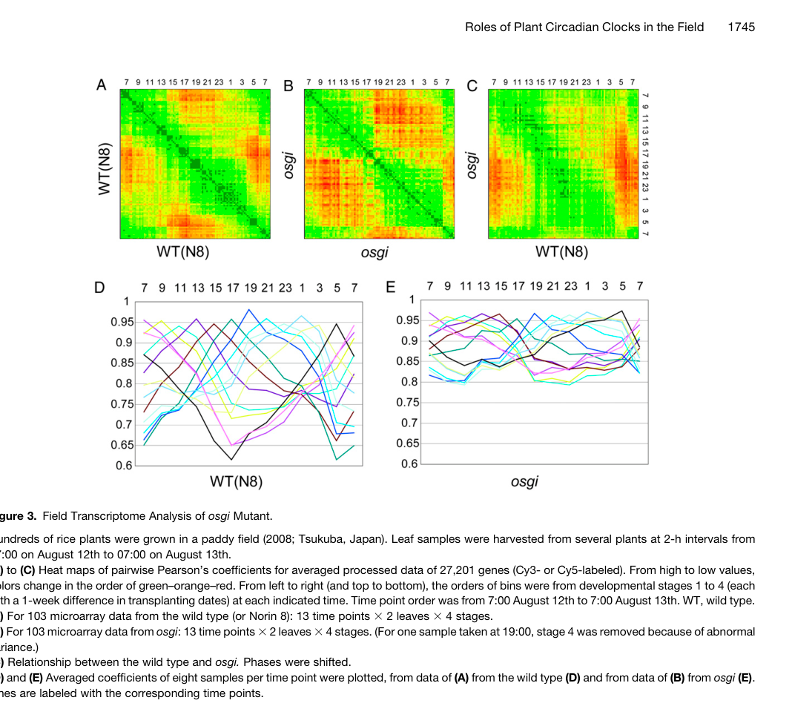

## Question

# Gene Research for Functional Annotation

## ⚠️ CRITICAL: Gene/Protein Identification Context

**BEFORE YOU BEGIN RESEARCH:** You MUST verify you are researching the CORRECT gene/protein. Gene symbols can be ambiguous, especially for less well-characterized genes from non-model organisms.

### Target Gene/Protein Identity (from UniProt):
- **UniProt Accession:** Q9AWL7
- **Protein Description:** RecName: Full=Protein GIGANTEA;
- **Gene Information:** Name=GI; OrderedLocusNames=Os01g0182600, LOC_Os01g08700; ORFNames=P0666G04.27-1, P0666G04.27-2;
- **Organism (full):** Oryza sativa subsp. japonica (Rice).
- **Protein Family:** Belongs to the GIGANTEA family. .
- **Key Domains:** GIGANTEA. (IPR026211)

### MANDATORY VERIFICATION STEPS:

1. **Check if the gene symbol "GI" matches the protein description above**
2. **Verify the organism is correct:** Oryza sativa subsp. japonica (Rice).
3. **Check if protein family/domains align with what you find in literature**
4. **If you find literature for a DIFFERENT gene with the same or similar symbol, STOP**

### If Gene Symbol is Ambiguous or You Cannot Find Relevant Literature:

**DO NOT PROCEED WITH RESEARCH ON A DIFFERENT GENE.** Instead:
- State clearly: "The gene symbol 'GI' is ambiguous or literature is limited for this specific protein"
- Explain what you found (e.g., "Found extensive literature on a different gene with the same symbol in a different organism")
- Describe the protein based ONLY on the UniProt information provided above
- Suggest that the protein function can be inferred from domain/family information

### Research Target:

Please provide a comprehensive research report on the gene **GI** (gene ID: GI, UniProt: Q9AWL7) in ORYSJ.

The research report should be a detailed narrative explaining the function, biological processes, and localization of the gene product. Citations should be given for all claims.

You should prioritize authoritative reviews and primary scientific literature when conducting research. You can supplement
this with annotations you find in gene/protein databases, but these can be outdated or inaccurate.

We are specifically interested in the primary function of the gene - for enzymes, what reaction is catalyzed, and what is the substrate specificity? For transporters, what is the substrate? For structural proteins or adapters, what is the broader structural role? For signaling molecules, what is the role in the pathway.

We are interested in where in or outside the cell the gene product carries out its function.

We are also interested in the signaling or biochemical pathways in which the gene functions. We are less interested in broad pleiotropic effects, except where these elucidate the precise role.

Include evidence where possible. We are interested in both experimental evidence as well as inference from structure, evolution, or bioinformatic analysis. Precise studies should be prioritized over high-throughput, where available.

## Output

Question: You are an expert researcher providing comprehensive, well-cited information.

Provide detailed information focusing on:
1. Key concepts and definitions with current understanding
2. Recent developments and latest research (prioritize 2023-2024 sources)
3. Current applications and real-world implementations
4. Expert opinions and analysis from authoritative sources
5. Relevant statistics and data from recent studies

Format as a comprehensive research report with proper citations. Include URLs and publication dates where available.
Always prioritize recent, authoritative sources and provide specific citations for all major claims.

# Gene Research for Functional Annotation

## ⚠️ CRITICAL: Gene/Protein Identification Context

**BEFORE YOU BEGIN RESEARCH:** You MUST verify you are researching the CORRECT gene/protein. Gene symbols can be ambiguous, especially for less well-characterized genes from non-model organisms.

### Target Gene/Protein Identity (from UniProt):
- **UniProt Accession:** Q9AWL7
- **Protein Description:** RecName: Full=Protein GIGANTEA;
- **Gene Information:** Name=GI; OrderedLocusNames=Os01g0182600, LOC_Os01g08700; ORFNames=P0666G04.27-1, P0666G04.27-2;
- **Organism (full):** Oryza sativa subsp. japonica (Rice).
- **Protein Family:** Belongs to the GIGANTEA family. .
- **Key Domains:** GIGANTEA. (IPR026211)

### MANDATORY VERIFICATION STEPS:

1. **Check if the gene symbol "GI" matches the protein description above**
2. **Verify the organism is correct:** Oryza sativa subsp. japonica (Rice).
3. **Check if protein family/domains align with what you find in literature**
4. **If you find literature for a DIFFERENT gene with the same or similar symbol, STOP**

### If Gene Symbol is Ambiguous or You Cannot Find Relevant Literature:

**DO NOT PROCEED WITH RESEARCH ON A DIFFERENT GENE.** Instead:
- State clearly: "The gene symbol 'GI' is ambiguous or literature is limited for this specific protein"
- Explain what you found (e.g., "Found extensive literature on a different gene with the same symbol in a different organism")
- Describe the protein based ONLY on the UniProt information provided above
- Suggest that the protein function can be inferred from domain/family information

### Research Target:

Please provide a comprehensive research report on the gene **GI** (gene ID: GI, UniProt: Q9AWL7) in ORYSJ.

The research report should be a detailed narrative explaining the function, biological processes, and localization of the gene product. Citations should be given for all claims.

You should prioritize authoritative reviews and primary scientific literature when conducting research. You can supplement
this with annotations you find in gene/protein databases, but these can be outdated or inaccurate.

We are specifically interested in the primary function of the gene - for enzymes, what reaction is catalyzed, and what is the substrate specificity? For transporters, what is the substrate? For structural proteins or adapters, what is the broader structural role? For signaling molecules, what is the role in the pathway.

We are interested in where in or outside the cell the gene product carries out its function.

We are also interested in the signaling or biochemical pathways in which the gene functions. We are less interested in broad pleiotropic effects, except where these elucidate the precise role.

Include evidence where possible. We are interested in both experimental evidence as well as inference from structure, evolution, or bioinformatic analysis. Precise studies should be prioritized over high-throughput, where available.

# Research report: Rice **GIGANTEA (OsGI)** functional annotation (UniProt Q9AWL7)

## 0) Target verification (mandatory)

The target protein is **Protein GIGANTEA** from **Oryza sativa subsp. japonica** (rice), gene symbol **GI**, UniProt **Q9AWL7**. In the rice flowering-time literature this gene is consistently referred to as **OsGI / Os-GIGANTEA**, the rice ortholog of Arabidopsis **GIGANTEA (GI)**. A recent rice heading-date review explicitly identifies **OsGI as LOC_Os01g08700**, matching the user-provided locus naming context (song2024researchprogresson pages 1-2). A canonical rice primary study uses **osgi-1 / osgi-2** mutants in **Os-GIGANTEA (Os-GI)** and provides a GenBank accession **NM_001048755.1** for Os-GI, confirming that “GI” in rice is being used as the GIGANTEA ortholog (izawa2011osgiganteaconfersrobust pages 13-14). 

No retrieved sources indicated an alternative rice gene symbol “GI” unrelated to GIGANTEA; therefore, the literature summarized below is restricted to **rice OsGI/Os-GIGANTEA (LOC_Os01g08700)** and clearly separated from Arabidopsis-only mechanistic details when they appear in reviews.

## 1) Key concepts and current understanding

### 1.1 What is GIGANTEA (GI)?

**GIGANTEA (GI)** is described in a 2024 review as an evolutionarily conserved **nuclear protein** that integrates **light input** with the **circadian clock**, contributing to circadian resetting and regulation of flowering initiation (Liu et al., 2024; published Jan 2024; https://doi.org/10.3390/genes15010094) (liu2024giganteaunveiledexploring pages 1-2, liu2024giganteaunveiledexploring pages 14-15). The same review emphasizes GI as a large protein (reported as **1173 amino acids**) and notes that GI lacks well-defined conserved domains (in the sense of readily assignable canonical domains), which complicates mechanistic dissection (liu2024giganteaunveiledexploring pages 1-2).

In rice specifically, OsGI is framed as a circadian/photoperiod regulator that functions upstream in heading-date pathways, affecting florigen gene expression and the vegetative-to-reproductive transition (Song et al., 2024; published Sep 2024; https://doi.org/10.3390/cimb46090613) (song2024researchprogresson pages 1-2, song2024researchprogresson pages 2-4).

### 1.2 Primary function in rice (functional annotation view)

**OsGI is not an enzyme or transporter**; it is a regulatory protein whose primary functional annotation in rice is best described as:

- A **core regulator of diurnal/circadian control of gene expression** under natural field conditions, influencing the amplitude and phase coordination of large-scale transcript rhythms (Izawa et al., 2011; published May 2011; https://doi.org/10.1105/tpc.111.083238) (izawa2011osgiganteaconfersrobust pages 1-2).
- An upstream **photoperiod-pathway regulator** that impacts heading date through the **OsGI–Hd1–Hd3a** module and related pathways affecting the florigens **Hd3a** and **RFT1** (Song et al., 2024) (song2024researchprogresson pages 2-4).

### 1.3 Core pathway placement (heading date/photoperiod network)

Rice heading date is governed by photoperiod-controlled pathways centered on florigens **Hd3a** and **RFT1** (reviewed in Song et al., 2024) (song2024researchprogresson pages 1-2). In this framework, **OsGI (LOC_Os01g08700)** sits upstream of **Hd1** and contributes to the **OsGI–Hd1–Hd3a** pathway (song2024researchprogresson pages 1-2). Song et al. summarize photoperiod-dependent behavior:

- Under **short days (SD)**: OsGI activates **Hd1** and **Ehd1**, promoting **Hd3a** expression and flowering (song2024researchprogresson pages 2-4).
- Under **long days (LD)**: OsGI activates **Hd1**, but in that context **Hd1 represses Hd3a**; meanwhile **Ehd1** can activate **Hd3a/RFT1**, reflecting network branching and photoperiod dependence (song2024researchprogresson pages 2-4).

A 2023 review likewise places OsGI upstream in the OsGI–Hd1–Hd3a module and notes OsGI upregulates Hd1 and Ehd1, which regulate Hd3a/RFT1 (Sohail, 2023; published Aug 2023; https://doi.org/10.1007/s40415-023-00910-y) (sohail2023geneticandsignaling pages 3-5).

### 1.4 Subcellular localization: what can and cannot be stated

- Cross-species reviews describe GI as **predominantly nuclear**, with dynamic nucleo-cytoplasmic partitioning reported in Arabidopsis (liu2024giganteaunveiledexploring pages 5-7, liu2024giganteaunveiledexploring pages 2-3, liu2024giganteaunveiledexploring pages 14-15). 
- **However**, among the retrieved rice-focused sources here, there is **no direct rice OsGI localization experiment** (e.g., OsGI–GFP imaging, fractionation) in the available excerpts. Thus, a rice-specific cellular compartment assignment beyond “GI is generally nuclear in plants” cannot be asserted from the present retrieved rice primary evidence.

## 2) Mechanistic evidence from primary rice studies (authoritative experimental support)

### 2.1 OsGI as a genome-scale controller of diurnal transcriptome rhythms

A landmark Plant Cell field study (Izawa et al., 2011) used rice **osgi** loss-of-function mutants to test how OsGI shapes diurnal gene expression under natural day–night cycles. Quantitatively, OsGI affected expression of **75% of 27,201 genes** at FDR 0.05 (and 57% at FDR 0.01) in field conditions, and was required for strong rhythm amplitudes and fine-tuning of phases (izawa2011osgiganteaconfersrobust pages 1-2). The authors reported that wild-type plants show multiphase, orchestrated transcriptome states, whereas **osgi mutants collapse into a simpler “day vs night” two-state transcriptome** (izawa2011osgiganteaconfersrobust pages 5-6).

**Visual evidence:** Figure 3 from the same paper (field transcriptome analysis) provides a direct visualization of this shift from complex phase structure in wild-type to simplified day/night structure in osgi mutants (izawa2011osgiganteaconfersrobust media 5a0d7264).

### 2.2 Downstream hormonal regulation signatures (GA, jasmonate-related expression)

A follow-up analysis (Itoh & Izawa, 2011; published Dec 2011; https://doi.org/10.4161/psb.6.12.18207) reported that OsGI influences expression of hormone-biosynthesis genes in field time-course datasets. In osgi-1 mutants, **4 of 9 OsGA2ox genes** (GA-inactivation enzymes) were increased by **3.0–5.8-fold**, **3 of 5 OsJMT genes** were decreased by **2.6–4.5-fold**, and **two OsSDR genes** increased **1.5–3.9-fold** (itoh2011astudyof pages 4-5). These results support that OsGI’s role as a diurnal regulator has measurable downstream impacts on growth/hormone-related transcriptional programs.

## 3) Recent developments (prioritizing 2023–2024) and latest research context

### 3.1 2024 review synthesis: OsGI in photoperiod regulation of heading date

Song et al. (2024) provide a consolidated, recent overview of photoperiod genes controlling rice heading date, explicitly annotating OsGI as **LOC_Os01g08700** and describing its role in the **OsGI–Hd1–Hd3a** pathway with SD vs LD context dependence (https://doi.org/10.3390/cimb46090613; published Sep 2024) (song2024researchprogresson pages 1-2, song2024researchprogresson pages 2-4). They additionally note upstream light signaling input: **OsPhyA affects heading date by regulating OsGI under SD** and regulating **Ghd7 under LD** (song2024researchprogresson pages 2-4), highlighting photoreceptor-to-clock/photoperiod connections.

### 3.2 2023 pathway review: OsGI positioned as an upstream module component

Sohail (2023) similarly frames OsGI as upstream in the rice photoperiodic flowering network and as part of an OsGI–Hd1–Hd3a module analogous to the Arabidopsis GI–CO–FT module (https://doi.org/10.1007/s40415-023-00910-y; published Aug 2023) (sohail2023geneticandsignaling pages 3-5). While not providing new primary experiments on OsGI, this review supports the current consensus network placement.

### 3.3 Limits of 2023–2024 primary OsGI-focused mechanistic data in retrieved set

Within the retrieved 2023–2024 primary literature available in this run, OsGI appears mostly as (i) a node in pathway diagrams and (ii) a measured transcript in studies focused on other regulators (e.g., OsMADS50). No OsGI-specific new structural or biochemical mechanistic paper from 2023–2024 was retrieved here; therefore, the most direct mechanistic experimental support remains anchored by high-citation primary rice studies (Izawa et al., 2011; Itoh & Izawa, 2011), while 2023–2024 sources provide updated synthesis and application context.

## 4) Current applications and real-world implementations

### 4.1 Marker-assisted and predictive breeding: heading-date SNP panels implicating OsGI

Kitazawa et al. (2024) developed a practical, high-throughput **Fluidigm 96-plex** SNP genotyping system for heading-date loci (Breeding Science; published Jun 2024; https://doi.org/10.1270/jsbbs.23093). Their assays covered **41 loci (29 genes + 12 QTLs)** and discriminated **144 alleles**, with genotyping on **377 cultivars** averaging **3.5 alleles per locus** (kitazawa2024developmentofsnp pages 1-2). They built heading-date prediction models trained on **200 cultivars** and tested on **22 independent cultivars**, achieving adjusted **R² ≈ 0.88** and year-specific Pearson correlations **r = 0.7603, 0.6908, 0.7459** (kitazawa2024developmentofsnp pages 3-5).

Importantly for OsGI relevance, their RIL QTL mapping detected QTLs mapping near previously reported heading-date loci including **OsGI**, supporting its practical relevance for genotype-informed heading-date prediction and selection (kitazawa2024developmentofsnp pages 3-5). (The retrieved excerpts do not fully confirm whether OsGI itself is directly assayed in the final 41-locus panel; the evidence supports QTL proximity and locus relevance.)

### 4.2 Gene editing for heading-date tuning (OsGI as network readout)

A 2024 Plants study illustrates a modern applied pipeline combining GWAS and genome editing for heading-date manipulation. Liu et al. (2024; published Aug 2024; https://doi.org/10.3390/plants13162221) performed GWAS on **3,021 rice varieties** and edited **OsMADS50** in a cultivar background to delay heading by about **one week**; in these mutants, expression of key flowering regulators including **OsGI** was decreased (liu2024improvingricequality pages 10-11). The study reports agronomic trade-offs: increased tiller number and yield per plant, but significantly reduced 1000-grain weight and grain filling (liu2024improvingricequality pages 10-11). In this implementation, OsGI is not directly edited but is monitored as a central node in the flowering regulatory network.

## 5) Expert opinion and authoritative synthesis

The 2024 GI-focused review (Liu et al., 2024) frames GI as a hub that integrates light, clock function, flowering, and stress/hormone pathways (https://doi.org/10.3390/genes15010094; published Jan 2024) (liu2024giganteaunveiledexploring pages 1-2, liu2024giganteaunveiledexploring pages 14-15). While much mechanistic detail in this review is drawn from Arabidopsis, its central expert perspective is that GI/GIGANTEA proteins serve as integrators rather than single-pathway regulators, and that stability/complex formation with other clock/light components is central to function (liu2024giganteaunveiledexploring pages 7-8). For rice-specific pathway placement, Song et al. (2024) provide an updated authoritative synthesis that explicitly maps OsGI to rice loci and headings-date outputs (song2024researchprogresson pages 1-2).

## 6) Quantitative/statistical summary (recent + foundational)

The following table aggregates the key quantitative/statistical findings most relevant to functional annotation and real-world usage.

| Study (year) | Type | What measured | Key quantitative result | Notes/limitations | URL |
|---|---|---|---|---|---|
| Izawa et al. (2011) | Primary field transcriptomics | Global diurnal transcriptome impact of osgi mutants | Os-GI affected **75%** of **27,201** genes tested at FDR 0.05; **57%** at FDR 0.01. Sampling used **13 time points** over **24 h** at **2-h intervals**; ~**6,000+** genes showed diurnal expression; WT used **103** arrays per genotype in large field time series. (izawa2011osgiganteaconfersrobust pages 5-6, izawa2011osgiganteaconfersrobust pages 2-4, izawa2011osgiganteaconfersrobust pages 13-14, izawa2011osgiganteaconfersrobust pages 1-2) | Strongest mechanistic evidence for rice OsGI, but older than 2023–2024; locus ID not explicitly given in extracted pages, though GenBank accession **NM_001048755.1** is provided. (izawa2011osgiganteaconfersrobust pages 13-14) | https://doi.org/10.1105/tpc.111.083238 |
| Itoh & Izawa (2011) | Primary follow-up expression/physiology study | Hormone-biosynthesis gene expression changes in osgi-1 | **4/9 OsGA2ox** genes upregulated by **3.0–5.8-fold**; **3/5 OsJMT** genes downregulated by **2.6–4.5-fold**; **2 OsSDR** genes increased **1.5–3.9-fold**. Expression profiles summarized from field time-course arrays; phenotype included semi-dwarfism. (itoh2011astudyof pages 4-5, itoh2011astudyof pages 1-4) | Focuses on downstream hormonal outputs rather than direct biochemical activity of OsGI; no locus ID in extracted pages. | https://doi.org/10.4161/psb.6.12.18207 |
| Song et al. (2024) | Recent review | Rice OsGI identity and photoperiod function | Identifies rice OsGI as **LOC_Os01g08700**; places it upstream in the **OsGI–Hd1–Hd3a** pathway. Under **SD**, OsGI activates **Hd1/Ehd1** to promote **Hd3a** and flowering; under **LD**, OsGI still activates **Hd1**, but Hd1 represses **Hd3a**. (song2024researchprogresson pages 1-2, song2024researchprogresson pages 2-4) | Review-level synthesis; extracted pages do not provide fold-changes or direct experimental localization/protein-domain measurements for rice OsGI. | https://doi.org/10.3390/cimb46090613 |
| Kitazawa et al. (2024) | Breeding/genotyping application | Heading-date SNP assay panel and predictive breeding models | Developed **96-plex** SNP assays covering **41 loci** (**29 genes + 12 QTLs**) discriminating **144 alleles**; genotyped **377 cultivars** with **3.5 alleles/locus** on average. Prediction models trained on **200 cultivars** and tested on **22 cultivars** gave adjusted **R² ≈ 0.88** (0.8895/0.8799/0.8791) and Pearson **r = 0.7603, 0.6908, 0.7459** across years; throughput/cost ~**96 samples in half a week** at ~**170,000 JPY**. QTLs mapping near **OsGI** were detected. (kitazawa2024developmentofsnp pages 3-5, kitazawa2024developmentofsnp pages 1-2, kitazawa2024developmentofsnp pages 5-7, kitazawa2024developmentofsnp pages 7-8) | Real-world breeding relevance is high, but extracted text does **not explicitly confirm** OsGI as one of the final assayed genes in the panel; evidence is strongest for QTL proximity and heading-date network relevance. | https://doi.org/10.1270/jsbbs.23093 |
| Liu et al. (2024, Plants) | GWAS + gene-editing application | Heading-date manipulation in breeding context with OsGI network readout | GWAS used **3,021 rice varieties**; editing **OsMADS50** delayed flowering by about **1 week** and reduced expression of flowering genes including **OsGI**. Mutants showed increased tiller number and yield per plant, but **1000-grain weight** and **grain filling** decreased significantly; no numeric OsGI fold-change reported in extracted pages. (liu2024improvingricequality pages 10-11) | OsGI was **not directly edited**; it is a downstream/readout node in the flowering network. Quantitative yield-component values were not provided in the extracted text. | https://doi.org/10.3390/plants13162221 |

*Table: This table summarizes the most important quantitative and application-oriented findings for rice OsGI/GIGANTEA from the gathered evidence. It highlights mechanistic transcriptome-scale effects, hormone-related downstream changes, modern pathway interpretation, and breeding/genotyping implementations.*

## 7) Functional annotation summary (for database-style curation)

- **Gene/protein:** OsGI / Os-GIGANTEA; rice ortholog of Arabidopsis GI; **LOC_Os01g08700** (Song et al., 2024) (song2024researchprogresson pages 1-2).
- **Molecular function (best-supported):** Regulatory protein required for robust diurnal/circadian orchestration of the rice transcriptome in field conditions (Izawa et al., 2011) (izawa2011osgiganteaconfersrobust pages 1-2).
- **Biological processes:** Photoperiodic regulation of heading date via **OsGI–Hd1–Hd3a** and related branches involving **Ehd1** and florigens (**Hd3a/RFT1**) (song2024researchprogresson pages 2-4).
- **Key phenotypic outputs:** Strong genome-wide effects on rhythmic transcription; day/night transcriptome state simplification in osgi mutants (izawa2011osgiganteaconfersrobust pages 5-6, izawa2011osgiganteaconfersrobust media 5a0d7264). Downstream transcriptional shifts in hormone-related pathways including GA catabolism genes (itoh2011astudyof pages 4-5).
- **Upstream regulation:** Photoreceptor pathway input summarized as OsPhyA regulating OsGI under SD (song2024researchprogresson pages 2-4).
- **Subcellular localization:** General plant GI is described as nuclear in authoritative review literature, but **direct rice OsGI localization experiments were not found in retrieved excerpts**; thus rice localization should be annotated conservatively unless additional rice primary localization sources are added (liu2024giganteaunveiledexploring pages 1-2, liu2024giganteaunveiledexploring pages 14-15).

## 8) Evidence gaps and recommendations

- **Rice-specific protein localization and interactome evidence:** The retrieved sources do not provide direct OsGI localization assays or rice OsGI protein–protein interaction biochemistry; adding primary rice OsGI localization/interactome studies (e.g., OsGI–GFP, co-IP/BiFC) would strengthen cellular-component annotations.
- **2023–2024 OsGI primary mechanistic novelty:** Recent sources in this run are mainly reviews and applied studies where OsGI is measured as a network readout; targeted searches for 2023–2024 OsGI interaction partners, post-translational regulation, or structural studies could be undertaken if needed.

References

1. (song2024researchprogresson pages 1-2): Jian Song, Liqun Tang, Yongtao Cui, Honghuan Fan, Xueqiang Zhen, and Jianjun Wang. Research progress on photoperiod gene regulation of heading date in rice. Current Issues in Molecular Biology, 46:10299-10311, Sep 2024. URL: https://doi.org/10.3390/cimb46090613, doi:10.3390/cimb46090613. This article has 12 citations.

2. (izawa2011osgiganteaconfersrobust pages 13-14): T. Izawa, M. Mihara, Yuji Suzuki, Meenu Gupta, Hironori Itoh, A. Nagano, Ritsuko Motoyama, Y. Sawada, M. Yano, M. Hirai, A. Makino, and Y. Nagamura. Os-gigantea confers robust diurnal rhythms on the global transcriptome of rice in the field[c][w][oa]. Plant Cell, 23:1741-1755, May 2011. URL: https://doi.org/10.1105/tpc.111.083238, doi:10.1105/tpc.111.083238. This article has 198 citations and is from a highest quality peer-reviewed journal.

3. (liu2024giganteaunveiledexploring pages 1-2): Ling Liu, Yuxin Xie, Baba Salifu Yahaya, and Fengkai Wu. Gigantea unveiled: exploring its diverse roles and mechanisms. Genes, 15:94, Jan 2024. URL: https://doi.org/10.3390/genes15010094, doi:10.3390/genes15010094. This article has 15 citations.

4. (liu2024giganteaunveiledexploring pages 14-15): Ling Liu, Yuxin Xie, Baba Salifu Yahaya, and Fengkai Wu. Gigantea unveiled: exploring its diverse roles and mechanisms. Genes, 15:94, Jan 2024. URL: https://doi.org/10.3390/genes15010094, doi:10.3390/genes15010094. This article has 15 citations.

5. (song2024researchprogresson pages 2-4): Jian Song, Liqun Tang, Yongtao Cui, Honghuan Fan, Xueqiang Zhen, and Jianjun Wang. Research progress on photoperiod gene regulation of heading date in rice. Current Issues in Molecular Biology, 46:10299-10311, Sep 2024. URL: https://doi.org/10.3390/cimb46090613, doi:10.3390/cimb46090613. This article has 12 citations.

6. (izawa2011osgiganteaconfersrobust pages 1-2): T. Izawa, M. Mihara, Yuji Suzuki, Meenu Gupta, Hironori Itoh, A. Nagano, Ritsuko Motoyama, Y. Sawada, M. Yano, M. Hirai, A. Makino, and Y. Nagamura. Os-gigantea confers robust diurnal rhythms on the global transcriptome of rice in the field[c][w][oa]. Plant Cell, 23:1741-1755, May 2011. URL: https://doi.org/10.1105/tpc.111.083238, doi:10.1105/tpc.111.083238. This article has 198 citations and is from a highest quality peer-reviewed journal.

7. (sohail2023geneticandsignaling pages 3-5): Amir Sohail. Genetic and signaling pathways of flowering regulation in rice (oryza sativa l.). Brazilian Journal of Botany, 46:599-608, Aug 2023. URL: https://doi.org/10.1007/s40415-023-00910-y, doi:10.1007/s40415-023-00910-y. This article has 10 citations.

8. (liu2024giganteaunveiledexploring pages 5-7): Ling Liu, Yuxin Xie, Baba Salifu Yahaya, and Fengkai Wu. Gigantea unveiled: exploring its diverse roles and mechanisms. Genes, 15:94, Jan 2024. URL: https://doi.org/10.3390/genes15010094, doi:10.3390/genes15010094. This article has 15 citations.

9. (liu2024giganteaunveiledexploring pages 2-3): Ling Liu, Yuxin Xie, Baba Salifu Yahaya, and Fengkai Wu. Gigantea unveiled: exploring its diverse roles and mechanisms. Genes, 15:94, Jan 2024. URL: https://doi.org/10.3390/genes15010094, doi:10.3390/genes15010094. This article has 15 citations.

10. (izawa2011osgiganteaconfersrobust pages 5-6): T. Izawa, M. Mihara, Yuji Suzuki, Meenu Gupta, Hironori Itoh, A. Nagano, Ritsuko Motoyama, Y. Sawada, M. Yano, M. Hirai, A. Makino, and Y. Nagamura. Os-gigantea confers robust diurnal rhythms on the global transcriptome of rice in the field[c][w][oa]. Plant Cell, 23:1741-1755, May 2011. URL: https://doi.org/10.1105/tpc.111.083238, doi:10.1105/tpc.111.083238. This article has 198 citations and is from a highest quality peer-reviewed journal.

11. (izawa2011osgiganteaconfersrobust media 5a0d7264): T. Izawa, M. Mihara, Yuji Suzuki, Meenu Gupta, Hironori Itoh, A. Nagano, Ritsuko Motoyama, Y. Sawada, M. Yano, M. Hirai, A. Makino, and Y. Nagamura. Os-gigantea confers robust diurnal rhythms on the global transcriptome of rice in the field[c][w][oa]. Plant Cell, 23:1741-1755, May 2011. URL: https://doi.org/10.1105/tpc.111.083238, doi:10.1105/tpc.111.083238. This article has 198 citations and is from a highest quality peer-reviewed journal.

12. (itoh2011astudyof pages 4-5): Hironori Itoh and Takeshi Izawa. A study of phytohormone biosynthetic gene expression using a circadian clock-related mutant in rice. Plant Signaling & Behavior, 6:1932-1936, Dec 2011. URL: https://doi.org/10.4161/psb.6.12.18207, doi:10.4161/psb.6.12.18207. This article has 21 citations and is from a peer-reviewed journal.

13. (kitazawa2024developmentofsnp pages 1-2): Noriyuki Kitazawa, Ayahiko Shomura, Tatsumi Mizubayashi, Tsuyu Ando, Nagao Hayashi, Shiori Yabe, Kazuki Matsubara, Kaworu Ebana, Utako Yamanouchi, and Shuichi Fukuoka. Development of snp genotyping assays for heading date in rice. Breeding Science, 74:274-284, Jun 2024. URL: https://doi.org/10.1270/jsbbs.23093, doi:10.1270/jsbbs.23093. This article has 5 citations and is from a peer-reviewed journal.

14. (kitazawa2024developmentofsnp pages 3-5): Noriyuki Kitazawa, Ayahiko Shomura, Tatsumi Mizubayashi, Tsuyu Ando, Nagao Hayashi, Shiori Yabe, Kazuki Matsubara, Kaworu Ebana, Utako Yamanouchi, and Shuichi Fukuoka. Development of snp genotyping assays for heading date in rice. Breeding Science, 74:274-284, Jun 2024. URL: https://doi.org/10.1270/jsbbs.23093, doi:10.1270/jsbbs.23093. This article has 5 citations and is from a peer-reviewed journal.

15. (liu2024improvingricequality pages 10-11): Jianguo Liu, Qinqin Yi, Guojun Dong, Yuyu Chen, Longbiao Guo, Zhenyu Gao, Li Zhu, Deyong Ren, Qiang Zhang, Qing Li, Jingyong Li, Qiangming Liu, Guangheng Zhang, Qian Qian, and Lan Shen. Improving rice quality by regulating the heading dates of rice varieties without yield penalties. Plants, 13:2221, Aug 2024. URL: https://doi.org/10.3390/plants13162221, doi:10.3390/plants13162221. This article has 8 citations.

16. (liu2024giganteaunveiledexploring pages 7-8): Ling Liu, Yuxin Xie, Baba Salifu Yahaya, and Fengkai Wu. Gigantea unveiled: exploring its diverse roles and mechanisms. Genes, 15:94, Jan 2024. URL: https://doi.org/10.3390/genes15010094, doi:10.3390/genes15010094. This article has 15 citations.

17. (izawa2011osgiganteaconfersrobust pages 2-4): T. Izawa, M. Mihara, Yuji Suzuki, Meenu Gupta, Hironori Itoh, A. Nagano, Ritsuko Motoyama, Y. Sawada, M. Yano, M. Hirai, A. Makino, and Y. Nagamura. Os-gigantea confers robust diurnal rhythms on the global transcriptome of rice in the field[c][w][oa]. Plant Cell, 23:1741-1755, May 2011. URL: https://doi.org/10.1105/tpc.111.083238, doi:10.1105/tpc.111.083238. This article has 198 citations and is from a highest quality peer-reviewed journal.

18. (itoh2011astudyof pages 1-4): Hironori Itoh and Takeshi Izawa. A study of phytohormone biosynthetic gene expression using a circadian clock-related mutant in rice. Plant Signaling & Behavior, 6:1932-1936, Dec 2011. URL: https://doi.org/10.4161/psb.6.12.18207, doi:10.4161/psb.6.12.18207. This article has 21 citations and is from a peer-reviewed journal.

19. (kitazawa2024developmentofsnp pages 5-7): Noriyuki Kitazawa, Ayahiko Shomura, Tatsumi Mizubayashi, Tsuyu Ando, Nagao Hayashi, Shiori Yabe, Kazuki Matsubara, Kaworu Ebana, Utako Yamanouchi, and Shuichi Fukuoka. Development of snp genotyping assays for heading date in rice. Breeding Science, 74:274-284, Jun 2024. URL: https://doi.org/10.1270/jsbbs.23093, doi:10.1270/jsbbs.23093. This article has 5 citations and is from a peer-reviewed journal.

20. (kitazawa2024developmentofsnp pages 7-8): Noriyuki Kitazawa, Ayahiko Shomura, Tatsumi Mizubayashi, Tsuyu Ando, Nagao Hayashi, Shiori Yabe, Kazuki Matsubara, Kaworu Ebana, Utako Yamanouchi, and Shuichi Fukuoka. Development of snp genotyping assays for heading date in rice. Breeding Science, 74:274-284, Jun 2024. URL: https://doi.org/10.1270/jsbbs.23093, doi:10.1270/jsbbs.23093. This article has 5 citations and is from a peer-reviewed journal.

## Artifacts

- [Edison artifact artifact-00](GI-deep-research-falcon_artifacts/artifact-00.md)

## Citations

1. song2024researchprogresson pages 1-2
2. izawa2011osgiganteaconfersrobust pages 13-14
3. liu2024giganteaunveiledexploring pages 1-2
4. izawa2011osgiganteaconfersrobust pages 1-2
5. song2024researchprogresson pages 2-4
6. sohail2023geneticandsignaling pages 3-5
7. izawa2011osgiganteaconfersrobust pages 5-6
8. itoh2011astudyof pages 4-5
9. kitazawa2024developmentofsnp pages 1-2
10. kitazawa2024developmentofsnp pages 3-5
11. liu2024improvingricequality pages 10-11
12. liu2024giganteaunveiledexploring pages 7-8
13. liu2024giganteaunveiledexploring pages 14-15
14. liu2024giganteaunveiledexploring pages 5-7
15. liu2024giganteaunveiledexploring pages 2-3
16. izawa2011osgiganteaconfersrobust pages 2-4
17. itoh2011astudyof pages 1-4
18. kitazawa2024developmentofsnp pages 5-7
19. kitazawa2024developmentofsnp pages 7-8
20. c
21. w
22. oa
23. https://doi.org/10.3390/genes15010094
24. https://doi.org/10.3390/cimb46090613
25. https://doi.org/10.1105/tpc.111.083238
26. https://doi.org/10.1007/s40415-023-00910-y
27. https://doi.org/10.4161/psb.6.12.18207
28. https://doi.org/10.3390/cimb46090613;
29. https://doi.org/10.1007/s40415-023-00910-y;
30. https://doi.org/10.1270/jsbbs.23093
31. https://doi.org/10.3390/plants13162221
32. https://doi.org/10.3390/genes15010094;
33. https://doi.org/10.3390/cimb46090613,
34. https://doi.org/10.1105/tpc.111.083238,
35. https://doi.org/10.3390/genes15010094,
36. https://doi.org/10.1007/s40415-023-00910-y,
37. https://doi.org/10.4161/psb.6.12.18207,
38. https://doi.org/10.1270/jsbbs.23093,
39. https://doi.org/10.3390/plants13162221,