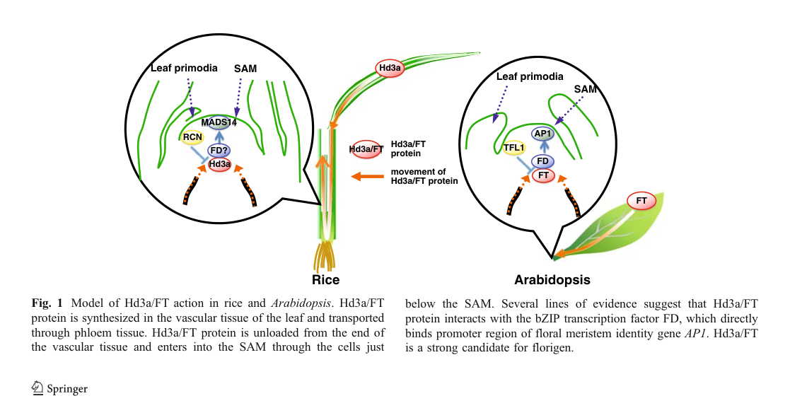
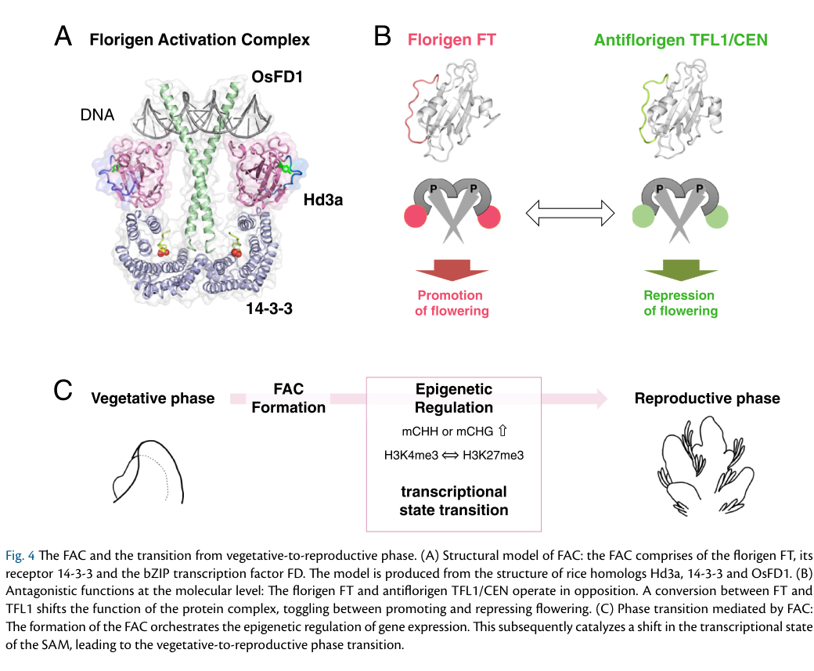

## Question

# Gene Research for Functional Annotation

## ⚠️ CRITICAL: Gene/Protein Identification Context

**BEFORE YOU BEGIN RESEARCH:** You MUST verify you are researching the CORRECT gene/protein. Gene symbols can be ambiguous, especially for less well-characterized genes from non-model organisms.

### Target Gene/Protein Identity (from UniProt):
- **UniProt Accession:** Q93WI9
- **Protein Description:** RecName: Full=Protein HEADING DATE 3A; AltName: Full=FT-like protein A;
- **Gene Information:** Name=HD3A; OrderedLocusNames=Os06g0157700, LOC_Os06g06320; ORFNames=OsJ_20191, P0046E09.30, P0702F05.10;
- **Organism (full):** Oryza sativa subsp. japonica (Rice).
- **Protein Family:** Belongs to the phosphatidylethanolamine-binding protein
- **Key Domains:** PEBP. (IPR008914); PEBP-like_sf. (IPR036610); PEBP_euk. (IPR035810); Phosphatidylethanolamine-bd_CS. (IPR001858); PBP (PF01161)

### MANDATORY VERIFICATION STEPS:

1. **Check if the gene symbol "HD3A" matches the protein description above**
2. **Verify the organism is correct:** Oryza sativa subsp. japonica (Rice).
3. **Check if protein family/domains align with what you find in literature**
4. **If you find literature for a DIFFERENT gene with the same or similar symbol, STOP**

### If Gene Symbol is Ambiguous or You Cannot Find Relevant Literature:

**DO NOT PROCEED WITH RESEARCH ON A DIFFERENT GENE.** Instead:
- State clearly: "The gene symbol 'HD3A' is ambiguous or literature is limited for this specific protein"
- Explain what you found (e.g., "Found extensive literature on a different gene with the same symbol in a different organism")
- Describe the protein based ONLY on the UniProt information provided above
- Suggest that the protein function can be inferred from domain/family information

### Research Target:

Please provide a comprehensive research report on the gene **HD3A** (gene ID: HD3A, UniProt: Q93WI9) in ORYSJ.

The research report should be a detailed narrative explaining the function, biological processes, and localization of the gene product. Citations should be given for all claims.

You should prioritize authoritative reviews and primary scientific literature when conducting research. You can supplement
this with annotations you find in gene/protein databases, but these can be outdated or inaccurate.

We are specifically interested in the primary function of the gene - for enzymes, what reaction is catalyzed, and what is the substrate specificity? For transporters, what is the substrate? For structural proteins or adapters, what is the broader structural role? For signaling molecules, what is the role in the pathway.

We are interested in where in or outside the cell the gene product carries out its function.

We are also interested in the signaling or biochemical pathways in which the gene functions. We are less interested in broad pleiotropic effects, except where these elucidate the precise role.

Include evidence where possible. We are interested in both experimental evidence as well as inference from structure, evolution, or bioinformatic analysis. Precise studies should be prioritized over high-throughput, where available.

## Output

Question: You are an expert researcher providing comprehensive, well-cited information.

Provide detailed information focusing on:
1. Key concepts and definitions with current understanding
2. Recent developments and latest research (prioritize 2023-2024 sources)
3. Current applications and real-world implementations
4. Expert opinions and analysis from authoritative sources
5. Relevant statistics and data from recent studies

Format as a comprehensive research report with proper citations. Include URLs and publication dates where available.
Always prioritize recent, authoritative sources and provide specific citations for all major claims.

# Gene Research for Functional Annotation

## ⚠️ CRITICAL: Gene/Protein Identification Context

**BEFORE YOU BEGIN RESEARCH:** You MUST verify you are researching the CORRECT gene/protein. Gene symbols can be ambiguous, especially for less well-characterized genes from non-model organisms.

### Target Gene/Protein Identity (from UniProt):
- **UniProt Accession:** Q93WI9
- **Protein Description:** RecName: Full=Protein HEADING DATE 3A; AltName: Full=FT-like protein A;
- **Gene Information:** Name=HD3A; OrderedLocusNames=Os06g0157700, LOC_Os06g06320; ORFNames=OsJ_20191, P0046E09.30, P0702F05.10;
- **Organism (full):** Oryza sativa subsp. japonica (Rice).
- **Protein Family:** Belongs to the phosphatidylethanolamine-binding protein
- **Key Domains:** PEBP. (IPR008914); PEBP-like_sf. (IPR036610); PEBP_euk. (IPR035810); Phosphatidylethanolamine-bd_CS. (IPR001858); PBP (PF01161)

### MANDATORY VERIFICATION STEPS:

1. **Check if the gene symbol "HD3A" matches the protein description above**
2. **Verify the organism is correct:** Oryza sativa subsp. japonica (Rice).
3. **Check if protein family/domains align with what you find in literature**
4. **If you find literature for a DIFFERENT gene with the same or similar symbol, STOP**

### If Gene Symbol is Ambiguous or You Cannot Find Relevant Literature:

**DO NOT PROCEED WITH RESEARCH ON A DIFFERENT GENE.** Instead:
- State clearly: "The gene symbol 'HD3A' is ambiguous or literature is limited for this specific protein"
- Explain what you found (e.g., "Found extensive literature on a different gene with the same symbol in a different organism")
- Describe the protein based ONLY on the UniProt information provided above
- Suggest that the protein function can be inferred from domain/family information

### Research Target:

Please provide a comprehensive research report on the gene **HD3A** (gene ID: HD3A, UniProt: Q93WI9) in ORYSJ.

The research report should be a detailed narrative explaining the function, biological processes, and localization of the gene product. Citations should be given for all claims.

You should prioritize authoritative reviews and primary scientific literature when conducting research. You can supplement
this with annotations you find in gene/protein databases, but these can be outdated or inaccurate.

We are specifically interested in the primary function of the gene - for enzymes, what reaction is catalyzed, and what is the substrate specificity? For transporters, what is the substrate? For structural proteins or adapters, what is the broader structural role? For signaling molecules, what is the role in the pathway.

We are interested in where in or outside the cell the gene product carries out its function.

We are also interested in the signaling or biochemical pathways in which the gene functions. We are less interested in broad pleiotropic effects, except where these elucidate the precise role.

Include evidence where possible. We are interested in both experimental evidence as well as inference from structure, evolution, or bioinformatic analysis. Precise studies should be prioritized over high-throughput, where available.

## Research report: Functional annotation of rice **HD3A** (UniProt Q93WI9; Os06g0157700; LOC_Os06g06320)

### 0) Target verification (mandatory)
The UniProt accession **Q93WI9** corresponds to rice **HD3A (Heading date 3a)** (ordered locus name **Os06g0157700 / LOC_Os06g06320**) and is an **FT-like** member of the **phosphatidylethanolamine-binding protein (PEBP)** family. In the rice flowering literature, Hd3a is consistently described as the **ortholog of Arabidopsis FLOWERING LOCUS T (FT)** and as a **mobile florigen** produced in leaves and transported to the shoot apical meristem (SAM), matching the UniProt identity and domain/family context provided. (tsuji2008florigenandthe pages 1-2, zhou2021transcriptionalandpost‐transcriptional pages 2-3, sohail2023geneticandsignaling pages 1-3)

### 1) Key concepts, definitions, and current understanding

#### 1.1 Florigen and FT-like/PEBP proteins
**Florigen** is the long-sought systemic flowering signal: an **FT (or FT-ortholog) protein** synthesized in leaves in response to inductive photoperiod and transported to the SAM, where it triggers the vegetative-to-reproductive transition. In rice, **Hd3a** is one of the two principal florigen genes (with **RFT1**), encoding FT-like **PEBP** proteins. (tsuji2024thefunctionof pages 1-2, zhou2021transcriptionalandpost‐transcriptional pages 2-3)

#### 1.2 Hd3a’s primary molecular function
Hd3a is **not an enzyme or transporter**; its primary function is as a **mobile signaling protein** that controls flowering by forming a transcriptional activation complex in SAM cells. Genetic and mechanistic studies summarized across sources support that Hd3a is synthesized in leaf vascular tissue, moves via the phloem, and then acts in the SAM to activate flowering gene expression programs. (tsuji2008florigenandthe pages 1-2, tsuji2008florigenandthe pages 2-4)

#### 1.3 The florigen activation complex (FAC)
A central current concept is the **florigen activation complex (FAC)**: in rice, Hd3a forms a complex with **14-3-3 proteins (GF14 family)** and the SAM-expressed bZIP transcription factor **OsFD1**. This complex provides the mechanistic bridge between Hd3a arrival and transcriptional activation of flowering genes. (sohail2023geneticandsignaling pages 1-3, tsuji2024thefunctionof pages 6-7)

### 2) Expression, mobility, and localization of the Hd3a protein

#### 2.1 Where Hd3a is expressed (tissue specificity)
Classic promoter/reporter and expression analyses show **Hd3a transcription is localized to vascular cells of leaf blades**, while Hd3a mRNA is extremely low in the shoot apex (reported as ~four orders of magnitude lower at the apex than in leaf blades). This supports a leaf-originating, long-distance signaling role rather than local SAM synthesis. (tsuji2008florigenandthe pages 1-2)

#### 2.2 Long-distance mobility: leaf phloem → SAM
Transgenic localization experiments with **Hd3a-GFP** showed signal along the vascular system from leaf blade toward the upper stem and into the inner region beneath the SAM, supporting the model that Hd3a protein is **synthesized in leaf vascular tissue, transported through the phloem, unloaded near the SAM, and enters the SAM**. (tsuji2008florigenandthe pages 1-2)

A conceptual model figure from the same source summarizes this transport-and-action scheme (leaf vascular synthesis → phloem transport → SAM unloading and action). (tsuji2008florigenandthe media 72750ae5)

#### 2.3 Subcellular localization and nuclear entry via FAC assembly (2024 synthesis)
A 2024 mechanistic review emphasizes a refined, cell-biological model for rice florigen action: Hd3a **first forms an Hd3a–14-3-3 subcomplex in the cytoplasm** of SAM cells. This subcomplex is described as large relative to nuclear pores and remains cytoplasmic until **OsFD1 is co-expressed**, at which point the complex **localizes to the nucleus** to activate downstream transcriptional programs. (tsuji2024thefunctionof pages 6-7)

A structural/functional depiction of the rice FAC (Hd3a/14-3-3/OsFD1) and its nucleus-associated activity is provided in a figure from this 2024 review. (tsuji2024thefunctionof media d2a973fd)

### 3) Molecular mechanism in pathways: regulators, partners, and targets

#### 3.1 Core upstream regulators in photoperiodic flowering
Hd3a expression integrates photoperiod information via upstream factors including **Hd1** and **Ehd1** (positive regulation in inductive contexts), with additional modulation by circadian/photoperiod network components. (sohail2023geneticandsignaling pages 5-6, tsuji2008florigenandthe pages 7-8)

Quantitatively, Hd3a shows a strong photoperiod threshold response: one review reports Hd3a is expressed in the morning when day length is under ~13 hours, and Hd3a expression drops to **<1/10** when day length exceeds **13.5 hours**; a brief night-break (10 minutes) can prevent Hd3a induction and delay flowering. (zhou2021transcriptionalandpost‐transcriptional pages 2-3)

#### 3.2 Interaction partners: 14-3-3 proteins and OsFD1
Multiple sources (including a 2023 review and a 2024 mechanistic review) converge on the model that Hd3a interacts with **14-3-3 proteins** and with **OsFD1** to form the FAC. The 2024 review further emphasizes that **Hd3a–14-3-3 interaction is essential** (mutants that cannot interact with 14-3-3 lose Hd3a function). (sohail2023geneticandsignaling pages 1-3, tsuji2024thefunctionof pages 6-7)

#### 3.3 Downstream transcriptional targets
FAC formation leads to induction of floral identity and transition programs, including activation of **MADS-box genes**. A rice FT-like gene study explicitly states that Hd3a/RFT1 interact with 14-3-3 in the SAM cytoplasm, enter the nucleus, and combine with OsFD1 to form FAC, which induces **OsMADS14** and **OsMADS15**. A 2023 review also emphasizes activation of **OsMADS15** (AP1 homolog). (gu2022osftl4anftlike pages 1-2, sohail2023geneticandsignaling pages 1-3)

#### 3.4 Antagonism and competitive binding within the PEBP/FT-like family
The florigen pathway is tunable via competitive interactions at the level of 14-3-3 binding. For example, one rice FT-like study reports that certain PEBP-family repressors (RCNs) can compete with Hd3a for 14-3-3 binding to form a **florigen repression complex (FRC)**, and that another FT-like protein (**OsFTL4**) can compete with Hd3a for interactions with multiple 14-3-3 proteins. (gu2022osftl4anftlike pages 1-2)

### 4) Phenotypic evidence (statistics and data)

#### 4.1 Large-effect genetic perturbations
A foundational rice florigen review reports strong phenotypes from suppression experiments: **Hd3a RNAi** delays flowering by **>30 days**, and **double RNAi suppressing both Hd3a and RFT1** prevented flowering up to **300 days**, underscoring that Hd3a is a major flowering promoter and partly redundant with RFT1. (tsuji2008florigenandthe pages 2-4)

#### 4.2 Photoperiod-sensitive quantitative regulation
As noted above, Hd3a transcription shows a steep quantitative response around ~13–13.5 h day length (drop to <1/10 above 13.5 h), and a short night interruption can block induction. These quantitative regulatory features support the role of Hd3a as a photoperiod output node. (zhou2021transcriptionalandpost‐transcriptional pages 2-3)

### 5) Recent developments and latest research (prioritizing 2023–2024)

#### 5.1 2024: refined subcellular model and key open questions
A 2024 Plant & Cell Physiology review consolidates mechanistic evidence and highlights unresolved issues: where and how florigen is unloaded at the base of the SAM, how Hd3a distribution within and around the SAM is established, how a spatially restricted Hd3a accumulation zone triggers a whole-SAM developmental switch, and which additional transport partners contribute to Hd3a movement and nuclear action. (tsuji2024thefunctionof pages 6-7, tsuji2024thefunctionof pages 1-2)

#### 5.2 2023: pathway-centric synthesis and applied framing
A 2023 review reiterates Hd3a’s identity as a mobile FT-like florigen produced in leaf vasculature and unloaded into the SAM, acting via FAC with 14-3-3 and OsFD1 to activate OsMADS15; it also flags mechanistic uncertainties (e.g., details of trafficking) and emphasizes the relevance of this pathway for crop flowering-time manipulation. (sohail2023geneticandsignaling pages 1-3)

### 6) Current applications and real-world implementations (2024 examples)
Recent rice studies demonstrate practical “heading-date engineering” strategies that operate through, or converge on, Hd3a/RFT1 expression.

#### 6.1 Promoter editing of a florigen gene to fine-tune heading date (RFT1 promoter; 2024-02)
A 2024 Plant Growth Regulation study used **CRISPR/Cas9** to edit a **0.5-kb region of the RFT1 promoter**, generating multiple homozygous lines with **mild-to-moderate heading delays** of **1.4 to 9.2 days** depending on line/background. Importantly for Hd3a annotation, **Hd3a and RFT1 transcript levels were significantly reduced** in the edited lines, linking this engineering intervention to the Hd3a-centered florigen network. (zhou2024genomeeditingof pages 1-4, zhou2024genomeeditingof pages 4-7)

#### 6.2 Editing an upstream activator to delay heading while improving grain quality (OsMADS50; 2024-08)
A 2024 Plants paper edited the flowering activator **OsMADS50** (CRISPR/Cas9) in the northern cultivar KenDao 12 to adapt it to southern regions. The edited line flowered **~1 week later**, with reduced expression of multiple flowering genes including **Hd3a and RFT1**, and reported improved grain quality traits (e.g., increased length-to-width ratio, fat content, and seed transparency) with **no yield penalty** and a slight yield increase attributed mainly to more effective tillers. This is a concrete implementation example where manipulating an upstream regulator shifts Hd3a/RFT1 output to achieve agronomic goals. (liu2024improvingricequality pages 1-2)

#### 6.3 Genome editing of a regulatory kinase to advance heading and improve yield traits (OsCKq1; 2024-08)
A 2024 Rice paper reports that **OsCKq1 genome-edited (GE)** lines headed **~3–5 days earlier** than the background cultivar (Ilmi), accompanied by increased mRNA levels of **Hd3a, Ehd1, and RFT1** under long-day conditions. The study also reports increases in grain size and yield-related metrics (grain length/width, 1,000-grain weight, overall yield) compared with Ilmi, positioning this as a translational strategy to create early-maturing, high-yielding cultivars via manipulating Hd3a pathway output. (kim2024osckq1regulatesheading pages 1-2)

### 7) Expert opinions / authoritative analysis (synthesis)
Across authoritative sources, there is strong consensus that Hd3a is the **central mobile flowering signal** in rice under inductive short-day conditions and that its key biochemical mode of action is **protein–protein interaction** culminating in FAC-dependent transcriptional activation of floral transition genes at the SAM. Recent expert synthesis (2024) stresses that while the **FAC concept is well supported**, the field still lacks a complete mechanistic account of **transport partners, unloading routes, and spatial control** of Hd3a within the SAM, which are now the major frontiers for research and crop-engineering leverage points. (tsuji2008florigenandthe pages 1-2, tsuji2024thefunctionof pages 6-7)

### 8) Evidence map (summary table)
The following table provides a compact evidence map for Hd3a functional annotation (identity → expression → transport → localization → mechanism → phenotype → applications).

| Category | Key points | Evidence citation IDs |
|---|---|---|
| Identity/definition | HD3A in rice corresponds to Os06g0157700 and is the rice FT ortholog/florigen; it encodes a small FT-like phosphatidylethanolamine-binding protein (PEBP) family member that promotes flowering, especially under short days. | (sohail2023geneticandsignaling pages 1-3, zhou2021transcriptionalandpost‐transcriptional pages 2-3, tsuji2008florigenandthe pages 1-2) |
| Expression | Hd3a transcription is concentrated in leaf blade vascular tissue/phloem-associated cells and is very low in the shoot apex; expression is induced under short days and falls sharply under long days, with reported strong reduction when day length exceeds ~13.5 h. | (tsuji2008florigenandthe pages 1-2, zhou2021transcriptionalandpost‐transcriptional pages 2-3) |
| Mobility/transport | Hd3a protein is synthesized in leaves, loaded into phloem, transported long distance toward the shoot apical meristem (SAM), unloaded near the vascular termini, and then enters the SAM; transport is central to florigen function, while some trafficking steps remain unresolved. | (tsuji2008florigenandthe pages 1-2, tsuji2008florigenandthe pages 2-4, tsuji2024thefunctionof pages 6-7, colleoni2024floweringtimegenes pages 2-4) |
| Subcellular localization | In SAM cells, Hd3a first forms a cytoplasmic Hd3a–14-3-3 subcomplex; nuclear function depends on OsFD1 co-expression, and Hd3a accumulation in the SAM is spatially restricted during floral transition. Classic localization studies also detected Hd3a-GFP in vasculature and the inner SAM region. | (tsuji2024thefunctionof pages 6-7, tsuji2008florigenandthe pages 1-2) |
| Molecular interactions | Hd3a interacts with 14-3-3 proteins (GF14 family) and OsFD1 to form the florigen activation complex (FAC); 14-3-3 interaction is essential for activity. Antagonistic PEBP proteins such as RCNs/OsFTL4 can compete for 14-3-3 binding, forming repression complexes or attenuating florigen output. | (gu2022osftl4anftlike pages 1-2, sohail2023geneticandsignaling pages 1-3, tsuji2024thefunctionof pages 6-7) |
| Downstream targets | The FAC activates flowering MADS-box genes, especially OsMADS15 and also OsMADS14/15 in rice, linking Hd3a arrival at the SAM to floral transition and meristem identity reprogramming. | (gu2022osftl4anftlike pages 1-2, sohail2023geneticandsignaling pages 1-3, sohail2023geneticandsignaling pages 6-7) |
| Upstream regulators | Hd3a is positively regulated by Hd1 and Ehd1; modulators include OsGI, OsMADS50, OsMADS51, Ghd7 and circadian/photoperiod inputs. Hd1 can activate or repress depending on daylength context, while Ehd1 is a major promoter of Hd3a expression. | (sohail2023geneticandsignaling pages 7-8, sohail2023geneticandsignaling pages 5-6, tsuji2008florigenandthe pages 7-8) |
| Quantitative phenotypes | Functional perturbation causes large flowering phenotypes: Hd3a RNAi delayed flowering by >30 days, and double suppression of Hd3a and RFT1 prevented flowering up to 300 days; Hd3a expression is reduced to <1/10 above ~13.5 h day length, and a 10-min night break can block induction and delay flowering. | (tsuji2008florigenandthe pages 2-4, zhou2021transcriptionalandpost‐transcriptional pages 2-3) |
| Recent developments 2023-2024 | Recent reviews emphasize a refined model in which Hd3a forms the FAC after cytoplasmic interaction with 14-3-3, then acts in/around the SAM; major open questions include exact unloading routes, intra-SAM distribution, transport cofactors, and how a restricted Hd3a domain triggers whole-SAM transition. | (tsuji2024thefunctionof pages 6-7, colleoni2024floweringtimegenes pages 2-4, tsuji2024thefunctionof pages 1-2) |
| Applications | Hd3a-centered flowering networks are active targets for crop adaptation and breeding: recent studies manipulate upstream regulators or parallel florigen pathways to tune Hd3a/RFT1 expression and heading date for regional adaptation, quality, and yield; reviews highlight heading-date engineering as a practical route for rice improvement. | (sohail2023geneticandsignaling pages 1-3, giaume2022atripleflorigen pages 11-14) |

*Table: This table summarizes core functional-annotation evidence for rice HD3A/Os06g0157700, covering identity, mechanism, localization, regulation, phenotypes, and recent translational relevance. It is designed as a compact evidence map for use in a research report.*

### 9) Key figures supporting localization/mechanism (visual evidence)
- A model figure depicts Hd3a synthesis in leaf vasculature, phloem transport, unloading near the SAM, and action in the SAM. (tsuji2008florigenandthe media 72750ae5)
- A 2024 figure provides a structural model of the rice FAC (Hd3a/14-3-3/OsFD1) and depicts cytoplasmic subcomplex formation and nuclear localization upon OsFD1 expression. (tsuji2024thefunctionof media d2a973fd)

### 10) Selected references (with URLs and publication dates)
- Tsuji H. et al. **Florigen and the Photoperiodic Control of Flowering in Rice.** *Rice* (Aug 2008). https://doi.org/10.1007/s12284-008-9005-8 (tsuji2008florigenandthe pages 1-2)
- Zhou S. et al. **Transcriptional and post-transcriptional regulation of heading date in rice.** *New Phytologist* (Feb 2021). https://doi.org/10.1111/nph.17158 (zhou2021transcriptionalandpost‐transcriptional pages 2-3)
- Sohail A. **Genetic and signaling pathways of flowering regulation in rice.** *Brazilian Journal of Botany* (Aug 2023). https://doi.org/10.1007/s40415-023-00910-y (sohail2023geneticandsignaling pages 1-3)
- Tsuji H., Sato M. **The Function of Florigen in the Vegetative-to-Reproductive Phase Transition…** *Plant and Cell Physiology* (Jan 2024). https://doi.org/10.1093/pcp/pcae001 (tsuji2024thefunctionof pages 1-2)
- Colleoni P.E. et al. **Flowering time genes branching out.** *Journal of Experimental Botany* (Mar 2024). https://doi.org/10.1093/jxb/erae112 (colleoni2024floweringtimegenes pages 2-4)
- Zhou W. et al. **Genome editing of RICE FLOWERING LOCUS T 1 promoter delayed flowering in rice.** *Plant Growth Regulation* (Feb 2024). https://doi.org/10.1007/s10725-024-01118-0 (zhou2024genomeeditingof pages 1-4)
- Kim E.-G. et al. **OsCKq1 regulates heading date and grain weight in rice…** *Rice* (Aug 2024). https://doi.org/10.1186/s12284-024-00726-8 (kim2024osckq1regulatesheading pages 1-2)
- Liu J. et al. **Improving Rice Quality by Regulating the Heading Dates…** *Plants* (Aug 2024). https://doi.org/10.3390/plants13162221 (liu2024improvingricequality pages 1-2)

### 11) Limitations of this evidence package
Some mechanistic details alluded to in reviews (e.g., full molecular identity of all Hd3a transport cofactors, or comprehensive field-scale validation across environments) were not directly extractable from the retrieved excerpts and would require targeted retrieval of specific primary papers focused on florigen loading/unloading and long-distance transport machinery. (tsuji2024thefunctionof pages 6-7, tsuji2008florigenandthe pages 7-8)

References

1. (tsuji2008florigenandthe pages 1-2): Hiroyuki Tsuji, Shojiro Tamaki, Reina Komiya, and Ko Shimamoto. Florigen and the photoperiodic control of flowering in rice. Rice, 1:25-35, Aug 2008. URL: https://doi.org/10.1007/s12284-008-9005-8, doi:10.1007/s12284-008-9005-8. This article has 87 citations and is from a peer-reviewed journal.

2. (zhou2021transcriptionalandpost‐transcriptional pages 2-3): Shirong Zhou, Shanshan Zhu, Song Cui, Haigang Hou, Haoqin Wu, Benyuan Hao, Liang Cai, Zhuang Xu, Linglong Liu, Ling Jiang, Haiyang Wang, and Jianmin Wan. Transcriptional and post‐transcriptional regulation of heading date in rice. Feb 2021. URL: https://doi.org/10.1111/nph.17158, doi:10.1111/nph.17158. This article has 169 citations and is from a highest quality peer-reviewed journal.

3. (sohail2023geneticandsignaling pages 1-3): Amir Sohail. Genetic and signaling pathways of flowering regulation in rice (oryza sativa l.). Brazilian Journal of Botany, 46:599-608, Aug 2023. URL: https://doi.org/10.1007/s40415-023-00910-y, doi:10.1007/s40415-023-00910-y. This article has 10 citations.

4. (tsuji2024thefunctionof pages 1-2): Hiroyuki Tsuji and Moeko Sato. The function of florigen in the vegetative-to-reproductive phase transition in and around the shoot apical meristem. Plant and Cell Physiology, 65:322-337, Jan 2024. URL: https://doi.org/10.1093/pcp/pcae001, doi:10.1093/pcp/pcae001. This article has 27 citations and is from a domain leading peer-reviewed journal.

5. (tsuji2008florigenandthe pages 2-4): Hiroyuki Tsuji, Shojiro Tamaki, Reina Komiya, and Ko Shimamoto. Florigen and the photoperiodic control of flowering in rice. Rice, 1:25-35, Aug 2008. URL: https://doi.org/10.1007/s12284-008-9005-8, doi:10.1007/s12284-008-9005-8. This article has 87 citations and is from a peer-reviewed journal.

6. (tsuji2024thefunctionof pages 6-7): Hiroyuki Tsuji and Moeko Sato. The function of florigen in the vegetative-to-reproductive phase transition in and around the shoot apical meristem. Plant and Cell Physiology, 65:322-337, Jan 2024. URL: https://doi.org/10.1093/pcp/pcae001, doi:10.1093/pcp/pcae001. This article has 27 citations and is from a domain leading peer-reviewed journal.

7. (tsuji2008florigenandthe media 72750ae5): Hiroyuki Tsuji, Shojiro Tamaki, Reina Komiya, and Ko Shimamoto. Florigen and the photoperiodic control of flowering in rice. Rice, 1:25-35, Aug 2008. URL: https://doi.org/10.1007/s12284-008-9005-8, doi:10.1007/s12284-008-9005-8. This article has 87 citations and is from a peer-reviewed journal.

8. (tsuji2024thefunctionof media d2a973fd): Hiroyuki Tsuji and Moeko Sato. The function of florigen in the vegetative-to-reproductive phase transition in and around the shoot apical meristem. Plant and Cell Physiology, 65:322-337, Jan 2024. URL: https://doi.org/10.1093/pcp/pcae001, doi:10.1093/pcp/pcae001. This article has 27 citations and is from a domain leading peer-reviewed journal.

9. (sohail2023geneticandsignaling pages 5-6): Amir Sohail. Genetic and signaling pathways of flowering regulation in rice (oryza sativa l.). Brazilian Journal of Botany, 46:599-608, Aug 2023. URL: https://doi.org/10.1007/s40415-023-00910-y, doi:10.1007/s40415-023-00910-y. This article has 10 citations.

10. (tsuji2008florigenandthe pages 7-8): Hiroyuki Tsuji, Shojiro Tamaki, Reina Komiya, and Ko Shimamoto. Florigen and the photoperiodic control of flowering in rice. Rice, 1:25-35, Aug 2008. URL: https://doi.org/10.1007/s12284-008-9005-8, doi:10.1007/s12284-008-9005-8. This article has 87 citations and is from a peer-reviewed journal.

11. (gu2022osftl4anftlike pages 1-2): Houwen Gu, Kunming Zhang, Jie Chen, Sadia Gull, Chuyan Chen, Yafei Hou, Xiangbo Li, Jun Miao, Yong Zhou, and Guohua Liang. Osftl4, an ft-like gene, regulates flowering time and drought tolerance in rice (oryza sativa l.). Rice, Sep 2022. URL: https://doi.org/10.1186/s12284-022-00593-1, doi:10.1186/s12284-022-00593-1. This article has 42 citations and is from a peer-reviewed journal.

12. (zhou2024genomeeditingof pages 1-4): Wenyan Zhou, Mingliang He, Xiaojie Tian, Qingjie Guan, Xinglong Yu, Qingyun Bu, and Xiufeng Li. Genome editing of rice flowering locus t 1 promoter delayed flowering in rice. Plant Growth Regulation, 103(3):503-507, Feb 2024. URL: https://doi.org/10.1007/s10725-024-01118-0, doi:10.1007/s10725-024-01118-0. This article has 4 citations and is from a peer-reviewed journal.

13. (zhou2024genomeeditingof pages 4-7): Wenyan Zhou, Mingliang He, Xiaojie Tian, Qingjie Guan, Xinglong Yu, Qingyun Bu, and Xiufeng Li. Genome editing of rice flowering locus t 1 promoter delayed flowering in rice. Plant Growth Regulation, 103(3):503-507, Feb 2024. URL: https://doi.org/10.1007/s10725-024-01118-0, doi:10.1007/s10725-024-01118-0. This article has 4 citations and is from a peer-reviewed journal.

14. (liu2024improvingricequality pages 1-2): Jianguo Liu, Qinqin Yi, Guojun Dong, Yuyu Chen, Longbiao Guo, Zhenyu Gao, Li Zhu, Deyong Ren, Qiang Zhang, Qing Li, Jingyong Li, Qiangming Liu, Guangheng Zhang, Qian Qian, and Lan Shen. Improving rice quality by regulating the heading dates of rice varieties without yield penalties. Plants, 13:2221, Aug 2024. URL: https://doi.org/10.3390/plants13162221, doi:10.3390/plants13162221. This article has 8 citations.

15. (kim2024osckq1regulatesheading pages 1-2): Eun-Gyeong Kim, Yoon-Hee Jang, Jae-Ryoung Park, Xiao-Han Wang, Rahmatullah Jan, Muhammad Farooq, Sajjad Asaf, Saleem Asif, and Kyung-Min Kim. Osckq1 regulates heading date and grain weight in rice in response to day length. Rice, Aug 2024. URL: https://doi.org/10.1186/s12284-024-00726-8, doi:10.1186/s12284-024-00726-8. This article has 4 citations and is from a peer-reviewed journal.

16. (colleoni2024floweringtimegenes pages 2-4): Pierangela E Colleoni, Sam W van Es, Ton Winkelmolen, Richard G H Immink, and G Wilma van Esse. Flowering time genes branching out. Journal of Experimental Botany, 75:4195-4209, Mar 2024. URL: https://doi.org/10.1093/jxb/erae112, doi:10.1093/jxb/erae112. This article has 30 citations and is from a domain leading peer-reviewed journal.

17. (sohail2023geneticandsignaling pages 6-7): Amir Sohail. Genetic and signaling pathways of flowering regulation in rice (oryza sativa l.). Brazilian Journal of Botany, 46:599-608, Aug 2023. URL: https://doi.org/10.1007/s40415-023-00910-y, doi:10.1007/s40415-023-00910-y. This article has 10 citations.

18. (sohail2023geneticandsignaling pages 7-8): Amir Sohail. Genetic and signaling pathways of flowering regulation in rice (oryza sativa l.). Brazilian Journal of Botany, 46:599-608, Aug 2023. URL: https://doi.org/10.1007/s40415-023-00910-y, doi:10.1007/s40415-023-00910-y. This article has 10 citations.

19. (giaume2022atripleflorigen pages 11-14): F Giaume. A triple florigen system is essential for flowering and panicle architecture in rice. Unknown journal, 2022.

## Artifacts

- [Edison artifact artifact-00](HD3A-deep-research-falcon_artifacts/artifact-00.md)

## Citations

1. tsuji2008florigenandthe pages 1-2
2. tsuji2024thefunctionof pages 6-7
3. tsuji2008florigenandthe pages 2-4
4. sohail2023geneticandsignaling pages 1-3
5. liu2024improvingricequality pages 1-2
6. tsuji2024thefunctionof pages 1-2
7. colleoni2024floweringtimegenes pages 2-4
8. zhou2024genomeeditingof pages 1-4
9. sohail2023geneticandsignaling pages 5-6
10. tsuji2008florigenandthe pages 7-8
11. zhou2024genomeeditingof pages 4-7
12. sohail2023geneticandsignaling pages 6-7
13. sohail2023geneticandsignaling pages 7-8
14. giaume2022atripleflorigen pages 11-14
15. https://doi.org/10.1007/s12284-008-9005-8
16. https://doi.org/10.1111/nph.17158
17. https://doi.org/10.1007/s40415-023-00910-y
18. https://doi.org/10.1093/pcp/pcae001
19. https://doi.org/10.1093/jxb/erae112
20. https://doi.org/10.1007/s10725-024-01118-0
21. https://doi.org/10.1186/s12284-024-00726-8
22. https://doi.org/10.3390/plants13162221
23. https://doi.org/10.1007/s12284-008-9005-8,
24. https://doi.org/10.1111/nph.17158,
25. https://doi.org/10.1007/s40415-023-00910-y,
26. https://doi.org/10.1093/pcp/pcae001,
27. https://doi.org/10.1186/s12284-022-00593-1,
28. https://doi.org/10.1007/s10725-024-01118-0,
29. https://doi.org/10.3390/plants13162221,
30. https://doi.org/10.1186/s12284-024-00726-8,
31. https://doi.org/10.1093/jxb/erae112,