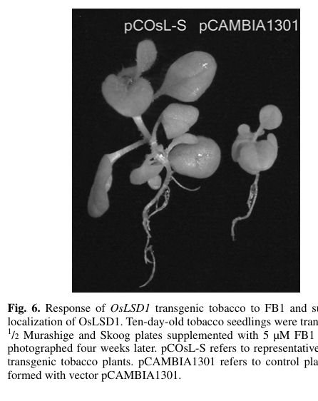

## Question

# Gene Research for Functional Annotation

## ⚠️ CRITICAL: Gene/Protein Identification Context

**BEFORE YOU BEGIN RESEARCH:** You MUST verify you are researching the CORRECT gene/protein. Gene symbols can be ambiguous, especially for less well-characterized genes from non-model organisms.

### Target Gene/Protein Identity (from UniProt):
- **UniProt Accession:** Q0J7V9
- **Protein Description:** RecName: Full=Protein LSD1; AltName: Full=Protein LESION SIMULATING DISEASE 1; Short=OsLSD1; AltName: Full=Putative zinc finger LSD1;
- **Gene Information:** Name=LSD1; OrderedLocusNames=Os08g0159500, LOC_Os08g06280; ORFNames=OsJ_26122;
- **Organism (full):** Oryza sativa subsp. japonica (Rice).
- **Protein Family:** Not specified in UniProt
- **Key Domains:** LSD1-like. (IPR040319); Multihaem_cyt_sf. (IPR036280); Znf_LSD1. (IPR005735); zf-LSD1 (PF06943)

### MANDATORY VERIFICATION STEPS:

1. **Check if the gene symbol "LSD1" matches the protein description above**
2. **Verify the organism is correct:** Oryza sativa subsp. japonica (Rice).
3. **Check if protein family/domains align with what you find in literature**
4. **If you find literature for a DIFFERENT gene with the same or similar symbol, STOP**

### If Gene Symbol is Ambiguous or You Cannot Find Relevant Literature:

**DO NOT PROCEED WITH RESEARCH ON A DIFFERENT GENE.** Instead:
- State clearly: "The gene symbol 'LSD1' is ambiguous or literature is limited for this specific protein"
- Explain what you found (e.g., "Found extensive literature on a different gene with the same symbol in a different organism")
- Describe the protein based ONLY on the UniProt information provided above
- Suggest that the protein function can be inferred from domain/family information

### Research Target:

Please provide a comprehensive research report on the gene **LSD1** (gene ID: LSD1, UniProt: Q0J7V9) in ORYSJ.

The research report should be a detailed narrative explaining the function, biological processes, and localization of the gene product. Citations should be given for all claims.

You should prioritize authoritative reviews and primary scientific literature when conducting research. You can supplement
this with annotations you find in gene/protein databases, but these can be outdated or inaccurate.

We are specifically interested in the primary function of the gene - for enzymes, what reaction is catalyzed, and what is the substrate specificity? For transporters, what is the substrate? For structural proteins or adapters, what is the broader structural role? For signaling molecules, what is the role in the pathway.

We are interested in where in or outside the cell the gene product carries out its function.

We are also interested in the signaling or biochemical pathways in which the gene functions. We are less interested in broad pleiotropic effects, except where these elucidate the precise role.

Include evidence where possible. We are interested in both experimental evidence as well as inference from structure, evolution, or bioinformatic analysis. Precise studies should be prioritized over high-throughput, where available.

## Output

Question: You are an expert researcher providing comprehensive, well-cited information.

Provide detailed information focusing on:
1. Key concepts and definitions with current understanding
2. Recent developments and latest research (prioritize 2023-2024 sources)
3. Current applications and real-world implementations
4. Expert opinions and analysis from authoritative sources
5. Relevant statistics and data from recent studies

Format as a comprehensive research report with proper citations. Include URLs and publication dates where available.
Always prioritize recent, authoritative sources and provide specific citations for all major claims.

# Gene Research for Functional Annotation

## ⚠️ CRITICAL: Gene/Protein Identification Context

**BEFORE YOU BEGIN RESEARCH:** You MUST verify you are researching the CORRECT gene/protein. Gene symbols can be ambiguous, especially for less well-characterized genes from non-model organisms.

### Target Gene/Protein Identity (from UniProt):
- **UniProt Accession:** Q0J7V9
- **Protein Description:** RecName: Full=Protein LSD1; AltName: Full=Protein LESION SIMULATING DISEASE 1; Short=OsLSD1; AltName: Full=Putative zinc finger LSD1;
- **Gene Information:** Name=LSD1; OrderedLocusNames=Os08g0159500, LOC_Os08g06280; ORFNames=OsJ_26122;
- **Organism (full):** Oryza sativa subsp. japonica (Rice).
- **Protein Family:** Not specified in UniProt
- **Key Domains:** LSD1-like. (IPR040319); Multihaem_cyt_sf. (IPR036280); Znf_LSD1. (IPR005735); zf-LSD1 (PF06943)

### MANDATORY VERIFICATION STEPS:

1. **Check if the gene symbol "LSD1" matches the protein description above**
2. **Verify the organism is correct:** Oryza sativa subsp. japonica (Rice).
3. **Check if protein family/domains align with what you find in literature**
4. **If you find literature for a DIFFERENT gene with the same or similar symbol, STOP**

### If Gene Symbol is Ambiguous or You Cannot Find Relevant Literature:

**DO NOT PROCEED WITH RESEARCH ON A DIFFERENT GENE.** Instead:
- State clearly: "The gene symbol 'LSD1' is ambiguous or literature is limited for this specific protein"
- Explain what you found (e.g., "Found extensive literature on a different gene with the same symbol in a different organism")
- Describe the protein based ONLY on the UniProt information provided above
- Suggest that the protein function can be inferred from domain/family information

### Research Target:

Please provide a comprehensive research report on the gene **LSD1** (gene ID: LSD1, UniProt: Q0J7V9) in ORYSJ.

The research report should be a detailed narrative explaining the function, biological processes, and localization of the gene product. Citations should be given for all claims.

You should prioritize authoritative reviews and primary scientific literature when conducting research. You can supplement
this with annotations you find in gene/protein databases, but these can be outdated or inaccurate.

We are specifically interested in the primary function of the gene - for enzymes, what reaction is catalyzed, and what is the substrate specificity? For transporters, what is the substrate? For structural proteins or adapters, what is the broader structural role? For signaling molecules, what is the role in the pathway.

We are interested in where in or outside the cell the gene product carries out its function.

We are also interested in the signaling or biochemical pathways in which the gene functions. We are less interested in broad pleiotropic effects, except where these elucidate the precise role.

Include evidence where possible. We are interested in both experimental evidence as well as inference from structure, evolution, or bioinformatic analysis. Precise studies should be prioritized over high-throughput, where available.

# Research Report: Functional Annotation of Rice **LSD1 / OsLSD1** (UniProt **Q0J7V9**; loci **LOC_Os08g06280 / Os08g0159500**) in *Oryza sativa* subsp. *japonica*

## Executive summary
Rice **OsLSD1 (LESION SIMULATING DISEASE 1-like; “Protein LSD1”)** is a **plant-specific, small C2C2 zinc-finger protein** that functions as a **context-dependent regulator of programmed cell death (PCD)** and is implicated in **blast disease responses** and **tissue culture/callus differentiation**. Primary experimental work in rice indicates OsLSD1 acts largely as a **negative regulator of PCD**, while **promoting callus differentiation/regeneration**, and its manipulation can alter **defense marker expression** and **resistance phenotypes**. OsLSD1 is also positioned mechanistically within PCD signaling via **protein–protein interactions with rice type I metacaspases**. A recent (2024) rice GWAS nominates OsLSD1 as a **candidate gene affecting callus induction rate**, reinforcing potential relevance to transformation/regeneration pipelines. (wang2005oslsd1arice pages 1-2, wang2005oslsd1arice pages 2-4, huang2015stressresponsiveexpressionsubcellular pages 13-15, huang2015stressresponsiveexpressionsubcellular pages 1-3, song2024acyclingene pages 2-4)

## 0) Mandatory gene/protein identity verification (disambiguation)
### Correct target: **rice OsLSD1 / LESION SIMULATING DISEASE 1-like zinc finger protein**
The symbol **“LSD1”** is ambiguous across biology (notably, in mammals it often refers to **lysine-specific demethylase 1/KDM1A**, a large FAD-dependent amine oxidase). The rice protein requested here (UniProt Q0J7V9) matches the **plant “LESION SIMULATING DISEASE 1” class**, which is **small (~143 aa)** and defined by **multiple C2C2 zinc-finger motifs**, not an amine-oxidase/demethylase domain. (wang2005oslsd1arice pages 1-2, wang2005oslsd1arice pages 2-4)

### Evidence linking OsLSD1 to rice genome identifiers
* **Wang et al., 2005** cloned OsLSD1 (GenBank **AY525368**) from rice and mapped it to **chromosome 8** (PAC clone P0672D01), providing size and domain features that match the UniProt description of a small LSD1-like zinc-finger protein. (wang2005oslsd1arice pages 2-4)
* A rice ZFP/blast-interaction study explicitly lists **OsLSD1 = LOC_Os08g06280**. (li2014identificationandnetwork pages 1-2)
* A rice lesion-mimic mutant review table lists OsLSD1 in the context of rice lesion/PCD genes and includes **Os08g0159500** and other LSD-like entries, consistent with the user-provided ordered locus name set. (kang2021ricelesionmimic pages 4-4)

## 1) Key concepts and definitions (current understanding)
### 1.1 Programmed cell death (PCD) and hypersensitive response (HR)
In plant immunity, the **hypersensitive response (HR)** is a localized cell death program associated with defense signaling, often occurring alongside a burst of **reactive oxygen species (ROS)** and induction of pathogenesis-related (PR) genes. Lesion mimic phenotypes (spontaneous lesions without pathogens) are frequently used to dissect HR/PCD pathways. OsLSD1 was identified specifically in this conceptual framework: a rice functional homolog of Arabidopsis LSD1 that participates in HR/PCD regulation. (wang2005oslsd1arice pages 1-2)

### 1.2 LSD1/LOL family proteins as ROS–PCD “threshold” regulators
Work in Arabidopsis provides a widely used conceptual model for LSD1-like proteins: the plant-specific zinc-finger proteins **LSD1** (negative regulator) and **LOL1** (positive regulator) antagonistically regulate ROS-associated cell death and may set a **threshold** for commitment to PCD, partly via effects on antioxidant systems such as Cu/Zn superoxide dismutases. Although these mechanistic models were built in Arabidopsis, OsLSD1 is considered part of the same plant-specific family and is frequently interpreted through this ROS/PCD-threshold lens. (epple2003antagonisticcontrolof pages 5-6, epple2003antagonisticcontrolof pages 4-5)

## 2) Molecular features of rice OsLSD1 (Q0J7V9)
### 2.1 Protein size, motifs, and gene structure
In rice, OsLSD1 encodes a predicted protein of **143 amino acids (~14.8 kDa)** with **three internally conserved C2C2-type zinc-finger motifs** described by the consensus **CxxCxxLLMYxxGAxSVxCxxC**. (wang2005oslsd1arice pages 1-2, wang2005oslsd1arice pages 2-4)

Wang et al. report:
* cDNA length **988 bp** with **432 bp ORF** (AY525368). (wang2005oslsd1arice pages 2-4)
* Genomic locus length **2,971 bp**, consisting of **six exons and five introns**. (wang2005oslsd1arice pages 2-4)
* OsLSD1 behaves as a **single-copy** gene by Southern hybridization across multiple cultivars. (wang2005oslsd1arice pages 2-4, wang2005oslsd1arice pages 1-2)

### 2.2 Subcellular localization
An **OsLSD1–GFP fusion** was reported as **nuclear localized** in tobacco cells, consistent with a role in transcriptional regulation or nuclear protein complexes controlling PCD and differentiation. (wang2005oslsd1arice pages 1-2)

## 3) Biological functions and pathways
### 3.1 Core function in rice: negative regulation of PCD, modulation of HR-like responses
In rice, antisense suppression of OsLSD1 produced a **lesion mimic phenotype** and **accelerated HR cell death** upon inoculation with avirulent blast isolates, along with **increased PR-1 mRNA**—consistent with OsLSD1 functioning as a **negative regulator of PCD/HR-like cell death**. (wang2005oslsd1arice pages 1-2, wang2005oslsd1arice pages 2-4)

Environmental modulation (light/temperature) is reported for lesion phenotypes, highlighting that OsLSD1-linked cell death outcomes are **condition-dependent**. (wang2005oslsd1arice pages 6-7)

### 3.2 Callus differentiation and tissue culture competence
OsLSD1 overexpression promotes callus differentiation/regeneration:
* Differentiation time of hygromycin-resistant calli decreased from **~7–10 days (control)** to **~3–5 days** with OsLSD1 overexpression. (wang2005oslsd1arice pages 2-4)
* Overexpression increased chlorophyll b content and altered chlorophyll composition; Table 1 reports chlorophyll quantities (mg/g fresh weight) across representative lines (e.g., line S9 chlorophyll b **0.444 ± 0.004** vs WT **0.209 ± 0.006**). (wang2005oslsd1arice pages 2-4)

These data support a model in which OsLSD1 has a **dual role**: restraining PCD while **promoting differentiation/regeneration** in tissue culture contexts. (wang2005oslsd1arice pages 1-2, wang2005oslsd1arice pages 2-4)

### 3.3 Disease resistance: blast interactions and defense marker induction
OsLSD1 is repeatedly linked to rice blast disease responses:
* In the original rice study, both **sense (overexpression)** and **antisense** OsLSD1 transgenic rice exhibited **significantly enhanced resistance** to a virulent blast isolate, though via potentially different physiological routes (antisense associated with heightened HR/defense gene induction; overexpression associated with growth/chlorophyll changes and toxin tolerance). (wang2005oslsd1arice pages 1-2, wang2005oslsd1arice pages 2-4, wang2005oslsd1arice pages 6-7)
* A subsequent rice ZFP/blast interaction analysis lists **OsLSD1 (LOC_Os08g06280)** among ZFP families associated with defense against *Magnaporthe oryzae*, and reports LSD1-family expression was **repressed** by *M. oryzae* inoculation in their dataset. (li2014identificationandnetwork pages 1-2)

### 3.4 Mechanistic placement: interaction with metacaspases (PCD protease network)
Plant metacaspases are caspase-like proteases implicated in PCD regulation. In rice:
* Yeast two-hybrid assays showed **type I metacaspases OsMC1/OsMC2/OsMC3 interact with OsLSD1** (and OsLSD3) but not with OsLSD2/OsLOL1/OsLOL2, positioning OsLSD1 in metacaspase-linked PCD signaling. (huang2015stressresponsiveexpressionsubcellular pages 13-15)
* OsMC3 was reported to interact **only with OsLSD1** in one summary of interactions. (huang2015stressresponsiveexpressionsubcellular pages 1-3)

The authors further propose these interactions may occur in the nucleus (supported indirectly by nuclear localization of OsMC1 and prior nuclear localization evidence for an LSD1 homolog), though in vivo confirmation is explicitly noted as needed. (huang2015stressresponsiveexpressionsubcellular pages 13-15)

## 4) Expression and regulation
### 4.1 Light responsiveness
OsLSD1 expression is **light-induced / dark-suppressed**:
* Dark treatment reduced OsLSD1 transcripts at **4 h and 24 h** in darkness; re-exposure to light restored transcript accumulation within **~4–5 h**. (wang2005oslsd1arice pages 2-4)

### 4.2 Tissue expression
RT-PCR indicated OsLSD1 expression is detectable constitutively in **root, stem, and leaf** (as reported in Wang et al.). (wang2005oslsd1arice pages 2-4)

## 5) Recent developments (prioritizing 2023–2024)
### 5.1 2024 GWAS nominates OsLSD1 as a callus-induction candidate gene
A 2024 rice GWAS on callus induction rate (CIR)—important for transformation and breeding pipelines—analyzed:
* **368 rice accessions**
* **994,188 SNPs**
* Identified **104 significant SNP loci**
* Nominated **13 high-confidence candidate genes**, including **OsLSD1**, citing prior evidence for roles in callus differentiation. (song2024acyclingene pages 2-4)

This is the strongest tool-accessible 2024 linkage connecting natural variation near OsLSD1 to tissue culture performance, although the paper did not functionally validate OsLSD1 directly. (song2024acyclingene pages 2-4)

### 5.2 2024–era expert framing: crop improvement leverage points and constraints
A focused 2019 review (still widely cited) argues LSD1/EDS1/PAD4 modules are attractive engineering targets because they coordinate **ROS and hormone signaling** (SA/ET) and acclimation responses, and highlights genome editing (e.g., CRISPR/Cas9) as a practical route for crop improvement—while emphasizing environment-dependent and pleiotropic outcomes that require careful tuning. (bernacki2019biotechnologicalpotentialof pages 1-3)

Rice-specific data in that review include that LSD1 antisense rice shows PR1 upregulation and lesion phenotype consistent with LSD1 as a negative regulator of cell death, and that expressing rice LSD1 in tobacco enhanced mycotoxin resistance. (bernacki2019biotechnologicalpotentialof pages 9-11)

## 6) Current applications and real-world implementations
### 6.1 Plant transformation and regeneration
Because OsLSD1 overexpression materially shortens callus differentiation time (7–10 days to 3–5 days) and is now implicated by GWAS as a CIR-associated candidate, OsLSD1 is conceptually relevant for:
* optimizing **Agrobacterium-mediated transformation pipelines** (callus induction/differentiation efficiency), and
* improving genotype-independent tissue culture response, a known bottleneck in rice functional genomics and breeding. (wang2005oslsd1arice pages 2-4, song2024acyclingene pages 2-4)

### 6.2 Disease resistance engineering and risk tradeoffs
OsLSD1 manipulation affects blast resistance phenotypes in transgenic experiments, and authors explicitly proposed OsLSD1 as a candidate for engineering crops with useful traits. (wang2005oslsd1arice pages 6-7)

However, expert synthesis emphasizes that LSD1-like regulation of ROS/PCD is highly context-dependent (environment, stress combinations), and engineering strategies must avoid runaway cell death and yield penalties by controlling expression level/tissue specificity or by targeting network partners. (bernacki2019biotechnologicalpotentialof pages 1-3, epple2003antagonisticcontrolof pages 5-6)

## 7) Relevant statistics and data highlights
### 7.1 Experimental scale and measured outcomes (Wang et al., 2005)
* Independent transgenic rice lines generated: **235** (sense), **161** (antisense), **106** (vector control). (wang2005oslsd1arice pages 2-4)
* Confirmed lines by Southern: **14** sense and **16** antisense; transgene copy number: **1–2 copies**. (wang2005oslsd1arice pages 2-4)
* Expression: selected lines had **>30-fold** higher OsLSD1 mRNA/antisense RNA; some sense lines showed **30–90×** mRNA accumulation without visible cell death. (wang2005oslsd1arice pages 2-4, wang2005oslsd1arice pages 6-7)
* Callus differentiation time reduction: **7–10 days → 3–5 days** with overexpression. (wang2005oslsd1arice pages 2-4)
* Chlorophyll quantities (examples, mg/g fresh weight): S9 chlorophyll b **0.444 ± 0.004**; WT chlorophyll b **0.209 ± 0.006** (values vary by line and construct). (wang2005oslsd1arice pages 2-4)

### 7.2 GWAS scale (Song et al., 2024)
* **368 accessions**, **994,188 SNPs**, **104 significant SNP loci**, **13 candidate genes** nominated; OsLSD1 included based on prior annotation and transcriptome overlap. (song2024acyclingene pages 2-4)

## 8) Expert opinions and authoritative analyses
### 8.1 Threshold model and antagonism within LSD1-like family
Arabidopsis data support the idea that LSD1-like proteins (LSD1 vs LOL1) act antagonistically to gate ROS-associated PCD, potentially functioning like competing transcriptional regulators or scaffold proteins and establishing a threshold for death commitment. This framework is widely invoked for interpreting OsLSD1-like proteins in crops. (epple2003antagonisticcontrolof pages 5-6, epple2003antagonisticcontrolof pages 4-5)

### 8.2 Biotechnology perspective (LSD1/EDS1/PAD4 network)
The crop-biotech review argues LSD1/EDS1/PAD4 nodes can affect **PCD, immunity, abiotic stress acclimation, cell wall modification, yield/biomass traits, and water-use efficiency**, and are thus candidates for breeding and genome editing. It emphasizes ortholog presence in crops (including rice) and stresses the importance of balancing resistance with growth given environment-dependence. (bernacki2019biotechnologicalpotentialof pages 1-3)

## 9) Visual evidence from primary literature
A representative figure from the rice OsLSD1 primary study shows **FB1 (fumonisin B1) treatment outcomes** in transgenic tobacco seedlings, illustrating the reported phenotype of enhanced tolerance associated with OsLSD1 overexpression (note: the paper states GFP localization images were “data not shown”). (wang2005oslsd1arice media ab6a47f9)

## Evidence map (quick reference)
| Claim/Aspect | Key evidence/details | Source | DOI/URL | Pub date |
|---|---|---|---|---|
| Identity / disambiguation | Rice **OsLSD1** is a plant-specific small zinc-finger protein, not the mammalian LSD1/KDM1A demethylase. Cloned as **GenBank AY525368** from *Oryza sativa*; cDNA **988 bp**, ORF **432 bp**, predicted protein **143 aa** (~**14.8 kDa**), mapped to **chromosome 8** (PAC clone P0672D01). Rice literature also links OsLSD1 to **LOC_Os08g06280** and review/table evidence links the family entry to **Os08g0159500**. (wang2005oslsd1arice pages 2-4, wang2005oslsd1arice pages 1-2, kang2021ricelesionmimic pages 4-4, li2014identificationandnetwork pages 1-2) | Wang 2005, *Molecular Plant-Microbe Interactions*; Li 2014, *POJ*; Kang 2021, *Plants* | https://doi.org/10.1094/mpmi-18-0375 ; https://doi.org/10.3316/informit.897038318452468 ; https://doi.org/10.3390/plants10081598 | May 2005; 2014; Aug 2021 |
| Domains / family features | OsLSD1 contains **three internally conserved C2C2-type zinc finger / LSD1-like domains** with consensus motif reported as **CxxCxxLLMYxxGAxSVxCxxC**; it shows **58% identity** to Arabidopsis LSD1 and **85% identity** to Arabidopsis LOL1. Rice lesion-mimic review classifies it as a **C2C2-type zinc finger protein**. (wang2005oslsd1arice pages 1-2, kang2021ricelesionmimic pages 4-4) | Wang 2005, *Molecular Plant-Microbe Interactions*; Kang 2021, *Plants* | https://doi.org/10.1094/mpmi-18-0375 ; https://doi.org/10.3390/plants10081598 | May 2005; Aug 2021 |
| Subcellular localization | **OsLSD1-GFP localized to the nucleus** in tobacco cells/root tips, supporting nuclear function. A later metacaspase study notes OsMC1–OsLSD1 interaction may occur in the nucleus and cites nucleus-localized LSD1 homolog evidence. (wang2005oslsd1arice pages 1-2, huang2015stressresponsiveexpressionsubcellular pages 13-15) | Wang 2005, *Molecular Plant-Microbe Interactions*; Huang 2015, *International Journal of Molecular Sciences* | https://doi.org/10.1094/mpmi-18-0375 ; https://doi.org/10.3390/ijms160716216 | May 2005; Jul 2015 |
| Function in programmed cell death (PCD) | Core interpretation: OsLSD1 is a **negative regulator of plant PCD**. **Antisense** suppression produced **lesion mimic phenotype**, increased **PR-1 mRNA**, and **accelerated hypersensitive response** to avirulent blast isolates; overexpression in tobacco enhanced tolerance to the PCD-inducing toxin **fumonisin B1 (FB1)**. Reviews summarize OsLSD1 as regulating **PCD and hypersensitive response**. (wang2005oslsd1arice pages 1-2, wang2005oslsd1arice pages 2-4, wang2005oslsd1arice pages 6-7, huang2015stressresponsiveexpressionsubcellular pages 1-3, kang2021ricelesionmimic pages 4-4) | Wang 2005, *Molecular Plant-Microbe Interactions*; Huang 2015, *International Journal of Molecular Sciences*; Kang 2021, *Plants* | https://doi.org/10.1094/mpmi-18-0375 ; https://doi.org/10.3390/ijms160716216 ; https://doi.org/10.3390/plants10081598 | May 2005; Jul 2015; Aug 2021 |
| Callus differentiation / regeneration | Overexpression of OsLSD1 **accelerated callus differentiation** and plant regeneration. In transformed rice calli, differentiation time decreased from **7–10 days** in vector controls to **3–5 days** in OsLSD1-overexpression lines. Authors conclude OsLSD1 plays a **positive role in callus differentiation**. (wang2005oslsd1arice pages 1-2, wang2005oslsd1arice pages 2-4) | Wang 2005, *Molecular Plant-Microbe Interactions* | https://doi.org/10.1094/mpmi-18-0375 | May 2005 |
| Disease resistance / blast interaction | OsLSD1 is linked to rice blast defense. In Wang et al., both **sense and antisense** transgenics showed **significantly enhanced resistance** to a virulent blast isolate; antisense plants also showed faster defense/HR responses to avirulent blast. Expression/network analysis later listed **OsLSD1 (LOC_Os08g06280)** among rice ZFP genes associated with defense against *Magnaporthe oryzae*, and reported the **LSD1 family was repressed** after inoculation in their expression dataset. (wang2005oslsd1arice pages 1-2, wang2005oslsd1arice pages 2-4, wang2005oslsd1arice pages 6-7, li2014identificationandnetwork pages 1-2) | Wang 2005, *Molecular Plant-Microbe Interactions*; Li 2014, *POJ* | https://doi.org/10.1094/mpmi-18-0375 ; https://doi.org/10.3316/informit.897038318452468 | May 2005; 2014 |
| Interaction partners | Yeast two-hybrid assays showed **OsMC1, OsMC2, and OsMC3 interact with OsLSD1 and OsLSD3**, but not with OsLSD2/OsLOL1/OsLOL2; **OsMC3 only interacted with OsLSD1** in one summary. N- and C-terminal regions of **OsMC1** also interacted with OsLSD1. These data place OsLSD1 in metacaspase-linked PCD signaling. (huang2015stressresponsiveexpressionsubcellular pages 13-15, huang2015stressresponsiveexpressionsubcellular pages 1-3) | Huang 2015, *International Journal of Molecular Sciences* | https://doi.org/10.3390/ijms160716216 | Jul 2015 |
| Expression regulation | OsLSD1 transcript abundance is **light-induced / dark-suppressed**: after **24 h dark** treatment, transcript levels decreased markedly by **4 h** and **24 h** in darkness, then recovered after re-exposure to light (**4–5 h**). RT-PCR detected constitutive expression in **root, stem, and leaf**. (wang2005oslsd1arice pages 1-2, wang2005oslsd1arice pages 2-4) | Wang 2005, *Molecular Plant-Microbe Interactions* | https://doi.org/10.1094/mpmi-18-0375 | May 2005 |
| Recent GWAS association (2024) | A 2024 rice GWAS for **callus induction rate (CIR)** used **368 accessions** and **994,188 SNPs**, identifying **104 significant SNPs** and **13 candidate genes**. **OsLSD1** was nominated as a candidate based on annotation/transcriptome overlap, reinforcing prior evidence that OsLSD1 contributes to callus differentiation, although this study did **not** functionally validate OsLSD1 directly. (song2024acyclingene pages 2-4) | Song 2024, *Rice* | https://doi.org/10.1186/s12284-024-00742-8 | Oct 2024 |

*Table: This table compiles key evidence for rice OsLSD1/Protein LSD1 (UniProt Q0J7V9; LOC_Os08g06280; Os08g0159500), emphasizing identity verification, molecular features, biological roles, and recent 2024 genetic association data. It is useful as a compact evidence map linking specific claims to primary and review sources.*

## Limitations of this report (tool-access constraints)
* Direct retrieval of UniProt/InterPro/RAP-DB pages for Q0J7V9 was not possible with the provided tools in this run; therefore, domain identifiers (e.g., InterPro/Pfam accessions) are supported indirectly through the primary literature’s motif/domain descriptions and cross-study gene identifiers rather than direct database text. (wang2005oslsd1arice pages 1-2, li2014identificationandnetwork pages 1-2, kang2021ricelesionmimic pages 4-4)
* Tool-accessible 2023–2024 rice OsLSD1 primary mechanistic studies were limited; the main 2024 advance available here is the GWAS nomination in callus induction. (song2024acyclingene pages 2-4)

## Key primary sources (with URLs and publication dates)
* Wang L. et al. **OsLSD1, a rice zinc finger protein, regulates programmed cell death and callus differentiation.** *Molecular Plant-Microbe Interactions* (May **2005**). https://doi.org/10.1094/mpmi-18-0375 (wang2005oslsd1arice pages 1-2)
* Huang L. et al. **Stress-responsive expression, subcellular localization and protein–protein interactions of the rice metacaspase family.** *Int. J. Mol. Sci.* (Jul **2015**). https://doi.org/10.3390/ijms160716216 (huang2015stressresponsiveexpressionsubcellular pages 13-15)
* Song W. et al. **A Cyclin Gene OsCYCB1;5 Regulates Seed Callus Induction in Rice Revealed by GWAS.** *Rice* (Oct **2024**). https://doi.org/10.1186/s12284-024-00742-8 (song2024acyclingene pages 2-4)
* Bernacki M.J. et al. **Biotechnological Potential of LSD1, EDS1, and PAD4 in the Improvement of Crops and Industrial Plants.** *Plants* (Aug **2019**). https://doi.org/10.3390/plants8080290 (bernacki2019biotechnologicalpotentialof pages 1-3)
* Epple P. et al. **Antagonistic control of oxidative stress-induced cell death in Arabidopsis by two related, plant-specific zinc finger proteins.** *PNAS* (May **2003**). https://doi.org/10.1073/pnas.1130421100 (epple2003antagonisticcontrolof pages 4-5)

References

1. (wang2005oslsd1arice pages 1-2): Lijuan Wang, Zhongyou Pei, Yingchuan Tian, and Chaozu He. Oslsd1, a rice zinc finger protein, regulates programmed cell death and callus differentiation. Molecular plant-microbe interactions : MPMI, 18 5:375-84, May 2005. URL: https://doi.org/10.1094/mpmi-18-0375, doi:10.1094/mpmi-18-0375. This article has 196 citations.

2. (wang2005oslsd1arice pages 2-4): Lijuan Wang, Zhongyou Pei, Yingchuan Tian, and Chaozu He. Oslsd1, a rice zinc finger protein, regulates programmed cell death and callus differentiation. Molecular plant-microbe interactions : MPMI, 18 5:375-84, May 2005. URL: https://doi.org/10.1094/mpmi-18-0375, doi:10.1094/mpmi-18-0375. This article has 196 citations.

3. (huang2015stressresponsiveexpressionsubcellular pages 13-15): Lei Huang, Huijuan Zhang, Yongbo Hong, Shixia Liu, Dayong Li, and Fengming Song. Stress-responsive expression, subcellular localization and protein–protein interactions of the rice metacaspase family. International Journal of Molecular Sciences, 16:16216-16241, Jul 2015. URL: https://doi.org/10.3390/ijms160716216, doi:10.3390/ijms160716216. This article has 59 citations.

4. (huang2015stressresponsiveexpressionsubcellular pages 1-3): Lei Huang, Huijuan Zhang, Yongbo Hong, Shixia Liu, Dayong Li, and Fengming Song. Stress-responsive expression, subcellular localization and protein–protein interactions of the rice metacaspase family. International Journal of Molecular Sciences, 16:16216-16241, Jul 2015. URL: https://doi.org/10.3390/ijms160716216, doi:10.3390/ijms160716216. This article has 59 citations.

5. (song2024acyclingene pages 2-4): Wenjing Song, Jian Zhang, Wenyu Lu, Siyi Liang, Hairong Cai, Yuanyuan Guo, Shiyi Chen, Jiafeng Wang, Tao Guo, Hong Liu, and Dehua Rao. A cyclin gene oscycb1;5 regulates seed callus induction in rice revealed by genome wide association study. Rice, Oct 2024. URL: https://doi.org/10.1186/s12284-024-00742-8, doi:10.1186/s12284-024-00742-8. This article has 1 citations and is from a peer-reviewed journal.

6. (li2014identificationandnetwork pages 1-2): WT Li, WL Chen, C Yang, J Wang, L Yang, and M He. Identification and network construction of zinc finger protein (zfp) genes involved in the rice-'magnaporthe oryzae'interaction. Unknown journal, 2014. URL: https://doi.org/10.3316/informit.897038318452468, doi:10.3316/informit.897038318452468.

7. (kang2021ricelesionmimic pages 4-4): Sang Gu Kang, Kyung Eun Lee, Mahendra Singh, Pradeep Kumar, and Mohammad Nurul Matin. Rice lesion mimic mutants (lmm): the current understanding of genetic mutations in the failure of ros scavenging during lesion formation. Plants, 10:1598, Aug 2021. URL: https://doi.org/10.3390/plants10081598, doi:10.3390/plants10081598. This article has 46 citations.

8. (epple2003antagonisticcontrolof pages 5-6): Petra Epple, Amanda A. Mack, Veronica R. F. Morris, and Jeffery L. Dangl. Antagonistic control of oxidative stress-induced cell death in arabidopsis by two related, plant-specific zinc finger proteins. Proceedings of the National Academy of Sciences of the United States of America, 100:6831-6836, May 2003. URL: https://doi.org/10.1073/pnas.1130421100, doi:10.1073/pnas.1130421100. This article has 237 citations and is from a highest quality peer-reviewed journal.

9. (epple2003antagonisticcontrolof pages 4-5): Petra Epple, Amanda A. Mack, Veronica R. F. Morris, and Jeffery L. Dangl. Antagonistic control of oxidative stress-induced cell death in arabidopsis by two related, plant-specific zinc finger proteins. Proceedings of the National Academy of Sciences of the United States of America, 100:6831-6836, May 2003. URL: https://doi.org/10.1073/pnas.1130421100, doi:10.1073/pnas.1130421100. This article has 237 citations and is from a highest quality peer-reviewed journal.

10. (wang2005oslsd1arice pages 6-7): Lijuan Wang, Zhongyou Pei, Yingchuan Tian, and Chaozu He. Oslsd1, a rice zinc finger protein, regulates programmed cell death and callus differentiation. Molecular plant-microbe interactions : MPMI, 18 5:375-84, May 2005. URL: https://doi.org/10.1094/mpmi-18-0375, doi:10.1094/mpmi-18-0375. This article has 196 citations.

11. (bernacki2019biotechnologicalpotentialof pages 1-3): Maciej Jerzy Bernacki, Weronika Czarnocka, Magdalena Szechyńska-Hebda, Ron Mittler, and Stanisław Karpiński. Biotechnological potential of lsd1, eds1, and pad4 in the improvement of crops and industrial plants. Plants, 8:290, Aug 2019. URL: https://doi.org/10.3390/plants8080290, doi:10.3390/plants8080290. This article has 22 citations.

12. (bernacki2019biotechnologicalpotentialof pages 9-11): Maciej Jerzy Bernacki, Weronika Czarnocka, Magdalena Szechyńska-Hebda, Ron Mittler, and Stanisław Karpiński. Biotechnological potential of lsd1, eds1, and pad4 in the improvement of crops and industrial plants. Plants, 8:290, Aug 2019. URL: https://doi.org/10.3390/plants8080290, doi:10.3390/plants8080290. This article has 22 citations.

13. (wang2005oslsd1arice media ab6a47f9): Lijuan Wang, Zhongyou Pei, Yingchuan Tian, and Chaozu He. Oslsd1, a rice zinc finger protein, regulates programmed cell death and callus differentiation. Molecular plant-microbe interactions : MPMI, 18 5:375-84, May 2005. URL: https://doi.org/10.1094/mpmi-18-0375, doi:10.1094/mpmi-18-0375. This article has 196 citations.

## Artifacts

- [Edison artifact artifact-00](LSD1-deep-research-falcon_artifacts/artifact-00.md)

## Citations

1. li2014identificationandnetwork pages 1-2
2. kang2021ricelesionmimic pages 4-4
3. huang2015stressresponsiveexpressionsubcellular pages 13-15
4. huang2015stressresponsiveexpressionsubcellular pages 1-3
5. song2024acyclingene pages 2-4
6. bernacki2019biotechnologicalpotentialof pages 1-3
7. bernacki2019biotechnologicalpotentialof pages 9-11
8. epple2003antagonisticcontrolof pages 4-5
9. epple2003antagonisticcontrolof pages 5-6
10. https://doi.org/10.1094/mpmi-18-0375
11. https://doi.org/10.3316/informit.897038318452468
12. https://doi.org/10.3390/plants10081598
13. https://doi.org/10.3390/ijms160716216
14. https://doi.org/10.1186/s12284-024-00742-8
15. https://doi.org/10.3390/plants8080290
16. https://doi.org/10.1073/pnas.1130421100
17. https://doi.org/10.1094/mpmi-18-0375,
18. https://doi.org/10.3390/ijms160716216,
19. https://doi.org/10.1186/s12284-024-00742-8,
20. https://doi.org/10.3316/informit.897038318452468,
21. https://doi.org/10.3390/plants10081598,
22. https://doi.org/10.1073/pnas.1130421100,
23. https://doi.org/10.3390/plants8080290,