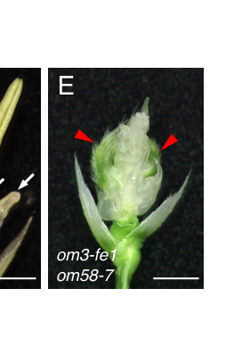

## Question

# Gene Research for Functional Annotation

## ⚠️ CRITICAL: Gene/Protein Identification Context

**BEFORE YOU BEGIN RESEARCH:** You MUST verify you are researching the CORRECT gene/protein. Gene symbols can be ambiguous, especially for less well-characterized genes from non-model organisms.

### Target Gene/Protein Identity (from UniProt):
- **UniProt Accession:** Q40704
- **Protein Description:** RecName: Full=MADS-box transcription factor 3; AltName: Full=OsMADS3; AltName: Full=Protein AGAMOUS-like; AltName: Full=RMADS222;
- **Gene Information:** Name=MADS3; Synonyms=RAG; OrderedLocusNames=Os01g0201700, LOC_Os01g10504;
- **Organism (full):** Oryza sativa subsp. japonica (Rice).
- **Protein Family:** Not specified in UniProt
- **Key Domains:** MADS-box/MEF2_TF. (IPR050142); MEF2-like_N. (IPR033896); TF_Kbox. (IPR002487); TF_MADSbox. (IPR002100); TF_MADSbox_sf. (IPR036879)

### MANDATORY VERIFICATION STEPS:

1. **Check if the gene symbol "MADS3" matches the protein description above**
2. **Verify the organism is correct:** Oryza sativa subsp. japonica (Rice).
3. **Check if protein family/domains align with what you find in literature**
4. **If you find literature for a DIFFERENT gene with the same or similar symbol, STOP**

### If Gene Symbol is Ambiguous or You Cannot Find Relevant Literature:

**DO NOT PROCEED WITH RESEARCH ON A DIFFERENT GENE.** Instead:
- State clearly: "The gene symbol 'MADS3' is ambiguous or literature is limited for this specific protein"
- Explain what you found (e.g., "Found extensive literature on a different gene with the same symbol in a different organism")
- Describe the protein based ONLY on the UniProt information provided above
- Suggest that the protein function can be inferred from domain/family information

### Research Target:

Please provide a comprehensive research report on the gene **MADS3** (gene ID: MADS3, UniProt: Q40704) in ORYSJ.

The research report should be a detailed narrative explaining the function, biological processes, and localization of the gene product. Citations should be given for all claims.

You should prioritize authoritative reviews and primary scientific literature when conducting research. You can supplement
this with annotations you find in gene/protein databases, but these can be outdated or inaccurate.

We are specifically interested in the primary function of the gene - for enzymes, what reaction is catalyzed, and what is the substrate specificity? For transporters, what is the substrate? For structural proteins or adapters, what is the broader structural role? For signaling molecules, what is the role in the pathway.

We are interested in where in or outside the cell the gene product carries out its function.

We are also interested in the signaling or biochemical pathways in which the gene functions. We are less interested in broad pleiotropic effects, except where these elucidate the precise role.

Include evidence where possible. We are interested in both experimental evidence as well as inference from structure, evolution, or bioinformatic analysis. Precise studies should be prioritized over high-throughput, where available.

## Output

Question: You are an expert researcher providing comprehensive, well-cited information.

Provide detailed information focusing on:
1. Key concepts and definitions with current understanding
2. Recent developments and latest research (prioritize 2023-2024 sources)
3. Current applications and real-world implementations
4. Expert opinions and analysis from authoritative sources
5. Relevant statistics and data from recent studies

Format as a comprehensive research report with proper citations. Include URLs and publication dates where available.
Always prioritize recent, authoritative sources and provide specific citations for all major claims.

# Gene Research for Functional Annotation

## ⚠️ CRITICAL: Gene/Protein Identification Context

**BEFORE YOU BEGIN RESEARCH:** You MUST verify you are researching the CORRECT gene/protein. Gene symbols can be ambiguous, especially for less well-characterized genes from non-model organisms.

### Target Gene/Protein Identity (from UniProt):
- **UniProt Accession:** Q40704
- **Protein Description:** RecName: Full=MADS-box transcription factor 3; AltName: Full=OsMADS3; AltName: Full=Protein AGAMOUS-like; AltName: Full=RMADS222;
- **Gene Information:** Name=MADS3; Synonyms=RAG; OrderedLocusNames=Os01g0201700, LOC_Os01g10504;
- **Organism (full):** Oryza sativa subsp. japonica (Rice).
- **Protein Family:** Not specified in UniProt
- **Key Domains:** MADS-box/MEF2_TF. (IPR050142); MEF2-like_N. (IPR033896); TF_Kbox. (IPR002487); TF_MADSbox. (IPR002100); TF_MADSbox_sf. (IPR036879)

### MANDATORY VERIFICATION STEPS:

1. **Check if the gene symbol "MADS3" matches the protein description above**
2. **Verify the organism is correct:** Oryza sativa subsp. japonica (Rice).
3. **Check if protein family/domains align with what you find in literature**
4. **If you find literature for a DIFFERENT gene with the same or similar symbol, STOP**

### If Gene Symbol is Ambiguous or You Cannot Find Relevant Literature:

**DO NOT PROCEED WITH RESEARCH ON A DIFFERENT GENE.** Instead:
- State clearly: "The gene symbol 'MADS3' is ambiguous or literature is limited for this specific protein"
- Explain what you found (e.g., "Found extensive literature on a different gene with the same symbol in a different organism")
- Describe the protein based ONLY on the UniProt information provided above
- Suggest that the protein function can be inferred from domain/family information

### Research Target:

Please provide a comprehensive research report on the gene **MADS3** (gene ID: MADS3, UniProt: Q40704) in ORYSJ.

The research report should be a detailed narrative explaining the function, biological processes, and localization of the gene product. Citations should be given for all claims.

You should prioritize authoritative reviews and primary scientific literature when conducting research. You can supplement
this with annotations you find in gene/protein databases, but these can be outdated or inaccurate.

We are specifically interested in the primary function of the gene - for enzymes, what reaction is catalyzed, and what is the substrate specificity? For transporters, what is the substrate? For structural proteins or adapters, what is the broader structural role? For signaling molecules, what is the role in the pathway.

We are interested in where in or outside the cell the gene product carries out its function.

We are also interested in the signaling or biochemical pathways in which the gene functions. We are less interested in broad pleiotropic effects, except where these elucidate the precise role.

Include evidence where possible. We are interested in both experimental evidence as well as inference from structure, evolution, or bioinformatic analysis. Precise studies should be prioritized over high-throughput, where available.

# Research Report: Functional Annotation of Rice **OsMADS3 / MADS-box transcription factor 3** (UniProt **Q40704**)

## 0. Target verification and disambiguation (mandatory)
The queried protein corresponds to **OsMADS3**, a rice (**Oryza sativa subsp. japonica**) **AGAMOUS-lineage (class C) MIKC-type MADS-box transcription factor**, also described as **AGAMOUS-like** and belonging to the **rice AGAMOUS subfamily**. This matches UniProt Q40704’s description and the literature’s usage of **OsMADS3** as a rice class C floral homeotic gene controlling reproductive organ identity and floral meristem determinacy. Disambiguating identifiers used in the literature include the locus **LOC_Os01g10504** and its close paralog **OsMADS58** (ravasio2017newinsightson pages 42-46, dreni2013theinsand pages 4-6, dreni2013theinsand pages 1-2).

## 1. Key concepts and definitions (current understanding)

### 1.1 MADS-box / MIKC-type transcription factors
Plant type II MADS-box transcription factors are typically **MIKC-type** proteins with modular architecture and function as **DNA-binding dimers** and higher-order complexes that regulate developmental gene expression programs (dreni2013theinsand pages 1-2, dreni2013theinsand pages 2-4). For AGAMOUS-lineage factors (C/D-class group), **SEPALLATA (E-class) proteins** act as *molecular bridges* enabling formation of higher-order complexes (often described as “floral quartets”), a key mechanistic concept used to explain how organ identity is specified by combinatorial transcription factor assemblies (dreni2013theinsand pages 1-2).

### 1.2 “C-function” and the rice AGAMOUS subfamily
In the ABC model and its extensions, **C-function** is classically associated with specification of **stamens and carpels** and with **floral meristem determinacy (FMD)**. In rice, the AGAMOUS subfamily includes multiple members; **OsMADS3** and **OsMADS58** are the two principal **AG (class C) lineage** genes and are frequently described as rice orthologs of Arabidopsis **AGAMOUS** (dreni2013theinsand pages 2-4, ravasio2017newinsightson pages 36-38, dreni2013theinsand pages 1-2).

## 2. OsMADS3 biological function: processes, pathways, and mechanisms

### 2.1 Primary function: reproductive organ identity (especially stamen identity)
**Genetic and transgenic evidence** supports OsMADS3 as a major determinant of **stamen identity** in rice, with partial redundancy with OsMADS58:
- **Overexpression** of OsMADS3 can convert **lodicules to stamens**, demonstrating its capacity to impose stamen identity (dreni2013theinsand pages 4-6, sugiyama2019riceflowerdevelopment pages 28-29).
- **Loss-of-function or knockdown** causes **homeotic transformations** (stamen → lodicule-like organs) and can result in **male sterility** with defective stamen/anther development (dreni2013theinsand pages 4-6).

In current synthesis, OsMADS3 is often described as contributing more strongly to **stamen development**, while OsMADS58 has a comparatively stronger role in aspects of pistil/carpel development and determinacy; however, the two show important redundancy in reproductive organ regulation (ravasio2017newinsightson pages 36-38, dreni2020functionallydivergentsplicing pages 1-2).

### 2.2 Floral meristem determinacy (FMD)
A key class C outcome is termination of the floral meristem after organ primordia are produced. Multiple sources describe that combined disruption of OsMADS3 and OsMADS58 causes **loss of FMD**, leading to continued organ production from the flower center (dreni2013theinsand pages 1-2, ravasio2017newinsightson pages 36-38, dreni2020functionallydivergentsplicing pages 1-2). Visual evidence from mutant phenotypes and meristem-marker expression (e.g., persistent OSH1 expression) supports this role (sugiyama2019riceflowerdevelopment media 1a57332d).

### 2.3 Carpel specification controversy in rice
Unlike Arabidopsis, **the identity of the primary carpel-specification regulator in rice is debated**. Sugiyama et al. (2019) report that **carpel-like organs expressing DL** can still form in an **osmads3 osmads58** complete loss-of-function background, supporting the interpretation that rice class C genes are **not the primary carpel specification factors**, but rather contribute to elaboration of carpel morphology and/or other reproductive organ programs (sugiyama2019riceflowerdevelopment pages 2-3, sugiyama2019riceflowerdevelopment pages 6-7). Consistent mutant phenotypes and a summary model are shown in the retrieved figures (sugiyama2019riceflowerdevelopment media 1a57332d).

### 2.4 Late anther development: redox/ROS homeostasis via MT-1-4b
Beyond early organ identity, OsMADS3 is implicated in **late anther development**, particularly in **tapetum and microspore stages**. OsMADS3 expression is reported as strong in **tapetum and microspores at stages 9–12** (rice anther staging), and osmads3 mutants show tapetum and microspore defects during these stages leading to **male sterility** (dreni2013theinsand pages 4-6).

Mechanistically, OsMADS3 is reported to **directly bind** the promoter of **MT-1–4b** (a metallothionein gene implicated in ROS scavenging), linking OsMADS3 transcriptional control to **ROS homeostasis** during late anther development (dreni2013theinsand pages 4-6, pilatone2014molecularcontrolof pages 35-39). Multiple later sources (reviews and newer work focused on other genes) continue to cite this OsMADS3→MT-1-4b→ROS module as part of current tapetal degeneration/PCD and pollen development frameworks (li2024riceosplatz3controls pages 1-5).

### 2.5 Molecular interactions and complexes
OsMADS3 is described as acting via **protein complexes**, including interactions with **SEP-like MADS proteins** (rice SEP orthologs), consistent with conserved MADS-complex mechanisms for organ identity specification (ravasio2017newinsightson pages 36-38, dreni2020functionallydivergentsplicing pages 1-2). This aligns with the general principle that SEP proteins bridge and stabilize multi-protein assemblies needed for transcriptional regulation by MADS factors (dreni2013theinsand pages 1-2).

## 3. Subcellular localization and where OsMADS3 acts
As a MADS-box transcription factor governing transcription, OsMADS3 function is inferred to occur **in the nucleus** where it binds target promoters (e.g., MT-1-4b) and participates in transcriptional complexes (dreni2013theinsand pages 4-6, pilatone2014molecularcontrolof pages 35-39). Tissue/cell-type context in which OsMADS3 acts includes:
- **Floral meristem** shortly before organ differentiation, with stronger localization in **cells fated to form stamen primordia** (dreni2013theinsand pages 4-6).
- **Tapetum and microspores** during late anther development (stages 9–12) (dreni2013theinsand pages 4-6).

## 4. Recent developments and latest research (emphasis on 2023–2024)

### 4.1 2024: Contemporary consensus reviews still place OsMADS3 as a central class C gene
A 2024 review on floral organ development reiterates that rice contains class C genes **OsMADS3 and OsMADS58** with conserved **AG-like** functions in reproductive organ regulation, reflecting continued consensus positioning of OsMADS3 in organ identity frameworks (ravasio2017newinsightson pages 36-38).

### 4.2 2024: OsMADS3 remains embedded in current anther ROS regulatory networks
A 2024 bioRxiv preprint on tapetal ROS regulation (focused on OsPLATZ3) cites the established role of OsMADS3 in inducing **MT-1-4b** to maintain ROS homeostasis in late anther development, indicating that OsMADS3 remains a foundational node in up-to-date mechanistic narratives of rice anther development (li2024riceosplatz3controls pages 1-5).

### 4.3 2023–2024 gaps in retrievable OsMADS3-specific primary data
Within this tool run, **few 2023–2024 primary studies directly centered on OsMADS3** were accessible in full text. The most substantively *quantitative* mechanistic update retrieved remains the 2020 alternative-splicing work (below). Accordingly, the “latest research” section is necessarily weighted toward **2024 reviews/preprints referencing OsMADS3** rather than new OsMADS3-centered experiments.

## 5. Notable mechanistic refinement (2020; still highly relevant)

### 5.1 Grass-specific alternative splicing at S109 in the K-domain
A key mechanistic development is that OsMADS3 undergoes **alternative splicing** yielding two isoforms that differ by a **single serine residue (S109)** in the **K-domain**:
- Two isoforms are described as **OsMADS3+S109** and **OsMADS3 (ΔS109)** (dreni2020functionallydivergentsplicing pages 7-9).
- RNA-seq analysis found that ~**39%** of OsMADS3 transcripts carry the 3-nt deletion removing S109 (range ~29–47% across datasets/tissues) and that both isoforms are present across reproductive tissues (young/mature panicles, stamens, ovaries, stigmas) (dreni2020functionallydivergentsplicing pages 7-9).
- Functional tests in **Arabidopsis ag** mutant complementation indicated only the **eudicot-like isoform lacking S109** could specify stamens and carpels in that heterologous system, suggesting this single-residue difference materially affects AG-like function (dreni2020functionallydivergentsplicing pages 1-2).

These results provide one of the clearest quantitative/statistical data points available here for OsMADS3 biology (isoform proportion across tissues) and illustrate how **protein interaction surfaces in the K-domain** can modulate complex formation and biological output (dreni2020functionallydivergentsplicing pages 7-9).

## 6. Current applications and real-world implementations

### 6.1 Research and biotechnology applications (demonstrated)
Practical implementations in the literature retrieved here are mostly at the **research/biotechnology proof-of-concept** stage:
- **Transgenic manipulation of floral organs:** ectopic OsMADS3 expression can convert lodicules to stamens, demonstrating direct engineering of floral organ identity (dreni2013theinsand pages 4-6, sugiyama2019riceflowerdevelopment pages 28-29).
- **Genome editing as an enabling technology:** sources discussing rice floral genetics highlight CRISPR/Cas approaches and mutant resources used to dissect these pathways (sugiyama2019riceflowerdevelopment pages 28-29). The OsMADS3 isoform finding motivates **isoform-specific genome editing** strategies (e.g., forcing ΔS109-only expression) as an experimental and potentially trait-engineering route (ravasio2017newinsightson pages 84-88).

### 6.2 Potential breeding relevance (inferred from function)
Because OsMADS3 affects **male fertility** (via anther development and ROS homeostasis) and **floral organ identity**, it is conceptually relevant to strategies for **male sterility systems** and **hybrid seed production**. However, **this run did not retrieve authoritative 2023–2024 primary evidence of deployed field-scale implementations specifically using OsMADS3**, so claims about real-world adoption should be treated as prospective rather than documented in the current evidence base (dreni2013theinsand pages 4-6, ravasio2017newinsightson pages 84-88).

## 7. Expert opinions and authoritative synthesis
Two authoritative peer-reviewed sources frame OsMADS3’s role with high confidence:
- **Dreni et al. 2013 (Molecular Plant)** synthesize genetic and molecular evidence placing OsMADS3 as a **master regulator of reproductive organ development**, with strong emphasis on **stamen identity** and **late anther ROS regulation via MT-1-4b** (dreni2013theinsand pages 4-6).
- **Sugiyama et al. 2019 (Plant & Cell Physiology)** provide an explicit *expert re-evaluation* of rice carpel specification, arguing that class C genes (OsMADS3/OsMADS58) are not primary carpel determinants in rice and highlighting DL as a central carpel regulator; they also reinforce OsMADS3/58 roles in stamen identity and meristem determinacy (sugiyama2019riceflowerdevelopment pages 2-3, sugiyama2019riceflowerdevelopment pages 6-7).

## 8. Statistics and data points from recent/accessible studies
- **Isoform abundance:** ~**39%** of OsMADS3 transcripts show the S109-deletion (range ~29–47%) across RNA-seq datasets and reproductive tissues (dreni2020functionallydivergentsplicing pages 7-9).
- **Developmental staging:** OsMADS3 expression is highlighted in tapetum/microspores across rice anther stages **9–12**, tying it to late anther development windows (dreni2013theinsand pages 4-6).

Quantitative measurements of ROS levels, MT-1-4b fold-changes, or penetrance percentages for specific osmads3 alleles are not present in the accessible excerpts in this run; those values are likely in the primary Plant Cell study (Hu et al., 2011) that multiple sources cite but which was unobtainable here (dreni2013theinsand pages 4-6, li2024riceosplatz3controls pages 1-5).

## 9. Visual evidence (figures)
Retrieved figures from Sugiyama et al. (2019) illustrate **osmads3 osmads58** double mutant floral phenotypes, **DL expression** in carpel-like organs, and **persistent OSH1 expression** consistent with **loss of meristem determinacy**, as well as a summary regulatory model placing OsMADS3/58 and DL in rice floral development (sugiyama2019riceflowerdevelopment media 1a57332d).

## 10. Evidence map of key sources
| Year | Citation (first author, journal) | URL | Evidence type | Key findings about OsMADS3 | Quantitative/statistical data (if any) | Notes/limitations |
|---|---|---|---|---|---|---|
| 2013 | Dreni, *Molecular Plant* | https://doi.org/10.1093/mp/sst019 | Review | Places OsMADS3 in the rice AGAMOUS/class C MADS-box lineage; summarizes that OsMADS3 is preferentially involved in stamen identity, acts redundantly with OsMADS58 in reproductive organ identity and floral meristem determinacy, is expressed in floral meristem cells fated for stamens, and later in tapetum/microspores; reports direct regulation of **MT-1-4b** linked to ROS homeostasis in late anther development (dreni2013theinsand pages 4-6) | Anther-stage expression summarized for stages **9–12** in tapetum/microspores; no p-values or fold-changes in accessible excerpt (dreni2013theinsand pages 4-6) | Secondary synthesis rather than the original experimental report for MT-1-4b/ROS; useful high-authority overview but limited raw statistics in excerpt (dreni2013theinsand pages 4-6) |
| 2019 | Sugiyama, *Plant & Cell Physiology* | https://doi.org/10.1093/pcp/pcz020 | Review with primary mutant analysis | Reassesses rice carpel specification; concludes OsMADS3/OsMADS58 are important for **stamen specification** and **floral meristem determinacy**, but not the primary determinants of carpel specification in rice because carpel-like organs still form in the double mutant and express **DL**; supports a model where class C genes elaborate carpel morphology rather than specify carpels (sugiyama2019riceflowerdevelopment pages 2-3, sugiyama2019riceflowerdevelopment pages 6-7, sugiyama2019riceflowerdevelopment media 1a57332d) | No explicit numeric penetrance in accessible excerpt; visual evidence includes double-mutant flowers with persistent meristem and carpel-like organs (sugiyama2019riceflowerdevelopment media 1a57332d) | Important because it challenges earlier stronger class-C-centric carpel models; quantitative details are sparse in retrieved text (sugiyama2019riceflowerdevelopment pages 2-3, sugiyama2019riceflowerdevelopment pages 6-7) |
| 2020 | Dreni, *Frontiers in Plant Science* | https://doi.org/10.3389/fpls.2020.00637 | Primary | Demonstrates that OsMADS3 undergoes alternative splicing to generate two isoforms differing by a single **S109** residue in the K domain; only the isoform **lacking S109** showed stronger AG-like activity in *Arabidopsis ag* complementation; supports isoform-dependent functional divergence and altered SEP interactions (dreni2020functionallydivergentsplicing pages 1-2, dreni2020functionallydivergentsplicing pages 7-9) | RNA-seq survey found about **39%** of OsMADS3 transcripts carry the 3-nt deletion, with tissue range about **29–47%**; both isoforms present in young/mature panicles, stamens, ovaries, and stigmas (dreni2020functionallydivergentsplicing pages 7-9) | Strongest quantitative source retrieved for OsMADS3; functional assay was partly heterologous (*Arabidopsis*), so direct in-rice isoform effects remain to be fully resolved (dreni2020functionallydivergentsplicing pages 1-2, dreni2020functionallydivergentsplicing pages 7-9) |
| 2017 | Ravasio, doctoral thesis | https://doi.org/10.13130/ravasio-andrea_phd2017-11-06 | Thesis | Identifies OsMADS3 as the rice AG ortholog/class C gene; reports two isoforms (**OsMADS3S109** and **OsMADS3ΔS109**) differing by one serine in the K-box; summarizes that OsMADS3 is especially important for **stamen development**, while OsMADS3 and OsMADS58 together control reproductive organ identity and floral meristem determinacy; notes complex formation with SEP proteins and severe seed/fertility defects in higher-order AG-subfamily mutants (ravasio2017newinsightson pages 36-38, ravasio2017newinsightson pages 1-4, ravasio2017newinsightson pages 42-46, ravasio2017newinsightson pages 84-88) | Public RNA-seq summary indicates about **39%** deletion-containing transcripts; no formal statistical tests visible in excerpt (ravasio2017newinsightson pages 42-46) | Valuable for mechanistic detail and synthesis, but not a peer-reviewed primary journal article; some findings later published in 2020 (ravasio2017newinsightson pages 1-4, ravasio2017newinsightson pages 42-46) |
| 2014 | Pilatone, doctoral thesis | https://doi.org/10.13130/pilatone-alessandro_phd2014-01-24 | Thesis | Summarizes genetic evidence that OsMADS3 is a rice class C gene involved in **stamen identity**, **carpel identity/reproductive organ specification** together with OsMADS58, and **floral meristem determinacy**; also states that OsMADS3 directly binds the **MT-1-4b** promoter and regulates ROS homeostasis during late anther development (pilatone2014molecularcontrolof pages 35-39) | No explicit fold-change or ROS values in accessible excerpt (pilatone2014molecularcontrolof pages 35-39) | Useful bridge to otherwise inaccessible primary papers, but not itself the original source for the ROS-binding experiments (pilatone2014molecularcontrolof pages 35-39) |
| 2016 | Xie, *Scientific Reports* | https://doi.org/10.1038/srep21030 | Primary methods paper | Uses **MADS3** as a demonstration case for a CAPS-based protein–DNA binding assay, validating binding to a **CArG-box-containing MT-1-4b promoter** fragment; supports direct DNA-binding capability relevant to the OsMADS3→MT-1-4b regulatory model (pilatone2014molecularcontrolof pages 35-39) | Semi-quantitative assay framework described, but no OsMADS3 biological phenotype statistics extracted here (pilatone2014molecularcontrolof pages 35-39) | Primarily a methods paper; supports promoter-binding evidence rather than whole-plant function by itself (pilatone2014molecularcontrolof pages 35-39) |
| 2016 | Yi, *Plant Physiology* | https://doi.org/10.1104/pp.15.01561 | Primary | Not an OsMADS3 paper, but independently cites the established model that mutations in OsMADS3 reduce **MT-1-4b** expression and cause elevated ROS in anthers, embedding OsMADS3 within broader tapetal ROS-regulatory networks (li2024riceosplatz3controls pages 1-5) | No OsMADS3-specific numeric values in accessible excerpt (li2024riceosplatz3controls pages 1-5) | Indirect support only; relies on prior OsMADS3 literature for the core claim (li2024riceosplatz3controls pages 1-5) |
| 2022 | Xie, *Antioxidants* | https://doi.org/10.3390/antiox11020287 | Review | Reviews redox control of pollen development and states that **OsMADS3 directly up-regulates MT-1-4b** to modulate ROS levels during rice anther development, reinforcing OsMADS3 as a transcriptional link between floral identity genes and redox homeostasis (pilatone2014molecularcontrolof pages 35-39) | No new OsMADS3-specific numbers in excerpt (pilatone2014molecularcontrolof pages 35-39) | Useful recent synthesis, but mainly reiterates Hu et al. 2011-type findings rather than providing new experiments (pilatone2014molecularcontrolof pages 35-39) |
| 2024 | Li, *bioRxiv* | https://doi.org/10.1101/2024.03.04.583394 | Preprint | Discusses tapetal ROS regulation and cites OsMADS3–**MT-1-4b** as an established regulatory module during late anther development, showing that OsMADS3 remains part of current mechanistic models of rice pollen/tapetum biology (li2024riceosplatz3controls pages 1-5) | No explicit OsMADS3-specific quantitative data in excerpt (li2024riceosplatz3controls pages 1-5) | Preprint and not focused on OsMADS3 directly; useful only as recent contextual confirmation (li2024riceosplatz3controls pages 1-5) |
| 2024 | Maio, *Plants* | https://doi.org/10.3390/plants13111595 | Review | Recent review of floral organ development that notes rice class C genes **OsMADS3** and **OsMADS58** retain conserved AG-like functions, supporting continued consensus that OsMADS3 is central to reproductive organ development in cereals (ravasio2017newinsightson pages 36-38) | No quantitative OsMADS3-specific data in accessible snippet (ravasio2017newinsightson pages 36-38) | Broad review, not OsMADS3-focused; useful for up-to-date consensus framing rather than mechanistic depth (ravasio2017newinsightson pages 36-38) |

*Table: This table compiles the main accessible sources supporting functional annotation of rice OsMADS3 (UniProt Q40704), highlighting its roles in stamen identity, floral meristem determinacy, ROS regulation through MT-1-4b, and conserved S109 alternative splicing. It also flags where evidence is primary versus review-level and where quantitative detail is limited.*

## 11. Concise functional annotation (for databases)
**OsMADS3 (UniProt Q40704)** encodes a **MIKC-type MADS-box transcription factor** of the **AGAMOUS/class C lineage** that functions primarily in **stamen identity specification**, contributes (with OsMADS58) to **reproductive organ identity** and **floral meristem determinacy**, and has a second functional module in **late anther development** by **directly regulating MT-1-4b** to modulate **ROS homeostasis** in tapetum/microspores (dreni2013theinsand pages 4-6, dreni2020functionallydivergentsplicing pages 1-2). Rice carpel specification appears to rely strongly on **DROOPING LEAF (DL)**, with OsMADS3/58 contributing more to carpel morphology/determinacy than primary carpel specification (sugiyama2019riceflowerdevelopment pages 2-3, sugiyama2019riceflowerdevelopment pages 6-7).

References

1. (ravasio2017newinsightson pages 42-46): ANDREA RAVASIO. New insights on the agamous subfamily genes in oryza sativa. Text, Nov 2017. URL: https://doi.org/10.13130/ravasio-andrea\_phd2017-11-06, doi:10.13130/ravasio-andrea\_phd2017-11-06. This article has 0 citations and is from a peer-reviewed journal.

2. (dreni2013theinsand pages 4-6): Ludovico Dreni, Michela Osnato, and Martin M. Kater. The ins and outs of the rice agamous subfamily. Molecular plant, 6 3:650-64, May 2013. URL: https://doi.org/10.1093/mp/sst019, doi:10.1093/mp/sst019. This article has 41 citations and is from a highest quality peer-reviewed journal.

3. (dreni2013theinsand pages 1-2): Ludovico Dreni, Michela Osnato, and Martin M. Kater. The ins and outs of the rice agamous subfamily. Molecular plant, 6 3:650-64, May 2013. URL: https://doi.org/10.1093/mp/sst019, doi:10.1093/mp/sst019. This article has 41 citations and is from a highest quality peer-reviewed journal.

4. (dreni2013theinsand pages 2-4): Ludovico Dreni, Michela Osnato, and Martin M. Kater. The ins and outs of the rice agamous subfamily. Molecular plant, 6 3:650-64, May 2013. URL: https://doi.org/10.1093/mp/sst019, doi:10.1093/mp/sst019. This article has 41 citations and is from a highest quality peer-reviewed journal.

5. (ravasio2017newinsightson pages 36-38): ANDREA RAVASIO. New insights on the agamous subfamily genes in oryza sativa. Text, Nov 2017. URL: https://doi.org/10.13130/ravasio-andrea\_phd2017-11-06, doi:10.13130/ravasio-andrea\_phd2017-11-06. This article has 0 citations and is from a peer-reviewed journal.

6. (sugiyama2019riceflowerdevelopment pages 28-29): Shige-Hiro Sugiyama, Yukiko Yasui, Suzuha Ohmori, Wakana Tanaka, and Hiro-Yuki Hirano. Rice flower development revisited: regulation of carpel specification and flower meristem determinacy. Plant & cell physiology, 60 6:1284-1295, Jun 2019. URL: https://doi.org/10.1093/pcp/pcz020, doi:10.1093/pcp/pcz020. This article has 39 citations and is from a domain leading peer-reviewed journal.

7. (dreni2020functionallydivergentsplicing pages 1-2): Ludovico Dreni, Andrea Ravasio, Nahuel Gonzalez-Schain, Sara Jacchia, Glacy Jaqueline da Silva, Stefano Ricagno, Rosaria Russo, Francesca Caselli, Veronica Gregis, and Martin M. Kater. Functionally divergent splicing variants of the rice agamous ortholog osmads3 are evolutionary conserved in grasses. Frontiers in Plant Science, May 2020. URL: https://doi.org/10.3389/fpls.2020.00637, doi:10.3389/fpls.2020.00637. This article has 7 citations.

8. (sugiyama2019riceflowerdevelopment media 1a57332d): Shige-Hiro Sugiyama, Yukiko Yasui, Suzuha Ohmori, Wakana Tanaka, and Hiro-Yuki Hirano. Rice flower development revisited: regulation of carpel specification and flower meristem determinacy. Plant & cell physiology, 60 6:1284-1295, Jun 2019. URL: https://doi.org/10.1093/pcp/pcz020, doi:10.1093/pcp/pcz020. This article has 39 citations and is from a domain leading peer-reviewed journal.

9. (sugiyama2019riceflowerdevelopment pages 2-3): Shige-Hiro Sugiyama, Yukiko Yasui, Suzuha Ohmori, Wakana Tanaka, and Hiro-Yuki Hirano. Rice flower development revisited: regulation of carpel specification and flower meristem determinacy. Plant & cell physiology, 60 6:1284-1295, Jun 2019. URL: https://doi.org/10.1093/pcp/pcz020, doi:10.1093/pcp/pcz020. This article has 39 citations and is from a domain leading peer-reviewed journal.

10. (sugiyama2019riceflowerdevelopment pages 6-7): Shige-Hiro Sugiyama, Yukiko Yasui, Suzuha Ohmori, Wakana Tanaka, and Hiro-Yuki Hirano. Rice flower development revisited: regulation of carpel specification and flower meristem determinacy. Plant & cell physiology, 60 6:1284-1295, Jun 2019. URL: https://doi.org/10.1093/pcp/pcz020, doi:10.1093/pcp/pcz020. This article has 39 citations and is from a domain leading peer-reviewed journal.

11. (pilatone2014molecularcontrolof pages 35-39): ALESSANDRO PILATONE. Molecular control of reproductive organ development in rice (oryza sativa l.). ArXiv, Jan 2014. URL: https://doi.org/10.13130/pilatone-alessandro\_phd2014-01-24, doi:10.13130/pilatone-alessandro\_phd2014-01-24. This article has 0 citations.

12. (li2024riceosplatz3controls pages 1-5): Yuanya Li, Jing Wang, Fengxian Tang, Lin Li, Xingyu Cheng, Xialing Sun, Shuangshuang Yu, Pan Xia, Yuxiang Wang, Mingyang Tong, and Lizhong Cheng. Rice osplatz3 controls ros homeostasis by inhibiting ros-scavenging activity during tapetum degeneration. bioRxiv, Mar 2024. URL: https://doi.org/10.1101/2024.03.04.583394, doi:10.1101/2024.03.04.583394. This article has 1 citations.

13. (dreni2020functionallydivergentsplicing pages 7-9): Ludovico Dreni, Andrea Ravasio, Nahuel Gonzalez-Schain, Sara Jacchia, Glacy Jaqueline da Silva, Stefano Ricagno, Rosaria Russo, Francesca Caselli, Veronica Gregis, and Martin M. Kater. Functionally divergent splicing variants of the rice agamous ortholog osmads3 are evolutionary conserved in grasses. Frontiers in Plant Science, May 2020. URL: https://doi.org/10.3389/fpls.2020.00637, doi:10.3389/fpls.2020.00637. This article has 7 citations.

14. (ravasio2017newinsightson pages 84-88): ANDREA RAVASIO. New insights on the agamous subfamily genes in oryza sativa. Text, Nov 2017. URL: https://doi.org/10.13130/ravasio-andrea\_phd2017-11-06, doi:10.13130/ravasio-andrea\_phd2017-11-06. This article has 0 citations and is from a peer-reviewed journal.

15. (ravasio2017newinsightson pages 1-4): ANDREA RAVASIO. New insights on the agamous subfamily genes in oryza sativa. Text, Nov 2017. URL: https://doi.org/10.13130/ravasio-andrea\_phd2017-11-06, doi:10.13130/ravasio-andrea\_phd2017-11-06. This article has 0 citations and is from a peer-reviewed journal.

## Artifacts

- [Edison artifact artifact-00](MADS3-deep-research-falcon_artifacts/artifact-00.md)

## Citations

1. dreni2013theinsand pages 1-2
2. dreni2013theinsand pages 4-6
3. ravasio2017newinsightson pages 36-38
4. dreni2020functionallydivergentsplicing pages 7-9
5. dreni2020functionallydivergentsplicing pages 1-2
6. sugiyama2019riceflowerdevelopment pages 28-29
7. ravasio2017newinsightson pages 84-88
8. ravasio2017newinsightson pages 42-46
9. pilatone2014molecularcontrolof pages 35-39
10. dreni2013theinsand pages 2-4
11. sugiyama2019riceflowerdevelopment pages 2-3
12. sugiyama2019riceflowerdevelopment pages 6-7
13. ravasio2017newinsightson pages 1-4
14. https://doi.org/10.1093/mp/sst019
15. https://doi.org/10.1093/pcp/pcz020
16. https://doi.org/10.3389/fpls.2020.00637
17. https://doi.org/10.13130/ravasio-andrea_phd2017-11-06
18. https://doi.org/10.13130/pilatone-alessandro_phd2014-01-24
19. https://doi.org/10.1038/srep21030
20. https://doi.org/10.1104/pp.15.01561
21. https://doi.org/10.3390/antiox11020287
22. https://doi.org/10.1101/2024.03.04.583394
23. https://doi.org/10.3390/plants13111595
24. https://doi.org/10.13130/ravasio-andrea\_phd2017-11-06,
25. https://doi.org/10.1093/mp/sst019,
26. https://doi.org/10.1093/pcp/pcz020,
27. https://doi.org/10.3389/fpls.2020.00637,
28. https://doi.org/10.13130/pilatone-alessandro\_phd2014-01-24,
29. https://doi.org/10.1101/2024.03.04.583394,