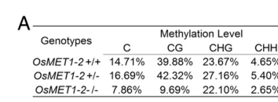

## Question

# Gene Research for Functional Annotation

## ⚠️ CRITICAL: Gene/Protein Identification Context

**BEFORE YOU BEGIN RESEARCH:** You MUST verify you are researching the CORRECT gene/protein. Gene symbols can be ambiguous, especially for less well-characterized genes from non-model organisms.

### Target Gene/Protein Identity (from UniProt):
- **UniProt Accession:** Q7Y1I7
- **Protein Description:** RecName: Full=DNA (cytosine-5)-methyltransferase 1A {ECO:0000303|PubMed:18281124}; Short=OsMET1a {ECO:0000303|PubMed:18281124}; EC=2.1.1.37 {ECO:0000255|PROSITE-ProRule:PRU01016}; AltName: Full=DNA methyltransferase 1-1 {ECO:0000303|PubMed:14513380}; Short=OsMET1-1 {ECO:0000303|PubMed:14513380};
- **Gene Information:** Name=MET1A {ECO:0000303|PubMed:18281124}; Synonyms=MET1-1 {ECO:0000303|PubMed:14513380}; OrderedLocusNames=Os03g0798300 {ECO:0000312|EMBL:BAS86863.1}, LOC_Os03g58400 {ECO:0000312|EMBL:ABF99362.1}; ORFNames=OsJ_12965 {ECO:0000312|EMBL:EEE60102.1}, OSJNBa0094F01.4 {ECO:0000312|EMBL:AAP44671.1};
- **Organism (full):** Oryza sativa subsp. japonica (Rice).
- **Protein Family:** Belongs to the class I-like SAM-binding methyltransferase
- **Key Domains:** BAH_dom. (IPR001025); BAH_sf. (IPR043151); C5-Methyltransferase. (IPR050390); C5_DNA_meth_AS. (IPR018117); C5_MeTfrase. (IPR001525)

### MANDATORY VERIFICATION STEPS:

1. **Check if the gene symbol "MET1A" matches the protein description above**
2. **Verify the organism is correct:** Oryza sativa subsp. japonica (Rice).
3. **Check if protein family/domains align with what you find in literature**
4. **If you find literature for a DIFFERENT gene with the same or similar symbol, STOP**

### If Gene Symbol is Ambiguous or You Cannot Find Relevant Literature:

**DO NOT PROCEED WITH RESEARCH ON A DIFFERENT GENE.** Instead:
- State clearly: "The gene symbol 'MET1A' is ambiguous or literature is limited for this specific protein"
- Explain what you found (e.g., "Found extensive literature on a different gene with the same symbol in a different organism")
- Describe the protein based ONLY on the UniProt information provided above
- Suggest that the protein function can be inferred from domain/family information

### Research Target:

Please provide a comprehensive research report on the gene **MET1A** (gene ID: MET1A, UniProt: Q7Y1I7) in ORYSJ.

The research report should be a detailed narrative explaining the function, biological processes, and localization of the gene product. Citations should be given for all claims.

You should prioritize authoritative reviews and primary scientific literature when conducting research. You can supplement
this with annotations you find in gene/protein databases, but these can be outdated or inaccurate.

We are specifically interested in the primary function of the gene - for enzymes, what reaction is catalyzed, and what is the substrate specificity? For transporters, what is the substrate? For structural proteins or adapters, what is the broader structural role? For signaling molecules, what is the role in the pathway.

We are interested in where in or outside the cell the gene product carries out its function.

We are also interested in the signaling or biochemical pathways in which the gene functions. We are less interested in broad pleiotropic effects, except where these elucidate the precise role.

Include evidence where possible. We are interested in both experimental evidence as well as inference from structure, evolution, or bioinformatic analysis. Precise studies should be prioritized over high-throughput, where available.

## Output

Question: You are an expert researcher providing comprehensive, well-cited information.

Provide detailed information focusing on:
1. Key concepts and definitions with current understanding
2. Recent developments and latest research (prioritize 2023-2024 sources)
3. Current applications and real-world implementations
4. Expert opinions and analysis from authoritative sources
5. Relevant statistics and data from recent studies

Format as a comprehensive research report with proper citations. Include URLs and publication dates where available.
Always prioritize recent, authoritative sources and provide specific citations for all major claims.

# Gene Research for Functional Annotation

## ⚠️ CRITICAL: Gene/Protein Identification Context

**BEFORE YOU BEGIN RESEARCH:** You MUST verify you are researching the CORRECT gene/protein. Gene symbols can be ambiguous, especially for less well-characterized genes from non-model organisms.

### Target Gene/Protein Identity (from UniProt):
- **UniProt Accession:** Q7Y1I7
- **Protein Description:** RecName: Full=DNA (cytosine-5)-methyltransferase 1A {ECO:0000303|PubMed:18281124}; Short=OsMET1a {ECO:0000303|PubMed:18281124}; EC=2.1.1.37 {ECO:0000255|PROSITE-ProRule:PRU01016}; AltName: Full=DNA methyltransferase 1-1 {ECO:0000303|PubMed:14513380}; Short=OsMET1-1 {ECO:0000303|PubMed:14513380};
- **Gene Information:** Name=MET1A {ECO:0000303|PubMed:18281124}; Synonyms=MET1-1 {ECO:0000303|PubMed:14513380}; OrderedLocusNames=Os03g0798300 {ECO:0000312|EMBL:BAS86863.1}, LOC_Os03g58400 {ECO:0000312|EMBL:ABF99362.1}; ORFNames=OsJ_12965 {ECO:0000312|EMBL:EEE60102.1}, OSJNBa0094F01.4 {ECO:0000312|EMBL:AAP44671.1};
- **Organism (full):** Oryza sativa subsp. japonica (Rice).
- **Protein Family:** Belongs to the class I-like SAM-binding methyltransferase
- **Key Domains:** BAH_dom. (IPR001025); BAH_sf. (IPR043151); C5-Methyltransferase. (IPR050390); C5_DNA_meth_AS. (IPR018117); C5_MeTfrase. (IPR001525)

### MANDATORY VERIFICATION STEPS:

1. **Check if the gene symbol "MET1A" matches the protein description above**
2. **Verify the organism is correct:** Oryza sativa subsp. japonica (Rice).
3. **Check if protein family/domains align with what you find in literature**
4. **If you find literature for a DIFFERENT gene with the same or similar symbol, STOP**

### If Gene Symbol is Ambiguous or You Cannot Find Relevant Literature:

**DO NOT PROCEED WITH RESEARCH ON A DIFFERENT GENE.** Instead:
- State clearly: "The gene symbol 'MET1A' is ambiguous or literature is limited for this specific protein"
- Explain what you found (e.g., "Found extensive literature on a different gene with the same symbol in a different organism")
- Describe the protein based ONLY on the UniProt information provided above
- Suggest that the protein function can be inferred from domain/family information

### Research Target:

Please provide a comprehensive research report on the gene **MET1A** (gene ID: MET1A, UniProt: Q7Y1I7) in ORYSJ.

The research report should be a detailed narrative explaining the function, biological processes, and localization of the gene product. Citations should be given for all claims.

You should prioritize authoritative reviews and primary scientific literature when conducting research. You can supplement
this with annotations you find in gene/protein databases, but these can be outdated or inaccurate.

We are specifically interested in the primary function of the gene - for enzymes, what reaction is catalyzed, and what is the substrate specificity? For transporters, what is the substrate? For structural proteins or adapters, what is the broader structural role? For signaling molecules, what is the role in the pathway.

We are interested in where in or outside the cell the gene product carries out its function.

We are also interested in the signaling or biochemical pathways in which the gene functions. We are less interested in broad pleiotropic effects, except where these elucidate the precise role.

Include evidence where possible. We are interested in both experimental evidence as well as inference from structure, evolution, or bioinformatic analysis. Precise studies should be prioritized over high-throughput, where available.

## Research Report: Rice **MET1A / OsMET1a** (UniProt **Q7Y1I7**; OsMET1-1; LOC_Os03g58400; Os03g0798300)

### Executive summary
**MET1A (OsMET1a/OsMET1-1)** encodes a DNMT1-like **maintenance DNA (cytosine-5) methyltransferase** in *Oryza sativa* (japonica), primarily responsible for maintaining **symmetric CG (CpG) methylation** after DNA replication as part of epigenetic inheritance. In rice, MET1A is one of two closely related MET1 paralogs (OsMET1-1/OsMET1a and OsMET1-2/OsMET1b), and available evidence indicates **OsMET1b is the major, more highly expressed CG maintenance enzyme**, while **OsMET1a is lower-expressed and can appear phenotypically redundant in some mutant/knock-in contexts**. Quantitative whole-genome bisulfite sequencing in an OsMET1b loss-of-function background shows profound CG methylation loss (e.g., **gene-body mCG 27.35% → 3.95%**) and strong transposon derepression, accompanied by **compensatory upregulation of OsMET1a (~2.5-fold)** and a **VIM-like factor (~4.5-fold)**, linking OsMET1a into the broader CG-maintenance machinery and its buffering responses. (hu2014mutationofa pages 1-2, hu2014mutationofa pages 3-4, hu2014mutationofa pages 4-5, yin2024impactofabiotic pages 8-10, hu2014mutationofa media f7e45d7c)

### 1) Key concepts and definitions (current understanding)
#### 1.1 DNA methylation contexts and “maintenance” methylation
Plant cytosine methylation occurs in **CG, CHG, and CHH** sequence contexts (H = A/C/T). Maintenance methylation refers to the **copying of symmetric methylation patterns (especially CG) onto the nascent strand following semi-conservative DNA replication**, enabling epigenetic inheritance across cell divisions. In rice, **CG methylation is mainly maintained by MET1 enzymes**, specifically **OsMET1a (OsMET1-1)** and **OsMET1b (OsMET1-2)**. (yin2024impactofabiotic pages 8-10)

#### 1.2 MET1 family (DNMT1-like) enzymes
Hu et al. (2014) describe rice **OsMET1-1 and OsMET1-2** as highly similar and “composed of all binding and catalytic domains required for a functional CG methylase,” supporting their annotation as DNMT1-like maintenance CG methyltransferases. (hu2014mutationofa pages 1-2)

**Enzymatic reaction (functional annotation):** MET1A is annotated as a SAM-dependent **DNA (cytosine-5) methyltransferase (EC 2.1.1.37)** that transfers a methyl group to the **C5 position of cytosine** in DNA, primarily maintaining **CG methylation**. Direct rice OsMET1a enzymatic assays were not retrieved in the accessible texts here; thus, the reaction chemistry is inferred from its enzyme class and from the direct statements that it is responsible for CG methylation maintenance. (hu2014mutationofa pages 1-2, kumar2022pup1qtlregulates pages 18-19, yin2024impactofabiotic pages 8-10)

#### 1.3 Pathway context: RdDM, chromatin, and TE silencing
Rice MET1-mediated CG methylation functions within an integrated epigenetic network that includes:
- **RdDM (RNA-directed DNA methylation)**, which is critical for many CHH methylation loci and is linked to small RNA populations (notably 24-nt siRNAs). (hu2014mutationofa pages 5-6, yin2024impactofabiotic pages 8-10)
- **Chromatin remodeling and heterochromatin**, including DDM1-dependent methylation and cross-compensation between DDM1 and RdDM (“double insurance” model) for transposon silencing described in a 2024 rice-focused review. (yin2024impactofabiotic pages 8-10)

### 2) Gene/protein identity verification and disambiguation
The target protein is **OsMET1a / MET1A (OsMET1-1)** from *Oryza sativa* ssp. japonica, mapped to **LOC_Os03g58400** in rice stress methylome work and consistently contrasted with the paralog **OsMET1b/OsMET1-2** in rice methylation genetics literature. This supports that the report is about the intended rice MET1A protein (UniProt Q7Y1I7), not a MET1 gene from another organism. (hu2014mutationofa pages 1-2, kumar2022pup1qtlregulates pages 18-19, yin2024impactofabiotic pages 8-10)

### 3) Molecular function, substrate specificity, and mechanism
#### 3.1 Primary function
OsMET1a is described as a **maintenance DNA methyltransferase responsible for CG methylation**. (kumar2022pup1qtlregulates pages 18-19, yin2024impactofabiotic pages 8-10)

#### 3.2 Substrate specificity (sequence context)
The most specific evidence available indicates MET1 enzymes in rice maintain **CG methylation**. In a rice mutant study focusing on the major paralog (OsMET1-2/OsMET1b), **89% of hypomethylated differentially methylated cytosines were in CG context**, consistent with MET1-class specificity for CG sites and supporting MET1A’s pathway-level specificity as a CG maintenance enzyme. (hu2014mutationofa pages 3-4)

### 4) Expression patterns and regulatory features
#### 4.1 Relative expression vs paralog OsMET1b (OsMET1-2)
In the rice MET1 paralog pair, **OsMET1-2 transcripts accumulate more abundantly than those of OsMET1-1 in all examined wild-type tissues**, suggesting OsMET1b is the dominant paralog under many conditions. (hu2014mutationofa pages 1-2)

A 2024 review similarly describes **OsMET1b as the primary enzyme with broader/higher expression**, with OsMET1a as the other CG maintenance paralog. (yin2024impactofabiotic pages 8-10)

#### 4.2 Compensatory induction when the major CG methylase is lost
In OsMET1-2 loss-of-function seedlings, **OsMET1-1 (OsMET1a) expression is moderately but significantly upregulated (~2.5-fold)**, consistent with compensation within the CG maintenance pathway. (hu2014mutationofa pages 3-4)

#### 4.3 Stress-associated regulation: phosphate starvation and promoter methylation
In a rice phosphate starvation stress study using WGBS and transcriptomics in a Pup1-introgressed line (NIL-23) versus Pusa-44, **OsMET1a (LOC_Os03g58400)** expression is reported to track with **promoter methylation state**: promoter hypomethylation is associated with increased OsMET1a expression in NIL-23 roots, while promoter hypermethylation is associated with reduced expression in Pusa-44 under the same stress. (kumar2022pup1qtlregulates pages 18-19)

### 5) Subcellular localization
No direct subcellular localization experiment (e.g., GFP fusion or fractionation) for OsMET1a was retrieved in the accessible texts. Based on its demonstrated role as a DNA methyltransferase maintaining genomic CG methylation, its functional site of action is most plausibly the **nucleus**; however, this should be treated as inference pending direct localization data. (hu2014mutationofa pages 1-2, yin2024impactofabiotic pages 8-10)

### 6) Mutant phenotypes and functional genetics (mechanistic interpretation)
#### 6.1 OsMET1a-specific genetics (knock-in)
A rice study summarized by Hu et al. (2014) reports that a **knock-in mutant of OsMET1-1 (OsMET1a)** “failed to produce discernible developmental phenotypes,” interpreted as suggesting **minimal and/or redundant function for OsMET1a** in maintaining CG methylation compared with OsMET1-2. (hu2014mutationofa pages 1-2)

#### 6.2 Pathway-defining phenotypes from the major paralog OsMET1b (OsMET1-2)
While not an OsMET1a mutant per se, the OsMET1-2 knockout phenotype provides strong mechanistic evidence for MET1-class CG maintenance in rice and demonstrates what loss of MET1-mediated CG methylation causes in this genome:
- **Gene-body CG methylation decreased by 86%** (from **27.35% in WT to 3.95%** in OsMET1-2−/−). (hu2014mutationofa pages 3-4)
- **Transposable element (TE) mCG decreased by 77%**, and remaining mCG was relatively enriched in TEs compared with genes, indicating differential maintenance across genomic features. (hu2014mutationofa pages 3-4, hu2014mutationofa pages 5-6)
- Broad expression impacts were observed, including **3,744 affected genes** (47.5% up; 52.5% down) and **21.9% of transcribed TEs (594/2,716) differentially expressed**, with **82.3% of those TEs upregulated** (489/594), linking CG maintenance methylation to TE repression and transcriptome stability. (hu2014mutationofa pages 4-5, hu2014mutationofa pages 5-6)

These quantitative results are visually supported by a figure/table in Hu et al. (2014) (Figure 2), which includes global/context methylation summaries and feature-level methylation profiles. (hu2014mutationofa media f7e45d7c, hu2014mutationofa media e05be17b)

#### 6.3 Partners and buffering mechanisms: VIM and RdDM cross-talk
In the OsMET1-2 mutant, a **VIM-family gene (LOC_Os05g01230)** is upregulated about **4.5-fold**, and the authors note VIM proteins cooperate with CG methylases in CG methylation maintenance. (hu2014mutationofa pages 3-4)

Hu et al. further propose that residual/regained CG methylation in the OsMET1-2 mutant could involve **OsMET1-1 together with VIMs**, potentially in interplay with **RdDM**, particularly in heterochromatic TE-rich regions; small-RNA and CHH methylation patterns in the mutant support MET1–RdDM pathway interactions. (hu2014mutationofa pages 3-4, hu2014mutationofa pages 5-6)

### 7) Recent developments (prioritizing 2023–2024)
Direct, OsMET1a-focused primary studies from 2023–2024 were not retrieved in the accessible document set; however, **rice-focused 2024 review literature** consolidates current understanding relevant to MET1A functional annotation:
- A 2024 review in *Plants* frames rice CG maintenance methylation as being mediated mainly by **OsMET1a (OsMET1-1) and OsMET1b (OsMET1-2)**, with **OsMET1b as the primary enzyme** with broader/higher expression, and emphasizes integration with non-CG methylation systems (CMTs, DRM2/RdDM) and chromatin remodeling (DDM1) for TE silencing and stress responses. (Yin et al., Sep 2024; https://doi.org/10.3390/plants13192700) (yin2024impactofabiotic pages 8-10, yin2024impactofabiotic pages 24-25)
- A 2024 review in *Agronomy* provides a contemporaneous synthesis of DNA methylation enzyme classes and highlights that MET1 is the CG maintenance methyltransferase and that MET1 function is integrated with methylation readers such as **VIM** proteins (primarily described in *Arabidopsis* but conceptually relevant to MET1-class biology). (Qiao et al., Dec 2024; https://doi.org/10.3390/agronomy15010094) (qiao2024theroleofa pages 1-3)

### 8) Current applications and real-world implementations
#### 8.1 Stress biology and crop improvement via methylome profiling
The Pup1 QTL phosphate-starvation study demonstrates a **real-world implementation** of integrating **whole-genome bisulfite sequencing** with transcriptomics to link methylation changes to stress-responsive gene regulation in rice, including OsMET1a regulation by promoter methylation. It reports genome-scale methylation and DMR counts under stress, such as **13–15% of total cytosines methylated** in the rice genome (in their materials), **6,068 hypo-DMRs vs 5,279 hyper-DMRs** under phosphate starvation stress, and methylation-associated upregulation of hundreds of genes (e.g., CHH hypomethylation associated with upregulation of 489 genes in shoot and 382 genes in root of NIL-23 under stress). (Kumar et al., May 2022; https://doi.org/10.3389/fpls.2022.871890) (kumar2022pup1qtlregulates pages 18-19)

Although this does not establish OsMET1a as a single causal determinant of tolerance, it supports that OsMET1a is a measurable, regulated component of the stress-associated methylation machinery in rice roots. (kumar2022pup1qtlregulates pages 18-19)

#### 8.2 Toward targeted epigenetic engineering
The 2024 rice-focused review emphasizes that rice DNA methylation pathways (including MET1-mediated CG maintenance, RdDM, and chromatin remodeling) are central to stress responses and are therefore potential targets for breeding strategies that modulate epigenetic state. However, the retrieved evidence base here does not include a rice MET1A-targeted epigenome-editing implementation; thus, this remains a prospective application in the context of current reviews. (yin2024impactofabiotic pages 8-10)

### 9) Expert interpretation and limitations of current evidence for OsMET1A specifically
1. **OsMET1a is clearly placed in the CG maintenance pathway**, but direct evidence suggests it is **less dominant than OsMET1b** in many tissues and may show **functional redundancy** under some experimental disruptions (no obvious phenotype in a reported knock-in). (hu2014mutationofa pages 1-2, yin2024impactofabiotic pages 8-10)
2. The most quantitative causal data currently accessible here come from **OsMET1b (OsMET1-2) loss-of-function**, not OsMET1a. Those data are nonetheless informative for functional annotation because OsMET1a is induced in this background and belongs to the same enzyme class and pathway. (hu2014mutationofa pages 3-4, hu2014mutationofa pages 4-5)
3. **Subcellular localization and direct biochemical activity data** (e.g., in vitro assays for OsMET1a substrate preference for hemimethylated CG DNA) were not available in the retrieved texts; these are important evidence gaps for a full mechanistic annotation. (hu2014mutationofa pages 1-2, terada2010creloxpmediatedmarker pages 8-9)

### Evidence summary table
| Category | Direct evidence for OsMET1a/MET1A | Inference / context (clearly labeled) | Key sources (year; DOI/URL) |
|---|---|---|---|
| Identity / synonyms | UniProt target Q7Y1I7 is rice **DNA (cytosine-5)-methyltransferase 1A**, short name **OsMET1a**; gene **MET1A**; synonyms **MET1-1 / OsMET1-1**; loci **Os03g0798300 / LOC_Os03g58400**. Rice literature distinguishes **OsMET1-1 (OsMET1a)** from **OsMET1-2 (OsMET1b)**, confirming the target is the OsMET1-1 paralog, not a different MET1 gene (hu2014mutationofa pages 1-2, kumar2022pup1qtlregulates pages 18-19, yin2024impactofabiotic pages 8-10) | Because the literature repeatedly maps OsMET1a to LOC_Os03g58400 and contrasts it with OsMET1-2, the symbol is sufficiently disambiguated for functional annotation of Q7Y1I7 (hu2014mutationofa pages 1-2, kumar2022pup1qtlregulates pages 18-19) | Hu et al. 2014, PNAS, DOI: 10.1073/pnas.1410761111, https://doi.org/10.1073/pnas.1410761111 (hu2014mutationofa pages 1-2); Kumar et al. 2022, Front Plant Sci, DOI: 10.3389/fpls.2022.871890, https://doi.org/10.3389/fpls.2022.871890 (kumar2022pup1qtlregulates pages 18-19); Yin et al. 2024, Plants, DOI: 10.3390/plants13192700, https://doi.org/10.3390/plants13192700 (yin2024impactofabiotic pages 8-10) |
| Molecular function & reaction | Rice MET1 proteins are described as **maintenance CG methyltransferases**; OsMET1a/OsMET1-1 is identified as a maintenance DNA methyltransferase responsible for **CG methylation**. Hu et al. state OsMET1-1 and OsMET1-2 contain all binding and catalytic domains required for a functional CG methylase; Kumar et al. identify OsMET1a as MET1 responsible for CG methylation (hu2014mutationofa pages 1-2, kumar2022pup1qtlregulates pages 18-19, yin2024impactofabiotic pages 8-10) | The exact catalytic chemistry for Q7Y1I7 is inferred from the MET1/C5-methyltransferase class and UniProt family/domain assignment: **SAM-dependent transfer of a methyl group to C5 of cytosine in DNA**, acting primarily at **hemimethylated CG sites after replication**. This is consistent with general MET1 biology described in recent reviews, but a rice OsMET1a-specific biochemical assay was not retrieved here (yin2024impactofabiotic pages 8-10, qiao2024theroleofa pages 1-3) | Hu et al. 2014, https://doi.org/10.1073/pnas.1410761111 (hu2014mutationofa pages 1-2); Kumar et al. 2022, https://doi.org/10.3389/fpls.2022.871890 (kumar2022pup1qtlregulates pages 18-19); Yin et al. 2024, https://doi.org/10.3390/plants13192700 (yin2024impactofabiotic pages 8-10); Qiao et al. 2024, https://doi.org/10.3390/agronomy15010094 (qiao2024theroleofa pages 1-3) |
| Domains / family | Hu et al. report that OsMET1-1 and OsMET1-2 are highly similar and contain all **binding and catalytic domains required for a functional CG methylase** (hu2014mutationofa pages 1-2) | UniProt/domain annotation for Q7Y1I7 further supports a DNMT1-like architecture with **BAH** and **C5-methyltransferase** domains, consistent with a class I-like SAM-binding methyltransferase; this supports maintenance-methylase function when direct domain mapping from primary papers is limited in the retrieved evidence (hu2014mutationofa pages 1-2) | Hu et al. 2014, https://doi.org/10.1073/pnas.1410761111 (hu2014mutationofa pages 1-2) |
| Expression pattern / relative importance | In WT rice tissues, **OsMET1-2 transcripts accumulated more abundantly than OsMET1-1 in all examined tissues**, implying OsMET1a is the lower-expressed paralog. A reported **OsMET1-1 knock-in mutant failed to show discernible developmental phenotypes**, suggesting a minimal and/or redundant role relative to OsMET1-2 (hu2014mutationofa pages 1-2) | The cited but not directly retrieved Yamauchi et al. study is described as showing **dosage-dependent spatiotemporal expression** of MET1a, indicating expression and/or phenotype may depend on gene dosage and developmental context, but detailed primary data were not available in the conversation evidence (li2021genomewideidentificationand pages 15-16, terada2010creloxpmediatedmarker pages 8-9) | Hu et al. 2014, https://doi.org/10.1073/pnas.1410761111 (hu2014mutationofa pages 1-2); Li et al. 2021, https://doi.org/10.1186/s12864-021-07600-7 (li2021genomewideidentificationand pages 15-16); Terada et al. 2010, https://doi.org/10.5511/plantbiotechnology.27.29 (terada2010creloxpmediatedmarker pages 8-9) |
| Pathways / partners: VIM | In OsMET1-2 knockout seedlings, a rice **VIM-family gene** (LOC_Os05g01230) was upregulated about **4.5-fold**; the paper notes VIM proteins cooperate with CG methylases to maintain CG methylation (hu2014mutationofa pages 3-4) | Direct physical interaction between **OsMET1a** and a rice VIM protein was not shown in the retrieved evidence. The partner relationship is therefore supported as **pathway-level inference** from MET1/VIM cooperation in CG maintenance and compensatory responses in rice MET1 mutants (hu2014mutationofa pages 3-4, qiao2024theroleofa pages 1-3) | Hu et al. 2014, https://doi.org/10.1073/pnas.1410761111 (hu2014mutationofa pages 3-4); Qiao et al. 2024, https://doi.org/10.3390/agronomy15010094 (qiao2024theroleofa pages 1-3) |
| Pathways / partners: RdDM | Rice MET1 function is linked to **RNA-directed DNA methylation (RdDM)**. Hu et al. propose residual/regained mCG in an OsMET1-2 mutant may be maintained partly via RdDM, especially in heterochromatic TE-rich regions; altered 24-nt small RNAs and CHH methylation support MET1–RdDM interplay (hu2014mutationofa pages 3-4, hu2014mutationofa pages 5-6) | For **OsMET1a specifically**, RdDM involvement is inferential rather than directly demonstrated. Recent rice reviews state CHH methylation is controlled by RdDM, and MET1-mediated CG maintenance interacts with broader methylation pathways and TE silencing networks (yin2024impactofabiotic pages 8-10, yin2024impactofabiotic pages 24-25) | Hu et al. 2014, https://doi.org/10.1073/pnas.1410761111 (hu2014mutationofa pages 3-4, hu2014mutationofa pages 5-6); Yin et al. 2024, https://doi.org/10.3390/plants13192700 (yin2024impactofabiotic pages 8-10, yin2024impactofabiotic pages 24-25) |
| Pathways / partners: DDM1 / chromatin context | Recent rice review evidence states **DDM1-dependent methylation** and **RdDM** can compensate to maintain TE silencing; DDM1 is essential for cytosine methylation in repeats/TEs in rice and acts independently of siRNA at some loci (yin2024impactofabiotic pages 8-10) | No direct OsMET1a–DDM1 interaction was shown in the retrieved OsMET1a-specific studies. The relationship is best described as **shared participation in the rice DNA methylation / heterochromatin maintenance network** (yin2024impactofabiotic pages 8-10, yin2024impactofabiotic pages 24-25) | Yin et al. 2024, https://doi.org/10.3390/plants13192700 (yin2024impactofabiotic pages 8-10, yin2024impactofabiotic pages 24-25) |
| Key quantitative findings relevant to MET1 pathway | In **OsMET1-2** mutants, **OsMET1-1 expression increased ~2.5-fold**, VIM gene expression increased ~4.5-fold, gene-body **mCG fell 86% (27.35% to 3.95%)**, TE mCG fell **77%**, and **89%** of hypo-differentially methylated cytosines were in CG context; **594/2,716 TEs (21.9%)** changed expression, with **489 (82.3%) upregulated** (hu2014mutationofa pages 3-4, hu2014mutationofa pages 4-5, hu2014mutationofa pages 5-6, hu2014mutationofa media f7e45d7c) | These quantitative data come from mutation of the **major paralog OsMET1-2**, not direct disruption of OsMET1a. They are nevertheless informative for annotating OsMET1a because OsMET1a is transcriptionally induced in this background and belongs to the same maintenance-CG pathway (hu2014mutationofa pages 3-4, hu2014mutationofa pages 4-5) | Hu et al. 2014, https://doi.org/10.1073/pnas.1410761111 (hu2014mutationofa pages 3-4, hu2014mutationofa pages 4-5, hu2014mutationofa pages 5-6, hu2014mutationofa media f7e45d7c) |
| Stress-responsive regulation / applications relevance | Under phosphate starvation, **OsMET1a promoter hypomethylation correlated with increased OsMET1a expression** in roots of the tolerant NIL-23 line, whereas promoter hypermethylation correlated with lower expression in Pusa-44; this supports stress-responsive transcriptional regulation of OsMET1a (kumar2022pup1qtlregulates pages 18-19) | This study supports OsMET1a as a responsive node in stress-associated methylation circuitry, but it does **not** directly prove OsMET1a is causal for phosphate tolerance. It is better interpreted as evidence for regulatory responsiveness of the CG-maintenance system under nutrient stress (kumar2022pup1qtlregulates pages 18-19, yin2024impactofabiotic pages 8-10) | Kumar et al. 2022, https://doi.org/10.3389/fpls.2022.871890 (kumar2022pup1qtlregulates pages 18-19); Yin et al. 2024, https://doi.org/10.3390/plants13192700 (yin2024impactofabiotic pages 8-10) |
| Overall functional annotation conclusion | Direct evidence supports annotating Q7Y1I7/OsMET1a as a **rice nuclear DNA cytosine-5 maintenance methyltransferase for CG methylation**, acting in epigenetic inheritance and genome/TE regulation, with lower expression and apparently more redundant contribution than OsMET1-2 (hu2014mutationofa pages 1-2, kumar2022pup1qtlregulates pages 18-19, yin2024impactofabiotic pages 8-10) | Localization was not directly shown in the retrieved OsMET1a papers, but a DNA methyltransferase acting on chromosomal DNA is most plausibly **nuclear**; this should be labeled as inference unless a localization experiment is cited. Recent applications are broader crop epigenetics/epigenome-editing concepts rather than OsMET1a-targeted implementations (yin2024impactofabiotic pages 8-10, qiao2024theroleofa pages 1-3) | Hu et al. 2014, https://doi.org/10.1073/pnas.1410761111 (hu2014mutationofa pages 1-2); Kumar et al. 2022, https://doi.org/10.3389/fpls.2022.871890 (kumar2022pup1qtlregulates pages 18-19); Yin et al. 2024, https://doi.org/10.3390/plants13192700 (yin2024impactofabiotic pages 8-10); Qiao et al. 2024, https://doi.org/10.3390/agronomy15010094 (qiao2024theroleofa pages 1-3) |

*Table: This table summarizes identity, function, pathway context, and key quantitative findings for rice OsMET1a/MET1A using only evidence retrieved in the conversation. It separates direct experimental support from broader pathway-level inferences to aid careful functional annotation.*

### Key cited sources (with publication dates and URLs)
- Hu L. et al. **“Mutation of a major CG methylase in rice causes genome-wide hypomethylation, dysregulated genome expression, and seedling lethality.”** *PNAS* (July **2014**). https://doi.org/10.1073/pnas.1410761111 (hu2014mutationofa pages 1-2, hu2014mutationofa pages 3-4, hu2014mutationofa pages 4-5, hu2014mutationofa pages 5-6, hu2014mutationofa media f7e45d7c)
- Kumar S. et al. **“Pup1 QTL Regulates Gene Expression Through Epigenetic Modification of DNA Under Phosphate Starvation Stress in Rice.”** *Frontiers in Plant Science* (May **2022**). https://doi.org/10.3389/fpls.2022.871890 (kumar2022pup1qtlregulates pages 18-19)
- Yin M. et al. **“Impact of Abiotic Stress on Rice and the Role of DNA Methylation in Stress Response Mechanisms.”** *Plants* (Sept **2024**). https://doi.org/10.3390/plants13192700 (yin2024impactofabiotic pages 8-10, yin2024impactofabiotic pages 24-25)
- Qiao S. et al. **“The Role of Plant DNA Methylation in Development, Stress Response, and Crop Breeding.”** *Agronomy* (Dec **2024**). https://doi.org/10.3390/agronomy15010094 (qiao2024theroleofa pages 1-3)
- Terada R. et al. **“Cre-loxP mediated marker elimination and gene reactivation at the waxy locus…”** *Plant Biotechnology* (Mar **2010**). https://doi.org/10.5511/plantbiotechnology.27.29 (cites a MET1a targeting study reporting dosage-dependent spatiotemporal expression, but the primary MET1a targeting paper was not retrieved here) (terada2010creloxpmediatedmarker pages 8-9)

References

1. (hu2014mutationofa pages 1-2): Lanjuan Hu, Ning Li, Chunming Xu, Silin Zhong, Xiuyun Lin, Jingjing Yang, Tianqi Zhou, Anzhi Yuliang, Ying Wu, Yun-Ru Chen, Xiaofeng Cao, Assaf Zemach, Sachin Rustgi, Diter von Wettstein, and Bao Liu. Mutation of a major cg methylase in rice causes genome-wide hypomethylation, dysregulated genome expression, and seedling lethality. Proceedings of the National Academy of Sciences, 111:10642-10647, Jul 2014. URL: https://doi.org/10.1073/pnas.1410761111, doi:10.1073/pnas.1410761111. This article has 216 citations and is from a highest quality peer-reviewed journal.

2. (hu2014mutationofa pages 3-4): Lanjuan Hu, Ning Li, Chunming Xu, Silin Zhong, Xiuyun Lin, Jingjing Yang, Tianqi Zhou, Anzhi Yuliang, Ying Wu, Yun-Ru Chen, Xiaofeng Cao, Assaf Zemach, Sachin Rustgi, Diter von Wettstein, and Bao Liu. Mutation of a major cg methylase in rice causes genome-wide hypomethylation, dysregulated genome expression, and seedling lethality. Proceedings of the National Academy of Sciences, 111:10642-10647, Jul 2014. URL: https://doi.org/10.1073/pnas.1410761111, doi:10.1073/pnas.1410761111. This article has 216 citations and is from a highest quality peer-reviewed journal.

3. (hu2014mutationofa pages 4-5): Lanjuan Hu, Ning Li, Chunming Xu, Silin Zhong, Xiuyun Lin, Jingjing Yang, Tianqi Zhou, Anzhi Yuliang, Ying Wu, Yun-Ru Chen, Xiaofeng Cao, Assaf Zemach, Sachin Rustgi, Diter von Wettstein, and Bao Liu. Mutation of a major cg methylase in rice causes genome-wide hypomethylation, dysregulated genome expression, and seedling lethality. Proceedings of the National Academy of Sciences, 111:10642-10647, Jul 2014. URL: https://doi.org/10.1073/pnas.1410761111, doi:10.1073/pnas.1410761111. This article has 216 citations and is from a highest quality peer-reviewed journal.

4. (yin2024impactofabiotic pages 8-10): Ming Yin, Shanwen Wang, Yanfang Wang, Ronghua Wei, Yawei Liang, Liying Zuo, Mingyue Huo, Zekai Huang, Jie Lang, Xiuqin Zhao, Fan Zhang, Jianlong Xu, Binying Fu, Zichao Li, and Wensheng Wang. Impact of abiotic stress on rice and the role of dna methylation in stress response mechanisms. Plants, 13:2700, Sep 2024. URL: https://doi.org/10.3390/plants13192700, doi:10.3390/plants13192700. This article has 29 citations.

5. (hu2014mutationofa media f7e45d7c): Lanjuan Hu, Ning Li, Chunming Xu, Silin Zhong, Xiuyun Lin, Jingjing Yang, Tianqi Zhou, Anzhi Yuliang, Ying Wu, Yun-Ru Chen, Xiaofeng Cao, Assaf Zemach, Sachin Rustgi, Diter von Wettstein, and Bao Liu. Mutation of a major cg methylase in rice causes genome-wide hypomethylation, dysregulated genome expression, and seedling lethality. Proceedings of the National Academy of Sciences, 111:10642-10647, Jul 2014. URL: https://doi.org/10.1073/pnas.1410761111, doi:10.1073/pnas.1410761111. This article has 216 citations and is from a highest quality peer-reviewed journal.

6. (kumar2022pup1qtlregulates pages 18-19): Suresh Kumar, Karishma Seem, Santosh Kumar, K. K. Vinod, Viswanathan Chinnusamy, and Trilochan Mohapatra. Pup1 qtl regulates gene expression through epigenetic modification of dna under phosphate starvation stress in rice. Frontiers in Plant Science, May 2022. URL: https://doi.org/10.3389/fpls.2022.871890, doi:10.3389/fpls.2022.871890. This article has 33 citations.

7. (hu2014mutationofa pages 5-6): Lanjuan Hu, Ning Li, Chunming Xu, Silin Zhong, Xiuyun Lin, Jingjing Yang, Tianqi Zhou, Anzhi Yuliang, Ying Wu, Yun-Ru Chen, Xiaofeng Cao, Assaf Zemach, Sachin Rustgi, Diter von Wettstein, and Bao Liu. Mutation of a major cg methylase in rice causes genome-wide hypomethylation, dysregulated genome expression, and seedling lethality. Proceedings of the National Academy of Sciences, 111:10642-10647, Jul 2014. URL: https://doi.org/10.1073/pnas.1410761111, doi:10.1073/pnas.1410761111. This article has 216 citations and is from a highest quality peer-reviewed journal.

8. (hu2014mutationofa media e05be17b): Lanjuan Hu, Ning Li, Chunming Xu, Silin Zhong, Xiuyun Lin, Jingjing Yang, Tianqi Zhou, Anzhi Yuliang, Ying Wu, Yun-Ru Chen, Xiaofeng Cao, Assaf Zemach, Sachin Rustgi, Diter von Wettstein, and Bao Liu. Mutation of a major cg methylase in rice causes genome-wide hypomethylation, dysregulated genome expression, and seedling lethality. Proceedings of the National Academy of Sciences, 111:10642-10647, Jul 2014. URL: https://doi.org/10.1073/pnas.1410761111, doi:10.1073/pnas.1410761111. This article has 216 citations and is from a highest quality peer-reviewed journal.

9. (yin2024impactofabiotic pages 24-25): Ming Yin, Shanwen Wang, Yanfang Wang, Ronghua Wei, Yawei Liang, Liying Zuo, Mingyue Huo, Zekai Huang, Jie Lang, Xiuqin Zhao, Fan Zhang, Jianlong Xu, Binying Fu, Zichao Li, and Wensheng Wang. Impact of abiotic stress on rice and the role of dna methylation in stress response mechanisms. Plants, 13:2700, Sep 2024. URL: https://doi.org/10.3390/plants13192700, doi:10.3390/plants13192700. This article has 29 citations.

10. (qiao2024theroleofa pages 1-3): Shuai Qiao, Wei Song, Wentao Hu, Fang Wang, Anzhong Liao, Wenfang Tan, and Songtao Yang. The role of plant dna methylation in development, stress response, and crop breeding. Agronomy, 15:94, Dec 2024. URL: https://doi.org/10.3390/agronomy15010094, doi:10.3390/agronomy15010094. This article has 27 citations and is from a peer-reviewed journal.

11. (terada2010creloxpmediatedmarker pages 8-9): Rie Terada, Miki Nagahara, Kazuhiko Furukawa, Miki Shimamoto, Katsushi Yamaguchi, and Shigeru Iida. Cre-loxp mediated marker elimination and gene reactivation at the waxy locus created in rice genome based on strong positive–negative selection. Plant Biotechnology, 27:29-37, Mar 2010. URL: https://doi.org/10.5511/plantbiotechnology.27.29, doi:10.5511/plantbiotechnology.27.29. This article has 32 citations and is from a peer-reviewed journal.

12. (li2021genomewideidentificationand pages 15-16): Dan Li, Bian-E Feng, Yong-Jie Liu, Jie Gong, Yi-Miao Tang, Li-Ping Zhang, Bin-Shuang Pang, Ren-Wei Sun, Feng-Ting Zhang, Zhao-Bo Chen, Yong-Bo Wang, Xian-Chao Chen, Ai-Ping Wang, Chang-Ping Zhao, and Shi-Qing Gao. Genome-wide identification and transcriptional characterization of dna methyltransferases conferring temperature-sensitive male sterility in wheat. BMC Genomics, Apr 2021. URL: https://doi.org/10.1186/s12864-021-07600-7, doi:10.1186/s12864-021-07600-7. This article has 12 citations and is from a peer-reviewed journal.

## Artifacts

- [Edison artifact artifact-00](MET1A-deep-research-falcon_artifacts/artifact-00.md)

## Citations

1. yin2024impactofabiotic pages 8-10
2. hu2014mutationofa pages 1-2
3. hu2014mutationofa pages 3-4
4. qiao2024theroleofa pages 1-3
5. li2021genomewideidentificationand pages 15-16
6. terada2010creloxpmediatedmarker pages 8-9
7. hu2014mutationofa pages 4-5
8. hu2014mutationofa pages 5-6
9. yin2024impactofabiotic pages 24-25
10. https://doi.org/10.3390/plants13192700
11. https://doi.org/10.3390/agronomy15010094
12. https://doi.org/10.3389/fpls.2022.871890
13. https://doi.org/10.1073/pnas.1410761111
14. https://doi.org/10.1186/s12864-021-07600-7
15. https://doi.org/10.5511/plantbiotechnology.27.29
16. https://doi.org/10.1073/pnas.1410761111,
17. https://doi.org/10.3390/plants13192700,
18. https://doi.org/10.3389/fpls.2022.871890,
19. https://doi.org/10.3390/agronomy15010094,
20. https://doi.org/10.5511/plantbiotechnology.27.29,
21. https://doi.org/10.1186/s12864-021-07600-7,