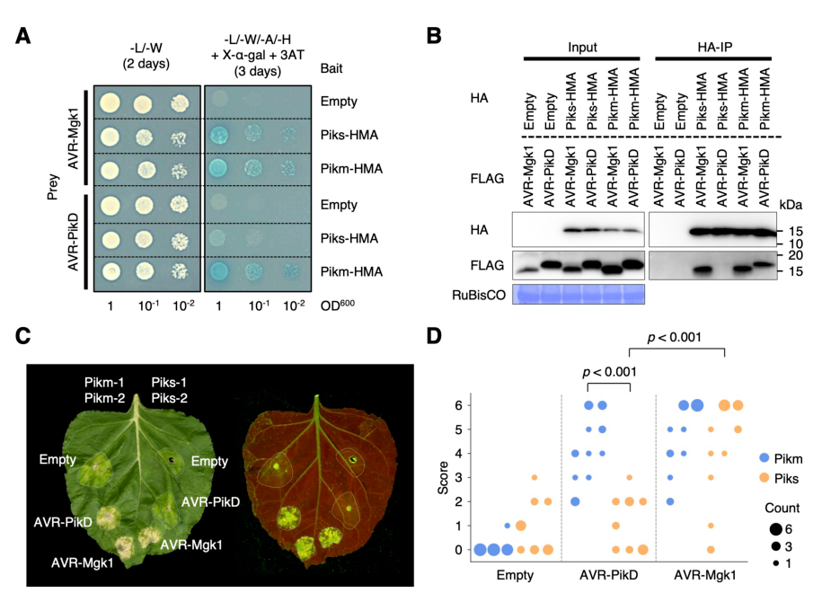

## Question

# Gene Research for Functional Annotation

## ⚠️ CRITICAL: Gene/Protein Identification Context

**BEFORE YOU BEGIN RESEARCH:** You MUST verify you are researching the CORRECT gene/protein. Gene symbols can be ambiguous, especially for less well-characterized genes from non-model organisms.

### Target Gene/Protein Identity (from UniProt):
- **UniProt Accession:** B5UBC1
- **Protein Description:** RecName: Full=Disease resistance protein Pikm1-TS {ECO:0000305};
- **Gene Information:** Name=PIKM1-TS {ECO:0000312|EMBL:BAG71909.1}; Synonyms=PI-KM1 {ECO:0000312|EMBL:ADE80944.1, ECO:0000312|EMBL:ADE80945.1, ECO:0000312|EMBL:ADE80946.1, ECO:0000312|EMBL:ADE80948.1, ECO:0000312|EMBL:ADE80951.1};
- **Organism (full):** Oryza sativa subsp. japonica (Rice).
- **Protein Family:** Belongs to the disease resistance NB-LRR family.
- **Key Domains:** Disease_R_plants. (IPR044974); HMA_dom. (IPR006121); Leu-rich_rpt_typical-subtyp. (IPR003591); LRR_dom_sf. (IPR032675); LRR_R13L4/SHOC2-like. (IPR055414)

### MANDATORY VERIFICATION STEPS:

1. **Check if the gene symbol "PIKM1-TS" matches the protein description above**
2. **Verify the organism is correct:** Oryza sativa subsp. japonica (Rice).
3. **Check if protein family/domains align with what you find in literature**
4. **If you find literature for a DIFFERENT gene with the same or similar symbol, STOP**

### If Gene Symbol is Ambiguous or You Cannot Find Relevant Literature:

**DO NOT PROCEED WITH RESEARCH ON A DIFFERENT GENE.** Instead:
- State clearly: "The gene symbol 'PIKM1-TS' is ambiguous or literature is limited for this specific protein"
- Explain what you found (e.g., "Found extensive literature on a different gene with the same symbol in a different organism")
- Describe the protein based ONLY on the UniProt information provided above
- Suggest that the protein function can be inferred from domain/family information

### Research Target:

Please provide a comprehensive research report on the gene **PIKM1-TS** (gene ID: PIKM1-TS, UniProt: B5UBC1) in ORYSJ.

The research report should be a detailed narrative explaining the function, biological processes, and localization of the gene product. Citations should be given for all claims.

You should prioritize authoritative reviews and primary scientific literature when conducting research. You can supplement
this with annotations you find in gene/protein databases, but these can be outdated or inaccurate.

We are specifically interested in the primary function of the gene - for enzymes, what reaction is catalyzed, and what is the substrate specificity? For transporters, what is the substrate? For structural proteins or adapters, what is the broader structural role? For signaling molecules, what is the role in the pathway.

We are interested in where in or outside the cell the gene product carries out its function.

We are also interested in the signaling or biochemical pathways in which the gene functions. We are less interested in broad pleiotropic effects, except where these elucidate the precise role.

Include evidence where possible. We are interested in both experimental evidence as well as inference from structure, evolution, or bioinformatic analysis. Precise studies should be prioritized over high-throughput, where available.

## Output

Question: You are an expert researcher providing comprehensive, well-cited information.

Provide detailed information focusing on:
1. Key concepts and definitions with current understanding
2. Recent developments and latest research (prioritize 2023-2024 sources)
3. Current applications and real-world implementations
4. Expert opinions and analysis from authoritative sources
5. Relevant statistics and data from recent studies

Format as a comprehensive research report with proper citations. Include URLs and publication dates where available.
Always prioritize recent, authoritative sources and provide specific citations for all major claims.

# Gene Research for Functional Annotation

## ⚠️ CRITICAL: Gene/Protein Identification Context

**BEFORE YOU BEGIN RESEARCH:** You MUST verify you are researching the CORRECT gene/protein. Gene symbols can be ambiguous, especially for less well-characterized genes from non-model organisms.

### Target Gene/Protein Identity (from UniProt):
- **UniProt Accession:** B5UBC1
- **Protein Description:** RecName: Full=Disease resistance protein Pikm1-TS {ECO:0000305};
- **Gene Information:** Name=PIKM1-TS {ECO:0000312|EMBL:BAG71909.1}; Synonyms=PI-KM1 {ECO:0000312|EMBL:ADE80944.1, ECO:0000312|EMBL:ADE80945.1, ECO:0000312|EMBL:ADE80946.1, ECO:0000312|EMBL:ADE80948.1, ECO:0000312|EMBL:ADE80951.1};
- **Organism (full):** Oryza sativa subsp. japonica (Rice).
- **Protein Family:** Belongs to the disease resistance NB-LRR family.
- **Key Domains:** Disease_R_plants. (IPR044974); HMA_dom. (IPR006121); Leu-rich_rpt_typical-subtyp. (IPR003591); LRR_dom_sf. (IPR032675); LRR_R13L4/SHOC2-like. (IPR055414)

### MANDATORY VERIFICATION STEPS:

1. **Check if the gene symbol "PIKM1-TS" matches the protein description above**
2. **Verify the organism is correct:** Oryza sativa subsp. japonica (Rice).
3. **Check if protein family/domains align with what you find in literature**
4. **If you find literature for a DIFFERENT gene with the same or similar symbol, STOP**

### If Gene Symbol is Ambiguous or You Cannot Find Relevant Literature:

**DO NOT PROCEED WITH RESEARCH ON A DIFFERENT GENE.** Instead:
- State clearly: "The gene symbol 'PIKM1-TS' is ambiguous or literature is limited for this specific protein"
- Explain what you found (e.g., "Found extensive literature on a different gene with the same symbol in a different organism")
- Describe the protein based ONLY on the UniProt information provided above
- Suggest that the protein function can be inferred from domain/family information

### Research Target:

Please provide a comprehensive research report on the gene **PIKM1-TS** (gene ID: PIKM1-TS, UniProt: B5UBC1) in ORYSJ.

The research report should be a detailed narrative explaining the function, biological processes, and localization of the gene product. Citations should be given for all claims.

You should prioritize authoritative reviews and primary scientific literature when conducting research. You can supplement
this with annotations you find in gene/protein databases, but these can be outdated or inaccurate.

We are specifically interested in the primary function of the gene - for enzymes, what reaction is catalyzed, and what is the substrate specificity? For transporters, what is the substrate? For structural proteins or adapters, what is the broader structural role? For signaling molecules, what is the role in the pathway.

We are interested in where in or outside the cell the gene product carries out its function.

We are also interested in the signaling or biochemical pathways in which the gene functions. We are less interested in broad pleiotropic effects, except where these elucidate the precise role.

Include evidence where possible. We are interested in both experimental evidence as well as inference from structure, evolution, or bioinformatic analysis. Precise studies should be prioritized over high-throughput, where available.

# Functional annotation report: rice PIKM1-TS (UniProt B5UBC1)

## Identity and principal function

**PIKM1-TS is the Tsuyuake allele of the rice blast-resistance sensor commonly called Pikm-1**, in *Oryza sativa* subsp. *japonica*. The accession-to-name correspondence is supplied by the specified UniProt record, [B5UBC1](https://www.uniprot.org/uniprotkb/B5UBC1/entry); the literature independently identifies *Pikm1-TS* and its adjacent partner *Pikm2-TS* in japonica cultivar Tsuyuake, but the papers examined do not themselves quote B5UBC1. Pikm is an allele of the chromosome-11 **Pik** resistance locus, not the similarly named **Pigm** resistance locus or the distinct Pikp and Piks alleles. Cloning and transgenic complementation established that **both Pikm1-TS and Pikm2-TS are needed** for Pikm-specific resistance to the rice blast fungus *Magnaporthe oryzae*. The founding study is Ashikawa and colleagues, *Genetics*, December 2008, [doi:10.1534/genetics.108.095034](https://doi.org/10.1534/genetics.108.095034); the accessible account of its complementation experiments is secondary. (shikari2019towardstheunderstanding pages 6-7)

**Functional assignment:** Pikm-1 is an *intracellular, effector-binding immune sensor*, not a pathogen-killing enzyme or a metal transporter. It detects particular fungal virulence proteins through an integrated heavy-metal-associated (**HMA**) domain and works with the Pikm-2 *helper* NLR to initiate effector-triggered immunity, including hypersensitive cell death and restriction of blast infection. The conventional coiled-coil (**CC**)–HMA–nucleotide-binding (**NB-ARC**)–leucine-rich-repeat (**LRR**) organization agrees with the NB-LRR/HMA annotations supplied for B5UBC1: the HMA lies between the N-terminal CC and NB regions, whereas the LRRs form part of the NLR receptor scaffold. “Heavy-metal-associated” describes a domain family, **not an experimentally established metal-transport or metal-binding function for Pikm-1**; its documented role here is effector binding. Direct ATP-hydrolysis activity or a metal substrate for this particular full-length protein was not established by the studies reviewed. (concepcion2022recognitionofrice pages 44-48, oikawa2024theblastpathogen pages 2-3)

## Recognition specificity and pathway

In the native Pikm pair, the HMA domain of Pikm-1 binds AVR-Pik effector variants **D, E and A**, with binding and immune-response strength ranked **D > E > A**. The pair does **not** show productive recognition of AVR-PikC; subsequent work identifies AVR-PikF, like C, as escaping characterized native Pik HMA receptors. Crystallography resolved Pikm-HMA bound to D, E and A at **1.2, 1.3 and 1.3 Å**, respectively, supporting a direct, allele-specific interaction. These structural measurements concern the isolated HMA complexes, not a structure of the activated full-length Pikm-1/Pikm-2 pair. De la Concepcion and colleagues, *Nature Plants*, July 2018, [doi:10.1038/s41477-018-0194-x](https://doi.org/10.1038/s41477-018-0194-x); Maidment and colleagues, *eLife*, May 2023, [doi:10.7554/eLife.81123](https://doi.org/10.7554/eLife.81123). (concepcion2018polymorphicresiduesin pages 5-7, maidment2023effectortargetguidedengineering pages 2-3)

The native recognition range is **not confined to AVR-Pik**. Sugihara and colleagues showed by yeast two-hybrid and in-vitro co-immunoprecipitation that Pikm-1 HMA binds **AVR-Mgk1**, an effector in a distinct sequence family. The Pikm-1/Pikm-2 pair responded to AVR-Mgk1 and AVR-PikD in *Nicotiana benthamiana*; importantly, a blast strain engineered to express AVR-Mgk1 elicited resistance in **Tsuyuake rice itself**. By contrast, the closely related Piks pair responded to AVR-Mgk1 but not AVR-PikD. Two sensor-HMA differences between Piks-1 and Pikm-1 affected the strength of AVR-PikD recognition, while their helper proteins have identical amino-acid sequences. Sugihara and colleagues, *PLOS Biology*, **19 January 2023**, [doi:10.1371/journal.pbio.3001945](https://doi.org/10.1371/journal.pbio.3001945), especially Fig. 7. (sugihara2023disentanglingthecomplexa pages 9-10, sugihara2023disentanglingthecomplexa pages 13-15, sugihara2023disentanglingthecomplex media 63fec180)

The allele and engineering distinctions most relevant to functional annotation are summarized below. **Only the native Pikm rows describe the B5UBC1-associated sensor’s naturally documented specificity.** (concepcion2018polymorphicresiduesin pages 5-7, zdrzałek2024bioengineeringaplant pages 2-3, sugihara2023disentanglingthecomplexa pages 13-15)

| Sensor/helper | Effector(s) | Evidence / experimental system | Interpretation |
|---|---|---|---|
| Native Pikm-1 (PIKM1-TS/B5UBC1 per supplied UniProt) + Pikm-2 | AVR-PikD, AVR-PikE, AVR-PikA | Pikm-dependent cell death in *Nicotiana benthamiana*, supported by yeast two-hybrid, gel filtration, SPR and high-resolution Pikm-HMA complex structures; response and affinity rank D > E > A (concepcion2018polymorphicresiduesin pages 5-7) | Recognized native AVR-Pik variants; Pikm-1 HMA is the specificity-conferring sensor module. |
| Native Pikm-1 + Pikm-2 | AVR-PikC, AVR-PikF | AVR-PikC showed no significant Pikm-HMA binding or Pikm response; C and F evade all characterized native Pik-HMA receptors (concepcion2018polymorphicresiduesin pages 5-7, maidment2023effectortargetguidedengineering pages 2-3) | Not recognized by native Pikm; these are stealth variants, not substrates or ligands with demonstrated productive binding. |
| Native Pikm-1 + Pikm-2 | AVR-Mgk1 | Direct Pikm-HMA binding by yeast two-hybrid and in-vitro co-IP; Pikm responded in *N. benthamiana*; AVR-Mgk1-expressing *M. oryzae* triggered resistance in Tsuyuake rice (sugihara2023disentanglingthecomplexa pages 9-10, sugihara2023disentanglingthecomplexa pages 13-15) | Recognized second MAX-effector family member, demonstrating that native Pikm specificity extends beyond AVR-Pik. |
| Native Piks-1 + Piks-2 | AVR-PikD; AVR-Mgk1 | Piks-HMA did not bind or respond to AVR-PikD but directly bound AVR-Mgk1; Piks plants and transient assays responded to AVR-Mgk1 (sugihara2023disentanglingthecomplexa pages 9-10, sugihara2023disentanglingthecomplexa pages 13-15) | Comparator: AVR-PikD **not recognized**; AVR-Mgk1 **recognized**. |
| Native Pikp-1 + Pikp-2 | AVR-PikD; AVR-PikE/AVR-PikA | Pikp recognizes AVR-PikD but not native E or A; this narrower profile contrasts with Pikm (concepcion2018polymorphicresiduesin pages 5-7) | Comparator: D **recognized**; E and A **not recognized** by native Pikp. |
| **Engineered** Pikm-1^OsHIPP43 + Pikp-2 | Pwl2, Pwl2-2, Pwl2-3 | Replacing Pikm-1’s native HMA with OsHIPP43 switched specificity; all three Pwl2 variants triggered helper-dependent cell death in transient *N. benthamiana* assays. Pikm-2 caused effector-independent autoactivity, necessitating Pikp-2 (zdrzałek2024bioengineeringaplant pages 2-3) | Synthetic receptor, **not native Pikm**. Recognition has not been validated as rice field resistance; OsHIPP43–Pwl2 affinities must not be assigned to native Pikm-1. |

*Table: Allele-resolved evidence distinguishes the native Pikm receptor’s AVR-Pik and AVR-Mgk1 specificity from comparator Pik alleles and an engineered OsHIPP43-domain chimera. It also separates rice resistance evidence from heterologous Nicotiana assays.*

Mechanistically, **effector recognition by Pikm-1 is upstream of Pikm-2-dependent defense activation**. The proteins’ compatibility matters as well as ligand binding: a 2023 allele-swap study found that pairing *Pikp-1* with *Pikm-2* induced effector-independent cell death, whereas Pikm-1 could function with Pikp-2; a Pik-2 residue-230 substitution altered this compatibility. Accordingly, strong binding to an engineered HMA domain cannot, by itself, guarantee a usable resistance receptor—the sensor and helper must remain appropriately regulated. Bentham and colleagues, 2023, [doi:10.1101/2022.10.10.511592](https://doi.org/10.1101/2022.10.10.511592). The detailed oligomeric structure and immediate biochemical output of an activated **Pikm** pair should not be assumed from structurally characterized *other* plant NLR resistosomes. (bentham2023alleliccompatibilityin pages 4-8, bentham2023alleliccompatibilityin pages 8-10, stone2025interactionsofblast pages 115-120)

## Cellular location: established and unresolved

The **site of action is inside the plant cell**, consistent with direct recognition by an intracellular NLR of fungus-delivered effectors; Pikm-1 is not established as a secreted receptor or a cell-surface ligand-binding protein. A preliminary, fluorescent-fusion study in heterologous *N. benthamiana* observed Pikm-1 signal at the **cell periphery and apparently in nuclei**, and Pikm-2 at the cell and nuclear peripheries. It did **not** verify that the peripheral signal was plasma membrane rather than adjacent cytoplasm, or demonstrate native protein localization in rice. Its author also cautioned that free fluorophore could account for apparent nuclear Pikm-1 signal. Thus a precise organelle or membrane assignment for native rice PIKM1-TS remains **unconfirmed**. Stone, 2025 doctoral research, localization chapter; the intracellular receptor classification is independently supported by the Pik molecular studies. (stone2025interactionsofblast pages 111-115, stone2025interactionsofblast pages 115-120, oikawa2024theblastpathogen pages 2-3)

## What 2023–2024 research adds

**A biological rationale for the integrated HMA ‘bait’.** Oikawa and colleagues found that AVR-PikD also binds rice *small HMA proteins*, notably OsHIPP19 and OsHIPP20, stabilizing them and changing their distribution in heterologous plant-cell assays. Disrupting **OsHIPP20** increased rice blast resistance, consistent with a host susceptibility function. This supports the interpretation that the Pik-1 integrated HMA detects an effector that also engages endogenous host proteins. These OsHIPP proteins are **separate gene products**, not Pikm-1 domains in isolation; the study does not show that Pikm-1 itself performs their proposed host functions. *PLOS Pathogens*, **18 November 2024**, [doi:10.1371/journal.ppat.1012647](https://doi.org/10.1371/journal.ppat.1012647). (oikawa2024theblastpathogen pages 2-3, oikawa2024theblastpathogen pages 10-12, oikawa2024theblastpathogen pages 5-7)

**Engineering demonstrates modularity, but not a new native function.** A 2024 study replaced the Pikm-1 HMA with the HMA of **OsHIPP43**, creating *Pikm-1*^OsHIPP43. The purified **OsHIPP43 domain**, not wild-type Pikm-1, bound fungal Pwl2, Pwl2-2 and Pwl2-3 with measured dissociation constants of **191, 141 and 35 nM**, respectively. The synthetic sensor elicited Pwl-dependent cell death with **Pikp-2** in *N. benthamiana*. With Pikm-2 it instead caused effector-independent autoactivity; the reported assay does **not** establish blast resistance by that chimera in rice fields. Zdrzałek and colleagues, *PNAS*, **5 July 2024**, [doi:10.1073/pnas.2402872121](https://doi.org/10.1073/pnas.2402872121). (zdrzałek2024bioengineeringaplant pages 2-3)

A complementary **2023** engineering study obtained rice resistance to previously escaping AVR-PikC/F strains, but its engineered sensor was **Pikp-1**, paired with Pikp-2—not native Pikm-1. Separately, reported *Pikm-1*–nanobody “Pikobody” constructs with Pikm-2 recognized fluorescent protein targets and protected *N. benthamiana* against fluorescent-protein-bearing potato virus X; this is a synthetic application, **not evidence that natural PIKM1-TS recognizes viral proteins**. Maidment and colleagues, *eLife*, May 2023, [doi:10.7554/eLife.81123](https://doi.org/10.7554/eLife.81123); Wang, Wang and Ning, *aBIOTECH*, August 2023, [doi:10.1007/s42994-023-00111-x](https://doi.org/10.1007/s42994-023-00111-x). (maidment2023effectortargetguidedengineering pages 14-16, maidment2023effectortargetguidedengineering pages 13-14, wang2023harnessingnanobodiesto pages 1-3, wang2023harnessingnanobodiesto pages 3-5)

## Agricultural relevance and limits of inference

**Pikm is used as a resistance locus in marker-assisted rice breeding**, which necessarily involves preserving a functional sensor–helper combination rather than treating PIKM1-TS alone as sufficient. In one study spanning **four breeding backgrounds**, investigators developed **31 single-gene-derived and 20 two-gene-combination lines** using nine resistance genes; Pikm improved blast resistance in **some**, not all, backgrounds. The Tsuyuake donor itself varied between years and disease sites: under the study’s 2014–2016 natural-infection conditions its leaf-blast scores were **4.40, 2.67 and 4.08**, while reported neck-blast infection was **98.85%, 100% and 100%**. These are trial-specific phenotypes, not a universal efficacy estimate for B5UBC1. Jiang and colleagues, *Rice*, May 2019, [doi:10.1186/s12284-019-0292-z](https://doi.org/10.1186/s12284-019-0292-z). (jiang2019developmentandevaluation pages 5-6, jiang2019developmentandevaluation pages 1-2)

**Conclusion.** The highest-confidence annotation for **PIKM1-TS/B5UBC1** is *HMA-integrated intracellular sensor NLR for effector-triggered rice blast resistance*, directly binding selected AVR-Pik variants and AVR-Mgk1 and requiring its paired Pikm-2 helper for resistance. Exact localization in native rice cells, a Pikm-specific activated-complex structure, and any independent catalytic or metal-handling role remain unresolved; numerical affinities measured for other HMA proteins must not be assigned to native Pikm-1. (concepcion2018polymorphicresiduesin pages 5-7, shikari2019towardstheunderstanding pages 6-7, sugihara2023disentanglingthecomplexa pages 13-15, stone2025interactionsofblast pages 111-115, oikawa2024theblastpathogen pages 2-3)

References

1. (shikari2019towardstheunderstanding pages 6-7): AB Shikari, A Shafi, S Najeeb, and A Sakina. Towards the understanding about distribution and architecture of r-genes underlying resistance to rice blast. Unknown journal, 2019.

2. (concepcion2022recognitionofrice pages 44-48): J De La Concepcion. Recognition of rice blast effectors by paired immune receptors. Unknown journal, 2022.

3. (oikawa2024theblastpathogen pages 2-3): Kaori Oikawa, Koki Fujisaki, Motoki Shimizu, Takumi Takeda, Keiichiro Nemoto, Hiromasa Saitoh, Akiko Hirabuchi, Yukie Hiraka, Naomi Miyaji, Aleksandra Białas, Thorsten Langner, Ronny Kellner, Tolga O Bozkurt, Stella Cesari, Thomas Kroj, Mark J Banfield, Sophien Kamoun, and Ryohei Terauchi. The blast pathogen effector avr-pik binds and stabilizes rice heavy metal-associated (hma) proteins to co-opt their function in immunity. PLOS Pathogens, Nov 2024. URL: https://doi.org/10.1371/journal.ppat.1012647, doi:10.1371/journal.ppat.1012647. This article has 75 citations and is from a highest quality peer-reviewed journal.

4. (concepcion2018polymorphicresiduesin pages 5-7): Juan Carlos De la Concepcion, Marina Franceschetti, Abbas Maqbool, Hiromasa Saitoh, Ryohei Terauchi, Sophien Kamoun, and Mark J. Banfield. Polymorphic residues in rice nlrs expand binding and response to effectors of the blast pathogen. Nature Plants, 4:576-585, Jul 2018. URL: https://doi.org/10.1038/s41477-018-0194-x, doi:10.1038/s41477-018-0194-x. This article has 188 citations and is from a highest quality peer-reviewed journal.

5. (maidment2023effectortargetguidedengineering pages 2-3): Josephine HR Maidment, Motoki Shimizu, Adam R Bentham, Sham Vera, Marina Franceschetti, Apinya Longya, Clare EM Stevenson, Juan Carlos De la Concepcion, Aleksandra Białas, Sophien Kamoun, Ryohei Terauchi, and Mark J Banfield. Effector target-guided engineering of an integrated domain expands the disease resistance profile of a rice nlr immune receptor. eLife, May 2023. URL: https://doi.org/10.7554/elife.81123, doi:10.7554/elife.81123. This article has 96 citations and is from a domain leading peer-reviewed journal.

6. (sugihara2023disentanglingthecomplexa pages 9-10): Yu Sugihara, Yoshiko Abe, Hiroki Takagi, Akira Abe, Motoki Shimizu, Kazue Ito, Eiko Kanzaki, Kaori Oikawa, Jiorgos Kourelis, Thorsten Langner, Joe Win, Aleksandra Białas, Daniel Lüdke, Mauricio P. Contreras, Izumi Chuma, Hiromasa Saitoh, Michie Kobayashi, Shuan Zheng, Yukio Tosa, Mark J. Banfield, Sophien Kamoun, Ryohei Terauchi, and Koki Fujisaki. Disentangling the complex gene interaction networks between rice and the blast fungus identifies a new pathogen effector. PLOS Biology, Jan 2023. URL: https://doi.org/10.1371/journal.pbio.3001945, doi:10.1371/journal.pbio.3001945. This article has 51 citations and is from a highest quality peer-reviewed journal.

7. (sugihara2023disentanglingthecomplexa pages 13-15): Yu Sugihara, Yoshiko Abe, Hiroki Takagi, Akira Abe, Motoki Shimizu, Kazue Ito, Eiko Kanzaki, Kaori Oikawa, Jiorgos Kourelis, Thorsten Langner, Joe Win, Aleksandra Białas, Daniel Lüdke, Mauricio P. Contreras, Izumi Chuma, Hiromasa Saitoh, Michie Kobayashi, Shuan Zheng, Yukio Tosa, Mark J. Banfield, Sophien Kamoun, Ryohei Terauchi, and Koki Fujisaki. Disentangling the complex gene interaction networks between rice and the blast fungus identifies a new pathogen effector. PLOS Biology, Jan 2023. URL: https://doi.org/10.1371/journal.pbio.3001945, doi:10.1371/journal.pbio.3001945. This article has 51 citations and is from a highest quality peer-reviewed journal.

8. (sugihara2023disentanglingthecomplex media 63fec180): Yu Sugihara, Yoshiko Abe, Hiroki Takagi, Akira Abe, Motoki Shimizu, Kazue Ito, Eiko Kanzaki, Kaori Oikawa, Jiorgos Kourelis, Thorsten Langner, Joe Win, Aleksandra Białas, Daniel Lüdke, Mauricio P. Contreras, Izumi Chuma, Hiromasa Saitoh, Michie Kobayashi, Shuan Zheng, Yukio Tosa, Mark J. Banfield, Sophien Kamoun, Ryohei Terauchi, and Koki Fujisaki. Disentangling the complex gene interaction networks between rice and the blast fungus identifies a new pathogen effector. PLOS Biology, Jan 2023. URL: https://doi.org/10.1371/journal.pbio.3001945, doi:10.1371/journal.pbio.3001945. This article has 51 citations and is from a highest quality peer-reviewed journal.

9. (zdrzałek2024bioengineeringaplant pages 2-3): Rafał Zdrzałek, Yuxuan Xi, Thorsten Langner, Adam R. Bentham, Yohann Petit-Houdenot, Juan Carlos De la Concepcion, Adeline Harant, Motoki Shimizu, Vincent Were, Nicholas J. Talbot, Ryohei Terauchi, Sophien Kamoun, and Mark J. Banfield. Bioengineering a plant nlr immune receptor with a robust binding interface toward a conserved fungal pathogen effector. Jul 2024. URL: https://doi.org/10.1073/pnas.2402872121, doi:10.1073/pnas.2402872121. This article has 68 citations and is from a highest quality peer-reviewed journal.

10. (bentham2023alleliccompatibilityin pages 4-8): Adam R. Bentham, Juan Carlos De la Concepcion, Javier Vega Benjumea, Sally Jones, Melanie Mendel, Jack Stubbs, Clare E. M. Stevenson, Josephine H.R. Maidment, Mark Youles, Jiorgos Kourelis, Rafał Zdrzałek, Sophien Kamoun, and Mark J. Banfield. Allelic compatibility in plant immune receptors facilitates engineering of new effector recognition specificities. BioRxiv, 35:3809-3827, Oct 2023. URL: https://doi.org/10.1101/2022.10.10.511592, doi:10.1101/2022.10.10.511592. This article has 44 citations.

11. (bentham2023alleliccompatibilityin pages 8-10): Adam R. Bentham, Juan Carlos De la Concepcion, Javier Vega Benjumea, Sally Jones, Melanie Mendel, Jack Stubbs, Clare E. M. Stevenson, Josephine H.R. Maidment, Mark Youles, Jiorgos Kourelis, Rafał Zdrzałek, Sophien Kamoun, and Mark J. Banfield. Allelic compatibility in plant immune receptors facilitates engineering of new effector recognition specificities. BioRxiv, 35:3809-3827, Oct 2023. URL: https://doi.org/10.1101/2022.10.10.511592, doi:10.1101/2022.10.10.511592. This article has 44 citations.

12. (stone2025interactionsofblast pages 115-120): CE Stone. Interactions of blast fungus effectors with small hmas and the paired rice nlr pik. Unknown journal, 2025.

13. (stone2025interactionsofblast pages 111-115): CE Stone. Interactions of blast fungus effectors with small hmas and the paired rice nlr pik. Unknown journal, 2025.

14. (oikawa2024theblastpathogen pages 10-12): Kaori Oikawa, Koki Fujisaki, Motoki Shimizu, Takumi Takeda, Keiichiro Nemoto, Hiromasa Saitoh, Akiko Hirabuchi, Yukie Hiraka, Naomi Miyaji, Aleksandra Białas, Thorsten Langner, Ronny Kellner, Tolga O Bozkurt, Stella Cesari, Thomas Kroj, Mark J Banfield, Sophien Kamoun, and Ryohei Terauchi. The blast pathogen effector avr-pik binds and stabilizes rice heavy metal-associated (hma) proteins to co-opt their function in immunity. PLOS Pathogens, Nov 2024. URL: https://doi.org/10.1371/journal.ppat.1012647, doi:10.1371/journal.ppat.1012647. This article has 75 citations and is from a highest quality peer-reviewed journal.

15. (oikawa2024theblastpathogen pages 5-7): Kaori Oikawa, Koki Fujisaki, Motoki Shimizu, Takumi Takeda, Keiichiro Nemoto, Hiromasa Saitoh, Akiko Hirabuchi, Yukie Hiraka, Naomi Miyaji, Aleksandra Białas, Thorsten Langner, Ronny Kellner, Tolga O Bozkurt, Stella Cesari, Thomas Kroj, Mark J Banfield, Sophien Kamoun, and Ryohei Terauchi. The blast pathogen effector avr-pik binds and stabilizes rice heavy metal-associated (hma) proteins to co-opt their function in immunity. PLOS Pathogens, Nov 2024. URL: https://doi.org/10.1371/journal.ppat.1012647, doi:10.1371/journal.ppat.1012647. This article has 75 citations and is from a highest quality peer-reviewed journal.

16. (maidment2023effectortargetguidedengineering pages 14-16): Josephine HR Maidment, Motoki Shimizu, Adam R Bentham, Sham Vera, Marina Franceschetti, Apinya Longya, Clare EM Stevenson, Juan Carlos De la Concepcion, Aleksandra Białas, Sophien Kamoun, Ryohei Terauchi, and Mark J Banfield. Effector target-guided engineering of an integrated domain expands the disease resistance profile of a rice nlr immune receptor. eLife, May 2023. URL: https://doi.org/10.7554/elife.81123, doi:10.7554/elife.81123. This article has 96 citations and is from a domain leading peer-reviewed journal.

17. (maidment2023effectortargetguidedengineering pages 13-14): Josephine HR Maidment, Motoki Shimizu, Adam R Bentham, Sham Vera, Marina Franceschetti, Apinya Longya, Clare EM Stevenson, Juan Carlos De la Concepcion, Aleksandra Białas, Sophien Kamoun, Ryohei Terauchi, and Mark J Banfield. Effector target-guided engineering of an integrated domain expands the disease resistance profile of a rice nlr immune receptor. eLife, May 2023. URL: https://doi.org/10.7554/elife.81123, doi:10.7554/elife.81123. This article has 96 citations and is from a domain leading peer-reviewed journal.

18. (wang2023harnessingnanobodiesto pages 1-3): Ruyi Wang, Guo-Liang Wang, and Yuese Ning. Harnessing nanobodies to expand the recognition spectrum of plant nlrs for diverse pathogens. aBIOTECH, 4:272-276, Aug 2023. URL: https://doi.org/10.1007/s42994-023-00111-x, doi:10.1007/s42994-023-00111-x. This article has 4 citations.

19. (wang2023harnessingnanobodiesto pages 3-5): Ruyi Wang, Guo-Liang Wang, and Yuese Ning. Harnessing nanobodies to expand the recognition spectrum of plant nlrs for diverse pathogens. aBIOTECH, 4:272-276, Aug 2023. URL: https://doi.org/10.1007/s42994-023-00111-x, doi:10.1007/s42994-023-00111-x. This article has 4 citations.

20. (jiang2019developmentandevaluation pages 5-6): Haichao Jiang, Zhi Li, Jia Liu, Zhikang Shen, Guanjun Gao, Qinglu Zhang, and Yuqing He. Development and evaluation of improved lines with broad-spectrum resistance to rice blast using nine resistance genes. Rice, May 2019. URL: https://doi.org/10.1186/s12284-019-0292-z, doi:10.1186/s12284-019-0292-z. This article has 71 citations and is from a peer-reviewed journal.

21. (jiang2019developmentandevaluation pages 1-2): Haichao Jiang, Zhi Li, Jia Liu, Zhikang Shen, Guanjun Gao, Qinglu Zhang, and Yuqing He. Development and evaluation of improved lines with broad-spectrum resistance to rice blast using nine resistance genes. Rice, May 2019. URL: https://doi.org/10.1186/s12284-019-0292-z, doi:10.1186/s12284-019-0292-z. This article has 71 citations and is from a peer-reviewed journal.

## Artifacts

- [Edison artifact artifact-00](PIKM1-TS-deep-research-falcon_artifacts/artifact-00.md)

## Citations

1. shikari2019towardstheunderstanding pages 6-7
2. concepcion2018polymorphicresiduesin pages 5-7
3. concepcion2022recognitionofrice pages 44-48
4. oikawa2024theblastpathogen pages 2-3
5. maidment2023effectortargetguidedengineering pages 2-3
6. sugihara2023disentanglingthecomplexa pages 9-10
7. sugihara2023disentanglingthecomplexa pages 13-15
8. bentham2023alleliccompatibilityin pages 4-8
9. bentham2023alleliccompatibilityin pages 8-10
10. stone2025interactionsofblast pages 115-120
11. stone2025interactionsofblast pages 111-115
12. oikawa2024theblastpathogen pages 10-12
13. oikawa2024theblastpathogen pages 5-7
14. maidment2023effectortargetguidedengineering pages 14-16
15. maidment2023effectortargetguidedengineering pages 13-14
16. wang2023harnessingnanobodiesto pages 1-3
17. wang2023harnessingnanobodiesto pages 3-5
18. jiang2019developmentandevaluation pages 5-6
19. jiang2019developmentandevaluation pages 1-2
20. B5UBC1
21. doi:10.1534/genetics.108.095034
22. doi:10.1038/s41477-018-0194-x
23. doi:10.7554/eLife.81123
24. doi:10.1371/journal.pbio.3001945
25. doi:10.1101/2022.10.10.511592
26. doi:10.1371/journal.ppat.1012647
27. doi:10.1073/pnas.2402872121
28. doi:10.1007/s42994-023-00111-x
29. doi:10.1186/s12284-019-0292-z
30. https://www.uniprot.org/uniprotkb/B5UBC1/entry
31. https://doi.org/10.1534/genetics.108.095034
32. https://doi.org/10.1038/s41477-018-0194-x
33. https://doi.org/10.7554/eLife.81123
34. https://doi.org/10.1371/journal.pbio.3001945
35. https://doi.org/10.1101/2022.10.10.511592
36. https://doi.org/10.1371/journal.ppat.1012647
37. https://doi.org/10.1073/pnas.2402872121
38. https://doi.org/10.1007/s42994-023-00111-x
39. https://doi.org/10.1186/s12284-019-0292-z
40. https://doi.org/10.1371/journal.ppat.1012647,
41. https://doi.org/10.1038/s41477-018-0194-x,
42. https://doi.org/10.7554/elife.81123,
43. https://doi.org/10.1371/journal.pbio.3001945,
44. https://doi.org/10.1073/pnas.2402872121,
45. https://doi.org/10.1101/2022.10.10.511592,
46. https://doi.org/10.1007/s42994-023-00111-x,
47. https://doi.org/10.1186/s12284-019-0292-z,