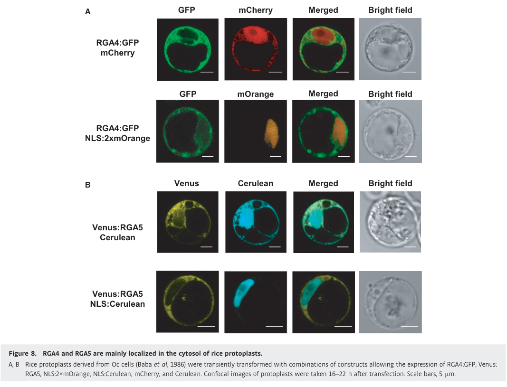

## Question

# Gene Research for Functional Annotation

## ⚠️ CRITICAL: Gene/Protein Identification Context

**BEFORE YOU BEGIN RESEARCH:** You MUST verify you are researching the CORRECT gene/protein. Gene symbols can be ambiguous, especially for less well-characterized genes from non-model organisms.

### Target Gene/Protein Identity (from UniProt):
- **UniProt Accession:** F7J0M4
- **Protein Description:** RecName: Full=Disease resistance protein RGA4 {ECO:0000305}; AltName: Full=Os11gRGA4 {ECO:0000312|EMBL:BAK39922.1}; AltName: Full=SasRGA4 {ECO:0000303|PubMed:21251109};
- **Gene Information:** Name=RGA4 {ECO:0000303|PubMed:21251109}; Synonyms=PIA {ECO:0000303|PubMed:21251109};
- **Organism (full):** Oryza sativa subsp. japonica (Rice).
- **Protein Family:** Belongs to the disease resistance NB-LRR family.
- **Key Domains:** Apaf_helical. (IPR042197); Disease_R_plants. (IPR044974); LRR_dom_sf. (IPR032675); LRR_R13L4/SHOC2-like. (IPR055414); NB-ARC. (IPR002182)

### MANDATORY VERIFICATION STEPS:

1. **Check if the gene symbol "RGA4" matches the protein description above**
2. **Verify the organism is correct:** Oryza sativa subsp. japonica (Rice).
3. **Check if protein family/domains align with what you find in literature**
4. **If you find literature for a DIFFERENT gene with the same or similar symbol, STOP**

### If Gene Symbol is Ambiguous or You Cannot Find Relevant Literature:

**DO NOT PROCEED WITH RESEARCH ON A DIFFERENT GENE.** Instead:
- State clearly: "The gene symbol 'RGA4' is ambiguous or literature is limited for this specific protein"
- Explain what you found (e.g., "Found extensive literature on a different gene with the same symbol in a different organism")
- Describe the protein based ONLY on the UniProt information provided above
- Suggest that the protein function can be inferred from domain/family information

### Research Target:

Please provide a comprehensive research report on the gene **RGA4** (gene ID: RGA4, UniProt: F7J0M4) in ORYSJ.

The research report should be a detailed narrative explaining the function, biological processes, and localization of the gene product. Citations should be given for all claims.

You should prioritize authoritative reviews and primary scientific literature when conducting research. You can supplement
this with annotations you find in gene/protein databases, but these can be outdated or inaccurate.

We are specifically interested in the primary function of the gene - for enzymes, what reaction is catalyzed, and what is the substrate specificity? For transporters, what is the substrate? For structural proteins or adapters, what is the broader structural role? For signaling molecules, what is the role in the pathway.

We are interested in where in or outside the cell the gene product carries out its function.

We are also interested in the signaling or biochemical pathways in which the gene functions. We are less interested in broad pleiotropic effects, except where these elucidate the precise role.

Include evidence where possible. We are interested in both experimental evidence as well as inference from structure, evolution, or bioinformatic analysis. Precise studies should be prioritized over high-throughput, where available.

## Output

Question: You are an expert researcher providing comprehensive, well-cited information.

Provide detailed information focusing on:
1. Key concepts and definitions with current understanding
2. Recent developments and latest research (prioritize 2023-2024 sources)
3. Current applications and real-world implementations
4. Expert opinions and analysis from authoritative sources
5. Relevant statistics and data from recent studies

Format as a comprehensive research report with proper citations. Include URLs and publication dates where available.
Always prioritize recent, authoritative sources and provide specific citations for all major claims.

# Gene Research for Functional Annotation

## ⚠️ CRITICAL: Gene/Protein Identification Context

**BEFORE YOU BEGIN RESEARCH:** You MUST verify you are researching the CORRECT gene/protein. Gene symbols can be ambiguous, especially for less well-characterized genes from non-model organisms.

### Target Gene/Protein Identity (from UniProt):
- **UniProt Accession:** F7J0M4
- **Protein Description:** RecName: Full=Disease resistance protein RGA4 {ECO:0000305}; AltName: Full=Os11gRGA4 {ECO:0000312|EMBL:BAK39922.1}; AltName: Full=SasRGA4 {ECO:0000303|PubMed:21251109};
- **Gene Information:** Name=RGA4 {ECO:0000303|PubMed:21251109}; Synonyms=PIA {ECO:0000303|PubMed:21251109};
- **Organism (full):** Oryza sativa subsp. japonica (Rice).
- **Protein Family:** Belongs to the disease resistance NB-LRR family.
- **Key Domains:** Apaf_helical. (IPR042197); Disease_R_plants. (IPR044974); LRR_dom_sf. (IPR032675); LRR_R13L4/SHOC2-like. (IPR055414); NB-ARC. (IPR002182)

### MANDATORY VERIFICATION STEPS:

1. **Check if the gene symbol "RGA4" matches the protein description above**
2. **Verify the organism is correct:** Oryza sativa subsp. japonica (Rice).
3. **Check if protein family/domains align with what you find in literature**
4. **If you find literature for a DIFFERENT gene with the same or similar symbol, STOP**

### If Gene Symbol is Ambiguous or You Cannot Find Relevant Literature:

**DO NOT PROCEED WITH RESEARCH ON A DIFFERENT GENE.** Instead:
- State clearly: "The gene symbol 'RGA4' is ambiguous or literature is limited for this specific protein"
- Explain what you found (e.g., "Found extensive literature on a different gene with the same symbol in a different organism")
- Describe the protein based ONLY on the UniProt information provided above
- Suggest that the protein function can be inferred from domain/family information

### Research Target:

Please provide a comprehensive research report on the gene **RGA4** (gene ID: RGA4, UniProt: F7J0M4) in ORYSJ.

The research report should be a detailed narrative explaining the function, biological processes, and localization of the gene product. Citations should be given for all claims.

You should prioritize authoritative reviews and primary scientific literature when conducting research. You can supplement
this with annotations you find in gene/protein databases, but these can be outdated or inaccurate.

We are specifically interested in the primary function of the gene - for enzymes, what reaction is catalyzed, and what is the substrate specificity? For transporters, what is the substrate? For structural proteins or adapters, what is the broader structural role? For signaling molecules, what is the role in the pathway.

We are interested in where in or outside the cell the gene product carries out its function.

We are also interested in the signaling or biochemical pathways in which the gene functions. We are less interested in broad pleiotropic effects, except where these elucidate the precise role.

Include evidence where possible. We are interested in both experimental evidence as well as inference from structure, evolution, or bioinformatic analysis. Precise studies should be prioritized over high-throughput, where available.

# Functional annotation of rice RGA4 (UniProt F7J0M4)

## Identity and principal function

**Identity check.** The supplied UniProt identifier [F7J0M4](https://www.uniprot.org/uniprotkb/F7J0M4/entry) specifies disease-resistance protein **RGA4**, also called **PIA, Os11gRGA4 or SasRGA4**, from *Oryza sativa* subsp. *japonica*. This is consistent with primary studies of the functional rice **Pia** locus: RGA4 and its adjacent partner **RGA5** are coiled-coil, nucleotide-binding, leucine-rich-repeat immune receptors (CC-NLRs) on rice chromosome 11. The UniProt domain calls supplied in the question—particularly NB-ARC and LRR—accord with that architecture. **RGA4 is the signaling/helper member; RGA5 is the effector-binding sensor. The integrated heavy-metal-associated (HMA, also called RATX1) domain belongs to RGA5, not RGA4.** The papers establish the functional rice protein identity but do not independently print accession F7J0M4; that accession-to-name mapping is therefore taken from the supplied UniProt record. (cesari2014thenb‐lrrproteins pages 1-2, cesari2013thericeresistance pages 3-5, xi2022theactivityof pages 1-2)

RGA4’s primary function is **intracellular effector-triggered immune signaling against rice blast**, caused by *Magnaporthe oryzae*. Rather than catalyzing a characterized metabolic reaction or transporting a known substrate, RGA4 acts as an NLR signaling switch that initiates hypersensitive-response-like cell death and resistance when its inhibitory interaction with RGA5 is functionally relieved. The pair responds to fungal effectors **AVR-Pia** and **AVR1-CO39**, which bind RGA5 directly. Calling RGA4 itself an AVR-binding protein would incorrectly assign RGA5’s experimentally demonstrated function to its partner. (cesari2013thericeresistance pages 1-2, cesari2014thenb‐lrrproteins pages 1-2, cesari2014thenb‐lrrproteins pages 11-13)

The principal evidence, including recent allele discovery and receptor engineering, is summarized below.

| Evidence level | Exact rice RGA4/Pia conclusion | Key source and date/DOI |
|---|---|---|
| **Direct genetic evidence** | **RGA4 is necessary but not sufficient for Pia/Pi-CO39 resistance.** Rice *rga4* loss-of-function mutants lost AVR1-CO39-triggered resistance; susceptible rice acquired resistance only when **both RGA4 and RGA5** were introduced. Effector binding was assigned to RGA5, not RGA4. (cesari2013thericeresistance pages 3-5, cesari2013thericeresistance pages 2-3) | Cesari et al., *The Plant Cell*, April 2013. [doi:10.1105/tpc.112.107201](https://doi.org/10.1105/tpc.112.107201) |
| **Direct functional, mutational, interaction and localization evidence** | **RGA4 is the signaling and cell-death executor restrained by RGA5.** RGA4 caused autoactive death in rice protoplasts and *Nicotiana*; RGA5 suppressed it, while AVR-Pia recognition by RGA5 relieved suppression. The RGA4 K209R P-loop mutation abolished activity, and replacing its unusual ARC2 **TYG** sequence with consensus MHD abolished autoactivity. RGA4-GFP was mainly cytosolic and weak or absent from nuclei; channel activity was not tested. (cesari2014thenb‐lrrproteins pages 3-4, cesari2014thenb‐lrrproteins pages 8-10, cesari2014thenb‐lrrproteins pages 11-13, cesari2014thenb‐lrrproteins media d397be32) | Césari et al., *EMBO Journal*, September 2014. [doi:10.15252/embj.201487923](https://doi.org/10.15252/embj.201487923) |
| **Population genetics plus infection validation** | Analysis of **500 diverse rice accessions**, supported by **10 de novo assemblies**, identified **two additional functional Pia RGA4/RGA5 allele combinations**. Despite extensive variation, including 66 RGA4 amino-acid differences in one accession, both recognized AVR-Pia and AVR1-CO39; specificity remained principally associated with the RGA5 HMA sensor domain. (greenwood2024genomewideassociationanalysis pages 4-6, greenwood2024genomewideassociationanalysis pages 8-9, greenwood2024genomewideassociationanalysis pages 1-2) | Greenwood et al., *Communications Biology*, May 2024. [doi:10.1038/s42003-024-06244-z](https://doi.org/10.1038/s42003-024-06244-z) |
| **Structure-guided engineering with transgenic-rice validation** | Engineered **RGA5-HMA5**, containing **three cooperating interfaces**—two in the HMA domain and one in its Lys-rich C-terminal tail—redirected RGA4-dependent immunity to AVR-PikD. Five independent RGA4/RGA5-HMA5 rice lines were generated; the construct conferred complete AVR-PikD-dependent blast resistance but **lost AVR-Pia recognition and resistance**, showing that effector binding alone does not guarantee helper activation. (zhang2024thesyntheticnlr pages 5-8, zhang2024thesyntheticnlr pages 5-5, zhang2024thesyntheticnlr pages 8-9) | Zhang et al., *Nature Communications*, February 2024. [doi:10.1038/s41467-024-45380-2](https://doi.org/10.1038/s41467-024-45380-2) |

*Table: Four tiers of evidence establish RGA4 as the cytosolic signaling and cell-death component of the rice Pia pair, while RGA5 supplies direct effector recognition. The table also summarizes recent natural-allele discovery and structure-guided receptor engineering.*

## Molecular mechanism and pathway

The established pathway is **fungal effector delivery into a rice cell → direct effector binding to RGA5’s C-terminal HMA/RATX1 domain → release of RGA5’s restraint on RGA4 → RGA4-dependent immune activation, localized cell death and restriction of fungal growth**. RGA4 and RGA5 associate in the absence of effector and remain associated after AVR-Pia recognition; release of *inhibition* therefore should not be misread as demonstrated physical dissociation of the pair. Their coiled-coil regions contribute to homo- and heterocomplex formation. Deleting RGA5’s HMA region removes recognition while retaining its capacity to repress RGA4, experimentally separating sensing from regulation. (cesari2014thenb‐lrrproteins pages 1-2, xi2022theactivityof pages 1-2, cesari2014thenb‐lrrproteins pages 8-10)

Genetic tests establish that RGA4 is indispensable to this pathway. Two independent *rga4* mutant lines lost resistance to an AVR1-CO39-expressing fungal strain. In susceptible Kanto51 rice, introducing **RGA4 alone or RGA5 alone** did not confer resistance, whereas introducing **both** did; these experiments also distinguished effector-dependent resistance from susceptibility to the empty-vector fungal control. Yeast two-hybrid, coimmunoprecipitation and FRET–FLIM instead assigned direct AVR-Pia/AVR1-CO39 binding to the functional RGA5-A splice isoform. (cesari2013thericeresistance pages 1-2, cesari2013thericeresistance pages 3-5, cesari2013thericeresistance pages 2-3)

The biochemical interpretation is a **nucleotide-dependent signaling switch**, not an established substrate-processing enzyme. Replacing the conserved RGA4 NB-ARC P-loop lysine with arginine (**K209R**) eliminated its spontaneous and AVR-Pia-associated cell-death activity. An analogous RGA5 P-loop mutation did not eliminate RGA5-mediated suppression or AVR-Pia-dependent relief of suppression. RGA4’s atypical **TYG** sequence at the otherwise conserved MHD position contributes to its autoactivity: restoring consensus MHD abolished that activity, and substitutions implicate the glycine in the tested variants. These are functional mutagenesis results; a particular ATP-hydrolysis reaction rate or physiological enzymatic substrate has **not** been established for RGA4. (cesari2014thenb‐lrrproteins pages 5-7, cesari2014thenb‐lrrproteins pages 3-4, cesari2014thenb‐lrrproteins pages 11-13)

RGA4 can cause cell death when experimentally expressed without sufficient RGA5, but the intact pair normally restrains this potentially harmful response. Depleting RGA5 in rice also derepressed RGA4-dependent cell death. This negative-regulation model is supported directly for RGA4/RGA5; it should not automatically be generalized to all paired rice NLRs, some of which operate through different cooperative mechanisms. (cesari2014thenb‐lrrproteins pages 1-2, cesari2014thenb‐lrrproteins pages 2-3, contreras2023nlrreceptorsin pages 8-9)

## Cellular location

**The strongest protein-specific localization evidence places RGA4 mainly in the rice-cell cytosol.** Functional RGA4–GFP and Venus–RGA5 fusions were examined by confocal microscopy in rice protoplasts. RGA4–GFP overlapped a cytosolic marker but showed no, or only weak, nuclear signal; neither coexpression with RGA5 nor AVR-Pia recognition caused detectable nuclear relocalization. The cropped primary-study localization panel directly illustrates the cytosolic-versus-nuclear comparison. This supports signaling *inside* the host cell, not secretion or a demonstrated extracellular or constitutively plasma-membrane location. (cesari2014thenb‐lrrproteins pages 8-10, cesari2014thenb‐lrrproteins media d397be32)

Other CC-NLRs can form membrane-associated calcium-permeable resistosomes, but **a defined RGA4 oligomeric resistosome, RGA4-specific ion-channel conductance, and a required plasma-membrane site have not been demonstrated** in the cited RGA4 studies. Recent expert biochemical reviews treat an analogous mechanism for sensor–helper pairs as a possibility, not a result that can be assigned to RGA4. Its immediate downstream signaling partners and the steps connecting activation to cell death remain incompletely defined. (locci2024plantnlrimmunity pages 5-6, xi2022insightintothe pages 9-11, chai2023newbiochemicalprinciples pages 2-3)

## Recent research and applications

**Natural resistance variation, 2024.** Greenwood and colleagues screened **500 genetically diverse rice accessions**, made **10 de novo genome assemblies**, and identified **two additional functional Pia-associated RGA4/RGA5 allele combinations**. Five assembled accessions with the resistance association contained RGA4/RGA5, and a functional RGA4 variant in one accession differed from Sasanishiki RGA4 at **66 amino acids**. Tested additional alleles recognized both AVR-Pia and AVR1-CO39, but resistance was not universal against altered effector alleles: isolates carrying AVR-Pia-H3 overcame the assayed variants. This makes allele identity and *local pathogen effector genotype* relevant to marker-assisted breeding, rather than allowing an unqualified claim that every RGA4 allele protects against every blast isolate. The japonica Nipponbare reference also carries an **RGA4-like pseudogene, Os11g11790**, not an interchangeable copy of functional Sasanishiki RGA4; Nipponbare’s RGA5-related Os11g11810 lacks the functional HMA recognition region. (greenwood2024genomewideassociationanalysis pages 4-6, greenwood2024genomewideassociationanalysis pages 8-9, greenwood2024genomewideassociationanalysis pages 1-2, cesari2014thenb‐lrrproteins pages 11-13)

**Structure-guided receptor engineering, 2024.** Zhang and colleagues altered the *sensor*, creating **RGA5-HMA5** with two engineered HMA interfaces and a third interface in the adjacent lysine-rich tail. In combination with RGA4, it conferred complete resistance in experimental transgenic rice to blast strains expressing the otherwise noncognate effector **AVR-PikD**. They generated **five independent transgenic lines**; reported fungal-biomass analysis used **nine biological replicates from three lines**. Constructs capable of binding AVR-PikD through fewer engineered interfaces nevertheless failed to activate RGA4-dependent cell death: **binding alone is insufficient for productive signaling**. Crucially, this particular redesigned receptor **lost detectable AVR-Pia recognition/resistance**; it is an example of redirected specificity, not proven addition of AVR-PikD protection without a trade-off. Earlier RGA5 designs likewise showed that an engineered recognition response in *Nicotiana* need not translate into resistance in rice. These remain experimental transgenic implementations, not evidence of commercial field deployment. (zhang2024thesyntheticnlr pages 5-8, zhang2024thesyntheticnlr pages 5-5, zhang2024thesyntheticnlr pages 8-9)

**Additional proof of concept and durability limits.** Experimentally inducing the RGA4/RGA5 pathway with an introduced AVR1-CO39 gene and designer bacterial TAL effectors protected suitably engineered rice from *Xanthomonas oryzae* bacterial blight and leaf streak; TAL-effector-driven RGA4 expression itself also restricted bacterial blight in RGA4-containing cultivars. Those results demonstrate the broader protective capacity of the *activated pathway*, **not** natural RGA4 recognition of bacterial effectors or protection against unmodified bacteria in farmers’ fields. Effector-dependent specificity presents a durability constraint: in a 2013 survey of **50** blast-fungus isolates, only **four** were avirulent on Pia-diagnostic rice via functional AVR-Pia, while a naturally occurring AVR-Pia **F24S** change disrupted detectable RGA5 binding and recognition. Evolutionary work further suggests that conserved helper activity can be paired with diversifying sensor recognition: the Pia-related helper **Pias-1** could operate with RGA5, although this does not mean Pias-1 and F7J0M4 are the same protein. (cesari2013thericeresistance pages 9-10, shimizu2022ageneticallylinked pages 1-2, hutin2016ectopicactivationof pages 5-7, hutin2016ectopicactivationof pages 7-9)

**Annotation conclusion.** For **rice RGA4/F7J0M4**, the evidence-supported functional annotation is **predominantly cytosolic CC–NB-ARC–LRR helper/executor of RGA5-dependent blast effector-triggered immunity, required for hypersensitive cell death and resistance**. Its nucleotide-binding motif is functionally important; direct fungal-effector binding is the responsibility of RGA5. Specific RGA4 catalytic chemistry, a transported substrate, a resolved channel/resistosome, and exact downstream signaling partners should remain **unassigned pending direct evidence**. (cesari2014thenb‐lrrproteins pages 3-4, cesari2013thericeresistance pages 3-5, cesari2014thenb‐lrrproteins pages 8-10, locci2024plantnlrimmunity pages 5-6)

### Key dated sources

- Greenwood *et al.*, **May 2024**, *Communications Biology*, “Genome-wide association analysis uncovers rice blast resistance alleles of Ptr and Pia”: https://doi.org/10.1038/s42003-024-06244-z. (greenwood2024genomewideassociationanalysis pages 1-2)
- Zhang *et al.*, **February 2024**, *Nature Communications*, “The synthetic NLR RGA5HMA5 requires multiple interfaces within and outside the integrated domain for effector recognition”: https://doi.org/10.1038/s41467-024-45380-2. (zhang2024thesyntheticnlr pages 1-2)
- Locci and Parker, **January 2024**, *Open Biology*, biochemical perspective distinguishing established and proposed NLR mechanisms: https://doi.org/10.1098/rsob.230387. (locci2024plantnlrimmunity pages 5-6)
- Césari *et al.*, **September 2014**, *EMBO Journal*, experimental RGA4/RGA5 function, interaction and localization: https://doi.org/10.15252/embj.201487923. (cesari2014thenb‐lrrproteins pages 1-2)
- Cesari *et al.*, **April 2013**, *The Plant Cell*, genetic requirement and direct effector recognition by RGA5: https://doi.org/10.1105/tpc.112.107201. (cesari2013thericeresistance pages 1-2)

References

1. (cesari2014thenb‐lrrproteins pages 1-2): Stella Césari, Hiroyuki Kanzaki, Tadashi Fujiwara, Maud Bernoux, Véronique Chalvon, Yoji Kawano, Ko Shimamoto, Peter Dodds, Ryohei Terauchi, and Thomas Kroj. The nb‐lrr proteins rga4 and rga5 interact functionally and physically to confer disease resistance. The EMBO Journal, 33:1941-1959, Sep 2014. URL: https://doi.org/10.15252/embj.201487923, doi:10.15252/embj.201487923. This article has 454 citations.

2. (cesari2013thericeresistance pages 3-5): Stella Cesari, Gaëtan Thilliez, Cécile Ribot, Véronique Chalvon, Corinne Michel, Alain Jauneau, Susana Rivas, Ludovic Alaux, Hiroyuki Kanzaki, Yudai Okuyama, Jean-Benoit Morel, Elisabeth Fournier, Didier Tharreau, Ryohei Terauchi, and Thomas Kroj. The rice resistance protein pair rga4/rga5 recognizes the <i>magnaporthe oryzae</i> effectors avr-pia and avr1-co39 by direct binding. The Plant Cell, 25(4):1463-1481, Apr 2013. URL: https://doi.org/10.1105/tpc.112.107201, doi:10.1105/tpc.112.107201. This article has 696 citations.

3. (xi2022theactivityof pages 1-2): Yuxuan Xi, Véronique Chalvon, André Padilla, Stella Cesari, and Thomas Kroj. The activity of the rga5 sensor nlr from rice requires binding of its integrated hma domain to effectors but not hma domain self‐interaction. Molecular Plant Pathology, 23:1320-1330, Jun 2022. URL: https://doi.org/10.1111/mpp.13236, doi:10.1111/mpp.13236. This article has 7 citations and is from a peer-reviewed journal.

4. (cesari2013thericeresistance pages 1-2): Stella Cesari, Gaëtan Thilliez, Cécile Ribot, Véronique Chalvon, Corinne Michel, Alain Jauneau, Susana Rivas, Ludovic Alaux, Hiroyuki Kanzaki, Yudai Okuyama, Jean-Benoit Morel, Elisabeth Fournier, Didier Tharreau, Ryohei Terauchi, and Thomas Kroj. The rice resistance protein pair rga4/rga5 recognizes the <i>magnaporthe oryzae</i> effectors avr-pia and avr1-co39 by direct binding. The Plant Cell, 25(4):1463-1481, Apr 2013. URL: https://doi.org/10.1105/tpc.112.107201, doi:10.1105/tpc.112.107201. This article has 696 citations.

5. (cesari2014thenb‐lrrproteins pages 11-13): Stella Césari, Hiroyuki Kanzaki, Tadashi Fujiwara, Maud Bernoux, Véronique Chalvon, Yoji Kawano, Ko Shimamoto, Peter Dodds, Ryohei Terauchi, and Thomas Kroj. The nb‐lrr proteins rga4 and rga5 interact functionally and physically to confer disease resistance. The EMBO Journal, 33:1941-1959, Sep 2014. URL: https://doi.org/10.15252/embj.201487923, doi:10.15252/embj.201487923. This article has 454 citations.

6. (cesari2013thericeresistance pages 2-3): Stella Cesari, Gaëtan Thilliez, Cécile Ribot, Véronique Chalvon, Corinne Michel, Alain Jauneau, Susana Rivas, Ludovic Alaux, Hiroyuki Kanzaki, Yudai Okuyama, Jean-Benoit Morel, Elisabeth Fournier, Didier Tharreau, Ryohei Terauchi, and Thomas Kroj. The rice resistance protein pair rga4/rga5 recognizes the <i>magnaporthe oryzae</i> effectors avr-pia and avr1-co39 by direct binding. The Plant Cell, 25(4):1463-1481, Apr 2013. URL: https://doi.org/10.1105/tpc.112.107201, doi:10.1105/tpc.112.107201. This article has 696 citations.

7. (cesari2014thenb‐lrrproteins pages 3-4): Stella Césari, Hiroyuki Kanzaki, Tadashi Fujiwara, Maud Bernoux, Véronique Chalvon, Yoji Kawano, Ko Shimamoto, Peter Dodds, Ryohei Terauchi, and Thomas Kroj. The nb‐lrr proteins rga4 and rga5 interact functionally and physically to confer disease resistance. The EMBO Journal, 33:1941-1959, Sep 2014. URL: https://doi.org/10.15252/embj.201487923, doi:10.15252/embj.201487923. This article has 454 citations.

8. (cesari2014thenb‐lrrproteins pages 8-10): Stella Césari, Hiroyuki Kanzaki, Tadashi Fujiwara, Maud Bernoux, Véronique Chalvon, Yoji Kawano, Ko Shimamoto, Peter Dodds, Ryohei Terauchi, and Thomas Kroj. The nb‐lrr proteins rga4 and rga5 interact functionally and physically to confer disease resistance. The EMBO Journal, 33:1941-1959, Sep 2014. URL: https://doi.org/10.15252/embj.201487923, doi:10.15252/embj.201487923. This article has 454 citations.

9. (cesari2014thenb‐lrrproteins media d397be32): Stella Césari, Hiroyuki Kanzaki, Tadashi Fujiwara, Maud Bernoux, Véronique Chalvon, Yoji Kawano, Ko Shimamoto, Peter Dodds, Ryohei Terauchi, and Thomas Kroj. The nb‐lrr proteins rga4 and rga5 interact functionally and physically to confer disease resistance. The EMBO Journal, 33:1941-1959, Sep 2014. URL: https://doi.org/10.15252/embj.201487923, doi:10.15252/embj.201487923. This article has 454 citations.

10. (greenwood2024genomewideassociationanalysis pages 4-6): Julian R. Greenwood, Vanica Lacorte-Apostol, Thomas Kroj, Jonas Padilla, Mary Jeanie Telebanco-Yanoria, Anna N. Glaus, Anne Roulin, André Padilla, Bo Zhou, Beat Keller, and Simon G. Krattinger. Genome-wide association analysis uncovers rice blast resistance alleles of ptr and pia. Communications Biology, May 2024. URL: https://doi.org/10.1038/s42003-024-06244-z, doi:10.1038/s42003-024-06244-z. This article has 35 citations and is from a peer-reviewed journal.

11. (greenwood2024genomewideassociationanalysis pages 8-9): Julian R. Greenwood, Vanica Lacorte-Apostol, Thomas Kroj, Jonas Padilla, Mary Jeanie Telebanco-Yanoria, Anna N. Glaus, Anne Roulin, André Padilla, Bo Zhou, Beat Keller, and Simon G. Krattinger. Genome-wide association analysis uncovers rice blast resistance alleles of ptr and pia. Communications Biology, May 2024. URL: https://doi.org/10.1038/s42003-024-06244-z, doi:10.1038/s42003-024-06244-z. This article has 35 citations and is from a peer-reviewed journal.

12. (greenwood2024genomewideassociationanalysis pages 1-2): Julian R. Greenwood, Vanica Lacorte-Apostol, Thomas Kroj, Jonas Padilla, Mary Jeanie Telebanco-Yanoria, Anna N. Glaus, Anne Roulin, André Padilla, Bo Zhou, Beat Keller, and Simon G. Krattinger. Genome-wide association analysis uncovers rice blast resistance alleles of ptr and pia. Communications Biology, May 2024. URL: https://doi.org/10.1038/s42003-024-06244-z, doi:10.1038/s42003-024-06244-z. This article has 35 citations and is from a peer-reviewed journal.

13. (zhang2024thesyntheticnlr pages 5-8): Xin Zhang, Yang Liu, Guixin Yuan, Shiwei Wang, Dongli Wang, Tongtong Zhu, Xuefeng Wu, Mengqi Ma, Liwei Guo, Hailong Guo, Vijai Bhadauria, Junfeng Liu, and You-Liang Peng. The synthetic nlr rga5hma5 requires multiple interfaces within and outside the integrated domain for effector recognition. Nature Communications, Feb 2024. URL: https://doi.org/10.1038/s41467-024-45380-2, doi:10.1038/s41467-024-45380-2. This article has 40 citations and is from a highest quality peer-reviewed journal.

14. (zhang2024thesyntheticnlr pages 5-5): Xin Zhang, Yang Liu, Guixin Yuan, Shiwei Wang, Dongli Wang, Tongtong Zhu, Xuefeng Wu, Mengqi Ma, Liwei Guo, Hailong Guo, Vijai Bhadauria, Junfeng Liu, and You-Liang Peng. The synthetic nlr rga5hma5 requires multiple interfaces within and outside the integrated domain for effector recognition. Nature Communications, Feb 2024. URL: https://doi.org/10.1038/s41467-024-45380-2, doi:10.1038/s41467-024-45380-2. This article has 40 citations and is from a highest quality peer-reviewed journal.

15. (zhang2024thesyntheticnlr pages 8-9): Xin Zhang, Yang Liu, Guixin Yuan, Shiwei Wang, Dongli Wang, Tongtong Zhu, Xuefeng Wu, Mengqi Ma, Liwei Guo, Hailong Guo, Vijai Bhadauria, Junfeng Liu, and You-Liang Peng. The synthetic nlr rga5hma5 requires multiple interfaces within and outside the integrated domain for effector recognition. Nature Communications, Feb 2024. URL: https://doi.org/10.1038/s41467-024-45380-2, doi:10.1038/s41467-024-45380-2. This article has 40 citations and is from a highest quality peer-reviewed journal.

16. (cesari2014thenb‐lrrproteins pages 5-7): Stella Césari, Hiroyuki Kanzaki, Tadashi Fujiwara, Maud Bernoux, Véronique Chalvon, Yoji Kawano, Ko Shimamoto, Peter Dodds, Ryohei Terauchi, and Thomas Kroj. The nb‐lrr proteins rga4 and rga5 interact functionally and physically to confer disease resistance. The EMBO Journal, 33:1941-1959, Sep 2014. URL: https://doi.org/10.15252/embj.201487923, doi:10.15252/embj.201487923. This article has 454 citations.

17. (cesari2014thenb‐lrrproteins pages 2-3): Stella Césari, Hiroyuki Kanzaki, Tadashi Fujiwara, Maud Bernoux, Véronique Chalvon, Yoji Kawano, Ko Shimamoto, Peter Dodds, Ryohei Terauchi, and Thomas Kroj. The nb‐lrr proteins rga4 and rga5 interact functionally and physically to confer disease resistance. The EMBO Journal, 33:1941-1959, Sep 2014. URL: https://doi.org/10.15252/embj.201487923, doi:10.15252/embj.201487923. This article has 454 citations.

18. (contreras2023nlrreceptorsin pages 8-9): Mauricio P Contreras, Daniel Lüdke, Hsuan Pai, AmirAli Toghani, and Sophien Kamoun. Nlr receptors in plant immunity: making sense of the alphabet soup. EMBO Reports, Aug 2023. URL: https://doi.org/10.15252/embr.202357495, doi:10.15252/embr.202357495. This article has 208 citations and is from a highest quality peer-reviewed journal.

19. (locci2024plantnlrimmunity pages 5-6): Federica Locci and Jane E. Parker. Plant nlr immunity activation and execution: a biochemical perspective. Open Biology, Jan 2024. URL: https://doi.org/10.1098/rsob.230387, doi:10.1098/rsob.230387. This article has 57 citations and is from a peer-reviewed journal.

20. (xi2022insightintothe pages 9-11): Yuxuan Xi, Stella Cesari, and Thomas Kroj. Insight into the structure and molecular mode of action of plant paired nlr immune receptors. Essays in Biochemistry, 66:513-526, Sep 2022. URL: https://doi.org/10.1042/ebc20210079, doi:10.1042/ebc20210079. This article has 45 citations and is from a peer-reviewed journal.

21. (chai2023newbiochemicalprinciples pages 2-3): Jijie Chai, Wen Song, and Jane E. Parker. New biochemical principles for nlr immunity in plants. Molecular plant-microbe interactions : MPMI, 36:MPMI05230073HH, Aug 2023. URL: https://doi.org/10.1094/mpmi-05-23-0073-hh, doi:10.1094/mpmi-05-23-0073-hh. This article has 55 citations.

22. (cesari2013thericeresistance pages 9-10): Stella Cesari, Gaëtan Thilliez, Cécile Ribot, Véronique Chalvon, Corinne Michel, Alain Jauneau, Susana Rivas, Ludovic Alaux, Hiroyuki Kanzaki, Yudai Okuyama, Jean-Benoit Morel, Elisabeth Fournier, Didier Tharreau, Ryohei Terauchi, and Thomas Kroj. The rice resistance protein pair rga4/rga5 recognizes the <i>magnaporthe oryzae</i> effectors avr-pia and avr1-co39 by direct binding. The Plant Cell, 25(4):1463-1481, Apr 2013. URL: https://doi.org/10.1105/tpc.112.107201, doi:10.1105/tpc.112.107201. This article has 696 citations.

23. (shimizu2022ageneticallylinked pages 1-2): Motoki Shimizu, Akiko Hirabuchi, Yu Sugihara, Akira Abe, Takumi Takeda, Michie Kobayashi, Yukie Hiraka, Eiko Kanzaki, Kaori Oikawa, Hiromasa Saitoh, Thorsten Langner, Mark J. Banfield, Sophien Kamoun, and Ryohei Terauchi. A genetically linked pair of nlr immune receptors shows contrasting patterns of evolution. Jun 2022. URL: https://doi.org/10.1073/pnas.2116896119, doi:10.1073/pnas.2116896119. This article has 71 citations and is from a highest quality peer-reviewed journal.

24. (hutin2016ectopicactivationof pages 5-7): Mathilde Hutin, Stella Césari, Véronique Chalvon, Corinne Michel, Tuan Tu Tran, Jens Boch, Ralf Koebnik, Boris Szurek, and Thomas Kroj. Ectopic activation of the rice nlr heteropair rga4/rga5 confers resistance to bacterial blight and bacterial leaf streak diseases. The Plant journal : for cell and molecular biology, 88 1:43-55, Oct 2016. URL: https://doi.org/10.1111/tpj.13231, doi:10.1111/tpj.13231. This article has 48 citations.

25. (hutin2016ectopicactivationof pages 7-9): Mathilde Hutin, Stella Césari, Véronique Chalvon, Corinne Michel, Tuan Tu Tran, Jens Boch, Ralf Koebnik, Boris Szurek, and Thomas Kroj. Ectopic activation of the rice nlr heteropair rga4/rga5 confers resistance to bacterial blight and bacterial leaf streak diseases. The Plant journal : for cell and molecular biology, 88 1:43-55, Oct 2016. URL: https://doi.org/10.1111/tpj.13231, doi:10.1111/tpj.13231. This article has 48 citations.

26. (zhang2024thesyntheticnlr pages 1-2): Xin Zhang, Yang Liu, Guixin Yuan, Shiwei Wang, Dongli Wang, Tongtong Zhu, Xuefeng Wu, Mengqi Ma, Liwei Guo, Hailong Guo, Vijai Bhadauria, Junfeng Liu, and You-Liang Peng. The synthetic nlr rga5hma5 requires multiple interfaces within and outside the integrated domain for effector recognition. Nature Communications, Feb 2024. URL: https://doi.org/10.1038/s41467-024-45380-2, doi:10.1038/s41467-024-45380-2. This article has 40 citations and is from a highest quality peer-reviewed journal.

## Artifacts

- [Edison artifact artifact-00](RGA4-deep-research-falcon_artifacts/artifact-00.md)

## Citations

1. greenwood2024genomewideassociationanalysis pages 1-2
2. zhang2024thesyntheticnlr pages 1-2
3. locci2024plantnlrimmunity pages 5-6
4. cesari2013thericeresistance pages 1-2
5. cesari2013thericeresistance pages 3-5
6. xi2022theactivityof pages 1-2
7. cesari2013thericeresistance pages 2-3
8. greenwood2024genomewideassociationanalysis pages 4-6
9. greenwood2024genomewideassociationanalysis pages 8-9
10. zhang2024thesyntheticnlr pages 5-8
11. zhang2024thesyntheticnlr pages 5-5
12. zhang2024thesyntheticnlr pages 8-9
13. contreras2023nlrreceptorsin pages 8-9
14. xi2022insightintothe pages 9-11
15. chai2023newbiochemicalprinciples pages 2-3
16. cesari2013thericeresistance pages 9-10
17. shimizu2022ageneticallylinked pages 1-2
18. hutin2016ectopicactivationof pages 5-7
19. hutin2016ectopicactivationof pages 7-9
20. F7J0M4
21. doi:10.1105/tpc.112.107201
22. doi:10.15252/embj.201487923
23. doi:10.1038/s42003-024-06244-z
24. doi:10.1038/s41467-024-45380-2
25. https://www.uniprot.org/uniprotkb/F7J0M4/entry
26. https://doi.org/10.1105/tpc.112.107201
27. https://doi.org/10.15252/embj.201487923
28. https://doi.org/10.1038/s42003-024-06244-z
29. https://doi.org/10.1038/s41467-024-45380-2
30. https://doi.org/10.1038/s42003-024-06244-z.
31. https://doi.org/10.1038/s41467-024-45380-2.
32. https://doi.org/10.1098/rsob.230387.
33. https://doi.org/10.15252/embj.201487923.
34. https://doi.org/10.1105/tpc.112.107201.
35. https://doi.org/10.15252/embj.201487923,
36. https://doi.org/10.1105/tpc.112.107201,
37. https://doi.org/10.1111/mpp.13236,
38. https://doi.org/10.1038/s42003-024-06244-z,
39. https://doi.org/10.1038/s41467-024-45380-2,
40. https://doi.org/10.15252/embr.202357495,
41. https://doi.org/10.1098/rsob.230387,
42. https://doi.org/10.1042/ebc20210079,
43. https://doi.org/10.1094/mpmi-05-23-0073-hh,
44. https://doi.org/10.1073/pnas.2116896119,
45. https://doi.org/10.1111/tpj.13231,