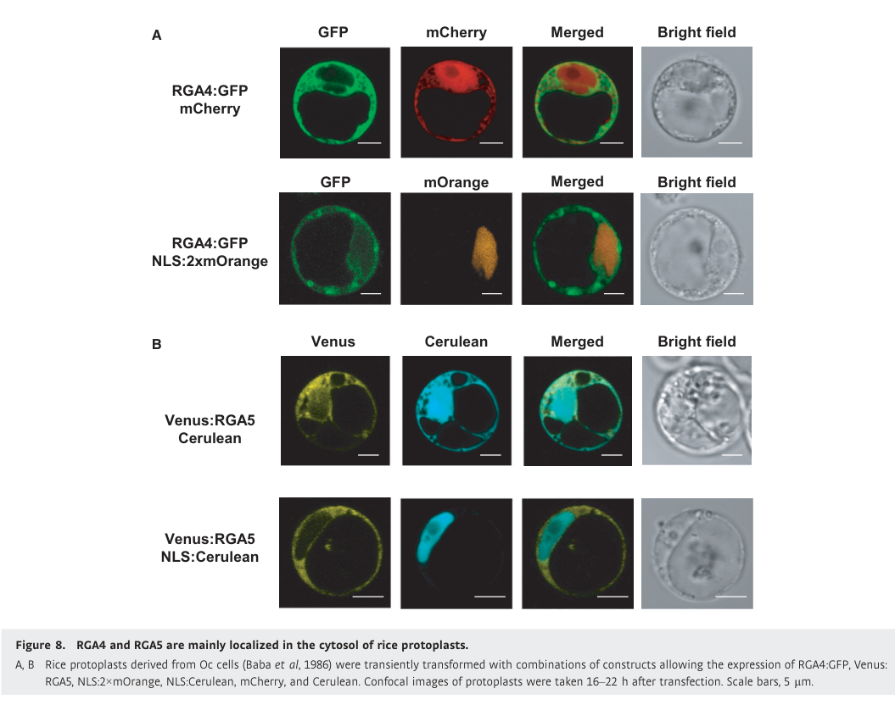

## Question

# Gene Research for Functional Annotation

## ⚠️ CRITICAL: Gene/Protein Identification Context

**BEFORE YOU BEGIN RESEARCH:** You MUST verify you are researching the CORRECT gene/protein. Gene symbols can be ambiguous, especially for less well-characterized genes from non-model organisms.

### Target Gene/Protein Identity (from UniProt):
- **UniProt Accession:** F7J0N2
- **Protein Description:** RecName: Full=Disease resistance protein RGA5 {ECO:0000305}; AltName: Full=Os11gRGA5 {ECO:0000312|EMBL:BAK39930.1}; AltName: Full=SasRGA5 {ECO:0000303|PubMed:21251109};
- **Gene Information:** Name=RGA5 {ECO:0000303|PubMed:21251109};
- **Organism (full):** Oryza sativa subsp. japonica (Rice).
- **Protein Family:** Belongs to the disease resistance NB-LRR family.
- **Key Domains:** Apaf_helical. (IPR042197); Disease_R_plants. (IPR044974); HMA_dom. (IPR006121); LRR_dom_sf. (IPR032675); LRR_R13L4/SHOC2-like. (IPR055414)

### MANDATORY VERIFICATION STEPS:

1. **Check if the gene symbol "RGA5" matches the protein description above**
2. **Verify the organism is correct:** Oryza sativa subsp. japonica (Rice).
3. **Check if protein family/domains align with what you find in literature**
4. **If you find literature for a DIFFERENT gene with the same or similar symbol, STOP**

### If Gene Symbol is Ambiguous or You Cannot Find Relevant Literature:

**DO NOT PROCEED WITH RESEARCH ON A DIFFERENT GENE.** Instead:
- State clearly: "The gene symbol 'RGA5' is ambiguous or literature is limited for this specific protein"
- Explain what you found (e.g., "Found extensive literature on a different gene with the same symbol in a different organism")
- Describe the protein based ONLY on the UniProt information provided above
- Suggest that the protein function can be inferred from domain/family information

### Research Target:

Please provide a comprehensive research report on the gene **RGA5** (gene ID: RGA5, UniProt: F7J0N2) in ORYSJ.

The research report should be a detailed narrative explaining the function, biological processes, and localization of the gene product. Citations should be given for all claims.

You should prioritize authoritative reviews and primary scientific literature when conducting research. You can supplement
this with annotations you find in gene/protein databases, but these can be outdated or inaccurate.

We are specifically interested in the primary function of the gene - for enzymes, what reaction is catalyzed, and what is the substrate specificity? For transporters, what is the substrate? For structural proteins or adapters, what is the broader structural role? For signaling molecules, what is the role in the pathway.

We are interested in where in or outside the cell the gene product carries out its function.

We are also interested in the signaling or biochemical pathways in which the gene functions. We are less interested in broad pleiotropic effects, except where these elucidate the precise role.

Include evidence where possible. We are interested in both experimental evidence as well as inference from structure, evolution, or bioinformatic analysis. Precise studies should be prioritized over high-throughput, where available.

## Output

Question: You are an expert researcher providing comprehensive, well-cited information.

Provide detailed information focusing on:
1. Key concepts and definitions with current understanding
2. Recent developments and latest research (prioritize 2023-2024 sources)
3. Current applications and real-world implementations
4. Expert opinions and analysis from authoritative sources
5. Relevant statistics and data from recent studies

Format as a comprehensive research report with proper citations. Include URLs and publication dates where available.
Always prioritize recent, authoritative sources and provide specific citations for all major claims.

# Gene Research for Functional Annotation

## ⚠️ CRITICAL: Gene/Protein Identification Context

**BEFORE YOU BEGIN RESEARCH:** You MUST verify you are researching the CORRECT gene/protein. Gene symbols can be ambiguous, especially for less well-characterized genes from non-model organisms.

### Target Gene/Protein Identity (from UniProt):
- **UniProt Accession:** F7J0N2
- **Protein Description:** RecName: Full=Disease resistance protein RGA5 {ECO:0000305}; AltName: Full=Os11gRGA5 {ECO:0000312|EMBL:BAK39930.1}; AltName: Full=SasRGA5 {ECO:0000303|PubMed:21251109};
- **Gene Information:** Name=RGA5 {ECO:0000303|PubMed:21251109};
- **Organism (full):** Oryza sativa subsp. japonica (Rice).
- **Protein Family:** Belongs to the disease resistance NB-LRR family.
- **Key Domains:** Apaf_helical. (IPR042197); Disease_R_plants. (IPR044974); HMA_dom. (IPR006121); LRR_dom_sf. (IPR032675); LRR_R13L4/SHOC2-like. (IPR055414)

### MANDATORY VERIFICATION STEPS:

1. **Check if the gene symbol "RGA5" matches the protein description above**
2. **Verify the organism is correct:** Oryza sativa subsp. japonica (Rice).
3. **Check if protein family/domains align with what you find in literature**
4. **If you find literature for a DIFFERENT gene with the same or similar symbol, STOP**

### If Gene Symbol is Ambiguous or You Cannot Find Relevant Literature:

**DO NOT PROCEED WITH RESEARCH ON A DIFFERENT GENE.** Instead:
- State clearly: "The gene symbol 'RGA5' is ambiguous or literature is limited for this specific protein"
- Explain what you found (e.g., "Found extensive literature on a different gene with the same symbol in a different organism")
- Describe the protein based ONLY on the UniProt information provided above
- Suggest that the protein function can be inferred from domain/family information

### Research Target:

Please provide a comprehensive research report on the gene **RGA5** (gene ID: RGA5, UniProt: F7J0N2) in ORYSJ.

The research report should be a detailed narrative explaining the function, biological processes, and localization of the gene product. Citations should be given for all claims.

You should prioritize authoritative reviews and primary scientific literature when conducting research. You can supplement
this with annotations you find in gene/protein databases, but these can be outdated or inaccurate.

We are specifically interested in the primary function of the gene - for enzymes, what reaction is catalyzed, and what is the substrate specificity? For transporters, what is the substrate? For structural proteins or adapters, what is the broader structural role? For signaling molecules, what is the role in the pathway.

We are interested in where in or outside the cell the gene product carries out its function.

We are also interested in the signaling or biochemical pathways in which the gene functions. We are less interested in broad pleiotropic effects, except where these elucidate the precise role.

Include evidence where possible. We are interested in both experimental evidence as well as inference from structure, evolution, or bioinformatic analysis. Precise studies should be prioritized over high-throughput, where available.

# Functional annotation of rice RGA5 (UniProt F7J0N2)

## Identity and principal function

**Identity verified.** The requested protein is the *Oryza sativa* subsp. *japonica* disease-resistance protein **RGA5**, also called **SasRGA5** or **Os11gRGA5**. The Sasanishiki gene lies beside **RGA4** at the chromosome-11 **Pia** blast-resistance locus. These are two different genes whose products function together; neither RGA5 nor its partner is the related rice receptor Pik-1. The literature generally identifies this protein by its gene names rather than by the supplied UniProt accession F7J0N2. (okuyama2011amultifacetedgenomics pages 7-8, cesari2013thericeresistance pages 3-5)

**Primary molecular function:** RGA5 is an intracellular **sensor nucleotide-binding, leucine-rich-repeat immune receptor** (sensor NLR). It directly detects the rice-blast fungal effectors **AVR-Pia** and **AVR1-CO39** through a C-terminal integrated **heavy-metal-associated (HMA; also called RATX1-like) domain**. Its paired NLR **RGA4** executes the immune response. RGA5 is therefore best annotated as an *effector-binding immune sensor and regulator of RGA4*, not as an enzyme, transporter, or the principal cell-death executor. (cesari2013thericeresistance pages 1-2, xi2022theactivityof pages 1-2, cesari2014thenb‐lrrproteins pages 1-2)

The functional **RGA5-A** protein is 1,116 amino acids long. Its experimentally described architecture comprises an N-terminal coiled-coil region, a central NB-ARC nucleotide-binding region, leucine-rich repeats, and a **post-LRR HMA domain**; the original sequence analysis placed NB-ARC at residues 178–468, LRR at 583–868, and the HMA-like region at approximately 1000–1070. The alternative transcript **RGA5-B** retains intron 3, disrupting the intact C-terminal HMA-related region, and **does not confer Pia or Pi-CO39 resistance**. This splice-variant distinction matters when interpreting experiments or protein annotations. The HMA domain of the separate receptor Pik-1 occupies a different position in its protein architecture. (cesari2013thericeresistance pages 3-5, cesari2014thenb‐lrrproteins pages 1-2, cesari2013thericeresistance pages 5-7, okuyama2011amultifacetedgenomics pages 7-8)

## Biological process and signaling mechanism

RGA5 participates in **effector-triggered immunity against *Magnaporthe oryzae***, the fungus that causes rice blast. Genetic complementation established that introducing **both SasRGA4 and SasRGA5**, but neither alone, restored AVR-Pia-dependent hypersensitive cell death in rice cells and resistance in transgenic rice. The paired genes also enable recognition of AVR1-CO39. In one transgenic test, the RGA4/RGA5 pair resisted an AVR-Pia-positive fungal race but remained susceptible to races lacking AVR-Pia: this is **effector-dependent**, not general resistance to every blast isolate. (okuyama2011amultifacetedgenomics pages 7-8, cesari2013thericeresistance pages 5-7)

The experimentally supported working model is a **repressed sensor–executor pair**. Without a recognized effector, RGA5 associates with and restrains autoactive RGA4. Binding of AVR-Pia or AVR1-CO39 to RGA5 permits RGA4-dependent hypersensitive cell death and resistance. Co-immunoprecipitation detects RGA4–RGA5 association, including after AVR-Pia recognition; activation **does not require wholesale dissociation** of the complex. The RGA5 coiled-coil region is necessary, though not sufficient, for repressing RGA4, whereas its HMA domain is necessary for effector recognition but dispensable for that repression. (cesari2014thenb‐lrrproteins pages 3-4, cesari2014thenb‐lrrproteins pages 5-7, cesari2014thenb‐lrrproteins pages 8-10, xi2022theactivityof pages 1-2)

A targeted nucleotide-binding-pocket experiment further separates the partners' roles: an **RGA4 K209R P-loop** mutation abolished cell-death activity, whereas **RGA5 K210R** still restrained RGA4 and allowed AVR-Pia-triggered cell death in the tested assays. This does **not** establish that RGA5 cannot bind nucleotides; rather, it shows that an intact version of this RGA5 motif was unnecessary for those measured regulatory outputs. The molecular steps downstream of RGA4 derepression remain less directly resolved than RGA5's effector binding and the resulting cell-death phenotype; mechanisms established for other NLRs should not automatically be assigned to this pair. (cesari2014thenb‐lrrproteins pages 3-4, cesari2014thenb‐lrrproteins pages 5-7, cesari2014thenb‐lrrproteins pages 8-10)

## Direct ligand recognition and structural evidence

Yeast two-hybrid, co-immunoprecipitation, and FRET–FLIM experiments support **direct association of native RGA5-A with both AVR-Pia and AVR1-CO39**. Importantly, an inactive AVR-Pia allele failed to bind the functional RGA5-A interaction domain, linking binding to recognition rather than merely documenting protein association. In rice, **at least 15 independent transgenic lines per splice-variant construct** were challenged in the 2013 study: resistance occurred with RGA4 plus RGA5-A, not RGA4 plus RGA5-B. Notably, RGA5-B could associate with AVR1-CO39 in yeast yet was inactive in rice, illustrating that an isolated binding result does not by itself establish functional immunity. (cesari2013thericeresistance pages 1-2, cesari2013thericeresistance pages 5-7)

The 2018 crystal structure of the **RGA5 HMA–AVR1-CO39 complex** shows a **1:1 interaction** in which β-strands of the two proteins align antiparallel; the RGA5 binding surface includes its α-helix/β2 region. The authors reported dissociation constants of **5.4 µM for AVR1-CO39** and **1.8 µM for AVR-Pia** with a recombinant RGA5 C-terminal fragment under their assay conditions. These are *fragment-specific biochemical measurements*, not affinities measured for intact receptors inside rice cells. The two effectors are distinct ligands; their recognition should not be conflated with the usual AVR-Pik specificity of Pik-1. The RGA5 HMA fold resembles other HMA domains, but its characteristic metal-binding motif is **degenerate**, with only the first of the two characteristic cysteines conserved. Consequently, the HMA name or fold is **not evidence that RGA5 transports metal or performs a metal-dependent catalytic reaction**. (guo2018specificrecognitionof pages 2-3)

Structural and mutational results strengthen the causal assignment. Altering the AVR1-CO39 interface impaired RGA5 binding and rice recognition; changing residues on RGA5's HMA effector-binding face reduced effector association and recognition. AVR-Pia can also associate with parts of full-length RGA5 outside HMA, but those additional contacts **cannot substitute for an intact HMA-mediated recognition step**. Although purified HMA fragments self-interact through a surface overlapping their effector-binding site, a 2022 functional study found that **HMA self-interaction is not required** for RGA5 activity. An isolated-domain dimer is therefore not an established obligatory activation intermediate of the native receptor. (ortiz2017recognitionofthe pages 7-9, guo2018specificrecognitionof pages 3-4, xi2022theactivityof pages 1-2, xi2022theactivityof pages 5-7)

## Subcellular location

**The best direct localization evidence places functioning RGA5 predominantly in the rice-cell cytosol.** Confocal imaging of functional **Venus:RGA5** in rice protoplasts showed cytosolic fluorescence with little or no detectable nuclear fluorescence; the partner **RGA4:GFP** behaved similarly. Co-expression of the receptors, with or without AVR-Pia, produced no detectable relocalization to nuclei. This supports **intracellular, principally cytosolic recognition and regulation**, rather than secretion or cell-surface action. Because this is fluorescent-fusion microscopy in protoplasts, it does not exclude a small undetected pool or establish every location used during infection of intact rice tissue. The relevant cropped microscopy panel is **Figure 8** of Césari and colleagues' 2014 study. (cesari2014thenb‐lrrproteins pages 8-10, cesari2014thenb‐lrrproteins media 2329b658)

## Developments in receptor engineering, 2021–2024

The following timeline distinguishes **native RGA5 function** from properties created by engineering its sequence. Recognition acquired by a designer receptor must not be attributed to wild-type F7J0N2. (liu2021adesignerrice pages 1-2, cesari2022newrecognitionspecificity pages 1-2, zhang2024thesyntheticnlr pages 1-2)

| Year | Receptor and assay | Evidence/outcome | Limitation |
|---|---|---|---|
| 2011 | Native japonica ‘Sasanishiki’ SasRGA4/SasRGA5; rice-protoplast complementation and stable transgenic-rice infection assays | SasRGA4 and SasRGA5 together were necessary and sufficient for AVR-Pia-dependent hypersensitive cell death and resistance; either gene alone was insufficient. SasRGA5 encodes a 1,116-aa NB-ARC–LRR protein with a C-terminal HMA-like region. (okuyama2011amultifacetedgenomics pages 7-8) | Resistance was effector-specific: double-transgenic rice resisted an AVR-Pia-positive isolate but remained susceptible to races lacking AVR-Pia. (okuyama2011amultifacetedgenomics pages 7-8) |
| 2013 | Native RGA5 splice isoforms; transgenic-rice inoculation, yeast two-hybrid, co-immunoprecipitation and FRET-FLIM | RGA5-A, containing the intact C-terminal RATX1/HMA domain, directly bound AVR-Pia and AVR1-CO39 and supported RGA4-dependent resistance. Intron-3 retention disrupts this domain in RGA5-B, which did not confer resistance. (cesari2013thericeresistance pages 3-5, cesari2013thericeresistance pages 1-2, cesari2013thericeresistance pages 5-7) | RGA5-A required RGA4; neither RGA5 isoform alone conferred resistance. RGA5-B could interact with AVR1-CO39 in yeast yet remained nonfunctional in rice, showing that binding alone is insufficient. (cesari2013thericeresistance pages 5-7) |
| 2014 | Native RGA4/RGA5; rice-protoplast and *Nicotiana benthamiana* cell-death assays, co-immunoprecipitation and fluorescent-fusion microscopy | RGA5 acted as the effector sensor and negative regulator of autoactive executor RGA4. The proteins formed heterocomplexes that persisted after AVR-Pia recognition. Functional RGA4:GFP and Venus:RGA5 fusions localized mainly to the rice-protoplast cytosol, with little or no nuclear signal and no detectable effector-induced relocalization. (cesari2014thenb‐lrrproteins pages 3-4, cesari2014thenb‐lrrproteins pages 5-7, cesari2014thenb‐lrrproteins pages 8-10, cesari2014thenb‐lrrproteins media 2329b658) | These assays established derepression of RGA4 and cell death but did not resolve the downstream molecular execution mechanism or an activated RGA4/RGA5 complex structure. (cesari2014thenb‐lrrproteins pages 8-10) |
| 2018 | Native RGA5 C-terminal fragment (RGA5_S)/HMA; X-ray crystallography, ITC, NMR, gel filtration and analytical ultracentrifugation | RGA5-HMA and AVR1-CO39 formed a 1:1 complex through antiparallel β2 alignment and an αA/β2-centered interface. ITC measured Kd = 5.4 μM for RGA5_S–AVR1-CO39 and Kd = 1.8 μM for the same RGA5_S preparation with AVR-Pia. Interface mutations impaired binding and recognition. (guo2018specificrecognitionof pages 3-4, guo2018specificrecognitionof pages 2-3) | The isolated HMA domain’s self-interaction overlapped the effector-binding surface, but later functional testing showed HMA homodimerization itself was dispensable; the full receptor’s activation mechanism remained unresolved. (xi2022theactivityof pages 1-2, guo2018specificrecognitionof pages 3-4) |
| 2021 | Engineered RGA5HMA2/RGA4; yeast two-hybrid, pull-down, microscale thermophoresis, co-immunoprecipitation and transgenic-rice infection | Multi-surface engineering generated RGA5HMA2, which bound noncognate AVR-Pib and conferred RGA4-dependent resistance to AVR-Pib-expressing blast isolates; measured engineered-domain affinity was Kd = 148 μM. (liu2021adesignerrice pages 1-2, liu2021adesignerrice pages 4-5) | RGA5HMA2 lost AVR-Pia recognition, and individual interface changes were insufficient—multiple alterations were required. Its AVR-Pib affinity was weaker than native RGA5-HMA binding to AVR-Pia (31 μM in that study). (liu2021adesignerrice pages 1-2, liu2021adesignerrice pages 4-5) |
| 2022 | Engineered RGA5m1/m1m2/RGA4; biochemical binding, *N. benthamiana* cell-death assays and transgenic-rice inoculation | RGA5m1 and especially m1m2 acquired high-affinity AVR-PikD binding and triggered AVR-PikD-dependent responses in *N. benthamiana* while retaining native-effector recognition. (cesari2021designofa pages 6-8, cesari2022newrecognitionspecificity pages 1-2) | The expanded response did not translate into AVR-PikD resistance in rice: all tested lines developed disease after inoculation with AVR-PikD-positive JP10, although resistance to AVR-Pia/AVR1-CO39 was retained. (cesari2022newrecognitionspecificity pages 6-7, cesari2022newrecognitionspecificity pages 1-2) |
| 2024 | Engineered RGA5HMA5/RGA4; interaction assays, rice-protoplast cell-death assays and replicated transgenic-rice infections | RGA5HMA5 combined two HMA interfaces with a third interface in the adjacent Lys-rich tail, activated RGA4-dependent immunity and conferred complete resistance to AVR-PikD-expressing *M. oryzae*. Infection assays were performed in triplicate; biomass analysis used nine biological replicates from three transgenic lines. (zhang2024thesyntheticnlr pages 1-2, zhang2024thesyntheticnlr pages 2-5, zhang2024thesyntheticnlr pages 8-9, zhang2024thesyntheticnlr pages 5-8) | RGA5HMA5 lost AVR-Pia binding/resistance. Variants retaining only one or two engineered interfaces could bind AVR-PikD yet failed to activate RGA4, confirming that binding alone does not guarantee signaling or host resistance. (zhang2024thesyntheticnlr pages 5-8, zhang2024thesyntheticnlr pages 2-5, zhang2024thesyntheticnlr pages 9-10) |

*Table: Chronology of experimentally supported advances in native RGA5 functional annotation and structure-guided receptor engineering. The table distinguishes biochemical binding or heterologous responses from demonstrated resistance in rice.*

The most consequential recent result is the **February 2024** study of **RGA5HMA5**: changes across **two HMA interfaces and an adjacent lysine-rich C-terminal segment** enabled RGA4-dependent immunity and reported complete resistance in transgenic rice challenged with an **AVR-PikD-expressing** blast strain. Crucially, variants that bound AVR-PikD but lacked the necessary configuration did not activate RGA4. The report states that infection experiments were performed in triplicate and that fungal-biomass analysis used **nine biological replicates from three transgenic lines**. However, this designer receptor **lost native AVR-Pia binding/resistance**; it is a *changed* specificity, not established universal or additive blast resistance. The available excerpt does not substantiate a numerical field-effect size or cultivar-wide durability claim. (zhang2024thesyntheticnlr pages 5-8, zhang2024thesyntheticnlr pages 2-5, zhang2024thesyntheticnlr pages 9-10)

There is an important earlier counterexample. In **2022**, engineered RGA5 variants acquired AVR-PikD recognition in *Nicotiana benthamiana* but **did not protect transgenic rice** from an AVR-PikD-positive fungal isolate, despite maintaining resistance to their native effectors. The 2024 authors accordingly emphasized homologous rice assays: affinity or hypersensitive cell death in a heterologous host is **not sufficient evidence of disease resistance in rice**. These experiments establish a useful research and breeding *strategy*, but the cited RGA5 designer studies demonstrate resistance in experimental transgenic plants, **not documented commercial deployment or durable performance across field pathogen populations**. (cesari2022newrecognitionspecificity pages 6-7, cesari2022newrecognitionspecificity pages 1-2, zhang2024thesyntheticnlr pages 8-9, liu2024therolesof pages 9-10)

## Assessment and key sources

**High-confidence annotation:** cytosolic sensor NLR in the japonica rice **RGA4/RGA5** pair; direct recognition of fungal **AVR-Pia and AVR1-CO39** through its integrated C-terminal HMA region; negative regulation of the RGA4-dependent immune response until appropriate effector perception. **Unresolved or unproven for native RGA5:** a physiological metal-transport/catalytic function, a complete molecular structure of the activated full-length pair, and durable broad-spectrum field resistance. The 2023 review by Guo and colleagues characterized structure-guided HMA engineering as promising while stressing the need to establish how engineered sensors activate their paired partners and translate into practical resistance; the 2024 host-plant results refine, rather than eliminate, those concerns. (xi2022theactivityof pages 1-2, cesari2014thenb‐lrrproteins pages 8-10, guo2018specificrecognitionof pages 2-3, guo2023structuralmechanismof pages 7-8, zhang2024thesyntheticnlr pages 2-5)

**Primary literature and authoritative analyses**—publication dates and article URLs:

- Okuyama *et al.*, **March 2011**, *The Plant Journal*, Pia-locus gene isolation and paired-gene complementation: https://doi.org/10.1111/j.1365-313x.2011.04502.x. (okuyama2011amultifacetedgenomics pages 7-8)
- Cesari *et al.*, **April 2013**, *The Plant Cell*, RGA5 splice isoforms and direct recognition of two effectors: https://doi.org/10.1105/tpc.112.107201. (cesari2013thericeresistance pages 5-7)
- Césari *et al.*, **September 2014**, *The EMBO Journal*, partner regulation, protein complexes and cytosolic localization: https://doi.org/10.15252/embj.201487923. (cesari2014thenb‐lrrproteins pages 3-4, cesari2014thenb‐lrrproteins pages 8-10)
- Ortiz *et al.*, **January 2017**, *The Plant Cell*, AVR-Pia mutagenesis and HMA-dependent recognition: https://doi.org/10.1105/tpc.16.00435. (ortiz2017recognitionofthe pages 7-9)
- Guo *et al.*, **October 2018**, *PNAS*, HMA–AVR1-CO39 structure and binding measurements: https://doi.org/10.1073/pnas.1810705115. (guo2018specificrecognitionof pages 2-3)
- Liu *et al.*, **October 2021**, *PNAS*, designer RGA5 recognition of AVR-Pib: https://doi.org/10.1073/pnas.2110751118. (liu2021adesignerrice pages 1-2)
- Cesari *et al.*, **March 2022**, *Nature Communications*, engineered AVR-PikD recognition that did not yield resistance in rice: https://doi.org/10.1038/s41467-022-29196-6. (cesari2022newrecognitionspecificity pages 6-7, cesari2022newrecognitionspecificity pages 1-2)
- Xi *et al.*, **June 2022**, *Molecular Plant Pathology*, HMA effector-binding versus self-interaction: https://doi.org/10.1111/mpp.13236. (xi2022theactivityof pages 1-2)
- Guo *et al.*, **June 2023**, *Frontiers in Plant Science*, review of structural engineering and translational challenges: https://doi.org/10.3389/fpls.2023.1187372. (guo2023structuralmechanismof pages 7-8)
- Zhang *et al.*, **February 2024**, *Nature Communications*, multi-interface RGA5HMA5 and AVR-PikD-dependent resistance in transgenic rice: https://doi.org/10.1038/s41467-024-45380-2. (zhang2024thesyntheticnlr pages 1-2, zhang2024thesyntheticnlr pages 5-8, zhang2024thesyntheticnlr pages 9-10)

References

1. (okuyama2011amultifacetedgenomics pages 7-8): Yudai Okuyama, Hiroyuki Kanzaki, Akira Abe, Kentaro Yoshida, Muluneh Tamiru, Hiromasa Saitoh, Takahiro Fujibe, Hideo Matsumura, Matt Shenton, Dominique Clark Galam, Jerwin Undan, Akiko Ito, Teruo Sone, and Ryohei Terauchi. A multifaceted genomics approach allows the isolation of the rice <i>pia</i> ‐blast resistance gene consisting of two adjacent nbs‐lrr protein genes. The Plant Journal, 66:467-479, Mar 2011. URL: https://doi.org/10.1111/j.1365-313x.2011.04502.x, doi:10.1111/j.1365-313x.2011.04502.x. This article has 469 citations.

2. (cesari2013thericeresistance pages 3-5): Stella Cesari, Gaëtan Thilliez, Cécile Ribot, Véronique Chalvon, Corinne Michel, Alain Jauneau, Susana Rivas, Ludovic Alaux, Hiroyuki Kanzaki, Yudai Okuyama, Jean-Benoit Morel, Elisabeth Fournier, Didier Tharreau, Ryohei Terauchi, and Thomas Kroj. The rice resistance protein pair rga4/rga5 recognizes the <i>magnaporthe oryzae</i> effectors avr-pia and avr1-co39 by direct binding. The Plant Cell, 25(4):1463-1481, Apr 2013. URL: https://doi.org/10.1105/tpc.112.107201, doi:10.1105/tpc.112.107201. This article has 696 citations.

3. (cesari2013thericeresistance pages 1-2): Stella Cesari, Gaëtan Thilliez, Cécile Ribot, Véronique Chalvon, Corinne Michel, Alain Jauneau, Susana Rivas, Ludovic Alaux, Hiroyuki Kanzaki, Yudai Okuyama, Jean-Benoit Morel, Elisabeth Fournier, Didier Tharreau, Ryohei Terauchi, and Thomas Kroj. The rice resistance protein pair rga4/rga5 recognizes the <i>magnaporthe oryzae</i> effectors avr-pia and avr1-co39 by direct binding. The Plant Cell, 25(4):1463-1481, Apr 2013. URL: https://doi.org/10.1105/tpc.112.107201, doi:10.1105/tpc.112.107201. This article has 696 citations.

4. (xi2022theactivityof pages 1-2): Yuxuan Xi, Véronique Chalvon, André Padilla, Stella Cesari, and Thomas Kroj. The activity of the rga5 sensor nlr from rice requires binding of its integrated hma domain to effectors but not hma domain self‐interaction. Molecular Plant Pathology, 23:1320-1330, Jun 2022. URL: https://doi.org/10.1111/mpp.13236, doi:10.1111/mpp.13236. This article has 7 citations and is from a peer-reviewed journal.

5. (cesari2014thenb‐lrrproteins pages 1-2): Stella Césari, Hiroyuki Kanzaki, Tadashi Fujiwara, Maud Bernoux, Véronique Chalvon, Yoji Kawano, Ko Shimamoto, Peter Dodds, Ryohei Terauchi, and Thomas Kroj. The nb‐lrr proteins rga4 and rga5 interact functionally and physically to confer disease resistance. The EMBO Journal, 33:1941-1959, Sep 2014. URL: https://doi.org/10.15252/embj.201487923, doi:10.15252/embj.201487923. This article has 454 citations.

6. (cesari2013thericeresistance pages 5-7): Stella Cesari, Gaëtan Thilliez, Cécile Ribot, Véronique Chalvon, Corinne Michel, Alain Jauneau, Susana Rivas, Ludovic Alaux, Hiroyuki Kanzaki, Yudai Okuyama, Jean-Benoit Morel, Elisabeth Fournier, Didier Tharreau, Ryohei Terauchi, and Thomas Kroj. The rice resistance protein pair rga4/rga5 recognizes the <i>magnaporthe oryzae</i> effectors avr-pia and avr1-co39 by direct binding. The Plant Cell, 25(4):1463-1481, Apr 2013. URL: https://doi.org/10.1105/tpc.112.107201, doi:10.1105/tpc.112.107201. This article has 696 citations.

7. (cesari2014thenb‐lrrproteins pages 3-4): Stella Césari, Hiroyuki Kanzaki, Tadashi Fujiwara, Maud Bernoux, Véronique Chalvon, Yoji Kawano, Ko Shimamoto, Peter Dodds, Ryohei Terauchi, and Thomas Kroj. The nb‐lrr proteins rga4 and rga5 interact functionally and physically to confer disease resistance. The EMBO Journal, 33:1941-1959, Sep 2014. URL: https://doi.org/10.15252/embj.201487923, doi:10.15252/embj.201487923. This article has 454 citations.

8. (cesari2014thenb‐lrrproteins pages 5-7): Stella Césari, Hiroyuki Kanzaki, Tadashi Fujiwara, Maud Bernoux, Véronique Chalvon, Yoji Kawano, Ko Shimamoto, Peter Dodds, Ryohei Terauchi, and Thomas Kroj. The nb‐lrr proteins rga4 and rga5 interact functionally and physically to confer disease resistance. The EMBO Journal, 33:1941-1959, Sep 2014. URL: https://doi.org/10.15252/embj.201487923, doi:10.15252/embj.201487923. This article has 454 citations.

9. (cesari2014thenb‐lrrproteins pages 8-10): Stella Césari, Hiroyuki Kanzaki, Tadashi Fujiwara, Maud Bernoux, Véronique Chalvon, Yoji Kawano, Ko Shimamoto, Peter Dodds, Ryohei Terauchi, and Thomas Kroj. The nb‐lrr proteins rga4 and rga5 interact functionally and physically to confer disease resistance. The EMBO Journal, 33:1941-1959, Sep 2014. URL: https://doi.org/10.15252/embj.201487923, doi:10.15252/embj.201487923. This article has 454 citations.

10. (guo2018specificrecognitionof pages 2-3): Liwei Guo, Stella Cesari, Karine de Guillen, Véronique Chalvon, Léa Mammri, Mengqi Ma, Isabelle Meusnier, François Bonnot, André Padilla, You-Liang Peng, Junfeng Liu, and Thomas Kroj. Specific recognition of two max effectors by integrated hma domains in plant immune receptors involves distinct binding surfaces. Proceedings of the National Academy of Sciences of the United States of America, 115:11637-11642, Oct 2018. URL: https://doi.org/10.1073/pnas.1810705115, doi:10.1073/pnas.1810705115. This article has 152 citations and is from a highest quality peer-reviewed journal.

11. (ortiz2017recognitionofthe pages 7-9): Diana Ortiz, Karine de Guillen, Stella Cesari, Véronique Chalvon, Jérome Gracy, André Padilla, and Thomas Kroj. Recognition of the <i>magnaporthe oryzae</i> effector avr-pia by the decoy domain of the rice nlr immune receptor rga5. The Plant Cell, 29:156-168, Jan 2017. URL: https://doi.org/10.1105/tpc.16.00435, doi:10.1105/tpc.16.00435. This article has 168 citations.

12. (guo2018specificrecognitionof pages 3-4): Liwei Guo, Stella Cesari, Karine de Guillen, Véronique Chalvon, Léa Mammri, Mengqi Ma, Isabelle Meusnier, François Bonnot, André Padilla, You-Liang Peng, Junfeng Liu, and Thomas Kroj. Specific recognition of two max effectors by integrated hma domains in plant immune receptors involves distinct binding surfaces. Proceedings of the National Academy of Sciences of the United States of America, 115:11637-11642, Oct 2018. URL: https://doi.org/10.1073/pnas.1810705115, doi:10.1073/pnas.1810705115. This article has 152 citations and is from a highest quality peer-reviewed journal.

13. (xi2022theactivityof pages 5-7): Yuxuan Xi, Véronique Chalvon, André Padilla, Stella Cesari, and Thomas Kroj. The activity of the rga5 sensor nlr from rice requires binding of its integrated hma domain to effectors but not hma domain self‐interaction. Molecular Plant Pathology, 23:1320-1330, Jun 2022. URL: https://doi.org/10.1111/mpp.13236, doi:10.1111/mpp.13236. This article has 7 citations and is from a peer-reviewed journal.

14. (cesari2014thenb‐lrrproteins media 2329b658): Stella Césari, Hiroyuki Kanzaki, Tadashi Fujiwara, Maud Bernoux, Véronique Chalvon, Yoji Kawano, Ko Shimamoto, Peter Dodds, Ryohei Terauchi, and Thomas Kroj. The nb‐lrr proteins rga4 and rga5 interact functionally and physically to confer disease resistance. The EMBO Journal, 33:1941-1959, Sep 2014. URL: https://doi.org/10.15252/embj.201487923, doi:10.15252/embj.201487923. This article has 454 citations.

15. (liu2021adesignerrice pages 1-2): Yang Liu, Xin Zhang, Guixin Yuan, Dongli Wang, Yangyang Zheng, Mengqi Ma, Liwei Guo, Vijai Bhadauria, You-Liang Peng, and Junfeng Liu. A designer rice nlr immune receptor confers resistance to the rice blast fungus carrying noncorresponding avirulence effectors. Proceedings of the National Academy of Sciences of the United States of America, Oct 2021. URL: https://doi.org/10.1073/pnas.2110751118, doi:10.1073/pnas.2110751118. This article has 120 citations and is from a highest quality peer-reviewed journal.

16. (cesari2022newrecognitionspecificity pages 1-2): Stella Cesari, Yuxuan Xi, Nathalie Declerck, Véronique Chalvon, Léa Mammri, Martine Pugnière, Corinne Henriquet, Karine de Guillen, Vincent Chochois, André Padilla, and Thomas Kroj. New recognition specificity in a plant immune receptor by molecular engineering of its integrated domain. Nature Communications, Mar 2022. URL: https://doi.org/10.1038/s41467-022-29196-6, doi:10.1038/s41467-022-29196-6. This article has 117 citations and is from a highest quality peer-reviewed journal.

17. (zhang2024thesyntheticnlr pages 1-2): Xin Zhang, Yang Liu, Guixin Yuan, Shiwei Wang, Dongli Wang, Tongtong Zhu, Xuefeng Wu, Mengqi Ma, Liwei Guo, Hailong Guo, Vijai Bhadauria, Junfeng Liu, and You-Liang Peng. The synthetic nlr rga5hma5 requires multiple interfaces within and outside the integrated domain for effector recognition. Nature Communications, Feb 2024. URL: https://doi.org/10.1038/s41467-024-45380-2, doi:10.1038/s41467-024-45380-2. This article has 40 citations and is from a highest quality peer-reviewed journal.

18. (liu2021adesignerrice pages 4-5): Yang Liu, Xin Zhang, Guixin Yuan, Dongli Wang, Yangyang Zheng, Mengqi Ma, Liwei Guo, Vijai Bhadauria, You-Liang Peng, and Junfeng Liu. A designer rice nlr immune receptor confers resistance to the rice blast fungus carrying noncorresponding avirulence effectors. Proceedings of the National Academy of Sciences of the United States of America, Oct 2021. URL: https://doi.org/10.1073/pnas.2110751118, doi:10.1073/pnas.2110751118. This article has 120 citations and is from a highest quality peer-reviewed journal.

19. (cesari2021designofa pages 6-8): Stella Cesari, Yuxuan Xi, Nathalie Declerck, Véronique Chalvon, Léa Mammri, Martine Pugnière, Corinne Henriquet, Karine de Guillen, André Padilla, and Thomas Kroj. Design of a new effector recognition specificity in a plant nlr immune receptor by molecular engineering of its integrated decoy domain. bioRxiv, Apr 2021. URL: https://doi.org/10.1101/2021.04.24.441256, doi:10.1101/2021.04.24.441256. This article has 12 citations.

20. (cesari2022newrecognitionspecificity pages 6-7): Stella Cesari, Yuxuan Xi, Nathalie Declerck, Véronique Chalvon, Léa Mammri, Martine Pugnière, Corinne Henriquet, Karine de Guillen, Vincent Chochois, André Padilla, and Thomas Kroj. New recognition specificity in a plant immune receptor by molecular engineering of its integrated domain. Nature Communications, Mar 2022. URL: https://doi.org/10.1038/s41467-022-29196-6, doi:10.1038/s41467-022-29196-6. This article has 117 citations and is from a highest quality peer-reviewed journal.

21. (zhang2024thesyntheticnlr pages 2-5): Xin Zhang, Yang Liu, Guixin Yuan, Shiwei Wang, Dongli Wang, Tongtong Zhu, Xuefeng Wu, Mengqi Ma, Liwei Guo, Hailong Guo, Vijai Bhadauria, Junfeng Liu, and You-Liang Peng. The synthetic nlr rga5hma5 requires multiple interfaces within and outside the integrated domain for effector recognition. Nature Communications, Feb 2024. URL: https://doi.org/10.1038/s41467-024-45380-2, doi:10.1038/s41467-024-45380-2. This article has 40 citations and is from a highest quality peer-reviewed journal.

22. (zhang2024thesyntheticnlr pages 8-9): Xin Zhang, Yang Liu, Guixin Yuan, Shiwei Wang, Dongli Wang, Tongtong Zhu, Xuefeng Wu, Mengqi Ma, Liwei Guo, Hailong Guo, Vijai Bhadauria, Junfeng Liu, and You-Liang Peng. The synthetic nlr rga5hma5 requires multiple interfaces within and outside the integrated domain for effector recognition. Nature Communications, Feb 2024. URL: https://doi.org/10.1038/s41467-024-45380-2, doi:10.1038/s41467-024-45380-2. This article has 40 citations and is from a highest quality peer-reviewed journal.

23. (zhang2024thesyntheticnlr pages 5-8): Xin Zhang, Yang Liu, Guixin Yuan, Shiwei Wang, Dongli Wang, Tongtong Zhu, Xuefeng Wu, Mengqi Ma, Liwei Guo, Hailong Guo, Vijai Bhadauria, Junfeng Liu, and You-Liang Peng. The synthetic nlr rga5hma5 requires multiple interfaces within and outside the integrated domain for effector recognition. Nature Communications, Feb 2024. URL: https://doi.org/10.1038/s41467-024-45380-2, doi:10.1038/s41467-024-45380-2. This article has 40 citations and is from a highest quality peer-reviewed journal.

24. (zhang2024thesyntheticnlr pages 9-10): Xin Zhang, Yang Liu, Guixin Yuan, Shiwei Wang, Dongli Wang, Tongtong Zhu, Xuefeng Wu, Mengqi Ma, Liwei Guo, Hailong Guo, Vijai Bhadauria, Junfeng Liu, and You-Liang Peng. The synthetic nlr rga5hma5 requires multiple interfaces within and outside the integrated domain for effector recognition. Nature Communications, Feb 2024. URL: https://doi.org/10.1038/s41467-024-45380-2, doi:10.1038/s41467-024-45380-2. This article has 40 citations and is from a highest quality peer-reviewed journal.

25. (liu2024therolesof pages 9-10): Xin Liu, Xiaochun Hu, Zhouyi Tu, Zhenbiao Sun, Peng Qin, Yikang Liu, Xinwei Chen, Zhiqiang Li, Nan Jiang, and Yuanzhu Yang. The roles of magnaporthe oryzae avirulence effectors involved in blast resistance/susceptibility. Frontiers in Plant Science, Oct 2024. URL: https://doi.org/10.3389/fpls.2024.1478159, doi:10.3389/fpls.2024.1478159. This article has 23 citations.

26. (guo2023structuralmechanismof pages 7-8): Liwei Guo, Yuanyuan Mu, Dongli Wang, Chen Ye, Shusheng Zhu, Hong Cai, Youyong Zhu, Youliang Peng, Junfeng Liu, and Xiahong He. Structural mechanism of heavy metal-associated integrated domain engineering of paired nucleotide-binding and leucine-rich repeat proteins in rice. Frontiers in Plant Science, Jun 2023. URL: https://doi.org/10.3389/fpls.2023.1187372, doi:10.3389/fpls.2023.1187372. This article has 3 citations.

## Artifacts

- [Edison artifact artifact-00](RGA5-deep-research-falcon_artifacts/artifact-00.md)

## Citations

1. guo2018specificrecognitionof pages 2-3
2. okuyama2011amultifacetedgenomics pages 7-8
3. cesari2013thericeresistance pages 5-7
4. ortiz2017recognitionofthe pages 7-9
5. liu2021adesignerrice pages 1-2
6. xi2022theactivityof pages 1-2
7. guo2023structuralmechanismof pages 7-8
8. cesari2013thericeresistance pages 3-5
9. cesari2013thericeresistance pages 1-2
10. guo2018specificrecognitionof pages 3-4
11. xi2022theactivityof pages 5-7
12. cesari2022newrecognitionspecificity pages 1-2
13. zhang2024thesyntheticnlr pages 1-2
14. liu2021adesignerrice pages 4-5
15. cesari2021designofa pages 6-8
16. cesari2022newrecognitionspecificity pages 6-7
17. zhang2024thesyntheticnlr pages 2-5
18. zhang2024thesyntheticnlr pages 8-9
19. zhang2024thesyntheticnlr pages 5-8
20. zhang2024thesyntheticnlr pages 9-10
21. liu2024therolesof pages 9-10
22. https://doi.org/10.1111/j.1365-313x.2011.04502.x.
23. https://doi.org/10.1105/tpc.112.107201.
24. https://doi.org/10.15252/embj.201487923.
25. https://doi.org/10.1105/tpc.16.00435.
26. https://doi.org/10.1073/pnas.1810705115.
27. https://doi.org/10.1073/pnas.2110751118.
28. https://doi.org/10.1038/s41467-022-29196-6.
29. https://doi.org/10.1111/mpp.13236.
30. https://doi.org/10.3389/fpls.2023.1187372.
31. https://doi.org/10.1038/s41467-024-45380-2.
32. https://doi.org/10.1111/j.1365-313x.2011.04502.x,
33. https://doi.org/10.1105/tpc.112.107201,
34. https://doi.org/10.1111/mpp.13236,
35. https://doi.org/10.15252/embj.201487923,
36. https://doi.org/10.1073/pnas.1810705115,
37. https://doi.org/10.1105/tpc.16.00435,
38. https://doi.org/10.1073/pnas.2110751118,
39. https://doi.org/10.1038/s41467-022-29196-6,
40. https://doi.org/10.1038/s41467-024-45380-2,
41. https://doi.org/10.1101/2021.04.24.441256,
42. https://doi.org/10.3389/fpls.2024.1478159,
43. https://doi.org/10.3389/fpls.2023.1187372,