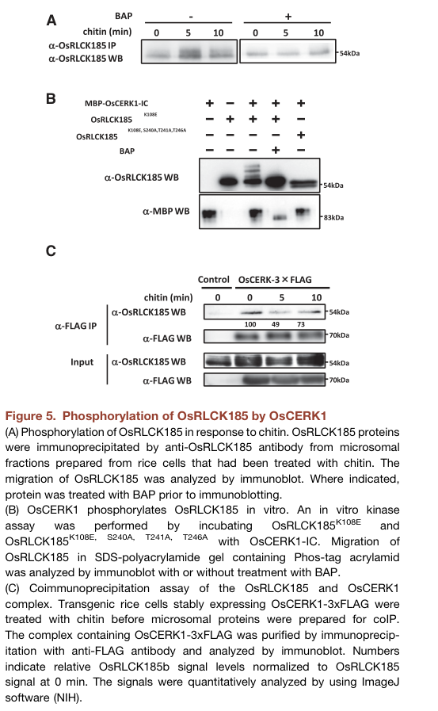
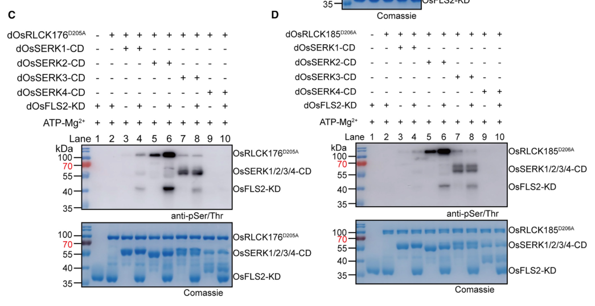

## Question

# Gene Research for Functional Annotation

## ⚠️ CRITICAL: Gene/Protein Identification Context

**BEFORE YOU BEGIN RESEARCH:** You MUST verify you are researching the CORRECT gene/protein. Gene symbols can be ambiguous, especially for less well-characterized genes from non-model organisms.

### Target Gene/Protein Identity (from UniProt):
- **UniProt Accession:** Q6I5Q6
- **Protein Description:** RecName: Full=Receptor-like cytoplasmic kinase 185 {ECO:0000303|PubMed:19825577}; Short=OsRLCK185 {ECO:0000303|PubMed:19825577}; EC=2.7.11.1 {ECO:0000305};
- **Gene Information:** Name=RLCK185 {ECO:0000303|PubMed:19825577}; OrderedLocusNames=Os05g0372100 {ECO:0000312|EMBL:BAS93696.1}, LOC_Os05g30870 {ECO:0000305}; ORFNames=OSJNBa0025P09.5 {ECO:0000312|EMBL:AAT58829.1};
- **Organism (full):** Oryza sativa subsp. japonica (Rice).
- **Protein Family:** Belongs to the protein kinase superfamily. Ser/Thr protein
- **Key Domains:** Kinase-like_dom_sf. (IPR011009); Prot_kinase_dom. (IPR000719); Protein_kinase_ATP_BS. (IPR017441); Ser-Thr/Tyr_kinase_cat_dom. (IPR001245); Ser/Thr_kinase_AS. (IPR008271)

### MANDATORY VERIFICATION STEPS:

1. **Check if the gene symbol "RLCK185" matches the protein description above**
2. **Verify the organism is correct:** Oryza sativa subsp. japonica (Rice).
3. **Check if protein family/domains align with what you find in literature**
4. **If you find literature for a DIFFERENT gene with the same or similar symbol, STOP**

### If Gene Symbol is Ambiguous or You Cannot Find Relevant Literature:

**DO NOT PROCEED WITH RESEARCH ON A DIFFERENT GENE.** Instead:
- State clearly: "The gene symbol 'RLCK185' is ambiguous or literature is limited for this specific protein"
- Explain what you found (e.g., "Found extensive literature on a different gene with the same symbol in a different organism")
- Describe the protein based ONLY on the UniProt information provided above
- Suggest that the protein function can be inferred from domain/family information

### Research Target:

Please provide a comprehensive research report on the gene **RLCK185** (gene ID: RLCK185, UniProt: Q6I5Q6) in ORYSJ.

The research report should be a detailed narrative explaining the function, biological processes, and localization of the gene product. Citations should be given for all claims.

You should prioritize authoritative reviews and primary scientific literature when conducting research. You can supplement
this with annotations you find in gene/protein databases, but these can be outdated or inaccurate.

We are specifically interested in the primary function of the gene - for enzymes, what reaction is catalyzed, and what is the substrate specificity? For transporters, what is the substrate? For structural proteins or adapters, what is the broader structural role? For signaling molecules, what is the role in the pathway.

We are interested in where in or outside the cell the gene product carries out its function.

We are also interested in the signaling or biochemical pathways in which the gene functions. We are less interested in broad pleiotropic effects, except where these elucidate the precise role.

Include evidence where possible. We are interested in both experimental evidence as well as inference from structure, evolution, or bioinformatic analysis. Precise studies should be prioritized over high-throughput, where available.

## Output

Question: You are an expert researcher providing comprehensive, well-cited information.

Provide detailed information focusing on:
1. Key concepts and definitions with current understanding
2. Recent developments and latest research (prioritize 2023-2024 sources)
3. Current applications and real-world implementations
4. Expert opinions and analysis from authoritative sources
5. Relevant statistics and data from recent studies

Format as a comprehensive research report with proper citations. Include URLs and publication dates where available.
Always prioritize recent, authoritative sources and provide specific citations for all major claims.

# Gene Research for Functional Annotation

## ⚠️ CRITICAL: Gene/Protein Identification Context

**BEFORE YOU BEGIN RESEARCH:** You MUST verify you are researching the CORRECT gene/protein. Gene symbols can be ambiguous, especially for less well-characterized genes from non-model organisms.

### Target Gene/Protein Identity (from UniProt):
- **UniProt Accession:** Q6I5Q6
- **Protein Description:** RecName: Full=Receptor-like cytoplasmic kinase 185 {ECO:0000303|PubMed:19825577}; Short=OsRLCK185 {ECO:0000303|PubMed:19825577}; EC=2.7.11.1 {ECO:0000305};
- **Gene Information:** Name=RLCK185 {ECO:0000303|PubMed:19825577}; OrderedLocusNames=Os05g0372100 {ECO:0000312|EMBL:BAS93696.1}, LOC_Os05g30870 {ECO:0000305}; ORFNames=OSJNBa0025P09.5 {ECO:0000312|EMBL:AAT58829.1};
- **Organism (full):** Oryza sativa subsp. japonica (Rice).
- **Protein Family:** Belongs to the protein kinase superfamily. Ser/Thr protein
- **Key Domains:** Kinase-like_dom_sf. (IPR011009); Prot_kinase_dom. (IPR000719); Protein_kinase_ATP_BS. (IPR017441); Ser-Thr/Tyr_kinase_cat_dom. (IPR001245); Ser/Thr_kinase_AS. (IPR008271)

### MANDATORY VERIFICATION STEPS:

1. **Check if the gene symbol "RLCK185" matches the protein description above**
2. **Verify the organism is correct:** Oryza sativa subsp. japonica (Rice).
3. **Check if protein family/domains align with what you find in literature**
4. **If you find literature for a DIFFERENT gene with the same or similar symbol, STOP**

### If Gene Symbol is Ambiguous or You Cannot Find Relevant Literature:

**DO NOT PROCEED WITH RESEARCH ON A DIFFERENT GENE.** Instead:
- State clearly: "The gene symbol 'RLCK185' is ambiguous or literature is limited for this specific protein"
- Explain what you found (e.g., "Found extensive literature on a different gene with the same symbol in a different organism")
- Describe the protein based ONLY on the UniProt information provided above
- Suggest that the protein function can be inferred from domain/family information

### Research Target:

Please provide a comprehensive research report on the gene **RLCK185** (gene ID: RLCK185, UniProt: Q6I5Q6) in ORYSJ.

The research report should be a detailed narrative explaining the function, biological processes, and localization of the gene product. Citations should be given for all claims.

You should prioritize authoritative reviews and primary scientific literature when conducting research. You can supplement
this with annotations you find in gene/protein databases, but these can be outdated or inaccurate.

We are specifically interested in the primary function of the gene - for enzymes, what reaction is catalyzed, and what is the substrate specificity? For transporters, what is the substrate? For structural proteins or adapters, what is the broader structural role? For signaling molecules, what is the role in the pathway.

We are interested in where in or outside the cell the gene product carries out its function.

We are also interested in the signaling or biochemical pathways in which the gene functions. We are less interested in broad pleiotropic effects, except where these elucidate the precise role.

Include evidence where possible. We are interested in both experimental evidence as well as inference from structure, evolution, or bioinformatic analysis. Precise studies should be prioritized over high-throughput, where available.

# Functional annotation report: rice RLCK185 (UniProt Q6I5Q6)

## Identity and primary function

The target is **OsRLCK185**, encoded by **Os05g0372100** in *Oryza sativa* subsp. *japonica*; LOC_Os05g30870 and UniProt Q6I5Q6 are the identifiers supplied for this target. The original experimental study explicitly identifies Os05g0372100 as OsRLCK185 and classifies it as an RLCK-VII-C protein. Its relative **OsRLCK55** (Os01g0936100; 84% amino-acid identity) and **OsRLCK176** are different kinases, not alternative names for the target. This identification is consistent with the supplied protein-kinase and serine/threonine-kinase domain annotations. (yamaguchi2013areceptorlikecytoplasmic pages 3-4, wang2017oscerk1mediatedchitinperception pages 5-9)

**Best-supported molecular function:** OsRLCK185 is an intracellular-facing, plasma-membrane-associated protein kinase that relays immune-receptor signals by transferring phosphate from ATP to protein substrates. Its experimentally demonstrated substrate specificity includes **serine/threonine residues in the regulatory region of OsMAPKKKε**, also called **OsMAPKKK24**. It is therefore a signaling kinase, *not* a chitin-binding receptor or a transporter. The available biochemical experiments establish phosphorylation of particular protein partners rather than a comprehensive substrate-recognition motif or kinetic specificity constants. (wang2017oscerk1mediatedchitinperception pages 5-9, kawasaki2017chitinreceptormediatedactivation pages 7-12)

## Cellular location and the chitin pathway

A GFP-tagged, catalytically impaired OsRLCK185 variant localized to the **plasma membrane** in rice protoplasts. Endogenous OsRLCK185 was detected in microsomal fractions, and interactions with the membrane chitin-signaling receptor **OsCERK1** were supported by yeast two-hybrid assays, coimmunoprecipitation and plasma-membrane bimolecular fluorescence complementation. Wild-type OsRLCK185–GFP was difficult to detect in the transient protoplast assay, so the localization inference depends partly on the kinase-impaired construct and the independent membrane/interaction evidence. Chitin reduces OsRLCK185–OsCERK1 coimmunoprecipitation, but OsRLCK185 remains detectable in microsomal fractions: dissociation from the receptor should **not** be interpreted as demonstrated movement into the cytosol. (yamaguchi2013areceptorlikecytoplasmic pages 3-4, yamaguchi2013areceptorlikecytoplasmic pages 4-5, yamaguchi2013areceptorlikecytoplasmic pages 8-9)

The principal experimentally supported pathway is **fungal chitin → chitin-binding OsCEBiP/OsCERK1 receptor complex → OsRLCK185 → OsMAPKKKε/OsMAPKKK24 → OsMKK4 → OsMPK3/OsMPK6 → immune-gene expression**. OsCEBiP binds extracellular chitin; OsRLCK185 operates on the cytoplasmic side of the membrane. Chitin-induced phosphorylation of OsRLCK185 peaked at approximately **5 minutes**, preceding maximal MAPK phosphorylation at approximately **10 minutes** in the reported rice-cell experiment. OsCERK1 directly phosphorylated kinase-inactive OsRLCK185 in vitro, and a chitin-induced phosphorylation-dependent mobility shift was observed in cells. Combined S240A/T241A/T246A substitutions eliminated detectable OsCERK1-dependent phosphorylation in that assay; this establishes the importance of those activation-loop residues **collectively**, not independently mapped phosphorylation of every residue. (kawasaki2017chitinreceptormediatedactivation pages 1-7, yamaguchi2013areceptorlikecytoplasmic pages 6-8, yamaguchi2013areceptorlikecytoplasmic pages 5-6, yamaguchi2013areceptorlikecytoplasmic media 6f058d4c)

Crucially, OsRLCK185 itself phosphorylates kinase-inactive **OsMAPKKKε** in vitro, including its C-terminal interacting/regulatory region, amino acids **769–1357**; immunochemical tests identified **Ser/Thr**, rather than Tyr, phosphorylation. OsCERK1 did not directly phosphorylate that MAPKKK in the tested reaction, but its kinase activity increased OsRLCK185-mediated phosphorylation. OsMAPKKKε then phosphorylates **OsMKK4**. The precise OsMAPKKKε phospho-acceptor residues needed for signaling were not resolved in that study. An expert mini-review additionally identifies **OsMAPKKK18** as an OsRLCK185-phosphorylated input to OsMKK4; this additional substrate is reported by a secondary source in the retrieved evidence and should be weighted accordingly. (wang2017oscerk1mediatedchitinperception pages 5-9, wang2017oscerk1mediatedchitinperception pages 9-12, wang2017oscerk1mediatedchitinperception pages 12-15, kawasaki2017chitinreceptormediatedactivation pages 7-12)

The following evidence summary separates direct experiments from less completely established extensions of the pathway. (yamaguchi2013areceptorlikecytoplasmic pages 6-8, wang2017oscerk1mediatedchitinperception pages 5-9, zhao2024structuralandbiochemical pages 5-7, kawasaki2017chitinreceptormediatedactivation pages 7-12)

| Molecular finding and pathway | Direct evidence and qualification | Source date and DOI URL |
|---|---|---|
| **OsCERK1 → OsRLCK185 activation** | Chitin caused rapid phosphorylation of plasma-membrane-associated OsRLCK185. Recombinant OsCERK1 intracellular domain phosphorylated kinase-dead OsRLCK185^K108E^ in vitro. Simultaneous S240A/T241A/T246A substitution abolished detectable phosphorylation, showing that these activation-loop residues are collectively necessary; the experiment did **not** map each residue as an individually phosphorylated site. **Evidence: direct, strong.** (yamaguchi2013areceptorlikecytoplasmic pages 5-6, yamaguchi2013areceptorlikecytoplasmic pages 6-8) | Yamaguchi et al., **13 March 2013**, *Cell Host & Microbe*. [https://doi.org/10.1016/j.chom.2013.02.007](https://doi.org/10.1016/j.chom.2013.02.007) |
| **OsRLCK185 → OsMAPKKKε/OsMAPKKK24 → OsMKK4 → OsMPK3/6** | Wild-type OsRLCK185, but not kinase-inactive OsRLCK185^K108E^, phosphorylated kinase-dead OsMAPKKKε^K49M^ on Ser/Thr—not Tyr—in vitro. Interaction and phosphorylation involve the OsMAPKKKε C-terminal regulatory region (aa 769–1357). Exact acceptor phosphosites remain unresolved. **Evidence: direct biochemical interaction and phosphorylation; downstream physiological evidence is supportive.** (wang2017oscerk1mediatedchitinperception pages 5-9, wang2017oscerk1mediatedchitinperception pages 12-15) | Wang et al., **April 2017**, *Molecular Plant*. [https://doi.org/10.1016/j.molp.2017.01.006](https://doi.org/10.1016/j.molp.2017.01.006) |
| **OsRLCK185 → OsMAPKKK18**, an additional chitin-responsive MAPK entry point | A 2017 mini-review reports OsMAPKKK18 as directly phosphorylated by OsRLCK185 and as an upstream kinase for OsMKK4. This is **secondary-source evidence in the retrieved record**; residue-level phosphorylation and quantitative primary data were not independently verified here. The same review distinguishes OsMAPKKK18 from OsMAPKKKε/OsMAPKKK24. **Evidence: moderate pending primary-paper confirmation.** (kawasaki2017chitinreceptormediatedactivation pages 7-12) | Kawasaki et al., **accepted 14 August 2017**, *Plant Signaling & Behavior*. [https://doi.org/10.1080/15592324.2017.1361076](https://doi.org/10.1080/15592324.2017.1361076) |
| **flg22–OsFLS2/OsSERK2 → OsRLCK185** | In vitro, OsSERK2 phosphorylated catalytically dead OsRLCK185^D206A^; phosphorylation increased strongly in the functional OsFLS2–OsSERK2 complex and required both receptor kinase activities. In *osrlck185* plants, flg22 induction of **OsPR10a, OsPR10b, and OsWRKY45** was attenuated. D206A disables OsRLCK185 catalysis to isolate incoming phosphorylation; it is **not** an identified phospho-acceptor site. OsRLCK176 was tested separately and must not be conflated with OsRLCK185. **Evidence: direct biochemical plus genetic support; OsRLCK185 phosphosites unresolved.** (zhao2024structuralandbiochemical pages 5-7, zhao2024structuralandbiochemical pages 7-9, zhao2024structuralandbiochemical pages 9-10) | Zhao et al., **11 March 2024**, *Plant Communications*. [https://doi.org/10.1016/j.xplc.2023.100785](https://doi.org/10.1016/j.xplc.2023.100785) |
| **Xoo1488 effector → inhibition of OsCERK1–OsRLCK185 signaling** | Xoo1488 interacted with OsRLCK185, reduced OsCERK1-mediated phosphorylation of OsRLCK185 in vitro and eliminated the chitin-induced OsRLCK185 mobility shift in cells. It did not dephosphorylate pre-phosphorylated OsRLCK185 or inhibit OsRLCK185 autophosphorylation; OsRLCK185 itself phosphorylated Xoo1488. Xoo1488 expression suppressed OsMPK3/6—but not OsMPK4—activation and weakened pattern-triggered immunity. **Evidence: direct perturbational and biochemical support.** (yamaguchi2013areceptorlikecytoplasmic pages 6-8, yamaguchi2013areceptorlikecytoplasmic pages 8-9) | Yamaguchi et al., **13 March 2013**, *Cell Host & Microbe*. [https://doi.org/10.1016/j.chom.2013.02.007](https://doi.org/10.1016/j.chom.2013.02.007) |

*Table: Evidence-graded findings for verified rice OsRLCK185 (Q6I5Q6; Os05g0372100), with direct substrates and phosphosite limitations kept explicit. OsRbohB, OsRacGEF1, OsRLCK176, and OsRLCK55 are not misassigned as OsRLCK185 substrates or aliases.*

## Functional tests, pathogen interaction and quantitative evidence

In rice suspension cells, reducing OsRLCK185 expression suppressed chitin-induced **PAL1/PBZ1** defense-marker expression and the **reactive-oxygen-species (ROS) burst**; peptidoglycan-induced defense-marker expression was also reduced. Importantly, one RNAi cell line reduced OsRLCK185 without reducing OsRLCK55 transcript, strengthening attribution of those cellular phenotypes to RLCK185. Conversely, OsRLCK185 overexpression enhanced chitin-responsive PAL1/PBZ1 expression, whereas OsRLCK55 overexpression did not. Reported cellular comparisons used **three biological replicates, each with two technical replicates**, and marked RNAi-versus-control differences at **p < 0.01**; the accessible results do not justify assigning a single precise fold-change to the overall effect. RNAi plants targeting **both OsRLCK185 and OsRLCK55** also supported significantly greater growth of an *Xanthomonas oryzae* pv. *oryzae* **hrpX** mutant at **5 days after inoculation** (**p < 0.01**), but that whole-plant experiment does not isolate the contribution of RLCK185 from its close relative. (yamaguchi2013areceptorlikecytoplasmic pages 3-4, yamaguchi2013areceptorlikecytoplasmic pages 4-5, yamaguchi2013areceptorlikecytoplasmic pages 5-6)

Mechanistically, RLCK185 depletion strongly reduced chitin-induced activation of **OsMPK3 and OsMPK6**, but not **OsMPK4**. OsRLCK185 overexpression increased phosphorylation of all three in one assay; the investigators cautioned that its OsMPK4 effect might reflect overexpression or feedback rather than a normal RLCK185→OsMPK4 branch. In a separate study, reducing the **downstream OsMAPKKKε** impaired chitin-triggered MAPK activation and resistance to *Magnaporthe oryzae* (rice blast). Those blast-resistance data concern the MAPKKK, **not a direct field trial or an isolated OsRLCK185 knockout resistance effect**; interpretation is further limited because stable, effectively silenced OsMAPKKKε progeny could not be obtained and resistance was tested in transgenic T0 plantlets. (yamaguchi2013areceptorlikecytoplasmic pages 6-8, yamaguchi2013areceptorlikecytoplasmic pages 8-9, wang2017oscerk1mediatedchitinperception pages 12-15)

The bacterial type-III effector **Xoo1488** provides additional pathway-specific perturbation evidence. It interacts with OsRLCK185 and inhibits OsCERK1-mediated phosphorylation of RLCK185 and subsequent OsMPK3/6 activation. Xoo1488 did **not** dephosphorylate already phosphorylated RLCK185 or suppress its measured autophosphorylation; intriguingly, RLCK185 phosphorylated Xoo1488 in vitro. These results establish biochemical antagonism at the receptor–RLCK signaling step without proving that Xoo1488 acts exclusively through this target in infected plants. (yamaguchi2013areceptorlikecytoplasmic pages 6-8, yamaguchi2013areceptorlikecytoplasmic pages 8-9)

## Recent research and applicability

**2024 primary research broadened the established chitin-centered picture to bacterial flagellin signaling.** In the OsFLS2–OsSERK2 receptor system, OsSERK2 directly phosphorylated kinase-dead **OsRLCK185-D206A** in vitro; including catalytically functional OsFLS2 increased this phosphorylation. After **flg22** treatment, *osrlck185* mutants showed attenuated induction of the immune markers **OsPR10a, OsPR10b and OsWRKY45**. The biochemical assays were repeated **three times** with similar results. OsRLCK176 was assayed separately. Here **D206A is a kinase-inactivating experimental substitution**, *not* a reported phosphorylation-acceptor site; the study did not map OsRLCK185 phosphosites in this receptor complex. Thus, RLCK185 can participate in more than one pattern-triggered immune-receptor pathway, although chitin-to-MAPK transmission remains its most clearly resolved direct substrate pathway. [Zhao et al., *Plant Communications*, **11 March 2024**](https://doi.org/10.1016/j.xplc.2023.100785). (zhao2024structuralandbiochemical pages 5-7, zhao2024structuralandbiochemical pages 7-9, zhao2024structuralandbiochemical media 4a618150)

These findings make OsRLCK185 a **research target for improving understanding of rice disease resistance** and for assessing receptor-to-MAPK signaling in crop-immunity experiments. They do **not** establish a deployed RLCK185-engineered cultivar, a field-tested yield benefit, or a quantitative broad-spectrum resistance effect attributable specifically to this gene. The ROS phenotype also does not establish that RLCK185 directly phosphorylates **OsRbohB**: an expert review explicitly presents such regulation as a possibility and describes an **OsCERK1–OsRacGEF1–OsRac1** route separately. Likewise, the 2024 flagellin result must not be generalized from RLCK176 to RLCK185 beyond the assays that tested both. (kawasaki2017chitinreceptormediatedactivation pages 7-12, zhao2024structuralandbiochemical pages 5-7, wang2017oscerk1mediatedchitinperception pages 12-15)

### Principal sources and evidence limits

- Yamaguchi *et al.*, **13 March 2013**, *Cell Host & Microbe* 13:347–357, [doi:10.1016/j.chom.2013.02.007](https://doi.org/10.1016/j.chom.2013.02.007): target identity, membrane localization, OsCERK1 phosphorylation, immune phenotypes and Xoo1488 interference. (yamaguchi2013areceptorlikecytoplasmic pages 3-4, yamaguchi2013areceptorlikecytoplasmic pages 6-8)
- Wang *et al.*, **April 2017**, *Molecular Plant* 10:619–633, [doi:10.1016/j.molp.2017.01.006](https://doi.org/10.1016/j.molp.2017.01.006): direct OsMAPKKKε substrate evidence and downstream cascade; the blast tests chiefly perturb OsMAPKKKε. (wang2017oscerk1mediatedchitinperception pages 5-9, wang2017oscerk1mediatedchitinperception pages 12-15)
- Kawasaki *et al.*, **2017**, *Plant Signaling & Behavior* 12:e1361076, [doi:10.1080/15592324.2017.1361076](https://doi.org/10.1080/15592324.2017.1361076): expert synthesis identifying OsMAPKKK18 and OsMAPKKK24 and distinguishing the ROS-associated branch; **review**, not an independent primary experiment. (kawasaki2017chitinreceptormediatedactivation pages 7-12)
- Zhao *et al.*, **11 March 2024**, *Plant Communications* 5:100785, [doi:10.1016/j.xplc.2023.100785](https://doi.org/10.1016/j.xplc.2023.100785): primary biochemical and mutant evidence for OsSERK2/OsFLS2-associated flagellin signaling involving RLCK185. (zhao2024structuralandbiochemical pages 5-7, zhao2024structuralandbiochemical pages 9-10)

**Annotation conclusion:** Assign OsRLCK185 principally as a **plasma-membrane-associated, cytoplasmic Ser/Thr signaling kinase in rice pattern-triggered immunity**, directly linking OsCERK1-mediated chitin recognition to MAPKKK-dependent OsMPK3/6 activation. Its experimentally supported repertoire also includes participation downstream of the OsFLS2–OsSERK2 flagellin receptor complex. Specific regulation of ROS-producing enzymes, complete phosphosite maps and agronomic performance remain insufficiently established by the evidence assessed here. (wang2017oscerk1mediatedchitinperception pages 5-9, zhao2024structuralandbiochemical pages 5-7, yamaguchi2013areceptorlikecytoplasmic pages 8-9, kawasaki2017chitinreceptormediatedactivation pages 7-12)

References

1. (yamaguchi2013areceptorlikecytoplasmic pages 3-4): Koji Yamaguchi, Kenta Yamada, Kazuya Ishikawa, Satomi Yoshimura, Nagao Hayashi, Kouhei Uchihashi, Nobuaki Ishihama, Mitsuko Kishi-Kaboshi, Akira Takahashi, Seiji Tsuge, Hirokazu Ochiai, Yasuomi Tada, Ko Shimamoto, Hirofumi Yoshioka, and Tsutomu Kawasaki. A receptor-like cytoplasmic kinase targeted by a plant pathogen effector is directly phosphorylated by the chitin receptor and mediates rice immunity. Cell host & microbe, 13 3:347-57, Mar 2013. URL: https://doi.org/10.1016/j.chom.2013.02.007, doi:10.1016/j.chom.2013.02.007. This article has 329 citations and is from a highest quality peer-reviewed journal.

2. (wang2017oscerk1mediatedchitinperception pages 5-9): Chao Wang, Gang Wang, Chi Zhang, Pinkuan Zhu, Huiling Dai, Nan Yu, Zuhua He, Ling Xu, and Ertao Wang. Oscerk1-mediated chitin perception and immune signaling requires receptor-like cytoplasmic kinase 185 to activate an mapk cascade in rice. Molecular plant, 10 4:619-633, Apr 2017. URL: https://doi.org/10.1016/j.molp.2017.01.006, doi:10.1016/j.molp.2017.01.006. This article has 235 citations and is from a highest quality peer-reviewed journal.

3. (kawasaki2017chitinreceptormediatedactivation pages 7-12): Tsutomu Kawasaki, Kenta Yamada, Satomi Yoshimura, and Koji Yamaguchi. Chitin receptor-mediated activation of map kinases and ros production in rice and arabidopsis. Sep 2017. URL: https://doi.org/10.1080/15592324.2017.1361076, doi:10.1080/15592324.2017.1361076. This article has 86 citations and is from a peer-reviewed journal.

4. (yamaguchi2013areceptorlikecytoplasmic pages 4-5): Koji Yamaguchi, Kenta Yamada, Kazuya Ishikawa, Satomi Yoshimura, Nagao Hayashi, Kouhei Uchihashi, Nobuaki Ishihama, Mitsuko Kishi-Kaboshi, Akira Takahashi, Seiji Tsuge, Hirokazu Ochiai, Yasuomi Tada, Ko Shimamoto, Hirofumi Yoshioka, and Tsutomu Kawasaki. A receptor-like cytoplasmic kinase targeted by a plant pathogen effector is directly phosphorylated by the chitin receptor and mediates rice immunity. Cell host & microbe, 13 3:347-57, Mar 2013. URL: https://doi.org/10.1016/j.chom.2013.02.007, doi:10.1016/j.chom.2013.02.007. This article has 329 citations and is from a highest quality peer-reviewed journal.

5. (yamaguchi2013areceptorlikecytoplasmic pages 8-9): Koji Yamaguchi, Kenta Yamada, Kazuya Ishikawa, Satomi Yoshimura, Nagao Hayashi, Kouhei Uchihashi, Nobuaki Ishihama, Mitsuko Kishi-Kaboshi, Akira Takahashi, Seiji Tsuge, Hirokazu Ochiai, Yasuomi Tada, Ko Shimamoto, Hirofumi Yoshioka, and Tsutomu Kawasaki. A receptor-like cytoplasmic kinase targeted by a plant pathogen effector is directly phosphorylated by the chitin receptor and mediates rice immunity. Cell host & microbe, 13 3:347-57, Mar 2013. URL: https://doi.org/10.1016/j.chom.2013.02.007, doi:10.1016/j.chom.2013.02.007. This article has 329 citations and is from a highest quality peer-reviewed journal.

6. (kawasaki2017chitinreceptormediatedactivation pages 1-7): Tsutomu Kawasaki, Kenta Yamada, Satomi Yoshimura, and Koji Yamaguchi. Chitin receptor-mediated activation of map kinases and ros production in rice and arabidopsis. Sep 2017. URL: https://doi.org/10.1080/15592324.2017.1361076, doi:10.1080/15592324.2017.1361076. This article has 86 citations and is from a peer-reviewed journal.

7. (yamaguchi2013areceptorlikecytoplasmic pages 6-8): Koji Yamaguchi, Kenta Yamada, Kazuya Ishikawa, Satomi Yoshimura, Nagao Hayashi, Kouhei Uchihashi, Nobuaki Ishihama, Mitsuko Kishi-Kaboshi, Akira Takahashi, Seiji Tsuge, Hirokazu Ochiai, Yasuomi Tada, Ko Shimamoto, Hirofumi Yoshioka, and Tsutomu Kawasaki. A receptor-like cytoplasmic kinase targeted by a plant pathogen effector is directly phosphorylated by the chitin receptor and mediates rice immunity. Cell host & microbe, 13 3:347-57, Mar 2013. URL: https://doi.org/10.1016/j.chom.2013.02.007, doi:10.1016/j.chom.2013.02.007. This article has 329 citations and is from a highest quality peer-reviewed journal.

8. (yamaguchi2013areceptorlikecytoplasmic pages 5-6): Koji Yamaguchi, Kenta Yamada, Kazuya Ishikawa, Satomi Yoshimura, Nagao Hayashi, Kouhei Uchihashi, Nobuaki Ishihama, Mitsuko Kishi-Kaboshi, Akira Takahashi, Seiji Tsuge, Hirokazu Ochiai, Yasuomi Tada, Ko Shimamoto, Hirofumi Yoshioka, and Tsutomu Kawasaki. A receptor-like cytoplasmic kinase targeted by a plant pathogen effector is directly phosphorylated by the chitin receptor and mediates rice immunity. Cell host & microbe, 13 3:347-57, Mar 2013. URL: https://doi.org/10.1016/j.chom.2013.02.007, doi:10.1016/j.chom.2013.02.007. This article has 329 citations and is from a highest quality peer-reviewed journal.

9. (yamaguchi2013areceptorlikecytoplasmic media 6f058d4c): Koji Yamaguchi, Kenta Yamada, Kazuya Ishikawa, Satomi Yoshimura, Nagao Hayashi, Kouhei Uchihashi, Nobuaki Ishihama, Mitsuko Kishi-Kaboshi, Akira Takahashi, Seiji Tsuge, Hirokazu Ochiai, Yasuomi Tada, Ko Shimamoto, Hirofumi Yoshioka, and Tsutomu Kawasaki. A receptor-like cytoplasmic kinase targeted by a plant pathogen effector is directly phosphorylated by the chitin receptor and mediates rice immunity. Cell host & microbe, 13 3:347-57, Mar 2013. URL: https://doi.org/10.1016/j.chom.2013.02.007, doi:10.1016/j.chom.2013.02.007. This article has 329 citations and is from a highest quality peer-reviewed journal.

10. (wang2017oscerk1mediatedchitinperception pages 9-12): Chao Wang, Gang Wang, Chi Zhang, Pinkuan Zhu, Huiling Dai, Nan Yu, Zuhua He, Ling Xu, and Ertao Wang. Oscerk1-mediated chitin perception and immune signaling requires receptor-like cytoplasmic kinase 185 to activate an mapk cascade in rice. Molecular plant, 10 4:619-633, Apr 2017. URL: https://doi.org/10.1016/j.molp.2017.01.006, doi:10.1016/j.molp.2017.01.006. This article has 235 citations and is from a highest quality peer-reviewed journal.

11. (wang2017oscerk1mediatedchitinperception pages 12-15): Chao Wang, Gang Wang, Chi Zhang, Pinkuan Zhu, Huiling Dai, Nan Yu, Zuhua He, Ling Xu, and Ertao Wang. Oscerk1-mediated chitin perception and immune signaling requires receptor-like cytoplasmic kinase 185 to activate an mapk cascade in rice. Molecular plant, 10 4:619-633, Apr 2017. URL: https://doi.org/10.1016/j.molp.2017.01.006, doi:10.1016/j.molp.2017.01.006. This article has 235 citations and is from a highest quality peer-reviewed journal.

12. (zhao2024structuralandbiochemical pages 5-7): Qiaoqiao Zhao, Jinlin Bao, Huailong Li, Wei Hu, Yanqiong Kong, Yifeng Zhong, Qiang Fu, Guolyu Xu, Fenmei Liu, Xi Jiao, Jian Jin, and Zhenhua Ming. Structural and biochemical basis of fls2-mediated signal activation and transduction in rice. Mar 2024. URL: https://doi.org/10.1016/j.xplc.2023.100785, doi:10.1016/j.xplc.2023.100785. This article has 34 citations and is from a peer-reviewed journal.

13. (zhao2024structuralandbiochemical pages 7-9): Qiaoqiao Zhao, Jinlin Bao, Huailong Li, Wei Hu, Yanqiong Kong, Yifeng Zhong, Qiang Fu, Guolyu Xu, Fenmei Liu, Xi Jiao, Jian Jin, and Zhenhua Ming. Structural and biochemical basis of fls2-mediated signal activation and transduction in rice. Mar 2024. URL: https://doi.org/10.1016/j.xplc.2023.100785, doi:10.1016/j.xplc.2023.100785. This article has 34 citations and is from a peer-reviewed journal.

14. (zhao2024structuralandbiochemical pages 9-10): Qiaoqiao Zhao, Jinlin Bao, Huailong Li, Wei Hu, Yanqiong Kong, Yifeng Zhong, Qiang Fu, Guolyu Xu, Fenmei Liu, Xi Jiao, Jian Jin, and Zhenhua Ming. Structural and biochemical basis of fls2-mediated signal activation and transduction in rice. Mar 2024. URL: https://doi.org/10.1016/j.xplc.2023.100785, doi:10.1016/j.xplc.2023.100785. This article has 34 citations and is from a peer-reviewed journal.

15. (zhao2024structuralandbiochemical media 4a618150): Qiaoqiao Zhao, Jinlin Bao, Huailong Li, Wei Hu, Yanqiong Kong, Yifeng Zhong, Qiang Fu, Guolyu Xu, Fenmei Liu, Xi Jiao, Jian Jin, and Zhenhua Ming. Structural and biochemical basis of fls2-mediated signal activation and transduction in rice. Mar 2024. URL: https://doi.org/10.1016/j.xplc.2023.100785, doi:10.1016/j.xplc.2023.100785. This article has 34 citations and is from a peer-reviewed journal.

## Artifacts

- [Edison artifact artifact-00](RLCK185-deep-research-falcon_artifacts/artifact-00.md)

## Citations

1. kawasaki2017chitinreceptormediatedactivation pages 7-12
2. yamaguchi2013areceptorlikecytoplasmic pages 3-4
3. yamaguchi2013areceptorlikecytoplasmic pages 4-5
4. yamaguchi2013areceptorlikecytoplasmic pages 8-9
5. kawasaki2017chitinreceptormediatedactivation pages 1-7
6. yamaguchi2013areceptorlikecytoplasmic pages 6-8
7. yamaguchi2013areceptorlikecytoplasmic pages 5-6
8. zhao2024structuralandbiochemical pages 5-7
9. zhao2024structuralandbiochemical pages 7-9
10. zhao2024structuralandbiochemical pages 9-10
11. https://doi.org/10.1016/j.chom.2013.02.007
12. https://doi.org/10.1016/j.molp.2017.01.006
13. https://doi.org/10.1080/15592324.2017.1361076
14. https://doi.org/10.1016/j.xplc.2023.100785
15. Zhao et al., *Plant Communications*, **11 March 2024**
16. doi:10.1016/j.chom.2013.02.007
17. doi:10.1016/j.molp.2017.01.006
18. doi:10.1080/15592324.2017.1361076
19. doi:10.1016/j.xplc.2023.100785
20. https://doi.org/10.1016/j.chom.2013.02.007](https://doi.org/10.1016/j.chom.2013.02.007
21. https://doi.org/10.1016/j.molp.2017.01.006](https://doi.org/10.1016/j.molp.2017.01.006
22. https://doi.org/10.1080/15592324.2017.1361076](https://doi.org/10.1080/15592324.2017.1361076
23. https://doi.org/10.1016/j.xplc.2023.100785](https://doi.org/10.1016/j.xplc.2023.100785
24. https://doi.org/10.1016/j.chom.2013.02.007,
25. https://doi.org/10.1016/j.molp.2017.01.006,
26. https://doi.org/10.1080/15592324.2017.1361076,
27. https://doi.org/10.1016/j.xplc.2023.100785,