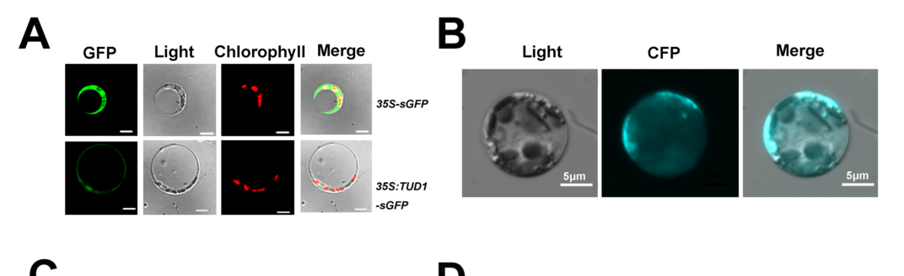

## Question

# Gene Research for Functional Annotation

## ⚠️ CRITICAL: Gene/Protein Identification Context

**BEFORE YOU BEGIN RESEARCH:** You MUST verify you are researching the CORRECT gene/protein. Gene symbols can be ambiguous, especially for less well-characterized genes from non-model organisms.

### Target Gene/Protein Identity (from UniProt):
- **UniProt Accession:** Q10PI9
- **Protein Description:** RecName: Full=U-box domain-containing protein 75 {ECO:0000305}; Short=OsPUB75 {ECO:0000303|PubMed:19825583}; EC=2.3.2.27 {ECO:0000305}; AltName: Full=Protein ERECT LEAF 1 {ECO:0000303|PubMed:24299927}; AltName: Full=Protein TAIHU DWARF1 {ECO:0000303|PubMed:23526892}; AltName: Full=RING-type E3 ubiquitin transferase PUB75 {ECO:0000305};
- **Gene Information:** Name=TUD1 {ECO:0000303|PubMed:23526892}; Synonyms=ELF1 {ECO:0000303|PubMed:24299927}, PUB75 {ECO:0000303|PubMed:19825583}; OrderedLocusNames=Os03g0232600 {ECO:0000312|EMBL:BAF11383.2}, LOC_Os03g13010 {ECO:0000312|EMBL:ABF94807.1}; ORFNames=OJ1175C11.15 {ECO:0000312|EMBL:AAM19135.1};
- **Organism (full):** Oryza sativa subsp. japonica (Rice).
- **Protein Family:** Not specified in UniProt
- **Key Domains:** ARM-like. (IPR011989); ARM-type_fold. (IPR016024); ARM_PUB. (IPR058678); PUB22/23/24-like. (IPR045185); RING-Ubox_PUB. (IPR045210)

### MANDATORY VERIFICATION STEPS:

1. **Check if the gene symbol "TUD1" matches the protein description above**
2. **Verify the organism is correct:** Oryza sativa subsp. japonica (Rice).
3. **Check if protein family/domains align with what you find in literature**
4. **If you find literature for a DIFFERENT gene with the same or similar symbol, STOP**

### If Gene Symbol is Ambiguous or You Cannot Find Relevant Literature:

**DO NOT PROCEED WITH RESEARCH ON A DIFFERENT GENE.** Instead:
- State clearly: "The gene symbol 'TUD1' is ambiguous or literature is limited for this specific protein"
- Explain what you found (e.g., "Found extensive literature on a different gene with the same symbol in a different organism")
- Describe the protein based ONLY on the UniProt information provided above
- Suggest that the protein function can be inferred from domain/family information

### Research Target:

Please provide a comprehensive research report on the gene **TUD1** (gene ID: TUD1, UniProt: Q10PI9) in ORYSJ.

The research report should be a detailed narrative explaining the function, biological processes, and localization of the gene product. Citations should be given for all claims.

You should prioritize authoritative reviews and primary scientific literature when conducting research. You can supplement
this with annotations you find in gene/protein databases, but these can be outdated or inaccurate.

We are specifically interested in the primary function of the gene - for enzymes, what reaction is catalyzed, and what is the substrate specificity? For transporters, what is the substrate? For structural proteins or adapters, what is the broader structural role? For signaling molecules, what is the role in the pathway.

We are interested in where in or outside the cell the gene product carries out its function.

We are also interested in the signaling or biochemical pathways in which the gene functions. We are less interested in broad pleiotropic effects, except where these elucidate the precise role.

Include evidence where possible. We are interested in both experimental evidence as well as inference from structure, evolution, or bioinformatic analysis. Precise studies should be prioritized over high-throughput, where available.

## Output

Question: You are an expert researcher providing comprehensive, well-cited information.

Provide detailed information focusing on:
1. Key concepts and definitions with current understanding
2. Recent developments and latest research (prioritize 2023-2024 sources)
3. Current applications and real-world implementations
4. Expert opinions and analysis from authoritative sources
5. Relevant statistics and data from recent studies

Format as a comprehensive research report with proper citations. Include URLs and publication dates where available.
Always prioritize recent, authoritative sources and provide specific citations for all major claims.

# Gene Research for Functional Annotation

## ⚠️ CRITICAL: Gene/Protein Identification Context

**BEFORE YOU BEGIN RESEARCH:** You MUST verify you are researching the CORRECT gene/protein. Gene symbols can be ambiguous, especially for less well-characterized genes from non-model organisms.

### Target Gene/Protein Identity (from UniProt):
- **UniProt Accession:** Q10PI9
- **Protein Description:** RecName: Full=U-box domain-containing protein 75 {ECO:0000305}; Short=OsPUB75 {ECO:0000303|PubMed:19825583}; EC=2.3.2.27 {ECO:0000305}; AltName: Full=Protein ERECT LEAF 1 {ECO:0000303|PubMed:24299927}; AltName: Full=Protein TAIHU DWARF1 {ECO:0000303|PubMed:23526892}; AltName: Full=RING-type E3 ubiquitin transferase PUB75 {ECO:0000305};
- **Gene Information:** Name=TUD1 {ECO:0000303|PubMed:23526892}; Synonyms=ELF1 {ECO:0000303|PubMed:24299927}, PUB75 {ECO:0000303|PubMed:19825583}; OrderedLocusNames=Os03g0232600 {ECO:0000312|EMBL:BAF11383.2}, LOC_Os03g13010 {ECO:0000312|EMBL:ABF94807.1}; ORFNames=OJ1175C11.15 {ECO:0000312|EMBL:AAM19135.1};
- **Organism (full):** Oryza sativa subsp. japonica (Rice).
- **Protein Family:** Not specified in UniProt
- **Key Domains:** ARM-like. (IPR011989); ARM-type_fold. (IPR016024); ARM_PUB. (IPR058678); PUB22/23/24-like. (IPR045185); RING-Ubox_PUB. (IPR045210)

### MANDATORY VERIFICATION STEPS:

1. **Check if the gene symbol "TUD1" matches the protein description above**
2. **Verify the organism is correct:** Oryza sativa subsp. japonica (Rice).
3. **Check if protein family/domains align with what you find in literature**
4. **If you find literature for a DIFFERENT gene with the same or similar symbol, STOP**

### If Gene Symbol is Ambiguous or You Cannot Find Relevant Literature:

**DO NOT PROCEED WITH RESEARCH ON A DIFFERENT GENE.** Instead:
- State clearly: "The gene symbol 'TUD1' is ambiguous or literature is limited for this specific protein"
- Explain what you found (e.g., "Found extensive literature on a different gene with the same symbol in a different organism")
- Describe the protein based ONLY on the UniProt information provided above
- Suggest that the protein function can be inferred from domain/family information

### Research Target:

Please provide a comprehensive research report on the gene **TUD1** (gene ID: TUD1, UniProt: Q10PI9) in ORYSJ.

The research report should be a detailed narrative explaining the function, biological processes, and localization of the gene product. Citations should be given for all claims.

You should prioritize authoritative reviews and primary scientific literature when conducting research. You can supplement
this with annotations you find in gene/protein databases, but these can be outdated or inaccurate.

We are specifically interested in the primary function of the gene - for enzymes, what reaction is catalyzed, and what is the substrate specificity? For transporters, what is the substrate? For structural proteins or adapters, what is the broader structural role? For signaling molecules, what is the role in the pathway.

We are interested in where in or outside the cell the gene product carries out its function.

We are also interested in the signaling or biochemical pathways in which the gene functions. We are less interested in broad pleiotropic effects, except where these elucidate the precise role.

Include evidence where possible. We are interested in both experimental evidence as well as inference from structure, evolution, or bioinformatic analysis. Precise studies should be prioritized over high-throughput, where available.

## Research report: Functional annotation of rice **TUD1** (UniProt **Q10PI9**; ORYSJ)

### Executive summary
**TAIHU DWARF1 (TUD1)** encodes a **plant U-box (PUB) E3 ubiquitin ligase** (also reported as **ELF1/OsPUB75**) that positively regulates **brassinosteroid (BR)-mediated growth and architecture** in *Oryza sativa* ssp. *japonica*. Core experimental evidence shows: (i) **E3 ligase activity** in vitro; (ii) predominant **plasma membrane localization**; (iii) direct **physical interaction with the heterotrimeric G-protein Gα subunit D1/RGA1**; and (iv) genetic placement **downstream of D1** in a BR-related signaling branch that partially overlaps with the canonical **OsBRI1** pathway. Loss-of-function mutants are **BR-insensitive dwarfs** with **erect leaves** and **short grains**, with quantitative reductions in grain length of **~30–44%** in reported alleles. (hu2013theuboxe3 pages 7-10, hu2013theuboxe3 pages 5-7, hu2013theuboxe3 pages 2-3, hu2013theuboxe3 media b6f31d2f)

A key recent mechanistic model (closest available primary mechanistic update in the retrieved corpus) indicates TUD1 promotes **BR-induced degradation of the GSK3/SHAGGY-like kinase GSK2**, a central negative regulator of BR signaling, via ubiquitination-dependent turnover (liu2025theuboxubiquitin pages 8-9). A 2024 breeding/QTL study explicitly cites this **TUD1–GSK2** relationship in the context of grain-shape genetics (you2024mappingandcandidate pages 1-4).

### 0) Mandatory identity verification (gene/protein disambiguation)
The retrieved rice literature consistently identifies **TUD1** as the same gene/protein as **ERECT LEAF1 (ELF1)** and **OsPUB75**, corresponding to the rice locus **Os03g0232600** and encoding a **459-aa**, single-exon **U-box + ARM-repeat** protein with E3 ubiquitin ligase activity (hu2013theuboxe3 pages 5-7, sakamoto2013ane3ubiquitin pages 3-5, sakamoto2013ane3ubiquitin pages 1-2). This matches the provided UniProt entry **Q10PI9** (rice; U-box domain-containing protein 75 / OsPUB75; ARM-like domains), and no conflicting “TUD1” identity from another organism was encountered in the retrieved sources.

### 1) Key concepts and definitions (current understanding)

#### 1.1 U-box / PUB E3 ubiquitin ligases
U-box E3 ubiquitin ligases catalyze the transfer of ubiquitin from an E2 enzyme to specific substrates, thereby changing substrate stability, localization, or activity via the ubiquitin–proteasome system. In the TUD1/ELF1 case, the protein contains a **canonical U-box** E3 domain and multiple **ARM repeats**, consistent with substrate-binding/adaptor roles (sakamoto2013ane3ubiquitin pages 3-5, sakamoto2013ane3ubiquitin pages 1-2).

#### 1.2 Brassinosteroid (BR) signaling and growth control in rice
BRs are steroid phytohormones that strongly influence rice plant height, leaf angle, cell elongation, and grain traits. Canonical BR perception involves receptor kinases (e.g., **OsBRI1/D61**) with downstream signaling mediated in part by GSK3-like kinases such as **GSK2**. Rice also has a **G-protein–associated BR signaling branch** in which **D1/RGA1 (Gα)** and TUD1 participate (hu2013theuboxe3 pages 2-3).

### 2) Molecular function and biochemical activity of TUD1

#### 2.1 Enzymatic activity (reaction and substrate specificity)
**Primary biochemical function:** TUD1 is an **E3 ubiquitin ligase** (EC 2.3.2.27 in UniProt terms), catalyzing ubiquitin transfer to protein substrates. In vitro ubiquitination assays using recombinant proteins showed that **GST-TUD1** (or GST-ELF1) supports ubiquitination in an E1/E2-dependent manner; multiple tud1 mutant variants lacked detectable E3 activity (hu2013theuboxe3 pages 7-10, sakamoto2013ane3ubiquitin pages 5-7).

**Substrate specificity (current evidence):** 
- Foundational 2013 work demonstrated E3 activity and interaction with the upstream signaling component **D1**, but did not conclusively establish a specific in vivo ubiquitination substrate beyond this interaction set (hu2013theuboxe3 pages 7-10, hu2013theuboxe3 pages 2-3).
- A later mechanistic model identifies **GSK2** as a target: TUD1 interacts with GSK2 and promotes its ubiquitination/degradation in the context of BR signaling (liu2025theuboxubiquitin pages 8-9).

### 3) Domain architecture and structure-function inference
TUD1/ELF1 is a **459-aa** single-exon protein containing an N-terminal **U-box** followed by **six ARM repeats** (sakamoto2013ane3ubiquitin pages 3-5). Functional dissection indicates the U-box is required for E3 activity (U-box deletion abolishes ligase function), supporting the view that ARM repeats contribute to protein–protein interactions and substrate recruitment while the U-box performs catalysis (sakamoto2013ane3ubiquitin pages 5-7, sakamoto2013ane3ubiquitin pages 3-5).

### 4) Subcellular localization (where it acts)
In rice protoplasts, **TUD1::sGFP** localizes predominantly to the **plasma membrane**, supporting a role in signaling-associated protein turnover at/near the cell periphery (hu2013theuboxe3 pages 7-10). This localization is also visible in the retrieved figure crop from Hu et al. (2013) (hu2013theuboxe3 media b6f31d2f).

### 5) Pathways, interaction partners, and mechanism

#### 5.1 Interaction with heterotrimeric G-protein α subunit D1/RGA1
Multiple orthogonal assays support a direct physical association between TUD1 and **D1**:
- **BiFC** in rice protoplasts (fluorescence complementation signal for TUD1–D1) (hu2013theuboxe3 media b6f31d2f)
- Yeast two-hybrid and GST pull-down (hu2013theuboxe3 pages 7-10)
- Binding observed for both GDP- and GTPγS-bound D1 in pull-down format, consistent with a robust interaction not restricted to a single nucleotide-bound state (hu2013theuboxe3 pages 7-10, hu2013theuboxe3 pages 10-10).

Genetically, **tud1 is epistatic to d1**, placing TUD1 **downstream of D1** in a BR-related G-protein pathway that contributes to growth regulation (hu2013theuboxe3 pages 7-10, hu2013theuboxe3 pages 2-3).

#### 5.2 Relationship to canonical OsBRI1 signaling (pathway crosstalk)
Physiological and expression evidence supports partial overlap between D1–TUD1 signaling and the **OsBRI1/D61** pathway:
- **BR-insensitivity** of tud1 mutants in lamina joint bending assays over a 24-eBL dose range (0–1000 ng) (hu2013theuboxe3 pages 5-7, hu2013theuboxe3 media b6f31d2f).
- Altered expression of BR-related genes consistent with impaired BR signaling output (hu2013theuboxe3 pages 5-7, hu2013theuboxe3 pages 10-10).
- Genetic behavior described as additive with d61 but epistatic to d1, consistent with a partially parallel branch that connects to core BR outputs (hu2013theuboxe3 pages 2-3).

#### 5.3 Proposed substrate/target node: GSK2
A mechanistic update indicates TUD1 promotes **BR-induced GSK2 degradation**, consistent with an E3 ligase-mediated negative regulator removal to potentiate BR signaling (liu2025theuboxubiquitin pages 8-9). A 2024 QTL/breeding analysis explicitly describes TUD1 as directly interacting with and ubiquitinating **GSK2**, noting GSK2’s central negative role in BR signaling and linking this axis to grain-length phenotypes (you2024mappingandcandidate pages 1-4).

### 6) Mutant phenotypes and quantitative trait effects

#### 6.1 Whole-plant and organ-level phenotypes
Loss-of-function **tud1/elf1** mutants show hallmark BR-related architecture changes: **dwarf or semi-dwarf stature**, **erect leaves**, and **short grains** (sakamoto2013ane3ubiquitin pages 5-7, hu2013theuboxe3 pages 2-3).

Quantitative examples reported:
- Grain length reduction in tud1 alleles: **~30–44% decrease** (hu2013theuboxe3 pages 2-3).
- Plant height in elf1 mutants: approximately **one-third of wild type** (sakamoto2013ane3ubiquitin pages 5-7).

#### 6.2 Cellular basis
Phenotypes were attributed mainly to reduced **cell proliferation** and/or disrupted cell organization, and in some tissues impaired **cell elongation**, aligning with a BR signaling defect (hu2013theuboxe3 pages 7-10, hu2013theuboxe3 pages 10-10).

#### 6.3 BR response assay statistics
In the lamina joint bending assay, tud1 mutants exhibit reduced sensitivity across a **0–1000 ng 24-eBL** treatment series, compared with a strong dose-responsive bending in wild type (hu2013theuboxe3 pages 5-7, hu2013theuboxe3 media b6f31d2f).

### 7) Gene expression and regulation
ELF1/TUD1 expression is reported as:
- Highest in **panicles at flowering**, moderate in shoot apices and vegetative aerial tissues, and lowest in roots (sakamoto2013ane3ubiquitin pages 5-7).
- Slightly decreased by brassinolide treatment, yet **>2× higher** in BR-deficient (**brd1-2**) and BR-insensitive (**d61-3**) mutants, consistent with feedback regulation within BR networks (sakamoto2013ane3ubiquitin pages 5-7).

In elf1 mutants, feedback-associated molecular changes included:
- **OsBRI1 mRNA ~1.7×** wild type.
- Several BR biosynthesis genes **~1.5–1.8×** wild type.
- **Castasterone doubled**, consistent with compensatory BR biosynthesis when signaling output is compromised (sakamoto2013ane3ubiquitin pages 3-5).

### 8) Recent developments (prioritizing 2023–2024) and limitations

#### 8.1 What is available in 2023–2024 within retrieved evidence
- A 2024 molecular breeding/QTL paper explicitly frames **TUD1 as an E3 that ubiquitinates GSK2**, linking TUD1–GSK2 to grain shape and placing it alongside other ubiquitin-pathway grain regulators (you2024mappingandcandidate pages 1-4).

#### 8.2 Mechanistic update closest to this window (2025; included because it materially refines function)
- A primary mechanistic study reports TUD1 promotes **BR-induced GSK2 degradation** and positions TUD1 as an integration node between D1-mediated and OsBRI1-mediated BR signaling (liu2025theuboxubiquitin pages 8-9). Although outside 2023–2024, it provides direct mechanistic substrate-level evidence that is highly relevant for functional annotation.

#### 8.3 Additional 2024 drought-related lead (citation-only in retrieved text)
One retrieved excerpt cites (title only) a 2024 *Plant Physiology* article: “**OsPUB75-OsHDA716 mediates deactivation and degradation of OsbZIP46 to negatively regulate drought tolerance in rice**” (zhang2025ubiquitinligasegene pages 12-14). Because the full primary evidence was not retrieved here, this should be treated as a **high-priority follow-up** rather than a fully validated conclusion in this report.

### 9) Current applications and real-world implementations

#### 9.1 Breeding and ideotype engineering relevance
TUD1’s phenotypes (semi-dwarfism, erect leaves, grain effects) align with traits of interest for crop architecture and yield component optimization. A 2024 breeding/QTL study explicitly discusses TUD1 in the context of ubiquitin signaling and grain-shape genetics, using the TUD1–GSK2 BR module as functional context for candidate gene analysis (you2024mappingandcandidate pages 1-4).

#### 9.2 Functional validation pipelines (transgenics and gene editing)
Mechanistic follow-up work on TUD1 has used **transgenic overexpression** and **CRISPR-Cas9** editing as implementation tools for causal testing of signaling components (liu2025theuboxubiquitin pages 8-9). While this is not itself a deployed “field implementation,” it is a standard translational step toward engineering or allele mining.

### 10) Expert interpretation and synthesis
A coherent model supported by the strongest primary evidence is:
1) TUD1 is a **plasma-membrane-associated** PUB E3 ligase (hu2013theuboxe3 pages 7-10, hu2013theuboxe3 media b6f31d2f).
2) TUD1 binds **D1/RGA1 (Gα)** and genetically functions **downstream of D1**, implying that G-protein signaling modulates a ubiquitination step important for BR growth outputs (hu2013theuboxe3 pages 7-10, hu2013theuboxe3 pages 2-3, hu2013theuboxe3 media b6f31d2f).
3) TUD1 loss-of-function results in **BR-insensitive architecture**, consistent with reduced BR signaling output (hu2013theuboxe3 pages 5-7, hu2013theuboxe3 media b6f31d2f).
4) A plausible mechanistic convergence point is **GSK2**, a central negative regulator kinase in rice BR signaling, whose BR-induced turnover is promoted by TUD1 (liu2025theuboxubiquitin pages 8-9, you2024mappingandcandidate pages 1-4).

Taken together, TUD1 appears to act as a **signal-proximal E3 ligase** connecting G-protein-associated inputs to BR pathway throughput, likely via regulated degradation of negative regulators (GSK2) and potentially additional targets still being mapped (hu2013theuboxe3 pages 7-10, liu2025theuboxubiquitin pages 8-9).

### Evidence summary table
The following table consolidates key claims, evidence types, quantitative data, and URLs.

| Feature/Claim | Evidence type (genetic, biochemical, cell biology) | Key details/quantitative data | Source (authors year journal) | URL/DOI |
|---|---|---|---|---|
| Verified identity of TUD1 = ELF1 = OsPUB75 in rice | Genetic, sequence/domain annotation | Same rice locus reported as Os03g0232600/LOC_Os03g13010; single-exon ORF 1380 bp encoding a 459 aa PUB-family protein; matches UniProt Q10PI9 aliases and rice organism assignment (hu2013theuboxe3 pages 5-7, sakamoto2013ane3ubiquitin pages 3-5, sakamoto2013ane3ubiquitin pages 1-2) | Hu et al. 2013 *PLoS Genetics*; Sakamoto et al. 2013 *Plant Signaling & Behavior* | https://doi.org/10.1371/journal.pgen.1003391; https://doi.org/10.4161/psb.27117 |
| Domain architecture: U-box E3 ligase with ARM repeats | Biochemical, sequence analysis | Canonical N-terminal U-box plus six ARM repeats; ΔU-box (Val65–Phe132 deletion) reduces interaction with E2/polyubiquitin and abolishes ligase function; ARM repeats inferred important for substrate recognition/activity (sakamoto2013ane3ubiquitin pages 5-7, sakamoto2013ane3ubiquitin pages 3-5, sakamoto2013ane3ubiquitin pages 1-2) | Sakamoto et al. 2013 *Plant Signaling & Behavior* | https://doi.org/10.4161/psb.27117 |
| Functional E3 ubiquitin ligase activity | Biochemical | Purified GST-TUD1/ELF1 showed in vitro ubiquitination activity with E1 and E2; multiple mutant forms (including tud1-1, tud1-3, tud1-4) lacked apparent E3 activity; U-box deletion abolished activity (hu2013theuboxe3 pages 7-10, sakamoto2013ane3ubiquitin pages 5-7, sakamoto2013ane3ubiquitin pages 3-5) | Hu et al. 2013 *PLoS Genetics*; Sakamoto et al. 2013 *Plant Signaling & Behavior* | https://doi.org/10.1371/journal.pgen.1003391; https://doi.org/10.4161/psb.27117 |
| Subcellular localization | Cell biology | TUD1::sGFP localized predominantly to the plasma membrane in rice protoplasts; figure evidence also shows this localization directly (hu2013theuboxe3 pages 7-10, hu2013theuboxe3 media b6f31d2f) | Hu et al. 2013 *PLoS Genetics* | https://doi.org/10.1371/journal.pgen.1003391 |
| Physical interactor: heterotrimeric Gα subunit D1/RGA1 | Biochemical, cell biology, genetics | Interaction shown by BiFC, yeast two-hybrid, and GST pull-down; TUD1 binds both GDP- and GTPγS-bound D1 similarly; tud1 is epistatic to d1, placing TUD1 downstream of D1 in a BR-related G-protein pathway (hu2013theuboxe3 pages 7-10, hu2013theuboxe3 pages 10-10, hu2013theuboxe3 pages 2-3, hu2013theuboxe3 media b6f31d2f) | Hu et al. 2013 *PLoS Genetics* | https://doi.org/10.1371/journal.pgen.1003391 |
| Pathway role in brassinosteroid signaling | Genetics, physiology, expression analysis | Loss-of-function mutants are BR-insensitive in lamina bending assays; BR response tested across 0–1000 ng 24-eBL; tud1 is additive with d61/OsBRI1 but epistatic to d1, supporting a D1-TUD1 branch that overlaps/crosstalks with canonical OsBRI1 signaling (hu2013theuboxe3 pages 5-7, hu2013theuboxe3 pages 2-3, hu2013theuboxe3 media b6f31d2f) | Hu et al. 2013 *PLoS Genetics*; Sakamoto et al. 2013 *Plant Signaling & Behavior* | https://doi.org/10.1371/journal.pgen.1003391; https://doi.org/10.4161/psb.27117 |
| Mutant architecture and grain phenotypes | Genetic, developmental/cell biology | tud1/elf1 mutants are dwarf or semi-dwarf with erect leaves, compact panicles, dark-green leaves, shortened internodes (especially second internode), and short grains; grain length reduced by ~30–44% in tud1 alleles; elf1 plant height ~1/3 of wild type (sakamoto2013ane3ubiquitin pages 5-7, hu2013theuboxe3 pages 5-7, hu2013theuboxe3 pages 2-3) | Hu et al. 2013 *PLoS Genetics*; Sakamoto et al. 2013 *Plant Signaling & Behavior* | https://doi.org/10.1371/journal.pgen.1003391; https://doi.org/10.4161/psb.27117 |
| Cellular basis of phenotype | Cell biology, developmental genetics | Dwarfism attributed mainly to reduced cell proliferation and disorganized cell files; in some tissues failed cell elongation also reported; leaf blade and grain husk cell defects are consistent with BR-growth impairment (hu2013theuboxe3 pages 7-10, hu2013theuboxe3 pages 10-10) | Hu et al. 2013 *PLoS Genetics* | https://doi.org/10.1371/journal.pgen.1003391 |
| Expression pattern and regulation | Expression analysis | ELF1/TUD1 transcript highest in panicles at flowering, moderate in shoot apices/leaf sheaths/blades/internodes, lowest in roots; slightly decreased by brassinolide; >2× higher in BR-deficient brd1-2 and BR-insensitive d61-3; increased in dark-grown seedlings (sakamoto2013ane3ubiquitin pages 5-7) | Sakamoto et al. 2013 *Plant Signaling & Behavior* | https://doi.org/10.4161/psb.27117 |
| Feedback effects on BR pathway outputs | Expression analysis, hormone quantification | In elf1, OsBRI1 mRNA increased ~1.7×; several BR biosynthetic genes increased ~1.5–1.8×; CYP85A1 ~1.8×; bioactive castasterone doubled, consistent with feedback compensation in a BR-signaling-defective background (sakamoto2013ane3ubiquitin pages 3-5) | Sakamoto et al. 2013 *Plant Signaling & Behavior* | https://doi.org/10.4161/psb.27117 |
| Proposed/validated target: GSK2 | Biochemical, genetics, signaling | Mechanistic update reports TUD1 interacts with, ubiquitinates, and promotes degradation of GSK2, a central negative BR-signaling kinase; BR induces TUD1 accumulation, while BRZ suppresses it; BR-induced GSK2 degradation is delayed in tud1 mutants, positioning TUD1 as an integration node between D1- and OsBRI1-mediated BR pathways (liu2025theuboxubiquitin pages 8-9, you2024mappingandcandidate pages 1-4) | Liu et al. 2025 *Plant Communications*; You et al. 2024 *Molecular Breeding* | https://doi.org/10.1016/j.xplc.2025.101255; https://doi.org/10.1007/s11032-024-01480-x |
| Proposed drought-related target/module note for OsPUB75 | Citation/title-level recent evidence | A 2024 paper title cited in later literature reports “OsPUB75-OsHDA716 mediates deactivation and degradation of OsbZIP46 to negatively regulate drought tolerance in rice”; this is supportive as a recent functional lead but was not directly examined in the gathered primary excerpt, so it should be treated cautiously pending full-paper verification (zhang2025ubiquitinligasegene pages 12-14) | Sun et al. 2024 *Plant Physiology* (title cited within later paper) | https://doi.org/10.1093/plphys/kiae545 |
| Application and breeding relevance | Review/QTL context, translational interpretation | TUD1 is repeatedly discussed as a grain-size and plant-architecture regulator relevant to breeding for semi-dwarfism/erect leaves; 2024 QTL work contextualizes TUD1 in the ubiquitin-BR-GSK2 module affecting grain shape, and broader rice reviews list TUD1 among potentially useful dwarfing/semi-dwarfing genes (you2024mappingandcandidate pages 1-4, hu2013theuboxe3 pages 2-3) | You et al. 2024 *Molecular Breeding*; Hu et al. 2013 *PLoS Genetics* | https://doi.org/10.1007/s11032-024-01480-x; https://doi.org/10.1371/journal.pgen.1003391 |

*Table: This table summarizes experimentally supported functional annotation for rice TUD1/ELF1/OsPUB75, including domains, localization, interactors, signaling role, phenotypes, and recent mechanistic updates. It is useful as a compact evidence map for gene function and applied crop-research context.*

### Key source list (with publication dates and URLs)
- Hu et al. 2013-03 (*PLoS Genetics*): “The U-Box E3 Ubiquitin Ligase TUD1 Functions with a Heterotrimeric Gα Subunit to Regulate Brassinosteroid-Mediated Growth in Rice” https://doi.org/10.1371/journal.pgen.1003391 (hu2013theuboxe3 pages 7-10, hu2013theuboxe3 pages 5-7, hu2013theuboxe3 pages 2-3, hu2013theuboxe3 media b6f31d2f)
- Sakamoto et al. 2013-11 (*Plant Signaling & Behavior*): “An E3 ubiquitin ligase, ERECT LEAF1, functions in brassinosteroid signaling of rice” https://doi.org/10.4161/psb.27117 (sakamoto2013ane3ubiquitin pages 5-7, sakamoto2013ane3ubiquitin pages 3-5)
- You et al. 2024-05 (*Molecular Breeding*): grain shape QTL/candidate gene analysis; discusses TUD1–GSK2 ubiquitination axis https://doi.org/10.1007/s11032-024-01480-x (you2024mappingandcandidate pages 1-4)
- Liu et al. 2025-02 (*Plant Communications*): mechanistic model for TUD1 promoting BR-induced GSK2 degradation https://doi.org/10.1016/j.xplc.2025.101255 (liu2025theuboxubiquitin pages 8-9)
- Sun et al. 2024 (*Plant Physiology*): cited title suggests OsPUB75–OsHDA716 targeting OsbZIP46 in drought tolerance https://doi.org/10.1093/plphys/kiae545 (citation-only within retrieved excerpt; requires full-text verification) (zhang2025ubiquitinligasegene pages 12-14)

References

1. (hu2013theuboxe3 pages 7-10): Xingming Hu, Q. Qian, Tingting Xu, Yu’e Zhang, Guojun Dong, Ting Gao, Q. Xie, and Yongbiao Xue. The u-box e3 ubiquitin ligase tud1 functions with a heterotrimeric g α subunit to regulate brassinosteroid-mediated growth in rice. PLoS Genetics, 9:e1003391, Mar 2013. URL: https://doi.org/10.1371/journal.pgen.1003391, doi:10.1371/journal.pgen.1003391. This article has 153 citations and is from a domain leading peer-reviewed journal.

2. (hu2013theuboxe3 pages 5-7): Xingming Hu, Q. Qian, Tingting Xu, Yu’e Zhang, Guojun Dong, Ting Gao, Q. Xie, and Yongbiao Xue. The u-box e3 ubiquitin ligase tud1 functions with a heterotrimeric g α subunit to regulate brassinosteroid-mediated growth in rice. PLoS Genetics, 9:e1003391, Mar 2013. URL: https://doi.org/10.1371/journal.pgen.1003391, doi:10.1371/journal.pgen.1003391. This article has 153 citations and is from a domain leading peer-reviewed journal.

3. (hu2013theuboxe3 pages 2-3): Xingming Hu, Q. Qian, Tingting Xu, Yu’e Zhang, Guojun Dong, Ting Gao, Q. Xie, and Yongbiao Xue. The u-box e3 ubiquitin ligase tud1 functions with a heterotrimeric g α subunit to regulate brassinosteroid-mediated growth in rice. PLoS Genetics, 9:e1003391, Mar 2013. URL: https://doi.org/10.1371/journal.pgen.1003391, doi:10.1371/journal.pgen.1003391. This article has 153 citations and is from a domain leading peer-reviewed journal.

4. (hu2013theuboxe3 media b6f31d2f): Xingming Hu, Q. Qian, Tingting Xu, Yu’e Zhang, Guojun Dong, Ting Gao, Q. Xie, and Yongbiao Xue. The u-box e3 ubiquitin ligase tud1 functions with a heterotrimeric g α subunit to regulate brassinosteroid-mediated growth in rice. PLoS Genetics, 9:e1003391, Mar 2013. URL: https://doi.org/10.1371/journal.pgen.1003391, doi:10.1371/journal.pgen.1003391. This article has 153 citations and is from a domain leading peer-reviewed journal.

5. (liu2025theuboxubiquitin pages 8-9): Dapu Liu, Xiaoxing Zhang, Qingliang Li, Yunhua Xiao, Guoxia Zhang, Wenchao Yin, Mei Niu, Wenjing Meng, Nana Dong, Jihong Liu, Yanzhao Yang, Qi Xie, Chengcai Chu, and Hongning Tong. The u-box ubiquitin ligase tud1 promotes brassinosteroid-induced gsk2 degradation in rice. Feb 2025. URL: https://doi.org/10.1016/j.xplc.2025.101255, doi:10.1016/j.xplc.2025.101255. This article has 39 citations and is from a peer-reviewed journal.

6. (you2024mappingandcandidate pages 1-4): Jing You, Li Ye, Dachuan Wang, Yi Zhang, Wenwen Xiao, Mi Wei, Ruhui Wu, Jinyan Liu, Guanghua He, Fangming Zhao, and Ting Zhang. Mapping and candidate gene analysis of qtls for grain shape in a rice chromosome segment substitution line z485 and breeding of sssls. Molecular breeding : new strategies in plant improvement, 44 6:39, May 2024. URL: https://doi.org/10.1007/s11032-024-01480-x, doi:10.1007/s11032-024-01480-x. This article has 2 citations.

7. (sakamoto2013ane3ubiquitin pages 3-5): Tomoaki Sakamoto, Hidemi Kitano, and Shozo Fujioka. An e3 ubiquitin ligase, erect leaf1, functions in brassinosteroid signaling of rice. Plant Signaling & Behavior, 8:e27117, Nov 2013. URL: https://doi.org/10.4161/psb.27117, doi:10.4161/psb.27117. This article has 28 citations and is from a peer-reviewed journal.

8. (sakamoto2013ane3ubiquitin pages 1-2): Tomoaki Sakamoto, Hidemi Kitano, and Shozo Fujioka. An e3 ubiquitin ligase, erect leaf1, functions in brassinosteroid signaling of rice. Plant Signaling & Behavior, 8:e27117, Nov 2013. URL: https://doi.org/10.4161/psb.27117, doi:10.4161/psb.27117. This article has 28 citations and is from a peer-reviewed journal.

9. (sakamoto2013ane3ubiquitin pages 5-7): Tomoaki Sakamoto, Hidemi Kitano, and Shozo Fujioka. An e3 ubiquitin ligase, erect leaf1, functions in brassinosteroid signaling of rice. Plant Signaling & Behavior, 8:e27117, Nov 2013. URL: https://doi.org/10.4161/psb.27117, doi:10.4161/psb.27117. This article has 28 citations and is from a peer-reviewed journal.

10. (hu2013theuboxe3 pages 10-10): Xingming Hu, Q. Qian, Tingting Xu, Yu’e Zhang, Guojun Dong, Ting Gao, Q. Xie, and Yongbiao Xue. The u-box e3 ubiquitin ligase tud1 functions with a heterotrimeric g α subunit to regulate brassinosteroid-mediated growth in rice. PLoS Genetics, 9:e1003391, Mar 2013. URL: https://doi.org/10.1371/journal.pgen.1003391, doi:10.1371/journal.pgen.1003391. This article has 153 citations and is from a domain leading peer-reviewed journal.

11. (zhang2025ubiquitinligasegene pages 12-14): Jian Zhang, Qiang Du, Yugui Wu, Mengyu Shen, Furong Gao, Zhilong Wang, Xiuwen Xiao, Wenbang Tang, and Qiuhong Chen. Ubiquitin ligase gene ospub57 negatively regulates rice blast resistance. Plants, 14:758, Mar 2025. URL: https://doi.org/10.3390/plants14050758, doi:10.3390/plants14050758. This article has 2 citations.

## Artifacts

- [Edison artifact artifact-00](TUD1-deep-research-falcon_artifacts/artifact-00.md)

## Citations

1. liu2025theuboxubiquitin pages 8-9
2. you2024mappingandcandidate pages 1-4
3. zhang2025ubiquitinligasegene pages 12-14
4. https://doi.org/10.1371/journal.pgen.1003391;
5. https://doi.org/10.4161/psb.27117
6. https://doi.org/10.1371/journal.pgen.1003391
7. https://doi.org/10.1016/j.xplc.2025.101255;
8. https://doi.org/10.1007/s11032-024-01480-x
9. https://doi.org/10.1093/plphys/kiae545
10. https://doi.org/10.1007/s11032-024-01480-x;
11. https://doi.org/10.1016/j.xplc.2025.101255
12. https://doi.org/10.1371/journal.pgen.1003391,
13. https://doi.org/10.1016/j.xplc.2025.101255,
14. https://doi.org/10.1007/s11032-024-01480-x,
15. https://doi.org/10.4161/psb.27117,
16. https://doi.org/10.3390/plants14050758,