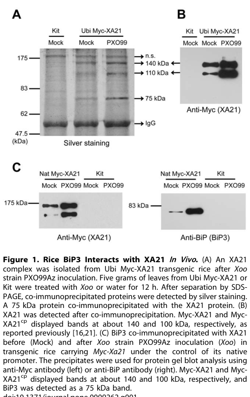

## Question

# Gene Research for Functional Annotation

## ⚠️ CRITICAL: Gene/Protein Identification Context

**BEFORE YOU BEGIN RESEARCH:** You MUST verify you are researching the CORRECT gene/protein. Gene symbols can be ambiguous, especially for less well-characterized genes from non-model organisms.

### Target Gene/Protein Identity (from UniProt):
- **UniProt Accession:** Q2R2D5
- **Protein Description:** RecName: Full=Receptor kinase-like protein Xa21 {ECO:0000303|PubMed:22735448}; EC=2.7.11.1 {ECO:0000250|UniProtKB:Q1MX30, ECO:0000255|PROSITE-ProRule:PRU00159}; Contains: RecName: Full=Receptor kinase-like protein Xa21, processed {ECO:0000303|PubMed:22735448}; Flags: Precursor;
- **Gene Information:** Name=XA21 {ECO:0000303|PubMed:22735448}; OrderedLocusNames=LOC_Os11g36180 {ECO:0000312|EMBL:ABA94328.1}, Os11g0569733 {ECO:0000312|EMBL:BAT14519.1}; ORFNames=OsJ_34314 {ECO:0000312|EMBL:EAZ18787.1}, OSNPB_110569733 {ECO:0000312|EMBL:BAT14519.1};
- **Organism (full):** Oryza sativa subsp. japonica (Rice).
- **Protein Family:** Belongs to the protein kinase superfamily. Ser/Thr protein
- **Key Domains:** Kinase-like_dom_sf. (IPR011009); Leu-rich_rpt. (IPR001611); Leu-rich_rpt_typical-subtyp. (IPR003591); LRR_dom_sf. (IPR032675); LRR_N_plant-typ. (IPR013210)

### MANDATORY VERIFICATION STEPS:

1. **Check if the gene symbol "XA21" matches the protein description above**
2. **Verify the organism is correct:** Oryza sativa subsp. japonica (Rice).
3. **Check if protein family/domains align with what you find in literature**
4. **If you find literature for a DIFFERENT gene with the same or similar symbol, STOP**

### If Gene Symbol is Ambiguous or You Cannot Find Relevant Literature:

**DO NOT PROCEED WITH RESEARCH ON A DIFFERENT GENE.** Instead:
- State clearly: "The gene symbol 'XA21' is ambiguous or literature is limited for this specific protein"
- Explain what you found (e.g., "Found extensive literature on a different gene with the same symbol in a different organism")
- Describe the protein based ONLY on the UniProt information provided above
- Suggest that the protein function can be inferred from domain/family information

### Research Target:

Please provide a comprehensive research report on the gene **XA21** (gene ID: XA21, UniProt: Q2R2D5) in ORYSJ.

The research report should be a detailed narrative explaining the function, biological processes, and localization of the gene product. Citations should be given for all claims.

You should prioritize authoritative reviews and primary scientific literature when conducting research. You can supplement
this with annotations you find in gene/protein databases, but these can be outdated or inaccurate.

We are specifically interested in the primary function of the gene - for enzymes, what reaction is catalyzed, and what is the substrate specificity? For transporters, what is the substrate? For structural proteins or adapters, what is the broader structural role? For signaling molecules, what is the role in the pathway.

We are interested in where in or outside the cell the gene product carries out its function.

We are also interested in the signaling or biochemical pathways in which the gene functions. We are less interested in broad pleiotropic effects, except where these elucidate the precise role.

Include evidence where possible. We are interested in both experimental evidence as well as inference from structure, evolution, or bioinformatic analysis. Precise studies should be prioritized over high-throughput, where available.

## Output

Question: You are an expert researcher providing comprehensive, well-cited information.

Provide detailed information focusing on:
1. Key concepts and definitions with current understanding
2. Recent developments and latest research (prioritize 2023-2024 sources)
3. Current applications and real-world implementations
4. Expert opinions and analysis from authoritative sources
5. Relevant statistics and data from recent studies

Format as a comprehensive research report with proper citations. Include URLs and publication dates where available.
Always prioritize recent, authoritative sources and provide specific citations for all major claims.

# Gene Research for Functional Annotation

## ⚠️ CRITICAL: Gene/Protein Identification Context

**BEFORE YOU BEGIN RESEARCH:** You MUST verify you are researching the CORRECT gene/protein. Gene symbols can be ambiguous, especially for less well-characterized genes from non-model organisms.

### Target Gene/Protein Identity (from UniProt):
- **UniProt Accession:** Q2R2D5
- **Protein Description:** RecName: Full=Receptor kinase-like protein Xa21 {ECO:0000303|PubMed:22735448}; EC=2.7.11.1 {ECO:0000250|UniProtKB:Q1MX30, ECO:0000255|PROSITE-ProRule:PRU00159}; Contains: RecName: Full=Receptor kinase-like protein Xa21, processed {ECO:0000303|PubMed:22735448}; Flags: Precursor;
- **Gene Information:** Name=XA21 {ECO:0000303|PubMed:22735448}; OrderedLocusNames=LOC_Os11g36180 {ECO:0000312|EMBL:ABA94328.1}, Os11g0569733 {ECO:0000312|EMBL:BAT14519.1}; ORFNames=OsJ_34314 {ECO:0000312|EMBL:EAZ18787.1}, OSNPB_110569733 {ECO:0000312|EMBL:BAT14519.1};
- **Organism (full):** Oryza sativa subsp. japonica (Rice).
- **Protein Family:** Belongs to the protein kinase superfamily. Ser/Thr protein
- **Key Domains:** Kinase-like_dom_sf. (IPR011009); Leu-rich_rpt. (IPR001611); Leu-rich_rpt_typical-subtyp. (IPR003591); LRR_dom_sf. (IPR032675); LRR_N_plant-typ. (IPR013210)

### MANDATORY VERIFICATION STEPS:

1. **Check if the gene symbol "XA21" matches the protein description above**
2. **Verify the organism is correct:** Oryza sativa subsp. japonica (Rice).
3. **Check if protein family/domains align with what you find in literature**
4. **If you find literature for a DIFFERENT gene with the same or similar symbol, STOP**

### If Gene Symbol is Ambiguous or You Cannot Find Relevant Literature:

**DO NOT PROCEED WITH RESEARCH ON A DIFFERENT GENE.** Instead:
- State clearly: "The gene symbol 'XA21' is ambiguous or literature is limited for this specific protein"
- Explain what you found (e.g., "Found extensive literature on a different gene with the same symbol in a different organism")
- Describe the protein based ONLY on the UniProt information provided above
- Suggest that the protein function can be inferred from domain/family information

### Research Target:

Please provide a comprehensive research report on the gene **XA21** (gene ID: XA21, UniProt: Q2R2D5) in ORYSJ.

The research report should be a detailed narrative explaining the function, biological processes, and localization of the gene product. Citations should be given for all claims.

You should prioritize authoritative reviews and primary scientific literature when conducting research. You can supplement
this with annotations you find in gene/protein databases, but these can be outdated or inaccurate.

We are specifically interested in the primary function of the gene - for enzymes, what reaction is catalyzed, and what is the substrate specificity? For transporters, what is the substrate? For structural proteins or adapters, what is the broader structural role? For signaling molecules, what is the role in the pathway.

We are interested in where in or outside the cell the gene product carries out its function.

We are also interested in the signaling or biochemical pathways in which the gene functions. We are less interested in broad pleiotropic effects, except where these elucidate the precise role.

Include evidence where possible. We are interested in both experimental evidence as well as inference from structure, evolution, or bioinformatic analysis. Precise studies should be prioritized over high-throughput, where available.

## Research report: Functional annotation of rice **XA21** (UniProt **Q2R2D5**) in *Oryza sativa* subsp. *japonica*

### Scope, gene/protein identity verification (mandatory)
The target protein is **XA21** from *Oryza sativa* subsp. *japonica* (rice), a **leucine-rich repeat receptor-like kinase (LRR-RLK)**/receptor kinase implicated in innate immunity. Rice genomics literature explicitly links **Xa21** to **Os11g0569733 / LOC_Os11g36180** on chromosome 11, consistent with the UniProt context and with an LRR-RLK architecture used in pathogen perception. (nanayakkara2018haplotypediversityanalysis pages 1-3)

XA21 should be distinguished from other “Xa” bacterial blight loci that encode different protein classes (e.g., NBS-LRR or SWEET-related susceptibility genes) by its defining features: **extracellular LRR ectodomain + single TM segment + juxtamembrane region + cytosolic Ser/Thr kinase (non-RD) domain**, and its documented activation by a **sulfated microbial peptide ligand**. (pruitt2015thericeimmune pages 1-2, joshi2020advancesinthe pages 6-7)

### 1) Key concepts and definitions (current understanding)

#### 1.1 Pattern-recognition receptor (PRR) and PTI
XA21 functions as a **cell-surface PRR** that initiates **pattern-triggered immunity (PTI)** upon perception of a conserved microbial molecule, leading to downstream defense signaling. (chen2011innateimmunityin pages 2-3)

#### 1.2 LRR receptor-like kinase (LRR-RLK) and non-RD kinases
XA21 belongs to LRR-RLKs that perceive extracellular ligands via LRRs and transduce signals through a cytosolic kinase domain. XA21 is described as a **non-RD kinase**, a motif class associated with innate immune signaling. (pruitt2015thericeimmune pages 1-2, chen2011innateimmunityin pages 1-2)

#### 1.3 Domain architecture (structure/function decomposition)
Computational and review descriptions converge on an XA21 architecture comprising: **extracellular LRR region (~23 LRRs reported in one modeling study), a single transmembrane helix, a juxtamembrane region, and a cytosolic kinase domain**. These features align with UniProt’s LRR and kinase domain annotations and are typical of immune PRRs. (mubassir2020comprehensiveinsilico pages 1-2, chen2011innateimmunityin pages 1-2)

### 2) Recent developments and latest research (prioritizing 2023–2024)

#### 2.1 Dose-dependent XA21 resistance (PeerJ, May 2024)
A 2024 study directly tested whether **XA21-mediated resistance is dose dependent**, generating multiple HA-tagged XA21 transgenic rice lines and showing that **differences in XA21 accumulation correlated with differences in resistance** to Xoo strain PXO99. Importantly, the authors report that measurements of **four agronomic traits** indicate that **yield is unlikely to be impacted by XA21 expression level** in their tested lines, a practical consideration for deployment. (zhang2024xa21mediatedresistanceto pages 1-2)

#### 2.2 XA21 introgression + salicylic acid-induced resistance in elite cultivar background (Acta Agrobotanica, Jul 2024)
A 2024 study in Thailand examined a **Xa21-introgressed** version of a widely grown cultivar (‘Phitsanulok 2’, PSL2) and tested **salicylic acid (SA) pretreatment (2 mM)**. SA pretreatment was associated with **increased Xa21 expression prior to infection** and improved disease outcomes, providing actionable evidence for combined genetic + elicitor-based management. (meesa2024salicylicacidapplication pages 1-2)

### 3) Functional mechanism: ligand recognition, localization, signaling, and regulation

#### 3.1 Ligand recognition: sulfated microbial peptide (RaxX)
Current consensus identifies the microbial activator of XA21 as **RaxX**, a bacterial protein whose **single tyrosine residue (Y41) must be sulfated** by the bacterial sulfotransferase **RaxST**. Sulfated, but not nonsulfated, RaxX activates XA21-dependent immune responses; a **synthetic sulfated 21-aa peptide (RaxX21-sY)** is sufficient to trigger hallmark immune responses. Xoo strains lacking raxX or with mutations in the key tyrosine can evade XA21-mediated immunity. (pruitt2015thericeimmune pages 1-2)

*Note on terminology:* older literature discussed “Ax21/AxYS22” as the elicitor; later work (above) identified RaxX as the relevant ligand for XA21 activation. (chen2011innateimmunityin pages 2-3, pruitt2015thericeimmune pages 1-2)

#### 3.2 Subcellular localization, processing, and ER quality control
A key mechanistic insight is that XA21 is **N-glycosylated**, localizes **primarily to the endoplasmic reticulum (ER)** and also to the **plasma membrane (PM)**, and undergoes **proteolytic cleavage** producing a full-length band (~140 kDa) and a cleavage product (~110 kDa). Overexpression of the ER chaperone **BiP3** reduces XA21 stability and inhibits its cleavage, indicating that ER quality control influences XA21 accumulation and processing. This provides strong evidence that XA21 biogenesis and maturation depend on ER folding/processing before functional activity at/near the PM. (park2010overexpressionofthe pages 1-2)

Visual evidence supporting these claims (co-IP interaction/cleavage, microscopy localization, glycosylation shift, and model schematic) was retrieved from the same work. (park2010overexpressionofthe media f52def4e, park2010overexpressionofthe media 7d43c080, park2010overexpressionofthe media 52691bd3, park2010overexpressionofthe media cf98f529)

#### 3.3 Regulatory interactors (“XB” proteins) and phosphorylation logic
XA21 signaling is regulated by multiple interacting proteins that tune activation amplitude and duration:

- **XB24 (ATPase)**: XB24 binds XA21 (interaction requires XA21 kinase activity) and promotes XA21 autophosphorylation via its ATPase activity; genetically, XB24 silencing enhances XA21 immunity while XB24 overexpression compromises immunity. The XA21–XB24 association dissociates upon exposure to active ligand activity, consistent with ligand-triggered release of negative regulation. (chen2010anatpasepromotes pages 1-2, chen2010anatpasepromotes pages 2-2)

- **XB15 (PP2C phosphatase)**: XB15 is a PP2C that interacts with the XA21 intracellular region; **autophosphorylated XA21 can be dephosphorylated by XB15** in a temporal- and dosage-dependent manner. Mutants show enhanced resistance and strong defense phenotypes, while XB15 overexpression compromises resistance, supporting XB15 as a **negative regulator** that terminates/attenuates XA21 signaling. (chen2011innateimmunityin pages 2-3)

- **XB3 (E3 ubiquitin ligase)**: XB3 is a RING-type E3 ubiquitin ligase that interacts with XA21 and is described as a **substrate for XA21 kinase activity**. Reduced Xb3 expression compromises resistance and lowers XA21 protein levels, indicating XB3 is required for full accumulation of XA21 and full resistance. (chen2011innateimmunityin pages 2-3)

Collectively, these findings support a model in which XA21 activation involves phosphorylation state transitions, release of negative regulation (XB24), and control of receptor abundance and signaling components through dephosphorylation (XB15) and ubiquitin-related processes (XB3). (chen2011innateimmunityin pages 2-3, chen2010anatpasepromotes pages 1-2)

### 4) Current applications and real-world implementations

#### 4.1 Marker-assisted selection (MAS) and introgression
XA21 has long been used in rice improvement; recent work continues to focus on reliable, high-resolution markers and characterization of allele diversity.

An intragenic marker **ABUOP0001**, targeting a **19-bp InDel in the XA21 ectodomain**, was proposed for MAS: it distinguishes resistant vs susceptible amplicons (200 bp vs 181 bp) and is positioned to reduce linkage drag relative to upstream linked markers (e.g., pTA248). The study reported field phenotyping where **14 accessions were highly resistant** and **1 was intermediate** among those carrying the resistant allele, and an in silico screen identified the resistance allele in **1,675 accessions** from the 3K Rice Genomes dataset, supporting broad germplasm deployment potential. (nanayakkara2019anovelintragenic pages 9-12, nanayakkara2019anovelintragenic pages 1-4)

#### 4.2 Deployment in elite cultivar backgrounds + chemical priming
In Thai cultivar PSL2, **Xa21 introgression lines (BC4F6)** were tested under bacterial blight challenge. **SA pretreatment (2 mM)** reduced pathogen proliferation and lesion length (details below), illustrating a real-world “stacking” of genetic resistance with priming/elicitor-based management. (meesa2024salicylicacidapplication pages 1-2, meesa2024salicylicacidapplication pages 8-11)

#### 4.3 Transgenic deployment and agronomic considerations
The 2024 dose-dependence study mapped multiple independent insertion events and assessed resistance vs XA21 accumulation, and it reported that measurements of four agronomic traits suggest **yield is unlikely to be affected by XA21 expression level** in their tested materials, supporting feasibility of transgenic implementations when regulatory environments permit. (zhang2024xa21mediatedresistanceto pages 1-2)

### 5) Statistics and quantitative data from recent and relevant studies

#### 5.1 Quantitative disease suppression in 2024 introgression lines (lesion length + bacterial load)
In Xa21-introgressed PSL2 (BC4F6 lines) challenged with Xoo16PK002, SA pretreatment produced the following quantitative outcomes:

- **Bacterial proliferation**: reported as **1.4–2.4-fold reduction** with SA pretreatment vs water control. (meesa2024salicylicacidapplication pages 1-2)
- **Lesion lengths** (Xa21 introgression line with SA pretreatment vs water):
  - **14 days after inoculation (DAI)**: **10.0–10.9 cm** vs **16.8–18.0 cm**
  - **21 DAI**: **24.6–28.0 cm** vs **34.9–35.1 cm** (meesa2024salicylicacidapplication pages 1-2)
- **CFU-based quantification**: SA-pretreated cultivars showed **12.8×10^4–18.1×10^4 CFU/mL** vs **25.8×10^4–35.7×10^4 CFU/mL** in controls. (meesa2024salicylicacidapplication pages 8-11)

These quantitative results provide directly actionable benchmarks for resistance performance under the described assay conditions. (meesa2024salicylicacidapplication pages 1-2, meesa2024salicylicacidapplication pages 8-11)

#### 5.2 Germplasm diversity and allele frequency statistics relevant to breeding
A diversity analysis of Xa21 across 1,618 accessions reported **13 confirmed haplotypes** among 1,341 accessions, with **haplotype diversity = 0.8203** and **nucleotide diversity = 0.15448**. A notable 19-bp InDel causes truncated protein forms and was reported to represent **~45% of accessions** in that dataset, illustrating substantial natural variation relevant to functional alleles and marker design. (nanayakkara2018haplotypediversityanalysis pages 1-3)

### Expert opinions and authoritative synthesis
Authoritative reviews and high-citation mechanistic papers frame XA21 as a central example of monocot PRR immunity and emphasize (i) ER-dependent maturation/quality control for receptor accumulation, (ii) phosphorylation-dependent regulation and negative feedback by phosphatases, and (iii) the value of PRRs such as XA21 for engineering/transferring recognition and for breeding durable resistance. (chen2011innateimmunityin pages 2-3, holton2015thephylogeneticallyrelatedpattern pages 2-4)

### Evidence summary table
The following table consolidates identity, mechanism, localization, regulators, applications, and quantitative findings (with URLs and publication dates).

| Feature | Summary | Key evidence/citations | Primary source (authors/year/journal) | URL | Publication date |
|---|---|---|---|---|---|
| Identity | XA21 in *Oryza sativa* subsp. *japonica* corresponds to locus Os11g0569733 / LOC_Os11g36180 and encodes a membrane-localized LRR receptor-like kinase/receptor kinase conferring resistance to *Xanthomonas oryzae* pv. *oryzae* (Xoo); it was introgressed from *O. longistaminata*. | (nanayakkara2018haplotypediversityanalysis pages 1-3, pruitt2015thericeimmune pages 1-2, joshi2020advancesinthe pages 6-7) | Nanayakkara et al. 2018, *Tropical Agricultural Research*; Pruitt et al. 2015, *Science Advances* | https://doi.org/10.4038/tar.v30i1.8278 ; https://doi.org/10.1126/sciadv.1500245 | 2018-12 ; 2015-07 |
| Domains | The protein matches the UniProt annotation as an LRR-RLK: extracellular LRR ectodomain, single transmembrane helix, juxtamembrane region, and intracellular non-RD serine/threonine kinase domain; modeling work describes ~23 LRRs. | (mubassir2020comprehensiveinsilico pages 1-2, chen2011innateimmunityin pages 1-2) | Mubassir et al. 2020, *RSC Advances*; Chen & Ronald 2011, *Trends in Plant Science* | https://doi.org/10.1039/d0ra01396j ; https://doi.org/10.1016/j.tplants.2011.04.003 | 2020-04 ; 2011-08 |
| Ligand | Current accepted ligand is the Xoo tyrosine-sulfated peptide RaxX; sulfation of the key Tyr residue is required, and synthetic RaxX21-sY is sufficient to trigger XA21-dependent immune responses. Earlier literature referred to Ax21; this was superseded by the RaxX model. | (pruitt2015thericeimmune pages 1-2, hans2026salicylicaciddriven pages 2-3, chen2011innateimmunityin pages 2-3) | Pruitt et al. 2015, *Science Advances*; Chen & Ronald 2011, *Trends in Plant Science* | https://doi.org/10.1126/sciadv.1500245 ; https://doi.org/10.1016/j.tplants.2011.04.003 | 2015-07 ; 2011-08 |
| Co-receptors/regulators | XA21 signaling is regulated by OsSERK2 and multiple XA21-binding proteins: XB24 (ATPase; promotes autophosphorylation and keeps receptor inactive before activation), XB15 (PP2C; dephosphorylates activated XA21 and negatively regulates immunity), XB3 (RING-type E3 ligase; phosphorylated by XA21 and required for full resistance/protein accumulation). | (jiang2026resistancegeneagainst pages 3-4, chen2010anatpasepromotes pages 1-2, holton2015thephylogeneticallyrelatedpattern pages 2-4, chen2011innateimmunityin pages 2-3) | Chen et al. 2010, *PNAS*; Wang et al. 2006, *The Plant Cell*; Park et al. 2008, *PLoS Biology*; Jiang et al. 2026, *Frontiers in Plant Science* | https://doi.org/10.1073/pnas.0912311107 ; https://doi.org/10.1105/tpc.106.046730 ; https://doi.org/10.1371/journal.pbio.0060231 ; https://doi.org/10.3389/fpls.2026.1744367 | 2010-04 ; 2006-12 ; 2008-09 ; 2026-02 |
| Localization/processing | XA21 is synthesized/processed through the ER, is N-glycosylated, localizes predominantly to the ER but also to the plasma membrane, and undergoes proteolytic cleavage: full-length ~140 kDa and cleavage product ~110 kDa. BiP3 overexpression reduces XA21 stability and cleavage. | (park2010overexpressionofthe pages 1-2, park2010overexpressionofthe media f52def4e, park2010overexpressionofthe media 7d43c080, park2010overexpressionofthe media 52691bd3, park2010overexpressionofthe media cf98f529) | Park et al. 2010, *PLoS ONE* | https://doi.org/10.1371/journal.pone.0009262 | 2010-02 |
| Downstream outputs | XA21 functions as a pattern-recognition receptor activating pattern-triggered immunity, including defense gene induction, MAPK-associated signaling, ROS and callose-associated defense outputs, and enhanced resistance to Xoo after ligand perception and release of negative regulation. | (chen2011innateimmunityin pages 2-3, park2017overexpressionofrice pages 1-2, meesa2024salicylicacidapplication pages 1-2) | Chen & Ronald 2011, *Trends in Plant Science*; Park et al. 2017, *Rice*; Meesa et al. 2024, *Acta Agrobotanica* | https://doi.org/10.1016/j.tplants.2011.04.003 ; https://doi.org/10.1186/s12284-017-0166-1 ; https://doi.org/10.5586/aa/188569 | 2011-08 ; 2017-06 ; 2024-07 |
| Applications/quantitative data | Marker-assisted selection/introgression: ABUOP0001 intragenic marker detects a 19-bp ectodomain InDel (200-bp resistant vs 181-bp susceptible amplicon) and identified the resistance allele in 1,675 accessions from 3K genomes; field/phenotype validation found 14 highly resistant and 1 intermediate accession among tested lines. Diversity analysis found 13 confirmed haplotypes, haplotype diversity 0.8203, nucleotide diversity 0.15448, and truncated protein-types in ~45% of accessions due to the 19-bp InDel. In Thai BC4F6 Xa21 introgression lines, SA pretreatment reduced Xoo proliferation by 1.4-2.4-fold; lesion lengths fell from 16.8-18.0 cm to 10.0-10.9 cm at 14 DAI and from 34.9-35.1 cm to 24.6-28.0 cm at 21 DAI; Xoo counts were 12.8×10^4-18.1×10^4 CFU/mL vs 25.8×10^4-35.7×10^4 CFU/mL in controls. | (meesa2024salicylicacidapplication pages 1-2, meesa2024salicylicacidapplication pages 8-11, nanayakkara2019anovelintragenic pages 9-12, nanayakkara2019anovelintragenic pages 1-4, nanayakkara2018haplotypediversityanalysis pages 1-3) | Meesa et al. 2024, *Acta Agrobotanica*; Nanayakkara et al. 2019, preprint/Research Square; Nanayakkara et al. 2018, *Tropical Agricultural Research* | https://doi.org/10.5586/aa/188569 ; https://doi.org/10.21203/rs.2.11141/v1 ; https://doi.org/10.4038/tar.v30i1.8278 | 2024-07 ; 2019-07 ; 2018-12 |
| Key recent 2024 findings | 2024 work showed XA21-mediated resistance is dose dependent in HA-XA21 transgenic lines; 16 independent T0 insertion events were mapped by whole-genome sequencing, six lines were phenotyped, and higher XA21 accumulation correlated with stronger resistance. The study reported that four agronomic traits suggested yield is unlikely to be affected by XA21 expression level. A separate 2024 study showed SA pretreatment boosts Xa21 expression and disease suppression in introgression lines. | (zhang2024xa21mediatedresistanceto pages 1-2, meesa2024salicylicacidapplication pages 1-2) | Zhang et al. 2024, *PeerJ*; Meesa et al. 2024, *Acta Agrobotanica* | https://doi.org/10.7717/peerj.17323 ; https://doi.org/10.5586/aa/188569 | 2024-05 ; 2024-07 |

*Table: This table summarizes the verified identity, mechanism, localization, regulators, and practical deployment of rice XA21 (UniProt Q2R2D5), with quantitative data and recent 2024 findings. It is useful as a compact evidence-backed functional annotation for narrative reports or downstream curation.*

### Key figures supporting localization/processing (visual evidence)
Figures from Park et al. (2010) provide direct experimental visual support for XA21 ER/PM localization, glycosylation, cleavage products, and BiP3 regulation. (park2010overexpressionofthe media f52def4e, park2010overexpressionofthe media 7d43c080, park2010overexpressionofthe media 52691bd3, park2010overexpressionofthe media cf98f529)

### Gaps and uncertainty notes (important for annotation quality)
- Some older sources used **Ax21/AxYS22** nomenclature for the elicitor; later work identified **RaxX** as the sulfated ligand that activates XA21. For functional annotation, ligand assignment should prioritize the RaxX evidence. (chen2011innateimmunityin pages 2-3, pruitt2015thericeimmune pages 1-2)
- This report focuses on experimentally supported localization and key regulators (XB24/XB15/XB3) and does not comprehensively enumerate all downstream signaling nodes (e.g., full MAPK cascades or transcriptional networks) beyond what was directly evidenced in the retrieved texts. (chen2011innateimmunityin pages 2-3, park2010elucidationofxa21mediated pages 3-5)

References

1. (nanayakkara2018haplotypediversityanalysis pages 1-3): N. H. L. D. L. D. Nanayakkara, V. Herath, and D. V. Jayatilake. Haplotype diversity analysis of bacterial leaf blight resistance gene xa21 in rice. Tropical Agricultural Research, 30:56, Dec 2018. URL: https://doi.org/10.4038/tar.v30i1.8278, doi:10.4038/tar.v30i1.8278. This article has 9 citations.

2. (pruitt2015thericeimmune pages 1-2): Rory N. Pruitt, Benjamin Schwessinger, Anna Joe, Nicholas Thomas, Furong Liu, Markus Albert, Michelle R. Robinson, Leanne Jade G. Chan, Dee Dee Luu, Huamin Chen, Ofir Bahar, Arsalan Daudi, David De Vleesschauwer, Daniel Caddell, Weiguo Zhang, Xiuxiang Zhao, Xiang Li, Joshua L. Heazlewood, Deling Ruan, Dipali Majumder, Mawsheng Chern, Hubert Kalbacher, Samriti Midha, Prabhu B. Patil, Ramesh V. Sonti, Christopher J. Petzold, Chang C. Liu, Jennifer S. Brodbelt, Georg Felix, and Pamela C. Ronald. The rice immune receptor xa21 recognizes a tyrosine-sulfated protein from a gram-negative bacterium. Jul 2015. URL: https://doi.org/10.1126/sciadv.1500245, doi:10.1126/sciadv.1500245. This article has 364 citations and is from a highest quality peer-reviewed journal.

3. (joshi2020advancesinthe pages 6-7): Johnson Beslin Joshi, Loganathan Arul, Jegadeesan Ramalingam, and Sivakumar Uthandi. Advances in the xoo-rice pathosystem interaction and its exploitation in disease management. Journal of Biosciences, Sep 2020. URL: https://doi.org/10.1007/s12038-020-00085-8, doi:10.1007/s12038-020-00085-8. This article has 25 citations and is from a peer-reviewed journal.

4. (chen2011innateimmunityin pages 2-3): Xuewei Chen and Pamela C. Ronald. Innate immunity in rice. Trends in plant science, 16 8:451-9, Aug 2011. URL: https://doi.org/10.1016/j.tplants.2011.04.003, doi:10.1016/j.tplants.2011.04.003. This article has 210 citations and is from a domain leading peer-reviewed journal.

5. (chen2011innateimmunityin pages 1-2): Xuewei Chen and Pamela C. Ronald. Innate immunity in rice. Trends in plant science, 16 8:451-9, Aug 2011. URL: https://doi.org/10.1016/j.tplants.2011.04.003, doi:10.1016/j.tplants.2011.04.003. This article has 210 citations and is from a domain leading peer-reviewed journal.

6. (mubassir2020comprehensiveinsilico pages 1-2): M. H. M. Mubassir, M. Abu Naser, Mohd Firdaus Abdul-Wahab, Tanvir Jawad, Raghib Ishraq Alvy, and Salehhuddin Hamdan. Comprehensive in silico modeling of the rice plant prr xa21 and its interaction with raxx21-sy and osserk2. RSC Advances, 10:15800-15814, Apr 2020. URL: https://doi.org/10.1039/d0ra01396j, doi:10.1039/d0ra01396j. This article has 6 citations and is from a peer-reviewed journal.

7. (zhang2024xa21mediatedresistanceto pages 1-2): Nan Zhang, Xiaoou Dong, Rashmi Jain, Deling Ruan, Artur Teixeira de Araujo Junior, Yan Li, A. Lipzen, Joel Martin, K. Barry, and P. Ronald. Xa21-mediated resistance to xanthomonas oryzae pv. oryzae is dose dependent. PeerJ, May 2024. URL: https://doi.org/10.7717/peerj.17323, doi:10.7717/peerj.17323. This article has 3 citations and is from a peer-reviewed journal.

8. (meesa2024salicylicacidapplication pages 1-2): Natchanon Meesa, Kawee Sujipuli, Kumrop Ratanasut, Pongsanat Pongcharoen, Tepsuda Rungrat, Thanita Boonsrangsom, Wanwarang Pathaichindachote, and Phithak Inthima. Salicylic acid application against bacterial blight resistance in xa21-introgression thai rice cultivar ‘phitsanulok 2’. Acta Agrobotanica, 77:1-15, Jul 2024. URL: https://doi.org/10.5586/aa/188569, doi:10.5586/aa/188569. This article has 2 citations and is from a peer-reviewed journal.

9. (park2010overexpressionofthe pages 1-2): Chang-Jin Park, Rebecca Bart, Mawsheng Chern, Patrick E. Canlas, Wei Bai, and Pamela C. Ronald. Overexpression of the endoplasmic reticulum chaperone bip3 regulates xa21-mediated innate immunity in rice. PLoS ONE, 5:e9262, Feb 2010. URL: https://doi.org/10.1371/journal.pone.0009262, doi:10.1371/journal.pone.0009262. This article has 177 citations and is from a peer-reviewed journal.

10. (park2010overexpressionofthe media f52def4e): Chang-Jin Park, Rebecca Bart, Mawsheng Chern, Patrick E. Canlas, Wei Bai, and Pamela C. Ronald. Overexpression of the endoplasmic reticulum chaperone bip3 regulates xa21-mediated innate immunity in rice. PLoS ONE, 5:e9262, Feb 2010. URL: https://doi.org/10.1371/journal.pone.0009262, doi:10.1371/journal.pone.0009262. This article has 177 citations and is from a peer-reviewed journal.

11. (park2010overexpressionofthe media 7d43c080): Chang-Jin Park, Rebecca Bart, Mawsheng Chern, Patrick E. Canlas, Wei Bai, and Pamela C. Ronald. Overexpression of the endoplasmic reticulum chaperone bip3 regulates xa21-mediated innate immunity in rice. PLoS ONE, 5:e9262, Feb 2010. URL: https://doi.org/10.1371/journal.pone.0009262, doi:10.1371/journal.pone.0009262. This article has 177 citations and is from a peer-reviewed journal.

12. (park2010overexpressionofthe media 52691bd3): Chang-Jin Park, Rebecca Bart, Mawsheng Chern, Patrick E. Canlas, Wei Bai, and Pamela C. Ronald. Overexpression of the endoplasmic reticulum chaperone bip3 regulates xa21-mediated innate immunity in rice. PLoS ONE, 5:e9262, Feb 2010. URL: https://doi.org/10.1371/journal.pone.0009262, doi:10.1371/journal.pone.0009262. This article has 177 citations and is from a peer-reviewed journal.

13. (park2010overexpressionofthe media cf98f529): Chang-Jin Park, Rebecca Bart, Mawsheng Chern, Patrick E. Canlas, Wei Bai, and Pamela C. Ronald. Overexpression of the endoplasmic reticulum chaperone bip3 regulates xa21-mediated innate immunity in rice. PLoS ONE, 5:e9262, Feb 2010. URL: https://doi.org/10.1371/journal.pone.0009262, doi:10.1371/journal.pone.0009262. This article has 177 citations and is from a peer-reviewed journal.

14. (chen2010anatpasepromotes pages 1-2): Xuewei Chen, Mawsheng Chern, Patrick E. Canlas, Deling Ruan, Caiying Jiang, and Pamela C. Ronald. An atpase promotes autophosphorylation of the pattern recognition receptor xa21 and inhibits xa21-mediated immunity. Proceedings of the National Academy of Sciences, 107:8029-8034, Apr 2010. URL: https://doi.org/10.1073/pnas.0912311107, doi:10.1073/pnas.0912311107. This article has 171 citations and is from a highest quality peer-reviewed journal.

15. (chen2010anatpasepromotes pages 2-2): Xuewei Chen, Mawsheng Chern, Patrick E. Canlas, Deling Ruan, Caiying Jiang, and Pamela C. Ronald. An atpase promotes autophosphorylation of the pattern recognition receptor xa21 and inhibits xa21-mediated immunity. Proceedings of the National Academy of Sciences, 107:8029-8034, Apr 2010. URL: https://doi.org/10.1073/pnas.0912311107, doi:10.1073/pnas.0912311107. This article has 171 citations and is from a highest quality peer-reviewed journal.

16. (nanayakkara2019anovelintragenic pages 9-12): Dhanesha Lakmali Nanayakkara, Iresha Kumari Edirisingha, Lakshika Nivanthi Dissanayake, Deepika Weerasinghe, Lalith Suriyagoda, Venura Herath, Chandrika Perera, and Dimanthi Vihanga Jayatilake. A novel intragenic marker targeting the ectodomain of bacterial leaf blight resistance gene xa21 in rice. ArXiv, Jul 2019. URL: https://doi.org/10.21203/rs.2.11141/v1, doi:10.21203/rs.2.11141/v1. This article has 0 citations.

17. (nanayakkara2019anovelintragenic pages 1-4): Dhanesha Lakmali Nanayakkara, Iresha Kumari Edirisingha, Lakshika Nivanthi Dissanayake, Deepika Weerasinghe, Lalith Suriyagoda, Venura Herath, Chandrika Perera, and Dimanthi Vihanga Jayatilake. A novel intragenic marker targeting the ectodomain of bacterial leaf blight resistance gene xa21 in rice. ArXiv, Jul 2019. URL: https://doi.org/10.21203/rs.2.11141/v1, doi:10.21203/rs.2.11141/v1. This article has 0 citations.

18. (meesa2024salicylicacidapplication pages 8-11): Natchanon Meesa, Kawee Sujipuli, Kumrop Ratanasut, Pongsanat Pongcharoen, Tepsuda Rungrat, Thanita Boonsrangsom, Wanwarang Pathaichindachote, and Phithak Inthima. Salicylic acid application against bacterial blight resistance in xa21-introgression thai rice cultivar ‘phitsanulok 2’. Acta Agrobotanica, 77:1-15, Jul 2024. URL: https://doi.org/10.5586/aa/188569, doi:10.5586/aa/188569. This article has 2 citations and is from a peer-reviewed journal.

19. (holton2015thephylogeneticallyrelatedpattern pages 2-4): Nicholas Holton, Vladimir Nekrasov, Pamela C. Ronald, and Cyril Zipfel. The phylogenetically-related pattern recognition receptors efr and xa21 recruit similar immune signaling components in monocots and dicots. PLOS Pathogens, 11:e1004602, Jan 2015. URL: https://doi.org/10.1371/journal.ppat.1004602, doi:10.1371/journal.ppat.1004602. This article has 129 citations and is from a highest quality peer-reviewed journal.

20. (hans2026salicylicaciddriven pages 2-3): Bal Hans, Parinda Barua, Neha Kumari Pandey, Dibyasree Dutta, Munmi Phukon, Rajasree Chetia, Palash Deb Nath, and Sanjay Kumar Chetia. Salicylic acid driven defence: enhancing rice resistance to bacterial blight. Plant Archives, 26:1239-1247, Sep 2026. URL: https://doi.org/10.51470/plantarchives.2026.v26.supplement-1.163, doi:10.51470/plantarchives.2026.v26.supplement-1.163. This article has 0 citations.

21. (jiang2026resistancegeneagainst pages 3-4): Hongrui Jiang, Qi-na Huang, Changdeng Yang, and Yan Liang. Resistance gene against xanthomonas oryzae pv. oryzae (xoo) in rice: molecular mechanisms and breeding strategies for bacterial leaf blight. Frontiers in Plant Science, Feb 2026. URL: https://doi.org/10.3389/fpls.2026.1744367, doi:10.3389/fpls.2026.1744367. This article has 0 citations.

22. (park2017overexpressionofrice pages 1-2): Chang-Jin Park, Tong Wei, Rita Sharma, and Pamela C. Ronald. Overexpression of rice auxilin-like protein, xb21, induces necrotic lesions, up-regulates endocytosis-related genes, and confers enhanced resistance to xanthomonas oryzae pv. oryzae. Rice, Jun 2017. URL: https://doi.org/10.1186/s12284-017-0166-1, doi:10.1186/s12284-017-0166-1. This article has 27 citations and is from a peer-reviewed journal.

23. (park2010elucidationofxa21mediated pages 3-5): CJ Park, SW Han, X Chen, and PC Ronald. Elucidation of xa21-mediated innate immunitycmi_1489. Unknown journal, 2010.

## Artifacts

- [Edison artifact artifact-00](XA21-deep-research-falcon_artifacts/artifact-00.md)

## Citations

1. nanayakkara2018haplotypediversityanalysis pages 1-3
2. chen2011innateimmunityin pages 2-3
3. meesa2024salicylicacidapplication pages 1-2
4. pruitt2015thericeimmune pages 1-2
5. park2010overexpressionofthe pages 1-2
6. meesa2024salicylicacidapplication pages 8-11
7. joshi2020advancesinthe pages 6-7
8. chen2011innateimmunityin pages 1-2
9. mubassir2020comprehensiveinsilico pages 1-2
10. chen2010anatpasepromotes pages 1-2
11. chen2010anatpasepromotes pages 2-2
12. nanayakkara2019anovelintragenic pages 9-12
13. nanayakkara2019anovelintragenic pages 1-4
14. holton2015thephylogeneticallyrelatedpattern pages 2-4
15. hans2026salicylicaciddriven pages 2-3
16. jiang2026resistancegeneagainst pages 3-4
17. park2017overexpressionofrice pages 1-2
18. https://doi.org/10.4038/tar.v30i1.8278
19. https://doi.org/10.1126/sciadv.1500245
20. https://doi.org/10.1039/d0ra01396j
21. https://doi.org/10.1016/j.tplants.2011.04.003
22. https://doi.org/10.1073/pnas.0912311107
23. https://doi.org/10.1105/tpc.106.046730
24. https://doi.org/10.1371/journal.pbio.0060231
25. https://doi.org/10.3389/fpls.2026.1744367
26. https://doi.org/10.1371/journal.pone.0009262
27. https://doi.org/10.1186/s12284-017-0166-1
28. https://doi.org/10.5586/aa/188569
29. https://doi.org/10.21203/rs.2.11141/v1
30. https://doi.org/10.7717/peerj.17323
31. https://doi.org/10.4038/tar.v30i1.8278,
32. https://doi.org/10.1126/sciadv.1500245,
33. https://doi.org/10.1007/s12038-020-00085-8,
34. https://doi.org/10.1016/j.tplants.2011.04.003,
35. https://doi.org/10.1039/d0ra01396j,
36. https://doi.org/10.7717/peerj.17323,
37. https://doi.org/10.5586/aa/188569,
38. https://doi.org/10.1371/journal.pone.0009262,
39. https://doi.org/10.1073/pnas.0912311107,
40. https://doi.org/10.21203/rs.2.11141/v1,
41. https://doi.org/10.1371/journal.ppat.1004602,
42. https://doi.org/10.51470/plantarchives.2026.v26.supplement-1.163,
43. https://doi.org/10.3389/fpls.2026.1744367,
44. https://doi.org/10.1186/s12284-017-0166-1,