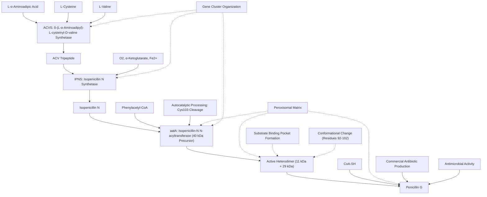

# Pathway Summary for aatA

## Overview

aatA encodes isopenicillin-N N-acyltransferase (IAT), the final enzyme in the penicillin biosynthetic pathway of Penicillium chrysogenum [PMID:2120195, UniProt:P15802]. This peroxisomal enzyme catalyzes the exchange of the α-aminoadipyl side chain of isopenicillin N with phenylacetic acid to produce penicillin G, the commercially important β-lactam antibiotic [PMID:2120195]. The enzyme undergoes autocatalytic self-processing from a 40 kDa precursor to form an active heterodimeric enzyme containing 11 kDa and 29 kDa subunits [PMID:2120195, PMID:20223213].

## Penicillin Biosynthetic Pathway

The penicillin biosynthetic pathway consists of three enzymatic steps that convert amino acid precursors to the final antibiotic product [PMID:1368505]. The pathway begins with δ-(L-α-aminoadipyl)-L-cysteinyl-D-valine synthetase (ACVS) forming the tripeptide ACV from L-α-aminoadipic acid, L-cysteine, and L-valine. Next, isopenicillin N synthetase (IPNS) cyclizes ACV to form isopenicillin N through a remarkable four-electron oxidation [PMID:2120195]. Finally, aatA catalyzes the side chain exchange reaction that replaces the polar α-aminoadipyl group with a hydrophobic phenylacetyl group, producing penicillin G with enhanced antimicrobial activity and stability [PMID:2120195].

## Peroxisomal Compartmentalization

The final step of penicillin biosynthesis occurs exclusively in peroxisomes, where aatA is localized in the peroxisomal matrix [PMID:18439860, UniProt:P15802]. This compartmentalization serves multiple functions including substrate channeling, product concentration, and metabolic regulation. The peroxisomal localization requires specific targeting signals and transport machinery to deliver the precursor enzyme across the peroxisomal membrane [PMID:18439860]. Interestingly, transport into peroxisomes does not require prior self-processing, as demonstrated by studies with the catalytically inactive C103S mutant [PMID:18439860].

## Autocatalytic Processing Mechanism

aatA exhibits the unusual property of autocatalytic self-processing, where the enzyme cleaves itself to generate the active form [PMID:2120195, PMID:20223213]. The processing is initiated by Cys103 cleaving its preceding peptide bond, and structural studies reveal that after autoproteolysis, residues 92-102 fold outward to expose a buried substrate-binding pocket [PMID:20223213]. This conformational change creates a structurally flexible active site that can accommodate substrates of different sizes and polarities [PMID:20223213]. The same catalytic residues perform different roles in autoproteolysis versus substrate hydrolysis, representing a sophisticated dual-function catalytic mechanism [PMID:20223213].

## Substrate Specificity and Regulation

aatA demonstrates broad substrate tolerance, accepting both isopenicillin N and 6-aminopenicillanic acid as substrates when combined with appropriate acyl-CoA donors [PMID:2120195]. This flexibility enables the production of different penicillin variants by varying the acyl side chain donor. The enzyme shows post-translational regulation where unprocessed preprotein can interfere with self-processing of active enzyme, providing a mechanism for fine-tuning enzyme activity levels [PMID:18439860]. This regulatory mechanism may help coordinate penicillin production with cellular physiology and metabolic demands.

## Penicillin Biosynthesis Pathway Diagram

## Industrial and Medical Significance

The aatA-catalyzed reaction represents the key step that determines the final structure and biological activity of penicillin antibiotics. By controlling the acyl side chain incorporated during this reaction, different penicillin variants with distinct pharmacological properties can be produced [PMID:2120195]. This flexibility has been crucial for the development of semi-synthetic penicillins with improved stability, spectrum of activity, or resistance to β-lactamases. Understanding the structure-function relationships of aatA has informed industrial strain improvement efforts and bioprocess optimization for large-scale antibiotic production.

## Evolutionary and Biotechnological Perspectives

The aatA enzyme represents a remarkable example of enzymatic sophistication, combining multiple functions including self-processing, substrate recognition, and acyl transfer chemistry within a single polypeptide [PMID:20223213]. The autocatalytic processing mechanism is evolutionarily related to other Ntn-hydrolases and provides insights into protein maturation mechanisms. From a biotechnological standpoint, engineering aatA variants with altered substrate specificity or improved stability could enable production of novel β-lactam antibiotics or enhance existing manufacturing processes. The detailed structural and mechanistic understanding of aatA provides a solid foundation for such protein engineering efforts.