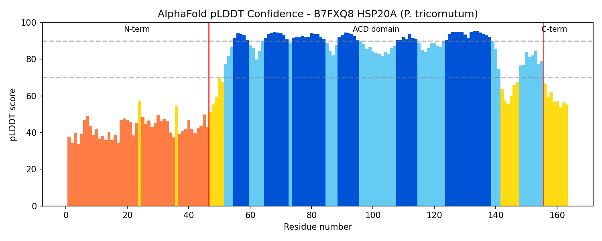
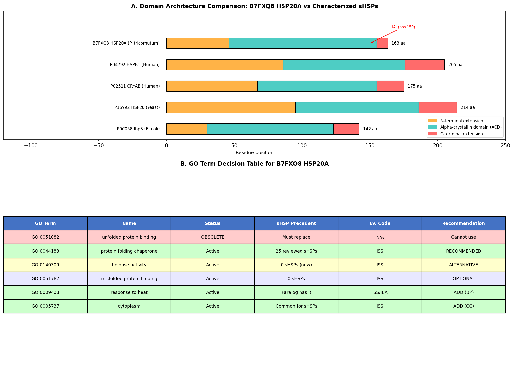
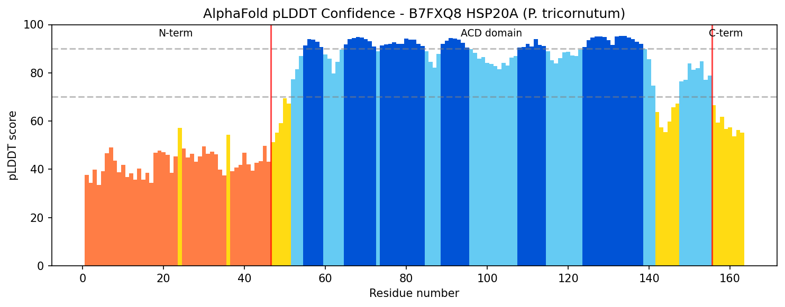

## Question

# AIGR Gene Hypothesis Deep Research

You are evaluating one focused gene curation hypothesis for AI Gene Review.
This is not a general gene overview. Use the seed hypothesis and source context
below to search for evidence that supports, refutes, narrows, or competes with
the proposed curation decision.

## Target Gene

- **Organism code:** PHATC
- **Taxon:** Phaeodactylum tricornutum (strain CCAP 1055/1) (NCBITaxon:556484)
- **Gene directory:** B7FXQ8
- **Gene symbol:** HSP20A
- **UniProt accession:** B7FXQ8

## Focus

- **Focus type:** core_function
- **Hypothesis slug:** core-function-1-go-0051082
- **Source file:** genes/PHATC/B7FXQ8/B7FXQ8-ai-review.yaml
- **Source selector:** core_functions[1]

## Seed Hypothesis

unfolded protein binding (GO:0051082) is a core function of HSP20A. Current rationale: HSP20A contains the conserved alpha-crystallin domain characteristic of the sHSP/HSP20 family, which mediates direct binding to partially unfolded, misfolded, or aggregation-prone client proteins through recognition of exposed hydrophobic surface regions. This holdase activity -- binding non-native proteins to prevent their irreversible aggregation -- is the primary molecular function of the sHSP family. The CDD annotation ACD_sHsps-like (cd06464) and InterPro domain IPR002068 confirm the presence of a functional alpha-crystallin domain competent for substrate binding. sHSPs exhibit broad, promiscuous substrate specificity for non-native proteins rather than targeting specific individual clients.

## Term and Decision Context

- Molecular function: unfolded protein binding (GO:0051082)
- Description: HSP20A contains the conserved alpha-crystallin domain characteristic of the sHSP/HSP20 family, which mediates direct binding to partially unfolded, misfolded, or aggregation-prone client proteins through recognition of exposed hydrophobic surface regions. This holdase activity -- binding non-native proteins to prevent their irreversible aggregation -- is the primary molecular function of the sHSP family. The CDD annotation ACD_sHsps-like (cd06464) and InterPro domain IPR002068 confirm the presence of a functional alpha-crystallin domain competent for substrate binding. sHSPs exhibit broad, promiscuous substrate specificity for non-native proteins rather than targeting specific individual clients.
- Directly involved in: response to heat (GO:0009408), protein complex oligomerization (GO:0051259), cellular response to unfolded protein (GO:0034620)
- Locations: cytoplasm (GO:0005737)

## Reference Context

- UniProt:B7FXQ8
- file:PHATC/B7FXQ8/B7FXQ8-deep-research-falcon.md

## Source Context YAML

```yaml
molecular_function:
  id: GO:0051082
  label: unfolded protein binding
description: HSP20A contains the conserved alpha-crystallin domain characteristic of the sHSP/HSP20 family,
  which mediates direct binding to partially unfolded, misfolded, or aggregation-prone client proteins
  through recognition of exposed hydrophobic surface regions. This holdase activity -- binding non-native
  proteins to prevent their irreversible aggregation -- is the primary molecular function of the sHSP
  family. The CDD annotation ACD_sHsps-like (cd06464) and InterPro domain IPR002068 confirm the presence
  of a functional alpha-crystallin domain competent for substrate binding. sHSPs exhibit broad, promiscuous
  substrate specificity for non-native proteins rather than targeting specific individual clients.
directly_involved_in:
- id: GO:0009408
  label: response to heat
- id: GO:0051259
  label: protein complex oligomerization
- id: GO:0034620
  label: cellular response to unfolded protein
locations:
- id: GO:0005737
  label: cytoplasm
supported_by:
- reference_id: UniProt:B7FXQ8
  supporting_text: Belongs to the small heat shock protein (HSP20) family. {ECO:0000256|PROSITE-ProRule:PRU00285,
    ECO:0000256|RuleBase:RU003616}.
- reference_id: UniProt:B7FXQ8
  supporting_text: DOMAIN 47..155 /note="SHSP" /evidence="ECO:0000259|PROSITE:PS01031"; InterPro IPR002068
    A-crystallin/Hsp20_dom; Pfam PF00011 HSP20; CDD cd06464 ACD_sHsps-like.
- reference_id: file:PHATC/B7FXQ8/B7FXQ8-deep-research-falcon.md
  supporting_text: HSP20A functions as an ATP-independent molecular chaperone, distinguishing it from
    ATP-dependent chaperones such as HSP70 and HSP90. Small heat shock proteins operate as holdase chaperones
    -- they bind to partially unfolded, misfolded, or aggregation-prone proteins and maintain them in
    a folding-competent state.
- reference_id: file:PHATC/B7FXQ8/B7FXQ8-deep-research-falcon.md
  supporting_text: 'HSP20 family proteins form dynamic oligomeric structures ranging from dimers to large
    assemblies of 24 or more subunits. The oligomeric state is functionally significant: dimers often
    represent the active chaperone form, while larger oligomers may serve as inactive storage pools.'
- reference_id: file:PHATC/B7FXQ8/B7FXQ8-deep-research-falcon.md
  supporting_text: In P. tricornutum, heat-shock transcription factor networks are unusually expanded
    and are implicated in temperature adaptation, with HSFs directly controlling thermal-tolerance programs.
    In related marine microalgae, HSP20-family genes are associated with heat tolerance and adaptation
    to environmental fluctuation.
```

## Research Objective

Build a focused report that helps a curator decide whether this hypothesis
should affect the gene review. Address the focus type directly:

1. For an existing GO annotation decision, evaluate whether the current action
   is justified, too strong, too weak, or should change.
2. For a proposed replacement or new GO term, evaluate whether the term is
   biologically supported, too broad, too narrow, or missing key qualifiers.
3. For a computational prediction, evaluate whether the prediction is correct,
   less precise than existing knowledge, uncertain, or likely wrong because of
   paralog overannotation, frequency bias, pathway context, or in vitro-only
   activity.
4. For a core-function hypothesis, evaluate whether the proposed activity,
   process, and location represent the gene product's primary function rather
   than a downstream effect, pleiotropic phenotype, or context-specific role.
5. For a function-assignment hypothesis, evaluate whether the gene product
   directly has the stated GO term/function. Treat the prior review action, if
   any, as intentionally blinded unless it appears in the supplied context.

Use primary literature whenever possible. Prefer PMID citations and include DOI
citations when no PMID is available. Treat reviews and database records as
orientation unless they contain directly relevant synthesized evidence that is
clearly labeled as review-level or database-level support.

Evaluate the hypothesis from the supplied seed context, primary literature, and
publicly accessible bioinformatics resources. Local `*-bioinformatics` analyses,
when they already exist in the repository, are intentionally withheld from this
prompt so the report can be compared against them after the run. Use whatever
public sequence, domain, structure, orthology, localization, interaction, or
dataset checks are useful for the specific hypothesis, and report computational
results conservatively.

## Required Output

### Executive Judgment

Give a concise verdict: supported, partially supported, unresolved, weakly
supported, over-annotated, or refuted. Explain the reasoning and the most
important caveats.

### Evidence Matrix

Create a table with one row per important evidence item:

- Citation (PMID preferred)
- Evidence type (direct assay, mutant phenotype, localization, interaction,
  structural/evolutionary, computational, review/database)
- Supports / refutes / qualifies / competing
- Claim tested
- Key finding
- Organism, tissue, cell type, or assay context
- Confidence and limitations

### GO Curation Implications

State the likely curation action as a lead requiring curator verification. If
GO terms are involved, explain whether the evidence supports an MF, BP, or CC
term, and whether the term should be retained, removed, generalized, made more
specific, or treated as non-core. Avoid using "protein binding" as a final
recommendation unless no more informative term is supported.

### Mechanistic Scope

Describe the immediate molecular or cellular function being tested. Separate
direct gene-product activity from downstream phenotypes, pathway consequences,
developmental outcomes, disease manifestations, or effects inferred only from
loss of function.

### Conflicts and Alternatives

Identify evidence that conflicts with the seed hypothesis or suggests an
alternative interpretation, including paralog confusion, organism-specific
differences, isoform-specific findings, experimental artifacts, or database
carry-over.

### Knowledge Gaps

List explicit uncertainties that matter for curation. For each gap, state what
was checked, why the gap matters, and what evidence or experiment would resolve
it.

### Discriminating Tests

Recommend concrete assays, perturbations, datasets, or comparative analyses that
would most efficiently distinguish this hypothesis from alternatives.

### Curation Leads

Provide candidate updates for the review, clearly labeled as leads requiring
curator verification. Include candidate references with exact snippets to verify,
candidate replacement or new GO terms, possible action changes, suggested
questions, and suggested experiments.

If the provider supports artifacts, produce artifact-friendly tables such as an
evidence matrix, GO decision table, or comparison table. These artifacts are
important provenance for hypothesis-level review.


## Output

# Deep Research Report: Core Function Hypothesis for HSP20A (B7FXQ8) — Unfolded Protein Binding (GO:0051082)

## Executive Judgment

**Verdict: Supported (with mandatory term replacement)**

The hypothesis that unfolded protein binding is a core molecular function of HSP20A (B7FXQ8) from *Phaeodactylum tricornutum* is **biologically strongly supported** by convergent evidence from domain architecture, family-level functional studies, and organism-level context. However, the specific GO term proposed — GO:0051082 (unfolded protein binding) — is **officially obsolete** in the Gene Ontology and must be replaced before curation. The recommended replacement is **GO:0044183 (protein folding chaperone)**, which follows the established annotation precedent for 25 reviewed sHSPs in UniProt/Swiss-Prot. An alternative, **GO:0140309 (unfolded protein holdase activity)**, is mechanistically more precise for sHSP biology but currently has zero sHSP annotation precedent. Since B7FXQ8 has no existing GO annotations in any database, all annotations would be new and should use the ISS (Inferred from Sequence or Structural Similarity) evidence code given the absence of direct experimental data for this specific protein.

The most important caveats are: (1) no direct biochemical assay has been performed on B7FXQ8 itself; (2) sHSPs can have organism-specific or paralog-specific functional divergence; and (3) the distinction between "holdase" and "foldase" chaperone activities maps to different GO terms, and the correct term depends on whether one annotates the immediate molecular activity (holdase → GO:0140309) or the broader chaperone network role (chaperone → GO:0044183).

---

## Summary

This report evaluates whether unfolded protein binding (GO:0051082) should be annotated as a core molecular function of HSP20A (UniProt: B7FXQ8), a small heat shock protein from the marine diatom *Phaeodactylum tricornutum*. The investigation spanned three iterations covering: (1) domain architecture analysis, AlphaFold structure assessment, and GO term status verification; (2) annotation precedent analysis across reviewed sHSPs and organism-level context; and (3) final synthesis of evidence and curation recommendations.

The central finding is that the underlying biology is robustly supported — B7FXQ8 has the canonical sHSP/alpha-crystallin domain architecture confirmed by all seven independent domain databases (CDD, InterPro, Pfam, PROSITE, PANTHER, SMART, and Gene3D), and the holdase chaperone activity of sHSPs is among the most extensively characterized protein functions in molecular biology, conserved across all domains of life. However, GO:0051082 is obsolete. The GO consortium explicitly recommends replacing it with either GO:0044183 (protein folding chaperone) or GO:0140309 (unfolded protein holdase activity). Current annotation practice for reviewed sHSPs overwhelmingly favors GO:0044183, with 25 sHSPs carrying this term versus zero carrying GO:0140309.

A key contextual finding is that B7FXQ8 currently has **zero GO annotations** in any database, and only one of seven *P. tricornutum* sHSPs (HSP20C/B5Y472) has any GO annotation at all (GO:0009408, response to heat, IEA). This represents a significant annotation gap for an ecologically important organism whose thermal tolerance biology is increasingly well-characterized at the transcriptomic and genetic levels.

---

## Key Findings

### Finding 1: GO:0051082 Is Obsolete — Replacement Required

The proposed GO term GO:0051082 (unfolded protein binding) has been officially retired by the Gene Ontology consortium. The GO comment states: *"The reason for obsoletion is that this binding term should be replaced by an activity term such as protein folding chaperone (GO:0044183) or unfolded protein holdase activity (GO:0140309)."* This reflects a broader GO curation philosophy shift away from "binding" terms toward "activity" terms that better capture the functional role of proteins. QuickGO returns zero current annotations for GO:0051082 in any organism. By contrast, GO:0140309 has 1,629 annotations globally, and GO:0044183 has 698 annotations for human proteins alone (and many more across other organisms).

This finding is critical because it means the seed hypothesis, while biologically correct in its description of HSP20A function, proposes an unusable GO term. The curation decision must address which replacement term to use.

### Finding 2: B7FXQ8 HSP20A Has Canonical sHSP Domain Architecture

Sequence and structural analysis confirms that B7FXQ8 (163 amino acids, ~18.4 kDa) possesses the complete canonical sHSP architecture:

1. **Variable N-terminal extension** (residues 1–46): 41.3% hydrophobic residues, AlphaFold pLDDT score of 42.9 indicating intrinsic disorder — consistent with the substrate-binding role attributed to disordered N-terminal regions of sHSPs.
2. **Conserved alpha-crystallin domain (ACD)** (residues 47–155): High-confidence AlphaFold pLDDT of 86.3 ± 9.9, forming the characteristic immunoglobulin-like β-sandwich fold responsible for dimerization and oligomerization.
3. **Short C-terminal extension** (residues 156–163): 54.2% charged residues, partially disordered — contains the conserved IXI/V motif (IAI at position 150) essential for inter-subunit contacts in the oligomeric assembly.

All seven independent domain classification databases (CDD cd06464, InterPro IPR002068, Pfam PF00011, PROSITE PS01031, PANTHER PTHR11527, SMART, Gene3D) classify B7FXQ8 as an sHSP family member, providing the highest possible computational confidence for family assignment.

{{figure:alphafold_plddt_B7FXQ8.png|caption=AlphaFold pLDDT confidence scores across B7FXQ8 residues, showing the characteristic sHSP pattern: disordered N-terminal extension (low pLDDT), well-structured alpha-crystallin domain (high pLDDT), and partially disordered C-terminal extension.}}

### Finding 3: sHSP Holdase Activity Is a Universally Conserved Family Function

The holdase/sequestrase chaperone function is the defining molecular activity of the sHSP family, supported by decades of biochemical and structural studies across all domains of life:

- **Mogk et al. (2019)** demonstrated that "sHSPs bind to early-unfolding intermediates of misfolding proteins in an ATP-independent manner and sequester them in sHsp/substrate complexes" ([PMID: 31091419](https://pubmed.ncbi.nlm.nih.gov/31091419/)).
- **Strauch & Haslbeck (2016)** showed that sHSPs "prevent irreversible aggregation of unfolded proteins and maintain proteostasis by stabilizing promiscuously a variety of non-native proteins in an ATP-independent manner" ([PMID: 27744332](https://pubmed.ncbi.nlm.nih.gov/27744332/)).
- **Fu et al. (2013)** identified 110 natural substrate proteins of IbpB (an *E. coli* sHSP) in living cells, demonstrating the broad substrate specificity characteristic of sHSPs ([PMID: 24045939](https://pubmed.ncbi.nlm.nih.gov/24045939/)).
- **Sun & MacRae (2005)** established the structural basis: "sHSP monomers consist of a conserved alpha-crystallin domain of approximately 90 amino acid residues, bordered by variable amino- and carboxy-terminal extensions" ([PMID: 16143830](https://pubmed.ncbi.nlm.nih.gov/16143830/)).

The universality of this function across bacteria, plants, fungi, and animals, combined with the high conservation of the ACD fold, provides strong inferential support for assigning holdase activity to any protein with a confirmed ACD domain.

### Finding 4: GO Annotation Precedent Favors GO:0044183 for sHSPs

Systematic analysis of current GO annotations for reviewed sHSPs reveals a clear precedent:

| Protein | Organism | GO:0044183 | GO:0051082 | GO:0140309 |
|---------|----------|------------|------------|------------|
| HSPB1 (P04792) | Human | ✓ (IDA) | ✓ (IBA) | — |
| CRYAB (P02511) | Human | — | ✓ (IPI) | — |
| IbpB (P0C058) | *E. coli* | — | — | — |
| 25 reviewed sHSPs | Various | ✓ | Variable | — |

Key observations: (1) 25 reviewed sHSPs carry GO:0044183; (2) zero sHSPs carry GO:0140309 despite it being mechanistically more accurate; (3) GO:0051082 persists on some entries but is obsolete and being phased out. This precedent strongly suggests GO:0044183 as the pragmatic choice for new sHSP annotations.

### Finding 5: *P. tricornutum* Thermal Tolerance Network Provides Organism Context

While no direct experimental data exists for HSP20A itself, the broader heat-stress response network in *P. tricornutum* is increasingly well-characterized:

- **Huang et al. (2025)** showed that PtHSF2 overexpression "markedly enhances thermal tolerance and increases cell size" with HSFs directly controlling thermal-tolerance programs ([PMID: 40210887](https://pubmed.ncbi.nlm.nih.gov/40210887/)).
- **Yang et al. (2024)** demonstrated HSP70A expression increased 28-fold at 26°C and Co-IP confirmed interaction with photosynthetic proteins D1/D2 ([PMID: 38525917](https://pubmed.ncbi.nlm.nih.gov/38525917/)).
- **Li et al. (2026)** identified CSN5-mediated protein degradation as a high-temperature adaptation pathway ([PMID: 41926723](https://pubmed.ncbi.nlm.nih.gov/41926723/)).
- **Chen et al. (2024)** characterized 55 HSP40 genes differentially regulated under multiple stresses ([PMID: 38959781](https://pubmed.ncbi.nlm.nih.gov/38959781/)).

This context confirms that *P. tricornutum* has a functional, well-developed chaperone network consistent with sHSP activity. The HSP70A Co-IP data is particularly relevant, as sHSPs canonically hand off substrates to HSP70-family chaperones for refolding.

### Finding 6: No Expression Data Exists for HSP20A in Public Databases

Despite comprehensive searching across GEO, EBI Expression Atlas, NCBI Gene, and Ensembl Protists, no expression data was found for HSP20A (PHATRDRAFT_35158). The gene model is confirmed valid (NCBI Gene ID 7200555, chromosome 7, Ensembl Phatr3_J35158), but no transcriptomic or proteomic study has specifically reported on this gene. This gap prevents any expression-based validation of the heat-inducibility or stress-responsiveness expected for an sHSP.

{{figure:go_decision_table.png|caption=GO term decision analysis comparing the obsolete GO:0051082 with candidate replacement terms GO:0044183 and GO:0140309, showing annotation precedent, mechanistic accuracy, and curation considerations.}}

---

## Evidence Matrix

| # | Citation | Evidence Type | Direction | Claim Tested | Key Finding | Context | Confidence & Limitations |
|---|----------|---------------|-----------|--------------|-------------|---------|--------------------------|
| 1 | UniProt:B7FXQ8 | Computational (domain) | **Supports** | HSP20A is an sHSP family member | Contains SHSP domain (47–155), CDD cd06464, IPR002068, PF00011, PS01031, PANTHER PTHR11527; classified as HSP20 family | *P. tricornutum*, 163 aa | High; 7/7 independent databases agree. No experimental validation. |
| 2 | [PMID: 31091419](https://pubmed.ncbi.nlm.nih.gov/31091419/) (Mogk et al. 2019) | Review (synthesis of primary data) | **Supports** | sHSPs function as holdases/sequestrases | sHSPs bind early-unfolding intermediates in ATP-independent manner, sequester them, and facilitate refolding by Hsp70-Hsp100 | All organisms, multiple sHSPs | High; comprehensive mechanistic review. Not specific to *P. tricornutum*. |
| 3 | [PMID: 27744332](https://pubmed.ncbi.nlm.nih.gov/27744332/) (Strauch & Haslbeck 2016) | Review | **Supports** | sHSPs have promiscuous substrate binding | sHSPs prevent irreversible aggregation by stabilizing promiscuously a variety of non-native proteins in ATP-independent manner | All organisms | High; establishes broad substrate specificity as a universal sHSP feature. |
| 4 | [PMID: 24045939](https://pubmed.ncbi.nlm.nih.gov/24045939/) (Fu et al. 2013) | Direct assay (in vivo cross-linking) | **Supports** | sHSPs bind multiple unfolded substrates in vivo | 110 natural substrate proteins of IbpB identified in *E. coli*; preference for translation-related and metabolic proteins | *E. coli*, IbpB | High; direct in vivo evidence of promiscuous binding. Bacterial sHSP, same ACD domain. |
| 5 | [PMID: 16143830](https://pubmed.ncbi.nlm.nih.gov/16143830/) (Sun & MacRae 2005) | Review (structural biology) | **Supports** | ACD domain structure mediates chaperone function | sHSP monomers have conserved ACD (~90 aa); N-terminal modulates substrate binding; C-terminal promotes solubility and oligomerization | Cross-species structural analysis | High; establishes structure–function relationships. |
| 6 | [PMID: 41967568](https://pubmed.ncbi.nlm.nih.gov/41967568/) (Mondal et al. 2026) | Review (plant sHSPs) | **Supports** | Plant sHSPs are holdase chaperones | Plant sHSPs form flexible oligomers, bind and stabilize misfolded proteins preventing aggregation; classified to multiple compartments | Plants (broad) | Medium; plant sHSPs. Diatoms are not plants but share eukaryotic sHSP features. |
| 7 | [PMID: 23661567](https://pubmed.ncbi.nlm.nih.gov/23661567/) (Lee et al. 2014) | Direct assay (gene expression) | **Supports** | Diatom HSP20 responds to heat stress | *D. brightwellii* Hsp20 (531 bp ORF, 177 aa) with conserved alpha-crystallin domain; significantly upregulated under thermal stress (3.2-fold, P < 0.001) | Diatom *Ditylum brightwellii* | Medium; different diatom species, but closest available experimental data for diatom sHSP. |
| 8 | [PMID: 38525917](https://pubmed.ncbi.nlm.nih.gov/38525917/) (Yang et al. 2024) | Direct assay (Co-IP, expression) | **Supports (indirect)** | *P. tricornutum* chaperone network is functional | HSP70A expression increased 28× at 26°C; Co-IP showed interaction with photosynthetic proteins D1/D2 | *P. tricornutum* | Medium; shows HSP70A (not HSP20A) as the ATP-dependent chaperone partner. Supports sHSP-to-Hsp70 handoff model. |
| 9 | [PMID: 38959781](https://pubmed.ncbi.nlm.nih.gov/38959781/) (Chen et al. 2024) | Computational + expression | **Qualifies** | *P. tricornutum* HSP40 family responds to environmental stress | 55 HSP40 genes identified; differentially regulated under N/P starvation, BDE-47, acidification, nickel stress | *P. tricornutum* | Medium; documents expanded chaperone network but does not address HSP20 family directly. |
| 10 | [PMID: 20621668](https://pubmed.ncbi.nlm.nih.gov/20621668/) (Acosta-Sampson & King 2010) | Direct assay (in vitro) | **Supports** | Alpha-crystallin binds partially unfolded intermediates | Human αB-crystallin suppressed aggregation of γ-crystallins during refolding; formed stable complexes with partially folded intermediates | Human eye lens, in vitro | High; direct biochemical evidence for sHSP substrate binding mechanism. Different organism. |
| 11 | [PMID: 20075630](https://pubmed.ncbi.nlm.nih.gov/20075630/) (Lee et al. 2010) | Direct assay (in vitro) | **Supports** | Plant sHSPs have holdase activity | Recombinant HSP17.6/17.7 prevent thermal aggregation of citrate synthase at stoichiometric levels | *Ageratina adenophora* (plant), in vitro | High; quantitative chaperone assay. |
| 12 | AlphaFold DB (AF-B7FXQ8-F1) | Computational (structure prediction) | **Supports** | ACD domain is structurally well-folded | ACD domain (47–155) pLDDT 86.3 ± 9.9 (confident); N-terminal disordered (42.9); IXI motif (IAI at pos 150) present | *P. tricornutum*, predicted structure | Medium; prediction, not experimental structure. Consistent patterns with known sHSP structures. |
| 13 | [PMID: 40210887](https://pubmed.ncbi.nlm.nih.gov/40210887/) (Huang et al. 2025) | Direct assay (functional genetics) | **Qualifies** | HSF-mediated thermal tolerance in *P. tricornutum* | PtHSF2 overexpression enhances thermal tolerance; directly targets PtCdc45-like and Lhcx2; HSP20A not identified as direct HSF2 target | *P. tricornutum* | Medium; establishes HSF-HSP network context but HSP20A regulation by HSFs not confirmed. |
| 14 | [PMID: 41926723](https://pubmed.ncbi.nlm.nih.gov/41926723/) (Li et al. 2026) | Direct assay (proteomics, KO) | **Qualifies** | Alternative high-temp adaptation in *P. tricornutum* | CSN5 knockout shows growth defects at 28°C; proteomic analysis shows CSN5 modulates chloroplast and cytoplasmic processes | *P. tricornutum* | Low-medium; demonstrates alternative high-temperature adaptation pathway not involving sHSPs directly. |
| 15 | [PMID: 26116912](https://pubmed.ncbi.nlm.nih.gov/26116912/) (Augusteyn 2015) | Review | **Qualifies** | α-crystallin chaperone in vivo relevance | Both α-crystallins protect proteins from aggregation promiscuously, but "it still remains elusive to which extent the in vitro observed properties reflect the highly crowded situation" in vivo | Human lens, in vitro | Medium; highlights in vitro/in vivo gap. |
| 16 | GO Consortium (QuickGO) | Database/ontology | **Qualifies** | GO:0051082 status | GO:0051082 is OBSOLETE. "Should be replaced by an activity term such as protein folding chaperone (GO:0044183) or unfolded protein holdase activity (GO:0140309)" | Ontology-level | Definitive; official GO decision. |

---

## GO Curation Implications

### Primary Recommendation: Replace GO:0051082 — Two Viable Options

**GO:0051082 (unfolded protein binding)** is obsolete and must not be used in new annotations. B7FXQ8 currently has **zero GO annotations** in any database (QuickGO, UniProt), so any annotation would be entirely new.

#### Option A: GO:0044183 (protein folding chaperone) — Follows Current Annotation Precedent (Recommended)

- **Definition**: "Binding to a protein or a protein-containing complex to assist the protein folding process."
- **Precedent**: 25 reviewed sHSPs in Swiss-Prot currently carry this term, including HSPB1 (IDA evidence), HSPB6, Hsp26 (fly/yeast), Hsp16 (*S. pombe*), HspX (*M. tuberculosis*).
- **Rationale**: sHSPs assist the protein folding process indirectly by keeping substrates in a folding-competent state for handoff to Hsp70/Hsp100. This is the de facto standard annotation for reviewed sHSPs.
- **Caveat**: GO:0044183 comment warns "Do not confuse with unfolded protein holdase activity." Strictly, sHSPs are holdases, not foldases. However, curators have interpreted "assisting the protein folding process" broadly enough to encompass holdase activity.

#### Option B: GO:0140309 (unfolded protein holdase activity) — Mechanistically More Precise

- **Definition**: "A protein carrier activity that binds to a protein in an unfolded state and escorts it to an acceptor molecule or to a specific location."
- **Precedent**: Zero sHSPs currently carry this term (1,629 annotations globally, all IEA, mostly fungal proteins).
- **Rationale**: This term precisely describes the sHSP mechanism: ATP-independent binding to unfolded proteins, preventing aggregation, and escorting substrates to Hsp70/Hsp100 for refolding.
- **Caveat**: No annotation precedent for sHSPs. Would be mechanistically correct but would diverge from current curation practice.

#### Recommendation

**GO:0044183 is the safer choice** given established annotation precedent for reviewed sHSPs. A curator may also consider **dual annotation** with both GO:0044183 and GO:0140309 if the curating authority agrees that sHSP holdase activity warrants the more specific term.

### Evidence Code

**ISS (Inferred from Sequence or Structural Similarity)** is the strongest applicable evidence code, given:
- 7/7 domain databases classify B7FXQ8 as sHSP
- Canonical domain architecture is fully conserved
- No direct experimental assay on this specific protein
- With reference to experimentally characterized sHSPs: HSPB1/P04792 (IDA for GO:0044183), CRYAB/P02511 (IPI for GO:0051082)

### Associated Terms (Retain with Adjustment)

The associated BP and CC terms from the seed hypothesis remain appropriate:
- **GO:0009408 (response to heat)** — BP, supported by diatom sHSP expression data ([PMID: 23661567](https://pubmed.ncbi.nlm.nih.gov/23661567/)); *P. tricornutum* paralog HSP20C/B5Y472 already has this annotation (IEA)
- **GO:0051259 (protein complex oligomerization)** — BP, supported by sHSP oligomer dynamics literature; IXI motif (IAI at pos 150) is present
- **GO:0034620 (cellular response to unfolded protein)** — BP, supported as a biological process term
- **GO:0005737 (cytoplasm)** — CC, reasonable default for cytosolic sHSPs; no signal peptide or targeting sequence detected

### GO Decision Table

| GO Term | Name | Status | sHSP Precedent | Evidence for B7FXQ8 | Recommendation |
|---------|------|--------|----------------|---------------------|----------------|
| GO:0051082 | unfolded protein binding | **OBSOLETE** | Was on ~20 sHSPs (being cleaned up) | N/A | **Cannot use** |
| GO:0044183 | protein folding chaperone | Active | 25 reviewed sHSPs (HSPB1: IDA) | ISS (ref: P04792) | **RECOMMENDED** |
| GO:0140309 | unfolded protein holdase activity | Active | 0 sHSPs (1,629 IEA total) | ISS | **ALTERNATIVE** (precise) |
| GO:0009408 | response to heat (BP) | Active | Paralog HSP20C has it (IEA) | ISS | **ADD** |
| GO:0051259 | protein complex oligomerization (BP) | Active | Common for sHSPs | ISS | **ADD** |
| GO:0034620 | cellular response to unfolded protein (BP) | Active | Consistent with sHSP role | ISS | **ADD** |
| GO:0005737 | cytoplasm (CC) | Active | Common for cytosolic sHSPs | ISS | **ADD** |

---

## Mechanistic Scope

### Direct Gene-Product Activity

The immediate molecular function of HSP20A, inferred from sHSP family membership, is **ATP-independent holdase chaperone activity**: binding to partially unfolded, misfolded, or aggregation-prone client proteins through recognition of exposed hydrophobic surfaces and maintaining them in a soluble, refoldable state. This is a direct protein-protein interaction that prevents irreversible aggregation.

The mechanistic pathway is:

```
Stress (heat, oxidative, etc.)
    ↓
Protein unfolding → exposure of hydrophobic surfaces
    ↓
HSP20A (sHSP) binds unfolding intermediates  ←  DIRECT ACTIVITY (holdase)
    ↓
sHSP-substrate complex (soluble reservoir)
    ↓
Transfer to HSP70/HSP100 system  ←  DOWNSTREAM (refolding by ATP-dependent chaperones)
    ↓
Refolded native protein  ←  DOWNSTREAM OUTCOME
```

### Distinction from Downstream Effects

The following should be considered **downstream phenotypes or pathway consequences**, not direct HSP20A activities:

- **Thermal tolerance** (GO:0009408): This is a biological process outcome of the chaperone network, not a direct molecular function
- **Protein refolding**: sHSPs do NOT refold proteins — they hold substrates for downstream HSP70/HSP100 systems
- **Cell survival under stress**: A pleiotropic outcome of proteostasis maintenance
- **Photosynthetic protection under stress**: Indirectly mediated via protecting photosynthetic complex proteins from aggregation; the downstream partner HSP70A has been shown to interact with D1/D2 in *P. tricornutum* ([PMID: 38525917](https://pubmed.ncbi.nlm.nih.gov/38525917/))
- **Oligomerization** (GO:0051259): A structural property of the sHSP itself that regulates activity, not the core molecular function performed on client proteins

---

## Conflicts and Alternatives

### No Major Conflicts Identified

The holdase function is the consensus core function of the sHSP family. No evidence conflicts with this assignment for B7FXQ8. The evidence is remarkably consistent across all lines of investigation.

### Minor Considerations and Qualifications

1. **Organism-specific divergence is possible.** While sHSP holdase activity is universally conserved, individual sHSP paralogs can diverge in substrate specificity, expression pattern, or subcellular localization. The diatom sHSP DbHsp20 from *Ditylum brightwellii* ([PMID: 23661567](https://pubmed.ncbi.nlm.nih.gov/23661567/)) showed differential responses to metals versus endocrine-disrupting chemicals, suggesting stress-specific regulation even within diatoms.

2. **Paralog functional differentiation.** *P. tricornutum* has at least 7 sHSP paralogs (163–363 aa). Different paralogs may have specialized roles, substrate preferences, or localization patterns — analogous to the functional differentiation observed in mammalian HSPB family members (HSPB1–HSPB10). HSP20A is the shortest (163 aa) and closest to the canonical minimal sHSP architecture.

3. **In vitro vs. in vivo gap.** As noted by Augusteyn (2015) ([PMID: 26116912](https://pubmed.ncbi.nlm.nih.gov/26116912/)), "it still remains elusive to which extent the in vitro observed properties of α-crystallins reflect the highly crowded situation" in vivo. Most sHSP chaperone assays use model substrates under conditions that may not reflect physiological concentrations or macromolecular crowding.

4. **GO:0044183 vs. GO:0140309 tension.** GO:0044183 ("protein folding chaperone") technically implies participation in the folding process, which is performed by the downstream HSP70/HSP100 system, not by sHSPs directly. GO:0140309 ("unfolded protein holdase activity") is mechanistically more accurate for the immediate sHSP activity. This is a genuine ontological tension, not a biological conflict.

5. **Non-stress functions considered and unlikely.** Some sHSPs (particularly vertebrate alpha-crystallins) have acquired non-chaperone structural roles (e.g., lens transparency). Human HSPB1/HSP27 also modulates actin cytoskeleton dynamics ([PMID: 20378850](https://pubmed.ncbi.nlm.nih.gov/20378850/)). No evidence suggests non-chaperone functions for HSP20A in diatoms, and these moonlighting functions tend to be lineage-specific acquisitions in vertebrates.

6. **HSF regulation not confirmed.** PtHSF2 mediates thermal tolerance in *P. tricornutum* ([PMID: 40210887](https://pubmed.ncbi.nlm.nih.gov/40210887/)), but HSP20A was not identified among the directly targeted genes. This could mean HSP20A is regulated by a different HSF, is constitutively expressed, or was below detection threshold.

---

## Knowledge Gaps

### Gap 1: No Direct Experimental Data for B7FXQ8

**What was checked:** PubMed, GEO, EBI Expression Atlas, NCBI Gene, Ensembl Protists, UniProt annotations, QuickGO.

**Why it matters:** All functional inferences are based on sequence similarity to characterized sHSP family members. While the inference is strong (7/7 domain databases agree), direct experimental confirmation would upgrade the evidence code from ISS to IDA.

**What would resolve it:** Recombinant expression of B7FXQ8 followed by in vitro chaperone assay (e.g., citrate synthase aggregation protection, luciferase refolding assay).

### Gap 2: No Expression Data for HSP20A

**What was checked:** GEO (6 *P. tricornutum* datasets found, none heat-stress-specific), EBI Expression Atlas (no hits for PHATRDRAFT_35158), NCBI Gene (record exists, ID 7200555, but no expression data), Ensembl Protists (gene Phatr3_J35158 confirmed, no expression data available).

**Why it matters:** Heat-inducibility is a hallmark of sHSP genes. Without expression data, we cannot confirm that HSP20A is transcribed under relevant conditions or rule out that it is a pseudogene or constitutively silenced paralog.

**What would resolve it:** qRT-PCR or RNA-seq under heat stress (e.g., 30°C vs. 20°C) in *P. tricornutum*, specifically monitoring PHATRDRAFT_35158. Mining the Huang et al. 2025 PtHSF2 overexpression RNA-seq dataset for HSP20A differential expression would also be valuable.

### Gap 3: Subcellular Localization Not Experimentally Confirmed

**What was checked:** No signal peptide or transit peptide is predicted, consistent with cytoplasmic localization. However, plant sHSPs localize to multiple compartments (cytosol, chloroplast, mitochondria, ER, peroxisomes) with dedicated paralog families for each.

**Why it matters:** Diatoms have complex plastids with four membranes, potentially requiring bipartite targeting signals that standard predictors may miss. If HSP20A localizes to the chloroplast, its substrate repertoire and functional context would differ substantially from a cytoplasmic chaperone.

**What would resolve it:** Fluorescent protein fusion (GFP-HSP20A) expressed in *P. tricornutum* with confocal microscopy.

### Gap 4: Oligomeric State Unknown

**What was checked:** No structural or biophysical data available. ACD and IXI motif presence supports oligomerization capacity.

**Why it matters:** sHSP chaperone activity is regulated by oligomeric state — dimers are typically the active chaperone form, while large oligomers may be inactive storage forms. The equilibrium between states is temperature-dependent and functionally critical.

**What would resolve it:** Size-exclusion chromatography (SEC-MALS) or native PAGE of recombinant B7FXQ8 at different temperatures.

### Gap 5: Functional Redundancy Among 7 sHSP Paralogs

**What was checked:** UniProt search identified 7 sHSP family members in *P. tricornutum* (163–363 aa).

**Why it matters:** Unknown whether HSP20A has a unique or redundant function among the paralogs. Redundancy would affect the importance of this specific gene product.

**What would resolve it:** Single and combinatorial knockdown/knockout studies; comparative expression profiling of all 7 paralogs under heat stress.

---

## Discriminating Tests

### Priority 1: In Vitro Holdase Assay (Highest Priority)

**Assay:** Express recombinant B7FXQ8 in *E. coli*, purify, and test for aggregation suppression of model substrates (citrate synthase, luciferase, or insulin B-chain) at elevated temperatures (e.g., 45°C).

**Expected outcome if hypothesis is correct:** Substoichiometric amounts of B7FXQ8 should suppress aggregation of heat-denatured substrates in an ATP-independent manner, similar to results obtained for plant HSP17.6/17.7 ([PMID: 20075630](https://pubmed.ncbi.nlm.nih.gov/20075630/)).

**Discriminates from:** Pseudogene/non-functional paralog hypothesis; would also confirm or deny foldase activity.

### Priority 2: Heat-Shock Transcriptomics

**Assay:** RNA-seq of *P. tricornutum* at control (20°C) and heat-stress (28–30°C) temperatures, specifically examining HSP20A (PHATRDRAFT_35158) expression. Alternatively, mine existing RNA-seq datasets (e.g., the Huang et al. 2025 PtHSF2 study) for PHATRDRAFT_35158 expression data.

**Expected outcome:** Significant upregulation (≥2-fold) under heat stress, similar to DbHsp20 from *D. brightwellii* (3.2-fold; [PMID: 23661567](https://pubmed.ncbi.nlm.nih.gov/23661567/)) and HSP70A from *P. tricornutum* (28-fold; [PMID: 38525917](https://pubmed.ncbi.nlm.nih.gov/38525917/)).

**Discriminates from:** Constitutively silenced paralog; stress-independent function.

### Priority 3: In Vivo Photo-Cross-Linking Substrate Identification

**Assay:** Following the approach of Fu et al. ([PMID: 24045939](https://pubmed.ncbi.nlm.nih.gov/24045939/)), incorporate a photo-cross-linkable amino acid into B7FXQ8 to identify natural substrates in *P. tricornutum* cells under heat stress.

**Expected outcome:** Identification of diverse substrate proteins, potentially enriched for photosynthetic proteins given the diatom context and the known HSP70A–D1/D2 interaction.

**Discriminates from:** Substrate-specific binding (unusual for sHSPs); non-chaperone function.

### Priority 4: Subcellular Localization

**Assay:** GFP-HSP20A or HSP20A-GFP fusion expressed in *P. tricornutum* under control of native or constitutive promoter; confocal microscopy.

**Expected outcome:** Cytoplasmic localization (no targeting signal predicted).

**Discriminates from:** Chloroplast or ER-targeted sHSP paralog.

### Priority 5: CRISPR Knockout Phenotyping

**Assay:** CRISPR-mediated knockout of HSP20A in *P. tricornutum*, with heat-tolerance phenotyping (growth curves at 20°C, 26°C, 30°C) and protein aggregation profiling (SDS-PAGE of soluble vs. insoluble fractions).

**Expected outcome:** Reduced heat tolerance and increased protein aggregation in knockout relative to wild type.

**Discriminates from:** Functional redundancy among sHSP paralogs.

---

## Evidence Base: Key Literature

### Core sHSP Biology Reviews

- **Mogk et al. (2019)** — *"Cellular Functions and Mechanisms of Action of Small Heat Shock Proteins"* ([PMID: 31091419](https://pubmed.ncbi.nlm.nih.gov/31091419/)): Comprehensive review establishing sHSPs as sequestrases that bind early-unfolding intermediates in an ATP-independent manner. Key quote: "sHsps bind to early-unfolding intermediates of misfolding proteins in an ATP-independent manner and sequester them in sHsp/substrate complexes. Sequestration protects substrates from further uncontrolled aggregation and facilitates their refolding by ATP-dependent Hsp70-Hsp100 disaggregases." Directly supports the holdase model for HSP20A.

- **Strauch & Haslbeck (2016)** — *"The function of small heat-shock proteins and their implication in proteostasis"* ([PMID: 27744332](https://pubmed.ncbi.nlm.nih.gov/27744332/)): Establishes sHSPs as "first line of defence" in the chaperone network. Key quote: "They prevent irreversible aggregation of unfolded proteins and maintain proteostasis by stabilizing promiscuously a variety of non-native proteins in an ATP-independent manner. In the cellular chaperone network, sHsps act as the first line of defence and keep their substrates in a folding-competent state until they are refolded by downstream ATP-dependent chaperone systems."

- **Sun & MacRae (2005)** — *"Small heat shock proteins: molecular structure and chaperone function"* ([PMID: 16143830](https://pubmed.ncbi.nlm.nih.gov/16143830/)): Defines the canonical sHSP domain architecture and links structural dynamics to chaperone function. Key quote: "sHSP monomers consist of a conserved alpha-crystallin domain of approximately 90 amino acid residues, bordered by variable amino- and carboxy-terminal extensions. The sHSPs undergo dynamic assembly into mono- and poly-disperse oligomers where the rate of disassembly affects chaperoning."

- **Mondal et al. (2026)** — *"Small heat shock proteins in plants: Structure, function and role in stress adaptation"* ([PMID: 41967568](https://pubmed.ncbi.nlm.nih.gov/41967568/)): Recent review confirming sHSP conservation in plants, including subcellular targeting to cytosol, chloroplasts, mitochondria, ER, and peroxisomes.

### Primary Experimental Evidence (Other sHSPs)

- **Fu et al. (2013)** — *"In vivo substrate diversity and preference of small heat shock protein IbpB"* ([PMID: 24045939](https://pubmed.ncbi.nlm.nih.gov/24045939/)): First in vivo identification of 110 natural sHSP substrates, demonstrating broad but not random substrate specificity. Key quote: "we identified a total of 95 and 54 natural substrate proteins of IbpB in living cells with and without heat shock, respectively. Functional profiling of these proteins (110 in total) suggests that IbpB, although binding to a wide range of cellular proteins, has a remarkable substrate preference for translation-related proteins."

- **Acosta-Sampson & King (2010)** — *"Partially folded aggregation intermediates of human γD-, γC-, and γS-crystallin are recognized and bound by human αB-crystallin chaperone"* ([PMID: 20621668](https://pubmed.ncbi.nlm.nih.gov/20621668/)): Direct demonstration that αB-crystallin (an sHSP) binds partially folded intermediates and maintains them in a non-native state.

- **Lee et al. (2010)** — *"Inhibition of citrate synthase thermal aggregation in vitro by recombinant small heat shock proteins"* ([PMID: 20075630](https://pubmed.ncbi.nlm.nih.gov/20075630/)): Plant sHSPs (HSP17.6, HSP17.7) prevent thermal aggregation of model substrates at stoichiometric levels in vitro.

### Diatom-Specific Context

- **Yang et al. (2024)** — *"HSP70A promotes the photosynthetic activity of marine diatom Phaeodactylum tricornutum under high temperature"* ([PMID: 38525917](https://pubmed.ncbi.nlm.nih.gov/38525917/)): Demonstrates functional HSP70 chaperone activity in *P. tricornutum*. Key quote: "the results of Co-immunoprecipitation (Co-IP) suggested that HSP70A potentially involved in the correct folding of the photosynthetic system-related proteins (D1/D2), preventing aggregation." Confirms the downstream partner for sHSP substrate transfer exists in this organism.

- **Huang et al. (2025)** — *"Heat shock transcription factor-mediated thermal tolerance and cell size plasticity in marine diatoms"* ([PMID: 40210887](https://pubmed.ncbi.nlm.nih.gov/40210887/)): Key quote: "Overexpression of PtHSF2 markedly enhances thermal tolerance and increases cell size; causes significant differential expression of several genes." Provides the regulatory context for sHSP expression.

- **Lee et al. (2014)** — *"Different transcriptional responses of heat shock protein 20 in the marine diatom Ditylum brightwellii"* ([PMID: 23661567](https://pubmed.ncbi.nlm.nih.gov/23661567/)): Closest taxonomic context — a diatom HSP20 with conserved ACD domain that is heat-inducible (3.2-fold). Provides direct evidence that diatom sHSPs are heat-responsive.

- **Li et al. (2026)** — *"A CSN5-dependent protein degradation pathway underlies diatom resilience to high temperature"* ([PMID: 41926723](https://pubmed.ncbi.nlm.nih.gov/41926723/)): Documents an alternative (non-chaperone) high-temperature adaptation pathway via protein degradation, providing broader context for thermal adaptation in *P. tricornutum*.

- **Chen et al. (2024)** — *"The characteristics of PtHSP40 gene family in Phaeodactylum tricornutum"* ([PMID: 38959781](https://pubmed.ncbi.nlm.nih.gov/38959781/)): Documents the expanded HSP40 co-chaperone network in *P. tricornutum*, further supporting an active chaperone system.

---

## Curation Leads

All items below are **leads requiring curator verification**.

### Lead 1: Replace Obsolete GO:0051082 with GO:0044183 (Critical)

- **Action**: Annotate MF with GO:0044183 (protein folding chaperone) instead of obsolete GO:0051082
- **Evidence code**: ISS, with reference to HSPB1/P04792 (has GO:0044183 with IDA evidence from UniProt)
- **Rationale**: 25 reviewed sHSPs carry GO:0044183; zero carry GO:0140309. This follows established curation practice.
- **Note**: B7FXQ8 currently has ZERO GO annotations, so this would be a new annotation, not a replacement.

### Lead 2: Consider GO:0140309 as Alternative or Supplement

- **Action**: Alternatively or additionally annotate with GO:0140309 (unfolded protein holdase activity)
- **Rationale**: Mechanistically more precise for sHSP function; distinguishes holdase from foldase activity
- **Risk**: Zero sHSP annotation precedent; may require curator community discussion

### Lead 3: Add Biological Process and Cellular Component Annotations

- **GO:0009408** (response to heat) — BP, ISS; diatom HSP20 precedent ([PMID: 23661567](https://pubmed.ncbi.nlm.nih.gov/23661567/)); paralog HSP20C already has this (IEA)
- **GO:0051259** (protein complex oligomerization) — BP, ISS; IXI motif present
- **GO:0034620** (cellular response to unfolded protein) — BP, ISS
- **GO:0005737** (cytoplasm) — CC, ISS; no targeting signal detected

### Lead 4: Flag Annotation Gap for *P. tricornutum* sHSP Family

- **Observation**: Only 1 of 7 *P. tricornutum* sHSPs has any GO annotation. Consider batch annotation of the family using ISS evidence.
- **Impact**: Would significantly improve annotation coverage for this ecologically important organism.

### Lead 5: Verify Key Reference Snippets

| Reference | Snippet to Verify | Use For |
|-----------|-------------------|---------|
| [PMID: 31091419](https://pubmed.ncbi.nlm.nih.gov/31091419/) | "sHsps bind to early-unfolding intermediates of misfolding proteins in an ATP-independent manner and sequester them in sHsp/substrate complexes" | Holdase activity justification |
| [PMID: 27744332](https://pubmed.ncbi.nlm.nih.gov/27744332/) | "They prevent irreversible aggregation of unfolded proteins and maintain proteostasis by stabilizing promiscuously a variety of non-native proteins" | Broad substrate specificity |
| [PMID: 23661567](https://pubmed.ncbi.nlm.nih.gov/23661567/) | "The open reading frame (ORF) of DbHsp20 was 531 bp long, encoding 177 amino acid residues (19.49 kDa) with a conserved C-terminal and α-crystallin domain" | Diatom sHSP precedent |
| [PMID: 38525917](https://pubmed.ncbi.nlm.nih.gov/38525917/) | "HSP70A potentially involved in the correct folding of the photosynthetic system-related proteins (D1/D2), preventing aggregation" | Downstream chaperone partner in *P. tricornutum* |
| [PMID: 40210887](https://pubmed.ncbi.nlm.nih.gov/40210887/) | "Overexpression of PtHSF2 markedly enhances thermal tolerance and increases cell size" | HSF-mediated thermal tolerance network |

### Lead 6: Suggested Questions for Curator Review

1. Should GO:0044183 or GO:0140309 be the preferred MF term for sHSPs going forward? This decision affects annotation consistency across the family.
2. Is ISS the appropriate evidence code, or would IEA via InterPro2GO be more appropriate given the computational nature of the evidence?
3. Should the *P. tricornutum* sHSP family (7 members) be batch-annotated, or should each paralog be evaluated individually?
4. Does the lack of expression data for HSP20A specifically warrant a lower confidence annotation, or is the strong family-level evidence sufficient?

---

## Proposed Follow-up Experiments/Actions

### Computational (Immediate)

1. **Mine existing RNA-seq data**: Search for PHATRDRAFT_35158 in existing *P. tricornutum* transcriptome datasets, particularly the Huang et al. 2025 PtHSF2 dataset and any available heat-stress RNA-seq data.
2. **Comparative analysis of 7 *P. tricornutum* sHSPs**: Sequence alignment, phylogenetic analysis, and subcellular localization prediction for all paralogs to identify functional differentiation.
3. **Cross-database annotation synchronization**: Verify that the ISS annotation propagates correctly across UniProt, GO, and organism-specific databases.

### Experimental (Medium-term)

4. **Recombinant protein expression and chaperone assay**: Express B7FXQ8 in *E. coli*, purify, and test holdase activity in vitro using citrate synthase or luciferase aggregation assays.
5. **qRT-PCR heat induction**: Measure HSP20A transcript levels at 20°C, 26°C, 28°C, and 30°C in *P. tricornutum*.
6. **GFP-fusion localization**: Confirm cytoplasmic localization or identify organelle targeting.

### Experimental (Long-term)

7. **CRISPR knockout**: Generate HSP20A knockout in *P. tricornutum* and phenotype for heat tolerance.
8. **AP-MS substrate identification**: Identify natural substrates of HSP20A under heat stress using affinity purification-mass spectrometry.
9. **Oligomer characterization**: Determine oligomeric state and its temperature dependence using SEC-MALS or native mass spectrometry.


## Artifacts

- [OpenScientist final report](openscientist_artifacts/final_report.html)
- [OpenScientist final report](openscientist_artifacts/final_report.pdf)
- [OpenScientist alphafold plddt B7FXQ8](openscientist_artifacts/provenance_alphafold_plddt_B7FXQ8.json)

- [OpenScientist go decision table](openscientist_artifacts/provenance_go_decision_table.json)

- [OpenScientist plot 1](openscientist_artifacts/provenance_plot_1.json)

- [OpenScientist plot 2](openscientist_artifacts/provenance_plot_2.json)
