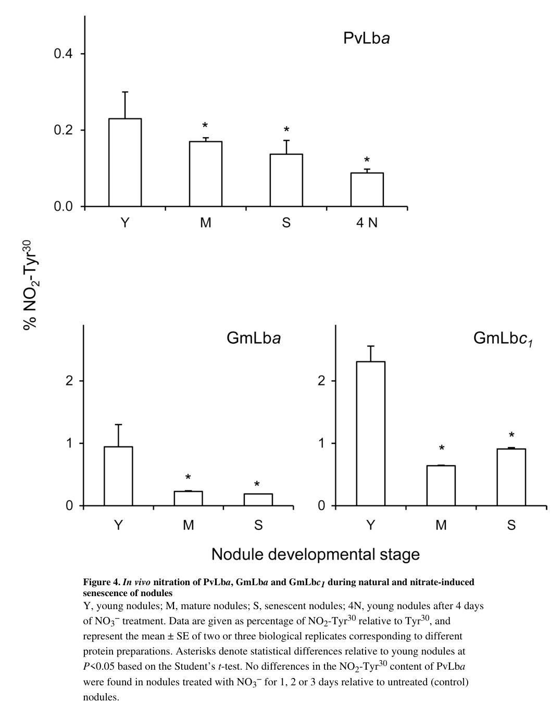

## Question

# Gene Research for Functional Annotation

## ⚠️ CRITICAL: Gene/Protein Identification Context

**BEFORE YOU BEGIN RESEARCH:** You MUST verify you are researching the CORRECT gene/protein. Gene symbols can be ambiguous, especially for less well-characterized genes from non-model organisms.

### Target Gene/Protein Identity (from UniProt):
- **UniProt Accession:** P02234
- **Protein Description:** RecName: Full=Leghemoglobin alpha {ECO:0000303|PubMed:809270}; Short=Leghemoglobin A {ECO:0000303|PubMed:809270}; Short=PvLba {ECO:0000303|PubMed:25603991};
- **Gene Information:** Name=LBA {ECO:0000303|PubMed:25603991}; ORFNames=PHAVU_007G141900g {ECO:0000312|EMBL:ESW16259.1}, PHAVU_007G142500g {ECO:0000312|EMBL:ESW16267.1}, PHAVU_007G142600g {ECO:0000312|EMBL:ESW16268.1};
- **Organism (full):** Phaseolus vulgaris (Kidney bean) (French bean).
- **Protein Family:** Belongs to the plant globin family. .
- **Key Domains:** Globin. (IPR000971); Globin-like_sf. (IPR009050); Globin/Proto. (IPR012292); Leghaemoglobin-like. (IPR001032); Leghaemoglobin_Fe_BS. (IPR019824)

### MANDATORY VERIFICATION STEPS:

1. **Check if the gene symbol "LBA" matches the protein description above**
2. **Verify the organism is correct:** Phaseolus vulgaris (Kidney bean) (French bean).
3. **Check if protein family/domains align with what you find in literature**
4. **If you find literature for a DIFFERENT gene with the same or similar symbol, STOP**

### If Gene Symbol is Ambiguous or You Cannot Find Relevant Literature:

**DO NOT PROCEED WITH RESEARCH ON A DIFFERENT GENE.** Instead:
- State clearly: "The gene symbol 'LBA' is ambiguous or literature is limited for this specific protein"
- Explain what you found (e.g., "Found extensive literature on a different gene with the same symbol in a different organism")
- Describe the protein based ONLY on the UniProt information provided above
- Suggest that the protein function can be inferred from domain/family information

### Research Target:

Please provide a comprehensive research report on the gene **LBA** (gene ID: LBA, UniProt: P02234) in PHAVU.

The research report should be a detailed narrative explaining the function, biological processes, and localization of the gene product. Citations should be given for all claims.

You should prioritize authoritative reviews and primary scientific literature when conducting research. You can supplement
this with annotations you find in gene/protein databases, but these can be outdated or inaccurate.

We are specifically interested in the primary function of the gene - for enzymes, what reaction is catalyzed, and what is the substrate specificity? For transporters, what is the substrate? For structural proteins or adapters, what is the broader structural role? For signaling molecules, what is the role in the pathway.

We are interested in where in or outside the cell the gene product carries out its function.

We are also interested in the signaling or biochemical pathways in which the gene functions. We are less interested in broad pleiotropic effects, except where these elucidate the precise role.

Include evidence where possible. We are interested in both experimental evidence as well as inference from structure, evolution, or bioinformatic analysis. Precise studies should be prioritized over high-throughput, where available.

## Output

Question: You are an expert researcher providing comprehensive, well-cited information.

Provide detailed information focusing on:
1. Key concepts and definitions with current understanding
2. Recent developments and latest research (prioritize 2023-2024 sources)
3. Current applications and real-world implementations
4. Expert opinions and analysis from authoritative sources
5. Relevant statistics and data from recent studies

Format as a comprehensive research report with proper citations. Include URLs and publication dates where available.
Always prioritize recent, authoritative sources and provide specific citations for all major claims.

# Gene Research for Functional Annotation

## ⚠️ CRITICAL: Gene/Protein Identification Context

**BEFORE YOU BEGIN RESEARCH:** You MUST verify you are researching the CORRECT gene/protein. Gene symbols can be ambiguous, especially for less well-characterized genes from non-model organisms.

### Target Gene/Protein Identity (from UniProt):
- **UniProt Accession:** P02234
- **Protein Description:** RecName: Full=Leghemoglobin alpha {ECO:0000303|PubMed:809270}; Short=Leghemoglobin A {ECO:0000303|PubMed:809270}; Short=PvLba {ECO:0000303|PubMed:25603991};
- **Gene Information:** Name=LBA {ECO:0000303|PubMed:25603991}; ORFNames=PHAVU_007G141900g {ECO:0000312|EMBL:ESW16259.1}, PHAVU_007G142500g {ECO:0000312|EMBL:ESW16267.1}, PHAVU_007G142600g {ECO:0000312|EMBL:ESW16268.1};
- **Organism (full):** Phaseolus vulgaris (Kidney bean) (French bean).
- **Protein Family:** Belongs to the plant globin family. .
- **Key Domains:** Globin. (IPR000971); Globin-like_sf. (IPR009050); Globin/Proto. (IPR012292); Leghaemoglobin-like. (IPR001032); Leghaemoglobin_Fe_BS. (IPR019824)

### MANDATORY VERIFICATION STEPS:

1. **Check if the gene symbol "LBA" matches the protein description above**
2. **Verify the organism is correct:** Phaseolus vulgaris (Kidney bean) (French bean).
3. **Check if protein family/domains align with what you find in literature**
4. **If you find literature for a DIFFERENT gene with the same or similar symbol, STOP**

### If Gene Symbol is Ambiguous or You Cannot Find Relevant Literature:

**DO NOT PROCEED WITH RESEARCH ON A DIFFERENT GENE.** Instead:
- State clearly: "The gene symbol 'LBA' is ambiguous or literature is limited for this specific protein"
- Explain what you found (e.g., "Found extensive literature on a different gene with the same symbol in a different organism")
- Describe the protein based ONLY on the UniProt information provided above
- Suggest that the protein function can be inferred from domain/family information

### Research Target:

Please provide a comprehensive research report on the gene **LBA** (gene ID: LBA, UniProt: P02234) in PHAVU.

The research report should be a detailed narrative explaining the function, biological processes, and localization of the gene product. Citations should be given for all claims.

You should prioritize authoritative reviews and primary scientific literature when conducting research. You can supplement
this with annotations you find in gene/protein databases, but these can be outdated or inaccurate.

We are specifically interested in the primary function of the gene - for enzymes, what reaction is catalyzed, and what is the substrate specificity? For transporters, what is the substrate? For structural proteins or adapters, what is the broader structural role? For signaling molecules, what is the role in the pathway.

We are interested in where in or outside the cell the gene product carries out its function.

We are also interested in the signaling or biochemical pathways in which the gene functions. We are less interested in broad pleiotropic effects, except where these elucidate the precise role.

Include evidence where possible. We are interested in both experimental evidence as well as inference from structure, evolution, or bioinformatic analysis. Precise studies should be prioritized over high-throughput, where available.

## Research Report: Functional Annotation of **LBA** (Leghemoglobin A; **UniProt P02234**) in *Phaseolus vulgaris*

### 0) Target verification (critical disambiguation)
The symbol **LBA** is ambiguous across biology, but the research summarized here is restricted to the UniProt-defined target: **UniProt P02234**, described as **leghemoglobin alpha / Leghemoglobin A (PvLba)** from **common bean (*Phaseolus vulgaris*)** and belonging to the **plant globin (leghemoglobin-like) family**. A Phaseolus-specific primary study explicitly refers to “**bean Lba (PvLba)**” in functional bean nodules and measures its in vivo post-translational modification, supporting that the literature discussed here is on the correct protein identity (PvLba/leghemoglobin A), not an unrelated “LBA” in other taxa. (sainz2015leghemoglobinisnitrated pages 4-6)

---

### 1) Key concepts, definitions, and current understanding

#### 1.1 What is leghemoglobin (Lb) and what does PvLba do?
**Leghemoglobins (Lbs)** are **heme-containing globins** that accumulate to very high levels in legume root nodules and are central to the physiology of symbiotic nitrogen fixation. In functional nodules, Lb is described as an abundant hemeprotein (reported in the **millimolar range**) whose **essential biochemical function is oxygen (O₂) transport/delivery** to the symbiosome/respiring nodule tissues while maintaining **low free O₂** compatible with oxygen-labile nitrogenase. (sainz2015leghemoglobinisnitrated pages 1-3)

In *P. vulgaris* nodules specifically, **PvLba** is treated as the major bean leghemoglobin species in a Phaseolus-focused biochemical study, consistent with UniProt P02234 being a nodule hemoglobin. (sainz2015leghemoglobinisnitrated pages 1-3, sainz2015leghemoglobinisnitrated pages 4-6)

#### 1.2 Biochemical mechanism: heme iron state, ligand binding, and nodule microoxia
A defining mechanistic point is that **only ferrous (Fe²⁺) leghemoglobin binds O₂**, so maintenance of the reduced state is integral to function. (sainz2015leghemoglobinisnitrated pages 1-3)

Recent legume work synthesizes the physiological framing: Lb maintains a microoxic environment necessary for nitrogenase while still enabling respiration; free O₂ in infected nodule tissues has been described at **nanomolar levels (<50 nM)** in modern summaries of nodule physiology. (lamoureux2024theeffectof pages 26-29)

#### 1.3 Beyond oxygen: roles in reactive nitrogen/oxygen chemistry (NO/ROS)
A current consensus view (supported by both Phaseolus primary work and recent legume genetics) is that Lbs are not only O₂ buffers but also intersect strongly with **reactive nitrogen species (RNS)** and **reactive oxygen species (ROS)**:

* **NO binding:** ferrous Lb binds nitric oxide (•NO) avidly to form **LbNO**, detectable in intact nodules. (sainz2015leghemoglobinisnitrated pages 1-3)
* **Redox chemistry:** ferrous/ferric/ferryl Lb can react with RNS; Lb can participate in reactions that detoxify reactive species (e.g., peroxynitrite-derived chemistry). (sainz2015leghemoglobinisnitrated pages 1-3)
* **NO dioxygenase-like activity in nodules (conserved across legumes):** recent experimental work in *Lotus japonicus* highlights that hemoglobins (including Lbs) can convert **NO to nitrate** in vitro via NO dioxygenase activity, and that nodules lacking Lbs accumulate NO and ROS (nitro-oxidative stress). While this is not Phaseolus-specific, it is mechanistically relevant because Lb structure/function is strongly conserved across legumes. (minguillon2024dynamicsofhemoglobins pages 13-15, minguillon2024dynamicsofhemoglobins pages 1-2)

---

### 2) Experimental evidence directly relevant to **Phaseolus vulgaris PvLba (UniProt P02234)**

#### 2.1 In vivo post-translational modification: nitration of PvLba in active nodules
A key Phaseolus-specific primary study demonstrated that **PvLba is nitrated in functional bean nodules** at a tyrosine residue **within the heme cavity**, with **Tyr30** in the distal heme pocket being the predominant nitration site used for quantification. (sainz2015leghemoglobinisnitrated pages 4-6, sainz2015leghemoglobinisnitrated pages 1-3)

**Quantitative in vivo observation:** in **young bean nodules**, the fraction of PvLba nitrated at Tyr30 was approximately **0.23%**, and nitration **decreased in senescent nodules** and after **nitrate treatment**; this is shown in the paper’s quantification figure. (sainz2015leghemoglobinisnitrated media 99e0ea56)

**Mechanistic in vitro support (physiology-linked conditions):** PvLba nitration required **nitrite + hydrogen peroxide** (H₂O₂), and was inhibited by iron chelation or scavengers of nitrating radicals, supporting a **nitrite/peroxide-dependent** mechanism coupled to heme redox chemistry. The study used conditions described as physiologically relevant (e.g., ferric Lb ~10 µM; H₂O₂ 20–100 µM; nitrite ~100 µM) to generate substantial nitration in vitro, whereas omission of H₂O₂ prevented nitration. (sainz2015leghemoglobinisnitrated pages 4-6)

**Functional interpretation (author analysis):** the authors suggest Lb can act as a sink for toxic reactive nitrogen/oxygen species (e.g., peroxynitrite-related chemistry), tying a Phaseolus leghemoglobin directly to nodule nitro-oxidative chemistry beyond oxygen transport. (sainz2015leghemoglobinisnitrated pages 1-3)

---

### 3) Recent developments (prioritizing 2023–2024)

#### 3.1 2024: gene-specific regulation and mutant evidence for redox stress in nodules (model legume)
A 2024 *Journal of Experimental Botany* study in *Lotus japonicus* systematically quantified regulation of nodule hemoglobins and used **CRISPR mutants lacking Lbs** plus transcription-factor mutants. Major findings relevant to functional annotation of PvLba by homology/conservation include:

* **Nitrate regulation:** Lb (and class 2 phytoglobin) expression was **suppressed by nitrate**; nitrate treatments were **0, 0.5, 5, 10 mM KNO₃ for 2 days**, and nitrate-responsive promoter elements were identified. (minguillon2024dynamicsofhemoglobins pages 1-2, minguillon2024dynamicsofhemoglobins pages 13-15)
* **Physiological consequence of Lb loss:** Lb-deficient nodules showed **NO and ROS accumulation** and altered antioxidants/senescence markers—evidence that Lbs help prevent **nitro-oxidative stress** during nodule function. (minguillon2024dynamicsofhemoglobins pages 1-2, minguillon2024dynamicsofhemoglobins pages 13-15)

Although these experiments are not in *P. vulgaris*, they represent authoritative, modern functional genetics supporting a conserved role of Lbs (including PvLba) in balancing O₂ supply with redox/NO constraints in nodules. (minguillon2024dynamicsofhemoglobins pages 1-2)

#### 3.2 2024: nodule defense–senescence framework and leghemoglobin as a functional marker
A 2024 review in *Plant Communications* emphasizes:

* Lb is a key controller of the low-O₂ environment required for nitrogenase.
* Lb is a **marker of functional (pink) nodules**, and **oxidation of Lb** accompanies senescence (greenish coloration). (berrabah2024defenseandsenescence pages 1-2)

This consolidates expert-level interpretation that Lb status is tightly linked to both **symbiotic performance** and **nodule lifespan/turnover**. (berrabah2024defenseandsenescence pages 1-2)

#### 3.3 2024: transcriptomics linking oxygen-binding genes to functional nodules
A 2024 *Frontiers in Plant Science* transcriptome/anatomy study in soybean–rhizobium combinations reports enrichment and higher expression of **oxygen-binding genes (including oxygen-binding proteins such as leghemoglobin)** in conditions associated with effective/fully developed nodules, consistent with Lb-mediated microoxia being a central determinant of symbiotic effectiveness. (zadegan2024differentialsymbioticcompatibilities pages 11-12)

---

### 4) Functional annotation: biological processes, pathways, and localization

#### 4.1 Biological process and pathway context
Based on Phaseolus-specific biochemistry and cross-legume consensus:

* **Primary process:** symbiotic nitrogen fixation requires high respiration yet oxygen-sensitive nitrogenase; PvLba supports this by **delivering O₂ at low free concentrations** (oxygen buffering/transport) to infected nodule cells and symbiosomes. (sainz2015leghemoglobinisnitrated pages 1-3, lamoureux2024theeffectof pages 26-29)
* **Redox/NO homeostasis:** PvLba participates in nodule reactive chemistry—binding NO (LbNO), reacting with RNS/ROS, and undergoing measurable nitration in vivo, consistent with active engagement in nitro-oxidative processes in nodules. (sainz2015leghemoglobinisnitrated pages 1-3, sainz2015leghemoglobinisnitrated pages 4-6, sainz2015leghemoglobinisnitrated media 99e0ea56)

#### 4.2 Subcellular/tissue localization
Within the available evidence, Lb is consistently described as **nodule-localized** and functioning in the infected nodule environment where symbiosomes and nitrogenase activity occur; its function is explicitly tied to delivering O₂ to the symbiosomal membrane and maintaining microoxic conditions. (lamoureux2024theeffectof pages 26-29)

---

### 5) Current applications and real-world implementations (leghemoglobin class)
PvLba itself is a bean nodule protein, but the broader **leghemoglobin protein class** has a major real-world deployment as a **color/flavor heme ingredient in plant-based meat analogues**, enabled by precision fermentation.

#### 5.1 Regulatory implementation: EFSA 2024 opinions (soy leghemoglobin)
EFSA’s 2024 scientific opinion evaluated **soy leghemoglobin** produced in genetically modified *Komagataella phaffii* (LegH Prep) for use as a colouring in meat analogue products and concluded that it **does not raise a safety concern** at proposed use and use levels. (younes2024safetyofsoy pages 4-6, younes2024safetyofsoy pages 1-2)

Key quantitative statistics from EFSA’s exposure/safety evaluation include:

* **Dietary exposure estimates (max use):** mean exposure up to **7.3 mg soy leghemoglobin/kg bw/day** in toddlers/children; 95th percentile up to **32.9 mg/kg bw/day** (toddlers). (younes2024safetyofsoy pages 3-4)
* **Toxicology NOAEL (90-day):** no adverse effects at the highest doses tested; reported NOAEL for soy leghemoglobin component at **2328 mg/kg bw/day (males)** and **2865 mg/kg bw/day (females)** in one EFSA summary. (younes2024safetyofsoy pages 4-6)
* **Proposed maximum use level:** **0.8%** soy leghemoglobin protein in meat analogue products. (casacuberta2024assessmentofsoy pages 12-12)

These regulatory documents provide authoritative, real-world implementation context for leghemoglobin proteins as ingredients, even though they pertain to soybean leghemoglobin rather than PvLba from bean. (younes2024safetyofsoy pages 3-4, younes2024safetyofsoy pages 4-6)

#### 5.2 Precision fermentation/bioprocessing: 2023–2024 titer improvements
Recent biotechnology literature reports strong progress in recombinant leghemoglobin production:

* **Engineered *Kluyveromyces marxianus* (2024):** intracellular leghemoglobin A (LBA) titer **7.27 g/L** with heme content **66.32 mg/L** in a 5-L fermentor, achieved by remodeling heme metabolism (authors describe this as the highest intracellular expression reported). (tian2024highlevelexpressionof pages 1-2)
* **Engineered *Saccharomyces cerevisiae* (2024):** intracellular titers up to **544.8 mg/L** in a 5-L fermenter; secreted leghemoglobin **88.5 mg/L** after signal peptide/protease engineering. (huang2024efficientsecretoryexpression pages 1-2)
* **Heme biosynthesis optimization by metabolic modeling (2023, *Pichia/K. phaffii*):** growth-coupled modeling suggests heme pathway upregulation (e.g., **HEM1/ALAS** and combinations such as **HEM1/2/3/12**) can increase predicted heme/legH output (e.g., ~**41%** increase for a combined upregulation set; ~**1.5×** for broader changes), and highlights glycine/C1 metabolism as key precursor supply nodes. (pentjuss2023pichiapastorisgrowth—coupled pages 4-5)

---

### 6) Expert opinions / authoritative interpretations (what experts emphasize)
Across recent authoritative sources, the expert framing of Lb biology converges on:

* **O₂ control is the core constraint in nitrogen fixation**, and Lb is the plant protein that enables this “engineering” of a microoxic niche in nodules. (berrabah2024defenseandsenescence pages 1-2, lamoureux2024theeffectof pages 26-29)
* **Redox and signaling integration:** modern genetic and biochemical evidence suggests Lbs sit at the interface of O₂ delivery and nitro-oxidative stress, with Lb loss causing NO/ROS accumulation and with Lb itself being a target/participant in RNS chemistry (e.g., nitration in vivo). (minguillon2024dynamicsofhemoglobins pages 1-2, sainz2015leghemoglobinisnitrated pages 4-6)

---

### 7) Summary functional statement (annotation-ready)
**PvLba (UniProt P02234; gene LBA) is a nodule-localized leghemoglobin that binds O₂ via a heme cofactor (ferrous state) and supports symbiotic nitrogen fixation by buffering and delivering O₂ at very low free concentrations compatible with nitrogenase. PvLba also participates in nodule redox/RNS chemistry: it forms NO-bound complexes and undergoes measurable in vivo tyrosine nitration (primarily Tyr30 in the distal heme pocket) via a nitrite/peroxide-dependent mechanism, linking it to NO/ROS homeostasis in functional nodules.** (sainz2015leghemoglobinisnitrated pages 1-3, sainz2015leghemoglobinisnitrated pages 4-6, sainz2015leghemoglobinisnitrated media 99e0ea56)

---

### Evidence map (structured)
| Functional aspect | Key statements | Evidence type | Quantitative data | Key references with year and DOI URL | PaperQA citation IDs |
|---|---|---|---|---|---|
| O2 transport/buffering | PvLba is a highly abundant nodule hemeprotein whose essential role is O2 transport/delivery to symbiosomes while buffering free O2 to protect nitrogenase. Closely related leghemoglobins in legumes occur at millimolar concentrations and help maintain very low free O2 in infected cells. | Primary; review | Lb abundance in nodules ~1–5 mM; free O2 reported as <50 nM in nodules in recent legume literature. | Sainz et al., 2015, *Plant J.* DOI: https://doi.org/10.1111/tpj.12762; Minguillón et al., 2024, *J Exp Bot* DOI: https://doi.org/10.1093/jxb/erad455 | (sainz2015leghemoglobinisnitrated pages 1-3, minguillon2024dynamicsofhemoglobins pages 1-2, lamoureux2024theeffectof pages 26-29) |
| NO/ROS chemistry | PvLba reacts with reactive nitrogen/oxygen species; ferrous Lb binds NO to form LbNO, and Lbs can convert NO-derived species to nitrate in vitro. Recent mutant data in Lotus indicate that loss of Lbs causes NO and ROS accumulation, supporting a conserved role in nodule redox homeostasis. | Primary; review | In vitro PvLba nitration assays used ~10 µM ferric Lb, 20–100 µM H2O2, and ~100 µM nitrite; nitrate treatments in Lotus study were 0, 0.5, 5, 10 mM KNO3 for 2 d. | Sainz et al., 2015, https://doi.org/10.1111/tpj.12762; Minguillón et al., 2024, https://doi.org/10.1093/jxb/erad455 | (sainz2015leghemoglobinisnitrated pages 4-6, sainz2015leghemoglobinisnitrated pages 1-3, minguillon2024dynamicsofhemoglobins pages 1-2, minguillon2024dynamicsofhemoglobins pages 13-15, minguillon2024dynamicsofhemoglobins pages 16-17) |
| Post-translational modifications | PvLba is nitrated in functional bean nodules, predominantly at Tyr30 in the distal heme pocket, indicating in vivo modification by nitrite/peroxide chemistry. This supports that LBA is an active redox-reactive globin in nodules rather than a passive O2 carrier only. | Primary | Young bean nodules contained ~0.23% nitrated PvLba; in vitro nitration reached ~25–70% under tested oxidant/nitrite conditions; nitration decreased in senescent and nitrate-treated nodules. | Sainz et al., 2015, https://doi.org/10.1111/tpj.12762 | (sainz2015leghemoglobinisnitrated pages 4-6, sainz2015leghemoglobinisnitrated media 99e0ea56) |
| Regulation by nitrate/stress | Recent legume data show Lb genes are strongly down-regulated by nitrate and dark stress, with nitrate-responsive promoter elements implicated. This is relevant to PvLba annotation because leghemoglobin expression is tightly coupled to nodule physiological state and N-fixation activity. | Primary | Nitrate suppressed Lbs after 2 d exposure to 0.5–10 mM KNO3; compensatory regulation between Lb paralogs was observed in Lotus mutants. | Minguillón et al., 2024, https://doi.org/10.1093/jxb/erad455 | (minguillon2024dynamicsofhemoglobins pages 1-2, minguillon2024dynamicsofhemoglobins pages 13-15, minguillon2024dynamicsofhemoglobins pages 16-17, minguillon2024dynamicsofhemoglobins pages 17-18) |
| Role in senescence/defense | Leghemoglobin is a marker of functional pink nodules; oxidation/decrease of Lb accompanies senescence and loss of N-fixation capacity. Reviews and recent studies connect Lb decline with nitro-oxidative stress, defense activation, and senescence-associated changes in antioxidants and proteolysis. | Review; primary | Nodule N2-fixation peak ~4 weeks and lifespan ~10–12 weeks in a recent synthesis; antioxidants in nodules include ascorbate ~1–2 mM and glutathione ~0.5–1 mM; APX ~0.9% of soluble protein. | Berrabah et al., 2024, *Plant Commun.* DOI: https://doi.org/10.1016/j.xplc.2024.100888; Minguillón et al., 2024, https://doi.org/10.1093/jxb/erad455 | (berrabah2024defenseandsenescence pages 1-2, lamoureux2024theeffectof pages 26-29, minguillon2024dynamicsofhemoglobins pages 13-15, lamoureux2024theeffectof pages 29-32) |
| Applications in food/fermentation | Although not specific to PvLba from bean, closely related leghemoglobins are used as heme/flavor-color ingredients in plant-based meat and are being optimized by precision fermentation in yeasts. Recent biotech studies report substantially improved recombinant production titers. | Biotech; review | K. marxianus intracellular LBA reached 7.27 g/L in 5 L fermentor with heme content 66.32 mg/L; S. cerevisiae intracellular LegH reached 544.8 mg/L and secreted LegH 88.5 mg/L; another K. phaffii process reported highest biomass density 121.80 gDCW/L and LegH yield 0.513 mg/gDCW. | Tian et al., 2024, *Front Bioeng Biotechnol.* DOI: https://doi.org/10.3389/fbioe.2023.1329016; Huang et al., 2024, *Fermentation* DOI: https://doi.org/10.3390/fermentation10030146; Suleiko et al., 2024, *Fermentation* DOI: https://doi.org/10.3390/fermentation10010055 | (tian2024highlevelexpressionof pages 1-2, huang2024efficientsecretoryexpression pages 1-2) |
| Safety/exposure data | Regulatory assessments of soy leghemoglobin produced in GM yeast concluded no safety concern at proposed use levels in meat analogues, though these data apply to soy LegH rather than bean PvLba directly. The evidence is still useful for real-world implementation of the leghemoglobin protein class. | Regulatory | Proposed maximum use level 0.8% soy leghemoglobin protein in meat analogues; mean dietary exposure up to 7.3 mg/kg bw/day and 95th percentile up to 32.9 mg/kg bw/day; NOAEL in 90-day study at highest tested doses corresponded to 2328 mg/kg bw/day (males) and 2865 mg/kg bw/day (females) soy leghemoglobin. | Younes et al., 2024, *EFSA J.* DOI: https://doi.org/10.2903/j.efsa.2024.8822; Casacuberta et al., 2024, *EFSA J.* DOI: https://doi.org/10.2903/j.efsa.2024.9060 | (younes2024safetyofsoy pages 3-4, younes2024safetyofsoy pages 4-6, casacuberta2024assessmentofsoy pages 10-11, younes2024safetyofsoy pages 1-2, casacuberta2024assessmentofsoy pages 12-12) |

*Table: This table summarizes the functional annotation of Phaseolus vulgaris leghemoglobin A (PvLba; UniProt P02234) using direct bean evidence where available and closely related leghemoglobin evidence for conserved functions, regulation, applications, and safety context.*

---

### Key sources (URLs and dates)
* Sainz M. et al. **2015-03**. *The Plant Journal*. “Leghemoglobin is nitrated in functional legume nodules…” https://doi.org/10.1111/tpj.12762 (sainz2015leghemoglobinisnitrated pages 4-6, sainz2015leghemoglobinisnitrated pages 1-3, sainz2015leghemoglobinisnitrated media 99e0ea56)
* Minguillón S. et al. **2024-11**. *Journal of Experimental Botany*. “Dynamics of hemoglobins during nodule development…” https://doi.org/10.1093/jxb/erad455 (minguillon2024dynamicsofhemoglobins pages 1-2, minguillon2024dynamicsofhemoglobins pages 13-15)
* Berrabah F. et al. **2024-04**. *Plant Communications*. “Defense and senescence interplay in legume nodules” https://doi.org/10.1016/j.xplc.2024.100888 (berrabah2024defenseandsenescence pages 1-2)
* Younes M. et al. **2024-06**. *EFSA Journal*. “Safety of soy leghemoglobin… as a food additive” https://doi.org/10.2903/j.efsa.2024.8822 (younes2024safetyofsoy pages 3-4, younes2024safetyofsoy pages 4-6)
* Casacuberta J. et al. **2024-11**. *EFSA Journal*. “Assessment of soy leghemoglobin produced from GM *K. phaffii*…” https://doi.org/10.2903/j.efsa.2024.9060 (casacuberta2024assessmentofsoy pages 10-11, casacuberta2024assessmentofsoy pages 12-12)
* Huang Y. et al. **2024-03**. *Fermentation*. “Efficient secretory expression of Leghemoglobin in *S. cerevisiae*” https://doi.org/10.3390/fermentation10030146 (huang2024efficientsecretoryexpression pages 1-2)
* Tian T. et al. **2024-01**. *Frontiers in Bioengineering and Biotechnology*. “High-level expression of leghemoglobin in *K. marxianus*…” https://doi.org/10.3389/fbioe.2023.1329016 (tian2024highlevelexpressionof pages 1-2)
* Pentjuss A. et al. **2023-09**. *Scientific Reports*. “Pichia pastoris growth—coupled heme biosynthesis…” https://doi.org/10.1038/s41598-023-42865-w (pentjuss2023pichiapastorisgrowth—coupled pages 4-5, pentjuss2023pichiapastorisgrowth—coupled pages 1-2)
* Zadegan S.B. et al. **2024-09**. *Frontiers in Plant Science*. “Differential symbiotic compatibilities…” https://doi.org/10.3389/fpls.2024.1435632 (zadegan2024differentialsymbioticcompatibilities pages 11-12)

References

1. (sainz2015leghemoglobinisnitrated pages 4-6): Martha Sainz, Laura Calvo‐Begueria, Carmen Pérez‐Rontomé, Stefanie Wienkoop, Joaquín Abián, Christiana Staudinger, Silvina Bartesaghi, Rafael Radi, and Manuel Becana. Leghemoglobin is nitrated in functional legume nodules in a tyrosine residue within the heme cavity by a nitrite/peroxide-dependent mechanism. The Plant journal : for cell and molecular biology, 81 5:723-35, Mar 2015. URL: https://doi.org/10.1111/tpj.12762, doi:10.1111/tpj.12762. This article has 80 citations.

2. (sainz2015leghemoglobinisnitrated pages 1-3): Martha Sainz, Laura Calvo‐Begueria, Carmen Pérez‐Rontomé, Stefanie Wienkoop, Joaquín Abián, Christiana Staudinger, Silvina Bartesaghi, Rafael Radi, and Manuel Becana. Leghemoglobin is nitrated in functional legume nodules in a tyrosine residue within the heme cavity by a nitrite/peroxide-dependent mechanism. The Plant journal : for cell and molecular biology, 81 5:723-35, Mar 2015. URL: https://doi.org/10.1111/tpj.12762, doi:10.1111/tpj.12762. This article has 80 citations.

3. (lamoureux2024theeffectof pages 26-29): KE Lamoureux. The effect of copper-induced oxidative stress on symbiosis between model legume lotus japonicus and mesorhizobium loti. Unknown journal, 2024.

4. (minguillon2024dynamicsofhemoglobins pages 13-15): Samuel Minguillón, Ángela Román, Carmen Pérez-Rontomé, Longlong Wang, Ping Xu, Jeremy D Murray, Deqiang Duanmu, Maria C Rubio, and Manuel Becana. Dynamics of hemoglobins during nodule development, nitrate response, and dark stress in lotus japonicus. Journal of Experimental Botany, 75:1547-1564, Nov 2024. URL: https://doi.org/10.1093/jxb/erad455, doi:10.1093/jxb/erad455. This article has 12 citations and is from a domain leading peer-reviewed journal.

5. (minguillon2024dynamicsofhemoglobins pages 1-2): Samuel Minguillón, Ángela Román, Carmen Pérez-Rontomé, Longlong Wang, Ping Xu, Jeremy D Murray, Deqiang Duanmu, Maria C Rubio, and Manuel Becana. Dynamics of hemoglobins during nodule development, nitrate response, and dark stress in lotus japonicus. Journal of Experimental Botany, 75:1547-1564, Nov 2024. URL: https://doi.org/10.1093/jxb/erad455, doi:10.1093/jxb/erad455. This article has 12 citations and is from a domain leading peer-reviewed journal.

6. (sainz2015leghemoglobinisnitrated media 99e0ea56): Martha Sainz, Laura Calvo‐Begueria, Carmen Pérez‐Rontomé, Stefanie Wienkoop, Joaquín Abián, Christiana Staudinger, Silvina Bartesaghi, Rafael Radi, and Manuel Becana. Leghemoglobin is nitrated in functional legume nodules in a tyrosine residue within the heme cavity by a nitrite/peroxide-dependent mechanism. The Plant journal : for cell and molecular biology, 81 5:723-35, Mar 2015. URL: https://doi.org/10.1111/tpj.12762, doi:10.1111/tpj.12762. This article has 80 citations.

7. (berrabah2024defenseandsenescence pages 1-2): Fathi Berrabah, Farouk Benaceur, Chaoyan Yin, Dawei Xin, Kévin Magne, Marie Garmier, Véronique Gruber, and Pascal Ratet. Defense and senescence interplay in legume nodules. Plant Communications, 5:100888, Apr 2024. URL: https://doi.org/10.1016/j.xplc.2024.100888, doi:10.1016/j.xplc.2024.100888. This article has 26 citations and is from a peer-reviewed journal.

8. (zadegan2024differentialsymbioticcompatibilities pages 11-12): Sobhan Bahrami Zadegan, Wonseok Kim, Hafiz Muhammad Khalid Abbas, Sunhyung Kim, Hari B. Krishnan, and Tarek Hewezi. Differential symbiotic compatibilities between rhizobium strains and cultivated and wild soybeans revealed by anatomical and transcriptome analyses. Frontiers in Plant Science, Sep 2024. URL: https://doi.org/10.3389/fpls.2024.1435632, doi:10.3389/fpls.2024.1435632. This article has 8 citations.

9. (younes2024safetyofsoy pages 4-6): Maged Younes, Gabriele Aquilina, Gisela Degen, Karl‐Heinz Engel, Paul Fowler, Maria Jose Frutos Fernandez, Peter Fürst, Ursula Gundert‐Remy, Rainer Gürtler, Trine Husøy, Melania Manco, Wim Mennes, Sabina Passamonti, Peter Moldeus, Romina Shah, Ine Waalkens‐Berendsen, Matthew Wright, José Manuel Barat Baviera, David Gott, Lieve Herman, Jean‐Charles Leblanc, Detlef Wölfle, Jaime Aguilera Entrena, Gabriele Gagliardi, Ana Maria Rincon, Laura Ruggeri, Camilla Smeraldi, Alexandra Tard, and Laurence Castle. Safety of soy leghemoglobin from genetically modified komagataella phaffii as a food additive. EFSA Journal, Jun 2024. URL: https://doi.org/10.2903/j.efsa.2024.8822, doi:10.2903/j.efsa.2024.8822. This article has 9 citations and is from a peer-reviewed journal.

10. (younes2024safetyofsoy pages 1-2): Maged Younes, Gabriele Aquilina, Gisela Degen, Karl‐Heinz Engel, Paul Fowler, Maria Jose Frutos Fernandez, Peter Fürst, Ursula Gundert‐Remy, Rainer Gürtler, Trine Husøy, Melania Manco, Wim Mennes, Sabina Passamonti, Peter Moldeus, Romina Shah, Ine Waalkens‐Berendsen, Matthew Wright, José Manuel Barat Baviera, David Gott, Lieve Herman, Jean‐Charles Leblanc, Detlef Wölfle, Jaime Aguilera Entrena, Gabriele Gagliardi, Ana Maria Rincon, Laura Ruggeri, Camilla Smeraldi, Alexandra Tard, and Laurence Castle. Safety of soy leghemoglobin from genetically modified komagataella phaffii as a food additive. EFSA Journal, Jun 2024. URL: https://doi.org/10.2903/j.efsa.2024.8822, doi:10.2903/j.efsa.2024.8822. This article has 9 citations and is from a peer-reviewed journal.

11. (younes2024safetyofsoy pages 3-4): Maged Younes, Gabriele Aquilina, Gisela Degen, Karl‐Heinz Engel, Paul Fowler, Maria Jose Frutos Fernandez, Peter Fürst, Ursula Gundert‐Remy, Rainer Gürtler, Trine Husøy, Melania Manco, Wim Mennes, Sabina Passamonti, Peter Moldeus, Romina Shah, Ine Waalkens‐Berendsen, Matthew Wright, José Manuel Barat Baviera, David Gott, Lieve Herman, Jean‐Charles Leblanc, Detlef Wölfle, Jaime Aguilera Entrena, Gabriele Gagliardi, Ana Maria Rincon, Laura Ruggeri, Camilla Smeraldi, Alexandra Tard, and Laurence Castle. Safety of soy leghemoglobin from genetically modified komagataella phaffii as a food additive. EFSA Journal, Jun 2024. URL: https://doi.org/10.2903/j.efsa.2024.8822, doi:10.2903/j.efsa.2024.8822. This article has 9 citations and is from a peer-reviewed journal.

12. (casacuberta2024assessmentofsoy pages 12-12): Josep Casacuberta, Francisco Barro, Albert Braeuning, Pilar Cubas, Ruud de Maagd, Michelle M. Epstein, Thomas Frenzel, Jean‐Luc Gallois, Frits Koning, Antoine Messéan, F. Javier Moreno, Fabien Nogué, Giovanni Savoini, Alan H. Schulman, Christoph Tebbe, Eve Veromann, Andrea Gennaro, Aina Belen Gil Gonzalez, José Ángel Gómez Ruiz, Tilemachos Goumperis, Dafni Maria Kagkli, Paolo Lenzi, Aleksandra Lewandowska, Pietro Piffanelli, and Reinhilde Schoonjans. Assessment of soy leghemoglobin produced from genetically modified komagataella phaffii, under regulation (ec) no 1829/2003 (application efsa‐gmo‐nl‐2019‐162). EFSA Journal, Nov 2024. URL: https://doi.org/10.2903/j.efsa.2024.9060, doi:10.2903/j.efsa.2024.9060. This article has 4 citations and is from a peer-reviewed journal.

13. (tian2024highlevelexpressionof pages 1-2): Tian Tian, Xinwei Wu, Pingping Wu, Xinyi Lu, Qi Wang, Yifan Lin, Canjie Liu, Jungang Zhou, Yao Yu, and Hong Lu. High-level expression of leghemoglobin in kluyveromyces marxianus by remodeling the heme metabolism pathway. Frontiers in Bioengineering and Biotechnology, Jan 2024. URL: https://doi.org/10.3389/fbioe.2023.1329016, doi:10.3389/fbioe.2023.1329016. This article has 29 citations.

14. (huang2024efficientsecretoryexpression pages 1-2): Yiyun Huang, Jingwen Zhou, Jianghua Li, Guocheng Du, Jian Chen, and Xinrui Zhao. Efficient secretory expression of leghemoglobin in saccharomyces cerevisiae. Fermentation, 10:146, Mar 2024. URL: https://doi.org/10.3390/fermentation10030146, doi:10.3390/fermentation10030146. This article has 9 citations.

15. (pentjuss2023pichiapastorisgrowth—coupled pages 4-5): Agris Pentjuss, Emils Bolmanis, Anastasija Suleiko, Elina Didrihsone, Arturs Suleiko, Konstantins Dubencovs, Janis Liepins, Andris Kazaks, and Juris Vanags. Pichia pastoris growth—coupled heme biosynthesis analysis using metabolic modelling. Scientific Reports, Sep 2023. URL: https://doi.org/10.1038/s41598-023-42865-w, doi:10.1038/s41598-023-42865-w. This article has 12 citations and is from a peer-reviewed journal.

16. (minguillon2024dynamicsofhemoglobins pages 16-17): Samuel Minguillón, Ángela Román, Carmen Pérez-Rontomé, Longlong Wang, Ping Xu, Jeremy D Murray, Deqiang Duanmu, Maria C Rubio, and Manuel Becana. Dynamics of hemoglobins during nodule development, nitrate response, and dark stress in lotus japonicus. Journal of Experimental Botany, 75:1547-1564, Nov 2024. URL: https://doi.org/10.1093/jxb/erad455, doi:10.1093/jxb/erad455. This article has 12 citations and is from a domain leading peer-reviewed journal.

17. (minguillon2024dynamicsofhemoglobins pages 17-18): Samuel Minguillón, Ángela Román, Carmen Pérez-Rontomé, Longlong Wang, Ping Xu, Jeremy D Murray, Deqiang Duanmu, Maria C Rubio, and Manuel Becana. Dynamics of hemoglobins during nodule development, nitrate response, and dark stress in lotus japonicus. Journal of Experimental Botany, 75:1547-1564, Nov 2024. URL: https://doi.org/10.1093/jxb/erad455, doi:10.1093/jxb/erad455. This article has 12 citations and is from a domain leading peer-reviewed journal.

18. (lamoureux2024theeffectof pages 29-32): KE Lamoureux. The effect of copper-induced oxidative stress on symbiosis between model legume lotus japonicus and mesorhizobium loti. Unknown journal, 2024.

19. (casacuberta2024assessmentofsoy pages 10-11): Josep Casacuberta, Francisco Barro, Albert Braeuning, Pilar Cubas, Ruud de Maagd, Michelle M. Epstein, Thomas Frenzel, Jean‐Luc Gallois, Frits Koning, Antoine Messéan, F. Javier Moreno, Fabien Nogué, Giovanni Savoini, Alan H. Schulman, Christoph Tebbe, Eve Veromann, Andrea Gennaro, Aina Belen Gil Gonzalez, José Ángel Gómez Ruiz, Tilemachos Goumperis, Dafni Maria Kagkli, Paolo Lenzi, Aleksandra Lewandowska, Pietro Piffanelli, and Reinhilde Schoonjans. Assessment of soy leghemoglobin produced from genetically modified komagataella phaffii, under regulation (ec) no 1829/2003 (application efsa‐gmo‐nl‐2019‐162). EFSA Journal, Nov 2024. URL: https://doi.org/10.2903/j.efsa.2024.9060, doi:10.2903/j.efsa.2024.9060. This article has 4 citations and is from a peer-reviewed journal.

20. (pentjuss2023pichiapastorisgrowth—coupled pages 1-2): Agris Pentjuss, Emils Bolmanis, Anastasija Suleiko, Elina Didrihsone, Arturs Suleiko, Konstantins Dubencovs, Janis Liepins, Andris Kazaks, and Juris Vanags. Pichia pastoris growth—coupled heme biosynthesis analysis using metabolic modelling. Scientific Reports, Sep 2023. URL: https://doi.org/10.1038/s41598-023-42865-w, doi:10.1038/s41598-023-42865-w. This article has 12 citations and is from a peer-reviewed journal.

## Artifacts

- [Edison artifact artifact-00](LBA-deep-research-falcon_artifacts/artifact-00.md)

## Citations

1. sainz2015leghemoglobinisnitrated pages 4-6
2. sainz2015leghemoglobinisnitrated pages 1-3
3. lamoureux2024theeffectof pages 26-29
4. minguillon2024dynamicsofhemoglobins pages 1-2
5. berrabah2024defenseandsenescence pages 1-2
6. zadegan2024differentialsymbioticcompatibilities pages 11-12
7. younes2024safetyofsoy pages 3-4
8. younes2024safetyofsoy pages 4-6
9. casacuberta2024assessmentofsoy pages 12-12
10. tian2024highlevelexpressionof pages 1-2
11. huang2024efficientsecretoryexpression pages 1-2
12. minguillon2024dynamicsofhemoglobins pages 13-15
13. younes2024safetyofsoy pages 1-2
14. minguillon2024dynamicsofhemoglobins pages 16-17
15. minguillon2024dynamicsofhemoglobins pages 17-18
16. lamoureux2024theeffectof pages 29-32
17. casacuberta2024assessmentofsoy pages 10-11
18. https://doi.org/10.1111/tpj.12762;
19. https://doi.org/10.1093/jxb/erad455
20. https://doi.org/10.1111/tpj.12762
21. https://doi.org/10.1016/j.xplc.2024.100888;
22. https://doi.org/10.3389/fbioe.2023.1329016;
23. https://doi.org/10.3390/fermentation10030146;
24. https://doi.org/10.3390/fermentation10010055
25. https://doi.org/10.2903/j.efsa.2024.8822;
26. https://doi.org/10.2903/j.efsa.2024.9060
27. https://doi.org/10.1016/j.xplc.2024.100888
28. https://doi.org/10.2903/j.efsa.2024.8822
29. https://doi.org/10.3390/fermentation10030146
30. https://doi.org/10.3389/fbioe.2023.1329016
31. https://doi.org/10.1038/s41598-023-42865-w
32. https://doi.org/10.3389/fpls.2024.1435632
33. https://doi.org/10.1111/tpj.12762,
34. https://doi.org/10.1093/jxb/erad455,
35. https://doi.org/10.1016/j.xplc.2024.100888,
36. https://doi.org/10.3389/fpls.2024.1435632,
37. https://doi.org/10.2903/j.efsa.2024.8822,
38. https://doi.org/10.2903/j.efsa.2024.9060,
39. https://doi.org/10.3389/fbioe.2023.1329016,
40. https://doi.org/10.3390/fermentation10030146,
41. https://doi.org/10.1038/s41598-023-42865-w,