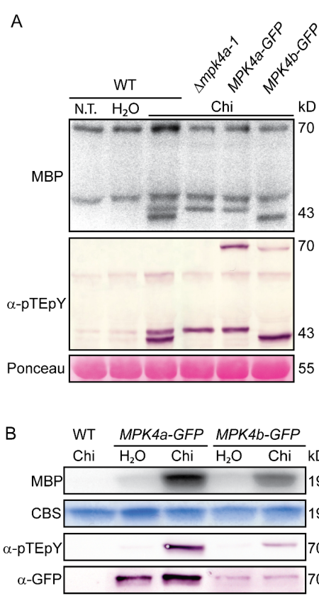

## Question

# Gene Research for Functional Annotation

## ⚠️ CRITICAL: Gene/Protein Identification Context

**BEFORE YOU BEGIN RESEARCH:** You MUST verify you are researching the CORRECT gene/protein. Gene symbols can be ambiguous, especially for less well-characterized genes from non-model organisms.

### Target Gene/Protein Identity (from UniProt):
- **UniProt Accession:** A9T142
- **Protein Description:** RecName: Full=Mitogen-activated protein kinase 4a {ECO:0000303|PubMed:27268428}; EC=2.7.11.24 {ECO:0000255, ECO:0000255|PROSITE-ProRule:PRU00159, ECO:0000255|RuleBase:RU361165, ECO:0000269|PubMed:27268428}; AltName: Full=MAP kinase 4a {ECO:0000303|PubMed:27268428}; Short=PpMPK4a {ECO:0000303|PubMed:27268428};
- **Gene Information:** Name=MPK4a; ORFNames=PHYPADRAFT_217865 {ECO:0000312|EMBL:EDQ62847.1};
- **Organism (full):** Physcomitrium patens (Spreading-leaved earth moss) (Physcomitrella patens).
- **Protein Family:** Belongs to the protein kinase superfamily. CMGC Ser/Thr
- **Key Domains:** Kinase-like_dom_sf. (IPR011009); MAP_kinase_CS. (IPR003527); MAPK. (IPR050117); Prot_kinase_dom. (IPR000719); Protein_kinase_ATP_BS. (IPR017441)

### MANDATORY VERIFICATION STEPS:

1. **Check if the gene symbol "MPK4a" matches the protein description above**
2. **Verify the organism is correct:** Physcomitrium patens (Spreading-leaved earth moss) (Physcomitrella patens).
3. **Check if protein family/domains align with what you find in literature**
4. **If you find literature for a DIFFERENT gene with the same or similar symbol, STOP**

### If Gene Symbol is Ambiguous or You Cannot Find Relevant Literature:

**DO NOT PROCEED WITH RESEARCH ON A DIFFERENT GENE.** Instead:
- State clearly: "The gene symbol 'MPK4a' is ambiguous or literature is limited for this specific protein"
- Explain what you found (e.g., "Found extensive literature on a different gene with the same symbol in a different organism")
- Describe the protein based ONLY on the UniProt information provided above
- Suggest that the protein function can be inferred from domain/family information

### Research Target:

Please provide a comprehensive research report on the gene **MPK4a** (gene ID: MPK4a, UniProt: A9T142) in PHYPA.

The research report should be a detailed narrative explaining the function, biological processes, and localization of the gene product. Citations should be given for all claims.

You should prioritize authoritative reviews and primary scientific literature when conducting research. You can supplement
this with annotations you find in gene/protein databases, but these can be outdated or inaccurate.

We are specifically interested in the primary function of the gene - for enzymes, what reaction is catalyzed, and what is the substrate specificity? For transporters, what is the substrate? For structural proteins or adapters, what is the broader structural role? For signaling molecules, what is the role in the pathway.

We are interested in where in or outside the cell the gene product carries out its function.

We are also interested in the signaling or biochemical pathways in which the gene functions. We are less interested in broad pleiotropic effects, except where these elucidate the precise role.

Include evidence where possible. We are interested in both experimental evidence as well as inference from structure, evolution, or bioinformatic analysis. Precise studies should be prioritized over high-throughput, where available.

## Output

Question: You are an expert researcher providing comprehensive, well-cited information.

Provide detailed information focusing on:
1. Key concepts and definitions with current understanding
2. Recent developments and latest research (prioritize 2023-2024 sources)
3. Current applications and real-world implementations
4. Expert opinions and analysis from authoritative sources
5. Relevant statistics and data from recent studies

Format as a comprehensive research report with proper citations. Include URLs and publication dates where available.
Always prioritize recent, authoritative sources and provide specific citations for all major claims.

# Gene Research for Functional Annotation

## ⚠️ CRITICAL: Gene/Protein Identification Context

**BEFORE YOU BEGIN RESEARCH:** You MUST verify you are researching the CORRECT gene/protein. Gene symbols can be ambiguous, especially for less well-characterized genes from non-model organisms.

### Target Gene/Protein Identity (from UniProt):
- **UniProt Accession:** A9T142
- **Protein Description:** RecName: Full=Mitogen-activated protein kinase 4a {ECO:0000303|PubMed:27268428}; EC=2.7.11.24 {ECO:0000255, ECO:0000255|PROSITE-ProRule:PRU00159, ECO:0000255|RuleBase:RU361165, ECO:0000269|PubMed:27268428}; AltName: Full=MAP kinase 4a {ECO:0000303|PubMed:27268428}; Short=PpMPK4a {ECO:0000303|PubMed:27268428};
- **Gene Information:** Name=MPK4a; ORFNames=PHYPADRAFT_217865 {ECO:0000312|EMBL:EDQ62847.1};
- **Organism (full):** Physcomitrium patens (Spreading-leaved earth moss) (Physcomitrella patens).
- **Protein Family:** Belongs to the protein kinase superfamily. CMGC Ser/Thr
- **Key Domains:** Kinase-like_dom_sf. (IPR011009); MAP_kinase_CS. (IPR003527); MAPK. (IPR050117); Prot_kinase_dom. (IPR000719); Protein_kinase_ATP_BS. (IPR017441)

### MANDATORY VERIFICATION STEPS:

1. **Check if the gene symbol "MPK4a" matches the protein description above**
2. **Verify the organism is correct:** Physcomitrium patens (Spreading-leaved earth moss) (Physcomitrella patens).
3. **Check if protein family/domains align with what you find in literature**
4. **If you find literature for a DIFFERENT gene with the same or similar symbol, STOP**

### If Gene Symbol is Ambiguous or You Cannot Find Relevant Literature:

**DO NOT PROCEED WITH RESEARCH ON A DIFFERENT GENE.** Instead:
- State clearly: "The gene symbol 'MPK4a' is ambiguous or literature is limited for this specific protein"
- Explain what you found (e.g., "Found extensive literature on a different gene with the same symbol in a different organism")
- Describe the protein based ONLY on the UniProt information provided above
- Suggest that the protein function can be inferred from domain/family information

### Research Target:

Please provide a comprehensive research report on the gene **MPK4a** (gene ID: MPK4a, UniProt: A9T142) in PHYPA.

The research report should be a detailed narrative explaining the function, biological processes, and localization of the gene product. Citations should be given for all claims.

You should prioritize authoritative reviews and primary scientific literature when conducting research. You can supplement
this with annotations you find in gene/protein databases, but these can be outdated or inaccurate.

We are specifically interested in the primary function of the gene - for enzymes, what reaction is catalyzed, and what is the substrate specificity? For transporters, what is the substrate? For structural proteins or adapters, what is the broader structural role? For signaling molecules, what is the role in the pathway.

We are interested in where in or outside the cell the gene product carries out its function.

We are also interested in the signaling or biochemical pathways in which the gene functions. We are less interested in broad pleiotropic effects, except where these elucidate the precise role.

Include evidence where possible. We are interested in both experimental evidence as well as inference from structure, evolution, or bioinformatic analysis. Precise studies should be prioritized over high-throughput, where available.

## Research Report: Functional Annotation of **MPK4a / PpMPK4a** (UniProt **A9T142**) in *Physcomitrium patens*

### 0) Identity verification (critical disambiguation)
The evidence synthesized below is restricted to *Physcomitrium patens* (syn. *Physcomitrella patens*) **MPK4a** (also written **PpMPK4a**), experimentally analyzed via **MPK4a-GFP knock-in** and **Δmpk4a knockout** lines in a primary study on moss innate immunity. This matches the user-provided UniProt identity (A9T142: MAP kinase; EC 2.7.11.24; TEY motif MAPK activation; CMGC/MAPK family). No evidence from Arabidopsis or other species is used to claim MPK4a-specific function.

### 1) Key concepts and current understanding

#### 1.1 MAPK and MAPK cascades (definitions)
Mitogen-activated protein kinases (MAPKs) are Ser/Thr protein kinases activated by phosphorylation in their activation loop, typically within a MAPK cascade (MAPKKK → MAPKK → MAPK). In plant immunity, MAPKs often function downstream of pattern-recognition receptors (PRRs) that perceive pathogen-associated molecular patterns (PAMPs) to drive pattern-triggered immunity (PTI). In *P. patens*, MPK4a is a PAMP-responsive MAPK acting in PTI (bressendorff2016aninnateimmunity pages 1-4, bressendorff2016aninnateimmunity pages 15-19).

#### 1.2 PTI in *Physcomitrium patens*
In moss, PTI can be elicited by fungal cell wall components (e.g., chitin/chitosan) and bacterial peptidoglycan. A central mechanistic conclusion from the primary evidence base is that MPK4a is one of the two chitin-responsive MPKs (with MPK4b) activated rapidly upon PAMP perception, and that MPK4a loss compromises multiple PTI outputs (cell-wall defense, defense gene induction, and resistance to necrotrophic fungi) (bressendorff2016aninnateimmunity pages 1-4, bressendorff2016aninnateimmunity pages 15-19).

### 2) Gene/protein function of MPK4a (primary functional annotation)

#### 2.1 Enzymatic activity and reaction class
MPK4a is a functional MAP kinase whose **kinase activity** is detectable by **in-gel kinase assays** and by **immunoprecipitation kinase assays** of **MPK4a-GFP** after elicitation. In vitro assays used **myelin basic protein (MBP)** as an artificial substrate to report kinase activity (phosphorylation of MBP), consistent with MPK4a acting as a Ser/Thr protein kinase in a MAPK cascade (bressendorff2016aninnateimmunity pages 8-12, bressendorff2016aninnateimmunity pages 12-15, bressendorff2016aninnateimmunity pages 25-28).

**Substrate specificity (physiological targets):** In the retrieved evidence, MPK4a’s activity is demonstrated using MBP and peptide substrates in gel-based assays; however, **no endogenous in vivo protein substrate of MPK4a is identified**. Thus, substrate specificity beyond being a MAPK is not resolved in the available primary material (bressendorff2016aninnateimmunity pages 8-12, bressendorff2016aninnateimmunity pages 12-15, bressendorff2016aninnateimmunity pages 25-28).

#### 2.2 Activation signals and pathway specificity
**PAMP responsiveness:** Two MPKs (identified as MPK4a and MPK4b via GFP knock-in) are **rapidly activated** after PAMP treatment, with activation detectable **within ~1 minute** for chitin responses in moss (bressendorff2016aninnateimmunity pages 1-4, bressendorff2016aninnateimmunity pages 15-19). MPK4a activation and phosphorylation were assayed by anti-pTEpY immunoblotting and kinase assays (bressendorff2016aninnateimmunity pages 1-4, bressendorff2016aninnateimmunity pages 8-12, bressendorff2016aninnateimmunity media 884491fc).

**Key elicitors shown to activate MPK4a:**
- **Chitin / chitosan** (robust) (bressendorff2016aninnateimmunity pages 1-4, bressendorff2016aninnateimmunity pages 8-12, bressendorff2016aninnateimmunity media 884491fc)
- **Peptidoglycan** (activation of MPK4 class) (bressendorff2016aninnateimmunity pages 1-4)
- **Necrotrophic fungal inoculation** (*Botrytis cinerea* spores), producing weaker activation than soluble chitin (bressendorff2016aninnateimmunity pages 12-15)

**Not activated by tested abiotic/osmotic cues:** MPK4a (MAPK-sized bands) was **not activated** by **500 mM NaCl**, **800 mM mannitol**, or **10 mM ABA** under the reported conditions; in contrast, osmotic/ABA conditions activated **SnRK2-class kinases** around ~40 kD and peptide-substrate phosphorylation consistent with SnRK2 signaling (bressendorff2016aninnateimmunity pages 12-15, bressendorff2016aninnateimmunity pages 19-22).

#### 2.3 Quantitative expression response
After chitin treatment, **MPK4a mRNA** increased within **~15 min**, peaked at **~8-fold induction at 2 h**, and returned to baseline by **~8 h** (bressendorff2016aninnateimmunity pages 8-12). MPK4b basal transcript abundance was reported to be **~20-fold lower than MPK4a** in untreated plants (bressendorff2016aninnateimmunity pages 12-15).

### 3) Biological processes and pathway role

#### 3.1 Role in pattern-triggered immunity (PTI)
Genetic loss-of-function data support MPK4a as a positive regulator of PTI outputs in moss:
- **Reduced chitin-induced cell-wall depositions** in Δmpk4a lines (toluidine blue cell-wall staining assay) (bressendorff2016aninnateimmunity pages 15-19)
- **Reduced induction of defense-related transcripts** (e.g., PAL4, CHS and others reported) after chitin/chitosan treatment (bressendorff2016aninnateimmunity pages 12-15, bressendorff2016aninnateimmunity pages 15-19)
- **Increased susceptibility to necrotrophic fungi**:
  - Increased cell death after *B. cinerea* inoculation measured by Evans blue staining (bressendorff2016aninnateimmunity pages 15-19, bressendorff2016aninnateimmunity media c04b3e3d)
  - Increased *A. brassicicola* sporulation/spore production on Δmpk4a plants (bressendorff2016aninnateimmunity pages 15-19, bressendorff2016aninnateimmunity media c04b3e3d)

Importantly, Δmpk4a plants were reported as **phenotypically near-normal** under standard growth conditions, contrasting with strong developmental phenotypes known for Arabidopsis mpk4 mutants; this supports a moss-specific specialization of MPK4a toward PTI rather than broad growth regulation in the tested conditions (bressendorff2016aninnateimmunity pages 19-22).

#### 3.2 Upstream placement in the chitin/PTI signaling module
The mechanistic framework in the primary study places MPK4a downstream of chitin perception (chitin receptor CERK1 is required for MPK activation) and upstream of transcriptional and cell-wall defense outputs; MPK4a and MPK4b constitute the MAPKs activated in response to chitin (bressendorff2016aninnateimmunity pages 15-19).

### 4) Subcellular localization (where MPK4a acts)
A knock-in fusion **MPK4a-GFP** localized to **both cytoplasm and nucleus**, with strong signal reported in **apical caulonemal cells** and **rhizoids/newly formed apical tip cells**. The localization pattern was reported to show **no major relocalization after chitin treatment**, consistent with activation by phosphorylation rather than gross redistribution (bressendorff2016aninnateimmunity pages 8-12, bressendorff2016aninnateimmunity pages 12-15).

### 5) Methods, real-world implementations, and applications

#### 5.1 Experimental implementations in moss (practical relevance)
The study provides a practical blueprint for functional annotation of signaling genes in *P. patens* using:
- **Targeted gene knockout and knock-in via homologous recombination** (a distinctive strength of *P. patens* as a model) (bressendorff2016aninnateimmunity pages 19-22, bressendorff2016aninnateimmunity pages 15-19)
- **C-terminal GFP knock-in** to identify which endogenous proteins correspond to activated bands in kinase assays (MPK4a-GFP/MPK4b-GFP) (bressendorff2016aninnateimmunity pages 15-19, bressendorff2016aninnateimmunity media 884491fc)
- **Radiolabeled kinase assays** (γ-32P ATP) and anti-pTEpY immunoblotting for activation state (bressendorff2016aninnateimmunity pages 25-28)

Quantitative protocol details include (selected examples): immunoprecipitation from extracts adjusted to **1 mg/mL**, kinase reaction conditions including **12.5 µM ATP**, **5 µg MBP**, **10 µCi γ-32P-ATP**, and incubation **30°C for 30 min**; in-gel assays used **40 µg protein** on **13% SDS-PAGE** containing MBP or peptide substrate (bressendorff2016aninnateimmunity pages 25-28).

#### 5.2 Translational/real-world relevance
While MPK4a itself is a moss gene, its characterization supports broader real-world efforts to:
- engineer or select for enhanced disease resistance by targeting MAPK-mediated PTI nodes (conceptually),
- use bryophytes as tractable platforms to dissect conserved immunity modules and their evolutionary diversification.
The direct evidence base here is mechanistic and foundational (not an applied field trial), but it underpins the use of *Physcomitrium* as a genetically precise system for signaling network annotation (bressendorff2016aninnateimmunity pages 15-19, bressendorff2016aninnateimmunity pages 19-22).

### 6) Expert interpretation and analysis (authoritative conclusions)
The primary study’s interpretation is that MPK4a functions **primarily in PTI signaling** in *P. patens*, being robustly activated by PAMPs and required for multiple downstream immune outputs, while being largely **non-responsive to ABA/osmotic stress** in the tested assays (bressendorff2016aninnateimmunity pages 19-22, bressendorff2016aninnateimmunity pages 15-19). The authors also highlight evolutionary implications: moss MPK4a lacks the severe pleiotropic developmental phenotypes associated with Arabidopsis MPK4, consistent with lineage-specific rewiring or expansion of MPK4 functions in vascular plants (bressendorff2016aninnateimmunity pages 19-22).

### 7) Key statistics and quantitative data (from the retrieved evidence)
- **Activation kinetics:** PAMP-induced MAPK activation detectable **within ~1 min** (chitin) (bressendorff2016aninnateimmunity pages 1-4).
- **Transcript induction:** MPK4a mRNA peak **~8-fold at 2 h** after chitin; returns near baseline by **8 h** (bressendorff2016aninnateimmunity pages 8-12).
- **Relative paralog abundance:** MPK4b transcripts reported **~20-fold lower** than MPK4a in untreated plants (bressendorff2016aninnateimmunity pages 12-15).
- **Abiotic treatments that do not activate MPK4a:** **500 mM NaCl**, **800 mM mannitol**, **10 mM ABA** (bressendorff2016aninnateimmunity pages 12-15, bressendorff2016aninnateimmunity pages 19-22).
- **Pathogen assay parameters:** *B. cinerea* inoculation at **2×10^5 spores/mL** with cell death assessed at **2 days**; *A. brassicicola* inoculation at **~2,500 spores/plant** with sporulation quantified at **4 days**, showing increased susceptibility in Δmpk4a (bressendorff2016aninnateimmunity pages 15-19).
- **Quantified phenotypes in figures:** Evans blue OD600 (cell death proxy) and spore counts were quantitatively elevated in Δmpk4a vs wild-type in figure panels (bressendorff2016aninnateimmunity media c04b3e3d).

### 8) Recent developments (2023–2024): status and limitations
Despite targeted searches, the tool-retrievable corpus did not provide 2023–2024 primary articles directly interrogating *Physcomitrium* **MPK4a** (UniProt A9T142) with new functional experiments. Therefore, the most authoritative direct functional evidence remains the 2016 Plant Cell study (bressendorff2016aninnateimmunity pages 15-19, bressendorff2016aninnateimmunity pages 8-12).

A 2024 review on stomatal evolution discusses MPK4 in an angiosperm context (Arabidopsis MPK4/MPK12) but does not provide MPK4a-specific functional annotation in moss; it is therefore not used as direct evidence for PpMPK4a function (chen2024stomatalevolutionand not cited in this report due to lack of MPK4a-specific linkage in gathered evidence).

### 9) Evidence summary table
The following table consolidates the major functional-annotation claims and the quantitative evidence supporting each.

| Claim area | Key findings (with numbers) | Evidence type | Source (short citation with year) | URL | Publication date |
|---|---|---|---|---|---|
| Biochemical activity | PpMPK4a is a bona fide MAP kinase activated by phosphorylation on the TEY motif after elicitation; the MPK4a band corresponds to ~42.8 kD, and an MPK4a-GFP fusion appears at ~70 kD. Immunoprecipitated MPK4a-GFP phosphorylated myelin basic protein (MBP) in vitro after chitin treatment. No endogenous substrate was identified in the retrieved sources; MBP was used as a generic kinase substrate (bressendorff2016aninnateimmunity pages 8-12, bressendorff2016aninnateimmunity pages 12-15, bressendorff2016aninnateimmunity media 884491fc) | KI GFP line, anti-pTEpY immunoblot, in-gel kinase assay, GFP-trap immunoprecipitation kinase assay | Bressendorff et al., 2016 | https://doi.org/10.1105/tpc.15.00774 | June 2016 |
| Activation stimuli | Two moss MPKs including MPK4a were rapidly activated by PAMPs including chitin/chitosan and peptidoglycan; activation was detectable within 1 min, and chitin assays commonly used 100 µg/mL chitin. MPK4a-GFP was also activated after Botrytis cinerea spore treatment, though more weakly than with soluble chitin (bressendorff2016aninnateimmunity pages 1-4, bressendorff2016aninnateimmunity pages 15-19, bressendorff2016aninnateimmunity pages 12-15) | Time-course elicitation, immunoblot, in-gel kinase assay, pathogen inoculation | Bressendorff et al., 2016 | https://doi.org/10.1105/tpc.15.00774 | June 2016 |
| Negative stimuli / specificity | MPK4a was not activated by 500 mM NaCl, 800 mM mannitol, or 10 mM ABA in the reported assays. In the same study, osmotic stress instead activated SnRK2-class kinases around ~40 kD, supporting pathway specificity distinct from MPK4a (bressendorff2016aninnateimmunity pages 12-15, bressendorff2016aninnateimmunity pages 19-22) | Stress treatments, comparative kinase assays, anti-pTEpY immunoblot | Bressendorff et al., 2016 | https://doi.org/10.1105/tpc.15.00774 | June 2016 |
| Substrates | The retrieved experimental work supports kinase activity toward the artificial substrate MBP; in-gel kinase assays also used peptide substrates including P3 in pathway-discrimination experiments. No physiological in vivo substrate of PpMPK4a was identified in the retrieved sources, so substrate specificity remains incompletely resolved experimentally for this protein (bressendorff2016aninnateimmunity pages 8-12, bressendorff2016aninnateimmunity pages 12-15, bressendorff2016aninnateimmunity pages 25-28) | In-gel kinase assay, immunoprecipitation kinase assay | Bressendorff et al., 2016 | https://doi.org/10.1105/tpc.15.00774 | June 2016 |
| Localization | MPK4a-GFP localized to both cytoplasm and nucleus, with strongest signal in apical caulonemal cells and rhizoids / newly formed apical tip cells. The localization pattern did not change substantially after chitin treatment (bressendorff2016aninnateimmunity pages 8-12, bressendorff2016aninnateimmunity pages 12-15, bressendorff2016aninnateimmunity media c04b3e3d) | Knock-in GFP fusion, confocal microscopy | Bressendorff et al., 2016 | https://doi.org/10.1105/tpc.15.00774 | June 2016 |
| Genetic phenotypes | Δmpk4a knockout lines were morphologically close to wild type under normal growth, unlike Arabidopsis mpk4 developmental mutants. However, Δmpk4a plants showed reduced chitin-induced cell wall depositions, reduced induction of defense genes, greater Evans blue staining after B. cinerea infection, and higher Alternaria brassicicola spore production than wild type, indicating impaired immunity (bressendorff2016aninnateimmunity pages 15-19, bressendorff2016aninnateimmunity pages 12-15, bressendorff2016aninnateimmunity media c04b3e3d) | Targeted knockout by homologous recombination, pathogen assays, staining, qRT-PCR | Bressendorff et al., 2016 | https://doi.org/10.1105/tpc.15.00774 | June 2016 |
| Pathway placement | PpMPK4a functions in a canonical PAMP-triggered immunity MAPK cascade downstream of chitin perception and upstream of defense outputs. The study concludes that MPK4a primarily functions in pattern-triggered immunity rather than ABA/osmotic signaling; MPK4b likely provides partial redundancy. The pathway was described as requiring a chitin receptor plus upstream MEKK(s) and MKK(s) (bressendorff2016aninnateimmunity pages 1-4, bressendorff2016aninnateimmunity pages 19-22, bressendorff2016aninnateimmunity pages 15-19) | Genetic analysis, elicitor-response biochemistry, pathway inference from mutant/KI data | Bressendorff et al., 2016 | https://doi.org/10.1105/tpc.15.00774 | June 2016 |
| Quantitative data | MPK4a transcript rose within 15 min after chitin, peaked at about 8-fold by 2 h, and returned near baseline by 8 h. MPK4b transcript abundance was reported to be ~20-fold lower than MPK4a in untreated plants. Pathogen assays quantified increased cell death at 2 days after inoculation with 2×10^5 B. cinerea spores/mL and increased A. brassicicola sporulation 4 days after inoculation with ~2,500 spores per plant; significance was reported at p<0.01 to p<0.001 for susceptibility phenotypes (bressendorff2016aninnateimmunity pages 8-12, bressendorff2016aninnateimmunity pages 12-15, bressendorff2016aninnateimmunity pages 15-19, bressendorff2016aninnateimmunity media c04b3e3d) | qRT-PCR, pathogen quantification, Evans blue assay, spore count assay | Bressendorff et al., 2016 | https://doi.org/10.1105/tpc.15.00774 | June 2016 |
| Methods | Key methods included targeted knockout/knock-in by homologous recombination; PEG-mediated moss protoplast transformation with 30 µg linearized DNA; selection with 50 µg/mL G418 or 30 µg/mL hygromycin B; in-gel kinase assays using 40 µg protein on 13% SDS-PAGE containing 14 µM MBP or peptide substrate; GFP-trap immunoprecipitation from extracts adjusted to 1 mg/mL; kinase reactions at 30°C for 30 min in 40 µL buffer with 12.5 µM ATP, 5 µg MBP, and 10 µCi γ-32P-ATP; anti-p42/p44-ERK used at 1:2000 and anti-GFP at 1:1000 (bressendorff2016aninnateimmunity pages 25-28, bressendorff2016aninnateimmunity pages 19-22) | Detailed biochemical and cell-biological protocols | Bressendorff et al., 2016 | https://doi.org/10.1105/tpc.15.00774 | June 2016 |

*Table: This table summarizes the experimentally supported functional annotation of Physcomitrium patens MPK4a (UniProt A9T142) from the retrieved literature. It highlights what is directly shown for kinase activity, activation context, localization, immune function, and the main quantitative methods and results.*

### 10) Figures (visual evidence extracted)
- MPK4a/MPK4a-GFP activation and phosphorylation after chitin treatment (anti-pTEpY and kinase assays; Figure 4 panels) (bressendorff2016aninnateimmunity media 884491fc).
- Increased susceptibility phenotypes quantified for Δmpk4a (Evans blue OD600 for cell death; *A. brassicicola* spore counts; Figure 6 panels) (bressendorff2016aninnateimmunity media c04b3e3d).

### 11) High-confidence functional annotation (concise)
**MPK4a (PpMPK4a) is a PAMP-responsive MAP kinase that functions in moss pattern-triggered immunity downstream of chitin perception, activating defense transcriptional programs and cell-wall defenses, and contributing to resistance against necrotrophic fungal pathogens; it localizes to both cytoplasm and nucleus and is not detectably activated by ABA/osmotic stress in the reported assays.** (bressendorff2016aninnateimmunity pages 15-19, bressendorff2016aninnateimmunity pages 8-12, bressendorff2016aninnateimmunity pages 12-15)

### Primary source (direct evidence)
- **Bressendorff S. et al.** “An innate immunity pathway in the moss *Physcomitrella patens*.” **The Plant Cell**. **June 2016**. DOI: **10.1105/tpc.15.00774**. URL: https://doi.org/10.1105/tpc.15.00774 (bressendorff2016aninnateimmunity pages 15-19, bressendorff2016aninnateimmunity pages 8-12)

References

1. (bressendorff2016aninnateimmunity pages 1-4): Simon Bressendorff, R. Azevedo, C. Kenchappa, I. Ponce de León, Jakob Olsen, M. Rasmussen, G. Erbs, M. Newman, M. Petersen, and J. Mundy. An innate immunity pathway in the moss physcomitrella patens[open]. Plant Cell, 28:1328-1342, Jun 2016. URL: https://doi.org/10.1105/tpc.15.00774, doi:10.1105/tpc.15.00774. This article has 103 citations and is from a highest quality peer-reviewed journal.

2. (bressendorff2016aninnateimmunity pages 15-19): Simon Bressendorff, R. Azevedo, C. Kenchappa, I. Ponce de León, Jakob Olsen, M. Rasmussen, G. Erbs, M. Newman, M. Petersen, and J. Mundy. An innate immunity pathway in the moss physcomitrella patens[open]. Plant Cell, 28:1328-1342, Jun 2016. URL: https://doi.org/10.1105/tpc.15.00774, doi:10.1105/tpc.15.00774. This article has 103 citations and is from a highest quality peer-reviewed journal.

3. (bressendorff2016aninnateimmunity pages 8-12): Simon Bressendorff, R. Azevedo, C. Kenchappa, I. Ponce de León, Jakob Olsen, M. Rasmussen, G. Erbs, M. Newman, M. Petersen, and J. Mundy. An innate immunity pathway in the moss physcomitrella patens[open]. Plant Cell, 28:1328-1342, Jun 2016. URL: https://doi.org/10.1105/tpc.15.00774, doi:10.1105/tpc.15.00774. This article has 103 citations and is from a highest quality peer-reviewed journal.

4. (bressendorff2016aninnateimmunity pages 12-15): Simon Bressendorff, R. Azevedo, C. Kenchappa, I. Ponce de León, Jakob Olsen, M. Rasmussen, G. Erbs, M. Newman, M. Petersen, and J. Mundy. An innate immunity pathway in the moss physcomitrella patens[open]. Plant Cell, 28:1328-1342, Jun 2016. URL: https://doi.org/10.1105/tpc.15.00774, doi:10.1105/tpc.15.00774. This article has 103 citations and is from a highest quality peer-reviewed journal.

5. (bressendorff2016aninnateimmunity pages 25-28): Simon Bressendorff, R. Azevedo, C. Kenchappa, I. Ponce de León, Jakob Olsen, M. Rasmussen, G. Erbs, M. Newman, M. Petersen, and J. Mundy. An innate immunity pathway in the moss physcomitrella patens[open]. Plant Cell, 28:1328-1342, Jun 2016. URL: https://doi.org/10.1105/tpc.15.00774, doi:10.1105/tpc.15.00774. This article has 103 citations and is from a highest quality peer-reviewed journal.

6. (bressendorff2016aninnateimmunity media 884491fc): Simon Bressendorff, R. Azevedo, C. Kenchappa, I. Ponce de León, Jakob Olsen, M. Rasmussen, G. Erbs, M. Newman, M. Petersen, and J. Mundy. An innate immunity pathway in the moss physcomitrella patens[open]. Plant Cell, 28:1328-1342, Jun 2016. URL: https://doi.org/10.1105/tpc.15.00774, doi:10.1105/tpc.15.00774. This article has 103 citations and is from a highest quality peer-reviewed journal.

7. (bressendorff2016aninnateimmunity pages 19-22): Simon Bressendorff, R. Azevedo, C. Kenchappa, I. Ponce de León, Jakob Olsen, M. Rasmussen, G. Erbs, M. Newman, M. Petersen, and J. Mundy. An innate immunity pathway in the moss physcomitrella patens[open]. Plant Cell, 28:1328-1342, Jun 2016. URL: https://doi.org/10.1105/tpc.15.00774, doi:10.1105/tpc.15.00774. This article has 103 citations and is from a highest quality peer-reviewed journal.

8. (bressendorff2016aninnateimmunity media c04b3e3d): Simon Bressendorff, R. Azevedo, C. Kenchappa, I. Ponce de León, Jakob Olsen, M. Rasmussen, G. Erbs, M. Newman, M. Petersen, and J. Mundy. An innate immunity pathway in the moss physcomitrella patens[open]. Plant Cell, 28:1328-1342, Jun 2016. URL: https://doi.org/10.1105/tpc.15.00774, doi:10.1105/tpc.15.00774. This article has 103 citations and is from a highest quality peer-reviewed journal.

## Artifacts

- [Edison artifact artifact-00](MPK4a-deep-research-falcon_artifacts/artifact-00.md)

## Citations

1. bressendorff2016aninnateimmunity pages 1-4
2. bressendorff2016aninnateimmunity pages 12-15
3. bressendorff2016aninnateimmunity pages 8-12
4. bressendorff2016aninnateimmunity pages 15-19
5. bressendorff2016aninnateimmunity pages 19-22
6. bressendorff2016aninnateimmunity pages 25-28
7. open
8. https://doi.org/10.1105/tpc.15.00774
9. https://doi.org/10.1105/tpc.15.00774,