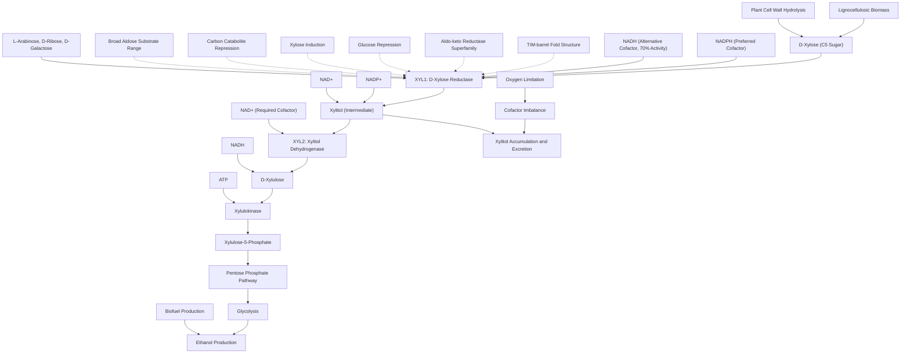

# Pathway Summary for XYL1

## Overview

XYL1 encodes NAD(P)H-dependent D-xylose reductase (XR), the first and rate-limiting enzyme in xylose metabolism in Scheffersomyces stipitis [PMID:3921014, PMID:1756986]. This cytosolic enzyme catalyzes the reduction of D-xylose to xylitol using preferentially NADPH as cofactor, enabling the fermentation of pentose sugars to ethanol - a rare ability among yeasts [PMID:17334359, file:PICST/XYL1/XYL1-deep-research.md]. The enzyme is essential for growth on xylose-containing media and represents a key biotechnological target for lignocellulosic biomass conversion to biofuels.

## Xylose Metabolic Pathway

XYL1 initiates the xylose-xylulose pathway by reducing D-xylose to xylitol in the first step of pentose sugar catabolism [PMID:1756986]. The pathway continues with xylitol dehydrogenase (XYL2) converting xylitol to D-xylulose using NAD+ as cofactor. D-xylulose is then phosphorylated by xylulokinase to xylulose-5-phosphate, which enters the pentose phosphate pathway and is ultimately converted to ethanol through glycolysis [file:PICST/XYL1/XYL1-deep-research.md]. This pathway enables S. stipitis to utilize xylose, the second most abundant sugar in plant biomass, as a carbon and energy source.

## Dual Cofactor Utilization and Metabolic Balance

XYL1 exhibits the unusual ability to utilize both NADPH and NADH as cofactors, with NADH showing approximately 70% of the activity observed with NADPH [PMID:3921014]. This dual cofactor specificity is rare among aldose reductases and has significant biotechnological implications for maintaining cofactor balance in engineered fermentation pathways. The enzyme's kinetic parameters show Km values of 42 mM for D-xylose and 9 μM for NADPH, indicating high affinity for the cofactor but relatively low affinity for the sugar substrate [PMID:3921014].

## Carbon Catabolite Repression and Gene Regulation

XYL1 expression is subject to glucose-mediated carbon catabolite repression, ensuring that xylose metabolism is activated only when preferred carbon sources are unavailable [file:PICST/XYL1/XYL1-deep-research.md]. During growth on glucose, XYL1 expression is repressed, but it is strongly induced when xylose is present as the primary carbon source. This regulatory mechanism allows cells to prioritize glucose utilization while maintaining the capability to switch to xylose metabolism when necessary. The regulation involves complex signaling pathways that sense carbon source availability and adjust metabolic gene expression accordingly.

## Cofactor Imbalance and Xylitol Accumulation

Under certain conditions, particularly oxygen limitation or when xylitol dehydrogenase (XYL2) activity is insufficient, S. stipitis accumulates and excretes xylitol as a byproduct [file:PICST/XYL1/XYL1-deep-research.md]. This occurs because XYL1 preferentially uses NADPH while XYL2 requires NAD+, creating a cofactor imbalance that limits flux through the pathway. When NADH reoxidation is hindered by oxygen limitation, the regeneration of NAD+ becomes limiting, causing xylitol accumulation. This metabolic bottleneck represents both a challenge for efficient xylose fermentation and an opportunity for xylitol production.

## Biotechnological Applications in Biofuel Production

XYL1 is a critical component in efforts to engineer efficient lignocellulosic ethanol production. The enzyme's ability to initiate xylose catabolism makes it essential for utilizing the xylose fraction of plant biomass, which can comprise 20-25% of lignocellulosic material [PMID:17334359]. Understanding XYL1's structure-function relationships and regulatory mechanisms has informed strategies to improve xylose fermentation in both native S. stipitis strains and engineered S. cerevisiae strains for industrial biofuel production.

## Xylose Metabolism and Fermentation Pathway Diagram

## Substrate Specificity and Alternative Substrates

While D-xylose is the primary physiological substrate, XYL1 exhibits broad aldose reductase activity on various sugars including L-arabinose (Km = 40 mM), D-ribose, and D-galactose (Km = 140 mM) [file:PICST/XYL1/XYL1-deep-research.md]. This substrate promiscuity may provide metabolic flexibility in mixed sugar environments typically found in lignocellulosic hydrolysates. However, the relatively high Km values for these alternative substrates suggest they are not primary physiological targets under normal growth conditions.

## Structural Biology and Mechanistic Insights

Crystal structure analysis reveals that XYL1 adopts a TIM-barrel fold characteristic of the aldo-keto reductase superfamily, with specific NADPH-binding sites and conformational changes upon cofactor binding [file:PICST/XYL1/XYL1-deep-research.md]. Understanding these structural features provides insights into the enzyme's dual cofactor specificity and substrate recognition mechanisms. This structural knowledge has informed protein engineering efforts aimed at improving catalytic efficiency, altering cofactor preference, or modifying substrate specificity for biotechnological applications.

## Industrial Strain Engineering and Optimization

The unique properties of XYL1, particularly its dual cofactor usage and rate-limiting role in xylose metabolism, make it a prime target for metabolic engineering approaches. Efforts to optimize xylose fermentation have focused on balancing XYL1 and XYL2 expression levels, engineering cofactor specificity, and improving enzyme kinetics. Additionally, the enzyme has been successfully expressed in heterologous hosts like S. cerevisiae to confer xylose utilization capability, expanding the industrial applications of this metabolically versatile pathway.