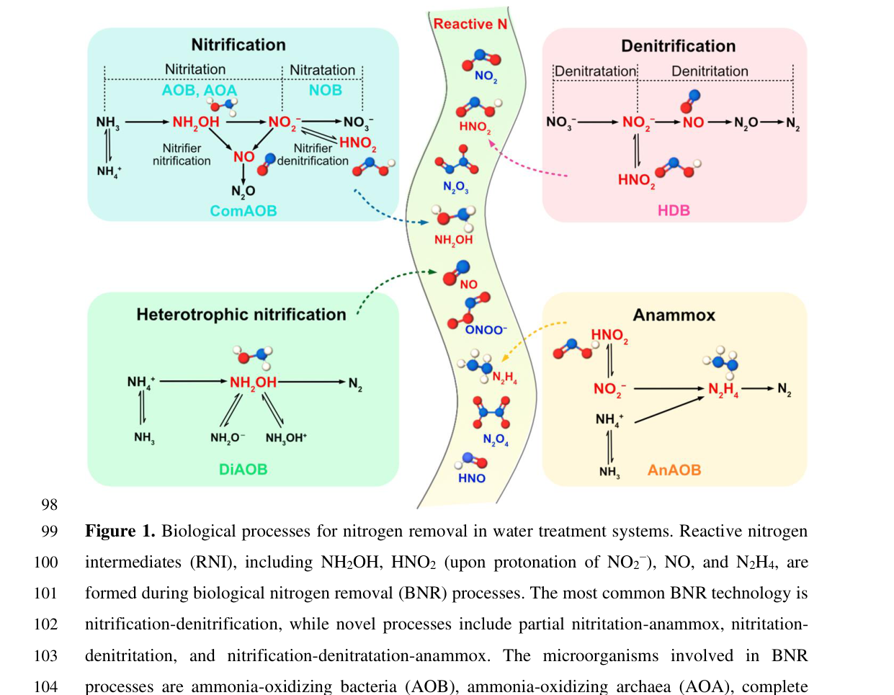

## Question

# Gene Research for Functional Annotation

## ⚠️ CRITICAL: Gene/Protein Identification Context

**BEFORE YOU BEGIN RESEARCH:** You MUST verify you are researching the CORRECT gene/protein. Gene symbols can be ambiguous, especially for less well-characterized genes from non-model organisms.

### Target Gene/Protein Identity (from UniProt):
- **UniProt Accession:** A0A2B7XTR7
- **Protein Description:** RecName: Full=Copper-containing nitrite reductase {ECO:0000256|ARBA:ARBA00017290}; EC=1.7.2.1 {ECO:0000256|ARBA:ARBA00011882}; AltName: Full=Cu-NIR {ECO:0000256|ARBA:ARBA00032356};
- **Gene Information:** ORFNames=AJ80_06654 {ECO:0000313|EMBL:PGH12596.1};
- **Organism (full):** Polytolypa hystricis (strain UAMH7299).
- **Protein Family:** Belongs to the multicopper oxidase family.
- **Key Domains:** Cu-oxidase-like_N. (IPR011707); Cu-oxidase_2nd. (IPR001117); Cu-oxidase_fam. (IPR045087); Cupredoxin. (IPR008972); NO2-reductase_Cu. (IPR001287)

### MANDATORY VERIFICATION STEPS:

1. **Check if the gene symbol "AJ80_06654" matches the protein description above**
2. **Verify the organism is correct:** Polytolypa hystricis (strain UAMH7299).
3. **Check if protein family/domains align with what you find in literature**
4. **If you find literature for a DIFFERENT gene with the same or similar symbol, STOP**

### If Gene Symbol is Ambiguous or You Cannot Find Relevant Literature:

**DO NOT PROCEED WITH RESEARCH ON A DIFFERENT GENE.** Instead:
- State clearly: "The gene symbol 'AJ80_06654' is ambiguous or literature is limited for this specific protein"
- Explain what you found (e.g., "Found extensive literature on a different gene with the same symbol in a different organism")
- Describe the protein based ONLY on the UniProt information provided above
- Suggest that the protein function can be inferred from domain/family information

### Research Target:

Please provide a comprehensive research report on the gene **AJ80_06654** (gene ID: AJ80_06654, UniProt: A0A2B7XTR7) in POLH7.

The research report should be a detailed narrative explaining the function, biological processes, and localization of the gene product. Citations should be given for all claims.

You should prioritize authoritative reviews and primary scientific literature when conducting research. You can supplement
this with annotations you find in gene/protein databases, but these can be outdated or inaccurate.

We are specifically interested in the primary function of the gene - for enzymes, what reaction is catalyzed, and what is the substrate specificity? For transporters, what is the substrate? For structural proteins or adapters, what is the broader structural role? For signaling molecules, what is the role in the pathway.

We are interested in where in or outside the cell the gene product carries out its function.

We are also interested in the signaling or biochemical pathways in which the gene functions. We are less interested in broad pleiotropic effects, except where these elucidate the precise role.

Include evidence where possible. We are interested in both experimental evidence as well as inference from structure, evolution, or bioinformatic analysis. Precise studies should be prioritized over high-throughput, where available.

## Output

Question: You are an expert researcher providing comprehensive, well-cited information.

Provide detailed information focusing on:
1. Key concepts and definitions with current understanding
2. Recent developments and latest research (prioritize 2023-2024 sources)
3. Current applications and real-world implementations
4. Expert opinions and analysis from authoritative sources
5. Relevant statistics and data from recent studies

Format as a comprehensive research report with proper citations. Include URLs and publication dates where available.
Always prioritize recent, authoritative sources and provide specific citations for all major claims.

# Gene Research for Functional Annotation

## ⚠️ CRITICAL: Gene/Protein Identification Context

**BEFORE YOU BEGIN RESEARCH:** You MUST verify you are researching the CORRECT gene/protein. Gene symbols can be ambiguous, especially for less well-characterized genes from non-model organisms.

### Target Gene/Protein Identity (from UniProt):
- **UniProt Accession:** A0A2B7XTR7
- **Protein Description:** RecName: Full=Copper-containing nitrite reductase {ECO:0000256|ARBA:ARBA00017290}; EC=1.7.2.1 {ECO:0000256|ARBA:ARBA00011882}; AltName: Full=Cu-NIR {ECO:0000256|ARBA:ARBA00032356};
- **Gene Information:** ORFNames=AJ80_06654 {ECO:0000313|EMBL:PGH12596.1};
- **Organism (full):** Polytolypa hystricis (strain UAMH7299).
- **Protein Family:** Belongs to the multicopper oxidase family.
- **Key Domains:** Cu-oxidase-like_N. (IPR011707); Cu-oxidase_2nd. (IPR001117); Cu-oxidase_fam. (IPR045087); Cupredoxin. (IPR008972); NO2-reductase_Cu. (IPR001287)

### MANDATORY VERIFICATION STEPS:

1. **Check if the gene symbol "AJ80_06654" matches the protein description above**
2. **Verify the organism is correct:** Polytolypa hystricis (strain UAMH7299).
3. **Check if protein family/domains align with what you find in literature**
4. **If you find literature for a DIFFERENT gene with the same or similar symbol, STOP**

### If Gene Symbol is Ambiguous or You Cannot Find Relevant Literature:

**DO NOT PROCEED WITH RESEARCH ON A DIFFERENT GENE.** Instead:
- State clearly: "The gene symbol 'AJ80_06654' is ambiguous or literature is limited for this specific protein"
- Explain what you found (e.g., "Found extensive literature on a different gene with the same symbol in a different organism")
- Describe the protein based ONLY on the UniProt information provided above
- Suggest that the protein function can be inferred from domain/family information

### Research Target:

Please provide a comprehensive research report on the gene **AJ80_06654** (gene ID: AJ80_06654, UniProt: A0A2B7XTR7) in POLH7.

The research report should be a detailed narrative explaining the function, biological processes, and localization of the gene product. Citations should be given for all claims.

You should prioritize authoritative reviews and primary scientific literature when conducting research. You can supplement
this with annotations you find in gene/protein databases, but these can be outdated or inaccurate.

We are specifically interested in the primary function of the gene - for enzymes, what reaction is catalyzed, and what is the substrate specificity? For transporters, what is the substrate? For structural proteins or adapters, what is the broader structural role? For signaling molecules, what is the role in the pathway.

We are interested in where in or outside the cell the gene product carries out its function.

We are also interested in the signaling or biochemical pathways in which the gene functions. We are less interested in broad pleiotropic effects, except where these elucidate the precise role.

Include evidence where possible. We are interested in both experimental evidence as well as inference from structure, evolution, or bioinformatic analysis. Precise studies should be prioritized over high-throughput, where available.

# Comprehensive Research Report: Functional Annotation of AJ80_06654 (UniProt A0A2B7XTR7) in *Polytolypa hystricis* (strain UAMH7299)

## Executive summary
AJ80_06654 (UniProt A0A2B7XTR7) is annotated (UniProt) as a **copper-containing nitrite reductase (CuNIR; NirK; EC 1.7.2.1)**, a multicopper oxidase-family enzyme whose primary, conserved role is **nitrite (NO2−) reduction to nitric oxide (NO)** as part of denitrification-associated nitrogen metabolism. Direct experimental literature for this **exact** *P. hystricis* protein could not be retrieved in the available corpus; therefore, conclusions about biochemical function, cofactors, and pathway roles are primarily **inferred from authoritative CuNIR/NirK literature**, with recent mechanistic advances from 2023–2024 structural work and 2024 review synthesis. (su2024formationandfate pages 14-18, rose2023spectroscopicallyvalidatedmultiple pages 1-3)

## 1. Gene/protein identity verification and scope limitations
### 1.1 Target identity (verified against provided UniProt context)
The requested gene symbol **AJ80_06654** is consistent with a UniProt-annotated ORF name for accession **A0A2B7XTR7**, described as **copper-containing nitrite reductase (Cu-NIR), EC 1.7.2.1**, belonging to the multicopper oxidase family and containing Cu-oxidase/cupredoxin/NO2-reductase_Cu domains (as supplied in the prompt). The functional description aligns with canonical NirK/CuNIR biochemistry summarized in recent reviews (nitrite → NO; copper T1/T2 centers; trimeric enzyme). (su2024formationandfate pages 14-18)

### 1.2 Literature availability for AJ80_06654/A0A2B7XTR7
No peer-reviewed paper in the retrieved set explicitly mentions **AJ80_06654** or **A0A2B7XTR7**. A genome-scale study including *P. hystricis* UAMH7299 was retrieved, but the scanned text did not provide usable evidence about this gene or denitrification capability. Consequently, organism-specific claims (e.g., expression conditions, cellular compartment in fungus, physiological role in *P. hystricis*) remain **uncertain** and are presented as hypotheses based on enzyme family knowledge. (su2024formationandfate pages 14-18)

## 2. Key concepts and definitions (current understanding)
### 2.1 Copper-containing nitrite reductase (CuNIR; NirK)
CuNIRs (encoded by **nirK** in many prokaryotes) are enzymes that catalyze the **NO-forming nitrite reduction step** in denitrification and related nitrogen transformations. The canonical overall reaction is:

**NO2− + e− + 2H+ → NO + H2O**

This reaction is explicitly stated in a 2024 Environmental Science & Technology review (focused on reactive nitrogen in biological nitrogen removal systems) and reiterated in other nitrogen-cycle sources in the retrieved corpus. (su2024formationandfate pages 14-18, laidin2024evaluatinghydrogenotrophicand pages 20-24)

### 2.2 Structural definition: copper sites and oligomeric state
A widely used structural description of CuNIR is a **homotrimeric enzyme** containing **two functionally distinct copper sites per monomer**:
- **Type 1 copper (T1Cu):** electron-accepting/redox site.
- **Type 2 copper (T2Cu):** catalytic site where nitrite binds and is reduced to NO.

This two-site architecture and trimeric organization are summarized in the 2024 review. (su2024formationandfate pages 14-18)

## 3. Primary function of AJ80_06654 inferred from CuNIR/NirK evidence
### 3.1 Catalyzed reaction and substrate specificity
Given its UniProt annotation and domain/family context, AJ80_06654 is best annotated as catalyzing **nitrite reduction to NO**, with **nitrite as the primary substrate** and **NO + H2O as products**. Nitrite binding at the catalytic copper site is supported by recent structural studies, which report **side-on nitrite binding** at the T2Cu site across pH conditions (pH 5.5 and pH 8). (su2024formationandfate pages 14-18, rose2023spectroscopicallyvalidatedmultiple pages 3-5)

### 3.2 Cofactors and catalytic centers
Recent and authoritative sources converge on CuNIR requiring **copper centers** with division of labor between electron entry (T1Cu) and catalysis (T2Cu). A 2023 MSOX/XFEL study provides copper-site coordination detail: **T1Cu** is coordinated by four residues, and **T2Cu** by three histidines, and the enzyme’s inter-copper electron transfer is described as **proton-coupled electron transfer (PCET)**. (rose2023spectroscopicallyvalidatedmultiple pages 1-3)

## 4. Cellular localization and where the reaction occurs
### 4.1 Typical localization in canonical systems
In bacteria (especially Gram-negative model denitrifiers), CuNIR is commonly described as a **periplasmic enzyme**. This is stated directly in the 2024 Environmental Science & Technology review. (su2024formationandfate pages 14-18)

### 4.2 Implications for *Polytolypa hystricis*
Because *P. hystricis* is a filamentous fungus, the bacterial term “periplasmic” does not translate directly. Without organism-specific experimental evidence, the safest statement is:
- AJ80_06654 is a CuNIR-family enzyme whose closest-characterized homologs act in an **extracytosolic/respiratory interface compartment** in bacteria.
- The precise fungal compartment (secretory pathway/periplasm-equivalent/cell wall–associated vs intracellular) cannot be concluded from the retrieved literature. (su2024formationandfate pages 14-18, laidin2024evaluatinghydrogenotrophicand pages 24-27)

## 5. Pathways and biological processes
### 5.1 Role in denitrification and nitrifier-denitrification
CuNIR/NirK is a key enzyme in denitrification-associated metabolism because it produces **NO**, which is both a reactive intermediate and a substrate for downstream steps (NO reduction and N2O formation/reduction). The 2024 review explicitly places CuNIR (nirK) in canonical denitrification and notes its central role in **nitrifier denitrification** (e.g., ammonia-oxidizing bacteria). (su2024formationandfate pages 14-18)

### 5.2 Broader nitrogen cycling contexts (archaea and engineered systems)
The 2024 review also emphasizes that nirK/CuNIR genes are found beyond classic denitrifiers, including in nitrifiers and archaeal lineages, with proposed pathways involving NO/NO2− cycling. In marine ammonia-oxidizing archaea, the review cites isotope tracing indicating that **63% of oxygen atoms in produced nitrite derive from H2O vs 37% from O2**, supporting mechanistic models involving NO/NO2− interconversion. (su2024formationandfate pages 14-18)

### 5.3 Visual pathway context (from a 2024 authoritative review)
A representative figure from the 2024 Environmental Science & Technology review illustrates biological nitrogen conversion processes and highlights where reactive nitrogen intermediates (including nitrite/NO) arise and are consumed, including CuNIR/nirK involvement. (su2024formationandfate media e47d02e2, su2024formationandfate media e4a3dff4)

## 6. Recent developments (prioritizing 2023–2024)
### 6.1 pH-dependent mechanism resolved by MSOX/XFEL (2023)
A 2023 crystallography/spectroscopy study used **MSOX serial crystallography** and **XFEL** to obtain spectroscopically validated structural “movies” of CuNIRs across pH, yielding several mechanistic insights:
- CuNIR electron transfer from T1Cu to T2Cu is **PCET** via a Cys–His bridge and requires protons from key catalytic residues (including a catalytic His and Asp). (rose2023spectroscopicallyvalidatedmultiple pages 1-3)
- The enzyme shows a **bell-shaped pH activity profile** with an activity maximum around **pH ~6.6–8**. (rose2023spectroscopicallyvalidatedmultiple pages 1-3)
- At pH 8 (more proton-limited), **NO formation is delayed** relative to low pH, and the study links diminished catalysis to **catalytic Asp decarboxylation** and CO2 trapping under irradiation conditions used to probe states. (rose2023spectroscopicallyvalidatedmultiple pages 1-3, rose2023spectroscopicallyvalidatedmultiple pages 9-11)
- Quantitative structural data were reported for T2Cu–nitrite coordination distances (Å-scale) and small pH-dependent copper displacements (~0.08–0.16 Å), supporting the conclusion that high-pH loss of activity is not simply due to weaker nitrite binding. (rose2023spectroscopicallyvalidatedmultiple pages 3-5)

These insights are directly relevant to functional annotation because they reinforce that CuNIR activity depends strongly on **proton availability and conserved catalytic residues**, which can inform hypotheses about *P. hystricis* AJ80_06654 behavior under different environmental pH and redox regimes. (rose2023spectroscopicallyvalidatedmultiple pages 1-3, rose2023spectroscopicallyvalidatedmultiple pages 3-5)

### 6.2 Reactive nitrogen chemistry in engineered nitrogen removal (2024)
A 2024 Environmental Science & Technology review argues that reactive intermediates such as **NO2−/HNO2 and NO** are “often ignored” chemical aspects affecting biological nitrogen removal performance. It highlights CuNIR (nirK) as a key biological generator/consumer node for these intermediates, and that environmental conditions (e.g., pH, redox transitions, substrate availability) can create transient accumulation of reactive nitrogen. (su2024formationandfate pages 14-18)

## 7. Current applications and real-world implementations
### 7.1 Wastewater and engineered bioprocesses
CuNIR/NirK function is operationally important in **biological nitrogen removal (BNR)** because nitrite-to-NO conversion feeds downstream denitrification steps and intersects with abiotic/biotic formation of reactive nitrogen species that influence N2O emissions and micropollutant transformations. (su2024formationandfate pages 14-18)

### 7.2 Environmental monitoring and process diagnostics
nirK abundance is widely used as a **functional marker** for NO-forming nitrite reduction potential in environmental microbiomes. In agricultural soils, the abundance of denitrification genes (including nirK) has been used to infer N2O emission potential (example: gene copy abundance assessment approaches in soils). (laidin2024evaluatinghydrogenotrophicand pages 20-24)

## 8. Expert opinions and analysis (authoritative sources)
### 8.1 CuNIR as a central node connecting microbiology and chemistry
The 2024 Environmental Science & Technology review (Smets group and collaborators) provides an expert synthesis that CuNIR (nirK) is central not only in canonical denitrification but also in broader nitrogen-converting guilds, and that chemical fates of intermediates (NO2−/HNO2, NO) strongly shape system outcomes in engineered environments. This perspective supports annotating AJ80_06654 primarily as a nitrite-to-NO reductase with potential broader impacts via reactive nitrogen chemistry. (su2024formationandfate pages 14-18)

### 8.2 Structural biology perspective on CuNIR mechanism
The 2023 MSOX/XFEL work offers authoritative mechanistic framing of CuNIR catalysis as **PCET-controlled**, emphasizing how pH and proton pathways regulate intramolecular electron transfer and substrate turnover. This supports annotating AJ80_06654 as an enzyme whose catalytic competence depends on conserved proton/electron transfer architecture common to CuNIRs. (rose2023spectroscopicallyvalidatedmultiple pages 1-3)

## 9. Relevant statistics and quantitative data
### 9.1 Quantitative structural/mechanistic metrics (2023)
The 2023 MSOX/XFEL study reported:
- activity peak in the approximate range **pH 6.6–8** (bell-shaped profile) (rose2023spectroscopicallyvalidatedmultiple pages 1-3)
- T2Cu–nitrite coordination distances in the ~**1.83–2.25 Å** range for different atoms/positions across datasets (rose2023spectroscopicallyvalidatedmultiple pages 3-5)
- small pH-dependent Cu displacements of roughly **0.08–0.16 Å** (rose2023spectroscopicallyvalidatedmultiple pages 3-5)

### 9.2 Redox potential context for nitrite → NO step
A retrieved denitrification-systems source reports a formal potential for the nitrite-to-NO reduction step of **Eo′ ≈ +0.350 V vs SHE**. A compiled redox-potential table in another retrieved review lists **+0.39 V at pH 7** for nitrite reduction (contextual rather than AJ80_06654-specific). (laidin2024evaluatinghydrogenotrophicand pages 20-24, maiti2025nitrate–nitriteinterplayin pages 3-4)

### 9.3 Fungal nirK ecology and N2O relevance (Frontiers Microbiology 2019)
While not specific to *P. hystricis*, Xu et al. provide quantitative evidence that nirK-containing fungi can be major contributors to N2O emissions in soils:
- Sequencing depth: **1,622,131 reads**; final OTU set: **1007 OTUs** after filtering (xu2019characterizationoffungal pages 4-5)
- Taxonomic resolution: **~57.30%** of OTUs unclassified; dominant assigned order **Hypocreales ~40.51%** (xu2019characterizationoffungal pages 1-2)
- Core community: **~53%** of OTUs shared across soil types, representing ~**98%** of total relative abundance (xu2019characterizationoffungal pages 1-2, xu2019characterizationoffungal pages 5-7)
- Fungal nirK abundance: up to **3.15 × 10^9 copies g−1** soil in one soil type; fungal contribution to N2O emission estimated as **66.17%**, **53.34%**, and **~18.62%** across three soil types (xu2019characterizationoffungal pages 4-5)
- Reported relationships: fungal nirK abundance was **positively correlated** with fungal N2O emission contribution (P < 0.05) (xu2019characterizationoffungal pages 5-7, xu2019characterizationoffungal pages 4-5)

These data support the ecological plausibility that a fungal CuNIR such as AJ80_06654 could participate in nitrite-to-NO steps that influence N2O outcomes, though they do not establish that *P. hystricis* expresses this gene in situ. (xu2019characterizationoffungal pages 5-7, xu2019characterizationoffungal pages 4-5)

## 10. Structured functional annotation summary
The following table consolidates the most defensible statements about AJ80_06654 while distinguishing direct database identity from inference based on recent and authoritative literature.

| Annotation item | Best-supported statement | Evidence type (direct for AJ80_06654 vs inference from CuNIR/NirK literature) | Key citations (by context ID) | Notes/uncertainties |
|---|---|---|---|---|
| Protein identity / domains / family | AJ80_06654 (UniProt A0A2B7XTR7) is annotated as a copper-containing nitrite reductase (Cu-NIR; NirK), EC 1.7.2.1, in *Polytolypa hystricis* UAMH7299; UniProt domain architecture places it in the multicopper oxidase family with Cu-oxidase-like_N, Cu-oxidase_2nd, Cu-oxidase_fam, cupredoxin, and NO2-reductase_Cu domains. | Direct for AJ80_06654 from UniProt accession supplied by user; family/function interpretation inferred from CuNIR literature | (su2024formationandfate pages 14-18) | No paper directly naming AJ80_06654/A0A2B7XTR7 was retrieved; annotation rests on database identity plus family-consistent literature. |
| EC number | Best-supported catalytic class is EC 1.7.2.1, copper-containing nitrite reductase / nitrite reductase (NO-forming). | Direct for AJ80_06654 from UniProt; reaction class supported by CuNIR literature | (su2024formationandfate pages 14-18, maiti2025nitrate–nitriteinterplayin pages 1-3) | No organism-specific biochemical assay was found for the *P. hystricis* protein. |
| Reaction stoichiometry | CuNIR catalyzes nitrite reduction to nitric oxide: NO2− + e− + 2H+ → NO + H2O. | Inference from CuNIR/NirK literature | (su2024formationandfate pages 14-18, laidin2024evaluatinghydrogenotrophicand pages 20-24, rose2023spectroscopicallyvalidatedmultiple pages 1-3) | This stoichiometry is well established for CuNIRs generally, but not directly measured here for AJ80_06654. |
| Substrate specificity | Primary substrate is nitrite (NO2−); product is nitric oxide (NO). CuNIR active sites bind nitrite at the catalytic T2 copper, commonly in side-on geometry. | Inference from CuNIR/NirK literature | (su2024formationandfate pages 14-18, rose2023spectroscopicallyvalidatedmultiple pages 3-5, rose2023spectroscopicallyvalidatedmultiple pages 9-11) | Specific kinetic constants or alternative substrates for AJ80_06654 were not found. |
| Cofactors / metal centers | Canonical CuNIRs contain two distinct copper sites: a type 1 Cu (electron-transfer/redox site) and a type 2 Cu (catalytic site). T1Cu is coordinated by four residues; T2Cu is coordinated by three histidines and binds nitrite. | Inference from CuNIR/NirK literature | (su2024formationandfate pages 14-18, maiti2025nitrate–nitriteinterplayin pages 6-8, rose2023spectroscopicallyvalidatedmultiple pages 1-3, rose2023spectroscopicallyvalidatedmultiple pages 3-5) | UniProt family/domain assignment strongly fits this architecture, but metal occupancy has not been experimentally shown for AJ80_06654. |
| Oligomeric state | CuNIR is typically a homotrimer. | Inference from CuNIR/NirK literature | (su2024formationandfate pages 14-18, leigh2025transcriptionalregulationof pages 23-25) | Trimerization is well supported for bacterial CuNIRs; fungal AJ80_06654 oligomerization has not been directly reported. |
| Cellular localization | Canonical bacterial CuNIR is periplasmic. For AJ80_06654 in a filamentous fungus, extracellular/periplasm-equivalent or secretory localization is plausible but unverified. | Inference from CuNIR/NirK literature; not direct for AJ80_06654 | (su2024formationandfate pages 14-18, laidin2024evaluatinghydrogenotrophicand pages 24-27) | Localization is a major uncertainty because fungal cell architecture differs from Gram-negative bacteria, and no localization data were retrieved for *P. hystricis*. |
| Electron donors / partners | CuNIR receives electrons at T1Cu and transfers them internally to T2Cu; known partners in model systems include pseudoazurin and cytochrome c-like donors. A 2023 MD/QM study specifically examined CuNIR interaction with pseudoazurin. | Inference from CuNIR/NirK literature | (rose2023spectroscopicallyvalidatedmultiple pages 1-3, su2024formationandfate pages 14-18) | Immediate electron donor for AJ80_06654 is unknown; no *Polytolypa*-specific redox partner was found. |
| Pathway role | Most likely role is NO-forming nitrite reduction in denitrification-related nitrogen metabolism. More broadly, NirK-type CuNIR participates in canonical denitrification, nitrifier denitrification, and proposed archaeal NO/NO2− cycling. | Inference from CuNIR/NirK literature | (su2024formationandfate pages 14-18, laidin2024evaluatinghydrogenotrophicand pages 20-24, maiti2025nitrate–nitriteinterplayin pages 1-3) | For AJ80_06654 specifically, presence of the gene suggests capability, but the full denitrification pathway in *P. hystricis* was not confirmed from retrieved literature. |
| Relevance to fungal denitrification / N2O | Fungal nirK genes are ecologically linked to fungal denitrification and N2O production. In arable soils, fungal nirK abundance positively correlated with fungal N2O emission contribution; fungal denitrification contributions reached 66.17% (QRC), 53.34% (BS), and ~18.62% (AS). | Inference from fungal nirK ecology literature, not direct for AJ80_06654 | (xu2019characterizationoffungal pages 1-2, xu2019characterizationoffungal pages 5-7, xu2019characterizationoffungal pages 4-5, xu2019characterizationoffungal pages 2-3) | These are ecosystem-level fungal data, not evidence that *P. hystricis* AJ80_06654 is expressed or drives N2O release under specific conditions. |
| Recent mechanistic developments (2023–2024) | Recent work refined CuNIR mechanism as proton-coupled electron transfer (PCET) from T1Cu to T2Cu through the Cys–His bridge, involving catalytic His/Asp residues. 2023 MSOX/XFEL studies showed bell-shaped pH dependence (activity maximum around pH 6.6–8), T2Cu nitrite side-on binding, small pH-dependent Cu displacements (~0.08–0.16 Å), and catalytic Asp chemistry under limited proton availability. | Inference from recent CuNIR literature | (rose2023spectroscopicallyvalidatedmultiple pages 1-3, rose2023spectroscopicallyvalidatedmultiple pages 3-5, rose2023spectroscopicallyvalidatedmultiple pages 9-11, rose2023spectroscopicallyvalidatedmultiple pages 17-17) | These studies used bacterial CuNIR models; transferability to fungal AJ80_06654 is strong at the catalytic-core level but not guaranteed for all regulatory features. |
| Engineered / real-world applications | NirK/CuNIR is relevant to biological nitrogen removal and denitrification engineering because it governs NO formation, a reactive intermediate that influences N2O formation, nitrogen removal efficiency, and process chemistry in wastewater and soil systems. | Inference from applied nitrogen-cycling literature | (laidin2024evaluatinghydrogenotrophicand pages 20-24, su2024formationandfate media e47d02e2, su2024formationandfate pages 14-18) | Application evidence is pathway-level rather than direct exploitation of AJ80_06654 or *P. hystricis*. |
| Quantitative statistics mentioned in evidence | Reported values include CuNIR step redox potential about +0.350 V vs SHE and +0.39 V at pH 7 in compiled sources; structural nitrite–T2Cu distances of ~2.12–2.25 Å (O2), ~2.00–2.06 Å (N), and ~1.83–1.99 Å (O1); fungal nirK survey stats of 1,622,131 reads, 1,257,313 filtered sequences, 20,807 initial OTUs, 1007 retained OTUs, ~57.30% unclassified OTUs, Hypocreales ~40.51% of OTUs, Fusarium ~40.22% of OTUs, and ~53% shared OTUs representing ~98% relative abundance. | Inference from CuNIR/fungal nirK literature | (laidin2024evaluatinghydrogenotrophicand pages 20-24, maiti2025nitrate–nitriteinterplayin pages 3-4, rose2023spectroscopicallyvalidatedmultiple pages 3-5, rose2023spectroscopicallyvalidatedmultiple pages 9-11, xu2019characterizationoffungal pages 1-2, xu2019characterizationoffungal pages 5-7, xu2019characterizationoffungal pages 4-5, xu2019characterizationoffungal pages 7-9) | These values contextualize the enzyme family and fungal nirK ecology; none are direct measurements for AJ80_06654 itself. |

*Table: This table summarizes the best-supported functional annotation for AJ80_06654 from *Polytolypa hystricis* UAMH7299, clearly separating direct database-based identity from inference drawn from CuNIR/NirK literature. It is useful for transparently evaluating what is known, what is inferred, and where the main uncertainties remain.*

## 11. Key knowledge gaps and recommended next steps for high-confidence annotation
1. **Direct biochemical validation** for AJ80_06654 (purification, copper content, nitrite→NO turnover, kinetics) is not available in the retrieved literature corpus; thus catalytic parameters (Km, kcat), optimal pH, and electron donor specificity remain unknown for *P. hystricis*. (su2024formationandfate pages 14-18, rose2023spectroscopicallyvalidatedmultiple pages 1-3)
2. **Subcellular localization in fungi** is unresolved; targeted bioinformatics (signal peptide prediction, secretion motifs), proteomics, or cell fractionation would be needed to locate the enzyme. (su2024formationandfate pages 14-18)
3. **Pathway completeness in *P. hystricis*** (presence of downstream NO reductase/N2O reductase analogs, or fungal P450nor) cannot be inferred from the retrieved text; genome pathway reconstruction would be needed to confirm whether AJ80_06654 supports full denitrification or partial NO/N2O production routes. (su2024formationandfate pages 14-18, xu2019characterizationoffungal pages 2-3)

## References (retrieved, with URLs and publication dates)
- Su Q. et al. (2024-12). *Environmental Science & Technology*. “Formation and Fate of Reactive Nitrogen during Biological Nitrogen Removal from Water: Important Yet Often Ignored Chemical Aspects of the Nitrogen Cycle.” https://doi.org/10.1021/acs.est.4c03086 (su2024formationandfate pages 14-18)
- Rose S.L. et al. (2023-08). *Acta Crystallographica A*. “Spectroscopically validated multiple structures from one crystal (MSOX) and damage-free atomic structures using XFEL for copper nitrite reductases.” https://doi.org/10.1107/S2053273323094627 (rose2023spectroscopicallyvalidatedmultiple pages 1-3)
- Xu H. et al. (2019-02). *Frontiers in Microbiology*. “Characterization of Fungal nirK-Containing Communities and N2O Emission From Fungal Denitrification in Arable Soils.” https://doi.org/10.3389/fmicb.2019.00117 (xu2019characterizationoffungal pages 1-2)

References

1. (su2024formationandfate pages 14-18): Qingxian Su, Carlos Domingo-Félez, Mei Zhi, Marlene Mark Jensen, Boyan Xu, How Yong Ng, and Barth F. Smets. Formation and fate of reactive nitrogen during biological nitrogen removal from water: important yet often ignored chemical aspects of the nitrogen cycle. Environmental science & technology, 58:22480-22501, Dec 2024. URL: https://doi.org/10.1021/acs.est.4c03086, doi:10.1021/acs.est.4c03086. This article has 19 citations and is from a domain leading peer-reviewed journal.

2. (rose2023spectroscopicallyvalidatedmultiple pages 1-3): Samuel L. Rose, Svetlana V. Antonyuk, Robert R. Eady, Felix Ferroni, Takehiko Tosha, Masaki Yamamoto, Samuel Horrell, Robin Owen, and S. Samar Hasnain. Spectroscopically validated multiple structures from one crystal (msox) and damage-free atomic structures using xfel for copper nitrite reductases. Acta Crystallographica Section A Foundations and Advances, 79:C147-C147, Aug 2023. URL: https://doi.org/10.1107/s2053273323094627, doi:10.1107/s2053273323094627. This article has 0 citations.

3. (laidin2024evaluatinghydrogenotrophicand pages 20-24): ADAZ Laidin. Evaluating hydrogenotrophic and electroactive bio-electrochemical denitrifying systems for surface water …. Unknown journal, 2024.

4. (rose2023spectroscopicallyvalidatedmultiple pages 3-5): Samuel L. Rose, Svetlana V. Antonyuk, Robert R. Eady, Felix Ferroni, Takehiko Tosha, Masaki Yamamoto, Samuel Horrell, Robin Owen, and S. Samar Hasnain. Spectroscopically validated multiple structures from one crystal (msox) and damage-free atomic structures using xfel for copper nitrite reductases. Acta Crystallographica Section A Foundations and Advances, 79:C147-C147, Aug 2023. URL: https://doi.org/10.1107/s2053273323094627, doi:10.1107/s2053273323094627. This article has 0 citations.

5. (laidin2024evaluatinghydrogenotrophicand pages 24-27): ADAZ Laidin. Evaluating hydrogenotrophic and electroactive bio-electrochemical denitrifying systems for surface water …. Unknown journal, 2024.

6. (su2024formationandfate media e47d02e2): Qingxian Su, Carlos Domingo-Félez, Mei Zhi, Marlene Mark Jensen, Boyan Xu, How Yong Ng, and Barth F. Smets. Formation and fate of reactive nitrogen during biological nitrogen removal from water: important yet often ignored chemical aspects of the nitrogen cycle. Environmental science & technology, 58:22480-22501, Dec 2024. URL: https://doi.org/10.1021/acs.est.4c03086, doi:10.1021/acs.est.4c03086. This article has 19 citations and is from a domain leading peer-reviewed journal.

7. (su2024formationandfate media e4a3dff4): Qingxian Su, Carlos Domingo-Félez, Mei Zhi, Marlene Mark Jensen, Boyan Xu, How Yong Ng, and Barth F. Smets. Formation and fate of reactive nitrogen during biological nitrogen removal from water: important yet often ignored chemical aspects of the nitrogen cycle. Environmental science & technology, 58:22480-22501, Dec 2024. URL: https://doi.org/10.1021/acs.est.4c03086, doi:10.1021/acs.est.4c03086. This article has 19 citations and is from a domain leading peer-reviewed journal.

8. (rose2023spectroscopicallyvalidatedmultiple pages 9-11): Samuel L. Rose, Svetlana V. Antonyuk, Robert R. Eady, Felix Ferroni, Takehiko Tosha, Masaki Yamamoto, Samuel Horrell, Robin Owen, and S. Samar Hasnain. Spectroscopically validated multiple structures from one crystal (msox) and damage-free atomic structures using xfel for copper nitrite reductases. Acta Crystallographica Section A Foundations and Advances, 79:C147-C147, Aug 2023. URL: https://doi.org/10.1107/s2053273323094627, doi:10.1107/s2053273323094627. This article has 0 citations.

9. (maiti2025nitrate–nitriteinterplayin pages 3-4): Biplab K. Maiti, Isabel Moura, and José J. G. Moura. Nitrate–nitrite interplay in the nitrogen biocycle. Molecules, 30:3023, Jul 2025. URL: https://doi.org/10.3390/molecules30143023, doi:10.3390/molecules30143023. This article has 10 citations.

10. (xu2019characterizationoffungal pages 4-5): Huifang Xu, Rong Sheng, Xiaoyi Xing, Wenzhao Zhang, Haijun Hou, Yi Liu, Hongling Qin, Chunlan Chen, and Wenxue Wei. Characterization of fungal nirk-containing communities and n2o emission from fungal denitrification in arable soils. Frontiers in Microbiology, Feb 2019. URL: https://doi.org/10.3389/fmicb.2019.00117, doi:10.3389/fmicb.2019.00117. This article has 48 citations and is from a peer-reviewed journal.

11. (xu2019characterizationoffungal pages 1-2): Huifang Xu, Rong Sheng, Xiaoyi Xing, Wenzhao Zhang, Haijun Hou, Yi Liu, Hongling Qin, Chunlan Chen, and Wenxue Wei. Characterization of fungal nirk-containing communities and n2o emission from fungal denitrification in arable soils. Frontiers in Microbiology, Feb 2019. URL: https://doi.org/10.3389/fmicb.2019.00117, doi:10.3389/fmicb.2019.00117. This article has 48 citations and is from a peer-reviewed journal.

12. (xu2019characterizationoffungal pages 5-7): Huifang Xu, Rong Sheng, Xiaoyi Xing, Wenzhao Zhang, Haijun Hou, Yi Liu, Hongling Qin, Chunlan Chen, and Wenxue Wei. Characterization of fungal nirk-containing communities and n2o emission from fungal denitrification in arable soils. Frontiers in Microbiology, Feb 2019. URL: https://doi.org/10.3389/fmicb.2019.00117, doi:10.3389/fmicb.2019.00117. This article has 48 citations and is from a peer-reviewed journal.

13. (maiti2025nitrate–nitriteinterplayin pages 1-3): Biplab K. Maiti, Isabel Moura, and José J. G. Moura. Nitrate–nitrite interplay in the nitrogen biocycle. Molecules, 30:3023, Jul 2025. URL: https://doi.org/10.3390/molecules30143023, doi:10.3390/molecules30143023. This article has 10 citations.

14. (maiti2025nitrate–nitriteinterplayin pages 6-8): Biplab K. Maiti, Isabel Moura, and José J. G. Moura. Nitrate–nitrite interplay in the nitrogen biocycle. Molecules, 30:3023, Jul 2025. URL: https://doi.org/10.3390/molecules30143023, doi:10.3390/molecules30143023. This article has 10 citations.

15. (leigh2025transcriptionalregulationof pages 23-25): T Leigh. Transcriptional regulation of bacterial nitrous oxide emissions. Unknown journal, 2025.

16. (xu2019characterizationoffungal pages 2-3): Huifang Xu, Rong Sheng, Xiaoyi Xing, Wenzhao Zhang, Haijun Hou, Yi Liu, Hongling Qin, Chunlan Chen, and Wenxue Wei. Characterization of fungal nirk-containing communities and n2o emission from fungal denitrification in arable soils. Frontiers in Microbiology, Feb 2019. URL: https://doi.org/10.3389/fmicb.2019.00117, doi:10.3389/fmicb.2019.00117. This article has 48 citations and is from a peer-reviewed journal.

17. (rose2023spectroscopicallyvalidatedmultiple pages 17-17): Samuel L. Rose, Svetlana V. Antonyuk, Robert R. Eady, Felix Ferroni, Takehiko Tosha, Masaki Yamamoto, Samuel Horrell, Robin Owen, and S. Samar Hasnain. Spectroscopically validated multiple structures from one crystal (msox) and damage-free atomic structures using xfel for copper nitrite reductases. Acta Crystallographica Section A Foundations and Advances, 79:C147-C147, Aug 2023. URL: https://doi.org/10.1107/s2053273323094627, doi:10.1107/s2053273323094627. This article has 0 citations.

18. (xu2019characterizationoffungal pages 7-9): Huifang Xu, Rong Sheng, Xiaoyi Xing, Wenzhao Zhang, Haijun Hou, Yi Liu, Hongling Qin, Chunlan Chen, and Wenxue Wei. Characterization of fungal nirk-containing communities and n2o emission from fungal denitrification in arable soils. Frontiers in Microbiology, Feb 2019. URL: https://doi.org/10.3389/fmicb.2019.00117, doi:10.3389/fmicb.2019.00117. This article has 48 citations and is from a peer-reviewed journal.

## Artifacts

- [Edison artifact artifact-00](AJ80_06654-deep-research-falcon_artifacts/artifact-00.md)

## Citations

1. su2024formationandfate pages 14-18
2. rose2023spectroscopicallyvalidatedmultiple pages 1-3
3. rose2023spectroscopicallyvalidatedmultiple pages 3-5
4. laidin2024evaluatinghydrogenotrophicand pages 20-24
5. xu2019characterizationoffungal pages 4-5
6. xu2019characterizationoffungal pages 1-2
7. laidin2024evaluatinghydrogenotrophicand pages 24-27
8. rose2023spectroscopicallyvalidatedmultiple pages 9-11
9. xu2019characterizationoffungal pages 5-7
10. leigh2025transcriptionalregulationof pages 23-25
11. xu2019characterizationoffungal pages 2-3
12. rose2023spectroscopicallyvalidatedmultiple pages 17-17
13. xu2019characterizationoffungal pages 7-9
14. https://doi.org/10.1021/acs.est.4c03086
15. https://doi.org/10.1107/S2053273323094627
16. https://doi.org/10.3389/fmicb.2019.00117
17. https://doi.org/10.1021/acs.est.4c03086,
18. https://doi.org/10.1107/s2053273323094627,
19. https://doi.org/10.3390/molecules30143023,
20. https://doi.org/10.3389/fmicb.2019.00117,