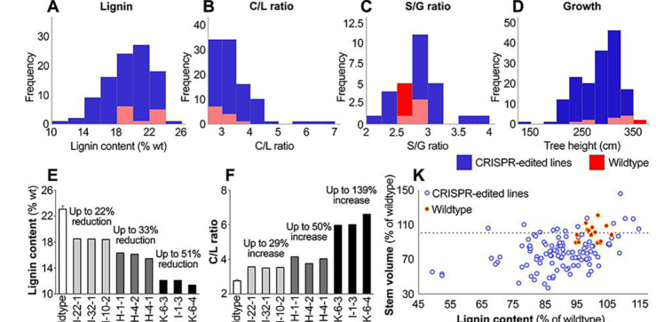

## Question

# Gene Research for Functional Annotation

## ⚠️ CRITICAL: Gene/Protein Identification Context

**BEFORE YOU BEGIN RESEARCH:** You MUST verify you are researching the CORRECT gene/protein. Gene symbols can be ambiguous, especially for less well-characterized genes from non-model organisms.

### Target Gene/Protein Identity (from UniProt):
- **UniProt Accession:** O65862
- **Protein Description:** RecName: Full=Caffeoyl-CoA O-methyltransferase 1; EC=2.1.1.104; AltName: Full=Trans-caffeoyl-CoA 3-O-methyltransferase 1; Short=CCoAMT-1; Short=CCoAOMT-1;
- **Gene Information:** Name=CCOAOMT1;
- **Organism (full):** Populus trichocarpa (Western balsam poplar) (Populus balsamifera subsp. trichocarpa).
- **Protein Family:** Belongs to the class I-like SAM-binding methyltransferase
- **Key Domains:** Cation-dep_OMT. (IPR050362); SAM-dependent_MTases_sf. (IPR029063); SAM_O-MeTrfase. (IPR002935); Methyltransf_3 (PF01596)

### MANDATORY VERIFICATION STEPS:

1. **Check if the gene symbol "CCOAOMT1" matches the protein description above**
2. **Verify the organism is correct:** Populus trichocarpa (Western balsam poplar) (Populus balsamifera subsp. trichocarpa).
3. **Check if protein family/domains align with what you find in literature**
4. **If you find literature for a DIFFERENT gene with the same or similar symbol, STOP**

### If Gene Symbol is Ambiguous or You Cannot Find Relevant Literature:

**DO NOT PROCEED WITH RESEARCH ON A DIFFERENT GENE.** Instead:
- State clearly: "The gene symbol 'CCOAOMT1' is ambiguous or literature is limited for this specific protein"
- Explain what you found (e.g., "Found extensive literature on a different gene with the same symbol in a different organism")
- Describe the protein based ONLY on the UniProt information provided above
- Suggest that the protein function can be inferred from domain/family information

### Research Target:

Please provide a comprehensive research report on the gene **CCOAOMT1** (gene ID: CCOAOMT1, UniProt: O65862) in POPTR.

The research report should be a detailed narrative explaining the function, biological processes, and localization of the gene product. Citations should be given for all claims.

You should prioritize authoritative reviews and primary scientific literature when conducting research. You can supplement
this with annotations you find in gene/protein databases, but these can be outdated or inaccurate.

We are specifically interested in the primary function of the gene - for enzymes, what reaction is catalyzed, and what is the substrate specificity? For transporters, what is the substrate? For structural proteins or adapters, what is the broader structural role? For signaling molecules, what is the role in the pathway.

We are interested in where in or outside the cell the gene product carries out its function.

We are also interested in the signaling or biochemical pathways in which the gene functions. We are less interested in broad pleiotropic effects, except where these elucidate the precise role.

Include evidence where possible. We are interested in both experimental evidence as well as inference from structure, evolution, or bioinformatic analysis. Precise studies should be prioritized over high-throughput, where available.

## Output

Question: You are an expert researcher providing comprehensive, well-cited information.

Provide detailed information focusing on:
1. Key concepts and definitions with current understanding
2. Recent developments and latest research (prioritize 2023-2024 sources)
3. Current applications and real-world implementations
4. Expert opinions and analysis from authoritative sources
5. Relevant statistics and data from recent studies

Format as a comprehensive research report with proper citations. Include URLs and publication dates where available.
Always prioritize recent, authoritative sources and provide specific citations for all major claims.

# Gene Research for Functional Annotation

## ⚠️ CRITICAL: Gene/Protein Identification Context

**BEFORE YOU BEGIN RESEARCH:** You MUST verify you are researching the CORRECT gene/protein. Gene symbols can be ambiguous, especially for less well-characterized genes from non-model organisms.

### Target Gene/Protein Identity (from UniProt):
- **UniProt Accession:** O65862
- **Protein Description:** RecName: Full=Caffeoyl-CoA O-methyltransferase 1; EC=2.1.1.104; AltName: Full=Trans-caffeoyl-CoA 3-O-methyltransferase 1; Short=CCoAMT-1; Short=CCoAOMT-1;
- **Gene Information:** Name=CCOAOMT1;
- **Organism (full):** Populus trichocarpa (Western balsam poplar) (Populus balsamifera subsp. trichocarpa).
- **Protein Family:** Belongs to the class I-like SAM-binding methyltransferase
- **Key Domains:** Cation-dep_OMT. (IPR050362); SAM-dependent_MTases_sf. (IPR029063); SAM_O-MeTrfase. (IPR002935); Methyltransf_3 (PF01596)

### MANDATORY VERIFICATION STEPS:

1. **Check if the gene symbol "CCOAOMT1" matches the protein description above**
2. **Verify the organism is correct:** Populus trichocarpa (Western balsam poplar) (Populus balsamifera subsp. trichocarpa).
3. **Check if protein family/domains align with what you find in literature**
4. **If you find literature for a DIFFERENT gene with the same or similar symbol, STOP**

### If Gene Symbol is Ambiguous or You Cannot Find Relevant Literature:

**DO NOT PROCEED WITH RESEARCH ON A DIFFERENT GENE.** Instead:
- State clearly: "The gene symbol 'CCOAOMT1' is ambiguous or literature is limited for this specific protein"
- Explain what you found (e.g., "Found extensive literature on a different gene with the same symbol in a different organism")
- Describe the protein based ONLY on the UniProt information provided above
- Suggest that the protein function can be inferred from domain/family information

### Research Target:

Please provide a comprehensive research report on the gene **CCOAOMT1** (gene ID: CCOAOMT1, UniProt: O65862) in POPTR.

The research report should be a detailed narrative explaining the function, biological processes, and localization of the gene product. Citations should be given for all claims.

You should prioritize authoritative reviews and primary scientific literature when conducting research. You can supplement
this with annotations you find in gene/protein databases, but these can be outdated or inaccurate.

We are specifically interested in the primary function of the gene - for enzymes, what reaction is catalyzed, and what is the substrate specificity? For transporters, what is the substrate? For structural proteins or adapters, what is the broader structural role? For signaling molecules, what is the role in the pathway.

We are interested in where in or outside the cell the gene product carries out its function.

We are also interested in the signaling or biochemical pathways in which the gene functions. We are less interested in broad pleiotropic effects, except where these elucidate the precise role.

Include evidence where possible. We are interested in both experimental evidence as well as inference from structure, evolution, or bioinformatic analysis. Precise studies should be prioritized over high-throughput, where available.

## Research Report: **Populus trichocarpa CCOAOMT1 (UniProt O65862)** — Functional annotation of caffeoyl‑CoA O‑methyltransferase in lignin/phenylpropanoid metabolism

### 0) Scope, identity verification, and limitations
**Target identity.** The requested target is UniProt **O65862** from *Populus trichocarpa* (western balsam poplar), annotated as **caffeoyl‑CoA O‑methyltransferase 1 (CCoAOMT‑1 / CCoAOMT1; EC 2.1.1.104)**, a SAM-dependent O‑methyltransferase in the class I-like SAM-binding methyltransferase superfamily (caffeoyl‑CoA 3‑O‑methyltransferase). This identity is consistent with Populus lignin-pathway literature where “CCoAOMT” denotes caffeoyl‑CoA O‑methyltransferase acting in monolignol biosynthesis. (meyermans2000modificationsinlignin pages 3-4, sulis2023multiplexcrisprediting pages 3-4)

**Important limitation.** In this tool run, no accessible full-text paper provided a **PtrCCOAOMT1-only** biochemical kinetic dataset or **direct subcellular localization assay** (e.g., fluorescence-tagging) for the specific UniProt O65862 protein. Therefore, localization is described by inference consistent with its pathway position and by Populus-genus functional genetics; Populus evidence here is strongest at the **family/enzyme activity level** and for closely related Populus materials. (meyermans2000modificationsinlignin pages 3-4, sulis2023multiplexcrisprediting pages 3-4)

### 1) Key concepts and current understanding (definitions and pathway role)
#### 1.1 Lignin, monolignols, and O-methylation
Lignin is a major secondary cell-wall polymer derived from monolignols, and its composition is often summarized as **H/G/S** (p-hydroxyphenyl/guaiacyl/syringyl) units. O-methylation reactions are key steps that determine whether downstream metabolites become **G- and S-type** lignin precursors. (yoshida2024syntheticbiologyapproachfor pages 2-4)

#### 1.2 Enzyme definition and reaction
**CCOAOMT1 encodes a SAM-dependent O‑methyltransferase** that transfers a methyl group from **S-adenosyl‑L‑methionine (SAM)** to a phenolic hydroxyl of **hydroxycinnamoyl‑CoA esters**.

In Populus-focused primary literature, CCoAOMT is described as methylating **caffeoyl‑CoA** (and, in vitro, also **5‑hydroxyferuloyl‑CoA**), placing it in the phenylpropanoid/monolignol pathway where methylation is required for monolignol formation and lignification. (meyermans2000modificationsinlignin pages 1-2)

A 2024 synthetic-biology review summarizes a widely used conceptual model: **CCoAOMT performs the first O‑methylation step contributing to G-unit precursor formation**, whereas **COMT** carries out a later methylation step contributing to **S-unit** formation. (yoshida2024syntheticbiologyapproachfor pages 2-4)

#### 1.3 Cofactor constraints and metabolic control (SAM/SAH)
Because CCoAOMT is SAM-dependent, **cellular methyl-donor balance** can control its effective flux. The product **S-adenosylhomocysteine (SAH)** is highlighted as a potent inhibitor of SAM-dependent O-methyltransferases, and the **SAM:SAH ratio** (not only SAM abundance) is emphasized as a determinant of catalytic efficiency for lignin O-methylation steps (CCoAOMT/COMT). (yoshida2024syntheticbiologyapproachfor pages 4-5)

### 2) Experimental evidence in Populus for CCoAOMT function (closest evidence to PtrCCOAOMT1)
#### 2.1 Genetic perturbation in Populus wood: antisense downregulation of CCoAOMT
A landmark Populus wood study down-regulated CCoAOMT (≈**90%** reduction; ~**10%** residual protein) in transgenic hybrid poplar (*P. tremula* × *P. alba*) xylem and quantified lignin and metabolite consequences. (meyermans2000modificationsinlignin pages 1-2)

Key findings:
- **Klason lignin decreased by ~12%** in CCoAOMT-downregulated xylem. (meyermans2000modificationsinlignin pages 1-2)
- **S/G ratio increased by ~11%** in the noncondensed lignin fraction, indicating that reducing this O-methylation step can shift lignin composition. (meyermans2000modificationsinlignin pages 1-2)
- Lignin chemistry changed (e.g., increased lignin-attached *p*-hydroxybenzoate). (meyermans2000modificationsinlignin pages 1-2)
- Substantial diversion into soluble phenolics occurred, including accumulation of **O4-β-D-glucopyranosyl-sinapic acid** reaching ~**10% of soluble phenolics**, consistent with altered flux through phenylpropanoid metabolism under reduced CCoAOMT activity. (meyermans2000modificationsinlignin pages 1-2, meyermans2000modificationsinlignin pages 2-3)

**Interpretation for PtrCCOAOMT1 (O65862).** Although the transgenic study is not in *P. trichocarpa*, it is direct experimental evidence in Populus wood that reducing CCoAOMT activity changes lignin amount and composition in xylem, supporting the functional assignment of Populus CCOAOMT enzymes (including PtrCCOAOMT1) as lignin-pathway O-methyltransferases. (meyermans2000modificationsinlignin pages 3-4)

#### 2.2 Substrate specificity (evidence available in Populus literature)
The Populus antisense study explicitly notes in vitro methylation of **caffeoyl‑CoA** and **5‑hydroxyferuloyl‑CoA** by CCoAOMT, supporting hydroxycinnamoyl‑CoA esters as physiological substrates and consistent with the enzyme name “caffeoyl‑CoA O‑methyltransferase.” (meyermans2000modificationsinlignin pages 1-2)

No PtrCCOAOMT1-specific kinetic constants (Km/kcat) were accessible in the retrieved full texts, so **substrate preference cannot be quantitatively ranked** for O65862 in this run.

#### 2.3 Localization: what can and cannot be concluded
The accessible Populus functional genetics evidence is derived from **xylem/wood tissues** (site of lignification), but it does not directly localize the enzyme within the cell (e.g., cytosol vs organelles). (meyermans2000modificationsinlignin pages 1-2)

Given that its substrates are **CoA esters** and that the relevant pathway steps occur prior to polymerization into the apoplast/cell wall, the most consistent inference is that PtrCCOAOMT1 operates in the **intracellular phenylpropanoid/monolignol biosynthetic metabolism associated with lignifying xylem cells**, but **a direct localization assay remains to be cited** from the retrieved sources. (meyermans2000modificationsinlignin pages 1-2)

### 3) Recent developments (prioritizing 2023–2024)
#### 3.1 2023: Multiplex CRISPR engineering in *Populus trichocarpa* includes CCoAOMT targets
A major 2023 *Science* study demonstrated **multiplex CRISPR editing** of **21 lignin biosynthesis genes** in *Populus trichocarpa* to engineer wood composition for fiber production, with CCoAOMT among the repeatedly selected targets in optimal multigene strategies. (sulis2023multiplexcrisprediting pages 3-4)

Quantitative outcomes reported for edited *P. trichocarpa* lines include:
- **Lignin reductions** reaching approximately **~51.7% of wild type** in selected edited lines. (sulis2023multiplexcrisprediting pages 3-4, sulis2023multiplexcrisprediting media 29aa95a8)
- **Carbohydrate:lignin (C/L) ratio increases** up to ~**239%** of wild type. (sulis2023multiplexcrisprediting pages 3-4)
- **S/G ratio increases** from ~**2.7** (WT) to as high as **4.0** in edited lines. (sulis2023multiplexcrisprediting pages 3-4, sulis2023multiplexcrisprediting media 29aa95a8)

This work is not a single-gene functional characterization of **CCOAOMT1**, but it provides strong, modern Populus trichocarpa evidence that targeting lignin-pathway genes including **CCoAOMT family members** can yield large wood-composition shifts relevant to industrial processing. (sulis2023multiplexcrisprediting pages 3-4)

#### 3.2 2024: Expert synthesis on lignin O-methylation as an engineering lever
A 2024 review on synthetic-biology approaches to lignocellulose engineering emphasizes that lignin O‑methylation depends on **SAM/SAH metabolism**, and that manipulating these methyl-donor pathways can substantially alter lignin content and composition and improve downstream sugar yield (examples summarized across systems). (yoshida2024syntheticbiologyapproachfor pages 4-5, yoshida2024syntheticbiologyapproachfor pages 2-4)

Although the review’s quantitative examples are not Populus-specific, its mechanistic framing is directly relevant to the enzymology of PtrCCOAOMT1 (a SAM-dependent O-methyltransferase) and helps interpret how methylation capacity can constrain lignin biosynthesis. (yoshida2024syntheticbiologyapproachfor pages 4-5)

### 4) Current applications and real-world implementations
#### 4.1 Wood/fiber processing: engineered poplar for sustainable fiber production (CRISPR)
The 2023 *Science* multiplex editing study frames its objective as improving wood for **more-efficient fiber pulping** and sustainable fiber production by redesigning lignin composition while monitoring growth. The reported **increases in C/L ratio** and **reductions in lignin** provide a compositional basis for lower-recalcitrance feedstocks. (sulis2023multiplexcrisprediting pages 3-4, sulis2023multiplexcrisprediting media 29aa95a8)

#### 4.2 Biofuels: engineered O-methylation to improve Populus digestibility and ethanol yield
A Populus bioenergy implementation is demonstrated by expressing an engineered **monolignol 4‑O‑methyltransferase** (distinct from CCoAOMT, but still an O‑methylation intervention in the monolignol space) in hybrid aspen. This approach substantially increased biomass conversion metrics:
- **62% increase** in simple sugar release during enzymatic digestion, and
- up to **49% increase** in ethanol yield under enzymatic digestion and fermentation. (cai2016enhancingdigestibilityand pages 1-2)

This underscores the practical importance of phenolic O‑methylation chemistry (including the endogenous CCoAOMT step) to real-world Populus biorefinery traits. (cai2016enhancingdigestibilityand pages 1-2)

#### 4.3 Pulping relevance of lignin reduction via CCoAOMT downregulation
The Populus antisense CCoAOMT study explicitly motivates lignin modification for the pulp/paper industry, noting lignin as a negative factor in paper production due to the need for energy-intensive extraction; it then demonstrates that CCoAOMT reduction measurably lowers lignin content in xylem. (meyermans2000modificationsinlignin pages 1-2)

### 5) Quantitative statistics and data points from cited studies
- **CCoAOMT downregulation in poplar xylem**: ~**90%** reduction of CCoAOMT protein; **12%** lower Klason lignin; **11%** higher S/G in noncondensed lignin; phenolic glucoside (GSA) ~**10%** of soluble phenolics. (meyermans2000modificationsinlignin pages 1-2, meyermans2000modificationsinlignin pages 2-3)
- **Multiplex CRISPR in *P. trichocarpa***: lignin down to **~51.7% of WT**; C/L up to **239% of WT**; S/G up to **4.0** vs WT ~2.7. (sulis2023multiplexcrisprediting pages 3-4, sulis2023multiplexcrisprediting media 29aa95a8)
- **Engineered monolignol O‑methylation in Populus (biofuel metrics)**: **62%** increase in sugar release; **up to 49%** higher ethanol yield. (cai2016enhancingdigestibilityand pages 1-2)

### 6) Expert interpretation and functional annotation for PtrCCOAOMT1 (O65862)
**Primary molecular function.** PtrCCOAOMT1 (UniProt O65862) is best annotated as a **SAM-dependent hydroxycinnamoyl‑CoA O‑methyltransferase** catalyzing methylation of **caffeoyl‑CoA** (and at least some related hydroxycinnamoyl‑CoA esters in vitro) as part of the **monolignol (lignin precursor) biosynthetic pathway**, contributing to flux toward **G-type lignin** precursors. (meyermans2000modificationsinlignin pages 1-2, yoshida2024syntheticbiologyapproachfor pages 2-4)

**Biological process.** The strongest Populus evidence places CCoAOMT activity as functionally important in **xylem lignification/secondary wall formation**: perturbation changes lignin amount and composition in Populus wood, and Populus trichocarpa engineering strategies frequently include CCoAOMT genes among the controllable nodes to redesign wood composition. (meyermans2000modificationsinlignin pages 1-2, sulis2023multiplexcrisprediting pages 3-4)

**Cellular location (best-supported statement from accessible evidence).** Available evidence supports that the relevant activity occurs in lignifying xylem tissues but does not directly resolve subcellular localization for PtrCCOAOMT1. (meyermans2000modificationsinlignin pages 1-2)

**Systems/engineering context (2023–2024).** Modern Populus engineering indicates that **single-gene perturbations are often insufficient** to achieve large compositional redesign without trade-offs; instead, **multigene editing strategies** (including CCoAOMT targets) can achieve large shifts in lignin content and S/G while aiming to maintain growth, enabling practical routes to more processable woody biomass. (sulis2023multiplexcrisprediting pages 3-4, sulis2023multiplexcrisprediting media 29aa95a8)

---

### Evidence summary table
| Study (authors, year) | Organism/material | Intervention/approach | What it shows about CCoAOMT reaction/pathway role/substrate specificity/localization | Key quantitative results (lignin %, S/G, saccharification etc.) | URL/DOI |
|---|---|---|---|---|---|
| Meyermans et al., 2000 | Transgenic poplar (*Populus tremula* × *P. alba*) xylem | Antisense down-regulation of CCoAOMT in wood-forming tissues | Direct Populus evidence that CCoAOMT functions in monolignol/lignin biosynthesis; described as methylating caffeoyl-CoA and 5-hydroxyferuloyl-CoA in vitro, supporting conversion toward feruloyl-derived G-lignin precursors; perturbation shifts soluble phenolics and lignin composition in xylem, consistent with a cytosolic phenylpropanoid enzyme acting before polymerization into the cell wall (meyermans2000modificationsinlignin pages 1-2, meyermans2000modificationsinlignin pages 2-3, meyermans2000modificationsinlignin pages 3-4) | ~90% reduction of CCoAOMT protein; 12% lower Klason lignin; 11% higher S/G ratio in noncondensed lignin; increased lignin-bound *p*-hydroxybenzoate; O4-β-D-glucopyranosyl-sinapic acid reached ~10% of soluble phenolics (meyermans2000modificationsinlignin pages 1-2, meyermans2000modificationsinlignin pages 2-3, meyermans2000modificationsinlignin pages 3-4) | https://doi.org/10.1074/jbc.M006915200 |
| Sulis et al., 2023 | *Populus trichocarpa* edited trees | Multiplex CRISPR across 21 lignin-pathway genes, including CCoAOMT family members | CCoAOMT is a recurrent target in successful multigene engineering strategies for lowering lignin and improving fiber traits; supports its central pathway role in lignin O-methylation and wood-property design, though this study is pathway-engineering rather than single-gene biochemical characterization of CCOAOMT1 (sulis2023multiplexcrisprediting pages 3-4) | 69,123 edit combinations evaluated; only 347 (0.5%) met stringent design criteria; multigene edits predicted lignin as low as 50.7% of WT; edited poplars reached ~51.7% of WT lignin, carbohydrate:lignin up to 239% of WT, S/G up to 4.0; PtrCCoAOMT2 biallelic edit frequency 7% in multiplex setting (sulis2023multiplexcrisprediting pages 3-4) | https://doi.org/10.1126/science.add4514 |
| Yoshida et al., 2024 | Review of lignocellulose engineering in plants, including tree applications | Synthetic-biology review of lignin engineering strategies | Summarizes current consensus: CCoAOMT catalyzes the first O-methylation step yielding G-type lignin precursors, whereas COMT catalyzes the later methylation step toward S-lignin; emphasizes dependence on SAM/SAH methyl-donor balance, which functionally constrains CCoAOMT activity and is exploitable for engineering biomass processability (yoshida2024syntheticbiologyapproachfor pages 4-5, yoshida2024syntheticbiologyapproachfor pages 2-4) | Reported from cited transgenic systems: lignin decreased 27–31%; glucuronoxylan methylation reduced 72%; glucose content increased 9–13%; sugar yield increased 26–29%; some methylation-perturbed lines showed ~57.8% higher saccharification and 687.7% more C-lignin than WT (not Populus-specific) (yoshida2024syntheticbiologyapproachfor pages 4-5, yoshida2024syntheticbiologyapproachfor pages 2-4) | https://doi.org/10.5511/plantbiotechnology.24.0630a |

*Table: This table compiles the most relevant evidence connecting Populus CCoAOMT/CCOAOMT1 to lignin biosynthesis and biomass engineering. It highlights direct Populus functional data, recent CRISPR implementation in poplar, and current expert synthesis of the enzyme’s pathway role.*

### Visual evidence (quantitative)
A key quantitative panel from Sulis et al. (2023) illustrating shifts in lignin content, C/L ratio, and S/G ratio in multiplex-edited *P. trichocarpa* is provided here. (sulis2023multiplexcrisprediting media 29aa95a8)

### Key source URLs (with publication dates)
- Meyermans et al. **2000-11**. *J. Biol. Chem.* “Modifications in lignin… upon down-regulation of CCoAOMT…” https://doi.org/10.1074/jbc.M006915200 (meyermans2000modificationsinlignin pages 1-2)
- Sulis et al. **2023-07**. *Science* “Multiplex CRISPR editing of wood for sustainable fiber production” https://doi.org/10.1126/science.add4514 (sulis2023multiplexcrisprediting pages 3-4)
- Yoshida et al. **2024-09**. *Plant Biotechnology* “Synthetic-biology approach for plant lignocellulose engineering” https://doi.org/10.5511/plantbiotechnology.24.0630a (yoshida2024syntheticbiologyapproachfor pages 4-5)
- Cai et al. **2016-06**. *Nature Communications* “Enhancing digestibility and ethanol yield of Populus wood…” https://doi.org/10.1038/ncomms11989 (cai2016enhancingdigestibilityand pages 1-2)

References

1. (meyermans2000modificationsinlignin pages 3-4): Hugo Meyermans, Kris Morreel, Catherine Lapierre, Brigitte Pollet, André De Bruyn, Roger Busson, Piet Herdewijn, Bart Devreese, Jozef Van Beeumen, Jane M. Marita, John Ralph, Cuiying Chen, Bart Burggraeve, Marc Van Montagu, Eric Messens, and Wout Boerjan. Modifications in lignin and accumulation of phenolic glucosides in poplar xylem upon down-regulation of caffeoyl-coenzyme a o-methyltransferase, an enzyme involved in lignin biosynthesis*. The Journal of Biological Chemistry, 275:36899-36909, Nov 2000. URL: https://doi.org/10.1074/jbc.m006915200, doi:10.1074/jbc.m006915200. This article has 384 citations.

2. (sulis2023multiplexcrisprediting pages 3-4): Daniel B. Sulis, Xiao Jiang, Chenmin Yang, Barbara M. Marques, Megan L. Matthews, Zachary Miller, Kai Lan, Carlos Cofre-Vega, Baoguang Liu, Runkun Sun, Henry Sederoff, Ryan G. Bing, Xiaoyan Sun, Cranos M. Williams, Hasan Jameel, Richard Phillips, Hou-min Chang, Ilona Peszlen, Yung-Yun Huang, Wei Li, Robert M. Kelly, Ronald R. Sederoff, Vincent L. Chiang, Rodolphe Barrangou, and Jack P. Wang. Multiplex crispr editing of wood for sustainable fiber production. Science, 381:216-221, Jul 2023. URL: https://doi.org/10.1126/science.add4514, doi:10.1126/science.add4514. This article has 121 citations and is from a highest quality peer-reviewed journal.

3. (yoshida2024syntheticbiologyapproachfor pages 2-4): Kouki Yoshida, Shingo Sakamoto, and Nobutaka Mitsuda. Synthetic-biology approach for plant lignocellulose engineering. Plant Biotechnology, 41:213-230, Sep 2024. URL: https://doi.org/10.5511/plantbiotechnology.24.0630a, doi:10.5511/plantbiotechnology.24.0630a. This article has 7 citations and is from a peer-reviewed journal.

4. (meyermans2000modificationsinlignin pages 1-2): Hugo Meyermans, Kris Morreel, Catherine Lapierre, Brigitte Pollet, André De Bruyn, Roger Busson, Piet Herdewijn, Bart Devreese, Jozef Van Beeumen, Jane M. Marita, John Ralph, Cuiying Chen, Bart Burggraeve, Marc Van Montagu, Eric Messens, and Wout Boerjan. Modifications in lignin and accumulation of phenolic glucosides in poplar xylem upon down-regulation of caffeoyl-coenzyme a o-methyltransferase, an enzyme involved in lignin biosynthesis*. The Journal of Biological Chemistry, 275:36899-36909, Nov 2000. URL: https://doi.org/10.1074/jbc.m006915200, doi:10.1074/jbc.m006915200. This article has 384 citations.

5. (yoshida2024syntheticbiologyapproachfor pages 4-5): Kouki Yoshida, Shingo Sakamoto, and Nobutaka Mitsuda. Synthetic-biology approach for plant lignocellulose engineering. Plant Biotechnology, 41:213-230, Sep 2024. URL: https://doi.org/10.5511/plantbiotechnology.24.0630a, doi:10.5511/plantbiotechnology.24.0630a. This article has 7 citations and is from a peer-reviewed journal.

6. (meyermans2000modificationsinlignin pages 2-3): Hugo Meyermans, Kris Morreel, Catherine Lapierre, Brigitte Pollet, André De Bruyn, Roger Busson, Piet Herdewijn, Bart Devreese, Jozef Van Beeumen, Jane M. Marita, John Ralph, Cuiying Chen, Bart Burggraeve, Marc Van Montagu, Eric Messens, and Wout Boerjan. Modifications in lignin and accumulation of phenolic glucosides in poplar xylem upon down-regulation of caffeoyl-coenzyme a o-methyltransferase, an enzyme involved in lignin biosynthesis*. The Journal of Biological Chemistry, 275:36899-36909, Nov 2000. URL: https://doi.org/10.1074/jbc.m006915200, doi:10.1074/jbc.m006915200. This article has 384 citations.

7. (sulis2023multiplexcrisprediting media 29aa95a8): Daniel B. Sulis, Xiao Jiang, Chenmin Yang, Barbara M. Marques, Megan L. Matthews, Zachary Miller, Kai Lan, Carlos Cofre-Vega, Baoguang Liu, Runkun Sun, Henry Sederoff, Ryan G. Bing, Xiaoyan Sun, Cranos M. Williams, Hasan Jameel, Richard Phillips, Hou-min Chang, Ilona Peszlen, Yung-Yun Huang, Wei Li, Robert M. Kelly, Ronald R. Sederoff, Vincent L. Chiang, Rodolphe Barrangou, and Jack P. Wang. Multiplex crispr editing of wood for sustainable fiber production. Science, 381:216-221, Jul 2023. URL: https://doi.org/10.1126/science.add4514, doi:10.1126/science.add4514. This article has 121 citations and is from a highest quality peer-reviewed journal.

8. (cai2016enhancingdigestibilityand pages 1-2): Yuanheng Cai, Kewei Zhang, Hoon Kim, Guichuan Hou, Xuebin Zhang, Huijun Yang, Huan Feng, Lisa Miller, John Ralph, and Chang-Jun Liu. Enhancing digestibility and ethanol yield of populus wood via expression of an engineered monolignol 4-o-methyltransferase. Nature Communications, Jun 2016. URL: https://doi.org/10.1038/ncomms11989, doi:10.1038/ncomms11989. This article has 89 citations and is from a highest quality peer-reviewed journal.

## Artifacts

- [Edison artifact artifact-00](CCOAOMT1-deep-research-falcon_artifacts/artifact-00.md)

## Citations

1. yoshida2024syntheticbiologyapproachfor pages 2-4
2. meyermans2000modificationsinlignin pages 1-2
3. yoshida2024syntheticbiologyapproachfor pages 4-5
4. meyermans2000modificationsinlignin pages 3-4
5. sulis2023multiplexcrisprediting pages 3-4
6. cai2016enhancingdigestibilityand pages 1-2
7. meyermans2000modificationsinlignin pages 2-3
8. https://doi.org/10.1074/jbc.M006915200
9. https://doi.org/10.1126/science.add4514
10. https://doi.org/10.5511/plantbiotechnology.24.0630a
11. https://doi.org/10.1038/ncomms11989
12. https://doi.org/10.1074/jbc.m006915200,
13. https://doi.org/10.1126/science.add4514,
14. https://doi.org/10.5511/plantbiotechnology.24.0630a,
15. https://doi.org/10.1038/ncomms11989,