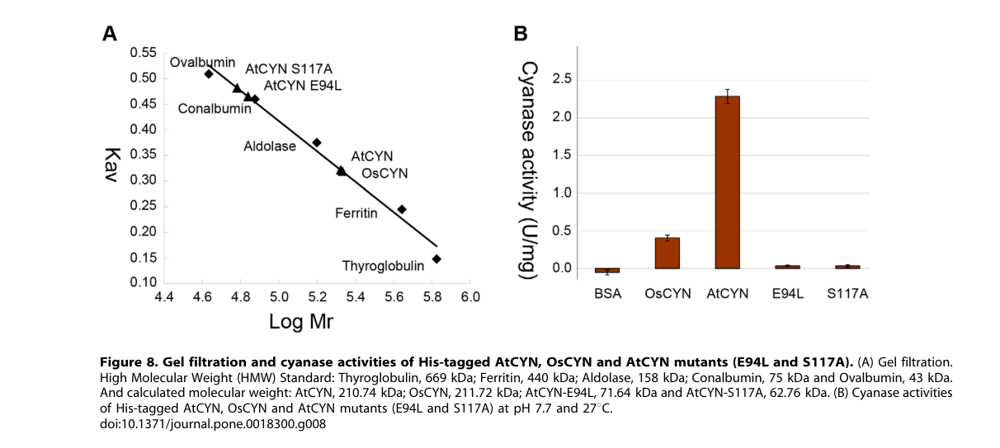

## Question

# Gene Research for Functional Annotation

## ⚠️ CRITICAL: Gene/Protein Identification Context

**BEFORE YOU BEGIN RESEARCH:** You MUST verify you are researching the CORRECT gene/protein. Gene symbols can be ambiguous, especially for less well-characterized genes from non-model organisms.

### Target Gene/Protein Identity (from UniProt):
- **UniProt Accession:** B9HSR7
- **Protein Description:** RecName: Full=Cyanate hydratase {ECO:0000255|HAMAP-Rule:MF_03139}; Short=Cyanase {ECO:0000255|HAMAP-Rule:MF_03139}; EC=4.2.1.104 {ECO:0000255|HAMAP-Rule:MF_03139}; AltName: Full=Cyanate hydrolase {ECO:0000255|HAMAP-Rule:MF_03139}; AltName: Full=Cyanate lyase {ECO:0000255|HAMAP-Rule:MF_03139};
- **Gene Information:** Name=CYN {ECO:0000255|HAMAP-Rule:MF_03139}; ORFNames=POPTRDRAFT_833411;
- **Organism (full):** Populus trichocarpa (Western balsam poplar) (Populus balsamifera subsp. trichocarpa).
- **Protein Family:** Belongs to the cyanase family. {ECO:0000255|HAMAP-
- **Key Domains:** Cyanase. (IPR008076); Cyanate_lyase_C. (IPR003712); Cyanate_lyase_C_sf. (IPR036581); Lambda_DNA-bd_dom_sf. (IPR010982); Cyanate_lyase (PF02560)

### MANDATORY VERIFICATION STEPS:

1. **Check if the gene symbol "CYN" matches the protein description above**
2. **Verify the organism is correct:** Populus trichocarpa (Western balsam poplar) (Populus balsamifera subsp. trichocarpa).
3. **Check if protein family/domains align with what you find in literature**
4. **If you find literature for a DIFFERENT gene with the same or similar symbol, STOP**

### If Gene Symbol is Ambiguous or You Cannot Find Relevant Literature:

**DO NOT PROCEED WITH RESEARCH ON A DIFFERENT GENE.** Instead:
- State clearly: "The gene symbol 'CYN' is ambiguous or literature is limited for this specific protein"
- Explain what you found (e.g., "Found extensive literature on a different gene with the same symbol in a different organism")
- Describe the protein based ONLY on the UniProt information provided above
- Suggest that the protein function can be inferred from domain/family information

### Research Target:

Please provide a comprehensive research report on the gene **CYN** (gene ID: CYN, UniProt: B9HSR7) in POPTR.

The research report should be a detailed narrative explaining the function, biological processes, and localization of the gene product. Citations should be given for all claims.

You should prioritize authoritative reviews and primary scientific literature when conducting research. You can supplement
this with annotations you find in gene/protein databases, but these can be outdated or inaccurate.

We are specifically interested in the primary function of the gene - for enzymes, what reaction is catalyzed, and what is the substrate specificity? For transporters, what is the substrate? For structural proteins or adapters, what is the broader structural role? For signaling molecules, what is the role in the pathway.

We are interested in where in or outside the cell the gene product carries out its function.

We are also interested in the signaling or biochemical pathways in which the gene functions. We are less interested in broad pleiotropic effects, except where these elucidate the precise role.

Include evidence where possible. We are interested in both experimental evidence as well as inference from structure, evolution, or bioinformatic analysis. Precise studies should be prioritized over high-throughput, where available.

## Output

Question: You are an expert researcher providing comprehensive, well-cited information.

Provide detailed information focusing on:
1. Key concepts and definitions with current understanding
2. Recent developments and latest research (prioritize 2023-2024 sources)
3. Current applications and real-world implementations
4. Expert opinions and analysis from authoritative sources
5. Relevant statistics and data from recent studies

Format as a comprehensive research report with proper citations. Include URLs and publication dates where available.
Always prioritize recent, authoritative sources and provide specific citations for all major claims.

# Gene Research for Functional Annotation

## ⚠️ CRITICAL: Gene/Protein Identification Context

**BEFORE YOU BEGIN RESEARCH:** You MUST verify you are researching the CORRECT gene/protein. Gene symbols can be ambiguous, especially for less well-characterized genes from non-model organisms.

### Target Gene/Protein Identity (from UniProt):
- **UniProt Accession:** B9HSR7
- **Protein Description:** RecName: Full=Cyanate hydratase {ECO:0000255|HAMAP-Rule:MF_03139}; Short=Cyanase {ECO:0000255|HAMAP-Rule:MF_03139}; EC=4.2.1.104 {ECO:0000255|HAMAP-Rule:MF_03139}; AltName: Full=Cyanate hydrolase {ECO:0000255|HAMAP-Rule:MF_03139}; AltName: Full=Cyanate lyase {ECO:0000255|HAMAP-Rule:MF_03139};
- **Gene Information:** Name=CYN {ECO:0000255|HAMAP-Rule:MF_03139}; ORFNames=POPTRDRAFT_833411;
- **Organism (full):** Populus trichocarpa (Western balsam poplar) (Populus balsamifera subsp. trichocarpa).
- **Protein Family:** Belongs to the cyanase family. {ECO:0000255|HAMAP-
- **Key Domains:** Cyanase. (IPR008076); Cyanate_lyase_C. (IPR003712); Cyanate_lyase_C_sf. (IPR036581); Lambda_DNA-bd_dom_sf. (IPR010982); Cyanate_lyase (PF02560)

### MANDATORY VERIFICATION STEPS:

1. **Check if the gene symbol "CYN" matches the protein description above**
2. **Verify the organism is correct:** Populus trichocarpa (Western balsam poplar) (Populus balsamifera subsp. trichocarpa).
3. **Check if protein family/domains align with what you find in literature**
4. **If you find literature for a DIFFERENT gene with the same or similar symbol, STOP**

### If Gene Symbol is Ambiguous or You Cannot Find Relevant Literature:

**DO NOT PROCEED WITH RESEARCH ON A DIFFERENT GENE.** Instead:
- State clearly: "The gene symbol 'CYN' is ambiguous or literature is limited for this specific protein"
- Explain what you found (e.g., "Found extensive literature on a different gene with the same symbol in a different organism")
- Describe the protein based ONLY on the UniProt information provided above
- Suggest that the protein function can be inferred from domain/family information

### Research Target:

Please provide a comprehensive research report on the gene **CYN** (gene ID: CYN, UniProt: B9HSR7) in POPTR.

The research report should be a detailed narrative explaining the function, biological processes, and localization of the gene product. Citations should be given for all claims.

You should prioritize authoritative reviews and primary scientific literature when conducting research. You can supplement
this with annotations you find in gene/protein databases, but these can be outdated or inaccurate.

We are specifically interested in the primary function of the gene - for enzymes, what reaction is catalyzed, and what is the substrate specificity? For transporters, what is the substrate? For structural proteins or adapters, what is the broader structural role? For signaling molecules, what is the role in the pathway.

We are interested in where in or outside the cell the gene product carries out its function.

We are also interested in the signaling or biochemical pathways in which the gene functions. We are less interested in broad pleiotropic effects, except where these elucidate the precise role.

Include evidence where possible. We are interested in both experimental evidence as well as inference from structure, evolution, or bioinformatic analysis. Precise studies should be prioritized over high-throughput, where available.

## Research report: Functional annotation of **CYN (cyanate hydratase/cyanase)** in *Populus trichocarpa* (UniProt **B9HSR7**; ORF **POPTRDRAFT_833411**)

### 1) Executive summary (identity verification and evidence scope)
The research target specified (UniProt **B9HSR7**) is annotated as **cyanate hydratase (cyanase), EC 4.2.1.104**, a member of the **cyanase family** (PF02560), in *Populus trichocarpa* (western balsam poplar). This identity is consistent with experimentally validated **plant cyanases** (Arabidopsis and rice) that are small cyanase-family enzymes with conserved catalytic residues and a characteristic **homodecameric** assembly. However, within the literature retrieved in this run, **no Populus-specific primary study** (biochemistry, mutants, localization, or expression profiling) was found for B9HSR7/POPTRDRAFT_833411. Therefore, the **highest-confidence functional statements for Populus CYN** are grounded in (i) cyanase-family conservation and (ii) **direct experimental evidence from other plants** (Arabidopsis/rice), explicitly flagged as inference rather than Populus-specific demonstration. (qian2011biochemicalandstructural pages 1-2, qian2011biochemicalandstructural pages 2-4)

| Claim category | Populus trichocarpa specific? (Y/N) | Best supporting source(s) with year/URL | Key details/quantitative data |
|---|---|---|---|
| Identity/domains | Y | UniProt B9HSR7 (user-provided target); plant cyanase family evidence from Qian et al., 2011, https://doi.org/10.1371/journal.pone.0018300 (qian2011biochemicalandstructural pages 1-2, qian2011biochemicalandstructural pages 2-4) | Target is **Populus trichocarpa CYN** / cyanate hydratase (cyanase; EC 4.2.1.104), assigned to the cyanase family. Plant cyanases characterized experimentally in Arabidopsis/rice are small proteins of **168 aa** and conserve the canonical cyanase catalytic motif architecture, supporting family-based annotation of B9HSR7 (qian2011biochemicalandstructural pages 1-2, qian2011biochemicalandstructural pages 2-4). |
| Reaction | N | Qian et al., 2011, https://doi.org/10.1371/journal.pone.0018300; Ranjan et al., 2021, https://doi.org/10.1038/s41598-020-79489-3 (qian2011biochemicalandstructural pages 1-2, ranjan2021crystalstructureof pages 1-2) | Cyanase catalyzes **bicarbonate-dependent cyanate decomposition** to **NH3/NH4+ and CO2**. This is the primary functional annotation most strongly supported for plant CYN homologs and is consistent with EC **4.2.1.104** assignment (qian2011biochemicalandstructural pages 1-2, ranjan2021crystalstructureof pages 1-2). |
| Substrate/cofactor | N | Qian et al., 2011, https://doi.org/10.1371/journal.pone.0018300 (qian2011biochemicalandstructural pages 6-7, qian2011biochemicalandstructural pages 7-8) | Required substrate/cofactor system is **cyanate + bicarbonate**. Reported **Km(NaHCO3)** values: **0.79 mM (AtCYN)** and **0.63 mM (OsCYN)**. Reported **Km(KCNO)** values differ markedly: about **0.94 mM (AtCYN)** vs **7.38 mM (OsCYN)**, indicating different cyanate affinities despite similar bicarbonate dependence (qian2011biochemicalandstructural pages 6-7, qian2011biochemicalandstructural pages 7-8). |
| Oligomerization | N | Qian et al., 2011, https://doi.org/10.1371/journal.pone.0018300; figure evidence (qian2011biochemicalandstructural media 679c544d, qian2011biochemicalandstructural media c2a17a22, qian2011biochemicalandstructural media faf6fd18) | Plant cyanases **AtCYN** and **OsCYN** form **homodecamers**. Gel filtration gave apparent native masses of about **210.7 kDa (AtCYN)** and **211.7 kDa (OsCYN)**, consistent with a decameric enzyme; this mirrors known cyanase family architecture (qian2011biochemicalandstructural pages 1-2, qian2011biochemicalandstructural pages 7-8, qian2011biochemicalandstructural media 679c544d). |
| Key residues | N | Qian et al., 2011, https://doi.org/10.1371/journal.pone.0018300 (qian2011biochemicalandstructural pages 1-2, qian2011biochemicalandstructural pages 2-4, qian2011biochemicalandstructural pages 6-7) | Conserved catalytic residues in plant cyanases correspond to **Arg96, Glu99, Ser122** in the Arabidopsis/rice alignment. Mutational data also implicate **Glu94** and **Ser117** in stability/decamer formation; **E94L** and **S117A** mutants lost activity and shifted to smaller/non-decameric assemblies (**71.64 kDa** and **62.76 kDa** apparent MW) (qian2011biochemicalandstructural pages 6-7, qian2011biochemicalandstructural pages 1-2, qian2011biochemicalandstructural pages 2-4). |
| Physiological role | N | Qian et al., 2011, https://doi.org/10.1371/journal.pone.0018300; Martinez & Diaz, 2024, https://doi.org/10.3390/plants13091239 (qian2011biochemicalandstructural pages 1-2, qian2011biochemicalandstructural pages 2-4, martinez2024plantcyanogenicderivedmetabolites pages 9-10) | Best-supported plant role is **cyanate detoxification** with potential contribution to **nitrogen recycling/assimilation** by releasing ammonium. In Arabidopsis, **KCNO inhibited germination and early seedling growth**; **cyn-7 knockout** failed to germinate at **1–2 mM KCNO**, whereas lines expressing **AtCYN or OsCYN** were more resistant (qian2011biochemicalandstructural pages 1-2, qian2011biochemicalandstructural pages 2-4). Recent review context also notes cyanase can detoxify endogenous/exogenous cyanate and links cyanate production to **carbamoyl phosphate** breakdown and broader nitrogen metabolism (martinez2024plantcyanogenicderivedmetabolites pages 9-10). |
| Expression/stress regulation | N | Qian et al., 2011, https://doi.org/10.1371/journal.pone.0018300 (qian2011biochemicalandstructural pages 6-7, qian2011biochemicalandstructural pages 1-2, qian2011biochemicalandstructural pages 7-8) | **AtCYN transcript** is highest in **flowers** (~**3-fold** above seedling/root/stem; leaves about **half** seedling level). Under **KCNO** or **NaCl**, transcript levels initially decrease during the first **12 h** then increase; **continuous salt stress induces AtCYN**, whereas continuous KCNO does **not** significantly induce it. A promoter **ethylene-responsive element (ATTTAAAA)** was noted, suggesting regulatory coupling to stress/ethylene-related metabolism (qian2011biochemicalandstructural pages 6-7, qian2011biochemicalandstructural pages 7-8). |
| Localization | N | No direct Populus localization paper retrieved; Qian et al., 2011 did not report subcellular localization (qian2011biochemicalandstructural pages 6-7, qian2011biochemicalandstructural pages 1-2) | **Direct subcellular localization evidence was not retrieved** for Populus CYN or for the Arabidopsis/rice experimental study used here. Therefore localization for B9HSR7 should be considered **unresolved from the retrieved primary literature** rather than inferred confidently (qian2011biochemicalandstructural pages 6-7, qian2011biochemicalandstructural pages 1-2). |
| Notes/limitations | Y | Populus-specific literature searches in this run found no direct primary study; inference anchored to UniProt B9HSR7 plus plant cyanase experiments/reviews (qian2011biochemicalandstructural pages 6-7, qian2011biochemicalandstructural pages 1-2, ranjan2021crystalstructureof pages 1-2, martinez2024plantcyanogenicderivedmetabolites pages 9-10) | The gene symbol **CYN** is taxonomically broad/ambiguous, so annotation must stay anchored to **UniProt B9HSR7, Populus trichocarpa**. No direct Populus biochemical, mutant, or localization study was retrieved here; thus most functional claims for B9HSR7 are **high-confidence family-based inference from experimentally characterized plant cyanases (Arabidopsis/rice)** rather than organism-specific demonstration. |

*Table: This table summarizes the strongest functional annotation evidence for Populus trichocarpa CYN (UniProt B9HSR7), separating direct Populus-specific facts from inference based on experimentally characterized plant cyanases in Arabidopsis and rice. It is useful for distinguishing high-confidence enzymatic annotation from remaining evidence gaps such as localization and Populus-specific validation.*

### 2) Key concepts and definitions (current understanding)

#### 2.1 Cyanase / cyanate hydratase (EC 4.2.1.104)
Cyanase (also called **cyanate hydratase**, **cyanate hydrolase**, or **cyanate lyase**) catalyzes a **bicarbonate-dependent** conversion of **cyanate (OCN−/CNO−)** into **ammonia/ammonium and carbon dioxide**. In the plant cyanase study used as primary evidence, the authors describe cyanase as catalyzing cyanate decomposition in a **bicarbonate-dependent reaction** producing **CO2 and NH3**. (qian2011biochemicalandstructural pages 1-2, ranjan2021crystalstructureof pages 1-2)

A widely used stoichiometric description (as summarized in a 2024 remediation-focused source) is:
**CNO− + HCO3− + 2H+ → 2 CO2 + NH3**. (sedova2024účinnábioremediacetoxického pages 37-41)

#### 2.2 Biological context of cyanate in plants
Cyanate is considered broadly **toxic** and cyanase-mediated conversion to ammonium/CO2 provides a plausible **detoxification** and potential **nitrogen recycling/assimilation** route. A plant primary study shows that exogenous potassium cyanate (KCNO) inhibits germination/early seedling growth, while cyanase expression confers resistance, supporting a detoxification role. (qian2011biochemicalandstructural pages 1-2, qian2011biochemicalandstructural pages 2-4)

A 2024 review further links cyanate metabolism to nitrogen biochemistry by noting that cyanate can arise from dissociation of **carbamoyl phosphate**, suggesting connections to arginine and pyrimidine metabolism through cyanate concentration control. (martinez2024plantcyanogenicderivedmetabolites pages 9-10)

### 3) Molecular function of plant CYN/cyanase (reaction, substrate specificity, mechanism)

#### 3.1 Substrates and co-substrates
Plant cyanases require **cyanate** and **bicarbonate**; kinetic measurements in Arabidopsis (AtCYN) and rice (OsCYN) explicitly quantify bicarbonate dependence:
- **Km(NaHCO3)**: **0.79 mM** (AtCYN) and **0.63 mM** (OsCYN). (qian2011biochemicalandstructural pages 6-7)

Cyanate affinity differs markedly between the two plant enzymes:
- **Km(KCNO)**: ~**0.94 mM** (AtCYN) vs ~**7.38 mM** (OsCYN). (qian2011biochemicalandstructural pages 7-8)

These data support a model where Populus B9HSR7 (a cyanase-family homolog) likely shares **cyanate + bicarbonate** substrate requirements, while kinetic constants may vary across plant lineages.

#### 3.2 Catalytic residues and mechanism-related constraints
In the Arabidopsis/rice cyanase study, canonical catalytic residues annotated for bacterial cyanase (E. coli) are conserved in plant enzymes:
- **Arg96, Glu99, Ser122** (numbering as reported in the plant study’s alignment context). (qian2011biochemicalandstructural pages 1-2, qian2011biochemicalandstructural pages 2-4)

Mutagenesis in Arabidopsis cyanase also showed that residues contribute to both catalysis and **assembly stability**:
- Mutants **E94L** and **S117A** lost activity and shifted to smaller apparent oligomers, implicating these residues in the stability of the active multimer. (qian2011biochemicalandstructural pages 6-7, qian2011biochemicalandstructural pages 7-8)

A mechanistic description from an authoritative biodegradation review describes cyanase as acting via bicarbonate as a nucleophile forming an unstable intermediate (carbamate), consistent with a two-step chemical logic for the overall conversion to CO2 and ammonia. (sharma2019areviewon pages 6-7)

### 4) Protein structure, oligomerization, and inferred structural biology relevance
Plant cyanases form **homodecamers**, consistent with cyanase-family architecture:
- Gel filtration estimates for native masses: **~210.7 kDa (AtCYN)** and **~211.7 kDa (OsCYN)**. (qian2011biochemicalandstructural pages 7-8)
- Visual evidence (gel filtration/oligomerization and activity) was retrieved from the 2011 plant cyanase paper. (qian2011biochemicalandstructural media 679c544d)

The E94L and S117A Arabidopsis mutants showed substantially reduced apparent molecular weights (**71.64 kDa** and **62.76 kDa**, respectively), aligning with disruption of decamer formation and loss of catalytic activity. (qian2011biochemicalandstructural pages 6-7, qian2011biochemicalandstructural pages 7-8)

A fungal cyanase structure paper reinforces that cyanases commonly assemble into higher-order oligomers (for the thermophilic fungal enzyme, a **decamer formed by a pentamer of dimers**) and reiterates bicarbonate-dependent catalysis to ammonium and CO2. (ranjan2021crystalstructureof pages 1-2)

### 5) Biological processes and physiological roles in plants (experimental evidence)

#### 5.1 Cyanate detoxification and cyanate tolerance
A primary plant study provides direct genetic and physiological evidence that cyanase contributes to cyanate tolerance:
- A cyanase knockout line (**cyn-7**) failed to germinate at **1–2 mM KCNO**, while wild type was comparatively resistant; knock-down lines showed reduced germination/growth, linking the gene to cyanate handling in vivo. (qian2011biochemicalandstructural pages 2-4)
- Transgenic expression of **AtCYN** or **OsCYN** conferred resistance to cyanate stress (KCNO). (qian2011biochemicalandstructural pages 1-2)

A corresponding phenotype figure (KCNO stress) was retrieved as visual evidence. (qian2011biochemicalandstructural media faf6fd18)

#### 5.2 Stress-linked regulation and organ expression
The same study reports organ-biased expression and stress responses:
- **AtCYN transcripts** are highest in **flowers** (reported ~**3-fold** higher than seedling/root/stem), and lower in leaves (~half of seedling). (qian2011biochemicalandstructural pages 6-7)
- Under KCNO or NaCl treatments, AtCYN transcripts decreased over the first ~12 hours then increased; continuous **salt stress induced AtCYN**, whereas continuous KCNO did not significantly induce it. (qian2011biochemicalandstructural pages 6-7, qian2011biochemicalandstructural pages 7-8)

These observations support a view of cyanase as part of a broader stress response (including salinity-associated regulation) in at least Arabidopsis.

### 6) Subcellular localization and site of action
In the retrieved primary plant cyanase study, **subcellular localization was not reported**, and no Populus-specific localization paper was retrieved. Therefore, the **cellular compartment** in which Populus B9HSR7 functions cannot be assigned confidently from the available evidence in this run and remains an explicit knowledge gap for this specific target. (qian2011biochemicalandstructural pages 6-7, qian2011biochemicalandstructural pages 1-2)

### 7) Pathways and systems context: cyanogenesis, cyanide/cyanate detoxification, and nitrogen cycling

#### 7.1 Placement within cyanide/cyanogenic metabolism
A 2024 plant-focused review frames cyanogenesis as a defensive system producing HCN, and discusses detoxification mechanisms employed by herbivores (and by extension relevant to plants) including **β-cyanoalanine synthases**, **rhodaneses**, and **cyanases**. (martinez2024plantcyanogenicderivedmetabolites pages 1-2)

This review describes cyanase as catalyzing cyanate + bicarbonate → ammonium + CO2, and notes that cyanase-mediated cyanide detoxification requires **prior oxidation of cyanide to cyanate** (e.g., by cyanide monooxygenases) in organisms using that route. (martinez2024plantcyanogenicderivedmetabolites pages 9-10)

#### 7.2 Integration with nitrogen metabolism and environmental nitrogen cycling
Cyanase can convert cyanate into **ammonium**, which can feed into nitrogen assimilation pathways. A key conceptual advance in nitrogen cycling literature is that cyanate can serve as a substrate in diverse organisms and can be transformed to ammonium by cyanase, enabling growth or cross-feeding in microbial communities; this broader framework supports interpreting plant cyanase as a detoxification and potential nitrogen-recovery enzyme when cyanate is available. (ranjan2021crystalstructureof pages 1-2)

### 8) Recent developments (2023–2024 prioritized)

#### 8.1 2024: Plant–herbivore interaction perspective and cyanase expansion via HGT
Martinez & Diaz (Plants, **April 2024**) summarize cyanase as part of detoxification strategies in the plant–herbivore chemical ecology landscape, including the requirement for cyanate (often after cyanide oxidation) and the connection to carbamoyl phosphate-derived cyanate. The review highlights cyanase distribution across taxa and emphasizes horizontal gene transfer into some eukaryotes (e.g., herbivores), underscoring cyanase as a broadly deployable cyanate-detoxification module. URL: https://doi.org/10.3390/plants13091239 (martinez2024plantcyanogenicderivedmetabolites pages 9-10)

#### 8.2 2024: Comparative genomics for cyanide/cyanate biodegradation genes
Sáez et al. (IJMS, **April 2024**) apply a phylogenomic/pangenomic approach within Pseudomonas to identify and contextualize genes involved in cyanide resistance and assimilation. They identify **cynS** as a key cyanate assimilation gene and use genome filtering steps (36→27→21 genomes; 18/21 = **85.7%** meeting ANI >97% in one dataset) to refine comparative analyses, illustrating how modern genomics is used for **bioprospecting** cyanotrophy/cyanate metabolism functions. URL: https://doi.org/10.3390/ijms25084456 (saez2024genomicinsightsinto pages 2-3, saez2024genomicinsightsinto pages 1-2)

### 9) Current applications and real-world implementations

#### 9.1 Wastewater/industrial cyanide remediation via cyanate conversion and cyanase assimilation
A well-defined implementation logic is to oxidize cyanide to cyanate (chemically) and then use cyanase-containing microbes/enzymes to convert cyanate to ammonium and CO2. In Pseudomonas pseudoalcaligenes CECT5344, cyanate assimilation depends on a cyanase encoded in the cyn gene cluster, and the study reports biodegradation of hazardous jewelry wastewater after chemical oxidation of cyanide to cyanate. (sharma2019areviewon pages 6-7)

#### 9.2 Enzyme immobilization and nanomaterial-supported cyanase systems
A 2024 remediation-oriented source summarizes heterologous expression and immobilization strategies for cyanase, including cyanase from *Thermomyces lanuginosus* immobilized on modified magnetic multi-walled carbon nanotubes, with model tests including cyanate at **168 mg/L** and heavy metals, illustrating the applied engineering direction for robust cyanate detoxification systems in complex matrices. (sedova2024účinnábioremediacetoxického pages 37-41)

### 10) Expert synthesis and authoritative interpretation (what the evidence supports for Populus CYN)

1. **Primary molecular function (high confidence)**: Populus CYN (B9HSR7) is best annotated as a **cyanase (cyanate hydratase; EC 4.2.1.104)** catalyzing **bicarbonate-dependent decomposition of cyanate to NH3/NH4+ and CO2**, based on strong cyanase-family conservation and direct enzymology in other plants. (qian2011biochemicalandstructural pages 1-2, ranjan2021crystalstructureof pages 1-2)

2. **Substrate/cofactor requirements (high confidence)**: The enzyme requires **cyanate** and **bicarbonate**; plant enzyme kinetics quantify millimolar-range bicarbonate dependence and species-specific cyanate affinity differences, which should be anticipated for Populus orthologs/paralogs. (qian2011biochemicalandstructural pages 6-7, qian2011biochemicalandstructural pages 7-8)

3. **Likely oligomerization (high confidence)**: Plant cyanases form **homodecamers** near ~211 kDa, and destabilization of decamer assembly abolishes activity, suggesting Populus CYN likely requires correct multimerization for function. (qian2011biochemicalandstructural pages 7-8, qian2011biochemicalandstructural media 679c544d)

4. **Physiological role (moderate-to-high confidence in plants; indirect for Populus)**: Genetic evidence in Arabidopsis supports a role in **cyanate detoxification** and cyanate-stress tolerance. Extrapolating to Populus is plausible but remains **inference** without Populus-specific experiments. (qian2011biochemicalandstructural pages 2-4, qian2011biochemicalandstructural media faf6fd18)

5. **Localization (unknown from retrieved evidence)**: Subcellular localization of Populus B9HSR7 remains **unresolved** in the retrieved literature set and should not be asserted without additional database/prediction or experimental data. (qian2011biochemicalandstructural pages 6-7, qian2011biochemicalandstructural pages 1-2)

### 11) Key statistics/data points (from recent and foundational studies)
- Plant enzyme kinetics: **Km(NaHCO3) 0.79 mM (AtCYN) / 0.63 mM (OsCYN)**; **Km(KCNO) ~0.94 mM (AtCYN) / ~7.38 mM (OsCYN)**; specific activities at 27°C: **2.286 U/mg (AtCYN) / 0.405 U/mg (OsCYN)**. (qian2011biochemicalandstructural pages 6-7, qian2011biochemicalandstructural pages 7-8, qian2011biochemicalandstructural pages 2-4)
- Oligomerization: gel filtration apparent masses **~210.7–211.7 kDa** (decamer); destabilized mutants at **~62.76–71.64 kDa**. (qian2011biochemicalandstructural pages 7-8, qian2011biochemicalandstructural media 679c544d)
- Arabidopsis phenotype: cyn knockout **fails to germinate at 1–2 mM KCNO**; transgenic expression restores resistance. (qian2011biochemicalandstructural pages 2-4, qian2011biochemicalandstructural media faf6fd18)
- 2024 comparative genomics (Pseudomonas): dataset filtering **36→27→21 genomes**; **18/21 (85.7%)** with ANI >97% in a P. oleovorans analysis workflow, illustrating modern gene-centered comparative approaches. (saez2024genomicinsightsinto pages 2-3)
- Applied concentration example (secondary): cyanate **168 mg/L** in model tests for immobilized cyanase systems. (sedova2024účinnábioremediacetoxického pages 37-41)

### 12) Evidence gaps and recommendations for next-step validation (Populus-specific)
Because Populus-specific primary literature for B9HSR7 was not retrieved here, the following remain open for Populus CYN and would be high priority for completing functional annotation:
- **Subcellular localization** (e.g., GFP fusion, organelle proteomics, or targeted predictions validated experimentally). (qian2011biochemicalandstructural pages 6-7, qian2011biochemicalandstructural pages 1-2)
- **Expression context in Populus** (tissue specificity, seasonal/stress regulation) to test whether Populus mirrors Arabidopsis floral enrichment and salt responsiveness. (qian2011biochemicalandstructural pages 6-7)
- **Biochemical validation** (recombinant enzyme kinetics, bicarbonate dependence) to confirm Populus-specific Km and pH/temperature optima. (qian2011biochemicalandstructural pages 7-8, qian2011biochemicalandstructural pages 2-4)

### 13) Key sources (URLs and publication dates)
- Qian D. et al. **Biochemical and Structural Properties of Cyanases from Arabidopsis thaliana and Oryza sativa**. *PLoS ONE*. **March 2011**. https://doi.org/10.1371/journal.pone.0018300 (qian2011biochemicalandstructural pages 1-2, qian2011biochemicalandstructural pages 2-4)
- Ranjan B. et al. **Crystal structure of a thermophilic fungal cyanase and its implications on the catalytic mechanism for bioremediation**. *Scientific Reports*. **January 2021**. https://doi.org/10.1038/s41598-020-79489-3 (ranjan2021crystalstructureof pages 1-2)
- Martinez M., Diaz I. **Plant Cyanogenic-Derived Metabolites and Herbivore Counter-Defences**. *Plants*. **April 2024**. https://doi.org/10.3390/plants13091239 (martinez2024plantcyanogenicderivedmetabolites pages 9-10)
- Boter M., Diaz I. **Cyanogenesis, a Plant Defence Strategy against Herbivores**. *International Journal of Molecular Sciences*. **April 2023**. https://doi.org/10.3390/ijms24086982 (boter2023cyanogenesisaplant pages 12-12)
- Sáez L.P. et al. **Genomic Insights into Cyanide Biodegradation in the Pseudomonas Genus**. *International Journal of Molecular Sciences*. **April 2024**. https://doi.org/10.3390/ijms25084456 (saez2024genomicinsightsinto pages 2-3)
- Sharma M. et al. **A review on remediation of cyanide containing industrial wastes using biological systems with special reference to enzymatic degradation**. *World Journal of Microbiology and Biotechnology*. **April 2019**. https://doi.org/10.1007/s11274-019-2643-8 (sharma2019areviewon pages 6-7)

References

1. (qian2011biochemicalandstructural pages 1-2): D. Qian, Lin-lin Jiang, Lu Lu, Chunhong Wei, and Yi Li. Biochemical and structural properties of cyanases from arabidopsis thaliana and oryza sativa. PLoS ONE, 6:e18300, Mar 2011. URL: https://doi.org/10.1371/journal.pone.0018300, doi:10.1371/journal.pone.0018300. This article has 39 citations and is from a peer-reviewed journal.

2. (qian2011biochemicalandstructural pages 2-4): D. Qian, Lin-lin Jiang, Lu Lu, Chunhong Wei, and Yi Li. Biochemical and structural properties of cyanases from arabidopsis thaliana and oryza sativa. PLoS ONE, 6:e18300, Mar 2011. URL: https://doi.org/10.1371/journal.pone.0018300, doi:10.1371/journal.pone.0018300. This article has 39 citations and is from a peer-reviewed journal.

3. (ranjan2021crystalstructureof pages 1-2): Bibhuti Ranjan, Philip H. Choi, Santhosh Pillai, Kugenthiren Permaul, Liang Tong, and Suren Singh. Crystal structure of a thermophilic fungal cyanase and its implications on the catalytic mechanism for bioremediation. Scientific Reports, Jan 2021. URL: https://doi.org/10.1038/s41598-020-79489-3, doi:10.1038/s41598-020-79489-3. This article has 6 citations and is from a peer-reviewed journal.

4. (qian2011biochemicalandstructural pages 6-7): D. Qian, Lin-lin Jiang, Lu Lu, Chunhong Wei, and Yi Li. Biochemical and structural properties of cyanases from arabidopsis thaliana and oryza sativa. PLoS ONE, 6:e18300, Mar 2011. URL: https://doi.org/10.1371/journal.pone.0018300, doi:10.1371/journal.pone.0018300. This article has 39 citations and is from a peer-reviewed journal.

5. (qian2011biochemicalandstructural pages 7-8): D. Qian, Lin-lin Jiang, Lu Lu, Chunhong Wei, and Yi Li. Biochemical and structural properties of cyanases from arabidopsis thaliana and oryza sativa. PLoS ONE, 6:e18300, Mar 2011. URL: https://doi.org/10.1371/journal.pone.0018300, doi:10.1371/journal.pone.0018300. This article has 39 citations and is from a peer-reviewed journal.

6. (qian2011biochemicalandstructural media 679c544d): D. Qian, Lin-lin Jiang, Lu Lu, Chunhong Wei, and Yi Li. Biochemical and structural properties of cyanases from arabidopsis thaliana and oryza sativa. PLoS ONE, 6:e18300, Mar 2011. URL: https://doi.org/10.1371/journal.pone.0018300, doi:10.1371/journal.pone.0018300. This article has 39 citations and is from a peer-reviewed journal.

7. (qian2011biochemicalandstructural media c2a17a22): D. Qian, Lin-lin Jiang, Lu Lu, Chunhong Wei, and Yi Li. Biochemical and structural properties of cyanases from arabidopsis thaliana and oryza sativa. PLoS ONE, 6:e18300, Mar 2011. URL: https://doi.org/10.1371/journal.pone.0018300, doi:10.1371/journal.pone.0018300. This article has 39 citations and is from a peer-reviewed journal.

8. (qian2011biochemicalandstructural media faf6fd18): D. Qian, Lin-lin Jiang, Lu Lu, Chunhong Wei, and Yi Li. Biochemical and structural properties of cyanases from arabidopsis thaliana and oryza sativa. PLoS ONE, 6:e18300, Mar 2011. URL: https://doi.org/10.1371/journal.pone.0018300, doi:10.1371/journal.pone.0018300. This article has 39 citations and is from a peer-reviewed journal.

9. (martinez2024plantcyanogenicderivedmetabolites pages 9-10): Manuel Martinez and Isabel Diaz. Plant cyanogenic-derived metabolites and herbivore counter-defences. Plants, 13:1239, Apr 2024. URL: https://doi.org/10.3390/plants13091239, doi:10.3390/plants13091239. This article has 20 citations.

10. (sedova2024účinnábioremediacetoxického pages 37-41): A Sedova. Účinná bioremediace toxického odpadu pomocí nových nitrilas. Unknown journal, 2024.

11. (sharma2019areviewon pages 6-7): Monica Sharma, Yusuf Akhter, and Subhankar Chatterjee. A review on remediation of cyanide containing industrial wastes using biological systems with special reference to enzymatic degradation. World Journal of Microbiology and Biotechnology, Apr 2019. URL: https://doi.org/10.1007/s11274-019-2643-8, doi:10.1007/s11274-019-2643-8. This article has 105 citations and is from a peer-reviewed journal.

12. (martinez2024plantcyanogenicderivedmetabolites pages 1-2): Manuel Martinez and Isabel Diaz. Plant cyanogenic-derived metabolites and herbivore counter-defences. Plants, 13:1239, Apr 2024. URL: https://doi.org/10.3390/plants13091239, doi:10.3390/plants13091239. This article has 20 citations.

13. (saez2024genomicinsightsinto pages 2-3): Lara P. Sáez, Gema Rodríguez-Caballero, Alfonso Olaya-Abril, Purificación Cabello, Conrado Moreno-Vivián, María Dolores Roldán, and Víctor M. Luque-Almagro. Genomic insights into cyanide biodegradation in the pseudomonas genus. International Journal of Molecular Sciences, 25:4456, Apr 2024. URL: https://doi.org/10.3390/ijms25084456, doi:10.3390/ijms25084456. This article has 8 citations.

14. (saez2024genomicinsightsinto pages 1-2): Lara P. Sáez, Gema Rodríguez-Caballero, Alfonso Olaya-Abril, Purificación Cabello, Conrado Moreno-Vivián, María Dolores Roldán, and Víctor M. Luque-Almagro. Genomic insights into cyanide biodegradation in the pseudomonas genus. International Journal of Molecular Sciences, 25:4456, Apr 2024. URL: https://doi.org/10.3390/ijms25084456, doi:10.3390/ijms25084456. This article has 8 citations.

15. (boter2023cyanogenesisaplant pages 12-12): Marta Boter and Isabel Diaz. Cyanogenesis, a plant defence strategy against herbivores. International Journal of Molecular Sciences, 24:6982, Apr 2023. URL: https://doi.org/10.3390/ijms24086982, doi:10.3390/ijms24086982. This article has 37 citations.

## Artifacts

- [Edison artifact artifact-00](CYN-deep-research-falcon_artifacts/artifact-00.md)

## Citations

1. martinez2024plantcyanogenicderivedmetabolites pages 9-10
2. qian2011biochemicalandstructural pages 6-7
3. qian2011biochemicalandstructural pages 7-8
4. sharma2019areviewon pages 6-7
5. ranjan2021crystalstructureof pages 1-2
6. qian2011biochemicalandstructural pages 2-4
7. qian2011biochemicalandstructural pages 1-2
8. martinez2024plantcyanogenicderivedmetabolites pages 1-2
9. saez2024genomicinsightsinto pages 2-3
10. boter2023cyanogenesisaplant pages 12-12
11. saez2024genomicinsightsinto pages 1-2
12. https://doi.org/10.1371/journal.pone.0018300
13. https://doi.org/10.1371/journal.pone.0018300;
14. https://doi.org/10.1038/s41598-020-79489-3
15. https://doi.org/10.3390/plants13091239
16. https://doi.org/10.3390/ijms25084456
17. https://doi.org/10.3390/ijms24086982
18. https://doi.org/10.1007/s11274-019-2643-8
19. https://doi.org/10.1371/journal.pone.0018300,
20. https://doi.org/10.1038/s41598-020-79489-3,
21. https://doi.org/10.3390/plants13091239,
22. https://doi.org/10.1007/s11274-019-2643-8,
23. https://doi.org/10.3390/ijms25084456,
24. https://doi.org/10.3390/ijms24086982,