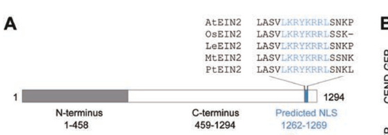

## Question

# Gene Research for Functional Annotation

## ⚠️ CRITICAL: Gene/Protein Identification Context

**BEFORE YOU BEGIN RESEARCH:** You MUST verify you are researching the CORRECT gene/protein. Gene symbols can be ambiguous, especially for less well-characterized genes from non-model organisms.

### Target Gene/Protein Identity (from UniProt):
- **UniProt Accession:** A0A3N7G677
- **Protein Description:** RecName: Full=Ethylene-insensitive protein 2.1 {ECO:0000303|PubMed:35700212}; Short=PotriEIN2.1 {ECO:0000303|PubMed:35700212}; Contains: RecName: Full=EIN2.1-CEND {ECO:0000250|UniProtKB:Q9S814};
- **Gene Information:** Name=EIN2.1 {ECO:0000303|PubMed:35700212}; OrderedLocusNames=Potri.016G090800 {ECO:0000305};
- **Organism (full):** Populus trichocarpa (Western balsam poplar) (Populus balsamifera subsp. trichocarpa).
- **Protein Family:** Belongs to the NRAMP (TC 2.A.55) family. .
- **Key Domains:** EIN2. (IPR017187); NRAMP_fam. (IPR001046); Nramp (PF01566)

### MANDATORY VERIFICATION STEPS:

1. **Check if the gene symbol "EIN2.1" matches the protein description above**
2. **Verify the organism is correct:** Populus trichocarpa (Western balsam poplar) (Populus balsamifera subsp. trichocarpa).
3. **Check if protein family/domains align with what you find in literature**
4. **If you find literature for a DIFFERENT gene with the same or similar symbol, STOP**

### If Gene Symbol is Ambiguous or You Cannot Find Relevant Literature:

**DO NOT PROCEED WITH RESEARCH ON A DIFFERENT GENE.** Instead:
- State clearly: "The gene symbol 'EIN2.1' is ambiguous or literature is limited for this specific protein"
- Explain what you found (e.g., "Found extensive literature on a different gene with the same symbol in a different organism")
- Describe the protein based ONLY on the UniProt information provided above
- Suggest that the protein function can be inferred from domain/family information

### Research Target:

Please provide a comprehensive research report on the gene **EIN2.1** (gene ID: EIN2.1, UniProt: A0A3N7G677) in POPTR.

The research report should be a detailed narrative explaining the function, biological processes, and localization of the gene product. Citations should be given for all claims.

You should prioritize authoritative reviews and primary scientific literature when conducting research. You can supplement
this with annotations you find in gene/protein databases, but these can be outdated or inaccurate.

We are specifically interested in the primary function of the gene - for enzymes, what reaction is catalyzed, and what is the substrate specificity? For transporters, what is the substrate? For structural proteins or adapters, what is the broader structural role? For signaling molecules, what is the role in the pathway.

We are interested in where in or outside the cell the gene product carries out its function.

We are also interested in the signaling or biochemical pathways in which the gene functions. We are less interested in broad pleiotropic effects, except where these elucidate the precise role.

Include evidence where possible. We are interested in both experimental evidence as well as inference from structure, evolution, or bioinformatic analysis. Precise studies should be prioritized over high-throughput, where available.

## Output

Question: You are an expert researcher providing comprehensive, well-cited information.

Provide detailed information focusing on:
1. Key concepts and definitions with current understanding
2. Recent developments and latest research (prioritize 2023-2024 sources)
3. Current applications and real-world implementations
4. Expert opinions and analysis from authoritative sources
5. Relevant statistics and data from recent studies

Format as a comprehensive research report with proper citations. Include URLs and publication dates where available.
Always prioritize recent, authoritative sources and provide specific citations for all major claims.

# Gene Research for Functional Annotation

## ⚠️ CRITICAL: Gene/Protein Identification Context

**BEFORE YOU BEGIN RESEARCH:** You MUST verify you are researching the CORRECT gene/protein. Gene symbols can be ambiguous, especially for less well-characterized genes from non-model organisms.

### Target Gene/Protein Identity (from UniProt):
- **UniProt Accession:** A0A3N7G677
- **Protein Description:** RecName: Full=Ethylene-insensitive protein 2.1 {ECO:0000303|PubMed:35700212}; Short=PotriEIN2.1 {ECO:0000303|PubMed:35700212}; Contains: RecName: Full=EIN2.1-CEND {ECO:0000250|UniProtKB:Q9S814};
- **Gene Information:** Name=EIN2.1 {ECO:0000303|PubMed:35700212}; OrderedLocusNames=Potri.016G090800 {ECO:0000305};
- **Organism (full):** Populus trichocarpa (Western balsam poplar) (Populus balsamifera subsp. trichocarpa).
- **Protein Family:** Belongs to the NRAMP (TC 2.A.55) family. .
- **Key Domains:** EIN2. (IPR017187); NRAMP_fam. (IPR001046); Nramp (PF01566)

### MANDATORY VERIFICATION STEPS:

1. **Check if the gene symbol "EIN2.1" matches the protein description above**
2. **Verify the organism is correct:** Populus trichocarpa (Western balsam poplar) (Populus balsamifera subsp. trichocarpa).
3. **Check if protein family/domains align with what you find in literature**
4. **If you find literature for a DIFFERENT gene with the same or similar symbol, STOP**

### If Gene Symbol is Ambiguous or You Cannot Find Relevant Literature:

**DO NOT PROCEED WITH RESEARCH ON A DIFFERENT GENE.** Instead:
- State clearly: "The gene symbol 'EIN2.1' is ambiguous or literature is limited for this specific protein"
- Explain what you found (e.g., "Found extensive literature on a different gene with the same symbol in a different organism")
- Describe the protein based ONLY on the UniProt information provided above
- Suggest that the protein function can be inferred from domain/family information

### Research Target:

Please provide a comprehensive research report on the gene **EIN2.1** (gene ID: EIN2.1, UniProt: A0A3N7G677) in POPTR.

The research report should be a detailed narrative explaining the function, biological processes, and localization of the gene product. Citations should be given for all claims.

You should prioritize authoritative reviews and primary scientific literature when conducting research. You can supplement
this with annotations you find in gene/protein databases, but these can be outdated or inaccurate.

We are specifically interested in the primary function of the gene - for enzymes, what reaction is catalyzed, and what is the substrate specificity? For transporters, what is the substrate? For structural proteins or adapters, what is the broader structural role? For signaling molecules, what is the role in the pathway.

We are interested in where in or outside the cell the gene product carries out its function.

We are also interested in the signaling or biochemical pathways in which the gene functions. We are less interested in broad pleiotropic effects, except where these elucidate the precise role.

Include evidence where possible. We are interested in both experimental evidence as well as inference from structure, evolution, or bioinformatic analysis. Precise studies should be prioritized over high-throughput, where available.

## Comprehensive Research Report: Functional Annotation of *Populus trichocarpa* EIN2.1 (UniProt A0A3N7G677; Potri.016G090800)

### 0) Identity verification and scope limitations
The requested target is *Populus trichocarpa* **EIN2.1** (locus **Potri.016G090800**), UniProt **A0A3N7G677**, described as “Ethylene-insensitive protein 2.1 (PotriEIN2.1)” and containing an EIN2.1 C-terminal end (CEND) region (per user-supplied UniProt record). In the literature retrieved in this tool environment, **no Populus-trichocarpa–specific primary study explicitly naming Potri.016G090800 / A0A3N7G677** was obtained; instead, evidence comes from (i) **canonical EIN2 mechanism** established in Arabidopsis and extended in monocots, and (ii) **Populus/hybrid aspen ethylene-signaling phenotypes** at the pathway level (tension wood), without mapping to the specific Populus EIN2.1 locus. Therefore, Populus EIN2.1 functional statements below are explicitly labeled as either **direct Populus evidence** (pathway/phenotype) or **family-based inference** (mechanism conserved across plants). (seyfferth2019ethylenesignalingis pages 10-11, seyfferth2019ethylenesignalingis pages 1-2, wen2012activationofethylene media ed6d548c)

### 1) Key concepts and definitions (current understanding)

#### 1.1 Ethylene signaling core module
Ethylene is perceived by **ER-membrane–anchored receptors** that regulate the Raf-like kinase **CTR1**, a key negative regulator. In the absence of ethylene, CTR1 inhibits signaling by **phosphorylating EIN2**, and phosphorylated EIN2 is targeted for degradation; ethylene perception inactivates CTR1, enabling EIN2 activation. (khan2024roleofethylene pages 2-4)

#### 1.2 EIN2 as a central signal transducer
EIN2 is widely described as the **central transducer** linking receptor/CTR1 activity to downstream transcriptional reprogramming via EIN3/EIL transcription factors. (mohorovic2024ethyleneinhibitsphotosynthesis pages 2-3, khan2024roleofethylene pages 2-4)

#### 1.3 EIN2 C-terminal end (CEND/EIN2-C)
A key mechanistic concept is that EIN2 contains an ER-associated N-terminus and a **C-terminal end (CEND)** that is released by proteolysis under ethylene signaling and can translocate to the nucleus and/or act in cytoplasmic RNA granules (P-bodies). (khan2024roleofethylene pages 2-4, wen2012activationofethylene media ed6d548c)

### 2) Mechanism, domains, and subcellular localization

#### 2.1 Domain architecture and localization (experimental evidence from Arabidopsis)
Figure-level experimental evidence shows EIN2 as an ER-associated protein with an N-terminal membrane-spanning region and a CEND region that includes a **predicted nuclear localization sequence (NLS)**, consistent with an ER-tethered precursor that can generate a nuclear-targeted fragment. (wen2012activationofethylene media ed6d548c)

#### 2.2 Activation by cleavage and nuclear translocation (experimental evidence)
Ethylene/ACC signaling promotes **cleavage of the EIN2 C-terminus** into multiple fragments and drives **nuclear accumulation** of EIN2-derived material. In Arabidopsis roots, ACC treatment induced apparent relocalization of EIN2-GFP to the nucleus, and immunoblot plus subcellular fractionation supported the presence of C-terminal cleavage fragments in nuclear fractions. (wen2012activationofethylene media ed6d548c)

#### 2.3 Regulation by phosphorylation and proteasome targeting (current model; review synthesis)
A 2024 review synthesis summarizes the widely accepted model: CTR1 phosphorylates the EIN2 C-terminal portion (CEND) under no-ethylene conditions; phosphorylated EIN2 is targeted by F-box proteins **ETP1/ETP2** for 26S proteasome-mediated degradation; ethylene inactivates CTR1, enabling EIN2 dephosphorylation, CEND cleavage, and translocation to the nucleus and cytoplasm to drive responses. (khan2024roleofethylene pages 2-4)

#### 2.4 Cytoplasmic RNA regulation and P-bodies (recent primary research: 2023)
Recent mechanistic work in rice supports a conserved role for EIN2 C-terminal signaling in cytoplasmic RNA granules: a translational regulator (MHZ9) **co-localized with OsEIN2-C in P-bodies** and genetic/biochemical evidence supported functional coupling to ethylene signaling outputs. Reported quantitative practices include ethylene exposure at **10 μL/L**, seedling-length assays with **n > 30**, and replication (≥3) with significance testing (P < 0.01). (huang2023atranslationalregulator pages 3-3)

#### 2.5 Downstream outputs: translational control and chromatin modification (current understanding)
EIN2-CEND is described as repressing translation of EBF1/EBF2 mRNAs (reducing negative regulation of EIN3/EIL factors), facilitating downstream transcriptional activation; additionally, EIN2-dependent histone acetylation signatures (e.g., H3K14, H3K23 acetylation) are highlighted in recent reviews as part of ethylene-responsive transcriptional activation. (mohorovic2024ethyleneinhibitsphotosynthesis pages 2-3, corbineau2024ethyleneasignaling pages 17-18)

### 3) Evidence in woody plants / Populus and relationship to EIN2.1

#### 3.1 Populus ethylene signaling relevance to wood formation (pathway-level Populus evidence)
Ethylene signaling modulates secondary growth and wood development in Populus/aspen. A Populus-focused tension wood study used **transgenic ethylene-insensitive (ETI) hybrid aspen** to show that functional ethylene signaling is required for normal tension wood function, including full stem uplifting and typical anatomical/chemical changes. The paper discusses canonical EIN2 activation (phosphorylation and CEND cleavage/nuclear translocation) as the mechanistic framework for ethylene signaling. (seyfferth2019ethylenesignalingis pages 1-2)

#### 3.2 Quantitative Populus data relevant to ethylene signaling implementations
In hybrid aspen tension wood, genome-wide profiling reported **6,193 differentially regulated genes** (DRGs) in wild type versus **3,747 DRGs** in ethylene-insensitive lines, with **3,010 genes** changing only in wild-type tension wood and classified as ethylene-dependent. Promoter motif analysis of a selected 234 ethylene-dependent gene subset found ERE motifs in **90 genes**, TEIL motifs in **66 genes**, and GCC-box motifs in **6 genes**, while ~**37% (101 genes)** lacked these motifs. (seyfferth2019ethylenesignalingis pages 10-11)

Structural measurements showed that average S2-layer cellulose microfibril angle (MFA) was **lower in ETI** lines (**36.7 ± 2.2°**) than in wild type (**41.2 ± 4.0°**), and PCA attributed ~**41%** of variance to tissue type and ~**16%** to genotype in their spectroscopic dataset. (seyfferth2019ethylenesignalingis pages 10-11)

These findings provide a real-world implementation context: manipulating ethylene signaling can shift wood biomechanical/chemical properties that matter for forestry and biomass utilization. (seyfferth2019ethylenesignalingis pages 10-11, seyfferth2019ethylenesignalingis pages 1-2)

#### 3.3 Mapping to *P. trichocarpa* EIN2.1 (Potri.016G090800)
The Populus tension-wood work above does **not** specify Potri.016G090800 or directly measure EIN2.1 protein localization/cleavage in Populus. Thus, the most defensible statement is that **Populus ethylene signaling is functionally important in wood biology**, and that EIN2-family proteins are expected to serve as central transducers by analogy to Arabidopsis/rice. (seyfferth2019ethylenesignalingis pages 10-11, seyfferth2019ethylenesignalingis pages 1-2)

### 4) Functional annotation statement for Populus EIN2.1 (evidence-weighted)

#### 4.1 Primary (most supported) molecular function
**Inferred molecular function (high confidence at family level; not Populus-locus–validated here):** EIN2.1 is expected to function as a **signal transducer** in the ethylene signaling pathway, converting receptor/CTR1 activity into nuclear and post-transcriptional outputs via cleavage of its C-terminal signaling domain and downstream regulation of EIN3/EIL-dependent gene expression. This inference is supported by conserved EIN2 cleavage and nuclear translocation mechanisms in Arabidopsis and conserved C-terminal/P-body coupling in rice, plus strong pathway-level functional relevance of ethylene signaling in Populus wood biology. (huang2023atranslationalregulator pages 3-3, khan2024roleofethylene pages 2-4, seyfferth2019ethylenesignalingis pages 10-11, seyfferth2019ethylenesignalingis pages 1-2, wen2012activationofethylene media ed6d548c)

#### 4.2 Subcellular site of action
**Inferred localization:** full-length EIN2.1 is expected to be **ER-associated** (membrane-tethered), with ethylene signaling triggering release of a C-terminal fragment that accumulates in the **nucleus** and also acts in the **cytoplasm/P-bodies** to affect mRNA translation/processing. (khan2024roleofethylene pages 2-4, wen2012activationofethylene media ed6d548c, huang2023atranslationalregulator pages 3-3)

#### 4.3 Pathways
**Ethylene signaling pathway placement:** EIN2.1 acts downstream of ethylene receptors and CTR1 and upstream of EIN3/EIL transcription factors, influencing transcriptional programs and potentially chromatin state changes noted in ethylene response reviews. (mohorovic2024ethyleneinhibitsphotosynthesis pages 2-3, corbineau2024ethyleneasignaling pages 17-18, khan2024roleofethylene pages 2-4)

#### 4.4 Transporter/NRAMP family note (critical caveat)
The user-provided UniProt record indicates membership in the **NRAMP (TC 2.A.55) family** and presence of an NRAMP-like domain alongside EIN2-related annotation. In the retrieved literature corpus here, **no biochemical transport assay, substrate specificity, or direct evidence** supporting metal-ion transport activity for Populus EIN2.1 was found. Accordingly, any transporter substrate claims would be speculative in this report and should be treated as **database-derived inference pending validation**. (wen2012activationofethylene media ed6d548c, khan2024roleofethylene pages 2-4)

### 5) Recent developments (prioritizing 2023–2024)

* **Post-transcriptional control and RNA granules:** 2023 rice data support EIN2-C coupling to P-bodies and translational regulation as a major ethylene signaling layer, with quantitative experimental design and replication explicitly reported. (huang2023atranslationalregulator pages 3-3)
* **Review consolidation of CTR1→EIN2 phosphorylation/degradation and CEND cleavage/translocation:** 2024 reviews summarize current consensus on phosphorylation by CTR1, ETP1/2-mediated proteasomal targeting, and cleavage/translocation as the on-switch for EIN2 signaling. (khan2024roleofethylene pages 2-4)
* **Integration with chromatin/epigenetic regulation:** 2024 reviews highlight EIN2-dependent histone acetylation changes (H3K14/H3K23 acetylation) as key early steps enabling ethylene-induced transcriptional reprogramming. (corbineau2024ethyleneasignaling pages 17-18)
* **Pathway-level utilization in physiological studies:** 2024 physiological studies in crops/vegetative tissues continue to employ the EIN2 cleavage/translocation model to interpret ethylene-driven physiological outcomes (e.g., growth/photosynthesis changes), reflecting the mechanism’s broad acceptance. (mohorovic2024ethyleneinhibitsphotosynthesis pages 2-3)

### 6) Current applications and real-world implementations

#### 6.1 Forestry/wood quality engineering (demonstrated implementation in Populus)
Transgenic ethylene-insensitive Populus/hybrid aspen lines are used to functionally interrogate and potentially modulate **tension wood formation** and related cell wall properties. Quantitative readouts include transcriptome-scale ethylene-dependent programs (thousands of DRGs), and measurable microfibril-angle shifts in secondary wall layers. This provides a direct implementation link between ethylene signaling components (EIN2 pathway) and traits relevant to wood mechanics and processing. (seyfferth2019ethylenesignalingis pages 10-11, seyfferth2019ethylenesignalingis pages 1-2)

### 7) Expert opinions and analysis (from authoritative sources in corpus)
Recent reviews describe EIN2 as a “central” and sometimes “bifunctional” transducer integrating ethylene and stress responses, emphasizing that a small set of molecular events—CTR1-mediated phosphorylation status, controlled stability (via ETP1/2), proteolytic cleavage, and subcellular redistribution—constitute the switch-like behavior of ethylene signaling. (khan2024roleofethylene pages 2-4, corbineau2024ethyleneasignaling pages 17-18)

### 8) Summary of key statistics/data points (from retrieved studies)
* Hybrid aspen tension wood transcriptome: **6,193 DRGs** (WT) vs **3,747 DRGs** (ETI); **3,010** WT-only tension wood DRGs classified as ethylene-dependent. (seyfferth2019ethylenesignalingis pages 10-11)
* Motif counts in selected ethylene-dependent gene subset (n=234): **ERE 90**, **TEIL 66**, **GCC-box 6**, and ~**37%** lacking these motifs. (seyfferth2019ethylenesignalingis pages 10-11)
* Cell-wall structure: average S2-layer MFA **36.7 ± 2.2° (ETI)** vs **41.2 ± 4.0° (WT)**. (seyfferth2019ethylenesignalingis pages 10-11)
* Rice ethylene experiments (methodological quantitative details): ethylene **10 μL/L**, seedling assays **n > 30**, ≥3 biological repeats, **P < 0.01** significance threshold reported. (huang2023atranslationalregulator pages 3-3)

### 9) Evidence table
| Claim/Concept | Species/Context | Evidence type (experimental/review/inference) | Key details (include any quantitative stats) | Primary source with year, journal, DOI URL | Citation ID |
|---|---|---|---|---|---|
| EIN2 is the central transducer in canonical ethylene signaling | General plant ethylene pathway, largely Arabidopsis-derived model | Review synthesis of primary literature | EIN2 is positioned downstream of ER-localized ethylene receptors and CTR1; upon ethylene perception, CTR1 inhibition allows EIN2 activation and downstream EIN3/EIL signaling | Khan et al., 2024, *Stresses*, https://doi.org/10.3390/stresses4010003 | (khan2024roleofethylene pages 2-4) |
| Full-length EIN2 is ER-associated and contains a membrane N-terminus plus a signaling C-terminus (CEND) with nuclear-targeting capacity | Arabidopsis EIN2 structural model | Experimental | Figure-based evidence shows N-terminal membrane-spanning region and CEND with predicted NLS; supports ER anchoring plus signal-releasing C-terminal module | Wen et al., 2012, *Cell Research*, https://doi.org/10.1038/cr.2012.145 | (wen2012activationofethylene media ed6d548c) |
| Ethylene signaling activates EIN2 via dephosphorylation, proteolytic cleavage, and CEND translocation | Canonical pathway | Review synthesis of primary literature | Under no ethylene, CTR1 phosphorylates EIN2-CEND and ETP1/ETP2 target EIN2 for proteasomal degradation; with ethylene, EIN2 is dephosphorylated, cleaved, and EIN2-CEND moves to nucleus/cytoplasm | Khan et al., 2024, *Stresses*, https://doi.org/10.3390/stresses4010003 | (khan2024roleofethylene pages 2-4) |
| Nuclear translocation of cleaved EIN2 C-terminus is a direct activation mechanism | Arabidopsis roots | Experimental | ACC treatment promoted EIN2-GFP movement from ER to nucleus; immunoblots showed multiple C-terminal fragments (C1-C5); nuclear fractionation detected full-length EIN2-GFP and specific C-terminal fragments (C1, C3) in nucleus | Wen et al., 2012, *Cell Research*, https://doi.org/10.1038/cr.2012.145 | (wen2012activationofethylene media ed6d548c) |
| EIN2-CEND promotes ethylene responses partly by repressing EBF1/2 translation and stabilizing EIN3/EIL factors | General pathway; Arabidopsis/rice-supported model | Review plus experimental support from non-Populus species | EIN2 C-end binds or affects EBF1/EBF2 mRNAs, promotes their repression in P-bodies, and thereby stabilizes EIN3/EIL transcription factors | Mohorovic et al., 2024, *Plant Physiology*, https://doi.org/10.1093/plphys/kiad685; Huang et al., 2023, *Nature Communications*, https://doi.org/10.1038/s41467-023-40429-0 | (mohorovic2024ethyleneinhibitsphotosynthesis pages 2-3, huang2023atranslationalregulator pages 3-3) |
| EIN2 also has chromatin-associated signaling outputs | General ethylene response | Review synthesis | EIN2-dependent histone acetylation changes, including H3K14 and non-canonical H3K23 acetylation, are implicated in transcriptional activation during ethylene response | Corbineau, 2024, *Plants*, https://doi.org/10.3390/plants13192674 | (corbineau2024ethyleneasignaling pages 17-18) |
| Rice data support conserved C-terminal and P-body functions for EIN2-like proteins | Rice (OsEIN2-C, MHZ9) | Experimental | MHZ9 co-localized with OsEIN2-C and P-body marker OsEIN5; ethylene treatment used 10 μL/L; seedling-length assays used n > 30, mean ± SD, P < 0.01, and at least 3 biological repeats | Huang et al., 2023, *Nature Communications*, https://doi.org/10.1038/s41467-023-40429-0 | (huang2023atranslationalregulator pages 3-3) |
| Populus EIN2 genes are expressed during wood formation, but available evidence does not map this directly to Potri.016G090800 or EIN2.1 | Aspen/Populus secondary growth transcriptomics | Experimental transcriptomics plus inference for specific paralog | Ethylene-pathway profiling in aspen reported Populus EIN2 genes as constitutively expressed during secondary growth; however, available excerpt does not specify Potri.016G090800 or provide domain-level annotation for a specific EIN2.1 paralog | Seyfferth et al., 2018, *Frontiers in Plant Science*, https://doi.org/10.3389/fpls.2018.00272 | (seyfferth2019ethylenesignalingis pages 16-16) |
| Ethylene signaling is required for fully functional tension wood in hybrid aspen | Hybrid aspen tension wood | Experimental | Ethylene-insensitive trees showed suppressed asymmetric growth and suppressed reduction of vessel density during tension wood formation; G-fibers still formed but chemistry and cellulose microfibril organization were altered | Seyfferth et al., 2019, *Frontiers in Plant Science*, https://doi.org/10.3389/fpls.2019.01101 | (seyfferth2019ethylenesignalingis pages 1-2) |
| Quantitative Populus tension-wood transcriptome evidence shows a large ethylene-dependent program | Hybrid aspen tension wood | Experimental | 6,193 differentially regulated genes in wild type versus 3,747 in ethylene-insensitive lines; 3,010 genes were unique to wild-type tension wood and defined as ethylene-dependent; among 234 selected genes, motif counts were ERE 90, TEIL 66, GCC-box 6, and about 37 percent (101 genes) lacked these motifs | Seyfferth et al., 2019, *Frontiers in Plant Science*, https://doi.org/10.3389/fpls.2019.01101 | (seyfferth2019ethylenesignalingis pages 10-11) |
| Quantitative structural effects of impaired ethylene signaling are measurable in Populus wood cell walls | Hybrid aspen tension wood | Experimental | Average S2-layer microfibril angle was lower in ethylene-insensitive lines than wild type (36.7 ± 2.2 degrees versus 41.2 ± 4.0 degrees); PCA attributed about 41 percent of variance to tissue type and about 16 percent to genotype | Seyfferth et al., 2019, *Frontiers in Plant Science*, https://doi.org/10.3389/fpls.2019.01101 | (seyfferth2019ethylenesignalingis pages 10-11) |
| Current annotation of Populus trichocarpa EIN2.1 (Potri.016G090800; UniProt A0A3N7G677) remains limited in the retrieved literature | Specific target gene/protein requested by user | Inference constrained by available evidence | Retrieved literature supports EIN2-family function in ethylene signaling and Populus ethylene roles in wood biology, but no retrieved source directly validates Potri.016G090800-specific function, localization, or substrate or transport activity; annotation should therefore be treated as family-based inference unless primary Populus trichocarpa EIN2.1 data are obtained | Inference from available EIN2 mechanism and Populus pathway studies | (mohorovic2024ethyleneinhibitsphotosynthesis pages 2-3, khan2024roleofethylene pages 2-4, seyfferth2019ethylenesignalingis pages 10-11, seyfferth2019ethylenesignalingis pages 16-16, seyfferth2019ethylenesignalingis pages 1-2, wen2012activationofethylene media ed6d548c) |

*Table: This table summarizes the most relevant mechanistic facts about EIN2 and EIN2-CEND together with the available Populus-specific ethylene signaling evidence. It distinguishes direct experimental support from family-based inference for Populus trichocarpa EIN2.1.*

### 10) Practical next steps to complete Populus trichocarpa EIN2.1-specific annotation
Because Populus-trichocarpa locus-specific primary evidence for Potri.016G090800/A0A3N7G677 was not retrievable here, the highest-value experiments to confirm EIN2.1 annotations would include: (i) subcellular localization (ER vs nucleus) and ethylene/ACC-dependent relocalization, (ii) detection of CEND cleavage products in Populus tissues, (iii) genetic perturbation (CRISPR/overexpression) to test ethylene responsiveness and wood-related phenotypes, and (iv) if NRAMP-like transport is proposed, direct heterologous uptake assays to define substrate specificity. These recommendations are motivated by the mechanistic features directly demonstrated for EIN2 in Arabidopsis and conserved outputs in rice, and by the strong phenotypic relevance of ethylene signaling in Populus wood biology. (wen2012activationofethylene media ed6d548c, huang2023atranslationalregulator pages 3-3, seyfferth2019ethylenesignalingis pages 10-11, seyfferth2019ethylenesignalingis pages 1-2)

References

1. (seyfferth2019ethylenesignalingis pages 10-11): Carolin Seyfferth, Bernard A. Wessels, András Gorzsás, Jonathan W. Love, Markus Rüggeberg, Nicolas Delhomme, Thomas Vain, Kamil Antos, Hannele Tuominen, Björn Sundberg, and Judith Felten. Ethylene signaling is required for fully functional tension wood in hybrid aspen. Frontiers in Plant Science, Sep 2019. URL: https://doi.org/10.3389/fpls.2019.01101, doi:10.3389/fpls.2019.01101. This article has 18 citations.

2. (seyfferth2019ethylenesignalingis pages 1-2): Carolin Seyfferth, Bernard A. Wessels, András Gorzsás, Jonathan W. Love, Markus Rüggeberg, Nicolas Delhomme, Thomas Vain, Kamil Antos, Hannele Tuominen, Björn Sundberg, and Judith Felten. Ethylene signaling is required for fully functional tension wood in hybrid aspen. Frontiers in Plant Science, Sep 2019. URL: https://doi.org/10.3389/fpls.2019.01101, doi:10.3389/fpls.2019.01101. This article has 18 citations.

3. (wen2012activationofethylene media ed6d548c): Xing Wen, Cunli Zhang, Yusi Ji, Qiong Zhao, Wenrong He, Fengying An, Liwen Jiang, and Hongwei Guo. Activation of ethylene signaling is mediated by nuclear translocation of the cleaved ein2 carboxyl terminus. Cell Research, 22:1613-1616, Oct 2012. URL: https://doi.org/10.1038/cr.2012.145, doi:10.1038/cr.2012.145. This article has 456 citations and is from a domain leading peer-reviewed journal.

4. (khan2024roleofethylene pages 2-4): Sheen Khan, Ameena Fatima Alvi, and Nafees A. Khan. Role of ethylene in the regulation of plant developmental processes. Stresses, 4:28-53, Jan 2024. URL: https://doi.org/10.3390/stresses4010003, doi:10.3390/stresses4010003. This article has 56 citations.

5. (mohorovic2024ethyleneinhibitsphotosynthesis pages 2-3): Petar Mohorović, Batist Geldhof, Kristof Holsteens, Marilien Rinia, Stijn Daems, Timmy Reijnders, Johan Ceusters, Wim Van den Ende, and Bram Van de Poel. Ethylene inhibits photosynthesis via temporally distinct responses in tomato plants. Plant physiology, 195:762-784, Dec 2024. URL: https://doi.org/10.1093/plphys/kiad685, doi:10.1093/plphys/kiad685. This article has 31 citations and is from a highest quality peer-reviewed journal.

6. (huang2023atranslationalregulator pages 3-3): Yi-Hua Huang, Jia-Qi Han, Biao Ma, Wu-Qiang Cao, Xin-Kai Li, Qing Xiong, He Zhao, Rui Zhao, Xun Zhang, Yang Zhou, Wei Wei, Jian-Jun Tao, Wan-Ke Zhang, Wenfeng Qian, Shou-Yi Chen, Chao Yang, Cui-Cui Yin, and Jin-Song Zhang. A translational regulator mhz9 modulates ethylene signaling in rice. Nature Communications, Aug 2023. URL: https://doi.org/10.1038/s41467-023-40429-0, doi:10.1038/s41467-023-40429-0. This article has 21 citations and is from a highest quality peer-reviewed journal.

7. (corbineau2024ethyleneasignaling pages 17-18): Françoise Corbineau. Ethylene, a signaling compound involved in seed germination and dormancy. Plants, 13:2674, Sep 2024. URL: https://doi.org/10.3390/plants13192674, doi:10.3390/plants13192674. This article has 23 citations.

8. (seyfferth2019ethylenesignalingis pages 16-16): Carolin Seyfferth, Bernard A. Wessels, András Gorzsás, Jonathan W. Love, Markus Rüggeberg, Nicolas Delhomme, Thomas Vain, Kamil Antos, Hannele Tuominen, Björn Sundberg, and Judith Felten. Ethylene signaling is required for fully functional tension wood in hybrid aspen. Frontiers in Plant Science, Sep 2019. URL: https://doi.org/10.3389/fpls.2019.01101, doi:10.3389/fpls.2019.01101. This article has 18 citations.

## Artifacts

- [Edison artifact artifact-00](EIN2.1-deep-research-falcon_artifacts/artifact-00.md)

## Citations

1. khan2024roleofethylene pages 2-4
2. huang2023atranslationalregulator pages 3-3
3. seyfferth2019ethylenesignalingis pages 1-2
4. seyfferth2019ethylenesignalingis pages 10-11
5. corbineau2024ethyleneasignaling pages 17-18
6. mohorovic2024ethyleneinhibitsphotosynthesis pages 2-3
7. seyfferth2019ethylenesignalingis pages 16-16
8. https://doi.org/10.3390/stresses4010003
9. https://doi.org/10.1038/cr.2012.145
10. https://doi.org/10.1093/plphys/kiad685;
11. https://doi.org/10.1038/s41467-023-40429-0
12. https://doi.org/10.3390/plants13192674
13. https://doi.org/10.3389/fpls.2018.00272
14. https://doi.org/10.3389/fpls.2019.01101
15. https://doi.org/10.3389/fpls.2019.01101,
16. https://doi.org/10.1038/cr.2012.145,
17. https://doi.org/10.3390/stresses4010003,
18. https://doi.org/10.1093/plphys/kiad685,
19. https://doi.org/10.1038/s41467-023-40429-0,
20. https://doi.org/10.3390/plants13192674,