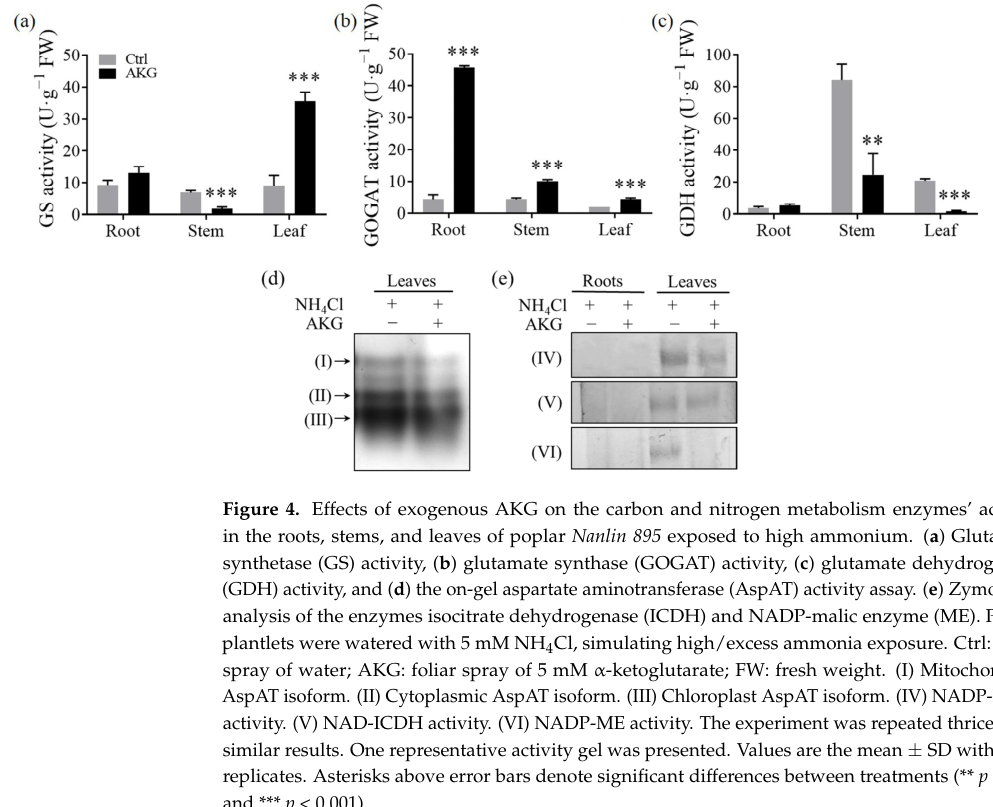

## Question

# Gene Research for Functional Annotation

## ⚠️ CRITICAL: Gene/Protein Identification Context

**BEFORE YOU BEGIN RESEARCH:** You MUST verify you are researching the CORRECT gene/protein. Gene symbols can be ambiguous, especially for less well-characterized genes from non-model organisms.

### Target Gene/Protein Identity (from UniProt):
- **UniProt Accession:** P34105
- **Protein Description:** RecName: Full=NADP-dependent malic enzyme; Short=NADP-ME; EC=1.1.1.40;
- **Gene Information:** Not specified in UniProt
- **Organism (full):** Populus trichocarpa (Western balsam poplar) (Populus balsamifera subsp. trichocarpa).
- **Protein Family:** Belongs to the malic enzymes family. .
- **Key Domains:** Aminoacid_DH-like_N_sf. (IPR046346); Malic_enzyme_CS. (IPR015884); Malic_N_dom. (IPR012301); Malic_N_dom_sf. (IPR037062); Malic_NAD-bd. (IPR012302)

### MANDATORY VERIFICATION STEPS:

1. **Check if the gene symbol "MAOX" matches the protein description above**
2. **Verify the organism is correct:** Populus trichocarpa (Western balsam poplar) (Populus balsamifera subsp. trichocarpa).
3. **Check if protein family/domains align with what you find in literature**
4. **If you find literature for a DIFFERENT gene with the same or similar symbol, STOP**

### If Gene Symbol is Ambiguous or You Cannot Find Relevant Literature:

**DO NOT PROCEED WITH RESEARCH ON A DIFFERENT GENE.** Instead:
- State clearly: "The gene symbol 'MAOX' is ambiguous or literature is limited for this specific protein"
- Explain what you found (e.g., "Found extensive literature on a different gene with the same symbol in a different organism")
- Describe the protein based ONLY on the UniProt information provided above
- Suggest that the protein function can be inferred from domain/family information

### Research Target:

Please provide a comprehensive research report on the gene **MAOX** (gene ID: MAOX, UniProt: P34105) in POPTR.

The research report should be a detailed narrative explaining the function, biological processes, and localization of the gene product. Citations should be given for all claims.

You should prioritize authoritative reviews and primary scientific literature when conducting research. You can supplement
this with annotations you find in gene/protein databases, but these can be outdated or inaccurate.

We are specifically interested in the primary function of the gene - for enzymes, what reaction is catalyzed, and what is the substrate specificity? For transporters, what is the substrate? For structural proteins or adapters, what is the broader structural role? For signaling molecules, what is the role in the pathway.

We are interested in where in or outside the cell the gene product carries out its function.

We are also interested in the signaling or biochemical pathways in which the gene functions. We are less interested in broad pleiotropic effects, except where these elucidate the precise role.

Include evidence where possible. We are interested in both experimental evidence as well as inference from structure, evolution, or bioinformatic analysis. Precise studies should be prioritized over high-throughput, where available.

## Output

Question: You are an expert researcher providing comprehensive, well-cited information.

Provide detailed information focusing on:
1. Key concepts and definitions with current understanding
2. Recent developments and latest research (prioritize 2023-2024 sources)
3. Current applications and real-world implementations
4. Expert opinions and analysis from authoritative sources
5. Relevant statistics and data from recent studies

Format as a comprehensive research report with proper citations. Include URLs and publication dates where available.
Always prioritize recent, authoritative sources and provide specific citations for all major claims.

# Gene Research for Functional Annotation

## ⚠️ CRITICAL: Gene/Protein Identification Context

**BEFORE YOU BEGIN RESEARCH:** You MUST verify you are researching the CORRECT gene/protein. Gene symbols can be ambiguous, especially for less well-characterized genes from non-model organisms.

### Target Gene/Protein Identity (from UniProt):
- **UniProt Accession:** P34105
- **Protein Description:** RecName: Full=NADP-dependent malic enzyme; Short=NADP-ME; EC=1.1.1.40;
- **Gene Information:** Not specified in UniProt
- **Organism (full):** Populus trichocarpa (Western balsam poplar) (Populus balsamifera subsp. trichocarpa).
- **Protein Family:** Belongs to the malic enzymes family. .
- **Key Domains:** Aminoacid_DH-like_N_sf. (IPR046346); Malic_enzyme_CS. (IPR015884); Malic_N_dom. (IPR012301); Malic_N_dom_sf. (IPR037062); Malic_NAD-bd. (IPR012302)

### MANDATORY VERIFICATION STEPS:

1. **Check if the gene symbol "MAOX" matches the protein description above**
2. **Verify the organism is correct:** Populus trichocarpa (Western balsam poplar) (Populus balsamifera subsp. trichocarpa).
3. **Check if protein family/domains align with what you find in literature**
4. **If you find literature for a DIFFERENT gene with the same or similar symbol, STOP**

### If Gene Symbol is Ambiguous or You Cannot Find Relevant Literature:

**DO NOT PROCEED WITH RESEARCH ON A DIFFERENT GENE.** Instead:
- State clearly: "The gene symbol 'MAOX' is ambiguous or literature is limited for this specific protein"
- Explain what you found (e.g., "Found extensive literature on a different gene with the same symbol in a different organism")
- Describe the protein based ONLY on the UniProt information provided above
- Suggest that the protein function can be inferred from domain/family information

### Research Target:

Please provide a comprehensive research report on the gene **MAOX** (gene ID: MAOX, UniProt: P34105) in POPTR.

The research report should be a detailed narrative explaining the function, biological processes, and localization of the gene product. Citations should be given for all claims.

You should prioritize authoritative reviews and primary scientific literature when conducting research. You can supplement
this with annotations you find in gene/protein databases, but these can be outdated or inaccurate.

We are specifically interested in the primary function of the gene - for enzymes, what reaction is catalyzed, and what is the substrate specificity? For transporters, what is the substrate? For structural proteins or adapters, what is the broader structural role? For signaling molecules, what is the role in the pathway.

We are interested in where in or outside the cell the gene product carries out its function.

We are also interested in the signaling or biochemical pathways in which the gene functions. We are less interested in broad pleiotropic effects, except where these elucidate the precise role.

Include evidence where possible. We are interested in both experimental evidence as well as inference from structure, evolution, or bioinformatic analysis. Precise studies should be prioritized over high-throughput, where available.

## Research report: Functional annotation of Populus trichocarpa UniProt P34105 (NADP-dependent malic enzyme; EC 1.1.1.40) and the ambiguous symbol “MAOX”

### Executive summary
UniProt accession **P34105** from **Populus trichocarpa** is annotated as **NADP-dependent malic enzyme (NADP-ME; EC 1.1.1.40)**, a conserved plant enzyme family that catalyzes **L-malate + NADP+ → pyruvate + CO2 + NADPH** and requires a **divalent cation (Mg2+ or Mn2+)**. In the tool-accessible literature retrieved here, **the gene symbol “MAOX” could not be verified as a Populus trichocarpa name for P34105**, so gene-specific functional claims for “MAOX” must be treated cautiously and grounded in the UniProt-defined protein identity and conserved family biology. (franke1995cloningofa pages 1-2, wheeler2005acomprehensiveanalysis pages 13-13)

A key Populus-relevant 2024 study shows that **NADP-ME enzymatic activity (activity band on a zymogram) in poplar leaves is modulated** under ammonium stress and exogenous α-ketoglutarate (AKG) treatment, linking NADP-ME activity to **carbon–nitrogen balance and malate→pyruvate flux control** in poplar metabolism. (liu2024regulatingeffectof pages 5-6, liu2024regulatingeffectof pages 11-12, liu2024regulatingeffectof media 10303f12)

| Attribute/Claim | Evidence summary | Key sources (with year) | Notes/limitations |
|---|---|---|---|
| Target identity / naming | The requested POPTR protein is UniProt P34105, annotated as an NADP-dependent malic enzyme (NADP-ME; EC 1.1.1.40). In the accessible literature, no source explicitly links the symbol **MAOX** to this Populus trichocarpa protein. | Franke & Adams 1995; Wheeler et al. 2005 (franke1995cloningofa pages 1-2, wheeler2005acomprehensiveanalysis pages 13-13) | **MAOX is ambiguous/unverified** for P34105 in the gathered evidence; annotation should rely on UniProt accession, enzyme class, and conserved NADP-ME family features. |
| Catalyzed reaction | Plant NADP-ME catalyzes the oxidative decarboxylation of **L-malate + NADP+ → pyruvate + CO2 + NADPH**; the reaction is reversible in principle but is typically discussed in the malate-decarboxylating direction in plants. | Casati et al. 1999; Sun et al. 2019; Alvarez et al. 2013 (casati1999malatemetabolismby pages 1-2, sun2019rolesofmalic pages 1-3, alvarez2013kineticsandfunctional pages 1-2) | This is the primary biochemical function most directly inferable for P34105. |
| Cofactors / catalytic requirements | NADP-ME requires **NADP+** as electron acceptor and a **divalent cation**, typically **Mg2+ or Mn2+**, for activity. Conserved protein motifs in recent plant analyses include NADP-binding and metal-binding residues. | Franke & Adams 1995; Taboada et al. 2023 (franke1995cloningofa pages 1-2, taboada2023nadpdependentmalicenzyme pages 1-2, taboada2023nadpdependentmalicenzyme pages 2-5) | Cofactor requirements are strongly conserved across plant NADP-MEs; direct biochemical constants for P34105 were not recovered from accessible Populus-specific text. |
| Protein family / structural context | Plant NADP-MEs are a conserved multigene family with cytosolic and plastidic forms; subunits are typically ~62–71 kDa and often assemble as dimers/tetramers. | Müller et al. 2008; Taboada et al. 2023; Martinatto et al. 2025 (muller2008nicotianatabacumnadpmalic pages 1-2, taboada2023nadpdependentmalicenzyme pages 2-5, martinatto2025phenotypicsimilarityof pages 1-4) | Supports the UniProt family/domain assignment for P34105; exact oligomeric state of the POPTR protein was not directly shown in retrieved Populus papers. |
| Subcellular localization | In plants, NADP-ME isoforms occur mainly in the **cytosol** and **plastids/chloroplasts**. Cytosolic and plastidic isoforms are both well established in C3 plants; photosynthetic C4-type isoforms are chloroplastic, while non-photosynthetic isoforms can be cytosolic or plastidic. | Wheeler et al. 2005; Sun et al. 2019; Müller et al. 2008; Alvarez et al. 2013 (wheeler2005acomprehensiveanalysis pages 13-13, sun2019rolesofmalic pages 1-3, muller2008nicotianatabacumnadpmalic pages 1-2, alvarez2013kineticsandfunctional pages 1-2) | For P34105 specifically, direct localization evidence was not recovered here; localization is inferred from conserved plant NADP-ME biology and Populus family-level reports. |
| Core metabolic role | NADP-ME links **malate metabolism**, **pyruvate production**, **CO2 release**, and **NADPH generation**, thereby connecting carbon metabolism, anaplerotic/TCA-linked fluxes, and reductant supply. | Casati et al. 1999; Sun et al. 2019; Fakhimi & Grossman 2024 (casati1999malatemetabolismby pages 1-2, sun2019rolesofmalic pages 1-3) | The reaction products explain likely involvement of P34105 in central carbon metabolism even if gene-specific Populus experiments are sparse. |
| Physiological roles in plants | Reported roles for plant NADP-MEs include photosynthesis-related decarboxylation, provision of NADPH for **lignin/flavonoid biosynthesis**, ROS/redox metabolism, stomatal/pH regulation, seed germination, fruit physiology, and stress responses. | Casati et al. 1999; Sun et al. 2019; Li et al. 2024; Taboada et al. 2023 (casati1999malatemetabolismby pages 1-2, sun2019rolesofmalic pages 1-3, li2024nadpmalicenzymeosnadpme2 pages 1-2, taboada2023nadpdependentmalicenzyme pages 1-2) | These are family-level functions; direct assignment to P34105 should be considered inferential unless validated in Populus. |
| Defense / stress association | NADP-ME is repeatedly associated with responses to abiotic and biotic stress, including salinity, drought, low temperature, wounding, metals, and pathogen/defense signaling; proposed mechanisms center on **NADPH supply**, redox buffering, and metabolic reprogramming. | Casati et al. 1999; Chen et al. 2019; Sarkar et al. 2023; Kandoi & Tripathy 2023 (casati1999malatemetabolismby pages 1-2, sarkar2023regulationofnadpmalic pages 1-2, sarkar2023regulationofnadpmalic pages 2-4, kandoi2023overexpressionofchloroplastic pages 1-4) | Relevant for functional annotation of P34105, especially in woody stress biology, but not proof of a unique Populus-specific stress function. |
| Populus / poplar-specific evidence recovered | Accessible evidence confirms that **poplar NADP-ME cDNAs/sequences exist** and that Populus is used in comparative plant NADP-ME literature; one older study notes grape NADP-ME is 92.7% similar to a **Populus deltoides** enzyme. A 2024 poplar study functionally measured a **NADP-ME activity band** in leaves. | Franke & Adams 1995; Wheeler et al. 2005; Liu et al. 2024 (franke1995cloningofa pages 1-2, wheeler2005acomprehensiveanalysis pages 13-13, liu2024regulatingeffectof pages 5-6, liu2024regulatingeffectof media 10303f12) | The retrieved evidence is mostly **family-/activity-level**, not a direct sequence-to-gene mapping for P34105. Populus trichocarpa-specific ortholog IDs for P34105 were not recovered from text. |
| Populus experimental activity evidence (2024) | In poplar Nanlin 895 leaves exposed to high ammonium, exogenous **α-ketoglutarate (AKG)** suppressed leaf **NADP-ME** activity on zymograms; roots showed near non-detectable activity in that assay. The same study interprets reduced NADP-ME activity together with lower pyruvate as evidence of restricted malate-to-pyruvate flux. | Liu et al. 2024 (liu2024regulatingeffectof pages 5-6, liu2024regulatingeffectof pages 11-12, liu2024regulatingeffectof media 10303f12) | This is one of the clearest recent Populus-relevant functional readouts, but it does **not identify P34105 specifically** and was performed in a poplar hybrid/cultivar context rather than directly in P. trichocarpa accession-linked material. |
| Quantitative Populus-related data (2024) | Under high ammonium plus AKG, poplar leaves showed +69.76% **PtrHXK3** transcript, +72.82% **PtrICDH3**, +20.49% **PtrGS1**, +174.21% **PtrGS2**; energy metabolites changed, including **malate +9.27%**, **pyruvate −45%**, **NAD +244.78%**; AKG also reduced ammonium content by 36.52% in leaves. | Liu et al. 2024 (liu2024regulatingeffectof pages 6-9, liu2024regulatingeffectof pages 5-6, liu2024regulatingeffectof pages 9-11) | These data contextualize NADP-ME within Populus carbon/nitrogen balance but are pathway-level, not gene-specific evidence for P34105. |
| Recent development (2023): enzymatic regulation | In maize, salinity/light experiments showed NADP-ME regulation is redox- and light-sensitive; under salt stress, illumination increased **Vmax 1.36-fold** and decreased **Km by 20%** relative to dark, with citrate/succinate as activators and pyruvate/oxalate as inhibitors. | Sarkar et al. 2023 (sarkar2023regulationofnadpmalic pages 1-2, sarkar2023regulationofnadpmalic pages 2-4) | Not Populus-specific, but useful for annotating likely regulatory properties of plant NADP-MEs. |
| Recent development (2023): stress engineering | Overexpression of chloroplastic maize NADP-ME in Arabidopsis improved tolerance to **150 mM NaCl**, with higher chlorophyll/protein, better Fv/Fm and ETR, more proline and GPX activity, and lower H2O2/MDA under stress. | Kandoi & Tripathy 2023 (kandoi2023overexpressionofchloroplastic pages 1-4) | Supports current expert view that enhanced NADP-ME activity can strengthen stress acclimation through NADPH/redox effects. |
| Recent development (2023): gene-family diversification | Sweet pepper analysis identified **five NADP-ME genes**, four expressed in fruit; predicted localizations were mainly plastidial except one cytosolic isoform, and four isozymes were resolved biochemically. | Taboada et al. 2023 (taboada2023nadpdependentmalicenzyme pages 1-2, taboada2023nadpdependentmalicenzyme pages 2-5) | Reinforces the expectation that woody plants such as Populus also possess multiple compartment-specific NADP-ME isoforms. |
| Recent development (2024): signaling role | Rice **OsNADP-ME2** was shown to modulate plant height via **gibberellin signaling**; RNAi/knockout caused dwarfism, reduced NADP-ME activity and pyruvate, and altered GA pathway gene expression. | Li et al. 2024 (li2024nadpmalicenzymeosnadpme2 pages 1-2) | Indicates that plant NADP-MEs can have signaling/developmental roles beyond basic metabolism; extrapolation to P34105 remains tentative. |
| Overall annotation confidence for P34105 | High confidence that P34105 is a bona fide **plant NADP-dependent malic enzyme** participating in malate decarboxylation and NADPH production; moderate confidence for localization as cytosolic/plastid-associated family context; low confidence for assigning a unique **MAOX** symbol or a precise Populus-specific physiological niche from currently accessible literature. | Combined evidence (franke1995cloningofa pages 1-2, casati1999malatemetabolismby pages 1-2, wheeler2005acomprehensiveanalysis pages 13-13, sun2019rolesofmalic pages 1-3, liu2024regulatingeffectof pages 5-6, liu2024regulatingeffectof pages 11-12) | Best-practice annotation should explicitly state the **name ambiguity** and distinguish **direct Populus evidence** from **family-based inference**. |

*Table: This table summarizes the evidence-supported functional annotation for Populus trichocarpa UniProt P34105 as an NADP-dependent malic enzyme. It also highlights where conclusions are based on direct Populus data versus broader plant NADP-ME family evidence, including the unresolved MAOX naming ambiguity.*

---

## 1) Key concepts and definitions (current understanding)

### 1.1 Enzyme definition and reaction chemistry
**NADP-dependent malic enzyme (NADP-ME; EC 1.1.1.40)** is typically defined in plant biochemistry as an **oxidative decarboxylase** that converts **L-malate to pyruvate with CO2 release and NADPH production**. (casati1999malatemetabolismby pages 1-2, sun2019rolesofmalic pages 1-3, alvarez2013kineticsandfunctional pages 1-2)

**Core reaction (physiologically emphasized direction):**
- **L-malate + NADP+ → pyruvate + CO2 + NADPH** (sun2019rolesofmalic pages 1-3, alvarez2013kineticsandfunctional pages 1-2)

**Cofactor requirements:**
- Requires **NADP+** and a **bivalent/divalent metal ion**, typically **Mg2+ or Mn2+**, for catalysis. (franke1995cloningofa pages 1-2, taboada2023nadpdependentmalicenzyme pages 1-2)

### 1.2 Isoforms and subcellular localization in plants
Plant NADP-MEs occur as **compartment-specific isoforms**, most commonly **cytosolic** and **plastidic/chloroplastic**, and these isoforms are associated with distinct physiological contexts. (wheeler2005acomprehensiveanalysis pages 13-13, sun2019rolesofmalic pages 1-3, muller2008nicotianatabacumnadpmalic pages 1-2, alvarez2013kineticsandfunctional pages 1-2)

- **C4 photosynthesis**: a chloroplastic NADP-ME decarboxylates malate in bundle-sheath chloroplasts to concentrate CO2 for Rubisco. (muller2008nicotianatabacumnadpmalic pages 1-2, maurino2001nonphotosyntheticmalicenzyme pages 1-2)
- **C3 plants**: commonly have both **cytosolic** and **plastidic** NADP-ME activities/isoforms implicated in non-C4 roles (biosynthesis, redox, stress). (sun2019rolesofmalic pages 1-3, muller2008nicotianatabacumnadpmalic pages 1-2)

### 1.3 Biological roles supported by authoritative plant literature
Because NADP-ME produces both **pyruvate** and **NADPH**, it is repeatedly positioned as a node connecting:
- **Carbon metabolism** (malate/pyruvate balance; respiration inputs) (franke1995cloningofa pages 1-2, casati1999malatemetabolismby pages 1-2)
- **Redox/NADPH supply** for biosynthesis and defense (e.g., lignin/flavonoids; ROS-associated processes) (casati1999malatemetabolismby pages 1-2, sun2019rolesofmalic pages 1-3)
- **Stress acclimation** (wounding, UV, abiotic stresses) linked to metabolic and redox remodeling (casati1999malatemetabolismby pages 1-2, sun2019rolesofmalic pages 1-3)

Older authoritative sources already framed NADP-ME as broadly present across organs and linked it to respiration/photosynthesis; one Plant Physiology note on grape NADP-ME reported **92.7% similarity to a Populus deltoides malic enzyme**, supporting conservation of this enzyme in poplars. (Publication date: **March 1995**; URL: https://doi.org/10.1104/pp.107.3.1009) (franke1995cloningofa pages 1-2)

---

## 2) Target verification and naming ambiguity (“MAOX”)

### 2.1 What was verified
- The requested target protein identity is: **Populus trichocarpa NADP-dependent malic enzyme (NADP-ME; EC 1.1.1.40)** (UniProt P34105, provided by user).
- The retrieved plant NADP-ME literature matches the **enzyme family**, **reaction**, and **cofactor requirements** expected for P34105. (franke1995cloningofa pages 1-2, casati1999malatemetabolismby pages 1-2, sun2019rolesofmalic pages 1-3)

### 2.2 What could not be verified (critical)
Within the accessible retrieved texts, **no paper explicitly maps the symbol “MAOX” to Populus trichocarpa NADP-ME or to UniProt P34105**, nor provides a Populus trichocarpa gene identifier for P34105. Therefore, **“MAOX” should be considered ambiguous/unconfirmed** for this protein in this evidence set. (franke1995cloningofa pages 1-2, wheeler2005acomprehensiveanalysis pages 13-13)

Implication for functional annotation: the most defensible annotation is **enzyme-level**, based on EC class and conserved NADP-ME biology, supplemented by Populus metabolic physiology evidence (below), rather than gene-symbol-based assertions. (wheeler2005acomprehensiveanalysis pages 13-13, liu2024regulatingeffectof pages 5-6)

---

## 3) Populus-relevant functional evidence (with emphasis on 2024)

### 3.1 Poplar metabolism study showing NADP-ME activity modulation (2024)
A 2024 study on poplar (“Nanlin 895”) examining responses to high ammonium and exogenous α-ketoglutarate (AKG) reports **activity-gel/zymogram evidence** for NADP-ME in leaves and its modulation by treatment. (Publication date: **March 2024**; URL: https://doi.org/10.3390/molecules29071425) (liu2024regulatingeffectof pages 5-6, liu2024regulatingeffectof media 10303f12)

**Key direct observations relevant to NADP-ME function in poplar:**
- Zymogram analysis including **NADP-ME activity (band VI)** indicates that **AKG administration suppressed NADP-ME activity in leaves** under high ammonium; root activity was nearly non-detectable in that assay context. (liu2024regulatingeffectof pages 5-6, liu2024regulatingeffectof media 10303f12)
- The authors interpret reduced NADP-ME activity alongside metabolite changes as consistent with restricted **malate → pyruvate** carbon flux, because NADP-ME catalyzes malate-to-pyruvate conversion. (liu2024regulatingeffectof pages 11-12)

**Associated quantitative metabolic statistics from the same study (LC–MS in leaves under AKG vs control):**
- **Malate increased by 9.27%** while **pyruvate decreased by 45%**; **NAD increased by 244.78%** (among other metabolites). (liu2024regulatingeffectof pages 6-9)

**Associated transcript statistics (qPCR in leaves under AKG vs control):**
- **PtrHXK3 +69.76%**, **PtrICDH3 +72.82%**, **PtrGS1 +20.49%**, **PtrGS2 +174.21%**. (liu2024regulatingeffectof pages 6-9)

These Populus-relevant measurements support an annotation that NADP-ME participates in **central carbon metabolism and carbon–nitrogen balancing**, at least at the activity/pathway level, even though they do not identify UniProt P34105 specifically. (liu2024regulatingeffectof pages 5-6, liu2024regulatingeffectof pages 11-12)

**Figure-based evidence:** the activity gel/zymogram panel for NADP-ME and ICDH is visually captured in Figure 4 (panel e). (liu2024regulatingeffectof media 10303f12)

### 3.2 Poplar sequence conservation context (foundational)
A classic Plant Physiology cDNA note on grape NADP-ME reported strong similarity to a **Populus deltoides** malic enzyme (92.7% similarity), consistent with high conservation of NADP-MEs across angiosperms and supporting inference-based functional annotation of Populus NADP-MEs. (franke1995cloningofa pages 1-2)

---

## 4) Recent developments and latest research (prioritizing 2023–2024)

Although Populus trichocarpa gene-specific studies for P34105 were not retrieved, 2023–2024 primary literature provides updated “expert consensus by evidence” on how NADP-MEs influence physiology—relevant for POPTR functional inference.

### 4.1 2023: salinity/light/redox regulation of NADP-ME kinetics (maize)
A 2023 Plants study partially purified maize C4 NADP-ME and quantified how salinity and light modulate enzyme kinetics. (Publication date: **April 2023**; URL: https://doi.org/10.3390/plants12091836) (sarkar2023regulationofnadpmalic pages 1-2, sarkar2023regulationofnadpmalic pages 2-4)

**Quantitative kinetic changes under salinity conditions:**
- Under salinity, illumination increased **Vmax by 1.36-fold** relative to dark and decreased **Km by 20%**. (sarkar2023regulationofnadpmalic pages 1-2)

This supports a contemporary view that plant NADP-MEs can be strongly regulated by **light and redox conditions**, which is relevant to Populus leaf physiology where redox and carbon flux are dynamically regulated. (sarkar2023regulationofnadpmalic pages 2-4)

### 4.2 2023: NADP-ME as a stress-engineering target (transgenic application)
A 2023 Photosynthesis Research study overexpressed maize chloroplastic NADP-ME in Arabidopsis. The work demonstrates a “real-world implementation” in plant biotechnology: manipulating NADP-ME can alter salt tolerance. (Publication date: **August 2023**; URL: https://doi.org/10.1007/s11120-023-01041-x) (kandoi2023overexpressionofchloroplastic pages 1-4)

- Under **150 mM NaCl**, NADP-ME overexpressors had higher chlorophyll/protein, improved Fv/Fm and electron transport rate, higher biomass, increased proline and glutathione peroxidase activity, and lower H2O2 and MDA under stress. (kandoi2023overexpressionofchloroplastic pages 1-4)

This is consistent with an expert model that **NADP-ME-derived NADPH** can support detoxification/redox buffering during stress. (kandoi2023overexpressionofchloroplastic pages 1-4)

### 4.3 2023: gene-family analyses and NO modulation in fruit ripening (pepper)
A 2023 Plants paper identified five NADP-ME genes in sweet pepper and linked fruit-expressed isoforms to ripening and nitric oxide modulation. (Publication date: **June 2023**; URL: https://doi.org/10.3390/plants12122353) (taboada2023nadpdependentmalicenzyme pages 1-2, taboada2023nadpdependentmalicenzyme pages 2-5)

Key developments relevant for annotation by homology:
- Reinforces that plant NADP-ME gene families include **cytosolic vs plastidial** isoforms. (taboada2023nadpdependentmalicenzyme pages 2-5)
- Provides motif-level biochemical interpretation: NADP-binding motifs and key **metal-binding residues** inferred for plant NADP-MEs. (taboada2023nadpdependentmalicenzyme pages 2-5)

### 4.4 2024: developmental/hormonal signaling connection (rice)
A 2024 Rice paper reports that cytosolic **OsNADP-ME2** affects plant height via **gibberellin signaling**, and that loss of function reduces NADP-ME activity and pyruvate production. (Publication date: **August 2024**; URL: https://doi.org/10.1186/s12284-024-00729-5) (li2024nadpmalicenzymeosnadpme2 pages 1-2)

This supports a modern perspective that cytosolic NADP-MEs can influence not only metabolism but also **growth-regulatory signaling networks** (potentially via metabolite/redox coupling), which may be relevant to woody growth regulation in Populus, though this remains inferential for P34105. (li2024nadpmalicenzymeosnadpme2 pages 1-2)

---

## 5) Pathway context and mechanistic interpretation for Populus P34105 (inference anchored to evidence)

### 5.1 Primary enzymatic function (most defensible annotation)
Given its UniProt definition and the plant enzyme family consensus, the primary functional annotation for Populus trichocarpa P34105 is:

- **Enzyme:** NADP-dependent malic enzyme (NADP-ME; EC 1.1.1.40)
- **Reaction:** L-malate + NADP+ → pyruvate + CO2 + NADPH (casati1999malatemetabolismby pages 1-2, sun2019rolesofmalic pages 1-3)
- **Cofactors:** requires Mg2+ or Mn2+ (franke1995cloningofa pages 1-2, taboada2023nadpdependentmalicenzyme pages 1-2)

### 5.2 Subcellular site of action (most likely, but not directly shown for P34105 here)
The best-supported cellular picture from plant literature is that Populus NADP-MEs occur as **cytosolic and plastidic/chloroplastic** isoforms, with roles depending on tissue and photosynthetic status. (wheeler2005acomprehensiveanalysis pages 13-13, sun2019rolesofmalic pages 1-3, muller2008nicotianatabacumnadpmalic pages 1-2)

Because a direct subcellular localization experiment for P34105 was not retrieved, a conservative annotation is:
- **Cellular component:** cytosol and/or plastids (family-consistent), pending POPTR isoform mapping. (sun2019rolesofmalic pages 1-3, muller2008nicotianatabacumnadpmalic pages 1-2)

### 5.3 Integration into central metabolism and redox in woody tissues
Mechanistically, NADP-ME provides:
- **Pyruvate**, a carbon node that can feed mitochondrial respiration and biosynthesis (franke1995cloningofa pages 1-2, casati1999malatemetabolismby pages 1-2)
- **NADPH**, supporting reductive biosynthesis and redox homeostasis (casati1999malatemetabolismby pages 1-2, sun2019rolesofmalic pages 1-3)

In poplar metabolism under ammonium stress, NADP-ME activity appears to be part of a broader adjustment of carbon flux between glycolysis and the TCA cycle, with AKG treatment associated with suppressed NADP-ME activity and decreased pyruvate. (liu2024regulatingeffectof pages 5-6, liu2024regulatingeffectof pages 11-12)

---

## 6) Current applications and real-world implementations

### 6.1 Stress tolerance engineering
Genetic manipulation of NADP-ME can be used as a stress-tolerance strategy. Overexpressing a chloroplastic NADP-ME in a C3 plant (Arabidopsis) improved performance under high salinity (150 mM NaCl), supporting a translational concept: modulating NADP-ME can adjust NADPH availability and oxidative stress tolerance. (kandoi2023overexpressionofchloroplastic pages 1-4)

### 6.2 Interpreting Populus nutrient stress responses
In woody species management and breeding contexts, the 2024 poplar study provides an example of using **enzyme activity gels** and metabolite profiling to track how treatments (AKG) remodel carbon–nitrogen balance; NADP-ME is one of the enzymes whose activity shifts in these regimes. (liu2024regulatingeffectof pages 5-6, liu2024regulatingeffectof media 10303f12)

---

## 7) Evidence-based statistics and data highlights

### 7.1 Populus (2024) quantitative highlights (pathway-level)
From poplar leaves under AKG treatment in high ammonium conditions:
- Metabolites: **pyruvate −45%**, **malate +9.27%**, **NAD +244.78%** (liu2024regulatingeffectof pages 6-9)
- Transcripts: **PtrGS2 +174.21%**, **PtrGS1 +20.49%**, **PtrHXK3 +69.76%**, **PtrICDH3 +72.82%** (liu2024regulatingeffectof pages 6-9)
- Enzyme activity gel: **NADP-ME activity band suppressed** in leaves with AKG treatment (liu2024regulatingeffectof pages 5-6, liu2024regulatingeffectof media 10303f12)

### 7.2 Enzyme regulation kinetics (2023 maize)
- Under salinity, illumination increased **Vmax 1.36×** and reduced **Km by 20%** relative to dark. (sarkar2023regulationofnadpmalic pages 1-2)

---

## 8) Limitations and recommended next steps for gene-specific POPTR annotation
1. **MAOX naming ambiguity:** With the retrieved evidence, “MAOX” cannot be confirmed as the accepted Populus trichocarpa gene symbol for UniProt P34105; therefore, gene-level claims about “MAOX” should be avoided unless cross-referenced via authoritative Populus genome resources (not retrievable here). (franke1995cloningofa pages 1-2, wheeler2005acomprehensiveanalysis pages 13-13)
2. **P34105 isoform mapping:** Plant NADP-ME families include multiple cytosolic/plastidic isoforms; without sequence-to-locus mapping, assigning precise subcellular localization or tissue specialization to P34105 remains provisional. (wheeler2005acomprehensiveanalysis pages 13-13, sun2019rolesofmalic pages 1-3)
3. **Best-supported functional annotation now:** annotate P34105 as **NADP-dependent malic enzyme (EC 1.1.1.40)** producing pyruvate/CO2/NADPH from malate with Mg2+/Mn2+ requirement, and note likely roles in Populus carbon metabolism and redox/NADPH supply based on family evidence plus Populus activity-gel and metabolite data. (casati1999malatemetabolismby pages 1-2, liu2024regulatingeffectof pages 6-9, liu2024regulatingeffectof pages 5-6)

---

## Key cited sources (with URLs and publication dates)
- Franke K, Adams DO. *Plant Physiology* (**March 1995**). https://doi.org/10.1104/pp.107.3.1009 (franke1995cloningofa pages 1-2)
- Casati P, Drincovich MF, Edwards GE, Andreo CS. *Photosynthesis Research* (**August 1999**). https://doi.org/10.1023/a:1006209003096 (casati1999malatemetabolismby pages 1-2)
- Wheeler MCG et al. *Plant Physiology* (**August 2005**). https://doi.org/10.1104/pp.105.065953 (wheeler2005acomprehensiveanalysis pages 13-13)
- Sun X et al. *Plant Signaling & Behavior* (**July 2019**). https://doi.org/10.1080/15592324.2019.1644596 (sun2019rolesofmalic pages 1-3)
- Sarkar B et al. *Plants* (**April 2023**). https://doi.org/10.3390/plants12091836 (sarkar2023regulationofnadpmalic pages 1-2, sarkar2023regulationofnadpmalic pages 2-4)
- Taboada J et al. *Plants* (**June 2023**). https://doi.org/10.3390/plants12122353 (taboada2023nadpdependentmalicenzyme pages 1-2, taboada2023nadpdependentmalicenzyme pages 2-5)
- Kandoi D, Tripathy BC. *Photosynthesis Research* (**August 2023**). https://doi.org/10.1007/s11120-023-01041-x (kandoi2023overexpressionofchloroplastic pages 1-4)
- Liu X et al. *Molecules* (**March 2024**). https://doi.org/10.3390/molecules29071425 (liu2024regulatingeffectof pages 6-9, liu2024regulatingeffectof pages 5-6, liu2024regulatingeffectof pages 11-12, liu2024regulatingeffectof media 10303f12)
- Li B et al. *Rice* (**August 2024**). https://doi.org/10.1186/s12284-024-00729-5 (li2024nadpmalicenzymeosnadpme2 pages 1-2)

References

1. (franke1995cloningofa pages 1-2): K. Franke and Douglas O. Adams. Cloning of a full-length cdna for malic enzyme (ec 1.1.1.40) from grape berries. Plant Physiology, 107(3):1009-1010, Mar 1995. URL: https://doi.org/10.1104/pp.107.3.1009, doi:10.1104/pp.107.3.1009. This article has 39 citations and is from a highest quality peer-reviewed journal.

2. (wheeler2005acomprehensiveanalysis pages 13-13): Mariel C. Gerrard Wheeler, Marcos A. Tronconi, María F. Drincovich, Carlos S. Andreo, Ulf-Ingo Flügge, and Verónica G. Maurino. A comprehensive analysis of the nadp-malic enzyme gene family of arabidopsis1[w]. Plant Physiology, 139:39-51, Aug 2005. URL: https://doi.org/10.1104/pp.105.065953, doi:10.1104/pp.105.065953. This article has 240 citations and is from a highest quality peer-reviewed journal.

3. (liu2024regulatingeffectof pages 5-6): Xiaoning Liu, Liangdan Wu, Yujia Si, Yujie Zhai, Mingyi Niu, Mei Han, and Tao Su. Regulating effect of exogenous α-ketoglutarate on ammonium assimilation in poplar. Molecules, 29:1425, Mar 2024. URL: https://doi.org/10.3390/molecules29071425, doi:10.3390/molecules29071425. This article has 8 citations.

4. (liu2024regulatingeffectof pages 11-12): Xiaoning Liu, Liangdan Wu, Yujia Si, Yujie Zhai, Mingyi Niu, Mei Han, and Tao Su. Regulating effect of exogenous α-ketoglutarate on ammonium assimilation in poplar. Molecules, 29:1425, Mar 2024. URL: https://doi.org/10.3390/molecules29071425, doi:10.3390/molecules29071425. This article has 8 citations.

5. (liu2024regulatingeffectof media 10303f12): Xiaoning Liu, Liangdan Wu, Yujia Si, Yujie Zhai, Mingyi Niu, Mei Han, and Tao Su. Regulating effect of exogenous α-ketoglutarate on ammonium assimilation in poplar. Molecules, 29:1425, Mar 2024. URL: https://doi.org/10.3390/molecules29071425, doi:10.3390/molecules29071425. This article has 8 citations.

6. (casati1999malatemetabolismby pages 1-2): Paula Casati, María F. Drincovich, Gerald E. Edwards, and Carlos S. Andreo. Malate metabolism by nadp-malic enzyme in plant defense. Photosynthesis Research, 61:99-105, Aug 1999. URL: https://doi.org/10.1023/a:1006209003096, doi:10.1023/a:1006209003096. This article has 197 citations and is from a peer-reviewed journal.

7. (sun2019rolesofmalic pages 1-3): Xi Sun, Guoliang Han, Zhe Meng, Lin Lin, and Na Sui. Roles of malic enzymes in plant development and stress responses. Plant Signaling & Behavior, 14:e1644596, Jul 2019. URL: https://doi.org/10.1080/15592324.2019.1644596, doi:10.1080/15592324.2019.1644596. This article has 117 citations and is from a peer-reviewed journal.

8. (alvarez2013kineticsandfunctional pages 1-2): Clarisa E. Alvarez, Mariana Saigo, Ezequiel Margarit, Carlos S. Andreo, and María F. Drincovich. Kinetics and functional diversity among the five members of the nadp-malic enzyme family from zea mays, a c4 species. Photosynthesis Research, 115:65-80, May 2013. URL: https://doi.org/10.1007/s11120-013-9839-9, doi:10.1007/s11120-013-9839-9. This article has 42 citations and is from a peer-reviewed journal.

9. (taboada2023nadpdependentmalicenzyme pages 1-2): Jorge Taboada, Salvador González-Gordo, María A. Muñoz-Vargas, José M. Palma, and Francisco J. Corpas. Nadp-dependent malic enzyme genes in sweet pepper fruits: involvement in ripening and modulation by nitric oxide (no). Plants, 12:2353, Jun 2023. URL: https://doi.org/10.3390/plants12122353, doi:10.3390/plants12122353. This article has 9 citations.

10. (taboada2023nadpdependentmalicenzyme pages 2-5): Jorge Taboada, Salvador González-Gordo, María A. Muñoz-Vargas, José M. Palma, and Francisco J. Corpas. Nadp-dependent malic enzyme genes in sweet pepper fruits: involvement in ripening and modulation by nitric oxide (no). Plants, 12:2353, Jun 2023. URL: https://doi.org/10.3390/plants12122353, doi:10.3390/plants12122353. This article has 9 citations.

11. (muller2008nicotianatabacumnadpmalic pages 1-2): Gabriela Leticia Müller, María Fabiana Drincovich, Carlos Santiago Andreo, and María Valeria Lara. Nicotiana tabacum nadp-malic enzyme: cloning, characterization and analysis of biological role. Plant & cell physiology, 49 3:469-80, Mar 2008. URL: https://doi.org/10.1093/pcp/pcn022, doi:10.1093/pcp/pcn022. This article has 66 citations and is from a domain leading peer-reviewed journal.

12. (martinatto2025phenotypicsimilarityof pages 1-4): Andrea K Martinatto, Jonas M. Böhm, Claudia A. Bustamante, Francesco Pancaldi, Eric Schranz, and Marcos A. Tronconi. Phenotypic similarity of nad(p)-malic enzymes in tomato: unveiling patterns of convergent and parallel evolution. bioRxiv, Feb 2025. URL: https://doi.org/10.1101/2025.02.12.637823, doi:10.1101/2025.02.12.637823. This article has 0 citations.

13. (li2024nadpmalicenzymeosnadpme2 pages 1-2): Bing Li, Xiaolong Zhou, Wei Yao, Jinjun Lin, Xiaowen Ding, Qianru Chen, Hao Huang, Wenfeng Chen, Xilai Huang, Sujun Pan, Yinghui Xiao, Jianfeng Liu, Xionglun Liu, and Jinling Liu. Nadp-malic enzyme osnadp-me2 modulates plant height involving in gibberellin signaling in rice. Rice, Aug 2024. URL: https://doi.org/10.1186/s12284-024-00729-5, doi:10.1186/s12284-024-00729-5. This article has 8 citations and is from a peer-reviewed journal.

14. (sarkar2023regulationofnadpmalic pages 1-2): Bipul Sarkar, Abir Das, Sayan Pal, Ankita Kundu, Mirza Hasanuzzaman, Masayuki Fujita, and Malay Kumar Adak. Regulation of nadp-malic enzyme activity in maize (zea mays l.) under salinity with reference to light and darkness. Plants, 12:1836, Apr 2023. URL: https://doi.org/10.3390/plants12091836, doi:10.3390/plants12091836. This article has 14 citations.

15. (sarkar2023regulationofnadpmalic pages 2-4): Bipul Sarkar, Abir Das, Sayan Pal, Ankita Kundu, Mirza Hasanuzzaman, Masayuki Fujita, and Malay Kumar Adak. Regulation of nadp-malic enzyme activity in maize (zea mays l.) under salinity with reference to light and darkness. Plants, 12:1836, Apr 2023. URL: https://doi.org/10.3390/plants12091836, doi:10.3390/plants12091836. This article has 14 citations.

16. (kandoi2023overexpressionofchloroplastic pages 1-4): Deepika Kandoi and Baishnab C. Tripathy. Overexpression of chloroplastic zea mays nadp-malic enzyme (zmnadp-me) confers tolerance to salt stress in arabidopsis thaliana. Photosynthesis Research, 158:57-76, Aug 2023. URL: https://doi.org/10.1007/s11120-023-01041-x, doi:10.1007/s11120-023-01041-x. This article has 11 citations and is from a peer-reviewed journal.

17. (liu2024regulatingeffectof pages 6-9): Xiaoning Liu, Liangdan Wu, Yujia Si, Yujie Zhai, Mingyi Niu, Mei Han, and Tao Su. Regulating effect of exogenous α-ketoglutarate on ammonium assimilation in poplar. Molecules, 29:1425, Mar 2024. URL: https://doi.org/10.3390/molecules29071425, doi:10.3390/molecules29071425. This article has 8 citations.

18. (liu2024regulatingeffectof pages 9-11): Xiaoning Liu, Liangdan Wu, Yujia Si, Yujie Zhai, Mingyi Niu, Mei Han, and Tao Su. Regulating effect of exogenous α-ketoglutarate on ammonium assimilation in poplar. Molecules, 29:1425, Mar 2024. URL: https://doi.org/10.3390/molecules29071425, doi:10.3390/molecules29071425. This article has 8 citations.

19. (maurino2001nonphotosyntheticmalicenzyme pages 1-2): Véronica G. Maurino, Mariana Saigo, Carlos S. Andreo, and María Fabiana Drincovich. Non-photosynthetic `malic enzyme' from maize: a constituvely expressed enzyme that responds to plant defence inducers. Plant Molecular Biology, 45:409-420, Mar 2001. URL: https://doi.org/10.1023/a:1010665910095, doi:10.1023/a:1010665910095. This article has 99 citations and is from a peer-reviewed journal.

## Artifacts

- [Edison artifact artifact-00](MAOX-deep-research-falcon_artifacts/artifact-00.md)

## Citations

1. kandoi2023overexpressionofchloroplastic pages 1-4
2. franke1995cloningofa pages 1-2
3. liu2024regulatingeffectof pages 11-12
4. liu2024regulatingeffectof pages 6-9
5. sarkar2023regulationofnadpmalic pages 1-2
6. sarkar2023regulationofnadpmalic pages 2-4
7. taboada2023nadpdependentmalicenzyme pages 2-5
8. casati1999malatemetabolismby pages 1-2
9. wheeler2005acomprehensiveanalysis pages 13-13
10. sun2019rolesofmalic pages 1-3
11. liu2024regulatingeffectof pages 5-6
12. alvarez2013kineticsandfunctional pages 1-2
13. taboada2023nadpdependentmalicenzyme pages 1-2
14. muller2008nicotianatabacumnadpmalic pages 1-2
15. martinatto2025phenotypicsimilarityof pages 1-4
16. liu2024regulatingeffectof pages 9-11
17. maurino2001nonphotosyntheticmalicenzyme pages 1-2
18. w
19. https://doi.org/10.1104/pp.107.3.1009
20. https://doi.org/10.3390/molecules29071425
21. https://doi.org/10.3390/plants12091836
22. https://doi.org/10.1007/s11120-023-01041-x
23. https://doi.org/10.3390/plants12122353
24. https://doi.org/10.1186/s12284-024-00729-5
25. https://doi.org/10.1023/a:1006209003096
26. https://doi.org/10.1104/pp.105.065953
27. https://doi.org/10.1080/15592324.2019.1644596
28. https://doi.org/10.1104/pp.107.3.1009,
29. https://doi.org/10.1104/pp.105.065953,
30. https://doi.org/10.3390/molecules29071425,
31. https://doi.org/10.1023/a:1006209003096,
32. https://doi.org/10.1080/15592324.2019.1644596,
33. https://doi.org/10.1007/s11120-013-9839-9,
34. https://doi.org/10.3390/plants12122353,
35. https://doi.org/10.1093/pcp/pcn022,
36. https://doi.org/10.1101/2025.02.12.637823,
37. https://doi.org/10.1186/s12284-024-00729-5,
38. https://doi.org/10.3390/plants12091836,
39. https://doi.org/10.1007/s11120-023-01041-x,
40. https://doi.org/10.1023/a:1010665910095,