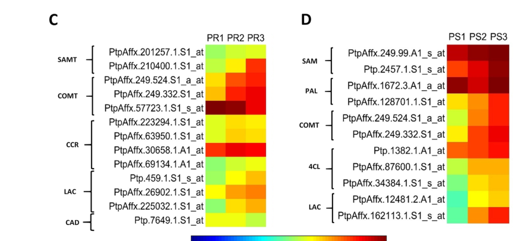

## Question

# Gene Research for Functional Annotation

## ⚠️ CRITICAL: Gene/Protein Identification Context

**BEFORE YOU BEGIN RESEARCH:** You MUST verify you are researching the CORRECT gene/protein. Gene symbols can be ambiguous, especially for less well-characterized genes from non-model organisms.

### Target Gene/Protein Identity (from UniProt):
- **UniProt Accession:** A9PDZ7
- **Protein Description:** RecName: Full=S-adenosylmethionine synthase 2; Short=AdoMet synthase 2; EC=2.5.1.6 {ECO:0000250|UniProtKB:Q96551}; AltName: Full=Methionine adenosyltransferase 2; Short=MAT 2;
- **Gene Information:** Name=METK2; ORFNames=POPTR_0013s00550g;
- **Organism (full):** Populus trichocarpa (Western balsam poplar) (Populus balsamifera subsp. trichocarpa).
- **Protein Family:** Belongs to the AdoMet synthase family. .
- **Key Domains:** ADOMET_SYNTHASE_CS. (IPR022631); S-AdoMet_synt_C. (IPR022630); S-AdoMet_synt_central. (IPR022629); S-AdoMet_synt_N. (IPR022628); S-AdoMet_synthetase. (IPR002133)

### MANDATORY VERIFICATION STEPS:

1. **Check if the gene symbol "METK2" matches the protein description above**
2. **Verify the organism is correct:** Populus trichocarpa (Western balsam poplar) (Populus balsamifera subsp. trichocarpa).
3. **Check if protein family/domains align with what you find in literature**
4. **If you find literature for a DIFFERENT gene with the same or similar symbol, STOP**

### If Gene Symbol is Ambiguous or You Cannot Find Relevant Literature:

**DO NOT PROCEED WITH RESEARCH ON A DIFFERENT GENE.** Instead:
- State clearly: "The gene symbol 'METK2' is ambiguous or literature is limited for this specific protein"
- Explain what you found (e.g., "Found extensive literature on a different gene with the same symbol in a different organism")
- Describe the protein based ONLY on the UniProt information provided above
- Suggest that the protein function can be inferred from domain/family information

### Research Target:

Please provide a comprehensive research report on the gene **METK2** (gene ID: METK2, UniProt: A9PDZ7) in POPTR.

The research report should be a detailed narrative explaining the function, biological processes, and localization of the gene product. Citations should be given for all claims.

You should prioritize authoritative reviews and primary scientific literature when conducting research. You can supplement
this with annotations you find in gene/protein databases, but these can be outdated or inaccurate.

We are specifically interested in the primary function of the gene - for enzymes, what reaction is catalyzed, and what is the substrate specificity? For transporters, what is the substrate? For structural proteins or adapters, what is the broader structural role? For signaling molecules, what is the role in the pathway.

We are interested in where in or outside the cell the gene product carries out its function.

We are also interested in the signaling or biochemical pathways in which the gene functions. We are less interested in broad pleiotropic effects, except where these elucidate the precise role.

Include evidence where possible. We are interested in both experimental evidence as well as inference from structure, evolution, or bioinformatic analysis. Precise studies should be prioritized over high-throughput, where available.

## Output

Question: You are an expert researcher providing comprehensive, well-cited information.

Provide detailed information focusing on:
1. Key concepts and definitions with current understanding
2. Recent developments and latest research (prioritize 2023-2024 sources)
3. Current applications and real-world implementations
4. Expert opinions and analysis from authoritative sources
5. Relevant statistics and data from recent studies

Format as a comprehensive research report with proper citations. Include URLs and publication dates where available.
Always prioritize recent, authoritative sources and provide specific citations for all major claims.

# Gene Research for Functional Annotation

## ⚠️ CRITICAL: Gene/Protein Identification Context

**BEFORE YOU BEGIN RESEARCH:** You MUST verify you are researching the CORRECT gene/protein. Gene symbols can be ambiguous, especially for less well-characterized genes from non-model organisms.

### Target Gene/Protein Identity (from UniProt):
- **UniProt Accession:** A9PDZ7
- **Protein Description:** RecName: Full=S-adenosylmethionine synthase 2; Short=AdoMet synthase 2; EC=2.5.1.6 {ECO:0000250|UniProtKB:Q96551}; AltName: Full=Methionine adenosyltransferase 2; Short=MAT 2;
- **Gene Information:** Name=METK2; ORFNames=POPTR_0013s00550g;
- **Organism (full):** Populus trichocarpa (Western balsam poplar) (Populus balsamifera subsp. trichocarpa).
- **Protein Family:** Belongs to the AdoMet synthase family. .
- **Key Domains:** ADOMET_SYNTHASE_CS. (IPR022631); S-AdoMet_synt_C. (IPR022630); S-AdoMet_synt_central. (IPR022629); S-AdoMet_synt_N. (IPR022628); S-AdoMet_synthetase. (IPR002133)

### MANDATORY VERIFICATION STEPS:

1. **Check if the gene symbol "METK2" matches the protein description above**
2. **Verify the organism is correct:** Populus trichocarpa (Western balsam poplar) (Populus balsamifera subsp. trichocarpa).
3. **Check if protein family/domains align with what you find in literature**
4. **If you find literature for a DIFFERENT gene with the same or similar symbol, STOP**

### If Gene Symbol is Ambiguous or You Cannot Find Relevant Literature:

**DO NOT PROCEED WITH RESEARCH ON A DIFFERENT GENE.** Instead:
- State clearly: "The gene symbol 'METK2' is ambiguous or literature is limited for this specific protein"
- Explain what you found (e.g., "Found extensive literature on a different gene with the same symbol in a different organism")
- Describe the protein based ONLY on the UniProt information provided above
- Suggest that the protein function can be inferred from domain/family information

### Research Target:

Please provide a comprehensive research report on the gene **METK2** (gene ID: METK2, UniProt: A9PDZ7) in POPTR.

The research report should be a detailed narrative explaining the function, biological processes, and localization of the gene product. Citations should be given for all claims.

You should prioritize authoritative reviews and primary scientific literature when conducting research. You can supplement
this with annotations you find in gene/protein databases, but these can be outdated or inaccurate.

We are specifically interested in the primary function of the gene - for enzymes, what reaction is catalyzed, and what is the substrate specificity? For transporters, what is the substrate? For structural proteins or adapters, what is the broader structural role? For signaling molecules, what is the role in the pathway.

We are interested in where in or outside the cell the gene product carries out its function.

We are also interested in the signaling or biochemical pathways in which the gene functions. We are less interested in broad pleiotropic effects, except where these elucidate the precise role.

Include evidence where possible. We are interested in both experimental evidence as well as inference from structure, evolution, or bioinformatic analysis. Precise studies should be prioritized over high-throughput, where available.

# Research report: Functional annotation of **METK2 / S-adenosylmethionine synthase 2** in *Populus trichocarpa* (UniProt **A9PDZ7**)

## 0. Gene/protein identity verification (critical)

The UniProt entry **A9PDZ7** is annotated as **S-adenosylmethionine synthase 2** (aka **methionine adenosyltransferase**, **MAT**) with enzyme commission **EC 2.5.1.6**, from **Populus trichocarpa**. The plant literature used here consistently defines MAT/SAMS enzymes as producing S-adenosylmethionine (SAM) from methionine and ATP, and uses the same functional naming for “S-adenosylmethionine synthetase 2 (SAMS2)” in poplar xylem development, matching the UniProt description (sekula2020sadenosylmethioninesynthasesin pages 1-2, chen2025theyangcycle pages 1-2, marzecschmidt2019xylemcellwall pages 8-10). 

Because the symbol **METK2** is used in multiple species (and sometimes in genome-wide/proteomic contexts where gene naming can be inconsistent), organism-specific claims below are restricted to sources that explicitly state *Populus* (marzecschmidt2019xylemcellwall pages 8-10, marzecschmidt2019xylemcellwall media d3f37b88). Broader plant and biochemical claims are presented as family-level inference for plant SAMS/MAT enzymes and not as poplar-specific experimental proof (sekula2020sadenosylmethioninesynthasesin pages 1-2, chen2025theyangcycle pages 5-5).

## 1. Key concepts and current understanding

### 1.1 Core biochemical function (primary enzymatic reaction)

**METK2/SAMS2 is a SAM-producing enzyme.** Plant methionine adenosyltransferase / S-adenosylmethionine synthetase (MAT/SAMS; EC 2.5.1.6) catalyzes the conversion of **L-methionine + ATP → S-adenosylmethionine (SAM)** (sekula2020sadenosylmethioninesynthasesin pages 1-2, ma2017overexpressionofsadenosyllmethionine pages 1-3, chen2025theyangcycle pages 1-2). 

This places METK2 at a major “branchpoint metabolite” node because SAM is simultaneously:

* the **universal activated methyl donor** used by methyltransferases (including DNA/histone methylation and many small-molecule O- and N-methylations) (sekula2020sadenosylmethioninesynthasesin pages 1-2, chen2025theyangcycle pages 2-3), and
* a precursor metabolite for **ethylene biosynthesis** (through ACC synthase converting SAM to ACC + MTA) and for **polyamine biosynthesis** (via decarboxylated SAM, dcSAM) (chen2025theyangcycle pages 1-2, ma2017overexpressionofsadenosyllmethionine pages 1-3).

### 1.2 Pathway placement: methionine cycle, Yang cycle, ethylene, polyamines, and lignification

**Ethylene / Yang cycle.** In plants, SAM is a substrate for ACC synthase (ACS), producing ACC (ethylene precursor) and **5′-methylthioadenosine (MTA)**. The methylthio group is recycled back to methionine via the **Yang cycle** (methionine salvage), coupling SAM synthesis to ethylene biosynthetic capacity and ATP availability (chen2025theyangcycle pages 1-2). 

**Polyamines.** SAM can be decarboxylated by SAM decarboxylase (SAMDC) to **dcSAM**, which donates aminopropyl groups for spermidine and spermine synthesis; thus SAM supply via SAMS/MAT connects methionine metabolism to polyamine homeostasis and stress responses (ma2017overexpressionofsadenosyllmethionine pages 1-3, sekula2020sadenosylmethioninesynthasesin pages 1-2).

**Lignin / secondary cell wall methylation.** Lignin biosynthesis requires SAM-dependent **O-methyltransferases** (e.g., COMT/CCoAOMT), so SAM availability constrains methylation steps in monolignol biosynthesis and other cell-wall methylation reactions (tian2024engineeredreductionof pages 1-2, chen2025theyangcycle pages 2-3). 

### 1.3 Isoforms and “SAMS2/METK2” nomenclature in plants

Plant genomes commonly encode **multiple SAMS/MAT isoforms**. For example, Arabidopsis has four MAT isoforms, and rice and tomato have multiple SAMS paralogs (chen2025theyangcycle pages 4-5, sekula2020sadenosylmethioninesynthasesin pages 1-2). This matters for functional annotation of poplar METK2 because:

* isoforms can be partially redundant for SAM production, and
* isoforms may show tissue/stage specificity and differential regulation, influencing which biological processes are most impacted by perturbations.

### 1.4 Subcellular localization (where the enzyme acts)

Plant MAT/SAMS proteins are reported to localize to the **cytoplasm and nucleus** (sekula2020sadenosylmethioninesynthasesin pages 1-2, chen2025theyangcycle pages 4-5). This localization is consistent with dual requirements for SAM:

* cytosolic SAM supports broad metabolic methylations and provisioning of ethylene and polyamines, and
* nuclear SAM supports chromatin-associated methylation reactions (DNA/histone methylation) that depend on local SAM/SAH balance.

Direct subcellular localization evidence for *Populus trichocarpa* A9PDZ7 specifically was not captured in the retrieved texts; thus localization is best treated as family-level inference for plant SAMS/MAT enzymes rather than poplar-specific experimental proof (sekula2020sadenosylmethioninesynthasesin pages 1-2, chen2025theyangcycle pages 4-5).

## 2. Populus-specific functional evidence (wood formation / xylogenesis)

### 2.1 Expression during xylem development and lignification

In *Populus trichocarpa*, a gene annotated as **S-adenosylmethionine synthetase 2 (SAMS2)** is co-expressed with core phenylpropanoid/lignin pathway genes including **PAL, COMT, 4CL, and laccase**, and is **upregulated during secondary growth stages** in stems (notably PS2/PS3), consistent with increased lignification and secondary cell wall (SCW) metabolism (marzecschmidt2019xylemcellwall pages 8-10). 

A cropped region of **Figure 4** from the same study directly shows heatmap co-upregulation of SAM/SAMS-related and lignin-associated genes in stems during secondary growth stages (marzecschmidt2019xylemcellwall media d3f37b88). 

**Interpretation:** The most conservative Populus-specific conclusion is that poplar SAMS2 is transcriptionally activated in developing xylem/secondary growth where lignin deposition is increasing, supporting a role for METK2/SAMS2 in supplying SAM for lignin-related O-methylation and other methylation reactions during SCW formation (marzecschmidt2019xylemcellwall pages 8-10, marzecschmidt2019xylemcellwall media d3f37b88).

## 3. Regulation and control of SAMS/MAT activity (expert synthesis)

### 3.1 Structural/biochemical constraints and enzyme organization

Plant MAT/SAMS enzymes form **homodimers** with active sites located at subunit interfaces; ligand binding induces conformational changes (gate-loop closure) that stabilize substrates, providing a mechanistic basis for regulation by metabolites or binding partners (sekula2020sadenosylmethioninesynthasesin pages 2-4). Plant genomes include **type I and type II** MATs, indicating evolutionary diversification that may map to different regulatory behaviors or tissue contexts (sekula2020sadenosylmethioninesynthasesin pages 1-2, sekula2020sadenosylmethioninesynthasesin pages 2-4).

### 3.2 Post-translational regulation and proteostasis (recent synthesis)

A recent plant-focused synthesis emphasizes that SAMS proteins can be regulated beyond transcription, including:

* **phosphorylation** by kinases (e.g., CDPK28; CsCDPK6),
* **phosphorylation-linked degradation** via the **26S proteasome**, and
* targeted turnover by **F-box proteins** (e.g., OsFBK12 targeting OsSAMS1), as well as stabilization mechanisms (including lncRNA-mediated stabilization in a cucurbit example) (chen2025theyangcycle pages 5-5).

**Expert interpretation for poplar METK2:** even though these mechanistic details are not yet Populus-specific in the retrieved set, they imply that poplar METK2/SAMS2 activity could be tuned by signaling pathways that alter protein stability and thereby re-route flux between methylation, ethylene, polyamines, and lignin biosynthesis (chen2025theyangcycle pages 5-5).

### 3.3 Nonlinear pathway behavior and “SAM homeostasis” constraints

Quantitative examples emphasize that output fluxes (e.g., ethylene) do not necessarily scale linearly with SAM pool size. For instance, one context reported a **3-fold SAM increase** accompanied by only about a **40% ethylene increase**, while other manipulations upstream (e.g., truncated-CGS) produced very large ethylene changes (~40×) (chen2025theyangcycle pages 2-3). 

**Implication:** functional annotation and engineering hypotheses for METK2 must account for multi-layer regulation: transport, salvage (Yang cycle), competing sinks (methylation vs ethylene vs polyamines), and feedback regulation (chen2025theyangcycle pages 2-3).

## 4. Recent developments (prioritizing 2023–2024)

### 4.1 SAM is “more than a methyl donor” (mechanistic enzymology; 2023)

A 2023 review in *Natural Product Reports* summarizes that SAM participates in diverse enzymatic transformations beyond classical methyl transfer, including transfer of other moieties and even cases where SAM can play structural/electrostatic roles in enzymes. It also provides scale estimates for SAM-dependent enzyme space (~**3 million** sequences annotated as SAM-dependent methyltransferases and >**700,000** radical SAM sequences), underscoring the breadth of SAM utilization and why perturbing SAM biosynthesis can have pleiotropic effects (lee2023sadenosylmethioninemorethan pages 1-2, lee2023sadenosylmethioninemorethan pages 23-24). 

Although not plant-specific, this is important for plant METK2 annotation because it supports the idea that SAM depletion or enrichment can influence many SAM-utilizing enzymes beyond lignin and ethylene pathways.

### 4.2 Engineering SAM availability to alter lignin and saccharification (2024)

A 2024 study directly tested SAM depletion as an engineering lever in a bioenergy crop (sorghum) by expressing a heterologous **AdoMet hydrolase (AdoMetase)** to reduce SAM availability. In the best line, lignin was reduced by **18%**, and glucose yield after pretreatment and saccharification increased by about **20%**, consistent with reduced activity of SAM-dependent O-methyltransferases involved in lignin biosynthesis (tian2024engineeredreductionof pages 1-2). 

The same work reported trade-offs, including developmental delay and reduced biomass yields under field conditions, illustrating that SAM is a global metabolite and that altering its availability requires careful spatial/temporal control (tian2024engineeredreductionof pages 1-2).

### 4.3 SAM homeostasis and cell wall architecture via SAM transport (mechanistic update)

Recent synthesis also points to compartmentation control: putative Golgi-localized SAM transporters influence cell wall architecture and polysaccharide mobility, connecting SAM availability and trafficking to cell-wall chemistry (chen2025theyangcycle pages 2-3, chen2025theyangcycle pages 9-10). This further supports the inference that poplar METK2-driven SAM production is only one component of a spatially regulated SAM supply system.

## 5. Current applications and real-world implementations

### 5.1 Biomass and biofuels: lignin engineering by targeting SAM-dependent methylation

The 2024 sorghum AdoMetase work demonstrates an implementable metabolic engineering strategy: **reducing effective SAM availability** can measurably reduce lignin and improve saccharification efficiency, but with yield penalties that must be managed (tian2024engineeredreductionof pages 1-2). 

For woody biomass crops (including Populus), the Populus-specific co-expression of SAMS2 with lignin genes during secondary growth suggests SAM supply (via METK2/SAMS2) may be a plausible intervention point for tuning wood chemistry; however, direct Populus engineering results were not obtained in the retrieved evidence (marzecschmidt2019xylemcellwall pages 8-10, marzecschmidt2019xylemcellwall media d3f37b88).

### 5.2 Stress tolerance and redox/polyamine management

Functional evidence from heterologous plant studies indicates that overexpression of a **SAMS2** ortholog can enhance salt and oxidative stress tolerance, with mechanistic links to antioxidant systems and polyamine metabolism (ma2017overexpressionofsadenosyllmethionine pages 1-3). While not poplar-specific, it supports the hypothesis that poplar METK2 could contribute to stress resilience through SAM-supported polyamine biosynthesis and methylation capacity.

## 6. Data and statistics from recent studies (selected)

* **Sorghum SAM depletion engineering (2024):** **18%** lignin reduction and **~20%** increase in glucose yield after pretreatment/saccharification in the best transgenic line (tian2024engineeredreductionof pages 1-2). 
* **Nonlinear SAM→ethylene scaling (plant contexts summarized):** **3×** SAM associated with **~40%** ethylene increase; other upstream perturbations can yield **~40×** ethylene changes (chen2025theyangcycle pages 2-3). 
* **Populus xylem development (2019):** qualitative but direct evidence of SAMS2 upregulation during stem secondary growth PS2/PS3 with lignin genes (heatmap-based) (marzecschmidt2019xylemcellwall media d3f37b88).

## 7. Limitations and gaps specific to *Populus trichocarpa* METK2 (A9PDZ7)

* No retrieved primary study directly measured **A9PDZ7 enzymatic kinetics**, substrate specificity variants, or **protein-level localization** in Populus. Thus, biochemical specifics beyond the EC-defined reaction are inferred from plant MAT/SAMS family studies (sekula2020sadenosylmethioninesynthasesin pages 1-2, sekula2020sadenosylmethioninesynthasesin pages 2-4).
* Populus-specific evidence in this retrieval set is strongest for **wood developmental expression** (marzecschmidt2019xylemcellwall pages 8-10, marzecschmidt2019xylemcellwall media d3f37b88). Stress-response roles for poplar METK2 remain plausible but unproven here.

## 8. Evidence summary tables

The following table indexes the core evidence base used for this functional annotation.

| Source (citation key) | Year | Organism/context | What it shows about SAMS/MAT (reaction, localization, regulation, pathway roles) | Key quantitative/statistical details (if any) | URL/DOI |
|---|---:|---|---|---|---|
| Chen et al. 2025 | 2025 | Plant review; Yang cycle / methionine recycling | SAMS/MTK (EC 2.5.1.6) catalyzes methionine + ATP → S-adenosylmethionine (SAM); SAM feeds ethylene biosynthesis through ACC synthase and is a precursor for polyamines, nicotianamine, and methylation reactions. Review also notes plant SAMS family diversity, cytoplasmic and nuclear localization, and post-translational regulation including kinase-dependent degradation via the 26S proteasome and F-box-mediated turnover; links SAMS to ethylene, polyamine homeostasis, DNA/histone methylation, lignin deposition, and stress tolerance. (chen2025theyangcycle pages 1-2, chen2025theyangcycle pages 4-5, chen2025theyangcycle pages 5-5, chen2025theyangcycle pages 10-11, chen2025theyangcycle pages 2-3) | No direct Populus-specific statistics in gathered evidence; review cites multiple paralogs in Arabidopsis/rice/tomato and regulatory interactions but no fold changes extracted here. | https://doi.org/10.48130/ph-0025-0007 |
| Sekula et al. 2020 | 2020 | Plant structural/biochemical study; Arabidopsis thaliana and Medicago truncatula MAT isoenzymes | Confirms MAT/SAMS (EC 2.5.1.6) synthesizes SAM from methionine and ATP. Plant MATs form homodimers; active sites lie at dimer interfaces and ligand binding closes a gate loop. Plants contain type I and type II MATs; Arabidopsis has four isoforms. Plant MATs localize to nucleus and cytoplasm. Pathway relevance: SAM is the universal methyl donor, precursor for ethylene, and after decarboxylation supports polyamine biosynthesis; MAT perturbation is linked to reduced ethylene, altered histone/DNA methylation, flowering effects, and reduced lignin in mat4 mutants. (sekula2020sadenosylmethioninesynthasesin pages 1-2, sekula2020sadenosylmethioninesynthasesin pages 2-4) | Arabidopsis MAT isoforms share >85% sequence identity; no Populus-specific effect sizes reported in gathered evidence. | https://doi.org/10.1016/j.ijbiomac.2020.02.100 |
| Ma et al. 2017 | 2017 | Sugar beet SAMS2 overexpressed in Arabidopsis; abiotic stress model | BvM14-SAMS2 encodes SAM synthetase producing SAM from methionine and ATP. Functional evidence supports a role in stress tolerance: SAM serves as a methyl donor and precursor for decarboxylated SAM used in spermidine/spermine biosynthesis; overexpression enhanced salt and oxidative stress tolerance, while the Arabidopsis atsam3 knock-down was sensitive. Supports inference that SAMS2-like enzymes can modulate antioxidant and polyamine pathways. (ma2017overexpressionofsadenosyllmethionine pages 1-3) | Article abstract reports enhanced salt and H2O2 tolerance in overexpression lines and sensitivity in atsam3 knock-down; no exact fold changes extracted in gathered evidence. | https://doi.org/10.3390/ijms18040847 |
| Marzec-Schmidt et al. 2019 | 2019 | Populus trichocarpa xylem / wood development in pioneer roots and stems | Directly relevant Populus evidence: a gene annotated as S-adenosylmethionine synthetase 2 (SAMS2) is co-expressed with lignin-biosynthetic genes (PAL, COMT, 4CL, laccases) and is up-regulated in stem developmental stages PS2 and PS3; GO terms are enriched for secondary cell wall metabolism and lignin biosynthesis. Heatmap evidence indicates SAMS/SAM-related genes rise during secondary growth, supporting a role in supplying SAM for lignin-related methylation during xylogenesis. (marzecschmidt2019xylemcellwall pages 8-10, marzecschmidt2019xylemcellwall media d3f37b88) | Figure 4 heatmaps show SAMS2 up-regulation in stems at PS2/PS3 versus PS1 and SAM-related up-regulation in roots during PR2/PR3; no numeric fold changes extracted in gathered evidence. | https://doi.org/10.3389/fpls.2019.01419 |
| Li et al. 2020 | 2020 | Populus deltoides ‘DanHongYang’ under waterlogging | No direct METK2/SAMS2 measurement was extracted, but transcriptome data provide pathway context: 30 DEGs associated with ethylene synthesis/transduction were significantly downregulated in roots under waterlogging, including several methionine/one-carbon metabolism genes upstream of SAM production and ethylene biosynthesis. This supports relevance of methionine-SAM-ethylene metabolism in poplar stress responses, though not specific functional annotation of METK2 itself. (li2020understandingphysiologicaland pages 5-9) | 30 ethylene synthesis/transduction DEGs were significantly downregulated in roots under waterlogging; no SAMS2-specific fold change reported in gathered evidence. | https://doi.org/10.15835/nbha48311977 |

*Table: This table summarizes the main evidence base used to annotate Populus trichocarpa METK2/SAMS2, separating direct Populus observations from broader plant MAT/SAMS evidence used for functional inference. It is useful for distinguishing experimentally supported Populus roles from family-level knowledge on reaction chemistry, localization, regulation, and pathway context.*

A concise evidence-backed functional annotation summary is also provided.

> Populus trichocarpa METK2/SAMS2 (UniProt A9PDZ7) is best annotated as a plant methionine adenosyltransferase / S-adenosylmethionine synthase (EC 2.5.1.6) that catalyzes methionine + ATP → S-adenosylmethionine (SAM), the central activated methyl donor of one-carbon metabolism (sekula2020sadenosylmethioninesynthasesin pages 1-2, ma2017overexpressionofsadenosyllmethionine pages 1-3, chen2025theyangcycle pages 1-2).
>
> In plants, SAMS/MAT proteins are reported in the cytoplasm and nucleus, consistent with roles in both bulk metabolism and local methylation-related processes (chen2025theyangcycle pages 4-5, sekula2020sadenosylmethioninesynthasesin pages 1-2).
>
> Functionally, METK2/SAMS2 supplies SAM for: (i) DNA/histone/RNA and other transmethylation reactions; (ii) ethylene biosynthesis via ACC synthase and the Yang cycle; (iii) polyamine biosynthesis after conversion to decarboxylated SAM; and (iv) lignin/secondary cell wall methylation through SAM-dependent O-methyltransferases such as COMT/CCoAOMT (chen2025theyangcycle pages 2-3, chen2025theyangcycle pages 1-2, sekula2020sadenosylmethioninesynthasesin pages 1-2, tian2024engineeredreductionof pages 1-2).
>
> Direct Populus evidence supports this pathway placement: in Populus trichocarpa wood development, a gene annotated as S-adenosylmethionine synthetase 2 is co-expressed with PAL, COMT, 4CL, and laccase, and Figure 4 heatmaps show SAMS/SAM-related expression increasing during secondary growth, especially stem PS2/PS3, linking SAM supply to lignification and secondary cell wall formation (marzecschmidt2019xylemcellwall pages 8-10, marzecschmidt2019xylemcellwall media d3f37b88).
>
> Regulatory mechanisms are inferred from broader plant studies: SAMS abundance and activity are controlled by phosphorylation, kinase-triggered 26S proteasome degradation, F-box-mediated turnover (for example OsFBK12 targeting OsSAMS1), and lncRNA-based stabilization, indicating that METK2 likely sits at a regulated metabolic branchpoint rather than acting as a constitutive housekeeping enzyme only (chen2025theyangcycle pages 5-5).
>
> Recent quantitative evidence underscores the importance of SAM homeostasis: engineered SAM depletion in sorghum reduced lignin by 18% and increased glucose yield after pretreatment/saccharification by ~20%, showing that SAM supply can be an effective lever for cell-wall engineering, albeit with growth penalties (tian2024engineeredreductionof pages 1-2).
>
> Quantitative homeostasis data also show strong nonlinearity in methionine/SAM signaling outputs: a 3-fold increase in SAM produced only ~40% more ethylene in one plant context, whereas truncated-CGS plants showed ~40-fold ethylene elevation, implying that METK2-driven SAM production interacts with transport, salvage, and downstream pathway control rather than determining flux alone (chen2025theyangcycle pages 2-3).
>
> Overall, the most defensible functional annotation is that Populus METK2/SAMS2 is a cytosolic/nuclear SAM-producing enzyme that supports methylation capacity, ethylene/Yang-cycle flux, polyamine synthesis, and lignin-associated secondary wall biosynthesis, with especially strong relevance to wood-forming tissues in poplar (sekula2020sadenosylmethioninesynthasesin pages 1-2, marzecschmidt2019xylemcellwall pages 8-10, marzecschmidt2019xylemcellwall media d3f37b88, chen2025theyangcycle pages 5-5).

*Blockquote: This blockquote summarizes the inferred function of Populus trichocarpa METK2/SAMS2 from direct Populus expression evidence plus broader plant MAT/SAMS literature. It highlights the enzyme reaction, localization, pathway roles, regulatory mechanisms, and quantitative findings relevant to wood biology and SAM homeostasis.*

References

1. (sekula2020sadenosylmethioninesynthasesin pages 1-2): Bartosz Sekula, Milosz Ruszkowski, and Zbigniew Dauter. S-adenosylmethionine synthases in plants: structural characterization of type i and ii isoenzymes from arabidopsis thaliana and medicago truncatula. International Journal of Biological Macromolecules, 151:554-565, May 2020. URL: https://doi.org/10.1016/j.ijbiomac.2020.02.100, doi:10.1016/j.ijbiomac.2020.02.100. This article has 53 citations and is from a peer-reviewed journal.

2. (chen2025theyangcycle pages 1-2): Huixin Chen, Ziyi Zhao, Jiawen Chen, Jana Mertens, Bram Van de Poel, Dongdong Li, and Kunsong Chen. The yang cycle in plants: a journey of methionine recycling with fascinating metabolites and enzymes. Plant Hormones, 1:0-0, Jan 2025. URL: https://doi.org/10.48130/ph-0025-0007, doi:10.48130/ph-0025-0007. This article has 8 citations.

3. (marzecschmidt2019xylemcellwall pages 8-10): Katarzyna Marzec-Schmidt, Agnieszka Ludwików, Natalia Wojciechowska, Anna Kasprowicz-Maluśki, Joanna Mucha, and Agnieszka Bagniewska-Zadworna. Xylem cell wall formation in pioneer roots and stems of populus trichocarpa (torr. & gray). Frontiers in Plant Science, Nov 2019. URL: https://doi.org/10.3389/fpls.2019.01419, doi:10.3389/fpls.2019.01419. This article has 18 citations.

4. (marzecschmidt2019xylemcellwall media d3f37b88): Katarzyna Marzec-Schmidt, Agnieszka Ludwików, Natalia Wojciechowska, Anna Kasprowicz-Maluśki, Joanna Mucha, and Agnieszka Bagniewska-Zadworna. Xylem cell wall formation in pioneer roots and stems of populus trichocarpa (torr. & gray). Frontiers in Plant Science, Nov 2019. URL: https://doi.org/10.3389/fpls.2019.01419, doi:10.3389/fpls.2019.01419. This article has 18 citations.

5. (chen2025theyangcycle pages 5-5): Huixin Chen, Ziyi Zhao, Jiawen Chen, Jana Mertens, Bram Van de Poel, Dongdong Li, and Kunsong Chen. The yang cycle in plants: a journey of methionine recycling with fascinating metabolites and enzymes. Plant Hormones, 1:0-0, Jan 2025. URL: https://doi.org/10.48130/ph-0025-0007, doi:10.48130/ph-0025-0007. This article has 8 citations.

6. (ma2017overexpressionofsadenosyllmethionine pages 1-3): Chunquan Ma, Yuguang Wang, Dan Gu, Jingdong Nan, Sixue Chen, and Haiying Li. Overexpression of s-adenosyl-l-methionine synthetase 2 from sugar beet m14 increased arabidopsis tolerance to salt and oxidative stress. International Journal of Molecular Sciences, 18:847, Apr 2017. URL: https://doi.org/10.3390/ijms18040847, doi:10.3390/ijms18040847. This article has 100 citations.

7. (chen2025theyangcycle pages 2-3): Huixin Chen, Ziyi Zhao, Jiawen Chen, Jana Mertens, Bram Van de Poel, Dongdong Li, and Kunsong Chen. The yang cycle in plants: a journey of methionine recycling with fascinating metabolites and enzymes. Plant Hormones, 1:0-0, Jan 2025. URL: https://doi.org/10.48130/ph-0025-0007, doi:10.48130/ph-0025-0007. This article has 8 citations.

8. (tian2024engineeredreductionof pages 1-2): Yang Tian, Yu Gao, Halbay Turumtay, Emine Akyuz Turumtay, Yen Ning Chai, Hemant Choudhary, Joon-Hyun Park, Chuan-Yin Wu, Christopher M. De Ben, Jutta Dalton, Katherine B. Louie, Thomas Harwood, Dylan Chin, Khanh M. Vuu, Benjamin P. Bowen, Patrick M. Shih, Edward E. K. Baidoo, Trent R. Northen, Blake A. Simmons, Robert Hutmacher, Jackie Atim, Daniel H. Putnam, Corinne D. Scown, Jenny C. Mortimer, Henrik V. Scheller, and Aymerick Eudes. Engineered reduction of s-adenosylmethionine alters lignin in sorghum. Biotechnology for Biofuels and Bioproducts, Oct 2024. URL: https://doi.org/10.1186/s13068-024-02572-8, doi:10.1186/s13068-024-02572-8. This article has 7 citations and is from a domain leading peer-reviewed journal.

9. (chen2025theyangcycle pages 4-5): Huixin Chen, Ziyi Zhao, Jiawen Chen, Jana Mertens, Bram Van de Poel, Dongdong Li, and Kunsong Chen. The yang cycle in plants: a journey of methionine recycling with fascinating metabolites and enzymes. Plant Hormones, 1:0-0, Jan 2025. URL: https://doi.org/10.48130/ph-0025-0007, doi:10.48130/ph-0025-0007. This article has 8 citations.

10. (sekula2020sadenosylmethioninesynthasesin pages 2-4): Bartosz Sekula, Milosz Ruszkowski, and Zbigniew Dauter. S-adenosylmethionine synthases in plants: structural characterization of type i and ii isoenzymes from arabidopsis thaliana and medicago truncatula. International Journal of Biological Macromolecules, 151:554-565, May 2020. URL: https://doi.org/10.1016/j.ijbiomac.2020.02.100, doi:10.1016/j.ijbiomac.2020.02.100. This article has 53 citations and is from a peer-reviewed journal.

11. (lee2023sadenosylmethioninemorethan pages 1-2): Yu-Hsuan Lee, Daan Ren, Byung-sun Jeon, and Hung‐wen Liu. S-adenosylmethionine: more than just a methyl donor. Natural Product Reports, 40:1521-1549, Mar 2023. URL: https://doi.org/10.1039/d2np00086e, doi:10.1039/d2np00086e. This article has 113 citations and is from a peer-reviewed journal.

12. (lee2023sadenosylmethioninemorethan pages 23-24): Yu-Hsuan Lee, Daan Ren, Byung-sun Jeon, and Hung‐wen Liu. S-adenosylmethionine: more than just a methyl donor. Natural Product Reports, 40:1521-1549, Mar 2023. URL: https://doi.org/10.1039/d2np00086e, doi:10.1039/d2np00086e. This article has 113 citations and is from a peer-reviewed journal.

13. (chen2025theyangcycle pages 9-10): Huixin Chen, Ziyi Zhao, Jiawen Chen, Jana Mertens, Bram Van de Poel, Dongdong Li, and Kunsong Chen. The yang cycle in plants: a journey of methionine recycling with fascinating metabolites and enzymes. Plant Hormones, 1:0-0, Jan 2025. URL: https://doi.org/10.48130/ph-0025-0007, doi:10.48130/ph-0025-0007. This article has 8 citations.

14. (chen2025theyangcycle pages 10-11): Huixin Chen, Ziyi Zhao, Jiawen Chen, Jana Mertens, Bram Van de Poel, Dongdong Li, and Kunsong Chen. The yang cycle in plants: a journey of methionine recycling with fascinating metabolites and enzymes. Plant Hormones, 1:0-0, Jan 2025. URL: https://doi.org/10.48130/ph-0025-0007, doi:10.48130/ph-0025-0007. This article has 8 citations.

15. (li2020understandingphysiologicaland pages 5-9): Gang LI, Qiusheng FU, Zhongbin LIU, Jiabao YE, Weiwei ZHANG, Yongling LIAO, Feng XU, and Zhongcheng ZHOU. Understanding physiological and molecular mechanisms of populus deltoides ‘danhongyang’ tolerance to waterlogging by comparative transcriptome analysis. Notulae Botanicae Horti Agrobotanici Cluj-Napoca, 48:1613-1636, Sep 2020. URL: https://doi.org/10.15835/nbha48311977, doi:10.15835/nbha48311977. This article has 10 citations.

## Artifacts

- [Edison artifact artifact-00](METK2-deep-research-falcon_artifacts/artifact-00.md)
- [Edison artifact artifact-01](METK2-deep-research-falcon_artifacts/artifact-01.md)

## Citations

1. chen2025theyangcycle pages 1-2
2. marzecschmidt2019xylemcellwall pages 8-10
3. sekula2020sadenosylmethioninesynthasesin pages 2-4
4. chen2025theyangcycle pages 5-5
5. chen2025theyangcycle pages 2-3
6. tian2024engineeredreductionof pages 1-2
7. ma2017overexpressionofsadenosyllmethionine pages 1-3
8. li2020understandingphysiologicaland pages 5-9
9. sekula2020sadenosylmethioninesynthasesin pages 1-2
10. chen2025theyangcycle pages 4-5
11. lee2023sadenosylmethioninemorethan pages 1-2
12. lee2023sadenosylmethioninemorethan pages 23-24
13. chen2025theyangcycle pages 9-10
14. chen2025theyangcycle pages 10-11
15. https://doi.org/10.48130/ph-0025-0007
16. https://doi.org/10.1016/j.ijbiomac.2020.02.100
17. https://doi.org/10.3390/ijms18040847
18. https://doi.org/10.3389/fpls.2019.01419
19. https://doi.org/10.15835/nbha48311977
20. https://doi.org/10.1016/j.ijbiomac.2020.02.100,
21. https://doi.org/10.48130/ph-0025-0007,
22. https://doi.org/10.3389/fpls.2019.01419,
23. https://doi.org/10.3390/ijms18040847,
24. https://doi.org/10.1186/s13068-024-02572-8,
25. https://doi.org/10.1039/d2np00086e,
26. https://doi.org/10.15835/nbha48311977,