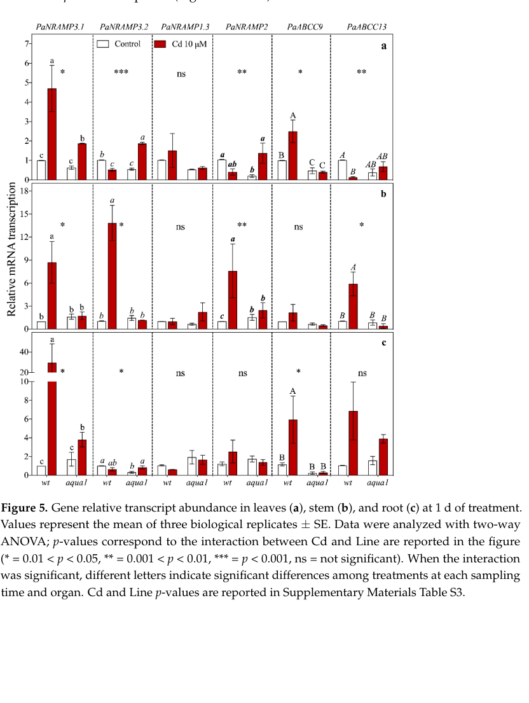

## Question

# Gene Research for Functional Annotation

## ⚠️ CRITICAL: Gene/Protein Identification Context

**BEFORE YOU BEGIN RESEARCH:** You MUST verify you are researching the CORRECT gene/protein. Gene symbols can be ambiguous, especially for less well-characterized genes from non-model organisms.

### Target Gene/Protein Identity (from UniProt):
- **UniProt Accession:** B9GNS0
- **Protein Description:** RecName: Full=Metal transporter Nramp2 {ECO:0000303|PubMed:20623158, ECO:0000303|PubMed:35700212}; Short=PotriNRAMP2 {ECO:0000303|PubMed:35700212}; Short=PtNRAMP2 {ECO:0000303|PubMed:20623158}; AltName: Full=Natural resistance-associated macrophage protein 2 {ECO:0000305};
- **Gene Information:** Name=NRAMP2 {ECO:0000303|PubMed:20623158, ECO:0000303|PubMed:35700212}; OrderedLocusNames=Potri.002G121000 {ECO:0000305};
- **Organism (full):** Populus trichocarpa (Western balsam poplar) (Populus balsamifera subsp. trichocarpa).
- **Protein Family:** Belongs to the NRAMP (TC 2.A.55) family. .
- **Key Domains:** NRAMP_fam. (IPR001046); Nramp (PF01566)

### MANDATORY VERIFICATION STEPS:

1. **Check if the gene symbol "NRAMP2" matches the protein description above**
2. **Verify the organism is correct:** Populus trichocarpa (Western balsam poplar) (Populus balsamifera subsp. trichocarpa).
3. **Check if protein family/domains align with what you find in literature**
4. **If you find literature for a DIFFERENT gene with the same or similar symbol, STOP**

### If Gene Symbol is Ambiguous or You Cannot Find Relevant Literature:

**DO NOT PROCEED WITH RESEARCH ON A DIFFERENT GENE.** Instead:
- State clearly: "The gene symbol 'NRAMP2' is ambiguous or literature is limited for this specific protein"
- Explain what you found (e.g., "Found extensive literature on a different gene with the same symbol in a different organism")
- Describe the protein based ONLY on the UniProt information provided above
- Suggest that the protein function can be inferred from domain/family information

### Research Target:

Please provide a comprehensive research report on the gene **NRAMP2** (gene ID: NRAMP2, UniProt: B9GNS0) in POPTR.

The research report should be a detailed narrative explaining the function, biological processes, and localization of the gene product. Citations should be given for all claims.

You should prioritize authoritative reviews and primary scientific literature when conducting research. You can supplement
this with annotations you find in gene/protein databases, but these can be outdated or inaccurate.

We are specifically interested in the primary function of the gene - for enzymes, what reaction is catalyzed, and what is the substrate specificity? For transporters, what is the substrate? For structural proteins or adapters, what is the broader structural role? For signaling molecules, what is the role in the pathway.

We are interested in where in or outside the cell the gene product carries out its function.

We are also interested in the signaling or biochemical pathways in which the gene functions. We are less interested in broad pleiotropic effects, except where these elucidate the precise role.

Include evidence where possible. We are interested in both experimental evidence as well as inference from structure, evolution, or bioinformatic analysis. Precise studies should be prioritized over high-throughput, where available.

## Output

Question: You are an expert researcher providing comprehensive, well-cited information.

Provide detailed information focusing on:
1. Key concepts and definitions with current understanding
2. Recent developments and latest research (prioritize 2023-2024 sources)
3. Current applications and real-world implementations
4. Expert opinions and analysis from authoritative sources
5. Relevant statistics and data from recent studies

Format as a comprehensive research report with proper citations. Include URLs and publication dates where available.
Always prioritize recent, authoritative sources and provide specific citations for all major claims.

# Gene Research for Functional Annotation

## ⚠️ CRITICAL: Gene/Protein Identification Context

**BEFORE YOU BEGIN RESEARCH:** You MUST verify you are researching the CORRECT gene/protein. Gene symbols can be ambiguous, especially for less well-characterized genes from non-model organisms.

### Target Gene/Protein Identity (from UniProt):
- **UniProt Accession:** B9GNS0
- **Protein Description:** RecName: Full=Metal transporter Nramp2 {ECO:0000303|PubMed:20623158, ECO:0000303|PubMed:35700212}; Short=PotriNRAMP2 {ECO:0000303|PubMed:35700212}; Short=PtNRAMP2 {ECO:0000303|PubMed:20623158}; AltName: Full=Natural resistance-associated macrophage protein 2 {ECO:0000305};
- **Gene Information:** Name=NRAMP2 {ECO:0000303|PubMed:20623158, ECO:0000303|PubMed:35700212}; OrderedLocusNames=Potri.002G121000 {ECO:0000305};
- **Organism (full):** Populus trichocarpa (Western balsam poplar) (Populus balsamifera subsp. trichocarpa).
- **Protein Family:** Belongs to the NRAMP (TC 2.A.55) family. .
- **Key Domains:** NRAMP_fam. (IPR001046); Nramp (PF01566)

### MANDATORY VERIFICATION STEPS:

1. **Check if the gene symbol "NRAMP2" matches the protein description above**
2. **Verify the organism is correct:** Populus trichocarpa (Western balsam poplar) (Populus balsamifera subsp. trichocarpa).
3. **Check if protein family/domains align with what you find in literature**
4. **If you find literature for a DIFFERENT gene with the same or similar symbol, STOP**

### If Gene Symbol is Ambiguous or You Cannot Find Relevant Literature:

**DO NOT PROCEED WITH RESEARCH ON A DIFFERENT GENE.** Instead:
- State clearly: "The gene symbol 'NRAMP2' is ambiguous or literature is limited for this specific protein"
- Explain what you found (e.g., "Found extensive literature on a different gene with the same symbol in a different organism")
- Describe the protein based ONLY on the UniProt information provided above
- Suggest that the protein function can be inferred from domain/family information

### Research Target:

Please provide a comprehensive research report on the gene **NRAMP2** (gene ID: NRAMP2, UniProt: B9GNS0) in POPTR.

The research report should be a detailed narrative explaining the function, biological processes, and localization of the gene product. Citations should be given for all claims.

You should prioritize authoritative reviews and primary scientific literature when conducting research. You can supplement
this with annotations you find in gene/protein databases, but these can be outdated or inaccurate.

We are specifically interested in the primary function of the gene - for enzymes, what reaction is catalyzed, and what is the substrate specificity? For transporters, what is the substrate? For structural proteins or adapters, what is the broader structural role? For signaling molecules, what is the role in the pathway.

We are interested in where in or outside the cell the gene product carries out its function.

We are also interested in the signaling or biochemical pathways in which the gene functions. We are less interested in broad pleiotropic effects, except where these elucidate the precise role.

Include evidence where possible. We are interested in both experimental evidence as well as inference from structure, evolution, or bioinformatic analysis. Precise studies should be prioritized over high-throughput, where available.

## Research report: Functional annotation of *Populus trichocarpa* NRAMP2 (UniProt B9GNS0; locus Potri.002G121000)

### Executive summary
NRAMP2 (UniProt B9GNS0; gene NRAMP2; Potri.002G121000) encodes a member of the conserved NRAMP (Natural Resistance-Associated Macrophage Protein) family of divalent metal transporters in *Populus trichocarpa*. Direct *Populus* evidence currently supports (i) lineage assignment to the NRAMP2–5 clade, and (ii) regulated transcription in reproductive tissues and during cadmium (Cd) exposure. However, direct *P. trichocarpa* functional assays (substrate specificity, kinetics, and subcellular localization) were not retrievable in this run; thus, the most defensible mechanistic model for NRAMP2 relies on high-quality Arabidopsis ortholog experiments showing NRAMP2 is a trans-Golgi network (TGN) manganese (Mn) transporter required for intracellular Mn distribution that impacts photosynthesis and redox homeostasis. Cd-related roles in *Populus* are supported mainly by expression and review-table annotations and should be treated as provisional until validated with transport/localization assays in *P. trichocarpa*. (alejandro2017intracellulardistributionof pages 1-3, alejandro2017intracellulardistributionof pages 3-6, neri2020theroleof pages 5-10, migeon2010genomewideanalysisof pages 13-15, zhang2024theuptaketransfer pages 9-10)

### 1) Key concepts and definitions (current understanding)

**NRAMP transporters (plants).** Plant NRAMP proteins are membrane transporters that move divalent metal ions and are widely implicated in metal uptake, redistribution, and metal-stress physiology. In plants, NRAMP family members have roles spanning nutrient micronutrient homeostasis (notably Mn and Fe) and transport of toxic analogs such as Cd in some contexts (family-level overview and Cd-transport context summarized in a recent review). (zhang2024theuptaketransfer pages 9-10)

**NRAMP2 concept (as defined by mechanistic ortholog studies).** The best-defined NRAMP2 function in plants comes from Arabidopsis: NRAMP2 is an endomembrane Mn transporter localized to the TGN. Its key conceptual role is *intracellular partitioning* of Mn among compartments (rather than net Mn uptake into the plant), which in turn affects Mn delivery to chloroplasts/vacuoles and Mn-dependent redox processes. (alejandro2017intracellulardistributionof pages 1-3, alejandro2017intracellulardistributionof pages 6-9, alejandro2017intracellulardistributionof pages 24-27)

**Cadmium transport/detoxification framework relevant to NRAMPs.** Cd is a non-essential toxic metal. Plant Cd uptake and detoxification typically involve (i) entry via broad-specificity cation transporters (including members of NRAMP and ZIP families), (ii) long-distance translocation, and (iii) sequestration/detoxification (e.g., vacuolar transport of conjugates by ABC transporters). A 2024 review explicitly lists NRAMP family members—including poplar PtNRAMP2—as associated with Cd transport. (zhang2024theuptaketransfer pages 9-10)

### 2) Target identity verification (mandatory)

A key ambiguity risk is that “NRAMP2” is used across many taxa. Here, the target identity is supported by *Populus*-specific mapping of the *P. trichocarpa* locus Potri.002G121000 to “PaNRAMP2” as the homolog of Arabidopsis AtNRAMP2 in a poplar heavy-metal transporter transcription study. This mapping aligns with the UniProt-provided locus name and confirms that Potri.002G121000 is indeed the relevant poplar NRAMP2 ortholog rather than a different NRAMP2 in another organism. (neri2020theroleof pages 5-10)

### 3) Evidence summary table (direct vs inferred)

The following table separates **Populus-specific evidence** from **cross-species inference**, which is critical for a rigorous functional annotation.

| Evidence type | Key finding | Experimental system/assay | Biological role/pathway | Subcellular localization | Transported substrate(s) | Notes/limitations | Key citation (with URL and year) |
|---|---|---|---|---|---|---|---|
| Populus-specific | PtNRAMP2 is a poplar NRAMP-family member with low overall expression representation but detectable expression; five ESTs were reported, with predominant expression in male and female catkins; phylogenetically it falls with the NRAMP2–5 cluster II lineage. (migeon2010genomewideanalysisof pages 13-15) | Genome-wide survey of poplar metal transporters using EST mining and microarray expression profiling across tissues. (migeon2010genomewideanalysisof pages 13-15, migeon2010genomewideanalysisof pages 5-7) | Supports a role in metal-homeostasis pathways in poplar, but direct physiological function was not assigned. (migeon2010genomewideanalysisof pages 13-15) | Not experimentally resolved for PtNRAMP2 in this study. | Not directly tested. | Expression evidence only; no direct transport assay, mutant phenotype, or localization for PtNRAMP2. (migeon2010genomewideanalysisof pages 13-15) | Migeon et al., 2010, *Cellular and Molecular Life Sciences*, https://doi.org/10.1007/s00018-010-0445-0 (2010) (migeon2010genomewideanalysisof pages 13-15) |
| Populus-specific | Potri.002G121000 was mapped as the poplar homolog of AtNRAMP2 (PaNRAMP2 in the study). Under 10 µM Cd, PaNRAMP2 showed strong early up-regulation in wild-type stem at 1 d; additional induction was reported in aqua1 leaves at 1 d and in root/apical leaves at 7 d. (neri2020theroleof pages 5-10, neri2020theroleof pages 10-13) | qRT-PCR expression profiling in *Populus alba* ‘Villafranca’ wild type vs aqua1 line; 10 µM Cd treatment; tissues sampled at 1, 7, 60 d; n=3 biological replicates; ΔΔCq/ln2−ΔΔCt analyses with two-way ANOVA. (neri2020theroleof pages 5-10, neri2018studyofmoleculara pages 104-110, neri2018studyofmolecularb pages 126-147, neri2020theroleof pages 10-13) | Implicates the ortholog in cadmium-response/metal-stress transcriptional networks and potentially direct Cd transport pathways in poplar. (neri2020theroleof pages 5-10) | Not directly tested. | Cd was the focal metal in the experiment, but transport by NRAMP2 itself was inferred from homology and gene-panel design rather than directly measured. | Ortholog mapping is strong, but this is not a direct transport or localization study for *P. trichocarpa* B9GNS0; expression response does not prove substrate specificity. (neri2020theroleof pages 5-10, neri2020theroleof pages 10-13) | Neri et al., 2020, *Plants*, https://doi.org/10.3390/plants10010054 (2020) (neri2020theroleof pages 5-10, neri2020theroleof pages 10-13) |
| Populus-specific review annotation | Review table lists PtNRAMP2 from *Populus trichocarpa* as expressed in leaves and roots and assigns the function “Cd transport.” (zhang2024theuptaketransfer pages 9-10) | Secondary synthesis/review table compiling published transporter annotations. (zhang2024theuptaketransfer pages 9-10) | Places PtNRAMP2 in cadmium uptake/transfer/detoxification literature and heavy-metal transport pathways. (zhang2024theuptaketransfer pages 9-10) | Not provided in the review table. | Cd. (zhang2024theuptaketransfer pages 9-10) | Useful recent summary, but it is not primary evidence and does not report assay details, gene model mapping, or localization. (zhang2024theuptaketransfer pages 9-10) | Zhang et al., 2024, *Cells*, https://doi.org/10.3390/cells13110907 (2024) (zhang2024theuptaketransfer pages 9-10) |
| Cross-species inference | Arabidopsis NRAMP2 is a trans-Golgi network resident Mn transporter required for intracellular Mn distribution; knockdown causes Mn-deficiency hypersensitivity, reduced PSII efficiency, altered redox homeostasis, and lower chloroplast/vacuolar Mn despite near-normal total Mn. (alejandro2017intracellulardistributionof pages 1-3, alejandro2017intracellulardistributionof pages 3-6, alejandro2017intracellulardistributionof pages 6-9, alejandro2017intracellulardistributionof pages 24-27, alejandro2017intracellulardistributionof pages 9-12) | Arabidopsis reverse genetics, GFP colocalization, yeast complementation (smf2Δ, mtm1Δ, sod1Δ, pmr1Δ), organellar Mn measurements, PSII and ROS assays. (alejandro2017intracellulardistributionof pages 1-3, alejandro2017intracellulardistributionof pages 14-17, alejandro2017intracellulardistributionof pages 36-41, alejandro2017intracellulardistributionof pages 6-9, alejandro2017intracellulardistributionof pages 12-14) | Strong mechanistic model for NRAMP2-family function in Mn homeostasis, photosynthesis, and cellular redox balance; likely relevant to poplar ortholog interpretation. (alejandro2017intracellulardistributionof pages 1-3, alejandro2017intracellulardistributionof pages 14-17, alejandro2017intracellulardistributionof pages 12-14) | Trans-Golgi network (TGN). (alejandro2017intracellulardistributionof pages 1-3, alejandro2017intracellulardistributionof pages 6-9, alejandro2017intracellulardistributionof pages 12-14) | Mn. (alejandro2017intracellulardistributionof pages 1-3, alejandro2017intracellulardistributionof pages 6-9, alejandro2017intracellulardistributionof pages 24-27) | High-quality mechanistic evidence, but from Arabidopsis rather than poplar; substrate/localization conservation in PtNRAMP2 remains inferred, not demonstrated. | Alejandro et al., 2017, *Plant Cell*, https://doi.org/10.1105/tpc.17.00578 (2017) (alejandro2017intracellulardistributionof pages 1-3, alejandro2017intracellulardistributionof pages 6-9, alejandro2017intracellulardistributionof pages 12-14, alejandro2017intracellulardistributionof pages 24-27) |
| Ambiguity/limitations summary | For UniProt B9GNS0/Potri.002G121000, the evidence base supports assignment to the NRAMP family and an orthology link to AtNRAMP2, but there is no direct published *Populus trichocarpa* assay here demonstrating subcellular localization, kinetic transport properties, or definitive substrate specificity for Mn vs Cd vs Fe. (neri2020theroleof pages 5-10, migeon2010genomewideanalysisof pages 13-15) | Synthesis across poplar expression studies, review annotations, and Arabidopsis functional work. | Most defensible current annotation is “metal transporter in the NRAMP family involved in metal homeostasis/stress response,” with Mn-distribution function inferred from orthology and Cd involvement suggested by poplar expression/review evidence. (zhang2024theuptaketransfer pages 9-10, alejandro2017intracellulardistributionof pages 1-3, neri2020theroleof pages 5-10, migeon2010genomewideanalysisof pages 13-15) | Unresolved directly in poplar; TGN localization is an orthology-based inference from Arabidopsis. (alejandro2017intracellulardistributionof pages 1-3, alejandro2017intracellulardistributionof pages 12-14) | Likely divalent metals; strongest direct family-level inference is Mn, while poplar-specific literature also links PtNRAMP2 to Cd response/transport. (zhang2024theuptaketransfer pages 9-10, alejandro2017intracellulardistributionof pages 1-3, neri2020theroleof pages 5-10) | Critical caution: avoid over-claiming a poplar-specific Mn-TGN function or Cd transporter role without direct biochemical/localization data for B9GNS0. | Evidence synthesis from Migeon 2010, Neri 2020, Zhang 2024, Alejandro 2017: https://doi.org/10.1007/s00018-010-0445-0; https://doi.org/10.3390/plants10010054; https://doi.org/10.3390/cells13110907; https://doi.org/10.1105/tpc.17.00578 (2010–2024) (zhang2024theuptaketransfer pages 9-10, alejandro2017intracellulardistributionof pages 1-3, neri2020theroleof pages 5-10, migeon2010genomewideanalysisof pages 13-15) |

*Table: This table summarizes the strongest available functional annotation evidence for Populus NRAMP2 (B9GNS0; Potri.002G121000), clearly separating direct poplar evidence from cross-species inference. It is useful for distinguishing what is experimentally shown in poplar versus what is inferred from the well-characterized Arabidopsis NRAMP2 ortholog.*

### 4) Molecular function: transported substrate(s) and mechanism

#### 4.1 What is directly supported for *Populus* NRAMP2?
Direct experimental transport assays for *P. trichocarpa* NRAMP2 (B9GNS0 / Potri.002G121000) were not available in the retrieved primary literature here. Nonetheless, two lines of *Populus*-relevant evidence support a metal-transport role:

1. **Family placement and expression**: PtNRAMP2 is part of the poplar NRAMP gene set analyzed in a genome-wide transporter survey and is placed in the NRAMP2–5 evolutionary cluster (cluster II), supporting orthology to the well-characterized AtNRAMP2 lineage. (migeon2010genomewideanalysisof pages 13-15)
2. **Cd-stress transcriptional regulation**: Potri.002G121000 (PaNRAMP2) shows significant transcriptional responsiveness under 10 µM Cd exposure in poplar organs, consistent with involvement in Cd-stress physiology (though not proving Cd transport). (neri2020theroleof pages 5-10, neri2020theroleof pages 10-13)

Additionally, a 2024 review table lists PtNRAMP2 as “Cd transport” with expression in leaves and roots. This is useful as a recent synthesis but is secondary evidence without the underlying assay details in the excerpted material. (zhang2024theuptaketransfer pages 9-10)

#### 4.2 What is strongly supported by authoritative mechanistic evidence (Arabidopsis ortholog NRAMP2)?
A high-impact mechanistic study (Plant Cell, 2017) demonstrates that Arabidopsis NRAMP2:

- **Subcellular localization**: is a resident protein of the **trans-Golgi network (TGN)**, with NRAMP2-GFP showing strong co-localization with the TGN marker SYP61 and detection in purified SYP61-containing TGN vesicles. (alejandro2017intracellulardistributionof pages 6-9, alejandro2017intracellulardistributionof pages 12-14)
- **Substrate**: functions in **manganese (Mn) transport** and intracellular Mn distribution. (alejandro2017intracellulardistributionof pages 1-3, alejandro2017intracellulardistributionof pages 6-9)
- **Transport direction model**: genetic/yeast data support a model in which NRAMP2 likely **mobilizes Mn from vesicular/TGN lumenal pools to the cytosol**, building a cytosolic Mn pool that feeds downstream organelles. This is supported by yeast complementation patterns (e.g., rescuing smf2Δ and mtm1Δ but not pmr1Δ). (alejandro2017intracellulardistributionof pages 14-17, alejandro2017intracellulardistributionof pages 6-9, alejandro2017intracellulardistributionof pages 24-27)

Given the confirmed orthology mapping of Potri.002G121000 to the AtNRAMP2 homolog in poplar (and phylogenetic placement of PtNRAMP2 within the same NRAMP2–5 cluster), the **most conservative mechanistic inference** is that *P. trichocarpa* NRAMP2 is also an endomembrane NRAMP-family metal transporter, plausibly mediating Mn redistribution. This remains an inference until directly tested in poplar. (neri2020theroleof pages 5-10, migeon2010genomewideanalysisof pages 13-15, alejandro2017intracellulardistributionof pages 6-9)

### 5) Biological processes and pathways

#### 5.1 Mn homeostasis, photosynthesis, and redox balance (ortholog-derived pathway model)
Arabidopsis NRAMP2 knockdown alleles show pronounced sensitivity to Mn deficiency, including impaired photosynthetic performance and oxidative stress phenotypes, with organellar Mn depletion despite relatively unchanged total cellular Mn. (alejandro2017intracellulardistributionof pages 1-3, alejandro2017intracellulardistributionof pages 6-9)

Key pathway-level conclusions supported by the Plant Cell 2017 study include:

- Under Mn limitation, nramp2 mutants have reduced PSII performance and oxidative stress signatures, indicating that *intracellular Mn allocation* can be limiting even when total Mn is not. (alejandro2017intracellulardistributionof pages 1-3, alejandro2017intracellulardistributionof pages 6-9)
- NRAMP2 operates in a pathway connected to vacuolar/chloroplast Mn supply; the model links TGN Mn mobilization, vacuolar Mn pools, and downstream mobilization for chloroplast function and ROS detoxification. (alejandro2017intracellulardistributionof pages 14-17, alejandro2017intracellulardistributionof pages 24-27)

These findings provide a mechanistic framework for annotating poplar NRAMP2 as a likely contributor to intracellular Mn distribution with downstream effects on photosynthesis/redox under Mn-limited conditions, pending direct poplar validation. (alejandro2017intracellulardistributionof pages 1-3, alejandro2017intracellulardistributionof pages 6-9)

#### 5.2 Cd stress and detoxification context in poplar (expression- and review-supported)
A poplar cadmium study (Plants, 2020) explicitly includes Potri.002G121000/PaNRAMP2 among genes hypothesized to be involved in Cd transport, and reports that PaNRAMP2 transcription is induced early (notably in stem at 1 day) under 10 µM Cd exposure. (neri2020theroleof pages 5-10, neri2020theroleof pages 10-13)

A 2024 review of Cd uptake/transfer/detoxification compiles PtNRAMP2 as associated with Cd transport and lists it as expressed in leaves and roots. (zhang2024theuptaketransfer pages 9-10)

Together, these suggest that poplar NRAMP2 is engaged in Cd-response networks and may contribute to Cd transport in planta, but **direct transport activity for Cd by PtNRAMP2 is not demonstrated in the retrieved primary evidence**, and should be interpreted with caution. (neri2020theroleof pages 5-10, zhang2024theuptaketransfer pages 9-10)

### 6) Expression patterns and regulation

#### 6.1 Tissue expression in *Populus trichocarpa*
A genome-wide poplar metal-transporter survey reported **five ESTs** for PtNRAMP2 and noted **predominant expression in male and female catkins**, suggesting a potential reproductive role or high metal-transport demand during flowering structures. (migeon2010genomewideanalysisof pages 13-15)

#### 6.2 Cd-responsive transcription in poplar (time course and tissues)
In poplar exposed to **10 µM Cd**, PaNRAMP2 (Potri.002G121000) shows a **strong up-regulation at 1 day in stem** of wild-type plants; in an aquaporin-overexpressing line (aqua1), PaNRAMP2 induction is reported at 1 day in leaves and at 7 days in root and apical leaves, indicating genotype-dependent regulation and organ specificity. (neri2020theroleof pages 10-13)

The time-course design includes sampling at **1, 7, and 60 days** across root, stem, and stratified leaf positions, with qRT-PCR values reported as mean ± SE (n=3) and analyzed by two-way ANOVA. (neri2020theroleof pages 5-10)

**Visual evidence (expression plots).** Figure extractions show PaNRAMP2 relative transcript abundance under Cd treatment across organs at 1 day and 7 days (as part of a panel of metal transporter genes), supporting the text-described induction patterns. (neri2020theroleof media a1a91021, neri2020theroleof media 1243d278)

### 7) Subcellular localization

- **Direct Populus localization**: Not identified in the retrieved Populus-specific sources for Pt/PaNRAMP2 (Potri.002G121000). (neri2020theroleof pages 5-10, migeon2010genomewideanalysisof pages 13-15)
- **Strong ortholog evidence**: Arabidopsis NRAMP2 is TGN-localized based on marker co-localization and biochemical enrichment in purified TGN vesicles. (alejandro2017intracellulardistributionof pages 6-9, alejandro2017intracellulardistributionof pages 12-14)

Thus, the most conservative annotation is: **Populus NRAMP2 is likely an endomembrane transporter (potentially TGN), based on orthology**, but this remains to be directly tested in poplar. (alejandro2017intracellulardistributionof pages 6-9, neri2020theroleof pages 5-10)

### 8) Recent developments and latest research (2023–2024 priority)

**2024 authoritative synthesis (Cd focus).** A 2024 peer-reviewed review in *Cells* compiles current understanding of Cd uptake/transfer/detoxification mechanisms and includes PtNRAMP2 as a Cd-transport-associated poplar gene expressed in leaves and roots, reflecting how the field currently classifies PtNRAMP2 within the Cd-transport landscape. Publication date: May 2024; URL: https://doi.org/10.3390/cells13110907. (zhang2024theuptaketransfer pages 9-10)

**2023–2024 Populus NRAMP family primary studies (not accessible in this run).** Searches identified multiple 2023 Populus NRAMP family genome-wide analyses (e.g., Ecotoxicology and Environmental Safety 2023; Tree Genetics & Genomes 2023), but these papers were not obtainable via the toolchain during this run, limiting incorporation of 2023–2024 *primary* Populus-specific functional updates (e.g., gene-by-gene substrate predictions, expression matrices, or candidate functional assays). This is a major limitation for “latest research” coverage specific to *P. trichocarpa* NRAMP2.

### 9) Applications and real-world implementations

**Phytoremediation and Cd management.** The 2024 review frames transporter families including NRAMPs as central levers in Cd uptake/transport and therefore as potential targets for phytoremediation strategies and for mitigating Cd accumulation in plants. (zhang2024theuptaketransfer pages 9-10)

**Poplar implementation context (stress physiology/engineering interaction).** In poplar, manipulating water relations via aquaporin overexpression (aqua1 line) altered heavy-metal transporter transcription and was associated with altered Cd distribution (study context). While this is not a direct NRAMP2 engineering study, it provides an example of how transporter networks (including PaNRAMP2) are measured and potentially targeted in engineered poplar systems under Cd stress. (neri2020theroleof pages 5-10)

### 10) Quantitative data and statistics (recent studies and authoritative primary evidence)

#### 10.1 Arabidopsis mechanistic statistics (NRAMP2)
- **NRAMP2 induction by Mn deficiency**: NRAMP2 expression was induced by ~2.5-fold under Mn deficiency (Arabidopsis). (alejandro2017intracellulardistributionof pages 3-6)
- **Chlorophyll phenotype under Mn deficiency**: the nramp2-3 allele showed a **44% reduction in chlorophyll** under Mn deficiency (Arabidopsis), rescued by Mn supplementation and by transgenic complementation. (alejandro2017intracellulardistributionof pages 3-6)
- **Shoot Mn under Mn shortage**: under Mn shortage, nramp2-3 shoots showed an **~26% increase in Mn content**, supporting that NRAMP2 primarily affects intracellular distribution rather than uptake. (alejandro2017intracellulardistributionof pages 3-6)

#### 10.2 Poplar Cd exposure statistics (implementation context)
A Populus cadmium study (doctoral thesis work on *Populus alba* ‘Villafranca’) provides quantitative accumulation values under 10 µM Cd exposure, illustrating the scale of tissue Cd loads in poplar systems where PaNRAMP2 is transcriptionally profiled:
- **Apical leaves at 7 days**: ~16.8 vs 19.0 µg g−1 DW (wt vs transgenic line). (neri2018studyofmoleculara pages 104-110)
- **Roots at 60 days**: ~905 vs 841 µg g−1 DW (wt vs transgenic line). (neri2018studyofmoleculara pages 104-110)
- **Medial leaves**: 9.45 vs 1.31 µg g−1 DW at 7 d and 85.8 vs 47.5 µg g−1 DW at 60 d (transgenic line higher than wt), highlighting genotype-dependent Cd partitioning. (neri2018studyofmoleculara pages 104-110)

For PaNRAMP2 specifically, the retrieved peer-reviewed poplar study reports “strong up-regulation” patterns but does not provide explicit fold-change numbers in the excerpted text; the relevant expression plots are provided in the extracted figures. (neri2020theroleof pages 10-13, neri2020theroleof media a1a91021, neri2020theroleof media 1243d278)

### 11) Expert opinion and authoritative analysis

**Consensus view on NRAMP2 function (mechanistic).** The Plant Cell 2017 study provides a strong expert-backed mechanistic interpretation: NRAMP2’s TGN localization and vesicular Mn mobilization are critical for supplying Mn to organelles and for preventing Mn-deficiency-driven photosynthetic and redox defects, shifting the field’s view from “Mn uptake” to “intracellular Mn logistics.” (alejandro2017intracellulardistributionof pages 1-3, alejandro2017intracellulardistributionof pages 6-9, alejandro2017intracellulardistributionof pages 24-27)

**Consensus view on Cd relevance.** The 2024 review’s inclusion of PtNRAMP2 as a Cd transport-associated gene reflects current domain synthesis; however, such review-table assignments often aggregate heterogeneous evidence (expression, homology, and in some cases functional assays). Therefore, it is best treated as a current *classification* rather than definitive functional proof for PtNRAMP2 substrate specificity. (zhang2024theuptaketransfer pages 9-10)

### 12) Most defensible functional annotation for UniProt B9GNS0 (Potri.002G121000)

**Protein class:** NRAMP-family membrane metal transporter (divalent cation transporter). (migeon2010genomewideanalysisof pages 13-15)

**Primary function (best-supported):** Contributes to **intracellular metal homeostasis**. By orthology to Arabidopsis NRAMP2, the strongest mechanistic evidence supports a role in **intracellular Mn distribution** via an endomembrane compartment (TGN) affecting chloroplast/vacuolar Mn and redox/photosynthetic performance under Mn limitation. (alejandro2017intracellulardistributionof pages 1-3, alejandro2017intracellulardistributionof pages 6-9, alejandro2017intracellulardistributionof pages 24-27)

**Poplar-specific functional context (supported but not definitive):** Potri.002G121000 (PaNRAMP2) is **Cd-responsive** in poplar under 10 µM Cd exposure; PtNRAMP2 is classified in a 2024 review as associated with **Cd transport** and expressed in leaves/roots, suggesting potential involvement in Cd transport/partitioning pathways. (neri2020theroleof pages 5-10, zhang2024theuptaketransfer pages 9-10)

**Subcellular localization:** Not directly demonstrated for poplar in retrieved sources; orthology supports **TGN localization** as the most plausible hypothesis. (alejandro2017intracellulardistributionof pages 6-9, neri2020theroleof pages 5-10)

### 13) Limitations and gaps (critical)

1. **Missing 2023–2024 Populus primary papers:** Several 2023 Populus NRAMP family genome-wide studies were identified but unobtainable in this run, limiting the requested 2023–2024 Populus-specific update. 
2. **No direct PtNRAMP2 transport assay available here:** Neither yeast complementation nor radiotracer/uptake assays for PtNRAMP2 were retrieved; thus **substrate specificity (Mn vs Cd vs Fe)** and **transport directionality** in poplar remain unconfirmed.
3. **No direct PtNRAMP2 localization assay retrieved:** TGN localization is inferred from Arabidopsis NRAMP2 and must be validated for PtNRAMP2.

### Key sources (URLs and publication dates)
- Alejandro S. et al. *Intracellular Distribution of Manganese by the Trans-Golgi Network Transporter NRAMP2 Is Critical for Photosynthesis and Cellular Redox Homeostasis*. **Plant Cell**. **Nov 2017**. https://doi.org/10.1105/tpc.17.00578 (alejandro2017intracellulardistributionof pages 1-3)
- Zhang X. et al. *The Uptake, Transfer, and Detoxification of Cadmium in Plants and Its Exogenous Effects*. **Cells**. **May 2024**. https://doi.org/10.3390/cells13110907 (zhang2024theuptaketransfer pages 9-10)
- Neri A. et al. *The Role of Aquaporin Overexpression in the Modulation of Transcription of Heavy Metal Transporters under Cadmium Treatment in Poplar*. **Plants**. **Dec 2020**. https://doi.org/10.3390/plants10010054 (neri2020theroleof pages 5-10)
- Migeon A. et al. *Genome-wide analysis of plant metal transporters, with an emphasis on poplar*. **Cellular and Molecular Life Sciences**. **Jul 2010**. https://doi.org/10.1007/s00018-010-0445-0 (migeon2010genomewideanalysisof pages 13-15)

References

1. (alejandro2017intracellulardistributionof pages 1-3): Santiago Alejandro, Rémy Cailliatte, Carine Alcon, Léon Dirick, Frédéric Domergue, David Correia, Loren Castaings, Jean-François Briat, Stéphane Mari, and Catherine Curie. Intracellular distribution of manganese by the trans-golgi network transporter nramp2 is critical for photosynthesis and cellular redox homeostasis. Plant Cell, 29:3068-3084, Nov 2017. URL: https://doi.org/10.1105/tpc.17.00578, doi:10.1105/tpc.17.00578. This article has 133 citations and is from a highest quality peer-reviewed journal.

2. (alejandro2017intracellulardistributionof pages 3-6): Santiago Alejandro, Rémy Cailliatte, Carine Alcon, Léon Dirick, Frédéric Domergue, David Correia, Loren Castaings, Jean-François Briat, Stéphane Mari, and Catherine Curie. Intracellular distribution of manganese by the trans-golgi network transporter nramp2 is critical for photosynthesis and cellular redox homeostasis. Plant Cell, 29:3068-3084, Nov 2017. URL: https://doi.org/10.1105/tpc.17.00578, doi:10.1105/tpc.17.00578. This article has 133 citations and is from a highest quality peer-reviewed journal.

3. (neri2020theroleof pages 5-10): Andrea Neri, Silvia Traversari, Andrea Andreucci, Alessandra Francini, and Luca Sebastiani. The role of aquaporin overexpression in the modulation of transcription of heavy metal transporters under cadmium treatment in poplar. Plants, 10:54, Dec 2020. URL: https://doi.org/10.3390/plants10010054, doi:10.3390/plants10010054. This article has 16 citations.

4. (migeon2010genomewideanalysisof pages 13-15): Aude Migeon, Damien Blaudez, Olivia Wilkins, Barbara Montanini, Malcolm M. Campbell, Pierre Richaud, Sébastien Thomine, and Michel Chalot. Genome-wide analysis of plant metal transporters, with an emphasis on poplar. Cellular and Molecular Life Sciences, 67:3763-3784, Jul 2010. URL: https://doi.org/10.1007/s00018-010-0445-0, doi:10.1007/s00018-010-0445-0. This article has 163 citations and is from a domain leading peer-reviewed journal.

5. (zhang2024theuptaketransfer pages 9-10): Xintong Zhang, Man Yang, Hui Yang, Ruiqi Pian, Jinxiang Wang, and Ai-Min Wu. The uptake, transfer, and detoxification of cadmium in plants and its exogenous effects. Cells, 13:907, May 2024. URL: https://doi.org/10.3390/cells13110907, doi:10.3390/cells13110907. This article has 97 citations.

6. (alejandro2017intracellulardistributionof pages 6-9): Santiago Alejandro, Rémy Cailliatte, Carine Alcon, Léon Dirick, Frédéric Domergue, David Correia, Loren Castaings, Jean-François Briat, Stéphane Mari, and Catherine Curie. Intracellular distribution of manganese by the trans-golgi network transporter nramp2 is critical for photosynthesis and cellular redox homeostasis. Plant Cell, 29:3068-3084, Nov 2017. URL: https://doi.org/10.1105/tpc.17.00578, doi:10.1105/tpc.17.00578. This article has 133 citations and is from a highest quality peer-reviewed journal.

7. (alejandro2017intracellulardistributionof pages 24-27): Santiago Alejandro, Rémy Cailliatte, Carine Alcon, Léon Dirick, Frédéric Domergue, David Correia, Loren Castaings, Jean-François Briat, Stéphane Mari, and Catherine Curie. Intracellular distribution of manganese by the trans-golgi network transporter nramp2 is critical for photosynthesis and cellular redox homeostasis. Plant Cell, 29:3068-3084, Nov 2017. URL: https://doi.org/10.1105/tpc.17.00578, doi:10.1105/tpc.17.00578. This article has 133 citations and is from a highest quality peer-reviewed journal.

8. (migeon2010genomewideanalysisof pages 5-7): Aude Migeon, Damien Blaudez, Olivia Wilkins, Barbara Montanini, Malcolm M. Campbell, Pierre Richaud, Sébastien Thomine, and Michel Chalot. Genome-wide analysis of plant metal transporters, with an emphasis on poplar. Cellular and Molecular Life Sciences, 67:3763-3784, Jul 2010. URL: https://doi.org/10.1007/s00018-010-0445-0, doi:10.1007/s00018-010-0445-0. This article has 163 citations and is from a domain leading peer-reviewed journal.

9. (neri2020theroleof pages 10-13): Andrea Neri, Silvia Traversari, Andrea Andreucci, Alessandra Francini, and Luca Sebastiani. The role of aquaporin overexpression in the modulation of transcription of heavy metal transporters under cadmium treatment in poplar. Plants, 10:54, Dec 2020. URL: https://doi.org/10.3390/plants10010054, doi:10.3390/plants10010054. This article has 16 citations.

10. (neri2018studyofmoleculara pages 104-110): A Neri. Study of molecular and physiological responses on populus alba l.'villafranca'clone stressed with cd and zn. Unknown journal, 2018.

11. (neri2018studyofmolecularb pages 126-147): A Neri. Study of molecular and physiological responses on populus alba l.'villafranca'clone stressed with cd and zn. Unknown journal, 2018.

12. (alejandro2017intracellulardistributionof pages 9-12): Santiago Alejandro, Rémy Cailliatte, Carine Alcon, Léon Dirick, Frédéric Domergue, David Correia, Loren Castaings, Jean-François Briat, Stéphane Mari, and Catherine Curie. Intracellular distribution of manganese by the trans-golgi network transporter nramp2 is critical for photosynthesis and cellular redox homeostasis. Plant Cell, 29:3068-3084, Nov 2017. URL: https://doi.org/10.1105/tpc.17.00578, doi:10.1105/tpc.17.00578. This article has 133 citations and is from a highest quality peer-reviewed journal.

13. (alejandro2017intracellulardistributionof pages 14-17): Santiago Alejandro, Rémy Cailliatte, Carine Alcon, Léon Dirick, Frédéric Domergue, David Correia, Loren Castaings, Jean-François Briat, Stéphane Mari, and Catherine Curie. Intracellular distribution of manganese by the trans-golgi network transporter nramp2 is critical for photosynthesis and cellular redox homeostasis. Plant Cell, 29:3068-3084, Nov 2017. URL: https://doi.org/10.1105/tpc.17.00578, doi:10.1105/tpc.17.00578. This article has 133 citations and is from a highest quality peer-reviewed journal.

14. (alejandro2017intracellulardistributionof pages 36-41): Santiago Alejandro, Rémy Cailliatte, Carine Alcon, Léon Dirick, Frédéric Domergue, David Correia, Loren Castaings, Jean-François Briat, Stéphane Mari, and Catherine Curie. Intracellular distribution of manganese by the trans-golgi network transporter nramp2 is critical for photosynthesis and cellular redox homeostasis. Plant Cell, 29:3068-3084, Nov 2017. URL: https://doi.org/10.1105/tpc.17.00578, doi:10.1105/tpc.17.00578. This article has 133 citations and is from a highest quality peer-reviewed journal.

15. (alejandro2017intracellulardistributionof pages 12-14): Santiago Alejandro, Rémy Cailliatte, Carine Alcon, Léon Dirick, Frédéric Domergue, David Correia, Loren Castaings, Jean-François Briat, Stéphane Mari, and Catherine Curie. Intracellular distribution of manganese by the trans-golgi network transporter nramp2 is critical for photosynthesis and cellular redox homeostasis. Plant Cell, 29:3068-3084, Nov 2017. URL: https://doi.org/10.1105/tpc.17.00578, doi:10.1105/tpc.17.00578. This article has 133 citations and is from a highest quality peer-reviewed journal.

16. (neri2020theroleof media a1a91021): Andrea Neri, Silvia Traversari, Andrea Andreucci, Alessandra Francini, and Luca Sebastiani. The role of aquaporin overexpression in the modulation of transcription of heavy metal transporters under cadmium treatment in poplar. Plants, 10:54, Dec 2020. URL: https://doi.org/10.3390/plants10010054, doi:10.3390/plants10010054. This article has 16 citations.

17. (neri2020theroleof media 1243d278): Andrea Neri, Silvia Traversari, Andrea Andreucci, Alessandra Francini, and Luca Sebastiani. The role of aquaporin overexpression in the modulation of transcription of heavy metal transporters under cadmium treatment in poplar. Plants, 10:54, Dec 2020. URL: https://doi.org/10.3390/plants10010054, doi:10.3390/plants10010054. This article has 16 citations.

## Artifacts

- [Edison artifact artifact-00](NRAMP2-deep-research-falcon_artifacts/artifact-00.md)

## Citations

1. zhang2024theuptaketransfer pages 9-10
2. neri2020theroleof pages 5-10
3. migeon2010genomewideanalysisof pages 13-15
4. neri2020theroleof pages 10-13
5. alejandro2017intracellulardistributionof pages 3-6
6. neri2018studyofmoleculara pages 104-110
7. alejandro2017intracellulardistributionof pages 1-3
8. alejandro2017intracellulardistributionof pages 6-9
9. alejandro2017intracellulardistributionof pages 24-27
10. migeon2010genomewideanalysisof pages 5-7
11. neri2018studyofmolecularb pages 126-147
12. alejandro2017intracellulardistributionof pages 9-12
13. alejandro2017intracellulardistributionof pages 14-17
14. alejandro2017intracellulardistributionof pages 36-41
15. alejandro2017intracellulardistributionof pages 12-14
16. https://doi.org/10.1007/s00018-010-0445-0
17. https://doi.org/10.3390/plants10010054
18. https://doi.org/10.3390/cells13110907
19. https://doi.org/10.1105/tpc.17.00578
20. https://doi.org/10.1007/s00018-010-0445-0;
21. https://doi.org/10.3390/plants10010054;
22. https://doi.org/10.3390/cells13110907;
23. https://doi.org/10.3390/cells13110907.
24. https://doi.org/10.1105/tpc.17.00578,
25. https://doi.org/10.3390/plants10010054,
26. https://doi.org/10.1007/s00018-010-0445-0,
27. https://doi.org/10.3390/cells13110907,