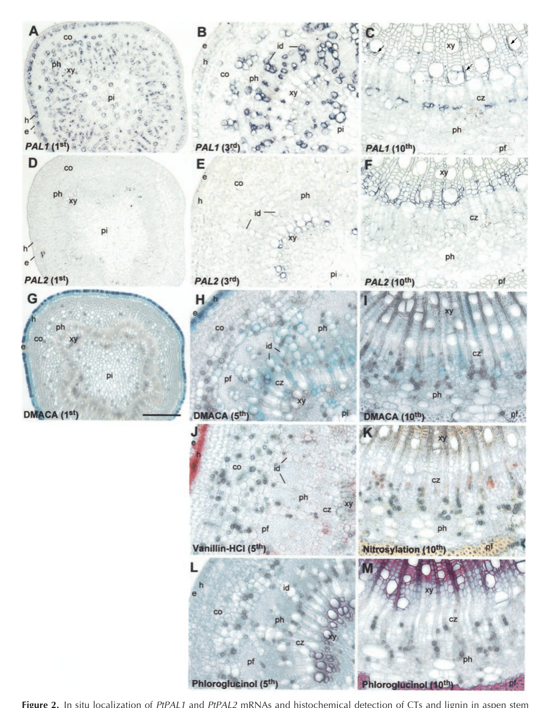

## Question

# Gene Research for Functional Annotation

## ⚠️ CRITICAL: Gene/Protein Identification Context

**BEFORE YOU BEGIN RESEARCH:** You MUST verify you are researching the CORRECT gene/protein. Gene symbols can be ambiguous, especially for less well-characterized genes from non-model organisms.

### Target Gene/Protein Identity (from UniProt):
- **UniProt Accession:** P45730
- **Protein Description:** RecName: Full=Phenylalanine ammonia-lyase; EC=4.3.1.24 {ECO:0000250|UniProtKB:P24481};
- **Gene Information:** Name=PAL;
- **Organism (full):** Populus trichocarpa (Western balsam poplar) (Populus balsamifera subsp. trichocarpa).
- **Protein Family:** Belongs to the PAL/histidase family. .
- **Key Domains:** Aromatic_Lyase. (IPR001106); Fumarase/histidase_N. (IPR024083); L-Aspartase-like. (IPR008948); Phe/His_NH3-lyase_AS. (IPR022313); Phe_NH3-lyase. (IPR005922)

### MANDATORY VERIFICATION STEPS:

1. **Check if the gene symbol "PAL" matches the protein description above**
2. **Verify the organism is correct:** Populus trichocarpa (Western balsam poplar) (Populus balsamifera subsp. trichocarpa).
3. **Check if protein family/domains align with what you find in literature**
4. **If you find literature for a DIFFERENT gene with the same or similar symbol, STOP**

### If Gene Symbol is Ambiguous or You Cannot Find Relevant Literature:

**DO NOT PROCEED WITH RESEARCH ON A DIFFERENT GENE.** Instead:
- State clearly: "The gene symbol 'PAL' is ambiguous or literature is limited for this specific protein"
- Explain what you found (e.g., "Found extensive literature on a different gene with the same symbol in a different organism")
- Describe the protein based ONLY on the UniProt information provided above
- Suggest that the protein function can be inferred from domain/family information

### Research Target:

Please provide a comprehensive research report on the gene **PAL** (gene ID: PAL, UniProt: P45730) in POPTR.

The research report should be a detailed narrative explaining the function, biological processes, and localization of the gene product. Citations should be given for all claims.

You should prioritize authoritative reviews and primary scientific literature when conducting research. You can supplement
this with annotations you find in gene/protein databases, but these can be outdated or inaccurate.

We are specifically interested in the primary function of the gene - for enzymes, what reaction is catalyzed, and what is the substrate specificity? For transporters, what is the substrate? For structural proteins or adapters, what is the broader structural role? For signaling molecules, what is the role in the pathway.

We are interested in where in or outside the cell the gene product carries out its function.

We are also interested in the signaling or biochemical pathways in which the gene functions. We are less interested in broad pleiotropic effects, except where these elucidate the precise role.

Include evidence where possible. We are interested in both experimental evidence as well as inference from structure, evolution, or bioinformatic analysis. Precise studies should be prioritized over high-throughput, where available.

## Output

Question: You are an expert researcher providing comprehensive, well-cited information.

Provide detailed information focusing on:
1. Key concepts and definitions with current understanding
2. Recent developments and latest research (prioritize 2023-2024 sources)
3. Current applications and real-world implementations
4. Expert opinions and analysis from authoritative sources
5. Relevant statistics and data from recent studies

Format as a comprehensive research report with proper citations. Include URLs and publication dates where available.
Always prioritize recent, authoritative sources and provide specific citations for all major claims.

# Gene Research for Functional Annotation

## ⚠️ CRITICAL: Gene/Protein Identification Context

**BEFORE YOU BEGIN RESEARCH:** You MUST verify you are researching the CORRECT gene/protein. Gene symbols can be ambiguous, especially for less well-characterized genes from non-model organisms.

### Target Gene/Protein Identity (from UniProt):
- **UniProt Accession:** P45730
- **Protein Description:** RecName: Full=Phenylalanine ammonia-lyase; EC=4.3.1.24 {ECO:0000250|UniProtKB:P24481};
- **Gene Information:** Name=PAL;
- **Organism (full):** Populus trichocarpa (Western balsam poplar) (Populus balsamifera subsp. trichocarpa).
- **Protein Family:** Belongs to the PAL/histidase family. .
- **Key Domains:** Aromatic_Lyase. (IPR001106); Fumarase/histidase_N. (IPR024083); L-Aspartase-like. (IPR008948); Phe/His_NH3-lyase_AS. (IPR022313); Phe_NH3-lyase. (IPR005922)

### MANDATORY VERIFICATION STEPS:

1. **Check if the gene symbol "PAL" matches the protein description above**
2. **Verify the organism is correct:** Populus trichocarpa (Western balsam poplar) (Populus balsamifera subsp. trichocarpa).
3. **Check if protein family/domains align with what you find in literature**
4. **If you find literature for a DIFFERENT gene with the same or similar symbol, STOP**

### If Gene Symbol is Ambiguous or You Cannot Find Relevant Literature:

**DO NOT PROCEED WITH RESEARCH ON A DIFFERENT GENE.** Instead:
- State clearly: "The gene symbol 'PAL' is ambiguous or literature is limited for this specific protein"
- Explain what you found (e.g., "Found extensive literature on a different gene with the same symbol in a different organism")
- Describe the protein based ONLY on the UniProt information provided above
- Suggest that the protein function can be inferred from domain/family information

### Research Target:

Please provide a comprehensive research report on the gene **PAL** (gene ID: PAL, UniProt: P45730) in POPTR.

The research report should be a detailed narrative explaining the function, biological processes, and localization of the gene product. Citations should be given for all claims.

You should prioritize authoritative reviews and primary scientific literature when conducting research. You can supplement
this with annotations you find in gene/protein databases, but these can be outdated or inaccurate.

We are specifically interested in the primary function of the gene - for enzymes, what reaction is catalyzed, and what is the substrate specificity? For transporters, what is the substrate? For structural proteins or adapters, what is the broader structural role? For signaling molecules, what is the role in the pathway.

We are interested in where in or outside the cell the gene product carries out its function.

We are also interested in the signaling or biochemical pathways in which the gene functions. We are less interested in broad pleiotropic effects, except where these elucidate the precise role.

Include evidence where possible. We are interested in both experimental evidence as well as inference from structure, evolution, or bioinformatic analysis. Precise studies should be prioritized over high-throughput, where available.

## Research report: Populus trichocarpa PAL (UniProt P45730) — functional annotation synthesis

### Scope and identity verification (critical disambiguation)
The UniProt accession **P45730** is annotated as **phenylalanine ammonia-lyase (PAL; EC 4.3.1.24)** from **Populus trichocarpa**. “PAL” is an extremely ambiguous symbol across taxa; therefore, this report restricts organism-specific functional statements to **Populus PAL enzymes** in the **phenylpropanoid entry step** (L-phenylalanine → trans-cinnamic acid) and uses **Populus trichocarpa PAL family** literature for gene-level context. 

A key limitation is that, from the retrieved full texts, I **could not explicitly map UniProt P45730 to a specific Populus trichocarpa locus (e.g., Potri.*) or to a specific family member (PtrPAL1–PtrPAL5)**. Consequently, isoform-specific claims are presented at the level of the **Populus PAL family** unless the underlying paper explicitly distinguishes PAL isoforms by sequence or locus identifiers. (jong2015characterisationofthe pages 1-2, jong2015characterisationofthe pages 2-3)

### 1) Key concepts and definitions (current understanding)

#### 1.1 Enzymatic function and reaction
**Phenylalanine ammonia-lyase (PAL)** catalyzes the **non-oxidative deamination** of **L-phenylalanine** to yield **trans-cinnamic acid**, which constitutes the canonical **entry reaction** from aromatic amino-acid metabolism into **phenylpropanoid biosynthesis** in plants. (jong2015characterisationofthe pages 1-2, kao2002differentialexpressionof pages 1-2)

In Populus-focused literature, PAL is consistently described as controlling or strongly influencing **carbon flux** into phenylpropanoid-derived products, including **lignin**, **flavonoids**, **condensed tannins (proanthocyanidins)**, and **phenolic glycosides**. (jong2015characterisationofthe pages 1-2, jong2015characterisationofthe pages 2-3, kao2002differentialexpressionof pages 1-2)

#### 1.2 Pathway placement and biological roles
The **phenylpropanoid pathway** downstream of PAL supplies:
- **Monolignols → lignin polymer** (structural/wood formation)
- **Flavonoids and condensed tannins** (defense, photoprotection, specialized metabolism)
- **Phenolic glycosides** and diverse phenolic derivatives (often defense-associated)

This “gateway” role is explicit in Populus and Salicaceae comparative analyses (including willow–poplar comparisons). (jong2015characterisationofthe pages 1-2, jong2015characterisationofthe pages 2-3, ma2018twor2r3mybproteins pages 1-4)

#### 1.3 Substrate specificity (what can and cannot be stated from retrieved Populus evidence)
From the retrieved Populus-specific texts, the substrate-level statement that can be made with high confidence is that Populus PAL catalyzes **L-phenylalanine → trans-cinnamic acid**. (jong2015characterisationofthe pages 1-2, kao2002differentialexpressionof pages 1-2)

The retrieved Populus texts do **not** provide kinetic constants (Km, kcat) or explicit experimental assessments of alternative substrates (e.g., tyrosine ammonia-lyase side activity) for Populus PAL isoforms; those would require consulting additional primary enzyme-biochemistry studies (some are referenced but not available in the retrieved set). (jong2015characterisationofthe pages 8-8)

### 2) Populus PAL gene family context and functional partitioning

#### 2.1 Populus trichocarpa PAL family members (PtrPAL1–PtrPAL5)
A Salicaceae gene-family characterization that explicitly compares willow PALs to poplar reports that **Populus trichocarpa contains five PAL genes (PtrPAL1–PtrPAL5)** and provides **Populus locus identifiers**:
- PtrPAL1: **Potri.006G126800**
- PtrPAL2: **Potri.008G038200**
- PtrPAL3: **Potri.016G091100**
- PtrPAL4: **Potri.010G224100**
- PtrPAL5: **Potri.010G224200** (jong2015characterisationofthe pages 1-2)

This same work organizes these genes into two main phylogenetic/expression groupings and summarizes functional associations drawn from Populus studies: a **lignin-associated, xylem/root-tip-enriched group** versus a more broadly expressed group more associated with **condensed tannins/flavonoids/other phenolics**. (jong2015characterisationofthe pages 2-3)

A concise gene-family summary is provided below.

| Species / dataset | Gene | Locus / identifier | Predominant expression pattern | Inferred functional association |
|---|---|---|---|---|
| *Populus trichocarpa* | PtrPAL1 | Potri.006G126800 | More broadly expressed; grouped with PtrPAL3 rather than xylem-enriched clade (jong2015characterisationofthe pages 1-2, jong2015characterisationofthe pages 2-3) | Predominantly associated with condensed tannins, flavonoids, and other phenolic metabolites rather than lignin (jong2015characterisationofthe pages 2-3) |
| *Populus trichocarpa* | PtrPAL2 | Potri.008G038200 | Mainly expressed in xylem and root tips; group A (jong2015characterisationofthe pages 1-2, jong2015characterisationofthe pages 2-3) | Predominantly associated with lignin production / monolignol flux (jong2015characterisationofthe pages 2-3) |
| *Populus trichocarpa* | PtrPAL3 | Potri.016G091100 | More broadly expressed; grouped with PtrPAL1 (jong2015characterisationofthe pages 1-2, jong2015characterisationofthe pages 2-3) | Predominantly associated with condensed tannins, flavonoids, and other phenolic metabolites (jong2015characterisationofthe pages 2-3) |
| *Populus trichocarpa* | PtrPAL4 | Potri.010G224100 | Mainly expressed in xylem and root tips; group A (jong2015characterisationofthe pages 1-2, jong2015characterisationofthe pages 2-3) | Predominantly associated with lignin production / monolignol flux (jong2015characterisationofthe pages 2-3) |
| *Populus trichocarpa* | PtrPAL5 | Potri.010G224200 | Mainly expressed in xylem and root tips; group A (jong2015characterisationofthe pages 1-2, jong2015characterisationofthe pages 2-3) | Predominantly associated with lignin production / monolignol flux (jong2015characterisationofthe pages 2-3) |
| *Populus* (quaking aspen) | PtPAL1 | cDNA-defined isoform; no Potri locus given in cited study | Expressed in CT-accumulating, non-lignifying cells of stems, leaves, and roots; strong in palisade/epidermal/hypodermal/cortical/root epidermis-exodermis domains (kao2002differentialexpressionof pages 1-2, kao2002differentialexpressionof pages 3-6, kao2002differentialexpressionof media 85cf2466) | Associated with condensed tannin sink strength and non-lignin phenylpropanoid metabolism; co-expression pattern parallels 4CL2 (kao2002differentialexpressionof pages 1-2, kao2002differentialexpressionof pages 3-6) |
| *Populus* (quaking aspen) | PtPAL2 | cDNA-defined isoform; no Potri locus given in cited study | Associated with heavily lignified structural shoot cells, xylem vessels/fibers, and root tips; localized to lignifying xylem domains (kao2002differentialexpressionof pages 1-2, kao2002differentialexpressionof pages 3-6, kao2002differentialexpressionof media 85cf2466) | Associated with lignifying tissues / structural phenylpropanoid metabolism; expression pattern parallels 4CL1 (kao2002differentialexpressionof pages 1-2, kao2002differentialexpressionof pages 3-6) |

*Table: This table summarizes the five *Populus trichocarpa* PAL family members with Potri locus IDs and their inferred partitioning between lignin-associated versus condensed tannin/flavonoid-associated functions, based on de Jong et al. 2015. It also adds the classic quaking aspen PtPAL1/PtPAL2 cell-type specialization from Kao et al. 2002 to help interpret likely functional differentiation within poplar PAL genes.*

#### 2.2 Cell-type specialization evidence in Populus (aspen) supports lignin vs tannin partitioning
A foundational Populus study (quaking aspen; *Populus tremuloides*) cloned **two distinct PAL cDNAs** (PtPAL1 and PtPAL2) and found **strong cell-type partitioning**:
- **PtPAL1** associated with **condensed tannin (CT)-accumulating, non-lignifying** cells in stems/leaves/roots.
- **PtPAL2** associated with **heavily lignified structural xylem** domains (vessels/fibers) and also expressed in root tips. (kao2002differentialexpressionof pages 1-2, kao2002differentialexpressionof pages 3-6)

This partitioning is directly visualized by in situ hybridization in stem, leaf, and root tissues (figures retrieved from the paper). (kao2002differentialexpressionof media 85cf2466, kao2002differentialexpressionof media 8cba1b55, kao2002differentialexpressionof media dcfc856e)

Molecular definitions in that study: PtPAL1 encodes a **714-aa** protein and PtPAL2 a **711-aa** protein (with cDNA lengths 2413 bp and 2515 bp, respectively). (kao2002differentialexpressionof pages 1-2)

### 3) Localization: cellular/tissue context and what is supported by evidence

#### 3.1 Tissue/cell-type localization (supported)
For Populus, the strongest localization evidence in the retrieved corpus is **tissue and cell-type localization of PAL transcripts**. In aspen, PtPAL2 transcript localizes to **xylem vessels and fibers undergoing secondary wall thickening**, while PtPAL1 is prominent in **non-lignifying phenolic-specialized cell types** (e.g., phloem idioblasts/ray parenchyma and various leaf cell layers). (kao2002differentialexpressionof pages 3-6, kao2002differentialexpressionof media 85cf2466)

#### 3.2 Subcellular localization (not resolved for UniProt P45730 from retrieved texts)
The retrieved Populus-focused excerpts do not provide a definitive subcellular compartment assignment (e.g., cytosol vs ER/microsomes) for **Populus trichocarpa** PAL proteins. One Populus paper notes prior evidence (from tobacco) that PAL can show metabolically significant microsomal association, but this is not direct evidence for P. trichocarpa P45730. (kao2002differentialexpressionof pages 1-2)

Accordingly, this report does not claim a specific organellar localization for P45730 beyond the cell/tissue contexts above.

### 4) Regulation and expert synthesis (authoritative interpretations)

#### 4.1 Regulatory logic: developmental and environmental control of PAL-mediated flux
Populus-focused studies frame PAL as a key node where transcriptional regulators shift investment between growth/wood formation and defensive specialized metabolites. The willow–poplar comparative study explicitly associates:
- PtrPAL2/4/5 with **xylem/root tip expression** and **lignin production**
- PtrPAL1/3 with broader expression and **condensed tannins/flavonoid/phenolic metabolite production** (jong2015characterisationofthe pages 2-3)

#### 4.2 Poplar transcriptional regulators modulate phenylpropanoid outputs upstream of PAL
A poplar transcription-factor study (Plant Journal, 2018) emphasizes that phenylpropanoid metabolism begins with PAL and demonstrates that overexpression of repressor MYBs can broadly reduce phenylpropanoid-derived metabolite pools (anthocyanins, proanthocyanidins, phenolic glycosides, hydroxycinnamate esters), consistent with upstream flux gating that includes PAL. While the excerpt does not quantify PAL transcript changes specifically, it provides authoritative Populus context for regulatory control over PAL-proximal metabolism. (ma2018twor2r3mybproteins pages 1-4)

### 5) Recent developments (prioritizing 2023–2024) and latest research

#### 5.1 2024: Multi-omics evidence that nitrogen availability modulates PAL-pathway activation in poplar cambium
A 2024 study in *International Journal of Molecular Sciences* used metabolomics + transcriptomics to assess how nitrogen affects cambium development in hybrid poplar. Key quantitative findings:
- Nitrogen treatments: **0.15, 0.3, 1, 3, 5 mM NH4NO3** (L, LM, M, HM, H)
- Strongest transcriptomic perturbation under low nitrogen (M vs L: **2365 DEGs**)
- Metabolome: **1838 annotated metabolites**, with **359 DRMs** (M vs L)
- Phenylpropanoid gene set: **PAL, C4H, 4CL, C3H, COMT, F5H, CCR** reported as significantly increased under low N (L/LM)
- Metabolite-level shift under low N: **caffeic acid decreased** while **coniferin increased**, consistent with lignin-associated phenylpropanoid routing
- Phenotype-level association under low N: lignin content and fiber wall thickness increased, while cellulose decreased (zhang2024networkanalysisof pages 3-6, zhang2024networkanalysisof pages 8-12, zhang2024networkanalysisof pages 12-14)

Although this study is in a **hybrid poplar** rather than P. trichocarpa, it provides a contemporary, mechanistically aligned dataset showing that nitrogen supply can remodel **PAL-proximal flux and lignin-associated outputs** in woody cambium. (zhang2024networkanalysisof pages 8-12, zhang2024networkanalysisof pages 12-14)

#### 5.2 2023–2024: Industrial/biotechnological PAL implementations (real-world relevance)
While distinct from Populus PAL biology, engineered and immobilized PAL systems represent major real-world implementations of PAL catalysis and illuminate the enzyme class’s substrate flexibility and process constraints.

- **Continuous-flow immobilized PAL (2023)**: Covalently immobilized PAL enabled **~20 min contact time** with high conversions (**88% ± 4%** and **89% ± 5%** for example products) and operational stability **up to 24 h**; recovered activity after immobilization was ~50% (and in some preparations up to 60%). (padrosa2023sustainablesynthesisof pages 1-2, padrosa2023sustainablesynthesisof pages 2-3)
- **Engineered PAL variants (Nature Communications, 2024)**: Engineered PcPAL mutants produced **10 β-branched phenylalanine analogs** with **dr > 20:1**, **ee > 99.5%**, and **41–71% isolated yields**, representing state-of-the-art stereoselective PAL biocatalysis. (sun2024directasymmetricsynthesis pages 1-3)

These studies highlight expert consensus on two key constraints/opportunities for PAL applications: (i) equilibrium limitations that cap conversions even at high ammonia, and (ii) enzyme engineering/immobilization as mature routes to industrial feasibility. (padrosa2023sustainablesynthesisof pages 1-2, padrosa2023sustainablesynthesisof pages 7-8)

### 6) Current applications and real-world implementations (plant and industrial)

#### 6.1 Populus/forestry context
In Populus and other trees, PAL’s primary “real-world” relevance is through control of **wood formation traits (lignin)** and **defense chemistry (condensed tannins, phenolic glycosides)** that affect pathogen/insect interactions and industrial processing (pulping/biofuels). The Populus PAL family partitioning between lignin-associated versus CT/flavonoid-associated roles provides a functional framework for breeding/engineering approaches. (jong2015characterisationofthe pages 2-3, kao2002differentialexpressionof pages 3-6)

#### 6.2 Industrial biocatalysis context
PAL is widely deployed as a biocatalyst for **asymmetric synthesis** of phenylalanine derivatives from cinnamate precursors, with continuous-flow reactors and engineered variants demonstrating scalable implementations (20 min residence, stable 24 h operation, high stereoselectivity products). (padrosa2023sustainablesynthesisof pages 1-2, sun2024directasymmetricsynthesis pages 1-3)

### 7) Statistics and quantitative data (recent studies emphasized)
A consolidated quantitative table is provided below.

| Study / system | Quantitative parameter | Value(s) | Interpretation / note | Citation |
|---|---|---|---|---|
| Zhang et al. 2024, hybrid poplar cambium under nitrogen treatments | Nitrogen levels | L = 0.15 mM NH4NO3; LM = 0.3 mM; M = 1 mM; HM = 3 mM; H = 5 mM | Experimental gradient used to probe nitrogen effects on cambium development and phenylpropanoid flux | (zhang2024networkanalysisof pages 3-6, zhang2024networkanalysisof pages 1-2, zhang2024networkanalysisof pages 19-20) |
| Zhang et al. 2024, hybrid poplar cambium | DEG counts vs. 1 mM control (M) | M vs L: 2365; M vs LM: 824; M vs HM: 649; M vs H: 398 | Largest transcriptional shift occurred under the lowest N treatment | (zhang2024networkanalysisof pages 3-6, zhang2024networkanalysisof pages 1-2) |
| Zhang et al. 2024, hybrid poplar cambium | Up/down DEG breakdown | M vs L: 1183 up, 1182 down; M vs LM: 615 up, 209 down; M vs HM: 236 up, 413 down; M vs H: 89 up, 309 down | Low N favored broader induction of genes, including phenylpropanoid-pathway genes | (zhang2024networkanalysisof pages 3-6) |
| Zhang et al. 2024, hybrid poplar cambium | DRM counts | M vs L: 359 (195 up, 164 down); M vs LM: 190 (120 up, 70 down); M vs HM: 81 (40 up, 41 down); M vs H: 138 (67 up, 71 down) | Metabolome response was also strongest under low N | (zhang2024networkanalysisof pages 8-12) |
| Zhang et al. 2024, hybrid poplar cambium | Total annotated metabolites | 1,838 | Broad metabolome coverage for pathway-level inference | (zhang2024networkanalysisof pages 8-12) |
| Zhang et al. 2024, hybrid poplar cambium | Phenylpropanoid-related metabolite direction under low N (L) | Caffeic acid decreased; coniferin increased | Supports rerouting toward lignin-associated phenylpropanoid output under low N | (zhang2024networkanalysisof pages 12-14, zhang2024networkanalysisof pages 22-23) |
| Zhang et al. 2024, hybrid poplar cambium | Phenylpropanoid gene-metabolite correlations | 35 DEGs linked with caffeic acid and coniferin under L; network threshold PCC >= 0.99 and p < 0.01 | PAL, C4H, 4CL, CCR, HCT, peroxidases, CAD, and F5H were negatively correlated with caffeic acid and positively correlated with coniferin | (zhang2024networkanalysisof pages 12-14, zhang2024networkanalysisof pages 22-23) |
| Zhang et al. 2024, hybrid poplar cambium | PAL-pathway gene expression trend | PAL, C4H, 4CL, C3H, COMT, F5H, and CCR significantly increased under L and LM vs M | Indicates low nitrogen promotes upstream phenylpropanoid entry and downstream lignification machinery | (zhang2024networkanalysisof pages 8-12) |
| Zhang et al. 2024, hybrid poplar cambium | Structural and biochemical phenotype under low N | Cellulose decreased; lignin and hemicellulose increased; fiber cell wall thickness and lignin content significantly increased | Consistent with activation of lignin-biased phenylpropanoid flux | (zhang2024networkanalysisof pages 3-6, zhang2024networkanalysisof pages 19-20, zhang2024networkanalysisof pages 22-23) |
| Padrosa et al. 2023, soluble AvPAL and PbPAL | Specific activity | AvPAL: 0.10 +/- 0.02 U/mg; PbPAL: 0.05 +/- 0.01 U/mg | Free-enzyme benchmark before immobilization and flow processing | (padrosa2023sustainablesynthesisof pages 2-3) |
| Padrosa et al. 2023, free-enzyme batch biotransformations | Typical conditions | 10 mM cinnamic acid derivative, 2 M ammonium carbamate, pH 10, 37 C, 1 mL; 2 mg/mL free enzyme | Standardized synthetic PAL assay conditions | (padrosa2023sustainablesynthesisof pages 2-3) |
| Padrosa et al. 2023, free-enzyme conversions | Representative conversions | Up to 85% conversion; PbPAL >60% after 24 h; 2 M ammonium carbamate gave >70% after 24 h | Shows practical equilibrium-limited amination performance | (padrosa2023sustainablesynthesisof pages 2-3, padrosa2023sustainablesynthesisof pages 1-2) |
| Padrosa et al. 2023, substrate scope examples | Representative substrate conversions | m-methoxy cinnamic acid: AvPAL 37% in 24 h and PbPAL 78% in 2 h; another methoxy substrate: AvPAL 70% in 2 h and PbPAL 87% in 2 h; p-NO2 substrate: 85% for both at 24 h; o,p-dichloro substrate: <5% AvPAL and 6% PbPAL at 48 h | Strong substrate dependence of PAL synthetic utility | (padrosa2023sustainablesynthesisof pages 3-5) |
| Padrosa et al. 2023, immobilization | Immobilization yield and recovered activity | >90% immobilization yield; about 50% recovered activity; up to 60% recovered activity in some preparations | Covalent immobilization preserved substantial catalytic function | (padrosa2023sustainablesynthesisof pages 2-3, padrosa2023sustainablesynthesisof pages 5-7, padrosa2023sustainablesynthesisof pages 1-2) |
| Padrosa et al. 2023, immobilized supports | Example support metrics | 10 mg protein/g support; EP400/SS 91% +/- 1% yield and 0.51 U/g; EP403/S 89% +/- 2% yield and 0.6 U/g | Quantifies immobilized catalyst preparation quality | (padrosa2023sustainablesynthesisof pages 5-7) |
| Padrosa et al. 2023, continuous flow | Contact and retention time | About 20 min | Key process-intensification advantage versus batch | (padrosa2023sustainablesynthesisof pages 7-8, padrosa2023sustainablesynthesisof pages 5-7, padrosa2023sustainablesynthesisof pages 1-2) |
| Padrosa et al. 2023, continuous flow | Product conversions | 88% +/- 4% for 3-methoxy-phenylalanine; 89% +/- 5% for 4-nitro-phenylalanine | High conversion maintained under flow for selected products | (padrosa2023sustainablesynthesisof pages 1-2) |
| Padrosa et al. 2023, operational stability | Stability duration | Maintained up to 24 h; stable for at least 6 column volumes (2 h reaction, 3 h total); three 40 mL reuse runs up to 8 h each with no apparent loss | Demonstrates reusability and process robustness | (padrosa2023sustainablesynthesisof pages 7-8, padrosa2023sustainablesynthesisof pages 5-7, padrosa2023sustainablesynthesisof pages 1-2) |
| Padrosa et al. 2023, process metrics | STY, catalyst productivity, and E-factor | STY: batch free enzyme 761.4, immobilized 74.8, continuous flow 2401.2; catalyst productivity: 0.8, 3.6, 8.0; E-factors about 763, 646, 725 | Flow increased space-time yield about 3-fold over free batch but waste remained high due to dilute substrate and ammonia use | (padrosa2023sustainablesynthesisof pages 7-8, padrosa2023sustainablesynthesisof pages 5-7) |
| Sun et al. 2024, engineered PcPAL whole-cell biocatalysis | Key variants | PcPAL-L256V-I460V double mutant; PcPAL-F137V-L256V-I460V triple mutant | Variants enabled beta-methyl cinnamic acid acceptance | (sun2024directasymmetricsynthesis pages 1-3) |
| Sun et al. 2024, engineered PcPAL products | Number of products | 10 beta-branched phenylalanine analogs | Demonstrates broadened synthetic scope | (sun2024directasymmetricsynthesis pages 1-3) |
| Sun et al. 2024, engineered PcPAL performance | Isolated yield | 41-71% | Practical preparative yields for difficult beta-branched products | (sun2024directasymmetricsynthesis pages 1-3) |
| Sun et al. 2024, engineered PcPAL selectivity | Diastereoselectivity and enantioselectivity | dr > 20:1; ee > 99.5% | Very high stereoselectivity for asymmetric synthesis | (sun2024directasymmetricsynthesis pages 1-3) |
| Kao et al. 2002, quaking aspen PtPAL1 | cDNA and ORF length | cDNA 2,413 bp; ORF 2,142 bp | Molecular definition of PtPAL1 used in tissue-specific expression studies | (kao2002differentialexpressionof pages 1-2) |
| Kao et al. 2002, quaking aspen PtPAL1 | Protein length | 714 aa | PtPAL1 associated with CT-accumulating, non-lignifying cells | (kao2002differentialexpressionof pages 1-2) |
| Kao et al. 2002, quaking aspen PtPAL2 | cDNA and ORF length | cDNA 2,515 bp; ORF 2,133 bp | Molecular definition of PtPAL2 used in tissue-specific expression studies | (kao2002differentialexpressionof pages 1-2) |
| Kao et al. 2002, quaking aspen PtPAL2 | Protein length | 711 aa | PtPAL2 associated with lignifying structural tissues and root tips | (kao2002differentialexpressionof pages 1-2) |

*Table: This table compiles numeric results relevant to PAL and phenylpropanoid flux from Populus and PAL biocatalysis studies. It supports quick comparison of poplar pathway regulation, engineered PAL process performance, and core molecular properties of poplar PAL isoforms.*

### 8) Practical functional-annotation summary for UniProt P45730 (evidence-bounded)

**Molecular function:** Phenylalanine ammonia-lyase (EC 4.3.1.24) catalyzing deamination of **L-phenylalanine → trans-cinnamic acid**, the entry reaction into phenylpropanoid metabolism. (jong2015characterisationofthe pages 1-2, kao2002differentialexpressionof pages 1-2)

**Primary biological processes (Populus context):** Control of phenylpropanoid flux supporting (i) **monolignol/lignin biosynthesis** in lignifying xylem and (ii) **condensed tannins/flavonoids/phenolic metabolites** in specialized non-lignifying tissues; Populus PALs appear functionally partitioned across these outputs at gene-family level. (jong2015characterisationofthe pages 2-3, kao2002differentialexpressionof pages 3-6)

**Cell/tissue context:** Strong evidence exists for cell-type partitioning of PAL isoforms in Populus (aspen), where a PAL isoform associated with lignifying xylem differs from one associated with condensed tannin-accumulating cells. (kao2002differentialexpressionof media 85cf2466, kao2002differentialexpressionof pages 3-6)

**Subcellular localization:** Not resolved for P45730 from retrieved texts; therefore not asserted beyond tissue/cell-type context. (kao2002differentialexpressionof pages 1-2)

**Recent (2024) systems biology insight:** Poplar cambium multi-omics suggests PAL-pathway genes are upregulated under low nitrogen, with metabolite shifts (↓caffeic acid, ↑coniferin) consistent with increased lignin-associated phenylpropanoid output. (zhang2024networkanalysisof pages 8-12, zhang2024networkanalysisof pages 12-14)

### References with URLs and publication dates (most relevant)
- Kao Y-Y, Harding SA, Tsai C-J. **2002-10**. Differential Expression of Two Distinct Phenylalanine Ammonia-Lyase Genes in Condensed Tannin-Accumulating and Lignifying Cells of Quaking Aspen. *Plant Physiology*. https://doi.org/10.1104/pp.006262 (kao2002differentialexpressionof pages 1-2)
- de Jong F, Hanley SJ, Beale MH, Karp A. **2015-09**. Characterisation of the willow PAL gene family reveals expression differences compared with poplar. *Phytochemistry*. https://doi.org/10.1016/j.phytochem.2015.06.005 (jong2015characterisationofthe pages 1-2)
- Ma D et al. **2018-10**. Two R2R3-MYB proteins are broad repressors of flavonoid and phenylpropanoid metabolism in poplar. *The Plant Journal*. https://doi.org/10.1111/tpj.14081 (ma2018twor2r3mybproteins pages 1-4)
- Zhang S et al. **2024-01**. Network Analysis of Metabolome and Transcriptome Revealed Regulation of Different Nitrogen Concentrations on Hybrid Poplar Cambium Development. *International Journal of Molecular Sciences*. https://doi.org/10.3390/ijms25021017 (zhang2024networkanalysisof pages 3-6)
- Padrosa DR et al. **2023-05**. Sustainable synthesis of L-phenylalanine derivatives in continuous flow by immobilized PAL. *Frontiers in Catalysis*. https://doi.org/10.3389/fctls.2023.1147205 (padrosa2023sustainablesynthesisof pages 1-2)
- Sun C et al. **2024-09**. Direct asymmetric synthesis of β-branched aromatic α-amino acids using engineered PALs. *Nature Communications*. https://doi.org/10.1038/s41467-024-52613-x (sun2024directasymmetricsynthesis pages 1-3)

References

1. (jong2015characterisationofthe pages 1-2): Femke de Jong, Steven J. Hanley, Michael H. Beale, and Angela Karp. Characterisation of the willow phenylalanine ammonia-lyase (pal) gene family reveals expression differences compared with poplar. Phytochemistry, 117:90-97, Sep 2015. URL: https://doi.org/10.1016/j.phytochem.2015.06.005, doi:10.1016/j.phytochem.2015.06.005. This article has 80 citations and is from a peer-reviewed journal.

2. (jong2015characterisationofthe pages 2-3): Femke de Jong, Steven J. Hanley, Michael H. Beale, and Angela Karp. Characterisation of the willow phenylalanine ammonia-lyase (pal) gene family reveals expression differences compared with poplar. Phytochemistry, 117:90-97, Sep 2015. URL: https://doi.org/10.1016/j.phytochem.2015.06.005, doi:10.1016/j.phytochem.2015.06.005. This article has 80 citations and is from a peer-reviewed journal.

3. (kao2002differentialexpressionof pages 1-2): Yu-Ying Kao, Scott A. Harding, and Chung-Jui Tsai. Differential expression of two distinct phenylalanine ammonia-lyase genes in condensed tannin-accumulating and lignifying cells of quaking aspen. Plant Physiology, 130:796-807, Oct 2002. URL: https://doi.org/10.1104/pp.006262, doi:10.1104/pp.006262. This article has 230 citations and is from a highest quality peer-reviewed journal.

4. (ma2018twor2r3mybproteins pages 1-4): Dawei Ma, Michael Reichelt, Kazuko Yoshida, Jonathan Gershenzon, and C. Peter Constabel. Two r2r3-myb proteins are broad repressors of flavonoid and phenylpropanoid metabolism in poplar. The Plant journal : for cell and molecular biology, 96 5:949-965, Oct 2018. URL: https://doi.org/10.1111/tpj.14081, doi:10.1111/tpj.14081. This article has 199 citations.

5. (jong2015characterisationofthe pages 8-8): Femke de Jong, Steven J. Hanley, Michael H. Beale, and Angela Karp. Characterisation of the willow phenylalanine ammonia-lyase (pal) gene family reveals expression differences compared with poplar. Phytochemistry, 117:90-97, Sep 2015. URL: https://doi.org/10.1016/j.phytochem.2015.06.005, doi:10.1016/j.phytochem.2015.06.005. This article has 80 citations and is from a peer-reviewed journal.

6. (kao2002differentialexpressionof pages 3-6): Yu-Ying Kao, Scott A. Harding, and Chung-Jui Tsai. Differential expression of two distinct phenylalanine ammonia-lyase genes in condensed tannin-accumulating and lignifying cells of quaking aspen. Plant Physiology, 130:796-807, Oct 2002. URL: https://doi.org/10.1104/pp.006262, doi:10.1104/pp.006262. This article has 230 citations and is from a highest quality peer-reviewed journal.

7. (kao2002differentialexpressionof media 85cf2466): Yu-Ying Kao, Scott A. Harding, and Chung-Jui Tsai. Differential expression of two distinct phenylalanine ammonia-lyase genes in condensed tannin-accumulating and lignifying cells of quaking aspen. Plant Physiology, 130:796-807, Oct 2002. URL: https://doi.org/10.1104/pp.006262, doi:10.1104/pp.006262. This article has 230 citations and is from a highest quality peer-reviewed journal.

8. (kao2002differentialexpressionof media 8cba1b55): Yu-Ying Kao, Scott A. Harding, and Chung-Jui Tsai. Differential expression of two distinct phenylalanine ammonia-lyase genes in condensed tannin-accumulating and lignifying cells of quaking aspen. Plant Physiology, 130:796-807, Oct 2002. URL: https://doi.org/10.1104/pp.006262, doi:10.1104/pp.006262. This article has 230 citations and is from a highest quality peer-reviewed journal.

9. (kao2002differentialexpressionof media dcfc856e): Yu-Ying Kao, Scott A. Harding, and Chung-Jui Tsai. Differential expression of two distinct phenylalanine ammonia-lyase genes in condensed tannin-accumulating and lignifying cells of quaking aspen. Plant Physiology, 130:796-807, Oct 2002. URL: https://doi.org/10.1104/pp.006262, doi:10.1104/pp.006262. This article has 230 citations and is from a highest quality peer-reviewed journal.

10. (zhang2024networkanalysisof pages 3-6): Shuang Zhang, Lina Cao, Ruhui Chang, Heng Zhang, Jiajie Yu, Chunming Li, Guanjun Liu, Junxin Yan, and Zhiru Xu. Network analysis of metabolome and transcriptome revealed regulation of different nitrogen concentrations on hybrid poplar cambium development. International Journal of Molecular Sciences, 25:1017, Jan 2024. URL: https://doi.org/10.3390/ijms25021017, doi:10.3390/ijms25021017. This article has 13 citations.

11. (zhang2024networkanalysisof pages 8-12): Shuang Zhang, Lina Cao, Ruhui Chang, Heng Zhang, Jiajie Yu, Chunming Li, Guanjun Liu, Junxin Yan, and Zhiru Xu. Network analysis of metabolome and transcriptome revealed regulation of different nitrogen concentrations on hybrid poplar cambium development. International Journal of Molecular Sciences, 25:1017, Jan 2024. URL: https://doi.org/10.3390/ijms25021017, doi:10.3390/ijms25021017. This article has 13 citations.

12. (zhang2024networkanalysisof pages 12-14): Shuang Zhang, Lina Cao, Ruhui Chang, Heng Zhang, Jiajie Yu, Chunming Li, Guanjun Liu, Junxin Yan, and Zhiru Xu. Network analysis of metabolome and transcriptome revealed regulation of different nitrogen concentrations on hybrid poplar cambium development. International Journal of Molecular Sciences, 25:1017, Jan 2024. URL: https://doi.org/10.3390/ijms25021017, doi:10.3390/ijms25021017. This article has 13 citations.

13. (padrosa2023sustainablesynthesisof pages 1-2): David Roura Padrosa, Hansjoerg Lehmann, Radka Snajdrova, and Francesca Paradisi. Sustainable synthesis of l-phenylalanine derivatives in continuous flow by immobilized phenylalanine ammonia lyase. Frontiers in Catalysis, May 2023. URL: https://doi.org/10.3389/fctls.2023.1147205, doi:10.3389/fctls.2023.1147205. This article has 10 citations.

14. (padrosa2023sustainablesynthesisof pages 2-3): David Roura Padrosa, Hansjoerg Lehmann, Radka Snajdrova, and Francesca Paradisi. Sustainable synthesis of l-phenylalanine derivatives in continuous flow by immobilized phenylalanine ammonia lyase. Frontiers in Catalysis, May 2023. URL: https://doi.org/10.3389/fctls.2023.1147205, doi:10.3389/fctls.2023.1147205. This article has 10 citations.

15. (sun2024directasymmetricsynthesis pages 1-3): Chenghai Sun, Gen Lu, Baoming Chen, Guangjun Li, Ya Wu, Yannik Brack, Dong-Hee Yi, Yu-Fei Ao, Shuke Wu, Ren Wei, Yuhui Sun, Guifa Zhai, and Uwe T. Bornscheuer. Direct asymmetric synthesis of β-branched aromatic α-amino acids using engineered phenylalanine ammonia lyases. Nature Communications, Sep 2024. URL: https://doi.org/10.1038/s41467-024-52613-x, doi:10.1038/s41467-024-52613-x. This article has 20 citations and is from a highest quality peer-reviewed journal.

16. (padrosa2023sustainablesynthesisof pages 7-8): David Roura Padrosa, Hansjoerg Lehmann, Radka Snajdrova, and Francesca Paradisi. Sustainable synthesis of l-phenylalanine derivatives in continuous flow by immobilized phenylalanine ammonia lyase. Frontiers in Catalysis, May 2023. URL: https://doi.org/10.3389/fctls.2023.1147205, doi:10.3389/fctls.2023.1147205. This article has 10 citations.

17. (zhang2024networkanalysisof pages 1-2): Shuang Zhang, Lina Cao, Ruhui Chang, Heng Zhang, Jiajie Yu, Chunming Li, Guanjun Liu, Junxin Yan, and Zhiru Xu. Network analysis of metabolome and transcriptome revealed regulation of different nitrogen concentrations on hybrid poplar cambium development. International Journal of Molecular Sciences, 25:1017, Jan 2024. URL: https://doi.org/10.3390/ijms25021017, doi:10.3390/ijms25021017. This article has 13 citations.

18. (zhang2024networkanalysisof pages 19-20): Shuang Zhang, Lina Cao, Ruhui Chang, Heng Zhang, Jiajie Yu, Chunming Li, Guanjun Liu, Junxin Yan, and Zhiru Xu. Network analysis of metabolome and transcriptome revealed regulation of different nitrogen concentrations on hybrid poplar cambium development. International Journal of Molecular Sciences, 25:1017, Jan 2024. URL: https://doi.org/10.3390/ijms25021017, doi:10.3390/ijms25021017. This article has 13 citations.

19. (zhang2024networkanalysisof pages 22-23): Shuang Zhang, Lina Cao, Ruhui Chang, Heng Zhang, Jiajie Yu, Chunming Li, Guanjun Liu, Junxin Yan, and Zhiru Xu. Network analysis of metabolome and transcriptome revealed regulation of different nitrogen concentrations on hybrid poplar cambium development. International Journal of Molecular Sciences, 25:1017, Jan 2024. URL: https://doi.org/10.3390/ijms25021017, doi:10.3390/ijms25021017. This article has 13 citations.

20. (padrosa2023sustainablesynthesisof pages 3-5): David Roura Padrosa, Hansjoerg Lehmann, Radka Snajdrova, and Francesca Paradisi. Sustainable synthesis of l-phenylalanine derivatives in continuous flow by immobilized phenylalanine ammonia lyase. Frontiers in Catalysis, May 2023. URL: https://doi.org/10.3389/fctls.2023.1147205, doi:10.3389/fctls.2023.1147205. This article has 10 citations.

21. (padrosa2023sustainablesynthesisof pages 5-7): David Roura Padrosa, Hansjoerg Lehmann, Radka Snajdrova, and Francesca Paradisi. Sustainable synthesis of l-phenylalanine derivatives in continuous flow by immobilized phenylalanine ammonia lyase. Frontiers in Catalysis, May 2023. URL: https://doi.org/10.3389/fctls.2023.1147205, doi:10.3389/fctls.2023.1147205. This article has 10 citations.

## Artifacts

- [Edison artifact artifact-00](PAL-deep-research-falcon_artifacts/artifact-00.md)
- [Edison artifact artifact-01](PAL-deep-research-falcon_artifacts/artifact-01.md)

## Citations

1. jong2015characterisationofthe pages 8-8
2. jong2015characterisationofthe pages 1-2
3. jong2015characterisationofthe pages 2-3
4. kao2002differentialexpressionof pages 1-2
5. sun2024directasymmetricsynthesis pages 1-3
6. zhang2024networkanalysisof pages 3-6
7. zhang2024networkanalysisof pages 8-12
8. padrosa2023sustainablesynthesisof pages 2-3
9. padrosa2023sustainablesynthesisof pages 3-5
10. padrosa2023sustainablesynthesisof pages 5-7
11. padrosa2023sustainablesynthesisof pages 1-2
12. kao2002differentialexpressionof pages 3-6
13. zhang2024networkanalysisof pages 12-14
14. padrosa2023sustainablesynthesisof pages 7-8
15. zhang2024networkanalysisof pages 1-2
16. zhang2024networkanalysisof pages 19-20
17. zhang2024networkanalysisof pages 22-23
18. https://doi.org/10.1104/pp.006262
19. https://doi.org/10.1016/j.phytochem.2015.06.005
20. https://doi.org/10.1111/tpj.14081
21. https://doi.org/10.3390/ijms25021017
22. https://doi.org/10.3389/fctls.2023.1147205
23. https://doi.org/10.1038/s41467-024-52613-x
24. https://doi.org/10.1016/j.phytochem.2015.06.005,
25. https://doi.org/10.1104/pp.006262,
26. https://doi.org/10.1111/tpj.14081,
27. https://doi.org/10.3390/ijms25021017,
28. https://doi.org/10.3389/fctls.2023.1147205,
29. https://doi.org/10.1038/s41467-024-52613-x,