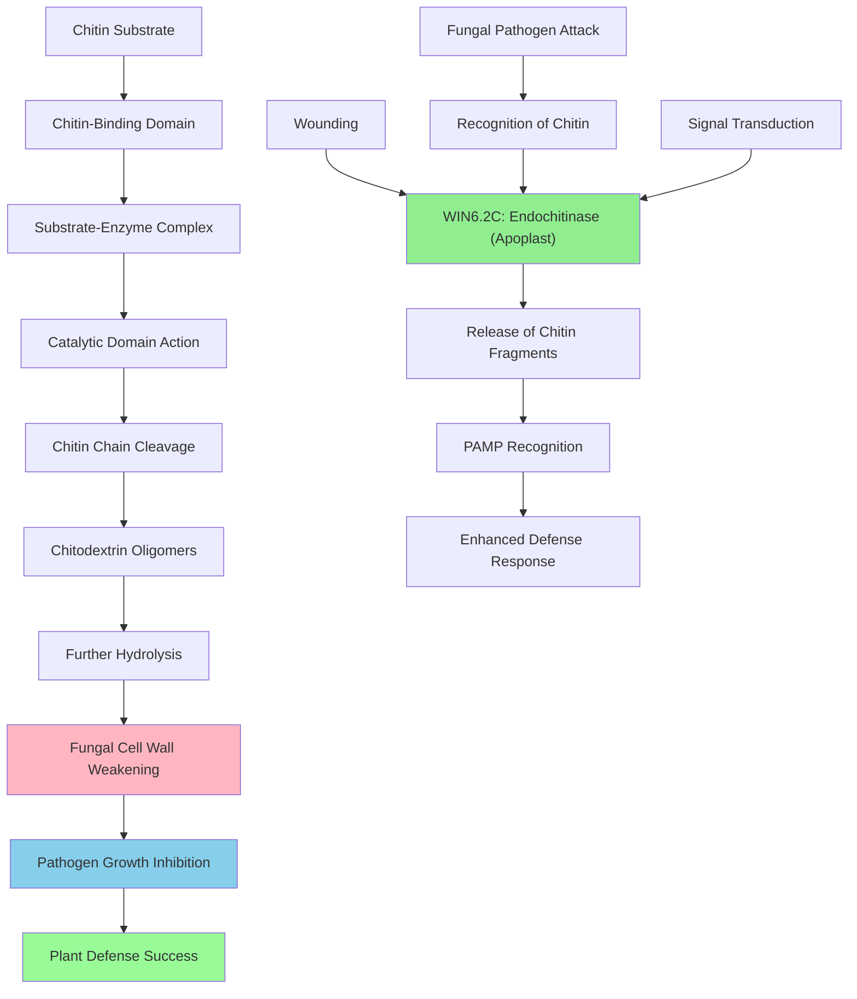

# Pathway Summary for WIN6.2C

## Overview
WIN6.2C is an acidic endochitinase belonging to glycoside hydrolase family 19 that serves as a critical component of plant defense against fungal pathogens [UniProt:P29032]. The enzyme catalyzes the random endo-hydrolysis of N-acetyl-beta-D-glucosaminide (1->4)-beta-linkages in chitin and chitodextrins, effectively degrading the structural polysaccharide found in fungal cell walls [UniProt:P29032].

## Plant Defense Response Pathway
WIN6.2C functions as a pathogenesis-related (PR) protein that provides defense specifically against chitin-containing fungal pathogens [UniProt:P29032]. The protein is part of the plant's innate immune system, representing a direct effector mechanism that targets the structural integrity of invading fungi. Through its endochitinase activity, WIN6.2C compromises fungal cell wall integrity, inhibiting pathogen growth and spread within plant tissues [UniProt:P29032].

## Chitin Degradation Pathway
The enzyme employs a two-step mechanism for chitin degradation, utilizing both its chitin-binding domain and catalytic domain [UniProt:P29032]. The chitin-binding type-1 domain (residues 23-63) facilitates substrate recognition and binding, while the catalytic domain performs the hydrolytic cleavage of beta-1,4-glycosidic bonds in chitin polymers [UniProt:P29032]. This coordinated action results in the progressive breakdown of chitin into smaller oligosaccharides, ultimately compromising fungal cell wall structure.

## Wound-Induced Defense Activation
WIN6.2C expression is induced by wounding, representing part of the plant's rapid response to physical damage that might provide entry points for pathogens [UniProt:P29032]. This wound-induced expression ensures that protective enzymes are present at potential infection sites, providing prophylactic defense against opportunistic fungal pathogens that commonly exploit wounded plant tissues.

## Pathway Diagram

## Molecular Recognition and Specificity
WIN6.2C exhibits high specificity for beta-1,4-linked N-acetylglucosamine residues in chitin, distinguishing it from other plant cell wall components [UniProt:P29032]. The enzyme's structure includes a signal peptide for secretion to the apoplast, where it encounters fungal cell walls during infection attempts [UniProt:P29032]. The combination of substrate specificity and strategic localization ensures that WIN6.2C targets pathogen structures while avoiding damage to plant cell walls.

## Integration with Broader Defense Networks
As a member of the chitinase class I subfamily, WIN6.2C likely functions coordinately with other PR proteins including beta-1,3-glucanases, thaumatin-like proteins, and other chitinases to provide comprehensive antifungal defense [UniProt:P29032]. The enzyme's activity may also generate chitin oligomers that serve as pathogen-associated molecular patterns (PAMPs), potentially amplifying the plant's immune response through pattern recognition receptors.

## Pathogen Counter-Defense and Arms Race
Fungal pathogens have evolved various strategies to counter chitinase activity, including the production of chitinase inhibitors and modification of cell wall composition. This evolutionary arms race has driven the diversification of plant chitinases, with WIN6.2C representing one member of a larger gene family that provides redundancy and specificity in antifungal defense.

## Regulation and Expression Control
WIN6.2C expression is likely regulated by both constitutive and inducible mechanisms, with wound induction representing one well-characterized response [UniProt:P29032]. The protein may also be subject to regulation by plant hormones such as jasmonic acid, salicylic acid, and ethylene, which coordinate defense responses. Post-translational modifications and protein processing may further fine-tune enzyme activity and localization.

## Ecological and Agricultural Significance
WIN6.2C represents a natural defense mechanism that could be exploited for crop improvement and sustainable agriculture. Understanding the regulation and function of this enzyme may inform strategies for enhancing pathogen resistance in economically important tree species. The enzyme's specificity for chitin also makes it a potential biocontrol agent or component of integrated pest management systems targeting fungal diseases in forestry and agriculture.