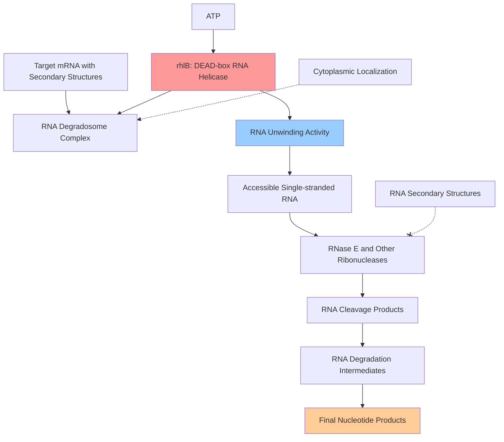

# Pathway Summary for rhlB

## Overview
rhlB participates in the RNA degradation pathway where it functions as an ATP-dependent DEAD-box RNA helicase [UniProtKB:Q9HXE5]. This essential enzyme serves as a component of the RNA degradosome complex in Pseudomonas aeruginosa, facilitating RNA processing and turnover by unwinding double-stranded RNA structures to allow ribonucleases access to their cleavage sites, particularly important for bacterial adaptation to environmental stresses including cold temperature conditions.

## RNA Degradation and Processing Pathway
The RNA degradation pathway represents a crucial cellular process that controls mRNA stability, gene expression, and RNA quality control [UniProtKB:Q9HXE5]. RhlB serves as the helicase component of the RNA degradosome, a multi-protein complex responsible for the coordinated degradation of mRNA molecules in bacterial cells.

RhlB functions by unwinding RNA secondary structures that would otherwise impede the activity of ribonucleases such as RNase E [UniProtKB:Q9HXE5]. The enzyme uses energy from ATP hydrolysis to disrupt RNA base-pairing, converting double-stranded regions into single-stranded substrates accessible to nucleolytic cleavage. This helicase activity is essential for efficient RNA processing, enabling proper mRNA turnover and facilitating rapid changes in gene expression patterns.

The DEAD-box helicase family, to which RhlB belongs, is characterized by conserved ATP-binding and RNA-unwinding domains [UniProtKB:Q9HXE5]. These enzymes play critical roles in virtually all aspects of RNA metabolism, from transcription and splicing to translation and degradation, making them essential for cellular viability.

## RNA Degradosome Complex Assembly and Function
RhlB operates as an integral component of the RNA degradosome complex, which assembles in the cytoplasm to coordinate multiple RNA processing activities [UniProtKB:Q9HXE5]. This multi-enzyme complex includes ribonucleases, helicases, and regulatory proteins that work together to control RNA fate within the cell.

The degradosome complex provides a platform for substrate channeling, where RNA molecules are processed through sequential enzymatic steps without being released to the bulk cytoplasm. RhlB's helicase activity removes structural barriers that would prevent efficient ribonuclease action, ensuring rapid and complete RNA degradation when required by cellular regulatory programs.

## RNA Processing and Degradation Pathway Diagram

## Environmental Stress Response and Adaptation
RhlB-mediated RNA processing is particularly important for bacterial adaptation to environmental stresses, including temperature changes and nutrient limitation [UniProtKB:Q9HXE5]. The enzyme's ability to unwind RNA secondary structures becomes critical under conditions where RNA stability and processing are altered by environmental factors.

Cold temperature conditions can stabilize RNA secondary structures, making them more resistant to nucleolytic attack. Under these circumstances, RhlB's helicase activity becomes essential for maintaining efficient RNA turnover and enabling appropriate gene expression responses to temperature stress. This functionality makes RhlB a key component of bacterial cold adaptation mechanisms.

## Post-transcriptional Gene Regulation
The RNA degradation pathway controlled by RhlB serves as a major mechanism for post-transcriptional gene regulation [UniProtKB:Q9HXE5]. By controlling mRNA stability and degradation rates, RhlB indirectly influences protein expression levels and cellular responses to changing environmental conditions.

The selective degradation of specific mRNA molecules allows bacterial cells to rapidly adjust their proteome in response to environmental signals. RhlB's role in this process makes it an important regulator of bacterial physiology and adaptation, particularly in the dynamic environments that Pseudomonas aeruginosa typically inhabits.

## Clinical and Biotechnological Relevance
Understanding RhlB function has important implications for understanding bacterial physiology and potentially developing therapeutic interventions [UniProtKB:Q9HXE5]. Since RNA processing is essential for bacterial viability, components of the RNA degradosome like RhlB represent potential targets for antimicrobial development.

The conserved nature of DEAD-box helicases across bacterial species suggests that insights gained from studying RhlB in Pseudomonas aeruginosa may be applicable to understanding RNA metabolism in other medically important bacteria. This knowledge contributes to broader understanding of bacterial gene regulation and adaptation mechanisms.