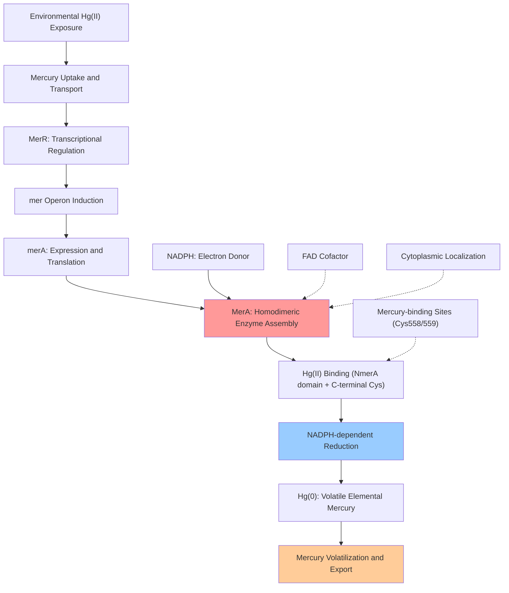

# Pathway Summary for merA

## Overview
merA participates in the bacterial mercury resistance pathway where it functions as an NADPH-dependent mercuric reductase [PMID:1531297, PMID:12829275, file:PSEAI/merA/merA-deep-research.md]. This homodimeric flavoprotein enzyme catalyzes the reduction of toxic Hg(II) ions to volatile elemental mercury Hg(0), serving as the central enzymatic component of bacterial mercury detoxification systems and enabling survival in mercury-contaminated environments.

## Mercury Detoxification and Resistance Pathway
The mercury detoxification pathway represents one of the most widely observed resistance mechanisms in bacteria, providing protection against both inorganic and organic mercury compounds [PMID:12829275]. MerA serves as the terminal enzyme in this pathway, catalyzing the final reduction step that converts toxic mercury ions into a volatile form that can be expelled from the cell.

MerA functions as a cytoplasmic enzyme that utilizes NADPH as an electron donor to reduce Hg(II) to Hg(0) via FAD-mediated electron transfer [file:PSEAI/merA/merA-deep-research.md]. The enzyme contains specialized structural features including an N-terminal metal-binding domain (NmerA) that captures mercury ions from the cytoplasm and unique C-terminal cysteine residues (Cys558/Cys559) that form a flexible loop for transient mercury coordination during catalysis.

The reduction reaction is highly specific for mercury ions and requires precise coordination between multiple mercury-binding sites within the enzyme structure [PMID:1531297]. Site-directed mutagenesis studies have demonstrated that the C-terminal cysteines are essential for catalytic activity, with mutations causing 200-fold decreases in catalytic efficiency.

## Mercury Resistance Operon Regulation
MerA expression is tightly regulated as part of the mer operon, which is induced specifically in response to mercury exposure through the MerR transcriptional regulator [file:PSEAI/merA/merA-deep-research.md]. This regulatory mechanism ensures that the energy-expensive mercury detoxification system is only activated when mercury is present in the environment.

When induced by mercury exposure, MerA can constitute up to 6% of the total soluble protein content in bacterial cells, demonstrating the massive upregulation of this detoxification system [file:PSEAI/merA/merA-deep-research.md]. This high expression level reflects the critical importance of mercury reduction for bacterial survival in contaminated environments.

## Mercury Detoxification Pathway Diagram

## Cellular Mercury Homeostasis
MerA operates within a broader mercury homeostasis network that includes mercury transport systems and other mercury-binding proteins [file:PSEAI/merA/merA-deep-research.md]. The enzyme's N-terminal NmerA domain can remove mercury from proteins and deliver it to the catalytic core, providing protection for cellular proteins under mercury stress conditions.

This mercury scavenging function is particularly important under glutathione-depleted conditions, where alternative mercury-binding mechanisms become critical for cellular survival. The dual function of MerA as both a mercury reductase and a mercury-binding protein provides comprehensive protection against mercury toxicity.

## Evolutionary and Ecological Significance
The widespread distribution of merA genes across diverse bacterial lineages reflects the evolutionary importance of mercury resistance in natural environments [PMID:12829275]. Mercury resistance provides a significant selective advantage in mercury-contaminated habitats, leading to the horizontal transfer and maintenance of mer operons across bacterial communities.

The conservation of MerA's catalytic mechanism across different bacterial species, combined with its unique structural features compared to other flavoprotein reductases, highlights its specialized role in mercury detoxification. The additional C-terminal cysteine pair that distinguishes MerA from related enzymes represents a specific evolutionary adaptation for mercury handling.

## Environmental and Biotechnological Applications
Understanding MerA function has important applications for bioremediation of mercury-contaminated environments and for monitoring mercury bioavailability [file:PSEAI/merA/merA-deep-research.md]. Bacterial strains expressing high levels of MerA can be used to remove mercury from contaminated soils and waters through biological reduction processes.

The enzyme's high specificity for mercury ions and its robust catalytic activity under various environmental conditions make it an attractive target for engineering enhanced mercury detoxification systems. Directed evolution approaches could potentially expand MerA's substrate specificity to include other toxic metal ions, broadening its utility for environmental remediation applications.