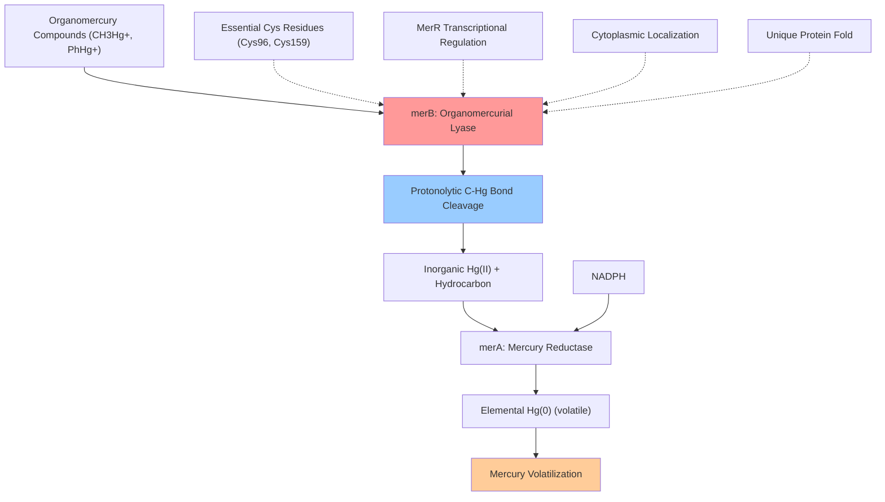

# Pathway Summary for merB

## Overview
merB participates in the bacterial broad-spectrum mercury resistance pathway where it functions as an organomercurial lyase [PMID:12829275, file:PSEAI/merB/merB-deep-research.md]. This cytoplasmic enzyme catalyzes the protonolytic cleavage of carbon-mercury bonds in organomercury compounds, converting toxic organomercurials like methylmercury and phenylmercury into inorganic Hg(II) and releasing the organic moiety as a hydrocarbon, functioning as the first step in a two-enzyme detoxification system that works sequentially with MerA.

## Organomercurial Detoxification Pathway
The organomercurial detoxification pathway represents a sophisticated bacterial resistance mechanism that enables survival in environments contaminated with organic mercury compounds [file:PSEAI/merB/merB-deep-research.md]. MerB serves as the initial enzyme in this pathway, catalyzing the specific cleavage of carbon-mercury bonds to convert organomercurials into inorganic mercury that can subsequently be reduced by MerA.

MerB functions through a unique protonolytic mechanism that directly breaks the Hg-C bond without requiring external cofactors or energy sources [file:PSEAI/merB/merB-deep-research.md]. The enzyme utilizes essential cysteine residues (Cys96, Cys159) that coordinate mercury through bis-thiolate binding, forming a mercury-cysteine intermediate that facilitates carbon-mercury bond cleavage while delivering the proton to the bound organic group.

The enzyme possesses a unique protein fold not found in other protein families, with no known paralogs outside mercury resistance systems [file:PSEAI/merB/merB-deep-research.md]. This structural uniqueness reflects the specialized evolutionary adaptation required for organomercurial detoxification, highlighting the enzyme's specific role in mercury resistance mechanisms.

## Sequential Mercury Detoxification with MerA
MerB operates in a coordinated two-step detoxification pathway where organomercurials are first converted to inorganic mercury by MerB, followed by reduction of Hg(II) to volatile Hg(0) by MerA [file:PSEAI/merB/merB-deep-research.md]. This sequential process enables bacteria to detoxify a broad spectrum of mercury compounds, providing comprehensive protection against both organic and inorganic mercury toxicity.

The coupling between MerB and MerA activities is critical for efficient mercury detoxification, as the Hg(II) product of MerB's lyase reaction serves as the direct substrate for MerA's reductase activity. This metabolic channeling ensures rapid processing of mercury through the detoxification pathway and prevents accumulation of toxic mercury intermediates.

## Organomercurial Detoxification Pathway Diagram

## Mercury Resistance Operon Integration
MerB expression is tightly regulated as part of the mer operon under the control of the MerR regulatory protein [file:PSEAI/merB/merB-deep-research.md]. The enzyme remains virtually inactive in the absence of mercury and is highly upregulated when mercury or certain organomercurials that release Hg(II) are present, ensuring that this energy-expensive detoxification system is only activated when needed.

The coordinated regulation of merB with other mer genes ensures that all components of the mercury resistance system are available when mercury exposure occurs. This tight regulation prevents metabolic burden while maintaining the capacity for rapid response to mercury contamination.

## Environmental and Biotechnological Applications
MerB-containing bacteria have significant potential for bioremediation applications in mercury-contaminated environments [file:PSEAI/merB/merB-deep-research.md]. Mercury-resistant pseudomonads with MerB can thrive in mercury-polluted soils, waters, or industrial effluents where they degrade organomercurials that would otherwise accumulate in the food chain.

The enzyme's ability to cleave diverse organomercury compounds makes it particularly valuable for environmental applications, as organomercurials like methylmercury are among the most bioaccumulative and neurotoxic forms of mercury found in contaminated ecosystems. MerB-mediated bioremediation can convert these persistent organic pollutants into forms that can be further processed by MerA for complete detoxification.

## Evolutionary and Mechanistic Uniqueness
The unique catalytic mechanism of MerB, involving direct protonolytic cleavage without cofactor requirements, represents a rare example of a lyase reaction in biological systems [file:PSEAI/merB/merB-deep-research.md]. This mechanistic specialization, combined with the enzyme's unique protein fold, demonstrates the evolutionary pressure to develop effective solutions for organomercurial detoxification.

The conservation of MerB across mercury-resistant bacterial strains and its specific association with mercury resistance operons highlights its essential role in bacterial survival strategies for mercury-contaminated environments. The enzyme's substrate specificity and catalytic efficiency represent key adaptations that enable bacteria to occupy ecological niches with high organomercury loads.