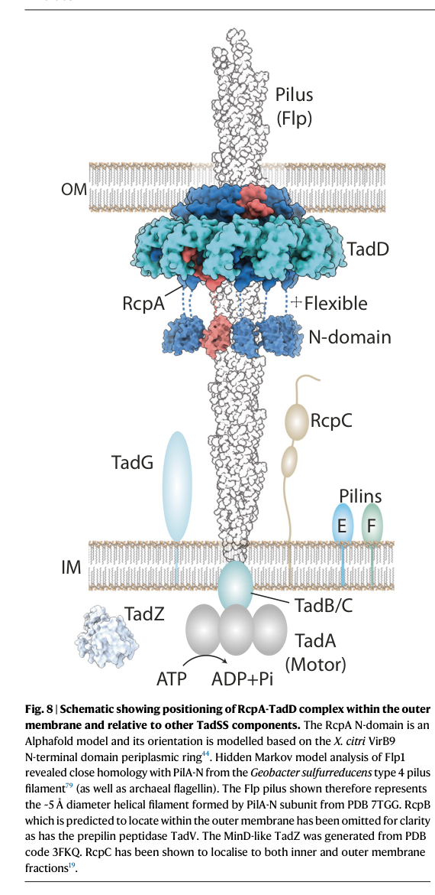

## Question

# Gene Research for Functional Annotation

## ⚠️ CRITICAL: Gene/Protein Identification Context

**BEFORE YOU BEGIN RESEARCH:** You MUST verify you are researching the CORRECT gene/protein. Gene symbols can be ambiguous, especially for less well-characterized genes from non-model organisms.

### Target Gene/Protein Identity (from UniProt):
- **UniProt Accession:** Q1IFG0
- **Protein Description:** SubName: Full=Uncharacterized protein {ECO:0000313|EMBL:CAK13594.1};
- **Gene Information:** OrderedLocusNames=PSEEN0657 {ECO:0000313|EMBL:CAK13594.1};
- **Organism (full):** Pseudomonas entomophila (strain L48).
- **Protein Family:** Not specified in UniProt
- **Key Domains:** DUF2134_membrane. (IPR018705); Tad_N. (IPR028087); Tad (PF13400); Tad_C (PF09977)

### MANDATORY VERIFICATION STEPS:

1. **Check if the gene symbol "pseen_duf" matches the protein description above**
2. **Verify the organism is correct:** Pseudomonas entomophila (strain L48).
3. **Check if protein family/domains align with what you find in literature**
4. **If you find literature for a DIFFERENT gene with the same or similar symbol, STOP**

### If Gene Symbol is Ambiguous or You Cannot Find Relevant Literature:

**DO NOT PROCEED WITH RESEARCH ON A DIFFERENT GENE.** Instead:
- State clearly: "The gene symbol 'pseen_duf' is ambiguous or literature is limited for this specific protein"
- Explain what you found (e.g., "Found extensive literature on a different gene with the same symbol in a different organism")
- Describe the protein based ONLY on the UniProt information provided above
- Suggest that the protein function can be inferred from domain/family information

### Research Target:

Please provide a comprehensive research report on the gene **pseen_duf** (gene ID: pseen_duf, UniProt: Q1IFG0) in PSEEN.

The research report should be a detailed narrative explaining the function, biological processes, and localization of the gene product. Citations should be given for all claims.

You should prioritize authoritative reviews and primary scientific literature when conducting research. You can supplement
this with annotations you find in gene/protein databases, but these can be outdated or inaccurate.

We are specifically interested in the primary function of the gene - for enzymes, what reaction is catalyzed, and what is the substrate specificity? For transporters, what is the substrate? For structural proteins or adapters, what is the broader structural role? For signaling molecules, what is the role in the pathway.

We are interested in where in or outside the cell the gene product carries out its function.

We are also interested in the signaling or biochemical pathways in which the gene functions. We are less interested in broad pleiotropic effects, except where these elucidate the precise role.

Include evidence where possible. We are interested in both experimental evidence as well as inference from structure, evolution, or bioinformatic analysis. Precise studies should be prioritized over high-throughput, where available.

## Output

Question: You are an expert researcher providing comprehensive, well-cited information.

Provide detailed information focusing on:
1. Key concepts and definitions with current understanding
2. Recent developments and latest research (prioritize 2023-2024 sources)
3. Current applications and real-world implementations
4. Expert opinions and analysis from authoritative sources
5. Relevant statistics and data from recent studies

Format as a comprehensive research report with proper citations. Include URLs and publication dates where available.
Always prioritize recent, authoritative sources and provide specific citations for all major claims.

# Gene Research for Functional Annotation

## ⚠️ CRITICAL: Gene/Protein Identification Context

**BEFORE YOU BEGIN RESEARCH:** You MUST verify you are researching the CORRECT gene/protein. Gene symbols can be ambiguous, especially for less well-characterized genes from non-model organisms.

### Target Gene/Protein Identity (from UniProt):
- **UniProt Accession:** Q1IFG0
- **Protein Description:** SubName: Full=Uncharacterized protein {ECO:0000313|EMBL:CAK13594.1};
- **Gene Information:** OrderedLocusNames=PSEEN0657 {ECO:0000313|EMBL:CAK13594.1};
- **Organism (full):** Pseudomonas entomophila (strain L48).
- **Protein Family:** Not specified in UniProt
- **Key Domains:** DUF2134_membrane. (IPR018705); Tad_N. (IPR028087); Tad (PF13400); Tad_C (PF09977)

### MANDATORY VERIFICATION STEPS:

1. **Check if the gene symbol "pseen_duf" matches the protein description above**
2. **Verify the organism is correct:** Pseudomonas entomophila (strain L48).
3. **Check if protein family/domains align with what you find in literature**
4. **If you find literature for a DIFFERENT gene with the same or similar symbol, STOP**

### If Gene Symbol is Ambiguous or You Cannot Find Relevant Literature:

**DO NOT PROCEED WITH RESEARCH ON A DIFFERENT GENE.** Instead:
- State clearly: "The gene symbol 'pseen_duf' is ambiguous or literature is limited for this specific protein"
- Explain what you found (e.g., "Found extensive literature on a different gene with the same symbol in a different organism")
- Describe the protein based ONLY on the UniProt information provided above
- Suggest that the protein function can be inferred from domain/family information

### Research Target:

Please provide a comprehensive research report on the gene **pseen_duf** (gene ID: pseen_duf, UniProt: Q1IFG0) in PSEEN.

The research report should be a detailed narrative explaining the function, biological processes, and localization of the gene product. Citations should be given for all claims.

You should prioritize authoritative reviews and primary scientific literature when conducting research. You can supplement
this with annotations you find in gene/protein databases, but these can be outdated or inaccurate.

We are specifically interested in the primary function of the gene - for enzymes, what reaction is catalyzed, and what is the substrate specificity? For transporters, what is the substrate? For structural proteins or adapters, what is the broader structural role? For signaling molecules, what is the role in the pathway.

We are interested in where in or outside the cell the gene product carries out its function.

We are also interested in the signaling or biochemical pathways in which the gene functions. We are less interested in broad pleiotropic effects, except where these elucidate the precise role.

Include evidence where possible. We are interested in both experimental evidence as well as inference from structure, evolution, or bioinformatic analysis. Precise studies should be prioritized over high-throughput, where available.

# Functional annotation research report: **pseen_duf / PSEEN0657** (UniProt **Q1IFG0**) in *Pseudomonas entomophila* L48

## Executive summary (identity verification and evidence limits)
The target gene product is UniProt **Q1IFG0**, OrderedLocusNames **PSEEN0657**, from ***Pseudomonas entomophila* (strain L48)**, annotated in UniProt as an **uncharacterized protein** with domain assignments **DUF2134_membrane (IPR018705)** and **Tad_N / Tad / Tad_C (PF13400/PF09977; IPR028087)** (user-provided UniProt context). Tool-based literature retrieval did **not** identify publications explicitly mentioning **Q1IFG0**, **PSEEN0657**, or the symbol **pseen_duf**, so gene-specific experimental characterization for this exact locus could not be cited directly from the retrieved corpus. Consequently, the most defensible functional annotation is **domain- and system-based**, by mapping the domain architecture to the **Tad/Flp (type IVc) pilus (“Tad secretion system”, TadSS)** machinery and citing mechanistic studies of Tad components in other bacteria, including *Pseudomonas* spp. (tassinari2023assemblymechanismof pages 1-2, evans2025thestructureof pages 1-3).

## 1) Key concepts and definitions (current understanding)

### 1.1 Type IV filaments and Tad/Flp (type IVc) pili
Type IV filaments (T4F) are a broad superfamily of prokaryotic filamentous nanomachines assembled from pilin(-like) subunits using a conserved membrane-associated assembly apparatus (pelicic2023mechanismofassembly pages 2-3). Tad/Flp pili (also called **Tad pili** or **Flp pili**) are a distinct T4F subtype (also designated type IVc in some classifications) implicated broadly in **biofilm formation, host colonization, and pathogenesis** (pelicic2023mechanismofassembly pages 2-3, little2024typeivpili pages 2-4).

Mechanistically, Tad/Flp pilus biogenesis follows the common T4F logic: (i) synthesis and inner-membrane (IM) storage of pilin subunits, (ii) **leader peptide cleavage by a prepilin peptidase**, (iii) **ATPase-driven extraction/polymerization** at the cytoplasmic membrane platform, and (iv) in Gram-negatives, passage through the periplasm and extrusion via an **outer-membrane (OM) secretin pore** (pelicic2023mechanismofassembly pages 8-9, little2024typeivpili pages 4-6).

### 1.2 Canonical Tad operon composition
Across Gram-negative bacteria, TadSS is often encoded by a **single operon** of ~12–14 genes (tassinari2023assemblymechanismof pages 1-2, tekedar2024tadpilicontribute pages 14-15). A concrete, experimentally used example (from *Aeromonas hydrophila*) lists a **13-gene** tad operon: **flp, tadV, rcpC, rcpA, rcpB, tadZ, tadA, tadB, tadC, tadD, tadE, tadF, tadG** (tekedar2024tadpilicontribute pages 11-12).

## 2) Target protein functional inference from domains and system biology

### 2.1 What the Tad_N/Tad/Tad_C + DUF2134_membrane domain set implies
The presence of **Tad_N/Tad/Tad_C** domains is strongly associated with proteins in **Tad/Flp pilus biogenesis modules**, particularly IM-associated “platform”/assembly proteins (system-level inference supported by established TadSS component roles, below). While the retrieved literature does not directly annotate Q1IFG0, it establishes that **IM platform proteins TadB and TadC** are central coupling components that connect the cytoplasmic motor ATPase (TadA) to pilin extraction and polymerization (evans2025thestructureof pages 1-3, tassinari2023assemblymechanismof pages 1-2).

Given that UniProt describes Q1IFG0 as a **membrane-domain protein** (DUF2134_membrane) with Tad-related domains, the most parsimonious functional hypothesis is that **Q1IFG0 participates as a TadSS inner-membrane component (platform/assembly factor)** rather than a secreted enzyme or transport substrate-binding protein.

**Primary function (best-supported, system-level):** structural/assembly role in **Tad/Flp pilus biogenesis**, likely at the **inner membrane** as part of the TadSS IM subcomplex that transduces ATPase activity into pilus polymerization (tassinari2023assemblymechanismof pages 1-2, little2024typeivpili pages 4-6).

**Catalytic activity / substrate specificity:** none expected; TadB/TadC-like proteins are not known to catalyze small-molecule reactions in the TadSS model but rather contribute to **macromolecular machine assembly** (tassinari2023assemblymechanismof pages 1-2).

### 2.2 Expected localization of the gene product
The TadSS is a trans-envelope machine with distinct localizations for key components:
- **TadA**: cytoplasmic ATPase motor (tassinari2023assemblymechanismof pages 1-2).
- **TadB/TadC**: **inner membrane platform** (evans2025thestructureof pages 1-3, tassinari2023assemblymechanismof pages 1-2).
- **RcpA**: **outer-membrane secretin pore** (tassinari2023assemblymechanismof pages 1-2).
- **TadD**: **outer-membrane lipoprotein pilotin** required for secretin assembly (tassinari2023assemblymechanismof pages 1-2).
- **RcpC**: **IM-anchored, periplasmic “alignment complex”** forming a conduit to the OM secretin (evans2025thestructureof pages 3-5, evans2025thestructureof pages 5-7).

The schematic model of TadSS localization and architecture in *P. aeruginosa* explicitly depicts these positions across IM, periplasm, and OM (tassinari2023assemblymechanismof media 4279f43e, tassinari2023assemblymechanismof media 418d0ccf). By analogy, Q1IFG0 is most consistent with an **inner-membrane localization**, with one or more transmembrane helices and periplasmic/cytoplasmic-facing domains, fitting an IM assembly component rather than the OM secretin/pilotin class.

### 2.3 Pathway context: TadSS-mediated adhesion/biofilm/virulence
TadSS assembles **Flp pili** that drive **adherence**, **biofilm formation**, and broader colonization phenotypes (tassinari2023assemblymechanismof pages 1-2). Tad pili can mediate nonspecific adherence to surfaces and other cells, supporting aggregation and biofilm-associated lifestyles (evans2025thestructureof pages 10-13).

## 3) Recent developments and latest research (prioritizing 2023–2024)

### 3.1 2023: Secretin–pilotin mechanism for TadSS outer membrane pore assembly
A 2023 *Nature Communications* study resolved the assembly mechanism of the TadSS **secretin RcpA** with its pilotin **TadD** in *Pseudomonas aeruginosa*. It demonstrated that **the C-terminal four residues of RcpA bind TadD**, and that this interaction is **essential for secretin formation** (publication date: Sep 2023; URL: https://doi.org/10.1038/s41467-023-41200-1) (tassinari2023assemblymechanismof pages 1-2). Fluorescence microscopy also quantified localization behavior, reporting averages of **0.82 (RcpA) and 1.12 (TadD) punctate foci per cell**, and ~**41%** of fluorescent cells showing one or two co-localized foci (tassinari2023assemblymechanismof pages 1-2). These findings refine how TadSS builds a functional OM exit channel.

### 3.2 2023: Mechanistic synthesis across type IV filament systems (including Tad)
A 2023 review synthesized mechanistic principles across T4F assembly, including prepilin peptidase biochemistry and ATPase-driven pilus polymerization, and highlighted how **AI structure prediction** is reshaping assembly models (publication date: Mar 2023; URL: https://doi.org/10.1099/mic.0.001311) (pelicic2023mechanismofassembly pages 2-3, pelicic2023mechanismofassembly pages 8-9). For functional annotation of an uncharacterized Tad-associated membrane protein, this review is relevant because it frames the expected role of **platform proteins** and their coupling to ATPase motors.

### 3.3 2024: Comparative genomics + in vivo evidence linking tad loci to virulence/biofilms
A 2024 primary study in *Frontiers in Cellular and Infection Microbiology* analyzed **170 *A. hydrophila* genomes** and experimentally deleted the entire tad operon in a virulent strain. The tad operon was reported as **10,852 bp** encoding **13 genes** (flp, tadV, rcpC, rcpA, rcpB, tadZ, tadA, tadB, tadC, tadD, tadE, tadF, tadG), with elevated **GC content 64.82% vs 60.82%** genome average (publication date: Jul 2024; URL: https://doi.org/10.3389/fcimb.2024.1425624) (tekedar2024tadpilicontribute pages 11-12). Functionally, operon deletion reduced fish mortality in an immersion challenge from **74.36% (WT)** to **14.65% (Δtad)** at 72 h (tekedar2024tadpilicontribute pages 11-12). While not from *P. entomophila*, this provides recent quantitative evidence that TadSS is a major virulence/biofilm determinant and thus a plausible functional context for Q1IFG0 if it is a TadSS component.

### 3.4 2024: Updated review context for Tad as a widespread colonization island
A 2024 EcoSal Plus review characterizes the tad/flp cluster as a widely distributed colonization island and notes defining pilin features such as **small (~8 kDa) pilins** and conserved motifs (publication date: Dec 2024; URL: https://doi.org/10.1128/ecosalplus.esp-0003-2023) (little2024typeivpili pages 2-4). This strengthens the interpretation that “Tad” domain signatures generally map to colonization/attachment machinery.

## 4) Current applications and real-world implementations

### 4.1 Anti-virulence / anti-biofilm targeting rationale
Because TadSS promotes adherence, aggregation and biofilm formation, it is frequently discussed as an anti-virulence target class. Mechanistic elucidation of the OM secretin (RcpA) and pilotin (TadD) interface—e.g., the requirement for the **RcpA C-terminus–TadD** interaction for secretin formation—suggests a plausible structural “hotspot” for inhibitors that block TadSS assembly (tassinari2023assemblymechanismof pages 1-2). Similarly, the discovery of an essential, defined **RcpC–RcpA alignment conduit** across the periplasm indicates additional potential weak points in TadSS biogenesis (evans2025thestructureof pages 3-5, evans2025thestructureof pages 5-7). These are translational **implications** grounded in mechanism, though the retrieved corpus did not include clinical/fielded implementations.

### 4.2 Vaccine antigen concept (aquaculture example)
The 2024 *A. hydrophila* work provides in vivo evidence that removing the tad operon strongly attenuates virulence in fish (tekedar2024tadpilicontribute pages 11-12). This supports real-world relevance in aquaculture disease control strategies that aim to reduce colonization/virulence determinants (e.g., pilus-system components) rather than targeting essential metabolism.

## 5) Expert opinions and authoritative analysis (from the retrieved corpus)

- Reviews emphasize that T4F (including Tad/Flp pili) are **key virulence/colonization factors** and that limited mechanistic understanding can hinder the design of therapeutics targeting these systems (pelicic2023mechanismofassembly pages 2-3).
- Structural biology studies interpret the TadSS as a specialized type IV filament machine with an OM secretin/pilotin module and a trans-periplasmic alignment solution, reinforcing that TadSS is a **multi-compartment secretion/assembly pathway** rather than a standalone adhesin (tassinari2023assemblymechanismof pages 1-2, evans2025thestructureof pages 3-5).

## 6) Data and statistics (recent; highlights)

- **Tad operon size and composition (example):** 10,852 bp, 13 genes, elevated GC content relative to genome average in *A. hydrophila* (Jul 2024) (tekedar2024tadpilicontribute pages 11-12).
- **Virulence impact (example model):** mortality decreased from **74.36%** to **14.65%** after complete tad operon deletion in catfish immersion challenge (Jul 2024) (tekedar2024tadpilicontribute pages 11-12).
- **Subcellular localization quantitation:** average **0.82 (RcpA) and 1.12 (TadD) puncta per cell**, with ~**41%** of fluorescent cells showing one or two co-localized foci (Sep 2023) (tassinari2023assemblymechanismof pages 1-2).

## 7) Synthesis: functional annotation statement for Q1IFG0 (PSEEN0657)

### Proposed function
**Q1IFG0/PSEEN0657 (pseen_duf)** is best annotated as a **Tad/Flp (type IVc) pilus biogenesis protein**, likely an **inner-membrane structural/platform component** participating in the Tad secretion system that assembles Flp pili and thereby supports **adherence/aggregation and biofilm-associated colonization**.

### Biological process and pathway
**TadSS-dependent pilus assembly (type IV filament biogenesis)**, contributing to surface attachment and biofilm formation, which are frequently coupled to virulence/host colonization phenotypes in diverse Gram-negative bacteria (tassinari2023assemblymechanismof pages 1-2, tekedar2024tadpilicontribute pages 11-12).

### Subcellular localization
Most consistent with **inner membrane (cell envelope)** localization as part of the TadSS IM subcomplex (by domain content and TadSS architecture), acting together with the cytoplasmic ATPase motor (TadA) and the OM secretin module (RcpA/TadD) across the envelope (tassinari2023assemblymechanismof pages 1-2, tassinari2023assemblymechanismof media 4279f43e).

### Confidence and limitations
This annotation is **high-confidence at the system level** (Tad/Flp pilus biogenesis association) but **low-confidence for the exact component identity** (e.g., TadC vs another Tad-associated IM protein) because no retrieved publications directly analyze **Q1IFG0/PSEEN0657** from *P. entomophila* L48.

## Summary table of TadSS components and where Q1IFG0 likely fits
The following table compiles canonical TadSS components, localization, and roles supported by 2023–2024 primary studies and reviews.

| Component (gene/protein) | Subcellular localization | Functional role | Key supporting citation IDs |
|---|---|---|---|
| Flp pilin (Flp/Flp1) | Cell envelope pool before assembly; extracellular pilus filament after assembly | Major structural pilin of the Tad/Flp (type IVc) pilus; polymerized into the surface filament that mediates adherence/aggregation | (evans2025thestructureof pages 1-3, tassinari2023assemblymechanismof pages 1-2) |
| TadV | Cytoplasmic face of the inner/cytoplasmic membrane | Prepilin peptidase that matures Flp1 and minor pilins/pseudopilins TadE/TadF before assembly | (evans2025thestructureof pages 1-3, tassinari2023assemblymechanismof pages 1-2, tassinari2023assemblymechanismof pages 11-11, pelicic2023mechanismofassembly pages 8-9) |
| TadA | Cytoplasm, associated with inner-membrane assembly machinery | Traffic ATPase that energizes pilus polymerization/assembly; in Tad systems functions as the main motor driving filament biogenesis | (evans2025thestructureof pages 1-3, tassinari2023assemblymechanismof pages 1-2, pelicic2023mechanismofassembly pages 8-9) |
| TadB | Inner membrane | Assembly platform component coupling the ATPase-driven motor to pilin extraction/polymerization | (evans2025thestructureof pages 1-3, tassinari2023assemblymechanismof pages 1-2, tassinari2023assemblymechanismof media 4279f43e) |
| TadC | Inner membrane | Assembly platform component working with TadB to transmit energy from TadA to the growing pilus | (evans2025thestructureof pages 1-3, tassinari2023assemblymechanismof pages 1-2, tassinari2023assemblymechanismof media 4279f43e) |
| TadZ | Cytoplasmic/peripheral inner-membrane, often polar | ParA/MinD-family assembly/localization factor implicated in polar targeting and spatial organization of Tad biogenesis | (evans2025thestructureof pages 1-3, tassinari2023assemblymechanismof pages 1-2, tassinari2023assemblymechanismof pages 11-11) |
| RcpA | Outer membrane with periplasmic N-domain | Secretin pore through which the Tad pilus crosses the outer membrane; forms OM channel essential for secretion of the filament | (evans2025thestructureof pages 1-3, tassinari2023assemblymechanismof pages 1-2, evans2025thestructureof pages 5-7) |
| TadD | Outer-membrane lipoprotein | Pilotin required for RcpA localization, multimerization, and secretin assembly in the outer membrane | (evans2025thestructureof pages 1-3, tassinari2023assemblymechanismof pages 1-2) |
| RcpC | Inner membrane-anchored, largely periplasmic | Alignment-complex protein; forms a dodecameric periplasmic conduit linking inner-membrane Tad machinery to the RcpA secretin and is required for efficient Tad-mediated aggregation/biofilm phenotypes | (evans2025thestructureof pages 10-13, evans2025thestructureof pages 1-3, evans2025thestructureof pages 3-5, evans2025thestructureof pages 7-7, evans2025thestructureof pages 5-7, tassinari2023assemblymechanismof media 4279f43e) |
| RcpB | Likely envelope-associated accessory component; precise localization/function unresolved from the provided evidence | Canonical tad operon member listed in comparative genomics/operon maps, but specific mechanistic assignment is not defined in the retrieved evidence | (tekedar2024tadpilicontribute pages 11-12) |
| TadE | Inner-membrane pilin pool before assembly; likely minor pilus-associated component | Minor pilin/pseudopilin-like component processed by TadV; likely contributes to pilus initiation/assembly | (tassinari2023assemblymechanismof pages 1-2, tassinari2023assemblymechanismof pages 11-11, rizzo2024molecularcrosstalkamong pages 6-6) |
| TadF | Inner-membrane pilin pool before assembly; likely minor pilus-associated component | Minor pilin/pseudopilin-like component processed by TadV; likely contributes to pilus initiation/assembly | (tassinari2023assemblymechanismof pages 1-2, tassinari2023assemblymechanismof pages 11-11, tekedar2024tadpilicontribute pages 11-12) |
| TadG | Likely inner-membrane/envelope-associated accessory component; precise localization unresolved from the provided evidence | Canonical tad operon component present in operon lists/schematic models, but exact biochemical role is not resolved in the retrieved evidence | (tassinari2023assemblymechanismof media 4279f43e, tekedar2024tadpilicontribute pages 11-12) |
| Tekedar 2024 quantitative note: complete tad operon composition in A. hydrophila ML09-119 | Operon/genome-level observation | 13-gene operon listed as flp, tadV, rcpC, rcpA, rcpB, tadZ, tadA, tadB, tadC, tadD, tadE, tadF, tadG | (tekedar2024tadpilicontribute pages 11-12) |
| Tekedar 2024 quantitative note: operon size | Operon/genome-level observation | Tad operon length reported as 10,852 bp | (tekedar2024tadpilicontribute pages 11-12) |
| Tekedar 2024 quantitative note: GC content | Operon/genome-level observation | Tad operon GC content 64.82% versus genome average 60.82% | (tekedar2024tadpilicontribute pages 11-12, tekedar2024tadpilicontribute pages 14-15) |
| Tekedar 2024 quantitative note: virulence effect of tad deletion | Whole-organism phenotype | Immersion-challenge mortality in catfish fingerlings decreased from 74.36% (WT) to 14.65% (Δtad) at 72 h | (tekedar2024tadpilicontribute pages 11-12) |

*Table: This table summarizes canonical Tad/Flp (type IVc) pilus components, their likely subcellular localization, and inferred or demonstrated functions from the retrieved evidence. It also captures key quantitative operon and phenotype data from Tekedar et al. 2024 that are useful for functional annotation.*

## Key mechanistic figure (envelope-spanning architecture)
A schematic model of TadSS showing component localization across inner membrane, periplasm, and outer membrane (including RcpA secretin, TadD pilotin, and alignment component placement) is available in the retrieved figure crops (tassinari2023assemblymechanismof media 4279f43e, tassinari2023assemblymechanismof media 418d0ccf).

## References (URLs and publication dates as available in the retrieved corpus)
- Tassinari M, Rudzite M, Filloux A, Low HH. **Assembly mechanism of a Tad secretion system secretin-pilotin complex**. *Nature Communications*. **Sep 2023**. https://doi.org/10.1038/s41467-023-41200-1 (tassinari2023assemblymechanismof pages 1-2)
- Pelicic V. **Mechanism of assembly of type 4 filaments: everything you always wanted to know (but were afraid to ask)**. *Microbiology*. **Mar 2023**. https://doi.org/10.1099/mic.0.001311 (pelicic2023mechanismofassembly pages 2-3)
- Tekedar HC et al. **Tad pili contribute to the virulence and biofilm formation of virulent Aeromonas hydrophila**. *Frontiers in Cellular and Infection Microbiology*. **Jul 2024**. https://doi.org/10.3389/fcimb.2024.1425624 (tekedar2024tadpilicontribute pages 11-12)
- Little JI et al. **Type IV pili of Enterobacteriaceae species**. *EcoSal Plus*. **Dec 2024**. https://doi.org/10.1128/ecosalplus.esp-0003-2023 (little2024typeivpili pages 2-4)
- Evans SL et al. **The structure of the Tad pilus alignment complex reveals a periplasmic conduit for pilus extension**. Preprint posted **Oct 2024**; listed as *Nature Communications* **Oct 2025** in retrieved metadata. https://doi.org/10.1101/2024.10.29.620805 (evans2025thestructureof pages 3-5)

References

1. (tassinari2023assemblymechanismof pages 1-2): Matteo Tassinari, Marta Rudzite, Alain Filloux, and Harry H. Low. Assembly mechanism of a tad secretion system secretin-pilotin complex. Nature Communications, Sep 2023. URL: https://doi.org/10.1038/s41467-023-41200-1, doi:10.1038/s41467-023-41200-1. This article has 24 citations and is from a highest quality peer-reviewed journal.

2. (evans2025thestructureof pages 1-3): Sasha L. Evans, Iryna Peretiazhko, Sahil Y. Karnani, Lindsey S. Marmont, James H. R. Wheeler, Boo Shan Tseng, William M. Durham, John C. Whitney, and Julien R. C. Bergeron. The structure of the tad pilus alignment complex reveals a periplasmic conduit for pilus extension. Nature Communications, Oct 2025. URL: https://doi.org/10.1101/2024.10.29.620805, doi:10.1101/2024.10.29.620805. This article has 7 citations and is from a highest quality peer-reviewed journal.

3. (pelicic2023mechanismofassembly pages 2-3): Vladimir Pelicic. Mechanism of assembly of type 4 filaments: everything you always wanted to know (but were afraid to ask). Microbiology, Mar 2023. URL: https://doi.org/10.1099/mic.0.001311, doi:10.1099/mic.0.001311. This article has 48 citations and is from a peer-reviewed journal.

4. (little2024typeivpili pages 2-4): Janay I. Little, Pradip K. Singh, Jinlei Zhao, Shakeera Dunn, Hanover Matz, and Michael S. Donnenberg. Type iv pili of <i>enterobacteriaceae</i> species. EcoSal Plus, Dec 2024. URL: https://doi.org/10.1128/ecosalplus.esp-0003-2023, doi:10.1128/ecosalplus.esp-0003-2023. This article has 11 citations.

5. (pelicic2023mechanismofassembly pages 8-9): Vladimir Pelicic. Mechanism of assembly of type 4 filaments: everything you always wanted to know (but were afraid to ask). Microbiology, Mar 2023. URL: https://doi.org/10.1099/mic.0.001311, doi:10.1099/mic.0.001311. This article has 48 citations and is from a peer-reviewed journal.

6. (little2024typeivpili pages 4-6): Janay I. Little, Pradip K. Singh, Jinlei Zhao, Shakeera Dunn, Hanover Matz, and Michael S. Donnenberg. Type iv pili of <i>enterobacteriaceae</i> species. EcoSal Plus, Dec 2024. URL: https://doi.org/10.1128/ecosalplus.esp-0003-2023, doi:10.1128/ecosalplus.esp-0003-2023. This article has 11 citations.

7. (tekedar2024tadpilicontribute pages 14-15): Hasan C. Tekedar, Fenny Patel, Jochen Blom, Matt J. Griffin, Geoffrey C. Waldbieser, Salih Kumru, Hossam Abdelhamed, Vandana Dharan, Larry A. Hanson, and Mark L. Lawrence. Tad pili contribute to the virulence and biofilm formation of virulent aeromonas hydrophila. Frontiers in Cellular and Infection Microbiology, Jul 2024. URL: https://doi.org/10.3389/fcimb.2024.1425624, doi:10.3389/fcimb.2024.1425624. This article has 12 citations.

8. (tekedar2024tadpilicontribute pages 11-12): Hasan C. Tekedar, Fenny Patel, Jochen Blom, Matt J. Griffin, Geoffrey C. Waldbieser, Salih Kumru, Hossam Abdelhamed, Vandana Dharan, Larry A. Hanson, and Mark L. Lawrence. Tad pili contribute to the virulence and biofilm formation of virulent aeromonas hydrophila. Frontiers in Cellular and Infection Microbiology, Jul 2024. URL: https://doi.org/10.3389/fcimb.2024.1425624, doi:10.3389/fcimb.2024.1425624. This article has 12 citations.

9. (evans2025thestructureof pages 3-5): Sasha L. Evans, Iryna Peretiazhko, Sahil Y. Karnani, Lindsey S. Marmont, James H. R. Wheeler, Boo Shan Tseng, William M. Durham, John C. Whitney, and Julien R. C. Bergeron. The structure of the tad pilus alignment complex reveals a periplasmic conduit for pilus extension. Nature Communications, Oct 2025. URL: https://doi.org/10.1101/2024.10.29.620805, doi:10.1101/2024.10.29.620805. This article has 7 citations and is from a highest quality peer-reviewed journal.

10. (evans2025thestructureof pages 5-7): Sasha L. Evans, Iryna Peretiazhko, Sahil Y. Karnani, Lindsey S. Marmont, James H. R. Wheeler, Boo Shan Tseng, William M. Durham, John C. Whitney, and Julien R. C. Bergeron. The structure of the tad pilus alignment complex reveals a periplasmic conduit for pilus extension. Nature Communications, Oct 2025. URL: https://doi.org/10.1101/2024.10.29.620805, doi:10.1101/2024.10.29.620805. This article has 7 citations and is from a highest quality peer-reviewed journal.

11. (tassinari2023assemblymechanismof media 4279f43e): Matteo Tassinari, Marta Rudzite, Alain Filloux, and Harry H. Low. Assembly mechanism of a tad secretion system secretin-pilotin complex. Nature Communications, Sep 2023. URL: https://doi.org/10.1038/s41467-023-41200-1, doi:10.1038/s41467-023-41200-1. This article has 24 citations and is from a highest quality peer-reviewed journal.

12. (tassinari2023assemblymechanismof media 418d0ccf): Matteo Tassinari, Marta Rudzite, Alain Filloux, and Harry H. Low. Assembly mechanism of a tad secretion system secretin-pilotin complex. Nature Communications, Sep 2023. URL: https://doi.org/10.1038/s41467-023-41200-1, doi:10.1038/s41467-023-41200-1. This article has 24 citations and is from a highest quality peer-reviewed journal.

13. (evans2025thestructureof pages 10-13): Sasha L. Evans, Iryna Peretiazhko, Sahil Y. Karnani, Lindsey S. Marmont, James H. R. Wheeler, Boo Shan Tseng, William M. Durham, John C. Whitney, and Julien R. C. Bergeron. The structure of the tad pilus alignment complex reveals a periplasmic conduit for pilus extension. Nature Communications, Oct 2025. URL: https://doi.org/10.1101/2024.10.29.620805, doi:10.1101/2024.10.29.620805. This article has 7 citations and is from a highest quality peer-reviewed journal.

14. (tassinari2023assemblymechanismof pages 11-11): Matteo Tassinari, Marta Rudzite, Alain Filloux, and Harry H. Low. Assembly mechanism of a tad secretion system secretin-pilotin complex. Nature Communications, Sep 2023. URL: https://doi.org/10.1038/s41467-023-41200-1, doi:10.1038/s41467-023-41200-1. This article has 24 citations and is from a highest quality peer-reviewed journal.

15. (evans2025thestructureof pages 7-7): Sasha L. Evans, Iryna Peretiazhko, Sahil Y. Karnani, Lindsey S. Marmont, James H. R. Wheeler, Boo Shan Tseng, William M. Durham, John C. Whitney, and Julien R. C. Bergeron. The structure of the tad pilus alignment complex reveals a periplasmic conduit for pilus extension. Nature Communications, Oct 2025. URL: https://doi.org/10.1101/2024.10.29.620805, doi:10.1101/2024.10.29.620805. This article has 7 citations and is from a highest quality peer-reviewed journal.

16. (rizzo2024molecularcrosstalkamong pages 6-6): Sonia Mirjam Rizzo, Giulia Alessandri, Chiara Tarracchini, Massimiliano G. Bianchi, Alice Viappiani, Leonardo Mancabelli, Gabriele Andrea Lugli, Christian Milani, Ovidio Bussolati, Douwe van Sinderen, Marco Ventura, and Francesca Turroni. Molecular cross-talk among human intestinal bifidobacteria as explored by a human gut model. Frontiers in Microbiology, Sep 2024. URL: https://doi.org/10.3389/fmicb.2024.1435960, doi:10.3389/fmicb.2024.1435960. This article has 7 citations and is from a peer-reviewed journal.

## Artifacts

- [Edison artifact artifact-00](pseen_duf-deep-research-falcon_artifacts/artifact-00.md)

## Citations

1. pelicic2023mechanismofassembly pages 2-3
2. tekedar2024tadpilicontribute pages 11-12
3. tassinari2023assemblymechanismof pages 1-2
4. evans2025thestructureof pages 10-13
5. little2024typeivpili pages 2-4
6. evans2025thestructureof pages 3-5
7. evans2025thestructureof pages 1-3
8. pelicic2023mechanismofassembly pages 8-9
9. little2024typeivpili pages 4-6
10. tekedar2024tadpilicontribute pages 14-15
11. evans2025thestructureof pages 5-7
12. tassinari2023assemblymechanismof pages 11-11
13. evans2025thestructureof pages 7-7
14. rizzo2024molecularcrosstalkamong pages 6-6
15. https://doi.org/10.1038/s41467-023-41200-1
16. https://doi.org/10.1099/mic.0.001311
17. https://doi.org/10.3389/fcimb.2024.1425624
18. https://doi.org/10.1128/ecosalplus.esp-0003-2023
19. https://doi.org/10.1101/2024.10.29.620805
20. https://doi.org/10.1038/s41467-023-41200-1,
21. https://doi.org/10.1101/2024.10.29.620805,
22. https://doi.org/10.1099/mic.0.001311,
23. https://doi.org/10.1128/ecosalplus.esp-0003-2023,
24. https://doi.org/10.3389/fcimb.2024.1425624,
25. https://doi.org/10.3389/fmicb.2024.1435960,