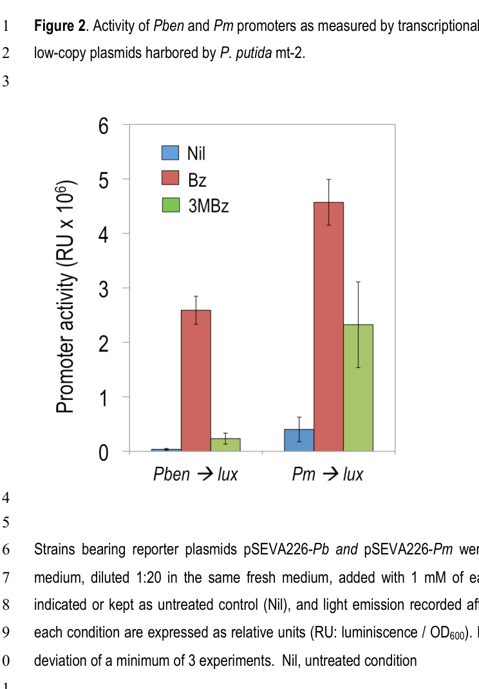

## Question

# Gene Research for Functional Annotation

## ⚠️ CRITICAL: Gene/Protein Identification Context

**BEFORE YOU BEGIN RESEARCH:** You MUST verify you are researching the CORRECT gene/protein. Gene symbols can be ambiguous, especially for less well-characterized genes from non-model organisms.

### Target Gene/Protein Identity (from UniProt):
- **UniProt Accession:** Q88I42
- **Protein Description:** SubName: Full=BenABC operon transcriptional activator {ECO:0000313|EMBL:AAN68767.1};
- **Gene Information:** Name=benR {ECO:0000313|EMBL:AAN68767.1}; OrderedLocusNames=PP_3159 {ECO:0000313|EMBL:AAN68767.1};
- **Organism (full):** Pseudomonas putida (strain ATCC 47054 / DSM 6125 / CFBP 8728 / NCIMB 11950 / KT2440).
- **Protein Family:** Not specified in UniProt
- **Key Domains:** AraC-bd_2. (IPR035418); AraC_XylS_family_regulators. (IPR050204); Homeodomain-like_sf. (IPR009057); HTH_AraC. (IPR018060); HTH_AraC-typ_CS. (IPR018062)

### MANDATORY VERIFICATION STEPS:

1. **Check if the gene symbol "benR" matches the protein description above**
2. **Verify the organism is correct:** Pseudomonas putida (strain ATCC 47054 / DSM 6125 / CFBP 8728 / NCIMB 11950 / KT2440).
3. **Check if protein family/domains align with what you find in literature**
4. **If you find literature for a DIFFERENT gene with the same or similar symbol, STOP**

### If Gene Symbol is Ambiguous or You Cannot Find Relevant Literature:

**DO NOT PROCEED WITH RESEARCH ON A DIFFERENT GENE.** Instead:
- State clearly: "The gene symbol 'benR' is ambiguous or literature is limited for this specific protein"
- Explain what you found (e.g., "Found extensive literature on a different gene with the same symbol in a different organism")
- Describe the protein based ONLY on the UniProt information provided above
- Suggest that the protein function can be inferred from domain/family information

### Research Target:

Please provide a comprehensive research report on the gene **benR** (gene ID: BenR, UniProt: Q88I42) in PSEPK.

The research report should be a detailed narrative explaining the function, biological processes, and localization of the gene product. Citations should be given for all claims.

You should prioritize authoritative reviews and primary scientific literature when conducting research. You can supplement
this with annotations you find in gene/protein databases, but these can be outdated or inaccurate.

We are specifically interested in the primary function of the gene - for enzymes, what reaction is catalyzed, and what is the substrate specificity? For transporters, what is the substrate? For structural proteins or adapters, what is the broader structural role? For signaling molecules, what is the role in the pathway.

We are interested in where in or outside the cell the gene product carries out its function.

We are also interested in the signaling or biochemical pathways in which the gene functions. We are less interested in broad pleiotropic effects, except where these elucidate the precise role.

Include evidence where possible. We are interested in both experimental evidence as well as inference from structure, evolution, or bioinformatic analysis. Precise studies should be prioritized over high-throughput, where available.

## Output

Question: You are an expert researcher providing comprehensive, well-cited information.

Provide detailed information focusing on:
1. Key concepts and definitions with current understanding
2. Recent developments and latest research (prioritize 2023-2024 sources)
3. Current applications and real-world implementations
4. Expert opinions and analysis from authoritative sources
5. Relevant statistics and data from recent studies

Format as a comprehensive research report with proper citations. Include URLs and publication dates where available.
Always prioritize recent, authoritative sources and provide specific citations for all major claims.

# Gene Research for Functional Annotation

## ⚠️ CRITICAL: Gene/Protein Identification Context

**BEFORE YOU BEGIN RESEARCH:** You MUST verify you are researching the CORRECT gene/protein. Gene symbols can be ambiguous, especially for less well-characterized genes from non-model organisms.

### Target Gene/Protein Identity (from UniProt):
- **UniProt Accession:** Q88I42
- **Protein Description:** SubName: Full=BenABC operon transcriptional activator {ECO:0000313|EMBL:AAN68767.1};
- **Gene Information:** Name=benR {ECO:0000313|EMBL:AAN68767.1}; OrderedLocusNames=PP_3159 {ECO:0000313|EMBL:AAN68767.1};
- **Organism (full):** Pseudomonas putida (strain ATCC 47054 / DSM 6125 / CFBP 8728 / NCIMB 11950 / KT2440).
- **Protein Family:** Not specified in UniProt
- **Key Domains:** AraC-bd_2. (IPR035418); AraC_XylS_family_regulators. (IPR050204); Homeodomain-like_sf. (IPR009057); HTH_AraC. (IPR018060); HTH_AraC-typ_CS. (IPR018062)

### MANDATORY VERIFICATION STEPS:

1. **Check if the gene symbol "benR" matches the protein description above**
2. **Verify the organism is correct:** Pseudomonas putida (strain ATCC 47054 / DSM 6125 / CFBP 8728 / NCIMB 11950 / KT2440).
3. **Check if protein family/domains align with what you find in literature**
4. **If you find literature for a DIFFERENT gene with the same or similar symbol, STOP**

### If Gene Symbol is Ambiguous or You Cannot Find Relevant Literature:

**DO NOT PROCEED WITH RESEARCH ON A DIFFERENT GENE.** Instead:
- State clearly: "The gene symbol 'benR' is ambiguous or literature is limited for this specific protein"
- Explain what you found (e.g., "Found extensive literature on a different gene with the same symbol in a different organism")
- Describe the protein based ONLY on the UniProt information provided above
- Suggest that the protein function can be inferred from domain/family information

### Research Target:

Please provide a comprehensive research report on the gene **benR** (gene ID: BenR, UniProt: Q88I42) in PSEPK.

The research report should be a detailed narrative explaining the function, biological processes, and localization of the gene product. Citations should be given for all claims.

You should prioritize authoritative reviews and primary scientific literature when conducting research. You can supplement
this with annotations you find in gene/protein databases, but these can be outdated or inaccurate.

We are specifically interested in the primary function of the gene - for enzymes, what reaction is catalyzed, and what is the substrate specificity? For transporters, what is the substrate? For structural proteins or adapters, what is the broader structural role? For signaling molecules, what is the role in the pathway.

We are interested in where in or outside the cell the gene product carries out its function.

We are also interested in the signaling or biochemical pathways in which the gene functions. We are less interested in broad pleiotropic effects, except where these elucidate the precise role.

Include evidence where possible. We are interested in both experimental evidence as well as inference from structure, evolution, or bioinformatic analysis. Precise studies should be prioritized over high-throughput, where available.

# Research Report: Functional Annotation of **BenR (benR; PP_3159; UniProt Q88I42)** in *Pseudomonas putida* KT2440

## 0. Target verification (critical identity check)
The UniProt accession **Q88I42** corresponds to **BenR**, annotated as the *“BenABC operon transcriptional activator”* from *Pseudomonas putida* strain KT2440, with ordered locus name **PP_3159**. A 2023 experimental/synthetic-biology study explicitly identifies *P. putida* **benR as PP_3159** and characterizes benzoate-responsive promoters in this genomic region, confirming that the literature summarized here matches the intended target (Pearson et al., 2023-12, https://doi.org/10.1021/acssynbio.3c00441). (pearson2023characterizationanddiversification pages 5-8)

## 1. Key concepts and current understanding

### 1.1 What BenR is
BenR is a **DNA-binding transcriptional regulator** in the **AraC/XylS family**, closely related to the aromatic-response regulator XylS. In *P. putida*, BenR is described as a **XylS homologue** (AraC-family) with typical architecture for this family (N-terminal effector/activation region; C-terminal helix-turn-helix DNA-binding domain), and Cowles et al. report BenR as a ~**318 aa** (~**36.4 kDa**) regulator. (Cowles et al., 2000-11, https://doi.org/10.1128/jb.182.22.6339-6346.2000). (cowles2000benraxyls pages 4-5, cowles2000benraxyls pages 6-7)

**Functional definition:** BenR is best understood as a **benzoate-responsive transcriptional activator** that turns on expression of genes needed to initiate benzoate catabolism, chiefly the **benABC** benzoate dioxygenase gene cluster. (cowles2000benraxyls pages 4-5, cowles2000benraxyls pages 3-4)

### 1.2 Biological pathway context (benzoate → catechol entry step)
The benzoate (ben) catabolic region contains structural genes encoding the initial oxidation of benzoate (benzoate dioxygenase components **BenA/BenB/BenC**, with downstream steps including **BenD** discussed), and nearby genes associated with uptake (e.g., **benK** transporter; **benF** porin), consistent with the idea that BenR couples **substrate sensing** (benzoate presence) to **catabolic gene expression**. (cowles2000benraxyls pages 4-5, cowles2000benraxyls pages 5-6)

### 1.3 Cellular localization/site of action
BenR functions as an **intracellular (cytosolic) DNA-binding transcription factor**, acting at chromosomal promoters (e.g., the benA/Pben promoter region) and capable of acting at related promoters in heterologous hosts when expressed there. This is supported by (i) its AraC/XylS-family identity, and (ii) extensive promoter-reporter and cross-promoter activation assays performed in *Pseudomonas* and *E. coli*. (cowles2000benraxyls pages 3-4, cowles2000benraxyls pages 7-8)

## 2. Experimental evidence for primary function

### 2.1 Primary regulated target: **benABC** (benzoate dioxygenase genes)
**Key experimental evidence (genetics + reporter assays):**
* Cowles et al. constructed a **benA promoter–lacZ** transcriptional fusion and found that adding **benzoate** increased reporter activity by about **~15-fold** in wild-type *P. putida*, while **catechol did not induce** the fusion. A **benR mutant** failed to induce the benA reporter in response to benzoate, demonstrating BenR is **required** for benzoate-dependent activation of benA/benABC. (Cowles et al., 2000-11, https://doi.org/10.1128/jb.182.22.6339-6346.2000). (cowles2000benraxyls pages 3-4)
* RT-PCR evidence indicates **benA, benB, benC** are cotranscribed in benzoate-grown cells, consistent with BenR controlling an operon-level response. (cowles2000benraxyls pages 4-5)

**Interpretation:** These experiments establish BenR as the **primary on-switch** for the benzoate entry pathway in *P. putida*, rather than a downstream metabolite (catechol) sensor. (cowles2000benraxyls pages 3-4)

### 2.2 Evidence for direct activation at the benA promoter
Cowles et al. provide evidence consistent with **direct transcriptional activation**: when BenR was **overexpressed in *E. coli*** carrying a benA-lacZ reporter, reporter expression rose by **~25-fold** compared with no benR. In this high-expression context, adding benzoate did not further increase expression, implying that BenR can become effectively constitutively activating when abundant (a behavior commonly observed for AraC-family activators in heterologous or overexpression contexts). (Cowles et al., 2000-11, https://doi.org/10.1128/jb.182.22.6339-6346.2000). (cowles2000benraxyls pages 3-4)

### 2.3 Promoter/operator features and transcription start mapping
Cowles et al. mapped the **benA transcription start site** by primer extension, placing the 5′ end **~30 bp upstream** of the predicted start, and note **direct-repeat elements** in the ben promoter region consistent with operator architectures described for XylS-family regulators. (Cowles et al., 2000-11, https://doi.org/10.1128/jb.182.22.6339-6346.2000). (cowles2000benraxyls pages 4-5, cowles2000benraxyls pages 7-8)

Pérez-Pantoja et al. additionally provide a promoter map depiction of conserved **distal/proximal operator-like boxes** and core promoter elements for Pben in *P. putida* mt-2, which is useful for engineering and for conceptualizing BenR binding/activation logic at Pben. (Pérez-Pantoja et al., 2015-04, https://doi.org/10.1111/1462-2920.12443). (perez‐pantoja2015thedifferentialresponse pages 23-26)

## 3. Physiological role and pathway coordination

### 3.1 BenR is required for efficient growth on benzoate
A **benR null mutant** is defective for growth on benzoate, and plasmid-borne benR complements this phenotype. Cowles et al. report that the complemented strain grows on benzoate with a generation time of **~2.4 h** vs **~1.8 h** for wild type, supporting BenR as a key determinant of efficient benzoate utilization. (Cowles et al., 2000-11, https://doi.org/10.1128/jb.182.22.6339-6346.2000). (cowles2000benraxyls pages 4-5)

### 3.2 BenR links benzoate availability to repression of competing aromatic uptake/catabolism
Cowles et al. show BenR is involved in **benzoate-mediated repression** of **pcaK**, a 4-hydroxybenzoate (4-HBA) uptake system. In wild-type cells, growth on benzoate + 4-HBA reduces pcaK promoter reporter activity **~5-fold** relative to 4-HBA alone. Physiologically, 4-HBA uptake was **~10-fold lower** when wild type was grown on benzoate + 4-HBA versus 4-HBA alone, while a benR mutant retained high uptake (~**25 nmol·min⁻¹·mg⁻¹**). (Cowles et al., 2000-11, https://doi.org/10.1128/jb.182.22.6339-6346.2000). (cowles2000benraxyls pages 6-7, cowles2000benraxyls pages 5-6)

**Interpretation:** Beyond activating benzoate catabolism, BenR participates in **prioritization/coordination** among aromatic carbon sources, plausibly reducing metabolic conflict by down-modulating 4-HBA uptake when benzoate is present. (cowles2000benraxyls pages 6-7)

## 4. Regulatory cross-talk and insulation (BenR vs XylS)

### 4.1 BenR can activate TOL plasmid promoter Pm
Cowles et al. show that BenR can activate the TOL plasmid **Pm** promoter in *E. coli*, reaching **~13,000 Miller units** (with a modest increase to ~**17,000** with benzoate in one setup), indicating potential cross-regulation among XylS/BenR-family promoters. (Cowles et al., 2000-11, https://doi.org/10.1128/jb.182.22.6339-6346.2000). (cowles2000benraxyls pages 4-5)

### 4.2 In vivo insulation: physiological XylS does not strongly activate Pben
Pérez-Pantoja et al. (2015) systematically tested Pben regulation in *P. putida* using chromosomally integrated **lux** reporters. They conclude that **BenR is necessary for strong induction of Pben by benzoate** and that physiological levels of the alternative regulator **XylS** do not significantly activate Pben. Only artificially high XylS overexpression yields measurable Pben activity, and even then Pben responses are **~10–15-fold weaker** than XylS activation of Pm. (Pérez-Pantoja et al., 2015-04, https://doi.org/10.1111/1462-2920.12443). (perez‐pantoja2015thedifferentialresponse pages 7-9)

**Image-supported evidence:** The figures retrieved from Pérez-Pantoja et al. show strong Pben induction by benzoate in benR+ backgrounds and near-silence of Pben in benR mutants unless XylS is overproduced. (perez‐pantoja2015thedifferentialresponse media 32f9b80f, perez‐pantoja2015thedifferentialresponse media 92d90004)

## 5. Recent developments (prioritizing 2023–2024)

### 5.1 2023: Quantitative promoter part characterization linked to BenR/PP_3159
Pearson et al. (2023-12, ACS Synthetic Biology; https://doi.org/10.1021/acssynbio.3c00441) evaluated promoter fragments near **PP_3159 (benR)** in *P. putida* and found a strong benzoate-inducible promoter upstream of **PP_3161** with **38 ± 5.2-fold induction at 10 mM benzoate**, while a promoter upstream of **PP_3160** showed only **1.7 ± 0.20-fold induction**. They also note that benzoate induction was hampered at **20 mM** due to toxicity. (pearson2023characterizationanddiversification pages 5-8)

**Expert analysis:** This type of measured fold-induction under defined inducer concentrations provides “parts-grade” quantitative data supporting BenR/Pben as a robust inducible module and clarifies that promoter choice within the ben locus (PP_3161 vs PP_3160 upstream regions) strongly affects dynamic range. (pearson2023characterizationanddiversification pages 5-8)

### 5.2 2023: Bioinformatic/mining perspective—BenR as a canonical benzoate sensor but missed by heuristic tools
Hanko et al. (2023-04, ACS Synthetic Biology; https://doi.org/10.1021/acssynbio.2c00679) use BenR as an explicit example of a known benzoate-responsive transcription factor **adjacent to** the benzoate catabolic operon in *P. putida*, and report that their TFBMiner pipeline did not recover *P. putida* BenR because **benR is encoded on the same strand as the catabolic operon** (a limitation of their gene-organization heuristic), even though the enzymatic chain was predicted. (hanko2023tfbminerauserfriendly pages 6-7)

**Expert analysis:** This highlights a practical annotation pitfall: **operon orientation and database constraints** can cause automated pipelines to miss biologically correct regulators, so BenR is a useful “ground truth” control for functional annotation workflows. (hanko2023tfbminerauserfriendly pages 6-7)

### 5.3 2024: Cell-free systems engineering reviews cite BenR/Pben as a regulatory component
A 2024 ACS Synthetic Biology review on regulatory components for bacterial cell-free systems lists BenR/Pben as an example in which **benzoic acid activates BenR**, which then activates **Pben**, illustrating how native bacterial regulators are repurposed for cell-free circuit design. (Lee & Maerkl, 2024-11, https://doi.org/10.1021/acssynbio.4c00574). (perez‐pantoja2015thedifferentialresponse pages 23-26)

*Note:* The retrieved excerpt provides contextual mention rather than detailed performance metrics. (perez‐pantoja2015thedifferentialresponse pages 23-26)

## 6. Current applications and real-world implementations

### 6.1 Whole-cell biosensors and synthetic reporter strains
BenR/Pben has been engineered into **chromosomal lux reporters** in *Pseudomonas* to provide stable, low-copy, quantitative readouts of benzoate-responsive transcription—useful in pathway debugging, environmental sensing, and managing regulatory cross-talk in aromatic-degradation chassis. (Pérez-Pantoja et al., 2015-04, https://doi.org/10.1111/1462-2920.12443). (perez‐pantoja2015thedifferentialresponse pages 7-9, perez‐pantoja2015thedifferentialresponse media 32f9b80f)

### 6.2 Modular cell-free biosensing (evidence summarized in later literature)
A later review summarizes work (attributed there to Voyvodic et al.) in which BenR/Pben was used in a **modular cell-free biosensor** design; the review reports benzoate detection in commercial beverages with signal fold-changes up to **~180-fold**, and extension to detect other analytes (e.g., **hippuric acid** and **cocaine-related targets**) via upstream enzymatic conversion modules. (Dou et al., 2025-12, https://doi.org/10.1186/s44314-025-00032-7). (dou2025detectionofenvironmental pages 7-10)

*Interpretation:* While this is a secondary-source summary (not a 2023–2024 primary paper), it indicates a plausible pathway from BenR’s native function to **deployable sensing** in complex matrices (beverages; urine). (dou2025detectionofenvironmental pages 7-10)

## 7. Relevant statistics and quantitative data (consolidated)
Key quantitative findings available from primary sources include:
* **~15-fold** benA promoter induction by benzoate in wild-type *P. putida*; no induction by catechol. (Cowles et al., 2000-11, https://doi.org/10.1128/jb.182.22.6339-6346.2000). (cowles2000benraxyls pages 3-4)
* **~25-fold** benA promoter activation when BenR is overexpressed in *E. coli* with benA-lacZ reporter. (Cowles et al., 2000-11, https://doi.org/10.1128/jb.182.22.6339-6346.2000). (cowles2000benraxyls pages 3-4)
* BenR activation of **Pm** to ~**13,000** Miller units (to ~**17,000** with benzoate in one setup). (Cowles et al., 2000-11, https://doi.org/10.1128/jb.182.22.6339-6346.2000). (cowles2000benraxyls pages 4-5)
* Benzoate-mediated repression effects linked to BenR: **~5-fold** lower pcaK reporter activity; **~10-fold** reduced 4-HBA uptake in wild type on benzoate+4-HBA; benR mutant retains ~**25 nmol·min⁻¹·mg⁻¹** uptake. (Cowles et al., 2000-11, https://doi.org/10.1128/jb.182.22.6339-6346.2000). (cowles2000benraxyls pages 6-7, cowles2000benraxyls pages 5-6)
* 2023 “parts-grade” promoter performance near benR: **38 ± 5.2-fold** induction for P_PP_3161 at **10 mM benzoate**, vs **1.7 ± 0.20** for P_PP_3160; benzoate toxicity noted at **20 mM**. (Pearson et al., 2023-12, https://doi.org/10.1021/acssynbio.3c00441). (pearson2023characterizationanddiversification pages 5-8)

## 8. Summary model for functional annotation
BenR (PP_3159; UniProt Q88I42) is best annotated as a **benzoate-responsive AraC/XylS-family transcriptional activator** that operates in the **cytoplasm** by binding and activating the **benA/Pben promoter** and turning on the **benABC** operon required for initiating benzoate catabolism (benzoate → catechol entry). Genetic loss-of-function, promoter-reporter assays, and complementation show BenR is required for benzoate induction and for efficient growth on benzoate. BenR additionally contributes to **aromatic substrate prioritization**, participating in benzoate-mediated repression of the **pcaK** 4-HBA uptake system, and exhibits limited cross-talk potential with the XylS-controlled TOL system, though Pben is largely insulated from XylS under physiological conditions. (cowles2000benraxyls pages 4-5, cowles2000benraxyls pages 3-4, cowles2000benraxyls pages 6-7, perez‐pantoja2015thedifferentialresponse pages 7-9)

## Evidence summary table
| Functional aspect | Key findings | Experimental approach/model system | Main citation |
|---|---|---|---|
| Target identity / gene mapping | BenR is the benzoate-responsive AraC/XylS-family transcriptional activator encoded by **PP_3159**, matching UniProt **Q88I42**; located adjacent to the benzoate catabolic operon in *Pseudomonas putida*. | Genomic context analysis, promoter-reporter characterization, comparative annotation in *P. putida*. | Pearson et al. 2023, ACS Synth Biol, DOI: 10.1021/acssynbio.3c00441, https://doi.org/10.1021/acssynbio.3c00441; Hanko et al. 2023, ACS Synth Biol, DOI: 10.1021/acssynbio.2c00679, https://doi.org/10.1021/acssynbio.2c00679 (pearson2023characterizationanddiversification pages 5-8, hanko2023tfbminerauserfriendly pages 6-7) |
| Regulator family / domains | BenR is a **XylS homolog** in the **AraC/XylS family**; sequence analyses place it among regulators with conserved C-terminal HTH DNA-binding motifs, consistent with UniProt domain calls (AraC-bd_2 / HTH_AraC-type architecture). Cowles et al. describe a **318 aa (~36.4 kDa)** regulator with strong similarity to XylS. | Sequence comparison, operon cloning, mutational analysis. | Cowles et al. 2000, J Bacteriol, DOI: 10.1128/JB.182.22.6339-6346.2000, https://doi.org/10.1128/jb.182.22.6339-6346.2000 (cowles2000benraxyls pages 4-5, cowles2000benraxyls pages 6-7) |
| Primary regulated genes / operons | BenR activates the **benABC** operon (and benzoate locus including **benD**, with nearby transport-related genes **benK/benF/benE** discussed in the locus). **benA, benB, benC** are cotranscribed in benzoate-grown cells. | benA-lacZ reporter assays, RT-PCR, complementation of benR mutant, growth phenotyping on benzoate. | Cowles et al. 2000, J Bacteriol, DOI: 10.1128/JB.182.22.6339-6346.2000, https://doi.org/10.1128/jb.182.22.6339-6346.2000 (cowles2000benraxyls pages 4-5) |
| Inducer / effector specificity | Native BenR responds primarily to **benzoate**; **catechol does not induce** benA-lacZ in the native system. In engineered/synthetic contexts, broader responsiveness to **3-methylbenzoate** and **salicylate** was observed for one BenR-derived construct, likely due to altered promoter architecture and/or increased BenR levels. | Native benA-lacZ assays in *P. putida*; engineered single-plasmid reporter systems in *E. coli* / *P. putida*. | Cowles et al. 2000, https://doi.org/10.1128/jb.182.22.6339-6346.2000; Pearson et al. 2023, https://doi.org/10.1021/acssynbio.3c00441 (cowles2000benraxyls pages 3-4, pearson2023characterizationanddiversification pages 20-23) |
| Native induction strength | In wild-type *P. putida*, benzoate increased **benA-lacZ ~15-fold** versus succinate alone; benR mutants lost this benzoate inducibility. | benA promoter-lacZ reporter in wild type vs benR mutant. | Cowles et al. 2000, J Bacteriol, DOI: 10.1128/JB.182.22.6339-6346.2000, https://doi.org/10.1128/jb.182.22.6339-6346.2000 (cowles2000benraxyls pages 3-4) |
| Direct activation evidence | Overexpression of BenR in *E. coli* increased **benA-lacZ ~25-fold**, supporting direct activation of the benA promoter; in that overexpression context, added benzoate did not further increase signal, implying constitutive activation when BenR is highly abundant. | Heterologous T7-driven BenR overexpression in *E. coli* BL21(DE3) carrying benA-lacZ. | Cowles et al. 2000, https://doi.org/10.1128/jb.182.22.6339-6346.2000 (cowles2000benraxyls pages 3-4) |
| Promoter/operator features | Primer extension mapped the **benA transcription start ~30 bp upstream** of the predicted start codon. The ben promoter region contains **direct-repeat elements** resembling XylS/BenR-family binding arrangements; one study also notes promoter/operator organization with conserved distal/proximal boxes useful for engineering. | Primer extension, reporter mapping, comparative promoter analysis, engineered lux reporters. | Cowles et al. 2000, https://doi.org/10.1128/jb.182.22.6339-6346.2000; Pérez-Pantoja et al. 2015, DOI: 10.1111/1462-2920.12443, https://doi.org/10.1111/1462-2920.12443 (cowles2000benraxyls pages 4-5, cowles2000benraxyls pages 7-8, perez‐pantoja2015thedifferentialresponse pages 23-26) |
| Physiological role in benzoate catabolism | benR null mutants are **defective for growth on benzoate**; complementation with plasmid-borne benR restores growth, with reported generation time **~2.4 h** for complemented strain versus **~1.8 h** for wild type. BenR therefore functions as the key transcriptional activator enabling benzoate utilization. | benR mutant construction, plasmid complementation, growth assays on benzoate. | Cowles et al. 2000, https://doi.org/10.1128/jb.182.22.6339-6346.2000 (cowles2000benraxyls pages 4-5) |
| Additional regulon effects / pathway coordination | BenR also participates in benzoate-mediated repression of the **pcaK** 4-hydroxybenzoate uptake system, linking benzoate sensing to coordination of aromatic acid catabolism. Growth on benzoate + 4-HBA reduced pcaK-driven reporter activity **~5-fold**, and wild-type cells showed **~10-fold lower** 4-HBA uptake versus 4-HBA alone; benR mutants retained high uptake (**~25 nmol·min⁻¹·mg⁻¹**). | pcaK-lacZ reporter assays, uptake assays, benR mutant comparison, heterologous tests for direct regulation. | Cowles et al. 2000, https://doi.org/10.1128/jb.182.22.6339-6346.2000 (cowles2000benraxyls pages 6-7, cowles2000benraxyls pages 5-6) |
| Cross-talk with XylS | BenR can activate the TOL plasmid **Pm** promoter; heterologous assays reported **13,000 Miller units** from Pm with BenR, increasing to **17,000 Miller units** with benzoate in one setup. Conversely, XylS can only partially substitute for BenR at Pben under some conditions. | Pm-lacZ assays in *E. coli*; TOL plasmid introduction into benR mutant. | Cowles et al. 2000, https://doi.org/10.1128/jb.182.22.6339-6346.2000 (cowles2000benraxyls pages 4-5, cowles2000benraxyls pages 7-8, cowles2000benraxyls pages 3-4) |
| Functional insulation of Pben vs XylS | In *P. putida* mt-2, physiological XylS levels do **not** significantly activate **Pben**; only artificial XylS overexpression gives measurable Pben induction, and even then responses are **10–15-fold weaker** than XylS activation of **Pm**. A benR mutant fails to grow on **5 mM benzoate** unless XylS is overexpressed from medium/high-copy plasmids. | Chromosomal **Pben::luxCDABE** and **Pm::luxCDABE** reporters, regulator dosage series, benR mutant growth tests. | Pérez-Pantoja et al. 2015, Environ Microbiol, DOI: 10.1111/1462-2920.12443, https://doi.org/10.1111/1462-2920.12443 (perez‐pantoja2015thedifferentialresponse pages 7-9) |
| Quantitative promoter characterization in recent work | In 2023 characterization of PP_3159-associated promoters, **P_PP_3161** showed **38 ± 5.2-fold induction at 10 mM benzoate**, while **P_PP_3160** showed only **1.7 ± 0.20-fold**. Induction was hampered at **20 mM benzoate** because of toxicity. | 200 bp upstream promoter fragments fused to RFP in *P. putida*; benzoate dose testing. | Pearson et al. 2023, https://doi.org/10.1021/acssynbio.3c00441 (pearson2023characterizationanddiversification pages 5-8) |
| Biosensor / synthetic biology use | BenR–Pben has been used as a **specific benzoate-responsive biosensor module** and as a reporter/control pair in synthetic biology. TFBMiner cites BenR as a canonical benzoate-responsive TF adjacent to the benzoate catabolic operon. Reviews and later reports highlight BenR/PBen in modular biosensing, including cell-free benzoate detection workflows. | Biosensor mining pipeline example; reporter engineering; synthetic biology reviews. | Hanko et al. 2023, https://doi.org/10.1021/acssynbio.2c00679; Lee & Maerkl 2024, DOI: 10.1021/acssynbio.4c00574, https://doi.org/10.1021/acssynbio.4c00574 (hanko2023tfbminerauserfriendly pages 6-7) |
| Real-world implementation example | A later review summarizes a **cell-free BenR/PBen** platform detecting benzoate in beverages with signal changes up to **~180-fold**, and modular extensions for detecting metabolites such as **hippuric acid** and **cocaine-derived products** via upstream conversion modules. | Cell-free transcription-factor biosensor workflow summarized in review literature. | Dou et al. 2025, https://doi.org/10.1186/s44314-025-00032-7 (reviewed application) (dou2025detectionofenvironmental pages 7-10) |
| Cellular localization / site of action | BenR is a **soluble intracellular DNA-binding transcription factor** expected to act in the **cytoplasm at chromosomal/plasmid promoters** rather than as a membrane or secreted protein; this inference is supported by its AraC/XylS-family regulator architecture and promoter-centric experimental evidence. | Domain/family inference plus transcriptional reporter and promoter-binding functional data. | Cowles et al. 2000, https://doi.org/10.1128/jb.182.22.6339-6346.2000; Pearson et al. 2023, https://doi.org/10.1021/acssynbio.3c00441 (cowles2000benraxyls pages 7-8, pearson2023characterizationanddiversification pages 5-8) |

*Table: This table summarizes experimentally supported functional annotation for BenR (PP_3159; UniProt Q88I42) in Pseudomonas putida, including regulation, inducer specificity, promoter behavior, physiology, and synthetic biology use. It highlights quantitative metrics and the main papers supporting each annotation point.*

## Limitations of this synthesis
* No BenR-focused 2024 primary mechanistic study (e.g., structure/ligand binding constants, ChIP-seq-defined regulon) was retrieved in this run; the most detailed mechanistic/physiological primary evidence remains Cowles et al. (2000) and Pérez-Pantoja et al. (2015), with modern quantitative “parts characterization” from Pearson et al. (2023). (cowles2000benraxyls pages 3-4, perez‐pantoja2015thedifferentialresponse pages 7-9, pearson2023characterizationanddiversification pages 5-8)
* Some applied biosensor performance metrics (e.g., ~180-fold signal change in beverages) were available only through a 2025 review summary rather than the original 2023–2024 primary report. (dou2025detectionofenvironmental pages 7-10)

References

1. (pearson2023characterizationanddiversification pages 5-8): Allison N. Pearson, Matthew R. Incha, Cindy N. Ho, Matthias Schmidt, Jacob B. Roberts, Alberto A. Nava, and Jay D. Keasling. Characterization and diversification of arac/xyls family regulators guided by transposon sequencing. ACS Synthetic Biology, 13:206-219, Dec 2023. URL: https://doi.org/10.1021/acssynbio.3c00441, doi:10.1021/acssynbio.3c00441. This article has 5 citations and is from a domain leading peer-reviewed journal.

2. (cowles2000benraxyls pages 4-5): Charles E. Cowles, Nancy N. Nichols, and Caroline S. Harwood. Benr, a xyls homologue, regulates three different pathways of aromatic acid degradation in pseudomonas putida. Journal of Bacteriology, 182:6339-6346, Nov 2000. URL: https://doi.org/10.1128/jb.182.22.6339-6346.2000, doi:10.1128/jb.182.22.6339-6346.2000. This article has 193 citations and is from a peer-reviewed journal.

3. (cowles2000benraxyls pages 6-7): Charles E. Cowles, Nancy N. Nichols, and Caroline S. Harwood. Benr, a xyls homologue, regulates three different pathways of aromatic acid degradation in pseudomonas putida. Journal of Bacteriology, 182:6339-6346, Nov 2000. URL: https://doi.org/10.1128/jb.182.22.6339-6346.2000, doi:10.1128/jb.182.22.6339-6346.2000. This article has 193 citations and is from a peer-reviewed journal.

4. (cowles2000benraxyls pages 3-4): Charles E. Cowles, Nancy N. Nichols, and Caroline S. Harwood. Benr, a xyls homologue, regulates three different pathways of aromatic acid degradation in pseudomonas putida. Journal of Bacteriology, 182:6339-6346, Nov 2000. URL: https://doi.org/10.1128/jb.182.22.6339-6346.2000, doi:10.1128/jb.182.22.6339-6346.2000. This article has 193 citations and is from a peer-reviewed journal.

5. (cowles2000benraxyls pages 5-6): Charles E. Cowles, Nancy N. Nichols, and Caroline S. Harwood. Benr, a xyls homologue, regulates three different pathways of aromatic acid degradation in pseudomonas putida. Journal of Bacteriology, 182:6339-6346, Nov 2000. URL: https://doi.org/10.1128/jb.182.22.6339-6346.2000, doi:10.1128/jb.182.22.6339-6346.2000. This article has 193 citations and is from a peer-reviewed journal.

6. (cowles2000benraxyls pages 7-8): Charles E. Cowles, Nancy N. Nichols, and Caroline S. Harwood. Benr, a xyls homologue, regulates three different pathways of aromatic acid degradation in pseudomonas putida. Journal of Bacteriology, 182:6339-6346, Nov 2000. URL: https://doi.org/10.1128/jb.182.22.6339-6346.2000, doi:10.1128/jb.182.22.6339-6346.2000. This article has 193 citations and is from a peer-reviewed journal.

7. (perez‐pantoja2015thedifferentialresponse pages 23-26): Danilo Pérez‐Pantoja, Juhyun Kim, Rafael Silva‐Rocha, and Víctor de Lorenzo. The differential response of the pben promoter of pseudomonas putida mt-2 to benr and xyls prevents metabolic conflicts in m-xylene biodegradation. Environmental microbiology, 17 1:64-75, Apr 2015. URL: https://doi.org/10.1111/1462-2920.12443, doi:10.1111/1462-2920.12443. This article has 31 citations and is from a domain leading peer-reviewed journal.

8. (perez‐pantoja2015thedifferentialresponse pages 7-9): Danilo Pérez‐Pantoja, Juhyun Kim, Rafael Silva‐Rocha, and Víctor de Lorenzo. The differential response of the pben promoter of pseudomonas putida mt-2 to benr and xyls prevents metabolic conflicts in m-xylene biodegradation. Environmental microbiology, 17 1:64-75, Apr 2015. URL: https://doi.org/10.1111/1462-2920.12443, doi:10.1111/1462-2920.12443. This article has 31 citations and is from a domain leading peer-reviewed journal.

9. (perez‐pantoja2015thedifferentialresponse media 32f9b80f): Danilo Pérez‐Pantoja, Juhyun Kim, Rafael Silva‐Rocha, and Víctor de Lorenzo. The differential response of the pben promoter of pseudomonas putida mt-2 to benr and xyls prevents metabolic conflicts in m-xylene biodegradation. Environmental microbiology, 17 1:64-75, Apr 2015. URL: https://doi.org/10.1111/1462-2920.12443, doi:10.1111/1462-2920.12443. This article has 31 citations and is from a domain leading peer-reviewed journal.

10. (perez‐pantoja2015thedifferentialresponse media 92d90004): Danilo Pérez‐Pantoja, Juhyun Kim, Rafael Silva‐Rocha, and Víctor de Lorenzo. The differential response of the pben promoter of pseudomonas putida mt-2 to benr and xyls prevents metabolic conflicts in m-xylene biodegradation. Environmental microbiology, 17 1:64-75, Apr 2015. URL: https://doi.org/10.1111/1462-2920.12443, doi:10.1111/1462-2920.12443. This article has 31 citations and is from a domain leading peer-reviewed journal.

11. (hanko2023tfbminerauserfriendly pages 6-7): Erik K. R. Hanko, Tariq A. Joosab Noor Mahomed, Ruth A. Stoney, and Rainer Breitling. Tfbminer: a user-friendly command line tool for the rapid mining of transcription factor-based biosensors. ACS Synthetic Biology, 12:1497-1507, Apr 2023. URL: https://doi.org/10.1021/acssynbio.2c00679, doi:10.1021/acssynbio.2c00679. This article has 20 citations and is from a domain leading peer-reviewed journal.

12. (dou2025detectionofenvironmental pages 7-10): Yuan Dou, Jianli Zhang, Xinyu Gong, Qi Gan, Shuo Yu, and Yajun Yan. Detection of environmental pollutants using transcription factor-based whole-cell biosensors. Biotechnology for the Environment, Dec 2025. URL: https://doi.org/10.1186/s44314-025-00032-7, doi:10.1186/s44314-025-00032-7. This article has 1 citations.

13. (pearson2023characterizationanddiversification pages 20-23): Allison N. Pearson, Matthew R. Incha, Cindy N. Ho, Matthias Schmidt, Jacob B. Roberts, Alberto A. Nava, and Jay D. Keasling. Characterization and diversification of arac/xyls family regulators guided by transposon sequencing. ACS Synthetic Biology, 13:206-219, Dec 2023. URL: https://doi.org/10.1021/acssynbio.3c00441, doi:10.1021/acssynbio.3c00441. This article has 5 citations and is from a domain leading peer-reviewed journal.

## Artifacts

- [Edison artifact artifact-00](BenR-deep-research-falcon_artifacts/artifact-00.md)

## Citations

1. pearson2023characterizationanddiversification pages 5-8
2. cowles2000benraxyls pages 3-4
3. cowles2000benraxyls pages 4-5
4. cowles2000benraxyls pages 6-7
5. hanko2023tfbminerauserfriendly pages 6-7
6. dou2025detectionofenvironmental pages 7-10
7. cowles2000benraxyls pages 5-6
8. cowles2000benraxyls pages 7-8
9. pearson2023characterizationanddiversification pages 20-23
10. https://doi.org/10.1021/acssynbio.3c00441
11. https://doi.org/10.1128/jb.182.22.6339-6346.2000
12. https://doi.org/10.1111/1462-2920.12443
13. https://doi.org/10.1021/acssynbio.2c00679
14. https://doi.org/10.1021/acssynbio.4c00574
15. https://doi.org/10.1186/s44314-025-00032-7
16. https://doi.org/10.1021/acssynbio.3c00441;
17. https://doi.org/10.1128/jb.182.22.6339-6346.2000;
18. https://doi.org/10.1021/acssynbio.2c00679;
19. https://doi.org/10.1021/acssynbio.3c00441,
20. https://doi.org/10.1128/jb.182.22.6339-6346.2000,
21. https://doi.org/10.1111/1462-2920.12443,
22. https://doi.org/10.1021/acssynbio.2c00679,
23. https://doi.org/10.1186/s44314-025-00032-7,