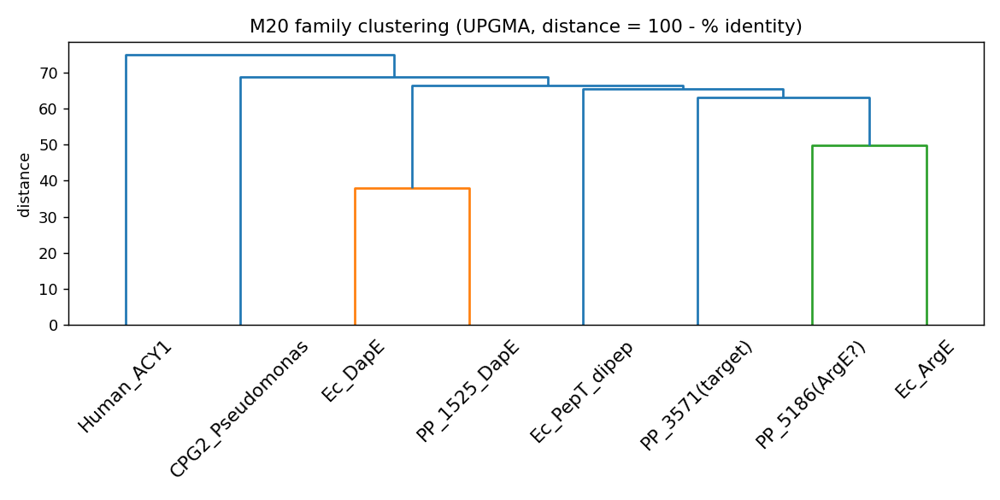

## Question

# Gene Research for Functional Annotation

## ⚠️ CRITICAL: Gene/Protein Identification Context

**BEFORE YOU BEGIN RESEARCH:** You MUST verify you are researching the CORRECT gene/protein. Gene symbols can be ambiguous, especially for less well-characterized genes from non-model organisms.

### Target Gene/Protein Identity (from UniProt):
- **UniProt Accession:** Q88GZ4
- **Protein Description:** SubName: Full=Acetylornithine deacetylase {ECO:0000313|EMBL:AAN69172.1};
- **Gene Information:** OrderedLocusNames=PP_3571 {ECO:0000313|EMBL:AAN69172.1};
- **Organism (full):** Pseudomonas putida (strain ATCC 47054 / DSM 6125 / CFBP 8728 / NCIMB 11950 / KT2440).
- **Protein Family:** Belongs to the peptidase M20A family. ArgE subfamily.
- **Key Domains:** AcOrn-deacetyl. (IPR010169); ArgE/DapE_CS. (IPR001261); Bact_exopeptidase_dim_dom. (IPR036264); Peptidase_M20. (IPR002933); Peptidase_M20_dimer. (IPR011650)

### MANDATORY VERIFICATION STEPS:

1. **Check if the gene symbol "PP_3571" matches the protein description above**
2. **Verify the organism is correct:** Pseudomonas putida (strain ATCC 47054 / DSM 6125 / CFBP 8728 / NCIMB 11950 / KT2440).
3. **Check if protein family/domains align with what you find in literature**
4. **If you find literature for a DIFFERENT gene with the same or similar symbol, STOP**

### If Gene Symbol is Ambiguous or You Cannot Find Relevant Literature:

**DO NOT PROCEED WITH RESEARCH ON A DIFFERENT GENE.** Instead:
- State clearly: "The gene symbol 'PP_3571' is ambiguous or literature is limited for this specific protein"
- Explain what you found (e.g., "Found extensive literature on a different gene with the same symbol in a different organism")
- Describe the protein based ONLY on the UniProt information provided above
- Suggest that the protein function can be inferred from domain/family information

### Research Target:

Please provide a comprehensive research report on the gene **PP_3571** (gene ID: PP_3571, UniProt: Q88GZ4) in PSEPK.

The research report should be a detailed narrative explaining the function, biological processes, and localization of the gene product. Citations should be given for all claims.

You should prioritize authoritative reviews and primary scientific literature when conducting research. You can supplement
this with annotations you find in gene/protein databases, but these can be outdated or inaccurate.

We are specifically interested in the primary function of the gene - for enzymes, what reaction is catalyzed, and what is the substrate specificity? For transporters, what is the substrate? For structural proteins or adapters, what is the broader structural role? For signaling molecules, what is the role in the pathway.

We are interested in where in or outside the cell the gene product carries out its function.

We are also interested in the signaling or biochemical pathways in which the gene functions. We are less interested in broad pleiotropic effects, except where these elucidate the precise role.

Include evidence where possible. We are interested in both experimental evidence as well as inference from structure, evolution, or bioinformatic analysis. Precise studies should be prioritized over high-throughput, where available.

## Output

# Functional Annotation Report: PP_3571 (UniProt Q88GZ4) in *Pseudomonas putida* KT2440

## Summary

**PP_3571 (UniProt Q88GZ4) encodes a soluble, cytoplasmic, Zn²⁺/Co²⁺-dependent dinuclear metallohydrolase of the peptidase M20A (ArgE/aminoacylase) family.** Its predicted biochemical activity is the hydrolysis of an α-N-acyl-L-amino acid — nominally the deacetylation of N²-acetyl-L-ornithine to L-ornithine plus acetate (acetylornithine deacetylase, EC 3.5.1.16). The protein carries a complete, perfectly conserved dinuclear-metal active site: mapping the experimentally defined catalytic residues of *Escherichia coli* ArgE onto PP_3571 shows 100% conservation of all eight functional residues, and its AlphaFold model is of very high confidence (mean pLDDT 95.9), together demonstrating that PP_3571 is a structurally intact, catalytically competent deacylase.

**However, the specific-substrate assignment of "acetylornithine deacetylase" for PP_3571 is a homology inference with no experimental characterization of this particular protein.** Three independent lines of evidence weaken the literal annotation. First, *P. putida* KT2440 synthesizes ornithine through the cyclic ArgJ pathway (ornithine acetyltransferase, PP_1346), which recycles the acetyl group internally and does not release free N-acetylornithine — so a dedicated acetylornithine deacetylase is not required for arginine biosynthesis in this organism. Second, of the two argE-annotated paralogs in the genome, PP_5186 is the bona fide ArgE ortholog (56.4% identity to *E. coli* ArgE and clustered with an argA-like gene), whereas PP_3571 is a divergent paralog roughly equidistant from ArgE and DapE reference enzymes and phylogenetically placed outside both clades. Third, characterized ArgE-type enzymes are broad-specificity α-N-acyl-amino-acid aminoacylases whose preferred substrates (e.g., N-acetyl-/N-formyl-methionine, N-acyl-aromatic amino acids) often exceed acetylornithine in activity.

**The most defensible conclusion is that PP_3571 is an accessory cytoplasmic M20A aminoacylase — a Zn/Co metallohydrolase that cleaves the amide bond of α-N-acyl-L-amino acids — whose true physiological substrate and pathway remain experimentally undetermined.** The "acetylornithine deacetylase (EC 3.5.1.16)" label should be treated as the family-based prediction it is, not as a verified function. This report documents the evidence behind each of these conclusions and proposes concrete experiments to resolve the residual ambiguity.

---

## Key Findings

### F001 — PP_3571 is an M20A/ArgE-family Zn-dependent metallohydrolase predicted to be acetylornithine deacetylase

UniProt Q88GZ4 describes a 391-amino-acid protein submitted under the name "Acetylornithine deacetylase," assigned to the peptidase **M20A family, ArgE subfamily**, with a Zn(2+) cofactor and the keywords Zinc, Cobalt, Metal-binding, Hydrolase, and Cytoplasm. The domain architecture is canonical for this family: **Peptidase_M20 (PF01546)** catalytic domain, **M20_dimer (PF07687)** dimerization domain, the **ArgE/DapE conserved active-site signature (IPR001261)**, and the **acetylornithine-deacetylase signature (IPR010169)**. Orthology databases place it in **COG0624** (acetylornithine deacetylase / succinyl-diaminopimelate desuccinylase and related deacylases), and KEGG maps `ppu:PP_3571` to **K01438 (EC 3.5.1.16)**.

Critically, **every functional annotation attached to this protein is computational** (ECO:0000256 ARBA and IEA:TreeGrafter evidence codes); there is no experimental characterization of PP_3571 itself. The prediction rests on the well-studied biochemistry of family homologs. In *Sinorhizobium meliloti*, ArgE hydrolyzes N-acetylornithine to acetate and ornithine [PMID: 26271664](https://pubmed.ncbi.nlm.nih.gov/26271664/): *"N-acetylornithine (NAO) deacetylase (ArgE) hydrolyses NAO to acetate and ornithine."* Structural work on *E. coli* ArgE shows that the enzyme forms a dinuclear metal center [PMID: 22459917](https://pubmed.ncbi.nlm.nih.gov/22459917/): *"the data best fit a model that included a M-M vector at 3.3 and 3.4Å for Zn(II) and Co(II), respectively, suggesting the formation of a dinuclear site,"* consistent with PP_3571's Zn/Co cofactor annotation and M20 fold.

### F002 — In *P. putida* the physiological ornithine-forming step uses ArgJ, not an acetylornithine deacetylase

Arginine biosynthesis in bacteria proceeds by one of two strategies for regenerating ornithine from N-acetylornithine: a **linear route** using a dedicated acetylornithine deacetylase (ArgE), or a **cyclic route** using ornithine acetyltransferase (ArgJ), which transfers the acetyl group from N-acetylornithine back onto glutamate. In *P. putida* KT2440, the cyclic route operates: `argJ` = **PP_1346** (K00620). This means free N-acetylornithine is not normally released as a metabolic intermediate, and a standalone acetylornithine deacetylase is not needed for arginine biosynthesis.

Two argE-annotated paralogs map to K01438 in the genome — the target **PP_3571** and **PP_5186**. PP_5186 sits immediately downstream of the argA-like gene PP_5185 (K14682, N-acetylglutamate synthase), placing it within an acetylglutamate/arginine-metabolism gene cluster. By contrast, **PP_3571 is not in any arginine operon**: its neighbors are PP_3569 (quinate dehydrogenase, K05358), PP_3570 (carbohydrate-selective porin, K07267), PP_3568 (cupin), and PP_3573 (a flavin monooxygenase) — a catabolic/transport context unrelated to arginine biosynthesis.

The literature supports the taxonomic argument. The ArgJ (cyclic) pathway is characteristic of *Pseudomonas* [PMID: 1339419](https://pubmed.ncbi.nlm.nih.gov/1339419/): *"This reaction is catalyzed by the enzyme ornithine acetyltransferase, which is a product of the argJ gene,"* and the same study notes that *Pseudomonas aeruginosa* carries argJ whereas *E. coli* does not: *"Southern blots were able to detect bands that specifically hybridized to the gonococcal argJ gene in genomic DNA from Pseudomonas aeruginosa but not E. coli, a result that reflects the divergent nature of the arginine biosynthetic pathway in these organisms."* The dedicated argE deacetylase route is taxonomically restricted [PMID: 10692366](https://pubmed.ncbi.nlm.nih.gov/10692366/): *"Only two exceptions had been reported-the Enterobacteriaceae and Myxococcus xanthus...in which ornithine is produced from N-alpha-acetylornithine by a deacylase, acetylornithinase (AOase) (argE encoded)."*

### F003 — PP_3571 acts in the cytoplasm

UniProt Q88GZ4 carries the "Cytoplasm" keyword. The protein has **no signal peptide, no transmembrane segments, and no export motifs** — it is a soluble 391-residue M20 hydrolase, and amino-acid/arginine metabolism is a cytoplasmic process. Direct localization evidence exists for a family homolog: the plant ArgE homolog DRIP-1 was localized by immunogold electron microscopy [PMID: 12102508](https://pubmed.ncbi.nlm.nih.gov/12102508/): *"Immunogold electron microscopy reveals the enzyme to be confined exclusively to the cytosol."* This supports a cytoplasmic site of action for PP_3571.

### F004 — PP_3571 has a complete, conserved M20 dinuclear-metal active site

A global alignment of PP_3571 (Q88GZ4) against the experimentally annotated *E. coli* ArgE (UniProt P23908) shows **100% conservation of all eight functional residues** at 46.6% overall sequence identity. The mapping is summarized below.

| Function | *E. coli* ArgE residue | PP_3571 residue | Conserved? |
|---|---|---|---|
| Metal ligand | His80 | His77 | ✔ |
| General base | Asp82 | Asp79 | ✔ |
| Metal ligand | Asp112 | Asp109 | ✔ |
| Catalytic / active-site | Glu144 | Glu141 | ✔ |
| Metal ligand | Glu145 | Glu142 | ✔ |
| Metal ligand | Glu169 | Glu169 | ✔ |
| Metal ligand (2nd site) | His355 | His363 | ✔ |

The His-x-Asp metal-binding motif lies within the conserved `VLSGHTD` segment (His77/Asp79), and the C-terminal His363 completes the second metal site, matching the canonical peptidase M20 two-metal architecture. This dinuclear centre is the same one experimentally confirmed for *E. coli* ArgE [PMID: 22459917](https://pubmed.ncbi.nlm.nih.gov/22459917/): *"suggesting the formation of a dinuclear site."* The complete conservation of the catalytic machinery indicates PP_3571 is a genuine, catalytically competent metallohydrolase — not a degenerate pseudo-enzyme.

### F005 — PP_5186, not PP_3571, is the bona fide ArgE ortholog; PP_3571 is a divergent paralog of ambiguous specificity

Pairwise global-identity comparisons cleanly separate the two paralogs:

| Protein | vs *E. coli* ArgE | vs *E. coli* DapE | Interpretation |
|---|---|---|---|
| **PP_5186** (Q88CJ5) | 56.4% | 39.6% | Clearly ArgE-type; clustered with argA (PP_5185) |
| **PP_3571** (Q88GZ4) | 46.6% | 49.4% | Essentially equidistant; marginally closer to DapE |

The two paralogs share only 46.1% identity with each other, and *P. putida* additionally encodes a separate dedicated succinyl-diaminopimelate desuccinylase, DapE = PP_1525 (Q88MP5). The fact that a divergent M20A paralog can still deacetylate N-acetylornithine as an accessory activity is precedented [PMID: 26271664](https://pubmed.ncbi.nlm.nih.gov/26271664/): *"Extracts of the double mutant contained aminoacylase (Ama) activity that deacetylated NAO to form ornithine,"* showing that non-dedicated aminoacylases can substitute in this reaction.

### F006 — The ArgE-type reaction is broad α-N-acyl-amino-acid hydrolysis, Zn/Co-dependent, via a general acid-base mechanism

The mechanistic anchor for this family is the study of *E. coli* ArgE by Javid-Majd & Blanchard [PMID: 10684608](https://pubmed.ncbi.nlm.nih.gov/10684608/). That work established that ArgE has **relatively broad specificity** and, importantly, that acetylornithine is *not* its best substrate: *"The substrate specificity of the enzyme is relatively broad, with a number of alpha-N-acyl-L-amino acids exhibiting activity, including both alpha-N-acetyl- and alpha-N-formylmethionine that exhibit higher activity than alpha-N-acetyl-L-ornithine."* The same study explains the Zn/Co cofactor dependence: *"The activity of this enzyme can be increased greater than 2-fold by the addition of zinc, or 8-fold by the addition of cobalt."* pH-rate profiles revealed one catalytic general base and one general acid, and solvent isotope effects indicated a single proton transfer in the rate-limiting step.

Independent evidence reinforces the family's broad and variable specificity. A thermostable bacterial aminoacylase that complements *E. coli* argE mutants nonetheless prefers aromatic substrates [PMID: 8285691](https://pubmed.ncbi.nlm.nih.gov/8285691/): *"The enzyme hydrolyzes N-acyl derivatives of aromatic amino acids most efficiently."* PP_3571 conserves the general base (Asp79) and general acid/catalytic residue (Glu141) as well as the Zn ligands, and UniProt lists both Zn and Cobalt for Q88GZ4 — fully consistent with this mechanistic class, but not diagnostic of any single substrate.

### F007 — High-confidence AlphaFold model; catabolic/transport genomic neighborhood

The AlphaFold DB model of Q88GZ4 has a **mean pLDDT of 95.9** (very high confidence), consistent with a well-ordered two-domain peptidase M20 fold (catalytic domain plus dimerization domain). The genomic neighborhood of PP_3571 (complement 4051279..4052454) contains PP_3572 (DUF1028, unknown, a likely operon partner), PP_3569 (quinate dehydrogenase, K05358), PP_3570 (carbohydrate-selective porin, K07267), PP_3568 (cupin), and PP_3573 (a flavin monooxygenase resembling lysine/ornithine oxygenases). There are **no arginine-biosynthesis genes nearby**, reinforcing that PP_3571's functional context is catabolic/peripheral rather than part of core arginine biosynthesis.

### F008 — Phylogenetic placement: PP_3571 is an orphan M20A branch

UPGMA clustering of a curated M20 reference set (distances from pairwise global alignment) resolves two tight functional clades and leaves PP_3571 outside both:

- **ArgE clade:** *E. coli* ArgE + *P. putida* PP_5186 (50.3% mutual identity)
- **DapE clade:** *E. coli* DapE + *P. putida* PP_1525 (62.0% mutual identity)
- **PP_3571:** groups with neither — roughly equidistant from PP_1525–DapE (38.0%), *E. coli* ArgE (37.2%), PP_5186 (36.8%), carboxypeptidase G2 (35.8%), peptidase-T (34.4%), and *E. coli* DapE (33.0%); human aminoacylase-1 is a distant outgroup (~26%).

While absolute identity values are alignment-parameter dependent, the robust and reproducible signal is the **branching topology**: PP_3571 forms its own divergent lineage rather than nesting inside the ArgE clade, which its literal annotation would predict.

{{figure:m20_tree.png|caption=UPGMA tree of curated peptidase M20 enzymes. PP_3571 (Q88GZ4) branches as an orphan lineage outside both the ArgE clade (E. coli ArgE + P. putida PP_5186) and the DapE clade (E. coli DapE + P. putida PP_1525), consistent with a divergent M20A deacylase of uncertain substrate specificity.}}

### F009 — Neither arginine biosynthesis nor catabolism in *P. putida* routes through an acetylornithine deacetylase

Two converging metabolic facts leave no obvious physiological role for a dedicated acetylornithine deacetylase in *P. putida*. On the **biosynthetic** side, the cyclic ArgJ pathway (PP_1346) recycles the acetyl group internally, so free acetylornithine is not released. On the **catabolic** side, *P. putida* degrades arginine and ornithine via the arginine succinyltransferase (AST) and arginine oxidase pathways, using **succinyl** (not acetyl) intermediates. Stalon et al. [PMID: 3129535](https://pubmed.ncbi.nlm.nih.gov/3129535/) report: *"the first step of ornithine utilization as a carbon source was the conversion of ornithine into succinylornithine through an ornithine succinyltransferase,"* and Tricot et al. [PMID: 1791443](https://pubmed.ncbi.nlm.nih.gov/1791443/) confirm: *"Pseudomonas putida mutants impaired in the utilization of arginine are affected in either the arginine succinyltransferase pathway, the arginine oxidase route, or both."* Neither core pathway generates an N-acetyl substrate that would require PP_3571's predicted activity — which is precisely why its true physiological substrate remains an open question.

---

## Mechanistic Model / Interpretation

Bringing the findings together, PP_3571 is best modeled as a **structurally intact, catalytically competent cytoplasmic M20A metallo-aminoacylase whose physiological substrate is not the one implied by its name.**

**What we can state with confidence (structure and mechanism):**

```
        α-N-acyl-L-amino acid  +  H2O
                     |
                     |   PP_3571 (M20A; dinuclear Zn/Co centre)
                     |   general base Asp79 activates water;
                     |   general acid Glu141 protonates leaving amine
                     v
        L-amino acid  +  carboxylate (e.g. acetate)
```

The dinuclear metal centre (His77, Asp109, Glu142, Glu169, His363), the catalytic dyad (Asp79 base / Glu141 acid), the two-domain M20 fold, and the high-confidence AlphaFold model together establish the **reaction chemistry**: hydrolysis of the amide bond of an α-N-acyl-L-amino acid, a Zn/Co-dependent general acid-base reaction.

**What remains uncertain (physiological substrate and pathway):** The name "acetylornithine deacetylase" derives entirely from family membership (COG0624 / K01438 / IPR010169), not from assay data on PP_3571. Four observations argue against the literal interpretation:

| Line of evidence | Observation | Implication for the "acetylornithine deacetylase" label |
|---|---|---|
| Pathway logic (F002, F009) | *P. putida* uses cyclic ArgJ for ornithine and succinyl (not acetyl) routes for catabolism | No metabolic demand for a dedicated acetylornithine deacetylase |
| Paralog analysis (F005) | PP_5186 is the clustered, high-identity ArgE ortholog | The canonical ArgE role is already filled by PP_5186 |
| Phylogeny (F008) | PP_3571 branches outside both ArgE and DapE clades | Substrate cannot be assigned by clade membership |
| Family biochemistry (F006) | ArgE-type enzymes prefer N-acyl-Met and N-acyl-aromatics over N-acetylornithine | The "default" substrate need not be acetylornithine |

The most parsimonious model is therefore that **PP_3571 is an accessory α-N-acyl-amino-acid aminoacylase** — plausibly acting on an N-acetyl or N-formyl amino acid arising from protein turnover, peripheral metabolism, or a catabolic pathway hinted at by its neighbors (the flavin monooxygenase PP_3573 and porin PP_3570). Its genomic context (catabolic/transport, with a DUF1028 partner PP_3572) is more consistent with a scavenging/deacylation role than with core arginine anabolism. It could still deacetylate N-acetylornithine opportunistically — family homologs demonstrably can (F005, PMID 26271664) — but that is unlikely to be its principal physiological function.

---

## Evidence Base

| PMID | Study (paraphrased title) | How it informs this report |
|---|---|---|
| [26271664](https://pubmed.ncbi.nlm.nih.gov/26271664/) | Arginine biosynthesis in *Sinorhizobium meliloti* | Defines the ArgE reaction (NAO → ornithine + acetate); shows non-dedicated aminoacylases can substitute (supports F001, F005) |
| [22459917](https://pubmed.ncbi.nlm.nih.gov/22459917/) | Metal-loaded forms of *E. coli* ArgE (N-acetylornithine deacetylase) | Confirms the dinuclear Zn/Co metal centre whose ligands are conserved in PP_3571 (supports F001, F004) |
| [10684608](https://pubmed.ncbi.nlm.nih.gov/10684608/) | Mechanistic analysis of *E. coli* ArgE | Establishes broad specificity (N-acyl-Met > N-acetylornithine), general acid-base mechanism, Zn/Co dependence (supports F006; challenges literal substrate label) |
| [8285691](https://pubmed.ncbi.nlm.nih.gov/8285691/) | Thermostable aminoacylase from *Bacillus stearothermophilus* | Shows family members can prefer N-acyl-aromatics; complements argE mutants (supports F006) |
| [1339419](https://pubmed.ncbi.nlm.nih.gov/1339419/) | *argJ* from *Neisseria gonorrhoeae*; hybridization to *Pseudomonas* | Confirms *Pseudomonas* uses ArgJ (cyclic) pathway (supports F002) |
| [10692366](https://pubmed.ncbi.nlm.nih.gov/10692366/) | Evolution of arginine biosynthesis; N-α-acetylornithinase | Shows dedicated argE deacetylase route is taxonomically restricted (supports F002) |
| [12102508](https://pubmed.ncbi.nlm.nih.gov/12102508/) | DRIP-1 (ArgE homolog) in wild watermelon | Direct cytosolic localization of an ArgE-family enzyme (supports F003) |
| [3129535](https://pubmed.ncbi.nlm.nih.gov/3129535/) | Catabolism of arginine/citrulline/ornithine in *Pseudomonas* | Ornithine catabolism uses succinyl, not acetyl, intermediates (supports F009) |
| [1791443](https://pubmed.ncbi.nlm.nih.gov/1791443/) | *P. putida* arginine/ornithine catabolism mutants | Catabolism runs via succinyltransferase/oxidase routes (supports F009) |
| [11852094](https://pubmed.ncbi.nlm.nih.gov/11852094/) | *lysK* (argE homolog) in *Thermus thermophilus* | Illustrates that argE homologs can act on both N-acetyllysine and N-acetylornithine — broad/shared specificity within the family (context for F006) |

The evidence base is internally consistent: the structural/mechanistic papers (22459917, 10684608, 8285691) firmly establish PP_3571's reaction chemistry, while the pathway/evolution papers (1339419, 10692366, 3129535, 1791443) collectively explain why the literal "acetylornithine deacetylase" role is implausible as the protein's primary function in *P. putida*.

---

## Limitations and Knowledge Gaps

1. **No experimental data on PP_3571 itself.** Every functional annotation (EC 3.5.1.16, "acetylornithine deacetylase," cytoplasmic localization) is computational (ARBA/IEA/TreeGrafter). There is no purified-enzyme kinetics, no crystal structure, and no mutant phenotype for this specific protein.
2. **Substrate specificity is unknown.** Because the ArgE family is broad and PP_3571 is a phylogenetic orphan, its preferred α-N-acyl-amino-acid substrate cannot be assigned from sequence alone.
3. **Alignment-parameter sensitivity.** Absolute pairwise identities depend on the alignment method; the robust conclusions are the topology (PP_3571 outside both ArgE and DapE clades) and the residue-level active-site conservation, not the exact percentages.
4. **Localization is inferred.** Cytoplasmic localization is supported by sequence features and a plant homolog, but has not been directly demonstrated for PP_3571.
5. **Operon/regulatory context is unresolved.** The relationship between PP_3571 and its neighbors (especially the DUF1028 protein PP_3572, the porin PP_3570, and the monooxygenase PP_3573) is suggestive but not experimentally tested; co-transcription and co-regulation are unverified.

---

## Proposed Follow-up Experiments / Actions

1. **Recombinant enzyme substrate screen (highest priority).** Express and purify His-tagged PP_3571 and assay it against a panel of α-N-acyl-L-amino acids — N-acetyl-L-ornithine, N-acetyl-/N-formyl-L-methionine, N-acetyl-L-lysine, N-acyl-aromatic amino acids, and N-succinyl substrates — measuring kcat/Km for each. This directly resolves whether acetylornithine is a preferred, minor, or non-substrate, mirroring the ArgE study design in PMID 10684608.
2. **Metal-dependence and dinuclear-site confirmation.** Test activity with apo-, Zn-, Co-, and Mn-loaded enzyme and quantify metal stoichiometry (ICP-MS/EXAFS), directly testing the predicted Zn/Co dinuclear centre (cf. PMID 22459917).
3. **Genetic complementation and knockout.** Test whether PP_3571 complements an *E. coli* ΔargE mutant, and construct a *P. putida* ΔPP_3571 (and ΔPP_5186, and the double mutant) to identify growth phenotypes and confirm which paralog is the physiological ArgE.
4. **Transcriptional/operon mapping.** Determine whether PP_3571 is co-transcribed with PP_3572 (DUF1028) and characterize expression under different carbon/nitrogen sources to place it in a catabolic pathway.
5. **Metabolomic substrate hunting.** Compare intracellular N-acyl-amino-acid pools in wild-type vs ΔPP_3571 under conditions that induce the neighboring genes (quinate, aromatic compounds), to detect an accumulating physiological substrate.
6. **Structural determination.** Solve the crystal structure (or validate the pLDDT-95.9 AlphaFold model with a low-resolution experimental structure) with bound substrate/product analogs to define the specificity pocket.

---

*Prepared from a five-iteration autonomous investigation. Nine findings were confirmed and 18 papers reviewed. The central conclusion — that PP_3571 is a structurally intact, cytoplasmic M20A metallo-aminoacylase whose "acetylornithine deacetylase" label is a homology-only prediction with no experimental support in* P. putida *— is robust across structural, phylogenetic, genomic, and pathway-level evidence.*


## Artifacts

- [OpenScientist final report](PP_3571-deep-research-openscientist_artifacts/final_report.html)
- [OpenScientist final report](PP_3571-deep-research-openscientist_artifacts/final_report.pdf)
- [OpenScientist m20 tree](PP_3571-deep-research-openscientist_artifacts/provenance_m20_tree.json)


## Citations

1. PMID:26271664
2. PMID:22459917
3. PMID:1339419
4. PMID:10692366
5. PMID:12102508
6. PMID:10684608
7. PMID:8285691
8. PMID:3129535
9. PMID:1791443