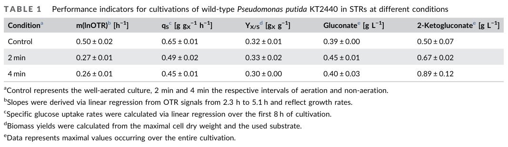

## Question

# Gene Research for Functional Annotation

## ⚠️ CRITICAL: Gene/Protein Identification Context

**BEFORE YOU BEGIN RESEARCH:** You MUST verify you are researching the CORRECT gene/protein. Gene symbols can be ambiguous, especially for less well-characterized genes from non-model organisms.

### Target Gene/Protein Identity (from UniProt):
- **UniProt Accession:** Q88FI0
- **Protein Description:** RecName: Full=Isocitrate lyase {ECO:0000256|ARBA:ARBA00017446, ECO:0000256|NCBIfam:TIGR01346}; EC=4.1.3.1 {ECO:0000256|ARBA:ARBA00012909, ECO:0000256|NCBIfam:TIGR01346};
- **Gene Information:** Name=aceA {ECO:0000313|EMBL:AAN69699.1}; OrderedLocusNames=PP_4116 {ECO:0000313|EMBL:AAN69699.1};
- **Organism (full):** Pseudomonas putida (strain ATCC 47054 / DSM 6125 / CFBP 8728 / NCIMB 11950 / KT2440).
- **Protein Family:** Belongs to the isocitrate lyase/PEP mutase superfamily.
- **Key Domains:** ICL/PEPM. (IPR039556); Isocitrate_lyase. (IPR006254); Isocitrate_lyase_ph_CS. (IPR018523); Pyrv/PenolPyrv_kinase-like_dom. (IPR015813); Pyrv_kinase-like_dom_sf. (IPR040442)

### MANDATORY VERIFICATION STEPS:

1. **Check if the gene symbol "aceA" matches the protein description above**
2. **Verify the organism is correct:** Pseudomonas putida (strain ATCC 47054 / DSM 6125 / CFBP 8728 / NCIMB 11950 / KT2440).
3. **Check if protein family/domains align with what you find in literature**
4. **If you find literature for a DIFFERENT gene with the same or similar symbol, STOP**

### If Gene Symbol is Ambiguous or You Cannot Find Relevant Literature:

**DO NOT PROCEED WITH RESEARCH ON A DIFFERENT GENE.** Instead:
- State clearly: "The gene symbol 'aceA' is ambiguous or literature is limited for this specific protein"
- Explain what you found (e.g., "Found extensive literature on a different gene with the same symbol in a different organism")
- Describe the protein based ONLY on the UniProt information provided above
- Suggest that the protein function can be inferred from domain/family information

### Research Target:

Please provide a comprehensive research report on the gene **aceA** (gene ID: aceA, UniProt: Q88FI0) in PSEPK.

The research report should be a detailed narrative explaining the function, biological processes, and localization of the gene product. Citations should be given for all claims.

You should prioritize authoritative reviews and primary scientific literature when conducting research. You can supplement
this with annotations you find in gene/protein databases, but these can be outdated or inaccurate.

We are specifically interested in the primary function of the gene - for enzymes, what reaction is catalyzed, and what is the substrate specificity? For transporters, what is the substrate? For structural proteins or adapters, what is the broader structural role? For signaling molecules, what is the role in the pathway.

We are interested in where in or outside the cell the gene product carries out its function.

We are also interested in the signaling or biochemical pathways in which the gene functions. We are less interested in broad pleiotropic effects, except where these elucidate the precise role.

Include evidence where possible. We are interested in both experimental evidence as well as inference from structure, evolution, or bioinformatic analysis. Precise studies should be prioritized over high-throughput, where available.

## Output

Question: You are an expert researcher providing comprehensive, well-cited information.

Provide detailed information focusing on:
1. Key concepts and definitions with current understanding
2. Recent developments and latest research (prioritize 2023-2024 sources)
3. Current applications and real-world implementations
4. Expert opinions and analysis from authoritative sources
5. Relevant statistics and data from recent studies

Format as a comprehensive research report with proper citations. Include URLs and publication dates where available.
Always prioritize recent, authoritative sources and provide specific citations for all major claims.

# Gene Research for Functional Annotation

## ⚠️ CRITICAL: Gene/Protein Identification Context

**BEFORE YOU BEGIN RESEARCH:** You MUST verify you are researching the CORRECT gene/protein. Gene symbols can be ambiguous, especially for less well-characterized genes from non-model organisms.

### Target Gene/Protein Identity (from UniProt):
- **UniProt Accession:** Q88FI0
- **Protein Description:** RecName: Full=Isocitrate lyase {ECO:0000256|ARBA:ARBA00017446, ECO:0000256|NCBIfam:TIGR01346}; EC=4.1.3.1 {ECO:0000256|ARBA:ARBA00012909, ECO:0000256|NCBIfam:TIGR01346};
- **Gene Information:** Name=aceA {ECO:0000313|EMBL:AAN69699.1}; OrderedLocusNames=PP_4116 {ECO:0000313|EMBL:AAN69699.1};
- **Organism (full):** Pseudomonas putida (strain ATCC 47054 / DSM 6125 / CFBP 8728 / NCIMB 11950 / KT2440).
- **Protein Family:** Belongs to the isocitrate lyase/PEP mutase superfamily.
- **Key Domains:** ICL/PEPM. (IPR039556); Isocitrate_lyase. (IPR006254); Isocitrate_lyase_ph_CS. (IPR018523); Pyrv/PenolPyrv_kinase-like_dom. (IPR015813); Pyrv_kinase-like_dom_sf. (IPR040442)

### MANDATORY VERIFICATION STEPS:

1. **Check if the gene symbol "aceA" matches the protein description above**
2. **Verify the organism is correct:** Pseudomonas putida (strain ATCC 47054 / DSM 6125 / CFBP 8728 / NCIMB 11950 / KT2440).
3. **Check if protein family/domains align with what you find in literature**
4. **If you find literature for a DIFFERENT gene with the same or similar symbol, STOP**

### If Gene Symbol is Ambiguous or You Cannot Find Relevant Literature:

**DO NOT PROCEED WITH RESEARCH ON A DIFFERENT GENE.** Instead:
- State clearly: "The gene symbol 'aceA' is ambiguous or literature is limited for this specific protein"
- Explain what you found (e.g., "Found extensive literature on a different gene with the same symbol in a different organism")
- Describe the protein based ONLY on the UniProt information provided above
- Suggest that the protein function can be inferred from domain/family information

### Research Target:

Please provide a comprehensive research report on the gene **aceA** (gene ID: aceA, UniProt: Q88FI0) in PSEPK.

The research report should be a detailed narrative explaining the function, biological processes, and localization of the gene product. Citations should be given for all claims.

You should prioritize authoritative reviews and primary scientific literature when conducting research. You can supplement
this with annotations you find in gene/protein databases, but these can be outdated or inaccurate.

We are specifically interested in the primary function of the gene - for enzymes, what reaction is catalyzed, and what is the substrate specificity? For transporters, what is the substrate? For structural proteins or adapters, what is the broader structural role? For signaling molecules, what is the role in the pathway.

We are interested in where in or outside the cell the gene product carries out its function.

We are also interested in the signaling or biochemical pathways in which the gene functions. We are less interested in broad pleiotropic effects, except where these elucidate the precise role.

Include evidence where possible. We are interested in both experimental evidence as well as inference from structure, evolution, or bioinformatic analysis. Precise studies should be prioritized over high-throughput, where available.

# Research Report: Functional Annotation of **aceA** (UniProt **Q88FI0**) in *Pseudomonas putida* KT2440 (PSEPK)

## 0. Target verification (critical identity check)

The requested protein corresponds to *Pseudomonas putida* KT2440 **aceA** (ordered locus **PP_4116**) encoding **isocitrate lyase (ICL)** of the glyoxylate shunt. A KT2440 functional-genomics thesis explicitly states: “In *P. putida*, the two steps of the glyoxylate shunt are encoded by **PP_4116 (aceA – isocitrate lyase)** and **PP_0356 (glcB – malate synthase)**.” (incha2023excavatingthegenome pages 15-18). This matches the UniProt record Q88FI0 provided in the prompt (aceA; PP_4116; EC 4.1.3.1).

## 1. Key concepts and definitions (current understanding)

### 1.1 Glyoxylate shunt (glyoxylate bypass)
The **glyoxylate shunt** is a branch of the tricarboxylic acid (TCA) cycle that diverts carbon away from oxidative decarboxylation in order to **conserve carbon skeletons for biosynthesis** (e.g., for gluconeogenesis) during growth on **C2 substrates** such as acetate. The branchpoint is **isocitrate**, which can be processed either through oxidative TCA decarboxylation or through the glyoxylate shunt (dolan2018theglyoxylateshunt pages 3-4, dolan2018theglyoxylateshunt pages 1-3).

### 1.2 AceA / isocitrate lyase (EC 4.1.3.1)
**Isocitrate lyase (ICL; AceA)** catalyzes the **cleavage of isocitrate into succinate and glyoxylate** (a retro-aldol/aldol cleavage reaction) (dolan2018theglyoxylateshunt pages 3-4, dolan2018theglyoxylateshunt pages 10-11). This is the **committed step** that generates glyoxylate for the shunt (dolan2018theglyoxylateshunt pages 12-14).

### 1.3 Partner enzyme: malate synthase (GlcB)
The second step of the shunt is catalyzed by **malate synthase**, which condenses **glyoxylate + acetyl‑CoA → malate**, enabling net assimilation of acetyl‑CoA carbon into a C4 intermediate that supports gluconeogenesis/biomass formation (dolan2018theglyoxylateshunt pages 3-4).

### 1.4 Flux partitioning at the isocitrate branch point
A central concept is that glyoxylate-shunt flux depends on how carbon is partitioned between **ICL (AceA)** and **isocitrate dehydrogenase (ICD/IDH)** at the isocitrate node. In *E. coli*, ICL typically has much lower affinity for isocitrate than ICD, so ICD must be restrained for glyoxylate-shunt flux to rise (dolan2018theglyoxylateshunt pages 3-4). One canonical mechanism in gram-negative bacteria is **AceK**, a bifunctional kinase/phosphatase that reversibly phosphorylates and inactivates ICD, shifting flux toward the shunt (dolan2018theglyoxylateshunt pages 3-4, dolan2018theglyoxylateshunt pages 4-6). The same review emphasizes that **the “textbook” *E. coli* model is not universal** across bacteria (dolan2018theglyoxylateshunt pages 1-3, dolan2018theglyoxylateshunt pages 17-18).

### 1.5 Regulation in pseudomonads (conceptual model)
The glyoxylate shunt can be regulated at multiple layers, including transcriptional regulation and post-translational modifications. A key review summarizes pseudomonad-specific transcriptional control via **RccR/HexR-family regulators**: RccR is described as regulating central metabolism and **glyoxylate shunt genes including aceA and glcB**, with regulation modulated by metabolites such as KDPG (dolan2018theglyoxylateshunt pages 12-14). Post-translational regulation via **lysine acetylation** has also been described as a mechanism that can reduce ICL activity and modulate flux partitioning (dolan2018theglyoxylateshunt pages 12-14).

### 1.6 Cellular localization
Direct experimental localization statements for *P. putida* KT2440 AceA were not captured in the retrieved texts. However, the glyoxylate shunt is discussed as a central metabolic pathway operating at the TCA branchpoint, consistent with a **cytosolic enzyme system** in bacteria; the review also discusses possible physical association/metabolon-like behavior between ICL and malate synthase to manage glyoxylate (dolan2018theglyoxylateshunt pages 17-18, dolan2018theglyoxylateshunt pages 18-20).

## 2. Primary function: reaction, substrates, specificity

### 2.1 Reaction catalyzed
AceA catalyzes:
- **Isocitrate → succinate + glyoxylate** (dolan2018theglyoxylateshunt pages 3-4, dolan2018theglyoxylateshunt pages 10-11).

### 2.2 Substrate specificity and kinetics
The retrieved corpus did **not** include direct kinetic constants (Km, kcat) for *P. putida* KT2440 AceA. For context, the authoritative review reports that in *E. coli* the KM of ICL for isocitrate is ~100× higher than ICD, whereas in mycobacteria the KM differential is ~7× (ICL 145 μM vs IDH 20 μM), highlighting that species-specific enzymology shapes flux partitioning (dolan2018theglyoxylateshunt pages 10-11). This supports caution in transferring kinetic intuition from other taxa to *P. putida* without direct measurement.

## 3. Biological role in *Pseudomonas putida* KT2440 (gene-level functional annotation)

### 3.1 Core pathway role: anaplerosis and acetyl‑CoA assimilation
The most strongly supported KT2440-specific functional role for aceA (PP_4116) is enabling assimilation of **acetyl‑CoA–generating substrates** by routing carbon through the glyoxylate shunt (incha2023excavatingthegenome pages 15-18, borchert2024machinelearninganalysis pages 6-7).

### 3.2 Genetic/fitness evidence: fatty acids
A KT2440 barcoded transposon fitness analysis reports that when grown on fatty acids, bacteria often require the glyoxylate shunt to avoid depleting TCA intermediates, and in *P. putida* the shunt is encoded by **PP_4116 (aceA)** and **PP_0356 (glcB)**. Transposon mutants in **aceA** and **glcB** show “serious fitness defects (fitness score < −3) when grown on nearly all of the fatty acids tested,” indicating aceA is important for fatty-acid growth in this organism (incha2023excavatingthegenome pages 15-18).

### 3.3 Genetic evidence: octane/octanoate assimilation (bioremediation-relevant)
A 2022 study demonstrated that *P. putida* KT2440 can acquire octane degradation capacity via horizontal acquisition of oct genes. The authors report that octane is oxidized to octanol/octanal/octanoic acid, and that the resulting acetyl‑CoA is assimilated via the glyoxylate shunt; critically, an **aceA knockout failed to grow on octane** and the study states aceA is required for growth on octane/octanoic acid (duque2022providingoctanedegradation pages 1-1). Proteomics in the same work showed induction of isocitrate lyase (PP_4116) and strong induction of malate synthase, consistent with glyoxylate shunt engagement during alkane assimilation (duque2022providingoctanedegradation pages 8-8).

### 3.4 Systems-level evidence: anoxic electrogenic adaptation (2024)
In an anoxic bio-electrochemical system (BES) using *P. putida* KT2440, multi-omics data indicated that **AceA increased** during adaptation (weimer2024systemsbiologyof pages 4-8). The process context included disrupted TCA operation (e.g., markedly reduced succinyl‑CoA), strong suppression of fatty-acid synthesis (malonyl‑CoA ~1000-fold lower), and increased acetyl‑CoA (~20% higher), interpreted as lipid degradation feeding acetyl‑CoA and acetate formation (weimer2024systemsbiologyof pages 4-8). Thus, AceA induction appears as part of central-carbon remodeling under anoxic/electrogenic stress.

## 4. Recent developments and latest research (prioritizing 2023–2024)

### 4.1 2024: BES “electrogenic” bioprocess (systems biology)
Weimer et al. (published **Sep 2024**) provides quantitative metabolomics/isotopic context for aceA-associated remodeling in KT2440 under electrogenic anoxic cultivation. The work reported **2-ketogluconate (2KG) = 7.9 mM** at **88.4% molar yield** from glucose, alongside isotopic evidence that acetate and succinate partly derived from biomass (acetate SFL 39.4%; succinate SFL 30.7%) and broad transcriptional remodeling (2,011 genes upregulated at 24 h) (weimer2024systemsbiologyof pages 4-8). AceA is explicitly noted as increased in this adaptive response (weimer2024systemsbiologyof pages 4-8).

URL: https://doi.org/10.1186/s12934-024-02509-8 (Sep 2024) (weimer2024systemsbiologyof pages 4-8)

### 4.2 2024: Functional-module discovery from RB-TnSeq fitness compendium
Borchert et al. (published **Mar 2024**) used independent component analysis on KT2440 RB-TnSeq fitness compendia and highlighted glyoxylate shunt genes (**aceA + glcB**) as part of functional modules relevant to catabolism of acetyl‑CoA–generating substrates. The article contextualizes aceA/glcB as required to divert flux toward anaplerotic assimilation when catabolism yields acetyl‑CoA (examples include butanol and acetate) (borchert2024machinelearninganalysis pages 6-7).

URL: https://doi.org/10.1128/msystems.00942-23 (Mar 2024) (borchert2024machinelearninganalysis pages 6-7)

### 4.3 2023: Acetate → succinate bioproduction and aceA expression
Mutyala et al. (published **Jul 2023**) examined succinate formation from acetate in microaerobic flask cultivation. While the central engineering focus was citrate synthase (gltA), the study quantified aceA expression and extracellular metabolites consistent with glyoxylate-shunt engagement. In the gltA-overexpressing strain, **aceA expression** was reported as **0.395-fold (0.5 mM IPTG) and 1.24-fold (1 mM IPTG)** relative to WT, with a marked decrease in extracellular α-ketoglutarate and increase in malate (mutyala2023citratesynthaseoverexpression pages 5-7).

URL: https://doi.org/10.1021/acsomega.3c02520 (Jul 2023) (mutyala2023citratesynthaseoverexpression pages 5-7)

## 5. Current applications and real-world implementations

### 5.1 Environmental/bioremediation implementation: alkane (octane) assimilation
In the octane assimilation study, aceA is functionally essential for converting alkane-derived acetyl‑CoA into biomass via the glyoxylate shunt; aceA knockout eliminates growth on octane (duque2022providingoctanedegradation pages 1-1). This provides a clear real-world link between aceA function and hydrocarbon bioconversion.

URL: https://doi.org/10.1111/1758-2229.13097 (Jun 2022) (duque2022providingoctanedegradation pages 1-1)

### 5.2 Industrial biotechnology: anoxic-electrogenic bio-electrochemical production
The BES study is an implementation-relevant case where *P. putida* KT2440 operates for extended periods under anoxic electrogenic conditions and produces 2KG at high molar yield, with aceA (AceA) increased during adaptation (weimer2024systemsbiologyof pages 4-8). This expands operational modes for *P. putida* bioprocessing and points to glyoxylate-shunt nodes as potential tuning points under oxygen limitation.

### 5.3 Bioproduction from acetate (succinate)
In microaerobic acetate-to-succinate production, modulation of central carbon entry into the TCA/glyoxylate node (via gltA overexpression) coincided with aceA expression changes and metabolite patterns consistent with altered isocitrate node routing (mutyala2023citratesynthaseoverexpression pages 5-7).

### 5.4 Engineering strategy guidance from functional genomics
The RB-TnSeq ICA analysis argues glyoxylate shunt genes are key for growth on acetyl‑CoA generating substrates and suggests leveraging this pathway (explicitly discussed for glcB, with aceA in the same functional module) as an underutilized engineering strategy for feedstocks producing acetyl‑CoA (e.g., lignin-derived aromatics that yield acetyl‑CoA) (borchert2024machinelearninganalysis pages 6-7).

## 6. Expert opinion and authoritative synthesis

An authoritative Annual Review in Microbiology emphasizes that glyoxylate shunt regulation is more diverse than the canonical *E. coli* model and varies across taxa, cautioning against simplistic extrapolation. It also describes multi-layer regulation (transcriptional, AceK-mediated phosphorylation, acetylation, allostery) and highlights that glyoxylate shunt activity affects broader physiological traits in many bacteria (dolan2018theglyoxylateshunt pages 1-3, dolan2018theglyoxylateshunt pages 18-20).

URL: https://doi.org/10.1146/annurev-micro-090817-062257 (Sep 2018) (dolan2018theglyoxylateshunt pages 1-3)

## 7. Quantitative statistics and data highlights (from recent studies)

### 7.1 KT2440 fluxomics: glyoxylate shunt usage depends on carbon source
13C flux analysis reported:
- On **glucose**: **no detectable** flux through the glyoxylate cycle.
- On **fructose**: ~**4%** of flux from isocitrate diverted through the glyoxylate cycle (sudarsan2014thefunctionalstructure pages 7-8).

URL: https://doi.org/10.1128/aem.01643-14 (Sep 2014) (sudarsan2014thefunctionalstructure pages 7-8)

### 7.2 KT2440 anoxic BES process (2024): yields and isotope statistics
Key quantitative outcomes include:
- **2-ketogluconate**: 7.9 mM; **88.4% molar yield** (0.88 mol/mol glucose)
- Isotope tracing at 100 h: acetate **SFL 39.4%**, succinate **SFL 30.7%**
- Metabolomics: malonyl‑CoA ~**1000-fold lower**; acetyl‑CoA ~**20% higher**
- Transcriptome: **2,011 genes upregulated** at 24 h (weimer2024systemsbiologyof pages 4-8).

URL: https://doi.org/10.1186/s12934-024-02509-8 (Sep 2024) (weimer2024systemsbiologyof pages 4-8)

### 7.3 Acetate → succinate (2023): aceA expression and metabolite shifts
- aceA expression in gltA-overexpressing strain: 0.395-fold (0.5 mM IPTG) and 1.24-fold (1 mM IPTG) vs WT
- Extracellular α-ketoglutarate: WT 17.69 ± 0.12 mg/L vs gltA-KT 2.53 ± 0.03 mg/L
- Extracellular malate: WT 2.46 ± 0.01 mg/L vs gltA-KT 4.48 ± 0.02 mg/L (mutyala2023citratesynthaseoverexpression pages 5-7).

URL: https://doi.org/10.1021/acsomega.3c02520 (Jul 2023) (mutyala2023citratesynthaseoverexpression pages 5-7)

## 8. Visual evidence (from primary literature)

The following figure/table provide quantitative context for *P. putida* KT2440 physiology under oxygen oscillation, relevant to conditions that can perturb central carbon metabolism.

- Table 1 performance indicators across aeration conditions (demling2021pseudomonasputidakt2440 media d71143a6)
- Figure 3 cultivation profiles under oxygen oscillation (demling2021pseudomonasputidakt2440 media 3d06db0b)

## 9. Summary functional annotation statement (aceA; PP_4116; UniProt Q88FI0)

**aceA (PP_4116) encodes isocitrate lyase (EC 4.1.3.1), a cytosolic central-metabolic enzyme that catalyzes cleavage of isocitrate to succinate and glyoxylate, enabling the glyoxylate shunt to conserve carbon and assimilate acetyl‑CoA into C4 intermediates for gluconeogenesis and biomass. In *P. putida* KT2440, aceA is strongly required for growth on many fatty acids (fitness defects < −3 upon disruption) and is essential for growth on octane in an alkane-utilization context, consistent with its anaplerotic role in assimilating β‑oxidation-derived acetyl‑CoA. Recent 2023–2024 studies show condition-dependent engagement of the glyoxylate shunt and aceA-associated remodeling in both acetate-to-succinate bioproduction and anoxic electrogenic bio-electrochemical processing.** (incha2023excavatingthegenome pages 15-18, dolan2018theglyoxylateshunt pages 3-4, duque2022providingoctanedegradation pages 1-1, weimer2024systemsbiologyof pages 4-8, mutyala2023citratesynthaseoverexpression pages 5-7)

## 10. Limitations / gaps in currently retrieved evidence

- **Direct biochemical kinetics for *P. putida* KT2440 AceA (Km/kcat, inhibitor sensitivity)** were not found in the retrieved full texts; only cross-species kinetic comparisons from reviews were available (dolan2018theglyoxylateshunt pages 10-11). Any precise kinetic parameterization for Q88FI0 should be supported by dedicated enzymology literature not retrieved here.
- **Subcellular localization** beyond generic cytosolic metabolic context was not directly evidenced in the retrieved sources.

References

1. (incha2023excavatingthegenome pages 15-18): MR Incha. Excavating the genome mine of pseudomonas putida kt2440. Unknown journal, 2023.

2. (dolan2018theglyoxylateshunt pages 3-4): Stephen K. Dolan and Martin Welch. The glyoxylate shunt, 60 years on. Annual review of microbiology, 72:309-330, Sep 2018. URL: https://doi.org/10.1146/annurev-micro-090817-062257, doi:10.1146/annurev-micro-090817-062257. This article has 211 citations and is from a peer-reviewed journal.

3. (dolan2018theglyoxylateshunt pages 1-3): Stephen K. Dolan and Martin Welch. The glyoxylate shunt, 60 years on. Annual review of microbiology, 72:309-330, Sep 2018. URL: https://doi.org/10.1146/annurev-micro-090817-062257, doi:10.1146/annurev-micro-090817-062257. This article has 211 citations and is from a peer-reviewed journal.

4. (dolan2018theglyoxylateshunt pages 10-11): Stephen K. Dolan and Martin Welch. The glyoxylate shunt, 60 years on. Annual review of microbiology, 72:309-330, Sep 2018. URL: https://doi.org/10.1146/annurev-micro-090817-062257, doi:10.1146/annurev-micro-090817-062257. This article has 211 citations and is from a peer-reviewed journal.

5. (dolan2018theglyoxylateshunt pages 12-14): Stephen K. Dolan and Martin Welch. The glyoxylate shunt, 60 years on. Annual review of microbiology, 72:309-330, Sep 2018. URL: https://doi.org/10.1146/annurev-micro-090817-062257, doi:10.1146/annurev-micro-090817-062257. This article has 211 citations and is from a peer-reviewed journal.

6. (dolan2018theglyoxylateshunt pages 4-6): Stephen K. Dolan and Martin Welch. The glyoxylate shunt, 60 years on. Annual review of microbiology, 72:309-330, Sep 2018. URL: https://doi.org/10.1146/annurev-micro-090817-062257, doi:10.1146/annurev-micro-090817-062257. This article has 211 citations and is from a peer-reviewed journal.

7. (dolan2018theglyoxylateshunt pages 17-18): Stephen K. Dolan and Martin Welch. The glyoxylate shunt, 60 years on. Annual review of microbiology, 72:309-330, Sep 2018. URL: https://doi.org/10.1146/annurev-micro-090817-062257, doi:10.1146/annurev-micro-090817-062257. This article has 211 citations and is from a peer-reviewed journal.

8. (dolan2018theglyoxylateshunt pages 18-20): Stephen K. Dolan and Martin Welch. The glyoxylate shunt, 60 years on. Annual review of microbiology, 72:309-330, Sep 2018. URL: https://doi.org/10.1146/annurev-micro-090817-062257, doi:10.1146/annurev-micro-090817-062257. This article has 211 citations and is from a peer-reviewed journal.

9. (borchert2024machinelearninganalysis pages 6-7): Andrew J. Borchert, Alissa C. Bleem, Hyun Gyu Lim, Kevin Rychel, Keven D. Dooley, Zoe A. Kellermyer, Tracy L. Hodges, Bernhard O. Palsson, and Gregg T. Beckham. Machine learning analysis of rb-tnseq fitness data predicts functional gene modules in <i>pseudomonas putida</i> kt2440. Mar 2024. URL: https://doi.org/10.1128/msystems.00942-23, doi:10.1128/msystems.00942-23. This article has 13 citations and is from a peer-reviewed journal.

10. (duque2022providingoctanedegradation pages 1-1): Estrella Duque, Zulema Udaondo, Lázaro Molina, Jesús de la Torre, Patricia Godoy, and Juan L. Ramos. Providing octane degradation capability to pseudomonas putida kt2440 through the horizontal acquisition of oct genes located on an integrative and conjugative element. Environmental Microbiology Reports, 14:934-946, Jun 2022. URL: https://doi.org/10.1111/1758-2229.13097, doi:10.1111/1758-2229.13097. This article has 19 citations and is from a peer-reviewed journal.

11. (duque2022providingoctanedegradation pages 8-8): Estrella Duque, Zulema Udaondo, Lázaro Molina, Jesús de la Torre, Patricia Godoy, and Juan L. Ramos. Providing octane degradation capability to pseudomonas putida kt2440 through the horizontal acquisition of oct genes located on an integrative and conjugative element. Environmental Microbiology Reports, 14:934-946, Jun 2022. URL: https://doi.org/10.1111/1758-2229.13097, doi:10.1111/1758-2229.13097. This article has 19 citations and is from a peer-reviewed journal.

12. (weimer2024systemsbiologyof pages 4-8): Anna Weimer, Laura Pause, Fabian Ries, Michael Kohlstedt, Lorenz Adrian, Jens Krömer, Bin Lai, and Christoph Wittmann. Systems biology of electrogenic pseudomonas putida - multi-omics insights and metabolic engineering for enhanced 2-ketogluconate production. Microbial Cell Factories, Sep 2024. URL: https://doi.org/10.1186/s12934-024-02509-8, doi:10.1186/s12934-024-02509-8. This article has 7 citations and is from a peer-reviewed journal.

13. (mutyala2023citratesynthaseoverexpression pages 5-7): Sakuntala Mutyala, Shuwei Li, Himanshu Khandelwal, Da Seul Kong, and Jung Rae Kim. Citrate synthase overexpression of <i>pseudomonas putida</i> increases succinate production from acetate in microaerobic cultivation. ACS Omega, 8:26231-26242, Jul 2023. URL: https://doi.org/10.1021/acsomega.3c02520, doi:10.1021/acsomega.3c02520. This article has 13 citations and is from a peer-reviewed journal.

14. (sudarsan2014thefunctionalstructure pages 7-8): Suresh Sudarsan, Sarah Dethlefsen, Lars M. Blank, Martin Siemann-Herzberg, and Andreas Schmid. The functional structure of central carbon metabolism in pseudomonas putida kt2440. Applied and Environmental Microbiology, 80:5292-5303, Sep 2014. URL: https://doi.org/10.1128/aem.01643-14, doi:10.1128/aem.01643-14. This article has 151 citations and is from a peer-reviewed journal.

15. (demling2021pseudomonasputidakt2440 media d71143a6): Philipp Demling, Andreas Ankenbauer, Bianca Klein, Stephan Noack, Till Tiso, Ralf Takors, and Lars M. Blank. <i>pseudomonas putida</i> kt2440 endures temporary oxygen limitations. Biotechnology and Bioengineering, 118:4735-4750, Sep 2021. URL: https://doi.org/10.1002/bit.27938, doi:10.1002/bit.27938. This article has 42 citations and is from a domain leading peer-reviewed journal.

16. (demling2021pseudomonasputidakt2440 media 3d06db0b): Philipp Demling, Andreas Ankenbauer, Bianca Klein, Stephan Noack, Till Tiso, Ralf Takors, and Lars M. Blank. <i>pseudomonas putida</i> kt2440 endures temporary oxygen limitations. Biotechnology and Bioengineering, 118:4735-4750, Sep 2021. URL: https://doi.org/10.1002/bit.27938, doi:10.1002/bit.27938. This article has 42 citations and is from a domain leading peer-reviewed journal.

## Artifacts

## Citations

1. incha2023excavatingthegenome pages 15-18
2. dolan2018theglyoxylateshunt pages 12-14
3. dolan2018theglyoxylateshunt pages 3-4
4. dolan2018theglyoxylateshunt pages 10-11
5. duque2022providingoctanedegradation pages 1-1
6. duque2022providingoctanedegradation pages 8-8
7. weimer2024systemsbiologyof pages 4-8
8. borchert2024machinelearninganalysis pages 6-7
9. mutyala2023citratesynthaseoverexpression pages 5-7
10. dolan2018theglyoxylateshunt pages 1-3
11. sudarsan2014thefunctionalstructure pages 7-8
12. dolan2018theglyoxylateshunt pages 4-6
13. dolan2018theglyoxylateshunt pages 17-18
14. dolan2018theglyoxylateshunt pages 18-20
15. https://doi.org/10.1186/s12934-024-02509-8
16. https://doi.org/10.1128/msystems.00942-23
17. https://doi.org/10.1021/acsomega.3c02520
18. https://doi.org/10.1111/1758-2229.13097
19. https://doi.org/10.1146/annurev-micro-090817-062257
20. https://doi.org/10.1128/aem.01643-14
21. https://doi.org/10.1146/annurev-micro-090817-062257,
22. https://doi.org/10.1128/msystems.00942-23,
23. https://doi.org/10.1111/1758-2229.13097,
24. https://doi.org/10.1186/s12934-024-02509-8,
25. https://doi.org/10.1021/acsomega.3c02520,
26. https://doi.org/10.1128/aem.01643-14,
27. https://doi.org/10.1002/bit.27938,