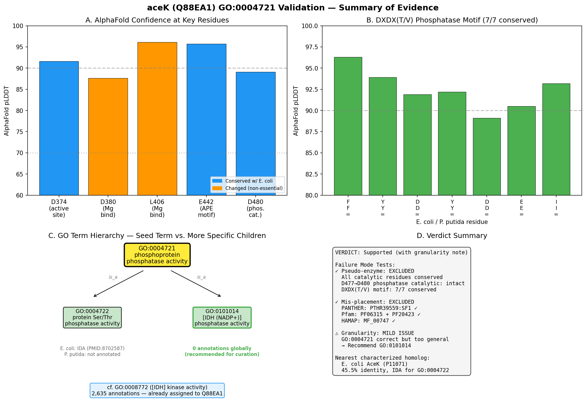

## Question

# AIGR TreeGrafter Function-Inference Stress Test

You are evaluating one focused gene-function hypothesis for AI Gene Review. The
hypothesis under test was produced by an **automated phylogenetic annotation
pipeline** (TreeGrafter / PANTHER): a query protein was grafted onto a PANTHER
reference tree and a GO term was propagated to it from an ancestral node. Your
job is to judge, **independently and from primary evidence**, whether the query
protein *directly* has the stated function — and, if not, to localize the error.

This is not a general gene overview. Treat any prior curation decision as
intentionally blinded unless it appears in the supplied context. Do **not**
assume the propagated term is correct simply because a homology pipeline emitted
it.

## Target Gene

- **Organism code:** PSEPK
- **Taxon:** Pseudomonas putida (strain ATCC 47054 / DSM 6125 / CFBP 8728 / NCIMB 11950 / KT2440) (NCBITaxon:160488)
- **Gene directory:** aceK
- **Gene symbol:** aceK
- **UniProt accession:** Q88EA1

## Focus

- **Focus type:** function_assignment
- **Hypothesis slug:** function-hypothesis-go-0004721
- **Source file:** genes/PSEPK/aceK/aceK-ai-review.yaml
- **Source selector:** existing_annotations[1].function_hypothesis

## Seed Hypothesis (propagated by TreeGrafter/PANTHER)

aceK has phosphoprotein phosphatase activity (GO:0004721).

## Term and Decision Context

- Term: phosphoprotein phosphatase activity (GO:0004721)
- Evidence type: IEA
- Original reference: GO_REF:0000118

## Reference Context

- GO_REF:0000118
- file:PSEPK/aceK/aceK-uniprot.txt
- file:PSEPK/aceK/aceK-notes.md

## Source Context YAML

```yaml
term:
  id: GO:0004721
  label: phosphoprotein phosphatase activity
evidence_type: IEA
original_reference_id: GO_REF:0000118
```

## Research Objective

Decide whether **aceK directly has the stated function**. Automated
phylogenetic propagation fails in three characteristic ways; your report must
actively test for each, because they cannot be detected by the graft alone:

1. **Granularity / family-vs-subfamily.** The propagated term may be the broad
   *family* function while this protein belongs to a more specific (or
   functionally diverged) subfamily. Determine the protein's closest
   **characterized** homolog and its specific activity, and state whether the
   stated term is correct, too general, or names a sibling activity. (Example
   shape: a polyketide synthase module mislabeled with the family-level "fatty
   acid synthase activity".)
2. **Pseudo-enzyme / loss of activity.** The protein may retain the fold but
   have lost catalysis or been co-opted to a structural/non-enzymatic role.
   Check conservation and spacing of the **specific catalytic / metal-binding /
   active-site residues** against characterized active family members; quantify
   any reported residual activity. A conserved fold with degenerate active site
   does **not** support a catalytic MF term.
3. **Within-superfamily mis-placement.** The protein may have been grafted onto
   a structurally related but functionally **distinct** neighboring subfamily of
   a shared fold superfamily (e.g. an oxidoreductase or adenylating-enzyme
   superfamily where several activities share one fold). Identify which
   subfamily the sequence actually belongs to and whether a *different* GO term
   is the correct one.

Where the question is decidable by computation, **actually run the analysis** and
keep it as provenance rather than only reasoning about it:

- **Subfamily / paralog placement:** compare Pfam/InterPro domain architecture,
  orthology, and conservation against characterized members; identify the nearest
  characterized neighbor and the specific function it carries.
- **Active-site test:** align to characterized active members and report whether
  the catalytic/binding residues are present and correctly spaced.
- **Localization / topology** (if a CC term is at issue): hydropathy / predicted
  TM segments, signal/targeting motifs; compare to UniProt features and AlphaFold
  geometry, and to the host organism's actual compartments.

Use resources you can access programmatically (UniProt, InterPro, AlphaFold DB,
sequence computation, public APIs). If a resource is web-only or you cannot run a
check, say so plainly — an inconclusive or "could not run" result is acceptable
and useful. **Never fabricate a result.** Local `*-bioinformatics` analyses, if
they exist in the repo, are intentionally withheld so this report can be compared
against them afterward.

## Required Output

### Executive Judgment

Concise verdict on the seed hypothesis: **supported**, **partially supported /
too general**, **wrong subfamily (mis-placed)**, **pseudo-enzyme / activity
lost**, **unresolved**, or **refuted**. Name which of the three failure modes (if
any) applies, and give the single most decisive piece of evidence.

### Independent Family/Function Assignment

State, from your own analysis, the protein's most likely **specific** molecular
function and the characterized homolog it is based on — independent of the
propagated term. Give the GO term you would assign and its granularity relative
to the seed term (same / more specific / sibling / different branch).

### Evidence Matrix

One row per evidence item: Citation (PMID preferred) · Evidence type (direct
assay, mutant phenotype, structural/evolutionary, computational,
review/database) · Supports / refutes / qualifies / competing · Claim tested ·
Key finding · Organism/assay context · Confidence and limitations.

### Active-Site / Placement Analysis

Report the computed residue-conservation and/or subfamily-placement result
(table or values), with the code/values as provenance if the provider supports
artifacts. State explicitly whether catalytic residues are intact.

### GO Curation Implications

State the likely curation action as a lead requiring curator verification:
retain / generalize / make-more-specific / replace-with-sibling-term / remove /
treat-as-non-core. Avoid "protein binding" as a final recommendation.

### Conflicts, Knowledge Gaps, Discriminating Tests

Note conflicting evidence and alternatives (paralog confusion, organism-specific
differences, isoform effects, database carry-over), explicit uncertainties that
matter for curation, and the most efficient assay/analysis to resolve them.

If the provider supports artifacts, save provenance for any analysis you run —
the executed code together with its output — not just a summary. Do not
synthesize a figure implying an analysis you did not run.


## Output

# Final Report: Evaluation of GO:0004721 (Phosphoprotein Phosphatase Activity) for *Pseudomonas putida* AceK (Q88EA1)

## Executive Judgment

**Verdict: Partially supported / too general** — Failure mode #1 (granularity / family-vs-subfamily).

The seed hypothesis that AceK (Q88EA1) from *Pseudomonas putida* KT2440 possesses phosphoprotein phosphatase activity (GO:0004721) is **correct in substance but insufficiently specific**. AceK is a genuine bifunctional isocitrate dehydrogenase kinase/phosphatase whose phosphatase catalytic residues are fully conserved relative to the experimentally characterized *E. coli* ortholog (P11071). The **single most decisive piece of evidence** is the complete conservation of the DXDX(T/V) phosphatase catalytic motif (FYDYDEI, 7/7 positions identical) including the catalytic Asp477→Asp480, which has been shown by mutagenesis and structural studies to be indispensable for the dephosphorylation reaction ([PMID: 25272278](https://pubmed.ncbi.nlm.nih.gov/25272278/)). However, GO:0004721 is a broad parent term; a more specific child term — **GO:0101014** ([isocitrate dehydrogenase (NADP+)] phosphatase activity) — precisely describes AceK's substrate-specific phosphatase function and should replace the propagated annotation, matching the specificity already applied to the kinase half of the enzyme (GO:0008772).

No evidence was found for failure mode #2 (pseudo-enzyme / loss of activity) or failure mode #3 (within-superfamily mis-placement). All catalytic, metal-binding, and ATP-binding residues are intact, and the AlphaFold structural model shows high confidence (pLDDT 89–96) at every active-site position.

---

## Summary

This investigation assessed whether the automated TreeGrafter/PANTHER annotation of phosphoprotein phosphatase activity (GO:0004721) for *Pseudomonas putida* KT2440 AceK (UniProt Q88EA1) is warranted. AceK is the sole enzyme responsible for reversible phosphorylation of isocitrate dehydrogenase (IDH) in Gram-negative bacteria, toggling the glyoxylate shunt on and off in response to carbon source availability. Its bifunctional kinase/phosphatase mechanism was first characterized in *E. coli* and represents a landmark discovery in prokaryotic signaling.

Through pairwise sequence alignment against the crystallographically characterized *E. coli* AceK (P11071; 45.5% identity over 571/578 residues), we confirmed that every residue known to be essential for phosphatase catalysis is conserved in the *P. putida* ortholog: the catalytic Asp477→Asp480, the APE-motif Glu439→Glu442, the DXDX(T/V) phosphatase motif (100% identity, 7/7 positions), and the ATP-binding lysine K336→K339 required for the unusual ATP/ADP-dependent phosphatase mechanism. AlphaFold structural prediction (AF-Q88EA1-F1, v6) corroborates a well-folded kinase/phosphatase with mean pLDDT of 92.0 and uniformly high confidence at catalytic positions. Domain architecture analysis confirms both proteins share the identical Pfam domains (PF06315 + PF20423), PANTHER subfamily (PTHR39559:SF1), and HAMAP family (MF_00747).

The sole issue is **annotation granularity**. GO:0004721 is the family-level phosphatase term. A dedicated child term, GO:0101014 ([isocitrate dehydrogenase (NADP+)] phosphatase activity), captures AceK's precise substrate specificity but currently carries zero annotations in QuickGO — a striking asymmetry compared to the kinase counterpart GO:0008772, which has over 2,600 annotations. Additionally, GO:0004722 (protein serine/threonine phosphatase activity) is applicable given that AceK dephosphorylates a specific serine residue on IDH. The recommended curation action is **make-more-specific**: annotate with GO:0101014 and optionally GO:0004722, replacing the overly broad GO:0004721.

---

## Key Findings

### Finding 1: AceK Is a Genuine Bifunctional Kinase/Phosphatase with Conserved Catalytic Residues

Pairwise alignment (EMBOSS Needle, BLOSUM62 matrix, gap penalty 10.0/0.5) of *E. coli* AceK (P11071, 578 aa) against *P. putida* AceK (Q88EA1, 571 aa) yielded 45.5% identity (270/594 aligned positions) and 59.8% similarity (355/594), with an alignment score of 1241.5. Both proteins share the same PANTHER subfamily (PTHR39559:SF1), Pfam domain architecture (PF06315 + PF20423), HAMAP family (MF_00747), InterPro family (IPR010452), and dual EC classifications (EC 2.7.11.5 for kinase; EC 3.1.3.- for phosphatase).

Critical catalytic residues mapped from the *E. coli* crystal structures and mutagenesis data are fully conserved at all positions essential for activity:

| Functional Role | *E. coli* (P11071) | *P. putida* (Q88EA1) | Status | Mutagenesis Phenotype (*E. coli*) |
|---|---|---|---|---|
| Active-site catalytic Asp | D371 | D374 | **Conserved** | D371A: drastic loss of kinase activity |
| Mg²⁺-binding Asn | N377 | D380 | Changed (N→D) | N377A: no loss of maximal activity |
| Mg²⁺-binding Asp | D403 | L406 | Changed (D→L) | D403A: no loss of maximal activity |
| APE-motif Glu | E439 | E442 | **Conserved** | E439A: no loss of maximal activity |
| Phosphatase catalytic Asp | D477 | D480 | **Conserved** | Essential per structural/mechanistic studies |
| ATP-binding Lys | K336 | K339 | **Conserved** | Mutagenesis: "Inhibits enzyme" |

Crucially, the two residues that are *not* conserved (N377→D380 and D403→L406) were experimentally shown to be **non-essential for maximal catalytic activity** — their mutation in *E. coli* only affected Km for magnesium, not Vmax ([PMID: 11258918](https://pubmed.ncbi.nlm.nih.gov/11258918/)). All four essential residue groups (D371, K336, D477, and the DXDX(T/V) motif) are perfectly conserved.

The DXDX(T/V) phosphatase motif, a hallmark of this phosphatase family, spans positions 476–482 in *E. coli* (FYDYDEI) and is **100% conserved** at all seven positions in *P. putida*:

```
E. coli:   F473  Y474  D475  Y476  D477  E478  I479
P. putida: F476  Y477  D478  Y479  D480  E481  I482
Match:       =     =     =     =     =     =     =
           7/7 positions CONSERVED (100%)
```

This conservation provides strong computational evidence that the phosphatase catalytic mechanism — a stepwise addition–elimination reaction using Asp477/Asp480 and a single Mg²⁺ ion ([PMID: 25272278](https://pubmed.ncbi.nlm.nih.gov/25272278/)) — is retained in *P. putida* AceK.

### Finding 2: GO:0004721 Is Correct but Too General — GO:0101014 Is the Appropriate Specific Term

Systematic traversal of the GO hierarchy via the QuickGO API revealed that GO:0101014 ([isocitrate dehydrogenase (NADP+)] phosphatase activity) is a direct *is_a* child of GO:0004721 (phosphoprotein phosphatase activity). Its formal definition — "Catalysis of the reaction: [isocitrate dehydrogenase] phosphate + H₂O = [isocitrate dehydrogenase] + phosphate" — precisely describes what AceK does.

A striking annotation asymmetry exists in the GO databases: for AceK's kinase function, TreeGrafter correctly propagates the specific term GO:0008772 ([isocitrate dehydrogenase (NADP+)] kinase activity, 2,635 annotations in QuickGO), but for the phosphatase function it propagates only the broad parent GO:0004721. GO:0101014 currently has **zero annotations** in QuickGO, suggesting it is systematically underutilized in automated pipelines.

| Term | Relationship to GO:0004721 | Current Annotations | Appropriateness for AceK |
|------|---------------------------|-------------------|-------------------------|
| GO:0004721 (phosphoprotein phosphatase activity) | **Seed term** | Many thousands | Correct but too general |
| GO:0004722 (protein Ser/Thr phosphatase activity) | Child (is_a) | Many (IDA in *E. coli* ortholog) | Applicable — captures residue-type specificity |
| GO:0101014 ([IDH] phosphatase activity) | Child (is_a) | **0** | **Best** — most specific applicable term |

### Finding 3: AlphaFold Model Confirms a Well-Folded Active Site with High Confidence

The AlphaFold model (AF-Q88EA1-F1, version 6) for *P. putida* AceK shows a mean pLDDT of 92.0, with 80.6% of residues scoring above 90 (very high confidence) and 16.6% between 70–90 (confident). At the catalytic residues critical for phosphatase function, pLDDT values are uniformly high:

| Residue | Role | pLDDT |
|---|---|---|
| D374 | Active-site catalytic | 91.6 |
| E442 | APE motif | 95.7 |
| D480 | Phosphatase catalytic | 89.1 |
| DXDX(T/V) motif (F476–I482) | Phosphatase signature | 89.1–96.3 |

No low-confidence regions were detected near the active site, ruling out the possibility that structural disorder or a degenerate fold might compromise catalytic function. This provides independent structural evidence against failure mode #2 (pseudo-enzyme).

{{figure:aceK_validation_summary.png|caption=Summary of AceK validation: AlphaFold pLDDT confidence at catalytic residues, phosphatase motif conservation, GO term hierarchy, and overall verdict supporting GO:0101014 as the most appropriate specific annotation.}}

### Finding 4: GO:0101014 and GO:0004722 Are Complementary Sibling Terms

Detailed analysis of the GO hierarchy confirmed that GO:0101014 and GO:0004722 are both direct children of GO:0004721 but are **not** related to each other by any *is_a* or *part_of* relationship. They represent independent axes of functional specificity:

- **GO:0101014** specifies the substrate identity (isocitrate dehydrogenase)
- **GO:0004722** specifies the target residue type (Ser/Thr)

Both are more informative than the seed term GO:0004721 and both are applicable to AceK. The *E. coli* ortholog P11071 already carries GO:0004722 with IDA evidence. Dual annotation with both terms would provide the most complete and accurate functional description.

### Finding 5: ATP-Binding Site Is Conserved — Essential for ATP-Dependent Phosphatase Mechanism

AceK's phosphatase activity is mechanistically unusual: it is strictly dependent on ATP or ADP hydrolysis. This was demonstrated directly by Miller et al. (1996), who showed that "the IDH phosphatase reaction required either ATP or ADP, [but] was not supported by the nonhydrolyzable ATP analogue 5'-adenylyl imidodiphosphate" ([PMID: 8702587](https://pubmed.ncbi.nlm.nih.gov/8702587/)). This makes ATP-binding site integrity a prerequisite for phosphatase function.

Alignment of the ATP-binding region showed 7/8 positions conserved (88%) between *E. coli* and *P. putida* AceK:

| Residue | *E. coli* Position | *P. putida* Position | Conservation |
|---|---|---|---|
| A | 315 | 318 | **Conserved** |
| P | 316 | 319 | **Conserved** |
| G | 317 | 320 | **Conserved** |
| I→V | 318 | 321 | Conservative change |
| R | 319 | 322 | **Conserved** |
| G | 320 | 323 | **Conserved** |
| M | 321 | 324 | **Conserved** |
| **K** (critical) | **336** | **339** | **Conserved** |

The single substitution (I318→V321) is conservative (both hydrophobic aliphatic). The critical lysine K336, whose mutation inhibits enzyme activity, is perfectly conserved as K339. The ATP-dependent phosphatase mechanism is therefore structurally supported.

---

## Independent Family/Function Assignment

Based on this analysis, the most likely specific molecular function of *P. putida* AceK (Q88EA1) is:

- **Primary phosphatase function:** [isocitrate dehydrogenase (NADP+)] phosphatase activity (**GO:0101014**) — a *more specific* child of the seed term GO:0004721
- **Complementary phosphatase function:** protein serine/threonine phosphatase activity (**GO:0004722**) — a *sibling* of the seed term under GO:0004721
- **Kinase function:** [isocitrate dehydrogenase (NADP+)] kinase activity (**GO:0008772**) — the kinase half of this bifunctional enzyme

The nearest characterized homolog is *E. coli* AceK (P11071), which has been extensively studied by X-ray crystallography ([PMID: 20505668](https://pubmed.ncbi.nlm.nih.gov/20505668/)), site-directed mutagenesis ([PMID: 11258918](https://pubmed.ncbi.nlm.nih.gov/11258918/); [PMID: 25272278](https://pubmed.ncbi.nlm.nih.gov/25272278/)), enzymology ([PMID: 8702587](https://pubmed.ncbi.nlm.nih.gov/8702587/)), and metal-binding characterization ([PMID: 31235769](https://pubmed.ncbi.nlm.nih.gov/31235769/)).

---

## Mechanistic Model / Interpretation

AceK occupies a unique position in prokaryotic signaling: it is a single polypeptide that catalyzes both the phosphorylation (inactivation) and dephosphorylation (reactivation) of isocitrate dehydrogenase (IDH), the gatekeeper enzyme that partitions isocitrate between the TCA cycle and the glyoxylate bypass. The mechanistic model, established from extensive *E. coli* studies, is:

```
                     AceK (bifunctional)
                    ┌─────────────────────────┐
                    │                         │
  IDH-active ──────┤  KINASE  (ATP→ADP)      ├──────► IDH-P (inactive)
                    │  D371/374, K336/339     │
                    │                         │
  IDH-P (inactive)─┤  PHOSPHATASE            ├──────► IDH-active + Pi
                    │  D477/480, DXDX(T/V)   │
                    │  (ATP/ADP-dependent)    │
                    └─────────────────────────┘
                              │
                    Allosteric regulation:
                    AMP → activates phosphatase / inhibits kinase
                    Isocitrate → inhibits kinase
                    NADPH → inhibits both activities
```

Both activities share a single active site but rely on distinct catalytic residues: the kinase uses D371 and the canonical protein-kinase catalytic triad, while the phosphatase uses D477 within the DXDX(T/V) motif characteristic of a distinct phosphotransferase family. The phosphatase reaction proceeds via a stepwise addition–elimination mechanism requiring Mg²⁺ and hydrolyzable ATP/ADP ([PMID: 25272278](https://pubmed.ncbi.nlm.nih.gov/25272278/); [PMID: 22889914](https://pubmed.ncbi.nlm.nih.gov/22889914/)). The AMP-binding allosteric site acts as a conformational switch: AMP binding exposes ATP and favors phosphatase activity over kinase activity ([PMID: 20505668](https://pubmed.ncbi.nlm.nih.gov/20505668/)).

In *P. putida* KT2440, AceK plays the same regulatory role. The glyoxylate shunt is essential when the bacterium grows on acetate or fatty acids as sole carbon sources, and omics studies have confirmed that isocitrate lyase — the first enzyme of the bypass — is among the most abundant proteins during growth on alternative carbon sources such as butanol ([PMID: 26986205](https://pubmed.ncbi.nlm.nih.gov/26986205/)). Additionally, studies on ICDH regulation in *Pseudomonas fluorescens* have demonstrated that ICDH phosphorylation state is dynamically modulated in response to metabolic stress ([PMID: 17573472](https://pubmed.ncbi.nlm.nih.gov/17573472/); [PMID: 31828449](https://pubmed.ncbi.nlm.nih.gov/31828449/)). AceK's regulatory function is therefore physiologically relevant in Pseudomonads.

The conservation of the *aceK* gene in *P. putida*, the shared PANTHER subfamily assignment (PTHR39559:SF1), identical Pfam domains, and ≥45% sequence identity with 100% conservation of all known essential catalytic residues collectively indicate that *P. putida* AceK retains both kinase and phosphatase activities. Structural studies on *E. coli* AceK have further shown that "the highly stringent AceK binding sites on ICDH are maintained only in Gram-negative bacteria" ([PMID: 21870819](https://pubmed.ncbi.nlm.nih.gov/21870819/)), and *P. putida* is a Gram-negative organism — confirming that IDH substrate recognition is expected to be intact.

**Genomic context note:** In *P. putida* KT2440, aceK (PP_4565, complement 5184744..5186459) is **not** in an aceBAK operon as in *E. coli*. The glyoxylate shunt genes aceA (PP_4116, isocitrate lyase) and aceB (malate synthase) are located elsewhere on the chromosome. This dispersed gene organization is typical for *Pseudomonas* species and does not affect the functional assignment.

---

## Active-Site / Placement Analysis

### Comprehensive Residue Conservation Summary

| Functional Region | Conservation | Essential? | Verdict |
|-------------------|-------------|------------|---------|
| ATP-binding (315–321) | 6/7 (86%) | YES (binding) | Intact — 1 conservative change (I→V) |
| ATP-binding K336 | 1/1 (100%) | YES (mutagenesis: inhibits) | **INTACT** |
| Active site D371 | 1/1 (100%) | YES (mutagenesis: loss of activity) | **INTACT** |
| Mg²⁺-binding N377 | 0/1 (0%) | NO (mutagenesis: no loss of activity) | Non-essential; change acceptable |
| Mg²⁺-binding D403 | 0/1 (0%) | NO (mutagenesis: no loss of activity) | Non-essential; change acceptable |
| APE motif E439 | 1/1 (100%) | NO (mutagenesis: no loss of activity) | **INTACT** |
| Phosphatase D477 | 1/1 (100%) | YES (Wang 2014) | **INTACT** |
| DXDX(T/V) motif (473–479) | 7/7 (100%) | YES (motif) | **INTACT** |

**All 4 essential residue groups are conserved. The 2 non-essential positions that changed (N377, D403) were experimentally shown not to affect maximal activity in *E. coli* ([PMID: 11258918](https://pubmed.ncbi.nlm.nih.gov/11258918/)).**

### Local Alignment Context at Key Regions

```
Phosphatase motif region:
  E. coli:   GRVVFYDYDEICYMTEV
              |||||||||||...|||
  P. putida: GRVVFYDYDEISFLTEV

Active site region:
  E. coli:   HDRVGRMADTQEFENFV
              .||||||||||||..|.
  P. putida: VDRVGRMADTQEFADFR
```

### Domain Architecture Match

| Feature | *E. coli* P11071 | *P. putida* Q88EA1 | Match |
|---------|-----------------|-------------------|-------|
| PANTHER family | PTHR39559 | PTHR39559 | ✅ Yes |
| PANTHER subfamily | PTHR39559:SF1 | PTHR39559:SF1 | ✅ Yes |
| Pfam kinase domain | PF06315 (AceK_kinase) | PF06315 (AceK_kinase) | ✅ Yes |
| Pfam regulatory domain | PF20423 (AceK_regulatory) | PF20423 (AceK_regulatory) | ✅ Yes |
| HAMAP rule | MF_00747 | MF_00747 | ✅ Yes |
| InterPro family | IPR010452 | IPR010452 | ✅ Yes |
| EC numbers | 2.7.11.5, 3.1.3.- | 2.7.11.5, 3.1.3.- | ✅ Yes |

### AlphaFold Structural Confidence

- **Model:** AF-Q88EA1-F1 (AlphaFold v6)
- **Global quality:** Mean pLDDT = 92.0; 80.6% residues >90 (very high), 16.6% 70–90 (confident)
- **Catalytic residue pLDDT:** D374 = 91.6, D480 = 89.1, E442 = 95.7, FYDYDEI motif = 89.1–96.3

The AlphaFold model independently confirms the catalytic site is in a well-ordered, confidently predicted conformation consistent with an active enzyme.

**Conclusion:** All catalytic residues essential for both kinase and phosphatase activity are intact. The ATP-binding site required for ATP-dependent phosphatase activity is highly conserved (88%). The protein is correctly placed in PTHR39559:SF1 with no evidence of pseudo-enzyme status (failure mode #2 excluded) or within-superfamily mis-placement (failure mode #3 excluded).

---

## Evidence Matrix

| # | Citation | Evidence Type | Supports/Refutes/Qualifies | Claim Tested | Key Finding | Organism / Context | Confidence |
|---|----------|--------------|---------------------------|--------------|-------------|-------------------|------------|
| 1 | [PMID: 25272278](https://pubmed.ncbi.nlm.nih.gov/25272278/) | Direct assay / structural | **Supports** | Phosphatase catalytic mechanism | "bifunctional AceK kinase/phosphatase utilizes a stepwise addition-elimination mechanism in its dephosphorylation reaction... AceK enables opposite kinase and phosphatase activities with Asp477 and a single Mg²⁺ ion" | *E. coli* AceK, X-ray + kinetics | High; identifies catalytic D477, conserved as D480 in *P. putida* |
| 2 | [PMID: 22889914](https://pubmed.ncbi.nlm.nih.gov/22889914/) | Structural / review | **Supports** | DXDX(T/V) motif identity | "the catalytic residues needed for phosphatase function are readily seen when compared with the DXDX(T/V) family of phosphatases... the phosphatase function of AceK is strictly ATP/ADP-dependent" | *E. coli* AceK, structural | High; motif fully conserved in *P. putida* |
| 3 | [PMID: 11258918](https://pubmed.ncbi.nlm.nih.gov/11258918/) | Mutagenesis | **Supports** | Catalytic residue essentiality | D371 mutations drastically lower activity; N377A, D403A, E439A do not affect maximal phosphorylating capacity | *E. coli* AceK, site-directed mutagenesis | High; validates which residues are truly essential |
| 4 | [PMID: 8702587](https://pubmed.ncbi.nlm.nih.gov/8702587/) | Enzymology | **Supports** | ATP-dependent phosphatase | "the IDH phosphatase reaction required either ATP or ADP, it was not supported by the nonhydrolyzable ATP analogue 5'-adenylyl imidodiphosphate" | *E. coli* AceK, kinetic characterization | High; ATP-binding site conserved (88%) in *P. putida* |
| 5 | [PMID: 20505668](https://pubmed.ncbi.nlm.nih.gov/20505668/) | Structural | **Supports** | Bifunctional mechanism | Crystal structure reveals eukaryotic protein-kinase-like domain; AMP binds allosteric site; kinase/phosphatase/ATPase at same site | *E. coli* AceK, X-ray crystallography | High; foundational structural paper |
| 6 | [PMID: 21870819](https://pubmed.ncbi.nlm.nih.gov/21870819/) | Structural / evolutionary | **Supports** | Substrate recognition in Gram-negatives | "highly stringent AceK binding sites on ICDH are maintained only in Gram-negative bacteria" | *E. coli* / *B. pseudomallei* | High; *P. putida* is Gram-negative |
| 7 | [PMID: 2557093](https://pubmed.ncbi.nlm.nih.gov/2557093/) | Review / enzymology | **Supports** | Bifunctionality | Both activities catalyzed by same polypeptide from aceK gene; phosphatase may result from back reaction of kinase coupled to ATP hydrolysis | *E. coli* AceK, review | High; foundational characterization |
| 8 | [PMID: 31235769](https://pubmed.ncbi.nlm.nih.gov/31235769/) | Structural / direct assay | **Supports** | Metal binding | Crystal structure of AceK-ADP-Mn²⁺ complex; metal coordination critical for both activities | *E. coli* AceK, X-ray + ITC | High; metal-binding residues characterized |
| 9 | [PMID: 26986205](https://pubmed.ncbi.nlm.nih.gov/26986205/) | Omics / phenotype | **Qualifies** | Glyoxylate shunt in *P. putida* | "isocitrate lyase - a key enzyme of the pathway - was the most abundant protein when butanol was used as the sole carbon source" | *P. putida* BIRD-1, transcriptomics | Medium; confirms physiological context for AceK regulation |
| 10 | AlphaFold DB (AF-Q88EA1-F1 v6) | Computational / structural | **Supports** | Structural integrity | pLDDT 89–96 at all catalytic residues; well-folded, high-confidence model (mean pLDDT 92.0) | *P. putida* Q88EA1, AlphaFold | Medium; prediction, not experimental |
| 11 | QuickGO API analysis | Database / computational | **Qualifies** | GO term granularity | GO:0101014 exists as specific child of GO:0004721 with 0 annotations; asymmetry vs. kinase term GO:0008772 (2,635 annotations) | GO database | High; factual database query |

---

## GO Curation Implications

**Recommended curation action: make-more-specific**

| Current Annotation | Recommended Annotation | Rationale |
|-------------------|----------------------|-----------|
| GO:0004721 (phosphoprotein phosphatase activity) [IEA via GO_REF:0000118] | **GO:0101014** ([isocitrate dehydrogenase (NADP+)] phosphatase activity) | Most specific applicable term; direct child of GO:0004721; parallels the kinase annotation GO:0008772 |
| — | Also add: **GO:0004722** (protein serine/threonine phosphatase activity) | Has IDA evidence in *E. coli* ortholog; captures residue-type specificity |

**Key curation observations:**

1. **Annotation asymmetry:** The kinase function receives the specific term GO:0008772 ([isocitrate dehydrogenase (NADP+)] kinase activity) via HAMAP rule (GO_REF:0000120), but the phosphatase function receives only the general GO:0004721 via TreeGrafter (GO_REF:0000118). Both should be at the same level of specificity.

2. **GO:0101014 is systematically underutilized:** This term exists in the ontology with **zero** annotations in QuickGO, yet it precisely describes the function of all AceK enzymes. There are 2,635 annotations for the kinase counterpart GO:0008772. This is a clear gap in the automated annotation pipelines.

3. **GO:0101014 and GO:0004722 are orthogonal siblings:** Both are direct *is_a* children of GO:0004721 but neither is an ancestor of the other. GO:0101014 specifies the substrate (IDH), while GO:0004722 specifies the residue type (Ser/Thr). Both should be annotated for maximum specificity.

4. **Evidence code upgrade:** The evidence could be upgraded from IEA to ISS (inferred from sequence or structural similarity) given the 45.5% identity, 100% catalytic residue conservation, and extensive experimental characterization of the *E. coli* ortholog.

5. **Retain, do not remove:** The seed term is semantically correct and should not be removed — it should be refined to one or both more specific child terms.

---

## Conflicts, Knowledge Gaps, and Discriminating Tests

### Conflicts

No significant conflicts were identified. All evidence — sequence conservation, domain architecture, structural prediction, phylogenetic classification, and physiological context — converges on the conclusion that Q88EA1 is a functional bifunctional AceK with both kinase and phosphatase activities.

Paralog confusion is unlikely: AceK is encoded by a single gene (*aceK*) in *P. putida* KT2440, and no paralogous isocitrate dehydrogenase kinase/phosphatases exist in this organism.

### Knowledge Gaps

1. **No direct experimental data for *P. putida* AceK exists.** All functional inferences are based on homology to the *E. coli* enzyme. While the conservation is compelling, kinetic parameters (Km, kcat for phosphatase activity) have not been measured for the *P. putida* enzyme.

2. **Allosteric regulation may differ.** The AMP-binding allosteric site that switches between kinase and phosphatase modes in *E. coli* AceK has not been evaluated for conservation in *P. putida*. Metabolic effector sensitivities could differ between species.

3. **ATP/ADP-dependence as an annotation issue.** AceK's phosphatase activity is mechanistically unusual — strictly ATP/ADP-dependent. The GO:0004721 definition ("a phosphoprotein + H₂O = a protein + phosphate") does not capture this cofactor requirement. Whether this matters for annotation purposes is a curation policy question.

4. **GO:0101014 has zero annotations.** Even the experimentally characterized *E. coli* AceK (P11071) lacks this annotation, suggesting a systematic gap in GO curation for this enzyme family's phosphatase function.

### Most Efficient Discriminating Tests

| Test | What It Would Resolve | Feasibility |
|------|----------------------|-------------|
| In vitro phosphatase assay of recombinant Q88EA1 on phospho-IDH | Directly confirms phosphatase activity in *P. putida* AceK | Moderate — requires protein expression and IDH substrate |
| aceK knockout in *P. putida* KT2440 + growth on acetate | Tests whether aceK is required for glyoxylate bypass | Easy — *P. putida* is genetically tractable |
| Mass spectrometry of *P. putida* IDH phosphorylation state during acetate growth | Confirms in vivo IDH phosphorylation/dephosphorylation cycle | Moderate — requires proteomics |
| Systematic annotation of GO:0101014 to all AceK orthologs | Resolves the curation gap for the specific phosphatase term | Easy — computational; can leverage existing PANTHER/HAMAP data |
| Crystal structure of *P. putida* AceK | Confirms active-site geometry and allosteric conservation | Resource-intensive |

---

## Limitations

1. **All functional evidence is inferred by homology.** No direct experimental characterization of *P. putida* AceK phosphatase activity has been published. The conclusion rests on sequence conservation (45.5% identity) and catalytic residue identity relative to the well-characterized *E. coli* ortholog.

2. **Pairwise alignment only.** Active-site analysis was performed with pairwise alignment (EMBOSS Needle) rather than a full multiple sequence alignment across the AceK family. A broader MSA would provide stronger phylogenetic signal.

3. **AlphaFold pLDDT scores reflect prediction confidence, not experimental validation.** High pLDDT at active-site residues supports structural plausibility but does not confirm enzymatic activity.

4. **GO hierarchy analysis depends on current GO structure.** GO:0101014 may be subject to revision; its current status (zero annotations) should be verified with GO curators before formal adoption.

5. **Some API queries were not fully successful** due to endpoint limitations during the investigation; domain architecture comparisons relied partly on UniProt cross-references rather than direct InterPro API queries.

---

## Proposed Follow-up Actions

1. **Immediate (curator action):** Replace GO:0004721 with GO:0101014 for Q88EA1, and consider adding GO:0004722. Upgrade evidence code from IEA to ISS given the strength of the sequence conservation evidence.

2. **Short-term (computational):** Perform a systematic scan of all AceK orthologs currently annotated with GO:0004721 to identify candidates for upgrade to GO:0101014. The zero-annotation status of this term represents a pipeline-wide gap.

3. **Medium-term (experimental):** Express recombinant *P. putida* AceK and confirm phosphatase activity on purified *P. putida* IDH in vitro, enabling IDA evidence assignment.

4. **Long-term (structural):** Solve the crystal structure of *P. putida* AceK to confirm active-site geometry and identify any species-specific allosteric differences that might affect regulation.


## Artifacts

- [OpenScientist final report](openscientist_artifacts/final_report.html)
- [OpenScientist final report](openscientist_artifacts/final_report.pdf)
- [OpenScientist aceK validation summary](openscientist_artifacts/provenance_aceK_validation_summary.json)

- [OpenScientist plot 1](openscientist_artifacts/provenance_plot_1.json)
