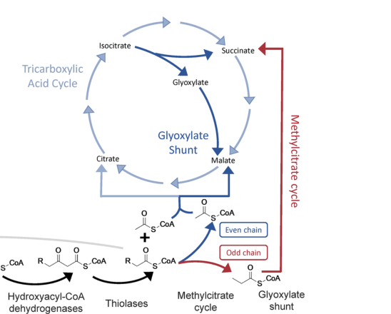

## Question

# Gene Research for Functional Annotation

## ⚠️ CRITICAL: Gene/Protein Identification Context

**BEFORE YOU BEGIN RESEARCH:** You MUST verify you are researching the CORRECT gene/protein. Gene symbols can be ambiguous, especially for less well-characterized genes from non-model organisms.

### Target Gene/Protein Identity (from UniProt):
- **UniProt Accession:** Q88KF1
- **Protein Description:** RecName: Full=Aconitate hydratase B {ECO:0000256|ARBA:ARBA00019379, ECO:0000256|PIRNR:PIRNR036687}; EC=4.2.1.3 {ECO:0000256|ARBA:ARBA00012926, ECO:0000256|PIRNR:PIRNR036687}; EC=4.2.1.99 {ECO:0000256|ARBA:ARBA00013250, ECO:0000256|PIRNR:PIRNR036687}; AltName: Full=2-methylisocitrate dehydratase {ECO:0000256|PIRNR:PIRNR036687};
- **Gene Information:** Name=acnB {ECO:0000313|EMBL:AAN67952.1}; OrderedLocusNames=PP_2339 {ECO:0000313|EMBL:AAN67952.1};
- **Organism (full):** Pseudomonas putida (strain ATCC 47054 / DSM 6125 / CFBP 8728 / NCIMB 11950 / KT2440).
- **Protein Family:** Belongs to the aconitase/IPM isomerase family.
- **Key Domains:** Acnase/IPM_dHydase_lsu_aba_1/3. (IPR015931); Acoase/IPM_deHydtase_lsu_aba. (IPR001030); Aconitase/3IPM_dehydase_swvl. (IPR015928); Aconitase/IPM_isomerase. (IPR050926); Aconitase_4Fe-4S_BS. (IPR018136)

### MANDATORY VERIFICATION STEPS:

1. **Check if the gene symbol "acnB" matches the protein description above**
2. **Verify the organism is correct:** Pseudomonas putida (strain ATCC 47054 / DSM 6125 / CFBP 8728 / NCIMB 11950 / KT2440).
3. **Check if protein family/domains align with what you find in literature**
4. **If you find literature for a DIFFERENT gene with the same or similar symbol, STOP**

### If Gene Symbol is Ambiguous or You Cannot Find Relevant Literature:

**DO NOT PROCEED WITH RESEARCH ON A DIFFERENT GENE.** Instead:
- State clearly: "The gene symbol 'acnB' is ambiguous or literature is limited for this specific protein"
- Explain what you found (e.g., "Found extensive literature on a different gene with the same symbol in a different organism")
- Describe the protein based ONLY on the UniProt information provided above
- Suggest that the protein function can be inferred from domain/family information

### Research Target:

Please provide a comprehensive research report on the gene **acnB** (gene ID: acnB, UniProt: Q88KF1) in PSEPK.

The research report should be a detailed narrative explaining the function, biological processes, and localization of the gene product. Citations should be given for all claims.

You should prioritize authoritative reviews and primary scientific literature when conducting research. You can supplement
this with annotations you find in gene/protein databases, but these can be outdated or inaccurate.

We are specifically interested in the primary function of the gene - for enzymes, what reaction is catalyzed, and what is the substrate specificity? For transporters, what is the substrate? For structural proteins or adapters, what is the broader structural role? For signaling molecules, what is the role in the pathway.

We are interested in where in or outside the cell the gene product carries out its function.

We are also interested in the signaling or biochemical pathways in which the gene functions. We are less interested in broad pleiotropic effects, except where these elucidate the precise role.

Include evidence where possible. We are interested in both experimental evidence as well as inference from structure, evolution, or bioinformatic analysis. Precise studies should be prioritized over high-throughput, where available.

## Output

Question: You are an expert researcher providing comprehensive, well-cited information.

Provide detailed information focusing on:
1. Key concepts and definitions with current understanding
2. Recent developments and latest research (prioritize 2023-2024 sources)
3. Current applications and real-world implementations
4. Expert opinions and analysis from authoritative sources
5. Relevant statistics and data from recent studies

Format as a comprehensive research report with proper citations. Include URLs and publication dates where available.
Always prioritize recent, authoritative sources and provide specific citations for all major claims.

# Gene Research for Functional Annotation

## ⚠️ CRITICAL: Gene/Protein Identification Context

**BEFORE YOU BEGIN RESEARCH:** You MUST verify you are researching the CORRECT gene/protein. Gene symbols can be ambiguous, especially for less well-characterized genes from non-model organisms.

### Target Gene/Protein Identity (from UniProt):
- **UniProt Accession:** Q88KF1
- **Protein Description:** RecName: Full=Aconitate hydratase B {ECO:0000256|ARBA:ARBA00019379, ECO:0000256|PIRNR:PIRNR036687}; EC=4.2.1.3 {ECO:0000256|ARBA:ARBA00012926, ECO:0000256|PIRNR:PIRNR036687}; EC=4.2.1.99 {ECO:0000256|ARBA:ARBA00013250, ECO:0000256|PIRNR:PIRNR036687}; AltName: Full=2-methylisocitrate dehydratase {ECO:0000256|PIRNR:PIRNR036687};
- **Gene Information:** Name=acnB {ECO:0000313|EMBL:AAN67952.1}; OrderedLocusNames=PP_2339 {ECO:0000313|EMBL:AAN67952.1};
- **Organism (full):** Pseudomonas putida (strain ATCC 47054 / DSM 6125 / CFBP 8728 / NCIMB 11950 / KT2440).
- **Protein Family:** Belongs to the aconitase/IPM isomerase family.
- **Key Domains:** Acnase/IPM_dHydase_lsu_aba_1/3. (IPR015931); Acoase/IPM_deHydtase_lsu_aba. (IPR001030); Aconitase/3IPM_dehydase_swvl. (IPR015928); Aconitase/IPM_isomerase. (IPR050926); Aconitase_4Fe-4S_BS. (IPR018136)

### MANDATORY VERIFICATION STEPS:

1. **Check if the gene symbol "acnB" matches the protein description above**
2. **Verify the organism is correct:** Pseudomonas putida (strain ATCC 47054 / DSM 6125 / CFBP 8728 / NCIMB 11950 / KT2440).
3. **Check if protein family/domains align with what you find in literature**
4. **If you find literature for a DIFFERENT gene with the same or similar symbol, STOP**

### If Gene Symbol is Ambiguous or You Cannot Find Relevant Literature:

**DO NOT PROCEED WITH RESEARCH ON A DIFFERENT GENE.** Instead:
- State clearly: "The gene symbol 'acnB' is ambiguous or literature is limited for this specific protein"
- Explain what you found (e.g., "Found extensive literature on a different gene with the same symbol in a different organism")
- Describe the protein based ONLY on the UniProt information provided above
- Suggest that the protein function can be inferred from domain/family information

### Research Target:

Please provide a comprehensive research report on the gene **acnB** (gene ID: acnB, UniProt: Q88KF1) in PSEPK.

The research report should be a detailed narrative explaining the function, biological processes, and localization of the gene product. Citations should be given for all claims.

You should prioritize authoritative reviews and primary scientific literature when conducting research. You can supplement
this with annotations you find in gene/protein databases, but these can be outdated or inaccurate.

We are specifically interested in the primary function of the gene - for enzymes, what reaction is catalyzed, and what is the substrate specificity? For transporters, what is the substrate? For structural proteins or adapters, what is the broader structural role? For signaling molecules, what is the role in the pathway.

We are interested in where in or outside the cell the gene product carries out its function.

We are also interested in the signaling or biochemical pathways in which the gene functions. We are less interested in broad pleiotropic effects, except where these elucidate the precise role.

Include evidence where possible. We are interested in both experimental evidence as well as inference from structure, evolution, or bioinformatic analysis. Precise studies should be prioritized over high-throughput, where available.

# Research Report: Functional Annotation of **acnB** (UniProt Q88KF1; locus **PP_2339**) in *Pseudomonas putida* KT2440

## 0. Target verification (critical disambiguation)
The gene symbol **acnB** is used broadly across bacteria, but in *Pseudomonas putida* KT2440 the locus **PP_2339** is explicitly annotated in KT2440-focused studies as **acnB**, encoding a **bifunctional 2-methylcitrate dehydratase/aconitase hydratase B**—consistent with the UniProt-provided identity for **Q88KF1**. (thompson2020fattyacidand pages 5-7, thompson2020fattyacidand pages 2-5, thompson2020functionalanalysisof pages 8-12)

## 1. Key concepts and current definitions

### 1.1 Aconitase / aconitate hydratase (EC 4.2.1.3)
“Aconitase” (aconitate hydratase) is a central-carbon enzyme classically positioned in the **tricarboxylic acid (TCA) cycle**, catalyzing the reversible isomerization of citrate to isocitrate via cis-aconitate. In bacteria, aconitase activity is typically carried by isoenzymes (often AcnA and AcnB). A key mechanistic feature is that enzymatic activity requires an intact **[4Fe–4S] iron–sulfur cluster**; disruption (e.g., oxidative damage or low iron) yields an inactive form. (crack2018redoxsensingiron–sulfurcluster pages 23-25, austin2015aconitasefunctionsas pages 1-2)

### 1.2 Methylcitrate cycle (MCC) and “bifunctional” AcnB
In *P. putida* KT2440, **acnB (PP_2339)** is discussed as part of the **methylcitrate cycle (MCC)**, a pathway that assimilates/detoxifies **propionyl-CoA** (commonly produced during β-oxidation of odd-chain fatty acids) into central metabolites (**succinate** and **pyruvate**), which feed into the broader TCA/central metabolism network. In this KT2440 context, AcnB is annotated as *bifunctional*: it can contribute to both classical aconitase chemistry and MCC-associated dehydratase/hydratase steps involving methylcitrate intermediates. (thompson2020fattyacidand pages 5-7, thompson2020fattyacidand pages 2-5, thompson2020fattyacidand media b8c40d82)

### 1.3 Apo-aconitase “moonlighting” as an RNA-binding protein (general bacterial concept)
Authoritative mechanistic literature shows that when aconitase loses/disrupts its [4Fe–4S] cluster (forming **apo-aconitase**), the protein can adopt **RNA-binding post-transcriptional regulatory roles** (e.g., binding specific mRNAs and altering stability/translation). This “switch” between enzymatic and RNA-binding roles is supported in multiple bacteria; direct experimental evidence exists in *Helicobacter pylori* and conceptually in *E. coli* reviewed literature, while it has not yet been demonstrated for *P. putida* KT2440 PP_2339 in the retrieved corpus. (crack2018redoxsensingiron–sulfurcluster pages 23-25, austin2015aconitasefunctionsas pages 1-2)

## 2. Functional role of *P. putida* KT2440 AcnB (PP_2339; Q88KF1)

### 2.1 Primary biochemical function: central-carbon dehydratase/isomerase chemistry
**Best-supported organism-specific functional claim:** In *P. putida* KT2440, **acnB (PP_2339)** functions in the **methylcitrate cycle** and is annotated as **bifunctional 2-methylcitrate dehydratase/aconitate hydratase B**. (thompson2020fattyacidand pages 5-7, thompson2020functionalanalysisof pages 8-12)

**Substrate specificity (evidence status):**
* KT2440-specific full-text evidence in the retrieved set provides pathway-level functional assignment (MCC involvement) and “bifunctional” annotation but does **not** provide detailed kinetic parameters (Km/kcat) or explicit chemical equations for PP_2339. (thompson2020fattyacidand pages 5-7, thompson2020functionalanalysisof pages 8-12)
* Mechanistic enzyme/cofactor principles (Fe–S dependence) come from broader aconitase literature rather than KT2440-specific biochemical assays. (crack2018redoxsensingiron–sulfurcluster pages 23-25, austin2015aconitasefunctionsas pages 1-2)

### 2.2 Pathway context: methylcitrate cycle is required for odd-chain fatty acid utilization
A key experimental systems-genetics result in KT2440 is that the **methylcitrate cycle is essential for growth on odd-chain fatty acids**, specifically noted as **propionate (C3), valerate (C5), heptanoate (C7), and nonanoate (C9)**. The same work places **PP_2339 (acnB)** in the MCC and argues it likely carries key MCC dehydratase/hydratase activity, especially because a canonical MCC dehydratase gene (prpD/PP_2338) did not show a fitness defect. (thompson2020fattyacidand pages 5-7, thompson2020fattyacidand media b8c40d82)

**Visual evidence (pathway placement):** Figure 2 in Thompson et al. (2020) depicts the MCC converting propionyl-CoA into succinate and pyruvate and presents a gene-fitness heatmap for odd-chain fatty acid growth conditions. (thompson2020fattyacidand media b8c40d82, thompson2020fattyacidand media 3b2d456f)

### 2.3 Cellular localization
No KT2440-specific microscopy/fractionation evidence for PP_2339 localization was retrieved. However, the enzymes and pathways described (TCA and MCC) are presented as part of the soluble central metabolic network; thus, AcnB is best inferred to function primarily in the **cytosol**. (thompson2020fattyacidand pages 5-7, molina2019pseudomonasputidakt2440 pages 8-9)

## 3. Phenotypes, essentiality, and regulation in *P. putida* KT2440

### 3.1 Essentiality / genetic constraint
Random barcode transposon sequencing (RB-TnSeq) analyses in KT2440 report **no mapped transposon insertions** in **PP_2339 (acnB)**. The authors interpret this absence as suggesting that **PP_2339 was essential during construction of the RB–TnSeq library** (i.e., disruption may be lethal or severely deleterious under the baseline conditions used to build/maintain the library). (thompson2020fattyacidand pages 5-7, thompson2020functionalanalysisof pages 8-12)

This is an *inference* from insertion absence rather than a classical targeted knockout with complementation; nonetheless, in large mutant libraries, lack of insertions is a common hallmark of essentiality or strong growth constraint. (thompson2020fattyacidand pages 5-7)

### 3.2 Expression/proteomic behavior in growth phases
Quantitative proteomic profiling of KT2440 growth in complete medium indicates that **aconitase isoforms** can vary by growth phase; in the cited excerpt, AcnB abundance was reported as **similar in early and mid exponential phases**, while some other isoforms (e.g., AcnA) decreased. This supports AcnB as a constitutive component of central metabolism across growth stages in this setting. (molina2019pseudomonasputidakt2440 pages 8-9)

### 3.3 Oxidative stress / iron limitation considerations (evidence boundaries)
*KT2440-specific* evidence directly tying PP_2339 regulation to oxidative stress/iron limitation was not retrieved.

However, authoritative mechanistic work in bacteria shows:
* Aconitase enzymatic activity depends on an intact **[4Fe–4S]** cluster; **oxidation (high oxygen/oxidants) or iron scarcity** can inactivate aconitase via cluster disruption. (crack2018redoxsensingiron–sulfurcluster pages 23-25, austin2015aconitasefunctionsas pages 1-2)
* Under these conditions, cluster-free aconitase can switch to RNA-binding regulatory roles in several bacteria (e.g., H. pylori AcnB binding multiple transcripts under O2 stress). (austin2015aconitasefunctionsas pages 1-2)

For KT2440 functional annotation, these findings motivate a plausible hypothesis that PP_2339 may also be stress-sensitive and potentially moonlighting, but this should be labeled as **family-supported inference** pending KT2440-specific experiments.

## 4. Recent developments (prioritizing 2023–2024)

### 4.1 2023: genome-scale functional genetics resources for KT2440
A 2023 KT2440 genome-mining/functional-genomics perspective explicitly identifies **PP_2339 (acnB)** as a bifunctional 2-methylcitrate dehydratase/aconitase hydratase B and notes the absence of mapped insertions consistent with an essential gene in an RB-TnSeq library context. (thompson2020functionalanalysisof pages 8-12)

### 4.2 2024: applied central-metabolism rewiring for aromatic compound degradation
A 2024 *Microbial Biotechnology* study demonstrates that **inactivating pyruvate dehydrogenase (PDH)** in KT2440 relieves carbon catabolite repression and improves the strain’s ability to **degrade aromatic compounds** (many of which funnel to acetyl-CoA and enter central metabolism via the TCA cycle). This underscores the importance of **TCA-connected nodes** (pyruvate → acetyl-CoA entry; downstream TCA function including aconitase steps) in real-world biotransformation/bioremediation performance. (moreno2024inactivationofpseudomonas pages 1-2)

### 4.3 2024: authoritative demonstration of iron-stress aconitase moonlighting (cross-species mechanistic advance)
A 2024 *Nucleic Acids Research* study (in *Staphylococcus aureus*) provides high-quality evidence that aconitase can be tightly regulated under iron deficiency by an sRNA-driven circuit and that aconitase itself can exert **moonlighting RNA-binding activity** that downregulates its own expression, illustrating conserved regulatory logic around Fe–S-dependent central metabolism. While not in *P. putida*, this strengthens the mechanistic precedent for Fe–S enzymes acting as metabolic/stress sensors. (barrault2024staphylococcalaconitaseexpression pages 1-3, barrault2024staphylococcalaconitaseexpression pages 12-14)

## 5. Current applications and real-world implementations

### 5.1 Bioremediation/biotransformation requiring robust central metabolism
KT2440 is widely used as a chassis for degradation of aromatic compounds; a 2024 study shows that rewiring central carbon entry (PDH-null) improves degradation of aromatic compounds even in the presence of preferred substrates, emphasizing industrial relevance of central metabolism and TCA-cycle throughput. Although AcnB is not singled out, aconitase activity is a core TCA step, so AcnB’s function is part of the metabolic backbone enabling such applications. (moreno2024inactivationofpseudomonas pages 1-2)

### 5.2 Odd-chain fatty acid utilization and propionyl-CoA detoxification
The methylcitrate cycle (in which PP_2339/acnB is placed) is essential for growth on odd-chain fatty acids, implying that AcnB supports utilization of feedstocks that yield propionyl-CoA. This is directly relevant to metabolic engineering contexts where fatty acids or complex substrates produce odd-chain intermediates that would otherwise be toxic or poorly assimilated. (thompson2020fattyacidand pages 5-7)

## 6. Relevant statistics and data (from available sources)

* **Essentiality inference:** PP_2339 (acnB) lacks RB-TnSeq insertions; authors interpret this as **essential during library construction** (qualitative essentiality evidence). (thompson2020fattyacidand pages 5-7, thompson2020functionalanalysisof pages 8-12)
* **Substrate class requirement:** The methylcitrate cycle (placing acnB as a key component) is described as **absolutely required** for growth on **propionate (C3), valerate (C5), heptanoate (C7), nonanoate (C9)**. (thompson2020fattyacidand pages 5-7)
* **Proteomics trend:** AcnB abundance is reported as **similar** between early and mid exponential phase in KT2440 growth in complete medium (qualitative expression statistic). (molina2019pseudomonasputidakt2440 pages 8-9)

**Data not recovered in accessible full text:** Numerical kinetic constants for KT2440 AcnB (Km, kcat), explicit quantitative transposon fitness values for acnB itself (since it lacks insertions), and KT2440-specific iron/oxygen stress regulation experiments.

## 7. Expert analysis and synthesis

### 7.1 Most defensible functional annotation for Q88KF1 in KT2440
The highest-confidence KT2440-specific annotation is that **AcnB (PP_2339; Q88KF1) is a cytosolic, Fe–S-dependent aconitase-family enzyme that plays a critical role in propionyl-CoA assimilation via the methylcitrate cycle**, supporting growth on odd-chain fatty acids and likely providing the principal methylaconitate/2-methylcitrate isomerization/dehydration capacity in this pathway. (thompson2020fattyacidand pages 5-7, thompson2020fattyacidand media b8c40d82)

### 7.2 Why “bifunctional” matters in *P. putida*
The KT2440 genetics strongly suggest functional redundancy/partitioning among paralogs: despite the presence of **prpD (PP_2338)**, no fitness defect was observed for that gene on odd-chain fatty acids, and the authors specifically infer that **PP_2339** likely performs the relevant MCC dehydratase function. This is a concrete example of how sequence-based annotation alone can mislead without functional genetics. (thompson2020fattyacidand pages 5-7)

### 7.3 Stress biology: what can be inferred vs what is proven
Because AcnB-type aconitases rely on **[4Fe–4S] clusters** that are susceptible to oxidative disruption and iron limitation—and because apo-forms can bind RNA in other bacteria—KT2440 AcnB is plausibly both a metabolic catalyst and a potential stress-responsive node. Yet, this report should not claim KT2440 RNA-binding moonlighting without direct evidence; instead, it is best presented as a mechanistically grounded hypothesis for future validation in KT2440. (crack2018redoxsensingiron–sulfurcluster pages 23-25, austin2015aconitasefunctionsas pages 1-2)

---

## Embedded summary table
| Aspect | Key points | Best supporting sources |
|---|---|---|
| Identity | Target is **acnB / PP_2339** in *Pseudomonas putida* KT2440; KT2440-focused studies annotate it as a **bifunctional 2-methylcitrate dehydratase/aconitase hydratase B**, matching UniProt Q88KF1. | (thompson2020fattyacidand pages 5-7, thompson2020fattyacidand pages 2-5, thompson2020functionalanalysisof pages 8-12) |
| Enzymatic activities | Evidence supports dual activity as **aconitate hydratase (aconitase)** in central metabolism and **2-methylcitrate/2-methylisocitrate dehydratase-related activity** in the methylcitrate cycle; literature places AcnB at the rehydration/dehydration steps around methylaconitate/2-methylisocitrate. | (thompson2020fattyacidand pages 5-7, thompson2020fattyacidand pages 2-5, thompson2020functionalanalysisof pages 8-12, thompson2020fattyacidand media b8c40d82) |
| Pathway roles | AcnB links the **TCA cycle** and the **methylcitrate cycle (MCC)** used for assimilation/detoxification of propionyl-CoA derived from **odd-chain fatty acids**; MCC yields **succinate and pyruvate** for central metabolism. | (thompson2020fattyacidand pages 5-7, thompson2020fattyacidand pages 2-5, molina2019pseudomonasputidakt2440 pages 8-9, thompson2020fattyacidand media b8c40d82) |
| Cofactor & sensitivity | As an aconitase-family enzyme, AcnB is expected to use a **[4Fe-4S] cluster**; broader aconitase literature indicates this cofactor is required for catalysis and is **sensitive to oxidation/iron limitation**, with AcnB often less stable than AcnA under oxidative stress. This is strong family-level inference, not direct KT2440 biochemical proof. | (crack2018redoxsensingiron–sulfurcluster pages 23-25, austin2015aconitasefunctionsas pages 1-2, watanabe2016functionalcharacterizationof pages 1-3) |
| Regulation / moonlighting | Direct **KT2440-specific moonlighting/RNA-binding evidence was not found**. In other bacteria, apo-AcnB can become an **RNA-binding post-transcriptional regulator** after Fe-S cluster loss, so this is a plausible family property but currently **unproven for PP_2339 in KT2440**. Proteomics in KT2440 shows AcnB abundance remains relatively stable from early to mid exponential growth. | (molina2019pseudomonasputidakt2440 pages 8-9, crack2018redoxsensingiron–sulfurcluster pages 23-25, austin2015aconitasefunctionsas pages 1-2) |
| Phenotypes / essentiality | **No mapped transposon insertions** were recovered for PP_2339 in RB-TnSeq studies, interpreted by the authors as suggesting **essentiality during library construction**. Neighboring MCC genes show strong odd-chain-fatty-acid fitness phenotypes, and authors infer PP_2339 likely provides much of the methylaconitate hydratase activity in this pathway. | (thompson2020fattyacidand pages 5-7, thompson2020functionalanalysisof pages 8-12, thompson2020fattyacidand media b8c40d82) |
| Localization | No direct localization experiment for PP_2339 was identified in the retrieved evidence. Based on its roles in the **TCA/MCC soluble metabolic network** and the aconitase enzyme class, AcnB is **best inferred to be a cytosolic enzyme** rather than membrane or extracellular. | (thompson2020fattyacidand pages 5-7, molina2019pseudomonasputidakt2440 pages 8-9) |

*Table: This table summarizes the currently supported functional annotation for *Pseudomonas putida* KT2440 acnB (PP_2339; UniProt Q88KF1). It distinguishes direct KT2440 evidence from broader aconitase-family inference, which is useful where organism-specific biochemical data are limited.*

## Key visual evidence
Thompson et al. (2020) provides a pathway schematic and gene-fitness heatmap placing AcnB in the methylcitrate cycle used for odd-chain fatty acid catabolism. (thompson2020fattyacidand media b8c40d82, thompson2020fattyacidand media 3b2d456f)

## Primary sources (URLs and publication dates)
* Thompson MG et al. **Applied and Environmental Microbiology** (Oct 2020). “Fatty acid and alcohol metabolism in *Pseudomonas putida*: functional analysis using RB-TnSeq.” https://doi.org/10.1128/aem.01665-20 (thompson2020fattyacidand pages 5-7)
* Molina L et al. **Environmental Microbiology** (Apr 2019). “*P. putida* KT2440 metabolism undergoes sequential modifications…” https://doi.org/10.1111/1462-2920.14622 (molina2019pseudomonasputidakt2440 pages 8-9)
* Moreno R et al. **Microbial Biotechnology** (Jun 2024). “Inactivation of *P. putida* KT2440 pyruvate dehydrogenase…” https://doi.org/10.1111/1751-7915.14514 (moreno2024inactivationofpseudomonas pages 1-2)
* Crack JC, Le Brun NE. **Antioxidants & Redox Signaling** (Dec 2018). “Redox-Sensing Iron–Sulfur Cluster Regulators.” https://doi.org/10.1089/ars.2017.7361 (crack2018redoxsensingiron–sulfurcluster pages 23-25)
* Austin CM et al. **Journal of Bacteriology** (Oct 2015). “Aconitase functions as a pleiotropic posttranscriptional regulator in *Helicobacter pylori*.” https://doi.org/10.1128/JB.00529-15 (austin2015aconitasefunctionsas pages 1-2)
* Barrault M et al. **Nucleic Acids Research** (May 2024). “Staphylococcal aconitase expression during iron deficiency…” https://doi.org/10.1101/2024.05.23.595409 (barrault2024staphylococcalaconitaseexpression pages 1-3)

References

1. (thompson2020fattyacidand pages 5-7): Mitchell G. Thompson, Matthew R. Incha, Allison N. Pearson, Matthias Schmidt, William A. Sharpless, Christopher B. Eiben, Pablo Cruz-Morales, Jacquelyn M. Blake-Hedges, Yuzhong Liu, Catharine A. Adams, Robert W. Haushalter, Rohith N. Krishna, Patrick Lichtner, Lars M. Blank, Aindrila Mukhopadhyay, Adam M. Deutschbauer, Patrick M. Shih, and Jay D. Keasling. Fatty acid and alcohol metabolism in pseudomonas putida: functional analysis using random barcode transposon sequencing. Oct 2020. URL: https://doi.org/10.1128/aem.01665-20, doi:10.1128/aem.01665-20. This article has 111 citations and is from a peer-reviewed journal.

2. (thompson2020fattyacidand pages 2-5): Mitchell G. Thompson, Matthew R. Incha, Allison N. Pearson, Matthias Schmidt, William A. Sharpless, Christopher B. Eiben, Pablo Cruz-Morales, Jacquelyn M. Blake-Hedges, Yuzhong Liu, Catharine A. Adams, Robert W. Haushalter, Rohith N. Krishna, Patrick Lichtner, Lars M. Blank, Aindrila Mukhopadhyay, Adam M. Deutschbauer, Patrick M. Shih, and Jay D. Keasling. Fatty acid and alcohol metabolism in pseudomonas putida: functional analysis using random barcode transposon sequencing. Oct 2020. URL: https://doi.org/10.1128/aem.01665-20, doi:10.1128/aem.01665-20. This article has 111 citations and is from a peer-reviewed journal.

3. (thompson2020functionalanalysisof pages 8-12): Mitchell G. Thompson, Matthew R. Incha, Allison N. Pearson, Matthias Schmidt, William A. Sharpless, Christopher B. Eiben, Pablo Cruz-Morales, Jacquelyn M. Blake-Hedges, Yuzhong Liu, Catharine A. Adams, Robert W. Haushalter, Rohith N. Krishna, Patrick Lichtner, Lars M. Blank, Aindrila Mukhopadhyay, Adam M. Deutschbauer, Patrick M. Shih, and Jay D. Keasling. Functional analysis of the fatty acid and alcohol metabolism of pseudomonas putida using rb-tnseq. bioRxiv, Jul 2020. URL: https://doi.org/10.1101/2020.07.04.188060, doi:10.1101/2020.07.04.188060. This article has 3 citations.

4. (crack2018redoxsensingiron–sulfurcluster pages 23-25): Jason C. Crack and Nick E. Le Brun. Redox-sensing iron–sulfur cluster regulators. Antioxidants &amp; Redox Signaling, 29:1809-1829, Dec 2018. URL: https://doi.org/10.1089/ars.2017.7361, doi:10.1089/ars.2017.7361. This article has 60 citations and is from a domain leading peer-reviewed journal.

5. (austin2015aconitasefunctionsas pages 1-2): Crystal M. Austin, Ge Wang, and Robert J. Maier. Aconitase functions as a pleiotropic posttranscriptional regulator in helicobacter pylori. Journal of Bacteriology, 197:3076-3086, Oct 2015. URL: https://doi.org/10.1128/jb.00529-15, doi:10.1128/jb.00529-15. This article has 33 citations and is from a peer-reviewed journal.

6. (thompson2020fattyacidand media b8c40d82): Mitchell G. Thompson, Matthew R. Incha, Allison N. Pearson, Matthias Schmidt, William A. Sharpless, Christopher B. Eiben, Pablo Cruz-Morales, Jacquelyn M. Blake-Hedges, Yuzhong Liu, Catharine A. Adams, Robert W. Haushalter, Rohith N. Krishna, Patrick Lichtner, Lars M. Blank, Aindrila Mukhopadhyay, Adam M. Deutschbauer, Patrick M. Shih, and Jay D. Keasling. Fatty acid and alcohol metabolism in pseudomonas putida: functional analysis using random barcode transposon sequencing. Oct 2020. URL: https://doi.org/10.1128/aem.01665-20, doi:10.1128/aem.01665-20. This article has 111 citations and is from a peer-reviewed journal.

7. (thompson2020fattyacidand media 3b2d456f): Mitchell G. Thompson, Matthew R. Incha, Allison N. Pearson, Matthias Schmidt, William A. Sharpless, Christopher B. Eiben, Pablo Cruz-Morales, Jacquelyn M. Blake-Hedges, Yuzhong Liu, Catharine A. Adams, Robert W. Haushalter, Rohith N. Krishna, Patrick Lichtner, Lars M. Blank, Aindrila Mukhopadhyay, Adam M. Deutschbauer, Patrick M. Shih, and Jay D. Keasling. Fatty acid and alcohol metabolism in pseudomonas putida: functional analysis using random barcode transposon sequencing. Oct 2020. URL: https://doi.org/10.1128/aem.01665-20, doi:10.1128/aem.01665-20. This article has 111 citations and is from a peer-reviewed journal.

8. (molina2019pseudomonasputidakt2440 pages 8-9): Lázaro Molina, R. L. Rosa, Juan Nogales, and F. Rojo. Pseudomonas putida kt2440 metabolism undergoes sequential modifications during exponential growth in a complete medium as compounds are gradually consumed. Environmental Microbiology, 21:2375-2390, Apr 2019. URL: https://doi.org/10.1111/1462-2920.14622, doi:10.1111/1462-2920.14622. This article has 46 citations and is from a domain leading peer-reviewed journal.

9. (moreno2024inactivationofpseudomonas pages 1-2): Renata Moreno, Luis Yuste, Gracia Morales, and Fernando Rojo. Inactivation of pseudomonas putida kt2440 pyruvate dehydrogenase relieves catabolite repression and improves the usefulness of this strain for degrading aromatic compounds. Microbial Biotechnology, Jun 2024. URL: https://doi.org/10.1111/1751-7915.14514, doi:10.1111/1751-7915.14514. This article has 7 citations and is from a peer-reviewed journal.

10. (barrault2024staphylococcalaconitaseexpression pages 1-3): Maxime Barrault, Svetlana Chabelskaya, Rodrigo H. Coronel-Tellez, Claire Toffano-Nioche, Eric Jacquet, and Philippe Bouloc. Staphylococcal aconitase expression during iron deficiency is controlled by an srna-driven feedforward loop and moonlighting activity. Nucleic Acids Research, 52:8241-8253, May 2024. URL: https://doi.org/10.1101/2024.05.23.595409, doi:10.1101/2024.05.23.595409. This article has 19 citations and is from a highest quality peer-reviewed journal.

11. (barrault2024staphylococcalaconitaseexpression pages 12-14): Maxime Barrault, Svetlana Chabelskaya, Rodrigo H. Coronel-Tellez, Claire Toffano-Nioche, Eric Jacquet, and Philippe Bouloc. Staphylococcal aconitase expression during iron deficiency is controlled by an srna-driven feedforward loop and moonlighting activity. Nucleic Acids Research, 52:8241-8253, May 2024. URL: https://doi.org/10.1101/2024.05.23.595409, doi:10.1101/2024.05.23.595409. This article has 19 citations and is from a highest quality peer-reviewed journal.

12. (watanabe2016functionalcharacterizationof pages 1-3): Seiya Watanabe, Kunihiko Tajima, Satoshi Fujii, Fumiyasu Fukumori, Ryotaro Hara, Rio Fukuda, Mao Miyazaki, Kuniki Kino, and Yasuo Watanabe. Functional characterization of aconitase x as a cis-3-hydroxy-l-proline dehydratase. Scientific Reports, Dec 2016. URL: https://doi.org/10.1038/srep38720, doi:10.1038/srep38720. This article has 11 citations and is from a peer-reviewed journal.

## Artifacts

- [Edison artifact artifact-00](acnB-deep-research-falcon_artifacts/artifact-00.md)

## Citations

1. thompson2020fattyacidand pages 5-7
2. austin2015aconitasefunctionsas pages 1-2
3. thompson2020functionalanalysisof pages 8-12
4. moreno2024inactivationofpseudomonas pages 1-2
5. barrault2024staphylococcalaconitaseexpression pages 1-3
6. thompson2020fattyacidand pages 2-5
7. barrault2024staphylococcalaconitaseexpression pages 12-14
8. watanabe2016functionalcharacterizationof pages 1-3
9. 4Fe–4S
10. 4Fe-4S
11. https://doi.org/10.1128/aem.01665-20
12. https://doi.org/10.1111/1462-2920.14622
13. https://doi.org/10.1111/1751-7915.14514
14. https://doi.org/10.1089/ars.2017.7361
15. https://doi.org/10.1128/JB.00529-15
16. https://doi.org/10.1101/2024.05.23.595409
17. https://doi.org/10.1128/aem.01665-20,
18. https://doi.org/10.1101/2020.07.04.188060,
19. https://doi.org/10.1089/ars.2017.7361,
20. https://doi.org/10.1128/jb.00529-15,
21. https://doi.org/10.1111/1462-2920.14622,
22. https://doi.org/10.1111/1751-7915.14514,
23. https://doi.org/10.1101/2024.05.23.595409,
24. https://doi.org/10.1038/srep38720,