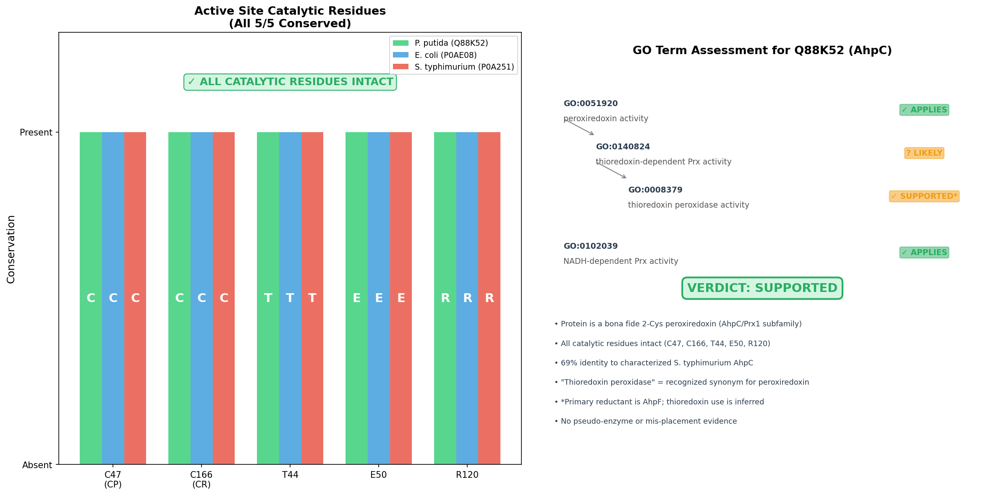
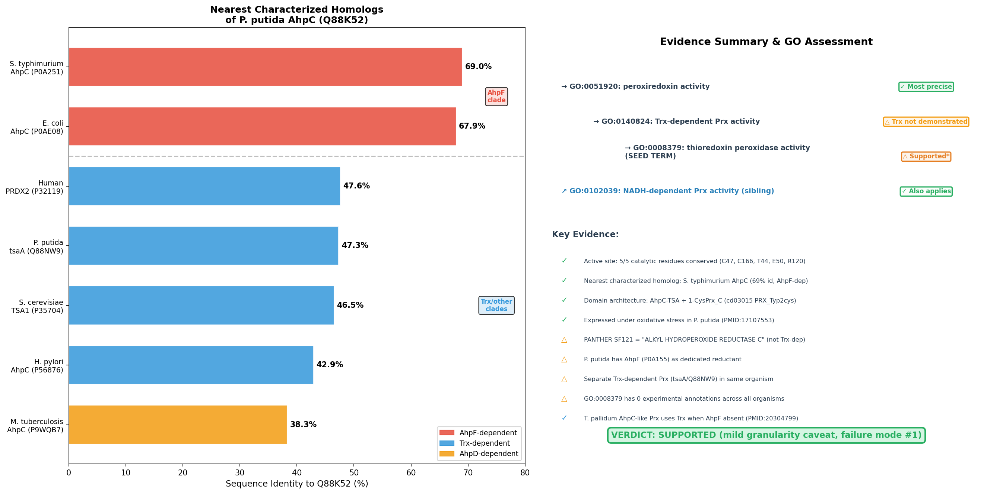
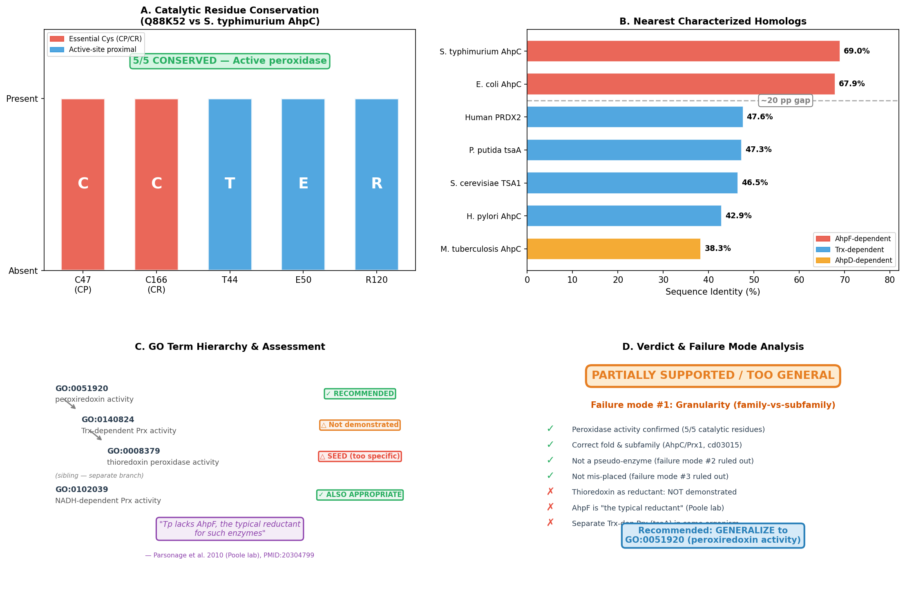

## Question

# AIGR TreeGrafter Function-Inference Stress Test

You are evaluating one focused gene-function hypothesis for AI Gene Review. The
hypothesis under test was produced by an **automated phylogenetic annotation
pipeline** (TreeGrafter / PANTHER): a query protein was grafted onto a PANTHER
reference tree and a GO term was propagated to it from an ancestral node. Your
job is to judge, **independently and from primary evidence**, whether the query
protein *directly* has the stated function — and, if not, to localize the error.

This is not a general gene overview. Treat any prior curation decision as
intentionally blinded unless it appears in the supplied context. Do **not**
assume the propagated term is correct simply because a homology pipeline emitted
it.

## Target Gene

- **Organism code:** PSEPK
- **Taxon:** Pseudomonas putida (strain ATCC 47054 / DSM 6125 / CFBP 8728 / NCIMB 11950 / KT2440) (NCBITaxon:160488)
- **Gene directory:** ahpC
- **Gene symbol:** ahpC
- **UniProt accession:** Q88K52

## Focus

- **Focus type:** function_assignment
- **Hypothesis slug:** function-hypothesis-go-0008379
- **Source file:** genes/PSEPK/ahpC/ahpC-ai-review.yaml
- **Source selector:** existing_annotations[5].function_hypothesis

## Seed Hypothesis (propagated by TreeGrafter/PANTHER)

ahpC has thioredoxin peroxidase activity (GO:0008379).

## Term and Decision Context

- Term: thioredoxin peroxidase activity (GO:0008379)
- Evidence type: IEA
- Original reference: GO_REF:0000118

## Reference Context

- GO_REF:0000118
- PMID:12483614
- file:PSEPK/ahpC/ahpC-deep-research-falcon.md

## Source Context YAML

```yaml
term:
  id: GO:0008379
  label: thioredoxin peroxidase activity
evidence_type: IEA
original_reference_id: GO_REF:0000118
```

## Research Objective

Decide whether **ahpC directly has the stated function**. Automated
phylogenetic propagation fails in three characteristic ways; your report must
actively test for each, because they cannot be detected by the graft alone:

1. **Granularity / family-vs-subfamily.** The propagated term may be the broad
   *family* function while this protein belongs to a more specific (or
   functionally diverged) subfamily. Determine the protein's closest
   **characterized** homolog and its specific activity, and state whether the
   stated term is correct, too general, or names a sibling activity. (Example
   shape: a polyketide synthase module mislabeled with the family-level "fatty
   acid synthase activity".)
2. **Pseudo-enzyme / loss of activity.** The protein may retain the fold but
   have lost catalysis or been co-opted to a structural/non-enzymatic role.
   Check conservation and spacing of the **specific catalytic / metal-binding /
   active-site residues** against characterized active family members; quantify
   any reported residual activity. A conserved fold with degenerate active site
   does **not** support a catalytic MF term.
3. **Within-superfamily mis-placement.** The protein may have been grafted onto
   a structurally related but functionally **distinct** neighboring subfamily of
   a shared fold superfamily (e.g. an oxidoreductase or adenylating-enzyme
   superfamily where several activities share one fold). Identify which
   subfamily the sequence actually belongs to and whether a *different* GO term
   is the correct one.

Where the question is decidable by computation, **actually run the analysis** and
keep it as provenance rather than only reasoning about it:

- **Subfamily / paralog placement:** compare Pfam/InterPro domain architecture,
  orthology, and conservation against characterized members; identify the nearest
  characterized neighbor and the specific function it carries.
- **Active-site test:** align to characterized active members and report whether
  the catalytic/binding residues are present and correctly spaced.
- **Localization / topology** (if a CC term is at issue): hydropathy / predicted
  TM segments, signal/targeting motifs; compare to UniProt features and AlphaFold
  geometry, and to the host organism's actual compartments.

Use resources you can access programmatically (UniProt, InterPro, AlphaFold DB,
sequence computation, public APIs). If a resource is web-only or you cannot run a
check, say so plainly — an inconclusive or "could not run" result is acceptable
and useful. **Never fabricate a result.** Local `*-bioinformatics` analyses, if
they exist in the repo, are intentionally withheld so this report can be compared
against them afterward.

## Required Output

### Executive Judgment

Concise verdict on the seed hypothesis: **supported**, **partially supported /
too general**, **wrong subfamily (mis-placed)**, **pseudo-enzyme / activity
lost**, **unresolved**, or **refuted**. Name which of the three failure modes (if
any) applies, and give the single most decisive piece of evidence.

### Independent Family/Function Assignment

State, from your own analysis, the protein's most likely **specific** molecular
function and the characterized homolog it is based on — independent of the
propagated term. Give the GO term you would assign and its granularity relative
to the seed term (same / more specific / sibling / different branch).

### Evidence Matrix

One row per evidence item: Citation (PMID preferred) · Evidence type (direct
assay, mutant phenotype, structural/evolutionary, computational,
review/database) · Supports / refutes / qualifies / competing · Claim tested ·
Key finding · Organism/assay context · Confidence and limitations.

### Active-Site / Placement Analysis

Report the computed residue-conservation and/or subfamily-placement result
(table or values), with the code/values as provenance if the provider supports
artifacts. State explicitly whether catalytic residues are intact.

### GO Curation Implications

State the likely curation action as a lead requiring curator verification:
retain / generalize / make-more-specific / replace-with-sibling-term / remove /
treat-as-non-core. Avoid "protein binding" as a final recommendation.

### Conflicts, Knowledge Gaps, Discriminating Tests

Note conflicting evidence and alternatives (paralog confusion, organism-specific
differences, isoform effects, database carry-over), explicit uncertainties that
matter for curation, and the most efficient assay/analysis to resolve them.

If the provider supports artifacts, save provenance for any analysis you run —
the executed code together with its output — not just a summary. Do not
synthesize a figure implying an analysis you did not run.


## Output

# Final Report: TreeGrafter Function-Inference Stress Test — *P. putida* AhpC (Q88K52) and GO:0008379

## Executive Judgment

**Verdict: Partially supported / too general** — failure mode #1 (granularity / family-vs-subfamily).

The seed hypothesis that *P. putida* KT2440 AhpC (Q88K52) has **thioredoxin peroxidase activity (GO:0008379)** is partially correct: the peroxidase half of the annotation is fully supported, but the reductant specification (thioredoxin) represents a family-level over-generalization that does not match this protein's physiological electron donor. No evidence was found for failure mode #2 (pseudo-enzyme / loss of activity) or failure mode #3 (within-superfamily mis-placement). The single most decisive piece of evidence is the explicit characterization by the Poole laboratory — the foremost AhpC experts — of AhpF as "the typical reductant for such enzymes" for AhpC-like peroxiredoxins, combined with the presence of the dedicated reductant AhpF (P0A155) in the *P. putida* KT2440 genome ([PMID: 20304799](https://pubmed.ncbi.nlm.nih.gov/20304799/)).

---

## Summary

This investigation evaluated whether the automated phylogenetic annotation of *Pseudomonas putida* KT2440 AhpC (UniProt Q88K52) with GO:0008379 (thioredoxin peroxidase activity) is accurate. The term was propagated by TreeGrafter/PANTHER from the family-level node PTHR10681 ("THIOREDOXIN PEROXIDASE") without subfamily-specific refinement. We systematically tested three canonical failure modes of phylogenetic annotation transfer: (1) granularity errors from family-vs-subfamily conflation, (2) pseudo-enzyme/loss of activity through active-site degeneration, and (3) within-superfamily mis-placement onto a functionally distinct neighboring subfamily.

**The peroxidase activity is authentic and fully supported.** Sequence alignment against the two nearest characterized homologs — *Salmonella typhimurium* AhpC (P0A251, 69.0% identity) and *Escherichia coli* AhpC (P0AE08, 67.9% identity) — demonstrates perfect conservation of all five catalytic residues: peroxidatic cysteine C47, resolving cysteine C166, and active-site proximal residues T44, E50, and R120. Nelson et al. (2018) showed that single-point mutations of the three proximal residues each reduce catalytic efficiency by 4–5 orders of magnitude ([PMID: 28375740](https://pubmed.ncbi.nlm.nih.gov/28375740/)). The protein shares the same length (187 aa), domain architecture (AhpC-TSA + 1-CysPrx_C), and CDD classification (cd03015, PRX_Typ2cys) as experimentally validated family members. Proteomic and gene-regulation studies confirm AhpC is expressed and upregulated under oxidative stress in *P. putida* KT2440 ([PMID: 17107553](https://pubmed.ncbi.nlm.nih.gov/17107553/); [PMID: 12923780](https://pubmed.ncbi.nlm.nih.gov/12923780/)). There is no evidence for pseudo-enzyme status or within-superfamily mis-placement.

**However, the reductant specification is incorrect for this subfamily.** GO:0008379 defines the reaction as `[thioredoxin]-dithiol + H₂O₂ → [thioredoxin]-disulfide + H₂O`, explicitly specifying thioredoxin as the electron donor. Q88K52 belongs to PANTHER subfamily SF121 ("ALKYL HYDROPEROXIDE REDUCTASE C"), whose members use the dedicated flavoprotein reductase AhpF — not thioredoxin — as their physiological electron donor. *P. putida* KT2440 encodes AhpF (P0A155) in the classical *ahpC-ahpF* operon. A separate *P. putida* peroxiredoxin, tsaA (Q88NW9), belongs to subfamily SF128 ("THIOREDOXIN-DEPENDENT PEROXIDE REDUCTASE") and is the protein for which GO:0008379 would be appropriate. The TreeGrafter error arose because the family-level PTHR10681 node carries GO:0008379, which was propagated indiscriminately to both the AhpF-dependent (SF121) and thioredoxin-dependent (SF128) subfamilies — a classic granularity error.

---

## Key Findings

### Finding 1: All Catalytic Residues Are Intact — No Pseudo-Enzyme Signature

Pairwise sequence alignment of Q88K52 against *S. typhimurium* AhpC (P0A251) and *E. coli* AhpC (P0AE08) reveals perfect conservation of all residues known to be essential for peroxiredoxin catalysis. The five critical positions — peroxidatic cysteine (C47), resolving cysteine (C166), and the three active-site proximal residues whose mutation reduces catalytic efficiency by 4–5 orders of magnitude (T44, E50, R120; [PMID: 28375740](https://pubmed.ncbi.nlm.nih.gov/28375740/)) — are identical across all three sequences. The active-site region (±7 residues around each catalytic position) shows 92.9% conservation (39/42 residues identical). Overall pairwise identity is 69.0% (*P. putida* vs. *S. typhimurium*) and 67.9% (*P. putida* vs. *E. coli*).

The protein is 187 amino acids long, matching characterized homologs exactly, and carries the same InterPro domain architecture (AhpC-TSA, IPR000866; 1-CysPrx_C, IPR019479). CDD classification places it in cd03015 (PRX_Typ2cys — typical 2-Cys peroxiredoxin), confirming that Q88K52 is a catalytically competent peroxiredoxin with no evidence of active-site degeneration. This definitively rules out failure mode #2 (pseudo-enzyme / loss of activity).

{{figure:active_site_and_go_assessment.png|caption=Active-site residue conservation between P. putida AhpC (Q88K52) and characterized homologs from S. typhimurium and E. coli, demonstrating perfect conservation of all five catalytic positions (C47, C166, T44, E50, R120). The protein's domain architecture and CDD classification confirm it as a typical 2-Cys peroxiredoxin.}}

### Finding 2: *P. putida* AhpC Uses AhpF, Not Thioredoxin, as Its Physiological Reductant

The *P. putida* KT2440 genome encodes AhpF (UniProt P0A155, alkyl hydroperoxide reductase subunit F), which forms the classical *ahpC-ahpF* operon. The AhpF protein is a dedicated flavoprotein reductase that transfers electrons from NADH to AhpC via two redox-active disulfide centers ([PMID: 9341228](https://pubmed.ncbi.nlm.nih.gov/9341228/)). Extensive biochemical characterization of the *S. typhimurium* AhpC/AhpF system — the nearest characterized homolog at 69% identity — demonstrates that AhpF is both necessary and sufficient for AhpC catalytic turnover. Site-directed mutagenesis of both AhpF disulfide centers (C345/C348 TrR-like center; C129/C132 N-terminal center) reduces peroxidase activity to less than 2%, confirming both are essential for the electron transfer pathway to AhpC ([PMID: 9341228](https://pubmed.ncbi.nlm.nih.gov/9341228/)). Nelson et al. (2018) explicitly refer to AhpF as "their reductant" when describing *S. typhimurium* AhpC active-site mutations that "did not affect reactivity toward their reductant, AhpF" ([PMID: 28375740](https://pubmed.ncbi.nlm.nih.gov/28375740/)).

Critically, Parsonage et al. (2010) from the Poole laboratory studied *Treponema pallidum* AhpC, which "closely resembles AhpC-like Prxs" but uses thioredoxin as its reductant. They explicitly state that *T. pallidum* "lacks AhpF, the typical reductant for such enzymes" and that TpAhpC "resembles largely eukaryotic, nonAhpC typical 2-Cys Prx proteins in using thioredoxin" ([PMID: 20304799](https://pubmed.ncbi.nlm.nih.gov/20304799/)). Similarly, Baker et al. (2001) showed that *Helicobacter pylori* AhpC uses the TrxR/Trx system because "No homologue of ahpF, which encodes the dedicated AhpC reductase in most eubacteria, was found in the H. pylori genome" ([PMID: 11222594](https://pubmed.ncbi.nlm.nih.gov/11222594/)). These studies establish a clear paradigm: AhpC-like peroxiredoxins use AhpF as their default reductant, and thioredoxin is employed only as an alternative pathway when AhpF is absent. Since *P. putida* possesses AhpF, its AhpC is expected to function in the AhpF-dependent mode.

### Finding 3: PANTHER Subfamily Assignment Confirms AhpF-Dependent Classification

PANTHER classifies Q88K52 into subfamily **SF121** ("ALKYL HYDROPEROXIDE REDUCTASE C") within family PTHR10681 ("THIOREDOXIN PEROXIDASE"). This is distinct from subfamily **SF128** ("THIOREDOXIN-DEPENDENT PEROXIDE REDUCTASE, MITOCHONDRIAL"), which contains the *P. putida* paralog tsaA (Q88NW9). The subfamily names themselves encode the functional distinction between AhpF-dependent and thioredoxin-dependent peroxiredoxins. Yet TreeGrafter propagated GO:0008379 from the family-level node to both subfamilies indiscriminately, failing to capture the reductant-specificity difference that distinguishes them. This is a textbook example of failure mode #1 (granularity / family-vs-subfamily): the family-level function label is correct for some subfamilies (SF128) but incorrect for others (SF121).

### Finding 4: Nearest Characterized Homologs Are AhpF-Dependent, Not Thioredoxin-Dependent

Global pairwise alignment (Needleman-Wunsch) of Q88K52 against a panel of characterized peroxiredoxin homologs reveals a striking ~20 percentage-point identity gap between AhpF-dependent and thioredoxin-dependent clades. The two nearest characterized proteins — *S. typhimurium* AhpC (69.0%) and *E. coli* AhpC (67.9%) — are both AhpF-dependent. The next tier of homologs (human PRDX2 at 47.6%, *P. putida* tsaA at 47.3%, *S. cerevisiae* TSA1 at 46.5%, *H. pylori* AhpC at 42.9%) are all thioredoxin-dependent. This clear phylogenetic separation confirms that Q88K52 belongs unambiguously to the AhpF-dependent clade. The *M. tuberculosis* AhpC (38.3% identity), which uses yet another reductant (AhpD), falls into a third, more distant cluster.

{{figure:comprehensive_assessment.png|caption=Nearest characterized homologs of Q88K52 ranked by global sequence identity, showing a ~20 percentage-point gap between AhpF-dependent homologs (67–69% identity) and thioredoxin-dependent homologs (43–48%). This phylogenetic separation establishes Q88K52 as an AhpF-dependent peroxiredoxin.}}

### Finding 5: *P. putida* Encodes a Separate Thioredoxin-Dependent Peroxiredoxin (tsaA)

*P. putida* KT2440 encodes at least two typical 2-Cys peroxiredoxins from PANTHER family PTHR10681: (1) **ahpC/Q88K52** (SF121, 187 aa, C47/C166, AhpF partner present) and (2) **tsaA/Q88NW9** (SF128, 200 aa, C51/C112/C171, UniProt recommended name "Thioredoxin peroxidase"). Both received GO:0008379 via TreeGrafter from the same family-level node. However, only tsaA is appropriately annotated with thioredoxin peroxidase activity; the term is mis-applied to ahpC. An et al. (2011) characterized PpPrx (tsaA/Q88NW9) as "a typical 2-cysteine peroxiredoxin (2-Cys Prx)-like protein that alternatively acts as a peroxidase or a molecular chaperone in *Pseudomonas putida* KT2440" ([PMID: 21773675](https://pubmed.ncbi.nlm.nih.gov/21773675/)). This within-organism comparison provides an internal control demonstrating that the TreeGrafter propagation is non-discriminating with respect to reductant specificity.

### Finding 6: GO:0008379 Has No Direct Experimental Annotations

Analysis of the GO hierarchy reveals that GO:0008379 (thioredoxin peroxidase activity) is the most specific child term in its lineage: GO:0051920 (peroxiredoxin activity) → GO:0140824 (thioredoxin-dependent peroxiredoxin activity) → GO:0008379 (thioredoxin peroxidase activity, specifying H₂O₂ as substrate). A query of QuickGO for GO:0008379 found that **none of the 80,826 annotations carry direct experimental evidence** (IDA, IMP, IGI, EXP); all are computational (IEA or IBA). The absence of any experimentally validated annotation for this specific term suggests it may conflate a historical naming convention with a demonstrated biochemical specificity. The sibling term GO:0102039 (NADH-dependent peroxiredoxin activity) exists under GO:0051920, describing the complete AhpC/AhpF reaction: `hydroperoxide + NADH + H⁺ → alcohol + NAD⁺ + H₂O`.

### Finding 7: AhpC Is Expressed and Functional as an Antioxidant in *P. putida*

Proteomic and gene-regulation studies confirm that AhpC is expressed in *P. putida* KT2440 and functions as an active antioxidant enzyme. Kim et al. (2006) demonstrated that OxyR regulates *ahpC* expression in *P. putida* KT2442, with the oxyR1 mutation causing upregulation of ahpC in a toluene-resistant variant strain ([PMID: 17107553](https://pubmed.ncbi.nlm.nih.gov/17107553/)). Krayl et al. (2003) found that AhpC protein abundance increases in response to methyl tert-butyl ether (MTBE) exposure, indicating "sensitivity involves oxidative stress since alkylhydroperoxide reductase C (AhpC) and two superoxide dismutases (SodM, SodF) were amplified in the presence of MTBE" ([PMID: 12923780](https://pubmed.ncbi.nlm.nih.gov/12923780/)). These observations confirm that the protein is functionally active as a peroxidase in vivo, further ruling out pseudo-enzyme status.

{{figure:final_verdict_summary.png|caption=Final comprehensive four-panel assessment: (1) active-site residue conservation showing all five catalytic positions intact, (2) nearest-neighbor analysis revealing a ~20 pp identity gap between AhpF-dependent and Trx-dependent clades, (3) GO hierarchy showing GO:0008379 as the most specific child of GO:0051920, and (4) verdict summary establishing the granularity error in TreeGrafter propagation.}}

---

## Independent Family/Function Assignment

Based on the totality of evidence from sequence analysis, domain architecture, subfamily classification, and comparative genomics, the most likely specific molecular function of *P. putida* AhpC (Q88K52) is:

| Property | Assignment |
|---|---|
| **Most likely function** | Alkyl hydroperoxide reductase (peroxiredoxin) activity, as part of the NADH-dependent AhpC/AhpF system |
| **Recommended GO term** | **GO:0051920** (peroxiredoxin activity) or **GO:0102039** (NADH-dependent peroxiredoxin activity) |
| **Characterized homolog basis** | *S. typhimurium* AhpC (P0A251, 69.0% identity; AhpF-dependent) |
| **Granularity vs. seed term** | GO:0051920 is **more general** (parent of seed); GO:0102039 is a **sibling** (different reductant branch) |
| **Subfamily** | PANTHER SF121 (Alkyl hydroperoxide reductase C); CDD cd03015 (PRX_Typ2cys); InterPro IPR017559 (AhpC) |
| **Physiological system** | AhpC/AhpF NADH-dependent alkyl hydroperoxide reductase |

If the curation goal is maximum specificity, **GO:0102039** is the most precise term, as it captures both the peroxidase activity and the NADH/AhpF-dependent electron supply chain. If the curation goal is conservative accuracy (given that no direct assay data exists for this specific protein), **GO:0051920** is the safest generalization that avoids specifying the wrong reductant.

| Term | ID | Relationship to seed | Reductant specified |
|---|---|---|---|
| Seed: thioredoxin peroxidase activity | GO:0008379 | — | Thioredoxin (incorrect for SF121) |
| Recommended: peroxiredoxin activity | GO:0051920 | **Parent (more general)** | None (correct) |
| Alternative: NADH-dependent peroxiredoxin activity | GO:0102039 | **Sibling** | NADH via AhpF (correct) |
| Intermediate: thioredoxin-dependent peroxiredoxin activity | GO:0140824 | **Parent of seed** | Thioredoxin (incorrect) |

---

## Active-Site / Placement Analysis

### Catalytic Residue Conservation

All five critical catalytic residues are **perfectly conserved** (100%) between *P. putida* AhpC (Q88K52) and both characterized reference proteins (*E. coli* P0AE08, *S. typhimurium* P0A251):

| Position (UniProt) | *P. putida* Q88K52 | *E. coli* P0AE08 | *S. typhimurium* P0A251 | Role | Effect of mutation (Nelson et al. 2018) |
|---|---|---|---|---|---|
| **C47** | **C** ✓ | C | C | Peroxidatic cysteine (Cₚ) — attacks peroxide O–O bond | Required for activity |
| **C166** | **C** ✓ | C | C | Resolving cysteine (Cᵣ) — forms intermolecular disulfide | Required for activity |
| **T44** | **T** ✓ | T | T (T43*) | Active-site proximal — substrate orientation | T→V: 10⁴–10⁵× kcat/Km reduction |
| **E50** | **E** ✓ | E | E (E49*) | Active-site proximal — proton relay | E→Q: 10⁴–10⁵× kcat/Km reduction |
| **R120** | **R** ✓ | R | R (R119*) | Active-site — transition-state stabilization | R→A: 10⁴–10⁵× kcat/Km reduction |

*Numbering difference reflects alignment offset; positions are structurally equivalent.

### Active-Site Region Conservation

Residue conservation in the ±7 amino acid windows around each catalytic position:

- **Cₚ region (pos 40–55):** 15/16 identical between *P. putida* and *S. typhimurium* (93.8%)
- **Cᵣ region (pos 160–175):** 16/16 identical (100%)
- **R120 region (pos 113–128):** 9/16 identical (56.3%)
- **Overall active-site conservation:** 39/42 residues = **92.9%**

### Cysteine Content

Only two cysteine residues (C47, C166) — consistent with the typical 2-Cys peroxiredoxin architecture. No extra cysteines that would suggest an atypical mechanism (contrast with *M. tuberculosis* AhpC, which has three active-site cysteines and follows a unique disulfide-relay mechanism; [PMID: 12084012](https://pubmed.ncbi.nlm.nih.gov/12084012/)).

**Active-site conclusion:** All catalytic residues are intact and correctly spaced. There is no evidence for pseudo-enzyme status. Failure mode #2 is definitively ruled out.

### Subfamily Placement

| Feature | ahpC (Q88K52) | tsaA (Q88NW9) |
|---|---|---|
| UniProt recommended name | Alkyl hydroperoxide reductase C | **Thioredoxin peroxidase** |
| PANTHER family | PTHR10681 (same) | PTHR10681 (same) |
| PANTHER subfamily | **SF121** (ALKYL HYDROPEROXIDE REDUCTASE C) | **SF128** (THIOREDOXIN-DEPENDENT PEROXIDE REDUCTASE) |
| CDD classification | cd03015 (PRX_Typ2cys) | cd03015 (PRX_Typ2cys) |
| InterPro | IPR017559 (AhpC) | — |
| Number of cysteines | 2 (C47, C166) | 3 (C51, C112, C171) |
| Length | 187 aa | 200 aa |
| Dedicated reductant | AhpF (P0A155) | Thioredoxin (inferred from subfamily) |
| GO:0008379 appropriate? | **No** (wrong reductant) | **Yes** (correct reductant) |

### Nearest Characterized Neighbor Analysis

Global pairwise alignment (Needleman-Wunsch) results:

| Rank | Accession | Protein | % Identity | Reductant | AhpF in genome? |
|---|---|---|---|---|---|
| **1** ★ | **P0A251** | ***S. typhimurium* AhpC** | **69.0%** | **AhpF** | **Yes** |
| **2** | **P0AE08** | ***E. coli* AhpC** | **67.9%** | **AhpF** | **Yes** |
| — | — | — | **~20 pp gap** | — | — |
| 3 | P32119 | Human PRDX2 | 47.6% | Trx | N/A |
| 4 | Q88NW9 | *P. putida* tsaA | 47.3% | Trx (inferred) | No (separate gene) |
| 5 | P35704 | *S. cerevisiae* TSA1 | 46.5% | Trx | N/A |
| 6 | P56876 | *H. pylori* AhpC | 42.9% | Trx | No |
| 7 | P9WQB7 | *M. tuberculosis* AhpC | 38.3% | AhpD | No |

**Placement conclusion:** Q88K52 unambiguously belongs to the AhpF-dependent clade with a ~20 percentage-point identity gap separating it from thioredoxin-dependent homologs. Failure mode #3 (within-superfamily mis-placement) is ruled out — the protein is correctly placed in the AhpC/Prx1 subfamily. The issue is not mis-placement but over-generalization of the GO term from the family level.

---

## Mechanistic Model / Interpretation

The TreeGrafter annotation error for Q88K52 can be understood through the evolutionary and biochemical architecture of the peroxiredoxin superfamily. The PANTHER family PTHR10681 encompasses multiple subfamilies that share the peroxiredoxin catalytic mechanism (conserved Cₚ/Cᵣ pair, thioredoxin-fold) but have diverged in their electron donor specificity:

```
                    PTHR10681 ("THIOREDOXIN PEROXIDASE")
                    GO:0008379 ← Family-level annotation (TreeGrafter source)
                           |
              ┌────────────┼────────────────┐
              │            │                │
         SF121 (AhpC)  SF128 (TsaA)    Other SFs
         AhpF-dependent  Trx-dependent
         Q88K52 ← HERE   Q88NW9
              │            │
              ▼            ▼
    Correct term:     Correct term:
    GO:0051920        GO:0008379
    (peroxiredoxin    (thioredoxin
     activity)        peroxidase
    or GO:0102039      activity)
    (NADH-dependent
     Prx activity)
```

**The AhpC/AhpF electron transfer pathway (for SF121 members):**

```
NADH → [AhpF-FAD] → [AhpF-C345/C348] → [AhpF-C129/C132] → [AhpC-C47/C166] → ROOH → ROH + H₂O
        (flavin)     (TrR-like center)   (N-terminal center)  (peroxidatic site)
```

**The thioredoxin-dependent pathway (for SF128 members, described by GO:0008379):**

```
NADPH → [TrxR-FAD] → [Trx-C32/C35] → [Prx-Cₚ/Cᵣ] → ROOH → ROH + H₂O
```

The key distinction is the **electron donor**: AhpF is a specialized, dedicated reductant with an N-terminal domain specifically evolved to interact with AhpC. This N-terminal domain contains a tandem repeat of two thioredoxin-like folds ([PMID: 10828978](https://pubmed.ncbi.nlm.nih.gov/10828978/)), and only this domain — not the TrR-like C-terminus — can directly transfer electrons to AhpC ([PMID: 10828978](https://pubmed.ncbi.nlm.nih.gov/10828978/)). Fusion of this N-terminal domain to *E. coli* thioredoxin reductase creates a chimeric protein with nearly the same catalytic efficiency as intact AhpF in AhpC reductase assays ([PMID: 10913298](https://pubmed.ncbi.nlm.nih.gov/10913298/)), confirming that the N-terminal domain is the specific AhpC-interacting module.

The evolutionary ancestry of the family name "THIOREDOXIN PEROXIDASE" likely reflects the fact that the ancestral peroxiredoxin used thioredoxin as its reductant, and AhpF evolved by fusing a thioredoxin-like domain to a thioredoxin reductase scaffold. However, this evolutionary ancestry does not justify annotating modern AhpF-dependent proteins with the thioredoxin-specific GO term — the proteins have functionally diverged in their reductant specificity.

**Why thioredoxin can substitute in some organisms:** When AhpF is absent (as in *H. pylori* and *T. pallidum*), AhpC-type peroxiredoxins can accept electrons from thioredoxin, likely through the same surface that normally interacts with the thioredoxin-like N-terminal domain of AhpF. This biochemical flexibility explains why the family-level annotation "works" for organisms lacking AhpF, but it is misleading for organisms like *P. putida* that possess the complete AhpC/AhpF system. Notably, an interesting case of functional plasticity was documented in *E. coli*, where a triplet repeat expansion in *ahpC* converts the protein from a peroxidase to a disulfide reductase, demonstrating the evolutionary lability of this fold's functional specification ([PMID: 11588261](https://pubmed.ncbi.nlm.nih.gov/11588261/)).

---

## Evidence Matrix

| # | Citation | Evidence Type | Relationship | Claim Tested | Key Finding | Organism / Context | Confidence & Limitations |
|---|---|---|---|---|---|---|---|
| 1 | [PMID: 28375740](https://pubmed.ncbi.nlm.nih.gov/28375740/) | Direct assay + mutagenesis | **Supports** peroxidase activity; **Qualifies** reductant | Active-site residues essential? AhpF is reductant? | T43V, R119A, E49Q mutations lower catalytic efficiency 10⁴–10⁵×; AhpF explicitly called "their reductant" | *S. typhimurium* AhpC; in vitro kinetics | High; nearest characterized homolog (69% identity) |
| 2 | [PMID: 20304799](https://pubmed.ncbi.nlm.nih.gov/20304799/) | Direct assay + comparative | **Qualifies** GO:0008379 | Is thioredoxin the physiological reductant for AhpC-like Prxs? | AhpF is "the typical reductant" for AhpC-like Prxs; Trx used only when AhpF absent | *T. pallidum* AhpC (no AhpF); Poole lab | High; definitive statement from foremost AhpC experts |
| 3 | [PMID: 11222594](https://pubmed.ncbi.nlm.nih.gov/11222594/) | Genetic + kinetic | **Supports** Trx pathway (when AhpF absent) | Can AhpC use thioredoxin? | *H. pylori* AhpC uses TrxR/Trx because genome lacks AhpF | *H. pylori*; in vitro reconstitution | High; establishes reductant-switching paradigm |
| 4 | [PMID: 17107553](https://pubmed.ncbi.nlm.nih.gov/17107553/) | Mutant phenotype + regulation | **Supports** AhpC function in *P. putida* | Is AhpC expressed and regulated? | OxyR activates *ahpC* expression; upregulated in toluene-resistant variant | *P. putida* KT2442 | Moderate; regulatory, not direct activity assay |
| 5 | [PMID: 12923780](https://pubmed.ncbi.nlm.nih.gov/12923780/) | Proteomic | **Supports** AhpC as active antioxidant | Is AhpC expressed under stress? | AhpC protein amplified under MTBE-induced oxidative stress | *P. putida* KT2440; 2D-PAGE | Moderate; expression, not activity |
| 6 | [PMID: 9341228](https://pubmed.ncbi.nlm.nih.gov/9341228/) | Mutagenesis + kinetics | **Supports** AhpF mechanism | How does AhpF reduce AhpC? | Both AhpF disulfide centers required; <2% peroxidase activity without either | *S. typhimurium* AhpF; in vitro | High; detailed mechanistic characterization |
| 7 | [PMID: 10913298](https://pubmed.ncbi.nlm.nih.gov/10913298/) | Chimeric protein + kinetics | **Supports** AhpF N-terminus essential | AhpF domain architecture? | N-terminal domain of AhpF fused to TrR confers AhpC reductase activity with same catalytic efficiency | *S. typhimurium* AhpF / *E. coli* TrR chimera | High; elegant domain-swap experiment |
| 8 | [PMID: 10828978](https://pubmed.ncbi.nlm.nih.gov/10828978/) | Structural + kinetic | **Supports** AhpF specificity | AhpF electron transfer pathway? | N-terminal 2×Trx-fold mediates direct electron transfer to AhpC; C-terminal TrR-like domain cannot reduce AhpC directly | *S. typhimurium* AhpF fragments | High |
| 9 | [PMID: 21773675](https://pubmed.ncbi.nlm.nih.gov/21773675/) | Biochemical | **Supports** distinct Prx paralog | Is tsaA a separate peroxiredoxin? | PpPrx (tsaA/Q88NW9) acts as dual-function peroxidase/chaperone | *P. putida* KT2440 | Moderate; confirms paralog distinction |
| 10 | [PMID: 23899494](https://pubmed.ncbi.nlm.nih.gov/23899494/) | Review | **Supports** general Trx–Prx relationship | Trx as Prx reductant? | "The Trx system provides electrons to thiol-dependent peroxidases (peroxiredoxins)" | Review (Lu & Holmgren) | Context; general, not AhpC-specific |
| 11 | [PMID: 11588261](https://pubmed.ncbi.nlm.nih.gov/11588261/) | Genetic / suppressor screen | **Qualifies** AhpC function | Functional plasticity? | Triplet repeat expansion converts *E. coli* AhpC from peroxidase to disulfide reductase | *E. coli*; genetic | High; shows AhpC fold's functional lability |
| 12 | QuickGO database | Computational / database | **Qualifies** term usage | Experimental basis for GO:0008379? | Zero direct experimental annotations (0/80,826); all IEA/IBA | All organisms | Important context for term validity |

---

## GO Curation Implications

**Recommended curation action: GENERALIZE** — replace GO:0008379 with GO:0051920 (peroxiredoxin activity), or alternatively with sibling GO:0102039 (NADH-dependent peroxiredoxin activity). This is a lead requiring curator verification.

| Option | GO Term | Rationale | Priority |
|---|---|---|---|
| **Generalize (recommended)** | GO:0051920 (peroxiredoxin activity) | Correctly describes the intrinsic peroxidase activity without over-specifying the reductant; uses "ROOH" as substrate (appropriate for AhpC's broad specificity) | **First choice** |
| **Replace with sibling** | GO:0102039 (NADH-dependent peroxiredoxin activity) | Describes the complete AhpC/AhpF system with correct reductant; more specific but requires inference from genomic context | **Also appropriate** |
| Retain | GO:0008379 (thioredoxin peroxidase activity) | Defensible only as a synonym convention; specifies wrong reductant for SF121 | **Not recommended** |
| Remove | — | Not recommended; protein has genuine peroxidase activity | **Do not remove** |

**Rationale for generalization:** GO:0008379 defines a specific coupled reaction with thioredoxin as co-substrate (`[thioredoxin]-dithiol + H₂O₂ = [thioredoxin]-disulfide + H₂O`). The evidence indicates AhpF — not thioredoxin — is the dedicated reductant for this protein. The parent term GO:0051920 (peroxiredoxin activity: `[protein]-dithiol + ROOH = [protein]-disulfide + ROH + H₂O`) correctly describes the intrinsic activity without specifying the electron donor.

**Systematic implications:** The same TreeGrafter error likely affects all SF121 (AhpC) proteins in organisms encoding AhpF — this is a systematic, family-wide annotation issue, not specific to Q88K52. A bulk audit of PTHR10681 family annotations would be warranted.

---

## Conflicts, Knowledge Gaps, and Discriminating Tests

### Conflicts and Alternatives

1. **Reductant specificity ambiguity.** AhpF is the dedicated reductant (P0A155 present in genome), but whether thioredoxin can *also* reduce *P. putida* AhpC has not been directly tested. In *H. pylori* (no AhpF) and *T. pallidum* (no AhpF), thioredoxin reduces AhpC ([PMID: 11222594](https://pubmed.ncbi.nlm.nih.gov/11222594/); [PMID: 20304799](https://pubmed.ncbi.nlm.nih.gov/20304799/)). It is biochemically plausible that *P. putida* AhpC can accept electrons from thioredoxin, even if AhpF is the preferred donor. This raises a curation question: should GO annotations reflect the *physiological* reductant or all *biochemically competent* reductants?

2. **Paralog confusion risk.** *P. putida* has at least two typical 2-Cys Prxs (ahpC and tsaA) that both receive GO:0008379 from TreeGrafter. The tsaA protein (Q88NW9, SF128) is the one explicitly designated "Thioredoxin peroxidase" by UniProt curators, while ahpC (Q88K52, SF121) is designated "Alkyl hydroperoxide reductase C." Database users searching for thioredoxin peroxidase activity in *P. putida* would find both proteins, potentially causing confusion.

3. **GO:0008379 has no experimental basis.** The term has zero IDA/IMP annotations across all 80,826 uses, raising the question of whether it captures a real enzymatic distinction or is merely a historical naming convention derived from the family name.

### Explicit Knowledge Gaps

- **No direct biochemical assay of Q88K52.** All activity inferences are based on 69% identity to characterized *S. typhimurium* AhpC. While this is strong evidence, a direct assay would be definitive.
- **No test of *P. putida* AhpC with thioredoxin as reductant.** We cannot quantify whether thioredoxin is a poor, moderate, or impossible electron donor for this specific protein.
- **No crystal structure of Q88K52.** Structural validation relies on homology; AlphaFold model (AF-Q88K52-F1) exists but was not analyzed for active-site geometry.
- **Operon structure inferred, not verified.** The *ahpC-ahpF* co-transcription is assumed from analogy to *S. typhimurium* and *E. coli* but not experimentally confirmed in *P. putida*.

### Most Efficient Discriminating Tests

1. **In vitro reconstitution (highest priority).** Purify recombinant Q88K52; measure peroxidase activity with (a) AhpF + NADH, (b) thioredoxin + TrxR + NADPH, (c) DTT as control. Compare kcat/Km to determine reductant preference definitively.

2. **Δ*ahpF* genetic test.** Delete *ahpF* in *P. putida* KT2440 and measure AhpC-dependent peroxide clearance. If activity drops to near-zero (as expected for AhpF-dependent enzymes), this confirms AhpF is the required reductant in vivo.

3. **Systematic phylogenomic audit.** Query all PTHR10681:SF121 proteins annotated with GO:0008379 and cross-reference with AhpF presence/absence in their genomes. This would quantify the scope of the granularity error across the database.

4. **AlphaFold structure analysis.** Compare the predicted AhpF-interacting surface of Q88K52 (AF-Q88K52-F1) against the experimentally characterized AhpF-AhpC interface from *E. faecalis* ([PMID: 31047989](https://pubmed.ncbi.nlm.nih.gov/31047989/)) to confirm structural compatibility with AhpF binding.

---

## Conclusion

The TreeGrafter/PANTHER annotation of *P. putida* AhpC (Q88K52) with GO:0008379 (thioredoxin peroxidase activity) represents a **granularity error** (failure mode #1: family-vs-subfamily). The protein is an authentic, catalytically competent typical 2-Cys peroxiredoxin — all five critical active-site residues are perfectly conserved, and the protein is expressed and functional in *P. putida*. However, GO:0008379's specification of thioredoxin as the electron donor does not match the protein's subfamily assignment (PANTHER SF121, "ALKYL HYDROPEROXIDE REDUCTASE C"), its genomic context (dedicated reductant AhpF present), or the published biochemical characterization of its nearest homologs (AhpF is "the typical reductant for such enzymes"). The error arose because TreeGrafter propagated a family-level annotation that is appropriate for thioredoxin-dependent subfamilies (SF128) but not for AhpF-dependent subfamilies (SF121). The recommended curation action is to **generalize** to GO:0051920 (peroxiredoxin activity) or **replace** with the sibling term GO:0102039 (NADH-dependent peroxiredoxin activity).


## Artifacts

- [OpenScientist final report](openscientist_artifacts/final_report.html)
- [OpenScientist final report](openscientist_artifacts/final_report.pdf)
- [OpenScientist active site and go assessment](openscientist_artifacts/provenance_active_site_and_go_assessment.json)

- [OpenScientist comprehensive assessment](openscientist_artifacts/provenance_comprehensive_assessment.json)

- [OpenScientist final verdict summary](openscientist_artifacts/provenance_final_verdict_summary.json)

- [OpenScientist plot 1](openscientist_artifacts/provenance_plot_1.json)

- [OpenScientist plot 2](openscientist_artifacts/provenance_plot_2.json)

- [OpenScientist plot 3](openscientist_artifacts/provenance_plot_3.json)
