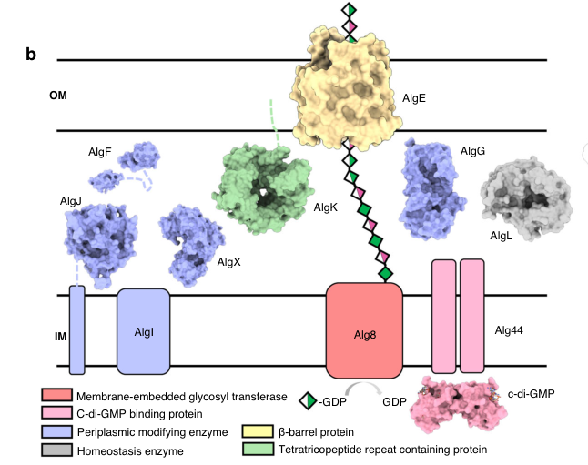

## Question

# Gene Research for Functional Annotation

## ⚠️ CRITICAL: Gene/Protein Identification Context

**BEFORE YOU BEGIN RESEARCH:** You MUST verify you are researching the CORRECT gene/protein. Gene symbols can be ambiguous, especially for less well-characterized genes from non-model organisms.

### Target Gene/Protein Identity (from UniProt):
- **UniProt Accession:** Q88NC8
- **Protein Description:** RecName: Full=Alginate production protein AlgE; Flags: Precursor;
- **Gene Information:** Name=algE; OrderedLocusNames=PP_1284;
- **Organism (full):** Pseudomonas putida (strain ATCC 47054 / DSM 6125 / CFBP 8728 / NCIMB 11950 / KT2440).
- **Protein Family:** Belongs to the AlgE family. .
- **Key Domains:** Alginate_export_dom. (IPR025388); Alginate_Permeability_Chnl. (IPR053728); Alginate_exp (PF13372)

### MANDATORY VERIFICATION STEPS:

1. **Check if the gene symbol "algE" matches the protein description above**
2. **Verify the organism is correct:** Pseudomonas putida (strain ATCC 47054 / DSM 6125 / CFBP 8728 / NCIMB 11950 / KT2440).
3. **Check if protein family/domains align with what you find in literature**
4. **If you find literature for a DIFFERENT gene with the same or similar symbol, STOP**

### If Gene Symbol is Ambiguous or You Cannot Find Relevant Literature:

**DO NOT PROCEED WITH RESEARCH ON A DIFFERENT GENE.** Instead:
- State clearly: "The gene symbol 'algE' is ambiguous or literature is limited for this specific protein"
- Explain what you found (e.g., "Found extensive literature on a different gene with the same symbol in a different organism")
- Describe the protein based ONLY on the UniProt information provided above
- Suggest that the protein function can be inferred from domain/family information

### Research Target:

Please provide a comprehensive research report on the gene **algE** (gene ID: algE, UniProt: Q88NC8) in PSEPK.

The research report should be a detailed narrative explaining the function, biological processes, and localization of the gene product. Citations should be given for all claims.

You should prioritize authoritative reviews and primary scientific literature when conducting research. You can supplement
this with annotations you find in gene/protein databases, but these can be outdated or inaccurate.

We are specifically interested in the primary function of the gene - for enzymes, what reaction is catalyzed, and what is the substrate specificity? For transporters, what is the substrate? For structural proteins or adapters, what is the broader structural role? For signaling molecules, what is the role in the pathway.

We are interested in where in or outside the cell the gene product carries out its function.

We are also interested in the signaling or biochemical pathways in which the gene functions. We are less interested in broad pleiotropic effects, except where these elucidate the precise role.

Include evidence where possible. We are interested in both experimental evidence as well as inference from structure, evolution, or bioinformatic analysis. Precise studies should be prioritized over high-throughput, where available.

## Output

Question: You are an expert researcher providing comprehensive, well-cited information.

Provide detailed information focusing on:
1. Key concepts and definitions with current understanding
2. Recent developments and latest research (prioritize 2023-2024 sources)
3. Current applications and real-world implementations
4. Expert opinions and analysis from authoritative sources
5. Relevant statistics and data from recent studies

Format as a comprehensive research report with proper citations. Include URLs and publication dates where available.
Always prioritize recent, authoritative sources and provide specific citations for all major claims.

# Gene Research for Functional Annotation

## ⚠️ CRITICAL: Gene/Protein Identification Context

**BEFORE YOU BEGIN RESEARCH:** You MUST verify you are researching the CORRECT gene/protein. Gene symbols can be ambiguous, especially for less well-characterized genes from non-model organisms.

### Target Gene/Protein Identity (from UniProt):
- **UniProt Accession:** Q88NC8
- **Protein Description:** RecName: Full=Alginate production protein AlgE; Flags: Precursor;
- **Gene Information:** Name=algE; OrderedLocusNames=PP_1284;
- **Organism (full):** Pseudomonas putida (strain ATCC 47054 / DSM 6125 / CFBP 8728 / NCIMB 11950 / KT2440).
- **Protein Family:** Belongs to the AlgE family. .
- **Key Domains:** Alginate_export_dom. (IPR025388); Alginate_Permeability_Chnl. (IPR053728); Alginate_exp (PF13372)

### MANDATORY VERIFICATION STEPS:

1. **Check if the gene symbol "algE" matches the protein description above**
2. **Verify the organism is correct:** Pseudomonas putida (strain ATCC 47054 / DSM 6125 / CFBP 8728 / NCIMB 11950 / KT2440).
3. **Check if protein family/domains align with what you find in literature**
4. **If you find literature for a DIFFERENT gene with the same or similar symbol, STOP**

### If Gene Symbol is Ambiguous or You Cannot Find Relevant Literature:

**DO NOT PROCEED WITH RESEARCH ON A DIFFERENT GENE.** Instead:
- State clearly: "The gene symbol 'algE' is ambiguous or literature is limited for this specific protein"
- Explain what you found (e.g., "Found extensive literature on a different gene with the same symbol in a different organism")
- Describe the protein based ONLY on the UniProt information provided above
- Suggest that the protein function can be inferred from domain/family information

### Research Target:

Please provide a comprehensive research report on the gene **algE** (gene ID: algE, UniProt: Q88NC8) in PSEPK.

The research report should be a detailed narrative explaining the function, biological processes, and localization of the gene product. Citations should be given for all claims.

You should prioritize authoritative reviews and primary scientific literature when conducting research. You can supplement
this with annotations you find in gene/protein databases, but these can be outdated or inaccurate.

We are specifically interested in the primary function of the gene - for enzymes, what reaction is catalyzed, and what is the substrate specificity? For transporters, what is the substrate? For structural proteins or adapters, what is the broader structural role? For signaling molecules, what is the role in the pathway.

We are interested in where in or outside the cell the gene product carries out its function.

We are also interested in the signaling or biochemical pathways in which the gene functions. We are less interested in broad pleiotropic effects, except where these elucidate the precise role.

Include evidence where possible. We are interested in both experimental evidence as well as inference from structure, evolution, or bioinformatic analysis. Precise studies should be prioritized over high-throughput, where available.

## Research Report: algE (UniProt Q88NC8; PP_1284) — Alginate production protein AlgE in *Pseudomonas putida* KT2440

### Executive summary
The UniProt target (Q88NC8; gene **algE**; locus **PP_1284**) is annotated as an AlgE-family “alginate production protein AlgE” precursor from *Pseudomonas putida* KT2440. In the experimental literature, AlgE is best characterized in *Pseudomonas aeruginosa* as a **substrate-selective, 18-stranded β-barrel outer-membrane porin** that provides the **outer-membrane translocation route for the polyanionic polysaccharide alginate**. Multiple structural and functional studies support a **charge-complementarity mechanism**, **dual-gate control by extracellular loop L2 and periplasmic loop T8**, and incorporation into an **envelope-spanning secretion/modification complex** with AlgK and AlgX. A recent high-impact structural study explicitly models a *P. putida* AlgE ortholog (AlgE\_Pp) within the AlgEKX complex, supporting the interpretation that *P. putida* Q88NC8 encodes the analogous outer-membrane alginate export porin, although accession-level mapping (Q88NC8/PP_1284) is not explicitly stated in the retrieved papers and remains an **inference from orthology/family/domain consistency**. (gheorghita2022structureofthe pages 6-8, gheorghita2023pseudomonasaeruginosabiofilm pages 10-12, whitney2011structuralbasisfor pages 1-3)

### 0) Mandatory gene/protein identity verification (avoid symbol ambiguity)
**Verified concept-level identity:** “algE” in *Pseudomonas* alginate systems refers to the **outer-membrane alginate export porin AlgE**, not to unrelated genes in other organisms. The defining evidence is the solved β-barrel structures and secretion phenotypes in *P. aeruginosa* and cross-species modeling of *P. putida* AlgE within the same export apparatus. (gheorghita2023pseudomonasaeruginosabiofilm pages 10-12, gheorghita2022structureofthe pages 6-8, whitney2011structuralbasisfor pages 1-3)

**Remaining ambiguity (accession-level):** none of the retrieved papers explicitly cite **UniProt Q88NC8** or **PP_1284**; therefore, statements about Q88NC8 specifically are based on the **AlgE family function** and on a paper that explicitly models *P. putida* AlgE in the AlgEKX complex. (gheorghita2022structureofthe pages 6-8)

### 1) Key concepts and definitions (current understanding)

#### 1.1 Alginate (substrate)
Alginate is an anionic exopolysaccharide (EPS) secreted by some Gram-negative bacteria (notably *Pseudomonas*), and its export requires a specialized multi-protein system spanning the cell envelope. Alginate secretion is a key biofilm-associated function in *Pseudomonas* and is closely tied to envelope-spanning biosynthetic complexes. (gheorghita2023pseudomonasaeruginosabiofilm pages 10-12, gheorghita2023pseudomonasaeruginosabiofilm pages 4-5)

#### 1.2 AlgE: alginate outer-membrane export porin
**Definition:** AlgE is an **outer-membrane (OM) β-barrel porin** that forms the **outer-membrane channel for alginate export**. The canonical structural model is a **monomeric 18-stranded antiparallel β-barrel** with an **electropositive pore** suited to translocate a **polyanionic** polymer. (whitney2011structuralbasisfor pages 1-3)

**Key structural features:**
- **Electropositive lumen/constriction** with conserved basic residues that likely confer specificity for alginate. (whitney2011structuralbasisfor pages 1-3)
- **Two gating loops** that occlude the channel in “closed” conformations:
  - **L2** (extracellular gate)
  - **T8** (periplasmic gate)
These loops are central to the modern “double-gate” model of AlgE-mediated secretion. (tan2014aconformationallandscape pages 7-8, whitney2011structuralbasisfor pages 1-3)

#### 1.3 “Synthase-dependent” exopolysaccharide secretion systems
Alginate secretion is part of a broader class of “synthase-dependent” secretion systems in Gram-negative bacteria: a cytoplasmic-membrane (inner membrane) polymerase produces the polymer while a periplasm/outer-membrane apparatus protects, modifies, and exports it. (whitney2013synthasedependentexopolysaccharidesecretion pages 3-4)

### 2) Mechanism and functional annotation of AlgE (with evidence)

#### 2.1 Primary function: outer-membrane translocation of alginate
**Functional role:** AlgE is required for secretion of intact alginate polymer across the outer membrane; loss-of-function leads to failure of polymer export with release of **degradation products (free uronic acids)** rather than intact polymer. (rehman2013dualrolesof pages 1-5, hay2010membranetopologyof pages 1-2)

**Substrate specificity and physicochemical basis:**
- The AlgE pore is an **electropositive conduit** tailored for an anionic substrate, with a narrow constriction (~8 Å in one structural analysis). (whitney2011structuralbasisfor pages 1-3)
- **Alginate-related substrate analogs** affect channel function: in liposome-reconstitution experiments, excess **di-mannuronic acid (MM)** reduced iodide efflux to near background, supporting ligand recognition/selectivity rather than a nonspecific porin function. (whitney2011structuralbasisfor pages 3-4)
- A structural ensemble study identified a **~10 Å electropositive pore** and a bound **citrate** proposed to mimic uronate units, mapping residues (e.g., Lys47, Arg74, Arg353, Arg459) positioned to recognize polyanionic uronates. (tan2014aconformationallandscape pages 7-8)

#### 2.2 Gating mechanism: loops L2 and T8
Structural data support an AlgE “double-gate” model:
- **L2** can block the pore from the extracellular side, and is variably ordered/disordered among crystal structures. (tan2014aconformationallandscape pages 7-8, whitney2011structuralbasisfor pages 1-3)
- **T8** occludes the constriction on the periplasmic side and is implicated as a major conductance regulator; removal of T8 increased halide conductance. (whitney2011structuralbasisfor pages 1-3)

**Quantitative functional evidence:**
- **ΔT8** produced an approximately **threefold increase** in iodide efflux in a reconstituted system, strongly supporting T8 as a gate. (whitney2011structuralbasisfor pages 1-3)
- In vivo complementation results reported partial restoration of secretion with loop deletions: **AlgEΔT8 ~48%** and **AlgEΔL2 ~60%** of wild-type alginate production (in the reported system), consistent with loops having regulatory/structural roles while the barrel remains functional. (whitney2011structuralbasisfor pages 3-4)

#### 2.3 Cellular localization and topology
AlgE is an **outer-membrane** channel protein; topology/structure place both termini on the **periplasmic side**, with multiple extracellular loops and periplasmic turns. (tan2014aconformationallandscape pages 7-8, hay2010membranetopologyof pages 1-2)

#### 2.4 Interaction network and pathway context (Alg8/Alg44/AlgX/AlgK/AlgE)
A contemporary mechanistic model is that alginate synthesis, periplasmic modification, and OM export are coordinated by a **trans-envelope multiprotein factory**. (gheorghita2023pseudomonasaeruginosabiofilm pages 10-12, gheorghita2023pseudomonasaeruginosabiofilm pages 4-5)

**Upstream polymerization/regulation (inner membrane):**
- Alg8 acts as the polymerase and Alg44 (PilZ domain) couples c-di-GMP signaling to activation of polymerization; polymer is translocated into the periplasm after synthesis. (gheorghita2023pseudomonasaeruginosabiofilm pages 4-5)

**Periplasmic modification and protection:**
- AlgI/AlgJ/AlgF with AlgX participate in O-acetylation; AlgL is a lyase that can degrade aberrant polymer. (gheorghita2023pseudomonasaeruginosabiofilm pages 4-5)
- Export failure (e.g., deleting algX/algK in some systems) results in secretion of small degradation products, supporting that a correctly assembled trans-envelope complex prevents periplasmic degradation and enables successful export. (gheorghita2023pseudomonasaeruginosabiofilm pages 4-5)

**Outer membrane export complex:**
- A 2023 authoritative review synthesizes structural and genetic evidence that AlgE’s T8 gate is likely controlled in the secretion context and proposes interaction with the TPR-containing periplasmic lipoprotein **AlgK**; this interaction is proposed to facilitate opening for export. (gheorghita2023pseudomonasaeruginosabiofilm pages 10-12)
- A 2013 mutational/phenotypic study supports a “dual role” for AlgE: secretion pore and a **stabilizing/scaffold component** in a multiprotein secretion complex, because deletion of algE destabilized AlgK and AlgX and reduced Alg44 copy number; chromosomal complementation restored these components. (rehman2013dualrolesof pages 1-5)

### 3) Recent developments and latest research (prioritizing 2023–2024)

#### 3.1 2023: integrated, structure-informed model of alginate export
A 2023 review in *FEMS Microbiology Reviews* highlights major advances in understanding *Pseudomonas* EPS secretion systems, emphasizing that AlgE is an 18-stranded OM β-barrel with an electropositive constriction and that L2/T8 gating and AlgK-associated opening are central to the prevailing model. It also synthesizes modeling/simulation results suggesting AlgE itself does not supply directionality/energy for transport; instead, energy is thought to come primarily from inner-membrane polymerization while AlgE “breathing” may facilitate passage. (gheorghita2023pseudomonasaeruginosabiofilm pages 10-12)

**Publication details:** Gheorghita et al., 2023-10 (Oct 2023), https://doi.org/10.1093/femsre/fuad060 (gheorghita2023pseudomonasaeruginosabiofilm pages 10-12)

#### 3.2 2024: practical strain engineering linked to alginate-associated biofilm traits
Although not directly measuring AlgE function, a 2024 fermentation-focused engineering study in *P. putida* created an engineered strain with deletion of an alginate-pathway gene (**algA**) along with motility/pili genes to reduce biofilm formation (useful in fermentation operations). The triple mutant showed significant biofilm reduction (e.g., **~40% lower biofilm after 72 h**) while maintaining similar growth kinetics, illustrating real-world value in tuning alginate-associated phenotypes for bioprocessing. (frolov2024constructionofthe pages 5-8)

**Publication details:** Frolov et al., 2024-11 (Nov 2024), https://doi.org/10.3390/fermentation10120606 (frolov2024constructionofthe pages 5-8)

#### 3.3 2022–2023: AlgEKX complex structural modeling connecting modification to export (relevant to *P. putida*)
A 2022 *Nature Communications* study provides a detailed structural framework for the **AlgKX complex** and a modeled **AlgEKX** outer-membrane modification/secretion assembly. Importantly for your target, it explicitly includes **structural modeling of *Pseudomonas putida* AlgE (AlgE\_Pp)** and uses this to build a plausible model for the periplasm-to-exterior export trajectory, including an electropositive pore pathway. (gheorghita2022structureofthe pages 6-8)

**Publication details:** Gheorghita et al., 2022-12 (Dec 2022), https://doi.org/10.1038/s41467-022-35131-6 (gheorghita2022structureofthe pages 6-8)

### 4) Current applications and real-world implementations

#### 4.1 Bioprocessing/fermentation: reducing biofilm and foaming in *P. putida*
Biofilm formation is a practical limitation in bioreactors (fouling, mass transfer issues, foam). Engineering *P. putida* strains with reduced alginate-associated biofilm capability can improve fermentation handling. In the 2024 study, the engineered strain maintained OD\_600 while reducing biofilm by **20–30% at 24 h** and up to **40% at 72 h**, supporting utility for fermentation operations. (frolov2024constructionofthe pages 5-8)

#### 4.2 Microbial alginate production: “alginate factories” and exporter localization
Work in nonpathogenic *Pseudomonas fluorescens* has practical relevance for microbial production: AlgE can be visualized by immunogold TEM as part of clustered surface “factories,” and AlgE localization depends on other scaffold proteins. The number of detectable factories did not correlate simply with alginate production, suggesting that precursor supply and cellular physiology can be more limiting than exporter abundance. These insights are directly relevant to strategies that aim to engineer efficient microbial alginate production processes. (maleki2016alginatebiosynthesisfactories pages 1-5, maleki2017newinsightsinto pages 1-2)

### 5) Expert opinions and authoritative synthesis
The strongest authoritative synthesis in the retrieved set (Gheorghita et al., 2023, FEMS Microbiology Reviews) treats AlgE as a canonical outer-membrane β-barrel porin specialized for alginate export, and emphasizes a model in which export is achieved by an **envelope-spanning multiprotein system** with AlgK and AlgX coordinating modification/export and AlgE providing the outer-membrane translocation conduit. (gheorghita2023pseudomonasaeruginosabiofilm pages 10-12)

### 6) Relevant statistics and quantitative findings (from recent and foundational studies)

#### 6.1 Quantitative channel/function measurements (AlgE)
- **Pore size:** ~8 Å narrowest constriction reported for AlgE in one structure analysis; other structural ensemble work reports an electropositive pore around ~10 Å depending on conformation. (whitney2011structuralbasisfor pages 4-5, tan2014aconformationallandscape pages 7-8)
- **Gating functional effect:** ΔT8 increases iodide efflux ~3× in liposome assays. (whitney2011structuralbasisfor pages 1-3)
- **Complementation:** AlgEΔT8 and AlgEΔL2 restored ~48% and ~60% of WT alginate production in vivo in the reported system. (whitney2011structuralbasisfor pages 3-4)

#### 6.2 Quantitative fermentation/biofilm engineering data (*P. putida*, 2024)
- Growth kinetics comparable between WT and engineered strain (final OD\_600 ~2.0; µ ~0.74–0.79 in the reported setup). (frolov2024constructionofthe pages 5-8)
- Biofilm reduction reported as **20–30% lower at 24 h** and up to **40% lower at 72 h** in the triple-deletion strain. (frolov2024constructionofthe pages 5-8)

### 7) Cellular location and pathway placement for functional annotation (for Q88NC8)

#### 7.1 Predicted localization for *P. putida* Q88NC8 (AlgE family)
By family/domain definition and by orthology to experimentally characterized AlgE proteins, Q88NC8 is best annotated as an **outer-membrane β-barrel export porin**, likely with a periplasm-facing interface for interaction with periplasmic scaffold/modification factors. (gheorghita2022structureofthe pages 6-8, whitney2011structuralbasisfor pages 1-3)

#### 7.2 Pathway context
AlgE functions at the final outer-membrane step of alginate secretion, downstream of:
- Inner-membrane polymerization (Alg8/Alg44) (gheorghita2023pseudomonasaeruginosabiofilm pages 4-5)
- Periplasmic modification (AlgI/J/F/X) and processing control (AlgL) (gheorghita2023pseudomonasaeruginosabiofilm pages 4-5)
- Periplasmic/export-scaffold interactions (AlgK, AlgKX/AlgEKX assemblies) (gheorghita2023pseudomonasaeruginosabiofilm pages 10-12, gheorghita2022structureofthe pages 6-8)

### 8) Visual evidence (pathway schematic and complex model)
The following figures provide visual support for the modern mechanistic model of alginate secretion and the proposed AlgEKX outer-membrane complex trajectory:
- Pathway schematic highlighting AlgX/AlgK/AlgE and their placement in the secretion system. (gheorghita2022structureofthe media 4c188b91)
- Structural model/electrostatic surface of AlgEKX with a proposed polymer export trajectory across the OM. (gheorghita2022structureofthe media a87fea0f, gheorghita2022structureofthe media b92364ee)

### 9) Limitations and research gaps specific to *P. putida* Q88NC8
- **Direct experimental characterization in *P. putida* KT2440** (e.g., knockout/phenotype, purified protein structure, conductance assays) was not found in the retrieved corpus; the strongest *P. putida*-specific evidence is structural modeling of a *P. putida* AlgE ortholog within AlgEKX. (gheorghita2022structureofthe pages 6-8)
- **Accession-level mapping**: the retrieved literature does not explicitly cite UniProt Q88NC8 or PP_1284; a robust next step for higher-confidence functional annotation would be to locate genome-annotation papers or database cross-references that explicitly connect PP_1284/Q88NC8 to AlgE\_Pp sequences used in modeling/structural work. (gheorghita2022structureofthe pages 6-8)

### Selected references (URLs and publication dates)
- Gheorghita AA et al. “Pseudomonas aeruginosa biofilm exopolysaccharides: Assembly, function, and degradation.” *FEMS Microbiology Reviews* (Oct 2023). https://doi.org/10.1093/femsre/fuad060 (gheorghita2023pseudomonasaeruginosabiofilm pages 10-12)
- Gheorghita AA et al. “Structure of the AlgKX modification and secretion complex required for alginate production and biofilm attachment in Pseudomonas aeruginosa.” *Nature Communications* (Dec 2022). https://doi.org/10.1038/s41467-022-35131-6 (gheorghita2022structureofthe pages 6-8)
- Whitney JC et al. “Structural basis for alginate secretion across the bacterial outer membrane.” *PNAS* (Jul 2011). https://doi.org/10.1073/pnas.1104984108 (whitney2011structuralbasisfor pages 1-3)
- Tan J et al. “A conformational landscape for alginate secretion across the outer membrane of Pseudomonas aeruginosa.” *Acta Crystallographica D* (Jul 2014). https://doi.org/10.1107/S1399004714001850 (tan2014aconformationallandscape pages 7-8)
- Rehman ZU, Rehm BHA. “Dual Roles of Pseudomonas aeruginosa AlgE in Secretion of the Virulence Factor Alginate and Formation of the Secretion Complex.” *Applied and Environmental Microbiology* (Mar 2013). https://doi.org/10.1128/AEM.03960-12 (rehman2013dualrolesof pages 1-5)
- Frolov M et al. “Construction of the Pseudomonas putida Strain with Low Motility and Reduced Biofilm Formation for Application in Fermentation.” *Fermentation* (Nov 2024). https://doi.org/10.3390/fermentation10120606 (frolov2024constructionofthe pages 5-8)

References

1. (gheorghita2022structureofthe pages 6-8): Andreea A. Gheorghita, Yancheng E. Li, Elena N. Kitova, Duong T. Bui, Roland Pfoh, Kristin E. Low, Gregory B. Whitfield, Marthe T. C. Walvoort, Qingju Zhang, Jeroen D. C. Codée, John S. Klassen, and P. Lynne Howell. Structure of the algkx modification and secretion complex required for alginate production and biofilm attachment in pseudomonas aeruginosa. Nature Communications, Dec 2022. URL: https://doi.org/10.1038/s41467-022-35131-6, doi:10.1038/s41467-022-35131-6. This article has 37 citations and is from a highest quality peer-reviewed journal.

2. (gheorghita2023pseudomonasaeruginosabiofilm pages 10-12): Andreea A Gheorghita, Daniel J Wozniak, Matthew R Parsek, and P Lynne Howell. Pseudomonas aeruginosa biofilm exopolysaccharides: assembly, function, and degradation. FEMS microbiology reviews, Oct 2023. URL: https://doi.org/10.1093/femsre/fuad060, doi:10.1093/femsre/fuad060. This article has 89 citations and is from a domain leading peer-reviewed journal.

3. (whitney2011structuralbasisfor pages 1-3): John C. Whitney, Iain D. Hay, Canhui Li, Paul D. W. Eckford, Howard Robinson, Maria F. Amaya, Lynn F. Wood, Dennis E. Ohman, Christine E. Bear, Bernd H. Rehm, and P. Lynne Howell. Structural basis for alginate secretion across the bacterial outer membrane. Proceedings of the National Academy of Sciences, 108:13083-13088, Jul 2011. URL: https://doi.org/10.1073/pnas.1104984108, doi:10.1073/pnas.1104984108. This article has 126 citations and is from a highest quality peer-reviewed journal.

4. (gheorghita2023pseudomonasaeruginosabiofilm pages 4-5): Andreea A Gheorghita, Daniel J Wozniak, Matthew R Parsek, and P Lynne Howell. Pseudomonas aeruginosa biofilm exopolysaccharides: assembly, function, and degradation. FEMS microbiology reviews, Oct 2023. URL: https://doi.org/10.1093/femsre/fuad060, doi:10.1093/femsre/fuad060. This article has 89 citations and is from a domain leading peer-reviewed journal.

5. (tan2014aconformationallandscape pages 7-8): Jingquan Tan, Sarah L. Rouse, Dianfan Li, Valerie E. Pye, Lutz Vogeley, Alette R. Brinth, Toufic El Arnaout, John C. Whitney, P. Lynne Howell, Mark S. P. Sansom, and Martin Caffrey. A conformational landscape for alginate secretion across the outer membrane of<i>pseudomonas aeruginosa</i>. Acta Crystallographica Section D Biological Crystallography, 70:2054-2068, Jul 2014. URL: https://doi.org/10.1107/s1399004714001850, doi:10.1107/s1399004714001850. This article has 63 citations.

6. (whitney2013synthasedependentexopolysaccharidesecretion pages 3-4): J.C. Whitney and P.L. Howell. Synthase-dependent exopolysaccharide secretion in gram-negative bacteria. Trends in microbiology, 21 2:63-72, Feb 2013. URL: https://doi.org/10.1016/j.tim.2012.10.001, doi:10.1016/j.tim.2012.10.001. This article has 313 citations and is from a domain leading peer-reviewed journal.

7. (rehman2013dualrolesof pages 1-5): Zahid U. Rehman and Bernd H. A. Rehm. Dual roles of pseudomonas aeruginosa alge in secretion of the virulence factor alginate and formation of the secretion complex. Applied and Environmental Microbiology, 79:2002-2011, Mar 2013. URL: https://doi.org/10.1128/aem.03960-12, doi:10.1128/aem.03960-12. This article has 35 citations and is from a peer-reviewed journal.

8. (hay2010membranetopologyof pages 1-2): Iain D. Hay, Zahid U. Rehman, and Bernd H. A. Rehm. Membrane topology of outer membrane protein alge, which is required for alginate production in <i>pseudomonas aeruginosa</i>. Mar 2010. URL: https://doi.org/10.1128/aem.02945-09, doi:10.1128/aem.02945-09. This article has 53 citations and is from a peer-reviewed journal.

9. (whitney2011structuralbasisfor pages 3-4): John C. Whitney, Iain D. Hay, Canhui Li, Paul D. W. Eckford, Howard Robinson, Maria F. Amaya, Lynn F. Wood, Dennis E. Ohman, Christine E. Bear, Bernd H. Rehm, and P. Lynne Howell. Structural basis for alginate secretion across the bacterial outer membrane. Proceedings of the National Academy of Sciences, 108:13083-13088, Jul 2011. URL: https://doi.org/10.1073/pnas.1104984108, doi:10.1073/pnas.1104984108. This article has 126 citations and is from a highest quality peer-reviewed journal.

10. (frolov2024constructionofthe pages 5-8): Mikhail Frolov, Galim Alimzhanovich Kungurov, Emil Elmirovich Valiakhmetov, Artur Sergeyevich Gogov, Natalia Viktorovna Trachtmann, and Shamil Zavdatovich Validov. Construction of the pseudomonas putida strain with low motility and reduced biofilm formation for application in fermentation. Fermentation, 10:606, Nov 2024. URL: https://doi.org/10.3390/fermentation10120606, doi:10.3390/fermentation10120606. This article has 2 citations.

11. (maleki2016alginatebiosynthesisfactories pages 1-5): Susan Maleki, Eivind Almaas, Sergey Zotchev, Svein Valla, and Helga Ertesvåg. Alginate biosynthesis factories in pseudomonas fluorescens: localization and correlation with alginate production level. Applied and Environmental Microbiology, 82:1227-1236, Feb 2016. URL: https://doi.org/10.1128/aem.03114-15, doi:10.1128/aem.03114-15. This article has 53 citations and is from a peer-reviewed journal.

12. (maleki2017newinsightsinto pages 1-2): Susan Maleki, Mali Mærk, Radka Hrudikova, Svein Valla, and Helga Ertesvåg. New insights into pseudomonas fluorescens alginate biosynthesis relevant for the establishment of an efficient production process for microbial alginates. New biotechnology, 37 Pt A:2-8, Jul 2017. URL: https://doi.org/10.1016/j.nbt.2016.08.005, doi:10.1016/j.nbt.2016.08.005. This article has 31 citations and is from a peer-reviewed journal.

13. (whitney2011structuralbasisfor pages 4-5): John C. Whitney, Iain D. Hay, Canhui Li, Paul D. W. Eckford, Howard Robinson, Maria F. Amaya, Lynn F. Wood, Dennis E. Ohman, Christine E. Bear, Bernd H. Rehm, and P. Lynne Howell. Structural basis for alginate secretion across the bacterial outer membrane. Proceedings of the National Academy of Sciences, 108:13083-13088, Jul 2011. URL: https://doi.org/10.1073/pnas.1104984108, doi:10.1073/pnas.1104984108. This article has 126 citations and is from a highest quality peer-reviewed journal.

14. (gheorghita2022structureofthe media 4c188b91): Andreea A. Gheorghita, Yancheng E. Li, Elena N. Kitova, Duong T. Bui, Roland Pfoh, Kristin E. Low, Gregory B. Whitfield, Marthe T. C. Walvoort, Qingju Zhang, Jeroen D. C. Codée, John S. Klassen, and P. Lynne Howell. Structure of the algkx modification and secretion complex required for alginate production and biofilm attachment in pseudomonas aeruginosa. Nature Communications, Dec 2022. URL: https://doi.org/10.1038/s41467-022-35131-6, doi:10.1038/s41467-022-35131-6. This article has 37 citations and is from a highest quality peer-reviewed journal.

15. (gheorghita2022structureofthe media a87fea0f): Andreea A. Gheorghita, Yancheng E. Li, Elena N. Kitova, Duong T. Bui, Roland Pfoh, Kristin E. Low, Gregory B. Whitfield, Marthe T. C. Walvoort, Qingju Zhang, Jeroen D. C. Codée, John S. Klassen, and P. Lynne Howell. Structure of the algkx modification and secretion complex required for alginate production and biofilm attachment in pseudomonas aeruginosa. Nature Communications, Dec 2022. URL: https://doi.org/10.1038/s41467-022-35131-6, doi:10.1038/s41467-022-35131-6. This article has 37 citations and is from a highest quality peer-reviewed journal.

16. (gheorghita2022structureofthe media b92364ee): Andreea A. Gheorghita, Yancheng E. Li, Elena N. Kitova, Duong T. Bui, Roland Pfoh, Kristin E. Low, Gregory B. Whitfield, Marthe T. C. Walvoort, Qingju Zhang, Jeroen D. C. Codée, John S. Klassen, and P. Lynne Howell. Structure of the algkx modification and secretion complex required for alginate production and biofilm attachment in pseudomonas aeruginosa. Nature Communications, Dec 2022. URL: https://doi.org/10.1038/s41467-022-35131-6, doi:10.1038/s41467-022-35131-6. This article has 37 citations and is from a highest quality peer-reviewed journal.

## Artifacts

- [Edison artifact artifact-00](algE-deep-research-falcon_artifacts/artifact-00.md)

## Citations

1. gheorghita2022structureofthe pages 6-8
2. whitney2011structuralbasisfor pages 1-3
3. whitney2013synthasedependentexopolysaccharidesecretion pages 3-4
4. whitney2011structuralbasisfor pages 3-4
5. tan2014aconformationallandscape pages 7-8
6. gheorghita2023pseudomonasaeruginosabiofilm pages 4-5
7. gheorghita2023pseudomonasaeruginosabiofilm pages 10-12
8. rehman2013dualrolesof pages 1-5
9. frolov2024constructionofthe pages 5-8
10. hay2010membranetopologyof pages 1-2
11. maleki2016alginatebiosynthesisfactories pages 1-5
12. maleki2017newinsightsinto pages 1-2
13. whitney2011structuralbasisfor pages 4-5
14. https://doi.org/10.1093/femsre/fuad060
15. https://doi.org/10.3390/fermentation10120606
16. https://doi.org/10.1038/s41467-022-35131-6
17. https://doi.org/10.1073/pnas.1104984108
18. https://doi.org/10.1107/S1399004714001850
19. https://doi.org/10.1128/AEM.03960-12
20. https://doi.org/10.1038/s41467-022-35131-6,
21. https://doi.org/10.1093/femsre/fuad060,
22. https://doi.org/10.1073/pnas.1104984108,
23. https://doi.org/10.1107/s1399004714001850,
24. https://doi.org/10.1016/j.tim.2012.10.001,
25. https://doi.org/10.1128/aem.03960-12,
26. https://doi.org/10.1128/aem.02945-09,
27. https://doi.org/10.3390/fermentation10120606,
28. https://doi.org/10.1128/aem.03114-15,
29. https://doi.org/10.1016/j.nbt.2016.08.005,