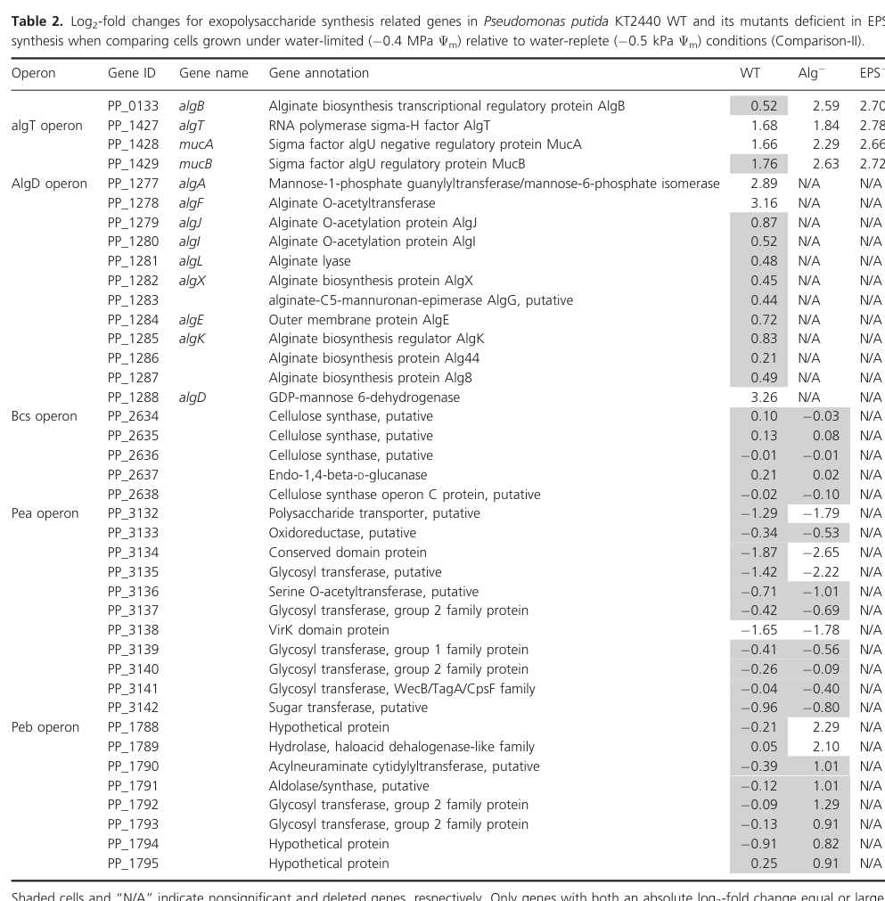

## Question

# Gene Research for Functional Annotation

## ⚠️ CRITICAL: Gene/Protein Identification Context

**BEFORE YOU BEGIN RESEARCH:** You MUST verify you are researching the CORRECT gene/protein. Gene symbols can be ambiguous, especially for less well-characterized genes from non-model organisms.

### Target Gene/Protein Identity (from UniProt):
- **UniProt Accession:** Q88ND4
- **Protein Description:** RecName: Full=Alginate biosynthesis protein AlgF; Flags: Precursor;
- **Gene Information:** Name=algF; OrderedLocusNames=PP_1278;
- **Organism (full):** Pseudomonas putida (strain ATCC 47054 / DSM 6125 / CFBP 8728 / NCIMB 11950 / KT2440).
- **Protein Family:** Belongs to the AlgF family. .
- **Key Domains:** AlgF. (IPR035422); AlgF (PF11182)

### MANDATORY VERIFICATION STEPS:

1. **Check if the gene symbol "algF" matches the protein description above**
2. **Verify the organism is correct:** Pseudomonas putida (strain ATCC 47054 / DSM 6125 / CFBP 8728 / NCIMB 11950 / KT2440).
3. **Check if protein family/domains align with what you find in literature**
4. **If you find literature for a DIFFERENT gene with the same or similar symbol, STOP**

### If Gene Symbol is Ambiguous or You Cannot Find Relevant Literature:

**DO NOT PROCEED WITH RESEARCH ON A DIFFERENT GENE.** Instead:
- State clearly: "The gene symbol 'algF' is ambiguous or literature is limited for this specific protein"
- Explain what you found (e.g., "Found extensive literature on a different gene with the same symbol in a different organism")
- Describe the protein based ONLY on the UniProt information provided above
- Suggest that the protein function can be inferred from domain/family information

### Research Target:

Please provide a comprehensive research report on the gene **algF** (gene ID: algF, UniProt: Q88ND4) in PSEPK.

The research report should be a detailed narrative explaining the function, biological processes, and localization of the gene product. Citations should be given for all claims.

You should prioritize authoritative reviews and primary scientific literature when conducting research. You can supplement
this with annotations you find in gene/protein databases, but these can be outdated or inaccurate.

We are specifically interested in the primary function of the gene - for enzymes, what reaction is catalyzed, and what is the substrate specificity? For transporters, what is the substrate? For structural proteins or adapters, what is the broader structural role? For signaling molecules, what is the role in the pathway.

We are interested in where in or outside the cell the gene product carries out its function.

We are also interested in the signaling or biochemical pathways in which the gene functions. We are less interested in broad pleiotropic effects, except where these elucidate the precise role.

Include evidence where possible. We are interested in both experimental evidence as well as inference from structure, evolution, or bioinformatic analysis. Precise studies should be prioritized over high-throughput, where available.

## Output

Question: You are an expert researcher providing comprehensive, well-cited information.

Provide detailed information focusing on:
1. Key concepts and definitions with current understanding
2. Recent developments and latest research (prioritize 2023-2024 sources)
3. Current applications and real-world implementations
4. Expert opinions and analysis from authoritative sources
5. Relevant statistics and data from recent studies

Format as a comprehensive research report with proper citations. Include URLs and publication dates where available.
Always prioritize recent, authoritative sources and provide specific citations for all major claims.

# Gene Research for Functional Annotation

## ⚠️ CRITICAL: Gene/Protein Identification Context

**BEFORE YOU BEGIN RESEARCH:** You MUST verify you are researching the CORRECT gene/protein. Gene symbols can be ambiguous, especially for less well-characterized genes from non-model organisms.

### Target Gene/Protein Identity (from UniProt):
- **UniProt Accession:** Q88ND4
- **Protein Description:** RecName: Full=Alginate biosynthesis protein AlgF; Flags: Precursor;
- **Gene Information:** Name=algF; OrderedLocusNames=PP_1278;
- **Organism (full):** Pseudomonas putida (strain ATCC 47054 / DSM 6125 / CFBP 8728 / NCIMB 11950 / KT2440).
- **Protein Family:** Belongs to the AlgF family. .
- **Key Domains:** AlgF. (IPR035422); AlgF (PF11182)

### MANDATORY VERIFICATION STEPS:

1. **Check if the gene symbol "algF" matches the protein description above**
2. **Verify the organism is correct:** Pseudomonas putida (strain ATCC 47054 / DSM 6125 / CFBP 8728 / NCIMB 11950 / KT2440).
3. **Check if protein family/domains align with what you find in literature**
4. **If you find literature for a DIFFERENT gene with the same or similar symbol, STOP**

### If Gene Symbol is Ambiguous or You Cannot Find Relevant Literature:

**DO NOT PROCEED WITH RESEARCH ON A DIFFERENT GENE.** Instead:
- State clearly: "The gene symbol 'algF' is ambiguous or literature is limited for this specific protein"
- Explain what you found (e.g., "Found extensive literature on a different gene with the same symbol in a different organism")
- Describe the protein based ONLY on the UniProt information provided above
- Suggest that the protein function can be inferred from domain/family information

### Research Target:

Please provide a comprehensive research report on the gene **algF** (gene ID: algF, UniProt: Q88ND4) in PSEPK.

The research report should be a detailed narrative explaining the function, biological processes, and localization of the gene product. Citations should be given for all claims.

You should prioritize authoritative reviews and primary scientific literature when conducting research. You can supplement
this with annotations you find in gene/protein databases, but these can be outdated or inaccurate.

We are specifically interested in the primary function of the gene - for enzymes, what reaction is catalyzed, and what is the substrate specificity? For transporters, what is the substrate? For structural proteins or adapters, what is the broader structural role? For signaling molecules, what is the role in the pathway.

We are interested in where in or outside the cell the gene product carries out its function.

We are also interested in the signaling or biochemical pathways in which the gene functions. We are less interested in broad pleiotropic effects, except where these elucidate the precise role.

Include evidence where possible. We are interested in both experimental evidence as well as inference from structure, evolution, or bioinformatic analysis. Precise studies should be prioritized over high-throughput, where available.

## Research report: Functional annotation of **algF** (UniProt **Q88ND4**, locus **PP_1278**) in *Pseudomonas putida* KT2440

### 0) Target verification (mandatory)
The requested target is **Alginate biosynthesis protein AlgF (precursor)** encoded by **algF**, locus **PP_1278**, in *Pseudomonas putida* strain **KT2440** (UniProt Q88ND4). A KT2440 transcriptomics study explicitly lists **PP_1278 = algF** within the **AlgD operon** and annotates it as an **alginate O-acetylation gene (“Alginate O-acetyltransferase”)**, confirming that the literature being summarized here is aligned with the specified protein identity and organism context (gulez2014colonymorphologyand pages 6-8).

### 1) Key concepts and current understanding

#### 1.1 Alginate in pseudomonads
Alginate is an exopolysaccharide (EPS) produced by various *Pseudomonas* species and is widely associated with hydrated biofilms and stress tolerance in environmental and clinical contexts (gulez2014colonymorphologyand pages 6-8, hulen2023thegdpmannosedehydrogenase pages 1-3). In *P. putida* KT2440 specifically, alginate is described as an important EPS under water limitation, and alginate-pathway genes show coordinated induction under water-limited conditions (gulez2014colonymorphologyand pages 6-8).

#### 1.2 What AlgF does (functional definition)
Across pseudomonads, **AlgF is part of the alginate O-acetylation machinery**, working with **AlgI** and **AlgJ**.

* **Biochemical role (polymer modification):** A canonical model summarized in an authoritative review describes an **AlgI/AlgJ/AlgF acetylase system** responsible for **partial O-acetylation of polymeric mannuronic acid residues**, specifically at the **O-2 and/or O-3 positions**, as a **post-polymerization modification** step in alginate biosynthesis (muhammadi2007geneticsofbacterial pages 5-7).
* **Localization (cellular compartment):** The same pathway model describes **AlgF as a periplasmic protein**, with AlgI and AlgJ being membrane-associated components; O-acetylation is described as occurring **associated with the inner membrane or in the periplasm** after polymerization (muhammadi2007geneticsofbacterial pages 5-7).

Importantly, in the retrieved KT2440-specific literature, AlgF’s role is supported directly by operon context and condition-dependent expression, while the detailed mechanistic/biochemical function and localization are inferred from conserved pseudomonad models (gulez2014colonymorphologyand pages 6-8, muhammadi2007geneticsofbacterial pages 5-7).

### 2) Evidence specific to *Pseudomonas putida* KT2440 algF (PP_1278; UniProt Q88ND4)

#### 2.1 Genomic/pathway context: AlgD operon membership
In KT2440, algF (PP_1278) is listed in the **AlgD operon** alongside other alginate biosynthesis/export/modification genes: **algA (PP_1277), algJ (PP_1279), algI (PP_1280), algL (PP_1281), algX (PP_1282), algG (PP_1283), algE (PP_1284), algK (PP_1285), alg44 (PP_1286), alg8 (PP_1287), and algD (PP_1288)** (gulez2014colonymorphologyand pages 6-8). This operon placement strongly supports AlgF’s primary biological role as an **alginate-envelope biogenesis/modification component** rather than a general metabolic enzyme (gulez2014colonymorphologyand pages 6-8).

#### 2.2 Condition-specific regulation: induction under water limitation
A controlled matric-potential study in KT2440 quantified expression changes between water-limited (−0.4 MPa) and water-replete conditions. Under water limitation, **algF (PP_1278) was strongly upregulated in wild-type KT2440 (log2 fold-change 3.16)**, consistent with activation of the alginate program (gulez2014colonymorphologyand pages 6-8). In alginate-deficient and EPS-deficient mutants (constructed by deleting alginate synthesis capacity), **algF expression was not detected (N/A)**, consistent with loss of alginate-operon expression in those mutants (gulez2014colonymorphologyand pages 6-8).

### 3) Subcellular localization and mechanism (best-supported model)

#### 3.1 Localization of AlgF-family proteins (inferred for KT2440)
An authoritative alginate genetics review states that **algF encodes a periplasmic protein** and that AlgF functions together with AlgI and AlgJ as an acetylation system, placing activity at the **cell envelope (inner membrane/periplasm)** rather than in the cytosol (muhammadi2007geneticsofbacterial pages 5-7). While this evidence is not KT2440-specific, the KT2440 operon context and co-expression with other envelope-localized alginate genes (e.g., algE, algK) are consistent with the conserved envelope-localized biosynthesis/export model (gulez2014colonymorphologyand pages 6-8).

#### 3.2 Biochemical role and “substrate specificity” framing
AlgF is not described as a stand-alone cytosolic enzyme with a classic small-molecule substrate. Instead, the dominant model is that AlgF contributes to a **multi-protein acetylation machinery** that modifies **the alginate polymer** (polymeric mannuronic acid residues) via **O-acetylation at O-2/O-3** (muhammadi2007geneticsofbacterial pages 5-7). Thus, the most appropriate “substrate specificity” statement for functional annotation is:

*Substrate:* polymeric mannuronic acid residues within the alginate chain (polymannuronate segments)

*Reaction type:* partial O-acetylation at O-2 and/or O-3 positions

*Cellular location:* periplasm / inner-membrane-associated envelope compartment

(muhammadi2007geneticsofbacterial pages 5-7).

### 4) Recent developments (prioritizing 2023–2024)

#### 4.1 2023 review reaffirming periplasmic acetylation by AlgI/AlgJ/AlgF
A 2023 review of alginate biosynthesis in *P. aeruginosa* (a major reference organism for the pathway) explicitly states that **“Acetylation and epimerization steps take place in the periplasm under the concerted action of AlgI, AlgJ and AlgF for O-acetylation and AlgG to epimerization”** (published Nov 2023; URL: https://doi.org/10.3390/antibiotics12121649) (hulen2023thegdpmannosedehydrogenase pages 1-3). Although this is not KT2440-specific, it is a recent authoritative statement that the field still treats AlgF as a periplasmic O-acetylation component.

#### 4.2 2024 physiological context in KT2440: aggregation/biofilms and polymers including alginate
A 2024 chemostat study in *P. putida* KT2440 reports that under fast dilution rates, KT2440 forms aggregates and biofilms, and notes that KT2440 can form biofilms via synthesis/export of polymers “including **alginate**” (published Aug 2024; URL: https://doi.org/10.1128/msystems.00770-24) (peoples2024physiologyfastand pages 9-12, peoples2024physiologyfastand pages 1-2). Quantitatively, the study contrasts dilution rates **0.12 h−1** and **0.48 h−1**, with aggregation prominent at the faster regime (peoples2024physiologyfastand pages 4-6, peoples2024physiologyfastand pages 1-2).

### 5) Current applications and real-world implementations relevant to alginate/alg genes

#### 5.1 Fermentation/bioprocessing: engineering *P. putida* to reduce alginate-linked biofilm formation
A 2024 applied fermentation study engineered *P. putida* (strain PCL1760; not KT2440) by deleting **algA** (involved in alginate accumulation) along with motility/adhesion genes, aiming to reduce biofilm formation in bioreactors (published Nov 2024; URL: https://doi.org/10.3390/fermentation10120606) (frolov2024constructionofthe pages 1-2). The engineered strain showed **~40% lower biofilm formation after 72 h**, and achieved higher cell densities in small-volume bioreactors (e.g., **1.39×10^10 CFU/mL** vs **6.4×10^9 CFU/mL** in rich medium; and **6.11×10^9 CFU/mL** vs **1.36×10^9 CFU/mL** in mineral medium) (frolov2024constructionofthe pages 1-2, frolov2024constructionofthe pages 8-10). This illustrates a practical industry-relevant theme: alginate-pathway activity can be undesirable in fermentation due to biofilm/foam, motivating genetic strategies that reduce alginate accumulation.

Although this study does not target algF directly, it underscores the applied importance of the alginate pathway that algF belongs to, and provides quantitative, real-world bioreactor metrics (frolov2024constructionofthe pages 1-2, frolov2024constructionofthe pages 8-10).

### 6) Quantitative statistics and data highlights (recent and KT2440-specific where available)

* **KT2440 water limitation response:** algF (PP_1278) log2FC **3.16** under −0.4 MPa vs water-replete conditions; algD log2FC **3.26**; algA log2FC **2.89** (Gulez et al., Jun 2014; URL: https://doi.org/10.1002/mbo3.180) (gulez2014colonymorphologyand pages 6-8, gulez2014colonymorphologyand media e22076d1).
* **KT2440 chemostat aggregation thresholds:** aggregation/flocculation observed at dilution rates exceeding **0.3 h−1**, with experiments comparing **0.12 h−1** vs **0.48 h−1** (Peoples et al., Aug 2024; URL: https://doi.org/10.1128/msystems.00770-24) (peoples2024physiologyfastand pages 2-4, peoples2024physiologyfastand pages 1-2).
* **Applied fermentation biofilm reduction (non-KT2440 strain):** ~**40%** biofilm reduction after 72 h; improved CFU/mL as above (Frolov et al., Nov 2024; URL: https://doi.org/10.3390/fermentation10120606) (frolov2024constructionofthe pages 1-2, frolov2024constructionofthe pages 8-10).

### 7) Expert synthesis and evidence-weighted functional annotation for Q88ND4 (PP_1278)

**Most defensible primary function (high confidence):** AlgF (PP_1278/Q88ND4) is an **alginate biosynthesis accessory protein involved in alginate O-acetylation** as part of a **cell-envelope (periplasm/inner-membrane-associated) modification machinery** together with AlgI and AlgJ (gulez2014colonymorphologyand pages 6-8, muhammadi2007geneticsofbacterial pages 5-7, hulen2023thegdpmannosedehydrogenase pages 1-3).

**Biological process/pathway placement:** AlgF functions within the **AlgD operon** alginate biosynthesis/export/modification pathway, and is co-regulated with core alginate genes during water limitation in KT2440 (gulez2014colonymorphologyand pages 6-8).

**Subcellular localization (best-supported model; inferred for KT2440):** Periplasmic component of the acetylation machinery; overall pathway is an envelope-localized, multi-protein system modifying/exporting a polymer (muhammadi2007geneticsofbacterial pages 5-7).

**Major evidence gap:** Within the retrieved corpus, there is **no direct KT2440-specific biochemical assay** of PP_1278 activity and **no KT2440-specific localization experiment** for AlgF. Thus, mechanistic statements are strongest at the level of **conserved pseudomonad pathway models** and KT2440 operon/expression context (gulez2014colonymorphologyand pages 6-8, muhammadi2007geneticsofbacterial pages 5-7).

### Evidence summary table
The following table consolidates claims, sources, publication dates, URLs, and evidence strength for KT2440 algF functional annotation.

| Claim/Aspect | Key finding | Organism/strain | Source (author year) | Publication date/month | URL | Evidence strength/notes | Citation ID |
|---|---|---|---|---|---|---|---|
| Gene identity / operon context | **algF = PP_1278** in the **AlgD operon** of *Pseudomonas putida* KT2440; listed between **algA (PP_1277)** and **algJ (PP_1279)** and annotated as **Alginate O-acetyltransferase**. This matches the target UniProt entry Q88ND4 for AlgF family protein in KT2440. | *Pseudomonas putida* KT2440 | Gulez et al. 2014 | 2014 Jun | https://doi.org/10.1002/mbo3.180 | **Direct strain-specific evidence** from KT2440 transcriptomics table; strongest evidence for correct gene identification in the requested organism. | (gulez2014colonymorphologyand pages 6-8) |
| Biochemical role | AlgF is associated with **alginate O-acetylation**; reviews place **AlgI, AlgJ, and AlgF** together in the machinery that modifies alginate. | Mainly *Pseudomonas* spp.; pathway model derived largely from *P. aeruginosa* and related species | Muhammadi & Ahmed 2007 | 2007 May | https://doi.org/10.2174/138920207780833810 | **Indirect for KT2440** but authoritative pathway review; supports assignment of AlgF as an acetylation-related protein/family member. | (muhammadi2007geneticsofbacterial pages 2-3) |
| Localization | AlgF is described as a **periplasmic protein**; in the canonical model, **AlgI** is a multispanning inner-membrane protein, **AlgJ** a membrane-associated protein, and **AlgF** a periplasmic component of the O-acetylation system. | General *Pseudomonas* alginate pathway | Muhammadi & Ahmed 2007 | 2007 May | https://doi.org/10.2174/138920207780833810 | **Indirect inference for PP_1278/Q88ND4**; no KT2440-specific localization experiment found in retrieved sources, but this is the standard literature model. | (muhammadi2007geneticsofbacterial pages 5-7) |
| Pathway step | O-acetylation is a **post-polymerization modification** of alginate, acting on polymeric mannuronic acid residues at **O-2 and/or O-3** after polymer formation/export begins. | General *Pseudomonas* alginate pathway | Muhammadi & Ahmed 2007 | 2007 May | https://doi.org/10.2174/138920207780833810 | **Indirect for KT2440**; useful for functional annotation because it defines the precise biosynthetic stage in which AlgF acts. | (muhammadi2007geneticsofbacterial pages 5-7) |
| Current understanding / recent review | A recent review states that **“Acetylation and epimerization steps take place in the periplasm under the concerted action of AlgI, AlgJ and AlgF for O-acetylation and AlgG for epimerization.”** | *Pseudomonas aeruginosa* pathway review, broadly relevant to pseudomonal alginate systems | Hulen 2023 | 2023 Nov | https://doi.org/10.3390/antibiotics12121649 | **Recent authoritative secondary source**; not KT2440-specific, but confirms that the field still views AlgF as part of the periplasmic O-acetylation machinery. | (hulen2023thegdpmannosedehydrogenase pages 1-3) |
| Additional pathway context | AlgI/AlgJ/AlgF (often with AlgX) are needed to **O-acetylate mannuronic acid residues**, while AlgG epimerizes residues and AlgK/AlgE participate in export-associated complexes. | Engineered *Pseudomonas fluorescens* SBW25 derivative | Ertesvåg et al. 2017 | 2017 Jan | https://doi.org/10.1186/s12864-016-3467-7 | **Comparative evidence** from another pseudomonad; supports conserved functional assignment of AlgF-family proteins in alginate biosynthesis/export-modification systems. | (ertesvag2017identificationofgenes pages 1-2) |
| Regulation / condition-specific expression | In KT2440 under **water-limited conditions** (−0.4 MPa vs water-replete), **algF expression increased strongly (log2 fold change 3.16)** in wild type, whereas expression was **not detected** in alginate-deficient and EPS-deficient mutants lacking alginate synthesis capacity. | *Pseudomonas putida* KT2440 | Gulez et al. 2014 | 2014 Jun | https://doi.org/10.1002/mbo3.180 | **Direct quantitative strain-specific evidence** linking algF to alginate-associated stress response and EPS physiology. | (gulez2014colonymorphologyand pages 6-8, gulez2014colonymorphologyand media e22076d1) |
| Biological process relevance | The KT2440 study supports alginate as the **primary EPS under water limitation**, placing algF induction within a broader dehydration-adaptation response. | *Pseudomonas putida* KT2440 | Gulez et al. 2014 | 2014 Jun | https://doi.org/10.1002/mbo3.180 | **Direct organism-specific physiological context**; does not isolate AlgF biochemistry, but strengthens annotation of algF as part of the water-stress alginate program. | (gulez2014colonymorphologyand pages 6-8) |
| Evidence type / confidence summary | For **Q88ND4/PP_1278**, the **best direct evidence** is operon placement and stress-responsive expression in KT2440; **biochemical function and localization** are supported mainly by **cross-species pseudomonal literature and reviews**, not by a dedicated KT2440 biochemical study in the retrieved corpus. | *Pseudomonas putida* KT2440 plus comparative pseudomonads | Synthesized from retrieved sources | 2007–2023 | https://doi.org/10.1002/mbo3.180 ; https://doi.org/10.2174/138920207780833810 ; https://doi.org/10.3390/antibiotics12121649 ; https://doi.org/10.1186/s12864-016-3467-7 | Important caveat for annotation: **function is high-confidence by homology/pathway conservation**, but **direct enzymology for PP_1278 specifically appears limited** in the retrieved literature. | (gulez2014colonymorphologyand pages 6-8, muhammadi2007geneticsofbacterial pages 5-7, ertesvag2017identificationofgenes pages 1-2, hulen2023thegdpmannosedehydrogenase pages 1-3) |

*Table: This table summarizes the most relevant functional annotation evidence for *Pseudomonas putida* KT2440 algF (PP_1278; UniProt Q88ND4), including direct strain-specific data and cross-species pathway evidence. It helps distinguish what is experimentally shown in KT2440 from what is inferred from broader pseudomonal alginate biosynthesis literature.*

### Visual evidence (from KT2440 transcriptomics)
The KT2440 Table 2 and interaction-network figure extracted from Gulez et al. (2014) visually document that **algF (PP_1278)** is part of the AlgD operon and is strongly induced under water limitation (gulez2014colonymorphologyand media e22076d1, gulez2014colonymorphologyand media 8a64e7b2).

### Key sources (with publication dates and URLs)
1. Gulez G, et al. **MicrobiologyOpen** (Jun **2014**). “Colony morphology and transcriptome profiling…” https://doi.org/10.1002/mbo3.180 (gulez2014colonymorphologyand pages 6-8)
2. Muhammadi & Ahmed. **Current Genomics** (May **2007**). “Genetics of Bacterial Alginate…” https://doi.org/10.2174/138920207780833810 (muhammadi2007geneticsofbacterial pages 5-7)
3. Hulen C. **Antibiotics** (Nov **2023**). “The GDP-Mannose Dehydrogenase…” https://doi.org/10.3390/antibiotics12121649 (hulen2023thegdpmannosedehydrogenase pages 1-3)
4. Peoples LM, et al. **mSystems** (Aug **2024**). “Physiology, fast and slow…” https://doi.org/10.1128/msystems.00770-24 (peoples2024physiologyfastand pages 1-2)
5. Frolov M, et al. **Fermentation** (Nov **2024**). “Construction of the Pseudomonas putida Strain…” https://doi.org/10.3390/fermentation10120606 (frolov2024constructionofthe pages 1-2)

References

1. (gulez2014colonymorphologyand pages 6-8): Gamze Gulez, Ali Altıntaş, Mustafa Fazli, Arnaud Dechesne, Christopher T. Workman, Tim Tolker‐Nielsen, and Barth F. Smets. Colony morphology and transcriptome profiling of pseudomonas putida kt2440 and its mutants deficient in alginate or all eps synthesis under controlled matric potentials. MicrobiologyOpen, 3:457-469, Jun 2014. URL: https://doi.org/10.1002/mbo3.180, doi:10.1002/mbo3.180. This article has 33 citations and is from a peer-reviewed journal.

2. (hulen2023thegdpmannosedehydrogenase pages 1-3): Christian Hulen. The gdp-mannose dehydrogenase of pseudomonas aeruginosa: an old and new target to fight against antibiotics resistance of mucoid strains. Antibiotics, 12:1649, Nov 2023. URL: https://doi.org/10.3390/antibiotics12121649, doi:10.3390/antibiotics12121649. This article has 9 citations.

3. (muhammadi2007geneticsofbacterial pages 5-7): Muhammadi and Nuzhat Ahmed. Genetics of bacterial alginate: alginate genes distribution, organization and biosynthesis in bacteria. Current Genomics, 8:191-202, May 2007. URL: https://doi.org/10.2174/138920207780833810, doi:10.2174/138920207780833810. This article has 79 citations and is from a peer-reviewed journal.

4. (peoples2024physiologyfastand pages 9-12): Logan M. Peoples, Jana Isanta-Navarro, Benedicta Bras, Brian K. Hand, Frank Rosenzweig, James J. Elser, and Matthew J. Church. Physiology, fast and slow: bacterial response to variable resource stoichiometry and dilution rate. Aug 2024. URL: https://doi.org/10.1128/msystems.00770-24, doi:10.1128/msystems.00770-24. This article has 0 citations and is from a peer-reviewed journal.

5. (peoples2024physiologyfastand pages 1-2): Logan M. Peoples, Jana Isanta-Navarro, Benedicta Bras, Brian K. Hand, Frank Rosenzweig, James J. Elser, and Matthew J. Church. Physiology, fast and slow: bacterial response to variable resource stoichiometry and dilution rate. Aug 2024. URL: https://doi.org/10.1128/msystems.00770-24, doi:10.1128/msystems.00770-24. This article has 0 citations and is from a peer-reviewed journal.

6. (peoples2024physiologyfastand pages 4-6): Logan M. Peoples, Jana Isanta-Navarro, Benedicta Bras, Brian K. Hand, Frank Rosenzweig, James J. Elser, and Matthew J. Church. Physiology, fast and slow: bacterial response to variable resource stoichiometry and dilution rate. Aug 2024. URL: https://doi.org/10.1128/msystems.00770-24, doi:10.1128/msystems.00770-24. This article has 0 citations and is from a peer-reviewed journal.

7. (frolov2024constructionofthe pages 1-2): Mikhail Frolov, Galim Alimzhanovich Kungurov, Emil Elmirovich Valiakhmetov, Artur Sergeyevich Gogov, Natalia Viktorovna Trachtmann, and Shamil Zavdatovich Validov. Construction of the pseudomonas putida strain with low motility and reduced biofilm formation for application in fermentation. Fermentation, 10:606, Nov 2024. URL: https://doi.org/10.3390/fermentation10120606, doi:10.3390/fermentation10120606. This article has 2 citations.

8. (frolov2024constructionofthe pages 8-10): Mikhail Frolov, Galim Alimzhanovich Kungurov, Emil Elmirovich Valiakhmetov, Artur Sergeyevich Gogov, Natalia Viktorovna Trachtmann, and Shamil Zavdatovich Validov. Construction of the pseudomonas putida strain with low motility and reduced biofilm formation for application in fermentation. Fermentation, 10:606, Nov 2024. URL: https://doi.org/10.3390/fermentation10120606, doi:10.3390/fermentation10120606. This article has 2 citations.

9. (gulez2014colonymorphologyand media e22076d1): Gamze Gulez, Ali Altıntaş, Mustafa Fazli, Arnaud Dechesne, Christopher T. Workman, Tim Tolker‐Nielsen, and Barth F. Smets. Colony morphology and transcriptome profiling of pseudomonas putida kt2440 and its mutants deficient in alginate or all eps synthesis under controlled matric potentials. MicrobiologyOpen, 3:457-469, Jun 2014. URL: https://doi.org/10.1002/mbo3.180, doi:10.1002/mbo3.180. This article has 33 citations and is from a peer-reviewed journal.

10. (peoples2024physiologyfastand pages 2-4): Logan M. Peoples, Jana Isanta-Navarro, Benedicta Bras, Brian K. Hand, Frank Rosenzweig, James J. Elser, and Matthew J. Church. Physiology, fast and slow: bacterial response to variable resource stoichiometry and dilution rate. Aug 2024. URL: https://doi.org/10.1128/msystems.00770-24, doi:10.1128/msystems.00770-24. This article has 0 citations and is from a peer-reviewed journal.

11. (muhammadi2007geneticsofbacterial pages 2-3): Muhammadi and Nuzhat Ahmed. Genetics of bacterial alginate: alginate genes distribution, organization and biosynthesis in bacteria. Current Genomics, 8:191-202, May 2007. URL: https://doi.org/10.2174/138920207780833810, doi:10.2174/138920207780833810. This article has 79 citations and is from a peer-reviewed journal.

12. (ertesvag2017identificationofgenes pages 1-2): Helga Ertesvåg, Håvard Sletta, Mona Senneset, Yi-Qian Sun, Geir Klinkenberg, Therese Aursand Konradsen, Trond E. Ellingsen, and Svein Valla. Identification of genes affecting alginate biosynthesis in pseudomonas fluorescens by screening a transposon insertion library. BMC Genomics, Jan 2017. URL: https://doi.org/10.1186/s12864-016-3467-7, doi:10.1186/s12864-016-3467-7. This article has 34 citations and is from a peer-reviewed journal.

13. (gulez2014colonymorphologyand media 8a64e7b2): Gamze Gulez, Ali Altıntaş, Mustafa Fazli, Arnaud Dechesne, Christopher T. Workman, Tim Tolker‐Nielsen, and Barth F. Smets. Colony morphology and transcriptome profiling of pseudomonas putida kt2440 and its mutants deficient in alginate or all eps synthesis under controlled matric potentials. MicrobiologyOpen, 3:457-469, Jun 2014. URL: https://doi.org/10.1002/mbo3.180, doi:10.1002/mbo3.180. This article has 33 citations and is from a peer-reviewed journal.

## Artifacts

- [Edison artifact artifact-00](algF-deep-research-falcon_artifacts/artifact-00.md)

## Citations

1. gulez2014colonymorphologyand pages 6-8
2. muhammadi2007geneticsofbacterial pages 5-7
3. hulen2023thegdpmannosedehydrogenase pages 1-3
4. frolov2024constructionofthe pages 1-2
5. muhammadi2007geneticsofbacterial pages 2-3
6. ertesvag2017identificationofgenes pages 1-2
7. peoples2024physiologyfastand pages 1-2
8. peoples2024physiologyfastand pages 9-12
9. peoples2024physiologyfastand pages 4-6
10. frolov2024constructionofthe pages 8-10
11. peoples2024physiologyfastand pages 2-4
12. https://doi.org/10.3390/antibiotics12121649
13. https://doi.org/10.1128/msystems.00770-24
14. https://doi.org/10.3390/fermentation10120606
15. https://doi.org/10.1002/mbo3.180
16. https://doi.org/10.2174/138920207780833810
17. https://doi.org/10.1186/s12864-016-3467-7
18. https://doi.org/10.1002/mbo3.180,
19. https://doi.org/10.3390/antibiotics12121649,
20. https://doi.org/10.2174/138920207780833810,
21. https://doi.org/10.1128/msystems.00770-24,
22. https://doi.org/10.3390/fermentation10120606,
23. https://doi.org/10.1186/s12864-016-3467-7,