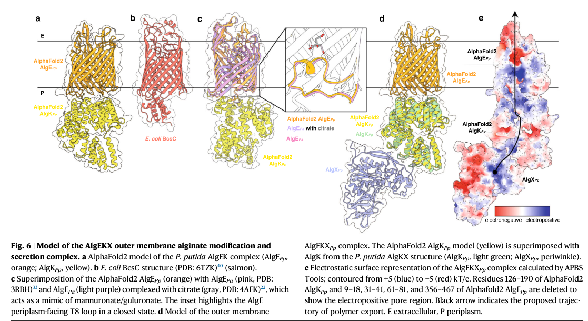

## Question

# Gene Research for Functional Annotation

## ⚠️ CRITICAL: Gene/Protein Identification Context

**BEFORE YOU BEGIN RESEARCH:** You MUST verify you are researching the CORRECT gene/protein. Gene symbols can be ambiguous, especially for less well-characterized genes from non-model organisms.

### Target Gene/Protein Identity (from UniProt):
- **UniProt Accession:** Q88NC7
- **Protein Description:** RecName: Full=Alginate biosynthesis protein AlgK; Flags: Precursor;
- **Gene Information:** Name=algK; OrderedLocusNames=PP_1285;
- **Organism (full):** Pseudomonas putida (strain ATCC 47054 / DSM 6125 / CFBP 8728 / NCIMB 11950 / KT2440).
- **Protein Family:** Belongs to the AlgK family. .
- **Key Domains:** Alginate_biosynth_AlgK. (IPR053440); Sel1-like. (IPR006597); Sel1_AlgK. (IPR050767); TPR-like_helical_dom_sf. (IPR011990); Sel1 (PF08238)

### MANDATORY VERIFICATION STEPS:

1. **Check if the gene symbol "algK" matches the protein description above**
2. **Verify the organism is correct:** Pseudomonas putida (strain ATCC 47054 / DSM 6125 / CFBP 8728 / NCIMB 11950 / KT2440).
3. **Check if protein family/domains align with what you find in literature**
4. **If you find literature for a DIFFERENT gene with the same or similar symbol, STOP**

### If Gene Symbol is Ambiguous or You Cannot Find Relevant Literature:

**DO NOT PROCEED WITH RESEARCH ON A DIFFERENT GENE.** Instead:
- State clearly: "The gene symbol 'algK' is ambiguous or literature is limited for this specific protein"
- Explain what you found (e.g., "Found extensive literature on a different gene with the same symbol in a different organism")
- Describe the protein based ONLY on the UniProt information provided above
- Suggest that the protein function can be inferred from domain/family information

### Research Target:

Please provide a comprehensive research report on the gene **algK** (gene ID: algK, UniProt: Q88NC7) in PSEPK.

The research report should be a detailed narrative explaining the function, biological processes, and localization of the gene product. Citations should be given for all claims.

You should prioritize authoritative reviews and primary scientific literature when conducting research. You can supplement
this with annotations you find in gene/protein databases, but these can be outdated or inaccurate.

We are specifically interested in the primary function of the gene - for enzymes, what reaction is catalyzed, and what is the substrate specificity? For transporters, what is the substrate? For structural proteins or adapters, what is the broader structural role? For signaling molecules, what is the role in the pathway.

We are interested in where in or outside the cell the gene product carries out its function.

We are also interested in the signaling or biochemical pathways in which the gene functions. We are less interested in broad pleiotropic effects, except where these elucidate the precise role.

Include evidence where possible. We are interested in both experimental evidence as well as inference from structure, evolution, or bioinformatic analysis. Precise studies should be prioritized over high-throughput, where available.

## Output

Question: You are an expert researcher providing comprehensive, well-cited information.

Provide detailed information focusing on:
1. Key concepts and definitions with current understanding
2. Recent developments and latest research (prioritize 2023-2024 sources)
3. Current applications and real-world implementations
4. Expert opinions and analysis from authoritative sources
5. Relevant statistics and data from recent studies

Format as a comprehensive research report with proper citations. Include URLs and publication dates where available.
Always prioritize recent, authoritative sources and provide specific citations for all major claims.

# Gene Research for Functional Annotation

## ⚠️ CRITICAL: Gene/Protein Identification Context

**BEFORE YOU BEGIN RESEARCH:** You MUST verify you are researching the CORRECT gene/protein. Gene symbols can be ambiguous, especially for less well-characterized genes from non-model organisms.

### Target Gene/Protein Identity (from UniProt):
- **UniProt Accession:** Q88NC7
- **Protein Description:** RecName: Full=Alginate biosynthesis protein AlgK; Flags: Precursor;
- **Gene Information:** Name=algK; OrderedLocusNames=PP_1285;
- **Organism (full):** Pseudomonas putida (strain ATCC 47054 / DSM 6125 / CFBP 8728 / NCIMB 11950 / KT2440).
- **Protein Family:** Belongs to the AlgK family. .
- **Key Domains:** Alginate_biosynth_AlgK. (IPR053440); Sel1-like. (IPR006597); Sel1_AlgK. (IPR050767); TPR-like_helical_dom_sf. (IPR011990); Sel1 (PF08238)

### MANDATORY VERIFICATION STEPS:

1. **Check if the gene symbol "algK" matches the protein description above**
2. **Verify the organism is correct:** Pseudomonas putida (strain ATCC 47054 / DSM 6125 / CFBP 8728 / NCIMB 11950 / KT2440).
3. **Check if protein family/domains align with what you find in literature**
4. **If you find literature for a DIFFERENT gene with the same or similar symbol, STOP**

### If Gene Symbol is Ambiguous or You Cannot Find Relevant Literature:

**DO NOT PROCEED WITH RESEARCH ON A DIFFERENT GENE.** Instead:
- State clearly: "The gene symbol 'algK' is ambiguous or literature is limited for this specific protein"
- Explain what you found (e.g., "Found extensive literature on a different gene with the same symbol in a different organism")
- Describe the protein based ONLY on the UniProt information provided above
- Suggest that the protein function can be inferred from domain/family information

### Research Target:

Please provide a comprehensive research report on the gene **algK** (gene ID: algK, UniProt: Q88NC7) in PSEPK.

The research report should be a detailed narrative explaining the function, biological processes, and localization of the gene product. Citations should be given for all claims.

You should prioritize authoritative reviews and primary scientific literature when conducting research. You can supplement
this with annotations you find in gene/protein databases, but these can be outdated or inaccurate.

We are specifically interested in the primary function of the gene - for enzymes, what reaction is catalyzed, and what is the substrate specificity? For transporters, what is the substrate? For structural proteins or adapters, what is the broader structural role? For signaling molecules, what is the role in the pathway.

We are interested in where in or outside the cell the gene product carries out its function.

We are also interested in the signaling or biochemical pathways in which the gene functions. We are less interested in broad pleiotropic effects, except where these elucidate the precise role.

Include evidence where possible. We are interested in both experimental evidence as well as inference from structure, evolution, or bioinformatic analysis. Precise studies should be prioritized over high-throughput, where available.

## Research report: **algK** (UniProt Q88NC7; PP_1285) in *Pseudomonas putida* KT2440 (PSEPK)

### 0) Mandatory identity verification (to avoid symbol ambiguity)
The UniProt target (Q88NC7) is annotated as **Alginate biosynthesis protein AlgK (precursor)** from *Pseudomonas putida* KT2440 and belongs to the **AlgK family** with Sel1/TPR-like repeat domains. The core mechanistic literature for “AlgK” overwhelmingly comes from **Pseudomonas aeruginosa**, where **AlgK is an outer-membrane (OM)–anchored, periplasmic TPR/Sel1-like repeat protein** required for alginate export. The retrieved evidence base includes (i) direct *P. aeruginosa* genetic/biochemical evidence for AlgK function and localization, and (ii) a key **AlgK–AlgX complex crystal structure solved using *P. putida* AlgK/AlgX proteins**, providing direct *P. putida* evidence for at least one major interaction. However, **no KT2440 (PP_1285/Q88NC7)-specific wet-lab paper** was retrieved; therefore organism-specific statements for KT2440 are presented as **orthology-based inference** from the conserved AlgK family plus the UniProt-described identity, while explicitly distinguishing the organism contexts. (gheorghita2022structureofthe pages 8-9, keiski2010algkisa pages 1-2)

### 1) Key concepts and definitions (current understanding)

#### 1.1 Alginate and “synthase-dependent” exopolysaccharide secretion
Alginate is a linear, anionic heteropolysaccharide composed of β-D-mannuronic acid (M) and α-L-guluronic acid (G) residues; monomer composition and polymer molecular weight strongly influence physical properties and applications. Bacteria such as *Pseudomonas* spp. produce alginate as an exopolysaccharide, and its biosynthesis involves (i) precursor synthesis, (ii) polymerization at the inner membrane, (iii) periplasmic modification, and (iv) export across the OM through a dedicated secretion complex. (serrato2024bacterialalginatebiosynthesis pages 8-11)

A major current concept is that alginate is made/exported by a **multi-protein trans-envelope machine** that coordinates polymerization, modification (e.g., acetylation/epimerization), and secretion across both membranes and the peptidoglycan (PG). A 2023 authoritative review emphasizes that understanding of these assemblies has advanced substantially due to a combination of solved structures and structure prediction (e.g., AlphaFold) used to build system-level models. (gheorghita2023pseudomonasaeruginosabiofilm pages 4-5, gheorghita2023pseudomonasaeruginosabiofilm pages 3-4)

#### 1.2 What AlgK is (domain architecture and protein class)
Across *Pseudomonas* species, AlgK is best described as:
- a **TPR/Sel1-like repeat-rich scaffold protein** (protein–protein interaction module), and
- an **OM-sorted periplasmic lipoprotein** (N-terminal lipidation/outer-membrane tethering). (keiski2010structuralandfunctional pages 86-91, keiski2010structuralandfunctional pages 154-160)

In *P. aeruginosa*, crystal structure work showed AlgK forms a right-handed superhelix built from many TPR-like motifs (reported as ~9.5 TPR-like repeats in one structural study) and exhibits conformational flexibility consistent with a scaffolding function. (keiski2010structuralandfunctional pages 86-91)

#### 1.3 Functional definition (what AlgK does)
AlgK is not an enzyme catalyzing a chemical reaction; rather, it is a **non-catalytic assembly/scaffolding factor** essential for efficient alginate polymer production and export. The dominant mechanistic definition in the literature is that AlgK:
- **helps organize and stabilize a trans-periplasmic conduit/complex**,
- **connects the OM export channel (AlgE) with periplasmic modifying enzymes (notably AlgX) and IM polymerization components (Alg8/Alg44)**,
- and **protects the nascent polymer from periplasmic degradation (AlgL)** by enabling rapid/channeled transit through the periplasm. (keiski2010structuralandfunctional pages 102-107, serrato2024bacterialalginatebiosynthesis pages 8-11, gheorghita2023pseudomonasaeruginosabiofilm pages 4-5)

### 2) Molecular function, pathway placement, and cellular localization

#### 2.1 Subcellular localization: OM-anchored periplasmic lipoprotein
Direct biochemical evidence in *P. aeruginosa* supports AlgK as an OM-sorted lipoprotein:
- **in vivo lipidation** was confirmed by palmitate labeling,
- AlgK localized to **outer-membrane–enriched fractions** by sucrose-gradient fractionation,
- and an N-terminal signal peptide/lipobox consistent with lipoprotein maturation and OM sorting was described (including residues correlated with OM localization). (keiski2010structuralandfunctional pages 154-160)

Given the UniProt identity (precursor; AlgK family; Sel1/TPR-like domains) for Q88NC7, the most conservative KT2440 inference is that PP_1285 is likewise a **periplasmic lipoprotein tethered at the OM**, acting at the periplasm/OM interface in an alginate export apparatus, but KT2440-specific localization experiments were not found in the retrieved set.

#### 2.2 Interaction partners and complex membership
**AlgK–AlgE (outer-membrane porin/export channel):** In *P. aeruginosa*, co-immunoprecipitation with AlgE-FLAG recovered AlgK, supporting an association; additionally, algK deletion caused **AlgE mislocalization** to both inner and outer membrane fractions instead of being exclusively OM-localized. This supports a role for AlgK in correct positioning/assembly of AlgE within the secretion machinery. (rehman2013insightsintothe pages 5-6, keiski2010structuralandfunctional pages 154-160)

**AlgK–AlgX (periplasmic modifying enzyme):** Evidence exists at two levels:
- In *P. aeruginosa*, AlgK-His pulldown copurified **AlgX** (while AlgE was not always recovered by that approach), supporting an AlgK–AlgX association in vivo/biochemically. (rehman2013insightsintothe pages 5-6)
- Critically, a **2.5 Å crystal structure of the AlgK–AlgX complex** was solved using the *Pseudomonas putida* proteins, defining a direct interface (AlgX N-terminus with AlgK TPRs 9–10) and providing strong, direct evidence that *P. putida* AlgK is an AlgX-binding scaffold. (gheorghita2022structureofthe pages 8-9)

**AlgK with Alg44/Alg8 (IM polymerase/coupling module):** A mechanistic model supported by stability/interdependence experiments in *P. aeruginosa* indicates AlgK and AlgX contribute to stabilizing Alg44 and the polymerization machinery, consistent with a multi-protein unit spanning IM–periplasm–OM. (rehmanUnknownyearmolecularmechanismof pages 128-133)

#### 2.3 Mutant phenotypes (functional readouts)
Multiple lines of *P. aeruginosa* genetics converge on AlgK being essential for productive alginate synthesis/export:
- Deleting algK abolishes alginate production in assembly studies (alongside deletions of key secretion components). (rehman2013insightsintothe pages 5-6)
- In structural/functional studies, **ΔalgK mutants fail to export high-molecular-weight alginate** and instead show secretion of **low-molecular-weight uronic acids** interpreted as **AlgL degradation products**, consistent with failure to assemble a protected trans-envelope conduit. (keiski2010structuralandfunctional pages 102-107, keiski2010algkisa pages 4-6)
- A 2023 review reiterates that algK deletion phenocopies deletions of other “conduit” components (e.g., algX, algG) in yielding small uronic-acid products generated by AlgL, reinforcing the concept that a **transenvelope complex is required for successful polymer export**. (gheorghita2023pseudomonasaeruginosabiofilm pages 4-5)

### 3) Recent developments and latest research (prioritizing 2023–2024)

#### 3.1 2023: system-level structural synthesis and modeling approaches
A 2023 FEMS Microbiology Reviews article highlights that structural coverage of exopolysaccharide systems has grown markedly and that **AlphaFold predictions combined with structural homology searches** are now routinely used to infer architectures of secretion complexes. In this synthesis, AlgK is treated as a structurally characterized component of the alginate apparatus (with existing PDB structures) and is positioned within an integrated IM–PG–OM assembly model. (gheorghita2023pseudomonasaeruginosabiofilm pages 7-8, gheorghita2023pseudomonasaeruginosabiofilm pages 3-4)

The same 2023 review also emphasizes a broader conceptual development: TPR/TPR-like periplasmic scaffolds (AlgK-like proteins) are emerging as a **conserved organizing theme** across multiple synthase-dependent exopolysaccharide systems (alginate, Pel, PNAG, cellulose), enabling more generalizable mechanistic hypotheses and comparative modeling. (gheorghita2023pseudomonasaeruginosabiofilm pages 15-17)

#### 3.2 2024: consolidated pathway view and unresolved questions
A 2024 review chapter summarizes alginate biosynthetic steps and notes that while AlgK is consistently described as an OM-anchored periplasmic lipoprotein, its **precise molecular function remains “not fully resolved”** in some accounts, reflecting ongoing debates (e.g., whether AlgK primarily guides polymer, scaffolds enzymes, promotes AlgE biogenesis, or combines these roles). The chapter emphasizes the “protective guide” model: AlgK helps protect nascent polymer from periplasmic lyases such as AlgL, consistent with ΔalgK phenotypes producing free uronic acids/short fragments. (serrato2024bacterialalginatebiosynthesis pages 8-11)

### 4) Current applications and real-world implementations

#### 4.1 Biofilm biology and chronic infection relevance (translational motivation)
In *P. aeruginosa*, alginate production is strongly linked to mucoidy and biofilm-associated persistence; therefore, AlgK and its protein–protein interfaces (e.g., AlgK–AlgX, AlgK–AlgE) are frequently discussed as potential weak points of the secretion apparatus. The 2023 review explicitly frames exopolysaccharide biosynthesis machines as multi-protein complexes whose components (including processing enzymes/lyases) have been “commandeered” for antimicrobial applications, reflecting a broader real-world driver for understanding AlgK-containing systems. (gheorghita2023pseudomonasaeruginosabiofilm pages 7-8)

#### 4.2 Biopolymer engineering and “custom alginate”
Bacterial alginate production is pursued because tuning gene/protein functions and culture conditions can yield alginates with customized molecular weight and composition, influencing rheology and downstream use. While AlgK itself is not a modifier enzyme, mechanistic understanding of AlgK-mediated export (and its coupling to AlgX-mediated acetylation) is relevant to engineering strategies that aim to control polymer processing and secretion efficiency. (serrato2024bacterialalginatebiosynthesis pages 8-11)

### 5) Expert opinions / authoritative analyses (what experts argue)

#### 5.1 AlgK as a “scaffold” and part of a novel secretin-like architecture
Structural analyses have proposed that AlgK (TPR scaffold) together with AlgE (β-barrel) functions analogously to a **two-part secretin-like system** for exopolysaccharide export. This view is supported by: (i) extensive TPR-like motifs and conserved surface patches mapped as interaction sites, and (ii) phenotypes showing AlgE mislocalization or defective alginate export when AlgK is absent. (keiski2010structuralandfunctional pages 107-113, keiski2010structuralandfunctional pages 154-160)

#### 5.2 Coupling polymer modification to export: AlgKX as a polymer-binding conduit
A key expert-level advance is the interpretation of the AlgK–AlgX complex as a **polymer-binding, electropositive conduit** that physically couples AlgX’s modification activity to export through AlgE. The AlgKX complex was shown to bind alginate oligomers, and an integrative model places AlgK on AlgE such that the polymer can travel from AlgX’s active site toward the AlgE pore. This provides a coherent mechanistic explanation for why disrupting AlgK–AlgX interactions abolishes alginate production/biofilm attachment: polymer may be made but is degraded by AlgL if export is stalled. (gheorghita2022structureofthe pages 8-9, gheorghita2022structureofthe media 634d7ebe)

### 6) Relevant statistics and data points from studies
Because AlgK is a scaffolding protein, many “data” are structural/biophysical or phenotype-based rather than enzymatic kinetics.

**Structural resolution:** The AlgK–AlgX complex structure was solved at **2.5 Å** resolution (crystal structure), defining the interaction surface and enabling integrative modeling of the AlgEKX OM complex. (gheorghita2022structureofthe pages 8-9)

**Repeat architecture:** One structural analysis described AlgK as containing **~9.5 TPR-like repeats**, consistent with an extended interaction scaffold. (keiski2010structuralandfunctional pages 86-91)

**Localization signal features:** In *P. aeruginosa*, AlgK was reported to have a **27-residue signal sequence** and an “unusual lipobox” (L-A-A-G-C) with residues at +2 to +4 correlated with OM sorting. (keiski2010structuralandfunctional pages 154-160)

**Quantitative structural/comparative anchors from related systems:** While not AlgK itself, the 2023 review provides quantitative values for analogous TPR-based secretion systems (e.g., Pel), including predicted **19 TPR motifs** spanning ~200 Å for PelB and pore/oligomer dimensions for PelC (≈120 Å ring; ≈32 Å pore), supporting the general concept that TPR scaffolds form long periplasmic tracks for polymer handling. These numbers are useful for contextualizing AlgK-like proteins as long-range periplasmic scaffolds. (gheorghita2023pseudomonasaeruginosabiofilm pages 15-17)

### 7) Practical functional annotation summary for *P. putida* KT2440 AlgK (Q88NC7 / PP_1285)

**Primary function (most defensible annotation):** AlgK is a **periplasmic TPR/Sel1-like repeat scaffold lipoprotein** required for assembly/stability of the alginate modification/export machinery; it enables efficient export of high-molecular-weight alginate by organizing the AlgE OM porin with periplasmic modification components such as AlgX and coordinating with IM polymerization (Alg8/Alg44). (gheorghita2022structureofthe pages 8-9, gheorghita2023pseudomonasaeruginosabiofilm pages 4-5, rehman2013insightsintothe pages 5-6)

**Cellular location:** Periplasmic, tethered to the **outer membrane** via N-terminal lipidation (directly shown in *P. aeruginosa*; inferred for the conserved AlgK family member Q88NC7 based on “precursor” annotation and shared family/domain features). (keiski2010structuralandfunctional pages 154-160)

**Key interaction partners:** Strongest evidence supports direct/functional interaction with **AlgX** (direct complex structure in *P. putida*) and association with **AlgE** (supported in *P. aeruginosa* by co-IP and by AlgE mislocalization in ΔalgK). (gheorghita2022structureofthe pages 8-9, rehman2013insightsintothe pages 5-6, keiski2010structuralandfunctional pages 154-160)

**Pathway:** AlgK functions within the **synthase-dependent alginate biosynthesis/export pathway**, in the trans-envelope apparatus spanning IM (Alg8/Alg44) → periplasm (AlgX/AlgG/AlgL etc.) → OM (AlgE). (rehmanUnknownyearmolecularmechanismof pages 128-133, gheorghita2023pseudomonasaeruginosabiofilm pages 4-5)

### Evidence summary table
| Claim (function/localization/interaction/phenotype) | Evidence summary | Organism context (P. putida vs P. aeruginosa) | Key citation (with year, journal) | URL/DOI |
|---|---|---|---|---|
| OM lipoprotein with TPR/Sel1-like repeats | AlgK is experimentally shown to be lipidated in vivo, localized to outer-membrane fractions, and to carry an N-terminal lipoprotein signal/lipobox; crystal structure shows a TPR-rich superhelical scaffold (~9.5 TPR-like repeats), supporting a periplasmic protein–protein interaction role (keiski2010algkisa pages 1-2, keiski2010structuralandfunctional pages 154-160, keiski2010structuralandfunctional pages 86-91) | Direct evidence: *P. aeruginosa*; inference to *P. putida* KT2440/Q88NC7 supported by conserved AlgK-family/domain annotation | Keiski et al., 2010, *Structure*; Keiski, 2010, thesis/structural study | https://doi.org/10.1016/j.str.2009.11.015 ; https://doi.org/10.1016/j.str.2009.11.015 |
| Interacts with AlgE | Co-immunoprecipitation with AlgE-FLAG recovered AlgK, and loss of algK causes AlgE mislocalization to both inner- and outer-membrane fractions, indicating AlgK helps position/stabilize the AlgE export porin within the secretion apparatus (rehman2013insightsintothe pages 5-6, keiski2010structuralandfunctional pages 154-160) | Direct evidence: *P. aeruginosa* | Rehman et al., 2013, *Applied and Environmental Microbiology*; Keiski et al., 2010, *Structure* | https://doi.org/10.1128/AEM.00460-13 ; https://doi.org/10.1016/j.str.2009.11.015 |
| Interacts with AlgX | Pulldown of AlgK-His copurified AlgX in vivo/in cell-envelope preparations; later crystallography solved a direct AlgK–AlgX complex at 2.5 Å and mapped the interface to the N-terminus of AlgX and TPRs 9–10 of AlgK (rehman2013insightsintothe pages 5-6, gheorghita2022structureofthe pages 8-9) | Interaction detected in *P. aeruginosa*; direct 2.5 Å complex structure reported for *P. putida* proteins | Rehman et al., 2013, *Applied and Environmental Microbiology*; Gheorghita et al., 2022, *Nature Communications* | https://doi.org/10.1128/AEM.00460-13 ; https://doi.org/10.1038/s41467-022-35131-6 |
| Required for high-molecular-weight alginate secretion | algK deletion abolishes or severely impairs alginate production/secretion; classical phenotypes include non-mucoidy and failure to recover high-molecular-weight polymer, consistent with AlgK being a required scaffold in synthase-dependent export (rehman2013insightsintothe pages 5-6, keiski2010algkisa pages 4-6) | Direct evidence: *P. aeruginosa*; applied by homology to *P. putida* AlgK family member Q88NC7 with caution | Rehman et al., 2013, *Applied and Environmental Microbiology*; Keiski et al., 2010, *Structure* | https://doi.org/10.1128/AEM.00460-13 ; https://doi.org/10.1016/j.str.2009.11.015 |
| Deletion leads to AlgL degradation products / short uronic acids | In algK mutants, nascent alginate is exposed to periplasmic alginate lyase AlgL, producing low-molecular-weight uronic acids instead of protected/exported polymer; this is a key functional signature of failed trans-envelope complex assembly (keiski2010structuralandfunctional pages 102-107, gheorghita2023pseudomonasaeruginosabiofilm pages 4-5, serrato2024bacterialalginatebiosynthesis pages 8-11) | Direct evidence: *P. aeruginosa*; mechanistic inference for *P. putida* homolog | Keiski et al., 2010, structural/functional study; Gheorghita et al., 2023, *FEMS Microbiology Reviews*; Serrato, 2024, *Biochemistry* chapter | https://doi.org/10.1016/j.str.2009.11.015 ; https://doi.org/10.1093/femsre/fuad060 ; https://doi.org/10.5772/intechopen.109295 |
| Proposed scaffold linking IM polymerase to OM export | Current model places AlgK as an OM-anchored periplasmic scaffold that helps connect Alg8/Alg44 polymerization at the inner membrane with AlgX-mediated periplasmic processing and AlgE-mediated outer-membrane export; mutual stability data also link AlgK with Alg44/AlgX (rehmanUnknownyearmolecularmechanismof pages 128-133, serrato2024bacterialalginatebiosynthesis pages 8-11) | Mostly direct in *P. aeruginosa*; family-wide model relevant to *P. putida* AlgK | Rehman dissertation excerpt; Serrato, 2024, *Biochemistry* chapter | https://doi.org/10.5772/intechopen.109295 |
| AlgK–AlgX complex binds alginate oligomers and supports export model | The 2.5 Å AlgK–AlgX structure and glycan-binding experiments showed AlgK/AlgKX bind alginate oligomers (polyM/polyMG), supporting a chaperone/conduit role for polymer transfer toward AlgE; disruption of the AlgK–AlgX interaction abolishes alginate production and biofilm attachment (gheorghita2022structureofthe pages 8-9) | Direct structural evidence: *P. putida* proteins used for complex structure; functional interpretation in *P. aeruginosa* system | Gheorghita et al., 2022, *Nature Communications* | https://doi.org/10.1038/s41467-022-35131-6 |
| Proposed AlgEKX outer-membrane modification/secretion complex | Integrative structural modeling places AlgK on AlgE to create an electropositive conduit from the AlgX active site to the AlgE pore, rationalizing how modification and export are physically coupled across the periplasm/outer membrane (gheorghita2022structureofthe pages 8-9, gheorghita2022structureofthe media 634d7ebe) | Model integrates direct structural work on *P. putida* AlgKX with *P. aeruginosa* pathway biology | Gheorghita et al., 2022, *Nature Communications* | https://doi.org/10.1038/s41467-022-35131-6 |

*Table: This table summarizes the strongest functional-annotation evidence for AlgK (UniProt Q88NC7), separating direct findings from Pseudomonas aeruginosa and P. putida structural evidence. It highlights localization, interaction partners, mutant phenotypes, and the current structural model for alginate export.*

### Key supporting figure(s)
The retrieved figures from *Nature Communications* (2022) depict the AlgK–AlgX complex and a proposed AlgE–AlgK–AlgX outer-membrane modification/secretion complex model that directly supports the “periplasmic scaffold/conduit” interpretation of AlgK family proteins. (gheorghita2022structureofthe media 634d7ebe, gheorghita2022structureofthe media bf0a533e)

### Limitations and confidence notes
- **KT2440-specific experimental literature gap:** The retrieved papers did not include a KT2440 PP_1285/Q88NC7-focused experimental study; therefore, KT2440-specific regulatory/phenotypic details cannot be asserted from direct evidence here.
- **Organism transferability:** The AlgK family is strongly conserved across alginate-producing Gram-negative bacteria, and core mechanistic roles appear conserved; nonetheless, specific operon regulation and accessory proteins can vary between *P. aeruginosa* (pathogen) and *P. putida* (environmental strain). Interpretations are therefore framed as conserved mechanism unless explicitly demonstrated in *P. putida*. (serrato2024bacterialalginatebiosynthesis pages 8-11, gheorghita2023pseudomonasaeruginosabiofilm pages 3-4)

### URLs and publication dates (key sources)
- Keiski et al. “AlgK is a TPR-containing protein and the periplasmic component of a novel exopolysaccharide secretin.” *Structure* (Feb 2010). https://doi.org/10.1016/j.str.2009.11.015 (keiski2010algkisa pages 1-2)
- Rehman et al. “Insights into the Assembly of the Alginate Biosynthesis Machinery in *Pseudomonas aeruginosa*.” *Applied and Environmental Microbiology* (May 2013). https://doi.org/10.1128/AEM.00460-13 (rehman2013insightsintothe pages 5-6)
- Gheorghita et al. “Structure of the AlgKX modification and secretion complex required for alginate production and biofilm attachment…” *Nature Communications* (Dec 2022). https://doi.org/10.1038/s41467-022-35131-6 (gheorghita2022structureofthe pages 8-9)
- Gheorghita et al. “*Pseudomonas aeruginosa* biofilm exopolysaccharides: Assembly, function, and degradation.” *FEMS Microbiology Reviews* (Oct 2023). https://doi.org/10.1093/femsre/fuad060 (gheorghita2023pseudomonasaeruginosabiofilm pages 4-5)
- Serrato. “Bacterial Alginate Biosynthesis and Metabolism.” *Biochemistry* (IntechOpen chapter; May 2024). https://doi.org/10.5772/intechopen.109295 (serrato2024bacterialalginatebiosynthesis pages 8-11)

References

1. (gheorghita2022structureofthe pages 8-9): Andreea A. Gheorghita, Yancheng E. Li, Elena N. Kitova, Duong T. Bui, Roland Pfoh, Kristin E. Low, Gregory B. Whitfield, Marthe T. C. Walvoort, Qingju Zhang, Jeroen D. C. Codée, John S. Klassen, and P. Lynne Howell. Structure of the algkx modification and secretion complex required for alginate production and biofilm attachment in pseudomonas aeruginosa. Nature Communications, Dec 2022. URL: https://doi.org/10.1038/s41467-022-35131-6, doi:10.1038/s41467-022-35131-6. This article has 40 citations and is from a highest quality peer-reviewed journal.

2. (keiski2010algkisa pages 1-2): Carrie-Lynn Keiski, Michael Harwich, Sumita Jain, Ana Mirela Neculai, Patrick Yip, Howard Robinson, John C. Whitney, Laura Riley, Lori L. Burrows, Dennis E. Ohman, and P. Lynne Howell. Algk is a tpr-containing protein and the periplasmic component of a novel exopolysaccharide secretin. Structure, 18 2:265-73, Feb 2010. URL: https://doi.org/10.1016/j.str.2009.11.015, doi:10.1016/j.str.2009.11.015. This article has 158 citations and is from a domain leading peer-reviewed journal.

3. (serrato2024bacterialalginatebiosynthesis pages 8-11): Rodrigo Vassoler Serrato. Bacterial alginate biosynthesis and metabolism. Biochemistry, May 2024. URL: https://doi.org/10.5772/intechopen.109295, doi:10.5772/intechopen.109295. This article has 6 citations and is from a peer-reviewed journal.

4. (gheorghita2023pseudomonasaeruginosabiofilm pages 4-5): Andreea A Gheorghita, Daniel J Wozniak, Matthew R Parsek, and P Lynne Howell. Pseudomonas aeruginosa biofilm exopolysaccharides: assembly, function, and degradation. FEMS microbiology reviews, Oct 2023. URL: https://doi.org/10.1093/femsre/fuad060, doi:10.1093/femsre/fuad060. This article has 91 citations and is from a domain leading peer-reviewed journal.

5. (gheorghita2023pseudomonasaeruginosabiofilm pages 3-4): Andreea A Gheorghita, Daniel J Wozniak, Matthew R Parsek, and P Lynne Howell. Pseudomonas aeruginosa biofilm exopolysaccharides: assembly, function, and degradation. FEMS microbiology reviews, Oct 2023. URL: https://doi.org/10.1093/femsre/fuad060, doi:10.1093/femsre/fuad060. This article has 91 citations and is from a domain leading peer-reviewed journal.

6. (keiski2010structuralandfunctional pages 86-91): CL Keiski. Structural and functional studies of algk: a protein required for the secretion of high-molecular weight alginate in pseudomonas aeruginosa. Unknown journal, 2010.

7. (keiski2010structuralandfunctional pages 154-160): CL Keiski. Structural and functional studies of algk: a protein required for the secretion of high-molecular weight alginate in pseudomonas aeruginosa. Unknown journal, 2010.

8. (keiski2010structuralandfunctional pages 102-107): CL Keiski. Structural and functional studies of algk: a protein required for the secretion of high-molecular weight alginate in pseudomonas aeruginosa. Unknown journal, 2010.

9. (rehman2013insightsintothe pages 5-6): Zahid U. Rehman, Yajie Wang, M. Fata Moradali, Iain D. Hay, and Bernd H. A. Rehm. Insights into the assembly of the alginate biosynthesis machinery in pseudomonas aeruginosa. Applied and Environmental Microbiology, 79:3264-3272, May 2013. URL: https://doi.org/10.1128/aem.00460-13, doi:10.1128/aem.00460-13. This article has 73 citations and is from a peer-reviewed journal.

10. (rehmanUnknownyearmolecularmechanismof pages 128-133): Z ur Rehman. Molecular mechanism of export of alginate in pseudomonas aeruginosa. Unknown journal, Unknown year.

11. (keiski2010algkisa pages 4-6): Carrie-Lynn Keiski, Michael Harwich, Sumita Jain, Ana Mirela Neculai, Patrick Yip, Howard Robinson, John C. Whitney, Laura Riley, Lori L. Burrows, Dennis E. Ohman, and P. Lynne Howell. Algk is a tpr-containing protein and the periplasmic component of a novel exopolysaccharide secretin. Structure, 18 2:265-73, Feb 2010. URL: https://doi.org/10.1016/j.str.2009.11.015, doi:10.1016/j.str.2009.11.015. This article has 158 citations and is from a domain leading peer-reviewed journal.

12. (gheorghita2023pseudomonasaeruginosabiofilm pages 7-8): Andreea A Gheorghita, Daniel J Wozniak, Matthew R Parsek, and P Lynne Howell. Pseudomonas aeruginosa biofilm exopolysaccharides: assembly, function, and degradation. FEMS microbiology reviews, Oct 2023. URL: https://doi.org/10.1093/femsre/fuad060, doi:10.1093/femsre/fuad060. This article has 91 citations and is from a domain leading peer-reviewed journal.

13. (gheorghita2023pseudomonasaeruginosabiofilm pages 15-17): Andreea A Gheorghita, Daniel J Wozniak, Matthew R Parsek, and P Lynne Howell. Pseudomonas aeruginosa biofilm exopolysaccharides: assembly, function, and degradation. FEMS microbiology reviews, Oct 2023. URL: https://doi.org/10.1093/femsre/fuad060, doi:10.1093/femsre/fuad060. This article has 91 citations and is from a domain leading peer-reviewed journal.

14. (keiski2010structuralandfunctional pages 107-113): CL Keiski. Structural and functional studies of algk: a protein required for the secretion of high-molecular weight alginate in pseudomonas aeruginosa. Unknown journal, 2010.

15. (gheorghita2022structureofthe media 634d7ebe): Andreea A. Gheorghita, Yancheng E. Li, Elena N. Kitova, Duong T. Bui, Roland Pfoh, Kristin E. Low, Gregory B. Whitfield, Marthe T. C. Walvoort, Qingju Zhang, Jeroen D. C. Codée, John S. Klassen, and P. Lynne Howell. Structure of the algkx modification and secretion complex required for alginate production and biofilm attachment in pseudomonas aeruginosa. Nature Communications, Dec 2022. URL: https://doi.org/10.1038/s41467-022-35131-6, doi:10.1038/s41467-022-35131-6. This article has 40 citations and is from a highest quality peer-reviewed journal.

16. (gheorghita2022structureofthe media bf0a533e): Andreea A. Gheorghita, Yancheng E. Li, Elena N. Kitova, Duong T. Bui, Roland Pfoh, Kristin E. Low, Gregory B. Whitfield, Marthe T. C. Walvoort, Qingju Zhang, Jeroen D. C. Codée, John S. Klassen, and P. Lynne Howell. Structure of the algkx modification and secretion complex required for alginate production and biofilm attachment in pseudomonas aeruginosa. Nature Communications, Dec 2022. URL: https://doi.org/10.1038/s41467-022-35131-6, doi:10.1038/s41467-022-35131-6. This article has 40 citations and is from a highest quality peer-reviewed journal.

## Artifacts

- [Edison artifact artifact-00](algK-deep-research-falcon_artifacts/artifact-00.md)

## Citations

1. serrato2024bacterialalginatebiosynthesis pages 8-11
2. keiski2010structuralandfunctional pages 86-91
3. keiski2010structuralandfunctional pages 154-160
4. rehman2013insightsintothe pages 5-6
5. gheorghita2022structureofthe pages 8-9
6. gheorghita2023pseudomonasaeruginosabiofilm pages 4-5
7. gheorghita2023pseudomonasaeruginosabiofilm pages 15-17
8. gheorghita2023pseudomonasaeruginosabiofilm pages 7-8
9. keiski2010algkisa pages 1-2
10. gheorghita2023pseudomonasaeruginosabiofilm pages 3-4
11. keiski2010structuralandfunctional pages 102-107
12. keiski2010algkisa pages 4-6
13. keiski2010structuralandfunctional pages 107-113
14. https://doi.org/10.1016/j.str.2009.11.015
15. https://doi.org/10.1128/AEM.00460-13
16. https://doi.org/10.1038/s41467-022-35131-6
17. https://doi.org/10.1093/femsre/fuad060
18. https://doi.org/10.5772/intechopen.109295
19. https://doi.org/10.1038/s41467-022-35131-6,
20. https://doi.org/10.1016/j.str.2009.11.015,
21. https://doi.org/10.5772/intechopen.109295,
22. https://doi.org/10.1093/femsre/fuad060,
23. https://doi.org/10.1128/aem.00460-13,