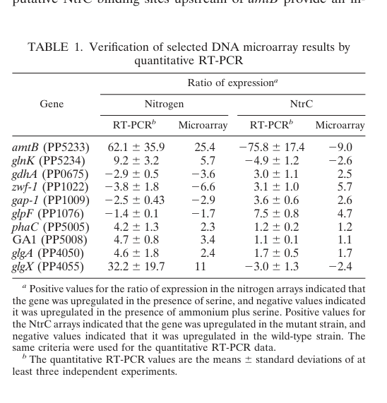

## Question

# Gene Research for Functional Annotation

## ⚠️ CRITICAL: Gene/Protein Identification Context

**BEFORE YOU BEGIN RESEARCH:** You MUST verify you are researching the CORRECT gene/protein. Gene symbols can be ambiguous, especially for less well-characterized genes from non-model organisms.

### Target Gene/Protein Identity (from UniProt):
- **UniProt Accession:** Q88CE8
- **Protein Description:** RecName: Full=Ammonium transporter {ECO:0000256|ARBA:ARBA00050025, ECO:0000256|RuleBase:RU362002};
- **Gene Information:** Name=amtB {ECO:0000313|EMBL:AAN70798.1}; OrderedLocusNames=PP_5233 {ECO:0000313|EMBL:AAN70798.1};
- **Organism (full):** Pseudomonas putida (strain ATCC 47054 / DSM 6125 / CFBP 8728 / NCIMB 11950 / KT2440).
- **Protein Family:** Belongs to the ammonia transporter channel (TC 1.A.11.2)
- **Key Domains:** Ammonium/urea_transptr. (IPR029020); Ammonium_transpt. (IPR001905); Ammonium_transpt_CS. (IPR018047); NH4_transpt_AmtB-like_dom. (IPR024041); Ammonium_transp (PF00909)

### MANDATORY VERIFICATION STEPS:

1. **Check if the gene symbol "amtB" matches the protein description above**
2. **Verify the organism is correct:** Pseudomonas putida (strain ATCC 47054 / DSM 6125 / CFBP 8728 / NCIMB 11950 / KT2440).
3. **Check if protein family/domains align with what you find in literature**
4. **If you find literature for a DIFFERENT gene with the same or similar symbol, STOP**

### If Gene Symbol is Ambiguous or You Cannot Find Relevant Literature:

**DO NOT PROCEED WITH RESEARCH ON A DIFFERENT GENE.** Instead:
- State clearly: "The gene symbol 'amtB' is ambiguous or literature is limited for this specific protein"
- Explain what you found (e.g., "Found extensive literature on a different gene with the same symbol in a different organism")
- Describe the protein based ONLY on the UniProt information provided above
- Suggest that the protein function can be inferred from domain/family information

### Research Target:

Please provide a comprehensive research report on the gene **amtB** (gene ID: amtB, UniProt: Q88CE8) in PSEPK.

The research report should be a detailed narrative explaining the function, biological processes, and localization of the gene product. Citations should be given for all claims.

You should prioritize authoritative reviews and primary scientific literature when conducting research. You can supplement
this with annotations you find in gene/protein databases, but these can be outdated or inaccurate.

We are specifically interested in the primary function of the gene - for enzymes, what reaction is catalyzed, and what is the substrate specificity? For transporters, what is the substrate? For structural proteins or adapters, what is the broader structural role? For signaling molecules, what is the role in the pathway.

We are interested in where in or outside the cell the gene product carries out its function.

We are also interested in the signaling or biochemical pathways in which the gene functions. We are less interested in broad pleiotropic effects, except where these elucidate the precise role.

Include evidence where possible. We are interested in both experimental evidence as well as inference from structure, evolution, or bioinformatic analysis. Precise studies should be prioritized over high-throughput, where available.

## Output

Question: You are an expert researcher providing comprehensive, well-cited information.

Provide detailed information focusing on:
1. Key concepts and definitions with current understanding
2. Recent developments and latest research (prioritize 2023-2024 sources)
3. Current applications and real-world implementations
4. Expert opinions and analysis from authoritative sources
5. Relevant statistics and data from recent studies

Format as a comprehensive research report with proper citations. Include URLs and publication dates where available.
Always prioritize recent, authoritative sources and provide specific citations for all major claims.

# Gene Research for Functional Annotation

## ⚠️ CRITICAL: Gene/Protein Identification Context

**BEFORE YOU BEGIN RESEARCH:** You MUST verify you are researching the CORRECT gene/protein. Gene symbols can be ambiguous, especially for less well-characterized genes from non-model organisms.

### Target Gene/Protein Identity (from UniProt):
- **UniProt Accession:** Q88CE8
- **Protein Description:** RecName: Full=Ammonium transporter {ECO:0000256|ARBA:ARBA00050025, ECO:0000256|RuleBase:RU362002};
- **Gene Information:** Name=amtB {ECO:0000313|EMBL:AAN70798.1}; OrderedLocusNames=PP_5233 {ECO:0000313|EMBL:AAN70798.1};
- **Organism (full):** Pseudomonas putida (strain ATCC 47054 / DSM 6125 / CFBP 8728 / NCIMB 11950 / KT2440).
- **Protein Family:** Belongs to the ammonia transporter channel (TC 1.A.11.2)
- **Key Domains:** Ammonium/urea_transptr. (IPR029020); Ammonium_transpt. (IPR001905); Ammonium_transpt_CS. (IPR018047); NH4_transpt_AmtB-like_dom. (IPR024041); Ammonium_transp (PF00909)

### MANDATORY VERIFICATION STEPS:

1. **Check if the gene symbol "amtB" matches the protein description above**
2. **Verify the organism is correct:** Pseudomonas putida (strain ATCC 47054 / DSM 6125 / CFBP 8728 / NCIMB 11950 / KT2440).
3. **Check if protein family/domains align with what you find in literature**
4. **If you find literature for a DIFFERENT gene with the same or similar symbol, STOP**

### If Gene Symbol is Ambiguous or You Cannot Find Relevant Literature:

**DO NOT PROCEED WITH RESEARCH ON A DIFFERENT GENE.** Instead:
- State clearly: "The gene symbol 'amtB' is ambiguous or literature is limited for this specific protein"
- Explain what you found (e.g., "Found extensive literature on a different gene with the same symbol in a different organism")
- Describe the protein based ONLY on the UniProt information provided above
- Suggest that the protein function can be inferred from domain/family information

### Research Target:

Please provide a comprehensive research report on the gene **amtB** (gene ID: amtB, UniProt: Q88CE8) in PSEPK.

The research report should be a detailed narrative explaining the function, biological processes, and localization of the gene product. Citations should be given for all claims.

You should prioritize authoritative reviews and primary scientific literature when conducting research. You can supplement
this with annotations you find in gene/protein databases, but these can be outdated or inaccurate.

We are specifically interested in the primary function of the gene - for enzymes, what reaction is catalyzed, and what is the substrate specificity? For transporters, what is the substrate? For structural proteins or adapters, what is the broader structural role? For signaling molecules, what is the role in the pathway.

We are interested in where in or outside the cell the gene product carries out its function.

We are also interested in the signaling or biochemical pathways in which the gene functions. We are less interested in broad pleiotropic effects, except where these elucidate the precise role.

Include evidence where possible. We are interested in both experimental evidence as well as inference from structure, evolution, or bioinformatic analysis. Precise studies should be prioritized over high-throughput, where available.

## Research Report: Functional Annotation of **amtB** (UniProt Q88CE8; locus **PP_5233**) in *Pseudomonas putida* KT2440

### 0) Target verification (critical disambiguation)
The UniProt entry **Q88CE8** corresponds to **AmtB**, an **ammonium transporter** in *Pseudomonas putida* strain KT2440 (also referred to as ATCC 47054 / DSM 6125 / NCIMB 11950). Independent primary literature in *P. putida* KT2440 explicitly identifies **amtB = PP_5233** and annotates it as a **high-affinity ammonium transporter**, verifying that the gene symbol and function match the UniProt-provided identity. (hervas2008transcriptomeanalysisof pages 2-3)

### 1) Key concepts and definitions (current understanding)

#### 1.1 What is AmtB?
**AmtB** is a cytoplasmic-membrane ammonium transporter of the conserved **Amt/Mep/Rh** superfamily. In Gram-negative bacteria, AmtB is typically a **high-affinity ammonium uptake system** that is induced under nitrogen limitation to scavenge low external ammonium and support nitrogen assimilation. In *P. putida* KT2440, amtB (PP_5233) is specifically described as the **high-affinity ammonium transporter**. (hervas2008transcriptomeanalysisof pages 2-3)

#### 1.2 Substrate and mechanism: NH4+ vs NH3, and why the debate persists
At physiological pH (~7), most “ammonium” exists as **NH4+** (pKa ~9.28), whereas **NH3** is membrane-permeant. This creates a long-standing mechanistic debate over whether Amt proteins are passive NH3 channels or energy-coupled/electrogenic ammonium transporters. A 2024 review synthesizes the field’s current view using **E. coli AmtB** as a paradigm: the protein contains a **hydrophobic pore** with conserved gating/selectivity motifs, suggesting that **NH4+ binds and is deprotonated**, with **NH3** traversing the hydrophobic lumen; however, functional work increasingly supports **electrogenic transport** and more complex coupling than simple NH3 diffusion. (williamson2024biologicalammoniumtransporters pages 1-3, williamson2024biologicalammoniumtransporters pages 3-5, williamson2024biologicalammoniumtransporters pages 5-7)

#### 1.3 Structural hallmarks (family-defining features)
High-resolution structures show that Amt/Mep/Rh proteins are typically **trimers**, with each monomer forming a pore. Conserved features in bacterial AmtB include:
- A periplasmic NH4+ recruitment/binding site,
- A **Phe-gate** (e.g., F107/F215 in *E. coli* AmtB),
- A central hydrophobic pore containing a conserved **twin-His motif** (e.g., H168/H318 in *E. coli* AmtB),
- A cytoplasmic vestibule. (williamson2024biologicalammoniumtransporters pages 1-3, pfluger2024howsensoramtlike pages 1-2)
A 2024 *Science Advances* study on an Amt-like receptor reinforces the canonical **trimeric fold** and highlights conserved vestibule/gate motifs (Trp/Ser pair, Phe pair, twin-His), emphasizing their importance for discriminating ammonium from other small solutes. (pfluger2024howsensoramtlike pages 2-3, pfluger2024howsensoramtlike pages 1-2)

### 2) P. putida KT2440 **amtB**: function, pathway context, and regulation

#### 2.1 Genomic context: association with **glnK** (PII protein)
In *P. putida* KT2440, **amtB (PP_5233)** is linked to an upstream **PII-family nitrogen signaling gene, glnK**, consistent with a canonical **glnK–amtB operon** architecture found across many Proteobacteria. The 2008 KT2440 transcriptome study explicitly notes the upstream PII gene and supports operon-level coupling, while also suggesting an **internal promoter** immediately upstream of amtB. (hervas2008transcriptomeanalysisof pages 2-3)

#### 2.2 Transcriptional regulation: NtrC/σ54 (RpoN) nitrogen-starvation response
A key, KT2440-specific conclusion is that **amtB is NtrC-activated** under nitrogen limitation. Quantitative RT-PCR in KT2440 showed **~62-fold induction** of **amtB** when comparing nitrogen-limited vs nitrogen-replete conditions (serine vs ammonium+serine), and **~76-fold** NtrC-dependent differences when comparing wild type and an **ntrC mutant**. (hervas2008transcriptomeanalysisof pages 2-3, hervas2008transcriptomeanalysisof media a469352e)

Mechanistically, *P. putida* NtrC is a σ54-dependent activator, and the KT2440 study indicates promoter dependence on **σ54/RpoN** (“dependent on 54”). (hervas2008transcriptomeanalysisof pages 2-3)

A complementary 2009 KT2440 study further establishes that the **glnK promoter** is a direct target of NtrC: it identifies **two contiguous NtrC binding sites** upstream of the nitrogen-dependent glnK promoter and shows **direct activation by NtrC** with **IHF required** for open-complex formation. Together, these data support a model in which nitrogen starvation activates NtrC, which then induces glnK–amtB transcription to increase ammonium scavenging capacity. (hervas2009ntrcdependentregulatorynetwork pages 1-2, hervas2008transcriptomeanalysisof pages 2-3)

#### 2.3 Post-translational control: the PII (GlnK) “gate” on AmtB activity
In many bacteria, transcriptional induction of amtB under nitrogen limitation is complemented by **rapid post-translational gating** of AmtB by **PII proteins** (GlnK). A highly cited authoritative review synthesizes structural and biochemical evidence that **trimeric GlnK binds the cytoplasmic face of trimeric AmtB and inserts its T-loops into AmtB pores, blocking transport**; **uridylylation (GlnK-UMP)** prevents this interaction, thereby opening the channel when nitrogen is limiting. This coupling integrates intracellular **glutamine** (via UTase/UR), and broader carbon/nitrogen/energy signals (2-oxoglutarate, ATP/ADP, Mg2+). (heeswijk2013nitrogenassimilationin pages 22-23)

While this post-translational mechanism is established primarily from model organisms (e.g., *E. coli*), it is directly relevant to KT2440 because *P. putida* encodes a nitrogen-regulated PII protein **GlnK** linked to amtB and under NtrC control, providing the regulatory architecture required for analogous gating. (hervas2009ntrcdependentregulatorynetwork pages 1-2, hervas2008transcriptomeanalysisof pages 2-3, heeswijk2013nitrogenassimilationin pages 22-23)

### 3) Recent developments and latest research (prioritizing 2023–2024)

#### 3.1 Mechanistic/energetic shift: renewed support for electrogenic transport
A 2024 review argues that the earlier “passive NH3 channel” paradigm is increasingly inconsistent with physiology and modern electrophysiology. Using solid-supported membrane electrophysiology (SSME) in reconstituted systems, the review reports evidence consistent with **electrogenic transport** (net charge transfer) and estimates **~30–300 NH4+ per second per trimer**. It further discusses a “two-lane” model in which **NH4+ is deprotonated** and **H+ and NH3** traverse via distinct pathways. (williamson2024biologicalammoniumtransporters pages 7-9)

#### 3.2 Structural biology broadens function: Amt modules repurposed as ammonium sensors
A 2024 *Science Advances* paper shows that some Amt-like proteins are fused to signaling domains and can act as **ammonium receptors** rather than purely transporters. The Amt module retains canonical features (trimer, vestibule gate motifs), but the protein architecture enables downstream signaling (e.g., cyclic-di-GMP synthesis). This expands the functional landscape of Amt-family proteins and helps contextualize why conserved transport-like scaffolds can support different physiological roles. (pfluger2024howsensoramtlike pages 2-3, pfluger2024howsensoramtlike pages 1-2)

#### 3.3 Technical limitations acknowledged by experts (why mechanism remains hard)
The 2024 review emphasizes that mechanistic conclusions are constrained by major assay limitations: methylammonium is an imperfect proxy; proteoliposome reconstitution can have uncontrolled orientation/copy number; experiments often use nonphysiologically high ammonium (5–200 mM); and lipid composition can be essential for activity (e.g., phosphatidylglycerol dependence). These limitations explain divergent conclusions in the literature and highlight why multiple orthogonal methods (SSME, structural dynamics, native-lipid systems) are needed for definitive mechanism. (williamson2024biologicalammoniumtransporters pages 18-20, williamson2024biologicalammoniumtransporters pages 5-7)

### 4) Current applications and real-world implementations

Although the target here is *P. putida* KT2440 AmtB (PP_5233), applications frequently manipulate **AmtB homologs** in other bacteria to control ammonium retention vs excretion—conceptually leveraging the same biology (AmtB as a high-affinity ammonium recapture/import route).

#### 4.1 Biofertilizer-oriented engineering via amtB deletion (2024)
A 2024 applied study engineered the plant endophyte **Gluconacetobacter diazotrophicus** to enhance extracellular ammonium release using **clean (markerless) deletions of two amtB homologs** (and combinations with nifA regulatory edits). Quantitatively, engineered strains accumulated **~16–19 mM extracellular ammonium** (often ~18 mM) after 4 days under the tested conditions, while wild type remained **<0.1 mM**; the edits imposed measurable growth/fitness costs (final OD600 reduced relative to wild type: WT 5.3 vs engineered strains ~1.1–1.4 in representative constructs). The authors explicitly discuss the mechanistic rationale that AmtB normally **recaptures leaked ammonium**, so deleting amtB can increase net ammonium release. (dietz2024enhancedextracellularammonium pages 9-11, dietz2024enhancedextracellularammonium pages 1-2)

These engineering results provide a concrete, real-world-oriented example of how AmtB function (ammonium uptake/retention) can be leveraged for agricultural nitrogen delivery strategies—even though they are not KT2440-specific. (dietz2024enhancedextracellularammonium pages 9-11, dietz2024enhancedextracellularammonium pages 1-2)

### 5) Relevant statistics and data summary (recent and authoritative)

Key quantitative and mechanistic values relevant for functional annotation include:
- **P. putida KT2440 amtB (PP_5233) expression**: ~**62-fold induction** under nitrogen limitation (serine vs ammonium+serine) and ~**76-fold NtrC-dependent** difference versus an ntrC mutant condition/comparison. (hervas2008transcriptomeanalysisof media a469352e, hervas2008transcriptomeanalysisof pages 2-3)
- **Transporter flux estimates (2024 review; paradigm organism AmtB)**: SSME-derived flux ~**30–300 NH4+ s−1 per trimer** under reconstituted electrophysiology conditions, consistent with electrogenic transport. (williamson2024biologicalammoniumtransporters pages 7-9)
- **Application engineering output (2024)**: **~16–19 mM extracellular ammonium** from engineered amtB-deletion constructs in an endophyte; wild type **<0.1 mM**, with reduced final culture densities (OD600 ~1.1–1.4 vs 5.3). (dietz2024enhancedextracellularammonium pages 9-11)

### 6) Expert synthesis: best-supported functional annotation for Q88CE8 (AmtB) in KT2440

**Molecular function:** High-affinity ammonium uptake/transport across the cytoplasmic membrane (Amt/Mep/Rh-family transporter). In KT2440, amtB is strongly induced in nitrogen limitation and is NtrC/σ54 regulated, consistent with a role in ammonium scavenging when nitrogen is scarce. (hervas2008transcriptomeanalysisof pages 2-3, hervas2008transcriptomeanalysisof media a469352e)

**Likely transported species:** The protein binds **NH4+** at the periplasmic face and supports transport that involves **deprotonation and NH3 passage** through a hydrophobic pore, with increasing evidence for **electrogenic transport and coupled H+/NH3 transfer** in bacterial AmtB paradigms. For KT2440, direct biophysical flux measurements were not identified in the retrieved KT2440-specific papers; therefore, mechanistic specifics are best treated as **family-supported inference** rather than organism-specific proof. (williamson2024biologicalammoniumtransporters pages 1-3, williamson2024biologicalammoniumtransporters pages 7-9)

**Cellular localization:** Cytoplasmic (inner) membrane transporter/channel (Amt/Mep/Rh family architecture; KT2440-specific evidence is functional/genetic and family-based rather than a direct localization assay in the retrieved excerpts). (hervas2008transcriptomeanalysisof pages 2-3, williamson2024biologicalammoniumtransporters pages 1-3)

**Pathway context:** Part of the nitrogen assimilation starvation response controlled by the **NtrB/NtrC–σ54 (RpoN)** regulatory axis; genomically coupled to **glnK** (PII nitrogen sensor), indicating integration of ammonium uptake with cellular nitrogen-status signaling and regulation. (hervas2009ntrcdependentregulatorynetwork pages 1-2, hervas2008transcriptomeanalysisof pages 2-3)

**Regulatory architecture:**
- Transcriptional: **NtrC-activated, σ54/RpoN-dependent** promoters controlling glnK–amtB. (hervas2009ntrcdependentregulatorynetwork pages 1-2, hervas2008transcriptomeanalysisof pages 2-3)
- Post-translational (family-supported): **GlnK** can bind and block AmtB under nitrogen sufficiency; uridylylation state controls gating. (heeswijk2013nitrogenassimilationin pages 22-23)

### Evidence map (compact summary table)
| Category | Summary | Quantitative / specific data | Citations |
|---|---|---|---|
| Target identity | Correct target is **AmtB** from **Pseudomonas putida KT2440**; gene **amtB**, ordered locus **PP_5233**, UniProt **Q88CE8**. In P. putida literature, **amtB (PP5233)** is explicitly described as the **high-affinity ammonium transporter** and is linked to upstream **glnK**. | qRT-PCR/microarray study explicitly maps **amtB = PP5233** in KT2440. | (hervas2008transcriptomeanalysisof pages 2-3) |
| Primary function / substrate | AmtB is a **cytoplasmic membrane ammonium transporter/channel** of the **Amt/Mep/Rh family**. Current consensus is that the physiological substrate enters as **NH4+**, then is **deprotonated** and transferred largely as **NH3** through a hydrophobic pore; bacterial AmtB is therefore best viewed as an ammonium uptake system for nitrogen scavenging under limitation. | Family-level high-affinity behavior is reported around **Km ~10 µM** in classic AmtB discussions; direct bacterial AmtB electrophysiology suggests net ammonium translocation rather than simple passive NH3 equilibration. | (junqueira2019evolutionofswimming pages 85-90, heeswijk2013nitrogenassimilationin pages 22-23, williamson2024biologicalammoniumtransporters pages 7-9, williamson2024biologicalammoniumtransporters pages 1-3) |
| Operon context | In **P. putida KT2440**, **amtB** is genetically linked with **glnK** in a **glnK-amtB operon**; evidence also suggests an **internal promoter** upstream of amtB. | glnK and amtB are co-oriented; amtB can also show stronger induction than glnK, consistent with additional promoter control. | (hervas2008transcriptomeanalysisof pages 2-3, hervas2009ntrcdependentregulatorynetwork pages 1-2) |
| Transcriptional regulation | **NtrC** directly activates the nitrogen-responsive promoter(s) controlling **glnK-amtB** in **P. putida**; these promoters are **σ54/RpoN-dependent**, and **IHF** is required for open-complex formation at the glnK promoter. | Two contiguous **NtrC binding sites** were identified upstream of the N-dependent glnK promoter. | (hervas2008transcriptomeanalysisof pages 2-3, hervas2009ntrcdependentregulatorynetwork pages 1-2) |
| Nitrogen-responsive expression | **amtB** is strongly induced during nitrogen limitation in **P. putida KT2440**, consistent with a role in scavenging low external ammonium. | **~62-fold induction** in wild type under serine vs ammonium+serine; **~75.8- to 76-fold NtrC-dependent difference** versus the ntrC mutant / corresponding comparison. | (hervas2008transcriptomeanalysisof pages 2-3, hervas2008transcriptomeanalysisof media a469352e) |
| Post-translational control | Beyond transcriptional control, AmtB activity is regulated by the **PII protein GlnK**. Non-uridylylated **GlnK** binds AmtB and **blocks the channel**; **GlnK-UMP** does not bind, allowing transport. This links transport to intracellular **glutamine, 2-oxoglutarate, ATP/ADP, and Mg2+** status. | GlnK is **trimeric** and inserts T-loops into AmtB vestibules/pore entrances; metabolite-dependent complex formation couples N/C status to transport. | (junqueira2019evolutionofswimming pages 90-93, heeswijk2013nitrogenassimilationin pages 22-23, junqueira2019evolutionofswimming pages 85-90, junqueira2019evolutionofswimming pages 99-102) |
| Structural motifs | AmtB family proteins are **trimers** with one pore per protomer. Conserved motifs include the **periplasmic NH4+ recruitment site**, **Phe-gate** (**F107/F215** in E. coli AmtB), and central **twin-His motif** (**H168/H318** in E. coli AmtB). | Recent structural work also describes 11 TM helices per monomer and conserved vestibule features (Trp/Ser, Phe pair, coplanar His pair). | (williamson2024biologicalammoniumtransporters pages 1-3, pfluger2024howsensoramtlike pages 2-3, williamson2024biologicalammoniumtransporters pages 3-5, pfluger2024howsensoramtlike pages 1-2) |
| Mechanism model | The leading 2024 model favors **electrogenic ammonium transport** with **NH4+ deprotonation** and a **“two-lane” pathway** in which **H+** and **NH3** traverse separately, rather than simple passive NH3 diffusion alone. However, mechanism/energetics remain debated and assay-dependent. | Solid-supported membrane electrophysiology estimated **~30–300 NH4+ s−1 per trimer** for microbial Amts/AmtB-like transport. | (williamson2024biologicalammoniumtransporters pages 7-9, williamson2024biologicalammoniumtransporters pages 5-7, williamson2024biologicalammoniumtransporters pages 9-10) |
| Technical limitations / evidence quality | Functional interpretation is complicated by assay limitations: methylammonium is an imperfect surrogate, proteoliposome orientation/copy number are hard to control, high ammonium concentrations can be nonphysiological, and lipid environment strongly affects activity. | Early studies reported apparent intracellular ammonium accumulation of **~60–3000-fold**; transport assays often used **5–200 mM** ammonium, which may distort mechanism inference. | (williamson2024biologicalammoniumtransporters pages 3-5, williamson2024biologicalammoniumtransporters pages 18-20, williamson2024biologicalammoniumtransporters pages 5-7) |

*Table: This table summarizes verified identity, function, regulation, quantitative data, and mechanistic interpretation for P. putida KT2440 AmtB/PP_5233. It is useful as a compact evidence map linking organism-specific annotation to broader 2024 mechanistic understanding of bacterial AmtB transporters.*

### References (with publication dates and URLs as available in retrieved sources)
- Hervás AB, Canosa I, Santero E. **Transcriptome analysis of *Pseudomonas putida* in response to nitrogen availability.** *Journal of Bacteriology* (Jan **2008**). https://doi.org/10.1128/jb.01230-07 (hervas2008transcriptomeanalysisof pages 2-3, hervas2008transcriptomeanalysisof media a469352e)
- Hervás AB, Canosa I, Little R, Dixon R, Santero E. **NtrC-dependent regulatory network for nitrogen assimilation in *Pseudomonas putida*.** *Journal of Bacteriology* (Oct **2009**). https://doi.org/10.1128/jb.00744-09 (hervas2009ntrcdependentregulatorynetwork pages 1-2)
- Williamson G, Bizior A, Harris T, et al. **Biological ammonium transporters from the Amt/Mep/Rh superfamily: mechanism, energetics, and technical limitations.** *Bioscience Reports* (Jan **2024**). https://doi.org/10.1042/BSR20211209 (williamson2024biologicalammoniumtransporters pages 1-3, williamson2024biologicalammoniumtransporters pages 7-9, williamson2024biologicalammoniumtransporters pages 18-20)
- Pflüger T, Gschell M, Zhang L, et al. **How sensor Amt-like proteins integrate ammonium signals.** *Science Advances* (Jun **2024**). https://doi.org/10.1126/sciadv.adm9441 (pfluger2024howsensoramtlike pages 2-3, pfluger2024howsensoramtlike pages 1-2)
- van Heeswijk WC, Westerhoff HV, Boogerd FC. **Nitrogen assimilation in *Escherichia coli*: Putting molecular data into a systems perspective.** *Microbiology and Molecular Biology Reviews* (Dec **2013**). https://doi.org/10.1128/MMBR.00025-13 (heeswijk2013nitrogenassimilationin pages 22-23)
- Dietz BR, Olszewski NE, Barney BM. **Enhanced extracellular ammonium release in the plant endophyte *Gluconacetobacter diazotrophicus* through genome editing.** *Microbiology Spectrum* (Jan **2024**). https://doi.org/10.1128/spectrum.02478-23 (dietz2024enhancedextracellularammonium pages 9-11, dietz2024enhancedextracellularammonium pages 1-2)

References

1. (hervas2008transcriptomeanalysisof pages 2-3): Ana B. Hervás, Inés Canosa, and Eduardo Santero. Transcriptome analysis of <i>pseudomonas putida</i> in response to nitrogen availability. Journal of Bacteriology, 190:416-420, Jan 2008. URL: https://doi.org/10.1128/jb.01230-07, doi:10.1128/jb.01230-07. This article has 114 citations and is from a peer-reviewed journal.

2. (williamson2024biologicalammoniumtransporters pages 1-3): Gordon Williamson, Adriana Bizior, Thomas Harris, Leighton Pritchard, Paul A. Hoskisson, and Arnaud Javelle. Biological ammonium transporters from the amt/mep/rh superfamily: mechanism, energetics, and technical limitations. Bioscience Reports, Jan 2024. URL: https://doi.org/10.1042/bsr20211209, doi:10.1042/bsr20211209. This article has 17 citations and is from a peer-reviewed journal.

3. (williamson2024biologicalammoniumtransporters pages 3-5): Gordon Williamson, Adriana Bizior, Thomas Harris, Leighton Pritchard, Paul A. Hoskisson, and Arnaud Javelle. Biological ammonium transporters from the amt/mep/rh superfamily: mechanism, energetics, and technical limitations. Bioscience Reports, Jan 2024. URL: https://doi.org/10.1042/bsr20211209, doi:10.1042/bsr20211209. This article has 17 citations and is from a peer-reviewed journal.

4. (williamson2024biologicalammoniumtransporters pages 5-7): Gordon Williamson, Adriana Bizior, Thomas Harris, Leighton Pritchard, Paul A. Hoskisson, and Arnaud Javelle. Biological ammonium transporters from the amt/mep/rh superfamily: mechanism, energetics, and technical limitations. Bioscience Reports, Jan 2024. URL: https://doi.org/10.1042/bsr20211209, doi:10.1042/bsr20211209. This article has 17 citations and is from a peer-reviewed journal.

5. (pfluger2024howsensoramtlike pages 1-2): Tobias Pflüger, Mathias Gschell, Lin Zhang, Volodymyr Shnitsar, Annas J. Zabadné, Paul Zierep, Stefan Günther, Oliver Einsle, and Susana L. A. Andrade. How sensor amt-like proteins integrate ammonium signals. Jun 2024. URL: https://doi.org/10.1126/sciadv.adm9441, doi:10.1126/sciadv.adm9441. This article has 9 citations and is from a highest quality peer-reviewed journal.

6. (pfluger2024howsensoramtlike pages 2-3): Tobias Pflüger, Mathias Gschell, Lin Zhang, Volodymyr Shnitsar, Annas J. Zabadné, Paul Zierep, Stefan Günther, Oliver Einsle, and Susana L. A. Andrade. How sensor amt-like proteins integrate ammonium signals. Jun 2024. URL: https://doi.org/10.1126/sciadv.adm9441, doi:10.1126/sciadv.adm9441. This article has 9 citations and is from a highest quality peer-reviewed journal.

7. (hervas2008transcriptomeanalysisof media a469352e): Ana B. Hervás, Inés Canosa, and Eduardo Santero. Transcriptome analysis of <i>pseudomonas putida</i> in response to nitrogen availability. Journal of Bacteriology, 190:416-420, Jan 2008. URL: https://doi.org/10.1128/jb.01230-07, doi:10.1128/jb.01230-07. This article has 114 citations and is from a peer-reviewed journal.

8. (hervas2009ntrcdependentregulatorynetwork pages 1-2): Ana B. Hervás, Inés Canosa, Richard Little, Ray Dixon, and Eduardo Santero. Ntrc-dependent regulatory network for nitrogen assimilation in <i>pseudomonas putida</i>. Oct 2009. URL: https://doi.org/10.1128/jb.00744-09, doi:10.1128/jb.00744-09. This article has 94 citations and is from a peer-reviewed journal.

9. (heeswijk2013nitrogenassimilationin pages 22-23): Wally C. van Heeswijk, Hans V. Westerhoff, and Fred C. Boogerd. Nitrogen assimilation in escherichia coli: putting molecular data into a systems perspective. Microbiology and Molecular Biology Reviews, 77:628-695, Dec 2013. URL: https://doi.org/10.1128/mmbr.00025-13, doi:10.1128/mmbr.00025-13. This article has 336 citations and is from a domain leading peer-reviewed journal.

10. (williamson2024biologicalammoniumtransporters pages 7-9): Gordon Williamson, Adriana Bizior, Thomas Harris, Leighton Pritchard, Paul A. Hoskisson, and Arnaud Javelle. Biological ammonium transporters from the amt/mep/rh superfamily: mechanism, energetics, and technical limitations. Bioscience Reports, Jan 2024. URL: https://doi.org/10.1042/bsr20211209, doi:10.1042/bsr20211209. This article has 17 citations and is from a peer-reviewed journal.

11. (williamson2024biologicalammoniumtransporters pages 18-20): Gordon Williamson, Adriana Bizior, Thomas Harris, Leighton Pritchard, Paul A. Hoskisson, and Arnaud Javelle. Biological ammonium transporters from the amt/mep/rh superfamily: mechanism, energetics, and technical limitations. Bioscience Reports, Jan 2024. URL: https://doi.org/10.1042/bsr20211209, doi:10.1042/bsr20211209. This article has 17 citations and is from a peer-reviewed journal.

12. (dietz2024enhancedextracellularammonium pages 9-11): Benjamin R. Dietz, Neil E. Olszewski, and Brett M. Barney. Enhanced extracellular ammonium release in the plant endophyte <i>gluconacetobacter diazotrophicus</i> through genome editing. Jan 2024. URL: https://doi.org/10.1128/spectrum.02478-23, doi:10.1128/spectrum.02478-23. This article has 13 citations and is from a domain leading peer-reviewed journal.

13. (dietz2024enhancedextracellularammonium pages 1-2): Benjamin R. Dietz, Neil E. Olszewski, and Brett M. Barney. Enhanced extracellular ammonium release in the plant endophyte <i>gluconacetobacter diazotrophicus</i> through genome editing. Jan 2024. URL: https://doi.org/10.1128/spectrum.02478-23, doi:10.1128/spectrum.02478-23. This article has 13 citations and is from a domain leading peer-reviewed journal.

14. (junqueira2019evolutionofswimming pages 85-90): AE Altamirano Junqueira. Evolution of swimming motility in aflagellate strains of pseudomonas fluorescens sbw25. Unknown journal, 2019.

15. (junqueira2019evolutionofswimming pages 90-93): AE Altamirano Junqueira. Evolution of swimming motility in aflagellate strains of pseudomonas fluorescens sbw25. Unknown journal, 2019.

16. (junqueira2019evolutionofswimming pages 99-102): AE Altamirano Junqueira. Evolution of swimming motility in aflagellate strains of pseudomonas fluorescens sbw25. Unknown journal, 2019.

17. (williamson2024biologicalammoniumtransporters pages 9-10): Gordon Williamson, Adriana Bizior, Thomas Harris, Leighton Pritchard, Paul A. Hoskisson, and Arnaud Javelle. Biological ammonium transporters from the amt/mep/rh superfamily: mechanism, energetics, and technical limitations. Bioscience Reports, Jan 2024. URL: https://doi.org/10.1042/bsr20211209, doi:10.1042/bsr20211209. This article has 17 citations and is from a peer-reviewed journal.

## Artifacts

- [Edison artifact artifact-00](amtB-deep-research-falcon_artifacts/artifact-00.md)

## Citations

1. hervas2008transcriptomeanalysisof pages 2-3
2. heeswijk2013nitrogenassimilationin pages 22-23
3. williamson2024biologicalammoniumtransporters pages 7-9
4. dietz2024enhancedextracellularammonium pages 9-11
5. hervas2009ntrcdependentregulatorynetwork pages 1-2
6. williamson2024biologicalammoniumtransporters pages 1-3
7. williamson2024biologicalammoniumtransporters pages 3-5
8. williamson2024biologicalammoniumtransporters pages 5-7
9. pfluger2024howsensoramtlike pages 1-2
10. pfluger2024howsensoramtlike pages 2-3
11. williamson2024biologicalammoniumtransporters pages 18-20
12. dietz2024enhancedextracellularammonium pages 1-2
13. junqueira2019evolutionofswimming pages 85-90
14. junqueira2019evolutionofswimming pages 90-93
15. junqueira2019evolutionofswimming pages 99-102
16. williamson2024biologicalammoniumtransporters pages 9-10
17. https://doi.org/10.1128/jb.01230-07
18. https://doi.org/10.1128/jb.00744-09
19. https://doi.org/10.1042/BSR20211209
20. https://doi.org/10.1126/sciadv.adm9441
21. https://doi.org/10.1128/MMBR.00025-13
22. https://doi.org/10.1128/spectrum.02478-23
23. https://doi.org/10.1128/jb.01230-07,
24. https://doi.org/10.1042/bsr20211209,
25. https://doi.org/10.1126/sciadv.adm9441,
26. https://doi.org/10.1128/jb.00744-09,
27. https://doi.org/10.1128/mmbr.00025-13,
28. https://doi.org/10.1128/spectrum.02478-23,