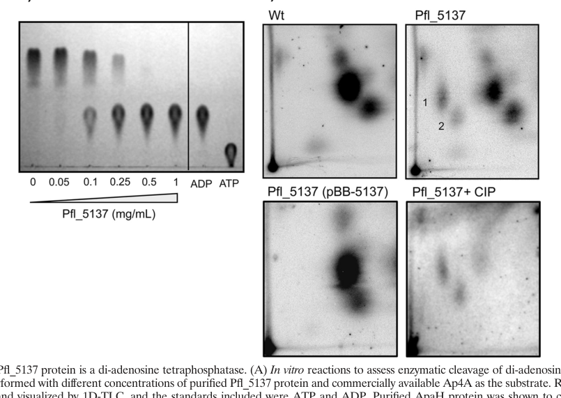

## Question

# Gene Research for Functional Annotation

## ⚠️ CRITICAL: Gene/Protein Identification Context

**BEFORE YOU BEGIN RESEARCH:** You MUST verify you are researching the CORRECT gene/protein. Gene symbols can be ambiguous, especially for less well-characterized genes from non-model organisms.

### Target Gene/Protein Identity (from UniProt):
- **UniProt Accession:** Q88QT8
- **Protein Description:** RecName: Full=Bis(5'-nucleosyl)-tetraphosphatase, symmetrical {ECO:0000255|HAMAP-Rule:MF_00199}; EC=3.6.1.41 {ECO:0000255|HAMAP-Rule:MF_00199}; AltName: Full=Ap4A hydrolase {ECO:0000255|HAMAP-Rule:MF_00199}; AltName: Full=Diadenosine 5',5'''-P1,P4-tetraphosphate pyrophosphohydrolase {ECO:0000255|HAMAP-Rule:MF_00199}; AltName: Full=Diadenosine tetraphosphatase {ECO:0000255|HAMAP-Rule:MF_00199};
- **Gene Information:** Name=apaH {ECO:0000255|HAMAP-Rule:MF_00199}; OrderedLocusNames=PP_0399;
- **Organism (full):** Pseudomonas putida (strain ATCC 47054 / DSM 6125 / CFBP 8728 / NCIMB 11950 / KT2440).
- **Protein Family:** Belongs to the Ap4A hydrolase family. {ECO:0000255|HAMAP-
- **Key Domains:** ApaH. (IPR004617); Calcineurin-like_PHP. (IPR004843); Metallo-depent_PP-like. (IPR029052); Metallophos (PF00149)

### MANDATORY VERIFICATION STEPS:

1. **Check if the gene symbol "apaH" matches the protein description above**
2. **Verify the organism is correct:** Pseudomonas putida (strain ATCC 47054 / DSM 6125 / CFBP 8728 / NCIMB 11950 / KT2440).
3. **Check if protein family/domains align with what you find in literature**
4. **If you find literature for a DIFFERENT gene with the same or similar symbol, STOP**

### If Gene Symbol is Ambiguous or You Cannot Find Relevant Literature:

**DO NOT PROCEED WITH RESEARCH ON A DIFFERENT GENE.** Instead:
- State clearly: "The gene symbol 'apaH' is ambiguous or literature is limited for this specific protein"
- Explain what you found (e.g., "Found extensive literature on a different gene with the same symbol in a different organism")
- Describe the protein based ONLY on the UniProt information provided above
- Suggest that the protein function can be inferred from domain/family information

### Research Target:

Please provide a comprehensive research report on the gene **apaH** (gene ID: apaH, UniProt: Q88QT8) in PSEPK.

The research report should be a detailed narrative explaining the function, biological processes, and localization of the gene product. Citations should be given for all claims.

You should prioritize authoritative reviews and primary scientific literature when conducting research. You can supplement
this with annotations you find in gene/protein databases, but these can be outdated or inaccurate.

We are specifically interested in the primary function of the gene - for enzymes, what reaction is catalyzed, and what is the substrate specificity? For transporters, what is the substrate? For structural proteins or adapters, what is the broader structural role? For signaling molecules, what is the role in the pathway.

We are interested in where in or outside the cell the gene product carries out its function.

We are also interested in the signaling or biochemical pathways in which the gene functions. We are less interested in broad pleiotropic effects, except where these elucidate the precise role.

Include evidence where possible. We are interested in both experimental evidence as well as inference from structure, evolution, or bioinformatic analysis. Precise studies should be prioritized over high-throughput, where available.

## Output

Question: You are an expert researcher providing comprehensive, well-cited information.

Provide detailed information focusing on:
1. Key concepts and definitions with current understanding
2. Recent developments and latest research (prioritize 2023-2024 sources)
3. Current applications and real-world implementations
4. Expert opinions and analysis from authoritative sources
5. Relevant statistics and data from recent studies

Format as a comprehensive research report with proper citations. Include URLs and publication dates where available.
Always prioritize recent, authoritative sources and provide specific citations for all major claims.

# Gene Research for Functional Annotation

## ⚠️ CRITICAL: Gene/Protein Identification Context

**BEFORE YOU BEGIN RESEARCH:** You MUST verify you are researching the CORRECT gene/protein. Gene symbols can be ambiguous, especially for less well-characterized genes from non-model organisms.

### Target Gene/Protein Identity (from UniProt):
- **UniProt Accession:** Q88QT8
- **Protein Description:** RecName: Full=Bis(5'-nucleosyl)-tetraphosphatase, symmetrical {ECO:0000255|HAMAP-Rule:MF_00199}; EC=3.6.1.41 {ECO:0000255|HAMAP-Rule:MF_00199}; AltName: Full=Ap4A hydrolase {ECO:0000255|HAMAP-Rule:MF_00199}; AltName: Full=Diadenosine 5',5'''-P1,P4-tetraphosphate pyrophosphohydrolase {ECO:0000255|HAMAP-Rule:MF_00199}; AltName: Full=Diadenosine tetraphosphatase {ECO:0000255|HAMAP-Rule:MF_00199};
- **Gene Information:** Name=apaH {ECO:0000255|HAMAP-Rule:MF_00199}; OrderedLocusNames=PP_0399;
- **Organism (full):** Pseudomonas putida (strain ATCC 47054 / DSM 6125 / CFBP 8728 / NCIMB 11950 / KT2440).
- **Protein Family:** Belongs to the Ap4A hydrolase family. {ECO:0000255|HAMAP-
- **Key Domains:** ApaH. (IPR004617); Calcineurin-like_PHP. (IPR004843); Metallo-depent_PP-like. (IPR029052); Metallophos (PF00149)

### MANDATORY VERIFICATION STEPS:

1. **Check if the gene symbol "apaH" matches the protein description above**
2. **Verify the organism is correct:** Pseudomonas putida (strain ATCC 47054 / DSM 6125 / CFBP 8728 / NCIMB 11950 / KT2440).
3. **Check if protein family/domains align with what you find in literature**
4. **If you find literature for a DIFFERENT gene with the same or similar symbol, STOP**

### If Gene Symbol is Ambiguous or You Cannot Find Relevant Literature:

**DO NOT PROCEED WITH RESEARCH ON A DIFFERENT GENE.** Instead:
- State clearly: "The gene symbol 'apaH' is ambiguous or literature is limited for this specific protein"
- Explain what you found (e.g., "Found extensive literature on a different gene with the same symbol in a different organism")
- Describe the protein based ONLY on the UniProt information provided above
- Suggest that the protein function can be inferred from domain/family information

### Research Target:

Please provide a comprehensive research report on the gene **apaH** (gene ID: apaH, UniProt: Q88QT8) in PSEPK.

The research report should be a detailed narrative explaining the function, biological processes, and localization of the gene product. Citations should be given for all claims.

You should prioritize authoritative reviews and primary scientific literature when conducting research. You can supplement
this with annotations you find in gene/protein databases, but these can be outdated or inaccurate.

We are specifically interested in the primary function of the gene - for enzymes, what reaction is catalyzed, and what is the substrate specificity? For transporters, what is the substrate? For structural proteins or adapters, what is the broader structural role? For signaling molecules, what is the role in the pathway.

We are interested in where in or outside the cell the gene product carries out its function.

We are also interested in the signaling or biochemical pathways in which the gene functions. We are less interested in broad pleiotropic effects, except where these elucidate the precise role.

Include evidence where possible. We are interested in both experimental evidence as well as inference from structure, evolution, or bioinformatic analysis. Precise studies should be prioritized over high-throughput, where available.

# Comprehensive Research Report: Functional Annotation of **apaH** (UniProt **Q88QT8**) in *Pseudomonas putida* KT2440

## 0) Identity verification (critical)

**Target entity**: UniProt **Q88QT8**, gene **apaH**, ordered locus **PP_0399**, organism ***Pseudomonas putida* KT2440**.

**Evidence base actually retrieved**: I did **not** retrieve primary literature that experimentally characterizes **PP_0399/Q88QT8 in *P. putida* KT2440** specifically. Therefore, this report annotates Q88QT8 by **(i) functional congruence with the bacterial ApaH family** and **(ii) strong experimental evidence from close Proteobacteria (notably *Pseudomonas aeruginosa* and *Pseudomonas fluorescens*)**, while explicitly labeling organism-specific claims as **inference-by-homology**.

**Match to UniProt description**: In bacteria, **ApaH** is consistently described as a major **Ap4A hydrolase (EC 3.6.1.41)** in gamma-/betaproteobacteria that **symmetrically hydrolyzes Ap4A to yield 2 ADP**, matching the UniProt “bis(5′-nucleosyl)-tetraphosphatase, symmetrical / Ap4A hydrolase” description for Q88QT8. (zegarra2023themysteriousdiadenosine pages 3-4, minazzato2020functionalcharacterizationof pages 2-3, minazzato2020functionalcharacterizationof pages 1-2)

## 1) Key concepts and definitions (current understanding)

### 1.1 ApaH and its substrate Ap4A
**Diadenosine tetraphosphate (Ap4A; AppppA)** is a **dinucleoside polyphosphate** present across life. In bacteria, Ap4A levels often **increase under environmental/chemical stress**, and Ap4A is increasingly framed as a **stress-responsive regulatory nucleotide (“alarmone”/second messenger)** rather than merely a damage byproduct. (zegarra2023themysteriousdiadenosine pages 3-4, young2024fromdustyshelves pages 1-3)

A dominant route of Ap4A formation in bacteria is **non-canonical synthesis by aminoacyl‑tRNA synthetases** (aaRSs) as a side reaction. (minazzato2020functionalcharacterizationof pages 1-2, zegarra2023themysteriousdiadenosine pages 3-4, young2024fromdustyshelves pages 1-3)

### 1.2 Enzymatic function of ApaH (EC 3.6.1.41)
Bacterial Ap4A-degrading enzymes include **ApaH**, **Nudix hydrolases** (e.g., RppH in *E. coli*), and additional families (e.g., HD-domain enzymes such as YqeK/COG1713 in some organisms). (young2024fromdustyshelves pages 1-3)

**Key functional distinction**:
- **ApaH**: typically performs **symmetric cleavage** of Ap4A to generate **two ADP molecules**. (minazzato2020functionalcharacterizationof pages 2-3, minazzato2020functionalcharacterizationof pages 1-2, zegarra2023themysteriousdiadenosine pages 3-4)
- **Nudix hydrolases**: often cleave Ap4A **asymmetrically** to **AMP + ATP**. (zegarra2023themysteriousdiadenosine pages 3-4, minazzato2020functionalcharacterizationof pages 2-3)

**Implication for Q88QT8**: The UniProt entry’s “symmetrical” bis(5′-nucleosyl)-tetraphosphatase assignment is consistent with the **ApaH family biochemical mode**. (zegarra2023themysteriousdiadenosine pages 3-4, minazzato2020functionalcharacterizationof pages 2-3, minazzato2020functionalcharacterizationof pages 1-2)

### 1.3 Cellular role: Ap4A homeostasis and stress signaling
Across bacteria, **genetic loss of Ap4A degradation** (including **ΔapaH**) elevates intracellular Ap4A and is associated with **pleiotropic phenotypes** (biofilm changes, motility, stress sensitivity, virulence changes, altered antibiotic tolerance). (minazzato2020functionalcharacterizationof pages 1-2, young2024fromdustyshelves pages 1-3, zegarra2023themysteriousdiadenosine pages 3-4)

## 2) Functional annotation for *P. putida* KT2440 **ApaH/Q88QT8**

### 2.1 Primary molecular function (best-supported)
**Enzyme activity** (family-supported): **diadenosine tetraphosphate hydrolase (Ap4A hydrolase)** catalyzing **symmetric hydrolysis**:

> **Ap4A + H2O → ADP + ADP** (symmetric cleavage)

This reaction scheme is explicitly supported for bacterial ApaH enzymes in gamma-/betaproteobacteria in reviews and experimental syntheses, and is consistent with metabolic shifts observed when apaH is deleted (e.g., ADP changes in *P. aeruginosa*). (minazzato2020functionalcharacterizationof pages 2-3, minazzato2020functionalcharacterizationof pages 1-2, cervoni2024thediadenosinetetraphosphate pages 4-6)

**Substrate scope**: ApaH is commonly described as acting on **Ap4N family dinucleoside polyphosphates** (e.g., Ap4A and related species); in *P. fluorescens*, apaH deletion led to accumulation of species consistent with **Ap4A and Ap4G**, supporting broader dinucleoside tetraphosphate substrate specificity in vivo. (monds2010diadenosinetetraphosphate(ap4a) pages 5-7)

### 2.2 Biological processes (pathway context)
The most defensible pathway-level placement is:
- **Dinucleoside polyphosphate (Ap4A/Ap4N) metabolism** and **stress-responsive nucleotide signaling** (Ap4A “alarmone” concept). (zegarra2023themysteriousdiadenosine pages 3-4, young2024fromdustyshelves pages 1-3)
- Coupling to **purine/nucleotide pool balance**, sometimes impacting **GTP** and downstream signaling (e.g., c-di-GMP). (monds2010diadenosinetetraphosphate(ap4a) pages 10-11, young2024fromdustyshelves pages 5-6)

In *Pseudomonas* spp., experimental data demonstrate that perturbing ApaH can couple Ap4A metabolism to:
- **c-di-GMP-associated biofilm regulation** in *P. fluorescens* (increased c-di-GMP and biofilm upon apaH loss). (monds2010diadenosinetetraphosphate(ap4a) pages 10-11, monds2010diadenosinetetraphosphate(ap4a) pages 8-9)
- **Virulence factor expression and infectivity** in *P. aeruginosa* (broad virulence gene downregulation and reduced infectivity upon apaH loss). (cervoni2024thediadenosinetetraphosphate pages 4-6, cervoni2024thediadenosinetetraphosphate pages 10-12)

### 2.3 Subcellular localization (evidence limits; best inference)
No retrieved text directly reports the **subcellular localization** of ApaH in *P. putida* KT2440.

However, the observed phenotypes and molecular roles (control of **intracellular** Ap4A pools; impacts on intracellular metabolites and global gene expression) imply that ApaH functions primarily in the **cytosol**. This is supported indirectly by studies quantifying **intracellular Ap4A** and nucleotide pools upon apaH deletion in *Pseudomonas* spp. (cervoni2024thediadenosinetetraphosphate pages 2-4, monds2010diadenosinetetraphosphate(ap4a) pages 10-11)

## 3) Quantitative evidence and statistics from relevant recent and authoritative studies

The following table summarizes the most directly quantitative evidence available from *Pseudomonas* spp. and *E. coli* that supports functional annotation of the **ApaH family**, which is the basis for annotating *P. putida* Q88QT8.

| Organism / strain | Perturbation | Ap4A change | Other metabolites | Phenotypes / quantitative outcomes | Methods | Source (year; DOI/URL) | Citation |
|---|---|---|---|---|---|---|---|
| *Pseudomonas aeruginosa* PAO1 | Δ*apaH* | ~25-fold intracellular Ap4A accumulation | ADP ↓ ~20%; ATP unchanged; c-di-GMP unchanged | Doubling time 37 → 40 min; earlier stationary phase; final cell density ~2.3-fold lower; no biofilm change; virulence genes broadly reduced | LC-MS/MS metabolite quantification; growth curves; RNA-seq | Cervoni et al., 2024; https://doi.org/10.1371/journal.ppat.1012486 | (cervoni2024thediadenosinetetraphosphate pages 2-4, cervoni2024thediadenosinetetraphosphate pages 4-6) |
| *Pseudomonas aeruginosa* clinical isolates / infection models | Δ*apaH* | Not separately quantified in these pages beyond pathway role | Not specified | Infectivity reduced in lettuce and *Galleria mellonella*; LD90 increased 1.4-fold to 30-fold depending on isolate; protease, elastase, pyoverdine reduced | Infection assays; virulence factor assays | Cervoni et al., 2024; https://doi.org/10.1371/journal.ppat.1012486 | (cervoni2024thediadenosinetetraphosphate pages 12-13, cervoni2024thediadenosinetetraphosphate pages 10-12) |
| *Pseudomonas fluorescens* | *apaH* null mutant | Ap4A undetectable in WT, strongly accumulated in mutant; LC-MS/MS reported at least 10^6-fold increase vs WT detection background; 2D-TLC also showed Ap4A/Ap4G accumulation | c-di-GMP ~10-fold higher; GTP ~3-fold higher | Biofilm ~2-fold higher under Pi-replete conditions; increased surface-associated LapA; Pho regulon induction impaired | LC-MS/MS; 2D-TLC with [32P]orthophosphate labeling; biofilm assays; reporter assays | Monds et al., 2010; https://doi.org/10.1128/JB.01571-09 | (monds2010diadenosinetetraphosphate(ap4a) pages 1-2, monds2010diadenosinetetraphosphate(ap4a) pages 10-11, monds2010diadenosinetetraphosphate(ap4a) pages 9-10, monds2010diadenosinetetraphosphate(ap4a) pages 8-9, monds2010diadenosinetetraphosphate(ap4a) pages 7-8, monds2010diadenosinetetraphosphate(ap4a) pages 5-7, monds2010diadenosinetetraphosphate(ap4a) media 824fb112) |
| *Pseudomonas fluorescens* | *apaH* null mutant | Elevated Ap4N species (Ap4A/Ap4G) vs undetectable WT | Not quantified in this row | Max growth rate similar (0.506 h^-1 WT vs 0.511 h^-1 mutant); lag time 1.0 h → 4.6 h; final yield ~48% of WT; increased heat/oxidative stress sensitivity; siderophore defect | Growth kinetics; stress assays; 2D-TLC | Monds et al., 2010; https://doi.org/10.1128/JB.01571-09 | (monds2010diadenosinetetraphosphate(ap4a) pages 5-7) |
| *Escherichia coli* K-12 / general *apaH* mutant literature | Δ*apaH* or *apaH* mutation | Basal Ap4A in WT ~1 µM (exponential) vs ~16 µM in Δ*apaH* exponential and ~100 µM in late exponential; older reports cite ~100-fold rise in steady-state Ap4A | Not specified in these summaries | Altered motility and catabolite repression; strong stress phenotypes reported in broader literature | Genetic deletion / metabolite measurements summarized in reviews | Young 2023 thesis; Despotović et al., 2017 review context; URLs not consistently available in extracted text | (young2023novelrolesof pages 26-33, monds2010diadenosinetetraphosphate(ap4a) pages 1-2) |
| *Escherichia coli* K-12 MG1655 under kanamycin | Δ*apaH* (Ap4A-elevated background) | Elevated Ap4A inferred from *apaH* deletion; lethal kanamycin reported elsewhere to raise Ap4A ~20-fold | Not specified quantitatively here | No baseline biofilm defect, but biofilm significantly reduced at kanamycin MIC 1.0728×10^-5 M; swarming motility reduced, swimming unchanged; QS/LPS genes reprogrammed | Ap4A affinity pull-down; MALDI-TOF/LC-MS proteomics; qRT-PCR; motility and biofilm assays | Ji et al., 2023; https://doi.org/10.1186/s12866-023-03113-3 | (ji2023diadenosinetetraphosphatemodulated pages 3-6, zegarra2023themysteriousdiadenosine pages 3-4, ji2023diadenosinetetraphosphatemodulated pages 1-3) |
| *Escherichia coli* stress-response literature | *apaH* mutant / ApaH overexpression | Ap4A accumulates under stress; kanamycin can raise Ap4A ~20-fold; basal WT reported 0.2–1 µM | Not specified | *apaH* mutants show ~100-fold decreased survival under kanamycin; ApaH overexpression promotes tolerance | Review synthesis of genetic and metabolite studies | Zegarra et al., 2023; https://doi.org/10.1093/femsml/uqad016 | (zegarra2023themysteriousdiadenosine pages 3-4) |

*Table: This table compiles the strongest quantitative findings on apaH/ApaH disruption and Ap4A metabolism across Pseudomonas and E. coli, including metabolite shifts, phenotypes, and methods. It is useful for quickly separating well-supported species-specific observations from broader review-based inferences.*

### 3.1 *Pseudomonas fluorescens*: ApaH links Ap4A metabolism to c-di-GMP and biofilm
In *P. fluorescens*, loss of apaH produced **extreme Ap4A accumulation** (Ap4A undetectable in WT; mutant increased at least **~10^6-fold** relative to WT detection background), and **c-di-GMP increased ~10-fold** with **GTP increased ~3-fold** (LC-MS/MS; multiple-comparison–corrected statistics). (monds2010diadenosinetetraphosphate(ap4a) pages 10-11, monds2010diadenosinetetraphosphate(ap4a) pages 9-10)

Biofilm formation increased **~2-fold**, and changes were linked to the **LapA adhesin** and c-di-GMP signaling (LapA surface association higher in the apaH mutant). (monds2010diadenosinetetraphosphate(ap4a) pages 8-9)

**Visual evidence**: 2D-TLC and LC-MS/MS figures demonstrating Ap4A/Ap4G accumulation and nucleotide pool shifts were retrieved. (monds2010diadenosinetetraphosphate(ap4a) media 824fb112, monds2010diadenosinetetraphosphate(ap4a) media e299730a)

### 3.2 *Pseudomonas aeruginosa* (2024): ApaH as a virulence-associated node
A 2024 *P. aeruginosa* study found that ΔapaH caused **~25-fold** Ap4A accumulation and measurable growth effects (doubling time **37 → 40 min**; stationary-phase yield **~2.3-fold lower**). (cervoni2024thediadenosinetetraphosphate pages 2-4)

Transcriptomics revealed **1,280 differentially expressed genes** (FC ±2, adjusted P<0.05), enriched for **virulence-related** and **translation/ribosome** functions, consistent with pleiotropic reprogramming when Ap4A is elevated. (cervoni2024thediadenosinetetraphosphate pages 4-6)

In vivo relevance: ΔapaH reduced infectivity in lettuce and *Galleria mellonella* models, with **LD90 increases ranging from 1.4-fold to 30-fold** depending on clinical isolate, supporting ApaH as a **candidate antivirulence target**. (cervoni2024thediadenosinetetraphosphate pages 10-12)

### 3.3 *E. coli* (2023): Ap4A–protein interaction landscape under antibiotic stress
In *E. coli* treated with kanamycin, Ap4A-affinity and proteomics identified large sets of candidate Ap4A-associated proteins (e.g., **1,240 proteins detected overall**, with **204 differential IDs**), with enrichment in **biofilm formation, quorum sensing, and LPS biosynthesis**. (ji2023diadenosinetetraphosphatemodulated pages 3-6)

Using ΔapaH to elevate Ap4A, the authors observed pathway and phenotype shifts including **reduced swarming motility** and **reduced biofilm under kanamycin at MIC (1.0728×10−5 M)**, and argued these effects may be exploitable for **combination therapy concepts**. (ji2023diadenosinetetraphosphatemodulated pages 3-6)

## 4) Recent developments (prioritizing 2023–2024)

### 4.1 2023: Consolidation of Ap4A as a stress-responsive regulator and RNA-linked signal
A 2023 review summarized bacterial Ap4A basal and stress-induced concentrations (examples: basal *E. coli* **0.2–1 µM**; stress-exposed *Salmonella* reaching up to **365 µM** under oxidative stress) and emphasized that in Gram-negative bacteria, ApaH performs **symmetric Ap4A cleavage** and is a major Ap4A homeostasis determinant. (zegarra2023themysteriousdiadenosine pages 3-4)

The same review highlighted emerging links between Ap4A and **RNA metabolism**, including **Np4A-type 5′ caps** that can stabilize transcripts, making ApaH relevant not only for metabolite clearance but also potentially for **decapping and RNA stability regulation** in bacteria. (zegarra2023themysteriousdiadenosine pages 3-4)

### 4.2 2024: Ap4A in proteostasis and RNA stability; ApaH as a major decapper
A 2024 Current Opinion in Microbiology review summarized work supporting Ap4A as an **alarmone affecting proteostasis**, including:
- Ap4A binding and inhibiting **IMPDH** (via CBS domains) with much higher affinity than ATP, remodeling purine biosynthesis to reduce GTP and translation during heat stress. (young2024fromdustyshelves pages 5-6)
- Detection of **Np4-capped RNAs** in *E. coli* during oxidative stress (reported range **4–76%** capping among tested RNAs in stress), with **ApaH and RppH** implicated in decapping; ApaH is described as the **major decapping enzyme**. (young2024fromdustyshelves pages 5-6)

These developments expand the plausible biological role of ApaH-family enzymes beyond “housekeeping Ap4A hydrolase” to a node in **stress-dependent RNA stability** and **translation/proteostasis regulation**—a conceptual framework likely relevant to Proteobacteria including *P. putida* (inference-by-homology). (young2024fromdustyshelves pages 5-6, young2024fromdustyshelves pages 1-3)

## 5) Current applications and real-world implementations

### 5.1 Antivirulence targeting in *P. aeruginosa* (2024)
The 2024 *P. aeruginosa* study explicitly frames ApaH as a **potential antivirulence drug target**, because ΔapaH reduces multiple virulence-associated outputs (proteases, siderophores, quorum-associated factors) and attenuates infection in non-mammalian models with substantial LD90 shifts. (cervoni2024thediadenosinetetraphosphate pages 10-12, cervoni2024thediadenosinetetraphosphate pages 2-4)

### 5.2 Antibiofilm engineering and signaling control in *Pseudomonas* (biofilm/c-di-GMP)
In *P. fluorescens*, apaH loss strongly increases Ap4A, increases c-di-GMP (~10×), and increases biofilm (~2×), linking Ap4A metabolism to **c-di-GMP-dependent pathways** and adhesin localization (LapA). This establishes a mechanistic precedent for manipulating Ap4A metabolism to modulate **surface attachment and biofilms** in related Pseudomonads (transfer to *P. putida* remains an inference). (monds2010diadenosinetetraphosphate(ap4a) pages 10-11, monds2010diadenosinetetraphosphate(ap4a) pages 8-9)

### 5.3 Antibiotic-adjuvant concepts via Ap4A signaling (E. coli; broader relevance)
In *E. coli*, a 2023 study argues that Ap4A accumulation (via ΔapaH) can modulate quorum sensing and reduce biofilm under kanamycin, suggesting possible **antibiotic combination/adjuvant** strategies. (ji2023diadenosinetetraphosphatemodulated pages 3-6)

Importantly, *P. aeruginosa* results caution against assuming uniform antibiotic potentiation: ΔapaH did **not** produce major intrinsic antibiotic susceptibility changes in *P. aeruginosa* (disk diffusion) and showed only minor differences in time-kill curves, highlighting **species- and context-dependence** of Ap4A-based adjuvant strategies. (cervoni2024thediadenosinetetraphosphate pages 4-6)

## 6) Expert opinions and analysis (authoritative interpretations)

### 6.1 Alarmone vs damage-metabolite debate
The *P. aeruginosa* authors explicitly note ongoing debate on whether Ap4A is a **damage metabolite** or a **true signaling alarmone**, and their data support a signaling role insofar as ΔapaH-driven Ap4A accumulation produces coordinated transcriptome and virulence phenotypes. (cervoni2024thediadenosinetetraphosphate pages 2-4, cervoni2024thediadenosinetetraphosphate pages 4-6)

The 2024 review frames Ap4A as increasingly supported as an **alarmone** with direct protein targets and RNA-capping roles, tying Ap4A to global cellular homeostasis (proteostasis/RNA stability) rather than nonspecific damage. (young2024fromdustyshelves pages 5-6, young2024fromdustyshelves pages 1-3)

### 6.2 Species-specific outcomes are the rule, not the exception
Across *Pseudomonas* species, ApaH perturbation yields different downstream behaviors: in *P. fluorescens* it strongly affects c-di-GMP and biofilm, whereas in *P. aeruginosa* ΔapaH does not measurably change c-di-GMP/biofilm but strongly impacts virulence programs and growth yield. This indicates that Ap4A homeostasis couples into **different regulatory architectures** across closely related bacteria. (cervoni2024thediadenosinetetraphosphate pages 2-4, monds2010diadenosinetetraphosphate(ap4a) pages 10-11)

## 7) Practical functional-annotation statement for **apaH (Q88QT8) in *P. putida* KT2440**

**Most defensible annotation (supported by enzyme family evidence):**
- **Molecular function**: Bis(5′-nucleosyl)-tetraphosphatase (symmetrical) / Ap4A hydrolase (**EC 3.6.1.41**) catalyzing **Ap4A → ADP + ADP**. (minazzato2020functionalcharacterizationof pages 2-3, minazzato2020functionalcharacterizationof pages 1-2, zegarra2023themysteriousdiadenosine pages 3-4)
- **Biological process**: Intracellular Ap4A/Ap4N homeostasis; stress-responsive nucleotide signaling; potential roles in coordinating nucleotide pools with global gene regulation and (in some bacteria) RNA stability/decapping. (zegarra2023themysteriousdiadenosine pages 3-4, young2024fromdustyshelves pages 5-6)
- **Cellular component (best inference)**: **Cytosolic** enzyme controlling **intracellular** Ap4A pools. (cervoni2024thediadenosinetetraphosphate pages 2-4, monds2010diadenosinetetraphosphate(ap4a) pages 10-11)

**Caveat / evidence gap**: No retrieved primary study directly measures enzyme kinetics, metal requirements, structural motifs, or knockout phenotype for **Q88QT8/PP_0399 in *P. putida* KT2440**; thus, pathway and phenotype expectations for KT2440 should be treated as **hypotheses** derived from *Pseudomonas* homolog data rather than confirmed facts.

## 8) Key sources (with publication dates and URLs)

- Cervoni M. et al. **“The diadenosine tetraphosphate hydrolase ApaH contributes to Pseudomonas aeruginosa pathogenicity.”** *PLOS Pathogens* (Aug **2024**). https://doi.org/10.1371/journal.ppat.1012486 (cervoni2024thediadenosinetetraphosphate pages 2-4, cervoni2024thediadenosinetetraphosphate pages 10-12)
- Young MKM, Wang JD. **“From dusty shelves toward the spotlight: growing evidence for Ap4A as an alarmone in maintaining RNA stability and proteostasis.”** *Current Opinion in Microbiology* (Oct **2024**). https://doi.org/10.1016/j.mib.2024.102536 (young2024fromdustyshelves pages 5-6, young2024fromdustyshelves pages 1-3)
- Zegarra V. et al. **“The mysterious diadenosine tetraphosphate (AP4A).”** *microLife* (Apr **2023**). https://doi.org/10.1093/femsml/uqad016 (zegarra2023themysteriousdiadenosine pages 3-4)
- Ji X. et al. **“Diadenosine tetraphosphate modulated quorum sensing in bacteria treated with kanamycin.”** *BMC Microbiology* (Nov **2023**). https://doi.org/10.1186/s12866-023-03113-3 (ji2023diadenosinetetraphosphatemodulated pages 3-6)
- Monds RD. et al. **“Di-Adenosine Tetraphosphate (Ap4A) Metabolism Impacts Biofilm Formation by Pseudomonas fluorescens via Modulation of c-di-GMP-Dependent Pathways.”** *Journal of Bacteriology* (Jun **2010**). https://doi.org/10.1128/jb.01571-09 (monds2010diadenosinetetraphosphate(ap4a) pages 10-11, monds2010diadenosinetetraphosphate(ap4a) pages 8-9, monds2010diadenosinetetraphosphate(ap4a) media 824fb112)

---

## Appendix: Visual evidence citations

- 2D-TLC and LC-MS/MS panels showing Ap4A/Ap4G accumulation and nucleotide pool shifts in *P. fluorescens apaH* mutants (figures extracted from Monds et al. 2010). (monds2010diadenosinetetraphosphate(ap4a) media 824fb112, monds2010diadenosinetetraphosphate(ap4a) media e299730a)

References

1. (zegarra2023themysteriousdiadenosine pages 3-4): Victor Zegarra, Christopher-Nils Mais, Johannes Freitag, and Gert Bange. The mysterious diadenosine tetraphosphate (ap4a). microLife, Apr 2023. URL: https://doi.org/10.1093/femsml/uqad016, doi:10.1093/femsml/uqad016. This article has 16 citations and is from a peer-reviewed journal.

2. (minazzato2020functionalcharacterizationof pages 2-3): Gabriele Minazzato, Massimiliano Gasparrini, Adolfo Amici, Michele Cianci, Francesca Mazzola, Giuseppe Orsomando, Leonardo Sorci, and Nadia Raffaelli. Functional characterization of cog1713 (yqek) as a novel diadenosine tetraphosphate hydrolase family. Journal of Bacteriology, Apr 2020. URL: https://doi.org/10.1128/jb.00053-20, doi:10.1128/jb.00053-20. This article has 30 citations and is from a peer-reviewed journal.

3. (minazzato2020functionalcharacterizationof pages 1-2): Gabriele Minazzato, Massimiliano Gasparrini, Adolfo Amici, Michele Cianci, Francesca Mazzola, Giuseppe Orsomando, Leonardo Sorci, and Nadia Raffaelli. Functional characterization of cog1713 (yqek) as a novel diadenosine tetraphosphate hydrolase family. Journal of Bacteriology, Apr 2020. URL: https://doi.org/10.1128/jb.00053-20, doi:10.1128/jb.00053-20. This article has 30 citations and is from a peer-reviewed journal.

4. (young2024fromdustyshelves pages 1-3): Megan KM Young and Jue D Wang. From dusty shelves toward the spotlight: growing evidence for ap4a as an alarmone in maintaining rna stability and proteostasis. Current Opinion in Microbiology, 81:102536, Oct 2024. URL: https://doi.org/10.1016/j.mib.2024.102536, doi:10.1016/j.mib.2024.102536. This article has 9 citations and is from a peer-reviewed journal.

5. (cervoni2024thediadenosinetetraphosphate pages 4-6): Matteo Cervoni, Davide Sposato, Giulia Ferri, Heike Bähre, Livia Leoni, Giordano Rampioni, Paolo Visca, Antonio Recchiuti, and Francesco Imperi. The diadenosine tetraphosphate hydrolase apah contributes to pseudomonas aeruginosa pathogenicity. Aug 2024. URL: https://doi.org/10.1371/journal.ppat.1012486, doi:10.1371/journal.ppat.1012486. This article has 4 citations and is from a highest quality peer-reviewed journal.

6. (monds2010diadenosinetetraphosphate(ap4a) pages 5-7): Russell D. Monds, Peter D. Newell, Jeffrey C. Wagner, Julia A. Schwartzman, Wenyun Lu, Joshua D. Rabinowitz, and George A. O'Toole. Di-adenosine tetraphosphate (ap4a) metabolism impacts biofilm formation by<i>pseudomonas fluorescens</i>via modulation of c-di-gmp-dependent pathways. Jun 2010. URL: https://doi.org/10.1128/jb.01571-09, doi:10.1128/jb.01571-09. This article has 84 citations and is from a peer-reviewed journal.

7. (monds2010diadenosinetetraphosphate(ap4a) pages 10-11): Russell D. Monds, Peter D. Newell, Jeffrey C. Wagner, Julia A. Schwartzman, Wenyun Lu, Joshua D. Rabinowitz, and George A. O'Toole. Di-adenosine tetraphosphate (ap4a) metabolism impacts biofilm formation by<i>pseudomonas fluorescens</i>via modulation of c-di-gmp-dependent pathways. Jun 2010. URL: https://doi.org/10.1128/jb.01571-09, doi:10.1128/jb.01571-09. This article has 84 citations and is from a peer-reviewed journal.

8. (young2024fromdustyshelves pages 5-6): Megan KM Young and Jue D Wang. From dusty shelves toward the spotlight: growing evidence for ap4a as an alarmone in maintaining rna stability and proteostasis. Current Opinion in Microbiology, 81:102536, Oct 2024. URL: https://doi.org/10.1016/j.mib.2024.102536, doi:10.1016/j.mib.2024.102536. This article has 9 citations and is from a peer-reviewed journal.

9. (monds2010diadenosinetetraphosphate(ap4a) pages 8-9): Russell D. Monds, Peter D. Newell, Jeffrey C. Wagner, Julia A. Schwartzman, Wenyun Lu, Joshua D. Rabinowitz, and George A. O'Toole. Di-adenosine tetraphosphate (ap4a) metabolism impacts biofilm formation by<i>pseudomonas fluorescens</i>via modulation of c-di-gmp-dependent pathways. Jun 2010. URL: https://doi.org/10.1128/jb.01571-09, doi:10.1128/jb.01571-09. This article has 84 citations and is from a peer-reviewed journal.

10. (cervoni2024thediadenosinetetraphosphate pages 10-12): Matteo Cervoni, Davide Sposato, Giulia Ferri, Heike Bähre, Livia Leoni, Giordano Rampioni, Paolo Visca, Antonio Recchiuti, and Francesco Imperi. The diadenosine tetraphosphate hydrolase apah contributes to pseudomonas aeruginosa pathogenicity. Aug 2024. URL: https://doi.org/10.1371/journal.ppat.1012486, doi:10.1371/journal.ppat.1012486. This article has 4 citations and is from a highest quality peer-reviewed journal.

11. (cervoni2024thediadenosinetetraphosphate pages 2-4): Matteo Cervoni, Davide Sposato, Giulia Ferri, Heike Bähre, Livia Leoni, Giordano Rampioni, Paolo Visca, Antonio Recchiuti, and Francesco Imperi. The diadenosine tetraphosphate hydrolase apah contributes to pseudomonas aeruginosa pathogenicity. Aug 2024. URL: https://doi.org/10.1371/journal.ppat.1012486, doi:10.1371/journal.ppat.1012486. This article has 4 citations and is from a highest quality peer-reviewed journal.

12. (cervoni2024thediadenosinetetraphosphate pages 12-13): Matteo Cervoni, Davide Sposato, Giulia Ferri, Heike Bähre, Livia Leoni, Giordano Rampioni, Paolo Visca, Antonio Recchiuti, and Francesco Imperi. The diadenosine tetraphosphate hydrolase apah contributes to pseudomonas aeruginosa pathogenicity. Aug 2024. URL: https://doi.org/10.1371/journal.ppat.1012486, doi:10.1371/journal.ppat.1012486. This article has 4 citations and is from a highest quality peer-reviewed journal.

13. (monds2010diadenosinetetraphosphate(ap4a) pages 1-2): Russell D. Monds, Peter D. Newell, Jeffrey C. Wagner, Julia A. Schwartzman, Wenyun Lu, Joshua D. Rabinowitz, and George A. O'Toole. Di-adenosine tetraphosphate (ap4a) metabolism impacts biofilm formation by<i>pseudomonas fluorescens</i>via modulation of c-di-gmp-dependent pathways. Jun 2010. URL: https://doi.org/10.1128/jb.01571-09, doi:10.1128/jb.01571-09. This article has 84 citations and is from a peer-reviewed journal.

14. (monds2010diadenosinetetraphosphate(ap4a) pages 9-10): Russell D. Monds, Peter D. Newell, Jeffrey C. Wagner, Julia A. Schwartzman, Wenyun Lu, Joshua D. Rabinowitz, and George A. O'Toole. Di-adenosine tetraphosphate (ap4a) metabolism impacts biofilm formation by<i>pseudomonas fluorescens</i>via modulation of c-di-gmp-dependent pathways. Jun 2010. URL: https://doi.org/10.1128/jb.01571-09, doi:10.1128/jb.01571-09. This article has 84 citations and is from a peer-reviewed journal.

15. (monds2010diadenosinetetraphosphate(ap4a) pages 7-8): Russell D. Monds, Peter D. Newell, Jeffrey C. Wagner, Julia A. Schwartzman, Wenyun Lu, Joshua D. Rabinowitz, and George A. O'Toole. Di-adenosine tetraphosphate (ap4a) metabolism impacts biofilm formation by<i>pseudomonas fluorescens</i>via modulation of c-di-gmp-dependent pathways. Jun 2010. URL: https://doi.org/10.1128/jb.01571-09, doi:10.1128/jb.01571-09. This article has 84 citations and is from a peer-reviewed journal.

16. (monds2010diadenosinetetraphosphate(ap4a) media 824fb112): Russell D. Monds, Peter D. Newell, Jeffrey C. Wagner, Julia A. Schwartzman, Wenyun Lu, Joshua D. Rabinowitz, and George A. O'Toole. Di-adenosine tetraphosphate (ap4a) metabolism impacts biofilm formation by<i>pseudomonas fluorescens</i>via modulation of c-di-gmp-dependent pathways. Jun 2010. URL: https://doi.org/10.1128/jb.01571-09, doi:10.1128/jb.01571-09. This article has 84 citations and is from a peer-reviewed journal.

17. (young2023novelrolesof pages 26-33): MKM Young. Novel roles of diadenosine tetraphosphate (appppa) as a signaling nucleotide in bacillus subtilis. Unknown journal, 2023.

18. (ji2023diadenosinetetraphosphatemodulated pages 3-6): Xia Ji, Ruojing Yu, Meilian Zhu, Cuilin Zhang, Libin Zhou, Tianshu Cai, and Weiwei Li. Diadenosine tetraphosphate modulated quorum sensing in bacteria treated with kanamycin. BMC Microbiology, Nov 2023. URL: https://doi.org/10.1186/s12866-023-03113-3, doi:10.1186/s12866-023-03113-3. This article has 5 citations and is from a peer-reviewed journal.

19. (ji2023diadenosinetetraphosphatemodulated pages 1-3): Xia Ji, Ruojing Yu, Meilian Zhu, Cuilin Zhang, Libin Zhou, Tianshu Cai, and Weiwei Li. Diadenosine tetraphosphate modulated quorum sensing in bacteria treated with kanamycin. BMC Microbiology, Nov 2023. URL: https://doi.org/10.1186/s12866-023-03113-3, doi:10.1186/s12866-023-03113-3. This article has 5 citations and is from a peer-reviewed journal.

20. (monds2010diadenosinetetraphosphate(ap4a) media e299730a): Russell D. Monds, Peter D. Newell, Jeffrey C. Wagner, Julia A. Schwartzman, Wenyun Lu, Joshua D. Rabinowitz, and George A. O'Toole. Di-adenosine tetraphosphate (ap4a) metabolism impacts biofilm formation by<i>pseudomonas fluorescens</i>via modulation of c-di-gmp-dependent pathways. Jun 2010. URL: https://doi.org/10.1128/jb.01571-09, doi:10.1128/jb.01571-09. This article has 84 citations and is from a peer-reviewed journal.

## Artifacts

- [Edison artifact artifact-00](apaH-deep-research-falcon_artifacts/artifact-00.md)

## Citations

1. young2024fromdustyshelves pages 1-3
2. zegarra2023themysteriousdiadenosine pages 3-4
3. cervoni2024thediadenosinetetraphosphate pages 2-4
4. cervoni2024thediadenosinetetraphosphate pages 4-6
5. cervoni2024thediadenosinetetraphosphate pages 10-12
6. ji2023diadenosinetetraphosphatemodulated pages 3-6
7. young2024fromdustyshelves pages 5-6
8. minazzato2020functionalcharacterizationof pages 2-3
9. minazzato2020functionalcharacterizationof pages 1-2
10. cervoni2024thediadenosinetetraphosphate pages 12-13
11. young2023novelrolesof pages 26-33
12. ji2023diadenosinetetraphosphatemodulated pages 1-3
13. 32P
14. https://doi.org/10.1371/journal.ppat.1012486
15. https://doi.org/10.1128/JB.01571-09
16. https://doi.org/10.1186/s12866-023-03113-3
17. https://doi.org/10.1093/femsml/uqad016
18. https://doi.org/10.1016/j.mib.2024.102536
19. https://doi.org/10.1128/jb.01571-09
20. https://doi.org/10.1093/femsml/uqad016,
21. https://doi.org/10.1128/jb.00053-20,
22. https://doi.org/10.1016/j.mib.2024.102536,
23. https://doi.org/10.1371/journal.ppat.1012486,
24. https://doi.org/10.1128/jb.01571-09,
25. https://doi.org/10.1186/s12866-023-03113-3,