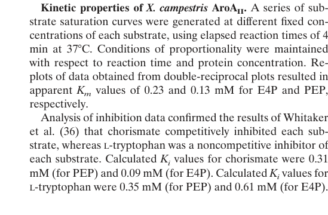

## Question

# Gene Research for Functional Annotation

## ⚠️ CRITICAL: Gene/Protein Identification Context

**BEFORE YOU BEGIN RESEARCH:** You MUST verify you are researching the CORRECT gene/protein. Gene symbols can be ambiguous, especially for less well-characterized genes from non-model organisms.

### Target Gene/Protein Identity (from UniProt):
- **UniProt Accession:** Q88LR3
- **Protein Description:** RecName: Full=Phospho-2-dehydro-3-deoxyheptonate aldolase {ECO:0000256|RuleBase:RU363071}; EC=2.5.1.54 {ECO:0000256|RuleBase:RU363071};
- **Gene Information:** Name=aroH {ECO:0000313|EMBL:AAN67485.1}; OrderedLocusNames=PP_1866 {ECO:0000313|EMBL:AAN67485.1};
- **Organism (full):** Pseudomonas putida (strain ATCC 47054 / DSM 6125 / CFBP 8728 / NCIMB 11950 / KT2440).
- **Protein Family:** Belongs to the class-II DAHP synthase family.
- **Key Domains:** Aldolase_TIM. (IPR013785); DAHP_synth_2. (IPR002480); DAHP_synth_2 (PF01474)

### MANDATORY VERIFICATION STEPS:

1. **Check if the gene symbol "aroH" matches the protein description above**
2. **Verify the organism is correct:** Pseudomonas putida (strain ATCC 47054 / DSM 6125 / CFBP 8728 / NCIMB 11950 / KT2440).
3. **Check if protein family/domains align with what you find in literature**
4. **If you find literature for a DIFFERENT gene with the same or similar symbol, STOP**

### If Gene Symbol is Ambiguous or You Cannot Find Relevant Literature:

**DO NOT PROCEED WITH RESEARCH ON A DIFFERENT GENE.** Instead:
- State clearly: "The gene symbol 'aroH' is ambiguous or literature is limited for this specific protein"
- Explain what you found (e.g., "Found extensive literature on a different gene with the same symbol in a different organism")
- Describe the protein based ONLY on the UniProt information provided above
- Suggest that the protein function can be inferred from domain/family information

### Research Target:

Please provide a comprehensive research report on the gene **aroH** (gene ID: aroH, UniProt: Q88LR3) in PSEPK.

The research report should be a detailed narrative explaining the function, biological processes, and localization of the gene product. Citations should be given for all claims.

You should prioritize authoritative reviews and primary scientific literature when conducting research. You can supplement
this with annotations you find in gene/protein databases, but these can be outdated or inaccurate.

We are specifically interested in the primary function of the gene - for enzymes, what reaction is catalyzed, and what is the substrate specificity? For transporters, what is the substrate? For structural proteins or adapters, what is the broader structural role? For signaling molecules, what is the role in the pathway.

We are interested in where in or outside the cell the gene product carries out its function.

We are also interested in the signaling or biochemical pathways in which the gene functions. We are less interested in broad pleiotropic effects, except where these elucidate the precise role.

Include evidence where possible. We are interested in both experimental evidence as well as inference from structure, evolution, or bioinformatic analysis. Precise studies should be prioritized over high-throughput, where available.

## Output

Question: You are an expert researcher providing comprehensive, well-cited information.

Provide detailed information focusing on:
1. Key concepts and definitions with current understanding
2. Recent developments and latest research (prioritize 2023-2024 sources)
3. Current applications and real-world implementations
4. Expert opinions and analysis from authoritative sources
5. Relevant statistics and data from recent studies

Format as a comprehensive research report with proper citations. Include URLs and publication dates where available.
Always prioritize recent, authoritative sources and provide specific citations for all major claims.

# Gene Research for Functional Annotation

## ⚠️ CRITICAL: Gene/Protein Identification Context

**BEFORE YOU BEGIN RESEARCH:** You MUST verify you are researching the CORRECT gene/protein. Gene symbols can be ambiguous, especially for less well-characterized genes from non-model organisms.

### Target Gene/Protein Identity (from UniProt):
- **UniProt Accession:** Q88LR3
- **Protein Description:** RecName: Full=Phospho-2-dehydro-3-deoxyheptonate aldolase {ECO:0000256|RuleBase:RU363071}; EC=2.5.1.54 {ECO:0000256|RuleBase:RU363071};
- **Gene Information:** Name=aroH {ECO:0000313|EMBL:AAN67485.1}; OrderedLocusNames=PP_1866 {ECO:0000313|EMBL:AAN67485.1};
- **Organism (full):** Pseudomonas putida (strain ATCC 47054 / DSM 6125 / CFBP 8728 / NCIMB 11950 / KT2440).
- **Protein Family:** Belongs to the class-II DAHP synthase family.
- **Key Domains:** Aldolase_TIM. (IPR013785); DAHP_synth_2. (IPR002480); DAHP_synth_2 (PF01474)

### MANDATORY VERIFICATION STEPS:

1. **Check if the gene symbol "aroH" matches the protein description above**
2. **Verify the organism is correct:** Pseudomonas putida (strain ATCC 47054 / DSM 6125 / CFBP 8728 / NCIMB 11950 / KT2440).
3. **Check if protein family/domains align with what you find in literature**
4. **If you find literature for a DIFFERENT gene with the same or similar symbol, STOP**

### If Gene Symbol is Ambiguous or You Cannot Find Relevant Literature:

**DO NOT PROCEED WITH RESEARCH ON A DIFFERENT GENE.** Instead:
- State clearly: "The gene symbol 'aroH' is ambiguous or literature is limited for this specific protein"
- Explain what you found (e.g., "Found extensive literature on a different gene with the same symbol in a different organism")
- Describe the protein based ONLY on the UniProt information provided above
- Suggest that the protein function can be inferred from domain/family information

### Research Target:

Please provide a comprehensive research report on the gene **aroH** (gene ID: aroH, UniProt: Q88LR3) in PSEPK.

The research report should be a detailed narrative explaining the function, biological processes, and localization of the gene product. Citations should be given for all claims.

You should prioritize authoritative reviews and primary scientific literature when conducting research. You can supplement
this with annotations you find in gene/protein databases, but these can be outdated or inaccurate.

We are specifically interested in the primary function of the gene - for enzymes, what reaction is catalyzed, and what is the substrate specificity? For transporters, what is the substrate? For structural proteins or adapters, what is the broader structural role? For signaling molecules, what is the role in the pathway.

We are interested in where in or outside the cell the gene product carries out its function.

We are also interested in the signaling or biochemical pathways in which the gene functions. We are less interested in broad pleiotropic effects, except where these elucidate the precise role.

Include evidence where possible. We are interested in both experimental evidence as well as inference from structure, evolution, or bioinformatic analysis. Precise studies should be prioritized over high-throughput, where available.

## Research report: *Pseudomonas putida* KT2440 **aroH** (PP_1866; UniProt Q88LR3)

### Executive summary
The target protein (UniProt Q88LR3; locus PP_1866; gene symbol **aroH**) is annotated as a **class-II (type-II) 3-deoxy-D-arabino-heptulosonate 7-phosphate synthase** (DAH7PS; DAHP synthase; EC 2.5.1.54), catalyzing the **first committed step** into the shikimate pathway by condensing **phosphoenolpyruvate (PEP)** and **erythrose-4-phosphate (E4P)** to produce **DAHP/DAH7P**, a precursor to **chorismate** and ultimately aromatic amino acids and many aromatic metabolites. Across bacteria, **AroH is typically the tryptophan-inhibited DAHP synthase isoenzyme**, and *P. putida* KT2440 shikimate-pathway engineering work reiterates this isoenzyme logic. However, **direct biochemical/structural characterization of *P. putida* KT2440 AroH (Q88LR3) itself was not identified in the retrieved literature**, so several mechanistic points must be treated as **family-level inference** supported by characterized type-II DAH7PS enzymes in other bacteria. (wang2022uncoveringtherole pages 10-12, sterritt2018structuralandfunctional pages 1-2, dias2023fromdegraderto pages 4-6)

### 1) Key concepts and definitions (current understanding)

#### 1.1 DAHP synthase / DAH7PS and the shikimate pathway
DAHP synthase (DAH7PS) catalyzes an **aldol-like condensation** of **PEP + E4P → DAHP (DAH7P)**, which is widely considered the **entry/first committed step** of the shikimate pathway toward chorismate and downstream aromatic metabolites. (wang2022uncoveringtherole pages 10-12, gosset2001microbialoriginof pages 1-2, sterritt2018structuralandfunctional pages 1-2)

In many bacteria, multiple DAHP synthase isoenzymes exist, and their regulation partitions flux in response to aromatic amino acids; in this framework, **AroH is the tryptophan-sensitive isoenzyme**. (wang2022uncoveringtherole pages 10-12, dias2023fromdegraderto pages 4-6)

#### 1.2 “Class-II/type-II” DAHP synthase family (relevant to Q88LR3)
DAH7PS enzymes are commonly grouped into **type I and type II**. Characterized type-II enzymes share a **(β/α)8 barrel (TIM-barrel) fold**, a **conserved divalent metal-binding site**, and conserved substrate-binding features. (sterritt2018structuralandfunctional pages 1-2)

Sterritt et al. further emphasize that type-II DAH7PS enzymes may use diverse allosteric architectures; some have extra-barrel structural extensions generating distinct allosteric sites for aromatic amino acids, while others lack these elements and thereby display different regulation and oligomeric assembly. (sterritt2018structuralandfunctional pages 1-2)

### 2) Target verification and gene/protein identity

#### 2.1 Symbol ambiguity check
The gene symbol **aroH** can denote different functions in different organisms; within bacterial shikimate-pathway nomenclature, it commonly denotes a DAHP synthase isoenzyme (tryptophan-inhibited). In the retrieved *P. putida* KT2440 engineering literature, the AroF/AroG/AroH triad is explicitly discussed as DAHP synthases inhibited by Tyr/Phe/Trp, respectively—consistent with the UniProt-supplied identity for Q88LR3. (dias2023fromdegraderto pages 4-6, dias2023fromdegraderto pages 2-4)

#### 2.2 Organism and locus context
No retrieved paper explicitly mentions **PP_1866** or **UniProt Q88LR3** by accession in the text examined. Therefore, *P. putida* KT2440-specific conclusions are based on (i) the user-provided UniProt identity and (ii) *P. putida* KT2440 pathway-engineering studies that describe the DAHP-synthase isoenzyme logic that includes AroH. (dias2023fromdegraderto pages 4-6, yu2016metabolicengineeringof pages 1-3)

### 3) Molecular function: reaction, substrate specificity, and mechanism

#### 3.1 Primary enzymatic reaction (AroH/DAH7PS)
Across DAHP synthases, the core reaction is the condensation of **PEP** and **E4P** to yield **DAHP/DAH7P**. This reaction is stated directly in Pseudomonas DAHP synthase context (phzC/DAH7PS) and in broader DAH7PS structural analysis. (wang2022uncoveringtherole pages 10-12, sterritt2018structuralandfunctional pages 1-2)

For *P. putida* KT2440 AroH (Q88LR3), **no experimental substrate-range studies** were retrieved; thus, the most defensible annotation is that AroH is a **canonical DAH7PS using PEP and E4P** in central metabolism. (wang2022uncoveringtherole pages 10-12)

#### 3.2 Metal dependence (family-level evidence)
A characterized class-II DAH7PS (Xanthomonas campestris AroAII) shows strong metal dependence: activity is abolished by EDTA and can be restored by divalent metals (e.g., Mn2+ partially restoring activity). (gosset2001microbialoriginof pages 5-7, gosset2001microbialoriginof pages 7-8)

This supports the inference that class-II DAH7PS enzymes—including AroH family members—typically require a divalent metal for catalysis, though **the specific metal preference for *P. putida* AroH is not established here**. (sterritt2018structuralandfunctional pages 1-2, gosset2001microbialoriginof pages 5-7)

#### 3.3 Quantitative kinetics and inhibition constants (comparator class-II enzyme)
Because **P. putida AroH-specific kinetics were not found**, the best available quantitative reference in the retrieved corpus is the class-II AroAII enzyme from *X. campestris* (Gosset et al., 2001). Reported apparent Michaelis constants were **Km(PEP) = 0.13 mM** and **Km(E4P) = 0.23 mM**. (gosset2001microbialoriginof pages 5-7, gosset2001microbialoriginof media 69aabd91)

Regulatory inhibitor constants in this class-II example include:
- **Chorismate** competitive inhibition: **Ki = 0.31 mM** (competitive vs PEP) and **Ki = 0.09 mM** (competitive vs E4P). (gosset2001microbialoriginof pages 5-7, gosset2001microbialoriginof pages 7-8)
- **L-tryptophan** noncompetitive inhibition: **Ki = 0.35 mM** (vs PEP) and **Ki = 0.61 mM** (vs E4P). (gosset2001microbialoriginof pages 5-7, gosset2001microbialoriginof pages 7-8)

These values provide an order-of-magnitude view of inhibitor potency in a class-II DAH7PS, but they should not be treated as parameters for *P. putida* KT2440 AroH without direct measurement. (gosset2001microbialoriginof pages 5-7)

### 4) Biological role and pathways in *P. putida* KT2440

#### 4.1 Role in aromatic amino acid and chorismate-derived metabolism
DAH7PS catalyzes the first committed step into the shikimate pathway, which produces chorismate as a branchpoint precursor for aromatic amino acids and many aromatic metabolites. (gosset2001microbialoriginof pages 1-2, sterritt2018structuralandfunctional pages 1-2)

In *Pseudomonas* systems, DAH7PS entry can also supply specialized aromatic secondary metabolites (e.g., phenazine/pyocyanin routes), reinforcing that DAH7PS enzymes can couple primary and secondary metabolism depending on paralog context and regulation. (sterritt2018structuralandfunctional pages 1-2, wang2022uncoveringtherole pages 1-3)

#### 4.2 Regulation and isoenzyme logic (AroF/AroG/AroH)
Multiple sources reiterate the common regulatory logic that **AroF, AroG, and AroH are feedback inhibited by tyrosine, phenylalanine, and tryptophan**, respectively, situating AroH as the Trp-sensitive control point. (wang2022uncoveringtherole pages 10-12, dias2023fromdegraderto pages 4-6, dias2023fromdegraderto pages 2-4)

Sterritt et al. emphasize that type-II DAH7PS allostery can be implemented through different structural “componentry”; some type-II enzymes have additional structural extensions that create allosteric sites and enable complex feedback regimes, while other type-II enzymes (including a Pseudomonas phenazine-associated enzyme) lack those structural elements and therefore differ in inhibition behavior and oligomerization. This underscores that **the existence and mechanism of AroH allostery must be validated experimentally for each organism/enzyme**. (sterritt2018structuralandfunctional pages 1-2)

### 5) Subcellular localization

For a canonical shikimate-pathway DAH7PS such as AroH, the most plausible localization is **cytosolic**, because its substrates (PEP, E4P) are soluble intermediates of central metabolism. This is a functional inference rather than a direct localization measurement for *P. putida* AroH in the retrieved corpus. (wang2022uncoveringtherole pages 10-12)

Importantly, a class-II DAH7PS example (*X. campestris* AroAII) was predicted by PSORT to have a **transmembrane region** and a topology consistent with a membrane-anchored N-terminus and cytosolic catalytic domain, indicating that **membrane association is possible in some class-II DAH7PS lineages**. (gosset2001microbialoriginof pages 5-7)

Thus, while **cytosolic localization is the best default annotation for *P. putida* AroH**, class-II family diversity warrants checking N-terminal features/topology in the specific sequence when possible. (gosset2001microbialoriginof pages 10-11, gosset2001microbialoriginof pages 5-7)

### 6) Recent developments and latest research (prioritizing 2023–2024)

#### 6.1 2023: *P. putida* KT2440 shikimate flux redirection to gallic acid
Dias et al. (published 2023-11; *International Microbiology*) engineered *P. putida* KT2440 from a **gallic-acid degrader to a producer** by introducing a heterologous operon (including a feedback-resistant DAHP synthase variant **aroG4 (Pro150Leu)**) and deleting native catabolic operons (**ΔpcaHG** and **ΔgalTAPR**) to prevent degradation of the target product and intermediate. (dias2023fromdegraderto pages 1-2, dias2023fromdegraderto pages 4-6, dias2023fromdegraderto pages 2-4)

The study explicitly re-states DAHP synthase isoenzyme inhibition logic: aromatic amino acids inhibit DAHP synthases, with **AroH inhibited by tryptophan**. (dias2023fromdegraderto pages 4-6, dias2023fromdegraderto pages 2-4)

#### 6.2 2024: structural/allosteric themes remain central (but KT2440 AroH-specific updates not found)
No 2023–2024 primary papers directly characterizing *P. putida* KT2440 AroH (Q88LR3) were retrieved. The closest “authoritative mechanistic framework” in the retrieved set remains the structural and regulatory analysis of type-II DAH7PS enzymes (e.g., Sterritt et al. 2018), which emphasizes diversification of allostery and oligomeric assembly among type-II enzymes. (sterritt2018structuralandfunctional pages 1-2)

### 7) Current applications and real-world implementations (with quantitative data)

Because DAH7PS entry is often rate-controlling and feedback regulated, **biotechnological exploitation frequently uses feedback-resistant DAHP synthase variants** (often AroG variants) to push carbon into chorismate-derived products in *P. putida* KT2440. (yu2016metabolicengineeringof pages 1-3, dias2023fromdegraderto pages 4-6)

#### 7.1 para-Hydroxybenzoic acid (PHBA) production in *P. putida* KT2440 (2016)
Yu et al. (published 2016-11; *Frontiers in Bioengineering and Biotechnology*) engineered *P. putida* KT2440 for PHBA production from glucose via chorismate by overexpressing **E. coli ubiC (chorismate lyase)** and a **feedback-resistant DAHP synthase variant aroG D146N**; they also deleted **pobA** (to prevent product degradation) and **pheA**/**trpE** (to reduce chorismate drain to aromatic amino acids), and deleted **hexR** to increase E4P/NADPH availability. (yu2016metabolicengineeringof pages 1-3, yu2016metabolicengineeringof pages 5-6)

Reported performance: **maximum 1.73 g/L PHBA** and **18.1% carbon yield (C-mol/C-mol)** in a non-optimized fed-batch process—an example of direct industrially relevant output linked to shikimate-pathway entry control. (yu2016metabolicengineeringof pages 1-3)

#### 7.2 Gallic acid production in *P. putida* KT2440 (2023)
Dias et al. reported **346.7 ± 0.004 mg/L gallic acid after 72 h** in shaker culture following deletions that blocked degradation plus expression of a synthetic operon (including a feedback-resistant DAHP synthase variant). (dias2023fromdegraderto pages 1-2)

### 8) Expert opinions and analysis (authoritative sources)

A key expert-level insight from structural enzymology is that type-II DAH7PS enzymes retain a conserved catalytic scaffold (TIM barrel, metal-binding site) while evolving diverse allosteric “modules” and oligomerization strategies. This implies that annotation of AroH as “Trp-inhibited DAH7PS” is reasonable at the pathway level, but **the precise molecular mechanism and strength of inhibition can vary substantially by lineage and should not be assumed without measurement**. (sterritt2018structuralandfunctional pages 1-2)

Additionally, the class-II AroAII work emphasizes that in some organisms a class-II enzyme can be the sole DAHP synthase supporting primary aromatic amino acid synthesis, and that sequential feedback inhibition by chorismate and tryptophan is possible in class-II enzymes—highlighting why DAH7PS is a frequent metabolic-engineering target. (gosset2001microbialoriginof pages 1-2, gosset2001microbialoriginof pages 5-7)

### 9) Evidence gaps and confidence assessment (for Q88LR3 specifically)

**High confidence (family/pathway level):**
- AroH is a DAH7PS catalyzing **PEP + E4P → DAHP/DAH7P** and feeding the shikimate pathway. (wang2022uncoveringtherole pages 10-12, sterritt2018structuralandfunctional pages 1-2)
- AroH is commonly described as the **Trp-inhibited** DAHP synthase isoenzyme in bacterial nomenclature, reiterated in *P. putida* KT2440 context. (dias2023fromdegraderto pages 4-6, dias2023fromdegraderto pages 2-4)

**Moderate confidence (structural/mechanistic inference):**
- Type-II DAH7PS enzymes generally use a TIM-barrel fold and a conserved metal-binding site, but exact allostery differs among subtypes. (sterritt2018structuralandfunctional pages 1-2)

**Low confidence / not established for KT2440 AroH in retrieved data:**
- AroH-specific **Km**, **kcat**, **Ki**, metal preference, oligomeric state, and inhibition mechanism in *P. putida* KT2440.
- Experimental subcellular localization of Q88LR3.

### Summary evidence table
| Annotation aspect | Evidence summary for **aroH / PP_1866 / UniProt Q88LR3** in *Pseudomonas putida* KT2440 | Notes / citations |
|---|---|---|
| Gene/protein identity | Q88LR3 is annotated as **phospho-2-dehydro-3-deoxyheptonate aldolase** (EC 2.5.1.54), i.e. a **DAHP synthase / DAH7PS** family enzyme; ordered locus **PP_1866** and gene name **aroH** match the requested target. Literature on *P. putida* KT2440 is limited, so much mechanistic detail is inferred from class-II DAHP synthase literature and DAHP-synthase isoenzyme conventions. | Functional inference is consistent with DAHP synthase annotations and class-II family discussion; direct *P. putida* biochemical characterization was not found in retrieved evidence. (wang2022uncoveringtherole pages 10-12, sterritt2018structuralandfunctional pages 1-2) |
| Enzyme family / structural class | Best-supported assignment is **class-II / type-II DAH7PS**. Characterized type-II DAH7PS enzymes share a **(β/α)8 TIM-barrel fold**, conserved metal-binding site, and conserved PEP/E4P-binding residues. This is compatible with the UniProt/InterPro/Pfam context for Q88LR3 (**PF01474 / DAHP_synth_2**). | Type-II DAH7PS structural features were described directly for characterized enzymes; application to Q88LR3 is by family inference. (sterritt2018structuralandfunctional pages 1-2, wang2022uncoveringtherole pages 15-16) |
| Catalytic reaction / substrate specificity | DAHP synthases catalyze the **condensation of phosphoenolpyruvate (PEP) and erythrose-4-phosphate (E4P) to form DAHP/DAH7P**, the first committed step of the shikimate pathway leading to chorismate and aromatic amino acids. No alternative substrate specificity for *P. putida* AroH was found. | This reaction is directly stated for DAHP synthases and class-II examples. (gosset2001microbialoriginof pages 1-2, wang2022uncoveringtherole pages 10-12, sterritt2018structuralandfunctional pages 1-2) |
| Pathway role in *P. putida* | AroH is inferred to function in **entry into the shikimate pathway**, supplying flux toward chorismate and downstream biosynthesis of **Trp, Phe, Tyr** and other chorismate-derived metabolites. In engineering literature, increasing DAHP synthase flux is treated as a major leverage point for aromatic production in *P. putida*. | Rate control at DAHP synthase is emphasized in shikimate-pathway engineering studies. (wang2022uncoveringtherole pages 1-3, yu2016metabolicengineeringof pages 1-3, yu2016metabolicengineeringof pages 3-4) |
| Feedback regulation | General DAHP-synthase isoenzyme convention assigns **AroH as the Trp-sensitive isoenzyme**; the 2023 *P. putida* engineering study explicitly reiterates that **AroF, AroG, and AroH are inhibited by Tyr, Phe, and Trp, respectively**. For a class-II comparator, *Xanthomonas campestris* AroAII shows **Trp noncompetitive inhibition** and **chorismate competitive inhibition**. | *P. putida* KT2440-specific inhibition constants for AroH were not found. Comparator class-II kinetics: **Km PEP 0.13 mM; Km E4P 0.23 mM; Ki chorismate 0.31 mM vs PEP and 0.09 mM vs E4P; Ki Trp 0.35 mM vs PEP and 0.61 mM vs E4P**. (dias2023fromdegraderto pages 4-6, dias2023fromdegraderto pages 2-4, gosset2001microbialoriginof pages 5-7, gosset2001microbialoriginof media 69aabd91) |
| Localization inference | The most likely localization for *P. putida* AroH is **cytosolic**, because canonical DAHP synthases act on soluble central-metabolism substrates (PEP, E4P) in the shikimate pathway. However, class-II exceptions exist: some bacterial AroAII enzymes, such as the *X. campestris* example, have a predicted **N-terminal membrane/periplasm-associated segment**; smaller AroAII proteins lacking that region are inferred to be soluble. | Thus, membrane association is a known class-II exception, but no evidence was found that **PP_1866/Q88LR3** has such an extension; soluble/cytosolic annotation remains the best inference. (gosset2001microbialoriginof pages 1-2, gosset2001microbialoriginof pages 10-11, gosset2001microbialoriginof pages 5-7) |
| Real-world implementation in *P. putida* (2016) | In *P. putida* KT2440, boosting shikimate-pathway entry with a **feedback-resistant DAHP synthase aroG D146N** plus **ubiC**, combined with deletion of **pobA, pheA, trpE, hexR**, enabled **para-hydroxybenzoic acid (PHBA)** production. | Reported best performance: **1.73 g/L PHBA** and **18.1% C-mol/C-mol** in non-optimized fed-batch. This shows the practical importance of relieving DAHP synthase control, even though the engineered enzyme was AroG rather than native AroH. (yu2016metabolicengineeringof pages 1-3, yu2016metabolicengineeringof pages 5-6, yu2016metabolicengineeringof pages 3-4) |
| Real-world implementation in *P. putida* (2023) | A 2023 KT2440 gallic-acid study used a heterologous **feedback-resistant aroG4 (Pro150Leu)** with downstream pathway genes and deletion of **pcaHG** and **galTAPR** to redirect shikimate-derived flux. The study again states AroH is the **Trp-inhibited** DAHP synthase isoenzyme. | Final reported production: **346.7 ± 0.004 mg/L gallic acid after 72 h** in shaker culture. This further supports DAHP-synthase deregulation as a real-world strategy in *P. putida* aromatic bioproduction. (dias2023fromdegraderto pages 4-6, dias2023fromdegraderto pages 2-4, dias2023fromdegraderto pages 1-2) |

*Table: This table summarizes the strongest available evidence for functional annotation of *Pseudomonas putida* KT2440 aroH (Q88LR3/PP_1866), combining direct *P. putida* pathway-engineering evidence with mechanistic data from characterized class-II DAHP synthases. It is useful for separating target-specific facts from family-level inference where direct biochemical characterization is limited.*

### Key references (with URLs and publication dates when available)
- Dias FMS et al. *From degrader to producer: reversing the gallic acid metabolism of Pseudomonas putida KT2440.* **International Microbiology** (published online 2023; issue 2023-11). https://doi.org/10.1007/s10123-022-00282-5 (dias2023fromdegraderto pages 1-2)
- Yu S et al. *Metabolic Engineering of Pseudomonas putida KT2440 for the Production of para-Hydroxy Benzoic Acid.* **Frontiers in Bioengineering and Biotechnology** (2016-11). https://doi.org/10.3389/fbioe.2016.00090 (yu2016metabolicengineeringof pages 1-3)
- Sterritt OW et al. *Structural and functional characterisation… defines a new DAH7PS subclass.* **Bioscience Reports** (2018-09). https://doi.org/10.1042/bsr20181605 (sterritt2018structuralandfunctional pages 1-2)
- Gosset G et al. *Microbial Origin of Plant-Type… chorismate- and tryptophan-regulated enzyme from Xanthomonas campestris.* **Journal of Bacteriology** (2001-07). https://doi.org/10.1128/jb.183.13.4061-4070.2001 (gosset2001microbialoriginof pages 5-7)

References

1. (wang2022uncoveringtherole pages 10-12): Songwei Wang, Dongliang Liu, Muhammad Bilal, Wei Wang, and Xuehong Zhang. Uncovering the role of phzc as dahp synthase in shikimate pathway of pseudomonas chlororaphis ht66. Biology, 11:86, Jan 2022. URL: https://doi.org/10.3390/biology11010086, doi:10.3390/biology11010086. This article has 12 citations.

2. (sterritt2018structuralandfunctional pages 1-2): O. W. Sterritt, Eric J. M. Lang, Sarah A Kessans, T. Ryan, B. Demeler, G. Jameson, and E. Parker. Structural and functional characterisation of the entry point to pyocyanin biosynthesis in pseudomonas aeruginosa defines a new 3-deoxy-d-arabino-heptulosonate 7-phosphate synthase subclass. Bioscience Reports, Sep 2018. URL: https://doi.org/10.1042/bsr20181605, doi:10.1042/bsr20181605. This article has 23 citations and is from a peer-reviewed journal.

3. (dias2023fromdegraderto pages 4-6): Felipe M. S. Dias, Raoní K. Pantoja, José Gregório C. Gomez, and Luiziana F. Silva. From degrader to producer: reversing the gallic acid metabolism of pseudomonas putida kt2440. International Microbiology, 26:243-255, Nov 2023. URL: https://doi.org/10.1007/s10123-022-00282-5, doi:10.1007/s10123-022-00282-5. This article has 7 citations and is from a peer-reviewed journal.

4. (gosset2001microbialoriginof pages 1-2): Guillermo Gosset, Carol A. Bonner, and Roy A. Jensen. Microbial origin of plant-type 2-keto-3-deoxy-d-arabino-heptulosonate 7-phosphate synthases, exemplified by the chorismate- and tryptophan-regulated enzyme from xanthomonas campestris. Journal of Bacteriology, 183:4061-4070, Jul 2001. URL: https://doi.org/10.1128/jb.183.13.4061-4070.2001, doi:10.1128/jb.183.13.4061-4070.2001. This article has 84 citations and is from a peer-reviewed journal.

5. (dias2023fromdegraderto pages 2-4): Felipe M. S. Dias, Raoní K. Pantoja, José Gregório C. Gomez, and Luiziana F. Silva. From degrader to producer: reversing the gallic acid metabolism of pseudomonas putida kt2440. International Microbiology, 26:243-255, Nov 2023. URL: https://doi.org/10.1007/s10123-022-00282-5, doi:10.1007/s10123-022-00282-5. This article has 7 citations and is from a peer-reviewed journal.

6. (yu2016metabolicengineeringof pages 1-3): Shiqin Yu, Manuel R. Plan, Gal Winter, and Jens O. Krömer. Metabolic engineering of pseudomonas putida kt2440 for the production of para-hydroxy benzoic acid. Frontiers in Bioengineering and Biotechnology, Nov 2016. URL: https://doi.org/10.3389/fbioe.2016.00090, doi:10.3389/fbioe.2016.00090. This article has 76 citations.

7. (gosset2001microbialoriginof pages 5-7): Guillermo Gosset, Carol A. Bonner, and Roy A. Jensen. Microbial origin of plant-type 2-keto-3-deoxy-d-arabino-heptulosonate 7-phosphate synthases, exemplified by the chorismate- and tryptophan-regulated enzyme from xanthomonas campestris. Journal of Bacteriology, 183:4061-4070, Jul 2001. URL: https://doi.org/10.1128/jb.183.13.4061-4070.2001, doi:10.1128/jb.183.13.4061-4070.2001. This article has 84 citations and is from a peer-reviewed journal.

8. (gosset2001microbialoriginof pages 7-8): Guillermo Gosset, Carol A. Bonner, and Roy A. Jensen. Microbial origin of plant-type 2-keto-3-deoxy-d-arabino-heptulosonate 7-phosphate synthases, exemplified by the chorismate- and tryptophan-regulated enzyme from xanthomonas campestris. Journal of Bacteriology, 183:4061-4070, Jul 2001. URL: https://doi.org/10.1128/jb.183.13.4061-4070.2001, doi:10.1128/jb.183.13.4061-4070.2001. This article has 84 citations and is from a peer-reviewed journal.

9. (gosset2001microbialoriginof media 69aabd91): Guillermo Gosset, Carol A. Bonner, and Roy A. Jensen. Microbial origin of plant-type 2-keto-3-deoxy-d-arabino-heptulosonate 7-phosphate synthases, exemplified by the chorismate- and tryptophan-regulated enzyme from xanthomonas campestris. Journal of Bacteriology, 183:4061-4070, Jul 2001. URL: https://doi.org/10.1128/jb.183.13.4061-4070.2001, doi:10.1128/jb.183.13.4061-4070.2001. This article has 84 citations and is from a peer-reviewed journal.

10. (wang2022uncoveringtherole pages 1-3): Songwei Wang, Dongliang Liu, Muhammad Bilal, Wei Wang, and Xuehong Zhang. Uncovering the role of phzc as dahp synthase in shikimate pathway of pseudomonas chlororaphis ht66. Biology, 11:86, Jan 2022. URL: https://doi.org/10.3390/biology11010086, doi:10.3390/biology11010086. This article has 12 citations.

11. (gosset2001microbialoriginof pages 10-11): Guillermo Gosset, Carol A. Bonner, and Roy A. Jensen. Microbial origin of plant-type 2-keto-3-deoxy-d-arabino-heptulosonate 7-phosphate synthases, exemplified by the chorismate- and tryptophan-regulated enzyme from xanthomonas campestris. Journal of Bacteriology, 183:4061-4070, Jul 2001. URL: https://doi.org/10.1128/jb.183.13.4061-4070.2001, doi:10.1128/jb.183.13.4061-4070.2001. This article has 84 citations and is from a peer-reviewed journal.

12. (dias2023fromdegraderto pages 1-2): Felipe M. S. Dias, Raoní K. Pantoja, José Gregório C. Gomez, and Luiziana F. Silva. From degrader to producer: reversing the gallic acid metabolism of pseudomonas putida kt2440. International Microbiology, 26:243-255, Nov 2023. URL: https://doi.org/10.1007/s10123-022-00282-5, doi:10.1007/s10123-022-00282-5. This article has 7 citations and is from a peer-reviewed journal.

13. (yu2016metabolicengineeringof pages 5-6): Shiqin Yu, Manuel R. Plan, Gal Winter, and Jens O. Krömer. Metabolic engineering of pseudomonas putida kt2440 for the production of para-hydroxy benzoic acid. Frontiers in Bioengineering and Biotechnology, Nov 2016. URL: https://doi.org/10.3389/fbioe.2016.00090, doi:10.3389/fbioe.2016.00090. This article has 76 citations.

14. (wang2022uncoveringtherole pages 15-16): Songwei Wang, Dongliang Liu, Muhammad Bilal, Wei Wang, and Xuehong Zhang. Uncovering the role of phzc as dahp synthase in shikimate pathway of pseudomonas chlororaphis ht66. Biology, 11:86, Jan 2022. URL: https://doi.org/10.3390/biology11010086, doi:10.3390/biology11010086. This article has 12 citations.

15. (yu2016metabolicengineeringof pages 3-4): Shiqin Yu, Manuel R. Plan, Gal Winter, and Jens O. Krömer. Metabolic engineering of pseudomonas putida kt2440 for the production of para-hydroxy benzoic acid. Frontiers in Bioengineering and Biotechnology, Nov 2016. URL: https://doi.org/10.3389/fbioe.2016.00090, doi:10.3389/fbioe.2016.00090. This article has 76 citations.

## Artifacts

- [Edison artifact artifact-00](aroH-deep-research-falcon_artifacts/artifact-00.md)

## Citations

1. sterritt2018structuralandfunctional pages 1-2
2. wang2022uncoveringtherole pages 10-12
3. gosset2001microbialoriginof pages 5-7
4. yu2016metabolicengineeringof pages 1-3
5. dias2023fromdegraderto pages 1-2
6. dias2023fromdegraderto pages 4-6
7. gosset2001microbialoriginof pages 1-2
8. dias2023fromdegraderto pages 2-4
9. gosset2001microbialoriginof pages 7-8
10. wang2022uncoveringtherole pages 1-3
11. gosset2001microbialoriginof pages 10-11
12. yu2016metabolicengineeringof pages 5-6
13. wang2022uncoveringtherole pages 15-16
14. yu2016metabolicengineeringof pages 3-4
15. https://doi.org/10.1007/s10123-022-00282-5
16. https://doi.org/10.3389/fbioe.2016.00090
17. https://doi.org/10.1042/bsr20181605
18. https://doi.org/10.1128/jb.183.13.4061-4070.2001
19. https://doi.org/10.3390/biology11010086,
20. https://doi.org/10.1042/bsr20181605,
21. https://doi.org/10.1007/s10123-022-00282-5,
22. https://doi.org/10.1128/jb.183.13.4061-4070.2001,
23. https://doi.org/10.3389/fbioe.2016.00090,