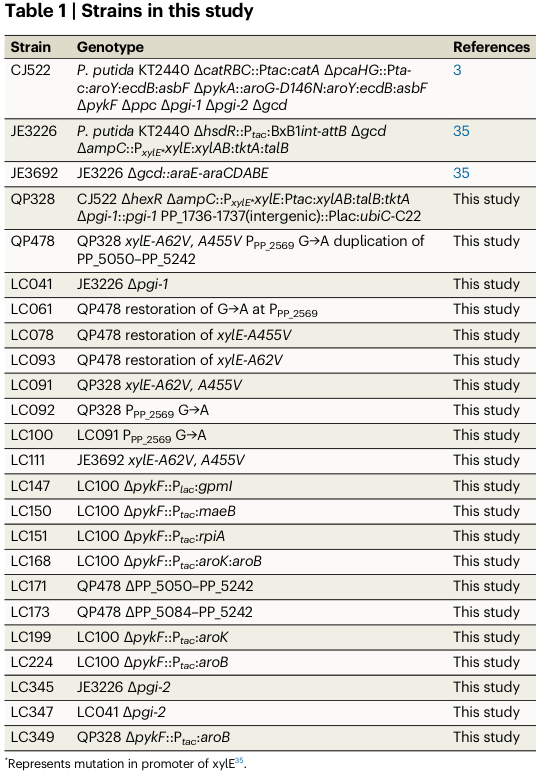

## Question

# Gene Research for Functional Annotation

## ⚠️ CRITICAL: Gene/Protein Identification Context

**BEFORE YOU BEGIN RESEARCH:** You MUST verify you are researching the CORRECT gene/protein. Gene symbols can be ambiguous, especially for less well-characterized genes from non-model organisms.

### Target Gene/Protein Identity (from UniProt):
- **UniProt Accession:** Q88CV1
- **Protein Description:** RecName: Full=Shikimate kinase {ECO:0000255|HAMAP-Rule:MF_00109}; Short=SK {ECO:0000255|HAMAP-Rule:MF_00109}; EC=2.7.1.71 {ECO:0000255|HAMAP-Rule:MF_00109};
- **Gene Information:** Name=aroK {ECO:0000255|HAMAP-Rule:MF_00109}; OrderedLocusNames=PP_5079;
- **Organism (full):** Pseudomonas putida (strain ATCC 47054 / DSM 6125 / CFBP 8728 / NCIMB 11950 / KT2440).
- **Protein Family:** Belongs to the shikimate kinase family. {ECO:0000255|HAMAP-
- **Key Domains:** P-loop_NTPase. (IPR027417); Shikimate/glucono_kinase. (IPR031322); Shikimate_kinase/TSH1. (IPR000623); Shikimate_kinase_CS. (IPR023000); SKI (PF01202)

### MANDATORY VERIFICATION STEPS:

1. **Check if the gene symbol "aroK" matches the protein description above**
2. **Verify the organism is correct:** Pseudomonas putida (strain ATCC 47054 / DSM 6125 / CFBP 8728 / NCIMB 11950 / KT2440).
3. **Check if protein family/domains align with what you find in literature**
4. **If you find literature for a DIFFERENT gene with the same or similar symbol, STOP**

### If Gene Symbol is Ambiguous or You Cannot Find Relevant Literature:

**DO NOT PROCEED WITH RESEARCH ON A DIFFERENT GENE.** Instead:
- State clearly: "The gene symbol 'aroK' is ambiguous or literature is limited for this specific protein"
- Explain what you found (e.g., "Found extensive literature on a different gene with the same symbol in a different organism")
- Describe the protein based ONLY on the UniProt information provided above
- Suggest that the protein function can be inferred from domain/family information

### Research Target:

Please provide a comprehensive research report on the gene **aroK** (gene ID: aroK, UniProt: Q88CV1) in PSEPK.

The research report should be a detailed narrative explaining the function, biological processes, and localization of the gene product. Citations should be given for all claims.

You should prioritize authoritative reviews and primary scientific literature when conducting research. You can supplement
this with annotations you find in gene/protein databases, but these can be outdated or inaccurate.

We are specifically interested in the primary function of the gene - for enzymes, what reaction is catalyzed, and what is the substrate specificity? For transporters, what is the substrate? For structural proteins or adapters, what is the broader structural role? For signaling molecules, what is the role in the pathway.

We are interested in where in or outside the cell the gene product carries out its function.

We are also interested in the signaling or biochemical pathways in which the gene functions. We are less interested in broad pleiotropic effects, except where these elucidate the precise role.

Include evidence where possible. We are interested in both experimental evidence as well as inference from structure, evolution, or bioinformatic analysis. Precise studies should be prioritized over high-throughput, where available.

## Output

Question: You are an expert researcher providing comprehensive, well-cited information.

Provide detailed information focusing on:
1. Key concepts and definitions with current understanding
2. Recent developments and latest research (prioritize 2023-2024 sources)
3. Current applications and real-world implementations
4. Expert opinions and analysis from authoritative sources
5. Relevant statistics and data from recent studies

Format as a comprehensive research report with proper citations. Include URLs and publication dates where available.
Always prioritize recent, authoritative sources and provide specific citations for all major claims.

# Gene Research for Functional Annotation

## ⚠️ CRITICAL: Gene/Protein Identification Context

**BEFORE YOU BEGIN RESEARCH:** You MUST verify you are researching the CORRECT gene/protein. Gene symbols can be ambiguous, especially for less well-characterized genes from non-model organisms.

### Target Gene/Protein Identity (from UniProt):
- **UniProt Accession:** Q88CV1
- **Protein Description:** RecName: Full=Shikimate kinase {ECO:0000255|HAMAP-Rule:MF_00109}; Short=SK {ECO:0000255|HAMAP-Rule:MF_00109}; EC=2.7.1.71 {ECO:0000255|HAMAP-Rule:MF_00109};
- **Gene Information:** Name=aroK {ECO:0000255|HAMAP-Rule:MF_00109}; OrderedLocusNames=PP_5079;
- **Organism (full):** Pseudomonas putida (strain ATCC 47054 / DSM 6125 / CFBP 8728 / NCIMB 11950 / KT2440).
- **Protein Family:** Belongs to the shikimate kinase family. {ECO:0000255|HAMAP-
- **Key Domains:** P-loop_NTPase. (IPR027417); Shikimate/glucono_kinase. (IPR031322); Shikimate_kinase/TSH1. (IPR000623); Shikimate_kinase_CS. (IPR023000); SKI (PF01202)

### MANDATORY VERIFICATION STEPS:

1. **Check if the gene symbol "aroK" matches the protein description above**
2. **Verify the organism is correct:** Pseudomonas putida (strain ATCC 47054 / DSM 6125 / CFBP 8728 / NCIMB 11950 / KT2440).
3. **Check if protein family/domains align with what you find in literature**
4. **If you find literature for a DIFFERENT gene with the same or similar symbol, STOP**

### If Gene Symbol is Ambiguous or You Cannot Find Relevant Literature:

**DO NOT PROCEED WITH RESEARCH ON A DIFFERENT GENE.** Instead:
- State clearly: "The gene symbol 'aroK' is ambiguous or literature is limited for this specific protein"
- Explain what you found (e.g., "Found extensive literature on a different gene with the same symbol in a different organism")
- Describe the protein based ONLY on the UniProt information provided above
- Suggest that the protein function can be inferred from domain/family information

### Research Target:

Please provide a comprehensive research report on the gene **aroK** (gene ID: aroK, UniProt: Q88CV1) in PSEPK.

The research report should be a detailed narrative explaining the function, biological processes, and localization of the gene product. Citations should be given for all claims.

You should prioritize authoritative reviews and primary scientific literature when conducting research. You can supplement
this with annotations you find in gene/protein databases, but these can be outdated or inaccurate.

We are specifically interested in the primary function of the gene - for enzymes, what reaction is catalyzed, and what is the substrate specificity? For transporters, what is the substrate? For structural proteins or adapters, what is the broader structural role? For signaling molecules, what is the role in the pathway.

We are interested in where in or outside the cell the gene product carries out its function.

We are also interested in the signaling or biochemical pathways in which the gene functions. We are less interested in broad pleiotropic effects, except where these elucidate the precise role.

Include evidence where possible. We are interested in both experimental evidence as well as inference from structure, evolution, or bioinformatic analysis. Precise studies should be prioritized over high-throughput, where available.

## Research report: Functional annotation of **aroK** (UniProt **Q88CV1**, locus **PP_5079**) in *Pseudomonas putida* KT2440

### 0) Gene/protein identity verification (critical)
The target provided (UniProt Q88CV1; gene **aroK**; ordered locus **PP_5079**) is annotated as **shikimate kinase (SK)**, EC **2.7.1.71**, belonging to the **shikimate kinase family** with P-loop NTPase/“shikimate/glucono_kinase” domain architecture (per user-supplied UniProt context). In the retrieved literature, **aroK** consistently refers to a bacterial **shikimate kinase I** isoenzyme (contrasted with **aroL**, shikimate kinase II), consistent with the UniProt description and EC assignment. (gu2016tunableswitchmediated pages 1-2, niraula2025aromaticaminoacids pages 8-10)

**Limitation:** none of the retrieved papers explicitly cross-references UniProt accession **Q88CV1** or the KT2440 locus tag **PP_5079** in the text excerpts obtained, so KT2440-specific details below are supported by *P. putida* KT2440 studies that manipulate **aroK** at the gene level, combined with general shikimate-kinase enzymology. (ling2022muconicacidproduction pages 2-3, gu2016tunableswitchmediated pages 1-2)

---

### 1) Key concepts and definitions (current understanding)

#### 1.1 Shikimate pathway and the biochemical role of AroK
The **shikimate pathway** is the central biosynthetic route from central carbon metabolism toward **chorismate**, a key branch point precursor for **aromatic amino acids** and numerous aromatic metabolites. Within this pathway, **shikimate kinase (SK; EC 2.7.1.71)** catalyzes the ATP-dependent phosphorylation of **shikimate to shikimate-3-phosphate (S3P)**; this step is required to proceed to **5-enolpyruvyl-shikimate-3-phosphate (EPSP)** and ultimately **chorismate**. (niraula2025aromaticaminoacids pages 8-10)

**Reaction (core functional annotation):**
- Shikimate + ATP → Shikimate-3-phosphate + ADP (SK; EC 2.7.1.71). (niraula2025aromaticaminoacids pages 8-10)

#### 1.2 AroK versus AroL (bacterial isoenzymes)
Many bacteria encode two shikimate kinase isoenzymes:
- **AroK**: shikimate kinase I
- **AroL**: shikimate kinase II

This redundancy is important in both physiology and metabolic engineering: engineered “shikimate-overproducer” strains often **inactivate/decrease** shikimate kinase activity to accumulate shikimate upstream, but complete loss of SK activity can lead to **aromatic auxotrophy** (requiring supplementation with aromatic compounds). (gu2016tunableswitchmediated pages 1-2)

#### 1.3 Structure/function concepts relevant to substrate specificity
While organism-specific kinetics for *P. putida* KT2440 AroK were not retrieved in the accessible excerpts, a recent synthesis of bacterial SK structure–function notes that shikimate-binding can be described via subsites (CX, OCORE, OLID) and that specific conserved residues (e.g., positions corresponding to R60 and R140 in one referenced mapping) are functionally critical; mutating strictly conserved residues severely compromises function in engineering contexts, consistent with strong substrate-enzyme specificity requirements for shikimate recognition. (bo2023multiplemetabolicengineering pages 7-9)

---

### 2) Functional annotation for *P. putida* KT2440 **aroK** (Q88CV1)

#### 2.1 Molecular function (enzyme activity)
**AroK is a shikimate kinase (SK; EC 2.7.1.71)** catalyzing the ATP-dependent phosphorylation of shikimate to shikimate-3-phosphate in the shikimate pathway. (niraula2025aromaticaminoacids pages 8-10, gu2016tunableswitchmediated pages 1-2)

#### 2.2 Biological process / pathway placement
AroK functions in **chorismate biosynthesis** via the shikimate pathway, enabling downstream synthesis of aromatic amino acids and diverse chorismate-derived metabolites. (niraula2025aromaticaminoacids pages 8-10)

#### 2.3 Cellular localization (where it acts)
The retrieved sources explicitly contrast chloroplast-localized shikimate kinase isoforms in algae/plants with bacterial SK functioning without organellar targeting; thus, for bacteria including *P. putida* KT2440, the working assumption supported by this context is that SK is a **soluble, intracellular (cytosolic) enzyme** acting in central metabolism. (niraula2025aromaticaminoacids pages 8-10)

**Limitation:** no KT2440-specific localization experiment (e.g., fractionation, fluorescence tagging) was found in the retrieved set.

---

### 3) Recent developments and latest research (prioritizing 2023–2024)

#### 3.1 KT2440 as an aromatics/synbio chassis (expert synthesis, 2024)
A 2024 authoritative review/perspective describes *P. putida* KT2440’s rise as a synthetic biology chassis and emphasizes that its central metabolism delivers **high NADPH regeneration** (via ED/EDEMP-related architecture), supporting expression of heterologous pathways and tolerance to stress—properties relevant to building shikimate-pathway-derived aromatic production strains. (lorenzo2024pseudomonasputidakt2440 pages 2-4, lorenzo2024pseudomonasputidakt2440 pages 4-7, lorenzo2024pseudomonasputidakt2440 pages 1-2)

This review also highlights KT2440’s native and engineered capabilities in aromatic metabolism and production, citing examples of engineered production of shikimate-derived aromatics such as **phenol, vanillate, and anthranilate**. (lorenzo2024pseudomonasputidakt2440 pages 4-7)

Source: de Lorenzo et al., **2024-07**, *Journal of Bacteriology*. https://doi.org/10.1128/jb.00136-24 (lorenzo2024pseudomonasputidakt2440 pages 2-4)

#### 3.2 2024 “shikimate pathway-dependent catabolism” (SDC) rewiring to near-theoretical yields
A 2024 study reports a major conceptual advance: reprogramming *P. putida* so that growth-supporting catabolism becomes **dependent on shikimate-pathway-derived reactions**, demonstrating substantial metabolic plasticity and enabling very high-yield aromatic production. They report **89% of the maximum theoretical yield** for **4-hydroxybenzoate** in minimal medium and describe adaptive evolution mutations (e.g., in **miaA** and **mexT**) as important contributors. (santos2024shikimatepathwaydependentcatabolism pages 5-7)

Source: dos Santos et al., **2024-08** (preprint server posting). https://doi.org/10.21203/rs.3.rs-4761679/v1 (santos2024shikimatepathwaydependentcatabolism pages 5-7)

#### 3.3 2024 combinatorial pathway engineering to find bottlenecks (pABA)
A 2024 design-of-experiments/combinatorial expression study in *P. putida* quantitatively mapped how varying shikimate- and pABA-pathway gene expression influences production. It reports wide performance spread (2–186.2 mg/L) and improved strains (~232.1 mg/L), identifying **aroB** (not aroK) as a key bottleneck for pABA production under tested conditions, while situating the shikimate pathway as a major industrial node (muconate, tryptophan, salicylic acid, vanillin, 2-phenylethanol). (camposmagana2024combinatorialengineeringreveals pages 1-4)

Source: Campos-Magaña et al., **2024-06** (bioRxiv). https://doi.org/10.1101/2024.06.17.599342 (camposmagana2024combinatorialengineeringreveals pages 1-4)

---

### 4) Current applications and real-world implementations (with *P. putida* examples)

#### 4.1 AroK as a practical flux-control lever in KT2440 muconate bioproduction
A key KT2440 implementation is **cis,cis-muconate production**, a bioprivileged platform chemical. In a high-impact *Nature Communications* study, KT2440-derived strains were engineered with **aroK under the inducible Ptac promoter**, either alone (**ΔpykF::Ptac:aroK**) or together with **aroB** (**ΔpykF::Ptac:aroK:aroB**), demonstrating that **modulating aroK expression** is used in practice to tune shikimate-pathway flux in KT2440-derived production strains. (ling2022muconicacidproduction pages 2-3, ling2022muconicacidproduction media b6590159)

The same study reports **33.7 g/L muconate**, **0.18 g/L/h** productivity, and **46% molar yield** (reported as **92% of maximum theoretical yield**) in the rationally engineered strain context. (ling2022muconicacidproduction pages 2-3)

Source: Ling et al., **2022-08**, *Nature Communications*. https://doi.org/10.1038/s41467-022-32296-y (ling2022muconicacidproduction pages 2-3)

#### 4.2 KT2440 production of gallic acid from glycerol (2023)
A 2023 study demonstrates conversion of glycerol to the antioxidant **gallic acid** in KT2440 by combining heterologous pathway expression with deletions that block product degradation, explicitly leveraging KT2440’s metabolic and chassis advantages. The reported titer is **346.7 ± 0.004 mg/L gallic acid after 72 h** (shake flasks). (dias2023fromdegraderto pages 1-2)

Source: Dias et al., **2023-11**, *International Microbiology*. https://doi.org/10.1007/s10123-022-00282-5 (dias2023fromdegraderto pages 1-2)

---

### 5) Expert opinions and analysis (authoritative sources)

#### 5.1 Why KT2440 is repeatedly chosen for shikimate-pathway aromatics
Across authoritative sources, KT2440 is characterized as an “industriphilic” synthetic biology chassis and “versatile aromatics cell factory,” with repeated emphasis on:
- **High NADPH regeneration** and redox-biased central metabolism, supporting reductive biosynthesis and heterologous pathway operation. (lorenzo2024pseudomonasputidakt2440 pages 2-4, lorenzo2024pseudomonasputidakt2440 pages 4-7)
- **Intrinsic tolerance** to aromatic compounds and possession of oxygenase repertoires to transform them—useful because many aromatics are toxic or require harsh processes. (lorenzo2024pseudomonasputidakt2440 pages 4-7)

These points contextualize aroK’s importance: as a **control point in the shikimate pathway**, aroK expression/activity influences whether carbon proceeds toward chorismate-derived products (desired aromatics) or accumulates upstream intermediates (e.g., shikimate) (gu2016tunableswitchmediated pages 1-2, ling2022muconicacidproduction pages 2-3).

---

### 6) Quantitative statistics and data points from recent and relevant studies

Key quantitative outcomes tied to shikimate-pathway engineering in *P. putida* include:
- **Muconate production (KT2440)**: 33.7 g/L, 0.18 g/L/h, 46% molar yield (92% of max theoretical); includes strains engineered with **Ptac:aroK** (flux control through shikimate pathway). (ling2022muconicacidproduction pages 2-3, ling2022muconicacidproduction media b6590159)
- **Gallic acid production (KT2440)**: 346.7 ± 0.004 mg/L after 72 h from 10 g/L glycerol in shake flasks (as described in excerpt). (dias2023fromdegraderto pages 1-2)
- **pABA production (P. putida, 2024 DoE)**: 2–186.2 mg/L across sampled genotypes; improved to ~232.1 mg/L; identified aroB as bottleneck. (camposmagana2024combinatorialengineeringreveals pages 1-4)
- **4-hydroxybenzoate yield (P. putida, 2024 SDC concept)**: 89% of maximum theoretical yield in minimal medium (yield benchmark claim). (santos2024shikimatepathwaydependentcatabolism pages 5-7)

---

### 7) Evidence summary table
| Claim/Topic | Evidence summary | Organism/context | Quantitative data | Source (with year, DOI URL) |
|---|---|---|---|---|
| Core enzymatic reaction of shikimate kinase | Shikimate kinase (SK; EC 2.7.1.71) phosphorylates shikimate at the C3 hydroxyl using ATP to form shikimate-3-phosphate (S3P), a required step toward EPSP and chorismate in the shikimate pathway (niraula2025aromaticaminoacids pages 8-10) | General bacterial/plant/algal shikimate-pathway context | Reaction: shikimate + ATP -> shikimate-3-phosphate + ADP | Niraula et al., 2025, https://doi.org/10.3390/biotech14010006 |
| Bacterial isoenzymes AroK and AroL | In bacteria, two shikimate kinase isoenzymes are commonly recognized: shikimate kinase I (AroK) and shikimate kinase II (AroL). Engineering studies often repress/delete these enzymes to accumulate shikimate, but full loss causes auxotrophy and necessitates aromatic supplementation (gu2016tunableswitchmediated pages 1-2) | Engineered bacterial shikimate producers, especially E. coli | Example reported for engineered E. coli: 13.15 g/L shikimate in 5-L fed-batch using tunable aroK expression rather than permanent deletion | Gu et al., 2016, https://doi.org/10.1038/srep29745 |
| Shikimate-binding determinants in AroK | Structural/functional analysis of bacterial AroK identifies shikimate-binding subsites CX, OCORE, and OLID. Conserved residues contacting the substrate include positions corresponding to R60 and R140; mutating these severely impaired function/growth in engineering contexts (bo2023multiplemetabolicengineering pages 7-9) | Bacterial AroK, with cited structural work including Helicobacter pylori and other bacterial SKs | No single kinetic value in snippet; severe growth inhibition observed for key conserved-site mutants | Bo et al., 2023, https://doi.org/10.3390/metabo13060747 |
| KT2440-specific aroK manipulation in muconate engineering | In Pseudomonas putida KT2440-derived strains for muconate production, aroK was deliberately overexpressed from Ptac, either alone or together with aroB (e.g., ΔpykF::Ptac:aroK and ΔpykF::Ptac:aroK:aroB), indicating aroK is a practical flux-control point in the native shikimate pathway (ling2022muconicacidproduction pages 2-3) | Pseudomonas putida KT2440 metabolic engineering for muconic acid | Muconate process in study reached 33.7 g/L muconate, 0.18 g/L/h, 46% molar yield (92% of maximum theoretical yield); snippet specifically highlights Ptac:aroK strain designs | Ling et al., 2022, https://doi.org/10.1038/s41467-022-32296-y |
| 2024 pABA combinatorial engineering identifies pathway bottleneck | A 2024 DoE study in P. putida varied shikimate- and pABA-pathway gene expression across 14 representative strains sampled from 512 possible combinations. The analysis identified aroB, not aroK, as a significant bottleneck for pABA production, while noting aroK overexpression had been beneficial in related production contexts (camposmagana2024combinatorialengineeringreveals pages 1-4) | Pseudomonas putida shikimate/pABA pathway engineering | Titers ranged from 2 to 186.2 mg/L initially; second-round designs reached ~232.1 mg/L | Campos-Magaña et al., 2024, https://doi.org/10.1101/2024.06.17.599342 |
| 2024 shikimate pathway-dependent catabolism (SDC) | A 2024 P. putida study rewired metabolism so shikimate-pathway-derived reactions supplied pyruvate, demonstrating strong metabolic plasticity of the pathway relevant to enzymes such as AroK that control flux into downstream aromatic intermediates (santos2024shikimatepathwaydependentcatabolism pages 5-7) | Pseudomonas putida engineered for aromatic production | 89% of maximum theoretical yield for 4-hydroxybenzoate in minimal medium; adapted strains also produced salicylate and 3-hydroxybenzoate at high yields | dos Santos et al., 2024, https://doi.org/10.21203/rs.3.rs-4761679/v1 |
| 2023 real-world aromatic production application in KT2440 | P. putida KT2440 was engineered to produce gallic acid from glycerol using a synthetic operon (aroG4, quiC, pobA*) plus deletions blocking degradation (pcaHG and galTAPR). This shows the practical biotechnological value of controlling shikimate-pathway flux in KT2440, even though aroK itself was not directly manipulated in the snippet (dias2023fromdegraderto pages 1-2) | Pseudomonas putida KT2440 producing gallic acid from glycerol | 346.7 ± 0.004 mg/L gallic acid after 72 h in shake flasks | Dias et al., 2023, https://doi.org/10.1007/s10123-022-00282-5 |

*Table: This table summarizes the most relevant gathered evidence for annotating Pseudomonas putida KT2440 aroK as shikimate kinase, including core reaction chemistry, bacterial isoenzyme context, and KT2440-specific engineering evidence. It is useful for separating direct functional evidence from broader pathway and application-level evidence.*

---

### 8) Practical functional-annotation statement (recommended)
**aroK (UniProt Q88CV1; PP_5079) encodes shikimate kinase (EC 2.7.1.71), a cytosolic ATP-dependent kinase that converts shikimate to shikimate-3-phosphate in the shikimate pathway, enabling downstream EPSP/chorismate formation and thereby aromatic amino acid and aromatic metabolite biosynthesis.** (niraula2025aromaticaminoacids pages 8-10, gu2016tunableswitchmediated pages 1-2)

In *P. putida* KT2440, aroK is repeatedly treated as a **flux-control point** in industrially motivated shikimate-pathway engineering, including muconate production strains where aroK is overexpressed from Ptac in defined genomic backgrounds. (ling2022muconicacidproduction pages 2-3, ling2022muconicacidproduction media b6590159)

---

### 9) Gaps and recommended next evidence to retrieve (to strengthen annotation)
The current evidence set is strong for pathway placement and engineering relevance, but limited for *P. putida* KT2440-specific mechanistic details.

Most impactful missing items would be:
1) **Direct biochemical characterization** (Km/kcat for shikimate/ATP; Mg2+ dependence; substrate scope such as quinate) for KT2440 AroK.
2) **Genetic essentiality/fitness** measurements for KT2440 aroK under defined media (e.g., transposon insertion sequencing) and rescue by aromatic supplementation.
3) **Subcellular localization experiments** (fractionation or fluorescence tagging) in KT2440.

These gaps were not recoverable within the retrieved corpus and are therefore not asserted beyond supported inference.

References

1. (gu2016tunableswitchmediated pages 1-2): Pengfei Gu, Tianyuan Su, Qian Wang, Quanfeng Liang, and Qingsheng Qi. Tunable switch mediated shikimate biosynthesis in an engineered non-auxotrophic escherichia coli. Scientific Reports, Jul 2016. URL: https://doi.org/10.1038/srep29745, doi:10.1038/srep29745. This article has 43 citations and is from a peer-reviewed journal.

2. (niraula2025aromaticaminoacids pages 8-10): Archana Niraula, Amir Danesh, Natacha Merindol, Fatma Meddeb-Mouelhi, and Isabel Desgagné-Penix. Aromatic amino acids: exploring microalgae as a potential biofactory. BioTech, 14:6, Jan 2025. URL: https://doi.org/10.3390/biotech14010006, doi:10.3390/biotech14010006. This article has 9 citations.

3. (ling2022muconicacidproduction pages 2-3): Chen Ling, George L. Peabody, Davinia Salvachúa, Young-Mo Kim, Colin M. Kneucker, Christopher H. Calvey, Michela A. Monninger, Nathalie Munoz Munoz, Brenton C. Poirier, Kelsey J. Ramirez, Peter C. St. John, Sean P. Woodworth, Jon K. Magnuson, Kristin E. Burnum-Johnson, Adam M. Guss, Christopher W. Johnson, and Gregg T. Beckham. Muconic acid production from glucose and xylose in pseudomonas putida via evolution and metabolic engineering. Nature Communications, Aug 2022. URL: https://doi.org/10.1038/s41467-022-32296-y, doi:10.1038/s41467-022-32296-y. This article has 141 citations and is from a highest quality peer-reviewed journal.

4. (bo2023multiplemetabolicengineering pages 7-9): Taidong Bo, Chen Wu, Zeting Wang, Hao Jiang, Fei-Yong Wang, N. Chen, and Yanjun Li. Multiple metabolic engineering strategies to improve shikimate titer in escherichia coli. Metabolites, 13:747, Jun 2023. URL: https://doi.org/10.3390/metabo13060747, doi:10.3390/metabo13060747. This article has 12 citations.

5. (lorenzo2024pseudomonasputidakt2440 pages 2-4): Victor de Lorenzo, Danilo Pérez-Pantoja, and Pablo I. Nikel. <i>pseudomonas putida</i> kt2440: the long journey of a soil-dweller to become a synthetic biology chassis. Journal of Bacteriology, Jul 2024. URL: https://doi.org/10.1128/jb.00136-24, doi:10.1128/jb.00136-24. This article has 78 citations and is from a peer-reviewed journal.

6. (lorenzo2024pseudomonasputidakt2440 pages 4-7): Victor de Lorenzo, Danilo Pérez-Pantoja, and Pablo I. Nikel. <i>pseudomonas putida</i> kt2440: the long journey of a soil-dweller to become a synthetic biology chassis. Journal of Bacteriology, Jul 2024. URL: https://doi.org/10.1128/jb.00136-24, doi:10.1128/jb.00136-24. This article has 78 citations and is from a peer-reviewed journal.

7. (lorenzo2024pseudomonasputidakt2440 pages 1-2): Victor de Lorenzo, Danilo Pérez-Pantoja, and Pablo I. Nikel. <i>pseudomonas putida</i> kt2440: the long journey of a soil-dweller to become a synthetic biology chassis. Journal of Bacteriology, Jul 2024. URL: https://doi.org/10.1128/jb.00136-24, doi:10.1128/jb.00136-24. This article has 78 citations and is from a peer-reviewed journal.

8. (santos2024shikimatepathwaydependentcatabolism pages 5-7): Vitor Martins dos Santos, Lyon Bruinsma, Christos Batianis, Sara Moreno-Paz, Kesi Kurnia, Job Dirkmaat, Alexandra Müller, Jose Juncosa Nuñez, and Ruud Weusthuis. Shikimate pathway-dependent catabolism: enabling near-to-maximum production yield of aromatics. Unknown journal, Aug 2024. URL: https://doi.org/10.21203/rs.3.rs-4761679/v1, doi:10.21203/rs.3.rs-4761679/v1.

9. (camposmagana2024combinatorialengineeringreveals pages 1-4): Marco A Campos-Magaña, Sara Moreno-Paz, Vitor AP Martins dos Santos, Luis Garcia-Morales, and Maria Suarez-Diez. Combinatorial engineering reveals shikimate pathway bottlenecks in para-aminobenzoic acid production in pseudomonas putida. bioRxiv, Jun 2024. URL: https://doi.org/10.1101/2024.06.17.599342, doi:10.1101/2024.06.17.599342. This article has 0 citations.

10. (ling2022muconicacidproduction media b6590159): Chen Ling, George L. Peabody, Davinia Salvachúa, Young-Mo Kim, Colin M. Kneucker, Christopher H. Calvey, Michela A. Monninger, Nathalie Munoz Munoz, Brenton C. Poirier, Kelsey J. Ramirez, Peter C. St. John, Sean P. Woodworth, Jon K. Magnuson, Kristin E. Burnum-Johnson, Adam M. Guss, Christopher W. Johnson, and Gregg T. Beckham. Muconic acid production from glucose and xylose in pseudomonas putida via evolution and metabolic engineering. Nature Communications, Aug 2022. URL: https://doi.org/10.1038/s41467-022-32296-y, doi:10.1038/s41467-022-32296-y. This article has 141 citations and is from a highest quality peer-reviewed journal.

11. (dias2023fromdegraderto pages 1-2): Felipe M. S. Dias, Raoní K. Pantoja, José Gregório C. Gomez, and Luiziana F. Silva. From degrader to producer: reversing the gallic acid metabolism of pseudomonas putida kt2440. International Microbiology, 26:243-255, Nov 2023. URL: https://doi.org/10.1007/s10123-022-00282-5, doi:10.1007/s10123-022-00282-5. This article has 7 citations and is from a peer-reviewed journal.

## Artifacts

- [Edison artifact artifact-00](aroK-deep-research-falcon_artifacts/artifact-00.md)

## Citations

1. niraula2025aromaticaminoacids pages 8-10
2. gu2016tunableswitchmediated pages 1-2
3. bo2023multiplemetabolicengineering pages 7-9
4. santos2024shikimatepathwaydependentcatabolism pages 5-7
5. camposmagana2024combinatorialengineeringreveals pages 1-4
6. ling2022muconicacidproduction pages 2-3
7. dias2023fromdegraderto pages 1-2
8. https://doi.org/10.1128/jb.00136-24
9. https://doi.org/10.21203/rs.3.rs-4761679/v1
10. https://doi.org/10.1101/2024.06.17.599342
11. https://doi.org/10.1038/s41467-022-32296-y
12. https://doi.org/10.1007/s10123-022-00282-5
13. https://doi.org/10.3390/biotech14010006
14. https://doi.org/10.1038/srep29745
15. https://doi.org/10.3390/metabo13060747
16. https://doi.org/10.1038/srep29745,
17. https://doi.org/10.3390/biotech14010006,
18. https://doi.org/10.1038/s41467-022-32296-y,
19. https://doi.org/10.3390/metabo13060747,
20. https://doi.org/10.1128/jb.00136-24,
21. https://doi.org/10.21203/rs.3.rs-4761679/v1,
22. https://doi.org/10.1101/2024.06.17.599342,
23. https://doi.org/10.1007/s10123-022-00282-5,