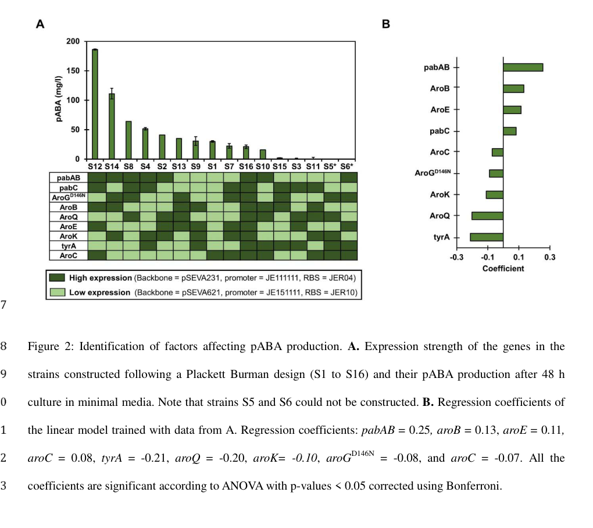

## Question

# Gene Research for Functional Annotation

## ⚠️ CRITICAL: Gene/Protein Identification Context

**BEFORE YOU BEGIN RESEARCH:** You MUST verify you are researching the CORRECT gene/protein. Gene symbols can be ambiguous, especially for less well-characterized genes from non-model organisms.

### Target Gene/Protein Identity (from UniProt):
- **UniProt Accession:** Q88IJ6
- **Protein Description:** RecName: Full=3-dehydroquinate dehydratase {ECO:0000256|ARBA:ARBA00012060, ECO:0000256|HAMAP-Rule:MF_00169}; Short=3-dehydroquinase {ECO:0000256|HAMAP-Rule:MF_00169}; EC=4.2.1.10 {ECO:0000256|ARBA:ARBA00012060, ECO:0000256|HAMAP-Rule:MF_00169}; AltName: Full=Type II DHQase {ECO:0000256|HAMAP-Rule:MF_00169};
- **Gene Information:** Name=aroQ-III {ECO:0000313|EMBL:AAN68611.1}; Synonyms=aroQ {ECO:0000256|HAMAP-Rule:MF_00169}; OrderedLocusNames=PP_3003 {ECO:0000313|EMBL:AAN68611.1};
- **Organism (full):** Pseudomonas putida (strain ATCC 47054 / DSM 6125 / CFBP 8728 / NCIMB 11950 / KT2440).
- **Protein Family:** Belongs to the type-II 3-dehydroquinase family.
- **Key Domains:** DHquinase_II. (IPR001874); DHquinase_II_sf. (IPR036441); DHquinase_II (PF01220)

### MANDATORY VERIFICATION STEPS:

1. **Check if the gene symbol "aroQ-III" matches the protein description above**
2. **Verify the organism is correct:** Pseudomonas putida (strain ATCC 47054 / DSM 6125 / CFBP 8728 / NCIMB 11950 / KT2440).
3. **Check if protein family/domains align with what you find in literature**
4. **If you find literature for a DIFFERENT gene with the same or similar symbol, STOP**

### If Gene Symbol is Ambiguous or You Cannot Find Relevant Literature:

**DO NOT PROCEED WITH RESEARCH ON A DIFFERENT GENE.** Instead:
- State clearly: "The gene symbol 'aroQ-III' is ambiguous or literature is limited for this specific protein"
- Explain what you found (e.g., "Found extensive literature on a different gene with the same symbol in a different organism")
- Describe the protein based ONLY on the UniProt information provided above
- Suggest that the protein function can be inferred from domain/family information

### Research Target:

Please provide a comprehensive research report on the gene **aroQ-III** (gene ID: aroQ, UniProt: Q88IJ6) in PSEPK.

The research report should be a detailed narrative explaining the function, biological processes, and localization of the gene product. Citations should be given for all claims.

You should prioritize authoritative reviews and primary scientific literature when conducting research. You can supplement
this with annotations you find in gene/protein databases, but these can be outdated or inaccurate.

We are specifically interested in the primary function of the gene - for enzymes, what reaction is catalyzed, and what is the substrate specificity? For transporters, what is the substrate? For structural proteins or adapters, what is the broader structural role? For signaling molecules, what is the role in the pathway.

We are interested in where in or outside the cell the gene product carries out its function.

We are also interested in the signaling or biochemical pathways in which the gene functions. We are less interested in broad pleiotropic effects, except where these elucidate the precise role.

Include evidence where possible. We are interested in both experimental evidence as well as inference from structure, evolution, or bioinformatic analysis. Precise studies should be prioritized over high-throughput, where available.

## Output

Question: You are an expert researcher providing comprehensive, well-cited information.

Provide detailed information focusing on:
1. Key concepts and definitions with current understanding
2. Recent developments and latest research (prioritize 2023-2024 sources)
3. Current applications and real-world implementations
4. Expert opinions and analysis from authoritative sources
5. Relevant statistics and data from recent studies

Format as a comprehensive research report with proper citations. Include URLs and publication dates where available.
Always prioritize recent, authoritative sources and provide specific citations for all major claims.

# Gene Research for Functional Annotation

## ⚠️ CRITICAL: Gene/Protein Identification Context

**BEFORE YOU BEGIN RESEARCH:** You MUST verify you are researching the CORRECT gene/protein. Gene symbols can be ambiguous, especially for less well-characterized genes from non-model organisms.

### Target Gene/Protein Identity (from UniProt):
- **UniProt Accession:** Q88IJ6
- **Protein Description:** RecName: Full=3-dehydroquinate dehydratase {ECO:0000256|ARBA:ARBA00012060, ECO:0000256|HAMAP-Rule:MF_00169}; Short=3-dehydroquinase {ECO:0000256|HAMAP-Rule:MF_00169}; EC=4.2.1.10 {ECO:0000256|ARBA:ARBA00012060, ECO:0000256|HAMAP-Rule:MF_00169}; AltName: Full=Type II DHQase {ECO:0000256|HAMAP-Rule:MF_00169};
- **Gene Information:** Name=aroQ-III {ECO:0000313|EMBL:AAN68611.1}; Synonyms=aroQ {ECO:0000256|HAMAP-Rule:MF_00169}; OrderedLocusNames=PP_3003 {ECO:0000313|EMBL:AAN68611.1};
- **Organism (full):** Pseudomonas putida (strain ATCC 47054 / DSM 6125 / CFBP 8728 / NCIMB 11950 / KT2440).
- **Protein Family:** Belongs to the type-II 3-dehydroquinase family.
- **Key Domains:** DHquinase_II. (IPR001874); DHquinase_II_sf. (IPR036441); DHquinase_II (PF01220)

### MANDATORY VERIFICATION STEPS:

1. **Check if the gene symbol "aroQ-III" matches the protein description above**
2. **Verify the organism is correct:** Pseudomonas putida (strain ATCC 47054 / DSM 6125 / CFBP 8728 / NCIMB 11950 / KT2440).
3. **Check if protein family/domains align with what you find in literature**
4. **If you find literature for a DIFFERENT gene with the same or similar symbol, STOP**

### If Gene Symbol is Ambiguous or You Cannot Find Relevant Literature:

**DO NOT PROCEED WITH RESEARCH ON A DIFFERENT GENE.** Instead:
- State clearly: "The gene symbol 'aroQ-III' is ambiguous or literature is limited for this specific protein"
- Explain what you found (e.g., "Found extensive literature on a different gene with the same symbol in a different organism")
- Describe the protein based ONLY on the UniProt information provided above
- Suggest that the protein function can be inferred from domain/family information

### Research Target:

Please provide a comprehensive research report on the gene **aroQ-III** (gene ID: aroQ, UniProt: Q88IJ6) in PSEPK.

The research report should be a detailed narrative explaining the function, biological processes, and localization of the gene product. Citations should be given for all claims.

You should prioritize authoritative reviews and primary scientific literature when conducting research. You can supplement
this with annotations you find in gene/protein databases, but these can be outdated or inaccurate.

We are specifically interested in the primary function of the gene - for enzymes, what reaction is catalyzed, and what is the substrate specificity? For transporters, what is the substrate? For structural proteins or adapters, what is the broader structural role? For signaling molecules, what is the role in the pathway.

We are interested in where in or outside the cell the gene product carries out its function.

We are also interested in the signaling or biochemical pathways in which the gene functions. We are less interested in broad pleiotropic effects, except where these elucidate the precise role.

Include evidence where possible. We are interested in both experimental evidence as well as inference from structure, evolution, or bioinformatic analysis. Precise studies should be prioritized over high-throughput, where available.

## Research report: aroQ-III (UniProt Q88IJ6; PP_3003) in *Pseudomonas putida* KT2440

### 0) Target verification and disambiguation (MANDATORY)
The requested target is UniProt **Q88IJ6**, annotated as **3-dehydroquinate dehydratase** (aka **3-dehydroquinase / type II DHQase**), gene **aroQ-III** (synonym aroQ), ordered locus **PP_3003**, from *Pseudomonas putida* strain KT2440. In the literature retrieved for this report, **no paper explicitly mentions UniProt Q88IJ6 or locus PP_3003**, so direct accession-level linkage could not be independently verified from primary articles in hand. Therefore, gene/protein identity in this report is constrained to: (i) the UniProt-provided identifier set (Q88IJ6; aroQ-III; PP_3003; type-II DHQase family) and (ii) experimental literature that refers to *P. putida* KT2440 **aroQ** as a **3-dehydroquinate dehydratase** in the shikimate pathway. No conflicting “aroQ-III” usage (different proteins/organisms) was encountered in retrieved texts. (camposmagana2024combinatorialengineeringreveals pages 1-4)

### 1) Key concepts and definitions (current understanding)

#### 1.1 The shikimate pathway and the DHQD step
3-dehydroquinate dehydratase (DHQD; also called 3-dehydroquinate dehydratase/3-dehydroquinase in some sources) is a shikimate-pathway enzyme that catalyzes **dehydration of 3-dehydroquinate (DHQ) to 3-dehydroshikimate (DHS)** and is assigned **EC 4.2.1.10**. (niraula2025aromaticaminoacids pages 8-10, lee2023structuralandbiochemical pages 1-2)

This step sits mid-pathway and is relevant because the shikimate pathway supplies aromatic building blocks (e.g., for aromatic amino acids and other aromatic metabolites). In microbes, the pathway is cytosolic; thus, the enzyme is expected to function in the **cytoplasm** (no direct *P. putida* KT2440 localization experiment was retrieved in the current corpus). (camposmagana2024combinatorialengineeringreveals pages 1-4)

#### 1.2 Type I vs type II DHQD (mechanistic/structural classes)
DHQD enzymes are commonly grouped into **type I** and **type II** enzymes that perform the same overall DHQ → DHS conversion but differ in mechanism and fold. A recent enzymology/structure paper summarizes that **type I** DHQDs catalyze dehydration via a **covalent imine (Schiff-base) intermediate** and are associated with an (α/β)8-fold architecture (often homodimers). In contrast, **type II** DHQDs (the **aroQ family**) catalyze **anti/trans-dehydration** through an **enolate-type intermediate**, and adopt a **flavodoxin-like fold** and can assemble as **higher oligomers (e.g., dodecamers)**. (lee2023structuralandbiochemical pages 1-2, niraula2025aromaticaminoacids pages 7-8, niraula2025aromaticaminoacids pages 8-10)

A mechanistic description consistent with an E1CB-like pathway (formation/stabilization of an enolate intermediate, followed by elimination of water) is also described for DHQD in recent computational work, including mention of conserved catalytic residues (e.g., tyrosine for proton abstraction) and stabilization roles for other residues (e.g., asparagine/histidine roles in intermediate stabilization and water elimination). (isa2025identificationofnovel pages 1-2)

### 2) Molecular function for *P. putida* KT2440 aroQ-III/Q88IJ6 (inference and available organism-level evidence)

#### 2.1 Primary biochemical function (reaction and substrate specificity)
Based on enzyme-family consensus and shikimate-pathway placement, **aroQ-type enzymes** catalyze **DHQ → DHS (EC 4.2.1.10)**. This is the primary function implied for UniProt Q88IJ6 (aroQ-III) given its assignment to the type II DHQase family and the use of *P. putida* KT2440 **aroQ** as the **3-dehydroquinate dehydratase** gene in pathway engineering literature. (niraula2025aromaticaminoacids pages 8-10, camposmagana2024combinatorialengineeringreveals pages 1-4, lee2023structuralandbiochemical pages 1-2)

Direct enzyme kinetics for the *P. putida* KT2440 Q88IJ6 protein were not retrieved. However, a 2023 peer-reviewed type II DHQD study provides family-relevant quantitative kinetics and residue-level functional constraints (see §5), illustrating typical DHQD enzymology that supports this functional annotation. (lee2023structuralandbiochemical pages 7-10)

#### 2.2 Cellular localization
No paper retrieved here experimentally localizes *P. putida* KT2440 AroQ-III/Q88IJ6. Given its role as a soluble enzyme of central metabolism and typical bacterial shikimate-pathway localization, the most parsimonious functional site is the **cytoplasm** (inference; not directly evidenced for Q88IJ6 in the retrieved corpus). (camposmagana2024combinatorialengineeringreveals pages 1-4)

### 3) Pathway role and physiological relevance (evidence from related bacteria and *Pseudomonas* engineering)

#### 3.1 Genetic/physiological evidence that AroQ activity supports growth and (in pathogens) virulence programs
A 2023 experimental study in *Ralstonia solanacearum* (a plant pathogen) demonstrated that two aroQ paralogs (aroQ1/aroQ2) are **collectively essential for growth in minimal medium** and for robust in planta proliferation; deletion of both caused severe growth defects that were **rescued by shikimic acid supplementation**, linking the phenotype to disruption of shikimate-pathway intermediate supply. Quantitatively, wild type achieved ~**10^9–10^10 CFU g−1** at ~4 days post inoculation (dpi), while the double mutant peaked at ~**10^6 CFU g−1** at 4 dpi. (zhang2023functionalcharacterizationof pages 4-6)

While this is not *P. putida*, it is a strong experimental demonstration that bacterial AroQ enzymes can be key shikimate-pathway nodes whose loss can influence growth and higher-level phenotypes (e.g., virulence-associated secretion systems). (zhang2023functionalcharacterizationof pages 4-6)

#### 3.2 *P. putida* KT2440: evidence from metabolic engineering (2024)
A 2024 *P. putida* KT2440 metabolic engineering preprint explicitly includes **aroQ (annotated as 3-dehydroquinate dehydratase)** among shikimate-pathway genes whose expression is tuned to optimize production of **para-aminobenzoic acid (pABA)**. (camposmagana2024combinatorialengineeringreveals pages 1-4, camposmagana2024combinatorialengineeringreveals pages 4-7)

Key quantitative findings relevant to functional annotation and pathway control:
- Across combinatorial expression strains, pABA titers ranged from **2.0 ± 3.4 to 186.2 ± 0.32 mg/L** in an initial screen, and up to **232.1 ± 17.6 mg/L** in a subsequent set. (camposmagana2024combinatorialengineeringreveals pages 7-11, camposmagana2024combinatorialengineeringreveals pages 1-4, camposmagana2024combinatorialengineeringreveals pages 4-7)
- A linear model of factor effects reported **aroQ regression coefficient = −0.20** (statistically significant), indicating that **high aroQ overexpression** tended to **reduce** pABA titers; the authors interpreted results as consistent with **mild** aroQ overexpression being desirable, while high overexpression can be detrimental. (camposmagana2024combinatorialengineeringreveals pages 7-11, camposmagana2024combinatorialengineeringreveals media 53a23727)

This provides organism-specific, experimentally grounded evidence that *P. putida* KT2440 aroQ is an active node in the shikimate pathway whose expression level impacts aromatic-product output, consistent with an in-pathway dehydratase function. (camposmagana2024combinatorialengineeringreveals pages 7-11, camposmagana2024combinatorialengineeringreveals pages 1-4, camposmagana2024combinatorialengineeringreveals media 53a23727)

### 4) Recent developments (prioritizing 2023–2024)

#### 4.1 2023: high-resolution structure–function study of a type II DHQD (family-relevant)
A 2023 peer-reviewed paper solved two crystal structures of a type II DHQD from *Corynebacterium glutamicum* (CgDHQD), including a citrate-bound wild-type at **1.80 Å** and a DHQ-bound mutant complex at **~2.00–2.03 Å** (PDB **8IDR**, **8IDU**). The enzyme forms a **homododecamer** (four trimers), consistent with a common type II DHQD oligomerization mode, and the authors used extensive mutagenesis to map essential catalytic residues and quantify kinetic impacts of substitutions near the substrate pocket. (lee2023structuralandbiochemical pages 1-2, lee2023structuralandbiochemical pages 7-10, lee2023structuralandbiochemical pages 2-3)

Although not in *P. putida*, this is directly relevant to annotating Q88IJ6 as a type II DHQD because it provides contemporary, experimentally validated mechanistic/structural constraints for the enzyme family (fold, oligomeric assembly, active-site residue importance, and kinetic regimes). (lee2023structuralandbiochemical pages 1-2, lee2023structuralandbiochemical pages 7-10)

#### 4.2 2024: systems metabolic engineering links aroQ expression tuning to aromatic-product performance
The 2024 *P. putida* KT2440 DoE/linear modeling work highlights that optimizing aromatic output (pABA) can require tuning shikimate-pathway nodes, and that **aroQ expression level is not monotonically beneficial**—overexpression can become counterproductive depending on the pathway context. This is a useful “current understanding” point for functional annotation in applied settings: aroQ can act as a controllable node in engineered aromatic metabolism rather than simply being a static housekeeping enzyme. (camposmagana2024combinatorialengineeringreveals pages 7-11, camposmagana2024combinatorialengineeringreveals media 53a23727)

### 5) Quantitative statistics and data highlights (recent studies)

#### 5.1 Enzyme kinetics and residue constraints (2023; type II DHQD exemplar)
In the 2023 type II DHQD study (CgDHQD), the authors reported Michaelis–Menten parameters and mutation effects that illustrate typical catalytic performance and structure–function relationships:
- Wild type: **Vmax 3.00 μM/s**, **Km 348.20 μM**, **kcat 150.19 s−1**. (lee2023structuralandbiochemical pages 7-10)
- S103T mutant: **Vmax 3.99 μM/s**, **Km 745.3 μM**, **kcat 199.67 s−1** (increased turnover but decreased substrate affinity). (lee2023structuralandbiochemical pages 7-10)
- Multiple substitutions at catalytic/substrate-binding residues produced near-complete loss of activity (e.g., **N12, R19, Y24, N75, E99, H101, R108**; substrate-binding **H81, R112**). (lee2023structuralandbiochemical pages 7-10)

These data support expert-level inference that type II DHQDs are sensitive to subtle pocket geometry and lid-loop dynamics and can exhibit activity–affinity tradeoffs upon mutation—important for interpreting any future *P. putida* Q88IJ6 engineering or variant annotation. (lee2023structuralandbiochemical pages 7-10)

#### 5.2 Engineering titers and factor effects in *P. putida* KT2440 (2024)
As described above, pABA titers up to **232.1 ± 17.6 mg/L** were achieved across engineered strain sets, and **aroQ** carried a **negative coefficient (−0.20)** in the factor-effect model when set to high expression in that experimental design. (camposmagana2024combinatorialengineeringreveals pages 7-11, camposmagana2024combinatorialengineeringreveals media 53a23727)

### 6) Applications and real-world implementations

#### 6.1 Metabolic engineering of aromatic chemicals
The 2024 study demonstrates a concrete application: using statistical Design of Experiments to tune expression of shikimate-pathway genes (including **aroQ**) in *P. putida* KT2440 to improve production of **pABA**, an industrial intermediate. This is a real-world implementation of aroQ functional knowledge in an engineered host. (camposmagana2024combinatorialengineeringreveals pages 7-11, camposmagana2024combinatorialengineeringreveals pages 1-4, camposmagana2024combinatorialengineeringreveals media 53a23727)

#### 6.2 Antimicrobial/anti-virulence target context (general)
Because the shikimate pathway is essential in many bacteria and absent from animals, shikimate-pathway enzymes (including DHQD) are repeatedly explored as antimicrobial targets. While the most recent retrieved inhibitor-focused work here is computational and not 2023–2024, it illustrates that DHQD remains of drug-discovery interest, reporting docking energies and binding free energies for candidate inhibitors as quantitative prioritization metrics. (isa2025identificationofnovel pages 1-2)

### 7) Expert analysis and interpretation (based on authoritative sources in hand)

1. **Functional assignment confidence**: Family-level evidence strongly supports annotating aroQ-III/Q88IJ6 as **type II 3-dehydroquinate dehydratase (EC 4.2.1.10)** catalyzing **DHQ → DHS**, due to consistent mechanistic/structural characterization of type II DHQDs and explicit use of *P. putida* KT2440 **aroQ** as “3-dehydroquinate dehydratase” in pathway engineering work. (camposmagana2024combinatorialengineeringreveals pages 1-4, lee2023structuralandbiochemical pages 1-2)
2. **Control point in engineered metabolism**: The 2024 *P. putida* DoE study indicates that “more enzyme” is not necessarily better; **overexpression of aroQ can reduce aromatic product titers** depending on pathway balancing, suggesting potential for intermediate imbalances or resource burdens. This nuance is crucial for functional annotation in applied contexts (e.g., when inferring phenotypes from expression changes). (camposmagana2024combinatorialengineeringreveals pages 7-11, camposmagana2024combinatorialengineeringreveals media 53a23727)
3. **Expectation for localization**: In bacteria, the shikimate pathway is typically cytosolic, so Q88IJ6 is expected to act in the **cytoplasm**; however, the present evidence set lacks direct localization experiments for this exact protein. (camposmagana2024combinatorialengineeringreveals pages 1-4)

### 8) Evidence summary table
The following table consolidates the key, citable evidence used in this report (including quantitative values and URLs).

| Claim/Topic | Key details (include quantitative values) | Organism/system | Source (authors, journal, year) | URL | Evidence strength/notes |
|---|---|---|---|---|---|
| Reaction catalyzed and EC number | 3-Dehydroquinate dehydratase (DHQD/DHQase) catalyzes conversion of 3-dehydroquinate (DHQ) to 3-dehydroshikimate (DHS/3-DHS) in the shikimate pathway; EC 4.2.1.10. This supports annotating **aroQ-III / Q88IJ6** as the dehydratase step in aromatic amino acid biosynthesis when family assignment is correct. (niraula2025aromaticaminoacids pages 8-10, lee2023structuralandbiochemical pages 1-2) | General DHQD; inference applied to *Pseudomonas putida* KT2440 aroQ-III | Niraula et al., *BioTech*, 2025; Lee et al., *Journal of Microbiology and Biotechnology*, 2023 | https://doi.org/10.3390/biotech14010006 ; https://doi.org/10.4014/jmb.2305.05018 | Strong for enzyme class/reaction; indirect for Q88IJ6 because retrieved literature did not explicitly map UniProt Q88IJ6/PP_3003, so identity relies partly on supplied UniProt annotation. |
| Type I vs type II mechanistic distinction | Type I DHQDs perform **cis/syn-dehydration** via covalent **imine/Schiff-base** chemistry; type II DHQDs perform **trans/anti-dehydration** via an **enolate/E1CB-like** mechanism. Recent summaries note type II uses catalytic acid/base chemistry distinct from type I and has only weak covalent intermediates. (niraula2025aromaticaminoacids pages 7-8, lee2023structuralandbiochemical pages 10-11, isa2025identificationofnovel pages 1-2, niraula2025aromaticaminoacids pages 8-10) | General DHQD enzyme families | Niraula et al., *BioTech*, 2025; Lee et al., *J. Microbiol. Biotechnol.*, 2023; Isa & Kappo, *In Silico Pharmacology*, 2025 | https://doi.org/10.3390/biotech14010006 ; https://doi.org/10.4014/jmb.2305.05018 ; https://doi.org/10.1007/s40203-024-00298-x | Strong for mechanistic distinction at family level; useful for functional inference that aroQ-family enzymes are type II DHQDs. |
| Structural/oligomeric features of type II DHQD | Type II DHQD adopts a **flavodoxin-like α/β fold** and forms a **homododecamer** (four trimers, tetrahedral organization). In *Corynebacterium glutamicum*, crystal structures were solved as **8IDR** (citrate complex, **1.80 Å**) and **8IDU** (DHQ complex, ~**2.00–2.03 Å**). Solution mass ~**182.3 kDa** supported dodecamer formation; intertrimer interface area **723.9 Ų** (ΔiG **−4.8 kcal/mol**) and intratrimer area **686.5 Ų** (ΔiG **−4.6 kcal/mol**). (lee2023structuralandbiochemical pages 1-2, lee2023structuralandbiochemical pages 3-4, lee2023structuralandbiochemical pages 2-3) | Type II DHQD from *Corynebacterium glutamicum* (structural model for aroQ family) | Lee et al., *Journal of Microbiology and Biotechnology*, 2023 | https://doi.org/10.4014/jmb.2305.05018 | Strong direct structural evidence for type II DHQD family; informative but not organism-specific to *P. putida* Q88IJ6. |
| Kinetic parameters and mutation effects from Lee 2023 | Wild-type CgDHQD kinetics: **Vmax 3.00 μM/s, Km 348.20 μM, kcat 150.19 s^-1**. Variant **S103T**: **Vmax 3.99 μM/s, Km 745.3 μM, kcat 199.67 s^-1** (>10% higher activity but reduced substrate affinity). Mutations of catalytic residues (**N12, R19, Y24, N75, E99, H101, R108**) and substrate-binding residues (**H81, R112**) caused near-complete loss/no detectable activity. **P105A** lowered activity by **60%**; **P105I** and **P105V** lowered activity by **76%** and **58%**; **I102A** and **S103A** retained **35%** and **19%** activity. (lee2023structuralandbiochemical pages 7-10) | *Corynebacterium glutamicum* type II DHQD | Lee et al., *Journal of Microbiology and Biotechnology*, 2023 | https://doi.org/10.4014/jmb.2305.05018 | Strong biochemical evidence for catalytic mechanism/residue importance in type II DHQDs; extrapolation to Q88IJ6 should be made cautiously unless active-site conservation is verified. |
| *Pseudomonas putida* KT2440 metabolic engineering involving aroQ | In a combinatorial pABA engineering study, *P. putida* shikimate-pathway strains produced **2.0 ± 3.4 to 186.2 ± 0.32 mg/L** pABA in the initial screen and up to **232.1 ± 17.6 mg/L** after optimization. **Figure 2** reported **aroQ regression coefficient = −0.20**, indicating high aroQ overexpression had a statistically significant negative effect; authors concluded **mild** rather than high aroQ overexpression is preferable. aroQ is annotated there as **3-dehydroquinate dehydratase**. (camposmagana2024combinatorialengineeringreveals pages 7-11, camposmagana2024combinatorialengineeringreveals pages 1-4, camposmagana2024combinatorialengineeringreveals pages 4-7, camposmagana2024combinatorialengineeringreveals media 53a23727) | *Pseudomonas putida* KT2440 | Campos-Magaña et al., *bioRxiv*, 2024 | https://doi.org/10.1101/2024.06.17.599342 | Moderate evidence: organism-specific and directly relevant to aroQ pathway role, but preprint and not a direct biochemical characterization of Q88IJ6 protein. |
| Ralstonia aroQ1/aroQ2 mutant phenotypes | In *Ralstonia solanacearum*, deletion of both **aroQ1/aroQ2** abolished growth in minimal medium and caused strong in planta attenuation, while single deletions had no obvious defect, showing functional redundancy of AroQ enzymes. Wild type reached about **10^9–10^10 CFU g^-1 at ~4 dpi** then dropped to **~10^5–10^6 CFU g^-1 at 6 dpi**; the double mutant peaked only at **~10^6 CFU g^-1 at 4 dpi**. Shikimic acid supplementation partially/completely rescued growth defects, linking phenotype to shikimate-pathway disruption. (zhang2023functionalcharacterizationof pages 4-6) | *Ralstonia solanacearum* | Zhang et al., *Frontiers in Microbiology*, 2023 | https://doi.org/10.3389/fmicb.2023.1186688 | Moderate evidence: not *P. putida*, but a peer-reviewed, experimentally validated demonstration that bacterial AroQ enzymes are physiologically important for shikimate-pathway function. |
| Recent development: in silico inhibitor metrics for DHQD | A recent anti-tuberculosis in silico study targeting DHQD reported top docking energies of **−8.99 to −8.39 kcal/mol** versus reference ligand **−4.93 kcal/mol**; MD simulation RMSDs **1.57–2.34 Å** over **50 ns**; MM-GBSA binding energies down to **−32.70 kcal/mol** versus reference **−10.62 kcal/mol**. A cited Mtb DHQD structure had **1.9 Å** resolution. (isa2025identificationofnovel pages 1-2) | *Mycobacterium tuberculosis* DHQD (drug-target context) | Isa & Kappo, *In Silico Pharmacology*, 2025 | https://doi.org/10.1007/s40203-024-00298-x | Weak-to-moderate for functional annotation: useful as 2024/2025 development context showing DHQD remains a drug target, but results are computational and not directly about *P. putida* Q88IJ6. |

*Table: This table compiles the most relevant evidence for annotating aroQ-III (UniProt Q88IJ6) as a type II 3-dehydroquinate dehydratase in Pseudomonas putida KT2440. It combines direct organism-level pathway evidence with broader structural, mechanistic, and recent research context for the DHQD family.*

### 9) Key figure supporting organism-specific engineering evidence
Campos-Magaña et al. (bioRxiv 2024) Figure 2 contains (i) pABA titers across strains and (ii) regression coefficients for shikimate-gene expression effects, including **aroQ coefficient −0.20**. (camposmagana2024combinatorialengineeringreveals media 53a23727)

### References (URLs and publication dates where available)
- Lee CH, Kim S, Seo H, Kim K-J. “Structural and Biochemical Analysis of 3-Dehydroquinate Dehydratase from *Corynebacterium glutamicum*.” *Journal of Microbiology and Biotechnology*. **Aug 2023**. https://doi.org/10.4014/jmb.2305.05018 (lee2023structuralandbiochemical pages 1-2, lee2023structuralandbiochemical pages 7-10)
- Zhang Q et al. “Functional characterization of two 3-dehydroquinases of AroQ1 and AroQ2…” *Frontiers in Microbiology*. **Apr 2023**. https://doi.org/10.3389/fmicb.2023.1186688 (zhang2023functionalcharacterizationof pages 4-6)
- Campos-Magaña MA et al. “Combinatorial engineering reveals shikimate pathway bottlenecks in para-aminobenzoic acid production in *Pseudomonas putida*.” *bioRxiv*. **Jun 17, 2024**. https://doi.org/10.1101/2024.06.17.599342 (camposmagana2024combinatorialengineeringreveals pages 7-11, camposmagana2024combinatorialengineeringreveals pages 1-4, camposmagana2024combinatorialengineeringreveals media 53a23727)
- Isa MA, Kappo AP. “Identification of novel 3-dehydroquinate dehydratase (DHQD) inhibitors for anti-tuberculosis activity…” *In Silico Pharmacology*. **Jan 2025**. https://doi.org/10.1007/s40203-024-00298-x (isa2025identificationofnovel pages 1-2)
- Niraula A et al. “Aromatic Amino Acids: Exploring Microalgae as a Potential Biofactory.” *BioTech*. **Jan 2025**. https://doi.org/10.3390/biotech14010006 (niraula2025aromaticaminoacids pages 8-10)

References

1. (camposmagana2024combinatorialengineeringreveals pages 1-4): Marco A Campos-Magaña, Sara Moreno-Paz, Vitor AP Martins dos Santos, Luis Garcia-Morales, and Maria Suarez-Diez. Combinatorial engineering reveals shikimate pathway bottlenecks in para-aminobenzoic acid production in pseudomonas putida. bioRxiv, Jun 2024. URL: https://doi.org/10.1101/2024.06.17.599342, doi:10.1101/2024.06.17.599342. This article has 0 citations.

2. (niraula2025aromaticaminoacids pages 8-10): Archana Niraula, Amir Danesh, Natacha Merindol, Fatma Meddeb-Mouelhi, and Isabel Desgagné-Penix. Aromatic amino acids: exploring microalgae as a potential biofactory. BioTech, 14:6, Jan 2025. URL: https://doi.org/10.3390/biotech14010006, doi:10.3390/biotech14010006. This article has 9 citations.

3. (lee2023structuralandbiochemical pages 1-2): Chan Hwi Lee, Sangwoo Kim, Hogyun Seo, and Kyung-Jin Kim. Structural and biochemical analysis of 3-dehydroquinate dehydratase from corynebacterium glutamicum. Journal of Microbiology and Biotechnology, 33:1595-1605, Aug 2023. URL: https://doi.org/10.4014/jmb.2305.05018, doi:10.4014/jmb.2305.05018. This article has 2 citations and is from a peer-reviewed journal.

4. (niraula2025aromaticaminoacids pages 7-8): Archana Niraula, Amir Danesh, Natacha Merindol, Fatma Meddeb-Mouelhi, and Isabel Desgagné-Penix. Aromatic amino acids: exploring microalgae as a potential biofactory. BioTech, 14:6, Jan 2025. URL: https://doi.org/10.3390/biotech14010006, doi:10.3390/biotech14010006. This article has 9 citations.

5. (isa2025identificationofnovel pages 1-2): Mustafa Alhaji Isa and Abidemi Paul Kappo. Identification of novel 3-dehydroquinate dehydratase (dhqd) inhibitors for anti-tuberculosis activity: insights from virtual screening, molecular docking, and dynamics simulations. In Silico Pharmacology, Jan 2025. URL: https://doi.org/10.1007/s40203-024-00298-x, doi:10.1007/s40203-024-00298-x. This article has 0 citations and is from a peer-reviewed journal.

6. (lee2023structuralandbiochemical pages 7-10): Chan Hwi Lee, Sangwoo Kim, Hogyun Seo, and Kyung-Jin Kim. Structural and biochemical analysis of 3-dehydroquinate dehydratase from corynebacterium glutamicum. Journal of Microbiology and Biotechnology, 33:1595-1605, Aug 2023. URL: https://doi.org/10.4014/jmb.2305.05018, doi:10.4014/jmb.2305.05018. This article has 2 citations and is from a peer-reviewed journal.

7. (zhang2023functionalcharacterizationof pages 4-6): Qingshan Zhang, Bofan Wu, Liangliang Han, Duan Yu, Tao Liang, Yan Wang, and Tao Guo. Functional characterization of two 3-dehydroquinases of aroq1 and aroq2 in the shikimate pathway and expression of genes for the type iii secretion system in ralstonia solanacearum. Frontiers in Microbiology, Apr 2023. URL: https://doi.org/10.3389/fmicb.2023.1186688, doi:10.3389/fmicb.2023.1186688. This article has 2 citations and is from a peer-reviewed journal.

8. (camposmagana2024combinatorialengineeringreveals pages 4-7): Marco A Campos-Magaña, Sara Moreno-Paz, Vitor AP Martins dos Santos, Luis Garcia-Morales, and Maria Suarez-Diez. Combinatorial engineering reveals shikimate pathway bottlenecks in para-aminobenzoic acid production in pseudomonas putida. bioRxiv, Jun 2024. URL: https://doi.org/10.1101/2024.06.17.599342, doi:10.1101/2024.06.17.599342. This article has 0 citations.

9. (camposmagana2024combinatorialengineeringreveals pages 7-11): Marco A Campos-Magaña, Sara Moreno-Paz, Vitor AP Martins dos Santos, Luis Garcia-Morales, and Maria Suarez-Diez. Combinatorial engineering reveals shikimate pathway bottlenecks in para-aminobenzoic acid production in pseudomonas putida. bioRxiv, Jun 2024. URL: https://doi.org/10.1101/2024.06.17.599342, doi:10.1101/2024.06.17.599342. This article has 0 citations.

10. (camposmagana2024combinatorialengineeringreveals media 53a23727): Marco A Campos-Magaña, Sara Moreno-Paz, Vitor AP Martins dos Santos, Luis Garcia-Morales, and Maria Suarez-Diez. Combinatorial engineering reveals shikimate pathway bottlenecks in para-aminobenzoic acid production in pseudomonas putida. bioRxiv, Jun 2024. URL: https://doi.org/10.1101/2024.06.17.599342, doi:10.1101/2024.06.17.599342. This article has 0 citations.

11. (lee2023structuralandbiochemical pages 2-3): Chan Hwi Lee, Sangwoo Kim, Hogyun Seo, and Kyung-Jin Kim. Structural and biochemical analysis of 3-dehydroquinate dehydratase from corynebacterium glutamicum. Journal of Microbiology and Biotechnology, 33:1595-1605, Aug 2023. URL: https://doi.org/10.4014/jmb.2305.05018, doi:10.4014/jmb.2305.05018. This article has 2 citations and is from a peer-reviewed journal.

12. (lee2023structuralandbiochemical pages 10-11): Chan Hwi Lee, Sangwoo Kim, Hogyun Seo, and Kyung-Jin Kim. Structural and biochemical analysis of 3-dehydroquinate dehydratase from corynebacterium glutamicum. Journal of Microbiology and Biotechnology, 33:1595-1605, Aug 2023. URL: https://doi.org/10.4014/jmb.2305.05018, doi:10.4014/jmb.2305.05018. This article has 2 citations and is from a peer-reviewed journal.

13. (lee2023structuralandbiochemical pages 3-4): Chan Hwi Lee, Sangwoo Kim, Hogyun Seo, and Kyung-Jin Kim. Structural and biochemical analysis of 3-dehydroquinate dehydratase from corynebacterium glutamicum. Journal of Microbiology and Biotechnology, 33:1595-1605, Aug 2023. URL: https://doi.org/10.4014/jmb.2305.05018, doi:10.4014/jmb.2305.05018. This article has 2 citations and is from a peer-reviewed journal.

## Artifacts

- [Edison artifact artifact-00](aroQ-deep-research-falcon_artifacts/artifact-00.md)

## Citations

1. camposmagana2024combinatorialengineeringreveals pages 1-4
2. isa2025identificationofnovel pages 1-2
3. lee2023structuralandbiochemical pages 7-10
4. zhang2023functionalcharacterizationof pages 4-6
5. niraula2025aromaticaminoacids pages 8-10
6. lee2023structuralandbiochemical pages 1-2
7. niraula2025aromaticaminoacids pages 7-8
8. camposmagana2024combinatorialengineeringreveals pages 4-7
9. camposmagana2024combinatorialengineeringreveals pages 7-11
10. lee2023structuralandbiochemical pages 2-3
11. lee2023structuralandbiochemical pages 10-11
12. lee2023structuralandbiochemical pages 3-4
13. https://doi.org/10.3390/biotech14010006
14. https://doi.org/10.4014/jmb.2305.05018
15. https://doi.org/10.1007/s40203-024-00298-x
16. https://doi.org/10.1101/2024.06.17.599342
17. https://doi.org/10.3389/fmicb.2023.1186688
18. https://doi.org/10.1101/2024.06.17.599342,
19. https://doi.org/10.3390/biotech14010006,
20. https://doi.org/10.4014/jmb.2305.05018,
21. https://doi.org/10.1007/s40203-024-00298-x,
22. https://doi.org/10.3389/fmicb.2023.1186688,