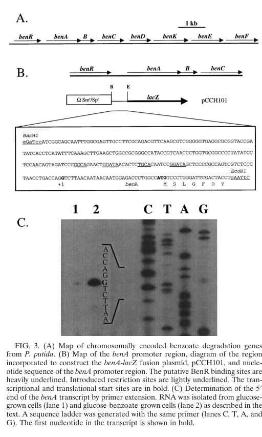

## Question

# Gene Research for Functional Annotation

## ⚠️ CRITICAL: Gene/Protein Identification Context

**BEFORE YOU BEGIN RESEARCH:** You MUST verify you are researching the CORRECT gene/protein. Gene symbols can be ambiguous, especially for less well-characterized genes from non-model organisms.

### Target Gene/Protein Identity (from UniProt):
- **UniProt Accession:** Q88I39
- **Protein Description:** SubName: Full=Benzoate 1,2-dioxygenase subunit beta {ECO:0000313|EMBL:AAN68770.1}; EC=1.14.12.10 {ECO:0000313|EMBL:AAN68770.1};
- **Gene Information:** Name=benB {ECO:0000313|EMBL:AAN68770.1}; OrderedLocusNames=PP_3162 {ECO:0000313|EMBL:AAN68770.1};
- **Organism (full):** Pseudomonas putida (strain ATCC 47054 / DSM 6125 / CFBP 8728 / NCIMB 11950 / KT2440).
- **Protein Family:** Belongs to the bacterial ring-hydroxylating dioxygenase
- **Key Domains:** Benzo_1-2-diOase_ssu. (IPR017641); NTF2-like_dom_sf. (IPR032710); Rng_hydr_dOase-bsu. (IPR000391); Ring_hydroxyl_B (PF00866)

### MANDATORY VERIFICATION STEPS:

1. **Check if the gene symbol "benB" matches the protein description above**
2. **Verify the organism is correct:** Pseudomonas putida (strain ATCC 47054 / DSM 6125 / CFBP 8728 / NCIMB 11950 / KT2440).
3. **Check if protein family/domains align with what you find in literature**
4. **If you find literature for a DIFFERENT gene with the same or similar symbol, STOP**

### If Gene Symbol is Ambiguous or You Cannot Find Relevant Literature:

**DO NOT PROCEED WITH RESEARCH ON A DIFFERENT GENE.** Instead:
- State clearly: "The gene symbol 'benB' is ambiguous or literature is limited for this specific protein"
- Explain what you found (e.g., "Found extensive literature on a different gene with the same symbol in a different organism")
- Describe the protein based ONLY on the UniProt information provided above
- Suggest that the protein function can be inferred from domain/family information

### Research Target:

Please provide a comprehensive research report on the gene **benB** (gene ID: benB, UniProt: Q88I39) in PSEPK.

The research report should be a detailed narrative explaining the function, biological processes, and localization of the gene product. Citations should be given for all claims.

You should prioritize authoritative reviews and primary scientific literature when conducting research. You can supplement
this with annotations you find in gene/protein databases, but these can be outdated or inaccurate.

We are specifically interested in the primary function of the gene - for enzymes, what reaction is catalyzed, and what is the substrate specificity? For transporters, what is the substrate? For structural proteins or adapters, what is the broader structural role? For signaling molecules, what is the role in the pathway.

We are interested in where in or outside the cell the gene product carries out its function.

We are also interested in the signaling or biochemical pathways in which the gene functions. We are less interested in broad pleiotropic effects, except where these elucidate the precise role.

Include evidence where possible. We are interested in both experimental evidence as well as inference from structure, evolution, or bioinformatic analysis. Precise studies should be prioritized over high-throughput, where available.

## Output

Question: You are an expert researcher providing comprehensive, well-cited information.

Provide detailed information focusing on:
1. Key concepts and definitions with current understanding
2. Recent developments and latest research (prioritize 2023-2024 sources)
3. Current applications and real-world implementations
4. Expert opinions and analysis from authoritative sources
5. Relevant statistics and data from recent studies

Format as a comprehensive research report with proper citations. Include URLs and publication dates where available.
Always prioritize recent, authoritative sources and provide specific citations for all major claims.

# Gene Research for Functional Annotation

## ⚠️ CRITICAL: Gene/Protein Identification Context

**BEFORE YOU BEGIN RESEARCH:** You MUST verify you are researching the CORRECT gene/protein. Gene symbols can be ambiguous, especially for less well-characterized genes from non-model organisms.

### Target Gene/Protein Identity (from UniProt):
- **UniProt Accession:** Q88I39
- **Protein Description:** SubName: Full=Benzoate 1,2-dioxygenase subunit beta {ECO:0000313|EMBL:AAN68770.1}; EC=1.14.12.10 {ECO:0000313|EMBL:AAN68770.1};
- **Gene Information:** Name=benB {ECO:0000313|EMBL:AAN68770.1}; OrderedLocusNames=PP_3162 {ECO:0000313|EMBL:AAN68770.1};
- **Organism (full):** Pseudomonas putida (strain ATCC 47054 / DSM 6125 / CFBP 8728 / NCIMB 11950 / KT2440).
- **Protein Family:** Belongs to the bacterial ring-hydroxylating dioxygenase
- **Key Domains:** Benzo_1-2-diOase_ssu. (IPR017641); NTF2-like_dom_sf. (IPR032710); Rng_hydr_dOase-bsu. (IPR000391); Ring_hydroxyl_B (PF00866)

### MANDATORY VERIFICATION STEPS:

1. **Check if the gene symbol "benB" matches the protein description above**
2. **Verify the organism is correct:** Pseudomonas putida (strain ATCC 47054 / DSM 6125 / CFBP 8728 / NCIMB 11950 / KT2440).
3. **Check if protein family/domains align with what you find in literature**
4. **If you find literature for a DIFFERENT gene with the same or similar symbol, STOP**

### If Gene Symbol is Ambiguous or You Cannot Find Relevant Literature:

**DO NOT PROCEED WITH RESEARCH ON A DIFFERENT GENE.** Instead:
- State clearly: "The gene symbol 'benB' is ambiguous or literature is limited for this specific protein"
- Explain what you found (e.g., "Found extensive literature on a different gene with the same symbol in a different organism")
- Describe the protein based ONLY on the UniProt information provided above
- Suggest that the protein function can be inferred from domain/family information

### Research Target:

Please provide a comprehensive research report on the gene **benB** (gene ID: benB, UniProt: Q88I39) in PSEPK.

The research report should be a detailed narrative explaining the function, biological processes, and localization of the gene product. Citations should be given for all claims.

You should prioritize authoritative reviews and primary scientific literature when conducting research. You can supplement
this with annotations you find in gene/protein databases, but these can be outdated or inaccurate.

We are specifically interested in the primary function of the gene - for enzymes, what reaction is catalyzed, and what is the substrate specificity? For transporters, what is the substrate? For structural proteins or adapters, what is the broader structural role? For signaling molecules, what is the role in the pathway.

We are interested in where in or outside the cell the gene product carries out its function.

We are also interested in the signaling or biochemical pathways in which the gene functions. We are less interested in broad pleiotropic effects, except where these elucidate the precise role.

Include evidence where possible. We are interested in both experimental evidence as well as inference from structure, evolution, or bioinformatic analysis. Precise studies should be prioritized over high-throughput, where available.

## Research report: **benB (UniProt Q88I39; PP_3162)** in *Pseudomonas putida* KT2440

### 0) Target verification (mandatory)
The symbol **benB** is used across many bacteria for benzoate-catabolism genes; here, the correct target is **UniProt Q88I39** from **Pseudomonas putida strain KT2440** (ordered locus **PP_3162**), annotated as **benzoate 1,2-dioxygenase subunit beta** (small/beta subunit of the terminal oxygenase). KT2440 genome analysis places **benB** in the canonical **ben** cluster with **benA (alpha/large oxygenase subunit)** and **benC (reductase)** and the downstream **benD** dehydrogenase, matching the UniProt description and ring-hydroxylating dioxygenase family placement. (jimenez2002genomicanalysisof pages 5-6, cowles2000benraxyls pages 5-6)

---

### 1) Key concepts and definitions (current understanding)

#### 1.1 What is BenB?
**BenB** encodes the **small (beta) subunit** of the **benzoate 1,2-dioxygenase oxygenase component**. In KT2440, benzoate 1,2-dioxygenase is encoded by **benA-benB-benC** (BenA/BenB oxygenase + BenC reductase) and functions upstream of **benD**, which converts the dioxygenase product to catechol. (jimenez2002genomicanalysisof pages 5-6, cowles2000benraxyls pages 4-5)

#### 1.2 Ring-hydroxylating (Rieske) dioxygenases (RHDs)
Benzoate 1,2-dioxygenase belongs to the **Rieske nonheme iron ring-hydroxylating dioxygenase** family. These enzymes introduce both atoms of molecular oxygen into an aromatic ring, producing a **cis-dihydrodiol**. Sequence/biochemical analysis of benzoate dioxygenase systems indicates:
- A **two-subunit hydroxylase** (alpha + beta; BenA + BenB) and
- An **electron transfer component** (BenC), which provides reducing equivalents from NADH. (neidle1991nucleotidesequencesof pages 1-2, jeffrey1992characterizationofpseudomonas pages 1-2)

In this family, the **alpha subunit** houses conserved motifs associated with a **Rieske-type [2Fe–2S] center** and a **mononuclear Fe(II)** site (the catalytic iron), while the **beta subunit is less conserved** and has been proposed to influence **substrate specificity**. (neidle1991nucleotidesequencesof pages 1-2)

---

### 2) Molecular function: reaction, substrate specificity, and mechanism

#### 2.1 Reaction catalyzed (primary function)
In the **benzoate-to-catechol peripheral pathway**, the dioxygenase complex **BenABC** performs the first step:
- **BenABC** converts **benzoate** into a **cis-benzoate dihydrodiol (“benzoate diol”)**, after which
- **BenD** (cis-dihydrodiol dehydrogenase) converts that dihydrodiol intermediate into **catechol**. (jimenez2002genomicanalysisof pages 5-6, zhan2008genesinvolvedin pages 4-5)

This is consistent with KT2440 pathway descriptions that benzoate is catabolized to catechol through a pathway that includes **benzoate dioxygenase BenABC**. (dumalo2020dioxygenasesinthe pages 23-27)

#### 2.2 Complex composition and electron transfer architecture
Primary literature on benzoate 1,2-dioxygenase systems supports the following architecture:
- Hydroxylase component: **BenA (alpha) + BenB (beta)**.
- Electron-transfer component: **BenC**, often described as a single-polypeptide reductase-like component with **ferredoxin-like and oxidoreductase-like regions** and motifs for **NAD/FAD binding**. (neidle1991nucleotidesequencesof pages 1-2, rekik1991…oftheacinetobacter pages 2-3)

Mechanistically, electron delivery proceeds via an electron transfer chain characteristic of Rieske dioxygenases. Biochemical characterization of benzoate dioxygenase systems reports an electron flow scheme consistent with:
**NADH → reductase FAD → reductase [2Fe–2S] → oxygenase Rieske [2Fe–2S] → mononuclear Fe (catalytic site)**. (beharry2002characterizationofanthranilate pages 99-106)

#### 2.3 Stoichiometry/coupling and kinetics (what is known from biochemical studies)
Detailed biochemical work on benzoate dioxygenase indicates tightly coupled catalysis for optimal substrates, including a reported stoichiometry approximating **NADH:O2:benzoate:cis-dihydrodiol = 1:1:1:1**, supporting a fully coupled dioxygenation reaction for benzoate. (beharry2002characterizationofanthranilate pages 65-72)

#### 2.4 Substrate specificity: what can be said for KT2440 benB (and what cannot)
**Direct KT2440 BenB-specific in vitro substrate-range data were not retrieved in the available full texts.** Therefore, claims about specific alternative substrates for **KT2440 BenB** must be treated cautiously.

However, authoritative comparative work on benzoate dioxygenase family members indicates:
- Chromosomal benzoate dioxygenase systems can be relatively **narrow in specificity** (favoring unsubstituted benzoate), whereas related plasmid-borne homologs (e.g., xyl systems) can accept **methyl-substituted** substrates more readily. (neidle1991nucleotidesequencesof pages 2-3)
- The **beta subunit** is less conserved and has been proposed to contribute to **substrate specificity** among multicomponent oxygenases, consistent with the idea that BenB helps tune the binding pocket/trajectory for aromatic acids. (neidle1991nucleotidesequencesof pages 1-2)

Thus, for KT2440 BenB (Q88I39), the most strongly supported conclusion is that it functions as the **beta subunit** of the benzoate 1,2-dioxygenase oxygenase and participates in determining substrate recognition within the family, but the exact KT2440 substrate range beyond benzoate is not resolved by the retrieved evidence. (cowles2000benraxyls pages 5-6, neidle1991nucleotidesequencesof pages 1-2)

---

### 3) Biological process and pathway context (ben operon → β-ketoadipate)

#### 3.1 ben cluster in KT2440
KT2440 genome analysis identifies a **ben cluster** containing **benA, benB, benC, benD** and associated uptake/regulatory genes, consistent with a dedicated module for converting benzoate into catechol. (jimenez2002genomicanalysisof pages 5-6, jimenez2002genomicanalysisof pages 6-9)

A gene-cluster diagram from *P. putida* shows the chromosomal arrangement **benR-benABCD-benK-benE-benF**, illustrating that benzoate catabolism genes are co-localized with regulatory and transport-associated genes. (cowles2000benraxyls media 3d8749df)

#### 3.2 Link to central aromatic metabolism (β-ketoadipate pathway)
Jiménez et al. describe **benABCD** as a **peripheral pathway** that transforms benzoate to **catechol**, which then feeds into the **β-ketoadipate** central pathway via catechol-processing genes (often referred to as the catechol/ortho-cleavage branch). (jimenez2002genomicanalysisof pages 6-9)

---

### 4) Regulation and control (expert interpretation from authoritative primary sources)

#### 4.1 BenR regulation of benABC
In *P. putida*, **BenR** (a XylS-family regulator) is required for activation of benzoate-catabolic genes. Cowles et al. report that **benA, benB, and benC are cotranscribed** and are predicted to encode benzoate 1,2-dioxygenase, and that **BenR activates benABC in response to benzoate**. (cowles2000benraxyls pages 4-5)

The same study provides strong reporter evidence for BenR-dependent transcriptional activation (including approximately **13,000 Miller units** in a BenR-driven promoter reporter context under the conditions tested), supporting BenR as a potent activator in the benzoate response network. (cowles2000benraxyls pages 4-5)

#### 4.2 Network-level coupling to other aromatic pathways
Cowles et al. further connect benzoate sensing to regulation of other aromatic-acid uptake/catabolism modules: BenR mediates benzoate-linked repression of **pcaK** (a transporter in the 4-hydroxybenzoate/protocatechuate β-ketoadipate branch), illustrating **cross-pathway regulatory coupling** so that benzoate availability reshapes aromatic carbon flux. (cowles2000benraxyls pages 5-6)

---

### 5) Subcellular localization and where the reaction occurs
No direct subcellular localization experiments (e.g., fractionation, microscopy) for **KT2440 BenB** were retrieved in the available sources. The strongest evidence-based interpretation is therefore indirect:
- benB encodes a soluble oxygenase subunit within a cytosolic aromatic catabolic pathway, and is adjacent to transport functions (BenK/BenE/BenF) that would deliver benzoate intracellularly. (jimenez2002genomicanalysisof pages 5-6, cowles2000benraxyls media 3d8749df)

Accordingly, BenB is best annotated as part of a **cytosolic multicomponent oxygenase complex** acting after substrate uptake; this is consistent with the biology of ring-hydroxylating dioxygenases, but should be treated as **family-based inference** rather than directly demonstrated localization for Q88I39. (jimenez2002genomicanalysisof pages 5-6, cowles2000benraxyls pages 4-5)

---

### 6) Recent developments (2023–2024) and real-world implementations
Recent work in 2023–2024 emphasizes the value of *P. putida* KT2440 as a chassis for **aromatic bioconversion** leveraging the **β-ketoadipate network** into which benzoate/catechol modules feed.

#### 6.1 Lignin-related aromatic upgrading to β-ketoadipate (industrial relevance)
A 2023 *Science Advances* study engineered *P. putida* KT2440 for funneling mixed lignin-related aromatics to **β-ketoadipic acid**, achieving:
- **44.5 g/L** β-ketoadipate (model lignin-related aromatics) and **25 g/L** (corn stover-derived lignin-related stream),
- Productivities of **1.15** and **0.66 g·L−1·h−1**, respectively, and
- Overall yield of **0.10 g product per g lignin** from corn stover-derived lignin. (werner2023ligninconversionto pages 1-2)

Although this work does not single out benB, it highlights that robust aromatic funneling in KT2440 relies on the organism’s modular upper pathways (including benzoate/catechol entry points) and the central β-ketoadipate pathway as a production platform. (werner2023ligninconversionto pages 1-2)

#### 6.2 2024 review perspective on engineered microbes for lignin-derived aromatics
A 2024 review (Chemical Communications) surveys lignin valorization strategies and includes an engineered KT2440 example for **2,4-pyridinedicarboxylic acid (2,4-PDCA)** production from lignin streams, reporting up to **0.24 mM (0.04 g/L) in 20 h** from **1.5% GVPL** in resting-cell conditions. (sodre2024sustainableproductionof pages 9-10)

This consolidates expert consensus that KT2440’s aromatic pathways are actively being repurposed for industrially relevant conversions, and that controlling aromatic uptake and ring-cleavage flux is a key design axis. (sodre2024sustainableproductionof pages 9-10)

---

### 7) Statistics and quantitative data (selected)
- **BenR transcriptional activation:** reporter assay on a BenR-controlled promoter context reached ~**13,000 Miller units** (condition-specific; used as evidence of strong activation). (cowles2000benraxyls pages 4-5)
- **Bioprocess metrics (engineered KT2440):** β-ketoadipate titers **44.5 g/L** and **25 g/L**, productivities **1.15** and **0.66 g·L−1·h−1**, and yield **0.10 g/g lignin** from a lignin-derived stream. (werner2023ligninconversionto pages 1-2)
- **Stoichiometry (benzoate dioxygenase systems):** NADH:O2:benzoate:cis-diol ≈ **1:1:1:1** for optimal benzoate hydroxylation in biochemical characterization. (beharry2002characterizationofanthranilate pages 65-72)

---

### 8) Evidence summary table
The following table provides a consolidated mapping of claims to sources.

| Topic | Key points | Evidence type | Primary citations | Context IDs |
|---|---|---|---|---|
| Identity | **benB / PP_3162 / UniProt Q88I39** in *Pseudomonas putida* KT2440 is annotated as the **small (beta) subunit of benzoate 1,2-dioxygenase**; KT2440 genome analysis places **benB** in the **ben** cluster with **benA** (large/alpha oxygenase subunit), **benC** (reductase), and **benD** (cis-dihydrodiol dehydrogenase). This matches the UniProt assignment and ring-hydroxylating dioxygenase family placement. | Genomic annotation; comparative gene-cluster analysis | Jiménez et al. 2002, *Environmental Microbiology* (Dec 2002), DOI: https://doi.org/10.1046/j.1462-2920.2002.00370.x; Cowles et al. 2000, *Journal of Bacteriology* (Nov 2000), DOI: https://doi.org/10.1128/jb.182.22.6339-6346.2000 | (jimenez2002genomicanalysisof pages 5-6, cowles2000benraxyls pages 5-6) |
| Complex composition | The benzoate dioxygenase system in KT2440 is a **multicomponent enzyme**: **BenA + BenB** form the oxygenase component and **BenC** is the reductase component; **BenD** acts immediately downstream on the cis-dihydrodiol product. This organization is typical of bacterial ring-hydroxylating dioxygenases. | Genomic annotation; operon/genetics | Jiménez et al. 2002, DOI: https://doi.org/10.1046/j.1462-2920.2002.00370.x; Cowles et al. 2000, DOI: https://doi.org/10.1128/jb.182.22.6339-6346.2000 | (jimenez2002genomicanalysisof pages 5-6, cowles2000benraxyls pages 4-5, cowles2000benraxyls pages 5-6) |
| Reaction / product | BenABC catalyzes the **initial dioxygenation of benzoate to a cis-benzoate dihydrodiol (benzoate diol)**; **BenD** then converts that intermediate to **catechol**. For KT2440 specifically, literature states that benzoate is converted to catechol through a pathway including **BenABC**. | Pathway assignment from genome/genetics; review synthesis | Jiménez et al. 2002, DOI: https://doi.org/10.1046/j.1462-2920.2002.00370.x; Dumalo 2020, DOI: https://doi.org/10.14288/1.0394310; Zhan et al. 2008, DOI: https://doi.org/10.1007/s00284-008-9251-4 | (jimenez2002genomicanalysisof pages 5-6, dumalo2020dioxygenasesinthe pages 23-27, zhan2008genesinvolvedin pages 4-5) |
| Pathway role | **benABCD** comprises the **peripheral benzoate catabolic pathway** that funnels benzoate into the **catechol branch of the β-ketoadipate pathway**. In KT2440, benzoate degradation therefore connects upper-pathway aromatic oxidation to central aromatic assimilation via catechol/ortho cleavage genes (**cat**). | Genome-scale pathway reconstruction; review | Jiménez et al. 2002, DOI: https://doi.org/10.1046/j.1462-2920.2002.00370.x; Dumalo 2020, DOI: https://doi.org/10.14288/1.0394310 | (jimenez2002genomicanalysisof pages 6-9, dumalo2020dioxygenasesinthe pages 23-27) |
| Regulation | **BenR** (XylS/AraC-family regulator) activates **benABC** in response to **benzoate**. Cowles et al. reported strong BenR-dependent promoter activation, including about **13,000 Miller units** in a reporter assay for BenR-driven activation of a **Pm::lacZ** reporter under the tested conditions. BenR also mediates benzoate-linked repression of **pcaK**, coupling benzoate utilization to broader aromatic-acid pathway control. | Genetics; reporter assays; complementation | Cowles et al. 2000, DOI: https://doi.org/10.1128/jb.182.22.6339-6346.2000 | (cowles2000benraxyls pages 4-5, cowles2000benraxyls pages 6-7, cowles2000benraxyls pages 5-6) |
| Transport / cluster context | The chromosomal **ben** cluster in *P. putida* includes **benR-benABCD-benK-benE-benF**; nearby genes support uptake and outer-membrane entry of benzoate. **BenK** is assigned as a benzoate transporter, while **BenE/BenF** are associated with uptake/porin functions in the cluster context. | Gene-cluster diagram; comparative genomics; physiology | Cowles et al. 2000, DOI: https://doi.org/10.1128/jb.182.22.6339-6346.2000; Jiménez et al. 2002, DOI: https://doi.org/10.1046/j.1462-2920.2002.00370.x | (cowles2000benraxyls media 3d8749df, cowles2000benraxyls media aec21498, jimenez2002genomicanalysisof pages 5-6) |
| Substrate scope / inference | Direct KT2440 benB biochemical specificity data were not retrieved in the available contexts; however, homology discussed by Cowles et al. links **BenB** to other ring-hydroxylating dioxygenase beta subunits (including toluate-dioxygenase-related proteins), supporting inference that BenB contributes to the canonical benzoate oxygenase complex and may share determinants common to related aromatic-acid dioxygenases. This remains **inference**, not direct KT2440 enzyme kinetics. | Comparative homology; cautious functional inference | Cowles et al. 2000, DOI: https://doi.org/10.1128/jb.182.22.6339-6346.2000 | (cowles2000benraxyls pages 5-6) |
| Cellular localization | No direct localization experiment for KT2440 BenB was retrieved in the available contexts. Given its role as the small subunit of a multicomponent **ring-hydroxylating dioxygenase**, the strongest evidence supports a **cytosolic enzyme complex** acting on intracellular benzoate after uptake; this should be treated as **family-based inference** rather than direct localization proof from the retrieved papers. | Family/complex inference from gene function | Jiménez et al. 2002, DOI: https://doi.org/10.1046/j.1462-2920.2002.00370.x; Cowles et al. 2000, DOI: https://doi.org/10.1128/jb.182.22.6339-6346.2000 | (jimenez2002genomicanalysisof pages 5-6, cowles2000benraxyls pages 4-5) |
| Applications / bioprocess stats | Recent KT2440 engineering exploits the organism’s aromatic funneling capacity and native **β-ketoadipate** metabolism. In a 2023 study, engineered *P. putida* KT2440 produced **44.5 g/L** β-ketoadipate from model lignin-related aromatics and **25 g/L** from corn stover-derived lignin streams, with productivities of **1.15** and **0.66 g/L/h**, respectively, and an overall yield of **0.10 g/g lignin**. These results underscore the practical importance of benzoate/catechol-funneling modules upstream of central aromatic catabolism, even when benB itself was not individually engineered in that study. | Application bioprocess; metabolic engineering | Werner et al. 2023, *Science Advances* (Sep 2023), DOI: https://doi.org/10.1126/sciadv.adj0053 | (werner2023ligninconversionto pages 1-2) |
| Related valorization example | A 2024 review summarizes engineered *P. putida* KT2440 aromatic valorization, including a strain producing **0.24 mM (0.04 g/L) 2,4-PDCA in 20 h** from **1.5% GVPL**, illustrating continued use of KT2440 as an aromatic-catabolism chassis. This is not a benB-specific assay, but it is relevant to real-world deployment of the same aromatic-funneling network. | Review/application summary | Sodré & Bugg 2024, *Chemical Communications* (Nov 2024), DOI: https://doi.org/10.1039/d4cc05064a | (sodre2024sustainableproductionof pages 9-10) |

*Table: This table summarizes the key functional annotation evidence for benB (Q88I39; PP_3162) in Pseudomonas putida KT2440, including enzyme-complex role, pathway context, regulation, and recent application-level bioprocess metrics. It highlights where evidence is direct versus inferred and links each claim to specific context IDs and source citations.*

---

### 9) Key limitations and recommended next evidence to obtain (for highest-confidence functional annotation)
1. **KT2440 BenB-specific substrate range and kinetics:** The retrieved KT2440-specific papers were primarily genomic/regulatory. To fully answer substrate specificity at enzyme level for Q88I39, targeted primary biochemical characterization of *P. putida* KT2440 BenABC (or highly similar KT2440 oxygenase) would be needed.
2. **Direct localization evidence:** No fractionation/compartment data were retrieved; confirming cytosolic localization would require experimental localization or proteomics compartment mapping.

---

### References (with URLs and publication dates)
- Cowles CE, Nichols NN, Harwood CS. **BenR… regulates… aromatic acid degradation in *Pseudomonas putida***. *J Bacteriol*. **Nov 2000**. https://doi.org/10.1128/jb.182.22.6339-6346.2000 (cowles2000benraxyls pages 4-5)
- Jiménez JI, Miñambres B, García JL, Díaz E. **Genomic analysis of aromatic catabolic pathways from *Pseudomonas putida* KT2440**. *Environ Microbiol*. **Dec 2002**. https://doi.org/10.1046/j.1462-2920.2002.00370.x (jimenez2002genomicanalysisof pages 5-6)
- Neidle E, Hartnett C, Ornston L, et al. **Acinetobacter benABC sequences… relationships among multicomponent oxygenases**. *J Bacteriol*. **Sep 1991**. https://doi.org/10.1128/jb.173.17.5385-5395.1991 (neidle1991nucleotidesequencesof pages 1-2)
- Jeffrey W, Cuskey SM, Chapman PJ, Resnick S, Olsen RH. **P. putida mutants unable to catabolize benzoate… genes involved**. *J Bacteriol*. **Aug 1992**. https://doi.org/10.1128/jb.174.15.4986-4996.1992 (jeffrey1992characterizationofpseudomonas pages 1-2)
- Werner AZ, et al. **Lignin conversion to β-ketoadipic acid by *P. putida* via engineering**. *Science Advances*. **Sep 2023**. https://doi.org/10.1126/sciadv.adj0053 (werner2023ligninconversionto pages 1-2)
- Sodré V, Bugg TDH. **Sustainable production of aromatic chemicals from lignin…** *Chem Commun*. **Nov 2024**. https://doi.org/10.1039/d4cc05064a (sodre2024sustainableproductionof pages 9-10)

References

1. (jimenez2002genomicanalysisof pages 5-6): José Ignacio Jiménez, Baltasar Miñambres, José Luis García, and Eduardo Díaz. Genomic analysis of the aromatic catabolic pathways from pseudomonas putida kt2440. Environmental microbiology, 4 12:824-41, Dec 2002. URL: https://doi.org/10.1046/j.1462-2920.2002.00370.x, doi:10.1046/j.1462-2920.2002.00370.x. This article has 698 citations and is from a domain leading peer-reviewed journal.

2. (cowles2000benraxyls pages 5-6): Charles E. Cowles, Nancy N. Nichols, and Caroline S. Harwood. Benr, a xyls homologue, regulates three different pathways of aromatic acid degradation in pseudomonas putida. Journal of Bacteriology, 182:6339-6346, Nov 2000. URL: https://doi.org/10.1128/jb.182.22.6339-6346.2000, doi:10.1128/jb.182.22.6339-6346.2000. This article has 193 citations and is from a peer-reviewed journal.

3. (cowles2000benraxyls pages 4-5): Charles E. Cowles, Nancy N. Nichols, and Caroline S. Harwood. Benr, a xyls homologue, regulates three different pathways of aromatic acid degradation in pseudomonas putida. Journal of Bacteriology, 182:6339-6346, Nov 2000. URL: https://doi.org/10.1128/jb.182.22.6339-6346.2000, doi:10.1128/jb.182.22.6339-6346.2000. This article has 193 citations and is from a peer-reviewed journal.

4. (neidle1991nucleotidesequencesof pages 1-2): E. Neidle, C. Hartnett, L. Ornston, A. Bairoch, M. Rekik, and S. Harayama. Nucleotide sequences of the acinetobacter calcoaceticus benabc genes for benzoate 1,2-dioxygenase reveal evolutionary relationships among multicomponent oxygenases. Journal of Bacteriology, 173:5385-5395, Sep 1991. URL: https://doi.org/10.1128/jb.173.17.5385-5395.1991, doi:10.1128/jb.173.17.5385-5395.1991. This article has 288 citations and is from a peer-reviewed journal.

5. (jeffrey1992characterizationofpseudomonas pages 1-2): W. Jeffrey, M. Stephen, Cuskey, J. Peter, Chapman, Sol Resnick, and Ronald H. Olsen. Characterization of pseudomonas putida mutants unable to catabolize benzoate: cloning and characterization of pseudomonas genes involved in benzoate catabolism and isolation of a chromosomal dna fragment able to substitute for xyls in activation of the tol lower-pathway promoter. Journal of Bacteriology, 174:4986-4996, Aug 1992. URL: https://doi.org/10.1128/jb.174.15.4986-4996.1992, doi:10.1128/jb.174.15.4986-4996.1992. This article has 71 citations and is from a peer-reviewed journal.

6. (zhan2008genesinvolvedin pages 4-5): Yuhua Zhan, Haiying Yu, Yongliang Yan, Ming Chen, Wei Lu, Shuying Li, Zixin Peng, Wei Zhang, Shuzhen Ping, Jin Wang, and Min Lin. Genes involved in the benzoate catabolic pathway in acinetobacter calcoaceticus phea-2. Current Microbiology, 57:609-614, Sep 2008. URL: https://doi.org/10.1007/s00284-008-9251-4, doi:10.1007/s00284-008-9251-4. This article has 18 citations and is from a peer-reviewed journal.

7. (dumalo2020dioxygenasesinthe pages 23-27): Linda Dumalo. Dioxygenases in the catabolism of syringols in pseudomonas putida kt2440. ArXiv, Jan 2020. URL: https://doi.org/10.14288/1.0394310, doi:10.14288/1.0394310. This article has 0 citations.

8. (rekik1991…oftheacinetobacter pages 2-3): M REKIK and S HARAYAMA. … of theacinetobacter calcoaceticus benabc genes for benzoate 1, 2-dioxygenase reveal evolutionary relationships among multicomponent oxygenases. Unknown journal, 1991.

9. (beharry2002characterizationofanthranilate pages 99-106): ZM Beharry. Characterization of anthranilate and benzoate 1, 2-dioxygenase from acinetobacter sp. strain adp1. Unknown journal, 2002.

10. (beharry2002characterizationofanthranilate pages 65-72): ZM Beharry. Characterization of anthranilate and benzoate 1, 2-dioxygenase from acinetobacter sp. strain adp1. Unknown journal, 2002.

11. (neidle1991nucleotidesequencesof pages 2-3): E. Neidle, C. Hartnett, L. Ornston, A. Bairoch, M. Rekik, and S. Harayama. Nucleotide sequences of the acinetobacter calcoaceticus benabc genes for benzoate 1,2-dioxygenase reveal evolutionary relationships among multicomponent oxygenases. Journal of Bacteriology, 173:5385-5395, Sep 1991. URL: https://doi.org/10.1128/jb.173.17.5385-5395.1991, doi:10.1128/jb.173.17.5385-5395.1991. This article has 288 citations and is from a peer-reviewed journal.

12. (jimenez2002genomicanalysisof pages 6-9): José Ignacio Jiménez, Baltasar Miñambres, José Luis García, and Eduardo Díaz. Genomic analysis of the aromatic catabolic pathways from pseudomonas putida kt2440. Environmental microbiology, 4 12:824-41, Dec 2002. URL: https://doi.org/10.1046/j.1462-2920.2002.00370.x, doi:10.1046/j.1462-2920.2002.00370.x. This article has 698 citations and is from a domain leading peer-reviewed journal.

13. (cowles2000benraxyls media 3d8749df): Charles E. Cowles, Nancy N. Nichols, and Caroline S. Harwood. Benr, a xyls homologue, regulates three different pathways of aromatic acid degradation in pseudomonas putida. Journal of Bacteriology, 182:6339-6346, Nov 2000. URL: https://doi.org/10.1128/jb.182.22.6339-6346.2000, doi:10.1128/jb.182.22.6339-6346.2000. This article has 193 citations and is from a peer-reviewed journal.

14. (werner2023ligninconversionto pages 1-2): Allison Z. Werner, William T. Cordell, Ciaran W. Lahive, Bruno C. Klein, Christine A. Singer, Eric C. D. Tan, Morgan A. Ingraham, Kelsey J. Ramirez, Dong Hyun Kim, Jacob Nedergaard Pedersen, Christopher W. Johnson, Brian F. Pfleger, Gregg T. Beckham, and Davinia Salvachúa. Lignin conversion to β-ketoadipic acid by <i>pseudomonas putida</i> via metabolic engineering and bioprocess development. Science Advances, Sep 2023. URL: https://doi.org/10.1126/sciadv.adj0053, doi:10.1126/sciadv.adj0053. This article has 88 citations and is from a highest quality peer-reviewed journal.

15. (sodre2024sustainableproductionof pages 9-10): Victoria Sodré and Timothy D. H. Bugg. Sustainable production of aromatic chemicals from lignin using enzymes and engineered microbes. Chemical Communications (Cambridge, England), 60:14360-14375, Nov 2024. URL: https://doi.org/10.1039/d4cc05064a, doi:10.1039/d4cc05064a. This article has 18 citations.

16. (cowles2000benraxyls pages 6-7): Charles E. Cowles, Nancy N. Nichols, and Caroline S. Harwood. Benr, a xyls homologue, regulates three different pathways of aromatic acid degradation in pseudomonas putida. Journal of Bacteriology, 182:6339-6346, Nov 2000. URL: https://doi.org/10.1128/jb.182.22.6339-6346.2000, doi:10.1128/jb.182.22.6339-6346.2000. This article has 193 citations and is from a peer-reviewed journal.

17. (cowles2000benraxyls media aec21498): Charles E. Cowles, Nancy N. Nichols, and Caroline S. Harwood. Benr, a xyls homologue, regulates three different pathways of aromatic acid degradation in pseudomonas putida. Journal of Bacteriology, 182:6339-6346, Nov 2000. URL: https://doi.org/10.1128/jb.182.22.6339-6346.2000, doi:10.1128/jb.182.22.6339-6346.2000. This article has 193 citations and is from a peer-reviewed journal.

## Artifacts

- [Edison artifact artifact-00](benB-deep-research-falcon_artifacts/artifact-00.md)

## Citations

1. neidle1991nucleotidesequencesof pages 1-2
2. dumalo2020dioxygenasesinthe pages 23-27
3. beharry2002characterizationofanthranilate pages 99-106
4. beharry2002characterizationofanthranilate pages 65-72
5. neidle1991nucleotidesequencesof pages 2-3
6. jimenez2002genomicanalysisof pages 6-9
7. cowles2000benraxyls pages 4-5
8. cowles2000benraxyls pages 5-6
9. werner2023ligninconversionto pages 1-2
10. sodre2024sustainableproductionof pages 9-10
11. jimenez2002genomicanalysisof pages 5-6
12. jeffrey1992characterizationofpseudomonas pages 1-2
13. zhan2008genesinvolvedin pages 4-5
14. cowles2000benraxyls pages 6-7
15. 2Fe–2S
16. https://doi.org/10.1046/j.1462-2920.2002.00370.x;
17. https://doi.org/10.1128/jb.182.22.6339-6346.2000
18. https://doi.org/10.14288/1.0394310;
19. https://doi.org/10.1007/s00284-008-9251-4
20. https://doi.org/10.14288/1.0394310
21. https://doi.org/10.1128/jb.182.22.6339-6346.2000;
22. https://doi.org/10.1046/j.1462-2920.2002.00370.x
23. https://doi.org/10.1126/sciadv.adj0053
24. https://doi.org/10.1039/d4cc05064a
25. https://doi.org/10.1128/jb.173.17.5385-5395.1991
26. https://doi.org/10.1128/jb.174.15.4986-4996.1992
27. https://doi.org/10.1046/j.1462-2920.2002.00370.x,
28. https://doi.org/10.1128/jb.182.22.6339-6346.2000,
29. https://doi.org/10.1128/jb.173.17.5385-5395.1991,
30. https://doi.org/10.1128/jb.174.15.4986-4996.1992,
31. https://doi.org/10.1007/s00284-008-9251-4,
32. https://doi.org/10.14288/1.0394310,
33. https://doi.org/10.1126/sciadv.adj0053,
34. https://doi.org/10.1039/d4cc05064a,