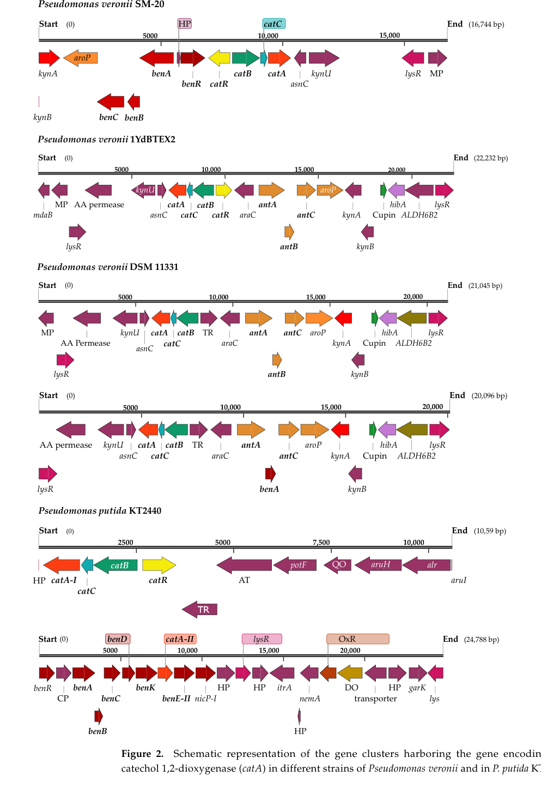

## Question

# Gene Research for Functional Annotation

## ⚠️ CRITICAL: Gene/Protein Identification Context

**BEFORE YOU BEGIN RESEARCH:** You MUST verify you are researching the CORRECT gene/protein. Gene symbols can be ambiguous, especially for less well-characterized genes from non-model organisms.

### Target Gene/Protein Identity (from UniProt):
- **UniProt Accession:** Q88I38
- **Protein Description:** SubName: Full=Benzoate 1,2-dioxygenase electron transfer component {ECO:0000313|EMBL:AAN68771.1}; EC=1.14.12.10 {ECO:0000313|EMBL:AAN68771.1}; EC=1.18.1.3 {ECO:0000313|EMBL:AAN68771.1};
- **Gene Information:** Name=benC {ECO:0000313|EMBL:AAN68771.1}; OrderedLocusNames=PP_3163 {ECO:0000313|EMBL:AAN68771.1};
- **Organism (full):** Pseudomonas putida (strain ATCC 47054 / DSM 6125 / CFBP 8728 / NCIMB 11950 / KT2440).
- **Protein Family:** Not specified in UniProt
- **Key Domains:** 2Fe-2S_ferredoxin-like_sf. (IPR036010); 2Fe-2S_ferredoxin-type. (IPR001041); 2Fe2S_fd_BS. (IPR006058); BenC-like_FAD_NAD-bd. (IPR047683); Beta-grasp_dom_sf. (IPR012675)

### MANDATORY VERIFICATION STEPS:

1. **Check if the gene symbol "benC" matches the protein description above**
2. **Verify the organism is correct:** Pseudomonas putida (strain ATCC 47054 / DSM 6125 / CFBP 8728 / NCIMB 11950 / KT2440).
3. **Check if protein family/domains align with what you find in literature**
4. **If you find literature for a DIFFERENT gene with the same or similar symbol, STOP**

### If Gene Symbol is Ambiguous or You Cannot Find Relevant Literature:

**DO NOT PROCEED WITH RESEARCH ON A DIFFERENT GENE.** Instead:
- State clearly: "The gene symbol 'benC' is ambiguous or literature is limited for this specific protein"
- Explain what you found (e.g., "Found extensive literature on a different gene with the same symbol in a different organism")
- Describe the protein based ONLY on the UniProt information provided above
- Suggest that the protein function can be inferred from domain/family information

### Research Target:

Please provide a comprehensive research report on the gene **benC** (gene ID: benC, UniProt: Q88I38) in PSEPK.

The research report should be a detailed narrative explaining the function, biological processes, and localization of the gene product. Citations should be given for all claims.

You should prioritize authoritative reviews and primary scientific literature when conducting research. You can supplement
this with annotations you find in gene/protein databases, but these can be outdated or inaccurate.

We are specifically interested in the primary function of the gene - for enzymes, what reaction is catalyzed, and what is the substrate specificity? For transporters, what is the substrate? For structural proteins or adapters, what is the broader structural role? For signaling molecules, what is the role in the pathway.

We are interested in where in or outside the cell the gene product carries out its function.

We are also interested in the signaling or biochemical pathways in which the gene functions. We are less interested in broad pleiotropic effects, except where these elucidate the precise role.

Include evidence where possible. We are interested in both experimental evidence as well as inference from structure, evolution, or bioinformatic analysis. Precise studies should be prioritized over high-throughput, where available.

## Output

Question: You are an expert researcher providing comprehensive, well-cited information.

Provide detailed information focusing on:
1. Key concepts and definitions with current understanding
2. Recent developments and latest research (prioritize 2023-2024 sources)
3. Current applications and real-world implementations
4. Expert opinions and analysis from authoritative sources
5. Relevant statistics and data from recent studies

Format as a comprehensive research report with proper citations. Include URLs and publication dates where available.
Always prioritize recent, authoritative sources and provide specific citations for all major claims.

# Gene Research for Functional Annotation

## ⚠️ CRITICAL: Gene/Protein Identification Context

**BEFORE YOU BEGIN RESEARCH:** You MUST verify you are researching the CORRECT gene/protein. Gene symbols can be ambiguous, especially for less well-characterized genes from non-model organisms.

### Target Gene/Protein Identity (from UniProt):
- **UniProt Accession:** Q88I38
- **Protein Description:** SubName: Full=Benzoate 1,2-dioxygenase electron transfer component {ECO:0000313|EMBL:AAN68771.1}; EC=1.14.12.10 {ECO:0000313|EMBL:AAN68771.1}; EC=1.18.1.3 {ECO:0000313|EMBL:AAN68771.1};
- **Gene Information:** Name=benC {ECO:0000313|EMBL:AAN68771.1}; OrderedLocusNames=PP_3163 {ECO:0000313|EMBL:AAN68771.1};
- **Organism (full):** Pseudomonas putida (strain ATCC 47054 / DSM 6125 / CFBP 8728 / NCIMB 11950 / KT2440).
- **Protein Family:** Not specified in UniProt
- **Key Domains:** 2Fe-2S_ferredoxin-like_sf. (IPR036010); 2Fe-2S_ferredoxin-type. (IPR001041); 2Fe2S_fd_BS. (IPR006058); BenC-like_FAD_NAD-bd. (IPR047683); Beta-grasp_dom_sf. (IPR012675)

### MANDATORY VERIFICATION STEPS:

1. **Check if the gene symbol "benC" matches the protein description above**
2. **Verify the organism is correct:** Pseudomonas putida (strain ATCC 47054 / DSM 6125 / CFBP 8728 / NCIMB 11950 / KT2440).
3. **Check if protein family/domains align with what you find in literature**
4. **If you find literature for a DIFFERENT gene with the same or similar symbol, STOP**

### If Gene Symbol is Ambiguous or You Cannot Find Relevant Literature:

**DO NOT PROCEED WITH RESEARCH ON A DIFFERENT GENE.** Instead:
- State clearly: "The gene symbol 'benC' is ambiguous or literature is limited for this specific protein"
- Explain what you found (e.g., "Found extensive literature on a different gene with the same symbol in a different organism")
- Describe the protein based ONLY on the UniProt information provided above
- Suggest that the protein function can be inferred from domain/family information

### Research Target:

Please provide a comprehensive research report on the gene **benC** (gene ID: benC, UniProt: Q88I38) in PSEPK.

The research report should be a detailed narrative explaining the function, biological processes, and localization of the gene product. Citations should be given for all claims.

You should prioritize authoritative reviews and primary scientific literature when conducting research. You can supplement
this with annotations you find in gene/protein databases, but these can be outdated or inaccurate.

We are specifically interested in the primary function of the gene - for enzymes, what reaction is catalyzed, and what is the substrate specificity? For transporters, what is the substrate? For structural proteins or adapters, what is the broader structural role? For signaling molecules, what is the role in the pathway.

We are interested in where in or outside the cell the gene product carries out its function.

We are also interested in the signaling or biochemical pathways in which the gene functions. We are less interested in broad pleiotropic effects, except where these elucidate the precise role.

Include evidence where possible. We are interested in both experimental evidence as well as inference from structure, evolution, or bioinformatic analysis. Precise studies should be prioritized over high-throughput, where available.

## Research report: **benC (PP_3163; UniProt Q88I38)** in *Pseudomonas putida* KT2440

### Executive summary (identity verification)
The UniProt target **Q88I38** corresponds to **benC / PP_3163** in *Pseudomonas putida* strain KT2440 and is functionally associated with the **benzoate 1,2-dioxygenase (Ben) peripheral pathway** that converts benzoate to catechol. Multiple independent sources converge on the same functional identity: **BenC is the electron-transfer (reductase) component** of the multicomponent benzoate 1,2-dioxygenase system encoded in the **ben gene cluster**. (jeffrey1992characterizationofpseudomonas pages 1-1, perezpantoja2008metabolicreconstructionof pages 5-5, zavalameneses2024proteogenomiccharacterizationof pages 8-9)

### 1) Key concepts and definitions (current understanding)

#### 1.1 Benzoate 1,2-dioxygenase (BenDO) and “electron transfer component”
Aerobic benzoate utilization in many bacteria begins with a **ring-hydroxylating dioxygenase** that catalyzes **dihydroxylation of the aromatic ring** to form a **non-aromatic cis-dihydrodiol (“benzoate diol”)**. In *Pseudomonas* benzoate metabolism, the **structural genes benABC** encode the initiating benzoate dioxygenase system responsible for benzoate → benzoate diol conversion. (jeffrey1992characterizationofpseudomonas pages 1-1, beharry2002characterizationofanthranilate pages 65-72)

In this system, **BenC** is the **electron transfer component** (reductase) that delivers reducing equivalents required for oxygen activation and substrate dihydroxylation by the oxygenase component. (perezpantoja2008metabolicreconstructionof pages 5-5, beharry2002characterizationofanthranilate pages 65-72)

#### 1.2 Peripheral pathway to catechol and entry into central metabolism
A key concept in aromatic catabolism is modularity: a “**peripheral**” pathway transforms a specific aromatic compound into a few “**central**” intermediates (e.g., catechol), which then enter broad central routes (e.g., catechol ortho-cleavage). In *P. putida*, **benD** encodes a **benzoate diol dehydrogenase** that converts the benzoate cis-dihydrodiol product into **catechol**. (jeffrey1992characterizationofpseudomonas pages 1-1, perezpantoja2008metabolicreconstructionof pages 5-5)

### 2) Function, mechanism, and substrate specificity

#### 2.1 Primary biochemical function of BenC (what it does)
**BenC functions as the reductase/electron-transfer partner of benzoate 1,2-dioxygenase**, providing electrons (ultimately from NADH/NAD(P)H) to drive the oxygenation of benzoate by the oxygenase component (BenAB in many naming schemes; benABC in the *Pseudomonas* locus context). (beharry2002characterizationofanthranilate pages 65-72, jeffrey1992characterizationofpseudomonas pages 1-1)

#### 2.2 Enzyme system architecture and cofactors
Biochemical characterization of **Pseudomonas benzoate 1,2-dioxygenase** indicates a multicomponent system in which the **oxygenase** is an **α3β3** complex containing a **Rieske-type [2Fe-2S] center** and **mononuclear iron**, while the associated **reductase component** is **monomeric** and contains **FAD** and a **plant-type [2Fe-2S]** cluster—i.e., an electron-transfer module consistent with BenC’s role. (beharry2002characterizationofanthranilate pages 65-72)

Direct structural/biochemical data for **KT2440 Q88I38** itself were not retrieved here; however, a close homolog (**Acinetobacter ADP1 BenC**) has been structurally and biochemically characterized and exhibits a domain architecture that aligns with UniProt/InterPro expectations for Q88I38: an N-terminal **[2Fe-2S] ferredoxin-like domain**, a **FAD-binding domain**, and a C-terminal **NAD(H)-binding domain**. (beharry2002characterizationofanthranilate pages 99-106, beharry2002characterizationofanthranilate pages 86-93, beharry2002characterizationofanthranilate pages 93-99)

#### 2.3 Reaction coupling and substrate preference (system-level properties)
For purified **Pseudomonas** BenDO activity, the reported stoichiometry for benzoate conversion is **NADH:O2:benzoate:benzoate diol = 1:1:1:1**, consistent with tightly coupled dioxygenation. (beharry2002characterizationofanthranilate pages 65-72)

Substrate preference described for Pseudomonas benzoate 1,2-dioxygenase includes a preference for **meta-substituted benzoates**, indicating that while benzoate is the canonical substrate, the enzyme system can accept substituted benzoates with some specificity constraints (system-level behavior, not necessarily unique to BenC). (beharry2002characterizationofanthranilate pages 65-72)

### 3) Pathway context in *P. putida* KT2440 (benzoate → catechol → catechol cleavage)

#### 3.1 Genetic evidence for pathway function
Classic genetic/physiological work in *Pseudomonas putida* identified mutants unable to catabolize benzoate to catechol, including strains accumulating the cis-diol intermediate. Cloned chromosomal fragments containing **benD, benABC, and a regulatory region (benR)** complemented benzoate-negative phenotypes and enabled **benzoate removal and catechol production**, supporting the in vivo role of the ben genes in benzoate-to-catechol conversion. (jeffrey1992characterizationofpseudomonas pages 1-1)

#### 3.2 Operon/cluster organization and linkage to catechol metabolism
A recent comparative genomics figure (2024) explicitly annotates **benA, benB, benC** as benzoate 1,2-dioxygenase components (with **benC = ferredoxin reductase component**) and places these near a **catA-II** locus in *P. putida* KT2440, reinforcing the functional coupling between benzoate activation and catechol-processing genes. (zavalameneses2024proteogenomiccharacterizationof media b208bc8e, zavalameneses2024proteogenomiccharacterizationof media 9ae478a3)

### 4) Cellular localization (what is supported vs inferred)
No direct subcellular localization experiment for **BenC (Q88I38)** in KT2440 was retrieved in the evidence assembled here. Based on its role as a soluble reductase/electron-transfer protein supplying electrons to an intracellular dioxygenase system, BenC is most consistent with a **cytosolic (intracellular) enzyme** associated functionally with the benzoate dioxygenase complex; however, this remains an **inference** from enzymology and gene-cluster context rather than direct localization evidence. (beharry2002characterizationofanthranilate pages 86-93, beharry2002characterizationofanthranilate pages 65-72, zavalameneses2024proteogenomiccharacterizationof pages 8-9)

### 5) Regulation and signaling/control of the ben pathway (expert-level mechanistic model)

#### 5.1 BenR is the pathway-specific activator for benABCD
In *P. putida*, **BenR** is the transcriptional activator required for expression of the **benABCD** benzoate peripheral pathway genes. (moreno2008thetargetfor pages 1-2, jeffrey1992characterizationofpseudomonas pages 1-1)

#### 5.2 Global catabolite repression via Crc targets benR translation
A detailed mechanistic study demonstrated that the **Crc global regulator** controls the benzoate pathway primarily by **post-transcriptional repression of benR translation**: Crc binds the 5′ region of benR mRNA and reduces BenR protein levels, thereby decreasing activation of the **benABCD** operon (and thus lowering BenC expression as part of the operon output). (moreno2008thetargetfor pages 2-2, moreno2008thetargetfor pages 5-6, moreno2008thetargetfor pages 1-2)

**Quantitative regulatory effects (KT2440 context):** in LB + benzoate, the presence of functional Crc represses **benA ~70-fold**, **catB ~80-fold**, and **pcaI ~240-fold** (mRNA-level differences), while benR mRNA is not strongly affected—supporting a translational control mechanism for benR. (moreno2008thetargetfor pages 3-4)

**Induction by benzoate:** addition of benzoate can induce **benA up to ~85-fold** and **catB ~25-fold** in the examined conditions, consistent with strong substrate-responsive activation of peripheral and central catabolic genes once repression is relieved and/or in appropriate growth states. (moreno2008thetargetfor pages 4-5)

### 6) Recent developments (prioritizing 2023–2024) and current applications

#### 6.1 Metabolic engineering and biomanufacturing (2023)
Recent synthetic/systems biotechnology work leverages aromatic catabolism modules (including the **BenABC/BenD benzoate→catechol route**) to channel aromatic substrates toward industrial products such as **cis,cis-muconic acid (ccMA)**, an important nylon/PET-precursor candidate chemical. In engineered *Pseudomonas*, pathway interventions (e.g., disabling competing catechol cleavage routes and downstream muconate consumption) are used to accumulate ccMA while using aromatic catabolic steps upstream to supply catechol. (He et al., 2023-09-01, https://doi.org/10.1016/j.synbio.2023.08.001) (he2023microbialproductionof pages 3-4)

While BenC (Q88I38) is not singled out biochemically in this 2023 engineering paper, the work illustrates a key real-world implementation: **the benzoate dioxygenase module is treated as a reusable metabolic “input” block** to supply catechol for downstream production pathways. (he2023microbialproductionof pages 3-4)

#### 6.2 Comparative genomics/proteogenomics of aromatic degradation (2024)
A 2024 proteogenomic/comparative genomics analysis of *Pseudomonas veronii* (with explicit comparison panels including *P. putida* KT2440) highlights the **genomic colocalization and modular organization** of ben and cat gene clusters, with explicit annotation of **benC as the ferredoxin reductase component**. Such studies reflect current practice: integrating genome context and proteomics to infer regulatory coordination and biodegradation capabilities in environmental pseudomonads. (Zavala-Meneses et al., 2024-04, https://doi.org/10.3390/microorganisms12040753) (zavalameneses2024proteogenomiccharacterizationof pages 8-9, zavalameneses2024proteogenomiccharacterizationof media 9ae478a3)

### 7) Key quantitative/statistical evidence summary

* **Stoichiometry (Pseudomonas BenDO system):** NADH:O2:benzoate:benzoate diol = **1:1:1:1**. (beharry2002characterizationofanthranilate pages 65-72)
* **Crc regulatory magnitude (KT2440):** repression of **benA ~70-fold**, **catB ~80-fold**, **pcaI ~240-fold** under the tested condition; benR mRNA largely unaffected, consistent with translational repression. (moreno2008thetargetfor pages 3-4, moreno2008thetargetfor pages 2-2)
* **Induction by benzoate (KT2440 condition reported):** benA up to **~85-fold**; catB **~25-fold**. (moreno2008thetargetfor pages 4-5)
* **Cofactor content and kinetics (BenC homolog, Acinetobacter ADP1; supports mechanistic inference for BenC-like proteins):** ~**0.9 mol FAD/mol protein**, **1.9 ± 0.5 mol Fe/mol monomer**; NADH consumption rate ~**17 µM/min per µM BenAB hexamer**; **Km(BenAB–BenC) ~32 µM**; estimated **kcat ~5800 min−1**. (beharry2002characterizationofanthranilate pages 86-93, beharry2002characterizationofanthranilate pages 93-99)

### 8) Evidence map (quick reference)
The table below summarizes the strongest evidence about BenC Q88I38, clearly separating KT2440-specific evidence from homolog-based inference.

| Aspect | Key points | Evidence/citation IDs |
|---|---|---|
| Identity | **Target verified:** UniProt Q88I38 = **benC / PP_3163** in *Pseudomonas putida* KT2440; corresponds to the **benzoate 1,2-dioxygenase electron-transfer component** in the chromosomal benzoate-catabolic locus. | (perezpantoja2008metabolicreconstructionof pages 5-5, jeffrey1992characterizationofpseudomonas pages 1-1, zavalameneses2024proteogenomiccharacterizationof pages 8-9) |
| Enzyme system role | In *P. putida*, **benABC** encode the multicomponent benzoate dioxygenase that initiates benzoate oxidation; BenC is the **electron-transfer/reductase partner** that supplies reducing equivalents to the oxygenase component. | (beharry2002characterizationofanthranilate pages 65-72, jeffrey1992characterizationofpseudomonas pages 1-1, moreno2008thetargetfor pages 1-2) |
| Reaction step | Pathway placement: **benzoate → cis-dihydrodiol (benzoate diol) via BenABC/BenC system → catechol via BenD**; this is the peripheral entry route into central catechol metabolism. | (perezpantoja2008metabolicreconstructionof pages 5-5, jeffrey1992characterizationofpseudomonas pages 1-1) |
| Cofactors/domains | **Homolog-based structural inference (Acinetobacter ADP1 BenC):** monomeric reductase with **N-terminal plant-type [2Fe-2S] ferredoxin domain**, **FAD-binding domain**, and **C-terminal NAD(H)-binding domain**; this matches UniProt/InterPro domain expectations for Q88I38. | (beharry2002characterizationofanthranilate pages 99-106, beharry2002characterizationofanthranilate pages 86-93, beharry2002characterizationofanthranilate pages 93-99) |
| Subunit architecture | **P. putida enzyme-system architecture:** oxygenase component is **α3β3** with Rieske [2Fe-2S] centers and mononuclear iron; reductase component is **monomeric** and contains **FAD + plant-type [2Fe-2S]**. BenC corresponds to that monomeric reductase/electron-transfer component. | (beharry2002characterizationofanthranilate pages 65-72, beharry2002characterizationofanthranilate pages 99-106, beharry2002characterizationofanthranilate pages 86-93) |
| Localization inference | No direct localization experiment for KT2440 BenC was retrieved; available evidence supports **intracellular/cytosolic function** as a soluble reductase acting with the benzoate dioxygenase complex in aromatic catabolism. This is an **inference** from enzyme biochemistry and gene-cluster context, not direct localization data. | (beharry2002characterizationofanthranilate pages 86-93, beharry2002characterizationofanthranilate pages 65-72, zavalameneses2024proteogenomiccharacterizationof pages 8-9) |
| Gene-cluster context | A 2024 comparative figure places **benR-benA-benB-benC** adjacent to a **catA-II** region in *P. putida* KT2440, reinforcing linkage of benzoate activation with downstream catechol cleavage genes. | (zavalameneses2024proteogenomiccharacterizationof media b208bc8e, zavalameneses2024proteogenomiccharacterizationof media 9ae478a3) |
| Regulation | In KT2440, **BenR** activates the **benABCD** benzoate peripheral pathway; the global regulator **Crc** represses benzoate utilization **indirectly by inhibiting benR translation**, thereby lowering benABCD expression. This regulates BenC expression as part of the operon-level output. | (moreno2008thetargetfor pages 4-5, moreno2008thetargetfor pages 2-2, moreno2008thetargetfor pages 5-6, moreno2008thetargetfor pages 1-2) |
| Quantitative parameters | **Direct P. putida system data:** benzoate dioxygenase stoichiometry reported as **NADH:O2:benzoate:benzoate diol = 1:1:1:1**; Pseudomonas BenDO shows preference for **meta-substituted benzoates**. **Homolog-based BenC kinetics (Acinetobacter ADP1):** ~**0.9 mol FAD/mol protein**, **1.9 ± 0.5 mol Fe/mol monomer**, **Km(BenAB–BenC) ~32 µM**, **kcat ~5800 min⁻1**; one source notes **P. putida BenDO turnover ~22,000 min⁻1** and **reported BenAB–BenC Km ~26 µM**. | (beharry2002characterizationofanthranilate pages 86-93, beharry2002characterizationofanthranilate pages 65-72, beharry2002characterizationofanthranilate pages 93-99) |
| Experimental support in P. putida genetics | Classic mutant/complementation work showed that benzoate-catabolism defects map to **benABC/benD/benR** functions; expression of cloned chromosomal fragments restored **benzoate removal and catechol production**, supporting the physiological role of the ben pathway in vivo. | (jeffrey1992characterizationofpseudomonas pages 1-1) |
| Recent applications/research context | **2023–2024 application context:** engineered *Pseudomonas* strains exploit the **benzoate → catechol** route to funnel aromatics into **cis,cis-muconic acid** production; recent comparative genomics/proteogenomics in environmental pseudomonads also highlight ben/cat gene clustering for aromatic biodegradation. These studies usually discuss the pathway at operon/system level rather than Q88I38 specifically. | (he2023microbialproductionof pages 3-4, zavalameneses2024proteogenomiccharacterizationof pages 6-8, zavalameneses2024proteogenomiccharacterizationof pages 8-9) |

*Table: This table condenses the strongest available evidence for BenC (Q88I38/PP_3163) in *Pseudomonas putida* KT2440, separating direct KT2440 evidence from homolog-based structural inference. It highlights pathway role, regulation, quantitative data, and recent biotechnological context.*

### Limitations and evidence gaps
* **Direct biochemical characterization specific to Q88I38 (KT2440 BenC)**—including purified-protein kinetics, substrate-range effects of BenC, and direct localization—was not retrieved in the accessible full texts here. Accordingly, **domain/cofactor architecture is supported primarily by close-homolog structural biochemistry** and by **system-level Pseudomonas BenDO biochemistry**, rather than direct experiments on Q88I38. (beharry2002characterizationofanthranilate pages 99-106, beharry2002characterizationofanthranilate pages 65-72)
* Recent (2023–2024) work is **strong on pathway engineering and genome-context inference**, but typically treats benzoate dioxygenase as a module and does not deeply dissect BenC biophysics in KT2440. (he2023microbialproductionof pages 3-4, zavalameneses2024proteogenomiccharacterizationof pages 8-9)

References

1. (jeffrey1992characterizationofpseudomonas pages 1-1): W. Jeffrey, M. Stephen, Cuskey, J. Peter, Chapman, Sol Resnick, and Ronald H. Olsen. Characterization of pseudomonas putida mutants unable to catabolize benzoate: cloning and characterization of pseudomonas genes involved in benzoate catabolism and isolation of a chromosomal dna fragment able to substitute for xyls in activation of the tol lower-pathway promoter. Journal of Bacteriology, 174:4986-4996, Aug 1992. URL: https://doi.org/10.1128/jb.174.15.4986-4996.1992, doi:10.1128/jb.174.15.4986-4996.1992. This article has 71 citations and is from a peer-reviewed journal.

2. (perezpantoja2008metabolicreconstructionof pages 5-5): D. Pérez-Pantoja, R. De la Iglesia, D. Pieper, and B. González. Metabolic reconstruction of aromatic compounds degradation from the genome of the amazing pollutant-degrading bacterium cupriavidus necator jmp134. FEMS microbiology reviews, 32 5:736-94, Aug 2008. URL: https://doi.org/10.1111/j.1574-6976.2008.00122.x, doi:10.1111/j.1574-6976.2008.00122.x. This article has 295 citations and is from a domain leading peer-reviewed journal.

3. (zavalameneses2024proteogenomiccharacterizationof pages 8-9): Sofía G. Zavala-Meneses, Andrea Firrincieli, Petra Chalova, Petr Pajer, Alice Checcucci, Ludovit Skultety, and Martina Cappelletti. Proteogenomic characterization of pseudomonas veronii sm-20 growing on phenanthrene as only carbon and energy source. Apr 2024. URL: https://doi.org/10.3390/microorganisms12040753, doi:10.3390/microorganisms12040753. This article has 9 citations.

4. (beharry2002characterizationofanthranilate pages 65-72): ZM Beharry. Characterization of anthranilate and benzoate 1, 2-dioxygenase from acinetobacter sp. strain adp1. Unknown journal, 2002.

5. (beharry2002characterizationofanthranilate pages 99-106): ZM Beharry. Characterization of anthranilate and benzoate 1, 2-dioxygenase from acinetobacter sp. strain adp1. Unknown journal, 2002.

6. (beharry2002characterizationofanthranilate pages 86-93): ZM Beharry. Characterization of anthranilate and benzoate 1, 2-dioxygenase from acinetobacter sp. strain adp1. Unknown journal, 2002.

7. (beharry2002characterizationofanthranilate pages 93-99): ZM Beharry. Characterization of anthranilate and benzoate 1, 2-dioxygenase from acinetobacter sp. strain adp1. Unknown journal, 2002.

8. (zavalameneses2024proteogenomiccharacterizationof media b208bc8e): Sofía G. Zavala-Meneses, Andrea Firrincieli, Petra Chalova, Petr Pajer, Alice Checcucci, Ludovit Skultety, and Martina Cappelletti. Proteogenomic characterization of pseudomonas veronii sm-20 growing on phenanthrene as only carbon and energy source. Apr 2024. URL: https://doi.org/10.3390/microorganisms12040753, doi:10.3390/microorganisms12040753. This article has 9 citations.

9. (zavalameneses2024proteogenomiccharacterizationof media 9ae478a3): Sofía G. Zavala-Meneses, Andrea Firrincieli, Petra Chalova, Petr Pajer, Alice Checcucci, Ludovit Skultety, and Martina Cappelletti. Proteogenomic characterization of pseudomonas veronii sm-20 growing on phenanthrene as only carbon and energy source. Apr 2024. URL: https://doi.org/10.3390/microorganisms12040753, doi:10.3390/microorganisms12040753. This article has 9 citations.

10. (moreno2008thetargetfor pages 1-2): Renata Moreno and Fernando Rojo. The target for the <i>pseudomonas putida</i> crc global regulator in the benzoate degradation pathway is the benr transcriptional regulator. Mar 2008. URL: https://doi.org/10.1128/jb.01604-07, doi:10.1128/jb.01604-07. This article has 120 citations and is from a peer-reviewed journal.

11. (moreno2008thetargetfor pages 2-2): Renata Moreno and Fernando Rojo. The target for the <i>pseudomonas putida</i> crc global regulator in the benzoate degradation pathway is the benr transcriptional regulator. Mar 2008. URL: https://doi.org/10.1128/jb.01604-07, doi:10.1128/jb.01604-07. This article has 120 citations and is from a peer-reviewed journal.

12. (moreno2008thetargetfor pages 5-6): Renata Moreno and Fernando Rojo. The target for the <i>pseudomonas putida</i> crc global regulator in the benzoate degradation pathway is the benr transcriptional regulator. Mar 2008. URL: https://doi.org/10.1128/jb.01604-07, doi:10.1128/jb.01604-07. This article has 120 citations and is from a peer-reviewed journal.

13. (moreno2008thetargetfor pages 3-4): Renata Moreno and Fernando Rojo. The target for the <i>pseudomonas putida</i> crc global regulator in the benzoate degradation pathway is the benr transcriptional regulator. Mar 2008. URL: https://doi.org/10.1128/jb.01604-07, doi:10.1128/jb.01604-07. This article has 120 citations and is from a peer-reviewed journal.

14. (moreno2008thetargetfor pages 4-5): Renata Moreno and Fernando Rojo. The target for the <i>pseudomonas putida</i> crc global regulator in the benzoate degradation pathway is the benr transcriptional regulator. Mar 2008. URL: https://doi.org/10.1128/jb.01604-07, doi:10.1128/jb.01604-07. This article has 120 citations and is from a peer-reviewed journal.

15. (he2023microbialproductionof pages 3-4): Siyang He, Weiwei Wang, Weidong Wang, Haiyang Hu, Ping Xu, and Hongzhi Tang. Microbial production of cis,cis-muconic acid from aromatic compounds in engineered pseudomonas. Sep 2023. URL: https://doi.org/10.1016/j.synbio.2023.08.001, doi:10.1016/j.synbio.2023.08.001. This article has 12 citations.

16. (zavalameneses2024proteogenomiccharacterizationof pages 6-8): Sofía G. Zavala-Meneses, Andrea Firrincieli, Petra Chalova, Petr Pajer, Alice Checcucci, Ludovit Skultety, and Martina Cappelletti. Proteogenomic characterization of pseudomonas veronii sm-20 growing on phenanthrene as only carbon and energy source. Apr 2024. URL: https://doi.org/10.3390/microorganisms12040753, doi:10.3390/microorganisms12040753. This article has 9 citations.

## Artifacts

- [Edison artifact artifact-00](benC-deep-research-falcon_artifacts/artifact-00.md)

## Citations

1. beharry2002characterizationofanthranilate pages 65-72
2. jeffrey1992characterizationofpseudomonas pages 1-1
3. moreno2008thetargetfor pages 3-4
4. moreno2008thetargetfor pages 4-5
5. he2023microbialproductionof pages 3-4
6. perezpantoja2008metabolicreconstructionof pages 5-5
7. zavalameneses2024proteogenomiccharacterizationof pages 8-9
8. beharry2002characterizationofanthranilate pages 99-106
9. beharry2002characterizationofanthranilate pages 86-93
10. beharry2002characterizationofanthranilate pages 93-99
11. moreno2008thetargetfor pages 1-2
12. moreno2008thetargetfor pages 2-2
13. moreno2008thetargetfor pages 5-6
14. zavalameneses2024proteogenomiccharacterizationof pages 6-8
15. 2Fe-2S
16. https://doi.org/10.1016/j.synbio.2023.08.001
17. https://doi.org/10.3390/microorganisms12040753
18. https://doi.org/10.1128/jb.174.15.4986-4996.1992,
19. https://doi.org/10.1111/j.1574-6976.2008.00122.x,
20. https://doi.org/10.3390/microorganisms12040753,
21. https://doi.org/10.1128/jb.01604-07,
22. https://doi.org/10.1016/j.synbio.2023.08.001,