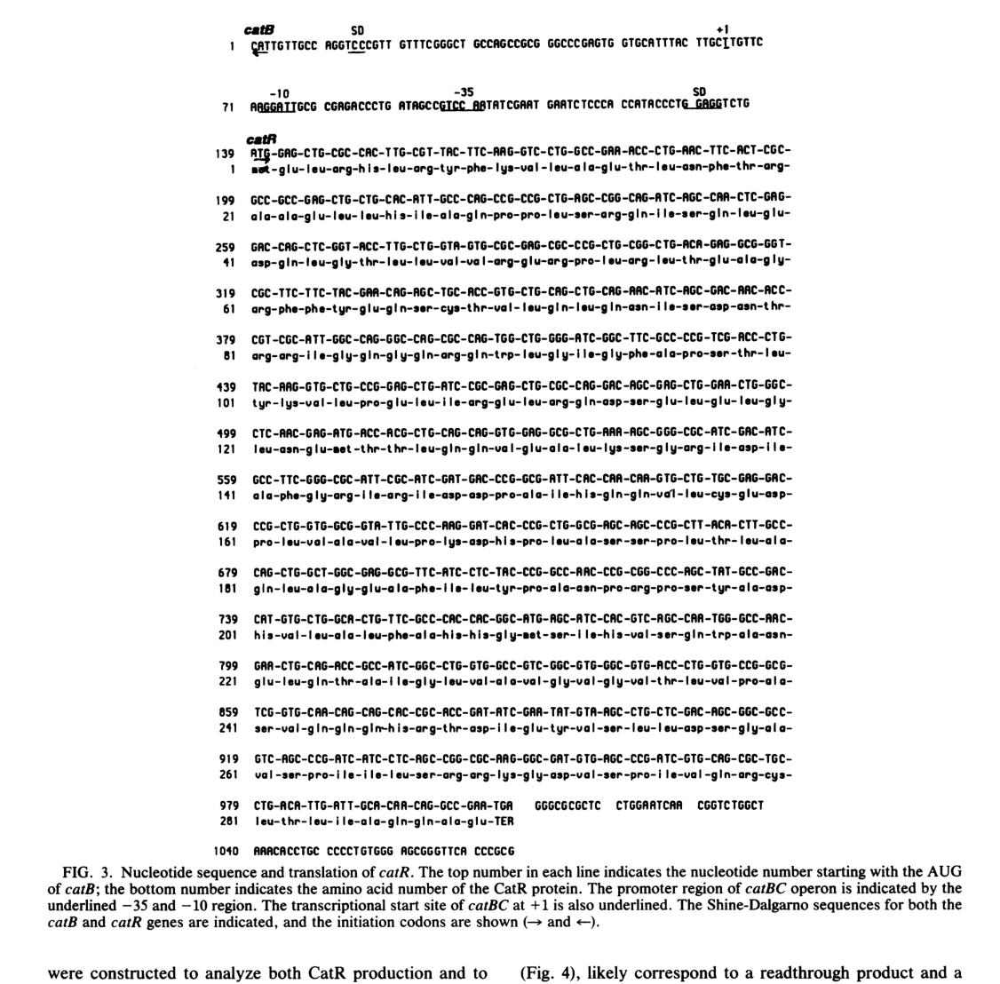

## Question

# Gene Research for Functional Annotation

## ⚠️ CRITICAL: Gene/Protein Identification Context

**BEFORE YOU BEGIN RESEARCH:** You MUST verify you are researching the CORRECT gene/protein. Gene symbols can be ambiguous, especially for less well-characterized genes from non-model organisms.

### Target Gene/Protein Identity (from UniProt):
- **UniProt Accession:** Q88GK5
- **Protein Description:** SubName: Full=HTH-type transcriptional regulator {ECO:0000313|EMBL:AAN69313.1};
- **Gene Information:** Name=catR {ECO:0000313|EMBL:AAN69313.1}; OrderedLocusNames=PP_3716 {ECO:0000313|EMBL:AAN69313.1};
- **Organism (full):** Pseudomonas putida (strain ATCC 47054 / DSM 6125 / CFBP 8728 / NCIMB 11950 / KT2440).
- **Protein Family:** Belongs to the LysR transcriptional regulatory family.
- **Key Domains:** LysR_HTH_N. (IPR000847); LysR_subst-bd. (IPR005119); WH-like_DNA-bd_sf. (IPR036388); WH_DNA-bd_sf. (IPR036390); HTH_1 (PF00126)

### MANDATORY VERIFICATION STEPS:

1. **Check if the gene symbol "catR" matches the protein description above**
2. **Verify the organism is correct:** Pseudomonas putida (strain ATCC 47054 / DSM 6125 / CFBP 8728 / NCIMB 11950 / KT2440).
3. **Check if protein family/domains align with what you find in literature**
4. **If you find literature for a DIFFERENT gene with the same or similar symbol, STOP**

### If Gene Symbol is Ambiguous or You Cannot Find Relevant Literature:

**DO NOT PROCEED WITH RESEARCH ON A DIFFERENT GENE.** Instead:
- State clearly: "The gene symbol 'catR' is ambiguous or literature is limited for this specific protein"
- Explain what you found (e.g., "Found extensive literature on a different gene with the same symbol in a different organism")
- Describe the protein based ONLY on the UniProt information provided above
- Suggest that the protein function can be inferred from domain/family information

### Research Target:

Please provide a comprehensive research report on the gene **catR** (gene ID: catR, UniProt: Q88GK5) in PSEPK.

The research report should be a detailed narrative explaining the function, biological processes, and localization of the gene product. Citations should be given for all claims.

You should prioritize authoritative reviews and primary scientific literature when conducting research. You can supplement
this with annotations you find in gene/protein databases, but these can be outdated or inaccurate.

We are specifically interested in the primary function of the gene - for enzymes, what reaction is catalyzed, and what is the substrate specificity? For transporters, what is the substrate? For structural proteins or adapters, what is the broader structural role? For signaling molecules, what is the role in the pathway.

We are interested in where in or outside the cell the gene product carries out its function.

We are also interested in the signaling or biochemical pathways in which the gene functions. We are less interested in broad pleiotropic effects, except where these elucidate the precise role.

Include evidence where possible. We are interested in both experimental evidence as well as inference from structure, evolution, or bioinformatic analysis. Precise studies should be prioritized over high-throughput, where available.

## Output

Question: You are an expert researcher providing comprehensive, well-cited information.

Provide detailed information focusing on:
1. Key concepts and definitions with current understanding
2. Recent developments and latest research (prioritize 2023-2024 sources)
3. Current applications and real-world implementations
4. Expert opinions and analysis from authoritative sources
5. Relevant statistics and data from recent studies

Format as a comprehensive research report with proper citations. Include URLs and publication dates where available.
Always prioritize recent, authoritative sources and provide specific citations for all major claims.

# Gene Research for Functional Annotation

## ⚠️ CRITICAL: Gene/Protein Identification Context

**BEFORE YOU BEGIN RESEARCH:** You MUST verify you are researching the CORRECT gene/protein. Gene symbols can be ambiguous, especially for less well-characterized genes from non-model organisms.

### Target Gene/Protein Identity (from UniProt):
- **UniProt Accession:** Q88GK5
- **Protein Description:** SubName: Full=HTH-type transcriptional regulator {ECO:0000313|EMBL:AAN69313.1};
- **Gene Information:** Name=catR {ECO:0000313|EMBL:AAN69313.1}; OrderedLocusNames=PP_3716 {ECO:0000313|EMBL:AAN69313.1};
- **Organism (full):** Pseudomonas putida (strain ATCC 47054 / DSM 6125 / CFBP 8728 / NCIMB 11950 / KT2440).
- **Protein Family:** Belongs to the LysR transcriptional regulatory family.
- **Key Domains:** LysR_HTH_N. (IPR000847); LysR_subst-bd. (IPR005119); WH-like_DNA-bd_sf. (IPR036388); WH_DNA-bd_sf. (IPR036390); HTH_1 (PF00126)

### MANDATORY VERIFICATION STEPS:

1. **Check if the gene symbol "catR" matches the protein description above**
2. **Verify the organism is correct:** Pseudomonas putida (strain ATCC 47054 / DSM 6125 / CFBP 8728 / NCIMB 11950 / KT2440).
3. **Check if protein family/domains align with what you find in literature**
4. **If you find literature for a DIFFERENT gene with the same or similar symbol, STOP**

### If Gene Symbol is Ambiguous or You Cannot Find Relevant Literature:

**DO NOT PROCEED WITH RESEARCH ON A DIFFERENT GENE.** Instead:
- State clearly: "The gene symbol 'catR' is ambiguous or literature is limited for this specific protein"
- Explain what you found (e.g., "Found extensive literature on a different gene with the same symbol in a different organism")
- Describe the protein based ONLY on the UniProt information provided above
- Suggest that the protein function can be inferred from domain/family information

### Research Target:

Please provide a comprehensive research report on the gene **catR** (gene ID: catR, UniProt: Q88GK5) in PSEPK.

The research report should be a detailed narrative explaining the function, biological processes, and localization of the gene product. Citations should be given for all claims.

You should prioritize authoritative reviews and primary scientific literature when conducting research. You can supplement
this with annotations you find in gene/protein databases, but these can be outdated or inaccurate.

We are specifically interested in the primary function of the gene - for enzymes, what reaction is catalyzed, and what is the substrate specificity? For transporters, what is the substrate? For structural proteins or adapters, what is the broader structural role? For signaling molecules, what is the role in the pathway.

We are interested in where in or outside the cell the gene product carries out its function.

We are also interested in the signaling or biochemical pathways in which the gene functions. We are less interested in broad pleiotropic effects, except where these elucidate the precise role.

Include evidence where possible. We are interested in both experimental evidence as well as inference from structure, evolution, or bioinformatic analysis. Precise studies should be prioritized over high-throughput, where available.

## Research report: Functional annotation of **catR** (UniProt **Q88GK5**; locus **PP_3716**) in *Pseudomonas putida* KT2440

### 0) Mandatory identity verification (disambiguation)
The UniProt target **Q88GK5** is annotated as **CatR**, an **HTH-type transcriptional regulator** in *Pseudomonas putida* strain **KT2440**, belonging to the **LysR-type transcriptional regulator (LTTR)** family. The experimental literature retrieved for **P. putida CatR** is consistent with this identity: CatR is a LysR-family regulator that controls the **cat** genes for catechol catabolism (catechol/β-ketoadipate pathway) and responds to **cis,cis-muconate** as its effector/inducer. (rothmel1990nucleotidesequencingand pages 7-8, rothmel1990nucleotidesequencingand pages 1-2, moreno2008thetargetfor pages 1-2)

*Important disambiguation note:* “catR” is used in other bacteria for regulators of catechol metabolism, but the body of evidence cited below is specifically for **Pseudomonas** CatR and aligns with a LysR-family protein regulating **catBC/catBCA** in the **catechol ortho-cleavage branch**. No conflicting “catR” identity was found in the retrieved sources. (rothmel1990nucleotidesequencingand pages 7-8, rothmel1990nucleotidesequencingand pages 1-2)

### 1) Key concepts and definitions (current understanding)

#### 1.1 LysR-type transcriptional regulators (LTTRs)
LTTRs are among the largest bacterial transcription factor families. They typically comprise an N-terminal **DNA-binding domain (DBD)** with a winged helix–turn–helix motif and a C-terminal **ligand/effector-binding domain (LBD/EBD)**. Effector binding drives conformational changes that modify DNA bending/footprints and RNA polymerase (RNAP) recruitment, producing inducible transcriptional responses (often reported across LTTR systems on the order of ~6–200×, depending on promoter and regulator). (demeester2024fundamentalsandexceptions pages 10-11, demeester2024fundamentalsandexceptions pages 8-10)

Mechanistically, recent reviews synthesize a consensus “**sliding-dimer**” framework: LTTRs bind DNA (often also without inducer), but ligand binding reorganizes the regulator-DNA complex (including reduced DNA bending) and facilitates RNAP engagement, commonly through contacts with RNAP (including the α-subunit). (demeester2024fundamentalsandexceptions pages 11-13, demeester2024fundamentalsandexceptions pages 8-10)

#### 1.2 CatR as a pathway-specific LTTR
CatR in *P. putida* is a **pathway-specific activator** for the **catechol** segment of the **β-ketoadipate pathway**, a central aromatic ring-cleavage route in soil bacteria. In this pathway context, peripheral metabolism (e.g., benzoate → catechol) generates intermediates that induce central catabolic operons that cleave and process catechol into metabolites entering central carbon metabolism. (moreno2008thetargetfor pages 1-2)

### 2) Functional role of CatR (what it does)

#### 2.1 Primary function: transcriptional activation of catechol ortho-cleavage genes
Classic experimental work demonstrated that **CatR is a positive transcriptional regulator of the catBC operon** and is required for activation **in the presence of the inducer cis,cis-muconate**. CatR is required for growth on benzoate in strains where benzoate degradation routes feed into catechol and then into the cat genes. (rothmel1990nucleotidesequencingand pages 1-1, rothmel1990nucleotidesequencingand pages 3-4, rothmel1990nucleotidesequencingand pages 1-2)

Rothmel et al. further report that CatR also exerts positive control over **catA** (catechol 1,2-dioxygenase; pyrocatechase I) in *P. putida*, implying CatR influences multiple promoters within the catechol branch. (rothmel1990nucleotidesequencingand pages 7-8, rothmel1990nucleotidesequencingand pages 1-2)

#### 2.2 Regulated genes/operons and pathway placement
In KT2440, transcriptomic evidence in a benzoate/muconate production context explicitly associates the cat operon genes with locus tags **PP_3713 (catA)**, **PP_3714 (catC)**, and **PP_3715 (catB)**, and shows their strong dependence on functional CatR. (duuren2011optimizationofpseudomonas pages 38-39)

A genome-based analysis of KT2440 aromatic catabolic pathways identifies **catR** in the **cat gene cluster** and, by analogy to earlier *P. putida* CatR studies, proposes CatR activates **catBCA** expression in KT2440 in response to **cis,cis-muconate**. (jimenez2002genomicanalysisof pages 5-6)

Overall pathway context (as summarized in regulatory studies): **BenR** activates the peripheral **benABCD** operon in response to benzoate, while **CatR** activates the central **catBCA** genes in response to **cis,cis-muconate**, connecting peripheral benzoate conversion to central catechol ring-cleavage. (moreno2008thetargetfor pages 1-2)

### 3) Effector/inducer specificity and molecular mechanism

#### 3.1 Effector: cis,cis-muconate
Across sources, the established CatR effector is **cis,cis-muconate**. CatR can bind its target promoter region even without the inducer, but transcriptional activation of catBC requires cis,cis-muconate. (rothmel1990nucleotidesequencingand pages 1-1, rothmel1990nucleotidesequencingand pages 1-2)

In vitro binding assays used **2 mM cis,cis-muconate** as an effector condition in the CatR DNA-binding experiments described in Rothmel et al. (rothmel1990nucleotidesequencingand pages 3-4)

#### 3.2 Promoter architecture and binding region
Rothmel et al. localized CatR DNA binding to a **385-bp promoter-control region** that includes the ~**140-bp** span between the translational start sites of **catR** and **catBC**, consistent with a **divergent promoter** arrangement (catR transcribed opposite catBC). (rothmel1990nucleotidesequencingand pages 7-8, rothmel1990nucleotidesequencingand pages 1-1)

The divergent promoter region and mapped features are visible in the paper’s figures (sequence/promoter map and gel retardation evidence). (rothmel1990nucleotidesequencingand media 4db38378, rothmel1990nucleotidesequencingand media c2848d52)

Complementary promoter-probe mapping of the **catBC promoter** (in *P. putida*) identified upstream fragments sufficient for benzoate-inducible transcription. A **390-bp** XhoI–PstI fragment supported promoter activity, whereas a shorter **135-bp** fragment ending 106 bp upstream of the catB start was insufficient, indicating required upstream regulatory sequence. (aldrich1988transcriptionalregulationnucleotide pages 4-5)

#### 3.3 Autoregulation
Evidence indicates CatR likely **autoregulates** its own expression through binding to the shared divergent control region: when the CatR binding site is intact, CatR RNA/protein levels decrease; deletion/nonfunction of CatR increases CatR RNA/protein levels. (rothmel1990nucleotidesequencingand pages 7-8, rothmel1990nucleotidesequencingand pages 1-1)

#### 3.4 Oligomerization state (expert synthesis)
A 2023 Annual Review synthesis notes that while many LTTRs are tetramers, some—including **CatR**—have been observed as **dimers in solution**, underscoring mechanistic diversity within the family and motivating careful empirical characterization when repurposing LTTRs as biosensor components. (baugh2023versatilityandcomplexity pages 9-12)

### 4) Cellular localization
No direct localization experiments (e.g., fractionation, microscopy tagging) were retrieved in the provided corpus for CatR. However, CatR is a DNA-binding transcriptional regulator acting at chromosomal promoter regions; this is consistent with a **cytosolic** protein that functions in association with the bacterial nucleoid. (rothmel1990nucleotidesequencingand pages 1-2, demeester2024fundamentalsandexceptions pages 8-10)

### 5) Recent developments (prioritizing 2023–2024) and authoritative expert opinions

#### 5.1 2023: LTTRs (including CatR) as modular biosensors and dynamic-control parts
A 2023 Annual Review article highlights LTTRs as versatile components for biotechnology and synthetic biology, including CatR as an example of a **cis,cis-muconate-responsive** regulator that can be used in engineered regulatory circuits and biosensing workflows. It describes:
- Heterologous use of CatR in **E. coli** to control a CatR-responsive promoter and dynamically coordinate muconate synthesis with growth-related flux control (a dynamic circuit reported to increase muconate yield vs an optimized static design, per cited primary work). (baugh2023versatilityandcomplexity pages 14-15)
- Use of muconate-responsive LTTR sensors in **P. putida** (e.g., related LTTR-based sensors) to support reporter-based screening (including fluorescence and FACS) for high-producing strains, and general guidance on tuning promoters and LTTR domains (DBD/EBD/LH) for sensitivity/specificity/dynamic range. (baugh2023versatilityandcomplexity pages 14-15)

#### 5.2 2024: Mechanistic consolidation and “rules” for engineering LTTRs
A 2024 review in *ACS Synthetic Biology* synthesizes LTTR structure–function principles relevant to CatR-like regulators, including domain architecture (DBD and LBD), effector binding in LBD clefts, oligomerization and DNA-binding site geometry (often involving motifs such as T–N11–A in LTTR systems), and the “sliding dimer” mechanism as a unifying model while emphasizing exceptions. This review frames LTTRs as a promising but underexploited pool for biosensor development and stresses that mechanistic understanding accelerates sensor engineering. (demeester2024fundamentalsandexceptions pages 8-10, demeester2024fundamentalsandexceptions pages 11-13)

### 6) Current applications and real-world implementations

#### 6.1 Biocatalysis: engineering CatR regulation to accumulate cis,cis-muconate
A KT2440-derived strain (KT2440-JD1) described in an applied optimization study accumulates **cis,cis-muconate** from benzoate because the **cat operon is not expressed** due to a **point mutation in catR** (reported as Arg50→Cys50), which abolishes induction of cat genes; complementation with wildtype catR restored benzoate growth, supporting causality of the regulatory lesion. (duuren2011optimizationofpseudomonas pages 38-39)

This work reports industrially relevant performance for muconate production:
- Batch cultures: maximal specific production rate reported as **2.0 g cis,cis-muconate gDCW⁻¹ h⁻¹** (noted as ~8-fold higher than previously reported in that text). (duuren2011optimizationofpseudomonas pages 43-48)
- pH-stat fed-batch: **18.5 g L⁻¹** cis,cis-muconate produced with **~96% molar yield** (and described as nearly 100% yield in the narrative) and a reported specific rate of **0.6 g (4.3 mmol) gDCW⁻¹ h⁻¹** under that process mode. (duuren2011optimizationofpseudomonas pages 43-48)

These results illustrate a direct real-world use case where **disabling CatR-mediated induction of downstream catabolism** is exploited to prevent further consumption of muconate, enabling product accumulation. (duuren2011optimizationofpseudomonas pages 43-48)

#### 6.2 Synthetic biology: CatR as a muconate-responsive transcription factor
Expert review-level synthesis describes CatR as a usable sensor/actuator for muconate-responsive gene control (including heterologous contexts) and discusses general LTTR engineering levers (promoters, DBD, EBD specificity, linker helix) to adapt sensors to new ranges and ligands. (baugh2023versatilityandcomplexity pages 14-15, demeester2024fundamentalsandexceptions pages 8-10)

### 7) Relevant statistics and data (selected quantitative findings)

Key quantitative results supporting CatR functional annotation include:
- **Protein size:** CatR predicted ~**32.2 kDa** (with minicell product near ~30 kDa). (rothmel1990nucleotidesequencingand pages 1-1, rothmel1990nucleotidesequencingand pages 5-6)
- **Promoter-control region:** CatR binding localized to a **385-bp** fragment; divergent catR-catBC intergenic span ~**140 bp**. (rothmel1990nucleotidesequencingand pages 7-8, rothmel1990nucleotidesequencingand pages 1-1)
- **Effector usage in assays:** binding experiments used **2 mM cis,cis-muconate** conditions. (rothmel1990nucleotidesequencingand pages 3-4)
- **Promoter-probe induction readout:** catBC promoter constructs enabled growth up to **8 mg/mL streptomycin** when grown on **benzoate**, but only slight growth up to **~1 mg/mL** on glucose, indicating strong induction with low basal activity. (aldrich1988transcriptionalregulationnucleotide pages 4-5)
- **KT2440 transcriptomics (CatR dependence):** in the cited comparison, benzoate induced wildtype KT2440 cat genes strongly (e.g., **catC ~16.29-fold; catA ~15.43-fold; catB ~8.44-fold**), while the catR mutant showed near loss of expression (**catA 0.03-fold; catB 0.11-fold; catC 0.03-fold**). (duuren2011optimizationofpseudomonas pages 38-39)

### 8) Evidence summary table
The following table consolidates the functional annotation, pathway role, mechanistic features, and quantitative evidence.

| Aspect | Key details | Evidence/citation IDs | Source (authors year doi url) |
|---|---|---|---|
| identity | Target is **CatR**, a positive transcriptional regulator of the **catBC/catBCA** catechol-catabolic genes in *Pseudomonas putida*; in KT2440 literature the cat operon genes are **PP_3713 catA, PP_3714 catC, PP_3715 catB**, and CatR is the cognate LysR-type regulator linked to this operon. KT2440-specific evidence strongly links CatR function to this locus neighborhood, although some foundational papers predate PP_ locus tags. | (duuren2011optimizationofpseudomonas pages 38-39, jimenez2002genomicanalysisof pages 5-6, moreno2008thetargetfor pages 1-2) | van Duuren 2011 doi:10.18174/176647 https://doi.org/10.18174/176647; Jiménez et al. 2002 doi:10.1046/j.1462-2920.2002.00370.x https://doi.org/10.1046/j.1462-2920.2002.00370.x; Moreno & Rojo 2008 doi:10.1128/jb.01604-07 https://doi.org/10.1128/jb.01604-07 |
| family/domains | CatR is a **LysR-type transcriptional regulator (LTTR)** with an N-terminal **helix-turn-helix / winged-HTH DNA-binding domain** and a C-terminal **effector-binding domain**; CatR is reported as a ~**32.2 kDa** protein and shares N-terminal homology with other LysR regulators. | (rothmel1990nucleotidesequencingand pages 1-1, rothmel1990nucleotidesequencingand pages 1-2, rothmel1990nucleotidesequencingand pages 7-8, demeester2024fundamentalsandexceptions pages 8-10) | Rothmel et al. 1990 doi:10.1128/jb.172.2.922-931.1990 https://doi.org/10.1128/jb.172.2.922-931.1990; Demeester et al. 2024 doi:10.1021/acssynbio.4c00219 https://doi.org/10.1021/acssynbio.4c00219 |
| regulated genes/operons | Experimentally, CatR activates the **catBC operon** and also positively controls **catA**, giving divergent regulation of **catA** and **catBC/catBCA** in the catechol branch. In KT2440, benzoate-dependent induction of cat genes depends on functional CatR. | (rothmel1990nucleotidesequencingand pages 7-8, duuren2011optimizationofpseudomonas pages 38-39, rothmel1990nucleotidesequencingand pages 1-2, moreno2008thetargetfor pages 1-2) | Rothmel et al. 1990 doi:10.1128/jb.172.2.922-931.1990 https://doi.org/10.1128/jb.172.2.922-931.1990; van Duuren 2011 doi:10.18174/176647 https://doi.org/10.18174/176647; Moreno & Rojo 2008 doi:10.1128/jb.01604-07 https://doi.org/10.1128/jb.01604-07 |
| pathway role | CatR functions in the **catechol branch of the β-ketoadipate pathway**, downstream of peripheral benzoate conversion to catechol. It controls the central ring-cleavage steps converting catechol-derived **cis,cis-muconate** onward toward β-ketoadipate intermediates. | (rothmel1990nucleotidesequencingand pages 3-4, moreno2008thetargetfor pages 1-2, jimenez2002genomicanalysisof pages 5-6) | Rothmel et al. 1990 doi:10.1128/jb.172.2.922-931.1990 https://doi.org/10.1128/jb.172.2.922-931.1990; Moreno & Rojo 2008 doi:10.1128/jb.01604-07 https://doi.org/10.1128/jb.01604-07; Jiménez et al. 2002 doi:10.1046/j.1462-2920.2002.00370.x https://doi.org/10.1046/j.1462-2920.2002.00370.x |
| effector/inducer | The established CatR effector/inducer is **cis,cis-muconate**. CatR can bind promoter DNA with or without inducer, but transcriptional activation requires cis,cis-muconate. Benzoate induction of cat genes occurs indirectly through pathway flux to the muconate inducer. | (rothmel1990nucleotidesequencingand pages 7-8, rothmel1990nucleotidesequencingand pages 1-1, rothmel1990nucleotidesequencingand pages 3-4, rothmel1990nucleotidesequencingand pages 1-2, moreno2008thetargetfor pages 1-2, baugh2023versatilityandcomplexity pages 19-21) | Rothmel et al. 1990 doi:10.1128/jb.172.2.922-931.1990 https://doi.org/10.1128/jb.172.2.922-931.1990; Moreno & Rojo 2008 doi:10.1128/jb.01604-07 https://doi.org/10.1128/jb.01604-07; Baugh et al. 2023 doi:10.1146/annurev-micro-050323-040543 https://doi.org/10.1146/annurev-micro-050323-040543 |
| promoter/TFBS architecture | CatR binds a **385-bp promoter-control region** spanning the divergent **catR-catBC** intergenic control region, including about **140 bp** between translational starts. The **catBC promoter** was mapped upstream of catB; the **-35** site lies **36 nt** from the predicted CatR translational start. A **390-bp XhoI-PstI** fragment was sufficient for benzoate-inducible promoter activity, whereas a **135-bp** fragment ending **106 bp** upstream of catB was insufficient, indicating required upstream regulatory sequences. General LTTR promoter recognition often includes a **T-N11-A** motif, but a CatR-specific motif sequence was not resolved in the supplied snippets. | (rothmel1990nucleotidesequencingand pages 1-1, aldrich1988transcriptionalregulationnucleotide pages 4-5, rothmel1990nucleotidesequencingand pages 7-8, rothmel1990nucleotidesequencingand media 4db38378, demeester2024fundamentalsandexceptions pages 8-10, baugh2023versatilityandcomplexity pages 1-3) | Rothmel et al. 1990 doi:10.1128/jb.172.2.922-931.1990 https://doi.org/10.1128/jb.172.2.922-931.1990; Aldrich & Chakrabarty 1988 doi:10.1128/jb.170.3.1297-1304.1988 https://doi.org/10.1128/jb.170.3.1297-1304.1988; Demeester et al. 2024 doi:10.1021/acssynbio.4c00219 https://doi.org/10.1021/acssynbio.4c00219; Baugh et al. 2023 doi:10.1146/annurev-micro-050323-040543 https://doi.org/10.1146/annurev-micro-050323-040543 |
| mechanism/oligomerization | CatR is a DNA-binding LTTR that activates transcription after effector-triggered conformational change. Current LTTR models describe dimers that often assemble into tetramers on DNA; **CatR has been observed as a dimer in solution** in family-level comparisons. LTTR activation commonly reduces DNA bending and promotes RNA polymerase engagement; CatR-dependent activation has been linked to contacts with the **RNAP α-subunit** in broader LTTR mechanistic analyses. | (demeester2024fundamentalsandexceptions pages 11-13, demeester2024fundamentalsandexceptions pages 10-11, baugh2023versatilityandcomplexity pages 9-12, baugh2023versatilityandcomplexity pages 19-21) | Demeester et al. 2024 doi:10.1021/acssynbio.4c00219 https://doi.org/10.1021/acssynbio.4c00219; Baugh et al. 2023 doi:10.1146/annurev-micro-050323-040543 https://doi.org/10.1146/annurev-micro-050323-040543 |
| autoregulation | Evidence supports **negative autoregulation** of catR: when the CatR binding site is intact, CatR protein/RNA levels are reduced; deletion or nonfunctional CatR increases CatR expression, consistent with CatR binding in the shared divergent control region and repressing its own transcription while activating cat genes under inducing conditions. | (rothmel1990nucleotidesequencingand pages 7-8, rothmel1990nucleotidesequencingand pages 1-1, rothmel1990nucleotidesequencingand pages 5-6, baugh2023versatilityandcomplexity pages 1-3) | Rothmel et al. 1990 doi:10.1128/jb.172.2.922-931.1990 https://doi.org/10.1128/jb.172.2.922-931.1990; Baugh et al. 2023 doi:10.1146/annurev-micro-050323-040543 https://doi.org/10.1146/annurev-micro-050323-040543 |
| key experimental evidence | Foundational evidence includes: cloning/complementation of **catR** restoring growth on benzoate; **gel-retardation** assays showing CatR binding to the catR-catBC control region; promoter-probe mapping of the catBC promoter; and KT2440 mutant analysis showing that a **catR Arg50→Cys** substitution abolishes benzoate induction of the cat operon and growth on benzoate, with complementation restoring growth. | (rothmel1990nucleotidesequencingand pages 7-8, rothmel1990nucleotidesequencingand pages 3-4, aldrich1988transcriptionalregulationnucleotide pages 4-5, duuren2011optimizationofpseudomonas pages 38-39, rothmel1990nucleotidesequencingand media 4db38378) | Rothmel et al. 1990 doi:10.1128/jb.172.2.922-931.1990 https://doi.org/10.1128/jb.172.2.922-931.1990; Aldrich & Chakrabarty 1988 doi:10.1128/jb.170.3.1297-1304.1988 https://doi.org/10.1128/jb.170.3.1297-1304.1988; van Duuren 2011 doi:10.18174/176647 https://doi.org/10.18174/176647 |
| quantitative data | Reported quantitative features include: CatR predicted mass **32.2 kDa** and observed minicell product ~**30 kDa**; CatR binding/promoter region **385 bp**; ~**140 bp** between catR and catBC translational starts; catBC promoter **-35** located **36 nt** from CatR start; binding assays used **2 mM cis,cis-muconate**; promoter-probe constructs supported growth up to **8 mg/mL streptomycin** on benzoate versus only ~**1 mg/mL** on glucose; KT2440 wild type showed benzoate induction of **catC ~16.29-fold, catA ~15.43-fold, catB ~8.44-fold**, whereas the catR mutant showed **catA 0.03-fold, catB 0.11-fold, catC 0.03-fold** in the cited comparison. | (rothmel1990nucleotidesequencingand pages 1-1, rothmel1990nucleotidesequencingand pages 3-4, aldrich1988transcriptionalregulationnucleotide pages 4-5, rothmel1990nucleotidesequencingand pages 5-6, duuren2011optimizationofpseudomonas pages 38-39) | Rothmel et al. 1990 doi:10.1128/jb.172.2.922-931.1990 https://doi.org/10.1128/jb.172.2.922-931.1990; Aldrich & Chakrabarty 1988 doi:10.1128/jb.170.3.1297-1304.1988 https://doi.org/10.1128/jb.170.3.1297-1304.1988; van Duuren 2011 doi:10.18174/176647 https://doi.org/10.18174/176647 |

*Table: This table summarizes the experimentally supported functional annotation of Pseudomonas putida KT2440 CatR, including pathway role, regulated genes, effector, promoter architecture, mechanism, and quantitative evidence. It is useful as a compact evidence map tying classical CatR studies to the KT2440 cat operon context.*

### 9) Limitations and gaps
- **KT2440 locus-tag mapping:** Retrieved sources strongly support CatR function and link cat genes to the PP_3713–PP_3715 region in KT2440, but the explicit text string “PP_3716 = catR = UniProt Q88GK5” did not appear in the extracted excerpts; this mapping is consistent with the user-provided UniProt entry and the operon neighborhood evidence but is not directly quoted from the papers here. (duuren2011optimizationofpseudomonas pages 38-39, jimenez2002genomicanalysisof pages 5-6)
- **Direct cellular localization experiments:** none retrieved; localization is inferred from transcription-factor function. (demeester2024fundamentalsandexceptions pages 8-10)
- **Recent (2023–2024) CatR-specific primary research:** searches did not retrieve new CatR-focused experimental papers in 2023–2024; recent content is primarily high-authority review synthesis on LTTR mechanisms and engineering applications. (baugh2023versatilityandcomplexity pages 14-15, demeester2024fundamentalsandexceptions pages 8-10)

### Key cited sources (URLs; publication dates)
- Rothmel et al. *J Bacteriol* **1990-02**. “Nucleotide sequencing and characterization of *Pseudomonas putida* catR…” https://doi.org/10.1128/jb.172.2.922-931.1990 (rothmel1990nucleotidesequencingand pages 7-8)
- Aldrich & Chakrabarty. *J Bacteriol* **1988-03**. “Transcriptional regulation… of the catBC operon…” https://doi.org/10.1128/jb.170.3.1297-1304.1988 (aldrich1988transcriptionalregulationnucleotide pages 4-5)
- Jiménez et al. *Environ Microbiol* **2002-12**. “Genomic analysis of the aromatic catabolic pathways from *P. putida* KT2440.” https://doi.org/10.1046/j.1462-2920.2002.00370.x (jimenez2002genomicanalysisof pages 5-6)
- Moreno & Rojo. *J Bacteriol* **2008-03**. “The target for the *P. putida* Crc global regulator…” https://doi.org/10.1128/jb.01604-07 (moreno2008thetargetfor pages 1-2)
- van Duuren. **2011** (thesis/report on KT2440 muconate production). https://doi.org/10.18174/176647 (duuren2011optimizationofpseudomonas pages 43-48)
- Baugh et al. *Annu Rev Microbiol* **2023-09**. “Versatility and Complexity: … LTTRs” https://doi.org/10.1146/annurev-micro-050323-040543 (baugh2023versatilityandcomplexity pages 14-15)
- Demeester et al. *ACS Synth Biol* **2024-09**. “Fundamentals and Exceptions of the LysR-type Transcriptional Regulators.” https://doi.org/10.1021/acssynbio.4c00219 (demeester2024fundamentalsandexceptions pages 8-10)

References

1. (rothmel1990nucleotidesequencingand pages 7-8): R. Rothmel, L. Teri, Aldrich, John E. Houghton, W. M. Coco, L. Ornston, and A. Chakrabarty. Nucleotide sequencing and characterization of pseudomonas putida catr: a positive regulator of the catbc operon is a member of the lysr family. Journal of Bacteriology, 172:922-931, Feb 1990. URL: https://doi.org/10.1128/jb.172.2.922-931.1990, doi:10.1128/jb.172.2.922-931.1990. This article has 184 citations and is from a peer-reviewed journal.

2. (rothmel1990nucleotidesequencingand pages 1-2): R. Rothmel, L. Teri, Aldrich, John E. Houghton, W. M. Coco, L. Ornston, and A. Chakrabarty. Nucleotide sequencing and characterization of pseudomonas putida catr: a positive regulator of the catbc operon is a member of the lysr family. Journal of Bacteriology, 172:922-931, Feb 1990. URL: https://doi.org/10.1128/jb.172.2.922-931.1990, doi:10.1128/jb.172.2.922-931.1990. This article has 184 citations and is from a peer-reviewed journal.

3. (moreno2008thetargetfor pages 1-2): Renata Moreno and Fernando Rojo. The target for the <i>pseudomonas putida</i> crc global regulator in the benzoate degradation pathway is the benr transcriptional regulator. Mar 2008. URL: https://doi.org/10.1128/jb.01604-07, doi:10.1128/jb.01604-07. This article has 120 citations and is from a peer-reviewed journal.

4. (demeester2024fundamentalsandexceptions pages 10-11): Wouter Demeester, Brecht De Paepe, and Marjan De Mey. Fundamentals and exceptions of the lysr-type transcriptional regulators. ACS synthetic biology, 13:3069-3092, Sep 2024. URL: https://doi.org/10.1021/acssynbio.4c00219, doi:10.1021/acssynbio.4c00219. This article has 23 citations and is from a domain leading peer-reviewed journal.

5. (demeester2024fundamentalsandexceptions pages 8-10): Wouter Demeester, Brecht De Paepe, and Marjan De Mey. Fundamentals and exceptions of the lysr-type transcriptional regulators. ACS synthetic biology, 13:3069-3092, Sep 2024. URL: https://doi.org/10.1021/acssynbio.4c00219, doi:10.1021/acssynbio.4c00219. This article has 23 citations and is from a domain leading peer-reviewed journal.

6. (demeester2024fundamentalsandexceptions pages 11-13): Wouter Demeester, Brecht De Paepe, and Marjan De Mey. Fundamentals and exceptions of the lysr-type transcriptional regulators. ACS synthetic biology, 13:3069-3092, Sep 2024. URL: https://doi.org/10.1021/acssynbio.4c00219, doi:10.1021/acssynbio.4c00219. This article has 23 citations and is from a domain leading peer-reviewed journal.

7. (rothmel1990nucleotidesequencingand pages 1-1): R. Rothmel, L. Teri, Aldrich, John E. Houghton, W. M. Coco, L. Ornston, and A. Chakrabarty. Nucleotide sequencing and characterization of pseudomonas putida catr: a positive regulator of the catbc operon is a member of the lysr family. Journal of Bacteriology, 172:922-931, Feb 1990. URL: https://doi.org/10.1128/jb.172.2.922-931.1990, doi:10.1128/jb.172.2.922-931.1990. This article has 184 citations and is from a peer-reviewed journal.

8. (rothmel1990nucleotidesequencingand pages 3-4): R. Rothmel, L. Teri, Aldrich, John E. Houghton, W. M. Coco, L. Ornston, and A. Chakrabarty. Nucleotide sequencing and characterization of pseudomonas putida catr: a positive regulator of the catbc operon is a member of the lysr family. Journal of Bacteriology, 172:922-931, Feb 1990. URL: https://doi.org/10.1128/jb.172.2.922-931.1990, doi:10.1128/jb.172.2.922-931.1990. This article has 184 citations and is from a peer-reviewed journal.

9. (duuren2011optimizationofpseudomonas pages 38-39): J.B.J.H. van Duuren. Optimization of pseudomonas putida kt2440 as host for the production of cis, cis-muconate from benzoate. ArXiv, 2011. URL: https://doi.org/10.18174/176647, doi:10.18174/176647. This article has 4 citations.

10. (jimenez2002genomicanalysisof pages 5-6): José Ignacio Jiménez, Baltasar Miñambres, José Luis García, and Eduardo Díaz. Genomic analysis of the aromatic catabolic pathways from pseudomonas putida kt2440. Environmental microbiology, 4 12:824-41, Dec 2002. URL: https://doi.org/10.1046/j.1462-2920.2002.00370.x, doi:10.1046/j.1462-2920.2002.00370.x. This article has 698 citations and is from a domain leading peer-reviewed journal.

11. (rothmel1990nucleotidesequencingand media 4db38378): R. Rothmel, L. Teri, Aldrich, John E. Houghton, W. M. Coco, L. Ornston, and A. Chakrabarty. Nucleotide sequencing and characterization of pseudomonas putida catr: a positive regulator of the catbc operon is a member of the lysr family. Journal of Bacteriology, 172:922-931, Feb 1990. URL: https://doi.org/10.1128/jb.172.2.922-931.1990, doi:10.1128/jb.172.2.922-931.1990. This article has 184 citations and is from a peer-reviewed journal.

12. (rothmel1990nucleotidesequencingand media c2848d52): R. Rothmel, L. Teri, Aldrich, John E. Houghton, W. M. Coco, L. Ornston, and A. Chakrabarty. Nucleotide sequencing and characterization of pseudomonas putida catr: a positive regulator of the catbc operon is a member of the lysr family. Journal of Bacteriology, 172:922-931, Feb 1990. URL: https://doi.org/10.1128/jb.172.2.922-931.1990, doi:10.1128/jb.172.2.922-931.1990. This article has 184 citations and is from a peer-reviewed journal.

13. (aldrich1988transcriptionalregulationnucleotide pages 4-5): Teri L. Aldrich and A. Chakrabarty. Transcriptional regulation, nucleotide sequence, and localization of the promoter of the catbc operon in pseudomonas putida. Journal of Bacteriology, 170:1297-1304, Mar 1988. URL: https://doi.org/10.1128/jb.170.3.1297-1304.1988, doi:10.1128/jb.170.3.1297-1304.1988. This article has 65 citations and is from a peer-reviewed journal.

14. (baugh2023versatilityandcomplexity pages 9-12): Alyssa C. Baugh, Cory Momany, and Ellen L. Neidle. Versatility and complexity: common and uncommon facets of lysr-type transcriptional regulators. Annual Review of Microbiology, 77:317-339, Sep 2023. URL: https://doi.org/10.1146/annurev-micro-050323-040543, doi:10.1146/annurev-micro-050323-040543. This article has 61 citations and is from a peer-reviewed journal.

15. (baugh2023versatilityandcomplexity pages 14-15): Alyssa C. Baugh, Cory Momany, and Ellen L. Neidle. Versatility and complexity: common and uncommon facets of lysr-type transcriptional regulators. Annual Review of Microbiology, 77:317-339, Sep 2023. URL: https://doi.org/10.1146/annurev-micro-050323-040543, doi:10.1146/annurev-micro-050323-040543. This article has 61 citations and is from a peer-reviewed journal.

16. (duuren2011optimizationofpseudomonas pages 43-48): J.B.J.H. van Duuren. Optimization of pseudomonas putida kt2440 as host for the production of cis, cis-muconate from benzoate. ArXiv, 2011. URL: https://doi.org/10.18174/176647, doi:10.18174/176647. This article has 4 citations.

17. (rothmel1990nucleotidesequencingand pages 5-6): R. Rothmel, L. Teri, Aldrich, John E. Houghton, W. M. Coco, L. Ornston, and A. Chakrabarty. Nucleotide sequencing and characterization of pseudomonas putida catr: a positive regulator of the catbc operon is a member of the lysr family. Journal of Bacteriology, 172:922-931, Feb 1990. URL: https://doi.org/10.1128/jb.172.2.922-931.1990, doi:10.1128/jb.172.2.922-931.1990. This article has 184 citations and is from a peer-reviewed journal.

18. (baugh2023versatilityandcomplexity pages 19-21): Alyssa C. Baugh, Cory Momany, and Ellen L. Neidle. Versatility and complexity: common and uncommon facets of lysr-type transcriptional regulators. Annual Review of Microbiology, 77:317-339, Sep 2023. URL: https://doi.org/10.1146/annurev-micro-050323-040543, doi:10.1146/annurev-micro-050323-040543. This article has 61 citations and is from a peer-reviewed journal.

19. (baugh2023versatilityandcomplexity pages 1-3): Alyssa C. Baugh, Cory Momany, and Ellen L. Neidle. Versatility and complexity: common and uncommon facets of lysr-type transcriptional regulators. Annual Review of Microbiology, 77:317-339, Sep 2023. URL: https://doi.org/10.1146/annurev-micro-050323-040543, doi:10.1146/annurev-micro-050323-040543. This article has 61 citations and is from a peer-reviewed journal.

## Artifacts

- [Edison artifact artifact-00](catR-deep-research-falcon_artifacts/artifact-00.md)

## Citations

1. moreno2008thetargetfor pages 1-2
2. duuren2011optimizationofpseudomonas pages 38-39
3. jimenez2002genomicanalysisof pages 5-6
4. rothmel1990nucleotidesequencingand pages 3-4
5. aldrich1988transcriptionalregulationnucleotide pages 4-5
6. baugh2023versatilityandcomplexity pages 9-12
7. baugh2023versatilityandcomplexity pages 14-15
8. duuren2011optimizationofpseudomonas pages 43-48
9. demeester2024fundamentalsandexceptions pages 8-10
10. rothmel1990nucleotidesequencingand pages 7-8
11. rothmel1990nucleotidesequencingand pages 1-2
12. demeester2024fundamentalsandexceptions pages 10-11
13. demeester2024fundamentalsandexceptions pages 11-13
14. rothmel1990nucleotidesequencingand pages 1-1
15. rothmel1990nucleotidesequencingand pages 5-6
16. baugh2023versatilityandcomplexity pages 19-21
17. baugh2023versatilityandcomplexity pages 1-3
18. https://doi.org/10.18174/176647;
19. https://doi.org/10.1046/j.1462-2920.2002.00370.x;
20. https://doi.org/10.1128/jb.01604-07
21. https://doi.org/10.1128/jb.172.2.922-931.1990;
22. https://doi.org/10.1021/acssynbio.4c00219
23. https://doi.org/10.1128/jb.01604-07;
24. https://doi.org/10.1046/j.1462-2920.2002.00370.x
25. https://doi.org/10.1146/annurev-micro-050323-040543
26. https://doi.org/10.1128/jb.170.3.1297-1304.1988;
27. https://doi.org/10.1021/acssynbio.4c00219;
28. https://doi.org/10.18174/176647
29. https://doi.org/10.1128/jb.172.2.922-931.1990
30. https://doi.org/10.1128/jb.170.3.1297-1304.1988
31. https://doi.org/10.1128/jb.172.2.922-931.1990,
32. https://doi.org/10.1128/jb.01604-07,
33. https://doi.org/10.1021/acssynbio.4c00219,
34. https://doi.org/10.18174/176647,
35. https://doi.org/10.1046/j.1462-2920.2002.00370.x,
36. https://doi.org/10.1128/jb.170.3.1297-1304.1988,
37. https://doi.org/10.1146/annurev-micro-050323-040543,